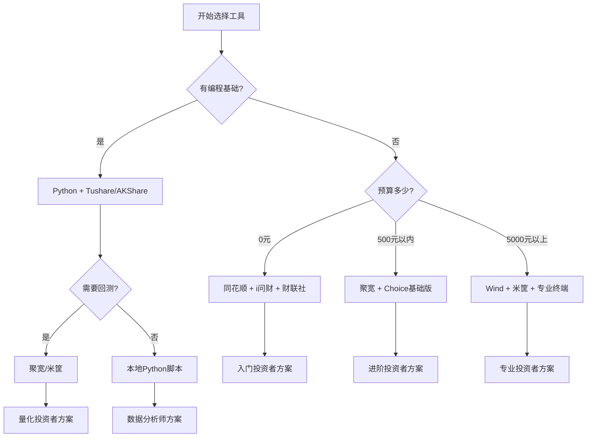

## 六、实用工具推荐

工欲善其事，必先利其器。在股票投资中，选择合适的工具能大幅提升分析效率、降低信息不对称、帮助执行交易纪律。本章系统梳理从选股、分析、交易到风控的全流程工具体系，帮助不同阶段的投资者找到最适合自己的工具组合。

---

### 1. 选股工具：从海量股票中筛选目标

#### 1.1 专业选股平台

**i问财（同花顺旗下）**

i问财是目前国内最强大的自然语言选股工具，支持用中文描述条件进行筛选：

| 功能 | 说明 | 适用场景 |
|------|------|----------|
| 自然语言选股 | 输入"连续3年ROE>15%且市盈率<20"即可筛选 | 价值投资者快速筛选 |
| 财务指标筛选 | 支持200+财务指标组合 | 深度基本面分析 |
| 技术指标筛选 | 均线、MACD、KDJ等技术条件 | 技术面选股 |
| 行业对比 | 同行业公司横向比较 | 行业研究 |

**使用示例：**

```text
# 在 i问财 输入以下条件
连续5年净利润增长率>20%
且毛利率>40%
且资产负债率<50%
且市盈率<30
且市值>100亿
```

**东方财富选股器**

东方财富的选股器覆盖面广，支持条件组合筛选：

- 基本面条件：PE、PB、ROE、净利润增长率等
- 技术面条件：股价位置、成交量、均线关系
- 资金面条件：主力资金流向、北向资金持仓
- 消息面条件：机构调研、股东增减持

**雪球选股器**

雪球的优势在于社区数据与选股结合：

- 可以看到其他投资者的选股逻辑
- 支持按持仓集中度筛选（机构持仓比例）
- 提供个股的社区讨论热度作为参考

#### 1.2 免费开源选股工具

**Tushare（Python金融数据接口）**

Tushare是国内最流行的免费金融数据API，适合有编程基础的投资者：

```python
import tushare as ts

# 初始化（需要注册获取token）
ts.set_token('你的token')
pro = ts.pro_api()

# 获取股票基本信息
stocks = pro.stock_basic(exchange='', list_status='L',
                         fields='ts_code,symbol,name,area,industry,market')

# 获取财务指标
df = pro.fina_indicator(ts_code='600519.SH', 
                        start_date='20200101',
                        end_date='20231231')

# 筛选ROE>15%的股票
high_roe = df[df['roe'] > 15]

# 获取每日行情
daily = pro.daily(ts_code='600519.SH', start_date='20230101')
```

**AKShare（另一个优秀的Python数据源）**

```python
import akshare as ak

# 获取A股实时行情
df = ak.stock_zh_a_spot_em()

# 筛选条件
filtered = df[
    (df['市盈率-动态'] > 0) & 
    (df['市盈率-动态'] < 20) &
    (df['总市值'] > 10000000000)  # 市值>100亿
]

# 获取个股历史数据
hist = ak.stock_zh_a_hist(symbol="600519", 
                          start_date="20230101",
                          end_date="20231231", 
                          adjust="qfq")
```

#### 1.3 选股工具对比

| 工具 | 价格 | 编程要求 | 数据质量 | 适合人群 |
|------|------|----------|----------|----------|
| i问财 | 免费/付费 | 无需 | 高 | 所有投资者 |
| 东方财富选股器 | 免费 | 无需 | 高 | 所有投资者 |
| 雪球选股器 | 免费 | 无需 | 中 | 价值投资者 |
| Tushare | 免费/积分 | Python | 高 | 量化投资者 |
| AKShare | 免费 | Python | 高 | 量化投资者 |
| Wind | 付费（年费数万） | 可选 | 最高 | 专业机构 |
| Choice | 付费 | 可选 | 高 | 专业投资者 |

---

### 2. 行情与数据平台

#### 2.1 免费行情软件

**同花顺**

同花顺是A股市场占有率最高的免费行情软件：

核心功能：
- Level-2行情（付费）：十档买卖盘、逐笔成交、大单统计
- 问财AI：自然语言查询股票信息
- 智能盯盘：设置条件预警，满足条件自动提醒
- 模拟交易：零成本练习交易策略

**东方财富**

东方财富的优势在于数据全面且免费：

- 股吧社区：了解市场情绪和投资者观点
- 研报中心：免费查看券商研究报告摘要
- 数据中心：财务数据、行业数据、宏观数据
- 东方财富APP：移动端体验优秀

**通达信**

通达信是技术派投资者的首选：

- 公式编辑器：支持自定义技术指标
- 选股器：支持技术指标条件选股
- 预警系统：实时监控满足条件的股票
- 历史数据完整：支持导出历史行情数据

#### 2.2 专业数据终端

**Wind（万得）**

Wind是机构投资者的标配工具，数据覆盖最全：

- 全球市场数据：A股、港股、美股、债券、基金、期货
- 宏观经济数据：GDP、CPI、PMI等宏观指标
- 公司深度数据：财务报表、股东结构、关联交易
- 量化分析：支持Python、Excel插件调用

缺点：年费数万元，个人投资者成本较高。

**Choice（东方财富）**

Choice是Wind的平价替代品：

- 数据覆盖面接近Wind
- 价格更亲民（年费数千元）
- 与东方财富生态整合良好
- 适合中小机构和个人专业投资者

#### 2.3 免费宏观数据源

| 数据源 | 网址 | 数据类型 |
|--------|------|----------|
| 国家统计局 | stats.gov.cn | GDP、CPI、PPI等 |
| 中国人民银行 | pbc.gov.cn | 货币供应量、利率 |
| 中国证监会 | csrc.gov.cn | 政策法规、市场数据 |
| 巨潮资讯 | cninfo.com.cn | 上市公司公告、财报 |
| Tushare | tushare.pro | A股全量数据 |

---

### 3. 技术分析工具

#### 3.1 图表分析平台

**TradingView**

TradingView是全球最受欢迎的在线图表分析平台：

优势：
- 社区驱动：数百万用户分享交易想法和指标
- 跨市场覆盖：股票、外汇、加密货币、期货
- 云端保存：图表和设置跨设备同步
- 策略回测：Pine Script语言支持策略开发

```pine
// TradingView Pine Script 示例：双均线策略
//@version=5
strategy("双均线策略", overlay=true)

fast_length = input(10, "快速均线周期")
slow_length = input(30, "慢速均线周期")

fast_ma = ta.sma(close, fast_length)
slow_ma = ta.sma(close, slow_length)

if ta.crossover(fast_ma, slow_ma)
    strategy.entry("买入", strategy.long)

if ta.crossunder(fast_ma, slow_ma)
    strategy.close("买入")

plot(fast_ma, color=color.blue)
plot(slow_ma, color=color.red)
```

**同花顺/通达信公式编辑器**

对于A股投资者，同花顺和通达信的公式编辑器更实用：

```text
{通达信公式示例：MACD金叉选股}
DIF:=EMA(CLOSE,12)-EMA(CLOSE,26);
DEA:=EMA(DIF,9);
MACD:=(DIF-DEA)*2;

{金叉条件}
金叉:=CROSS(DIF,DEA) AND DIF<0;

{选股条件}
选股:金叉 AND VOL>MA(VOL,5)*1.5;
```

#### 3.2 量化回测平台

**聚宽（JoinQuant）**

聚宽是国内最成熟的量化回测平台：

- 支持Python编程
- 提供A股历史数据
- 支持股票、基金、期货回测
- 社区策略分享

```python
# 聚宽量化回测示例
def initialize(context):
    set_benchmark('000300.XSHG')
    set_option('use_real_price', True)
    
def handle_data(context, data):
    # 获取股票池
    stocks = get_fundamentals(
        query(valuation.code, valuation.pe_ratio, 
              valuation.pb_ratio, indicator.roe)
        .filter(valuation.pe_ratio > 0)
        .filter(valuation.pe_ratio < 20)
        .filter(indicator.roe > 15)
        .order_by(indicator.roe.desc())
        .limit(10)
    )
    
    # 持仓股票
    holding = context.portfolio.positions.keys()
    
    # 卖出不在目标列表的股票
    for stock in holding:
        if stock not in stocks['code'].values:
            order_target(stock, 0)
    
    # 买入目标股票
    if len(stocks) > 0:
        cash = context.portfolio.cash
        per_stock = cash / len(stocks)
        for stock in stocks['code'].values:
            order_value(stock, per_stock)
```

**米筐（RiceQuant）**

米筐的特点是数据质量高、回测速度快：

- 毫秒级回测引擎
- 覆盖A股、港股、美股
- 支持分钟级策略
- 机构级数据质量

**优矿（Uqer）**

优矿的优势在于因子分析：

- 内置100+量化因子
- 支持多因子模型构建
- 提供风险模型和归因分析
- 适合多因子选股策略

#### 3.3 回测工具对比

| 平台 | 价格 | 编程语言 | 数据质量 | 适合人群 |
|------|------|----------|----------|----------|
| 聚宽 | 免费/付费 | Python | 高 | 入门量化 |
| 米筐 | 付费 | Python | 最高 | 专业量化 |
| 优矿 | 付费 | Python | 高 | 因子研究 |
| Backtrader | 免费 | Python | 自备 | 技术开发者 |
| Zipline | 免费 | Python | 自备 | 海外市场 |

---

### 4. 财经资讯与研报

#### 4.1 免费资讯平台

**财联社**

财联社是A股最快的电报式资讯平台：

- 7×24小时快讯
- 政策解读及时
- 影响股价的消息第一时间推送
- 免费使用

**东方财富新闻**

东方财富新闻覆盖面广：

- 公司公告解读
- 行业动态
- 宏观政策
- 机构观点

**巨潮资讯网**

巨潮资讯是证监会指定的上市公司信息披露平台：

- 所有上市公司公告原文
- 财报PDF下载
- 股东变动信息
- 权威性最高

#### 4.2 研报获取渠道

| 渠道 | 费用 | 内容质量 | 说明 |
|------|------|----------|------|
| 慧博投研 | 免费/付费 | 高 | 研报聚合平台 |
| 东方财富研报 | 免费 | 中高 | 摘要免费，全文付费 |
| 同花顺研报 | 免费 | 中高 | 部分免费阅读 |
| Wind | 付费 | 最高 | 机构标配 |
| 券商APP | 开户免费 | 高 | 需在该券商开户 |

#### 4.3 如何高效阅读研报

研报阅读框架：

```text
1. 先看结论：投资评级和目标价
2. 核心逻辑：3-5个支撑论点
3. 财务预测：未来3年盈利预测
4. 风险提示：可能出错的地方
5. 底层数据：关键假设是否合理
```

常见研报陷阱：
- 只看利好不看利空
- 目标价基于过于乐观的假设
- 财务预测缺乏依据
- 忽视行业周期风险

---

### 5. 交易执行工具

#### 5.1 券商APP选择标准

选择券商APP的核心考量：

| 维度 | 重要性 | 说明 |
|------|--------|------|
| 佣金费率 | 高 | 万1-万3为合理区间 |
| 交易速度 | 高 | 打板、抢单需要快速成交 |
| 稳定性 | 高 | 行情高峰期不能崩溃 |
| 条件单功能 | 中 | 支持自动止盈止损 |
| 量化接口 | 中 | 程序化交易需求 |

#### 5.2 主流券商APP对比

**华泰证券（涨乐财富通）**
- 佣金：万1.3（可协商更低）
- 优势：条件单功能强大，支持智能盯盘
- 适合：需要条件单功能的投资者

**中信证券（信e投）**
- 佣金：万2.5（可协商）
- 优势：研报质量高，投顾服务好
- 适合：需要投顾服务的投资者

**东方财富证券**
- 佣金：万2.5
- 优势：与东方财富生态打通，数据丰富
- 适合：重度使用东方财富的投资者

**同花顺（支持多券商登录）**
- 优势：界面美观，功能全面
- 注意：行情刷新可能有延迟
- 适合：习惯同花顺界面的投资者

#### 5.3 条件单与智能交易

条件单是执行交易纪律的重要工具：

```text
止损条件单示例：
- 触发条件：股价跌破买入价的8%
- 执行动作：市价卖出全部持仓
- 有效期：长期有效

追踪止盈示例：
- 触发条件：股价从最高点回撤5%
- 执行动作：市价卖出全部持仓
- 适合趋势股持有阶段

定时定投示例：
- 执行频率：每周一
- 投资标的：沪深300ETF
- 投资金额：1000元/次
```

---

### 6. 投资组合管理工具

#### 6.1 记账与持仓管理

**雪球组合**

雪球组合是最流行的免费持仓管理工具：

- 支持多账户管理
- 自动计算收益率
- 与社区互动分享
- 支持港股、美股

**且慢**

且慢是专注基金投资的组合管理工具：

- 基金组合构建
- 智能定投策略
- 收益归因分析
- 适合基金投资者

**Excel/Google Sheets**

对于需要高度自定义的投资者，Excel是最佳选择：

```excel
// Excel投资组合跟踪模板
A列: 股票代码
B列: 股票名称
C列: 买入价格
D列: 持有数量
E列: 当前价格（通过GOOGLEFINANCE函数自动更新）
F列: 持仓市值 = D列 * E列
G列: 浮动盈亏 = (E列 - C列) * D列
H列: 收益率 = (E列 - C列) / C列
I列: 仓位占比 = F列 / SUM(F:F)

// Google Sheets自动获取股价
=GOOGLEFINANCE("600519.SS", "price")
```

#### 6.2 绩效分析工具

投资绩效分析的关键指标：

| 指标 | 计算方法 | 意义 |
|------|----------|------|
| 年化收益率 | (期末/期初)^(365/天数)-1 | 衡量绝对收益 |
| 最大回撤 | (最高点-最低点)/最高点 | 衡量风险 |
| 夏普比率 | (收益率-无风险利率)/波动率 | 风险调整后收益 |
| 索提诺比率 | (收益率-无风险利率)/下行波动率 | 下行风险调整收益 |
| 胜率 | 盈利次数/总交易次数 | 策略稳定性 |
| 盈亏比 | 平均盈利/平均亏损 | 单笔交易质量 |

---

### 7. 学习与社区工具

#### 7.1 投资学习平台

**雪球**

雪球是国内最大的投资者社区：

- 优质投资者分享实战经验
- 个股深度分析文章
- 投资组合透明可查
- 适合学习投资逻辑

**集思录**

集思录专注低风险投资：

- 可转债数据最全
- 分级基金套利
- 打新股收益计算
- 适合保守型投资者

**淘股吧**

淘股吧是短线交易者的聚集地：

- 游资大佬分享打板经验
- 每日涨停复盘
- 龙头股战法讨论
- 适合短线交易者

#### 7.2 经典投资书籍

入门阶段：
- 《聪明的投资者》——本杰明·格雷厄姆
- 《股票作手回忆录》——埃德温·勒菲弗
- 《漫步华尔街》——伯顿·马尔基尔

进阶阶段：
- 《证券分析》——本杰明·格雷厄姆
- 《巴菲特致股东的信》——沃伦·巴菲特
- 《彼得·林奇的成功投资》——彼得·林奇

高级阶段：
- 《投资最重要的事》——霍华德·马克斯
- 《金融心理学》——拉斯·特维德
- 《周期》——霍华德·马克斯

---

### 8. 工具组合推荐

#### 8.1 入门投资者（0-1年经验）

推荐工具组合：
- 行情软件：同花顺（免费）
- 选股工具：i问财（免费）
- 资讯平台：财联社（免费）
- 券商APP：华泰证券（条件单好用）
- 学习社区：雪球
- 总成本：0元

#### 8.2 进阶投资者（1-3年经验）

推荐工具组合：
- 行情软件：同花顺 + 通达信
- 数据平台：Tushare/AKShare（免费）
- 回测平台：聚宽（免费版）
- 研报平台：东方财富 + 慧博投研
- 券商APP：华泰证券
- 总成本：0-500元/年

#### 8.3 专业投资者（3年以上经验）

推荐工具组合：
- 数据终端：Choice（年费约3000元）
- 量化平台：聚宽/米筐（年费1000-5000元）
- 研报平台：Wind（年费数万元）
- 券商APP：华泰 + 中信（多账户）
- 总成本：5000-30000元/年

#### 8.4 工具选择决策流程



---

### 9. 工具使用误区与风险

#### 9.1 常见工具使用误区

**误区一：过度依赖技术指标**

问题：认为某个指标能预测市场，频繁交易。

正确做法：技术指标是概率工具，需要结合多个指标和市场环境综合判断。单一指标的胜率通常不超过60%。

**误区二：迷信回测结果**

问题：看到回测收益很高就认为策略有效。

正确做法：
- 检查是否有过度拟合（参数是否过于特定）
- 验证样本外数据表现
- 考虑交易成本和滑点
- 注意幸存者偏差

**误区三：信息过载**

问题：同时使用太多资讯平台，反而干扰决策。

正确做法：选择2-3个核心信息源，建立信息筛选机制，只关注与自己投资策略相关的信息。

**误区四：忽视工具成本**

问题：购买昂贵的数据终端，但使用率很低。

正确做法：先用免费工具验证需求，确认需要后再付费升级。

#### 9.2 工具安全风险

使用第三方工具的安全注意事项：

- 不要在非官方渠道下载炒股软件
- 谨慎授权第三方工具访问券商账户
- 定期修改密码，开启双重验证
- 不要在公共网络环境下交易
- 备份重要数据和策略代码

---

### 10. 本节小结

工具是投资的放大器，但不是投资本身。选择工具的核心原则：

1. **匹配阶段**：初学者用简单工具，专家用专业工具
2. **效率优先**：选择能提升分析效率的工具，而非功能最多的
3. **成本可控**：免费工具能满足大部分需求，付费前先验证价值
4. **数据为王**：工具再好，数据质量差也没用
5. **执行纪律**：最好的工具是能帮你执行交易纪律的工具

记住：**工具服务于策略，策略服务于目标**。不要为了用工具而用工具，而是为了解决具体的投资问题而选择工具。
