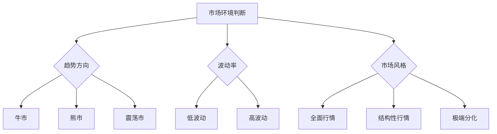
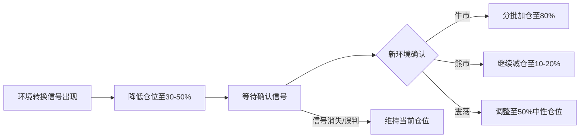

## 七、不同市场环境下的操作策略

股票市场并非永远只有一种面貌。同样的股票、同样的技术指标，在牛市中可能是买入信号，在熊市中却可能是陷阱。许多投资者亏损的根本原因不是选错了股票，而是用错了策略——在应该防守的时候进攻，在应该进攻的时候恐惧。

本章系统梳理A股市场四种核心环境的识别方法和对应操作策略，帮助你在任何市场状态下都能找到合适的应对方式。

---

### 1. 为什么要区分市场环境

#### 1.1 "牛市赚不到钱，熊市亏大钱"的根源

很多散户有一个经典困境：牛市初期不敢买，中期小赚就跑，末期满仓杀入；熊市初期死扛，中期补仓摊薄，末期绝望割肉。这个循环的根源在于：**没有对当前市场环境做出判断，用一成不变的策略应对变化的市场**。

| 投资者类型 | 牛市表现 | 熊市表现 | 震荡市表现 |
|-----------|---------|---------|-----------|
| 永远满仓型 | 赚大钱 | 亏大钱 | 小赚小亏 |
| 永远空仓型 | 完全踏空 | 不亏钱 | 无收益 |
| 追涨杀跌型 | 频繁换股 | 反复止损 | 双向亏损 |
| **环境适应型** | **趋势持股** | **轻仓观望** | **高抛低吸** |

最后一行才是正确答案：**根据市场环境调整策略，而不是用一套策略应对所有行情**。

#### 1.2 市场环境的划分标准

从不同维度可以对市场环境做多种划分：

**按趋势方向划分：**
- **牛市（上升趋势）**：指数持续走高，高点和低点都不断上移
- **熊市（下降趋势）**：指数持续走低，高点和低点都不断下移
- **震荡市（无趋势）**：指数在一定区间内反复波动，无明确方向

**按波动率划分：**
- **低波动环境**：日涨跌幅通常在1%以内，成交量萎缩
- **高波动环境**：日涨跌幅频繁超过3%，成交量放大，市场情绪剧烈

**按市场风格划分：**
- **结构性行情**：只有部分板块上涨，其他板块原地不动甚至下跌
- **全面行情**：绝大多数股票同涨同跌
- **极端分化行情**：少数权重股上涨带动指数，多数个股下跌（或反之）



实际操作中，趋势方向是最核心的判断维度，波动率和风格是辅助维度。以下分别展开。

---

### 2. 牛市环境：趋势为王，持股待涨

#### 2.1 牛市的识别特征

牛市并非"涨了就是牛市"，需要满足多个条件同时成立：

**技术面信号：**
- 上证指数站上60日均线且60日均线向上
- 20日、60日、120日均线呈多头排列（短在上、长在下）
- 指数回调不跌破前一个低点，每次反弹都能创新高
- 成交量较前期低点放大50%以上并持续维持

**基本面信号：**
- 货币政策宽松（降准降息周期中）
- 企业盈利增速触底回升（EPS拐点）
- 政策面释放积极信号（如"活跃资本市场"等高层表态）

**情绪面信号：**
- 新开户数持续增加
- 融资余额稳步上升
- 基金发行规模扩大，爆款基金频现
- 出租车司机、理发师开始聊股票（牛市中后期信号）

**A股历史牛市参考：**

| 牛市周期 | 上证区间 | 持续时间 | 涨幅 | 驱动因素 |
|---------|---------|---------|------|---------|
| 2005.6-2007.10 | 998→6124 | ~28个月 | +514% | 股改+流动性泛滥 |
| 2008.10-2009.8 | 1664→3478 | ~10个月 | +109% | 四万亿刺激 |
| 2014.7-2015.6 | 2050→5178 | ~11个月 | +153% | 杠杆资金+改革预期 |
| 2019.1-2021.2 | 2440→3731 | ~25个月 | +53% | 核心资产+外资流入 |

#### 2.2 牛市操作策略

**核心原则：趋势持股，不轻易下车。**

**仓位管理：**
- 牛市初期（确认阶段）：50%-70%仓位，分批建仓
- 牛市中期（主升阶段）：80%-90%仓位，保持满仓运行
- 牛市末期（疯狂阶段）：逐步减仓至50%以下

**选股策略：**

牛市不同阶段，领涨板块不同，选股思路也不同：

| 阶段 | 特征 | 领涨板块 | 选股要点 |
|------|------|---------|---------|
| 牛市初期 | 信心恢复，资金试探 | 券商、银行、保险等金融股 | 选弹性大的券商股，PB低的银行股 |
| 牛市中期 | 盈利驱动，主升浪 | 消费、科技、周期龙头 | 选业绩增速最快、PEG<1的品种 |
| 牛市末期 | 情绪疯狂，炒概念 | 妖股、次新股、壳资源 | 极度危险，应该离场而非参与 |

**具体操作要点：**

1. **持股为主，减少交易频率**。牛市中最大的风险是"卖飞"——好不容易买到牛股，一洗盘就被震出去。设定止损线可以宽松一些（如跌破20日均线减半仓），不要因为日内波动就频繁操作。

2. **不轻易做T**。在主升浪阶段，日内做T很容易在高抛之后接不回来，错过后面更大的涨幅。

3. **关注龙头股**。牛市中板块龙头的涨幅通常是板块平均涨幅的2-3倍。比如2019-2021年的白酒行情中，茅台涨了约4倍，而很多二三线白酒股只涨了1-2倍。

4. **利用回调加仓**。牛市中的回调（通常5%-10%）是加仓良机，而不是恐慌卖出的理由。回调到20日均线附近是常见的加仓点。

#### 2.3 牛市常见陷阱

**陷阱一：过早下车**
看到盈利20%-30%就急着卖出，结果后面还有200%的涨幅。对策：设定趋势跟踪止盈（如跌破60日均线才考虑卖出），而不是固定百分比止盈。

**陷阱二：追高买入后被套**
牛市末期追涨已经涨了5倍以上的股票。对策：设定买入纪律，不买PE超过行业均值2倍的股票，不买连续涨停的妖股。

**陷阱三：频繁换股**
看到别的股票涨得快就换过去，结果两头挨打。对策：选定2-3只核心持仓，不动如山；卫星仓位可以适当灵活。

**陷阱四：加杠杆**
牛市中后期看到赚钱太容易，开始融资加杠杆。2015年的惨痛教训告诉我们，杠杆在牛市末期的暴跌中会让你血本无归。对策：**永远不要在牛市中后期加杠杆**。

---

### 3. 熊市环境：现金为王，防守反击

#### 3.1 熊市的识别特征

**技术面信号：**
- 上证指数跌破60日均线且60日均线向下
- 均线呈空头排列（长在上、短在下）
- 反弹无法突破前一个高点，每次下跌都会创新低
- 放量下跌、缩量反弹（典型的空头量价结构）

**基本面信号：**
- 经济数据持续走弱（PMI连续低于50）
- 企业盈利增速下滑，业绩地雷频发
- 货币政策虽宽松但传导不畅（"流动性陷阱"）

**情绪面信号：**
- 新开户数骤降，存量资金持续流出
- 融资余额大幅下降
- 基金赎回潮，新基金发行困难
- "股市是骗人的"成为社交媒体主流声音

**A股历史熊市参考：**

| 熊市周期 | 上证区间 | 持续时间 | 跌幅 | 核心原因 |
|---------|---------|---------|------|---------|
| 2007.10-2008.10 | 6124→1664 | ~12个月 | -73% | 全球金融危机 |
| 2010.11-2012.12 | 3186→1949 | ~25个月 | -39% | 经济转型阵痛 |
| 2015.6-2016.1 | 5178→2638 | ~7个月 | -49% | 杠杆破裂+熔断 |
| 2018.1-2019.1 | 3587→2440 | ~12个月 | -32% | 去杠杆+中美贸易战 |

#### 3.2 熊市操作策略

**核心原则：保住本金是第一要务，现金是最好的仓位。**

**仓位管理：**
- 熊市初期（确认阶段）：降至30%以下仓位
- 熊市中期（恐慌阶段）：10%-20%仓位，或完全空仓
- 熊市末期（绝望阶段）：开始试探性建仓，10%-30%

**三个层级的防守策略：**

**第一层：减少操作，控制仓位**
熊市中赚钱的难度是牛市的10倍以上。与其反复尝试抄底被套，不如直接降低仓位。宁可少赚，不可大亏。熊市中亏50%，需要涨100%才能回本。

**第二层：严格止损**
熊市中止损线要比牛市严格得多：
- 个股亏损达到7%-8%立即止损（牛市中可以放宽到10%-15%）
- 破位即走，不抱幻想
- 不补仓摊薄（熊市中越补越低是常态）

**第三层：切换防御品种**
如果不想完全空仓，可以选择以下防御性资产：

| 防御品种 | 优势 | 劣势 | 适用场景 |
|---------|------|------|---------|
| 国债/国债ETF | 与股市负相关，安全 | 收益率有限 | 长期配置 |
| 高股息蓝筹 | 分红收益+估值支撑 | 可能跟随下跌 | 价值投资者 |
| 货币基金 | 零风险，随时可用 | 收益极低 | 过渡期资金存放 |
| 黄金ETF | 避险属性 | 波动性较大 | 地缘风险加剧时 |

**熊市中的逆向布局：**

熊市不是什么都不做的时候，而是为下一轮牛市播种的时候。关键是要有耐心，分批建仓，不急于抄底：

1. **识别优质标的**。在熊市中观察哪些股票抗跌、基本面扎实，这些就是下一轮牛市的种子选手。
2. **设定买入价格区间**。根据历史估值百分位，在PE低于历史30%分位时开始分批买入。
3. **金字塔式建仓**。价格越低买入越多，但总仓位不超过计划的50%（留足子弹应对更极端的下跌）。

#### 3.3 熊市常见陷阱

**陷阱一：死扛不止损**
"已经跌了30%，不可能再跌了吧？"——事实上，从高点跌50%甚至70%在A股并不罕见。对策：任何个股亏损超过15%，无条件卖出。

**陷阱二：频繁抄底**
每次大跌都觉得是底，结果一次次被套。对策：等趋势确认（如放量突破60日均线、政策底确认后再等市场底）再入场。

**陷阱三：听消息博弈反弹**
"某某说要反弹了"、"政策利好要大涨了"。对策：熊市中的利好反弹通常只有1-3天，是减仓的机会而非加仓的信号。

**陷阱四：借钱炒股/加杠杆**
熊市中加杠杆是最危险的行为。2015年股灾中，无数融资盘被强制平仓，从百万富翁变成负债累累。对策：**熊市中绝对不加杠杆，有杠杆的先去杠杆**。

---

### 4. 震荡市环境：高抛低吸，灵活应对

#### 4.1 震荡市的识别特征

震荡市是A股最常见的市场环境，持续时间往往比牛市和熊市都长。

**技术面信号：**
- 指数在一个区间内反复波动（如上证3000-3500点）
- 均线纠缠，20日和60日均线频繁交叉
- 没有持续性趋势，涨几天就跌，跌几天就涨
- 成交量忽大忽小，缺乏持续放量或缩量的特征

**基本面信号：**
- 经济数据好坏参半
- 政策面不明确，既有利好也有利空
- 资金面中性，没有明显的增量资金入场或流出

**情绪面信号：**
- 投资者分歧大，看多和看空的声音都有
- 板块快速轮动，没有持续主线
- 赚钱效应时有时无，整体偏弱

#### 4.2 震荡市操作策略

**核心原则：不追涨不杀跌，在区间内做高抛低吸。**

震荡市的操作难度其实比牛市和熊市都高，因为市场方向不明确，很容易两边打脸。核心策略是**控制仓位、降低预期、灵活波段**。

**仓位管理：**
- 保持40%-60%的中性仓位
- 接近区间上沿时降至30%-40%
- 接近区间下沿时升至60%-70%

**操作方法一：网格交易**

网格交易是震荡市中最适合的量化策略之一。基本原理是将价格区间划分为若干网格，每下跌一格买入一份，每上涨一格卖出一份。

```text
示例：某ETF在3.0-3.6元之间震荡

网格设置（每格3%）：
  3.60 ── 卖出第5份
  3.49 ── 卖出第4份
  3.39 ── 卖出第3份
  3.29 ── 卖出第2份
  3.19 ── 卖出第1份
  ────── 中轴线（3.10）
  3.01 ── 买入第1份
  2.92 ── 买入第2份
  2.83 ── 买入第3份

每份金额：总资金的10%
单次收益：约3%（扣除手续费后约2.5%）
```

网格交易的优势是不需要判断方向，只需要确认震荡区间存在。劣势是一旦突破区间，可能面临踏空（向上突破）或被套（向下突破）。因此需要设好整体止损线。

**操作方法二：技术指标辅助波段**

震荡市中，以下技术指标比较有效：

| 指标 | 用法 | 参数建议 | 适用场景 |
|------|------|---------|---------|
| RSI | <30买入，>70卖出 | 14日 | 区间震荡明显时 |
| 布林带 | 触及下轨买入，触及上轨卖出 | 20日，2倍标准差 | 波动率稳定时 |
| MACD | 金叉买入，死叉卖出 | 12-26-9 | 趋势初现时 |
| KDJ | <20金叉买入，>80死叉卖出 | 9-3-3 | 短线波段 |

注意：震荡市中不要只看单一指标，至少两个指标同时发出信号才行动。

**操作方法三：板块轮动**

震荡市中资金往往在不同板块间快速轮动。跟踪资金流向，在板块启动初期介入、在高潮期退出，可以获取超额收益。

轮动规律（A股常见模式）：
1. 金融+地产先行（政策预期驱动）
2. 周期股跟上（经济复苏预期）
3. 消费股接力（业绩确定性）
4. 科技股活跃（成长预期）
5. 防御性板块收尾（资金避险）

#### 4.3 震荡市常见陷阱

**陷阱一：追涨杀跌**
看到某个板块涨了就追进去，结果刚好买在高点。对策：严格遵守"涨不追、跌不怕"的原则，在支撑位买入、阻力位卖出。

**陷阱二：频繁交易**
震荡市中每天都有涨跌，很容易产生"每天都能赚钱"的幻觉，导致过度交易。对策：控制每周交易次数不超过2-3次，每次交易前写下买入理由和止损/止盈计划。

**陷阱三：突破假信号**
震荡市中经常出现假突破——看起来要向上突破了，追进去结果又跌回来。对策：等突破确认（连续3天站稳、放量突破、回踩不破）再跟进，宁可少吃一段利润也不要被假突破套住。

---

### 5. 高波动环境：控制风险，等待明确信号

#### 5.1 高波动环境的识别

高波动环境通常出现在以下时期：
- 重大政策发布前后（如两会、中央经济工作会议）
- 外部冲击事件（如贸易战升级、地缘冲突、疫情暴发）
- 市场拐点附近（牛市转熊市或熊市转牛市的过渡期）
- 流动性危机（如2015年杠杆破裂、2020年3月全球恐慌）

**量化识别指标：**
- 沪深300波动率指数（中国波指/iVIX）突破25
- 上证指数连续多日涨跌幅超过2%
- 涨跌停个股数量大幅增加（单日超过100只）
- 两市成交额突然放大至日均的2倍以上

#### 5.2 高波动环境操作策略

**核心原则：缩小仓位，放大止损，减少交易频率。**

高波动环境下，常规的技术分析和估值模型都会失效，价格可以大幅偏离价值。此时最重要的是**活下来**，而不是赚钱。

**具体策略：**

1. **降低仓位至30%以下**。高波动意味着高不确定性，轻仓是最好的防御。

2. **放大止损区间**。正常波动率下止损设在7%-8%，高波动环境下应该放宽到12%-15%，否则很容易被正常波动震出去。

3. **避免使用杠杆**。高波动环境下，杠杆交易的风险成倍放大。一个10%的日内波动就可能让2倍杠杆的仓位触发平仓。

4. **关注尾部风险管理**。极端波动下，黑天鹅事件的概率大幅增加。用小仓位买入认沽期权（如果有的话）或反向ETF作为对冲。

5. **等待波动率回归**。当波动率指数从高位开始回落，且市场出现明确的趋势信号后，再逐步恢复正常仓位。

**高波动环境中的机会：**

高波动不全是风险，也蕴含机会：

- **恐慌性超跌反弹**：当市场因恐慌出现非理性暴跌（如沪深300单日跌幅超过5%），优质个股被错杀时，可以在暴跌当日尾盘或次日以极小仓位（5%-10%）抄底，通常1-3天内会有2%-5%的反弹。
- **波动率交易**：如果开通了期权交易权限，可以在波动率高位卖出跨式期权（做空波动率），因为高波动率通常不会持续太久。
- **可转债机会**：高波动环境下，跌破面值的可转债（100元以下）有债底保护，下跌空间有限，上涨弹性大。

#### 5.3 高波动环境常见陷阱

**陷阱一：恐慌性卖出**
市场暴跌时恐慌清仓，结果卖在最低点。对策：提前制定应急计划——如果市场暴跌X%，我将执行什么操作——然后严格执行，不做临时决策。

**陷阱二：盲目抄底**
暴跌当天就重仓抄底。对策：暴跌不言底，等企稳信号（如连续2天不创新低、成交量萎缩到暴跌日的一半以下）再小仓位试探。

**陷阱三：忽略流动性风险**
高波动环境下，很多小盘股可能出现流动性枯竭——挂单无法成交、跌停板卖不出去。对策：只交易日均成交额在5000万以上的个股，避免流动性差的小盘股。

---

### 6. 结构性行情：选对赛道比选股更重要

#### 6.1 什么是结构性行情

结构性行情是指市场整体指数没有太大变化，但部分板块或主题出现持续性上涨，而其他板块持续低迷。这是近十年A股最常见的行情模式。

**典型案例：**
- 2019-2021年：白酒、新能源、半导体大涨，地产、银行原地踏步
- 2022-2023年：AI、中特估主题活跃，消费、医药持续走弱
- 2024-2025年：科技自主可控、AI应用主题活跃，传统行业分化

#### 6.2 结构性行情操作策略

**核心原则：选对赛道，然后在赛道内选股。**

结构性行情中，最致命的错误是"满仓踏空"——买了不涨的板块，眼睁睁看着其他板块涨上天。

**赛道选择的四个维度：**

1. **政策维度**：国家战略支持的方向（如半导体自主可控、人工智能、新能源）
2. **资金维度**：北向资金和主力资金持续流入的板块
3. **景气维度**：行业景气度向上（订单增长、业绩增速加快）
4. **估值维度**：估值处于合理区间（不超过历史70%分位）

四个维度中至少满足3个，才值得重仓。

**操作要点：**

- **集中持仓**：结构性行情中，把60%-80%的仓位集中在1-2个核心赛道，不要分散到5-6个板块。
- **跟踪龙头**：赛道内选龙头公司（市值最大、业绩最好、机构持仓最多），龙头的确定性和持续性都更强。
- **耐心持有**：结构性行情的持续时间通常在6-18个月，不要因为短期波动就轻易下车。
- **及时切换**：当核心赛道的估值达到历史80%分位以上、行业景气度开始边际下降、政策出现转向信号时，果断切换到下一个赛道。

---

### 7. 市场环境转换的识别与应对

#### 7.1 转换信号

市场环境不会突然切换，通常会有一些先行信号：

| 转换类型 | 先行信号 | 确认信号 |
|---------|---------|---------|
| 熊市→牛市 | 政策底出现（如降准降息、国家队入场）| 市场底确认（放量突破60日均线且不回破）|
| 牛市→熊市 | 高位放量滞涨、龙头股破位 | 指数跌破60日均线且无法快速收回 |
| 震荡→趋势 | 成交量持续放大、均线开始发散 | 连续3周站在区间外不回归 |
| 低波动→高波动 | 波动率指数从低位开始抬升 | 单日涨跌幅突破2% |

#### 7.2 转换期的操作策略

**关键原则：宁可慢半拍确认，不要抢半拍入场。**

环境转换期是最危险的阶段——旧策略不再有效，新策略尚未确立。此时应该：

1. **降低仓位**：不管从什么环境转换到什么环境，先降到30%-50%仓位。
2. **缩小持仓范围**：只保留最有信心的1-2只股票。
3. **等待确认**：等新环境的特征明确后再调整策略。
4. **分批调整**：不要一次性从满仓切到空仓（或反之），分3-5次调整到位。



---

### 8. 不同市场环境下的工具箱

#### 8.1 牛市工具箱

| 工具 | 用途 | 使用场景 |
|------|------|---------|
| 趋势均线系统（20/60/120日） | 判断趋势和支撑位 | 持股跟踪 |
| 乖离率（BIAS） | 判断短期超买超卖 | 回调加仓时机 |
| 板块资金流向 | 发现领涨板块 | 换股决策 |
| 融资余额数据 | 监控杠杆风险 | 牛市末期风险预警 |

#### 8.2 熊市工具箱

| 工具 | 用途 | 使用场景 |
|------|------|---------|
| 估值百分位（PE/PB） | 判断底部区域 | 分批建仓参考 |
| 恐慌指数/波动率 | 量化恐慌程度 | 判断极端底部 |
| 北向资金净流入 | 监控外资动向 | 跟踪聪明钱 |
| 国债收益率 | 判断大类资产配置 | 股债切换参考 |

#### 8.3 震荡市工具箱

| 工具 | 用途 | 使用场景 |
|------|------|---------|
| 布林带 | 判断波动区间 | 高抛低吸参考 |
| RSI/KDJ | 超买超卖信号 | 波段买卖点 |
| 网格交易条件单 | 自动化高抛低吸 | 减少情绪干扰 |
| 板块轮动指标 | 发现轮动节奏 | 板块切换决策 |

---

### 9. 综合案例：2020-2024年市场环境实战复盘

以2020-2024年A股的实际走势为例，演示如何在不同阶段运用上述策略。

**阶段一：2020年1-3月（恐慌性熊市）**
- 环境：新冠疫情暴发，全球市场暴跌
- 信号：上证指数从3100跌至2646，跌幅15%；波动率飙升
- 策略：降低仓位至20%以下，持有现金和货币基金
- 机会：3月下旬恐慌性低点出现（沪深300 PE跌至10倍以下），小仓位抄底

**阶段二：2020年4月-2021年2月（结构牛→全面牛）**
- 环境：流动性宽松+经济复苏，A股持续上涨
- 信号：上证站上60日均线并持续多头排列，成交量放大
- 策略：初期重仓消费（白酒、医药）+科技（半导体），中期加仓新能源
- 结果：核心持仓涨幅普遍在80%-150%

**阶段三：2021年3月-2022年10月（震荡→熊市）**
- 环境：核心资产泡沫破裂+政策收紧+中美摩擦
- 信号：茅台从2600跌至1300，宁德时代从690跌至350
- 策略：逐步减仓至30%以下，切换到高股息防御品种（银行、煤炭ETF）
- 教训：很多投资者因为"核心资产信仰"在高位没有减仓，回吐了大部分利润

**阶段四：2022年11月-2023年（结构性行情）**
- 环境：ChatGPT引爆AI主题，其他板块低迷
- 信号：AI板块成交量持续放大，资金从消费、新能源撤出涌入科技
- 策略：50%仓位集中在AI主题（算力、应用），30%防御（高股息）
- 结果：AI主题持仓涨幅40%-100%，而同期沪深300基本持平

**这个案例说明：同一个投资者，如果能根据环境切换策略，4年可以获得2-3倍的收益；如果一成不变，可能只有30%-50%的收益甚至亏损。**

---

### 10. 自检清单：你在当前市场环境中做对了吗

每次交易前，用以下清单自检：

```text
□ 我是否判断了当前的市场环境？（牛市/熊市/震荡/高波动）
□ 我的仓位是否匹配当前环境？
  - 牛市：60%-90%
  - 熊市：10%-30%
  - 震荡：40%-60%
  - 高波动：<30%
□ 我的止损策略是否匹配当前环境？
  - 牛市：宽松止损（10%-15%）
  - 熊市：严格止损（5%-8%）
  - 震荡：区间止损（区间下沿）
  - 高波动：放宽止损（12%-15%）+ 降低仓位
□ 我是否在追涨？（震荡市和熊市中追涨是最常见的错误）
□ 我是否在恐慌性卖出？（如果市场暴跌，先问自己"基本面变了吗？"）
□ 我有没有使用杠杆？（熊市和高波动环境中绝不使用杠杆）
□ 我是否在做结构性行情中的赛道选择？（当前哪些板块是主线？）
```

**最后的忠告：**

市场环境判断不需要100%准确，有70%的准确率就足以让你的收益率大幅改善。关键不在于每次都判断对，而在于**有判断、有策略、有纪律**。没有策略的投资者就像没有导航的司机——偶尔能到达目的地，但更多时候会迷路。

记住：**牛市比耐心，熊市比防守，震荡市比灵活，高波动比风控**。
