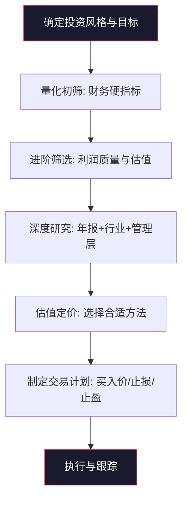
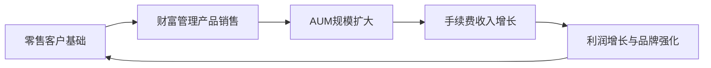
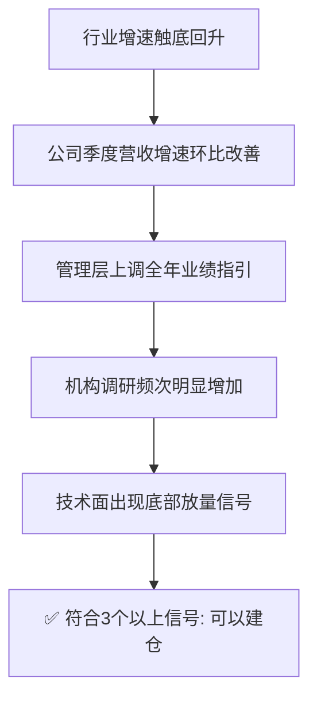
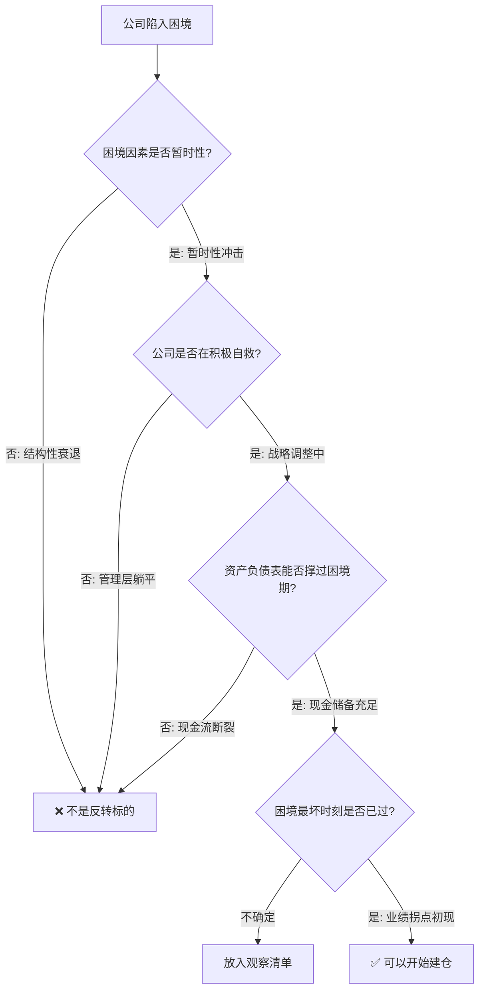
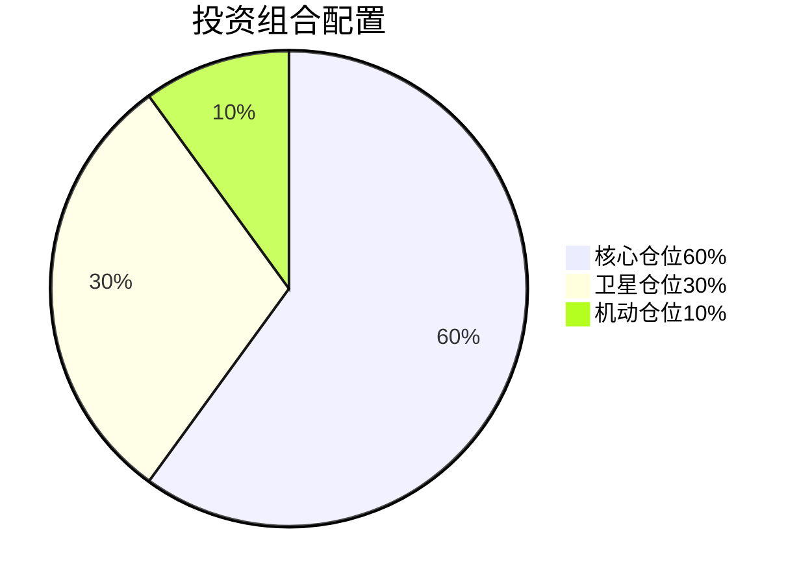

## 八、实战选股案例分析

前面七节系统讲解了选股方法论、卖出时机、仓位管理、交易纪律、工具使用和不同市场环境下的策略。但投资是一门实践的艺术——知道方法论不等于能用好方法论。本节通过**八个完整的实战选股案例**，手把手演示从初筛到买入决策的全流程，覆盖价值股、成长股、困境反转股、周期股、高股息股等不同类型，帮助你把抽象的理论转化为可操作的实战能力。

---

### 1. 选股实战的完整流程回顾

在进入具体案例之前，先回顾一下从第一章提炼的实战选股标准流程。每个案例都将沿用这个框架，但会根据不同股票类型灵活调整侧重点。

**流程核心要点：**

| 步骤 | 核心问题 | 耗时占比 |
|:---:|:---:|:---:|
| 确定风格 | 我要找什么类型的股票？ | 5% |
| 量化初筛 | 这家公司财务是否健康？ | 10% |
| 进阶筛选 | 利润质量如何？估值是否合理？ | 15% |
| 深度研究 | 公司的竞争优势能否持续？ | 40% |
| 估值定价 | 它值多少钱？我在什么价位买？ | 15% |
| 交易计划 | 买多少？跌了怎么办？涨了怎么办？ | 10% |
| 执行跟踪 | 按计划执行，定期复盘 | 5% |

> **关键认知：** 深度研究占了40%的时间，这是区分业余投资者和专业投资者的核心环节。大多数人把80%的时间花在看K线图上，却只花5%的时间读年报——这是本末倒置。

---

### 2. 案例一：价值股选股实战——以招商银行为例

#### 2.1 选股背景与目标

**投资目标：** 找一只银行股作为长期底仓配置，追求稳定的股息收入和适度的资本增值。

**选股逻辑：** 银行股是典型的低估值、高分红板块。但银行股之间差异巨大——有的银行资产质量优秀、零售转型成功，有的银行坏账缠身、增长乏力。选股的核心是**区分"便宜的好货"和"便宜的烂货"**。

#### 2.2 第一步：量化初筛

用选股器设置银行股筛选条件：

| 筛选指标 | 阈值 | 筛选目的 |
|:---:|:---:|:---:|
| ROE（连续3年） | > 12% | 排除盈利能力差的银行 |
| 不良贷款率 | < 1.5% | 排除资产质量差的银行 |
| 拨备覆盖率 | > 200% | 确认利润的"隐藏储备" |
| 净息差 | > 2.0% | 确认核心盈利能力 |
| 营收增速 | > 5% | 排除完全不增长的银行 |
| 市值 | > 500亿 | 排除小银行（流动性差、风险高） |

**初筛结果：** 从42家A股上市银行中，约8-10家通过筛选，包括招商银行、宁波银行、成都银行、杭州银行、常熟银行等。

#### 2.3 第二步：进阶比较分析

将初筛通过的银行放在一起做横向对比：

| 对比维度 | 招商银行 | 宁波银行 | 成都银行 | 行业均值 |
|:---:|:---:|:---:|:---:|:---:|
| ROE | 16.8% | 15.2% | 17.1% | 11.5% |
| 不良率 | 0.95% | 0.76% | 0.68% | 1.30% |
| 拨备覆盖率 | 450% | 520% | 500% | 200% |
| 净息差 | 2.45% | 2.10% | 1.85% | 1.90% |
| 零售贷款占比 | 55% | 35% | 25% | 30% |
| 财富管理收入占比 | 15% | 8% | 3% | 5% |
| PE（TTM） | 6.5倍 | 7.8倍 | 5.2倍 | 5.5倍 |
| PB | 0.95倍 | 1.05倍 | 0.85倍 | 0.60倍 |
| 股息率 | 4.8% | 3.2% | 5.5% | 5.0% |

**分析要点：**

1. **成都银行ROE最高、不良率最低、股息率最高，看起来最优？** 但要注意，成都银行高度依赖对公贷款和区域经济，零售转型程度低，收入结构单一。一旦区域经济下行，风险会集中暴露。

2. **宁波银行各项指标均衡，但PE和PB都偏高。** 市场已经给了它"成长溢价"，当前估值安全边际不足。

3. **招商银行的核心优势在于零售银行和财富管理。** 这两项业务具有高粘性、轻资本、抗周期的特点，是其他银行难以复制的护城河。

#### 2.4 第三步：深度研究——招商银行的护城河分析

**护城河一：零售银行的规模效应**

招商银行拥有约1.9亿零售客户，其中金葵花及以上客户（资产50万以上）超过400万户。这个客户基础带来了两个核心优势：

- **低成本负债**：零售存款占比高，活期存款占比超过55%，付息成本远低于对公依赖型银行
- **交叉销售能力**：一个零售客户平均持有招行2.5个产品（储蓄卡+信用卡+理财），远高于行业均值1.3个

**护城河二：财富管理飞轮**

招行的"财富管理-资产管理-投资银行"业务飞轮：

这个飞轮一旦转动起来，就形成了自我强化的正循环。招行的AUM（管理客户总资产）超过13万亿元，远超其他股份制银行。

**护城河三：品牌认知**

"零售之王"的品牌定位已经深入人心。在高净值客户群体中，招行的品牌认知度和偏好度显著领先。这种品牌优势在银行领域很难被短期复制。

#### 2.5 第四步：估值与买入决策

**PE历史百分位法：**

招行过去10年PE区间为4.5-12倍，中位数约7.5倍。
- 25%分位 ≈ 6.0倍：进入关注区
- 10%分位 ≈ 5.0倍：进入击球区
- 当前PE 6.5倍 → 略低于中位数，处于合理偏低区间

**PB-ROE估值法（银行股更适用）：**

招行ROE为16.8%，对应合理PB约1.2-1.5倍。当前PB 0.95倍，存在约25%-60%的估值修复空间。

**股息率估值法：**

招行当前股息率4.8%，远高于10年期国债收益率（约2.5%）的1.5倍（3.75%）。从股息率角度看具有明显吸引力。

**综合判断：** 当前估值处于合理偏低区间，可以作为底仓开始建仓。

**交易计划：**

| 项目 | 计划 |
|:---:|:---:|
| 建仓方式 | 分3批买入，每批占计划仓位的1/3 |
| 第1批买入价 | 当前价格（PE 6.5倍附近） |
| 第2批买入价 | 下跌5%加仓 |
| 第3批买入价 | 下跌10%加仓 |
| 止损线 | PB跌破0.6倍或不良率突破3% |
| 止盈参考 | PE超过10倍或股息率低于3%时减仓 |
| 持有期限 | 3-5年 |

#### 2.6 案例总结：价值股选股的核心逻辑

| 维度 | 关键要点 |
|:---:|:---|
| 选股重点 | 盈利稳定性 > 增长速度，资产质量 > 利润增速 |
| 估值方法 | PB-ROE法为主，PE法和股息率法辅助验证 |
| 买入时机 | PE低于历史30%分位，或股息率高于无风险利率1.5倍 |
| 持有逻辑 | 赚的是估值修复的钱 + 每年的分红收益 |
| 风险关注 | 资产质量恶化、政策变动（如让利实体经济）、利率下行压缩息差 |

---

### 3. 案例二：成长股选股实战——以宁德时代为例

#### 3.1 选股背景与目标

**投资目标：** 捕捉新能源产业链中高速增长的龙头公司，追求资本增值为主。

**选股逻辑：** 成长股的核心不是"便宜"，而是"增长能否持续"。宁德时代作为全球动力电池龙头，关键问题是：它的增长天花板在哪里？竞争格局是否在恶化？

#### 3.2 量化初筛——成长股特殊筛选条件

成长股的筛选标准与价值股不同：

| 筛选指标 | 阈值 | 宁德时代数据 | 是否达标 |
|:---:|:---:|:---:|:---:|
| 营收增长率（连续3年） | > 25% | 55%/30%/15% | 需分析 |
| 净利润增长率（连续3年） | > 30% | 45%/35%/8% | 需分析 |
| ROE | > 15% | 22% | 达标 |
| 研发投入/营收 | > 5% | 7.2% | 达标 |
| 市场份额 | 行业前3 | 全球第一（37%） | 达标 |
| PEG | < 1.5 | 需计算 | 见下文 |

**关键发现：** 宁德时代营收和利润增速在最近一年明显放缓（从55%降到15%），这是否意味着成长逻辑已经被破坏？

#### 3.3 增速放缓的深层分析

**不能只看表面数字，要拆解增速放缓的原因：**

1. **基数效应**：宁德时代2022年营收3286亿，2023年营收4009亿。在如此大的基数上保持15%的增长，绝对增量高达723亿，相当于再造一个二线电池厂。基数越大增速越慢是数学规律，不等于公司不行了。

2. **行业增速放缓**：全球新能源汽车渗透率已经超过20%，行业从爆发期进入成长期，整体增速从50%+降到20-30%。但行业放缓不等于龙头放缓——龙头可以通过抢占份额实现高于行业的增速。

3. **竞争格局变化**：比亚迪弗迪电池自供比例提升、中创新航和亿纬锂能等二线厂商崛起。但宁德时代的全球份额仍在37%左右，没有出现明显下降。

4. **新技术布局**：麒麟电池、神行超充电池、钠离子电池、凝聚态电池——宁德时代在技术储备上依然领先。研发投入260亿/年，是第二名的3倍以上。

**结论：** 增速放缓是行业性的，不是公司特有的问题。宁德时代的竞争地位没有被削弱，但需要接受从"爆发式增长"到"稳健增长"的转变。

#### 3.4 PEG估值法实战应用

| 年份 | 预期净利润增速 | 预期PE | PEG |
|:---:|:---:|:---:|:---:|
| 乐观情景 | 25% | 20倍 | 0.80 |
| 中性情景 | 18% | 20倍 | 1.11 |
| 悲观情景 | 10% | 20倍 | 2.00 |

- 乐观情景下PEG<1，有买入价值
- 中性情景下PEG≈1，估值合理
- 悲观情景下PEG=2，估值偏高

**关键判断点：** 你对宁德时代未来3年增速的预期是多少？如果你认为行业渗透率还有空间（全球渗透率仅20%，中国约35%），龙头能维持20%+增长，那么当前估值合理偏低。如果你认为竞争会大幅侵蚀利润，增速降到10%以下，那么当前估值偏高。

#### 3.5 成长股的特殊风险清单

| 风险类型 | 具体表现 | 应对措施 |
|:---:|:---|:---|
| 增速不及预期 | 季报显示营收/利润增速低于预期 | 设定增速底线，跌破即减仓 |
| 估值杀 | 市场从给予50倍PE降到20倍 | 用PEG估值而非绝对PE |
| 技术路线被颠覆 | 固态电池等新路线取代锂电池 | 关注公司研发投入方向 |
| 行业产能过剩 | 电池产能利用率下降到60%以下 | 跟踪行业产能利用率数据 |
| 大客户依赖 | 特斯拉等大客户转投其他供应商 | 查看客户集中度变化 |

#### 3.6 成长股的买入时机

成长股不能像价值股那样等"低估"，因为高增长的公司很少出现极端低估。买入时机的关键是**增速拐点确认**：

**宁德时代的买入纪律：**

| 项目 | 计划 |
|:---:|:---:|
| 建仓方式 | 分2-3批，趋势确认后加仓 |
| 仓位上限 | 成长股单一持仓不超过总仓位的15% |
| 止损线 | 季报增速低于10%或跌破年线 |
| 止盈参考 | PEG超过2倍或行业渗透率超过50% |
| 持有期限 | 1-3年（成长股持有期通常短于价值股） |

#### 3.7 案例总结：成长股选股的核心逻辑

| 维度 | 关键要点 |
|:---:|:---|
| 选股重点 | 增速的持续性 > 当前增速数字，竞争格局 > 行业空间 |
| 估值方法 | PEG法为核心，PS法辅助验证 |
| 买入时机 | 增速拐点确认（营收增速环比改善+管理层上调指引） |
| 持有逻辑 | 赚的是业绩增长驱动的股价上涨，而非估值修复 |
| 风险关注 | 增速放缓导致的双杀（业绩下滑+估值压缩） |

---

### 4. 案例三：困境反转股选股实战——以中国中免为例

#### 4.1 选股背景与困境分析

**什么是困境反转股？** 指曾经是好公司，但因为短期负面因素（行业政策、突发事件、经营失误等）导致业绩大幅下滑、股价暴跌的公司。如果困境因素是暂时的且公司在积极自救，就存在"反转"的投资机会。

**中国中免的困境：**

| 困境因素 | 具体表现 | 是否可逆 |
|:---:|:---|:---:|
| 疫情冲击 | 国际客流断崖下跌，海南免税店客流下降70% | 已逆转 |
| 竞争加剧 | 海南离岛免税牌照放开，王府井等新玩家入场 | 部分可逆 |
| 消费降级 | 出境游恢复后分流海南免税消费 | 短期承压 |
| 估值下杀 | 从2021年最高PE 80倍跌到20倍 | 估值已修正 |

#### 4.2 困境反转的判断框架

不是所有困境中的公司都能反转。用以下框架判断反转概率：

**中国中免的评估：**

1. **困境因素是否暂时性？** ✅ 疫情影响已消退，国际客流恢复中。竞争加剧是长期的，但中免的规模优势（采购成本低30%+）和渠道优势（全牌照+机场+离岛）仍然显著。

2. **管理层是否在积极自救？** ✅ 中免在推进线上渠道建设、优化品类结构、拓展市内免税店、争取更多机场免税店经营权。

3. **资产负债表是否健康？** ✅ 货币资金超过300亿，资产负债率约40%，有充足的资金度过困境期。

4. **业绩拐点是否出现？** ⚠️ 需要持续跟踪季度数据确认。

#### 4.3 困境反转股的估值方法

困境反转股的估值难度最大——因为当前利润不能代表真实盈利能力，用PE估值会失真。推荐使用以下方法：

**方法一：恢复正常盈利后的远期PE法**

| 步骤 | 说明 |
|:---:|:---|
| 估算正常年度的净利润 | 参考困境前的最高利润水平，考虑竞争格局变化后打折 |
| 给予合理PE | 参考同行业可比公司PE，或公司历史中位PE |
| 折现到当前 | 用10%的折现率折现1-2年 |

**示例计算：**

- 中免困境前最高净利润约100亿
- 考虑竞争加剧，正常化净利润估算为70-80亿
- 参考历史中位PE 30倍（免税行业合理PE区间25-40倍）
- 正常化市值 = 75亿 × 30 = 2250亿
- 折现1年（假设1年后恢复正常）：2250 / 1.1 = 2045亿
- 如果当前市值低于2045亿，存在投资机会

**方法二：PS估值法（市销率）**

当利润失真时，营收更稳定。对比公司历史PS区间和同行PS水平。

#### 4.4 困境反转股的仓位管理

**这类股票的风险最高——困境可能不会反转，或者反转时间比预期长得多。** 必须严格控制仓位：

| 项目 | 计划 |
|:---:|:---:|
| 最大仓位 | 不超过总仓位的8% |
| 建仓方式 | 分4-5批，每批2%，每批间隔至少1个月 |
| 加仓条件 | 季报显示营收环比改善+管理层确认经营向好 |
| 止损线 | 出现新的负面因素（如重大诉讼、管理层大幅减持） |
| 持有期限 | 6-24个月 |
| 预期收益 | 反转成功30%-80%，反转失败亏损20%-40% |

#### 4.5 案例总结：困境反转股的核心逻辑

| 维度 | 关键要点 |
|:---:|:---|
| 选股重点 | 困境因素的暂时性 > 公司基本面的底子 > 管理层的自救意愿 |
| 估值方法 | 远期正常化PE法，或PS法 |
| 买入时机 | 困境最坏时刻已过、业绩拐点初现时分批介入 |
| 持有逻辑 | 赚的是市场情绪从极度悲观到正常化的修复收益 |
| 风险关注 | 困境持续恶化、新负面因素出现、管理层变动 |

---

### 5. 案例四：周期股选股实战——以海螺水泥为例

#### 5.1 周期股的特殊性

周期股的投资逻辑与价值股、成长股完全不同。周期行业的利润随宏观经济和行业供需周期大幅波动，**PE最低的时候恰恰是利润顶峰、应该卖出的时候；PE最高的时候反而是利润谷底、可能值得买入的时候**。

水泥行业是典型的强周期行业，受基建投资、房地产景气度、供给侧改革等因素影响巨大。

#### 5.2 周期股的核心判断框架——产能周期

**周期股投资的核心：在产能出清末期（D→E阶段）买入，在利润高增长期（A→B阶段）卖出。**

#### 5.3 海螺水泥的周期分析

**行业地位：** 海螺水泥是中国水泥行业的绝对龙头，产能超过3亿吨，熟料产能全球第一。其核心优势在于：

- **T型战略**：沿长江布局，在石灰石资源丰富的山区建熟料基地，沿水运通道建粉磨站，大幅降低物流成本
- **成本领先**：吨成本比行业平均低15-20%，在行业下行期仍有微利
- **现金牛体质**：经营性现金流长期大于净利润，分红比例稳定在30%-40%

**周期判断方法——跟踪关键指标：**

| 指标 | 数据来源 | 买入信号 | 卖出信号 |
|:---:|:---:|:---:|:---:|
| 水泥价格指数 | 中国水泥网 | 触底企稳，环比不再下降 | 历史高位，开始回落 |
| 全国水泥产量 | 国家统计局 | 产量同比降幅收窄 | 产量同比大幅增长（产能扩张信号）|
| 煤炭价格 | 动力煤期货 | 煤价下跌（成本端改善）| 煤价大幅上涨（成本端承压）|
| 固定资产投资增速 | 国家统计局 | 基建投资触底回升 | 投资增速见顶回落 |
| 行业产能利用率 | 工信部 | 跌破60%开始关注（出清信号）| 超过80%开始警惕（过热信号）|
| 海螺水泥吨毛利 | 公司季报 | 跌至历史20%分位以下 | 涨至历史80%分位以上 |

#### 5.4 周期股的估值方法

**周期股绝对不能用PE估值！** 因为利润波动太大。推荐以下方法：

**方法一：PB估值法（市净率）**

PB相对稳定，是周期股估值的首选。

| 海螺水泥PB区间 | 含义 |
|:---:|:---|
| PB < 1.0倍 | 极度低估，历史底部区域 |
| PB 1.0-1.5倍 | 偏低估，可以分批买入 |
| PB 1.5-2.5倍 | 合理区间 |
| PB > 2.5倍 | 偏高估，考虑减仓 |
| PB > 3.5倍 | 极度高估，历史顶部区域 |

**方法二：重置成本法**

计算"重建一个同等规模的海螺水泥需要多少钱"。如果市值低于重置成本，说明股价被严重低估。

海螺水泥的产能约3亿吨，按每吨产能建设成本300-400元计算，重置成本约900-1200亿。如果市值跌到这个区间以下，就存在明显的安全边际。

**方法三：吨市值法**

| 指标 | 计算方式 | 海螺水泥参考值 |
|:---:|:---:|:---:|
| 吨市值 | 总市值 / 总产能 | 历史区间300-1200元/吨 |
| 吨EV | 企业价值 / 总产能 | 扣除净现金后更准确 |

当吨市值跌至300-400元/吨区间时，处于历史底部区域。

#### 5.5 周期股的交易纪律

| 项目 | 计划 |
|:---:|:---:|
| 建仓时机 | 行业产能利用率跌破60% + PB低于1.2倍 |
| 建仓方式 | 分5批，每批间隔2-3个月 |
| 止盈纪律 | PB超过2.5倍或吨毛利达到历史80%分位 |
| 止损线 | 公司出现重大经营异常（如安全事故导致长期停产） |
| 持有期限 | 1-3年（一个完整周期） |

#### 5.6 案例总结：周期股选股的核心逻辑

| 维度 | 关键要点 |
|:---:|:---|
| 选股重点 | 行业龙头、成本领先、现金牛体质 |
| 估值方法 | PB法为主，重置成本法和吨市值法辅助验证 |
| 买入时机 | 产能出清末期、PB处于历史低位、行业景气触底 |
| 卖出时机 | 利润高峰、PB处于历史高位、新产能大量投放 |
| 最大忌讳 | 用PE估值——PE最低时恰恰是卖出时 |

---

### 6. 案例五：高股息股选股实战——以长江电力为例

#### 6.1 高股息策略的理论基础

高股息策略（Dividend Strategy）是全球范围内被广泛验证有效的投资策略。其逻辑非常朴素：

1. **股息是确定的回报**：股价涨跌不确定，但分红是真金白银
2. **复利效应**：持续将股息再投资，长期收益惊人
3. **估值锚定**：高股息率天然限制了估值泡沫，提供了安全边际
4. **行为金融学优势**：收到股息的"正反馈"有助于投资者长期持有

> **数据验证：** 根据中证指数公司数据，中证红利指数2005-2024年累计收益约650%，年化收益约10.8%，显著跑赢上证指数的约180%（年化约5.3%）。

#### 6.2 长江电力——高股息股的典范

**为什么选长江电力？**

长江电力是A股高股息策略的标杆标的，具备以下特征：

| 维度 | 长江电力数据 | 评价 |
|:---:|:---:|:---:|
| 股息率 | 3.5%-4.5%（历史区间） | 高于国债收益率 |
| 分红连续性 | 连续20年分红，从未中断 | 极强的分红稳定性 |
| 分红比例 | 70%+（承诺分红比例不低于当年净利润的70%） | 分红意愿极强 |
| 业务稳定性 | 水电发多少卖多少，上网电价稳定 | 收入可预测性极强 |
| 护城河 | 长江干流6座巨型水电站，不可复制的资源垄断 | 护城河极深 |
| 现金流 | 经营性现金流/净利润 > 150% | 利润含金量极高 |
| 负债结构 | 持续改善中，资产负债率从80%降到65% | 财务越来越健康 |

#### 6.3 高股息股的选股清单

不只是"股息率高"就是好高股息股，需要排除"股息陷阱"：

**必须满足的硬条件：**

| 指标 | 标准 | 排除陷阱 |
|:---:|:---:|:---|
| 连续分红年数 | ≥ 5年 | 排除分红不稳定的公司 |
| 股息率 | > 3% | 低于国债收益率不值得承担股票风险 |
| 分红比例 | 30%-80% | 过低说明不愿分红，过高（>100%）说明借钱分红 |
| 经营性现金流/净利润 | > 80% | 确保分红的钱是真金白银 |
| 资产负债率 | < 70% | 排除借债分红的公司 |
| 净利润增速 | 不为负 | 排除利润在下滑的公司（股息不可持续） |

**股息陷阱的典型特征：**

| 陷阱类型 | 表现 | 如何识别 |
|:---:|:---|:---|
| 一次性高分红 | 某年股息率突然飙高 | 查看分红历史，看是否是卖资产等一次性收益 |
| 周期顶峰分红 | 利润最高时分红最高 | 查看行业周期位置，排除周期股 |
| 借债分红 | 负债率上升但仍在分红 | 对比负债率变化趋势和分红金额 |
| 减持掩护 | 大股东在高股息率吸引散户后减持 | 查看大股东持股变动 |

#### 6.4 高股息股的买入时机

高股息股的买入时机与股息率直接相关——**股息率越高，买入越划算**。

**股息率百分位法：**

| 股息率所处位置 | 操作建议 |
|:---:|:---:|
| 历史80%分位以上（如长江电力>4.5%） | 强烈买入区域 |
| 历史60%-80%分位（4.0%-4.5%） | 积极买入区域 |
| 历史40%-60%分位（3.5%-4.0%） | 持有或小仓位加仓 |
| 历史20%-40%分位（3.0%-3.5%） | 不再加仓，持有 |
| 历史20%分位以下（<3.0%） | 考虑减仓，估值偏高 |

#### 6.5 高股息股的复利计算

高股息策略的最大威力在于**股息再投资的复利效应**。以长江电力为例：

**假设条件：**
- 初始投入10万元
- 年均股息率4%
- 股息全部再投资
- 股价年均上涨3%（保守假设）

| 年份 | 持仓市值 | 年度股息 | 累计股息 | 累计总回报 |
|:---:|:---:|:---:|:---:|:---:|
| 第1年 | 103,000 | 4,120 | 4,120 | 7.1% |
| 第5年 | 122,500 | 4,900 | 22,900 | 45.4% |
| 第10年 | 163,800 | 6,552 | 53,200 | 117.0% |
| 第20年 | 339,000 | 13,560 | 178,600 | 417.6% |
| 第30年 | 701,000 | 28,040 | 495,000 | 1,096.0% |

> 30年时间，10万变成约120万，年化收益约8.7%。如果期间有任何一年股息率特别高（如5%+），复利效果会更显著。

#### 6.6 案例总结：高股息选股的核心逻辑

| 维度 | 关键要点 |
|:---:|:---|
| 选股重点 | 分红连续性 > 股息率绝对值，现金流质量 > 利润增速 |
| 估值方法 | 股息率百分位法为核心 |
| 买入时机 | 股息率处于历史60%分位以上 |
| 持有逻辑 | 股息再投资的复利效应，追求确定性回报 |
| 最大忌讳 | 只看股息率高低，不看分红的可持续性 |

---

### 7. 案例六：打新与可转债——低风险策略实战

#### 7.1 A股打新策略

**什么是打新？** 参与新股申购（IPO），以发行价买入新股。A股历史上，新股上市首日绝大多数都会涨，提供了几乎"无风险"的收益机会。

**打新实操要点：**

| 要素 | 说明 |
|:---:|:---|
| 申购条件 | 持有沪市市值1万元以上（每5000市值一个申购单位） |
| 中签概率 | 科创板/创业板约0.03%-0.05%，主板类似 |
| 预期收益 | 每签500-50000元不等，取决于发行价和板块 |
| 年化收益 | 持有20万市值的股票，打新年化收益约3%-8% |
| 核心成本 | 需要持有底仓，底仓本身有涨跌风险 |

**打新策略的正确姿势：**

1. **不要为了打新而买垃圾股**。底仓本身应该是你愿意长期持有的好公司
2. **顶格申购**。每次新股发行都顶格申购，中签靠概率和坚持
3. **上市首日卖出**。除非你对这家公司有深入了解，否则打中的新股在上市首日卖出是最安全的策略
4. **坚持参与**。打新是概率游戏，年化收益取决于参与次数，不要因为几次不中就放弃

#### 7.2 可转债策略

**什么是可转债？** 可转债是上市公司发行的、可以转换为股票的债券。它有一个独特优势——**下有保底（到期还本付息），上不封顶（可以转换为股票享受上涨）**。

**可转债的四大收益来源：**

| 收益来源 | 说明 | 典型收益 |
|:---:|:---|:---:|
| 到期收益 | 持有到期获得本金+利息（保底收益） | 年化1%-2% |
| 转股收益 | 正股上涨带动可转债上涨 | 5%-50% |
| 下修收益 | 公司下调转股价，可转债价值提升 | 10%-30% |
| 强赎收益 | 正股涨超转股价130%，触发强制赎回 | 30%+ |

**可转债筛选标准：**

| 指标 | 标准 | 说明 |
|:---:|:---:|:---|
| 价格 | < 110元 | 越接近面值，安全边际越高 |
| 溢价率 | < 30% | 溢价率越低，跟涨能力越强 |
| 到期收益率 | > 0% | 确保持有到期不亏钱 |
| 剩余规模 | > 2亿 | 排除流动性差的小规模转债 |
| 评级 | AA及以上 | 排除信用风险高的转债 |
| 正股基本面 | ROE > 10% | 正股质量好，转股概率更高 |

**可转债的三大策略：**

| 策略 | 操作方式 | 适用场景 |
|:---:|:---|:---|
| 双低策略 | 选择价格低+溢价率低的转债 | 风险偏好低，追求稳健 |
| 摊大饼策略 | 分散买入10-20只低价转债 | 分散单一违约风险 |
| 配售策略 | 在股权登记日前买入正股，获得优先配售权 | 看好正股+获取转债配售 |

---

### 8. 案例七：行业ETF选股——不选个股也能赚钱

#### 8.1 为什么选择ETF

对于没有时间或能力研究个股的投资者，ETF是最佳选择：

| 优势 | 说明 |
|:---:|:---|
| 分散风险 | 一篮子股票，不会因单只股票暴雷而大幅亏损 |
| 费率低廉 | 管理费通常0.15%-0.50%，远低于主动基金 |
| 透明度高 | 每天公布持仓，你知道自己买了什么 |
| 交易灵活 | 像股票一样实时买卖，T+1到账 |
| 无个股研究门槛 | 买的是指数，不需要研究单个公司 |

#### 8.2 ETF选择方法

**核心原则：选行业比选ETF更重要。**

**Step 1：选行业（最重要）**

参考前面"结构性行情"的赛道选择四维度（政策、资金、景气、估值），确定当前应该配置哪个行业。

**Step 2：选ETF**

| 比较维度 | 优先选择 |
|:---:|:---|
| 规模 | > 5亿（规模太小有清盘风险） |
| 日均成交额 | > 5000万（流动性好） |
| 跟踪误差 | 越小越好（<0.5%） |
| 管理费率 | 越低越好 |
| 成立时间 | > 1年 |

**Step 3：定投还是一次性买入**

| 场景 | 建议 |
|:---:|:---|
| 确认行业处于底部区域 | 一次性买入50%底仓 + 定投50% |
| 不确定行业位置 | 纯定投，每周/每月固定投入 |
| 行业处于高位但想参与 | 小仓位定投，做好长期持有准备 |

#### 8.3 核心行业ETF推荐

| 行业方向 | 代表性ETF | 适用场景 |
|:---:|:---|:---|
| 沪深300 | 沪深300ETF（510300） | 底仓配置，全市场代表 |
| 中证500 | 中证500ETF（510500） | 中小盘配置 |
| 科创50 | 科创50ETF（588000） | 科技成长方向 |
| 半导体 | 半导体ETF（512480） | 国产替代主题 |
| 新能源 | 新能源ETF（516160） | 碳中和主题 |
| 医药 | 医药ETF（512010） | 老龄化长期趋势 |
| 红利 | 中证红利ETF（515080） | 高股息策略 |
| 消费 | 消费ETF（159928） | 内需复苏 |

---

### 9. 案例八：完整复盘——从零构建投资组合

#### 9.1 背景设定

假设你是一位30岁的工薪族，月收入15000元，每月可用于投资的资金为5000元，初始可投入资金为10万元。目标是通过科学的选股和组合构建，实现长期年化10%-15%的收益。

#### 9.2 第一步：确定组合配置

**核心-卫星策略（Core-Satellite）：**

| 仓位类型 | 占比 | 目标 | 标的类型 |
|:---:|:---:|:---:|:---|
| 核心仓位 | 60% | 稳定收益，控制回撤 | 沪深300ETF + 高股息蓝筹 |
| 卫星仓位 | 30% | 增厚收益，适度弹性 | 行业ETF + 成长股 |
| 机动仓位 | 10% | 把握短期机会 | 打新底仓 + 可转债 + 事件驱动 |

#### 9.3 第二步：具体标的选择

**核心仓位（6万元）：**

| 标的 | 金额 | 占比 | 选股逻辑 |
|:---:|:---:|:---:|:---|
| 沪深300ETF | 2.5万 | 25% | 全市场底仓，分散风险 |
| 招商银行 | 2万 | 20% | 价值股代表，高股息+零售护城河 |
| 长江电力 | 1.5万 | 15% | 高股息代表，现金流极稳 |

**卫星仓位（3万元）：**

| 标的 | 金额 | 占比 | 选股逻辑 |
|:---:|:---:|:---:|:---|
| 科创50ETF | 1.5万 | 15% | 科技成长方向，政策支持 |
| 中证红利ETF | 1万 | 10% | 增强高股息暴露 |
| 行业主题ETF | 0.5万 | 5% | 根据当前景气度灵活配置 |

**机动仓位（1万元）：**

| 标的 | 金额 | 占比 | 用途 |
|:---:|:---:|:---:|:---|
| 打新底仓 | 0.5万 | 5% | 持有市值用于打新 |
| 可转债组合 | 0.5万 | 5% | 分散买入3-5只低价转债 |

#### 9.4 第三步：建仓计划

**初始建仓（第1个月）：**

一次性投入全部10万元，按照上述比例配置。如果当前市场处于明显高位（如上证PE>18倍），可以先建60%仓位，剩余分3个月定投到位。

**定期投入（每月）：**

每月5000元的投入节奏：

| 周 | 金额 | 投向 |
|:---:|:---:|:---|
| 第1周 | 2000元 | 沪深300ETF定投 |
| 第2周 | 1500元 | 招商银行/长江电力（轮换加仓）|
| 第3周 | 1000元 | 科创50ETF定投 |
| 第4周 | 500元 | 可转债/机动 |

#### 9.5 第四步：再平衡与调仓规则

| 触发条件 | 操作 |
|:---:|:---|
| 单只标的仓位超过计划占比5个百分点以上 | 卖出超出部分，补入不足的标的 |
| 单只标的基本面出现重大恶化 | 无条件清仓，资金转入核心仓位 |
| 季度末 | 检查组合，调整卫星仓位的行业方向 |
| 市场出现极端估值（PE<10或PE>25）| 大幅调整股债比例 |

#### 9.6 预期收益与风险

| 情景 | 假设 | 年化收益 | 最大回撤 |
|:---:|:---|:---:|:---:|
| 乐观 | A股年均涨12% | 15%-18% | -15% |
| 中性 | A股年均涨5% | 10%-12% | -25% |
| 悲观 | A股年均不涨 | 5%-7%（靠股息）| -35% |

> **关键提醒：** 投资组合不是一成不变的。随着年龄增长、收入变化、市场环境变化，需要定期调整配置比例。核心原则是：**年龄越大，核心仓位占比越高；市场越热，股票仓位应该越低。**

---

### 10. 选股实战的常见错误与教训

通过以上八个案例，提炼出实战中最常犯的错误：

| 错误类型 | 具体表现 | 正确做法 |
|:---:|:---|:---|
| 用一套标准选所有股票 | 不区分价值股、成长股、周期股 | 根据股票类型选择对应的筛选标准和估值方法 |
| 只看PE/PB做决策 | PE低就买，PE高就卖 | 周期股用PB、成长股用PEG、银行股用PB-ROE |
| 不做深度研究 | 只看K线图和炒股论坛 | 花40%时间读年报、研报、行业数据 |
| 满仓单只股票 | 全押一只"看好的股票" | 单只股票仓位不超过15%，行业暴露不超过30% |
| 追涨杀跌 | 涨了追、跌了砍 | 提前制定交易计划，按计划执行 |
| 忽视卖出纪律 | 只学怎么买，不学怎么卖 | 买入前就确定止损和止盈条件 |
| 频繁换股 | 这山望着那山高 | 平均持股周期不低于3个月 |
| 借钱炒股 | 融资加杠杆 | 永远用闲钱投资，不加杠杆 |

---

### 11. 建立自己的选股系统

通过本节的八个案例，你应该已经理解了"不同类型的股票需要不同的分析框架"这个核心观点。最后，给出一个建立个人选股系统的行动清单：

**第一步：确定你的能力圈（1-2周）**
- 列出你熟悉的3-5个行业
- 诚实评估你在每个行业的认知深度
- 初期只在能力圈内选股

**第二步：建立筛选模板（1周）**
- 在同花顺/Choice中保存不同类型的筛选条件
- 每种类型（价值/成长/周期/高股息）各保存一个模板
- 每周运行一次筛选，跟踪结果变化

**第三步：建立研究清单（持续）**
- 从筛选结果中挑出10-15只重点关注的股票
- 为每只股票建立研究卡片（核心数据、竞争优势、风险因素、估值区间）
- 每季度更新一次

**第四步：制定交易纪律（1天）**
- 写下你的买入条件、止损条件、止盈条件
- 打印出来贴在电脑旁边
- 严格执行，不临时修改

**第五步：持续复盘（每月）**
- 每月回顾一次交易记录
- 分析哪些决策是对的、哪些是错的
- 总结经验教训，优化选股系统

> **最后一句话：** 选股不是一蹴而就的技能，它需要持续的学习、实践和复盘。本节的八个案例提供了框架和思路，但真正的选股能力只能在市场中磨练出来。从你最熟悉的行业开始，用小仓位实践，逐步建立自己的投资体系。
