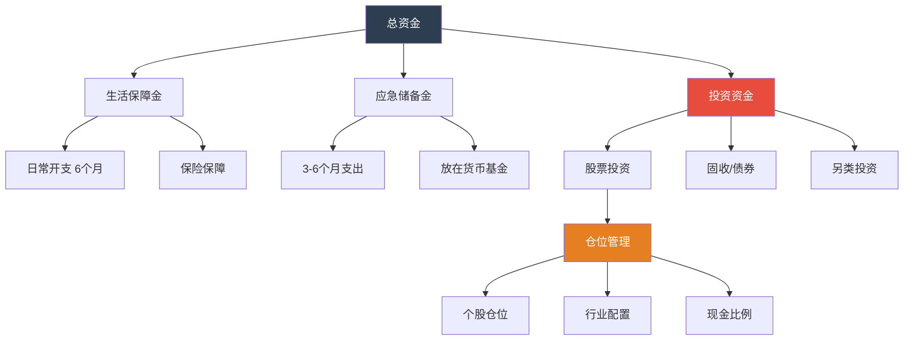
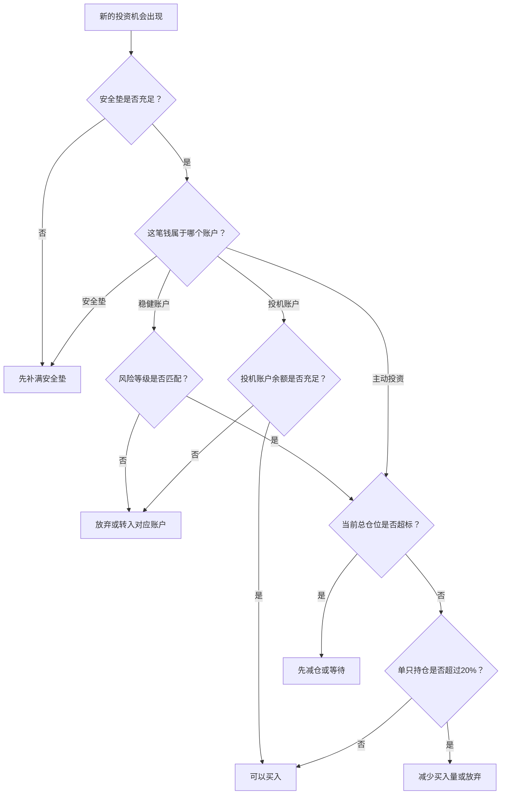

## 十、资金管理的进阶技巧

> 仓位管理告诉你"每只股票买多少"，资金管理告诉你"整体的钱怎么安排"。前者是战术，后者是战略。

前一章讲了仓位管理的核心方法——凯利公式、ATR法、金字塔加仓等，解决的是**单笔交易层面**的"买多少"问题。但一个成熟的投资者还需要回答更高维度的问题：手里的钱应该分成几份？每份的使命是什么？不同账户之间如何协调？杠杆用不用、怎么用？税收怎么省？不同人生阶段的资金策略如何切换？

这些就是**资金管理**（Capital Management）的范畴。如果说仓位管理是排兵布阵，资金管理就是后勤总调度——它决定了你有多少兵、粮草怎么分配、后方是否稳固。

---

### 一、资金管理的全景框架

#### 1.1 资金管理 vs 仓位管理：区别与联系

很多人把资金管理和仓位管理混为一谈。它们确实紧密相关，但层次不同：

| 维度 | 仓位管理 | 资金管理 |
|------|---------|---------|
| 决策层面 | 单笔交易 | 整体资产 |
| 核心问题 | 这只股票买多少股/多少钱 | 总资金如何在不同用途间分配 |
| 时间尺度 | 每次交易 | 持续性的、跨周期的 |
| 关注对象 | 个股风险 | 系统性风险、流动性、税收、生命周期 |
| 典型工具 | 凯利公式、ATR、止损 | 账户架构、风险预算、杠杆管理、再平衡 |

**两者的关系**：资金管理是仓位管理的"上层建筑"。你先决定总资金中多少用于股票投资（资金管理），再决定股票投资这部分钱每只买多少（仓位管理）。



#### 1.2 资金管理的五层金字塔

一个完整的资金管理体系包含五个层次，由下到上依次是：

| 层次 | 名称 | 核心问题 | 优先级 |
|------|------|---------|-------|
| 第一层 | 安全层 | 我的钱会不会归零？ | 最高 |
| 第二层 | 流动性层 | 我需要用钱时能拿出来吗？ | 极高 |
| 第三层 | 风险预算层 | 我最多能承受多大的亏损？ | 高 |
| 第四层 | 效率层 | 同样的风险下如何赚更多？ | 中 |
| 第五层 | 税务优化层 | 怎样减少不必要的税负？ | 长期重要 |

**关键原则：永远从底层开始建设。** 如果你连应急储备金都没有就去研究税务优化，那就是本末倒置。

---

### 二、账户架构设计：把钱放在对的地方

#### 2.1 为什么要分账户

不分账户的典型后果：

- 急用钱时被迫在亏损时卖出股票
- 混合了短期和长期资金，导致操作变形
- 该冒险的钱不敢冒险，不该冒险的钱乱冒险
- 年底算账时根本不知道自己到底赚了多少亏了多少

分账户的本质是**给每笔钱一个明确的使命**，使命不同，管理方式就不同。

#### 2.2 四账户体系

对于普通个人投资者，建议建立四个独立的账户：

**账户一：安全垫账户（占总资产 10-20%）**

- 用途：应对失业、疾病、意外等突发状况
- 存放形式：货币基金、银行活期、短期国债逆回购
- 金额标准：覆盖 6-12 个月的基本生活开支
- 管理原则：**绝不投入股市**，这是你最后的防线
- 选择建议：余额宝/零钱通等 T+0 货币基金，年化 1.5-2.5%，随时可取

**账户二：稳健增值账户（占总资产 20-40%）**

- 用途：3-5 年内可能用到的钱（买房首付、子女教育、买车等）
- 存放形式：债券基金、银行理财、大额存单、指数基金定投
- 预期收益：年化 4-8%
- 管理原则：以固收为主，少量权益配置（不超过 30%），严控回撤
- 具体配置建议：

| 品种 | 占比 | 预期收益 | 最大回撤 | 适合场景 |
|------|------|---------|---------|---------|
| 纯债基金 | 40% | 3-5% | -2% | 底仓稳定器 |
| 二级债基 | 20% | 5-8% | -5% | 增强收益 |
| 银行理财 | 20% | 3-4% | 接近0 | 流动性补充 |
| 沪深300定投 | 20% | 8-12% | -30% | 长期增值 |

**账户三：主动投资账户（占总资产 30-50%）**

- 用途：追求超额收益的核心账户
- 存放形式：个股、行业ETF、可转债
- 预期收益：年化 10-20%（优秀者），但波动大
- 管理原则：严格遵守仓位管理规则（前一章内容），做好 3-5 年不用这笔钱的准备
- 这个账户是本书核心章节讨论的主战场

**账户四：投机/机会账户（占总资产 5-10%）**

- 用途：高风险高回报的机会——打新、套利、事件驱动、超跌反弹
- 存放形式：现金+个股/期权
- 预期收益：不确定，可能翻倍也可能归零
- 管理原则：**亏完这 10%不影响生活**，这是你"交学费"和"抓机会"的钱
- 心理定位：把这笔钱当成"已亏损"，赚了是惊喜，亏了是正常

#### 2.3 账户之间的防火墙规则

分账户最困难的不是建立，而是**维护**。以下规则必须严格执行：

1. **永不跨界**：安全垫账户的钱绝不能因为"看到好机会"而转入主动投资账户
2. **定期审计**：每季度检查一次各账户的实际比例是否偏离目标
3. **盈利回流**：主动投资账户盈利超过 30% 时，将超额部分的 1/3 转入安全垫或稳健账户
4. **亏损不补**：投机账户亏完后，不从其他账户调钱补充，等下一年度重新分配

#### 2.4 实操：如何在券商中实现分账户

虽然券商只有一个资金账户，但你可以通过以下方式模拟分账户：

- **方法一：多券商开户**。不同券商用于不同目的，物理隔离最彻底
- **方法二：子账户标记法**。用 Excel 记录每笔资金的归属账户，每月对账
- **方法三：品种隔离法**。货币基金=安全垫，债基=稳健，个股=主动投资，用品种天然区分

---

### 三、风险预算：从"能亏多少"到"怎么分配亏损额度"

#### 3.1 什么是风险预算

风险预算（Risk Budgeting）的核心思想是：**把你的总风险承受能力当成一种有限资源，分配给不同的投资策略**。

打个比方：你一年最多能承受 10% 的亏损（心理+财务），这 10% 就是你的年度风险预算。你需要决定：多少给股票？多少给期货？多少留给意外？

#### 3.2 风险预算的计算方法

**第一步：确定最大年度可承受亏损**

```text
最大年度可承受亏损 = max(心理承受亏损, 财务安全亏损)

心理承受亏损：你晚上能睡着觉的最大亏损金额
财务安全亏损：不影响生活品质的最大亏损金额

取两者中较小的那个。
```

举例：你有 100 万投资资金。
- 心理承受：亏 15 万就会焦虑失眠 → 心理承受 = 15%
- 财务安全：每年投资收益需要至少覆盖 5 万生活补贴 → 不能亏超过 10 万 → 财务安全 = 10%
- 最大年度可承受亏损 = min(15%, 10%) = 10%，即 10 万元

**第二步：将风险预算分配给不同策略**

| 策略 | 风险预算占比 | 风险预算金额 | 对应仓位 | 说明 |
|------|------------|------------|---------|------|
| 核心持仓（长期价值） | 40% | 4万 | 40-50万 | 低频交易，止损较宽 |
| 卫星持仓（行业轮动） | 30% | 3万 | 20-30万 | 中频交易，止损适中 |
| 机动仓位（事件驱动） | 20% | 2万 | 10-15万 | 高频交易，严格止损 |
| 风险储备 | 10% | 1万 | 0 | 应对意外黑天鹅 |

**第三步：动态监控风险消耗**

每月计算已实现亏损 + 浮动亏损，对照风险预算：

```text
风险消耗率 = 累计亏损 / 年度风险预算

- 消耗率 < 50%：正常，继续执行策略
- 消耗率 50-80%：警惕，降低单笔仓位，收紧止损
- 消耗率 > 80%：危险，暂停新开仓，只持有或减仓
- 消耗率 = 100%：停止交易，等待下一年度重置
```

#### 3.3 风险预算的进阶应用：风险平价

风险平价（Risk Parity）是机构投资者常用的方法，核心思想是：**让每个资产/策略对组合贡献相同的风险**。

传统方法按金额分配（股票 60%、债券 40%），但股票的波动率是债券的 3-5 倍，所以实际上 90%+ 的风险来自股票。风险平价则是按风险贡献分配：

```text
示例：总资金 100 万，风险预算 10%（即 10 万波动空间）

股票年化波动率 ≈ 20%，债券年化波动率 ≈ 5%

要让两者贡献相同风险：
设股票仓位 X，债券仓位 Y
X × 20% = Y × 5%
X + Y = 100万

解得：X = 20万（20%），Y = 80万（80%）

两者风险贡献 = 20万×20% = 80万×5% = 4万，各占50%
```

这与直觉相反——风险平价下债券仓位远高于股票。但这正是它的优势：组合的整体波动大幅降低，而收益/风险比反而提高。

**对个人投资者的简化应用**：不必精确计算，但记住一个原则——**波动率高的品种少配钱，波动率低的品种多配钱**。这和 ATR 仓位管理法的逻辑完全一致，只不过从个股层面提升到了资产配置层面。

---

### 四、杠杆管理：双刃剑的正确握法

#### 4.1 杠杆的本质

杠杆就是借别人的钱来投资。它的数学效果是**线性放大收益和亏损**：

```text
2倍杠杆的效果：
- 标的涨10% → 你的收益 = 20%（扣融资成本后约17-18%）
- 标的跌10% → 你的亏损 = 20%（加上融资成本约22-23%）
- 标的跌50% → 你的亏损 = 100%（本金归零）
```

杠杆不改变投资的期望值，但它改变了结果的分布——尾部风险被放大，而你恰好活在尾部的概率比你想象的高。

#### 4.2 A股可用的杠杆工具

| 工具 | 杠杆倍数 | 成本 | 门槛 | 适合场景 |
|------|---------|------|------|---------|
| 融资融券 | 1.5-2倍 | 年化 6-8% | 50万资产+6个月经验 | 短期看多/看空 |
| 股票质押 | 0.5-0.7倍 | 年化 5-8% | 有足够持仓 | 大股东/长期持股者 |
| 分级基金B | 1.5-2倍 | 隐含成本 | 已逐步退出 | 不推荐 |
| 期权 | 非线性杠杆 | 权利金 | 50万+考试 | 对冲/增强收益 |
| 配资（场外） | 2-10倍 | 年化 12-24% | 无 | **强烈不推荐** |

**红线：绝不使用场外配资。** 场外配资不仅成本极高，而且存在卷款跑路、强制平仓不透明、法律风险等问题。2015年股灾中，大量使用场外配资的投资者血本无归。

#### 4.3 杠杆使用的三条铁律

**铁律一：只在高确定性机会上使用杠杆**

杠杆是"放大镜"——它放大你的判断，无论对错。所以只在你对判断有极高信心时使用。什么是"极高信心"？

- 估值处于历史极低区间（PE 百分位 < 10%）
- 基本面出现明确的拐点信号（业绩反转、政策利好）
- 技术面出现多重共振信号

即使如此，杠杆仓位也不应超过总资产的 20%。

**铁律二：杠杆仓位必须有硬止损**

不设止损的杠杆交易等于自杀。建议：

```text
杠杆仓位的止损线 = 融资成本 + 最大可承受亏损

示例：
- 融资买入 20 万，融资成本 7%/年
- 持有 3 个月的成本 = 20万 × 7% × 3/12 = 3,500 元
- 如果你最多愿意在这笔交易上亏 2 万
- 那么止损幅度 = (2万 - 3,500) / 20万 = 8.25%
- 即股价下跌 8.25% 时必须平仓
```

**铁律三：永远保留安全边际——杠杆后的总负债率不超过总资产的 30%**

```text
负债率 = 总负债 / 总资产

示例：
- 总资产 100 万
- 融资买入 25 万
- 负债率 = 25 / 100 = 25%（安全）
- 如果融资 50 万，负债率 = 50 / 100 = 50%（危险）
```

负债率超过 50% 意味着：如果资产下跌 50%，你就资不抵债了。而 A 股在极端行情中，个股下跌 50% 并不罕见。

#### 4.4 什么情况下绝对不能用杠杆

- 你刚开始投资，经验不足 3 年
- 你的投资资金中有生活必需的钱
- 市场处于高位（PE 百分位 > 60%）
- 你正在"报复性交易"（想把亏的钱赚回来）
- 你无法承受本金归零的后果

---

### 五、现金流管理：让工资和投资协同作战

#### 5.1 工资收入的投资分配模型

对大多数人来说，投资资金的主要来源是工资收入。如何把每月工资高效地转化为投资资本？

**50-30-20 模型的进阶版——35-25-20-20 模型：**

| 用途 | 占月收入比例 | 说明 |
|------|------------|------|
| 必要开支 | 35% | 房租/房贷、餐饮、交通、通讯 |
| 生活品质 | 25% | 娱乐、购物、社交、旅行 |
| 投资储蓄 | 20% | 定投指数基金、主动投资 |
| 安全储备 | 20% | 应急基金（充满后转入投资储蓄） |

**关键规则：先储蓄后消费。** 工资到账当天就自动转入投资账户和安全储备账户，剩下的才是可支配的。如果月底发现钱不够花，削减的是"生活品质"部分，而不是"投资储蓄"。

#### 5.2 增量资金的定投策略

每月新增的投资资金，不建议一次性买入，而是采用**智能定投**：

**方法一：估值定投法**

```text
每月定投金额 = 基准金额 × 估值系数

估值系数：
- 沪深300 PE < 11：系数 2.0（双倍定投）
- 沪深300 PE 11-13：系数 1.5
- 沪深300 PE 13-15：系数 1.0（正常定投）
- 沪深300 PE > 15：系数 0.5（半额定投）
- 沪深300 PE > 18：系数 0（暂停定投，资金存入货币基金）

基准金额 = 每月可用于投资的金额
```

这个方法的原理：在市场便宜时多买、贵时少买，自动实现"低买高卖"的节奏。

**方法二：目标仓位倒推法**

```text
每月买入金额 = (目标仓位 - 当前仓位) × 当前总资产 / 剩余月份

示例：
- 当前总资产 50 万，股票仓位 40%（20万）
- 目标仓位 60%（30万），希望在 10 个月内达到
- 每月应买入 = (30万 - 20万) / 10 = 1 万
- 如果当月股票已涨，实际仓位变成 45%，则：
  每月应买入 = (30万 - 22.5万) / 9 = 8,333 元
```

#### 5.3 年终奖/大额收入的处理

年终奖、项目奖金等大额收入，切忌一次性 All-in。建议：

```text
大额收入分配方案：

1. 20% 改善生活（旅行、购物、犒劳自己）
   → 投资是为了更好的生活，不要本末倒置

2. 30% 进入安全垫账户（如果未满）
   → 充实应急储备

3. 50% 分 3-6 个月投入投资账户
   → 采用"时间分散"策略，避免买在高点

具体操作：
- 第 1 个月：买入计划仓位的 20%
- 第 2-4 个月：每月买入 20%
- 第 5-6 个月：买入剩余 20%（如果市场没有极端变化）
```

---

### 六、再平衡策略的进阶应用

#### 6.1 再平衡的本质

再平衡（Rebalancing）是把偏离目标比例的资产组合调回目标比例。它的本质是**纪律性的"高卖低买"**——卖出涨得多的（相对高估），买入跌得多的（相对低估）。

在前一章中已经提到了再平衡的基本概念，这里深入讨论执行层面的细节。

#### 6.2 三种再平衡策略的对比

| 策略 | 触发条件 | 优点 | 缺点 | 适合人群 |
|------|---------|------|------|---------|
| 日历法 | 固定周期（季度/半年） | 简单，不受情绪干扰 | 可能错过极端偏离 | 新手，资金量大 |
| 阈值法 | 偏离超过设定比例 | 响应及时 | 频繁交易增加成本 | 有经验的投资者 |
| 混合法 | 周期检查+阈值触发 | 平衡及时性和成本 | 规则稍复杂 | 推荐方案 |

**推荐的混合方案**：

```text
再平衡规则：

1. 每季度末（3/6/9/12月最后一个交易日）检查持仓
2. 如果任何单只股票偏离目标仓位超过 5 个百分点 → 再平衡
3. 如果任何行业偏离目标配置超过 10 个百分点 → 再平衡
4. 如果没有触发阈值 → 不操作

偏离计算：
偏离度 = |当前占比 - 目标占比|

示例：
- 目标：茅台 15%，实际 22% → 偏离 7% > 5% → 需要再平衡
- 目标：银行 20%，实际 24% → 偏离 4% < 5% → 不操作
```

#### 6.3 再平衡的交易成本控制

再平衡会产生交易成本（佣金+印花税+冲击成本），需要控制：

1. **最小交易金额**：单次再平衡的交易金额不低于 5,000 元，避免频繁小额交易
2. **利用新增资金**：优先用新增资金（工资定投、年终奖）来调整偏离，而不是卖出已有持仓
3. **税收考量**：A 股持有超过 1 年免征红利税，卖出不收资本利得税（这是中国市场的优势），但仍需考虑佣金成本
4. **批量操作**：将多次偏离合并到同一天调整，减少交易次数

```text
利用新增资金再平衡的示例：

当前持仓：
- 茅台 22%（目标 15%，超配 7%）
- 招行 8%（目标 15%，低配 7%）
- 总资产 100 万，本月新增 1 万

不卖出茅台，而是将 1 万全部买入招行：
- 茅台：22万 / 101万 = 21.8%（仍然超配，但改善了）
- 招行：9万 / 101万 = 8.9%（改善了）

持续几个月后，偏离度会自然收窄。
```

#### 6.4 什么情况下不应该再平衡

- **趋势行情中**：牛市中强势股持续上涨是正常的，过早再平衡会"卖飞"
- **基本面变化时**：某只股票大幅上涨可能是因为基本面改善（而非高估），这时候卖出可能不合理
- **交易成本过高时**：如果偏离度很小（1-2%），交易成本可能超过再平衡的收益

判断标准：**如果是因为估值逻辑变化导致的偏离，应该调整目标仓位而不是再平衡；如果是因为市场波动导致的偏离，才需要再平衡。**

---

### 七、税务优化：合法省下的每一分钱都是收益

#### 7.1 A 股投资的主要税种

| 税种 | 税率 | 触发条件 | 优化方法 |
|------|------|---------|---------|
| 印花税 | 0.05%（卖出） | 每次卖出 | 减少交易频率 |
| 股息红利税 | 0%/10%/20% | 持有分红 | 持有超1年免税 |
| 佣金 | 0.02-0.03% | 每次交易 | 选低佣券商 |
| 资本利得税 | 0% | 卖出盈利 | A股暂不征收 |

**重点：股息红利税的阶梯税率**

```text
持有时间与红利税率：
- 持有 > 1 年：免税（0%）
- 持有 1 个月 ~ 1 年：减半征收（10%）
- 持有 < 1 个月：全额征收（20%）

示例：某股票每股分红 1 元，你持有 1000 股
- 持有 13 个月：到手 1000 元（免税）
- 持有 6 个月：到手 900 元（扣税 100 元）
- 持有 2 周：到手 800 元（扣税 200 元）
```

**优化策略**：如果你打算长期持有高分红股票（如银行、公用事业），确保持有期跨越分红日且总持有时间超过 1 年。在分红日前卖出再买入（"逃权"）通常不划算，因为还有卖出印花税和佣金成本。

#### 7.2 交易频率对税负的影响

```text
假设每次交易 10 万元，佣金万 2.5，印花税万 5（卖出）：

| 交易频率 | 年交易次数 | 年佣金成本 | 年印花税 | 总交易成本 |
|---------|-----------|-----------|---------|-----------|
| 月频 | 24次 | 600元 | 600元 | 1,200元 |
| 周频 | 104次 | 2,600元 | 2,600元 | 5,200元 |
| 日频 | 244次 | 6,100元 | 6,100元 | 12,200元 |
| 高频（日内） | 1000次 | 25,000元 | 25,000元 | 50,000元 |

日频交易者的年交易成本占 10 万本金的 12.2%——这意味着你的投资收益必须超过 12.2% 才能开始赚钱。
```

**结论：交易频率越高，对投资能力的要求越高。** 对于大多数人，月频或季频交易是最优的——既能捕捉主要趋势，又不会被交易成本吃掉利润。

#### 7.3 税收递延策略

虽然 A 股暂不征收资本利得税，但如果你有海外投资（港股通、美股），税收递延就很重要：

- **港股通**：红利税 20%（通过中国结算），资本利得暂免
- **美股**：红利税 10%（中美税收协定），资本利得税取决于你的税务居民身份

**通用原则**：能晚交的税就晚交。今天省下的 1 万元税款，如果用于再投资，10 年后按 10% 年化收益变成 2.59 万。税收递延的时间价值是巨大的。

---

### 八、不同人生阶段的资金管理策略

#### 8.1 阶段划分与核心任务

| 阶段 | 年龄 | 核心任务 | 风险承受 | 股票占比建议 |
|------|------|---------|---------|------------|
| 积累期 | 22-30岁 | 积累本金，建立习惯 | 高（时间长，可承受波动） | 50-70% |
| 增长期 | 30-45岁 | 资产增值，兼顾家庭 | 中高（有家庭负担） | 40-60% |
| 保全期 | 45-55岁 | 保全财富，降低风险 | 中（退休临近） | 30-50% |
| 收获期 | 55岁+ | 稳定现金流，抗通胀 | 低（不能承受大亏损） | 20-35% |

#### 8.2 积累期（22-30岁）的资金管理要点

**优势**：时间是最大的武器。即使亏损，还有 30+ 年的工作收入来弥补。

**策略**：
- 把 70% 的投资资金放在股票/指数基金上
- 采用激进的定投策略——估值越低投越多
- 不需要太多债券配置——年轻人的"债券"就是未来的工资收入
- 重点投资自己：每年花收入的 5-10% 用于学习和技能提升，这是回报率最高的投资

**具体配置建议**：
```text
月收入 1 万的积累期投资者：

安全垫：先存满 3 万（3个月开支），然后停止
月度投资：2,000 元
- 1,400 元（70%）→ 沪深300/中证500 指数基金定投
- 400 元（20%）→ 主动投资账户（个股）
- 200 元（10%）→ 学习基金（买书、课程）
```

#### 8.3 增长期（30-45岁）的资金管理要点

**挑战**：收入增加但开支也大增（房贷、子女教育、赡养老人）。

**策略**：
- 降低股票占比到 40-60%，增加债券/固收配置
- 安全垫扩大到覆盖 6-12 个月开支
- 考虑购买定期寿险和重疾险——这是资金管理的一部分，因为保险保护了你的投资本金不被意外事件侵蚀
- 开始为子女教育建立专项基金（教育金定投）

**具体配置建议**：
```text
家庭月收入 3 万的增长期投资者：

必要开支：1.2 万（40%）
保险保障：3,000 元（10%）→ 定寿+重疾+医疗
投资储蓄：9,000 元（30%）
- 4,500 元（50%）→ 股票/指数基金
- 3,600 元（40%）→ 债券基金/银行理财
- 900 元（10%）→ 教育金定投
安全储备：6,000 元（20%）→ 充满 20 万后转入投资
```

#### 8.4 保全期与收获期（45岁+）的资金管理要点

**核心转变**：从"追求增值"转向"保障现金流"。

**策略**：
- 股票占比逐步降低到 20-35%
- 增加高分红股票和 REITs 的配置——它们提供稳定的现金流
- 考虑年金保险或养老目标基金
- 建立"3 年缓冲池"——未来 3 年的生活费全部放在低风险资产中，这样即使股市暴跌 50%，你也不需要在低点卖出

```text
3年缓冲池的计算：

月支出 1.5 万 × 36 个月 = 54 万

这 54 万放在：
- 30 万 → 大额存单/国债（3年期，年化 2.5-3%）
- 15 万 → 债券基金（年化 3-5%）
- 9 万 → 货币基金（随时可取）

其余资金可以继续投资股票，因为你知道 3 年内不需要动用。
```

---

### 九、资金管理的心理陷阱

#### 9.1 赌徒谬误："亏了这么多，该赚了"

**表现**：连续亏损后加大仓位，认为"概率上该轮到我赚了"。

**真相**：每一笔交易都是独立事件。你之前亏了多少，和下一笔交易是否盈利毫无关系。市场没有记忆，也没有"欠你"一笔盈利。

**应对**：回到风险预算框架——不管之前赚了多少亏了多少，每笔交易的风险暴露都不能超过总资金的 2%。

#### 9.2 沉没成本谬误："已经亏了这么多，不能卖"

**表现**：股票亏了 30%，不愿意卖出，因为"卖了就真的亏了"。

**真相**：你已经亏了，无论卖不卖。不卖只是在心理上回避承认亏损。而且回本需要涨 43%——这段时间你的资金被"锁"在一只可能继续下跌的股票里，失去了其他投资机会（这就是"机会成本"）。

**应对**：每季度做"持仓清零测试"——如果我现在没有持有任何股票，我会按当前价格买入这只吗？如果不会，就卖出。

#### 9.3 心理账户效应："这是赚来的钱，可以冒险"

**表现**：在股市赚了 10 万后，把这 10 万当成"白赚的"，用来做高风险投机。

**真相**：钱就是钱，没有"赚来的"和"辛苦赚的"之分。10 万块钱的购买力不取决于它的来源。

**应对**：所有资金统一管理，不分"本金"和"利润"。盈利后按既定比例分配到各账户（安全垫、稳健、主动投资），而不是改变风险偏好。

#### 9.4 锚定效应："这只股票我 50 块买的，跌到 30 块太便宜了"

**表现**：用买入价作为判断贵贱的标准，而不是用基本面估值。

**真相**：你 50 块买入的价格和这只股票现在值不值 30 块没有任何关系。如果基本面恶化了，30 块可能还贵了。

**应对**：忘记你的买入价。评估一只股票时，只看当前估值、未来盈利预期和行业前景。你的买入价是历史数据，不应该影响未来的决策。

#### 9.5 过度自信效应："我连续赚了 5 次，我的判断很准"

**表现**：几次成功后加大仓位、放松风控、忽视止损。

**真相**：短期的连续成功很可能只是运气。即使你的交易系统期望值为正，连续 5 次盈利的概率也不低（假设胜率 55%，连续 5 次盈利的概率约为 5%——在大量交易者中，总有人会碰到）。

**应对**：用交易日志记录每一笔交易的理由和结果，定期回顾。关注的是**决策过程是否正确**，而不是**结果是否盈利**。好的决策可能带来亏损（因为概率），坏的决策可能带来盈利（因为运气），长期来看只有好决策才能持续盈利。

---

### 十、资金管理的实战工具与模板

#### 10.1 月度资金管理仪表盘

建议每月制作一份简报，跟踪资金管理的关键指标：

```text
========================================
        月度资金管理报告 - 2024年X月
========================================

一、资产总览
  总资产：¥1,200,000
  较上月：+2.3%（+¥27,000）

二、账户分布
  安全垫账户：¥180,000（15%）→ 目标15% ✅
  稳健增值账户：¥360,000（30%）→ 目标30% ✅
  主动投资账户：¥540,000（45%）→ 目标45% ✅
  投机机会账户：¥120,000（10%）→ 目标10% ✅

三、风险预算消耗
  年度风险预算：¥120,000（10%）
  已消耗：¥35,000（29%）→ 状态：正常 ✅

四、持仓检查
  单只最大持仓：茅台 18% → < 20% ✅
  行业最大集中度：消费 32% → < 40% ✅
  总仓位：85% → 当前PE百分位42%→目标70-80% ⚠️ 偏高

五、再平衡需求
  茅台偏离目标 +5% → 触发阈值，本月调整
  招行偏离目标 -3% → 未触发，继续观察

六、下月计划
  新增资金 ¥10,000 → 优先买入招行（低配）
  注意事项：半年报季，关注持仓公司业绩
========================================
```

#### 10.2 资金管理决策树

当面临投资决策时，按以下流程检查：



#### 10.3 Python 自动化资金管理脚本

以下脚本可以帮你自动计算关键指标（需要 Python 环境和 pandas 库）：

```python
import json
from datetime import datetime

class CapitalManager:
    """个人资金管理计算器"""

    def __init__(self, config):
        """
        config 示例：
        {
            "total_assets": 1000000,
            "monthly_expense": 15000,
            "risk_tolerance": 0.10,  # 最大年度可承受亏损
            "target_allocation": {
                "safety": 0.15,      # 安全垫
                "stable": 0.30,      # 稳健增值
                "active": 0.45,      # 主动投资
                "speculative": 0.10  # 投机
            },
            "holdings": [
                {"code": "600519", "name": "茅台", "value": 180000, "target_pct": 0.15},
                {"code": "600036", "name": "招行", "value": 80000, "target_pct": 0.15},
            ]
        }
        """
        self.config = config

    def check_safety_fund(self):
        """检查安全垫是否充足"""
        target = self.config["total_assets"] * self.config["target_allocation"]["safety"]
        months_covered = target / self.config["monthly_expense"]
        status = "✅ 充足" if months_covered >= 6 else "⚠️ 不足"
        return {
            "target": target,
            "months_covered": round(months_covered, 1),
            "status": status
        }

    def check_position_limits(self):
        """检查持仓是否超标"""
        total = self.config["total_assets"]
        alerts = []
        for h in self.config["holdings"]:
            actual_pct = h["value"] / total
            deviation = actual_pct - h["target_pct"]
            if abs(deviation) > 0.05:
                alerts.append({
                    "name": h["name"],
                    "actual": f"{actual_pct:.1%}",
                    "target": f"{h['target_pct']:.1%}",
                    "deviation": f"{deviation:+.1%}",
                    "action": "减仓" if deviation > 0 else "加仓"
                })
        return alerts

    def risk_budget_status(self, realized_loss, floating_loss):
        """计算风险预算消耗"""
        budget = self.config["total_assets"] * self.config["risk_tolerance"]
        consumed = abs(realized_loss) + abs(floating_loss)
        ratio = consumed / budget
        if ratio < 0.5:
            status = "✅ 正常"
        elif ratio < 0.8:
            status = "⚠️ 警戒"
        else:
            status = "🔴 危险"
        return {
            "budget": budget,
            "consumed": consumed,
            "ratio": f"{ratio:.1%}",
            "status": status
        }

    def smart_dca_amount(self, base_amount, current_pe_percentile):
        """智能定投金额计算"""
        if current_pe_percentile < 11:
            multiplier = 2.0
        elif current_pe_percentile < 13:
            multiplier = 1.5
        elif current_pe_percentile < 15:
            multiplier = 1.0
        elif current_pe_percentile < 18:
            multiplier = 0.5
        else:
            multiplier = 0
        return {
            "base_amount": base_amount,
            "pe_percentile": current_pe_percentile,
            "multiplier": multiplier,
            "actual_amount": base_amount * multiplier,
            "note": "暂停定投，资金存入货币基金" if multiplier == 0 else "正常执行"
        }

# 使用示例
config = {
    "total_assets": 1000000,
    "monthly_expense": 15000,
    "risk_tolerance": 0.10,
    "target_allocation": {"safety": 0.15, "stable": 0.30, "active": 0.45, "speculative": 0.10},
    "holdings": [
        {"code": "600519", "name": "茅台", "value": 180000, "target_pct": 0.15},
        {"code": "600036", "name": "招行", "value": 80000, "target_pct": 0.15},
    ]
}

cm = CapitalManager(config)
print("安全垫检查:", json.dumps(cm.check_safety_fund(), ensure_ascii=False, indent=2))
print("持仓检查:", json.dumps(cm.check_position_limits(), ensure_ascii=False, indent=2))
print("风险预算:", json.dumps(cm.risk_budget_status(-15000, -20000), ensure_ascii=False, indent=2))
print("智能定投:", json.dumps(cm.smart_dca_amount(5000, 12.5), ensure_ascii=False, indent=2))
```

---

### 十一、常见误区与纠正

#### 误区一：资金管理=省钱

**错误理解**：资金管理就是少花钱、多存钱。

**正确认识**：资金管理是**让每一分钱都去到最该去的地方**。该花的钱（学习、保险、生活品质）一分不少花，不该花的钱（冲动消费、高杠杆投机）一分不多花。

#### 误区二：等有钱了再做资金管理

**错误理解**："我现在只有 5 万块，等有了 100 万再认真管理。"

**正确认识**：资金管理的习惯和能力比金额更重要。5 万块时建立的纪律，到了 100 万时会帮你避免致命错误。反之，100 万时才开始学习资金管理，试错成本会高得多。

#### 误区三：分散投资就是买很多只股票

**错误理解**：买了 20 只股票就是分散投资了。

**正确认识**：真正的分散需要**跨资产类别**（股票+债券+现金）、**跨行业**（消费+科技+金融）、**跨市值**（大盘+中盘+小盘）。如果你的 20 只股票全是科技股，你并没有真正分散。

#### 误区四：资金管理可以消除风险

**错误理解**：做好资金管理就不会亏钱。

**正确认识**：资金管理的目的是**控制风险在可承受范围内**，而不是消除风险。投资必然伴随风险，没有风险就没有收益。资金管理确保的是：即使发生最坏的情况，你也不会被淘汰出局。

#### 误区五：资金管理规则一成不变

**错误理解**：制定好规则后就永远不变。

**正确认识**：资金管理规则需要根据**收入变化、家庭阶段、市场环境、个人风险承受能力变化**定期调整。建议每年年底做一次全面的资金管理审查，调整各账户的目标比例和风险预算。

---

### 十二、总结：资金管理的核心心法

资金管理看似复杂，但可以归结为三条核心心法：

**心法一：先防守，后进攻。** 安全垫→稳健增值→主动投资→投机，永远从底层建起。地基不牢，上面建得越高摔得越惨。

**心法二：给每笔钱一个使命。** 不同的钱有不同的风险承受能力和时间期限。混在一起管理，必然导致该保守的太激进、该激进的太保守。

**心法三：纪律胜过聪明。** 资金管理的效果不取决于你有多聪明，而取决于你有多守纪律。一个严格执行简单规则的投资者，长期来看会跑赢一个才华横溢但随心所欲的投资者。

记住：**投资是一场马拉松，不是百米冲刺。** 资金管理确保你有足够的体力跑到终点——而不是在半路上因为体力耗尽而退赛。
