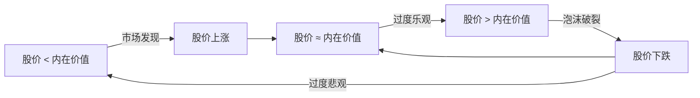
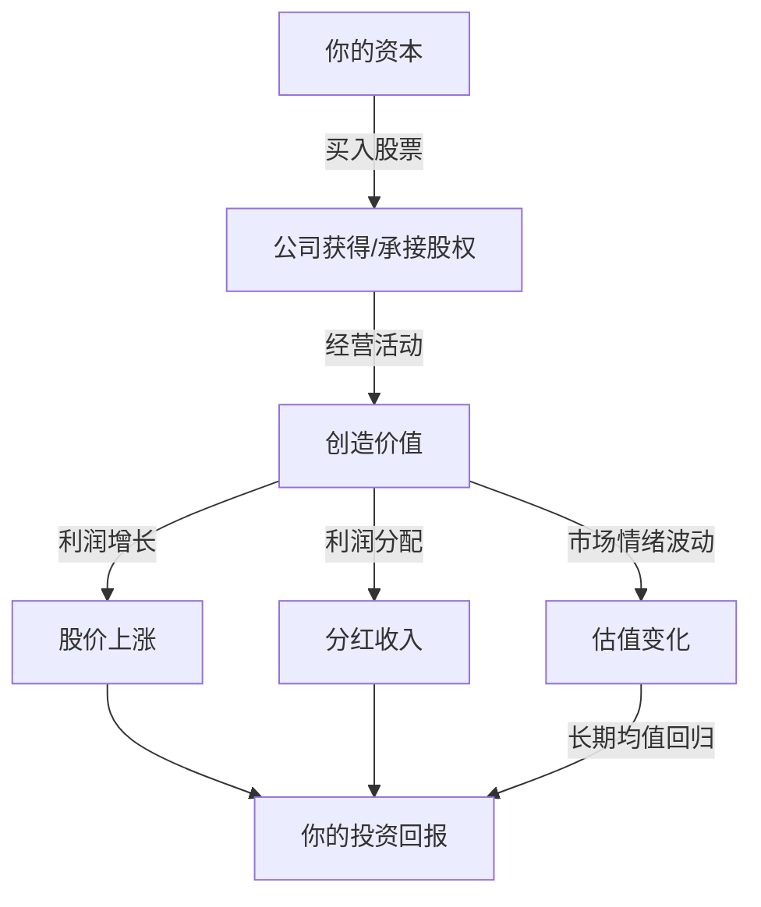

## 一、股票的本质：你买的到底是什么？

很多投资者炒了一辈子股，都没有真正理解股票的本质。他们把股票当成一串代码、一个涨跌的数字，或者一张可以买卖的"票"。这种认知偏差是绝大多数散户亏损的根本原因。

**股票的本质是企业所有权的凭证。** 当你买入一股贵州茅台的股票，你就成了贵州茅台酒厂的股东之一——虽然是微不足道的一小部分，但法律意义上，你拥有这家公司万分之几的所有权。公司的利润有你的一份，公司的资产有你的一份。

理解这一点至关重要。因为它决定了你看待投资的方式：

- **如果你买的是企业**，你会关心这家公司赚不赚钱、未来能不能赚更多钱、管理层靠不靠谱。
- **如果你买的是代码**，你只会关心明天涨还是跌、有没有人愿意出更高的价格接盘。

前者是投资，后者是投机。投机不是不可以，但你要清楚自己在做什么。

### 1.1 从公司说起：股票是怎么诞生的

要理解股票，先要理解公司的本质。

#### 公司是"人"，股东是"主人"

法律上，公司是一个独立的"法人"——它像一个虚拟的人，可以签合同、借钱、打官司、拥有资产。公司和股东是两个独立的法律主体：公司的债务是公司的，不是股东的。你买了贵州茅台的股票，茅台酒厂欠了债，债主不能来找你要钱。这就是**有限责任**——你最多损失投入的本金，不会倾家荡产。

股东是公司的所有者。所有者通过两种方式行使权力：

1. **投票权**：股东大会上对重大事项投票（选董事、批准重大交易等）
2. **收益权**：分享公司的利润（通过分红）和资产（公司清算时）

#### 股票是所有权的"切片"

一家公司的总价值被切成若干等份，每一份就是一股。假设一家公司总共发行了1亿股，你持有100万股，你就拥有这家公司1%的所有权。

```text
公司总价值 = 10亿元
总股本     = 1亿股
每股价值   = 10元

你持有 100万股 → 拥有公司 1% 的所有权
                 → 享有 1% 的利润分配权
                 → 拥有 1% 的投票权
                 → 公司清算时可获得 1% 的剩余资产
```

#### 从私有到公开：IPO的本质

IPO（首次公开募股）就是公司第一次把自己的股份拿到公开市场上卖。在此之前，公司的股份只在创始人、员工、风投等少数人之间流通。IPO之后，任何人都可以在证券交易所买卖这家公司的股票。

IPO对公司意味着什么？**融资**。公司通过出售股份获得资金，用于扩大生产、研发、还债等。IPO对投资者意味着什么？**流动性**。你随时可以买入或卖出，不必像风投那样等好几年。

但要注意：IPO后公司拿到的钱是首次发售的钱。之后你从别人手里买股票，钱是给卖股票的那个人的，不是给公司的。很多人误以为买股票就是给公司投钱，其实大部分时候你只是从上一个股东手里接过了"所有权凭证"。

### 1.2 股票的种类：不只是"一张票"

#### 普通股 vs 优先股

| 特性 | 普通股 | 优先股 |
|------|--------|--------|
| 投票权 | 有 | 通常无或受限 |
| 分红 | 不固定，视公司盈利而定 | 固定股息率，优先于普通股 |
| 清算顺序 | 最后受偿 | 优先于普通股 |
| 价格波动 | 大 | 相对小 |
| 上市流通 | 是 | 少数上市流通 |
| 适合人群 | 追求成长和资本增值 | 追求稳定现金流 |

散户在A股市场上买的绝大多数都是**普通股**。优先股通常由机构投资者持有，散户接触较少。

#### A股、B股、H股、美股

同一公司可以在不同市场发行不同类型的股票：

- **A股**：在中国境内上市，以人民币计价，中国大陆投资者主要交易的品种
- **B股**：在中国境内上市，以美元（上海）或港币（深圳）计价，早期为吸引外资设立
- **H股**：在香港上市的中国大陆企业股票，以港币计价
- **美股/ADR**：在美国上市或以存托凭证形式交易

同一家公司的A股和H股代表的是同一家公司的所有权，但价格往往不同。这种价差（AH溢价）反映了两个市场的流动性、投资者结构和制度差异。

#### 股本结构中的关键概念

| 概念 | 含义 | 对投资者的意义 |
|------|------|---------------|
| 总股本 | 公司发行的全部股票数量 | 决定每股收益的分母 |
| 流通股 | 可以在二级市场自由买卖的股票 | 决定实际可交易的量 |
| 限售股 | 有锁定期，暂时不能卖的股票 | 解禁时可能形成抛压 |
| 大股东持股 | 创始人/机构持有的大比例股份 | 持股比例高通常意味着利益绑定 |
| 股权质押 | 大股东把股票抵押借钱 | 高质押率是风险信号 |

理解股本结构非常重要。比如一家公司总股本1亿股，但只有2000万股是流通股，那它的股价就更容易被操纵。再比如大股东高比例质押股票（超过80%），一旦股价大跌触及平仓线，就会被迫卖出，形成"踩踏"。

### 1.3 股东的权利与义务：你到底能做什么

很多人买了股票却不知道自己有哪些权利。作为股东，你享有以下权利：

#### 收益权

- **分红权**：公司盈利后决定分红，你按持股比例获得现金或股票分红
- **增值收益**：股价上涨后卖出获得的差价收益
- **剩余资产分配权**：公司破产清算时，在偿还所有债务后，剩余资产按股份分配

#### 参与公司治理的权利

- **投票权**：在股东大会上对重大事项投票，包括选举董事、审批关联交易、修改公司章程等
- **提案权**：持股3%以上的股东可以在股东大会上提出议案
- **知情权**：查阅公司章程、财务报告、股东大会决议等

#### 其他权利

- **优先认购权**：公司增发新股时，现有股东有权按比例优先认购
- **股份转让权**：自由买卖持有的股票

实际上，散户由于持股比例极小，投票权、提案权等治理权在日常中几乎没有实际作用。但了解这些权利有助于理解公司治理结构，特别是当出现管理层侵害股东利益的情况时。

#### 股东的义务

股东的义务很简单：**按约定缴足出资**。对散户来说，就是买股票时付清全款。除此之外，股东不承担公司的经营义务和债务义务。

### 1.4 股票赚钱的三种方式

理解了股票的本质，我们来看股票投资的收益来源。

#### 方式一：企业成长带来的价值增长

公司利润增长 → 每股收益增加 → 股价上涨。

这是最正道、最可持续的赚钱方式。逻辑链条清晰：

```text
公司产品竞争力提升
    → 营收增长
    → 利润增长
    → 每股收益(EPS)增长
    → 如果估值不变，股价必须上涨
```

**案例：贵州茅台**

贵州茅台2001年上市时股价约30元，到2021年最高涨到约2600元，20年涨了80多倍。核心驱动力就是公司利润的持续增长：

| 年份 | 净利润（亿元） | 每股收益（元） | 对应时期股价区间（元） |
|------|---------------|---------------|---------------------|
| 2001 | 3.3 | 1.31 | 30-40 |
| 2010 | 50.5 | 5.35 | 130-200 |
| 2015 | 155 | 12.34 | 160-290 |
| 2020 | 467 | 37.17 | 1100-2000 |

20年间净利润增长了140倍，股价涨了80多倍，两者的长期趋势高度一致。

**关键认知**：短期内股价可能偏离公司价值（受情绪、资金流等因素影响），但长期来看，股价是企业价值的称重机。一家公司如果持续赚钱，它的股价迟早会反映出来。

#### 方式二：股息分红

公司把一部分利润以现金形式分给股东。

分红的本质是什么？你投资了一家店，年底老板把赚的钱分给你。这就是最朴素的投资回报方式。

**高分红股票的价值**

假设你以10元/股买入一只股票，每年分红0.6元/股，股息率就是6%。即使股价10年不涨，10年后你靠分红就收回了60%的本金。

```text
第1年：买入价10元，分红0.6元，累计收益6%
第5年：累计分红3.0元，已回本30%
第10年：累计分红6.0元，已回本60%
第17年：累计分红10.2元，已完全回本，之后全是纯利润
```

这就是**股息再投资**（DRIP）策略的威力：把分到的现金再买入股票，增加持股数量，下次分红就更多，形成复利效应。

**高分红行业的代表**

| 行业 | 代表公司 | 典型股息率 | 分红特点 |
|------|---------|-----------|---------|
| 银行 | 工商银行、招商银行 | 4%-7% | 稳定、持续、比例高 |
| 电力 | 长江电力、华能国际 | 3%-5% | 现金流稳定，分红可预期 |
| 高速公路 | 宁沪高速、粤高速A | 4%-6% | 经营稳定，几乎无增长 |
| 煤炭 | 中国神华、陕西煤业 | 5%-10% | 周期行业，高分红但不稳定 |
| 白酒 | 贵州茅台、五粮液 | 1%-3% | 分红率不算高但持续增长 |

#### 方式三：估值变化（市场情绪波动）

同样一家公司，在牛市时市场愿意给30倍PE，在熊市时可能只给10倍PE。

举例说明：假设一家公司每股收益是1元，PE从10倍变成30倍，股价就从10元涨到30元——公司什么都没变，股价却涨了200%。这就是估值驱动的上涨，本质上是"市场情绪"在变化。

**估值变化是双刃剑**

- 牛市中，估值扩张可以让你赚到远超企业成长的钱
- 熊市中，估值收缩可以让你亏损远超企业基本面恶化的程度

**短期来看**，估值变化是股价涨跌的主要原因。一只股票今天的涨跌，90%可能是由情绪、资金面、消息面驱动的。

**长期来看**，估值变化只是一个"均值回归"的扰动项。PE不可能无限高或无限低，最终会回到合理区间。真正决定你长期收益的，是企业本身的盈利能力。

**三种收益来源的占比**

```text
投资时间维度：

短期（1年内）：估值变化 ≈ 70-90%，企业成长 ≈ 10-30%，分红 ≈ 0-3%
中期（3-5年）：企业成长 ≈ 50-70%，估值变化 ≈ 20-40%，分红 ≈ 5-15%
长期（10年+）：企业成长 ≈ 60-80%，分红 ≈ 15-30%，估值变化 ≈ 5-15%
```

这就是为什么长期投资者应该把注意力放在企业质量上，而不是每天盯盘。

### 1.5 股价是怎么形成的

很多人把股价当成"公司的定价"，但股价的形成机制远比这复杂。

#### 短期：供需博弈

股价的瞬时变动完全由供需决定。买的人多、卖的人少，股价就涨；反之就跌。

```text
买一  10.05元  500手
买二  10.04元  800手
买三  10.03元  300手
────────────────────
卖三  10.08元  400手
卖二  10.07元  600手
卖一  10.06元  200手
```

如果有人以10.06元的价格吃掉卖一的200手，股价就从10.05变成了10.06。反过来，如果有人以10.05元的价格卖出500手，股价就变成了10.04。

**流动性**决定了股价对买卖力量的敏感度。流通盘小的股票，少量资金就能大幅拉动股价；流通盘大的蓝筹股，需要巨量资金才能影响股价。

#### 中期：预期驱动

股票交易的是"预期"。股价反映的不是公司现在值多少钱，而是市场预期它未来能值多少钱。

```text
当前股价 = 未来现金流的折现值

P = Σ (FCFₜ / (1+r)ᵗ)
```

这就是**DCF（现金流折现）模型**的基本思想。虽然散户不需要精确计算，但理解这个原理很重要：

- **当市场预期一家公司未来增长快**：给予高估值（高PE）
- **当市场预期一家公司未来增长慢甚至衰退**：给予低估值（低PE）
- **当市场预期发生改变**（比如政策变化、新技术出现）：股价剧烈波动

#### 长期：价值回归

长期来看，股价围绕内在价值波动。这是价值投资的理论基础。



格雷厄姆在《聪明的投资者》中写道："市场短期是投票机，长期是称重机。" 这句话精确地概括了股价形成机制的核心。

### 1.6 股票与其他资产的比较

| 特性 | 股票 | 银行存款 | 房产 | 债券 | 黄金 |
|------|------|----------|------|------|------|
| 流动性 | 高（T+1） | 高 | 低（数月成交） | 中 | 高 |
| 预期年化收益 | 8%-15% | 1%-3% | 3%-8% | 3%-5% | 3%-7% |
| 风险 | 高 | 极低 | 中 | 低 | 中 |
| 门槛 | 低（几百元起） | 极低 | 高（数十万起） | 中（万元起） | 低 |
| 投入精力 | 中到高 | 无 | 中 | 低 | 低 |
| 通胀保护 | 强 | 弱 | 中 | 弱 | 强 |
| 杠杆可用性 | 有限（融资融券） | 无 | 高（房贷） | 低 | 有限 |
| 税收负担 | 分红税/资本利得 | 利息税 | 契税/增值税 | 利息税 | 较低 |

**股票长期收益率的实证数据**

- **美国股市（1926-2023）**：年化回报约10%（含股息再投资），远超债券（5%）和通胀（3%）
- **中国A股（2005-2023）**：沪深300全收益指数年化约10%，但由于波动极大（最大回撤超70%），实际体验远差于数据表现
- **全球股市长期统计**：杰里米·西格尔在《股市长线法宝》中的研究表明，在任何20年以上的持有期内，股票的回报都超过了债券、国债和黄金

**但这里有个关键前提：你买的是指数或优质公司，且能长期持有。** 如果你在2007年6000点买入上证指数，到2024年还在3000点附近，17年下来亏了50%。买入时机和标的选择极为重要。

### 1.7 股票投资的风险来源

理解收益来源的同时，必须理解风险来源。

#### 系统性风险（不可分散）

影响整个市场的风险，无论买什么股票都无法回避：

| 风险类型 | 说明 | 典型事件 |
|---------|------|---------|
| 宏观经济风险 | GDP下滑、经济衰退 | 2008年全球金融危机 |
| 政策风险 | 货币政策收紧、监管变化 | 2021年教培行业整顿 |
| 利率风险 | 利率上升导致估值压缩 | 2022年美联储加息周期 |
| 地缘政治风险 | 战争、贸易摩擦 | 中美贸易争端 |
| 流动性风险 | 市场整体流动性枯竭 | 2015年A股股灾 |

#### 非系统性风险（可分散）

影响特定公司或行业的风险，可以通过分散投资降低：

| 风险类型 | 说明 | 典型事件 |
|---------|------|---------|
| 经营风险 | 公司经营不善、产品失败 | 柯达被数码相机淘汰 |
| 财务风险 | 过度负债、现金流断裂 | 恒大集团债务危机 |
| 管理层风险 | 内部人控制、利益输送 | 獐子岛"扇贝跑了"事件 |
| 行业风险 | 行业整体衰退 | 传统零售被电商冲击 |
| 信息不对称 | 公司财务造假 | 瑞幸咖啡财务造假 |

**分散投资是唯一的"免费午餐"**

持有20-30只不同行业的优质股票，可以消除约80%的非系统性风险。但系统性风险无法通过分散来消除，只能通过择时、对冲或资产配置来管理。

### 1.8 关于股票的常见误解

#### 误解一："股价低的股票更便宜"

10元/股的股票不一定比100元/股的股票"便宜"。关键看**市盈率（PE）**和**基本面**。

```text
公司A：股价10元，每股收益0.1元，PE = 100倍（很贵）
公司B：股价100元，每股收益10元，PE = 10倍（很便宜）
```

绝对股价毫无意义。很多散户喜欢买低价股，觉得"便宜"、"涨起来空间大"，这是一个致命的认知错误。

#### 误解二："大盘股涨得慢，小盘股涨得快"

小盘股确实波动更大，但波动大不等于收益高。小盘股上涨快的同时，下跌也快。而且小盘股中充斥着大量质地差、流动性低、被庄家操纵的股票。

#### 误解三："股票不分红就是不好"

分红不是评价股票的唯一标准。巴菲特的伯克希尔·哈撒韦从不分红，但它的股价从1965年的十几美元涨到了几十万美元。原因在于公司把利润用于再投资，创造了比回购或分红更大的价值。

关键要看**留存收益的再投资回报率**：
- 如果公司用1元利润再投资能产生超过1元的市值增长 → 不分红更好
- 如果公司找不到好的投资机会 → 分红或回购更好

#### 误解四："市盈率越低越好"

低PE可能反映的是：
- 公司被市场低估 → 机会 ✅
- 公司处于衰退行业，未来利润会下降 → 陷阱 ❌
- 公司有一次性收益，未来不可持续 → 陷阱 ❌

高PE可能反映的是：
- 市场过度炒作 → 风险 ❌
- 公司处于高速成长期 → 机会 ✅

**不能脱离基本面看估值指标。**

#### 误解五："股票投资是零和游戏"

短期的股价博弈确实是零和游戏——你赚的就是别人亏的。但从长期看，股票投资是**正和游戏**。因为公司通过经营创造真实价值，整个经济在增长。所有股东作为一个整体，享受的是经济增长的红利。

美国股市从1900年到2023年，总回报超过70000倍。这不是从谁口袋里掏出来的，而是百年间企业创造的真实财富。

### 1.9 回到本质：用正确的思维框架看待股票

理解了以上内容，我们回到最初的问题：股票到底是什么？

**股票是参与经济增长的载体。** 买入一家公司的股票，本质上是把你的资本交给这家公司去经营，希望通过公司的经营获得回报。这个回报可以来自利润增长（股价上涨）、利润分配（分红），或者两者的结合。



用这个框架去看股票，很多事情就清楚了：

- 你应该关心的是**公司本身**，而不是K线图上的涨涨跌跌
- 你应该在意的是**长期回报**，而不是明天的涨跌
- 你应该追求的是**合理的买入价格**，而不是最便宜的价格
- 你应该构建的是**一个投资组合**，而不是押注单一股票

股票投资的起点，就是理解股票的本质。这个理解越深刻，你后面学到的所有技巧和策略才有根基。否则，再好的方法也会被错误的心态和认知偏差所摧毁。

> **本节核心要点**
>
> 1. 股票是企业所有权的凭证，买股票就是买公司的一部分
> 2. 股东享有收益权（分红+增值）和治理权（投票+知情）
> 3. 三种收益来源：企业成长、分红、估值变化；长期看前两者是核心
> 4. 股价短期由供需和情绪驱动，长期由企业价值决定
> 5. 理解股本结构（流通股、限售股、股权质押等）对判断股票质量至关重要
> 6. 分散投资可以降低非系统性风险，但无法消除系统性风险
> 7. 股票投资长期是正和游戏，参与者整体享受经济增长的红利
