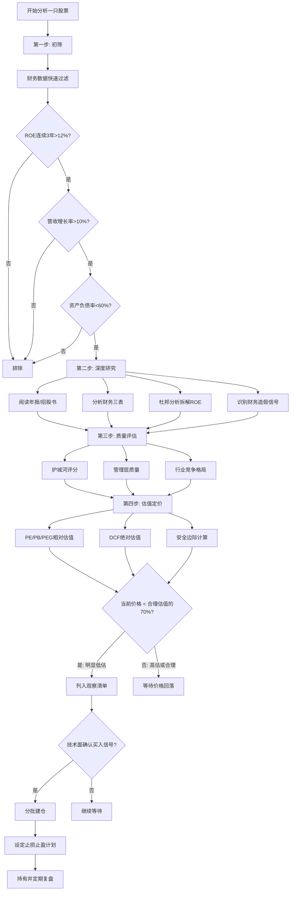
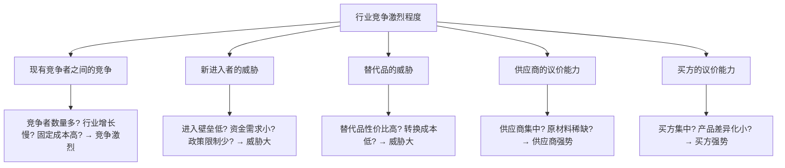

## 二、基本面分析：如何判断一家公司值不值得买

基本面分析是价值投资的核心工具。它的底层逻辑只有一句话：**买股票就是买公司，价格你付出，价值你得到。** 你要做的，就是搞清楚这家公司到底值多少钱，然后在价格低于价值时买入。

但"搞清楚一家公司值多少钱"这句话，背后是一整套系统性的分析框架。本章将从财务报表解读、核心估值方法、护城河评估、管理层质量、行业格局分析到实操检查清单，完整拆解基本面分析的每一个环节。

### 2.1 分析全景：一张图看懂基本面分析框架



> **数据支撑**：根据A股历史数据回测，同时满足ROE>15%、营收增长>15%、PE<20的股票组合，在2010-2023年期间的年化收益率约为15.2%，远超沪深300同期的6.8%。这说明严格的财务筛选确实能显著提升投资回报。但请注意，过去的表现不代表未来，筛选条件也需要根据市场环境动态调整。

### 2.2 财务报表三板斧：读懂三张表，看穿一家公司

上市公司每季度发布财务报告，每年发布年报。所有基本面分析的起点，就是读懂三张核心财务报表。

#### 2.2.1 利润表：这家公司赚不赚钱

利润表（又称损益表）反映的是**一段时间内**公司的经营成果。它的核心公式是：

```text
营业收入 - 营业成本 - 费用 - 税 = 净利润
```

**需要重点关注的科目：**

| 科目 | 含义 | 健康信号 | 危险信号 |
|------|------|----------|----------|
| 营业收入 | 卖产品/服务收到的钱 | 连续3年增长>15% | 连续下滑或突然暴增（可能是财务操纵） |
| 营业成本 | 生产产品直接花费的钱 | 成本增速低于营收增速 | 成本增速持续高于营收增速 |
| 毛利率 | (营收-成本)/营收 | 稳定或上升 | 持续下降，说明产品竞争力减弱 |
| 销售费用 | 打广告、搞促销的钱 | 占营收比例稳定 | 突然大增，可能是产品卖不动了在砸钱促销 |
| 管理费用 | 管理层工资、办公费等 | 占比合理 | 异常增长，可能存在利益输送 |
| 研发费用 | 技术研发投入 | 占比合理且有产出 | 高研发但无成果转化 |
| 净利润 | 扣除所有成本后真正赚到的钱 | 持续增长且与营收匹配 | 增长但经营现金流不匹配（可能是纸面利润） |

**毛利率的实战判断法：**

毛利率反映的是产品的定价权和竞争力。不同行业的毛利率差异巨大：

- 白酒行业：毛利率普遍在60%-90%（茅台91%），因为品牌溢价极高
- 超市零售：毛利率通常在15%-25%，薄利多销模式
- 软件行业：毛利率可达70%-90%，因为边际成本极低
- 制造业：毛利率通常在20%-40%，取决于技术壁垒

**判断标准不是绝对值，而是趋势。** 一家公司毛利率从40%连续三年降到25%，即使25%在行业里不算低，也说明竞争力在恶化。

#### 2.2.2 资产负债表：这家公司的家底厚不厚

资产负债表反映的是**某一天**公司的财务状况，是一个"快照"。核心等式：

```text
资产 = 负债 + 所有者权益（净资产）
```

**资产端关键科目：**

| 科目 | 含义 | 分析要点 |
|------|------|----------|
| 货币资金 | 银行存款+现金 | 越多越好，但要和短期借款对比——如果账上很多现金却还在借高息贷款，可能资金被冻结或造假 |
| 应收账款 | 别人欠公司的钱 | 占营收比例不宜过高（>30%警惕），增长不应持续快于营收增长 |
| 存货 | 仓库里的货 | 占流动资产比例不宜过高，存货周转天数不应持续增加 |
| 固定资产 | 厂房设备等 | 重资产行业占比高是正常的，但要注意折旧政策是否合理 |
| 商誉 | 收购溢价部分 | 越少越好，商誉占净资产>30%要高度警惕，一旦减值会严重冲击利润 |
| 在建工程 | 正在建设的项目 | 占比过高且长期不转固定资产，可能存在资金挪用 |

**负债端关键指标：**

| 指标 | 公式 | 健康范围 | 注意事项 |
|------|------|----------|----------|
| 资产负债率 | 总负债/总资产 | <60%（金融行业除外） | 不同行业差异大，地产行业70%-80%是常态 |
| 流动比率 | 流动资产/流动负债 | 1.5-2.0 | <1说明短期偿债能力不足 |
| 速动比率 | (流动资产-存货)/流动负债 | >1 | 剔除存货后更能反映真实偿债能力 |
| 有息负债率 | 有息负债/总资产 | <30% | 比资产负债率更关键，关注要付利息的债务 |

**一个被忽视的指标——应收账款周转天数：**

应收账款周转天数 = 365 / (营收 / 平均应收账款)

这个指标告诉你，公司把货卖出去后平均多久能收到钱。如果这个数字在持续增加，说明公司在用"赊销"来冲营收——货是卖出去了，但钱收不回来。这是利润质量恶化的重要信号。

**案例：** 某环保公司在2018-2020年间营收增长了40%，但应收账款周转天数从90天飙升到210天。后来该公司暴雷，大量应收账款无法收回，利润表上显示的"盈利"大部分都是纸面数字。

#### 2.2.3 现金流量表：利润是真金白银还是纸面富贵

现金流量表是三张表中最难造假的，因为现金的流入流出有银行流水做背书。它把公司的现金流分为三类：

**经营活动现金流（最重要）：**

日常经营产生的现金流入和流出。这是公司"造血能力"的直接体现。

- **经营性现金流/净利润 > 1**：利润是真金白银，质量高
- **经营性现金流/净利润 < 0.5**：利润质量存疑，可能是赊销堆出来的
- **经营性现金流为负**：公司经营在"烧钱"，需要持续融资维持

**投资活动现金流：**

买卖资产、对外投资的现金流动。通常为负值（公司在投资扩张），这不一定是坏事。但如果经营现金流也为负，公司就只能靠借钱过日子了。

**筹资活动现金流：**

借钱还钱、发股分红的现金流动。频繁的股权融资（增发股票）会稀释老股东权益，需要警惕。

**自由现金流——股东真正能拿到的钱：**

```text
自由现金流 = 经营性现金流 - 资本性支出
```

自由现金流是公司在维持正常运营和必要投资之后，真正可以分配给股东的钱。巴菲特反复强调，一家好公司必须能持续产生充沛的自由现金流。

**现金流量组合快速判断法：**

| 经营现金流 | 投资现金流 | 筹资现金流 | 公司状态 | 投资价值 |
|-----------|-----------|-----------|----------|----------|
| + | - | - | 经营赚钱、在投资、还在还债/分红 | 最健康，成熟优质企业 |
| + | - | + | 经营赚钱、在投资、还在借钱扩张 | 成长期企业，看扩张效率 |
| + | + | - | 经营赚钱、在卖资产、在还债 | 可能在收缩，需了解原因 |
| - | - | + | 经营烧钱、在投资、靠借钱维持 | 高风险初创企业 |
| - | + | + | 经营烧钱、在卖资产、还在借钱 | 非常危险，可能在靠融资续命 |

#### 2.2.4 财务造假的十大红旗信号

基本面分析的一个重要目的，是识别财务造假。以下是经审计师和专业投资者总结的高风险信号：

**利润表造假信号：**

1. **营收增长但现金流不增长**：利润是算出来的，现金是数出来的。两者长期背离，利润大概率有问题
2. **毛利率远高于同行且无法解释**：如果一家公司的毛利率比行业龙头还高20个百分点，却没有令人信服的理由，要高度怀疑
3. **频繁变更会计政策**：折旧方法、收入确认方式突然改变，可能是在调节利润
4. **大额一次性收益**：卖资产、政府补贴、债务重组带来的利润不可持续，要看扣非净利润

**资产负债表造假信号：**

5. **存货异常增长**：存货增长远快于营收增长，可能是虚增存货来隐藏成本
6. **应收账款异常增长**：可能是虚构收入，通过关联方"购买"产品但不真正付款
7. **在建工程长期不转固**：大量资金投入"在建工程"但迟迟不转为固定资产，可能资金已被挪用
8. **货币资金高但借款也高**：账上有几十亿现金却还在借高息贷款，钱可能不在了（参考康美药业造假案，虚增货币资金299亿）
9. **商誉占净资产比例过高**：高溢价收购形成的商誉，一旦减值就是利润的"定时炸弹"
10. **关联交易频繁且金额大**：通过关联方虚构交易是最常见的造假手段之一

### 2.3 杜邦分析：像庖丁解牛一样拆解ROE

ROE（净资产收益率）是巴菲特最看重的指标，但光看ROE的数字是不够的。杜邦分析法把ROE拆解为三个因子，帮你看清楚ROE的"质量"：

```text
ROE = 净利率 × 资产周转率 × 权益乘数
    = (净利润/营收) × (营收/总资产) × (总资产/净资产)
```

**三个因子的含义：**

| 因子 | 驱动方式 | 典型行业 | 特点 |
|------|----------|----------|------|
| 净利率高 | 靠高利润率赚钱 | 白酒（茅台）、医药、奢侈品 | 壁垒最高，可持续性最强 |
| 资产周转率高 | 靠薄利多销赚钱 | 零售（沃尔玛）、快餐（麦当劳） | 需要优秀的运营能力 |
| 权益乘数高 | 靠高杠杆赚钱 | 银行、房地产 | 风险最大，顺周期时赚得多，逆周期时亏得惨 |

**实战案例对比：**

假设A、B、C三家公司ROE都是20%，但拆解后完全不同：

- **A公司**：净利率20% × 周转率0.5 × 权益乘数2.0 → 靠高利润率驱动
- **B公司**：净利率5% × 周转率2.0 × 权益乘数2.0 → 靠高周转驱动
- **C公司**：净利率10% × 周转率0.5 × 权益乘数4.0 → 靠高杠杆驱动

A公司的ROE质量最高，因为高利润率通常意味着强定价权和品牌溢价。C公司的ROE最危险，因为4倍的权益乘数意味着资产负债率高达75%，一旦行业下行，高杠杆会变成致命伤。

**核心原则：优先选择由净利率驱动的高ROE公司，谨慎对待由高杠杆驱动的高ROE公司。**

### 2.4 核心估值指标：给公司算一笔账

估值是基本面分析的"定价环节"。再好的公司，买贵了也会亏钱。

#### 2.4.1 市盈率（PE）：最常用的估值标尺

```text
PE = 股价 / 每股收益 = 总市值 / 净利润
```

PE告诉你：按照当前盈利水平，多少年能回本。PE=20意味着按当前利润，20年回本。

**PE的分类：**

| 类型 | 计算方式 | 适用场景 |
|------|----------|----------|
| 静态PE | 当前股价 / 上一年EPS | 参考价值有限，数据滞后 |
| 滚动PE（TTM） | 当前股价 / 最近4个季度EPS | 最常用，反映最新盈利水平 |
| 动态PE（Forward） | 当前股价 / 预期未来EPS | 有前瞻性，但依赖预测准确性 |

**PE的行业比较原则：**

PE必须在同行业内比较，不能跨行业对比。原因在于不同行业的增长预期、风险特征完全不同：

| 行业 | 典型PE范围 | 原因 |
|------|-----------|------|
| 银行 | 4-8倍 | 增长慢、高杠杆、政策风险 |
| 公用事业 | 10-15倍 | 稳定但增长有限 |
| 消费品 | 20-35倍 | 稳定增长、品牌溢价 |
| 科技成长 | 30-60倍 | 高增长预期 |
| 医药创新 | 40-80倍 | 研发管线价值、长期增长潜力 |

**PE的陷阱：** 周期股在利润最好的时候PE最低，但那往往是买入最危险的时候。例如钢铁、煤炭、化工等周期性行业，在景气高点利润暴增，PE可能只有5-8倍，看起来很"便宜"，但接下来利润会大幅下滑甚至亏损。周期股要用"低PE卖出、高PE买入"的反向思维。

#### 2.4.2 市净率（PB）：资产底价的标尺

```text
PB = 股价 / 每股净资产 = 总市值 / 净资产
```

PB告诉你：你花多少钱买1块钱的净资产。

**PB的适用范围：**

- **最适合**：银行、保险、地产等重资产行业（资产价值清晰可衡量）
- **参考价值有限**：互联网、咨询、品牌公司等轻资产行业（核心价值不在资产负债表上，比如腾讯的品牌价值、用户数据、技术专利都不会体现在净资产中）

**PB的判断标准：**

| PB范围 | 一般含义 | 例外情况 |
|--------|----------|----------|
| <1（破净） | 股价低于净资产 | 可能是低估，也可能是资产质量差（如坏账多的银行） |
| 1-3 | 合理区间 | 看行业和盈利质量 |
| 3-5 | 偏贵 | 需要高增长支撑 |
| >5 | 很贵 | 除非有极强的无形资产价值 |

#### 2.4.3 PEG：成长股的定价密码

```text
PEG = PE / 净利润增长率（%）
```

PEG由投资大师彼得·林奇推广，它解决了PE无法反映增长的缺陷。一家PE=30但增长50%的公司（PEG=0.6），可能比PE=10但增长5%的公司（PEG=2）更值得买。

| PEG范围 | 含义 | 林奇的建议 |
|---------|------|-----------|
| <0.5 | 严重低估 | 强烈买入信号 |
| 0.5-1 | 低估 | 值得买入 |
| 1-1.5 | 合理 | 持有观察 |
| >1.5 | 高估 | 谨慎或卖出 |

**PEG的局限性：**

1. 依赖对未来增长率的预测，而预测经常不准确
2. 不适用于增长率为负或不稳定的公司
3. 不适用于周期性行业（增长率波动太大）
4. 一般用未来3-5年的预期增长率，而不是过去增长率

#### 2.4.4 DCF估值法：理论上的"终极估值"

DCF（现金流折现）的逻辑是：一家公司的价值等于它未来所有自由现金流的现值之和。

```text
公司价值 = Σ [FCFt / (1+r)^t] + 终值 / (1+r)^n
```

其中：
- FCFt = 第t年的自由现金流
- r = 折现率（通常用WACC，即加权平均资本成本，一般取8%-12%）
- 终值 = 第n年之后所有现金流的现值（通常用永续增长模型计算）
- n = 预测年数（通常5-10年）

**DCF的实操步骤：**

1. **预测未来5-10年的自由现金流**：基于历史增长率、行业趋势、公司战略进行预测
2. **确定折现率**：反映投资的风险水平，风险越高折现率越高
3. **计算终值**：假设公司在预测期后以一个较低的稳定速率（通常2%-3%）永续增长
4. **折现求和**：把所有未来现金流折算成今天的价值
5. **减去净负债**：得到股权价值
6. **除以总股本**：得到每股内在价值

**DCF的局限性（必须了解）：**

DCF看似科学严谨，但对输入参数极为敏感。折现率从10%变为12%，估值结果可能相差30%以上。增长率假设差2个百分点，结果差异更大。因此：

- DCF的价值不在于得出一个精确数字，而在于帮你建立对公司价值的**合理区间判断**
- 实操中建议做**敏感性分析**：分别用乐观、中性、悲观假设算三个值，取中间值作为参考
- 对于高成长公司（早期互联网、生物医药），DCF基本不适用，因为你无法可靠预测未来的现金流

#### 2.4.5 不同行业的估值方法选择

| 行业类型 | 首选估值方法 | 原因 |
|----------|-------------|------|
| 银行/保险 | PB + 股息率 | 资产质量是核心，利润受政策影响大 |
| 消费品 | PE + PEG | 盈利稳定，增长可预测 |
| 周期股（钢铁/化工） | PB + 市销率 | 利润波动大，PE在周期顶部会误导 |
| 互联网/科技 | PS（市销率）+ 用户指标 | 早期可能亏损，PE无意义 |
| 地产 | NAV（净资产价值法） | 核心资产是土地储备，需重估 |
| 医药创新 | 管线估值法（rNPV） | 价值在研发管线，不在当前利润 |
| 公用事业 | PE + 股息率 | 稳定现金流，分红是核心回报 |

### 2.5 护城河分析：这家公司凭什么赚钱

"护城河"是巴菲特提出的核心概念，由晨星公司（Morningstar）的帕特·多尔西系统化。护城河是企业抵御竞争、维持高利润的持久优势。**没有护城河的公司，今天的高利润明天就可能被竞争对手抢走。**

#### 2.5.1 五种主要护城河

**1. 品牌护城河**

消费者愿意为品牌付出溢价，且品牌认知一旦建立很难被替代。

- **检验标准**：提价后销量不明显下降，说明品牌有真实溢价能力
- **典型案例**：茅台（出厂价持续上涨但供不应求）、苹果（iPhone定价远高于成本）、爱马仕（奢侈品中的奢侈品）
- **伪品牌护城河**：如果一个品牌只能靠打折促销维持销量，说明它没有真正的品牌溢价。很多"知名品牌"其实并没有护城河

**2. 转换成本护城河**

用户从一个产品切换到另一个产品需要付出巨大的时间、金钱或精力成本。

- **检验标准**：客户留存率是否长期>90%
- **典型案例**：微软Office（企业切换到其他办公软件需要重新培训、迁移数据、重建模板）、银行基本账户（换银行要改工资卡、水电煤代扣等一串绑定）、ERP系统（SAP、Oracle的迁移成本可能高达数千万）
- **量化评估**：转换成本 = 迁移费用 + 学习成本 + 风险成本 + 机会成本。如果转换成本占年度使用费用的50%以上，护城河较强

**3. 网络效应护城河**

用户越多，产品对每个用户的价值越大，形成正反馈循环。

- **检验标准**：用户数量增长是否带来单位用户价值提升
- **典型案例**：微信（你所有的朋友都在微信上，所以你无法离开）、淘宝（买家多→卖家多→商品多→买家更多）、Visa/Mastercard（商户接受→持卡人多→更多商户接入）
- **网络效应的分类**：
  - 直接网络效应：同侧用户互相增值（微信用户之间）
  - 间接网络效应：跨侧用户互相增值（淘宝的买家和卖家）
  - 数据网络效应：用户越多数据越多，产品越智能（搜索引擎、推荐算法）

**4. 成本优势护城河**

能以比竞争对手更低的成本生产和交付产品。

- **来源**：
  - 规模效应：产量越大，单位成本越低（如台积电的芯片制造规模）
  - 地理位置优势：靠近原材料产地或消费市场
  - 独特资源：拥有竞争对手无法获取的矿产、技术或牌照
  - 流程优势：独特的生产流程或管理体系带来效率领先
- **检验标准**：毛利率是否持续高于竞争对手5个百分点以上
- **注意事项**：单纯靠低价竞争不是护城河，因为竞争对手也可以降价。真正的成本优势是"我能做到的价格，竞争对手做到了就亏损"

**5. 特许经营权护城河**

政府牌照、专利、独家授权等法律或制度壁垒。

- **典型案例**：机场（一个城市通常只有一个主要机场）、电网（自然垄断）、创新药企（专利保护期20年）、免税店牌照（中国中免）
- **关键问题**：特许经营权有期限吗？到期后能否续期？政策环境是否会变化？

#### 2.5.2 护城河评估评分表

实际分析中，可以用以下评分框架对护城河进行量化评估：

| 评估维度 | 强护城河（3分） | 弱护城河（1分） | 无护城河（0分） |
|----------|----------------|-----------------|----------------|
| 定价权 | 持续提价不影响销量 | 偶尔能提价 | 只能降价竞争 |
| 客户留存 | 留存率>95% | 留存率80%-95% | 留存率<80% |
| 毛利率趋势 | 持续稳定或上升 | 波动但未明显下降 | 持续下降 |
| 市场份额 | 行业前二且份额稳定 | 份额波动 | 份额持续下降 |
| 竞争壁垒 | 新进入者需要5年以上追赶 | 2-5年可追赶 | 2年内可复制 |
| 总分 | 12-15分=宽护城河 | 6-11分=窄护城河 | 0-5分=无护城河 |

### 2.6 管理层评估：谁在驾驶这艘船

再好的商业模式，也需要优秀的管理层来执行。散户往往忽视管理层评估，但这恰恰是区分好公司和伟大公司的关键。

#### 2.6.1 管理层评估的四个维度

**1. 诚信度：是否对股东坦诚**

- 年报中是否坦诚讨论风险和失败，还是只报喜不报忧
- 是否频繁变更审计机构（可能是审计师不愿配合造假）
- 管理层是否持有公司大量股票（利益绑定）
- 历史上是否有过财务造假、违规担保、内幕交易记录

**2. 能力：过往业绩如何**

- 管理层任职期间公司ROE、营收、利润的增长情况
- 资本配置能力：赚到的钱是做了明智的投资，还是乱并购、乱多元化
- 重大决策的历史记录：过去的战略决策效果如何

**3. 激励机制：利益是否和股东一致**

- 管理层薪酬是否与公司业绩挂钩
- 股权激励的行权条件是否合理（太容易达到说明激励力度不够）
- 管理层是否在增持或减持自家股票

**4. 治理结构：权力是否受制约**

- 董事长和总经理是否由同一人担任（兼任意味着权力过于集中）
- 独立董事是否真正独立（是否只是"花瓶董事"）
- 大股东是否频繁占用上市公司资金

#### 2.6.2 管理层质量的快速检验法

读年报时，重点关注以下几项：

1. **董事长致辞**：是空话套话还是有实质内容？是否坦诚面对问题？
2. **管理层讨论与分析（MD&A）**：是否对业务做出了有深度的分析，还是在敷衍了事
3. **关联交易**：金额是否合理，是否在掏空上市公司
4. **分红政策**：是否持续稳定分红（愿意分红的管理层通常更尊重小股东）
5. **回购记录**：在股价低迷时是否回购股票（说明管理层认为公司被低估）

### 2.7 行业分析框架：赛道决定了你的天花板

选对公司很重要，选对行业同样重要。一个好行业里的普通公司，往往比一个差行业里的好公司更赚钱。

#### 2.7.1 波特五力分析模型

迈克尔·波特的五力模型是分析行业竞争格局的经典框架：



**五力越弱，行业越有吸引力：**

- 竞争者少且格局稳定 → 不用打价格战
- 进入壁垒高 → 新人不会轻易来抢生意
- 替代品少 → 产品不会被新技术颠覆
- 供应商分散 → 原材料成本可控
- 买方分散 → 有定价权

**好行业的典型案例：** 白酒行业。进入壁垒极高（品牌+酿造工艺+时间积淀）、几乎无替代品、供应商分散（粮食不稀缺）、买方分散（消费者对价格不敏感）、竞争格局稳定（茅台五粮液泸州老窖格局多年未变）。

**差行业的典型案例：** 航空业。进入壁垒低（飞机可以租赁）、竞争者众多、产品同质化严重、固定成本极高（飞机+燃油+人工）、买方比价容易（票价透明），导致行业长期微利甚至亏损。

#### 2.7.2 行业生命周期

| 阶段 | 特征 | 投资策略 | 风险等级 |
|------|------|----------|----------|
| 导入期 | 技术不成熟、市场小、亏损多 | 适合VC/PE，不适合散户 | 极高 |
| 成长期 | 需求爆发、增速快、竞争加剧 | **最佳投资窗口**，选龙头 | 中高 |
| 成熟期 | 增速放缓、格局稳定、利润丰厚 | 适合价值投资和分红策略 | 中低 |
| 衰退期 | 需求萎缩、产能过剩、利润下降 | 回避或做空 | 高（下行风险） |

**判断行业所处阶段的关键指标：**

- 行业整体营收增速：>20%可能是成长期，5%-20%可能是成熟期，<5%或负增长可能是衰退期
- 行业集中度（CR3/CR5）：集中度上升说明进入成熟期，龙头在收割份额
- 新企业进入数量：新企业大量涌入说明处于成长期，新企业不再进入说明壁垒已形成
- 技术迭代速度：快速迭代说明还在导入/成长期，技术稳定说明进入成熟期

#### 2.7.3 行业对比分析模板

在实际分析中，可以制作如下对比表来评估不同行业的投资价值：

| 评估维度 | 行业A | 行业B | 行业C |
|----------|-------|-------|-------|
| 市场空间（亿元） | | | |
| 年复合增长率 | | | |
| CR3集中度 | | | |
| 平均毛利率 | | | |
| 平均ROE | | | |
| 政策环境 | | | |
| 技术颠覆风险 | | | |
| 进入壁垒高度 | | | |
| 综合评级 | | | |

### 2.8 实操检查清单：从发现到买入的完整流程

理论学完了，下面是可直接使用的实操流程。

#### 2.8.1 快速筛选清单（5分钟排除法）

用以下条件快速过滤，不满足任何一条就排除：

- [ ] ROE连续3年 > 12%
- [ ] 营收连续3年正增长
- [ ] 资产负债率 < 60%（金融行业除外）
- [ ] 经营性现金流/净利润 > 0.7
- [ ] 滚动PE < 行业中位数的1.5倍
- [ ] 非ST、非*ST股票
- [ ] 最近3年无重大财务造假记录
- [ ] 大股东质押比例 < 50%

#### 2.8.2 深度研究清单（3-5小时精读法）

通过初筛后，进行深度研究：

**第一步：阅读年报（1-2小时）**

- [ ] 阅读"管理层讨论与分析"章节，了解公司对自身业务的判断
- [ ] 阅读"经营情况讨论"，看营收和利润变化的原因
- [ ] 检查审计报告意见类型（标准无保留意见才正常）
- [ ] 查看前十大股东变化（机构在加仓还是减仓）
- [ ] 检查关联交易、担保、诉讼等风险事项

**第二步：财务分析（1小时）**

- [ ] 制作3-5年的关键财务指标趋势表
- [ ] 进行杜邦分析，确认ROE的驱动因素
- [ ] 检查现金流与利润的匹配度
- [ ] 计算应收周转天数、存货周转天数的变化趋势
- [ ] 对比同行业公司的财务指标

**第三步：估值计算（30分钟）**

- [ ] 用PE/PB/PEG进行相对估值
- [ ] 用DCF进行绝对估值（做乐观/中性/悲观三种假设）
- [ ] 计算安全边际（当前价格 vs 合理估值）

**第四步：风险评估（30分钟）**

- [ ] 列出3-5个可能导致投资失败的风险因素
- [ ] 评估每个风险发生的概率和影响程度
- [ ] 确认自己能承受的最大亏损

### 2.9 常见误区与纠正

| 误区 | 正确认知 |
|------|----------|
| "PE越低越好" | PE低可能是因为市场预期利润会下降，要分析低PE的原因 |
| "ROE高就是好公司" | 高杠杆驱动的ROE不可持续，必须用杜邦分析拆解 |
| "利润增长就是好" | 如果利润增长靠应收账款堆出来，质量很差 |
| "好公司随时可以买" | 好公司买贵了也会亏钱，估值纪律同样重要 |
| "市盈率可以跨行业比较" | 银行PE=5不代表比消费股PE=25更便宜 |
| "破净就是捡便宜" | 可能是资产质量恶化，净资产里有大量坏账或低效资产 |
| "研发投入高说明公司重视创新" | 要看研发产出（专利、新产品营收占比），不是投了钱就有结果 |
| "机构持仓多说明公司好" | 机构也会犯错，而且机构持仓信息有滞后性 |
| "利好消息出尽就是利空" | 这是技术面思维，基本面分析关注的是公司长期价值 |
| "分红多就是好公司" | 要看分红率是否可持续，有的公司借钱分红是不可取的 |

### 2.10 信息获取渠道

做好基本面分析，需要获取高质量的信息。以下是主要渠道：

| 渠道 | 用途 | 特点 |
|------|------|------|
| 巨潮资讯网（cninfo.com.cn） | 年报、季报、公告 | 官方指定信息披露平台，数据最权威 |
| 东方财富/同花顺 | 财务数据查询、研报 | 数据整理方便，适合快速查阅 |
| 雪球 | 投资者讨论、分析文章 | 有深度分析，但也有大量噪音 |
| 券商研报（万得/慧博） | 行业研究、公司深度 | 专业性强，但要注意利益冲突 |
| 公司官网投资者关系页面 | 业绩说明会、投资者问答 | 第一手信息 |
| 天眼查/企查查 | 股权结构、诉讼信息 | 了解公司背后的真实关系网络 |

**使用建议：** 原始年报必须亲自读，不能只看二手解读。券商研报可以作为参考，但要警惕"看多不看卖"的偏见——券商很少出"卖出"评级。独立思考永远是最重要的。

---

基本面分析不是一蹴而就的事。它需要你花时间读年报、算指标、比行业、评管理层。但一旦你掌握了这套框架，就能在市场噪音中保持清醒，做出基于事实而非情绪的投资决策。**记住：投资中最大的风险不是买错了，而是买贵了——而基本面分析，正是帮你避免买贵的最可靠工具。**
