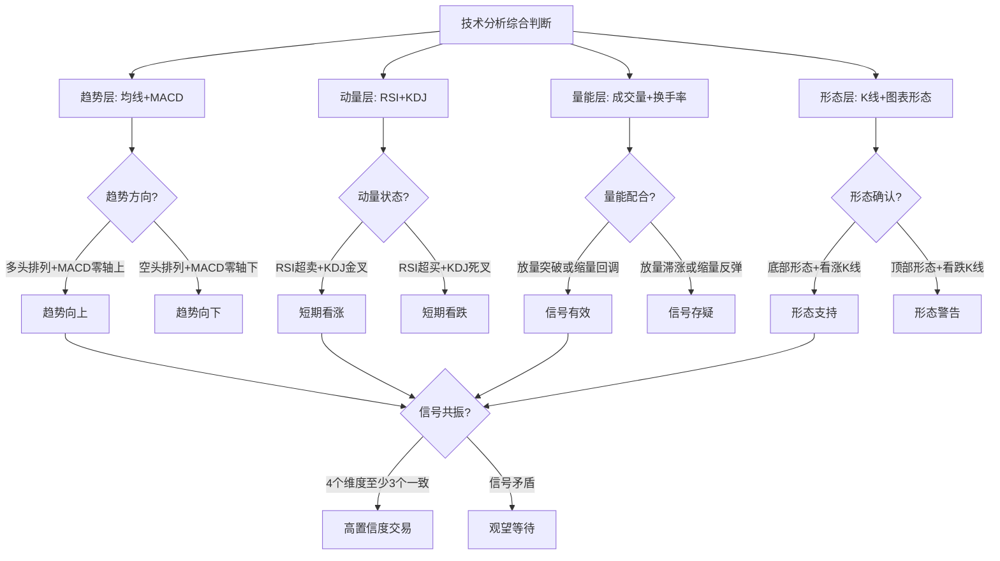

## 三、技术分析基础

技术分析（Technical Analysis）是通过研究市场过去的价格和成交量数据来预测未来价格走势的分析方法。与基本面分析关注"公司值多少钱"不同，技术分析只关注"市场认为它值多少钱"，以及这种认知会如何变化。

技术分析的核心逻辑是：价格已经包含了一切信息。无论利好利空，无论机构散户，所有市场参与者的判断最终都会体现在价格和成交量上。因此，研究价格本身，就是研究所有市场参与者行为的总和。

### 3.1 技术分析的理论基础

#### 3.1.1 三大假设

技术分析建立在三个基本假设之上，理解这三个假设是正确使用技术分析的前提：

**假设一：市场行为包容一切信息（Market Action Discounts Everything）**

这个假设认为，任何可能影响股票价格的因素——基本面、政治因素、心理因素、资金流向——都已经反映在价格中了。因此，分析者不需要研究这些因素本身，只需要研究价格。

这个假设是技术分析的根基。它意味着：如果一只股票的财报很好但价格不涨，那一定有市场知道但你不知道的信息在压制股价。价格永远是对的，错的是你的信息不够。

**假设二：价格沿趋势运动（Prices Move in Trends）**

价格不会随机游走，而是沿一定方向运动，直到出现使趋势反转的力量。趋势分为三种：

- 上升趋势：高点不断抬高，低点也不断抬高
- 下降趋势：高点不断降低，低点也不断降低
- 横盘整理：价格在一定区间内震荡，没有明确方向

这个假设的实际意义是：顺势而为。在上升趋势中做多，下降趋势中做空或空仓，比逆势操作的胜率高得多。

**假设三：历史会重演（History Tends to Repeat Itself）**

市场参与者是人，人性中的贪婪、恐惧、从众心理不会改变。因此，过去反复出现的市场形态和价格模式，在未来大概率还会出现。

这不是说历史会简单重复，而是说人类在面对类似情况时会做出类似反应。头肩顶、双底这些形态之所以有效，本质上是因为它们反映了群体心理的阶段性变化。

#### 3.1.2 技术分析 vs 基本面分析

| 维度 | 技术分析 | 基本面分析 |
|------|----------|------------|
| 核心关注 | 价格和成交量 | 财务数据和业务前景 |
| 时间框架 | 短中期为主 | 中长期为主 |
| 适用场景 | 择时、短线交易 | 选股、价值投资 |
| 优势 | 反应快、信号明确 | 把握长期价值 |
| 劣势 | 滞后性、假信号多 | 财报有滞后、难以估值 |
| 代表人物 | 查尔斯·道、约翰·墨菲 | 本杰明·格雷厄姆、巴菲特 |

实际投资中，二者不应对立，而应互补。基本面帮你选出值得投资的标的，技术面帮你找到合适的买卖时机。

### 3.2 趋势分析：均线系统（Moving Average）

#### 3.2.1 均线的基本概念

均线（MA）是将一定周期内的收盘价取平均值后连成的线。它的核心作用是平滑价格波动，让趋势更清晰。

常用均线及其含义：

| 均线 | 周期 | 含义 | 用途 |
|------|------|------|------|
| MA5 | 5日 | 超短线 | 日内交易参考，反映最近一周成本 |
| MA10 | 10日 | 短线 | 短线交易者关注的支撑/阻力 |
| MA20 | 20日 | 月线 | 短中期趋势分界线，约一个月交易日 |
| MA60 | 60日 | 季线 | 中期趋势方向，机构常用 |
| MA120 | 120日 | 半年线 | 中长期趋势，牛熊转换参考 |
| MA250 | 250日 | 年线 | 长期趋势，被称为"牛熊分界线" |

#### 3.2.2 均线的实战用法

**金叉与死叉**

短期均线从下方穿越长期均线，形成"金叉"，是买入信号。短期均线从上方穿越长期均线，形成"死叉"，是卖出信号。

但要注意：金叉死叉在震荡市中会产生大量假信号。只有在趋势明确的行情中，金叉死叉的信号才相对可靠。

**多头排列与空头排列**

当MA5 > MA10 > MA20 > MA60，且均线全部向上发散时，称为"多头排列"，表明强势上涨趋势。反之，当均线全部向下发散时，称为"空头排列"，表明强势下跌趋势。

多头排列中，任何回踩均线都是加仓机会；空头排列中，任何反弹到均线都是减仓信号。

**年线的特殊意义**

股价站稳250日年线通常被视为进入牛市格局，跌破年线则被视为进入熊市。很多机构投资者把年线作为重要的仓位管理参考。如果股价围绕年线上下反复穿越，说明处于牛熊交替的震荡期，应降低仓位等待方向明确。

**葛兰碧八大法则（Granville's Rules）**

这是均线最经典的交易法则，由美国投资专家葛兰碧提出：

买入信号（四个）：
1. 均线由下降转为走平或上升，价格从下方穿越均线
2. 价格跌破均线后又迅速回升至均线上方，均线仍在上升
3. 价格在均线上方回落，但未跌破均线又重新上升
4. 价格跌破均线且远离均线（超跌），有反弹需求

卖出信号（四个）：
1. 均线由上升转为走平或下降，价格从上方穿越均线
2. 价格突破均线后又迅速跌回均线下方，均线仍在下降
3. 价格在均线下方反弹，但未突破均线又重新下降
4. 价格突破均线且远离均线（超买），有回调压力

#### 3.2.3 均线的局限性

均线是滞后指标，它只能告诉你"已经发生了什么"，无法预测"将要发生什么"。在剧烈波动的市场中，均线发出信号时价格往往已经变动了一大截。因此，均线不适合做精确的买卖点判断，更适合做趋势方向的判断。

### 3.3 动量指标：MACD

#### 3.3.1 MACD的构成

MACD（Moving Average Convergence Divergence，指数平滑异同移动平均线）由杰拉德·阿佩尔（Gerald Appel）于1970年代提出，是最广泛使用的技术指标之一。

MACD由三个部分组成：

- **DIF线（快线）**：12日EMA减去26日EMA，反映短期与中期趋势的差异
- **DEA线（慢线）**：DIF线的9日EMA，对DIF进行平滑
- **MACD柱（红绿柱）**：DIF与DEA的差值乘以2，直观反映多空力量变化

EMA（指数移动平均）与简单均线MA的区别是：EMA赋予近期价格更高的权重，对价格变化的反应更灵敏。

#### 3.3.2 MACD的核心信号

**金叉与死叉**

DIF从下方穿越DEA形成金叉，DIF从上方穿越DEA形成死叉。但金叉和死叉的有效性取决于出现的位置：

- 零轴上方的金叉：强势信号，多头在加速，可以加仓
- 零轴下方的金叉：弱势反弹信号，可能是下跌中继，谨慎参与
- 零轴下方的死叉：强势空头信号，应该减仓
- 零轴上方的死叉：多头回调信号，可能是上升中继，不必恐慌

**零轴的意义**

零轴是多空分界线。DIF和DEA都在零轴上方，说明中期趋势向上；都在零轴下方，说明中期趋势向下。DIF从下方穿越零轴，代表中期趋势从空转多；从上方穿越零轴，代表中期趋势从多转空。

**背离（Divergence）**

背离是MACD最有价值的信号：

- **顶背离**：股价创新高，但MACD没有创新高。说明上涨动能在减弱，虽然价格还在涨，但多头力量已经不如之前，趋势可能反转。
- **底背离**：股价创新低，但MACD没有创新低。说明下跌动能在减弱，空头力量衰竭，趋势可能反转。

背离信号的可靠性高于普通的金叉死叉。但要注意：背离只说明动能减弱，不代表一定反转，有时会出现连续多次背离后趋势才真正反转。

**实战要点**：
1. 日线级别的背离最有参考价值
2. 背离信号出现后，结合成交量变化确认
3. 如果背离后出现放量突破/跌破，之前的背离信号失效

#### 3.3.3 MACD的常见误用

- 把金叉死叉当万能信号：在震荡市中，MACD频繁金叉死叉，如果每次都操作，会被反复收割
- 忽略时间周期：日线看多、周线看空时，信号矛盾，应以大周期为准
- 不看位置只看信号：零轴上方和下方的金叉意义完全不同

### 3.4 超买超卖指标：RSI 与 KDJ

#### 3.4.1 RSI（相对强弱指标）

RSI（Relative Strength Index）由威尔斯·怀尔德（J. Welles Wilder）于1978年提出，衡量一定时期内价格上涨幅度占总波动幅度的比例，取值范围0-100。

RSI的计算公式：

```text
RS = N日内上涨幅度之和 / N日内下跌幅度之和
RSI = 100 - 100 / (1 + RS)
```

常用参数：RSI6（短期）、RSI12（中期）、RSI24（长期）

**RSI的判断标准：**

| RSI区间 | 市场状态 | 操作建议 |
|---------|----------|----------|
| 80以上 | 严重超买 | 高度警惕，考虑减仓 |
| 70以上 | 超买区间 | 注意风险，不宜追高 |
| 50-70 | 多头区间 | 正常看多 |
| 30-50 | 空头区间 | 正常看空 |
| 30以下 | 超卖区间 | 关注反弹机会 |
| 20以下 | 严重超卖 | 可能出现技术性反弹 |

**RSI的实战用法：**

1. **超买超卖**：RSI进入超买区不代表马上要跌，强势上涨中RSI可以在80以上停留很久。同理，超卖也不代表马上要涨。必须结合其他信号确认。
2. **背离**：RSI背离的用法与MACD相同，股价创新高但RSI没有创新高为顶背离。
3. **RSI形态**：RSI线本身也会形成头肩顶、双底等形态，这些形态的信号有时比价格形态更早出现。

#### 3.4.2 KDJ（随机指标）

KDJ由乔治·莱恩（George Lane）在1950年代提出，是一种超买超卖指标，通过比较收盘价与一定周期内价格区间的位置来衡量动量。

KDJ由三条线组成：
- **K线**：快速确认线，反应最灵敏
- **D线**：慢速主干线，是K线的平滑版
- **J线**：方向敏感线，= 3K - 2D，波动最剧烈

**KDJ的判断标准：**

| 区间 | 含义 |
|------|------|
| K > 80, D > 80 | 超买，警惕回调 |
| K < 20, D < 20 | 超卖，关注反弹 |
| K上穿D | 金叉，买入信号 |
| K下穿D | 死叉，卖出信号 |

**KDJ的特点：**

- 灵敏度高，信号频繁，适合震荡市
- 在单边趋势中容易"钝化"——持续超买或超卖，发出大量假信号
- J线超过100或低于0时，代表极端超买或超卖，短期反转概率较高
- 适合配合MACD使用：MACD判断趋势方向，KDJ判断短期买卖时机

#### 3.4.3 RSI 与 KDJ 的对比

| 维度 | RSI | KDJ |
|------|-----|-----|
| 灵敏度 | 中等 | 高 |
| 信号频率 | 适中 | 频繁 |
| 适用行情 | 趋势行情 | 震荡行情 |
| 假信号 | 较少 | 较多 |
| 计算复杂度 | 简单 | 较复杂 |
| 最佳搭配 | MACD | 布林带 |

### 3.5 波动率指标：布林带（Bollinger Bands）

#### 3.5.1 布林带的构成

布林带由约翰·布林格（John Bollinger）在1980年代提出，由三条线组成：

- **中轨**：20日简单移动平均线
- **上轨**：中轨 + 2倍标准差
- **下轨**：中轨 - 2倍标准差

布林带的独特之处在于它能够根据市场波动率自动调整宽度。波动率高时，带宽扩大；波动率低时，带宽收窄。

#### 3.5.2 布林带的实战用法

**带宽收缩（Squeeze）**

当布林带极度收窄时，表明市场波动率极低，通常意味着即将出现大幅变动。这是布林带最有价值的信号之一——它不告诉你方向，但告诉你"大行情要来了"。

带宽收缩后的突破方向，通常就是后续主趋势的方向。

**价格与带轨的关系**

- 价格触及上轨：短期超买，可能回调
- 价格触及下轨：短期超卖，可能反弹
- 价格沿上轨运行（"走上轨"）：强势多头，不要轻易做空
- 价格沿下轨运行（"走下轨"）：强势空头，不要轻易做多

**布林带开口与收口**

- 开口（带宽扩大）：趋势正在加速
- 收口（带宽缩小）：趋势在减弱，可能变盘

**中轨的支撑/阻力作用**

在上升趋势中，中轨是强支撑线，回踩中轨是加仓机会。在下降趋势中，中轨是强阻力线，反弹到中轨是减仓机会。

#### 3.5.3 布林带与其他指标的配合

布林带单独使用时信号不够明确，最佳用法是与其他指标配合：

- 布林带收缩 + MACD金叉 = 强势向上突破信号
- 价格触下轨 + RSI超卖 + 底背离 = 高置信度的反弹信号
- 价格走上轨 + 成交量放大 = 趋势延续，不宜逆势

### 3.6 成交量分析

成交量是技术分析中最容易被忽视、但又最重要的指标之一。价格告诉你市场往哪个方向走，成交量告诉你这个方向有多强。

#### 3.6.1 量价关系的基本原则

**四种基本量价关系：**

| 量价关系 | 含义 | 可靠性 |
|----------|------|--------|
| 价涨量增 | 上涨得到资金认可，趋势健康 | 高 |
| 价涨量缩 | 上涨缺乏资金推动，上涨乏力 | 高（预警） |
| 价跌量增 | 恐慌性抛售，趋势恶化 | 高 |
| 价跌量缩 | 卖盘衰竭，可能见底 | 中 |

**量在价先**：成交量的变化往往先于价格变化。比如，在底部区域持续缩量后突然放量，通常预示着趋势即将反转向上。

#### 3.6.2 成交量的特殊形态

**天量与地量**

- 天量（成交量突然放大到近期平均水平的3倍以上）：市场情绪极度亢奋，往往对应阶段顶部
- 地量（成交量萎缩到近期平均水平的三分之一以下）：市场极度冷清，往往对应阶段底部
- "天量之后有天价，地量之后有地价"——天量之后可能还有新高，但已经是强弩之末

**堆量**

成交量在一段时间内持续温和放大，形成"堆量"形态，通常表明主力在持续建仓，后续有较大上涨空间。

**突放巨量后的缩量**

股价上涨过程中突然放出巨量，随后量能快速萎缩，通常意味着主力在对倒拉升或借利好出货，后续上涨空间有限。

#### 3.6.3 换手率的辅助判断

换手率 = 成交量 / 流通股本，反映股票的交易活跃度：

| 换手率 | 市场含义 |
|--------|----------|
| < 1% | 交投清淡，无人关注 |
| 1%-3% | 正常水平 |
| 3%-7% | 活跃，有资金关注 |
| 7%-10% | 高度活跃，可能有主力运作 |
| > 10% | 极度活跃，警惕主力出货 |
| > 20% | 异常放量，大概率是出货 |

注意：次新股和小盘股的换手率天然偏高，不能与大盘股用同一标准衡量。

### 3.7 K线形态分析

K线（Candlestick）起源于18世纪日本米市交易，由本间宗久（Munehisa Homma）发展而成，是技术分析中最直观的工具。

#### 3.7.1 单根K线形态

**锤子线与上吊线**

锤子线和上吊线的形状完全相同（长下影线、小实体、无上影线或很短），区别在于出现的位置：

- 出现在下跌趋势末端 = 锤子线（看涨反转信号）
- 出现在上涨趋势末端 = 上吊线（看跌反转信号）

验证标准：锤子线后次日收阳线，确认反转。上吊线后次日收阴线，确认反转。

**十字星**

开盘价与收盘价几乎相同的K线，上下影线可长可短。十字星代表多空力量平衡，预示可能变盘。

- 出现在上涨高位 = 黄昏之星（可能见顶）
- 出现在下跌低层 = 早晨之星（可能见底）
- 长十字星（上下影线都很长）比短十字星的信号更强烈

**大阳线与大阴线**

实体占K线总长度70%以上的阳线或阴线。大阳线表明多方完全主导市场，大阴线表明空方完全主导。出现在关键位置的大阳/大阴线往往意味着趋势的启动或加速。

#### 3.7.2 组合K线形态

**吞没形态（Engulfing Pattern）**

- 看涨吞没：下跌趋势中，阳线实体完全覆盖前一根阴线实体，多方反攻
- 看跌吞没：上涨趋势中，阴线实体完全覆盖前一根阳线实体，空方反击

吞没形态是反转信号中可靠性较高的一种，但需要次日K线确认。

**三只乌鸦与三白兵**

- 三只乌鸦：连续三根中大阴线，逐步走低，强烈的看跌信号
- 三白兵：连续三根中大阳线，逐步走高，强烈的看涨信号

这两种形态出现在趋势末端时的信号价值最高。

**孕线（Harami）**

后一根K线的实体完全被前一根K线的实体包含。孕线表明动能减弱，趋势可能反转。与吞没形态相反，孕线是温和的反转信号。

#### 3.7.3 K线形态的使用原则

1. **位置比形态重要**：同样的形态出现在不同位置，含义完全不同。锤子线在下跌初期毫无意义，在下跌末期才是反转信号。
2. **确认比预测重要**：不要看到形态就急于操作，等次日或次几日确认后再行动。
3. **大周期比小周期重要**：日线级别的K线形态比30分钟级别的可靠得多。
4. **组合使用**：单一K线形态的可靠性有限，结合成交量、均线等指标一起看才有意义。

### 3.8 经典图表形态

图表形态是价格在一段时间内形成的几何图形，反映市场参与者的集体心理变化。

#### 3.8.1 反转形态

**头肩顶/底**

头肩顶是最经典的反转形态，由三个高点组成，中间最高（头），两边次高（左肩、右肩）。颈线连接两个低点。当价格跌破颈线时，确认反转，目标跌幅约等于头部到颈线的距离。

头肩底是头肩顶的镜像，出现在底部，当价格突破颈线时确认反转。

**双顶（M头）/双底（W底）**

双顶：价格两次上冲同一高点失败后回落，形似字母"M"。第二次冲高时成交量通常小于第一次，突破颈线后确认反转。

双底：价格两次下探同一低点后反弹，形似字母"W"。第二次下探时成交量萎缩，突破颈线后确认反转。

**圆弧顶/底**

价格缓慢地从一个方向转向另一个方向，形成弧形。圆弧形态形成时间越长，后续行情越大。圆弧底尤其被视为强烈的长期看涨信号。

#### 3.8.2 持续形态

**旗形（Flag）**

在快速上涨或下跌后，价格进入一个小幅平行四边形的整理区间。旗形整理结束后，价格通常沿原方向继续运行。旗形是短暂的中继形态，持续时间通常1-3周。

**三角形**

- 对称三角形：高点降低、低点抬高，向顶点收缩，突破方向不确定
- 上升三角形：高点水平、低点抬高，偏向上行突破
- 下降三角形：高点降低、低点水平，偏向下行突破

三角形整理在接近顶点2/3处突破的信号最可靠。如果到顶点才突破，信号往往无效。

**矩形（箱体）**

价格在水平的支撑线和阻力线之间反复震荡，形成"箱体"。突破箱体上沿看涨，跌破箱体下沿看跌。箱体内的成交量通常逐渐萎缩，突破时成交量放大。

### 3.9 技术分析的综合运用

#### 3.9.1 多指标共振策略

单一技术指标的胜率通常只有50-55%，与随机猜测无异。但当3个以上不同类别的指标同时发出一致信号时，胜率可提升至65-70%。这就是"信号共振"（Signal Confluence）原理。

推荐的共振组合：

1. **趋势确认**：均线多头排列 + MACD零轴上方
2. **入场时机**：价格回踩支撑 + KDJ超卖 + 缩量企稳
3. **出场时机**：价格到达阻力 + RSI超买 + 放量滞涨



#### 3.9.2 多周期分析

不同时间周期的图表提供不同层次的信息，应自上而下分析：

1. **周线图**：判断中期趋势方向（大框架）
2. **日线图**：确认趋势、识别关键支撑阻力位
3. **60分钟图**：寻找精确入场/出场点

核心原则：小周期服从大周期。如果周线看空，日线出现的任何看涨信号都只是反弹，不应重仓参与。

#### 3.9.3 支撑与阻力

支撑和阻力是技术分析中最基础也最实用的概念：

- **支撑位**：价格下跌到某个水平后被阻止继续下跌的位置，买方力量在此集中
- **阻力位**：价格上涨到某个水平后被阻止继续上涨的位置，卖方力量在此集中
- **支撑阻力互换**：当支撑被有效跌破后，它变成阻力；当阻力被有效突破后，它变成支撑

确定支撑阻力位的方法：
1. 前期高点/低点
2. 成交密集区（长期横盘区间）
3. 整数关口（如3000点、100元）
4. 均线位置（MA20、MA60等）
5. 布林带上下轨

### 3.10 技术分析的局限性与注意事项

#### 3.10.1 四个核心局限

**局限一：滞后性**

所有技术指标都基于历史数据计算，本质上是"后视镜"。当均线发出买入信号时，股价可能已经涨了一段；当MACD出现死叉时，利润可能已经回吐了不少。

应对方法：不要追求买在最低、卖在最高，而是追求在趋势确认后的中间段获取利润。

**局限二：自我实现与自我毁灭**

当大量交易者使用同一指标时，信号会"自我实现"——比如金叉后大家都买，价格真的涨了。但当所有人都在同一个点位设置止损时，主力会故意打穿这些点位，触发止损后再拉升，这就是"自我毁灭"。

应对方法：不要完全依赖单一指标，适当使用冷门指标，或在经典指标上调整参数。

**局限三：无法预测黑天鹅**

技术分析建立在"历史会重演"的假设上，但突发的政策变化、自然灾害、金融危机等"黑天鹅"事件会瞬间打破所有技术形态。

应对方法：永远设置止损，控制单笔交易的风险敞口。

**局限四：频繁交易陷阱**

技术指标信号频繁，容易让人陷入频繁交易。每次交易都有手续费和印花税的损耗，长期累积下来成本惊人。在中国A股市场，每次买卖的交易成本约为0.15%（佣金+印花税+过户费），如果每天交易一次，一年仅交易成本就会吃掉30%以上的本金。

应对方法：只在高置信度信号出现时才操作，降低交易频率。

#### 3.10.2 常见的使用误区

| 误区 | 正确认知 |
|------|----------|
| "金叉就是买入信号" | 金叉的位置和市场环境比金叉本身更重要 |
| "技术分析可以预测市场" | 技术分析只能提供概率判断，不是确定性预测 |
| "指标参数越优化越好" | 过度优化参数（曲线拟合）在实盘中反而表现差 |
| "K线形态就是全部" | 形态只是表象，背后的成交量和资金流向才是实质 |
| "看盘软件的技术指标越多越好" | 2-3个互补指标足够，太多反而互相矛盾 |
| "技术分析适合所有市场" | 在流动性差的市场中，技术分析效果大打折扣 |

#### 3.10.3 技术分析的正确心态

技术分析是概率游戏，不是确定性游戏。任何一次交易的结果都有可能是亏损的，但如果你的方法有正期望值，长期下来就能盈利。关键在于：

1. **一致性**：选定一套方法后坚持使用，不要频繁更换
2. **纪律性**：严格按信号操作，不被情绪左右
3. **风险控制**：每笔交易的风险控制在总资金的1-2%以内
4. **持续复盘**：定期回顾交易记录，总结成功和失败的原因

### 3.11 本节核心要点

技术分析是通过价格和成交量数据判断市场趋势的方法。它建立在"市场行为包容一切、价格沿趋势运动、历史会重演"三大假设之上。

核心工具包括：均线系统（判断趋势方向）、MACD（判断趋势强弱和转折）、RSI/KDJ（判断超买超卖）、布林带（判断波动率和突破）、成交量（验证趋势有效性）、K线形态（识别多空力量变化）。

使用技术分析时必须记住：没有任何单一指标是万能的，多指标共振才有意义。技术分析只是辅助工具，应与基本面分析结合使用。永远设置止损，控制风险，保持交易纪律。
