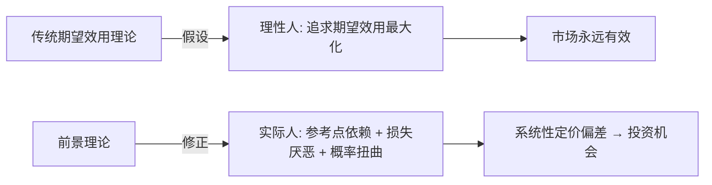
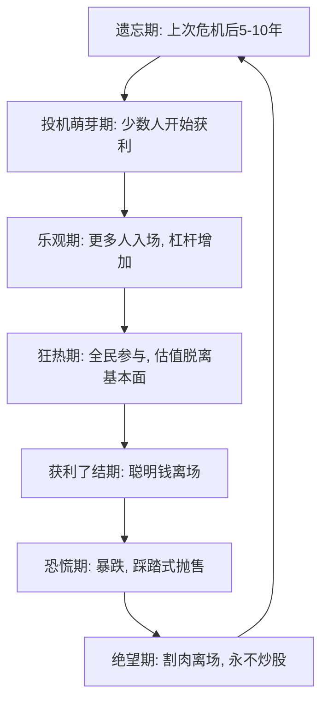

## 四、行为金融学：理解市场中的非理性

### 1. 为什么投资者需要了解行为金融学

传统金融学建立在"理性人"假设之上——投资者总是追求效用最大化，市场价格即时反映所有信息，市场永远有效。然而现实中，即使是专业基金经理也会追涨杀跌、死扛亏损、在恐慌中抛售。2008年金融危机期间，标普500指数从最高点跌去57%，大量投资者在底部割肉离场，随后错过了十年长牛。

行为金融学正是对这种"理性人神话"的修正。它结合心理学和经济学，研究投资者在真实决策中如何偏离理性，以及这种偏离如何影响市场价格。诺贝尔经济学奖得主丹尼尔·卡尼曼（Daniel Kahneman）和罗伯特·席勒（Robert Shiller）是这一领域的奠基人。

**行为金融学对投资者的核心价值在于三点：**

- **认识自己的非理性**：知道偏误存在，才能在决策时主动对抗它
- **识别他人的非理性**：理解市场情绪周期，利用群体非理性获利
- **建立防御机制**：用制度和工具约束人性弱点，而非依赖意志力

### 2. 核心理论框架

#### 2.1 前景理论（Prospect Theory）

前景理论是行为金融学最重要的理论基础，由卡尼曼和特沃斯基（Tversky）于1979年提出。它解释了人们在不确定条件下如何做出实际决策，颠覆了传统期望效用理论。

**前景理论的三个核心发现：**

**（1）损失厌恶（Loss Aversion）**

人们对损失的敏感度约为收益的2-2.5倍。亏损1万元带来的痛苦，需要盈利2-2.5万元才能弥补。这直接导致了投资中的"处置效应"——投资者倾向于过早卖出盈利股票（落袋为安），却长期持有亏损股票（不愿割肉）。

**（2）参考点依赖（Reference Point Dependence）**

人们评估收益和损失时，不是基于最终财富状态，而是基于某个"参考点"。最常见的参考点是买入成本。这意味着：一只股票从10元跌到8元再涨回10元，投资者会觉得自己"解套了"而非"浪费了机会成本"。

**（3）概率权重扭曲（Probability Weighting）**

人们对小概率事件赋予过高权重（买彩票、买深度虚值期权），对大概率事件赋予过低权重（忽视长期稳定回报）。这解释了为什么散户偏爱"妖股"和"十倍股故事"，而忽视稳健的指数投资。



#### 2.2 认知偏差体系

认知偏差是行为金融学的核心研究对象。下表按投资决策阶段分类，列出对投资影响最大的认知偏差：

| 偏差类型 | 具体偏差 | 表现 | 对投资的影响 |
|---------|---------|------|------------|
| **信息处理偏差** | 锚定效应 | 过度依赖第一个接触到的信息 | 以历史高价为锚，认为"跌了很多就是便宜" |
| | 代表性启发 | 用相似性代替概率判断 | 看到连续上涨就认为"趋势会继续" |
| | 可得性启发 | 高估容易回忆事件的概率 | 媒体反复报道的崩盘让投资者过度恐惧 |
| | 框架效应 | 同一信息因表述方式不同导致不同决策 | "成功率90%"和"失败率10%"引发不同反应 |
| **自我认知偏差** | 过度自信 | 高估自己的知识和判断能力 | 频繁交易、集中持仓、忽视风险 |
| | 事后诸葛亮 | 事后觉得结果"早该预料到" | 强化虚假的因果信念，不反思真正的错误 |
| | 自我归因 | 成功归因于自己，失败归因于运气 | 偶然盈利→加大赌注；系统亏损→不改进策略 |
| | 达克效应 | 能力不足者反而更自信 | 新手在牛市赚钱后觉得自己是股神 |
| **社会性偏差** | 羊群效应 | 跟随多数人决策 | 泡沫形成和崩盘的心理基础 |
| | 信息级联 | 忽略私人信息，跟随公共行为 | 即使基本面恶化仍跟随买入 |
| | 社会认同 | 与同群体保持一致的投资行为 | 圈子里都在买某只股票→自己也买 |
| **情绪性偏差** | 厌恶模糊 | 偏好已知风险，回避未知风险 | 只买熟悉的股票（如本地公司），忽视全球配置 |
| | 心理账户 | 对不同来源的钱赋予不同心理价值 | 工资收入谨慎投资，意外之财随意投机 |
| | 禀赋效应 | 高估自己已拥有物品的价值 | 持有的股票总觉得比市场上的更值钱 |

#### 2.3 有限注意力理论（Limited Attention）

诺贝尔奖得主赫伯特·西蒙提出"有限理性"概念：人类的认知资源是有限的，不可能处理所有信息。这在投资中的表现包括：

- **注意力过滤**：投资者只关注引起注意的信息（新闻头条、涨停板），忽略不引人注目的信息（财报附注、行业数据）
- **信息过载**：信息越多反而决策质量越差——研究显示，拥有更多股票信息的投资者并不比拥有少量信息的投资者表现更好，但过度自信程度更高
- **显著性偏差**：近期的、生动的、情绪化的信息权重远高于历史的、平淡的、数据化的信息

### 3. 市场异象与行为金融学解释

传统金融学的"有效市场假说"认为市场价格总是正确的。但行为金融学揭示了多种系统性的市场异象：

#### 3.1 动量效应（Momentum Effect）

过去3-12个月表现好的股票在未来3-12个月继续表现好，反之亦然。杰加迪什和蒂特曼（1993）的经典研究证实了这一点，该效应在全球多个市场持续存在。

**行为金融学解释**：投资者对新信息的反应不足（underreaction），导致价格调整缓慢。当信息逐步被市场认知后，价格才逐渐向真实价值靠拢，形成动量。

#### 3.2 均值回归（Mean Reversion）

长期来看，表现极端的股票倾向于回归平均。德邦特和塞勒（1985）发现，过去3-5年表现最差的股票组合在未来3-5年的表现显著优于表现最好的组合。

**行为金融学解释**：投资者的过度反应——对坏消息过度悲观导致超跌，对好消息过度乐观导致超涨，最终价格回归基本面。

#### 3.3 日历效应

- **一月效应**：小盘股在1月的回报率显著高于其他月份
- **周一效应**：周一日均回报率低于其他交易日
- **月末效应**：月末最后一天和月初第一天的回报率高于月中

这些效应说明市场并非完全有效，存在可预测的模式。但需注意：随着越来越多的人了解这些效应，它们的盈利空间在逐渐缩小。

#### 3.4 封闭式基金折价之谜

封闭式基金的市场价格长期低于其净资产价值（NAV），平均折价约10-20%。传统金融学无法解释这一现象，因为如果市场有效，基金价格应该等于NAV。

**行为金融学解释**：投资者情绪是主要驱动因素——当投资者情绪乐观时折价缩小，悲观时折价扩大。折价本身也受散户投资者情绪的影响。

### 4. 投资者情绪与市场周期

#### 4.1 情绪周期模型

市场情绪并非随机波动，而是呈现可识别的周期模式。海曼·明斯基的"金融不稳定假说"和席勒的"非理性繁荣"理论共同描绘了这一图景：



**各阶段的投资者行为特征：**

| 阶段 | 情绪状态 | 典型行为 | 认知偏差 |
|------|---------|---------|---------|
| 遗忘期 | 冷漠 | 对股市不感兴趣 | 可得性偏差（遗忘了上次危机的教训） |
| 投机萌芽期 | 好奇 | 小仓位试探 | 锚定效应（以过去低价为锚） |
| 乐观期 | 信心增强 | 加仓、加杠杆 | 自我归因（将市场β收益归因于自己的能力） |
| 狂热期 | 极度乐观 | 全仓、借钱炒股、辞职炒股 | 过度自信、羊群效应、心理账户 |
| 获利了结期 | 警惕 | 减仓、调仓 | 框架效应（重新审视风险收益比） |
| 恐慌期 | 恐惧 | 恐慌性抛售 | 损失厌恶加剧、可得性偏差 |
| 绝望期 | 麻木 | 彻底离场 | 代表性启发（认为市场永远不会好起来） |

#### 4.2 中国市场的情绪特征

A股市场由于散户占比高（交易量约占80%），情绪波动更为剧烈：

- **政策市特征**：投资者对政策极度敏感，一个传闻就能引发大幅波动
- **题材炒作文化**：概念/题材驱动的短期暴涨暴跌，远超基本面变化幅度
- **散户情绪传染**：微信、雪球等社交平台加速了情绪的传播和放大
- **打新彩票心理**：IPO打新的稳定收益强化了概率权重扭曲——将低概率高收益事件过度重视

### 5. 认知偏差的自我诊断

以下测试帮助你识别自己最严重的认知偏差。回想你最近一年的投资经历，诚实地评估每一项：

**过度自信测试：**
- 你是否认为自己的投资能力高于平均水平？（超过70%的投资者都这样认为，数学上不可能）
- 你的实际交易频率是否远高于你最初计划的频率？
- 你是否很少做详细的研究记录，却对过去的决策"记忆犹新"？

**处置效应测试：**
- 你持有亏损股票的平均时间是否显著长于持有盈利股票的平均时间？
- 你卖出盈利股票后是否经常感到"后悔卖早了"？
- 你是否经常用"还没卖就不算亏"来安慰自己？

**羊群效应测试：**
- 你的买入决策有多少是受朋友/同事/网络大V推荐驱动的？
- 你是否在市场大涨时感到焦虑（怕踏空），在市场大跌时感到焦虑（怕亏损）？
- 你的投资组合是否高度集中于当前热门板块？

**锚定效应测试：**
- 判断一只股票是否"便宜"时，你是否主要参考它的历史最高价？
- 你是否经常计算"从最高点跌了多少"来决定是否买入？
- 你是否关注股票"回本需要涨多少"而非"未来能创造多少价值"？

### 6. 对抗认知偏差的实战策略

#### 6.1 决策清单（Checklist）

在每笔交易前，强制自己回答以下问题。这能有效打断直觉决策的自动化过程：

```text
□ 买入理由是什么？（必须写下来，不能只凭"感觉"）
□ 我的研究有没有反面证据？我是否主动寻找了反对意见？
□ 如果我没有持仓，现在还会买入吗？（消除禀赋效应）
□ 我的止损位在哪里？预期收益和风险比是否大于3:1？
□ 这个决策是否受到近期新闻/朋友推荐/短期涨跌的影响？
□ 我是否在情绪极端（极度兴奋或极度恐惧）时做决策？
□ 我的仓位大小是否符合整体资产配置计划？
```

#### 6.2 事前验尸法（Pre-Mortem）

在做出投资决策后，假设这笔投资已经失败，然后逆向推理失败的原因。这个方法由心理学家加里·克莱因提出，能有效克服过度自信和确认偏差。

**操作步骤：**
1. 写下你准备执行的投资决策
2. 假设6个月或1年后这笔投资亏损了30%-50%
3. 花10分钟写下所有可能导致失败的原因
4. 评估这些原因的概率和严重程度
5. 根据评估结果调整仓位大小或放弃决策

#### 6.3 对冲日记（Decision Journal）

记录每笔重要投资决策时的完整上下文：

```text
日期：
标的：
决策：买入/卖出/持有，仓位比例
理由：（详细写下，不少于3句话）
当时的情绪状态：（1-10分，1=极度恐惧，10=极度兴奋）
市场的整体情绪：（1-10分）
当时的信息环境：（有哪些重要信息、传闻、新闻）
预期：（预期的目标价、时间框架、催化剂）
反对意见：（至少列出2个不买/不卖的理由）

--- 事后填写 ---
实际结果：
盈亏金额/比例：
复盘：决策逻辑是否正确？运气成分占多少？
教训：下次遇到类似情况应该怎么做？
```

#### 6.4 机械化规则系统

用预先设定的规则替代实时判断，从根本上绕过情绪和认知偏差：

**仓位管理规则：**
- 单只股票仓位不超过总资金的10%（分散化对抗集中持仓偏差）
- 设定最大总仓位上限（如80%），无论多么看好都不满仓
- 采用"凯利公式"的保守版本计算单笔仓位：f = (bp - q) / b × 0.5，其中b=赔率，p=胜率，q=1-p

**止盈止损规则：**
- 买入时即设定止损位（如成本价下方8%-12%），写入交易系统
- 盈利超过20%时启动移动止盈（从最高点回撤8%止盈）
- 不设"再等等看"——到了止损位必须执行，没有任何例外

**交易频率控制：**
- 设定每月最大交易次数（如不超过4次），强制降低频率
- 买入后设定"冷静期"（如3天内不卖出），避免冲动交易
- 每季度做一次"持仓审计"，而非每天盯盘

#### 6.5 社交隔离策略

羊群效应和社交传染是最难对抗的偏差之一，因为人类天生是社会性动物：

- **减少投资社交频率**：设定固定的查看投资社区时间（如每天30分钟），而非实时刷帖
- **建立独立研究习惯**：在看别人观点之前，先形成自己的判断
- **警惕"共识陷阱"**：当你和周围所有人观点一致时，恰恰是最危险的时刻
- **寻找"魔鬼代言人"**：找一个观点与你不同的投资者定期交流，而非只和同道中人抱团

### 7. 利用他人的非理性：逆向投资框架

行为金融学不仅帮助你防御自身的非理性，还可以利用市场参与者的集体非理性获利。

#### 7.1 情绪指标体系

| 指标 | 数据来源 | 信号含义 | 使用方法 |
|------|---------|---------|---------|
| VIX恐慌指数 | CBOE | >30恐慌，<15自满 | VIX>35时分批建仓，VIX<12时减仓 |
| 融资融券余额 | 交易所 | 融资余额大增=杠杆投机升温 | 融资余额创新高且指数滞涨=危险信号 |
| 新增开户数 | 中登公司 | 散户入场情绪 | 新增开户数暴涨通常是顶部信号 |
| 偏股型基金发行 | 基金公司 | 机构/基民情绪 | "日光基"频现=市场过热信号 |
| 两市成交额 | 交易所 | 交易活跃度 | 持续缩量至地量=可能的底部区域 |
| 社交媒体情绪 | 雪球/微博 | 散户情绪温度 | 极度悲观时往往是机会 |

#### 7.2 逆向投资的操作原则

逆向投资并非简单的"别人恐惧我贪婪"。实际操作中需要注意：

**什么时候逆向有效：**
- 基本面没有实质性恶化，下跌主要由情绪驱动
- 估值处于历史低位（如PE低于历史20%分位）
- 市场形成明显的单边共识（极度一致的看多或看空）

**什么时候逆向危险：**
- 基本面确实恶化了（"价值陷阱"——便宜有便宜的道理）
- 宏观环境发生结构性变化（如行业政策颠覆性调整）
- 你无法区分"别人恐惧"和"合理的风险定价"

**具体操作方法：**
1. 建立"情绪-估值"二维网格，在低估值+低情绪象限加大配置
2. 分批建仓而非一次性抄底——"接飞刀"需要分3-5批
3. 设定最大浮亏容忍度——即使逻辑正确，也可能承受30%以上的浮亏
4. 准备充足的现金储备——逆向投资的前提是有"子弹"在极端时刻加仓

### 8. 经典案例分析

#### 8.1 2015年A股杠杆牛市与股灾

**泡沫阶段（2014.7-2015.6）：**
- 上证指数从2050点涨至5178点，涨幅153%
- 融资余额从4000亿飙升至2.27万亿
- 典型认知偏差集体爆发：过度自信（"这次不一样"）、羊群效应（全民炒股）、锚定效应（以6124点为目标，认为还远未到顶）
- 典型场景：出租车司机、保洁阿姨都在推荐股票

**崩盘阶段（2015.6-2015.8）：**
- 上证指数从5178点跌至2850点，跌幅45%
- 千股跌停、千股停牌成为常态
- 损失厌恶的极端表现：恐慌性抛售、场外配资爆仓踩踏
- 大量投资者在底部割肉，错过了随后的反弹

**行为金融学教训：**
- 杠杆放大了认知偏差的破坏力——过度自信+杠杆=灾难
- "这次不一样"是金融市场最昂贵的五个字
- 情绪指标（融资余额、新增开户数）在极端时刻有参考价值

#### 8.2 腾讯控股2022年的大跌与抄底

- 2021年2月高点约750港元（前复权），2022年10月低点约200港元，跌幅约73%
- 下跌原因包括互联网监管政策、中概股退市风险、宏观环境恶化
- 在底部区域，市场情绪极度悲观，大量投资者认为"互联网行业完了"
- 事后看，200-250港元是极佳的长期买入区间，但当时大多数人在恐慌中无法做出理性判断
- **关键教训**：区分"情绪驱动的恐慌性下跌"和"基本面实质性恶化"是逆向投资的核心能力

#### 8.3 散户的经典行为模式

国内券商对客户账户数据的大样本研究揭示了散户的系统性行为特征：

- **交易频率过高**：年均换手率约500%，远高于机构投资者的100-200%
- **处置效应显著**：散户卖出盈利股票的概率是卖出亏损股票的1.5倍
- **追涨杀跌**：资金流入与过去收益率正相关，但与未来收益率负相关
- **彩票型偏好**：偏好高波动、低价格、小市值的"妖股"
- **结果**：大量研究表明，A股散户的平均收益显著低于市场指数，交易越频繁亏损越大

### 9. 进阶：行为金融学的前沿发展

#### 9.1 神经金融学（Neurofinance）

利用fMRI（功能性磁共振成像）研究投资者大脑在决策时的神经活动：

- 盈利时大脑的"奖赏回路"（伏隔核）被激活，与赌博赢钱的神经机制相同
- 亏损时"恐惧中心"（杏仁核）被激活，反应强度约为盈利时的两倍（与损失厌恶一致）
- 当投资者持有亏损仓位时，大脑的"疼痛中枢"也被激活——持有亏损股票字面意义上让人"疼"

#### 9.2 社交网络与情绪传染

社交媒体时代，投资者情绪的传播速度和广度呈指数级增长：

- 学术研究发现，Twitter/X上的市场情绪指标可以在短期内预测股市回报
- 雪球、东方财富股吧中的负面情绪聚集可以在数天内引发散户集体抛售
- "网红分析师"和"大V"的意见通过社交网络放大，形成"信息级联"

#### 9.3 机器学习与行为因子

量化投资开始将行为金融学因子纳入模型：

- **情绪因子**：基于新闻文本、社交媒体、搜索趋势构建情绪指数
- **注意力因子**：用交易量、新闻报道频率衡量投资者关注度
- **一致性因子**：衡量市场共识程度——极端一致性往往是反转信号

### 10. 常见误区与纠正

| 误区 | 纠正 |
|------|------|
| "了解了认知偏差就能克服它们" | 认知偏差是大脑的默认设置，知道≠能做到。必须建立制度化的防御机制（清单、规则、自动化） |
| "行为金融学就是逆向操作" | 逆向操作只是应用之一。更重要的是先管好自己的非理性，再考虑利用他人的非理性 |
| "只有散户才有认知偏差" | 机构投资者同样存在认知偏差，只是表现形式不同（如机构羊群效应、短期业绩压力导致的追涨杀跌） |
| "量化交易就没有认知偏差" | 量化模型的设计者仍然是人类，模型选择、参数设定、回测优化中都可能存在过拟合等偏差 |
| "情绪指标可以精确择时" | 情绪指标是概率工具，不能精确预测顶部和底部。它们告诉你的是"赔率好不好"，而非"明天涨不涨" |

### 11. 推荐阅读

| 书名 | 作者 | 核心内容 |
|------|------|---------|
| 《思考，快与慢》 | 丹尼尔·卡尼曼 | 认知偏差的系统性梳理，行为经济学奠基之作 |
| 《非理性繁荣》 | 罗伯特·席勒 | 泡沫形成的心理机制，结合历史案例分析 |
| 《助推》 | 理查德·塞勒 | 如何设计"选择架构"来对抗非理性 |
| 《投资中最简单的事》 | 邱国鹭 | 结合A股市场的投资心理和逆向策略 |
| 《行为金融学》 | 饶育蕾、彭叠峰 | 国内教材，系统性强，结合中国市场的案例 |
| 《赌客信条》 | 孙惟微 | 用通俗语言解读前景理论和决策心理学 |
