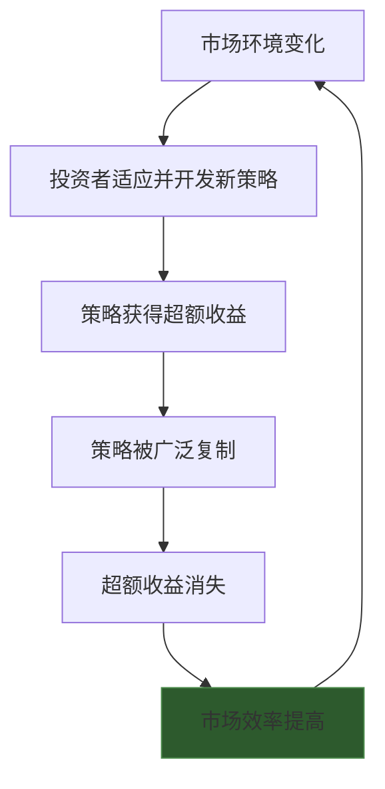

## 五、有效市场假说与现实

在前几章中，你已经学习了基本面分析和技术分析——它们的前提假设是：市场并非总是有效的，存在可以被发现和利用的定价偏差。但这个前提本身就是一个值得深思的问题：市场到底有多有效？如果你花大量时间研究财报、画K线图，但股价已经充分反映了所有信息，那这些努力岂不是白费？

有效市场假说（Efficient Market Hypothesis, EMH）正是回答这个问题的理论框架。它由诺贝尔经济学奖得主尤金·法玛（Eugene Fama）于1970年系统提出，是现代金融学最重要的基石之一。理解EMH，不是为了"站队"支持或反对它，而是为了建立对市场本质的深层认知，从而选择适合自己的投资策略。

---

### 1. 有效市场假说的核心思想

#### 1.1 什么是"有效"

这里的"有效"不是指市场运转顺畅、交易方便，而是一个精确的学术定义：**如果资产价格充分、即时地反映了所有可获得的信息，那么这个市场就是有效的。**

换一种更直白的说法：在有效市场中，你不可能持续地"战胜市场"（获得超过市场平均水平的超额收益），因为任何能被利用的信息已经被所有参与者消化并反映在价格中了。

#### 1.2 理论基础：一价定律与套利机制

EMH的底层逻辑建立在一个简洁的经济学原理之上——**一价定律**（Law of One Price）：同一种资产在同一时间只能有一个价格。如果出现价格偏差，理性投资者会立即通过套利交易消除这种偏差。

举个具体例子：假设贵州茅台在上交所的价格是1800元，在另一个假设的交易所是1810元。理性投资者会在低价处买入、高价处卖出，这个行为本身就会推高低价、压低高价，直到价格趋同。这个过程就是套利消除价格偏差。

在EMH的框架下，价格偏差出现的时间窗口极短、幅度极小，普通投资者几乎没有机会利用它获利。

#### 1.3 随机漫步与EMH的关系

你可能听说过"股价走势是随机漫步（Random Walk）"这个说法。这和EMH是什么关系？

**随机漫步是EMH的一个推论。** 如果价格已经反映了所有信息，那么价格的变化只能由新的、不可预测的信息驱动。既然新信息是随机的（否则就不叫"新"信息），那么价格变动也就是随机的。

1973年，伯顿·马尔基尔（Burton Malkiel）在《漫步华尔街》（A Random Walk Down Wall Street）一书中用通俗语言阐述了这个观点，核心结论是：**一只被蒙住眼睛的猴子朝股票列表扔飞镖选出的投资组合，长期来看和专业基金经理精心挑选的组合表现差不多。**

这个结论听起来荒谬，但有大量统计数据支持。标普SPIVA计分卡持续追踪主动型基金的表现，数据显示：在任意给定的15年周期中，超过90%的主动型大盘股基金跑输标普500指数。

---

### 2. 有效市场的三种形式

法玛将市场有效性分为三个层次，每一种对应不同的信息范围：

#### 2.1 弱式有效（Weak-Form Efficiency）

**含义：** 当前价格已经充分反映了所有历史价格和交易量信息。

**推论：** 技术分析无效。所有基于历史价格形态、趋势线、技术指标（如MACD、KDJ、布林带）的交易策略都无法获得持续的超额收益。

**逻辑链：** 如果昨天的收盘价是200元，这个信息已经是公开的、确定的，所有人都知道。那么今天的开盘价不可能因为"昨天是200元"这个已知事实而产生可预测的变动。

| 检验方法 | 具体手段 | 结论 |
|---------|---------|------|
| 序列相关性检验 | 相邻时期收益率的相关系数 | 西方成熟市场基本通过 |
| 过滤规则检验 | 上涨X%买入、下跌X%卖出能否获利 | 扣除交易成本后无超额收益 |
| 技术指标回测 | 移动平均线等策略的历史表现 | 多数策略无持续超额收益 |
| 方差比检验 | 不同时间间隔收益率的方差比 | 基本支持弱式有效 |

**现实情况：** 在欧美成熟市场，弱式有效性得到了较为广泛的支持。但在中国A股市场，由于散户占比高、信息传导效率较低，弱式有效假设存在争议。多项研究表明，A股市场在短期内存在一定的价格惯性和反转效应，技术分析在A股的边际效果可能略高于成熟市场，但这种优势在持续缩小。

#### 2.2 半强式有效（Semi-Strong-Form Efficiency）

**含义：** 当前价格不仅反映了历史价格信息，还反映了所有公开可获得的信息——包括财务报表、新闻公告、宏观经济数据、行业分析报告、分析师预测等。

**推论：** 基本面分析无效。即使你仔细研读了公司的年报、分析了行业趋势，也无法获得超额收益，因为这些信息已经反映在股价中了。

**检验方法——事件研究法（Event Study）：**

这是检验半强式有效最经典的方法。逻辑是：如果市场是半强式有效的，那么重大信息公开后，价格应该瞬间调整到位，之后不会有"漂移"。

具体步骤：
1. 选取重大事件（如盈利公告、并购消息、股票拆分）
2. 确定事件日（信息正式公开日）
3. 计算事件前后的异常收益率（实际收益率减去正常期望收益率）
4. 检验异常收益是否显著偏离零

**经典发现：**
- **盈利公告后漂移（Post-Earnings Announcement Drift, PEAD）：** 公司发布超预期盈利后，股价在公告后60-90天内继续缓慢上涨。这是对半强式有效最著名的反驳之一，由Ball和Brown在1968年首次发现，至今在很多市场仍然存在。
- **股票回购公告效应：** 宣布回购后股价通常上涨，且在公告后仍有一定的正向漂移。
- **并购公告效应：** 目标公司股价在公告日跳涨，但通常不会一步到位，存在1-5%的后续上涨空间。

**现实情况：** 半强式有效是最有争议的层次。总体来说，市场对公开信息的反应速度快但不完美——价格调整存在摩擦，表现为信息反应不足（漂移）或过度反应（反转）。

#### 2.3 强式有效（Strong-Form Efficiency）

**含义：** 价格反映了所有信息，包括公开信息和非公开的内幕信息。

**推论：** 即使掌握了内幕信息也无法获利。

**现实情况：** 这是争议最小的一种形式——几乎没有学者认为现实市场达到了强式有效。大量实证证据表明，内幕交易者确实能获得超额收益。

**中国A股的经典案例：** 中国证券市场的内幕交易案件数不胜数。2008年至2023年间，中国证监会查处的内幕交易案件超过500起。例如，在多家上市公司重组停牌前，相关知情人提前买入股票获得暴利。这些事实直接否定了强式有效假设。

三种形式的对比总结：

| 维度 | 弱式有效 | 半强式有效 | 强式有效 |
|------|---------|-----------|---------|
| 反映的信息范围 | 历史价格和成交量 | 所有公开信息 | 所有信息（含内幕） |
| 技术分析 | 无效 | 无效 | 无效 |
| 基本面分析 | 可能有效 | 无效 | 无效 |
| 内幕交易 | 可能获利 | 可能获利 | 无法获利 |
| 现实支持度 | 较高（成熟市场） | 部分支持 | 基本不成立 |

---

### 3. 支持有效市场假说的证据

#### 3.1 主动基金跑不赢指数

这是支持EMH最有力的证据。如果市场是有效的，主动型基金经理不应该持续跑赢指数，而事实正是如此。

**标普SPIVA数据（2023年报告）：**
- 美国大盘股基金：15年期跑输标普500的比例为87.23%
- 中国A股基金：10年期跑输沪深300的比例约为75%
- 全球范围内，长期持续跑赢指数的主动基金不足5%

沃伦·巴菲特在2007年发起的一个著名赌注也印证了这一点：他赌一只低成本的标普500指数基金在10年内能跑赢一篮子对冲基金。2017年赌约到期，标普500指数基金年化回报7.1%，对冲基金组合年化回报2.2%。巴菲特赢得了赌注。

#### 3.2 股价对新信息的快速反应

现代市场中，信息传播和价格调整的速度令人瞠目。

- 公司盈利公告后，大部分价格调整在几分钟内完成
- 美联储利率决议公布后，国债收益率在数秒内重新定价
- 算法交易系统可以在毫秒级别对新闻做出反应

这种速度意味着普通投资者几乎不可能"抢先"利用公开信息获利。

#### 3.3 专业分析师的预测也难以持续准确

研究表明，华尔街分析师的评级调整虽然短期内会影响股价，但长期来看，分析师推荐的股票组合并不能持续跑赢市场。Jegadeesh等人（2004）的研究发现，分析师评级的购买建议在扣除交易成本后不产生显著的超额收益。

---

### 4. 挑战有效市场假说的证据

#### 4.1 市场异象（Anomalies）

"异象"是指EMH无法解释的、持续存在的、可预测的价格模式。几十年来，学者们发现了大量的市场异象：

**（1）价值效应（Value Effect）**

低市盈率（P/E）、低市净率（P/B）的"价值股"长期表现优于高估值的"成长股"。法玛和弗伦奇（Fama & French）自己在1992年的研究中就发现了这一异象，并据此构建了著名的三因子模型。

数据支撑：1926-2023年，美国市场中最低P/B十分位的股票年化收益率比最高P/B十分位高出约4-5个百分点。

**（2）规模效应（Size Effect）**

小市值公司的股票长期收益率高于大市值公司。这一发现最早由Banz（1981）提出。

数据支撑：1926-2023年，美国小盘股年化收益率约11.7%，大盘股约10.3%，年化差异约1.4个百分点。虽然差异不大，但经过复利累积，近百年间小盘股的总收益是大盘股的约4倍。

**（3）动量效应（Momentum Effect）**

过去3-12个月表现好的股票，未来3-12个月继续表现好；过去表现差的继续差。Jegadeesh和Titman（1993）的经典论文首次系统记录了这一现象。

数据支撑：在美国市场，买入过去12个月涨幅最大的10%股票、卖出跌幅最大的10%股票（做多-做空策略），月均超额收益约1%。这一效应在全球40多个国家的市场中都存在。

**（4）低波动异象（Low Volatility Anomaly）**

传统金融理论（CAPM）认为高风险（高波动）应该对应高收益。但实证研究表明，低波动股票的风险调整后收益反而高于高波动股票。这直接违背了风险-收益对称的基本假设。

**（5）盈利公告后漂移（PEAD）**

如前所述，超预期盈利的公司在公告后持续上涨，低于预期的持续下跌。这个效应在A股市场同样存在，且幅度更大——可能因为A股散户比例高，信息消化更慢。

**A股特有的异象：**

| 异象 | 描述 | A股表现 |
|------|------|---------|
| 涨跌停板效应 | 涨停后次日继续上涨概率偏高 | 显著存在 |
| ST摘帽效应 | ST股票摘帽前后存在超额收益 | 幅度较大 |
| 高送转效应 | 高比例送转股公告前后股价上涨 | 近年减弱 |
| 新股效应 | IPO后短期收益高、长期破发 | 2016年后变化大 |
| 壳资源效应 | 小市值壳公司被借壳预期推高 | 注册制后弱化 |

#### 4.2 行为金融学的挑战

行为金融学从心理学角度解释了市场为什么不是完全有效的。核心观点是：投资者并非完全理性的，存在系统性的认知偏差。

**丹尼尔·卡尼曼（Daniel Kahneman）和阿莫斯·特沃斯基（Amos Tversky）的前景理论（Prospect Theory）** 揭示了几个关键偏差：

- **损失厌恶：** 亏损1万元的痛苦感是盈利1万元快乐感的2-2.5倍。这导致投资者过早卖出盈利股票（怕利润回吐）、死拿亏损股票（不愿实现亏损），即"处置效应"。
- **过度自信：** 70%-90%的投资者认为自己的投资能力高于平均水平。过度自信导致频繁交易，而频繁交易通常降低收益。
- **锚定效应：** 投资者会"锚定"在某个参考价格上（如买入成本），而非根据当前基本面做决策。
- **从众行为（羊群效应）：** 投资者倾向于跟随大众行动，这会放大市场波动，形成泡沫或恐慌性抛售。

**罗伯特·席勒（Robert Shiller）的过度波动研究：**

席勒在1981年发表的经典论文指出，股票价格的波动幅度远远超出了股息折现模型所能解释的范围。如果市场是有效的，价格波动应该反映基本面（未来股息）的变化，但实际价格波动是基本面波动的5-13倍。这说明价格中有大量"噪音"——由投资者情绪而非基本面驱动。

2000年的互联网泡沫和2008年的金融危机是行为金融学最生动的注脚。在互联网泡沫中，纳斯达克指数从1995年的1000点飙升到2000年3月的5048点，然后在两年内暴跌78%至1114点。如果市场是有效的，如此巨大的价格偏离不可能发生。

#### 4.3 长期反转效应（Long-Term Reversal）

与动量效应相对应，De Bondt和Thaler（1985）发现：过去3-5年表现最好的股票组合在未来3-5年表现最差，反之亦然。这说明市场存在"过度反应"——好公司的股价被推得过高，差公司的股价被压得过低，最终会向均值回归。

法玛和弗伦奇后来将动量效应和反转效应整合进了他们的多因子模型，其中：
- 短期（1个月内）：反转效应
- 中期（1-12个月）：动量效应
- 长期（3-5年）：反转效应

---

### 5. 现代综合观点：市场不是非黑即白

#### 5.1 "适应性市场假说"——一个更符合现实的框架

MIT教授安德鲁·罗（Andrew Lo）在2004年提出了"适应性市场假说"（Adaptive Market Hypothesis, AMH），试图调和EMH与行为金融学的矛盾。

AMH的核心观点：

1. **市场效率不是固定的，而是随时间变化的。** 在某些时期（如牛市末期）市场极度无效，在另一些时期（如正常交易日）接近有效。
2. **投资者行为遵循进化逻辑。** 投资者像生物一样，在竞争中适应环境。当某个策略被广泛使用时，其超额收益就会消失（被"进化"掉了）。
3. **市场创新推动效率变化。** ETF的出现提高了市场效率，量化交易的普及使得传统异象逐渐消失。

用一张图来理解：

**实际例子：** 动量策略在1993年被学术界发现后，大量对冲基金开始使用，导致动量效应的收益在过去30年中确实有所衰减（但并未完全消失）。2009年动量策略还经历了一次"动量崩溃"（Momentum Crash），短期内巨额亏损。

#### 5.2 一个实用的思维框架

与其纠结"市场到底有不有效"，不如采用一个更实用的分层思维：

**市场在大多数时候是"足够有效"的，但存在系统性的无效窗口。**

具体来说：
- **大盘蓝筹股**（如沪深300成分股）：效率最高，定价最准确，想获得超额收益最难
- **中盘股：** 效率中等，存在一些可利用的定价偏差
- **小盘股、微盘股：** 效率最低，分析师覆盖少、流动性差、定价偏差大
- **信息传播高峰期**（如财报季、政策出台时）：短期无效，因为信息需要时间消化
- **极端市场状态**（如泡沫和崩盘期间）：严重无效，情绪主导定价

**这意味着什么？**

| 投资者类型 | 适合的策略 | 原因 |
|-----------|-----------|------|
| 普通上班族，无时间研究 | 低成本指数基金定投 | 大盘层面市场足够有效，战胜市场太难 |
| 有业余时间研究个股 | 聚焦中小盘、冷门股 | 这些领域效率较低，专业投资者少 |
| 专业投资者 | 利用行为偏差和信息不对称 | 有资源和能力在低效领域寻找机会 |
| 量化交易者 | 利用微观结构无效性 | 高频层面存在短暂的定价偏差 |

---

### 6. 有效市场假说对中国A股投资者的启示

#### 6.1 A股市场的效率特征

A股市场的效率状况与成熟市场有显著差异：

- **散户占比高：** 虽然近年机构化加速，但散户交易量仍占A股总交易量的60%以上。散户的非理性行为创造了更多的定价偏差。
- **涨跌停板制度：** 10%/20%的涨跌停限制导致信息不能一次性完全反映在价格中，造成信息"溢出"到下一个交易日。
- **T+1交易制度：** 当天买入不能当天卖出，限制了套利力量的即时纠错能力。
- **做空机制受限：** 融券标的有限、成本高、难度大。这意味着当一只股票被高估时，套利者难以通过做空来纠正价格偏差——高估可能持续很久。
- **政策影响大：** 政策变化（如产业政策、监管政策）对A股的影响远大于成熟市场，而政策本身具有不可预测性。

**总体判断：** A股市场处于弱式有效和半强式有效之间，某些领域（如大盘蓝筹）接近半强式有效，某些领域（如小盘壳资源、题材炒作）则显著无效。

#### 6.2 对不同投资策略的含义

**（1）指数投资仍然有效，但需选择正确的指数**

A股市场中，大盘蓝筹层面的定价已经比较有效。长期来看，沪深300指数基金是普通投资者最务实的选择。但要注意：
- A股的宽基指数（如上证指数）编制方法不够科学，不能真实反映市场回报
- 优选沪深300、中证500等编制规则透明的指数
- 定投时采用估值分位法定投（PE低于历史30%分位时多投），可以获得比无脑定投更好的结果

**（2）基本面分析在A股仍然有价值**

由于A股的信息传导效率低于成熟市场，基本面分析在以下场景中可能产生超额收益：
- 深度研究被分析师忽略的中小盘股票
- 在行业拐点出现时提前布局（需要对行业有深刻理解）
- 利用季报/年报发布前后的信息消化期进行交易
- 关注机构调研频率突然增加的冷门股

**（3）技术分析的作用需重新定位**

在A股市场中，纯粹的技术分析可能比在成熟市场稍有效一些，但其价值不在于预测未来走势，而在于：
- **识别市场情绪：** 成交量和价格形态反映的是群体心理
- **风险管理：** 设定止损位、控制仓位
- **选择交易时机：** 在技术信号与基本面判断一致时行动

**（4）警惕"A股特色"的无效陷阱**

A股市场的低效性也意味着存在大量"价值陷阱"：
- 被炒概念推高的垃圾股
- 财务造假的公司（如康美药业、瑞幸咖啡在美股的案例）
- 被游资操纵的小盘股
- 长期不分红、大股东持续减持的公司

---

### 7. 常见误区与纠正

**误区一："既然市场是有效的，那我不需要做任何研究，买指数就好了。"**

纠正：市场不是完全有效的，特别是在A股市场。但"战胜市场"需要专业能力和大量时间投入。如果你没有这些条件，指数投资确实是最佳选择。这不是因为市场完全有效，而是因为大多数个人投资者的研究能力不足以利用市场的无效性。

**误区二："既然有这么多异象，说明市场是无效的，我可以轻松获利。"**

纠正：异象确实存在，但（1）多数异象的收益在发现后逐渐衰减；（2）异象策略可能经历漫长的回撤期（如价值因子在2010-2020年严重跑输成长股）；（3）交易成本和税费会侵蚀异象收益；（4）很多异象在小样本中才显著，可能是数据挖掘的结果。

**误区三："巴菲特战胜了市场，所以市场是无效的。"**

纠正：巴菲特的成功可能有几个解释：（1）他是极端的统计异常值，类似彩票中奖；（2）他的投资方式（集中投资、长期持有、使用保险浮存金加杠杆）有独特的结构性优势；（3）他投资的效率较低的领域（早期小盘股、困境资产）确实存在超额收益机会。巴菲特本人多次建议普通投资者买指数基金，这实际上隐含了"市场对普通人来说足够有效"的判断。

**误区四："EMH只是理论，和实际投资无关。"**

纠正：EMH对实际投资有深远的指导意义：
- 它帮助你设定合理的收益预期（不要幻想年化20%+）
- 它告诉你交易越频繁、成本越高、越难战胜市场
- 它提示你应该关注风险调整后的收益，而非绝对收益
- 它帮你判断在哪些领域你的研究努力更可能获得回报

**误区五："专家说A股不成熟、散户多，所以技术分析肯定管用。"**

纠正：散户多确实创造了更多的短期定价偏差，但这些偏差：
- 往往表现为极端的动量和反转，而非规律性的技术形态
- 很容易被游资和量化机构利用，散户反而是被收割的对象
- 涨跌停板和T+1制度限制了技术策略的可执行性

---

### 8. 投资者行动指南

基于对EMH的理解，以下是分层的投资建议：

#### 8.1 如果你是入门投资者（经验<3年，资金<50万）

**核心策略：承认市场的有效性，用指数基金参与市场。**

1. 将70%-80%的资金配置在宽基指数基金上（沪深300ETF、中证500ETF）
2. 采用"估值分位法定投"：当指数PE低于历史30%分位时加倍定投，高于70%分位时减少或暂停
3. 剩余20%-30%可尝试个股投资，但做好交学费的心理准备
4. 不要频繁交易——每次交易都有成本（佣金、印花税、冲击成本）

#### 8.2 如果你是中级投资者（经验3-10年，有一定研究能力）

**核心策略：在效率较低的领域寻找机会。**

1. 聚焦中小盘股（市值50亿-300亿），分析师覆盖度低，定价效率较差
2. 深入研究1-2个行业，成为该行业的"局部专家"
3. 关注盈利公告后的漂移效应——在超预期盈利公告后30天内分批建仓
4. 结合基本面和技术面：基本面决定买什么，技术面决定何时买
5. 设定严格的止损纪律（如单只股票亏损15%强制止损）

#### 8.3 如果你是高级投资者（经验>10年，资金充足）

**核心策略：构建系统化的超额收益来源。**

1. 多因子策略：结合价值、动量、质量、低波动因子构建投资组合
2. 事件驱动策略：跟踪股权激励、员工持股计划、大股东增持等信号
3. 行业轮动：根据宏观经济周期和行业景气度进行配置调整
4. 行为偏差利用：在市场恐慌时逆势买入，在市场狂热时逐步减仓
5. 量化辅助：用数据和模型减少情绪干扰，提高决策质量

#### 8.4 无论你处于哪个阶段

- **永远不要全仓单只股票。** EMH告诉我们，个股层面的不确定性远大于市场层面。
- **控制交易频率。** 每一笔交易都是一次与市场的博弈，在有效市场中博弈的期望收益为零（扣成本后为负）。
- **关注成本。** 低费率的指数基金每年节省0.5%-1.5%的管理费，30年的复利差异是巨大的。
- **保持谦逊。** EMH最深刻的教训是：你可能没有你以为的那么聪明。承认这一点，是投资成功的第一步。

---

### 9. 延伸阅读与经典文献

| 文献 | 作者 | 核心贡献 | 推荐理由 |
|------|------|---------|---------|
| 《漫步华尔街》 | Burton Malkiel | 随机漫步理论的通俗阐述 | 入门必读，已更新至第12版 |
| 《有效资本市场》 | Eugene Fama | EMH的奠基论文 | 学术经典，适合有基础的读者 |
| 《非理性繁荣》 | Robert Shiller | 市场过度波动和泡沫分析 | 了解市场无效的一面 |
| 《思考，快与慢》 | Daniel Kahneman | 认知偏差和前景理论 | 理解投资者非理性行为的心理学基础 |
| 《适应性市场》 | Andrew Lo | 适应性市场假说 | 调和EMH与行为金融学的现代框架 |
| 《主动投资组合管理》 | Grinold & Kahn | 多因子模型和信息比率 | 专业投资者的方法论 |
| SPIVA计分卡 | 标普道琼斯 | 主动基金vs指数的持续跟踪 | 用数据说话，年度更新 |

---

### 10. 本章小结

有效市场假说不是一个"对或错"的命题，而是一个理解市场运作方式的思维框架。它的核心教训是：

1. **市场的定价效率比你想象的要高。** 大多数人在大多数时候跑不赢指数。
2. **但市场不是完美的。** 行为偏差、制度摩擦和信息不对称创造了可利用的机会。
3. **利用低效性的门槛很高。** 它需要专业知识、时间投入、情绪控制和严格的纪律。
4. **最好的投资策略往往是最简单的。** 对大多数人来说，低成本指数基金定投+合理的资产配置，就是最优解。

在接下来的章节中，我们将深入探讨行为金融学（第四章的延伸），了解投资者的非理性行为如何创造市场机会，以及如何在实践中避免这些认知陷阱。
