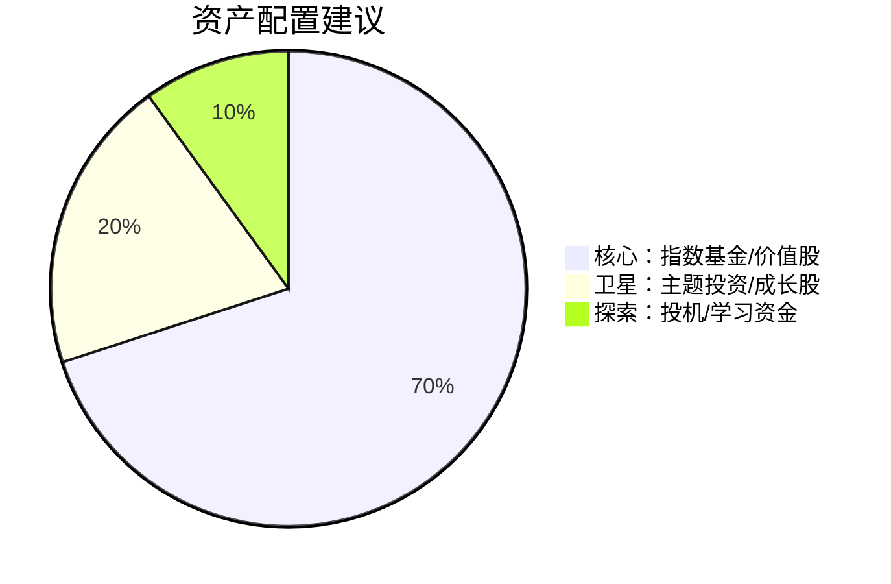

## 六、投资与投机的区别

> "投资操作是以深入分析为基础，确保本金的安全，并获得适当的回报。不满足这些要求的操作就是投机。" —— 本杰明·格雷厄姆《聪明的投资者》

在股票市场中，"投资者"和"投机者"这两个标签经常被混用，但它们背后代表的是两种截然不同的思维方式、决策框架和风险收益结构。理解二者的区别，不是文字游戏，而是决定你长期财富命运的根本性选择。

### 6.1 为什么区分投资与投机如此重要

很多散户亏钱的根本原因，不是因为市场不好，而是因为他们以投机的心态做着投资的事，或者反过来——用投资的耐心去持有一个投机的标的。

一个典型的悲剧场景：某人听了朋友的消息买入一只概念股（投机行为），结果股价下跌后不舍得止损，反而用"长期持有"来自我安慰（投资心态），最终深度套牢。这不是投资，这是用投资的借口为投机失败买单。

反过来，也有人在一只经过深度研究的价值股上赚了10%就急着卖出（投机心态），错过了后续300%的涨幅。价值投资的果实被投机心理提前摘掉了。

**搞清楚自己在做什么，是所有投资决策的前提。**

### 6.2 投资的本质特征

#### 6.2.1 格雷厄姆的经典定义

本杰明·格雷厄姆在1934年出版的《证券分析》中首次系统定义了投资与投机的边界。他的定义包含三个核心要素：

| 要素 | 含义 | 实际检验标准 |
|------|------|-------------|
| **深入分析** | 对企业基本面的系统研究 | 能否说清楚企业的商业模式、盈利来源、竞争优势 |
| **本金安全** | 通过价格折扣获得安全边际 | 买入价格是否显著低于内在价值 |
| **适当回报** | 追求合理的风险调整后收益 | 预期收益率是否与承担的风险匹配 |

不能同时满足这三个条件的操作，在格雷厄姆看来都是投机。

#### 6.2.2 投资的核心逻辑

投资的本质是**用合理的价格买入一项能持续产生现金流的资产**。


投资者关注的核心问题是：
- 这家公司赚不赚钱？（盈利能力）
- 它能持续赚钱吗？（竞争优势/护城河）
- 它的钱能分到我手里吗？（分红或再投资回报）
- 我现在买的价格合理吗？（估值水平）

#### 6.2.3 投资的时间维度

投资的时间框架通常以**年**为单位。沃伦·巴菲特的名言"如果你不愿意持有一只股票十年，那就不要持有它十分钟"，虽然有夸张成分，但准确传达了投资的时间观。

这种长期性不是因为投资者喜欢等待，而是因为：

1. **企业价值的实现需要时间**：一家公司从建立竞争优势到利润兑现，通常需要数年周期
2. **复利效应需要时间展开**：年化15%的收益，10年后是4.05倍，20年后是16.37倍，30年后是66.21倍
3. **市场情绪的修正需要时间**：市场对一只股票的低估可能持续数月甚至数年

### 6.3 投机的本质特征

#### 6.3.1 投机的定义

投机是**基于对市场价格变动的预判进行交易，以获取短期差价收益**的行为。

请注意，这里没有用"赌博"来定义投机。投机是有逻辑的，只是它的逻辑建立在对市场心理、资金流向、趋势动量等因素的判断上，而不是对企业基本面的分析上。

#### 6.3.2 投机的核心逻辑

投机的本质是**预测其他市场参与者的行为并从中获利**。


投机者关注的核心问题是：
- 市场情绪如何？（贪婪还是恐惧）
- 有没有新的催化剂？（政策、新闻、事件）
- 技术图形给出什么信号？（突破、支撑、阻力）
- 主力资金在做什么？（大单、融资融券）

#### 6.3.3 投机的时间维度

投机的时间框架从几秒到几个月不等，通常不超过一个完整的商业周期。

| 投机类型 | 持有时间 | 典型方法 |
|----------|----------|----------|
| 高频交易 | 毫秒~秒 | 算法捕捉微小价差 |
| 日内交易 | 分钟~小时 | 盘中技术分析 |
| 波段交易 | 天~周 | 趋势跟踪 |
| 事件驱动 | 周~月 | 财报/政策催化 |

### 6.4 投资与投机的系统性对比

#### 6.4.1 七大核心维度对比

| 维度 | 投资 | 投机 |
|------|------|------|
| **收益来源** | 企业盈利增长和分红 | 价格波动产生的差价 |
| **分析方法** | 基本面分析（财务报表、行业研究） | 技术分析、市场情绪、资金流向 |
| **风险来源** | 企业经营风险、估值判断失误 | 市场波动风险、方向判断失误 |
| **持有周期** | 长期（1年以上，通常数年） | 短期（几秒到几个月） |
| **决策依据** | 企业内在价值 | 市场价格走势 |
| **对市场效率的看法** | 市场短期无效，长期有效 | 市场存在可被利用的规律 |
| **预期收益特征** | 稳定但不暴利 | 高波动，可能暴利也可能爆仓 |

#### 6.4.2 风险收益结构对比


投资的风险收益结构类似**正偏态分布**：亏损有上限（本金不会变成负数），收益理论上无限。

投机的风险收益结构取决于策略设计：好的投机策略会严格止损，将单笔亏损控制在小范围内；差的投机策略可能赚小亏大。

#### 6.4.3 心理层面的差异

| 心理特征 | 投资者 | 投机者 |
|----------|--------|--------|
| 面对下跌 | 检查基本面是否变化，不变更买入 | 检查是否触发止损，考虑平仓 |
| 面对上涨 | 重新评估是否高估，考虑减持 | 检查是否该止盈，考虑加仓 |
| 空仓心态 | 耐心等待机会 | 焦虑错过行情 |
| 信息处理 | 关注企业经营信息 | 关注市场交易信息 |
| 核心情绪 | 从容 | 紧张 |

### 6.5 投资与投机的灰色地带

#### 6.5.1 现实中并不存在非黑即白的界限

格雷厄姆的定义看似清晰，但现实中投资与投机之间存在大量的灰色地带。即使是巴菲特，也曾公开承认他的部分操作带有投机性质——比如他在1990年代末做空美元的外汇头寸。

凯恩斯在《就业、利息和货币通论》中提出了一个更务实的观点：**投资是预测资产在整个生命周期中的收益，投机是预测市场心理的变化**。但凯恩斯自己既是严肃的经济学家，也是活跃的投机者，他管理的剑桥国王学院基金就是靠积极的市场操作获得了出色的回报。

#### 6.5.2 常见的灰色地带

**价值投资中的投机成分**

即使是深度价值投资者，其行为中也包含投机因素：
- 对企业未来的预测本身就带有不确定性
- 估值模型中的假设（增长率、折现率）包含主观判断
- "安全边际"本质上是对不确定性的补偿

**技术分析中的投资成分**

一些基于技术分析的策略其实更接近投资：
- 趋势跟踪策略通过严格的规则和纪律管理风险
- 量化策略通过系统化方法消除情绪干扰
- 这些策略的核心不是预测涨跌，而是管理风险收益比

**指数投资：投资还是投机？**

购买沪深300指数基金，买入的是中国最大的300家上市公司。这显然是投资——你获得的是中国经济整体增长的回报。但如果你在牛市顶部追涨买入指数基金，你的买入时机带有投机成分。

#### 6.5.3 投资与投机的光谱模型

与其非此即彼地分类，不如将投资行为视为一个连续光谱：


| 位置 | 特征 | 典型代表 |
|------|------|----------|
| 纯投资 | 买入低估值蓝筹，持有多年，吃分红 | 巴菲特早期 |
| 偏投资 | 买入成长股，持有1-3年，赚业绩增长的钱 | 彼得·林奇 |
| 混合 | GARP策略（合理价格的成长投资） | 威廉·欧奈尔 |
| 偏投机 | 技术面为主，辅以基本面过滤 | 杰西·利弗莫尔 |
| 纯投机 | 纯技术交易，不关心基本面 | 日内交易者 |

### 6.6 历史上关于投资与投机的经典争论

#### 6.6.1 格雷厄姆 vs 华尔街（1930年代）

1929年大崩盘后，格雷厄姆痛定思痛，在《证券分析》中严格区分投资与投机。他的核心观点是：华尔街大多数所谓的"投资"其实是投机，而正是这种投机导致了泡沫和崩溃。

格雷厄姆提出"安全边际"概念：只有当买入价格显著低于企业可计算的内在价值时，操作才构成投资。这个差额就是安全边际，用来覆盖分析中的误差和不可预见的风险。

#### 6.6.2 巴菲特的延伸

巴菲特继承并发展了格雷厄姆的思想，但他做了一个重要修正：**以合理价格买入优秀公司，胜过以便宜价格买入平庸公司**。

这意味着投资的核心不仅是价格折扣，还包括对企业质量的深度判断。巴菲特的伯克希尔·哈撒韦公司长期年化收益率约20%，证明了纯粹的投资方式可以创造惊人的长期回报。

#### 6.6.3 索罗斯的挑战

乔治·索罗斯公开宣称自己是投机者，他的量子基金通过宏观趋势判断和大胆押注获得了巨额回报。索罗斯认为，金融市场存在根本性的不稳定，市场价格不趋向均衡而是自我强化——这直接挑战了有效市场假说和传统投资理论。

索罗斯的案例表明，投机本身不是贬义词，关键在于是否建立了系统化的方法论和严格的风控。

#### 6.6.4 塔勒布的"反脆弱"视角

纳西姆·塔勒布在《随机漫步的傻瓜》和《反脆弱》中提出了一个独到的观点：**真正的投资应该构建反脆弱的组合——在小概率极端事件中获益，而不是受损**。

他的"杠铃策略"（90%极度保守+10%极度激进）本质上是在投资与投机之间找到了一种特殊平衡：大部分资金做纯投资（国债、现金），小部分资金做纯投机（高杠杆期权），利用不对称性获利。

### 6.7 行为金融学视角：为什么我们混淆投资与投机

#### 6.7.1 认知偏差的作用

行为金融学揭示了人类在投资决策中的系统性偏差，这些偏差让我们更容易把投机当投资：

| 偏差 | 表现 | 后果 |
|------|------|------|
| **确认偏差** | 只关注支持自己判断的信息 | 用"基本面分析"包装情绪化决策 |
| **过度自信** | 高估自己的判断准确率 | 低估风险，加大杠杆 |
| **损失厌恶** | 亏损的痛苦是盈利快乐的2倍 | 不愿止损，把投机变成长期套牢 |
| **锚定效应** | 被买入成本或历史高点影响 | 基于成本价而非价值做决策 |
| **可得性偏差** | 容易想起最近/印象深刻的事件 | 被明星股或暴富故事吸引 |
| **禀赋效应** | 高估自己持有资产的价值 | 买入后突然觉得"自己的股票"更值钱 |

#### 6.7.2 "我只是暂时被套"——最常见的自我欺骗

散户中最常见的混淆投资与投机的场景是：

1. **买入阶段**：听消息、看新闻、追热点（投机）
2. **下跌阶段**：开始"研究"公司基本面，寻找持有的理由（伪装成投资）
3. **深度套牢**：宣称自己是"长期投资者"，"时间会证明一切"（自欺欺人）

这种从投机到"投资"的转变不是基于价值判断，而是基于心理防御机制。真正的价值投资者在股价下跌时的反应是检查企业基本面是否恶化——如果没有，价格越低反而越值得买入。

#### 6.7.3 市场环境的混淆效应

牛市中，投资和投机都能赚钱，这进一步模糊了二者的界限：
- 价值投资者赚了30%觉得是自己的分析能力
- 追热点的投机者赚了50%觉得自己的方法更好
- 指数基金投资者赚了25%觉得不需要选个股

当潮水退去时，谁在裸泳就清楚了。但问题是，大多数人无法从牛市的收益中区分哪些来自能力、哪些来自运气。

### 6.8 实战应用：如何判断自己的操作属于投资还是投机

#### 6.8.1 自我检验清单

在做每一笔交易之前，用以下问题检验自己：

```text
1. 我能清楚说出这家公司靠什么赚钱吗？
   → 不能说清楚 = 投机

2. 我是先研究了公司，还是先看到股价走势？
   → 先看走势 = 偏投机

3. 如果明天开始停牌一个月，我会安心吗？
   → 不安心 = 可能是投机

4. 如果这只股票明天跌20%，我会怎么做？
   → 立刻卖出 = 投机
   → 检查原因后再决定 = 偏投资

5. 我买这只股票，主要依据是什么？
   → K线形态、消息、别人推荐 = 投机
   → 财务数据、行业前景、估值分析 = 偏投资

6. 我能接受持有多长时间？
   → 几天到几周 = 投机
   → 一年以上 = 偏投资

7. 这笔交易的预期收益来源是什么？
   → 别人接盘（博弈差价） = 投机
   → 企业盈利增长和分红 = 投资
```

#### 6.8.2 不要给投机贴上投资的标签

投机本身没有错。错误的是：

- 用投机的方法做交易，却用投资的话术自我安慰
- 分不清自己的操作性质，导致风控策略错配
- 在投机失败后假装是投资，拒绝止损

一个诚实的投机者比一个自欺的投资者更有机会在市场中生存。

### 6.9 投机的价值与风险

#### 6.9.1 投机的正面功能

投机在金融市场中扮演着重要角色，不应当被全盘否定：

**提供流动性**：投机者频繁交易，为市场提供了买卖双方的对手盘。没有投机者，价值投资者想买的时候可能买不到，想卖的时候可能卖不出去。

**价格发现**：投机者的交易行为将各种信息（包括尚未被验证的预期）反映到价格中，加速了市场的信息传导。

**风险转移**：投机者愿意承担短期价格波动的风险，使得风险厌恶的长期投资者能够将这部分风险转移出去（期货市场的套期保值功能就是典型例子）。

#### 6.9.2 投机的主要风险

**认知风险**：技术分析的有效性存在争议。市场形态会变化，过去有效的规律未来可能失效。如果投机者对自己的方法过度自信，可能在方法失效时遭受巨大损失。

**情绪风险**：投机的短期性要求频繁决策，而每次决策都可能触发贪婪、恐惧、后悔等强烈情绪。长期处于这种状态中，判断力会逐渐下降。

**成本侵蚀**：频繁交易产生的手续费、印花税、滑点等成本会显著侵蚀收益。假设每次交易成本0.15%（买卖各0.075%），每月交易10次，年化成本就高达18%。这意味着投机者必须获得18%以上的年化收益才能打平。

**税务影响**：在中国A股市场，持股超过1年免征股息红利个人所得税，持股1个月以内全额征税。频繁交易会增加税务负担。

#### 6.9.3 如果你选择投机，必须遵守的纪律

如果经过深思熟虑后你决定从事投机，以下纪律是生存的前提：

| 纪律 | 说明 |
|------|------|
| **严格止损** | 每笔交易的最大亏损不超过总资金的1-2% |
| **仓位控制** | 单只股票的仓位不超过总资金的10-20% |
| **交易记录** | 记录每笔交易的理由、买入价、卖出价、盈亏，定期复盘 |
| **风险收益比** | 每笔交易的潜在收益至少是潜在亏损的2-3倍 |
| **情绪管理** | 连续亏损后强制休息，避免情绪化交易 |
| **资金隔离** | 用于投机的资金与生活资金、长期投资资金严格分开 |

### 6.10 普通投资者的最佳策略：以投资为主，投机为辅

#### 6.10.1 核心-卫星策略

对于绝大多数普通投资者，最合理的做法是建立一个**以投资为核心、以投机为卫星**的资产配置：



- **核心部分（70-80%）**：宽基指数基金或经过深度研究的价值股，买入后长期持有，享受复利效应
- **卫星部分（15-25%）**：有逻辑支撑的主题投资或成长股，持有期数月到一两年
- **探索部分（5-10%）**：用于学习投机技巧的小额资金，做好亏光的准备

#### 6.10.2 为什么要保留小比例的投机资金

投机资金不是为了赚钱，而是为了满足人性中的"操作欲望"。很多投资者之所以管不住手，在核心仓位上频繁交易，就是因为没有给投机冲动一个出口。

给投机欲望一个安全的释放渠道，反而能保护你的核心投资组合不被情绪干扰。

#### 6.10.3 何时投机可以升级为投资

当投机者发现以下信号时，应该考虑将投机仓位升级为投资仓位：

1. 你买入的标的在持有期内基本面持续改善
2. 你的分析框架从技术面转向了基本面
3. 你发现自己更关心企业的长期发展而非短期走势
4. 你愿意在股价下跌时加仓而不是止损

这些信号说明你的认知已经超越了单纯的投机，可以向投资转型。

### 6.11 经典案例对比

#### 6.11.1 投资案例：贵州茅台（2003-2023）

假设一位投资者在2003年以约5元/股（复权价）的价格买入贵州茅台，持有至2023年股价约1700元/股（复权价），20年收益约340倍。

这位投资者的投资逻辑：
- 白酒行业有深厚的文化根基，需求稳定
- 茅台拥有不可复制的品牌和酿造工艺（护城河）
- 持续的提价能力和供不应求的市场格局
- 稳定的分红回报

在这个案例中，投资者不需要预测市场走势，不需要关心K线形态，只需要判断"茅台是一家好公司，价格合理"，然后耐心持有。

#### 6.11.2 投机案例：2015年A股杠杆牛市

2015年上半年，大量散户通过融资融券和场外配资加杠杆买入股票，主要依据是"牛市来了"的趋势判断。

结果：
- 上证指数从2014年7月的2050点涨至2015年6月的5178点
- 随后暴跌至2016年1月的2638点
- 大量融资盘被强制平仓，部分投资者不仅亏光本金，还倒欠券商资金

这个案例展示了投机的核心风险：杠杆放大了收益，也放大了亏损。而"牛市思维"本身就是一种投机心态——它不关心企业的价值，只关心市场的方向。

#### 6.11.3 投资与投机结合的案例：段永平投资网易

2001年互联网泡沫破裂后，网易股价跌至1美元以下，面临退市风险。段永平在深入研究网易的游戏业务后，以约1美元的价格大量买入。

段永平的操作既有投资的元素（深入研究企业基本面，确认游戏业务的盈利前景），也有投机的元素（在极端悲观的市场情绪中逆向操作，押注市场情绪的修复）。

结果：网易股价在随后数年涨至数百美元，段永平获得了百倍以上回报。这个案例说明，最好的投资机会往往出现在市场极端投机性抛售之后。

### 6.12 常见误区与纠正

| 误区 | 纠正 |
|------|------|
| "长期持有就是投资" | 长期持有垃圾股不是投资，是错误的坚持。投资的关键是持有有价值的资产 |
| "短线操作就是投机" | 如果你基于深度研究在短期事件中获利（如财报超预期），这更接近投资 |
| "投机一定亏钱" | 优秀的投机者可以长期盈利，关键在于纪律和风控 |
| "投资一定赚钱" | 买入估值过高的好公司也可能亏钱，价格是投资的核心变量 |
| "散户只能投机" | 散户最大的优势是时间，恰恰适合长期投资 |
| "机构都是投资" | 很多机构因为排名压力而被迫做短期投机 |
| "基本面分析就是投资" | 如果你只看研报推荐而不独立思考，本质上还是在投机 |

### 6.13 总结：选择你的道路

投资与投机的区别，归根结底是**你相信什么**：

- 如果你相信企业价值最终会反映在股价上，你适合做投资者
- 如果你相信市场情绪和趋势可以被利用，你适合做投机者
- 如果你两个都信，你需要建立清晰的策略框架，知道自己每笔交易的性质

最危险的状态是**不知道自己在做什么**——用投资的名义做投机的事，或者用投机的耐心做投资的事。

**最终的建议是**：先做一个诚实的投资者。花时间学习分析企业、理解估值、建立长期视角。在此基础上，如果你想尝试投机，请用小比例的资金，严格执行纪律，并且时刻记住——你在做投机，不是投资。承认自己的行为性质，是所有成功交易者的第一步。
