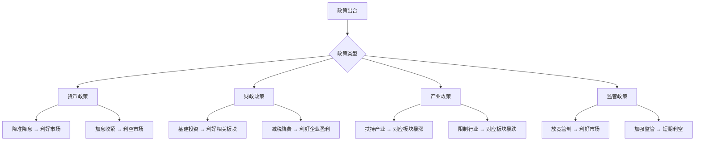
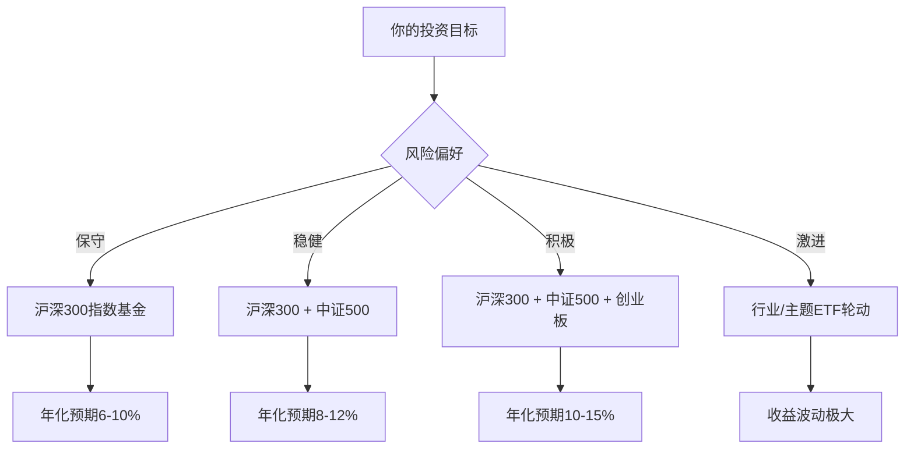
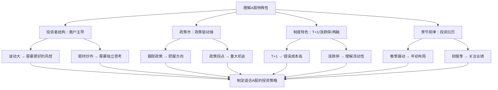

## 七、A股市场的特殊性

理解A股市场的独特性，是在A股中生存的前提。A股不是简化版的美股，它有自己的游戏规则、参与者结构、政策逻辑和市场生态。用美股的思维做A股，就像用高速公路的驾驶习惯去跑山路——技术没问题，但环境完全不同。

本章系统梳理A股与成熟市场的核心差异，帮助你建立"A股思维框架"，避免照搬海外经验导致的水土不服。

### 7.1 A股市场的基本架构

#### 7.1.1 交易所体系

A股目前有三家证券交易所，各有定位：

| 交易所 | 成立时间 | 定位 | 上市门槛 | 涨跌幅限制 |
|--------|----------|------|----------|------------|
| 上海证券交易所（上交所） | 1990年 | 大型蓝筹企业 | 最高 | 主板±10%，科创板±20% |
| 深圳证券交易所（深交所） | 1991年 | 中型企业、创新成长 | 中等 | 主板±10%，创业板±20% |
| 北京证券交易所（北交所） | 2021年 | 专精特新中小企业 | 较低 | ±30% |

**各板块详细对比：**

| 维度 | 沪市主板 | 深市主板 | 创业板 | 科创板 | 北交所 |
|------|----------|----------|--------|--------|--------|
| 企业类型 | 大型成熟企业 | 中大型企业 | 成长型创新企业 | 硬科技企业 | 专精特新中小企业 |
| 投资者门槛 | 无 | 无 | 10万+2年经验 | 50万+2年经验 | 50万+2年经验 |
| 涨跌幅 | ±10% | ±10% | ±20% | ±20% | ±30% |
| 上市制度 | 注册制 | 注册制 | 注册制 | 注册制 | 注册制 |
| 退市风险 | 较低 | 较低 | 中等 | 中等 | 较高 |
| 新股前5日 | ±44% | ±44% | 不设涨跌幅 | 不设涨跌幅 | 不设涨跌幅 |

> **关键提醒：** 科创板和创业板的新股上市前5个交易日不设涨跌幅限制，这意味着新股可能在短时间内出现巨大波动。北交所新股同样不设涨跌幅，且日常涨跌幅为±30%，波动远大于沪深主板。

#### 7.1.2 交易时间与规则

**交易时段：**

| 时段 | 时间 | 说明 |
|------|------|------|
| 集合竞价（开盘） | 9:15-9:25 | 9:15-9:20可撤单，9:20-9:25不可撤单 |
| 连续竞价（上午） | 9:30-11:30 | 正常交易 |
| 午间休市 | 11:30-13:00 | 不可交易，但可挂单 |
| 连续竞价（下午） | 13:00-14:57 | 正常交易 |
| 集合竞价（收盘） | 14:57-15:00 | 不可撤单，确定收盘价 |
| 盘后固定价格交易 | 15:05-15:30 | 仅科创板和创业板，以收盘价成交 |

**竞价规则详解：**

集合竞价的核心是"最大成交量原则"——交易所会在所有委托中找到一个价格，使得以该价格成交的股票数量最大化。理解这个机制，你就能读懂开盘前的多空博弈。

```text
集合竞价期间的关键时间节点：

9:15-9:20  → 可以下单，也可以撤单
              （主力可能挂大单制造假象，然后撤单）
9:20-9:25  → 可以下单，但不能撤单
              （这个阶段的委托是真实的，更具参考价值）
9:25       → 产生开盘价，所有符合条件的委托一次性成交
9:25-9:30  → 接收委托，但不处理（9:30后统一处理）
```

**实操建议：** 如果你要在开盘价买入或卖出，重点关注9:20-9:25的委托变化，这才是真实的市场意图。9:15-9:20的挂单很可能是主力在"试盘"或"诱多/诱空"。

#### 7.1.3 T+1交易制度深度解析

A股实行T+1制度：当天买入的股票，最早要到下一个交易日才能卖出。这是A股与美股最显著的制度差异之一。

**T+1对交易策略的影响：**

| 影响维度 | 具体表现 | 应对策略 |
|----------|----------|----------|
| 错误成本高 | 买入后当日无法止损，若盘中暴跌只能看着 | 买入前做好充分研究，分批建仓 |
| 日内交易受限 | 无法当日买卖，纯日内策略不可行 | 已持有的股票可当日卖出再买回（T+0变通） |
| 尾盘效应 | 资金倾向于尾盘买入，避免隔夜风险 | 关注14:30后的成交量和价格变化 |
| 打板策略 | 追涨停板后当日无法卖出，次日可能低开 | 打板需要更高的胜率和风控 |

**T+0变通操作（利用已有持仓）：**

虽然不能当天买入当天卖出，但如果你已经持有某只股票，可以进行"伪T+0"操作：

```text
场景：你持有1000股贵州茅台

正T操作（先买后卖）：
  10:00 股价跌到1700元 → 买入1000股（此时持有2000股）
  14:00 股价反弹到1730元 → 卖出1000股（回到1000股持仓）
  结果：赚了30元/股 × 1000股 = 30,000元（扣除手续费）

倒T操作（先卖后买）：
  10:30 股价涨到1750元 → 卖出1000股（此时持有0股）
  14:30 股价回落到1720元 → 买入1000股（回到1000股持仓）
  结果：赚了30元/股 × 1000股 = 30,000元（扣除手续费）
```

> **注意：** 这种操作要求你对日内波动有较强的判断能力，且每次交易都有手续费成本。频繁操作并不适合所有人。

### 7.2 A股与成熟市场的核心区别

#### 7.2.1 投资者结构：散户主导的市场

A股最显著的特征是散户占比远高于成熟市场。

**投资者结构对比：**

| 维度 | A股 | 美股 | 港股 |
|------|-----|------|------|
| 散户交易量占比 | 60-70% | 约10-15% | 约20-25% |
| 机构交易量占比 | 30-40% | 85-90% | 75-80% |
| 散户持股市值占比 | 约25-30% | 约10% | 约15% |
| 平均持股周期 | 数天到数周 | 数月到数年 | 数周到数月 |

**散户主导带来的市场特征：**

1. **波动率更高。** 散户倾向于追涨杀跌，放大了市场波动。A股的年化波动率通常在25-35%，而美股标普500通常在15-20%。

2. **题材炒作盛行。** 散户偏好"概念"和"故事"，而非基本面。一个热门概念（如AI、新能源、元宇宙）可以在短期内将相关股票推高数倍，即使公司基本面毫无变化。

3. **换手率极高。** A股的年化换手率经常超过300-500%，意味着平均持股时间不到3个月。对比之下，美股标普500成分股的年化换手率通常在100-150%。

4. **小盘股溢价。** 在成熟市场，小盘股通常有流动性折价；但在A股，小盘股反而经常获得溢价，因为散户偏爱低价股和"弹性大"的股票。

5. **信息不对称严重。** 机构投资者有专业的研究团队和信息渠道，散户主要依赖公开信息、新闻和"股吧"等社区，信息质量和时效性差距巨大。

```text
散户行为的典型模式：

追涨杀跌循环：
  股价上涨 → 散户FOMO入场 → 推高股价 → 更多散户跟进
  → 泡沫形成 → 某个触发点（利空/获利回吐）→ 股价下跌
  → 散户恐慌抛售 → 加速下跌 → 割肉离场
  → 股价跌到低位 → 散户不敢买 → 重复循环

认知偏差在A股中的表现：
  - 过度自信：认为自己能跑赢市场，频繁交易
  - 确认偏差：只看利好消息，忽略风险信号
  - 锚定效应：买入价成为心理锚点，不愿止损
  - 从众心理：跟风买入热门股，不做独立分析
  - 损失厌恶：亏损时死扛不卖，盈利时急于落袋
```

#### 7.2.2 政策市特征

A股是全球主要市场中受政策影响最大的市场之一。政策不仅影响市场方向，还直接影响板块轮动和个股定价。

**政策影响市场的主要路径：**



**A股历史上的重大政策事件及其影响：**

| 时间 | 政策事件 | 市场影响 |
|------|----------|----------|
| 2007年5月30日 | 印花税从1‰上调到3‰ | "530惨案"，次日千股跌停 |
| 2008年9月 | 印花税单边征收 + 汇金增持 | "919行情"，大盘涨停 |
| 2014-2015年 | 融资融券放松 + 场外配资 | 杠杆牛，后因清理配资暴跌 |
| 2016年初 | 熔断机制实施 | 仅4天即触发两次熔断，被迫废止 |
| 2018年 | 去杠杆 + 中美贸易战 | 全年下跌，上证跌超25% |
| 2020年 | 注册制改革 + 新基金发行潮 | 结构性牛市，核心资产暴涨 |
| 2021年 | 教育双减 + 互联网反垄断 | 对应板块暴跌70-90% |
| 2024年 | 新"国九条" + 限制量化 | 市场风格切换，小盘股承压 |

**如何跟踪政策动向：**

1. **国务院常务会议/政治局会议。** 这是最高级别的政策信号源。政治局会议通常在4月、7月、10月、12月讨论经济问题，措辞变化（如"稳增长"vs"防风险"）往往预示政策转向。

2. **央行操作。** MLF（中期借贷便利）利率调整、LPR（贷款市场报价利率）变动、逆回购操作规模，都是货币政策松紧的直接信号。

3. **证监会/交易所动态。** IPO发行节奏、融资融券政策调整、对特定行为的监管表态，直接影响市场流动性预期。

4. **产业政策文件。** 国务院发布的产业发展规划、工信部的行业指导意见，往往催生板块级别的行情。

> **实操建议：** 建立一个政策跟踪清单，按"利好/利空/中性"分类，每周更新。重点关注政策的边际变化（如从"紧"转向"松"），而非绝对方向。市场往往在政策转向的预期阶段就开始反应，等到政策真正落地时，行情可能已经走了一半。

#### 7.2.3 退市制度与壳资源

**退市制度演变：**

A股的退市制度经历了从"几乎不退"到"加速退市"的重大转变。

```text
退市制度演变时间线：

1990-2001年  无退市制度，上市即"铁饭碗"
2001年       《亏损公司暂停上市和终止上市实施办法》出台
2001-2020年  年均退市仅个位数，"退市难"成为顽疾
2020年       退市新规出台，简化退市指标
2021年       退市数量开始增加（约20家）
2022年       退市数量突破40家，常态化退市开启
2023-2024年  年退市数量持续增加，面值退市成为主流
```

**退市类型及预警信号：**

| 退市类型 | 触发条件 | 预警信号 | 案例 |
|----------|----------|----------|------|
| 财务类退市 | 连续亏损/营收不达标/净资产为负 | ST标记、*ST标记 | 多家传统行业公司 |
| 交易类退市 | 连续20个交易日股价低于1元 | 股价持续低迷、成交量萎缩 | 2023年多家面值退市 |
| 规范类退市 | 信息披露重大违法/财务造假 | 被证监会立案调查 | 康美药业、康得新 |
| 重大违法退市 | 欺诈发行/重大安全事故 | 行政处罚决定 | 长生生物 |

**壳资源价值的消退：**

在注册制之前，A股的上市资格（"壳"）具有巨大价值。一家经营困难的上市公司，仅仅因为拥有上市资格，市值就可能维持在10-20亿元。投资者炒作"壳股"（押注某家公司会被借壳上市）曾经是一种流行策略。

注册制改革后，上市门槛降低、退市加速，壳资源价值大幅缩水。曾经的"保壳"策略（如年底突击卖资产、政府补贴扭亏）也越来越难奏效。

> **警示：** 不要再用"壳资源"逻辑去投资小盘绩差股。在当前的监管环境下，退市风险远大于"乌鸡变凤凰"的可能性。

#### 7.2.4 涨跌停板制度详解

涨跌停板是A股特有的价格稳定机制，对交易策略有深远影响。

**各板块涨跌幅限制：**

| 板块/情况 | 涨跌幅限制 | 说明 |
|-----------|------------|------|
| 沪深主板 | ±10% | 普通股票 |
| 主板ST/*ST股票 | ±5% | 风险警示股票 |
| 创业板 | ±20% | 2020年改革后 |
| 科创板 | ±20% | 自设立起 |
| 北交所 | ±30% | 自设立起 |
| 新股上市首日（沪深主板） | ±44% | 有44%的上限 |
| 新股上市前5日（创业板/科创板/北交所） | 不设限制 | 可能出现数倍涨幅 |
| 退市整理期股票 | ±10% | 最后交易阶段 |

**涨停板的博弈逻辑：**

涨停板不只是"涨到上限"那么简单，它背后有复杂的博弈：

```text
涨停板的分类与含义：

一字涨停（开盘即封死）：
  - 含义：多方力量极强，空方完全没有抵抗
  - 场景：重大利好消息、新股上市、复牌补涨
  - 操作：通常买不进去，委托排队

实体涨停（盘中封住）：
  - 含义：盘中多空博弈后多方胜出
  - 关注：涨停时间越早越强，封单量越大越稳
  - 操作：可以在涨停价排队买入，但不保证成交

炸板（涨停后打开）：
  - 含义：空方力量增强，或获利盘涌出
  - 关注：炸板次数、回封速度、成交量变化
  - 操作：如果多次炸板后回封，可能是换手充分的信号

尾盘涨停（14:30之后封住）：
  - 含义：可能是主力为了次日高开而拉升
  - 关注：封单量是否真实，次日是否能延续
  - 操作：谨慎对待，次日低开概率不低
```

**跌停板的风险管理：**

跌停板最大的风险是"流动性陷阱"——当股票跌停时，你可能想卖但卖不出去，因为买单极少。

```text
应对跌停风险的策略：

1. 分散持仓：单一股票仓位不超过总资金的20%
2. 设置预警：股价下跌5%时开始关注，下跌8%时考虑减仓
3. 理解跌停类型：
   - 利空跌停（财报暴雷/被调查）：通常连续跌停，尽早排队卖出
   - 情绪跌停（大盘暴跌带崩）：可能次日反弹，不必恐慌
   - 庄股跌停（主力出货）：可能连续一字跌停，极其危险
4. 跌停板排队卖出：如果决定卖出，尽早挂单，按时间优先原则排队
```

### 7.3 A股的投资日历与季节性规律

A股存在一些统计上显著的季节性效应。需要强调的是，这些规律是概率性的，不是每年都成立，不应作为唯一的投资依据。

#### 7.3.1 月度效应

| 月份 | 典型特征 | 统计规律 | 背后逻辑 |
|------|----------|----------|----------|
| 1月 | "春季躁动" | 历史上上涨概率约60% | 年初资金面宽松，机构重新配置 |
| 2月 | 交易清淡 | 成交量明显萎缩 | 春节假期，市场观望 |
| 3-4月 | 年报季 | 业绩超预期个股表现好 | 年报披露，高送转预期 |
| 5月 | "Sell in May" | 历史上5月下跌概率偏高 | 春季行情结束，获利回吐 |
| 6-7月 | 半年报预期 + 资金面 | 波动加大 | 银行MPA考核，资金面趋紧 |
| 8-9月 | 秋季行情酝酿 | 板块轮动加速 | 三季报预期，机构调仓 |
| 10月 | 国庆行情 | 国庆后常有短期反弹 | 节后资金回流，政策预期 |
| 11-12月 | 年末效应 | 12月波动加大 | 机构排名博弈，年末资金紧张 |

#### 7.3.2 重要时间节点

```text
A股投资者必须关注的时间节点：

财报季：
  年报：4月30日前披露完毕（1-4月密集披露）
  一季报：4月30日前
  半年报：8月31日前（7-8月密集披露）
  三季报：10月31日前

政策会议：
  3月：全国两会（政府工作报告）
  4月/7月/10月/12月：政治局会议（经济形势判断）
  12月：中央经济工作会议（来年经济工作定调）

资金面关键时点：
  每月：MLF到期日、LPR报价日（每月20日）
  季末：银行MPA考核（3月/6月/9月/12月末）
  节前：春节前、国庆前资金面趋紧

股指期货/期权：
  每月第三个周五：股指期货交割日（"交割日效应"）
  ETF期权到期日：可能引起标的波动加大
```

#### 7.3.3 "春季躁动"深度分析

"春季躁动"是A股最广为人知的季节性效应之一，指的是每年1-3月市场往往有一波上涨行情。

**春季躁动的驱动因素：**

1. **资金面宽松。** 年初银行信贷投放加速，市场流动性充裕。
2. **政策预期。** 两会前市场对政策利好的期待，催生乐观情绪。
3. **机构建仓。** 年初是新基金发行高峰期，增量资金入场。
4. **风险偏好回升。** 经过年末的调整，投资者风险偏好在新年重新提升。

**春季躁动的参与策略：**

- 不要盲目追涨，在12月下旬市场低迷时逐步布局
- 关注两会政策受益方向，提前埋伏
- 春季躁动结束后（通常4月中下旬），注意获利了结
- 历史上年化收益最高的月份集中在2月和3月

### 7.4 A股主要指数详解

#### 7.4.1 核心指数对比

| 指数 | 代码 | 成分股数量 | 选股范围 | 加权方式 | 行业特征 |
|------|------|-----------|----------|----------|----------|
| 上证综指 | 000001 | 全部沪市股票 | 上交所全部 | 总市值加权 | 金融、能源占比高 |
| 深证成指 | 399001 | 500只 | 深交所 | 自由流通市值加权 | 制造、科技占比高 |
| 沪深300 | 000300 | 300只 | 沪深两市前300大 | 自由流通市值加权 | 大盘蓝筹代表 |
| 中证500 | 000905 | 500只 | 排除沪深300后 | 自由流通市值加权 | 中盘成长代表 |
| 中证1000 | 000852 | 1000只 | 排除沪深800后 | 自由流通市值加权 | 小盘股代表 |
| 创业板指 | 399006 | 100只 | 创业板 | 自由流通市值加权 | 新能源、医药、TMT |
| 科创50 | 000688 | 50只 | 科创板 | 自由流通市值加权 | 半导体、生物医药 |
| 上证50 | 000016 | 50只 | 沪市前50大 | 自由流通市值加权 | 超大盘金融权重 |
| 中证红利 | 000922 | 100只 | 高股息股票 | 股息率加权 | 银行、煤炭、电力 |

**上证综指的"失真"问题：**

上证综指是A股最知名的指数，但其参考价值有限。原因包括：
- 采用总市值加权，而非自由流通市值加权，导致国有大银行等"巨无霸"权重过大
- 包含了大量基本面差的小股票，拖累指数表现
- 新股计入指数的时间规则多次调整
- 2007年上证综指最高6124点，至今未能突破，但这不代表A股整体表现差——同期沪深300的全收益指数已远超2007年高点

#### 7.4.2 指数投资建议



| 投资者类型 | 推荐配置 | 理由 |
|-----------|----------|------|
| 完全新手 | 沪深300ETF | 代表性强、波动适中、流动性好 |
| 有一定经验 | 沪深300(60%) + 中证500(40%) | 大小盘搭配，分散风险 |
| 追求成长 | 沪深300(40%) + 创业板(30%) + 科创50(30%) | 偏向科技创新 |
| 价值投资 | 上证50(50%) + 中证红利(50%) | 高股息、低估值 |
| 定投策略 | 沪深300 + 中证500各50% | 长期定投平滑成本 |

### 7.5 A股特有的交易机制

#### 7.5.1 融资融券

融资融券（简称"两融"）是A股的杠杆交易工具，类似于美股的保证金交易。

**基本概念：**

| 项目 | 融资 | 融券 |
|------|------|------|
| 含义 | 借钱买股（做多） | 借股卖出（做空） |
| 杠杆比例 | 通常1:1（100万担保品可融100万） | 取决于券源 |
| 利率 | 年化6-8%（各券商不同） | 年化8-10% |
| 维持担保比例 | 低于130%会被强制平仓 | 低于130%会被强制平仓 |
| 门槛 | 50万资产 + 6个月交易经验 | 同融资 |
| 风险 | 亏损放大，可能被强平 | 理论上亏损无限 |

**两融数据的市场含义：**

融资余额的变化可以作为市场情绪的风向标：

```text
融资余额解读：

融资余额持续增加：
  → 投资者加杠杆做多，市场情绪乐观
  → 但如果增速过快，可能预示过热

融资余额持续减少：
  → 投资者去杠杆，市场情绪悲观
  → 但如果减少到极低水平，可能预示底部

融资余额处于历史高位：
  → 杠杆资金集中，一旦下跌可能引发连锁强平
  → 风险较大

关键观察：关注融资买入额占成交额的比例
  - 正常水平：8-12%
  - 过热信号：>15%
  - 冰点信号：<5%（可能是底部区域）
```

#### 7.5.2 北向资金与互联互通

2014年沪港通开通、2016年深港通开通后，境外资金可以通过"北向通道"直接买卖A股。北向资金被市场称为"聪明钱"，其动向受到广泛关注。

**北向资金的特征：**

| 维度 | 说明 |
|------|------|
| 资金来源 | 外资机构、对冲基金、被动指数基金 |
| 持仓偏好 | 大盘蓝筹、消费龙头、高ROE公司 |
| 交易风格 | 偏中长期，但也有短线交易 |
| 数据披露 | 每日公布净买入金额，季度披露持仓明细 |
| 影响力 | 持股市值约占A股自由流通市值的4-5% |

**如何利用北向资金数据：**

1. **趋势判断。** 北向资金连续多日大幅净买入，通常说明外资看好中国市场。
2. **个股筛选。** 北向资金持续买入的个股，往往是基本面优秀的公司。
3. **风险预警。** 北向资金大幅净流出时，可能预示市场风险加大。
4. **但不能盲从。** 北向资金也有短线交易，不是每次都对。2023-2024年北向资金也曾连续流出，但市场随后反弹。

#### 7.5.3 打新制度

"打新"（申购新股）是A股特有的投资机会。在成熟市场，新股上市通常由投行定价销售，散户很难参与；而在A股，散户可以通过网上申购参与打新。

**注册制下打新的变化：**

| 维度 | 注册制前（核准制） | 注册制后 |
|------|-------------------|----------|
| 中签率 | 极低（万分之几） | 有所提高 |
| 上市涨幅 | 几乎必涨，涨幅大 | 不再必涨，有破发风险 |
| 定价 | 行政压低发行价 | 市场化定价 |
| 参与门槛 | 持有市值即可 | 需要开通对应板块权限 |
| 收益预期 | 稳赚不赔 | 需要选择性参与 |

**打新策略建议：**

```text
注册制下打新的注意事项：

1. 不再是"无脑打"：注册制后新股破发率上升，需要研究公司基本面
2. 关注发行市盈率：
   - 发行PE < 行业平均PE：大概率有上涨空间
   - 发行PE > 行业平均PE：破发风险较大
3. 关注中签后的卖出时机：
   - 主板新股：开板（涨停板打开）当天卖出是常见策略
   - 创业板/科创板新股：上市首日波动大，需要根据市场情绪判断
4. 打新额度：按持有市值计算，沪深分开计算
   - 沪市：每1万元市值可申购1000股
   - 深市：每5000元市值可申购500股
```

### 7.6 A股的板块轮动与概念炒作

#### 7.6.1 板块轮动规律

A股的板块轮动速度远快于成熟市场，这与散户主导的市场结构密切相关。

**板块轮动的常见驱动因素：**

| 驱动因素 | 轮动逻辑 | 持续时间 |
|----------|----------|----------|
| 政策催化 | 政策利好某行业 → 资金涌入 → 板块上涨 | 数天到数周 |
| 业绩驱动 | 某行业业绩超预期 → 机构加仓 → 板块走强 | 数周到数月 |
| 风格切换 | 大盘蓝筹与中小盘之间的跷跷板效应 | 数周到数季度 |
| 主题炒作 | 某个概念（如AI、元宇宙）引发市场追捧 | 数天到数周 |
| 估值修复 | 低估值板块在市场回暖时补涨 | 数周到数月 |

**历史上典型的板块轮动周期：**

```text
2019-2021年的核心资产行情：
  背景：外资持续流入 + 国内机构抱团
  表现：茅台、宁德时代等"核心资产"暴涨
  结束原因：估值过高 + 美债利率上升 + 政策转向

2021-2022年的新能源行情：
  背景：碳中和政策 + 行业景气度高
  表现：锂电、光伏、风电板块大幅上涨
  结束原因：产能过剩 + 行业内卷 + 估值回归

2023-2024年的AI主题行情：
  背景：ChatGPT引爆AI热潮
  表现：AI算力、应用、数据等概念股轮番上涨
  特点：题材炒作特征明显，基本面支撑有限的个股涨幅更大
```

#### 7.6.2 "炒概念"现象

"炒概念"是A股最具特色的市场现象之一。当某个热点主题出现时，与之相关的（甚至只是名字沾边的）股票都会被资金追捧。

**概念炒作的典型模式：**

```text
概念炒作的生命周期：

1. 启动期：
   触发事件（政策/技术突破/国际事件）
   → 龙头股率先涨停
   → 市场开始关注

2. 发酵期：
   龙头股连续涨停
   → 媒体大量报道
   → 散户开始追涨
   → 概念股全面开花

3. 高潮期：
   连"沾边"的股票都被炒
   → 各种"专家"出来解读
   → 基金发行相关产品
   → 成交量达到峰值

4. 退潮期：
   龙头股开始回调
   → 跟风股大幅下跌
   → 利好出尽变利空
   → 一地鸡毛

5. 沉淀期：
   真正受益的公司股价回调后企稳
   → 业绩逐步兑现
   → 长线资金重新入场
```

> **核心教训：** 概念炒作的赚钱窗口很短，亏损风险很大。如果你不是在启动期入场的，大概率是在给别人接盘。对普通投资者而言，最好的策略是：在概念刚出现时小仓位参与，在市场疯狂时保持冷静，绝不追涨已经翻倍的"概念股"。

### 7.7 A股的量化交易与市场微观结构

#### 7.7.1 量化交易在A股的崛起

近年来，量化交易在A股的占比快速提升，对市场生态产生了深远影响。

**量化交易的主要类型：**

| 类型 | 策略描述 | 持仓周期 | 对散户的影响 |
|------|----------|----------|------------|
| 量化选股 | 多因子模型选股 | 数周到数月 | 与散户直接竞争 |
| 量化对冲 | 做多股票+做空股指期货 | 数周 | 中性影响 |
| 高频交易 | 利用速度优势日内交易 | 秒到分钟 | 抢先散户成交 |
| CTA策略 | 趋势跟踪/均值回归 | 数天到数周 | 放大趋势 |
| 量化打板 | 利用算法追涨停板 | 日内到隔日 | 增加涨停板竞争 |

**量化交易对散户的影响：**

1. **短线难度增加。** 量化交易在速度和纪律性上远超散户，纯短线博弈中散户劣势明显。
2. **波动模式改变。** 量化策略的趋同性可能加剧市场波动，出现"量化踩踏"。
3. **信息优势缩小。** 量化机构通过另类数据（卫星图像、物流数据等）获取信息优势。
4. **监管关注。** 2024年以来监管层对量化交易的监管趋严，包括限制程序化交易报告、提高交易成本等。

> **实操建议：** 散户不应该试图在短线交易上与量化机构竞争。正确的策略是：利用量化无法覆盖的优势——长期投资视角、对商业模式的深度理解、对公司治理的判断力。

#### 7.7.2 市场微观结构

理解市场的微观结构，有助于你更好地执行交易。

**A股的委托类型：**

| 委托类型 | 说明 | 适用场景 |
|----------|------|----------|
| 限价委托 | 指定价格，等待成交 | 大多数情况下的首选 |
| 市价委托（对手方最优） | 以对手方最优价格成交 | 需要快速成交时 |
| 市价委托（本方最优） | 以本方最优价格挂单 | 介于限价和市价之间 |
| 市价委托（即时成交剩余撤销） | 能成交多少成交多少，剩余撤销 | 大单快速建仓/减仓 |
| 五档即成转限价 | 以五档内最优价格成交，未成交部分转限价 | 想成交又不想太激进 |

**挂单技巧：**

```text
实用挂单策略：

1. 买入时：
   - 不急于成交：挂在买二或买三价位，等待价格回落
   - 急于成交：挂在卖一价位，或直接用市价委托
   - 打板排队：挂在涨停价，按时间优先排队

2. 卖出时：
   - 不急于成交：挂在卖二或卖三价位，等待价格上升
   - 急于成交/止损：挂在买一价位，或直接用市价委托
   - 跌停排队：挂在跌停价，按时间优先排队

3. 大单拆分：
   - 如果要买卖的数量较大（超过日成交量的1%），建议拆分为多笔小单
   - 避免一笔大单冲击市场价格
   - 可以在不同时间点分批执行
```

### 7.8 A股的税费体系

交易成本是影响投资收益的重要因素，尤其是对频繁交易的投资者。

#### 7.8.1 交易费用明细

| 费用项目 | 费率 | 收取方 | 说明 |
|----------|------|--------|------|
| 佣金 | 最高0.03%（万三） | 券商 | 可协商，最低5元/笔 |
| 印花税 | 0.05%（万五） | 国家 | 仅卖出时收取（2023年下调） |
| 过户费 | 0.001%（十万分之一） | 中国结算 | 沪深都收 |
| 经手费 | 0.00341%（双向） | 交易所 | 已包含在佣金中 |
| 证管费 | 0.002%（双向） | 证监会 | 已包含在佣金中 |

**交易成本计算示例：**

```text
场景：买入10万元股票，持有一周后卖出

买入成本：
  佣金：100,000 × 0.03% = 30元（最低5元，实际30元）
  过户费：100,000 × 0.001% = 1元
  买入总成本：31元

卖出成本：
  佣金：100,000 × 0.03% = 30元
  印花税：100,000 × 0.05% = 50元
  过户费：100,000 × 0.001% = 1元
  卖出总成本：81元

一买一卖总成本：31 + 81 = 112元
占交易金额比例：112 / 100,000 = 0.112%

如果佣金降到万1.5：
  买入：15 + 1 = 16元
  卖出：15 + 50 + 1 = 66元
  总成本：82元，占比0.082%
```

> **提示：** 佣金是可以和券商谈判的。目前主流券商的佣金率在万1.5到万3之间，资金量大的投资者可以谈到更低。佣金差异看起来不大，但对高频交易者来说，长期累积的成本差异非常可观。

#### 7.8.2 股息红利税

A股对股息红利征收个人所得税，持有时间不同，税率不同：

| 持有时间 | 税率 | 说明 |
|----------|------|------|
| 持有≤1个月 | 20% | 短期持有，全额征税 |
| 1个月<持有≤1年 | 10% | 中期持有，减半征税 |
| 持有>1年 | 免税 | 长期持有鼓励 |

> **实操意义：** 如果你计划获取股息收入，持有时间至少要超过1年才能享受免税待遇。这也是为什么"高股息策略"更适合长期投资者。

### 7.9 A股投资的常见误区

#### 误区一：用美股思维做A股

```text
错误做法：
  - 认为"好公司永远涨"（A股的周期性更强）
  - 坚持"买入并持有"不做任何操作（A股波动大，可能坐过山车）
  - 忽视政策影响（政策可以在一夜之间改变行业格局）

正确做法：
  - 理解A股的周期性，在高估时适当减仓
  - 长期持有也要结合估值，在极端高估时卖出
  - 将政策分析纳入投资决策框架
```

#### 误区二：只看K线图不看基本面

```text
错误做法：
  - 纯技术分析，不关心公司做什么、赚不赚钱
  - 听消息炒股，朋友说哪只就买哪只
  - 追涨杀跌，频繁交易

正确做法：
  - 基本面分析是基础，技术分析是辅助
  - 买入前至少了解：公司做什么、行业地位、财务状况、估值水平
  - 制定交易计划并严格执行，不被情绪左右
```

#### 误区三：忽视仓位管理

```text
错误做法：
  - 满仓一只股票（赌徒心态）
  - 不设止损，亏损时加仓摊薄成本
  - 牛市满仓、熊市也满仓

正确做法：
  - 单一股票仓位不超过20-30%
  - 设置止损线并严格执行
  - 根据市场环境调整总仓位（牛市7-9成，熊市3-5成）
```

#### 误区四：盲目跟风"大V"和"股神"

```text
错误做法：
  - 看到某个"大V"推荐就无脑买入
  - 相信"稳赚不赔"、"一年十倍"的宣传
  - 加入各种"荐股群"付费跟单

正确做法：
  - 学习投资逻辑，而非抄作业
  - 对任何推荐都保持怀疑，独立验证
  - 记住：如果真有人能稳赚不赔，他不需要靠卖课赚钱
```

#### 误区五：忽视流动性风险

```text
错误做法：
  - 买入日成交量极低的"僵尸股"
  - 在跌停板上恐慌挂单却卖不出去
  - 大资金买入小盘股导致自己推高了价格

正确做法：
  - 选择日均成交额在5000万以上的股票
  - 分散持仓，避免流动性集中风险
  - 大单交易时使用拆单策略
```

### 7.10 总结：建立你的A股投资框架



**A股投资者的核心生存法则：**

1. **理解规则。** T+1、涨跌停、两融、退市制度——这些制度细节直接影响你的交易策略和风险管理。
2. **尊重政策。** 政策是A股最大的变量，不看政策做A股等于盲人骑马。
3. **控制仓位。** A股波动大，满仓操作的风险远高于成熟市场。
4. **独立思考。** 在散户主导的市场中，从众往往意味着接盘。
5. **长期视角。** 短线博弈的对手包括量化机构和游资，散户胜率很低；但长期持有优质公司，散户的耐心反而成为优势。

A股不是一个"更好"或"更差"的市场，它只是一个"不同"的市场。适应它的规则，利用它的特征，才能在这个市场中长期生存并获利。
