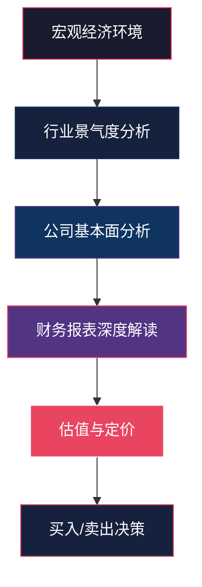

## 八、基本面分析的系统方法

基本面分析是价值投资的核心武器。它回答一个根本问题：**这家公司到底值多少钱？** 与技术分析关注"价格怎么走"不同，基本面分析关注"企业怎么样"。掌握系统的基本面分析方法，是从业余炒股走向专业投资的分水岭。

### 8.1 基本面分析的整体框架

基本面分析不是零散地看几个指标，而是一个**自上而下（Top-Down）**的系统工程：



**六步分析流程**：

| 步骤 | 内容 | 关键问题 | 核心工具 |
|------|------|----------|----------|
| 第一步 | 宏观环境扫描 | 经济周期处于哪个阶段？货币政策是松是紧？ | GDP、CPI、PMI、社融数据 |
| 第二步 | 行业分析 | 行业景气度如何？竞争格局怎样？ | 波特五力、行业生命周期 |
| 第三步 | 公司分析 | 竞争优势是什么？管理层是否靠谱？ | 护城河分析、管理层评估 |
| 第四步 | 财务分析 | 盈利能力、成长性、财务健康度如何？ | 三大报表、杜邦分析 |
| 第五步 | 估值定价 | 当前价格是贵还是便宜？ | PE/PB/PEG/DCF |
| 第六步 | 安全边际 | 留多少安全垫？何时买何时卖？ | 估值区间、触发条件 |

> **关键认知**：这六步不是线性的，而是反复迭代的。估值发现贵了，要回去重新审视行业和公司判断；宏观环境变化了，要重新评估行业景气度。

### 8.2 行业分析框架

在投资一只股票之前，首先要分析它所在的行业。**选对行业，比选对公司更重要。** 一个处于衰退期的行业，即使是龙头也很难给投资者带来好回报。

#### 8.2.1 行业生命周期分析

每个行业都有从诞生到衰退的生命周期，不同阶段的投资逻辑完全不同：

| 阶段 | 特征 | 风险收益 | 投资策略 | 典型行业 |
|------|------|----------|----------|----------|
| **导入期** | 技术尚未成熟，商业模式不清晰，企业大多亏损 | 高风险、极高潜在回报 | 风险投资思维，少量配置（<5%仓位），分散投多家 | 量子计算、脑机接口、固态电池 |
| **成长期** | 需求爆发，企业快速扩张，竞争者涌入 | 中高风险、高回报 | 重点配置（15-30%仓位），选龙头享受增长红利 | 新能源车（2020-2023）、AI大模型 |
| **成熟期** | 格局稳定，增速放缓，龙头优势明显 | 低风险、中等回报 | 选龙头，获取稳定分红和估值修复 | 白酒、家电、银行 |
| **衰退期** | 需求萎缩，企业退出，行业整合 | 中等风险、低回报 | 回避，或在行业出清尾声博弈反转 | 传统煤炭、部分传统制造 |

**如何判断行业处于哪个阶段？** 看三个核心信号：

1. **渗透率**：行业产品在目标人群中的普及程度。渗透率 <10% 处于导入期，10-50% 处于成长期，>50% 趋向成熟。例如新能源车2024年渗透率约35%，仍处于成长期。
2. **行业增速与GDP增速的关系**：增速是GDP的2倍以上→成长期；与GDP持平→成熟期；低于GDP→衰退期。
3. **竞争格局变化**：玩家不断增加→导入/成长期；玩家开始减少→成熟/衰退期。

#### 8.2.2 波特五力分析模型

迈克尔·波特提出的五力模型，是分析行业竞争格局的经典工具。它从五个维度评估行业的吸引力：

**五力详解**：

**1. 行业内现有竞争者的竞争强度**

竞争越激烈，行业整体利润率越低。影响因素：
- 企业数量：数量越多，竞争越激烈
- 产品差异化：同质化严重则价格战频发
- 退出壁垒：退出成本高则企业宁可亏损也不退出
- 增长速度：增速放缓时竞争加剧

判断标准：如果行业CR3（前三名市占率之和）>60%，说明格局较好，竞争相对温和。

**2. 新进入者的威胁**

进入壁垒越高，现有企业的利润越有保障。主要壁垒包括：
- **规模经济**：初始投入巨大（如芯片制造，一条产线投资超百亿）
- **品牌壁垒**：消费者已形成品牌认知（如茅台、爱马仕）
- **技术壁垒**：核心技术难以复制（如ASML光刻机）
- **政策壁垒**：牌照、资质等行政门槛（如银行、证券牌照）
- **网络效应**：用户越多价值越大，后来者难以追赶（如微信）

**3. 替代品的威胁**

替代品可能来自完全不同行业的降维打击。例如：
- 方便面被外卖平台替代
- 传统出租车被网约车替代
- 数码相机被智能手机替代

判断标准：替代品的价格/性能比是否正在快速改善？如果是，威胁在加大。

**4. 供应商的议价能力**

供应商越强势，企业成本越高，利润率越低。供应商强势的条件：
- 供应商集中度高（如全球铁矿石主要由三大矿山控制）
- 替代供应商少
- 供应商的产品对企业至关重要

**5. 买方的议价能力**

客户越强势，企业定价能力越弱。买方强势的条件：
- 买方集中度高（如大型超市对食品供应商）
- 转换成本低
- 买方信息充分，容易比价

**五力综合评分表**：

| 评估维度 | 有利（投资加分） | 不利（投资减分） |
|----------|-----------------|-----------------|
| 行业竞争 | CR3>60%，差异化明显 | 高度分散，同质化严重 |
| 进入壁垒 | 高壁垒，新玩家难以进入 | 低壁垒，随时有新玩家 |
| 替代品 | 无明显替代威胁 | 替代品正在快速崛起 |
| 供应商 | 供应商分散，企业有选择权 | 供应商集中，依赖度高 |
| 买方 | 客户分散，企业有定价权 | 大客户依赖，议价权弱 |

#### 8.2.3 行业景气度跟踪指标

行业分析不是一次性的工作，需要持续跟踪景气度变化：

| 指标 | 高景气标准 | 低景气信号 | 数据来源 |
|------|-----------|-----------|----------|
| 行业营收增速 | >15% | <5%或负增长 | 行业协会、上市公司季报 |
| 行业利润率趋势 | 环比上升 | 环比下降 | 行业统计 |
| 产能利用率 | >80% | <70% | 统计局数据 |
| 行业库存水平 | 低库存+补库存 | 高库存+去库存 | 行业高频数据 |
| 行业政策环境 | 政策支持、补贴 | 政策收紧、监管加强 | 政策文件 |
| 行业资本开支 | 龙头企业扩产 | 企业缩减投资 | 上市公司公告 |
| 产品价格趋势 | 提价、供不应求 | 降价、供过于求 | 行业报价网站 |

**实操方法**：建立行业景气度打分卡，每月/每季度对跟踪的行业进行评分。满分7分，得分≥5分为高景气，≤2分为低景气，中间为中性。

#### 8.2.4 中国特色的行业分析要素

在中国做行业分析，除了通用框架外，还需要额外关注：

1. **政策导向**：中国政策对行业影响巨大。"十四五规划"、产业政策、地方政策都是重要参考。例如新能源行业在政策补贴期和退坡期的表现天差地别。
2. **国企 vs 民企**：同一行业中国企和民企的竞争格局、融资成本、激励机制完全不同。
3. **行业监管周期**：教培、互联网、游戏等行业都经历过强监管周期，对股价影响巨大。
4. **国产替代**：在半导体、高端装备等领域，国产替代进程是重要的投资主线。

### 8.3 公司竞争力分析

选对行业后，要在行业中选出最优秀的公司。公司分析的核心是回答：**这家公司的竞争优势能持续多久？**

#### 8.3.1 护城河的五种类型

沃伦·巴菲特提出的"护城河"概念，是评估公司竞争优势的核心框架：

| 护城河类型 | 含义 | 典型案例 | 持久性 | 评估方法 |
|-----------|------|----------|--------|----------|
| **品牌优势** | 消费者愿意为品牌支付溢价 | 茅台、苹果、爱马仕 | 极强 | 提价后销量是否下降？品牌价值排名 |
| **成本优势** | 比竞争对手成本更低，且来源可持续 | 海螺水泥（矿山+位置）、牧原股份（自繁自养） | 强 | 对比同行业毛利率，分析成本优势来源 |
| **转换成本** | 客户更换供应商的成本很高 | 用友网络（ERP系统）、恒瑞医药（临床数据） | 强 | 客户留存率，更换供应商所需时间和费用 |
| **网络效应** | 用户越多，产品/服务对每个用户的价值越大 | 腾讯（微信社交链）、美团（双边网络） | 极强 | 用户增长曲线，边际用户获取成本 |
| **规模经济** | 规模越大，单位成本越低 | 京东（物流网络）、宁德时代（产能规模） | 中强 | 规模扩张时成本是否持续下降 |

**护城河的三个评估维度**：

1. **宽度**：护城河有多宽？竞争对手能否轻易跨越？
2. **深度**：护城河有多深？优势能持续多少年？
3. **趋势**：护城河是在加宽还是在收窄？

```text
护城河强度判断：

强护城河：同时具备2种以上护城河，且趋势在加宽
  例：茅台 = 品牌 + 产能限制（稀缺性）+ 转换成本（社交属性）
  
中等护城河：具备1种护城河，但有被侵蚀的风险
  例：格力电器 = 品牌 + 成本优势，但面临美的等竞争
  
弱护城河/无护城河：主要靠行业红利，自身无独特优势
  例：大多数同质化的制造业企业
```

#### 8.3.2 商业模式分析

商业模式决定了公司如何创造价值和获取利润。好的商业模式应该具备"三高"特征：

| 特征 | 含义 | 优秀案例 | 普通案例 |
|------|------|----------|----------|
| **高毛利率** | 产品有定价权，不是靠低价竞争 | 茅台（91%毛利率） | 大多数制造业（15-25%） |
| **高复购率** | 客户持续购买，收入可预测 | 海天味业（调味品必需品） | 房地产（一次性大宗消费） |
| **高经营杠杆** | 收入增长时利润增长更快 | 软件公司（边际成本接近零） | 餐饮（每开一家店都要投入） |

**商业模式评估清单**：

- 收入是经常性的还是一次性的？（经常性更好）
- 客户是主动找上门还是需要销售去拉？（主动更好）
- 是先收钱后交付还是先交付后收钱？（先收钱更好）
- 产品是标准化的还是定制化的？（标准化更好，但高端定制除外）
- 轻资产还是重资产？（轻资产更好，但某些行业重资产是壁垒）

#### 8.3.3 管理层评估

好公司需要好管理层来经营。评估管理层需要看四个维度：

**1. 诚信度（一票否决项）**

任何诚信问题都是红线：
- 是否有过财务造假记录？
- 是否有违规减持、内幕交易等行为？
- 是否存在关联交易输送利益？
- 信息披露是否及时、准确？

查询渠道：巨潮资讯网（公司公告）、证监会行政处罚、天眼查/企查查（诉讼信息）。

**2. 经营能力**

- 过往3-5年的经营业绩如何？是否兑现了之前的承诺？
- 战略布局是否前瞻？是否在行业变革时做出正确选择？
- 资本配置能力：赚到的钱是分红、回购、还是乱投资？

**3. 激励机制**

- 是否有股权激励计划？激励条件是否合理？
- 管理层持股比例如何？是否与股东利益一致？
- 薪酬结构是否合理？（高底薪低奖金 vs 低底薪高绩效）

**4. 管理层稳定性**

- 核心管理层是否频繁变动？（频繁变动是危险信号）
- 是否有清晰的接班人计划？
- 创始人是否仍在位？（创始人驱动的公司更需要关注）

#### 8.3.4 公司治理结构

| 评估要素 | 健康信号 | 危险信号 |
|----------|---------|----------|
| 股权结构 | 相对集中但不一股独大，有机构投资者 | 一股独大（>60%），无机构投资者 |
| 董事会 | 独立董事占比>1/3，专业背景多元 | 独立董事形同虚设，全是关联方 |
| 关联交易 | 占比低，定价公允 | 占比高，定价不透明 |
| 审计意见 | 标准无保留意见 | 保留意见、强调事项段 |
| 大股东行为 | 增持、回购 | 大额减持、质押比例高（>50%） |

### 8.4 财务报表分析的"三板斧"

财务报表是公司的"体检报告"。看懂三张表（利润表、资产负债表、现金流量表），就能判断一家公司的盈利能力、财务健康度和真实经营状况。

#### 8.4.1 第一板斧：盈利能力分析

盈利能力决定了公司能赚多少钱，是投资回报的基础。

**核心指标详解**：

**毛利率**

```text
毛利率 = (营业收入 - 营业成本) / 营业收入 × 100%

判断标准：
  >60%：极强定价权（茅台91%、恒瑞医药86%）
  40-60%：优秀（腾讯45%、海天味业40%）
  30-40%：良好（美的集团28%、格力电器33%）
  20-30%：一般
  <20%：较低，可能靠低价竞争

关键：毛利率的稳定性比绝对值更重要
  - 毛利率持续上升 = 竞争力增强
  - 毛利率持续下降 = 竞争优势在被侵蚀
  - 毛利率大幅波动 = 可能是周期性行业
```

**净利率**

```text
净利率 = 净利润 / 营业收入 × 100%

判断标准：
  >30%：极优秀（茅台52%、腾讯25%）
  20-30%：优秀
  10-20%：良好
  5-10%：一般
  <5%：薄利（如零售、代工）

注意：净利率要和毛利率一起看
  - 毛利率高但净利率低 = 费用控制有问题
  - 毛利率低但净利率不低 = 费用控制能力强
```

**ROE（净资产收益率）——最重要的单一指标**

```text
ROE = 净利润 / 净资产 × 100%

判断标准：
  >20%：极优秀（茅台30%、腾讯20%）
  15-20%：优秀
  10-15%：良好
  <10%：一般

核心规则：长期ROE > 15%的公司，大概率是好公司
  巴菲特的筛选标准：连续10年ROE > 15%
```

**杜邦分解——理解ROE的来源**

ROE可以分解为三个因素的乘积，帮助理解公司赚钱的模式：

```text
ROE = 净利率 × 资产周转率 × 权益乘数

净利率高 → 产品有定价权（茅台模式：靠高利润赚钱）
  适用：消费品、奢侈品、软件
  
资产周转率高 → 运营效率高（沃尔玛模式：靠薄利多销赚钱）
  适用：零售、快消品
  
权益乘数高 → 杠杆高（银行模式：靠借钱生钱）
  适用：金融、房地产
```

**杜邦分解实例对比**：

| 公司 | 净利率 | 资产周转率 | 权益乘数 | ROE | 赚钱模式 |
|------|--------|-----------|----------|-----|----------|
| 贵州茅台 | 52% | 0.5次 | 1.3 | 34% | 高利润型 |
| 沃尔玛 | 3% | 2.5次 | 2.5 | 19% | 高周转型 |
| 招商银行 | 35% | 0.03次 | 12 | 16% | 高杠杆型 |
| 海天味业 | 26% | 0.9次 | 1.4 | 33% | 均衡型 |

> **投资启示**：靠高利润赚钱的公司（茅台模式）护城河最深，因为定价权是最难被复制的优势。靠高杠杆赚钱的公司风险最大，因为杠杆是双刃剑。

#### 8.4.2 第二板斧：成长能力分析

好的公司不仅要赚钱，还要能持续增长。

**增长率指标**：

| 指标 | 计算方法 | 高成长标准 | 中等成长 | 低成长 |
|------|---------|-----------|----------|--------|
| 营收增长率 | (本期营收-上期)/上期 | >20% | 10-20% | <10% |
| 净利润增长率 | (本期净利-上期)/上期 | >25% | 10-25% | <10% |
| 扣非净利增长率 | 剔除一次性损益后的增长 | >25% | 10-25% | <10% |
| 经营现金流增长率 | 经营现金流的变化 | >20% | 10-20% | <10% |

**增长质量的三个判断标准**：

1. **内生增长 vs 外延增长**

```text
内生增长：靠自身业务扩张带来的增长（优质）
  表现：营收增长、客户增加、产品提价
  
外延增长：靠并购带来的增长（需要警惕）
  表现：商誉快速增加、并表后营收大增
  
判断方法：看商誉占净资产的比例
  商誉/净资产 < 15%：外延增长占比低
  商誉/净资产 > 30%：外延增长占比高，需警惕商誉减值风险
```

2. **量价关系**

```text
最优：量价齐升（收入增长来自销量增加+价格提升）
次优：以量换价（薄利多销，牺牲利润率换取市场份额）
最差：以价换量（提价但销量下降，说明竞争力在下降）
```

3. **现金流是否同步增长**

```text
健康增长：净利润增长的同时，经营现金流同步增长
  → 利润是真金白银
  
危险信号：净利润增长但经营现金流不增长甚至下降
  → 利润可能是纸面利润（应收账款堆积、存货积压）
  
核心指标：经营现金流/净利润 应 > 1
  比值持续 > 1：利润质量极高
  比值 < 0.5：利润质量堪忧
```

**如何判断增长的可持续性？**

| 持续性信号 | 正面信号 | 负面信号 |
|-----------|---------|----------|
| 增长驱动 | 行业红利+自身竞争力 | 仅靠行业红利或一次性因素 |
| 市场空间 | 行业天花板高，渗透率低 | 接近天花板，渗透率>60% |
| 竞争格局 | 份额在提升 | 份额在下降 |
| 投入产出 | 研发/资本开支回报率高 | 投入增加但回报率下降 |

#### 8.4.3 第三板斧：财务健康度分析

盈利能力再强，如果财务不健康，也可能翻船。

**偿债能力指标**：

| 指标 | 公式 | 健康标准 | 危险信号 |
|------|------|----------|----------|
| 资产负债率 | 负债/资产 | <60%（非金融） | >70% |
| 流动比率 | 流动资产/流动负债 | >1.5 | <1.0 |
| 速动比率 | (流动资产-存货)/流动负债 | >1.0 | <0.5 |
| 利息保障倍数 | EBIT/利息费用 | >3倍 | <1.5倍 |

> **行业差异**：金融行业的资产负债率天然很高（银行通常>90%），不能用一般企业标准衡量。重资产行业（如航空、地产）资产负债率也普遍较高。

**现金流健康度**：

```text
经营现金流是企业的"造血能力"，是最重要的现金流指标。

经营现金流为正：企业能自我造血
经营现金流为负：企业靠输血维持，不可持续

三个核心比值：
1. 经营现金流/净利润 > 1：利润质量高
2. 经营现金流/营业收入 > 10%：造血能力强
3. 自由现金流 = 经营现金流 - 资本开支
   自由现金流为正：企业真正赚到了钱
   自由现金流为负：赚的钱都投回去了（成长期可接受）
```

**资产质量审查**：

| 项目 | 健康特征 | 危险特征 |
|------|---------|----------|
| 应收账款 | 周转天数短，账龄集中在1年以内 | 周转天数长，账龄>2年的占比高 |
| 存货 | 周转快，库存合理 | 周转慢，库存积压，计提不足 |
| 商誉 | 占净资产<15% | 占净资产>30%，且被收购方业绩不达标 |
| 固定资产 | 成新率合理，产能利用率高 | 成新率低（设备老旧），产能闲置 |
| 在建工程 | 与公司发展战略匹配 | 长期不转固（可能是资金被挪用） |

**财务造假的常见信号**：

这是基本面分析中的"排雷"环节，以下信号出现2个以上就要高度警惕：

1. 营收增长但经营现金流持续为负
2. 应收账款增速远超营收增速
3. 存货异常增长，尤其是"在产品"和"库存商品"
4. 毛利率显著高于同行且无法合理解释
5. 频繁更换审计机构
6. 大额关联交易
7. 非经常性损益占比高
8. 大股东高比例质押
9. 货币资金高但同时高额借款（存贷双高）

### 8.5 估值方法详解

估值是基本面分析的最后一步，也是最具挑战性的一步。**估值不是精确的科学，而是一门模糊的艺术。** 目标不是算出一个精确的数字，而是判断当前价格是否在合理区间。

#### 8.5.1 相对估值法

相对估值法通过与同行业公司或历史数据比较来判断估值高低。

**方法一：市盈率（PE）估值**

```text
PE = 股价 / 每股收益 = 市值 / 净利润

适用范围：盈利稳定、非周期性行业
  适用：消费、医药、科技等稳定盈利公司
  不适用：周期股、亏损公司、高成长初期公司

两种PE的区分：
  静态PE：用过去12个月的利润（已发生，确定）
  动态PE：用未来12个月的预期利润（需要预测，不确定）
  
PE百分位法：
  将公司过去5-10年的PE按从低到高排序
  当前PE所处的位置就是百分位
  百分位 < 30%：历史相对便宜
  百分位 > 70%：历史相对昂贵
  百分位 30-70%：合理区间
```

**PE估值的行业对比表**：

| 行业 | 合理PE区间 | 原因 |
|------|-----------|------|
| 白酒 | 25-40倍 | 高毛利、强品牌、确定性强 |
| 医药 | 20-35倍 | 研发投入大，增长确定 |
| 银行 | 5-8倍 | 低增长、高杠杆 |
| 科技 | 30-60倍 | 高增长、高不确定性 |
| 公用事业 | 10-15倍 | 低增长、现金流稳定 |
| 制造业 | 10-20倍 | 周期性、利润率一般 |

**PE估值的常见陷阱**：

| 陷阱 | 说明 | 如何规避 |
|------|------|----------|
| 周期股低PE | 周期顶部利润高，PE看起来低，但利润不可持续 | 用市净率PB替代，或用周期平均利润计算PE |
| 亏损公司 | PE为负数或无意义 | 用PS（市销率）或看行业趋势 |
| 一次性收益 | 卖资产等一次性收益会拉低PE | 用扣非净利润计算PE |
| 利润大幅下滑 | 当前PE很高但利润在恶化 | 判断利润下滑是暂时还是趋势性的 |

**方法二：市净率（PB）估值**

```text
PB = 股价 / 每股净资产 = 市值 / 净资产

适用范围：重资产行业（银行、地产、钢铁、煤炭）
  适用：资产价值清晰、净资产可信的公司
  不适用：轻资产公司（互联网、服务业），因为核心资产是无形资产

判断标准：
  PB < 1：股价低于净资产，可能被低估（破净）
    但要确认：净资产是真实的（没有大额商誉泡沫）
  PB < 行业平均：相对便宜
  PB > 行业平均：相对昂贵

PB-ROE联合分析法：
  高ROE + 低PB → 极佳投资机会（赚钱能力强但被低估）
  高ROE + 高PB → 合理，市场已经定价
  低ROE + 低PB → 便宜有便宜的道理，可能是价值陷阱
  低ROE + 高PB → 高估，回避
```

**方法三：PEG估值**

```text
PEG = PE / 净利润增长率（%）

适用范围：成长型公司（增速>20%）
  解决了PE估值无法反映成长性的问题
  彼得·林奇最推崇的估值指标

判断标准：
  PEG < 0.5：明显低估
  PEG 0.5-1：合理偏低
  PEG = 1：合理估值
  PEG 1-1.5：合理偏高
  PEG > 1.5：可能高估

示例：
  公司A：PE=30倍，净利润增速=40% → PEG=0.75（合理偏低）
  公司B：PE=20倍，净利润增速=10% → PEG=2.0（高估）
  
注意：
  - PEG适用于增长稳定的公司
  - 增速波动大的公司不适合用PEG
  - 增速要用未来3年的预期复合增速，而不是过去1年
```

**方法四：PS（市销率）估值**

```text
PS = 市值 / 营业收入

适用范围：
  - 亏损但有高增长的公司（如互联网公司早期）
  - 营收快速增长但尚未盈利的公司
  
判断标准：
  PS < 1：收入规模大于市值，可能被低估
  PS 1-5：合理区间（取决于行业）
  PS > 10：高估，除非有极高增长预期
```

#### 8.5.2 绝对估值法

**DCF（现金流折现）模型**

DCF是理论上最正确的估值方法，它基于一个核心思想：**公司的价值等于其未来所有自由现金流的现值之和。**

```text
基本公式（永续增长模型）：

V = FCF₁ / (r - g)

其中：
  V = 公司内在价值
  FCF₁ = 下一年的自由现金流
  r = 折现率（加权平均资本成本WACC）
  g = 永续增长率

自由现金流(FCF) = 经营现金流 - 资本开支

参数选择经验值：
  折现率(r)：
    稳定型公司：8-9%
    中等风险公司：10-11%
    高风险公司：12-15%
    
  永续增长率(g)：
    通常取2-3%（不超过GDP长期增速）
    g不能≥r，否则公式无意义
```

**DCF计算实例**：

以某消费品公司为例：
- 当前自由现金流：80亿元
- 未来5年增长率：15%
- 之后永续增长率：3%
- 折现率：10%

| 年份 | 1 | 2 | 3 | 4 | 5 | 永续 |
|------|------|------|------|------|------|------|
| FCF（亿元） | 92 | 106 | 122 | 140 | 161 | 166/(10%-3%)=2371 |
| 折现因子 | 0.909 | 0.826 | 0.751 | 0.683 | 0.621 | 0.621 |
| 现值（亿元） | 83.6 | 87.6 | 91.6 | 95.6 | 100.0 | 1472.4 |

- 前5年现值合计：458.4亿元
- 永续价值现值：1472.4亿元
- 公司总价值：1930.8亿元
- 如果当前市值1500亿，安全边际约22%

**DCF的局限性**：

| 局限 | 说明 | 应对方法 |
|------|------|----------|
| 对参数极度敏感 | 永续增长率从2%变到4%，估值可能翻倍 | 做敏感性分析，取估值区间而非单点值 |
| 不适用于早期公司 | 早期公司现金流不稳定甚至为负 | 早期公司用PS或用户数估值 |
| 不适用于周期股 | 周期股现金流波动太大 | 用周期平均现金流计算 |
| 忽略了资产价值 | DCF只考虑现金流，不考虑公司持有的资产 | 加上公司持有的投资、现金等资产价值 |

#### 8.5.3 估值方法的选择

不同类型的公司适合不同的估值方法：

| 公司类型 | 首选方法 | 辅助方法 | 不适用方法 |
|----------|---------|----------|-----------|
| 稳定盈利的消费公司 | PE | DCF、PEG | PS |
| 高成长科技公司 | PEG | PS | PB |
| 重资产周期股 | PB | 市值/产能 | PE |
| 银行/保险 | PB | PE | PS |
| 亏损的互联网公司 | PS | 用户价值 | PE、PEG |
| 房地产公司 | NAV（净资产价值） | PB | PS |
| 强周期底部公司 | PB + 行业周期位置 | 产能重置成本 | PE |

**多方法综合估值**：

不要只用一种方法。正确的做法是：

1. 选择2-3种适合的估值方法分别计算
2. 取各方法结果的交集区间
3. 在交集区间内确定合理估值
4. 在合理估值基础上要求15-30%的安全边际

```text
估值区间示例：

PE估值：合理价格 50-60元
PEG估值：合理价格 45-55元
DCF估值：合理价格 48-58元

综合区间：48-55元
考虑安全边际（20%）后的买入价：38-44元
```

### 8.6 基本面分析的完整实操流程

将以上所有方法整合为一个可执行的分析流程：

#### 8.6.1 研究清单

**第一步：快速筛选（10分钟）**

| 检查项 | 标准 | 数据来源 |
|--------|------|----------|
| ROE | 连续3年>15% | 财务数据网站 |
| 营收增速 | 连续3年>10% | 季报/年报 |
| 资产负债率 | <60%（非金融） | 资产负债表 |
| 经营现金流 | 连续3年为正 | 现金流量表 |
| 审计意见 | 标准无保留 | 年报 |

通过快速筛选的公司，进入深度分析。

**第二步：行业分析（1-2小时）**

1. 确定行业生命周期阶段
2. 进行波特五力分析
3. 评估行业景气度
4. 分析政策环境
5. 确定行业未来3年趋势

**第三步：公司分析（2-3小时）**

1. 分析商业模式和竞争优势
2. 评估护城河的类型和强度
3. 研究管理层能力和诚信
4. 检查公司治理结构
5. 分析公司在行业中的竞争地位

**第四步：财务深度分析（1-2小时）**

1. 杜邦分解，理解ROE来源
2. 三年以上财务趋势分析
3. 与同行业公司对比
4. 现金流质量审查
5. 资产质量审查
6. 财务造假排雷

**第五步：估值与决策（1小时）**

1. 选择2-3种估值方法
2. 计算估值区间
3. 确定安全边际
4. 制定买入价格和仓位
5. 设定卖出条件

#### 8.6.2 研究报告模板

完成以上分析后，形成一份简洁的研究报告：

```text
【公司研究笔记】
公司名称：________
股票代码：________
研究日期：________

一、一句话描述
  这是一家什么样的公司？靠什么赚钱？

二、行业判断
  生命周期：________
  景气度：________（高/中/低）
  未来趋势：________

三、竞争优势
  护城河类型：________
  护城河强度：________（强/中/弱）
  竞争优势来源：________

四、财务评分（满分10分）
  盈利能力：__分（ROE__%，毛利率__%）
  成长能力：__分（营收增速__%，净利增速__%）
  财务健康：__分（负债率__%，现金流状况__）
  综合评分：__分

五、估值
  方法一（PE）：合理价格 __元
  方法二（PEG/PB/DCF）：合理价格 __元
  综合合理区间：__-__元
  安全边际买入价：__元

六、风险提示
  1. __________
  2. __________
  3. __________

七、投资决策
  □ 建仓（价格低于安全边际买入价）
  □ 观察（价格在合理区间，等待更好机会）
  □ 回避（不符合投资标准）
```

### 8.7 常见误区与纠正

#### 误区一：只看PE就决定买卖

**错误做法**：PE低就买，PE高就卖。

**纠正**：PE只是估值的一个维度，必须结合行业特性、成长性、盈利质量综合判断。银行PE常年5-7倍，不代表银行比消费股更值得投资。周期股在利润最好的时候PE最低，恰恰是最危险的时候。

#### 误区二：忽视现金流

**错误做法**：只看净利润增长就认为是好公司。

**纠正**：净利润是会计数字，可以被操纵。经营现金流是真金白银，更难造假。一家公司如果净利润增长但经营现金流下降，利润质量可能有问题。

#### 误区三：迷信单一指标

**错误做法**：ROE高就是好公司，毛利率高就是好公司。

**纠正**：ROE高可能是因为高杠杆（如ROE=20%但资产负债率=85%的公司，风险很大）。毛利率高可能是因为行业特殊（如奢侈品行业毛利率高但规模有限）。要用杜邦分解理解ROE的来源，用同行对比理解指标的含义。

#### 误区四：过度依赖历史数据

**错误做法**：过去三年增长30%，就认为未来也能增长30%。

**纠正**：历史不代表未来。要分析增长的驱动因素是否可持续，行业天花板在哪里，竞争格局是否在变化。小基数的高增长不可持续，行业见顶后的增长会放缓。

#### 误区五：忽视管理层的风险

**错误做法**：只看财务数据，不关心管理层。

**纠正**：财务数据是过去的结果，管理层是未来的保障。再好的财务数据，如果管理层不诚信、乱投资、大比例减持，都可能毁于一旦。管理层诚信是底线，有一票否决权。

#### 误区六：估值精确化

**错误做法**：用DCF算出公司值1234.56亿，市值1300亿就认为高估了。

**纠正**：估值是模糊的正确，不是精确的错误。DCF对参数极敏感，永续增长率变0.5%结果就差很多。应该用估值区间思考，而不是追求精确数字。给自己留足够的安全边际，比追求精确更重要。

#### 误区七：分析瘫痪

**错误做法**：花几个月时间分析一家公司，还没下结论。

**纠正**：基本面分析的目的是做出投资决策，而不是写学术论文。抓住核心矛盾（行业趋势、竞争优势、估值），在80%的信息充分时就可以做判断。等待100%的确定性，往往意味着错过机会。

### 8.8 进阶：行业特化的分析要点

不同类型行业需要关注的重点不同：

| 行业类型 | 核心关注指标 | 特殊分析要点 |
|----------|-------------|-------------|
| **消费行业** | 同店增长、品牌力、渠道覆盖率 | 提价能力、消费者粘性、新品成功率 |
| **科技行业** | 研发投入占比、用户增长率、ARPU | 技术壁垒、生态粘性、行业渗透率 |
| **医药行业** | 研发管线、临床进展、销售费用率 | 专利到期时间、集采政策、研发成功率 |
| **银行** | 净息差、不良率、拨备覆盖率 | 资产质量真实性、监管政策、系统性风险 |
| **地产** | 土储质量、销售去化率、净负债率 | 政策调控、城市布局、现金流安全 |
| **制造业** | 产能利用率、资本开支、成本结构 | 产业链位置、技术替代风险、产能周期 |
| **周期行业** | 产品价格、库存周期、产能利用率 | 周期位置判断、供给端变化、需求弹性 |

**各行业的排雷重点**：

| 行业 | 常见雷区 | 排雷方法 |
|------|---------|----------|
| 消费 | 库存积压、渠道压货 | 看经销商库存、终端动销数据 |
| 科技 | 技术路线押错、大客户依赖 | 看技术布局、客户集中度 |
| 医药 | 研发失败、集采降价 | 看研发管线进展、集采中标情况 |
| 银行 | 隐藏坏账、表外风险 | 看关注类贷款迁徙率、表外业务规模 |
| 地产 | 高杠杆暴雷、土储质量差 | 看净负债率、土储城市分布 |
| 周期 | 周期顶部误判为成长 | 看产品价格历史走势、产能扩张计划 |

### 8.9 基本面分析的工具推荐

| 用途 | 免费工具 | 付费工具 |
|------|---------|----------|
| 财务数据查询 | 巨潮资讯网、东方财富 | Wind、Choice、同花顺iFinD |
| 行业研究报告 | 慧博投研、萝卜投研 | 万得、东方财富Choice |
| 公司公告查询 | 巨潮资讯网、上交所/深交所官网 | Wind |
| 财务数据对比 | 理杏仁、雪球 | Wind、同花顺iFinD |
| 估值计算 | 手动计算 | DCF模型模板（Excel） |
| 产业链分析 | 百度、知乎 | 前瞻产业研究院 |
| 高频数据 | 生意社、百川盈孚 | Wind商品数据库 |

---

**本章小结**：基本面分析是一个系统工程，从宏观到行业到公司到财务到估值，层层递进。掌握这套方法后，每次分析一家公司只需要按流程走一遍。记住三个核心原则：**第一，理解生意比看懂报表更重要；第二，竞争优势的可持续性比当前利润更重要；第三，安全边际是投资的最后防线。** 基本面分析不是万能的，但不做基本面分析是万万不能的。
