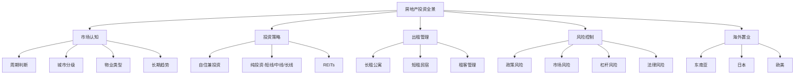
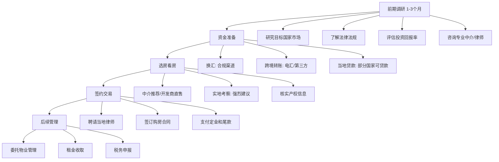

# 第七章：房地产投资

> "房地产是唯一一种你可以住在里面的投资。" —— 无名氏

房地产是中国人最熟悉的投资方式，也是过去20年造富最多的资产类别。然而，随着"房住不炒"政策的深入和市场环境的变化，房地产投资的逻辑已经发生根本性变化。本章将从中国房地产市场和海外房产投资两个维度，为你提供一套完整的房地产投资实战指南——从市场认知、选房方法、贷款策略、出租管理、风险控制到海外置业，道法术器贯通，助你在分化时代做出理性决策。

***

## 7.1 中国房地产市场分析

### 7.1.1 市场周期与政策影响

中国房地产市场是典型的"政策市"，政策对市场的影响远大于市场自身的供需关系。理解政策周期，是房地产投资的第一课。

**房地产周期的四个阶段**：

| 阶段 | 政策信号 | 市场表现 | 投资时机 | 核心动作 |
|------|----------|----------|----------|----------|
| **复苏期** | 降息、降准、放松限购限贷 | 成交量先于价格回暖，开发商拿地积极性提高 | ★★★★★ | 大胆买入，锁定核心资产 |
| **繁荣期** | 政策开始观察，偶尔吹风 | 量价齐升，地王频出，市场情绪高涨 | ★★★ | 持有为主，逐步止盈非核心资产 |
| **衰退期** | 加息、限购收紧、限贷升级 | 成交量先于价格下跌，市场观望情绪浓厚 | ★ | 停止买入，优化资产结构 |
| **萧条期** | 政策底出现但市场仍在下行 | 量价齐跌，开发商降价促销，悲观情绪蔓延 | ★★★★ | 逆向布局，但需精选标的 |

**关键政策指标及解读方法**：

| 政策类别 | 具体指标 | 放松信号 | 收紧信号 |
|----------|----------|----------|----------|
| 货币政策 | LPR利率 | 连续下调 | 连续上调 |
| 货币政策 | 存款准备金率 | 下调（释放流动性） | 上调（收紧流动性） |
| 限购政策 | 限购套数 | 放宽或取消 | 加严或新增 |
| 限购政策 | 社保/纳税要求 | 降低年限 | 提高年限 |
| 限贷政策 | 首付比例 | 下调（如30%→20%） | 上调（如30%→40%） |
| 限贷政策 | 贷款利率 | 低于LPR（打折） | 高于LPR（上浮） |
| 土地政策 | 土地供应 | 增加供应，降低地价 | 减少供应，地价上涨 |
| 财税政策 | 契税/增值税 | 减免优惠 | 恢复或提高税率 |
| 财税政策 | 房产税 | 暂缓或缩小范围 | 扩大试点或全国推行 |

**政策信号传导链条**：

**实战要点**：
- 政策底是最佳买入窗口，此时价格仍在底部但预期开始改善
- 不要等"最低点"——没有人能精确抄底，在政策底附近买入已是上策
- 关注央行货币政策报告、住建部工作会议、地方政府调控文件
- 关注贝壳研究院、克而瑞等机构的月度市场报告，它们对政策拐点的判断往往领先市场

### 7.1.2 城市分级与投资逻辑

不同城市的房地产投资逻辑截然不同。城市分级不是简单的"一线/二线/三线"，而要综合考虑人口流向、产业基础、土地供应、政策环境四大维度。

**一线城市（北京、上海、广州、深圳）**：

| 维度 | 详情 |
|------|------|
| 人口 | 持续流入，2023年北京常住人口2185万、上海2487万、深圳1766万 |
| 产业 | 金融、科技、高端制造等高附加值产业聚集 |
| 房价 | 核心区8-15万/平，远郊3-6万/平 |
| 租金回报率 | 1%-2%（国内最低，但增值潜力最大） |
| 限购 | 严格，需5年社保/纳税，首套首付30%-35% |
| 投资逻辑 | 核心地段优质房产长期持有，享受城市发展红利 |

**投资建议**：
- 优先选择地铁站500米以内、学区稳定、物业管理好的次新房
- 关注城市更新和旧改机会——深圳城市更新项目往往带来20%-50%的增值空间
- 一线城市"上车盘"（总价300-500万的小户型）流动性最好，变现最容易
- 避开"远郊大盘"——通勤时间过长的房产，增值和出租都困难

**强二线城市（杭州、成都、武汉、南京、苏州、长沙等）**：

| 维度 | 详情 |
|------|------|
| 人口 | 人才政策友好，近年人口流入快（杭州年均净流入30万+） |
| 产业 | 新兴产业聚集（互联网、光电、汽车等） |
| 房价 | 核心区2-5万/平，远郊1-2万/平 |
| 租金回报率 | 2%-3% |
| 限购 | 相对宽松，部分区域已取消限购 |
| 投资逻辑 | 选择产业聚集区和核心地段，享受城市崛起红利 |

**投资建议**：
- 选择产业聚集区——杭州未来科技城、成都高新区、武汉光谷等
- 关注城市规划和地铁建设：地铁开通后沿线房产通常有10%-20%的溢价
- 避免过度供应的远郊区域：库存去化周期超过24个月的区域要谨慎
- 关注城市的人口净流入数据——人口是房价的终极支撑

**三四线城市**：

| 维度 | 详情 |
|------|------|
| 人口 | 持续流出，老龄化严重 |
| 产业 | 基础薄弱，依赖传统产业和转移支付 |
| 房价 | 0.5-1.5万/平，部分县城更低 |
| 租金回报率 | 2%-4%（看似不低，但流动性极差） |
| 限购 | 一般不限购 |
| 投资逻辑 | 一般不建议投资，自住可以考虑 |

**风险警示**：
- 三四线城市房价下跌幅度可能远超预期——2021年以来部分三四线城市房价跌幅达30%-50%
- 二手房流动性极差，挂盘半年甚至一年都卖不出去是常态
- "有特色产业支撑"的三四线城市例外：如义乌（小商品）、昆山（台资电子）、佛山（家电陶瓷）

**判断城市投资价值的量化指标**：

| 指标 | 优秀 | 一般 | 危险 |
|------|------|------|------|
| 人口净流入（年均） | >10万 | 0-10万 | <0 |
| 人均GDP增速 | >6% | 3%-6% | <3% |
| 二手房成交量 | 活跃 | 平稳 | 极低 |
| 库存去化周期 | <12个月 | 12-24个月 | >24个月 |
| 土地出让金占财政收入比 | <40% | 40%-60% | >60% |

### 7.1.3 住宅 vs 商业地产

**住宅投资**：

优势：
- 流动性好，二手房市场活跃，容易变现
- 贷款政策友好，首付30%-50%，可贷30年
- 交易税费相对较低（契税1%-3%，满五唯一免个税）
- 适合普通投资者，管理成本低

劣势：
- 租金回报率低（1%-3%）
- 限购限贷政策影响大，部分城市有套数限制
- 持有成本：物业费（2-5元/平米/月）、维修基金

**商业地产（商铺、写字楼、公寓）**：

优势：
- 租金回报率高（3%-6%）
- 不限购不限贷
- 可以经营或出租，用途灵活

劣势：
- 流动性差，变现困难，二手商业地产接盘者少
- 交易税费极高：增值税及附加（差额5.6%）、土地增值税（30%-60%四级累进）、个税（差额20%），综合税费可达交易额的15%-30%
- 首付比例高（50%以上），贷款年限短（10年以内）
- 空置风险大——商铺依赖人流，写字楼依赖经济景气度
- 水电物业费按商业标准收取，持有成本高

**商业地产投资的"陷阱"**：

| 陷阱 | 表现 | 真相 |
|------|------|------|
| 售后返租 | "包租10年，年回报8%" | 开发商可能跑路，租金远低于承诺 |
| 带租约出售 | "现有租户，即买即收租" | 租约可能是关联方签署的虚假租约 |
| 产权式商铺 | "10万买一个铺位" | 分割产权的商铺往往无法独立经营 |
| 返本销售 | "X年后原价回购" | 开发商资金链断裂时无法兑现 |

**投资建议**：
- 普通投资者优先选择住宅
- 商业地产需要专业判断：位置、人流、业态、物业管理缺一不可
- 谨慎购买"售后返租"项目——这是商业地产最常见的坑
- 如果要投资商铺，选社区底商（服务居民日常需求）比选商场内铺更安全

### 7.1.4 长期趋势判断

**支撑房价上涨的因素**：
- 城镇化率仍有提升空间（2024年约66%，发达国家80%+）
- 人口向大城市聚集的趋势未变（大城市虹吸效应）
- 核心城市土地资源稀缺——北京五环内、上海外环内几乎无新增土地
- 通货膨胀推动资产价格长期上涨

**抑制房价上涨的因素**：
- 人口老龄化和出生率下降（2023年出生人口902万，较2016年减少近一半）
- "房住不炒"政策长期化——中央反复强调，短期不会改变
- 房产税预期——全面推行只是时间问题，将增加持有成本
- 经济增速放缓——GDP增速从10%+降至5%左右
- 居民杠杆率已高——2023年居民部门杠杆率约63%，加杠杆空间有限

**未来趋势判断**：

| 城市类型 | 趋势 | 逻辑 |
|----------|------|------|
| 一线城市核心地段 | 长期看涨 | 供给稀缺+需求旺盛，稀缺资产长期增值 |
| 一线非核心/远郊 | 分化 | 部分有产业支撑的区域涨，纯睡城跌 |
| 强二线核心区 | 稳中有升 | 城市崛起+人口流入，但涨幅有限 |
| 强二线远郊 | 承压 | 供应过剩，去化困难 |
| 三四线城市 | 整体下行 | 人口流出+需求萎缩，仅个别有特色产业的例外 |
| 整体市场 | 从普涨到分化 | 闭眼买房赚钱的时代已经结束 |

**核心结论**：房地产投资已经从"买什么都涨"的贝塔时代，进入"只有选对才有收益"的阿尔法时代。城市选择、地段选择、产品选择的精度要求大幅提高。

***

## 7.2 房产投资策略

### 7.2.1 自住兼投资

对于大多数家庭来说，买房既是解决居住需求，也是一生中最大的一笔投资。自住兼投资的选房逻辑，需要在居住舒适度和资产增值潜力之间找到平衡。

**选房标准：地段、配套、产品**

**地段选择原则**：

1. **核心地段**：城市中心、CBD、金融区——保值能力最强，但价格也最高
2. **交通枢纽**：地铁站（500米内最佳）、高铁站、机场附近——通勤便利是刚需
3. **产业集聚区**：科技园、产业园、商务区——高收入人群聚集，租金和房价都有支撑
4. **城市发展方向**：政府重点规划的新区——享受规划红利，但要确认规划能落地

**地铁房的"黄金距离"**：
- 500米以内：真正地铁房，溢价最高（10%-20%）
- 500-1000米：准地铁房，有一定溢价（5%-10%）
- 1000-1500米：边缘地铁房，溢价有限
- 1500米以上：步行距离过长，不能算地铁房

**配套设施评估**：

| 配套类型 | 理想标准 | 对房价的影响 |
|----------|----------|--------------|
| 交通 | 地铁500米内，多条线路换乘 | 溢价10%-20% |
| 教育 | 优质学区（省/市重点） | 溢价20%-50% |
| 医疗 | 三甲医院3公里内 | 溢价5%-10% |
| 商业 | 大型商场、超市步行可达 | 溢价5%-10% |
| 公园 | 大型公园、绿地 | 溢价5%-15% |

**学区房投资要点**：
- 学区政策可能调整，存在政策风险——"多校划片"正在全国推广
- 名校学区房溢价高，但保值能力强——即使政策调整，优质教育资源周边的需求仍在
- 不要为"学区"支付过高溢价——溢价超过30%的学区房，风险收益比不佳
- 关注"多校划片"政策影响——划片范围越大，学区房的确定性越低
- 学区房适合自住+投资，纯投资需谨慎——政策变化可能导致学区房溢价大幅缩水

**产品选择**：
- 面积：刚需首选70-90平两房/小三房，改善首选100-130平三房/四房
- 户型：南北通透、方正实用、动静分区
- 楼层：中间楼层最佳（总楼层的1/3到2/3），避开底层和顶层
- 梯户比：2梯4户以内为佳，超过2梯6户居住体验差
- 物业：品牌物业管理的小区，二手房溢价5%-10%
- 楼龄：次新房（5-10年）性价比最高，超过20年的老破小流动性下降

**购房时机判断**

**买入时机**：
- 政策放松初期（降息、降准、放松限购）——政策底已现，价格还在底部
- 市场成交量回升，价格尚未大涨——量在价先，成交量放大是回暖信号
- 开发商降价促销，优惠力度大——尾盘、特价房往往是捡漏机会
- 银行贷款利率处于低位——降低购房成本，提高杠杆收益
- 新盘首开——开发商首开定价通常较低，后期涨价

**卖出时机**：
- 政策收紧信号明显——限购升级、利率上调、房贷额度收紧
- 市场量价齐升，情绪过热——"菜场大妈都在讨论买房"是见顶信号
- 周边大量新盘入市——供应增加会分流需求
- 持有收益率达到预期——投资要有纪律，到目标就止盈
- 有更好的投资机会——房产流动性差，提前规划变现时间

**贷款策略与杠杆运用**

**贷款类型对比**：

| 贷款类型 | 利率（2024年参考） | 额度上限 | 贷款年限 | 适用条件 |
|----------|-------------------|----------|----------|----------|
| 公积金贷款 | 3.1% | 120万（各地不同） | 最长30年 | 连续缴存6-12个月 |
| 商业贷款 | 3.5%-4.2% | 无硬性上限 | 最长30年 | 收入流水达标 |
| 组合贷款 | 公积金3.1%+商贷3.5%-4.2% | 两者之和 | 最长30年 | 公积金额度不足时 |

**杠杆运用原则**：
- 首付比例：首套最低20%-30%（各地不同），二套40%-70%
- 贷款年限：尽量选择30年——月供压力小，且通货膨胀会稀释债务
- 月供控制：不超过家庭月收入的50%，理想值是30%-40%
- 提前还款：当贷款利率高于5%时值得考虑；低于4%时，资金用于投资更划算

**杠杆收益深度分析**：

假设购买一套300万的房子：

| 项目 | 数值 |
|------|------|
| 首付30% | 90万 |
| 贷款金额 | 210万 |
| 贷款利率 | 4.0% |
| 贷款年限 | 30年 |
| 月供（等额本息） | 约10,029元 |
| 总利息 | 约151万 |

**情景一：房价每年上涨5%**

| 时间 | 房产价值 | 净资产（市值-剩余贷款） | 首付回报率 |
|------|----------|--------------------------|------------|
| 第1年 | 315万 | 约106万 | 17.8% |
| 第3年 | 347万 | 约140万 | 55.6% |
| 第5年 | 383万 | 约178万 | 97.8% |

**情景二：房价每年下跌3%**

| 时间 | 房产价值 | 净资产（市值-剩余贷款） | 首付回报率 |
|------|----------|--------------------------|------------|
| 第1年 | 291万 | 约82万 | -8.9% |
| 第3年 | 274万 | 约67万 | -25.6% |
| 第5年 | 258万 | 约53万 | -41.1% |

**杠杆是双刃剑**：上涨时放大收益，下跌时放大亏损。关键原则是——月供不能成为压垮你的最后一根稻草。

**月供压力测试**：
- 计算月供时，不仅要考虑当前收入，还要考虑收入下降20%-30%后的承受能力
- 保持6个月以上的月供现金储备
- 双职工家庭比单收入家庭抗风险能力更强

### 7.2.2 纯投资

**短线策略：法拍房**

法拍房是法院强制拍卖的房产，通常因债务纠纷、司法没收等原因进入拍卖程序，价格低于市场价。

**法拍房优势**：
- 价格通常低于市场价10%-30%（一拍起拍价是评估价的70%-80%）
- 部分城市法拍房不限购
- 可以贷款购买（法拍贷）

**法拍房风险与应对**：

| 风险类型 | 具体表现 | 应对方法 |
|----------|----------|----------|
| 租约风险 | 存在长期租约（买卖不破租赁） | 拍前核实是否有租约，查看租赁合同 |
| 占用风险 | 原业主或老人不搬走 | 选择已腾空的房源，或法院承诺腾退 |
| 欠费风险 | 大额物业费、水电费、税费欠缴 | 拍前到物业和税务局查询欠费情况 |
| 产权风险 | 共有权人异议、多次抵押 | 仔细阅读法院公告，核实产权信息 |
| 税费风险 | 税费全部由买方承担 | 提前计算所有税费，纳入竞拍预算 |
| 过户风险 | 被执行人不配合过户 | 法院出具协助执行通知书，可强制过户 |

**法拍房投资流程**：

1. **筛选房源**：淘宝司法拍卖、京东司法拍卖、人民法院诉讼资产网
2. **初步调查**：阅读法院公告、标的物介绍、评估报告
3. **实地考察**：查看房屋现状、小区环境、周边配套
4. **深度尽调**：产权调查（不动产登记中心）、欠费查询（物业/税务局）、租赁核实
5. **缴纳保证金**：通常是起拍价的10%-20%
6. **参与竞拍**：设置心理价位上限，不要被竞价氛围裹挟
7. **缴纳尾款**：竞拍成功后7-15天内付清全款
8. **办理过户**：法院出具裁定书和协助执行通知书

**法拍房收益测算示例**：

| 项目 | 数值 |
|------|------|
| 起拍价（评估价的75%） | 225万 |
| 成交价 | 240万 |
| 市场价 | 300万 |
| 折扣率 | 20% |
| 税费（约5%） | 15万 |
| 实际成本 | 255万 |
| 短期利润空间 | 45万（持有1-2年后卖出） |

**中线策略：持有增值**

持有增值的核心是选择有升值潜力的房产，持有2-5年后卖出。关键在于识别"价值洼地"——当前价格被低估、未来有明确利好催化的区域。

**价值洼地的识别方法**：
- 城市规划利好已公布但尚未兑现（地铁规划、学校落地、商业体开工）
- 周边二手房价格高于本区域（存在补涨空间）
- 开发商拿地价格已接近当前在售价（成本支撑）
- 区域内有大体量旧改/城市更新项目

**持有增值的核心指标**：

| 指标 | 计算方法 | 参考标准 |
|------|----------|----------|
| 租售比 | 年租金/房价 | >2%为合理，<1.5%泡沫较大 |
| 库存去化周期 | 待售面积/月均成交面积 | <12个月为健康 |
| 地房比 | 地价/房价 | >60%说明地价已透支 |
| 人口增速 | 年净流入人口 | >5万/年为强支撑 |

**案例分析**：
- 2019年买入杭州未来科技城某楼盘：2.5万/平
- 2021年价格涨至：4万/平
- 持有2年，收益率60%
- 扣除交易成本（契税、中介费、个税等约8%），净收益率约52%

**注意**：这是上行周期的案例。2021年后高位买入的投资者，可能面临浮亏。中线投资必须设置止损线。

**长线策略：出租收益**

出租收益是房产投资的"睡后收入"。在中国，纯靠租金很难获得高回报，但长期持有+租金收入+增值收益的综合回报仍然可观。

**租金回报率计算**：
- 公式：年租金 / 房产价值 × 100%
- 中国一线城市：1%-2%
- 中国二线城市：2%-3%
- 中国三四线城市：2%-4%
- 海外市场：3%-8%

**真实租金回报率**（扣除所有成本后）：

| 成本项目 | 比例 |
|----------|------|
| 空置期 | 年租金的5%-10%（约1-2个月空置） |
| 物业费 | 2-5元/平米/月 |
| 维修费 | 年租金的5% |
| 管理费（如委托管理） | 年租金的5%-8% |
| 房产税（未来可能） | 评估值的0.5%-1.2% |

**提高租金收益的方法**：

1. **精装修**：投入3-5万装修，提升租金20%-30%，6-12个月回本
2. **分割出租**：将大房子分割成多个独立房间——适合大学城、产业园周边
3. **民宿运营**：短租收益高于长租20%-50%，但管理成本也更高（详见7.3.2）
4. **选择高租住比区域**：靠近CBD、大学、医院的房产，出租率高且稳定
5. **提供增值服务**：配备齐全的家电家具、提供保洁服务、允许养宠物——差异化定价

### 7.2.3 REITs投资

REITs（房地产投资信托基金）是投资房地产的另一种方式——无需直接购买房产，通过购买基金份额即可获得房地产的租金收益和资本增值。REITs的本质是把不动产"证券化"，让普通投资者也能参与大宗房地产投资。

**中国公募REITs**

中国公募REITs于2021年6月正式上市，目前主要投资于基础设施项目（产业园区、仓储物流、高速公路、保障性住房等），尚未覆盖传统住宅和商业地产。

**已上市REITs分类**：

| 类型 | 代表产品 | 底层资产 | 分红收益率（参考） |
|------|----------|----------|-------------------|
| 产业园区 | 博时蛇口产园REIT | 深圳蛇口产业园区 | 4%-5% |
| 仓储物流 | 中金普洛斯REIT | 物流仓储中心 | 4%-6% |
| 高速公路 | 浙商沪杭甬REIT | 杭甬高速收费权 | 5%-7% |
| 保障性住房 | 华夏北京保障房REIT | 北京公租房项目 | 3%-5% |
| 清洁能源 | 鹏华深圳能源REIT | 天然气发电项目 | 4%-6% |

**公募REITs特点**：
- 门槛低：1000元起投，远低于直接购房
- 流动性好：可以在交易所买卖（但部分产品流动性仍然较差）
- 强制分红：每年至少分配可供分配金额的90%
- 收益稳定：分红收益率约4%-8%
- 与股市相关性低：适合做资产配置的分散化工具

**公募REITs投资要点**：
- 关注底层资产质量：运营稳定的成熟资产优于新建项目
- 关注分红率和分红稳定性：连续稳定分红的产品更可靠
- 关注折溢价率：溢价过高时不宜追买
- 关注扩募机会：优质REITs可能通过扩募收购新资产

**海外REITs投资**

海外REITs市场更加成熟，产品更加丰富，覆盖住宅、商业地产、数据中心、医疗、酒店等各类资产。

**美国REITs精选**：

| 代码 | 名称 | 资产类型 | 分红频率 | 特点 |
|------|------|----------|----------|------|
| VNQ | Vanguard房地产ETF | 综合REITs | 季度 | 一篮子配置，分散风险 |
| O | Realty Income | 商业零售 | 月度 | "月度分红公司"，连续100+次加息 |
| AMT | American Tower | 通信塔 | 季度 | 5G时代核心基础设施 |
| PLD | Prologis | 物流仓储 | 季度 | 全球最大物流地产商 |
| EQIX | Equinix | 数据中心 | 季度 | AI时代算力基础设施 |

**投资渠道**：
- 港股通：部分港股REITs可通过A股账户购买
- 美股券商：富途、老虎、盈透等——可购买美国REITs
- QDII基金：部分基金投资海外REITs——适合不想开海外账户的投资者

**REITs收益与风险分析**：

**收益来源**：
1. 分红收益：4%-8%/年——这是REITs最核心的收益来源
2. 资本增值：随市场波动——长期看，优质REITs的资本增值与通胀同步

**风险因素**：

| 风险类型 | 影响机制 | 应对方法 |
|----------|----------|----------|
| 利率风险 | 利率上升→REITs融资成本增加→价格下跌 | 利率上行周期减配，下行周期加配 |
| 市场风险 | 经济衰退→租金下降→分红减少 | 分散投资不同类型的REITs |
| 流动性风险 | 部分REITs交易量小→难以及时卖出 | 选择规模大、交易活跃的产品 |
| 管理风险 | 管理层决策失误→资产价值下降 | 选择管理团队优秀、历史业绩好的产品 |
| 汇率风险 | 海外REITs受汇率波动影响 | 长期持有忽略短期波动，或做汇率对冲 |

***

## 7.3 房产出租管理

### 7.3.1 长租公寓模式

长租公寓是将房产长期出租给租客，获取稳定租金收入。这是最传统的房产投资收益方式，管理成本低，收入可预期。

**长租公寓类型**：

| 类型 | 模式 | 优点 | 缺点 |
|------|------|------|------|
| 整租 | 整套出租给一个租客/家庭 | 管理简单，租客稳定 | 租金相对较低 |
| 合租 | 将房间分别出租给不同租客 | 总租金更高 | 管理复杂，租客纠纷多 |
| 品牌公寓 | 委托给长租公寓品牌管理 | 省心省力 | 品牌方抽成高（10%-15%），且存在暴雷风险 |

**品牌公寓的暴雷风险**：蛋壳公寓、青客公寓等品牌先后暴雷，教训深刻。如果委托品牌公寓管理，要选择资金实力强、运营历史长的品牌，避免"高收低租"模式的品牌。

**长租公寓运营全流程**：

1. **房源准备**：
   - 基础装修：刷墙、换锁、检修水电
   - 家具配置：床、衣柜、书桌、椅子
   - 家电配置：空调、洗衣机、冰箱、热水器、油烟机
   - 软装配置：窗帘、灯具、床品
   - 预算参考：简单配置2-3万，精装修5-8万

2. **定价策略**：
   - 参考同小区同户型挂牌价
   - 装修好、配置全的可溢价10%-20%
   - 首次定价略低于市场价，快速出租后逐步提价

3. **租客筛选**：
   - 查验身份证件
   - 了解工作单位和收入情况
   - 通过信用平台查询信用记录
   - 与前房东沟通了解租客历史

4. **合同签订**：
   - 使用住建部门推荐的示范合同
   - 明确租金、押金、付款方式、租期
   - 明确维修责任划分
   - 约定提前退租的违约金条款
   - 附房屋物品清单和照片

5. **日常管理**：
   - 每月按时收租（建议银行转账，保留凭证）
   - 维修问题及时响应（24小时内）
   - 每季度检查房屋状况
   - 提前1个月沟通续租意向

**收益计算示例**：

| 项目 | 金额 |
|------|------|
| 房产价值 | 200万 |
| 月租金 | 5000元 |
| 年租金 | 60,000元 |
| 减：空置期（1个月） | -5,000元 |
| 减：物业费（3元/平×100平×12月） | -3,600元 |
| 减：维修费（年租金5%） | -3,000元 |
| 减：家具家电折旧 | -2,000元 |
| **净租金收入** | **46,400元** |
| **净租金回报率** | **2.32%** |

### 7.3.2 短租民宿模式

短租民宿是将房产按日出租给旅客，收益通常高于长租，但管理成本和精力投入也更大。

**短租民宿平台对比**：

| 平台 | 特点 | 佣金 | 适合场景 |
|------|------|------|----------|
| Airbnb（爱彼迎） | 全球最大，境外游客多 | 3%（房东端） | 旅游城市、国际化区域 |
| 途家 | 国内最大民宿平台 | 10%-15% | 全国覆盖，流量大 |
| 小猪民宿 | 国内民宿平台 | 10%-15% | 二三线城市 |
| 美团民宿 | 依托美团流量 | 10%-15% | 价格敏感型用户 |
| 携程民宿 | 依托携程流量 | 10%-15% | 商旅用户 |

**短租民宿运营要点**：

1. **选址**：靠近旅游景点（3公里内）、商业中心、交通枢纽——位置决定80%的入住率
2. **装修**：有特色、有风格、拍照好看——平台展示的第一印象决定点击率
3. **定价**：根据淡旺季动态调整——旺季（节假日、暑期）可涨价30%-100%
4. **服务**：提供良好入住体验——快速回复、自助入住、周边推荐
5. **卫生**：保持高标准清洁——这是差评的最大来源
6. **营销**：优化平台展示，获取好评——好评率>4.8分的房源获得平台流量倾斜
7. **合规**：了解当地对民宿的政策法规——部分城市限制民宿经营

**收益计算示例**：

| 项目 | 金额 |
|------|------|
| 日均房价 | 300元 |
| 月入住率 | 70%（21天） |
| 月毛收入 | 6,300元 |
| 减：平台佣金（15%） | -945元 |
| 减：清洁布草成本（100元/次×21次） | -2,100元 |
| 减：水电物业 | -500元 |
| 减：消耗品（洗漱用品等） | -300元 |
| 减：维修损耗 | -200元 |
| **月净收入** | **2,255元** |

相比长租月租金5000元，短租在70%入住率下反而更低。**短租民宿的核心优势在于**：
- 灵活性高，自己需要时可以使用
- 旺季入住率90%+时，收益可翻倍
- 可以随时调整策略——不行就切回长租
- 适合旅游城市（三亚、大理、厦门等）——这些城市短租收益远超长租

**短租 vs 长租决策矩阵**：

| 因素 | 选长租 | 选短租 |
|------|--------|--------|
| 房产位置 | 普通居民区 | 旅游区、商圈、交通枢纽 |
| 业主精力 | 有限（上班族） | 充裕（自由职业或有团队） |
| 所在城市 | 非旅游城市 | 旅游热门城市 |
| 政策环境 | 民宿限制严格 | 民宿政策友好 |
| 预期入住率 | <60% | >70% |

### 7.3.3 租金定价策略

**定价参考因素**：
- 周边同类房源租金（最重要）——在贝壳、链家等平台搜索同小区在租房源
- 房屋装修和配置——精装比简装溢价10%-20%
- 楼层和朝向——中间楼层、南向溢价5%-10%
- 交通便利程度——地铁房溢价10%-15%
- 淡旺季因素——毕业季（6-8月）租金上涨，春节后（2-3月）租金较低
- 租期长短——长租（1年以上）通常比短租便宜10%-20%

**定价技巧**：
1. **锚定定价**：先挂高于市场价5%-10%的价格，给租客还价空间
2. **阶梯定价**：租期越长越优惠——年付比月付优惠5%-10%
3. **季节调整**：旺季涨价，淡季降价——灵活调整挂牌价
4. **增值服务**：提供保洁、维修等增值服务——可以适当提高租金
5. **快速出租**：如果空置超过2周，果断降价5%-10%——空置成本远高于降价损失

### 7.3.4 租客筛选与管理

**租客筛选标准**：

| 评估维度 | 合格标准 | 红旗信号 |
|----------|----------|----------|
| 工作 | 有稳定工作和收入 | 无固定职业、收入来源不明 |
| 收入 | 月收入≥月租金3倍 | 收入勉强覆盖租金 |
| 信用 | 无逾期记录 | 多头借贷、逾期频繁 |
| 身份 | 身份证真实有效 | 拒绝提供身份信息 |
| 生活习惯 | 无不良嗜好 | 明显有养多只宠物、聚会频繁等倾向 |

**租客管理要点**：
1. **签订正规合同**：明确双方权利义务——使用住建部门示范合同
2. **收取押金**：通常为1-2个月租金——合同到期后无损退还
3. **定期检查**：每季度检查房屋状况——提前通知租客，尊重隐私
4. **及时沟通**：处理租客问题和需求——响应速度快，租客满意度高，续租率高
5. **续租管理**：提前1-2个月沟通续租意向——提前续约可以避免空置期
6. **纠纷处理**：协商优先，必要时走法律途径——不要私下"教训"租客

**常见租客纠纷及处理**：

| 纠纷类型 | 预防措施 | 处理方法 |
|----------|----------|----------|
| 拖欠租金 | 合同约定逾期违约金 | 催告→协商→解除合同 |
| 房屋损坏 | 入住时拍照存档 | 从押金扣除修复费用 |
| 提前退租 | 合同约定违约金（通常1个月租金） | 按合同执行 |
| 噪音扰民 | 合同约定安静时间 | 协商→警告→解除合同 |
| 转租/群租 | 合同明确禁止 | 发现后立即制止并解除合同 |

***

## 7.4 房产估值方法

投资房产之前，必须学会估值。不懂估值的投资者，要么错过好机会，要么高位接盘。

### 7.4.1 比较法（市场法）

最常用的估值方法——参考周边同类房产的成交价格来评估目标房产的价值。

**操作步骤**：
1. 在贝壳、链家等平台搜索同小区近6个月的成交记录
2. 筛选与目标房产面积、户型、楼层相近的3-5套
3. 计算成交均价（元/平）
4. 根据目标房产的优劣进行修正

**修正系数**：

| 因素 | 修正幅度 |
|------|----------|
| 楼层（中间层 vs 顶层/底层） | ±3%-5% |
| 朝向（南向 vs 北向） | ±3%-5% |
| 装修（精装 vs 简装） | ±5%-10% |
| 楼龄（次新 vs 老旧） | ±5%-10% |
| 位置（临街 vs 小区内） | ±3%-5% |
| 学区（有 vs 无） | ±10%-30% |

**示例**：
- 同小区近期成交均价：3万/平
- 目标房产是中间楼层南向精装（修正+10%）
- 估值：3万 × 1.1 = 3.3万/平
- 面积100平，总估值330万

### 7.4.2 收益法（租金还原法）

用未来租金收益的现值来评估房产价值，适合投资型房产。

**公式**：房产价值 = 年净租金 / 资本化率

**资本化率参考**：
- 一线城市核心地段：2%-3%
- 二线城市核心地段：3%-4%
- 三四线城市：4%-6%
- 商业地产：5%-8%

**示例**：
- 目标房产月租金5000元，年净租金5万
- 资本化率按3%计算
- 估值：5万 / 3% = 167万
- 如果实际售价200万，说明当前价格偏高

### 7.4.3 成本法

用重新建造同等房产的成本来评估价值，适合特殊用途房产或新建房产。

**公式**：房产价值 = 土地成本 + 建安成本 + 税费 + 利润 - 折旧

**参考数据**：
- 土地成本：占总成本的30%-60%（城市差异大）
- 建安成本：3000-6000元/平（取决于建筑标准）
- 税费及利润：占总成本的15%-25%
- 折旧：每年2%-3%（住宅）

### 7.4.4 综合估值决策

**估值方法选择指南**：

| 场景 | 推荐方法 | 原因 |
|------|----------|------|
| 购买自住房 | 比较法 | 市场价格最直观 |
| 购买投资房 | 比较法+收益法 | 既看价格是否合理，也看租金能否覆盖成本 |
| 购买商铺 | 收益法为主 | 商铺价值取决于租金收益 |
| 旧房翻新决策 | 成本法 | 判断翻新投入是否值得 |

***

## 7.5 房地产投资风险

### 7.5.1 政策风险

**限购政策**：
- 限制购房套数：一线户籍限购2套，非户籍限购1套
- 要求社保或纳税年限：北京5年、上海5年、深圳5年、广州3年
- 可能导致无法买入或卖出——政策随时可能调整

**限贷政策**：
- 提高首付比例：二套首付从50%提到70%
- 提高贷款利率：从基准利率打折到上浮20%
- "三道红线"限制开发商融资——导致部分开发商暴雷，购房者面临烂尾风险

**房产税**：
- 目前仅在上海和重庆试点，征收范围有限
- 全国推广的预期长期存在——这将从根本上改变房产投资的成本结构
- 预计税率：首套免征或低税率，多套累进税率，年税率0.5%-1.2%
- 影响测算：一套500万的房产，按1%税率，每年需缴纳5万房产税

**应对策略**：
- 关注政策动向，提前布局——政策往往有提前吹风期
- 不要过度依赖杠杆——留足安全边际
- 保持足够的现金流——应对政策突变
- 优化资产结构——持有核心资产，抛售边缘资产

### 7.5.2 市场风险

**价格下跌**：
- 房价可能长期横盘或下跌——日本从1991年到2020年，房价下跌了近30年
- 三四线城市风险更大——人口流出+需求萎缩，价格可能持续下跌
- "有价无市"——挂牌价没降，但实际成交价已大幅下降

**流动性风险**：
- 房产交易周期长：从挂牌到成交平均3-6个月
- 市场低迷时可能无人接盘——二手房挂牌量激增，成交周期拉长到6-12个月
- 急需资金时可能被迫降价10%-20%才能快速成交

**应对策略**：
- 选择流动性好的城市和地段——一线城市核心区永远不缺接盘者
- 不要把所有资金投入房产——保持资产多元配置
- 保持足够的现金储备——至少覆盖6个月生活开支+月供
- 房产投资要用"闲钱"——不要把应急资金投入房产

### 7.5.3 杠杆风险

**断供风险**：
- 收入下降或失业——经济下行期最致命的风险
- 月供压力过大——月供占收入70%以上就很危险
- 房价下跌导致资不抵债——房子市值低于剩余贷款

**断供后果**：
- 银行收回房产拍卖——拍卖价通常低于市场价20%-30%
- 个人征信受损——5年内无法贷款、信用卡受限
- 可能仍需偿还差额——拍卖所得不足以偿还贷款的部分，银行有权继续追偿
- 被列入失信被执行人——限制高消费、出行

**2021-2024年断供潮的教训**：
- 断供案例主要集中在：三四线城市、高位接盘、开发商暴雷导致烂尾
- 核心教训：不要超出自己的承受能力加杠杆

**应对策略**：
- 月供不超过收入的40%（保守）到50%（激进）
- 保持6个月以上的月供现金储备
- 双收入家庭更安全
- 收入不稳定的人（自由职业、创业者）降低杠杆比例
- 购买房贷保险（部分银行提供）——失业或重疾时保险公司代偿月供

### 7.5.4 法律风险

**产权纠纷**：
- 共有权人不同意出售——夫妻共有房产需双方同意
- 继承纠纷——原业主去世后多人继承
- 抵押权问题——房产被多次抵押，解押困难
- 小产权房——没有合法产权证，法律不保护

**合同风险**：
- 合同条款不明确——如交房标准、违约责任
- 违约责任不清晰——开发商违约成本低
- 阴阳合同——做低合同价避税，但产生法律和贷款风险
- "补充协议"陷阱——补充协议可能推翻主合同的关键条款

**烂尾楼风险**：
- 开发商资金链断裂导致项目停工
- 购房者已付首付并开始还贷，但拿不到房
- 维权周期长、难度大

**应对策略**：
- 购买前做好产权调查——到不动产登记中心查询
- 签订正规合同——使用住建部门推荐的示范合同
- 必要时请律师审核——尤其是大额交易
- 购买新房时选择资金实力强的开发商——查看开发商的"三道红线"指标
- 优先选择现房或准现房——降低烂尾风险

### 7.5.5 税务风险

**交易环节税费**：

| 税费项目 | 买方承担 | 卖方承担 | 说明 |
|----------|----------|----------|------|
| 契税 | 1%-3% | - | 首套90平以下1%，90平以上1.5%；二套3% |
| 增值税及附加 | - | 5.6% | 满2年免征（普通住宅） |
| 个人所得税 | - | 1%或差额20% | 满五唯一免征 |
| 中介费 | 1%-3% | 1%-3% | 各地标准不同 |
| 评估费 | 0.1%-0.5% | - | 贷款时需要 |

**税费优化合法途径**：
- "满五唯一"免个税——这是最大的税费优惠
- 首套房契税优惠——90平以下仅1%
- 合理利用赠与和继承——直系亲属间赠与免征个税（但受赠人再出售时需缴税）
- 不要做"阴阳合同"——风险远大于省下的税

***

## 7.6 海外房产投资

### 7.6.1 热门投资目的地

**东南亚**：

| 国家 | 城市 | 房价（万/平） | 租金回报率 | 优势 | 风险 |
|------|------|--------------|------------|------|------|
| 泰国 | 曼谷 | 2-4 | 5%-8% | 旅游业发达、养老需求、政策友好 | 外国人不能持有土地，只能买公寓（49%份额） |
| 越南 | 胡志明市 | 2-3 | 5%-7% | 经济增速快、人口红利、产业转移 | 政策不确定性、产权保护不足、外国人仅能买公寓 |
| 马来西亚 | 吉隆坡 | 1.5-3 | 4%-6% | 第二家园计划、华人比例高、英语通用 | 供应过剩、流动性差、部分区域高空置率 |
| 柬埔寨 | 金边 | 1.5-2.5 | 6%-10% | 美元计价、经济增长快 | 法律不完善、市场不成熟、政治风险 |

**日本**：

| 城市 | 房价（万/平） | 租金回报率 | 优势 | 风险 |
|------|--------------|------------|------|------|
| 东京 | 5-10 | 3%-5% | 市场成熟、法律完善、日元贬值降低购买成本 | 人口老龄化、地震风险、管理成本高 |
| 大阪 | 3-5 | 4%-6% | 旅游业发达、赌场建设、2025世博会 | 经济依赖旅游业、短期热度可能消退 |

**日本房产投资的独特优势**：
- 日元处于历史低位——人民币购买力大幅提升
- 贷款利率极低——日本房贷利率仅0.3%-1.0%
- 永久产权——购买后永久持有，无年限限制
- 法律体系完善——产权保护到位，交易透明
- 二手房市场成熟——流动性好

**欧美**：

| 国家 | 城市 | 房价（万/平） | 租金回报率 | 优势 | 风险 |
|------|------|--------------|------------|------|------|
| 美国 | 纽约/洛杉矶 | 10-30 | 3%-6% | 市场成熟、法律完善、美元资产 | 税收复杂、管理成本高、FIRPTA预扣税 |
| 英国 | 伦敦 | 10-20 | 3%-5% | 教育资源、金融中心 | 脱欧影响、税收较高、印花税高 |
| 澳大利亚 | 悉尼/墨尔本 | 6-15 | 3%-5% | 教育资源、移民需求 | 外国人购房限制多、FIRB审批 |

### 7.6.2 投资流程与注意事项

**海外房产投资完整流程**：

**资金出境方式**：
- 个人年度购汇额度：每人每年5万美元
- 合法途径：购汇后电汇至境外账户
- 注意：地下钱庄、蚂蚁搬家等方式违法，切勿尝试
- 部分国家接受境外银行贷款（如日本的外资银行）

**产权类型**：

| 类型 | 说明 | 代表国家 |
|------|------|----------|
| 永久产权（Freehold） | 永久持有，无年限限制 | 日本、英国（部分）、马来西亚（部分） |
| 租赁产权（Leasehold） | 持有99年或更短期限 | 泰国（公寓30+30+30年）、英国（部分） |
| 分层产权（Strata） | 公寓式产权，持有单位但共享公共区域 | 新加坡、澳大利亚 |

**交易成本参考**：

| 国家 | 印花税/过户税 | 律师费 | 中介费 | 其他费用 |
|------|--------------|--------|--------|----------|
| 泰国 | 2% | 1% | 3% | 维修基金 |
| 日本 | 3%-4% | 1% | 3%+消费税 | 登记税、火灾保险 |
| 美国 | 州税0.5%-2% | $1000-3000 | 5%-6%（卖方付） | 产权保险、过户费 |
| 英国 | 0%-12%（累进） | £1000-3000 | 1%-2% | 调查费、注册费 |

### 7.6.3 汇率风险与税务问题

**汇率风险**：

房产价值以当地货币计价，汇率波动直接影响实际收益。例如：
- 2020年以15日元/人民币买入日本房产
- 2024年日元贬值至20日元/人民币
- 即使日本房价没变，换算成人民币也亏损了25%

**汇率风险管理方法**：
- 选择强势或稳定货币国家——美元、新加坡元
- 分散投资不同国家——降低单一货币风险
- 长期持有，忽略短期波动——汇率长期趋向购买力平价
- 利用自然对冲——如果在当地有收入（如子女留学费用），用租金收入直接支付

**各国税务对比**：

| 税种 | 泰国 | 日本 | 美国 | 英国 |
|------|------|------|------|------|
| 购买税 | 过户费2%+印花税0.5% | 不动产取得税3%-4%+登录税2% | 州税0.5%-2% | 印花税0%-12% |
| 持有税 | 无（公寓仅有物业费） | 固定资产税1.4% | 房产税1%-3%/年 | 市政税（租客付） |
| 租金税 | 预扣税15% | 综合所得税（累进） | 联邦+州所得税 | 所得税（累进） |
| 增值税 | 特别营业税3.3%（5年内） | 所得税20% | 联邦0%-20%+州税 | CGT18%-28% |
| 遗产税 | 无 | 10%-55% | 18%-40% | 40%（超免税额） |

### 7.6.4 案例：泰国房产投资实操

**背景**：
- 投资者：张先生，35岁，互联网公司中层，年收入50万
- 预算：100万人民币
- 目标：获取稳定租金收入，分散资产配置，对冲人民币贬值风险

**投资过程**：

1. **前期调研**（2个月）：
   - 研究泰国房产市场——曼谷公寓市场报告
   - 了解外国人购房政策——只能买公寓项目中外国人49%份额
   - 咨询3家专业中介——对比服务和房源

2. **实地考察**（1周）：
   - 考察曼谷素坤逸、素坤逸77、拉玛9等核心区域
   - 对比5个开发商的不同项目
   - 走访周边同类公寓，了解实际租金水平

3. **选定项目**：
   - 位置：曼谷素坤逸区，BTS站步行8分钟
   - 面积：35平米一居室
   - 总价：约80万人民币（约400万泰铢）
   - 开发商：Sansiri（泰国上市开发商）
   - 交房时间：2024年

4. **签约付款**：
   - 定金：5万泰铢（约1万人民币）
   - 首付：30%（约24万人民币），分3期支付
   - 尾款：交房时支付70%（约56万人民币）
   - 聘请泰国律师审核合同：费用约1.5万泰铢

5. **出租运营**：
   - 委托当地物业管理公司（佣金8%）
   - 月租金：15,000泰铢（约3,000人民币）
   - 租客类型：当地白领和外派人员

**投资收益分析**：

| 项目 | 金额（人民币） |
|------|----------------|
| 总投入 | 80万 |
| 月租金收入 | 3,000元 |
| 年租金收入 | 36,000元 |
| 减：物业管理费 | -2,400元 |
| 减：维修基金 | -1,200元 |
| 减：委托管理费（8%） | -2,880元 |
| **年净租金收入** | **29,520元** |
| **净租金回报率** | **3.7%** |
| 潜在增值 | 曼谷核心区年均上涨3%-5% |
| **综合年化收益** | **6.7%-8.7%** |

**风险提示**：
- 泰铢对人民币汇率波动
- 泰国政策变化（外国人购房政策可能收紧）
- 物业管理质量参差不齐
- 远程管理的成本和不便

***

## 7.7 房产交易实操指南

### 7.7.1 二手房购买流程

**完整流程（以北京为例）**：

| 步骤 | 时间 | 关键事项 |
|------|------|----------|
| 1. 购房资格审核 | 3-5个工作日 | 确认社保/纳税是否满足限购要求 |
| 2. 选房看房 | 1-3个月 | 至少看20-30套房，建立价格感觉 |
| 3. 签订合同 | 1天 | 核实产权、确定价格、约定付款方式 |
| 4. 资质审核 | 5-10个工作日 | 向住建委提交购房资格审核 |
| 5. 网签 | 1天 | 在住建委系统备案 |
| 6. 贷款申请 | 1-2个月 | 提交收入证明、征信报告等材料 |
| 7. 缴税过户 | 1天 | 缴纳契税、办理产权过户 |
| 8. 领取新房产证 | 5-10个工作日 | 新证到手 |
| 9. 物业交割 | 1天 | 水电气暖过户、钥匙交接 |
| 10. 入住/出租 | - | 完成投资 |

**看房清单（每套房必查）**：

| 检查项目 | 检查内容 | 红旗信号 |
|----------|----------|----------|
| 产权 | 产权证是否齐全、是否有抵押/查封 | 产权不清晰 |
| 户型 | 是否方正、南北通透 | 异形户型、暗卫 |
| 采光 | 各房间自然光情况 | 低楼层采光差 |
| 噪音 | 是否临街、是否有施工 | 临主干道 |
| 漏水 | 天花板、墙面是否有水渍 | 有明显水渍 |
| 管道 | 水压、排水是否正常 | 下水道反味 |
| 电梯 | 电梯品牌、使用年限 | 老旧电梯 |
| 物业 | 小区卫生、安保、绿化 | 物业管理混乱 |
| 停车 | 车位是否充足 | 无地下车库 |
| 周边 | 学校、医院、商场、地铁 | 配套不齐全 |

### 7.7.2 新房购买流程与注意事项

**新房 vs 二手房对比**：

| 维度 | 新房 | 二手房 |
|------|------|--------|
| 价格 | 通常较高 | 可淘到性价比高的 |
| 税费 | 较低（主要是契税） | 较高（增值税、个税等） |
| 风险 | 烂尾风险、质量问题 | 产权风险、隐藏缺陷 |
| 等待 | 期房需等1-3年 | 现房即买即住 |
| 配套 | 周边可能不成熟 | 配套已成熟 |
| 贷款 | 可用公积金 | 部分老房子不能用公积金 |

**购买新房的额外注意事项**：
- 查看开发商资质和过往项目——是否有延期交房、质量问题的记录
- 查看"五证"——国有土地使用证、建设用地规划许可证、建设工程规划许可证、建筑工程施工许可证、商品房预售许可证
- 优先选择现房或准现房——降低烂尾风险
- 仔细阅读购房合同——特别注意交房标准、违约责任、面积差异处理
- 不要轻信沙盘和样板间——实际交付可能与展示差距很大

### 7.7.3 贷款申请技巧

**提高贷款通过率的方法**：
- 提前6个月养好征信——不逾期、不频繁申请信用卡
- 提前6个月养好流水——每月有稳定进账，余额充足
- 负债率控制在50%以下——信用卡分期、消费贷都会影响负债率
- 提供额外资产证明——存款、理财、其他房产

**贷款被拒的常见原因**：

| 原因 | 解决方法 |
|------|----------|
| 征信逾期 | 等待逾期记录消除（5年），或开具非恶意逾期证明 |
| 流水不足 | 提供共同借款人，或补充其他收入证明 |
| 负债过高 | 提前还清消费贷和信用卡分期 |
| 年龄限制 | 贷款人年龄+贷款年限不超过70年 |
| 房龄限制 | 部分银行不接受20年以上房龄的房产 |

**提前还款决策**：
- 等额本息还款：前期利息占比高，前10年内提前还款节省最多
- 等额本金还款：每月递减，提前还款节省效果不如等额本息
- 判断标准：贷款利率 > 你能获得的投资收益率 → 提前还款划算
- 注意：部分银行收取提前还款违约金（通常为还款金额的1%-3%）

***

## 7.8 推荐资源

**书籍推荐**：

| 书名 | 作者 | 适合人群 | 核心价值 |
|------|------|----------|----------|
| 《房地产投资分析》 | 刘洪玉 | 专业投资者 | 系统的投资分析方法论 |
| 《穷爸爸富爸爸房地产投资指南》 | 罗伯特·清崎 | 入门投资者 | 建立房地产投资思维 |
| 《买房可以很简单》 | 孙骁 | 首次购房者 | 买房实战指南 |
| 《日本房产投资指南》 | 李建华 | 海外投资者 | 日本市场深度解析 |
| 《房地产周期》 | 任泽平 | 进阶投资者 | 中国房地产周期研究 |

**平台推荐**：

| 平台 | 网址 | 特点 |
|------|------|------|
| 贝壳找房 | ke.com | 房源信息最真实，有成交价数据 |
| 链家 | lianjia.com | 服务专业，经纪人素质高 |
| 安居客 | anjuke.com | 覆盖面广，房源多 |
| 房天下 | fang.com | 信息全面，有论坛讨论 |
| 链家研究院 | research.ke.com | 市场分析报告 |

**工具推荐**：
- 房贷计算器：贝壳找房APP内置——计算月供、总利息、还款计划
- 租金回报率计算器：年租金 / 房产总投入 × 100%
- 房价走势分析：贝壳APP查看小区历史成交价
- 法拍房平台：淘宝司法拍卖、京东司法拍卖

**信息来源**：
- 国家统计局：房地产开发投资、销售面积、房价指数等宏观数据
- 各城市住建局：限购限贷政策、预售许可、网签数据
- 贝壳研究院：月度市场报告、城市分析
- 克而瑞：行业排名、市场监测
- 中指研究院：百城房价指数、土地市场报告

***

## 本章小结

房地产投资是一门需要综合判断的学问。在当前市场环境下，投资者需要：

**道**：理解"房住不炒"的政策逻辑，认识到房地产投资已经从普涨时代进入分化时代。买房不再是一劳永逸的躺赚策略，而是需要精准判断城市、地段、时机的专业投资。

**法**：掌握周期判断、城市分析、估值方法、贷款策略、出租管理等方法论。用数据说话，用框架分析，避免凭感觉决策。

**术**：熟练运用贝壳、链家等平台获取数据，了解法拍房、REITs等投资工具，掌握租客筛选、合同签订等实操技能。

**器**：房贷计算器、租金回报率计算器、市场分析报告等工具，是投资决策的辅助利器。

**核心原则**：
- 位置是永恒的王道——好地段的房子，即使短期下跌，长期也会回来
- 杠杆是双刃剑——上涨时放大收益，下跌时放大亏损
- 不要把所有资金投入房产——保持资产多元配置
- 海外房产可以分散风险——但要做好充分调研
- 估值先于决策——不懂估值就不要投资
- 现金流比资产增值更重要——能持续产生租金收入的房产才是好资产

**行动清单**：
- [ ] 评估自己的购房能力：首付、月供承受力、购房资格
- [ ] 研究目标城市的房产市场：人口、产业、库存、政策
- [ ] 了解最新的购房政策：限购、限贷、税费优惠
- [ ] 学会使用三种估值方法评估房产价值
- [ ] 至少实地看房20套以上，建立价格感觉
- [ ] 制定房产投资计划：明确目标、预算、时间表
- [ ] 了解REITs作为房地产投资的替代工具

> "房地产投资不是赌博，而是基于对城市发展、人口流动、政策趋势的深度理解。在分化时代，精确的判断力比勇气更重要。"
