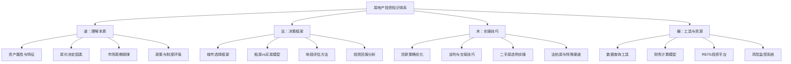

# 第07章 房地产投资

## 章节定位

房地产是中国家庭财富的"压舱石"，也是大多数人一生中金额最大的单笔财务决策。根据中国人民银行2019年的调查，中国家庭资产中住房资产占比高达59.1%，远高于美国家庭的25%左右。这意味着中国家庭的财富命运与房地产深度绑定——房产的每一次涨跌，都直接影响到家庭的资产负债表。

但房地产投资的复杂性远超多数人的认知。它不是简单的"买涨"或"买跌"，而是一个涉及经济周期、人口迁移、城市规划、货币政策、税收制度、法律风险等多维度的系统工程。一套房的决策，可能影响一个家庭未来10-30年的财务状况。

本章不是教你"炒房"——在"房住不炒"的政策基调下，投机性炒房的时代已经过去。本章要帮你建立一套完整的、理性的房产投资认知框架，让你理解房地产的本质规律，在买房这个人生最大的财务决策中做出明智选择，同时了解不必直接买房也能参与房地产投资的替代路径。

### 本章能帮你解决什么问题

| 场景 | 你可能的困惑 | 本章提供的价值 |
|------|-------------|---------------|
| 首次购房 | 该不该买？买在哪里？怎么贷款？ | 完整的购房决策框架和评估工具 |
| 投资购房 | 二套房还值得投资吗？回报率怎么算？ | 租售比分析、现金流计算、持有成本全模型 |
| 租房vs买房 | 租一辈子真的比买房划算吗？ | 数学模型+真实案例对比，打破感性判断 |
| 资金有限 | 没有几百万怎么参与房地产？ | REITs、房产基金等间接投资路径 |
| 资产优化 | 已有房产，如何优化家庭资产配置？ | 房产在家庭资产中的合理比例和退出策略 |
| 风险防范 | 房产投资有哪些看不见的坑？ | 法律风险、流动性陷阱、政策风险的全面梳理 |

## 知识体系地图

房地产投资的知识体系可以分为"道法术器"四个层次。理解这个框架，才能避免只见树木不见森林。



## 核心问题预览

在深入章节内容之前，先用最精炼的方式回答本章要解决的核心问题——这些是贯穿全章的主线。

### 问题一：买房到底是消费还是投资？

这个问题的答案是"既是，也不全是"。从经济学角度看，自住房产同时具有两种属性：

**消费属性**：住房是基本生活需求，你获得的是居住服务（shelter service）。这部分价值不体现在资本增值中，而是体现在你不需要支付租金的机会成本中。

**投资属性**：房产作为实物资产，其价格会随着城市发展、通胀、供需关系而变动，可能带来资本增值（或贬值）。

关键在于比例。在房价合理（房价收入比6-10倍、租售比3%-5%）的城市，买房兼具消费和投资的合理性；在房价严重偏高（房价收入比超过20倍、租售比低于1.5%）的城市，买房本质上是高溢价的消费+低效的投资。

**判断公式**：真实持有成本 = 贷款利息 + 物业费 + 维修费 + 房产税（若有） + 机会成本（首付的资金收益） - 租金节省 - 资本增值预期。如果这个值长期为正，你的房子主要是消费品；如果为负，它才是真正的投资品。

### 问题二：如何判断一个城市的房产值不值得买？

城市房产投资价值的评估需要看四个核心维度：

| 维度 | 关键指标 | 好的信号 | 危险信号 |
|------|---------|---------|---------|
| 人口趋势 | 常住人口净流入/流出 | 连续3年人口净流入，年轻人口占比高 | 人口连续流出，老龄化严重 |
| 经济活力 | GDP增速、产业多元化 | 人均收入增长超全国均值，产业多元 | 单一资源型产业，收入增长停滞 |
| 土地供给 | 土地出让面积vs需求 | 供地节制、库存去化周期<12个月 | 大量供地、库存去化周期>24个月 |
| 政策环境 | 限购/限贷/税费政策 | 政策宽松期、人才引进力度大 | 严格限购+高税率+限售期长 |

一个简单的筛选标准：**连续3年人口净流入 + 人均可支配收入增速高于全国均值 + 库存去化周期低于15个月**——同时满足这三个条件的城市，房产至少有保值的基础。

### 问题三：租房和买房哪个更划算？

这个问题没有标准答案，取决于三个关键变量：

1. **房价收入比**：在房价收入比超过15倍的城市，纯经济角度租房往往更划算
2. **租金增长率**：如果租金每年上涨5%以上，早买早锁定成本的优势明显
3. **资金投资回报率**：如果首付用于投资能获得年化8%以上收益，租房+投资可能更优

**快速判断法**：计算"租售比"（年租金÷房价）。租售比低于2%，说明房价相对于租金严重偏高，租房更划算；租售比在3%-5%之间，买房和租房差异不大，取决于个人偏好；租售比高于5%，买房在经济上更划算。

### 问题四：除了直接买房，还有哪些参与房地产的方式？

对于资金不够买房、不想承担实物房产风险、或者想要更好流动性的投资者，还有这些路径：

| 方式 | 最低门槛 | 流动性 | 预期年化回报 | 风险等级 |
|------|---------|--------|------------|---------|
| 公募REITs | ~1000元 | 高（T+1交易） | 4%-8% | 中等 |
| 房地产ETF | ~100元 | 高 | 跟踪指数 | 中等 |
| 房产信托/私募 | 100万元 | 低（锁定期长） | 6%-12% | 较高 |
| 合伙买房 | 灵活 | 低 | 不确定 | 高 |
| 房地产股票 | ~100元 | 高 | 随市场波动 | 较高 |
| 法拍房 | 视情况 | 中 | 潜在高回报 | 高（需专业能力） |

每种方式的详细分析、操作流程和风险提示，将在核心技巧篇的REITs章节和实战案例中展开。

## 内容结构导航

本章共包含40篇内容，按"理论→方法→案例→误区→练习"的逻辑组织。下面是你在不同场景下的最优阅读路径：

```mermaid
graph LR
    Start[你的需求] --> A[想全面了解房地产投资]
    Start --> B[准备买房]
    Start --> C[想投资但不买房]
    Start --> D[已有房产想优化]

    A --> A1[按顺序完整阅读]
    B --> B1[理论基础→核心技巧01-04→案例1-3]
    C --> C1[核心技巧05(REITs)→案例5]
    D --> D1[理论基础06(资产比较)→核心技巧07(风控)→误区篇]
```

### 理论基础篇（10篇）

从房地产的资产属性讲起，建立完整的认知底层。

| 序号 | 主题 | 核心内容 | 关键收获 |
|------|------|---------|---------|
| 01 | 房地产的资产属性 | 低流动性、高杠杆、地域性、政策敏感性的本质分析 | 理解房产与其他资产的根本区别 |
| 02 | 房价的核心决定因素 | 人口、经济、土地、政策四因素模型及其相互作用 | 掌握判断房价走势的分析框架 |
| 03 | 关键评估指标 | 租售比、房价收入比、库存去化周期、空置率的计算与解读 | 能用数据而非感觉评估房产价值 |
| 04 | 中国房地产市场的历史与现状 | 从1998年房改到2024年的市场演变、政策变迁与当前格局 | 理解当下市场格局的历史成因 |
| 05 | 租房vs买房的经济学分析 | 机会成本模型、终值比较法、情景分析 | 用数学而非直觉做出租/买决策 |
| 06 | 房地产与其他资产的比较 | 房产vs股票vs债券vs黄金的长期回报、风险、流动性对比 | 理解房产在资产配置中的合理位置 |
| 07 | 中国主要城市房产投资分析 | 一线、新一线、二线城市的横向对比与投资逻辑差异 | 了解不同层级城市的投资特征 |
| 08 | 房产贷款策略深度分析 | 等额本息vs等额本金、提前还贷决策、公积金组合贷优化 | 节省数万到数十万的利息支出 |
| 09 | 房产投资的税务筹划 | 增值税、个税、契税的计算与合法节税策略 | 交易中合法节省税费的实操方法 |
| 10 | 房产投资的区域分析方法 | 城市内部板块价值分析、配套成熟度评估、规划兑现判断 | 在一个城市内选出最有潜力的板块 |

### 核心技巧篇（10篇）

从理论到实操，提供可直接使用的决策工具和操作流程。

| 序号 | 主题 | 核心内容 | 关键收获 |
|------|------|---------|---------|
| 01 | 城市选择框架 | 量化评分模型：人口、经济、产业、库存、政策五维打分 | 用评分表快速筛选投资城市 |
| 02 | 房屋评估技巧 | 二手房估价方法、楼层/朝向/户型的价值影响因子 | 不依赖中介，独立评估房屋合理价格 |
| 03 | 贷款策略 | 贷款产品对比、利率谈判、还款计划优化的具体操作 | 实际操作层面的贷款选择指南 |
| 04 | 租房投资分析 | 现金流计算模型、盈亏平衡点、退出策略 | 判断一套房出租是否能产生正现金流 |
| 05 | REITs投资 | 公募REITs的选择、估值、交易策略 | 不买房也能获得房产投资收益 |
| 06 | 谈判与交易技巧 | 二手房砍价策略、合同条款审核、交易流程把控 | 在交易中保护自身利益、争取最优价格 |
| 07 | 风险管理 | 系统性风险、个体风险的识别与对冲 | 建立房产投资的风险防护体系 |
| 08 | 实操工具 | 数据网站、计算器、APP、信息渠道汇总 | 高效获取和分析房产信息的工具箱 |
| 09 | 二手房选购实操 | 看房清单、产权核查、物业检查、邻里调查 | 二手购房的完整操作手册 |
| 10 | 时机判断 | 市场周期识别、买入/卖出信号、政策拐点判断 | 在合适的时间做出买卖决策 |

### 实战案例篇（11篇）

通过真实案例展示不同投资策略的实施过程和结果。

| 序号 | 案例 | 投资策略 | 核心教训 |
|------|------|---------|---------|
| 01 | 一线城市长期持有（深圳） | 时间换空间，长期持有优质资产 | 选对城市+长期持有是最大的alpha |
| 02 | 二线城市租售比投资（长沙） | 低房价+高租售比的现金流策略 | 租售比高的城市也能获得稳健回报 |
| 03 | 学区房投资逻辑（北京） | 教育资源溢价的获取与风险 | 政策变动可以瞬间摧毁学区房溢价 |
| 04 | 商铺投资的风险教训 | 商业地产的陷阱与认知误区 | 住宅和商铺是完全不同的投资逻辑 |
| 05 | REITs投资实操 | 公募REITs的选择与持有策略 | REITs不是稳赚不赔，需要选择和择时 |
| 06 | 法拍房套利 | 法拍房的低价获取与风险管控 | 高收益背后是高风险和高专业门槛 |
| 07 | 案例总结 | 各案例的横向对比与规律提炼 | 从个案中提炼通用的投资原则 |
| 08 | 租房投资正现金流（杭州） | 小户型出租的现金流管理 | 小户型+高需求区域=稳定的正现金流 |
| 09 | 案例综合启示 | 从所有案例中提炼的关键规律 | 避免"幸存者偏差"，理解风险全貌 |
| 10 | 实战案例详解补充 | 更多实操细节和数据补充 | 理论与实践的桥梁 |
| 11 | 常见误区详解 | 房产投资的七大认知误区 | 纠正错误观念，建立正确投资思维 |

### 常见误区篇

房产投资中最危险的不是市场下跌，而是认知错误。本篇揭示以下常见误区：

1. **只看涨跌不看租售比** ——忽略租金收入，只押注资本增值，本质上是在赌方向
2. **忽视持有成本** ——物业费、维修费、空置期、贷款利息、折旧……真实的持有成本远超多数人的想象
3. **过度杠杆** ——月供超过家庭收入50%，一旦收入波动就会陷入被动
4. **盲目跟风"洼地"** ——所谓"价格洼地"往往是"价值陷阱"，低价有低价的道理
5. **把自住房当投资** ——自住房是消费品，只有在你愿意卖出并获利时才是投资
6. **过度关注宏观政策** ——宏观政策影响趋势，但微观地段和产品才是决定个体回报的关键
7. **不做尽职调查** ——产权纠纷、房屋质量问题、物业管理恶化……这些都可以提前排查

### 练习方法篇

提供一套房产投资分析的实操训练体系：

- **城市研究训练**：选取3个城市，用五维评分模型进行量化对比
- **租售比计算练习**：收集10个真实房源数据，计算并比较租售比
- **购房决策模拟**：用完整的财务模型评估一次购房决策的总成本和预期回报
- **REITs分析练习**：选择3只公募REITs，分析底层资产质量和分红可持续性

### 深度拓展篇

为高级读者准备的深度内容，包括国际房地产市场比较、房产投资的数学模型、以及房地产与宏观经济的关系分析。

## 学习目标

完成本章学习后，你将能够：

1. **理解房价的核心驱动因素** ——不是靠感觉和新闻标题判断房价走势，而是用人口、经济、土地、政策四因素模型进行系统分析
2. **评估一个城市/地段的房产投资价值** ——使用量化评分框架，在30分钟内完成一个城市的投资价值初判
3. **计算租房vs买房的真实成本** ——用机会成本模型和终值比较法，做出数据驱动的租/买决策
4. **掌握贷款策略优化方法** ——理解等额本息与等额本金的真实差异，做出最优还款计划
5. **了解REITs等间接投资方式** ——在资金不够买房时，也能通过金融工具参与房地产投资
6. **建立完整的风险识别能力** ——识别法律风险、流动性风险、政策风险、市场风险，并知道如何对冲
7. **避免房产投资中的常见陷阱** ——七大误区的识别与纠正，避免认知盲区导致的重大损失

## 适合人群

| 人群 | 你的处境 | 重点阅读 |
|------|---------|---------|
| 首次购房的年轻人 | 攒了首付，在犹豫要不要上车 | 理论基础05（租vs买）、核心技巧01-03（城市选择+评估+贷款） |
| 投资二套房的中产 | 有一套房，想用房产做资产增值 | 核心技巧04（租房投资分析）、案例01-02（持有vs租售比策略） |
| 资金有限的投资者 | 没有几百万，但想参与房产投资 | 核心技巧05（REITs）、案例05（REITs实操） |
| 已有房产想优化的人 | 手上有房，想知道是否该卖掉或置换 | 理论基础06（资产比较）、核心技巧07（风险管理）、误区篇 |
| 对法拍房感兴趣的人 | 听说法拍房便宜，想了解操作方式 | 案例06（法拍房套利）、核心技巧09（二手房选购） |

## 重要提醒

> 房产是大额资产，决策失误的代价远高于股票。一套房的错误决策可能导致数十万甚至数百万的损失，且流动性差意味着你无法像股票一样快速止损。
>
> 买房前请充分研究、理性分析，不要被市场情绪左右——无论市场是狂热还是恐慌。本章内容不构成任何投资建议，房地产市场具有很强的地域性和政策性，请结合当地实际情况做出判断。
>
> 特别提醒：本章中的数据和案例主要基于2020-2024年的市场环境。房地产市场变化迅速，具体操作时请以最新的市场数据和政策为准。

## 阅读建议

**如果时间充裕**：建议按顺序完整阅读，从理论基础到实战案例，建立完整的知识体系。预计需要1-2周时间。

**如果正在看房**：优先阅读"核心技巧篇"的城市选择框架（01）、房屋评估技巧（02）和贷款策略（03），以及实战案例中与你情况最接近的案例。理论部分可以在买房决策确定后再回来补充。

**如果资金有限**：直接跳到核心技巧篇的REITs章节（05），了解不买房也能投资房地产的路径。然后回看理论基础篇的资产比较（06），理解房产在整体资产配置中的位置。

**如果已有房产**：从理论基础篇的资产比较（06）开始，然后看风险管理（核心技巧07）和常见误区篇，优化你现有的房产资产配置。

---

> **本章字数**：全章约40篇内容，涵盖理论、方法、案例、误区、练习五大模块，完整阅读约需8-12小时。
