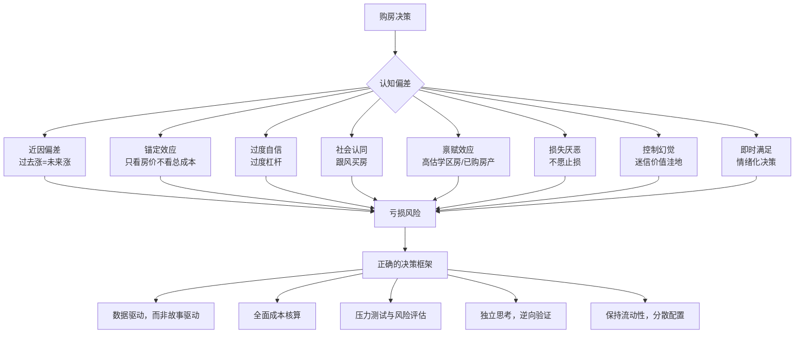

# 第07章 房地产投资——常见误区

房产投资是普通人一生中最大的单笔财务决策，动辄百万起步、背负数十年贷款。然而，大量投资者在决策过程中受到认知偏差、信息不对称和情绪驱动的影响，反复踏入相同的陷阱。本章系统梳理房产投资中最常见的十二个误区，每个误区从心理机制、真实案例、自检清单和纠正策略四个维度展开，帮助你在做出决策前识别并规避这些风险。

## 为什么房产投资特别容易踩坑

房产投资与其他投资品种（股票、基金、债券）相比，有三个独特的结构性特征，使得投资者更容易犯错：

**第一，决策频率极低。** 一个人一生中买房的次数通常不超过3-5次，每一次决策都缺乏"练手机会"。不像股票投资者可以通过反复交易积累经验，房产投资者往往是"一次性博弈"，犯错的代价极高。

**第二，信息严重不对称。** 房产交易涉及开发商、中介、银行、政府等多个利益相关方，每一方都有动机美化信息。普通购房者获取真实市场数据的渠道有限，容易被片面信息误导。

**第三，情感卷入度极高。** 房子不仅是投资品，更是"家"的载体。中国人对"有房才有家"的文化认同，使得购房决策常常被情感绑架，理性分析让位于"安全感"和"面子"。

理解了这三个结构性原因，我们就能更清醒地审视下面的每一个误区。

---

## 误区一：房价永远涨

### 心理机制

这个误区的根源是**近因偏差（Recency Bias）**——人们倾向于用最近的经验来预测未来。中国房价从1998年房改到2021年，经历了长达23年的上涨周期，这让整整两代人形成了"房价只涨不跌"的信仰。这种信仰进一步被**确认偏差（Confirmation Bias）**强化：人们会主动寻找支持房价上涨的信息，忽略相反的证据。

另一个心理机制是**损失厌恶（Loss Aversion）**：已经买房的人不愿意接受房价下跌的现实，会不断给自己找理由——"这只是暂时的调整"、"长期一定涨回来"。

### 真实案例

| 国家/城市 | 泡沫破裂时间 | 最大跌幅 | 恢复时间 |
|-----------|-------------|---------|---------|
| 日本东京 | 1991年 | 约70% | 30年以上（至今未完全恢复） |
| 美国全国 | 2008年 | 约30% | 约6年（2012-2014年触底回升） |
| 美国拉斯维加斯 | 2008年 | 约60% | 约10年 |
| 中国香港 | 1997年 | 约70% | 约12年（2009年才回到1997年水平） |
| 中国温州 | 2011年 | 约40% | 约8年（且未能恢复到最高点） |
| 中国多数城市 | 2021年 | 20-40% | 截至2025年仍在调整中 |

**日本案例深度分析：** 1985年广场协议后，日元大幅升值，日本央行大幅降息刺激经济，大量资金涌入房地产和股市。1991年泡沫破裂时，东京都心的商业地价指数从1991年的峰值约380，跌至2005年的约60，跌幅超过80%。住宅用地跌幅相对较小，但也在40-50%之间。更关键的是，日本经历了"失去的三十年"，名义工资停滞不前，即便房价绝对值回到高位，相对于居民收入，购房能力反而下降了。

**中国现实：** 2021年之后的下跌并非简单的"周期性调整"，而是叠加了三个结构性因素——人口拐点（2022年中国总人口开始负增长）、居民杠杆率见顶（居民部门杠杆率从2008年的18%升至2023年的约63%，接近发达国家水平）、以及经济增长模式转型（从投资驱动转向消费驱动）。这意味着指望"像以前一样V型反弹"是不现实的。

### 自检清单

- [ ] 你是否认为"房价不可能跌"？
- [ ] 你是否用过去10年的房价走势来推断未来？
- [ ] 你是否忽略了人口、经济、政策等基本面因素的变化？
- [ ] 你身边是否有人说"现在不买以后更买不起"，你就相信了？

### 纠正策略

1. **建立概率思维。** 房价上涨和下跌都是概率事件，不存在"一定涨"或"一定跌"。你的决策应该基于概率分析，而不是确定性判断。
2. **区分周期性和结构性变化。** 短期波动（1-2年）可能是周期性的，但人口下降、城镇化率见顶（2023年约66%）、经济增速放缓是结构性的，不会轻易逆转。
3. **用国际比较校准预期。** 发达国家的房价长期年化涨幅通常在1-3%（扣除通胀后接近0%）。指望中国房价继续以每年5-10%的速度上涨是不现实的。
4. **计算你的"下跌承受能力"。** 如果房价跌30%，你能否承受？如果不能，说明你的杠杆太高或总价太高。

---

## 误区二：只看房价涨跌，不看持有成本

### 心理机制

这个误区源于**锚定效应（Anchoring Effect）**和**框架效应（Framing Effect）**。人们习惯性地用"买入价vs卖出价"来衡量收益，这个简单的框架忽略了大量隐性成本。中介和开发商也乐于强化这个框架——"这套房5年前100万，现在200万，翻倍了！"——因为这听起来很诱人。

### 持有成本全面拆解

| 成本项目 | 典型金额（以200万房产为例） | 计算方式 |
|---------|------------------------|---------|
| 贷款利息（30年等额本息，利率4.2%） | 约152万 | 月供8,118元×360期-贷款本金140万 |
| 首付资金机会成本（年化4%） | 约72万 | 60万×4%×30年（复利约130万） |
| 物业费（2.5元/㎡/月，90㎡） | 约8.1万 | 225元×12×30 |
| 维修基金及日常维修 | 约5-10万 | 按房价的2-5%估算 |
| 装修及家具（每10年翻新一次） | 约30-50万 | 第1次15万+第2次15万+第3次15万 |
| 中介费（买入1%+卖出2%） | 约6万 | 200万×3% |
| 税费（契税+增值税+个税等） | 约8-15万 | 视具体情况，卖出时可能更高 |
| 保险费 | 约2-3万 | 房贷保险+家财险 |
| **总隐性成本** | **约283-306万** | — |

**这意味着什么？** 一套200万的房子，30年持有期间的总成本可能接近480-500万。如果30年后卖出300万，表面赚了100万，实际可能亏损180-200万。

### 真实案例

张先生2015年在深圳购入一套总价300万的房产（首付90万，贷款210万，利率4.9%，30年等额本息）。2023年以400万卖出。

| 项目 | 金额 |
|------|------|
| 卖出价 | 400万 |
| 买入价 | -300万 |
| 8年贷款利息 | -约76万 |
| 中介费（买入1%+卖出1.5%） | -约10万 |
| 税费 | -约12万 |
| 物业费+维修 | -约6万 |
| 装修 | -约20万 |
| 首付90万的机会成本（按年化5%） | -约53万 |
| **实际净收益** | **约23万** |

表面看赚了100万，实际只赚了约23万。如果考虑到8年间每月月供带来的现金流压力，这笔投资的性价比其实很低。

### 自检清单

- [ ] 你计算房产收益时，是否扣除了贷款利息？
- [ ] 你是否考虑了首付资金如果不买房、投资其他渠道的收益？
- [ ] 你是否计入了物业费、维修费、装修折旧等隐性成本？
- [ ] 你是否对比过同金额资金投入其他资产（如指数基金）的回报？

### 纠正策略

1. **建立完整的成本核算模型。** 在做任何房产投资决策前，用Excel或在线计算器列出所有成本项（参考上表），计算真实的总持有成本。
2. **计算内部收益率（IRR）。** 不要用简单的"卖出价-买入价"来衡量收益，而是用IRR来计算年化回报率，并与其他投资渠道对比。
3. **对比"租房+投资"方案。** 把月供差额（月供-租金）和首付资金分别投资于低风险资产（如国债、指数基金），30年后的总收益可能超过买房。

---

## 误区三：过度杠杆

### 心理机制

过度杠杆的根源是**过度自信偏差（Overconfidence Bias）**——人们倾向于高估自己未来收入的增长，低估失业、降薪、生病等风险。同时，**从众效应**也在推波助澜："大家都这么买，我也能承受。"

另一个心理因素是**即时满足偏好**：看到心仪的房子，不愿等待或妥协，宁可借钱也要买下。这种"先拥有再说"的心态，让人忽略了长期的财务压力。

### 杠杆风险的量化分析

假设你月收入15,000元，购买一套200万的房产，首付60万（30%），贷款140万（30年，利率4.2%）：

| 场景 | 月供占比 | 月供后剩余 | 可持续性评估 |
|------|---------|-----------|------------|
| 当前收入 | 54%（月供8,118元） | 6,882元 | 极度紧张，无储蓄空间 |
| 收入下降20% | 68% | 3,882元 | 难以维持基本生活 |
| 收入下降30% | 77% | 2,382元 | 断供风险极高 |
| 失业 | 100% | 负数 | 立即断供 |

**安全标准：** 月供不超过家庭月收入的30%。这不是保守，而是为收入波动、突发事件（医疗、失业、家庭变故）留出缓冲空间。

### 真实案例

李女士2019年在北京购入一套总价500万的房产，首付150万（含借款50万），贷款350万，月供约18,000元，占家庭月收入（32,000元）的56%。

2022年，丈夫公司裁员，收入降至18,000元/月。月供占比飙升至100%，被迫动用信用卡和网贷维持月供，半年内负债增加15万。最终在2023年以430万卖出（亏损70万），加上借款利息和税费，总亏损超过100万。

如果当初选择300万的房产，首付90万（无借款），贷款210万，月供约10,300元（占32%），即便收入下降也能承受，不至于被迫割肉卖出。

### 自检清单

- [ ] 月供是否超过家庭月收入的30%？
- [ ] 首付中是否有借款（亲友借款、消费贷、信用贷）？
- [ ] 如果收入下降30%，你是否还能承受月供？
- [ ] 你是否有至少6个月月供的应急储备金（独立于首付之外）？
- [ ] 你的工作是否稳定？所在行业是否有裁员风险？

### 纠正策略

1. **严格执行"30%法则"。** 月供不超过税后月收入的30%。如果买不起理想的区域，要么降低面积要求，要么选择更远的区域，要么推迟购房计划。
2. **首付必须是自有资金。** 借钱付首付是杠杆上的杠杆，风险成倍放大。如果你需要借首付，说明你目前的财务状况不适合买房。
3. **建立"压力测试"。** 模拟收入下降30%、利率上升1%、房价下跌20%的极端情况，看你的财务是否还能撑住。
4. **保留至少12个月的应急资金。** 不是6个月——房产是流动性最差的资产，一旦断供，后果远比租房搬家用钱更严重。

---

## 误区四：盲目相信"价值洼地"

### 心理机制

"价值洼地"是一个极具诱惑力的概念，它满足了人们的**控制幻觉（Illusion of Control）**——"别人都没发现，只有我发现了这个机会。"这种"众人皆醉我独醒"的感觉，让人产生虚假的优越感和信心。

同时，**禀赋效应（Endowment Effect）**在购买后也会作祟：一旦你买了"价值洼地"的房产，你会不自觉地高估它的价值，拒绝接受负面信息。

### "价值洼地"vs"价值陷阱"的判断标准

| 判断维度 | 真正的价值洼地 | 价值陷阱 |
|---------|-------------|---------|
| 人口趋势 | 持续净流入 | 净流出或停滞 |
| 产业基础 | 有龙头企业或新兴产业 | 依赖单一资源/传统产业衰退 |
| 交通配套 | 已有地铁/高速规划落地 | 仅有"规划中"的地铁，5年内无实质进展 |
| 教育医疗 | 有优质学校和三甲医院 | 配套严重不足，依赖"未来规划" |
| 土地供应 | 新地供应有限 | 大量待开发土地，供应过剩 |
| 二手房流动性 | 有活跃的二手房市场 | 二手房几乎无人问津 |
| 价格走势 | 同比企稳或微跌 | 持续阴跌，成交萎缩 |
| 入住率 | 小区入住率>70% | 大量空置，入住率<30% |

### 真实案例

**价值陷阱——某三线城市新区：** 2017年，某中部三线城市推出新区规划，号称"未来城市副中心"，规划了高铁站、大学城、产业园。大量外地投资客涌入，房价从5,000元/㎡炒到12,000元/㎡。到2023年，高铁站虽然建成了，但大学城和产业园均未兑现，人口持续流出，二手房挂牌价跌至6,000-7,000元/㎡，且几乎无人问津。

**真正的价值洼地——长沙：** 2016-2018年，长沙房价长期维持在8,000-10,000元/㎡，在同级别城市中明显偏低。但长沙有强劲的产业基础（工程机械、文化传媒、电子信息）、持续的人口流入（2015-2020年常住人口增长超200万）、完善的交通配套。到2021年，长沙房价温和上涨至12,000-14,000元/㎡，且保持了健康的租售比。

### 纠正策略

1. **用数据说话，不听故事。** 不要被中介的"未来规划"打动，去查真实的人口数据、产业数据、土地出让数据。
2. **实地考察入住率。** 晚上去目标小区数灯亮的窗户，入住率低于50%的新区要高度警惕。
3. **检查二手房流动性。** 如果目标区域的二手房挂牌量大但成交量极低，说明市场认可度差，你买了也可能卖不掉。
4. **警惕"价格低"的诱惑。** 价格低不等于价值高。问问自己：为什么这里便宜？是因为别人都是傻瓜，还是因为他们看到了你看不到的风险？

---

## 误区五：忽视流动性风险

### 心理机制

**流动性幻觉（Liquidity Illusion）**是房产投资中最危险的认知偏差之一。人们看到中介门店遍地开花、房产交易网站上房源众多，就误以为房产像股票一样可以随时变现。实际上，房产从挂牌到成交，通常需要数月时间；在市场下行期，这个周期可能超过一年，而且往往需要大幅降价才能成交。

### 流动性风险量化

| 场景 | 挂牌到成交周期 | 可能的折价幅度 | 实际到手金额（以200万为例） |
|------|-------------|-------------|------------------------|
| 市场活跃期 | 1-3个月 | 0-5% | 190-200万 |
| 市场平稳期 | 3-6个月 | 5-10% | 180-190万 |
| 市场低迷期 | 6-12个月 | 10-20% | 160-180万 |
| 市场恐慌期 | 12个月以上 | 20-30%+ | 140-160万 |
| 法拍/急售 | 随时 | 30-50% | 100-140万 |

**流动性风险的叠加效应：** 当你急需用钱（失业、生病、生意周转）时，往往也是整个经济环境不好的时候，这意味着房产市场同样处于低迷期。你的"卖房变现"需求和"市场低迷"会同时出现，形成"双重打击"。

### 真实案例

王先生2020年在深圳购入一套800万的房产，贷款560万，月供约28,000元。2023年因创业失败急需资金周转，挂牌750万出售。3个月无人问津，降价至700万，又等了2个月才以680万成交。扣除贷款余额约530万、中介费约14万、税费约20万，实际到手约116万。而如果2020年不买房，800万（首付240万+3年月供约100万）的资金用于稳健理财，到2023年至少有370万可随时动用。

### 纠正策略

1. **房产占比不超过总资产的60-70%。** 剩余30-40%应配置在流动性更好的资产中（现金、货币基金、股票、债券）。
2. **永远保留12个月以上的家庭开支现金。** 这笔钱不应该包括在任何投资计划中。
3. **不要把房产当作"应急资金的来源"。** 当你需要卖房应急时，往往已经来不及了。
4. **考虑REITs作为替代。** 如果看好房地产但需要流动性，公募REITs可以在T+1内变现，年化分红率通常在3-6%。

---

## 误区六：商铺"一铺养三代"

### 心理机制

"一铺养三代"这个概念满足了人们对**被动收入（Passive Income）**的幻想——买一个商铺，躺着收租金，代代相传。这种幻想之所以持久，是因为它确实存在过：在2010年之前，核心商圈的商铺确实可以提供稳定的租金回报。

但人们忽略了**幸存者偏差（Survivorship Bias）**：你只看到那些成功的商铺投资案例，没有看到大量商铺烂尾、空置、亏损的案例。同时，**沉没成本谬误**也让人在商铺投资失败后不愿止损，继续投入更多资金"养铺"。

### 商铺投资的现实困境

| 维度 | 住宅 | 商铺 |
|------|------|------|
| 首付比例 | 20-30% | 50%（二套可能更高） |
| 贷款利率 | 3.5-4.5% | 5-6%（商业贷款） |
| 贷款年限 | 最长30年 | 最长10年 |
| 契税 | 1-3% | 3% |
| 增值税 | 满2年免征 | 差额征收（约5.3%） |
| 土地增值税 | 无 | 30-60%（四级超率累进） |
| 个人所得税 | 满5唯一免征 | 差额20% |
| 流动性 | 较好 | 极差 |
| 租金回报率 | 1.5-3% | 3-8%（账面） |
| 空置风险 | 低 | 高 |

**商铺的隐性陷阱：**

1. **开发商"包租"承诺的真相。** 很多开发商承诺"前5年每年8%租金回报"，这其实是把租金回报加到了房价里。一套实际价值100万的商铺，开发商定价120万，然后承诺5年每年8%（共48万），实际上你只收回了多付的20万中的48万，而且还承担了5年后租不出去的风险。
2. **电商冲击的长期性。** 2023年中国网上零售额占社会消费品零售总额的约28%，且仍在增长。实体商铺的"人流红利"正在持续消退。
3. **税费的毁灭性打击。** 假设你以100万买入商铺，150万卖出，差价50万。需要缴纳增值税约2.65万、土地增值税约10-20万、个人所得税约8-10万、中介费约3-4.5万。税费合计可能占到利润的50-70%。

### 纠正策略

1. **当前环境下，原则上不建议投资商铺。** 除非你有丰富的商业运营经验，或者目标商铺位于绝对核心商圈（如一线城市顶级商圈的临街底商）。
2. **如果一定要买，用"租金回报率>8%"作为硬性门槛。** 低于8%的商铺，扣除空置期、维修、管理成本后，实际回报可能不如银行存款。
3. **永远不要相信开发商的"包租"承诺。** 要求查看已运营商铺的真实租金数据，而非开发商提供的"预期租金"。
4. **计算完整的税费。** 在买入前就计算好卖出时的税费，确保总回报率能覆盖所有成本。

---

## 误区七：跟风买房

### 心理机制

跟风买房的核心驱动力是**社会认同偏差（Social Proof）**——当身边的人都在买房、都在赚钱时，不买房会让人产生强烈的焦虑感。这种焦虑在社交媒体时代被进一步放大：朋友圈里天天有人晒新房、晒装修、晒"又涨了多少"，形成了一种"所有人都在买房"的虚假共识。

另一个驱动力是**FOMO（Fear of Missing Out）**——害怕错过机会。"现在不买，以后更贵"这句话精准地击中了人们的恐惧心理。

### 跟风买房的典型模式

**模式一：市场顶部入场。** 当连菜市场的大妈都在讨论买房时，往往是市场接近顶部的信号。2016-2017年的三四线城市、2020-2021年的深圳，都是典型的"全民买房"高峰期，随后都经历了显著回调。

**模式二：政策刺激后冲动入市。** 每次政策放松（降首付、降利率、放松限购）都会引发一波购房潮，但政策放松往往是因为市场不好，而市场不好的时候，买房并不一定是最佳选择。

**模式三：被身边人的"成功案例"带节奏。** "我同事去年买了XX小区，涨了30%"——但你不知道他买的时候是底部，而现在可能已经是顶部；你也不知道他的财务状况是否和你一样。

### 纠正策略

1. **建立独立的决策框架。** 不要问"别人在买什么"，而要问"我的需求是什么、我的财务状况如何、我的风险承受能力多大"。
2. **逆向思考。** 当所有人都在抢购时，问问自己：卖家为什么在这个时候卖？他是不是看到了我看不见的风险？
3. **设定冷静期。** 看中一套房后，强制自己等待7天再做决定。很多冲动在7天后会自然消退。
4. **用"反面论证"检验决策。** 列出至少5个不买房的理由。如果你找不到任何反对的理由，说明你可能陷入了过度乐观的偏差中。

---

## 误区八：不看合同细节

### 心理机制

购房合同通常长达数十页，充满法律术语，普通人阅读起来极其枯燥。在"即将拥有新家"的兴奋感驱动下，人们倾向于跳过合同细节，或者信任中介/开发商"标准合同，没问题"的说辞。这本质上是**权威偏差（Authority Bias）**和**现状偏差（Status Quo Bias）**的叠加——信任"专家"的解释，不愿花时间改变现状。

### 合同中必须逐条审核的关键条款

**1. 交房标准**
- 精装修的材料品牌、型号、规格是否明确写入合同？
- "同等档次"这种模糊表述要警惕——开发商可能用最差的"同等档次"材料替代。
- 要求附上装修材料清单作为合同附件。

**2. 面积误差处理**
- 合同是否约定了面积误差超过3%的处理方式？
- 按照《最高人民法院关于审理商品房买卖合同纠纷案件适用法律若干问题的解释》，面积误差超过3%的部分，买方有权退房或不补差价。但很多开发商的合同会规避这一条款。

**3. 违约责任**
- 开发商逾期交房的违约金比例是多少？（通常应不低于已付房款的万分之一/天）
- 买方逾期付款的违约金比例是多少？（是否与开发商违约金对等？）
- 很多合同中，买方违约金是万分之三/天，而开发商违约金只有万分之零点五/天，严重不对等。

**4. 产权办理**
- 交房后多久办理产权证？（法律规定应在交房后90天内）
- 逾期办理产权证的违约责任是什么？
- 是否存在"土地性质为集体用地"或"小产权"等产权风险？

**5. 配套设施承诺**
- 开发商承诺的学校、地铁、商业配套是否写入合同？
- 口头承诺不具有法律效力，必须写入合同或取得书面确认。

**6. 补充协议陷阱**
- 很多开发商会在补充协议中添加免责条款，如"因政府原因导致延迟交房不视为违约"。
- 仔细阅读每一条补充协议，不理解的条款要求解释或删除。

### 纠正策略

1. **逐条阅读合同，不要跳过任何条款。** 哪怕花3-5天时间也值得——这可能是你一生中最大的一笔交易。
2. **将所有口头承诺写入合同。** 中介说"学区对口XX小学"、"明年通地铁"——要求写入合同。如果对方拒绝写入，说明承诺本身就不可靠。
3. **请专业律师审核。** 花1,000-3,000元请律师审核合同，远比日后打官司便宜。
4. **保留所有沟通记录。** 微信聊天记录、电话录音、宣传资料都可能成为日后维权的证据。

---

## 误区九：学区房"永远保值"

### 心理机制

学区房的投资逻辑建立在两个假设之上：（1）教育资源稀缺且分配不均；（2）好的学区能持续吸引高支付能力的家长。这两个假设在过去确实成立，但正在被系统性地瓦解。

家长们购买学区房时，往往受到**禀赋效应**的影响——为了孩子教育，愿意支付远超房产本身价值的溢价。这种溢价包含了巨大的政策风险，但在"为了孩子"的情感驱动下，理性评估往往被搁置。

### 学区房面临的系统性风险

**风险一：教育政策改革**
- **多校划片：** 2020年起，北京、上海、深圳等城市逐步推行多校划片政策，即一个小区对应多所学校，通过电脑随机派位分配学位。这意味着即使你买了"名校学区"的房产，孩子也可能被分到普通学校。
- **教师轮岗：** 北京、深圳等地已试点教师轮岗制度，优质师资不再固定在某一所学校，学区之间的师资差距正在缩小。
- **集团化办学：** 名校通过"集团化"模式扩张，将优质教育资源辐射到更多学校，稀释了"核心学区"的价值。

**风险二：人口下降的长期影响**
- 2023年中国出生人口约902万，相比2016年的1,786万，下降了近50%。
- 这意味着6年后的2029年，小学新生数量可能比2023年减少约50%。
- 当学位不再紧张时，学区房的溢价将自然消退。

**风险三：学区房溢价的脆弱性**
- 北京海淀区部分顶级学区房的溢价率高达50-100%（即比同地段非学区房贵50-100%）。
- 2021年多校划片政策出台后，部分学区房价格下跌20-30%。
- 溢价越高，政策调整带来的冲击越大。

### 自检清单

- [ ] 你买学区房是为了投资还是为了孩子教育？
- [ ] 你是否了解目标学区最新的划片政策？
- [ ] 如果学区政策变化导致孩子上不了目标学校，你能否接受？
- [ ] 你计算过学区房溢价的"教育成本"吗？（溢价金额÷学区年限=每年教育成本）

### 纠正策略

1. **明确目的：教育还是投资？** 如果是为了孩子教育，将学区房溢价视为"教育消费"，做好溢价全部损失的心理准备。如果是为了投资，学区房是高风险标的，不建议。
2. **深入研究政策。** 购买前仔细研读目标区域的最新教育政策，确认学区划分的稳定性。
3. **计算"学区溢价回报率"。** 如果学区房比非学区房贵100万，而你只需要6年的学区使用权，相当于每年16.7万的"学费"——这比很多国际学校的学费还贵。
4. **考虑替代方案。** 租房（部分城市允许租房入学）、私立学校、国际学校，可能是更具性价比的选择。

---

## 误区十：认为租房是"替房东还房贷"

### 心理机制

这个误区的根源是**禀赋效应**和**心理账户（Mental Accounting）**。人们对"拥有"和"租赁"有着截然不同的心理感受：拥有房产让人感到安全、稳定、有面子；而租房则被视为"不稳定"、"不成功"。这种心理感受与实际的经济账常常是矛盾的。

同时，"替房东还房贷"这个说法巧妙地利用了**框架效应**——它把租房描述为"你在帮别人赚钱"，激发了人们的不公平感。但它忽略了一个事实：买房后你在"帮银行赚钱"（利息），帮开发商赚钱（利润），帮政府赚钱（税费），帮物业赚钱（物业费）。

### 租房vs买房的全面经济对比

以一线城市一套800万的房产为例：

| 项目 | 买房方案 | 租房方案 |
|------|---------|---------|
| 首付（30%） | 240万 | 0 |
| 月供（贷款560万，30年，4.2%） | 约27,400元/月 | — |
| 同地段租金 | — | 约8,000元/月 |
| 月供与租金的差额 | — | 19,400元/月可投资 |
| 30年后房产价值（假设年涨2%） | 约1,450万 | — |
| 30年后投资收益（首付240万+每月19,400，年化5%） | — | 约2,100万 |
| 30年总持有成本（利息+物业+维修+税费） | 约550万 | 租金约288万 |
| 30年净收益 | 约1,450-800-550=100万 | 约2,100-288=1,812万 |

**关键发现：** 在租售比极低的一线城市（租售比=年租金/房价，通常<2%），将买房的资金（首付+月供差额）用于投资，长期回报可能远超买房。

当然，这个计算依赖于几个关键假设：（1）房价年涨幅；（2）投资年化收益率；（3）租金增长率。不同假设会导致截然不同的结论。

### 什么时候租房更划算？

当以下条件满足2个以上时，租房在经济上通常更优：
- 租售比低于2%（即年租金/房价<2%）
- 你没有长期定居的确定性（工作可能变动）
- 你有稳定的投资能力（年化收益>5%）
- 你需要保持资金流动性（创业、留学等计划）

### 什么时候买房更划算？

当以下条件满足2个以上时，买房在经济上通常更优：
- 租售比高于4%
- 你有长期定居的确定性
- 你没有稳定的投资能力
- 你需要房产附加的"户口、学区、社会认同"等非经济价值
- 通货膨胀预期较高（房产是天然的通胀对冲工具）

### 纠正策略

1. **不要被情感绑架。** "有自己的房子"是一种情感需求，但不要把它伪装成经济决策。如果你是为了安全感和面子买房，承认这一点，并愿意为此支付溢价。
2. **用数据做决策。** 在你所在的城市，用真实的房价和租金数据计算租售比，再结合自己的财务状况做出理性判断。
3. **承认"租购同权"的局限性。** 目前中国大多数城市的教育、户口等资源仍然与房产挂钩，这是买房的重要非经济因素。但这个政策方向正在逐步推进。

---

## 误区十一：只看房不看人

### 心理机制

很多购房者把注意力集中在房子本身——户型、朝向、装修、楼层——却忽略了对交易对手方（卖家、中介、开发商）的深入了解。这源于**焦点效应（Spotlight Effect）**——我们倾向于过度关注眼前的、具体的事物（房子），而忽略背景性的、抽象的因素（人的诚信和动机）。

### "看人"的关键维度

**1. 卖家动机分析**
- 卖家为什么要卖？急售（离婚、债务、移民）通常有更大的议价空间。
- 卖家挂牌多久了？超过6个月未售出，说明定价偏高或存在其他问题。
- 卖家是否在同时看房（置换）？置换卖家通常对时间节点有要求，议价空间取决于他的紧迫程度。

**2. 中介动机分析**
- 中介推荐这套房，是因为它真的适合你，还是因为佣金高？
- 中介是否只推荐"独家房源"（佣金更高的房源）？
- 中介对小区的真实了解程度如何？（能否回答物业口碑、邻里关系、噪音问题等细节）

**3. 开发商背景调查**
- 开发商是否有烂尾、延迟交房的历史？
- 开发商的资金链状况如何？（查企业信用信息、诉讼记录）
- 开发商在该项目上是否为合作开发？（合作开发项目容易出现权责不清）

### 纠正策略

1. **建立交易对手档案。** 在做购房决策前，花时间调查卖家、中介、开发商的背景。
2. **多渠道验证信息。** 不要只听中介的一面之词，通过小区业主群、物业、邻居等多渠道了解真实情况。
3. **关注"人"的行为模式。** 如果卖家/中介在谈判中频繁变卦、隐瞒信息、催促决策，这些都是危险信号。

---

## 误区十二：情绪化决策

### 心理机制

购房过程中存在大量情绪触发点：
- **样板间效应：** 精心设计的样板间会激发"这就是我理想中的家"的幻想，让人忽略户型缺陷。
- **稀缺焦虑：** "这套房还有3组客户在看，今天不定就没了"——中介制造的稀缺感会触发冲动决策。
- **沉没成本：** 看了30套房，累了，不想再看了——"就这套吧"。
- **锚定效应：** 第一套看的房往往成为后续比较的基准，即使它并不理想。

### 真实案例

赵女士和丈夫看了50多套房后身心俱疲。中介推荐了一套"性价比很高"的房源，声称"明天有3组客户要来看"。赵女士当天下午就交了10万定金。事后才发现：房子临街噪音严重、物业口碑极差、小区停车位严重不足。但定金已交，合同已签，最终只能忍痛接受。

### 纠正策略

1. **制定购房清单（Checklist）。** 在看房前列出你的"必须条件"和"加分条件"，每套房用清单打分，避免被单一因素左右。
2. **设定冷静期。** 看中一套房后，强制等待至少3天再做决定。任何"今天不定就没了"的房源，大概率是中介的销售话术。
3. **带一个理性的"决策伙伴"。** 找一个不买房的朋友或家人，他们能提供更客观的视角。
4. **警惕"完美房源"。** 如果一套房什么都好，价格还便宜，要么是你不了解情况，要么是陷阱。

---

## 总结：房产投资的认知框架

房产投资最大的误区可以归结为一句话：**用过去的经验推断未来，用情感代替分析，用个案代替系统。**

下图展示了房产投资中常见的认知偏差及其影响：

在新的市场环境下，房产投资需要更加理性：

- **选对城市比选对房子更重要** ——城市的基本面（人口、产业、经济）决定房产的长期价值
- **注重现金流比赌升值更安全** ——租金回报是确定的，升值是不确定的
- **控制杠杆比追求收益更关键** ——活着才能等到黎明
- **分散配置比All in房产更明智** ——不要把所有鸡蛋放在一个篮子里
- **理性决策比"感觉对"更重要** ——建立决策清单，用系统替代直觉
