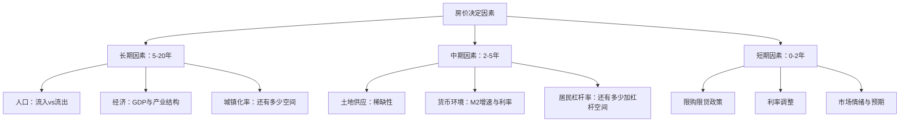

# 第07章 房地产投资——本章小结

本章从"道法术器"四个层次系统构建了房地产投资的完整认知框架。房地产是中国家庭财富的核心组成部分——央行2019年调查显示，中国家庭资产中住房占比高达59.1%，远超美国的25%。这意味着，无论你是否打算"投资"房产，理解房地产的运行规律都是每个成年人的必修课。

本小结将全章核心内容串联为一个完整的决策参考体系，既帮助你回顾已学内容，也作为未来实操时的速查手册。

---

## 一、房产的本质：为什么它是特殊的投资品

### 1.1 房产的六重属性

房产不是普通的投资标的，它同时具备六重属性，这在所有资产类别中独一无二：

| 属性 | 含义 | 对投资者的影响 |
|------|------|--------------|
| **消费品属性** | 满足居住刚需，提供"住所服务" | 自住时省下的租金是隐性收益 |
| **投资品属性** | 价格随供需和通胀波动 | 可能带来资本增值或贬值 |
| **杠杆品属性** | 首付20-30%撬动全部价值 | 收益和风险同时被放大 |
| **不动产属性** | 不可移动，与地段深度绑定 | 城市选择决定80%的投资成败 |
| **耐久品属性** | 使用寿命50-70年 | 持有期间有折旧和维护成本 |
| **政策品属性** | 受限购限贷等政策直接影响 | 政策变化可在一夜之间改变估值逻辑 |

### 1.2 房产与股票、债券的核心区别

理解房产与其他资产的差异，是做出正确配置决策的前提：

- **流动性差异**：股票秒级交易，房产变现需要3-12个月，交易税费占房价的3%-8%。这意味着房产不适合作为应急资金的载体，你必须做好"被锁死"的准备。
- **杠杆差异**：买股票加杠杆需要融资融券（门槛50万+），买房天然自带3-5倍杠杆。杠杆是双刃剑——2015-2021年一线城市用3倍杠杆年化收益可达15%-25%，但2022年以来部分城市房价下跌20%-30%，首付已经亏光。
- **信息差异**：上市公司有强制信息披露，房产交易信息严重不透明。同一小区同户型，成交价可能差10%-15%，信息不对称是房产投资的常态。
- **管理差异**：买完股票不用管，买完房需要维修、出租、处理纠纷、缴纳物业费。房产是"主动管理型"资产，时间成本不可忽视。

### 1.3 房产的真实持有成本

多数人只算房价涨跌，忽略持有成本。一套300万的房产，每年的真实持有成本至少包括：

| 成本项 | 年均金额（估算） | 说明 |
|--------|----------------|------|
| 贷款利息（按200万贷30年4.2%） | 约8.4万/年（前几年） | 前期利息占月供70%以上 |
| 物业费 | 0.3-1.2万/年 | 高端小区更高 |
| 维修基金+日常维修 | 0.2-0.5万/年 | 房龄越大维修越多 |
| 装修折旧 | 0.5-1.5万/年 | 按10-15年装修周期摊销 |
| 房产税（试点城市） | 视政策而定 | 目前仅上海、重庆试点 |
| 机会成本（首付100万） | 3-4万/年 | 按3%-4%无风险收益计算 |
| **合计** | **约12-16万/年** | **相当于每月1-1.3万** |

如果这套房年租金只有6万，那么持有成本是租金的2倍以上——这就是为什么"只看涨跌不看成本"是房产投资最大的认知陷阱。

---

## 二、房价的决定因素：理解价格背后的逻辑

### 2.1 三层次分析框架

房价不是随机波动的，它由三个层次的因素共同决定：

**核心结论：全国房价普涨时代已经结束。** 2016年以前"闭眼买房都能赚"的逻辑不再成立。未来是城市分化的时代——选对城市比选对房子更重要，选对板块比选对户型更重要。

### 2.2 城市能级与投资逻辑

不同能级的城市，投资逻辑完全不同：

| 城市能级 | 代表城市 | 核心逻辑 | 风险特征 |
|---------|---------|---------|---------|
| 一线 | 北上广深 | 人口持续流入+土地稀缺+顶级资源 | 价格高、杠杆大、政策调控严 |
| 强二线 | 杭州、成都、南京、武汉 | 产业升级+人口虹吸效应 | 需警惕高价区域泡沫 |
| 弱二线 | 大部分省会 | 依赖省内人口回流 | 分化严重，选错板块风险大 |
| 三线 | 地级市 | 人口净流出为主 | 多数不具备投资价值 |
| 四五线 | 县城 | 棚改货币化退潮后失去支撑 | 流动性极差，套牢风险高 |

---

## 三、关键评估指标体系

判断一个城市或一套房产是否值得投资，需要看四个核心指标。这些指标不是孤立使用的，需要综合判断：

### 3.1 租售比

**定义**：年租金 ÷ 房价

**判断标准**：
- \> 5%：房产投资价值突出，租金可覆盖大部分持有成本
- 3%-5%：合理区间，投资与自住均可接受
- 1.5%-3%：投资价值偏低，买房主要为自住
- < 1.5%：严重泡沫，买房等于高价购买居住权

**中国现实**：一线城市租售比普遍在1.5%-2%，二线城市在2%-3%，三四线城市反而可能达到3%-4%。这说明一线城市的房价中包含了大量"预期溢价"——人们买的不是当下的租金回报，而是未来的增值预期。

### 3.2 房价收入比

**定义**：房价 ÷ 家庭年收入

**国际标准**：3-6倍为合理区间。**中国现实**：深圳约35倍，上海约25倍，北京约22倍，长沙约7倍。这意味着深圳一个不吃不喝攒钱的家庭需要35年才能买一套房——这个数字揭示了中国一线城市房价与居民收入的严重脱节。

### 3.3 空置率

**定义**：空置房屋占总住房的比例

**判断标准**：
- < 5%：供应紧张，有上涨压力
- 5%-10%：基本平衡
- 10%-15%：供应偏多，需警惕
- \> 15%：严重过剩，投资风险高

**数据来源**：中国目前没有官方统一的空置率统计。可以通过以下方式间接判断——晚上去目标小区数亮灯率（60%以下需警惕），或查看中介平台上该小区的挂牌量（挂牌量超过总户数5%说明抛压较大）。

### 3.4 库存去化周期

**定义**：现有可售库存 ÷ 月均成交量

**判断标准**：
- < 6个月：供不应求，价格有上涨动力
- 6-12个月：基本平衡
- 12-18个月：供应偏多
- \> 18个月：严重过剩，开发商会降价促销

### 3.5 指标的综合使用方法

单一指标可能失真，需要交叉验证。例如：
- 租售比低+空置率高 = 严重泡沫，远离
- 租售比合理+去化周期短 = 真实需求支撑，可考虑
- 房价收入比高+人口净流入 = 有支撑但价格偏高，需等回调

---

## 四、买房 vs 租房：理性决策框架

### 4.1 决策的数学本质

买房vs租房的本质是一个"买断vs分期"的经济决策。核心比较公式：

**买房的真实成本** = 贷款利息 + 物业费 + 维修费 + 房产税 + 装修折旧 + 机会成本（首付的投资收益） - 资本增值预期

**租房的真实成本** = 租金 + 搬家成本 + 不确定性溢价（房东涨租、不续租的心理成本）

当买房的真实成本 < 租房的真实成本，且你有稳定的长期居住需求时，买房是理性的。反之，租房更优。

### 4.2 什么时候买房更合适

- 有明确的长期（5年以上）居住需求
- 目标城市租售比 > 3%，或房价收入比 < 12
- 家庭收入稳定，月供不超过收入的30%
- 首付资金不会影响应急储备和其他投资
- 当前处于利率下行周期或政策宽松期

### 4.3 什么时候租房更合适

- 工作地点或城市不确定
- 目标城市租售比 < 1.5%（如深圳、上海核心区）
- 有更好的投资渠道，年化收益 > 房产增值预期+租金回报
- 没有学区、户口等绑定需求
- 处于利率上行周期或政策收紧期

### 4.4 常见的非理性决策

- "租房是帮房东还贷"——忽略了买房后你也在帮银行还利息，且利息总额往往接近甚至超过本金
- "房价只会涨不会跌"——日本1990年、美国2008年、中国2022年以来多个城市都证明了这个假设的错误
- "不买房就结不了婚"——这是社会压力而非经济理性，用几十万甚至几百万的财务决策来回应社会压力是昂贵的

---

## 五、投资策略全景图

### 5.1 策略对比总览

| 策略 | 资金门槛 | 风险等级 | 预期年化 | 适合人群 | 核心要点 |
|------|---------|---------|---------|---------|---------|
| 一线长期持有 | 100万+ | 中高 | 5%-15% | 稳定高收入者 | 选对板块，持有5年+，利用杠杆 |
| 二线租售比投资 | 30-80万 | 中低 | 3%-8% | 追求现金流者 | 租金回报率 > 4%，计算净现金流 |
| REITs投资 | 1000元起 | 中 | 4%-8% | 所有人 | 分散配置，关注分红率和NAV折溢价 |
| 法拍房套利 | 50万+ | 高 | 10%-30% | 有法律经验者 | 充分尽调，预留风险预算 |
| 商铺/写字楼 | 100万+ | 高 | 不确定 | 专业人士 | 普通投资者慎入，流动性极差 |

### 5.2 城市选择框架

选城市是房产投资的第一步，也是最重要的一步。评估框架包含五个维度：

1. **人口趋势**（权重30%）：过去5年常住人口净流入量、自然增长率、大学生留存率
2. **经济质量**（权重25%）：GDP增速、人均可支配收入、第三产业占比、上市公司数量
3. **产业支撑**（权重20%）：是否有龙头企业、产业链完整度、新兴产业布局
4. **供需关系**（权重15%）：库存去化周期、土地供应计划、人均住房面积
5. **政策环境**（权重10%）：限购政策松紧、人才引进力度、城市规划利好

### 5.3 贷款策略要点

贷款是房产投资中杠杆的载体，策略选择直接影响收益：

- **等额本金 vs 等额本息**：等额本金总利息少但前期月供高，适合收入高且稳定的人群；等额本息月供固定，适合需要现金流灵活性的人群
- **贷款年限**：在利率下行期，尽量贷最长期限（30年），因为时间是通胀的朋友；在利率上行期，可以适当缩短
- **提前还款**：如果投资收益率 > 贷款利率，不提前还；反之则提前还。等额本息还款超过总期限1/3后，提前还款的利息节省大幅减少
- **公积金贷款**：优先使用，利率比商贷低1-1.5个百分点，30年贷款可节省数十万利息

### 5.4 风险管理清单

房产投资的风险远不止"房价下跌"这一种：

| 风险类型 | 具体表现 | 应对策略 |
|---------|---------|---------|
| 市场风险 | 房价下跌、成交量萎缩 | 分散城市配置，控制杠杆比例 |
| 流动性风险 | 急需用钱时卖不掉 | 保留6个月以上的应急资金 |
| 政策风险 | 限购限贷加码、房产税出台 | 关注政策信号，预留政策缓冲 |
| 法律风险 | 产权纠纷、法拍房隐藏债务 | 充分尽调，聘请专业律师 |
| 利率风险 | 利率上升导致月供增加 | 月供不超过收入30%，预留利率上浮空间 |
| 租赁风险 | 空置、租客违约、租金下降 | 选择租赁需求旺盛的区域和户型 |

---

## 六、实战案例的核心教训

本章通过七个真实案例展示了不同投资策略的结果，以下是贯穿所有案例的核心教训：

### 6.1 深圳长期持有案例

**核心教训**：一线城市的核心地段长期持有，在正确的时间窗口（2015年前入场）可以实现年化15%+的收益。但2021年后入场的投资者面临巨大回撤。**时机很重要，但比时机更重要的是买入价格的安全边际。**

### 6.2 长沙租售比投资案例

**核心教训**：长沙房价收入比长期维持在7倍左右（全国最低之一），租售比可达3%-4%。选择这类"房价合理"的城市投资，即使房价不涨，租金回报也能提供稳定的现金流。**不是所有投资都需要靠涨价赚钱。**

### 6.3 学区房案例

**核心教训**：学区房的本质是"教育溢价"而非"房产增值"。当教育政策变化（多校划片、教师轮岗），学区溢价可能在短期内蒸发50%以上。**把投资建立在政策红利上是危险的。**

### 6.4 商铺投资案例

**核心教训**：商铺的投资逻辑与住宅完全不同——电商冲击下实体商铺的租金和空置率持续恶化。**"一铺养三代"的时代已经过去，普通投资者应远离商铺。**

### 6.5 REITs投资案例

**核心教训**：REITs让小资金也能参与房地产投资，且流动性远优于实物房产。但REITs的价格同样会波动，且与股市相关性较高，不能当作"稳赚不赔"的产品。**REITs是资产配置的工具，不是避风港。**

### 6.6 法拍房案例

**核心教训**：法拍房的价格折让真实存在（通常低于市场价10%-30%），但隐藏风险巨大——清场困难、隐性债务、税费异常。**没有法律经验的投资者不应碰法拍房。**

---

## 七、最关键的误区与纠正

房产投资中有八个根深蒂固的认知误区，它们曾经让无数人获利，也正在让无数人亏损：

| 误区 | 为什么是错的 | 正确的认知 |
|------|------------|-----------|
| 房价永远涨 | 日本跌了30年，美国2008年跌了30%+，中国2022年以来多城跌20%+ | 房价有涨有跌，没有例外，只是周期长短不同 |
| 只看涨跌不看成本 | 持有成本（利息+物业+维修+机会成本）可能吃掉全部增值 | 计算扣除所有成本后的真实回报率 |
| 过度杠杆 | 月供超过收入50%时，一次失业或降薪就可能导致断供 | 月供不超过家庭收入的30% |
| 盲目相信"价值洼地" | 便宜通常有便宜的道理——人口流出、产业空心化、配套缺失 | 用数据验证"洼地"是否真的是被低估而非合理定价 |
| 忽视流动性 | 房产变现需要3-12个月，急售通常要降价10%-15% | 投资房产前确保有足够的流动性储备 |
| "买房就是抗通胀" | 如果房价年涨幅 < 持有成本率，买房不仅没抗通胀反而亏钱 | 用实际数据计算，不要想当然 |
| "自住房不是投资" | 自住房占用的首付资金有机会成本，房价下跌同样让你亏钱 | 自住房也是资产配置的一部分，要算账 |
| "过去涨了未来也会涨" | 日本1990年前"东京房价永远涨"是全民共识，后来跌了70% | 不要把过去的趋势线性外推 |

---

## 八、核心公式速查表

以下公式贯穿本章全部内容，建议收藏作为日后实操的计算工具：

### 8.1 租售比

$$\text{租售比} = \frac{\text{年租金}}{\text{房价}} \times 100\%$$

用途：判断一套房产的租金回报水平。> 3%为及格线，> 5%为优秀。

### 8.2 房价收入比

$$\text{房价收入比} = \frac{\text{房价}}{\text{家庭年收入}}$$

用途：判断一个城市的房价是否合理。< 10为合理，> 20为严重偏高。

### 8.3 月供计算（等额本息）

$$\text{月供} = \frac{\text{贷款额} \times \text{月利率} \times (1+\text{月利率})^{\text{期数}}}{(1+\text{月利率})^{\text{期数}} - 1}$$

用途：计算每月还款金额。贷款200万、利率4.2%、30年期，月供约9,780元。

### 8.4 现金流计算

$$\text{月现金流} = \text{月租金} - \text{月供} - \text{物业费} - \text{维修费} - \text{空置损失}$$

用途：判断出租投资是否产生正现金流。正现金流 = 被动收入，负现金流 = 持续消耗。

### 8.5 真实收益率（年化）

$$\text{真实收益率} = \frac{\text{卖出价} - \text{买入价} + \text{累计租金收入} - \text{累计持有成本}}{\text{总投入资金}} \div \text{持有年数} \times 100\%$$

用途：衡量房产投资的真实回报。很多人只算房价涨了20%，但扣掉利息、税费、维修后可能只有5%。

### 8.6 杠杆收益率

$$\text{杠杆收益率} = \frac{\text{房价涨幅} \times \text{资产总额}}{\text{自有资金投入}} \times 100\%$$

用途：理解杠杆的放大效应。30%首付对应3.3倍杠杆——房价涨10%，你的本金收益是33%；房价跌10%，你的本金亏损也是33%。

---

## 九、一页纸决策清单

当你面临房产决策时，逐项检查以下清单：

- [ ] **需求确认**：这是自住需求还是投资需求？两者逻辑完全不同
- [ ] **城市判断**：目标城市过去3年人口是净流入还是净流出？
- [ ] **指标检查**：该城市房价收入比、租售比、空置率、去化周期分别是多少？
- [ ] **财务安全**：月供是否 < 家庭收入的30%？首付后是否还有6个月应急资金？
- [ ] **成本核算**：计算贷款利息总额、物业费、维修费、机会成本的真实持有成本
- [ ] **租金验证**：查询同小区同户型的实际成交租金（不是挂牌租金）
- [ ] **政策确认**：当前限购限贷政策是否允许？是否有近期政策变化的信号？
- [ ] **流动性评估**：如果需要变现，这个小区的成交量和挂牌周期是多少？
- [ ] **机会成本**：同样的资金如果投入其他渠道（REITs、指数基金、国债），预期收益是多少？
- [ ] **最坏情况**：如果房价下跌20%，你的财务状况是否还能承受？

---

## 十、一句话总结

> **房产投资的核心不是预测涨跌，而是做好三件事：选对城市（基本面）、控制杠杆（月供不超收入30%）、注重现金流（租金覆盖持有成本）。过去20年"闭眼买房就能赚"的时代已经结束，未来需要用理性和数据做决策。不要把过去的经验当作未来的规律——这不仅适用于房产，也适用于所有投资。**

---

## 十一、下一步行动清单

学完本章后，按以下步骤将知识转化为行动：

### 第一周：信息收集

1. **研究你所在城市的基本面数据**：查询过去3年的人口流入数据、GDP增速、产业规划（来源：统计局官网、城市规划展览馆、贝壳研究院报告）
2. **计算3-5个目标小区的租售比**：在贝壳/链家查询挂牌价和同户型租金，用年租金÷房价计算
3. **了解你所在城市的限购限贷政策**：首付比例、贷款利率、是否有购房资格限制

### 第二周：财务评估

4. **做一次完整的购房成本计算**：包括首付、贷款总额、月供、利息总额、税费、装修预算，以及未来10年的持有成本估算
5. **评估家庭财务安全边际**：计算月供占收入比、首付后的应急资金额度、是否有其他负债

### 第三周：替代方案研究

6. **了解REITs投资**：如果你想参与房地产投资但资金不够买房，或想分散风险，研究公募REITs的底层资产、分红率和交易方式
7. **对比其他投资渠道**：同样的资金投入沪深300指数基金、国债、银行理财的预期收益和风险特征

### 长期习惯

8. **持续关注房地产市场数据**：每月查看你关注城市的新房和二手房成交量、价格变化、库存去化周期
9. **不要把所有钱都押在房产上**：即使你决定买房，也要确保房产在家庭总资产中的占比不超过60%-70%
10. **记住最基本的原则**：房子是用来住的，不是用来炒的。在做投资决策时，永远先考虑自住需求，再考虑投资回报。如果一套房不能满足你的居住需求，再好的投资回报率也不应该买
