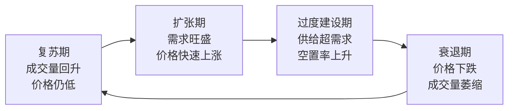
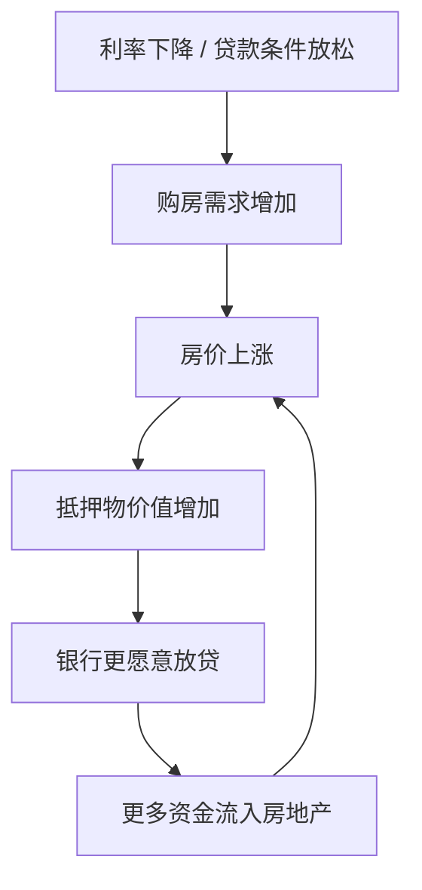
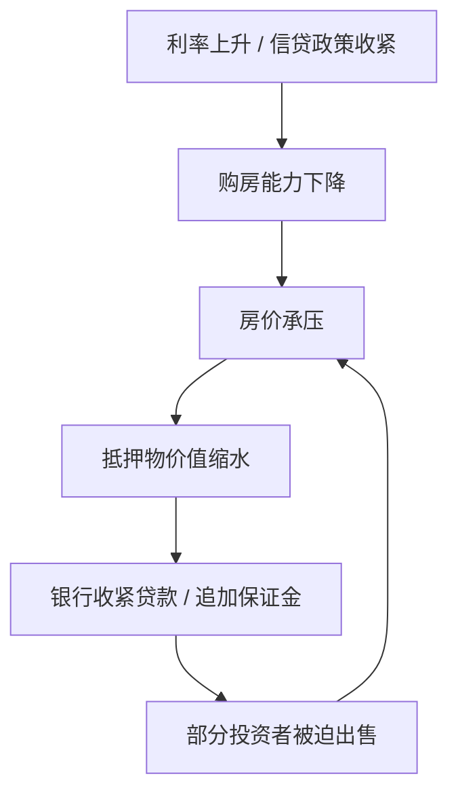
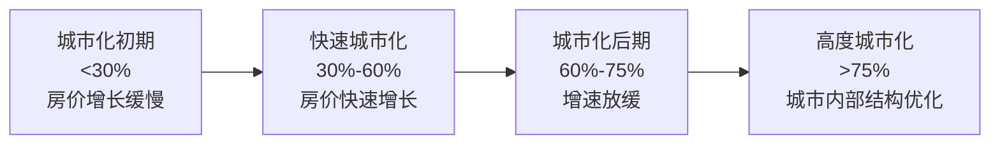

# 第七章 深度拓展：房地产投资的进阶理论与实践

房地产投资不是简单的"买涨卖跌"。要在这一领域持续获利，投资者需要建立系统性的分析框架——从宏观周期的判断，到微观估值的精算，从境内到跨境的视野，从政策博弈到税务筹划。本章将从六个核心维度展开，帮助你构建完整的房地产投资认知体系。

---

## 一、房地产周期理论

理解周期是房地产投资的第一课。任何一处房产的价格都不是孤立存在的——它嵌套在宏观经济周期、信贷周期、人口周期和政策周期之中。看不懂周期的投资者，本质上是在赌博。

### 1.1 库兹涅茨周期（18-25年长波）

美国经济学家西蒙·库兹涅茨（Simon Kuznets）在1930年代发现，建筑业存在约18-25年的长周期波动，后被称为"库兹涅茨周期"或"建筑周期"。这一周期的核心驱动力是**人口结构变化**——人口出生、成长、进入劳动力市场、组建家庭、购房，这一完整过程大约需要20年。

库兹涅茨周期的四个阶段：

**复苏期（3-5年）**：市场从底部回升，成交量开始增加，但价格仍在低位。这一阶段的核心特征是"量升价稳"——最先回暖的不是价格，而是成交量。聪明的投资者在这一阶段悄然入场。

**扩张期（5-8年）**：需求旺盛，价格快速上涨，新开发项目大量增加。开发商信心恢复，银行贷款条件放松，购房者开始恐慌性入市。这一阶段最容易产生"买到就是赚到"的错觉。

**过度建设期（3-5年）**：供给超过需求，空置率开始上升，但惯性使建设继续。由于房地产开发周期长（从拿地到交付通常2-3年），即使需求已经开始下降，之前立项的项目仍在源源不断地入市。这是周期中最具欺骗性的阶段——价格可能仍在高位，但基本面已经开始恶化。

**衰退期（3-7年）**：价格下跌，成交量萎缩，市场进入深度调整。开发商资金链断裂、烂尾楼出现、银行坏账增加。这一阶段往往伴随着信贷紧缩和经济下行，形成负反馈循环。

**为什么18-25年这个时间跨度很重要？** 因为它意味着一个投资者的职业生涯中可能只会经历3-4个完整的房地产周期。错过一个周期的底部入场窗口，可能要再等近20年。

### 1.2 霍伊特的房地产周期理论

霍伊特（Homer Hoyt）通过对芝加哥100多年房地产数据的研究，提出了房地产周期的18个阶段理论。他的核心发现至今仍是房地产研究的基石：

**房价的不对称运动**：房价上涨通常是渐进的——每年涨5%-10%，持续多年；但下跌往往是剧烈的——一年内可能跌去15%-30%。这种不对称性意味着：持有房产的"舒适区"很长，但"恐慌期"很短且很猛。

**周期驱动力的层次**：霍伊特将驱动力分为三层：
- 第一层：人口增长和收入提高（基本面）
- 第二层：信贷扩张和利率变化（金融条件）
- 第三层：投机心理和羊群效应（市场情绪）

在周期的不同阶段，主导驱动力不同。早期由基本面驱动，中期由金融条件驱动，晚期由市场情绪驱动。当一个市场的驱动力已经从第一层切换到第三层时，泡沫化风险急剧上升。

**过度投机的识别信号**：霍伊特总结了周期顶点的典型特征——
- 投资者不再关心租金回报率，只期待资本增值
- 新闻媒体频繁报道"某某通过炒房赚了多少"
- 非专业人士大量涌入市场
- 开发商同时启动大量新项目
- 贷款标准明显放松，零首付、低门槛产品增多

### 1.3 弗雷德·哈里森的18年周期模型

英国房地产经济学家弗雷德·哈里森（Fred Harrison）在《繁荣与萧条》（*Boom and Bust*）一书中提出了更具操作性的18年周期模型。他通过对英国200多年、美国100多年房价数据的回测，发现房地产周期具有惊人的规律性。

哈里森模型的五个阶段：

| 阶段 | 年份 | 市场特征 | 投资者行为 | 关键指标 |
|:---:|:---:|:---|:---|:---|
| 触底反弹 | 1-3年 | 价格企稳，成交量缓慢恢复 | 极少数先知先觉者入场 | 空置率开始下降 |
| 恢复增长 | 4-7年 | 基本面改善，价格温和上涨 | 机构投资者开始配置 | 租金回报率改善 |
| 稳定增长 | 8-12年 | 市场信心增强，开发活跃 | 主流投资者跟进 | 新开工面积增长 |
| 投机狂热 | 13-15年 | 价格脱离基本面，杠杆率飙升 | 散户大量涌入，投机盛行 | 房价收入比创新高 |
| 崩溃调整 | 16-18年 | 过度供给，价格暴跌 | 恐慌性抛售 | 法拍房激增 |

**哈里森模型的实战意义**：投资者不需要精确预测周期的顶点和底部，只需要判断"我们大概处于周期的哪个阶段"。如果市场已经进入投机狂热期（第13-15年），即使你认为还能涨，也应该开始逐步减仓；如果市场处于触底反弹期（第1-3年），即使看起来很惨淡，也应该开始建仓。

**对中国的启示**：如果以1998年住房商品化改革为起点，中国房地产市场在2015-2018年可能已经经历了哈里森模型中的投机狂热阶段。2020年以来的调整，可能对应着崩溃调整期的开始。但这并不意味着所有城市都在同步调整——一线城市和三四线城市可能处于周期的不同位置。

### 1.4 信贷周期与房地产周期的互动

房地产是典型的"信贷密集型"资产。一套房产的购买中，通常60%-80%的资金来自银行贷款。这意味着信贷条件的松紧直接决定了房地产市场的温度。

**正反馈循环（上行期）**：

**负反馈循环（下行期）**：

**明斯基时刻**：经济学家海曼·明斯基（Hyman Minsky）提出的概念——在长期稳定中，市场参与者的风险偏好会逐步提高，从"对冲性融资"（收入覆盖本息）到"投机性融资"（收入只覆盖利息）再到"庞氏融资"（收入连利息都不够，靠资产升值维持），直到某一刻系统崩溃。2008年美国次贷危机就是经典的明斯基时刻。

**识别信贷周期拐点的关键指标**：
- **M2增速与房价增速的关系**：当房价增速持续超过M2增速时，说明房价上涨已经开始依赖杠杆而非流动性
- **居民杠杆率**：居民债务/GDP比率，国际警戒线通常在65%左右
- **房贷利率走势**：连续加息往往是周期转向的先行信号
- **首付比例变化**：首付比例上调是政策层面的明确收紧信号

### 1.5 中国房地产周期的独特性

中国房地产市场并非完全遵循西方周期理论，它有自身的独特逻辑：

**政策周期主导**：中国政府对房地产市场的调控力度远超西方国家。限购、限贷、限售、限价——这些行政手段可以直接冻结市场交易。"调控-放松-再调控"的循环本身就是一种中国特色的短周期（通常3-5年）。

**土地供应垄断**：地方政府垄断城市建设用地供应，通过控制供地节奏来影响市场。土地财政模式下，地方政府有推高地价的内在动机，这与中央政府"稳房价"的目标存在矛盾。

**预售制度**：中国的商品房预售制度（期房销售）放大了周期波动——上行期开发商大量拿地预售，下行期出现烂尾风险。2022年的"停贷潮"就是预售制度风险的集中暴露。

**城市群分化**：中国房地产市场不是一个统一市场，而是高度分化的多个市场。一线城市、强二线城市、弱二线城市、三四线城市、县城——它们的供需基本面、人口趋势、产业支撑完全不同，不能用同一个周期框架来分析。

**关键数据参考**：
- 中国城镇化率（2023年）：约66%，仍在上升但增速放缓
- 居民杠杆率（2023年）：约63%，接近国际警戒线
- 住房存量：城镇人均住房面积约40平方米，总量已不短缺
- 人口拐点：2022年中国人口首次出现负增长，长期住房需求承压

---

## 二、REITs投资详解

对于不想直接持有房产、但又想分享房地产收益的投资者来说，REITs是最成熟的工具。理解REITs不仅是学习一种投资产品，更是理解"如何用金融工具解构和重组房地产收益"。

### 2.1 REITs的基本概念与运作机制

REITs（Real Estate Investment Trusts，房地产投资信托基金）的运作逻辑是：将多个投资者的资金汇集起来，由专业团队投资和管理房地产资产，产生的租金收入和资产增值收益按比例分配给投资者。

REITs的核心特征：

| 特征 | 说明 | 对投资者的意义 |
|:---|:---|:---|
| 强制分红 | 通常要求将90%以上应税收入分红 | 提供稳定现金流，类似"收租" |
| 流动性 | 在证券交易所上市，T+1交易 | 随时可以买卖，不像实物房产需要数月 |
| 专业管理 | 由专业团队负责资产运营 | 个人投资者无需操心物业管理和租户问题 |
| 税收穿透 | 在很多国家享有税收优惠 | 避免了公司层面和投资者层面的双重征税 |
| 低门槛 | 一手最低通常几百到几千元 | 普通投资者也能参与大宗商业地产投资 |

**REITs与直接持有房产的本质区别**：直接持有房产是"经营性资产"——你需要找租客、维修房屋、处理纠纷；REITs是"金融性资产"——你持有的是份额，所有经营事务由管理团队处理。两者的风险收益特征完全不同。

### 2.2 REITs的分类体系

**按投资方式分类**：

| 类型 | 投资标的 | 收益来源 | 风险特征 | 代表产品 |
|:---|:---|:---|:---|:---|
| 权益型REITs | 直接拥有房地产资产 | 租金+资产增值 | 与房地产市场高度相关 | 大部分上市REITs |
| 抵押型REITs | 房地产抵押贷款/MBS | 贷款利息 | 受利率影响大，类似债券 | 美国Annaly Capital |
| 混合型REITs | 兼具以上两种 | 租金+利息 | 风险分散 | 少数综合性REITs |

**按物业类型分类**（每种类型的经济逻辑不同）：

**办公楼REITs**：收益与经济周期高度相关。经济繁荣时企业扩张、租金上涨；经济衰退时企业收缩、空置率上升。核心城市的甲级办公楼通常有更好的抗跌性。典型产品：美国的Boston Properties。

**零售物业REITs**：受电商冲击最大。购物中心需要不断调整业态，增加体验式消费（餐饮、娱乐、教育）来吸引客流。社区商业（邻里中心）比大型购物中心更抗周期。典型产品：美国的Simon Property Group。

**物流/工业REITs**：近年来表现最好的细分领域。电商的高速增长推动了仓储物流需求。现代化物流园区的租金回报率通常高于办公楼和零售物业。典型产品：美国的Prologis。

**住宅REITs**：投资于出租型公寓。受益于"买不起房就租房"的社会趋势，在高房价城市需求稳定。典型产品：美国的AvalonBay Communities。

**数据中心REITs**：云计算和AI时代的"数字地产"。数据中心的建设和运营门槛高，租户通常签订长期合同（5-10年），现金流稳定。典型产品：美国的Equinix。

**医疗保健REITs**：投资于医院、养老院、医疗办公楼。受益于人口老龄化趋势，需求增长确定性强。典型产品：美国的Welltower。

**通信塔REITs**：投资于无线通信基站塔。5G建设带来持续需求，租户是大型电信运营商，违约风险低。典型产品：美国的American Tower。

### 2.3 REITs的估值方法

REITs估值与普通股票不同——它需要同时考虑资产价值和运营能力。

**NAV（净资产价值）法**：

NAV = 所有资产的公允市场价值之和 - 总负债

NAV是REITs估值的"锚"。当REITs的市场价格低于NAV（即折价交易），意味着你可以用低于资产实际价值的价格买入；当市场价格高于NAV（即溢价交易），市场在为管理能力或增长预期支付溢价。

计算NAV的步骤：
1. 估算每处物业的市场价值（通常用NOI/Cap Rate）
2. 加总所有物业价值
3. 加上现金和其他资产
4. 减去所有负债
5. 除以总份额数，得到每份NAV

**FFO（运营资金）法**：

FFO = 净利润 + 折旧摊销 - 资产出售收益

FFO是REITs特有的盈利指标。为什么要加回折旧？因为房地产的折旧是会计处理，不代表实际现金流出——建筑的实际价值通常不会因为折旧而下降，甚至可能上升。P/FFO类似于股票的PE比率，用于横向比较不同REITs的估值高低。

**AFFO（调整后运营资金）法**：

AFFO = FFO - 经常性资本支出（维护、装修等）

AFFO比FFO更接近真实的可分配现金流。一个FFO很高但AFFO很低的REITs，可能需要大量资本支出来维持物业品质，实际可分红的金额有限。

**股息率比较法**：

将REITs的股息率与以下基准比较：
- 10年期国债收益率：如果REITs股息率远高于国债，说明REITs有配置价值
- 同类型REITs的平均股息率：如果显著高于同类，可能是价格被低估，也可能是基本面有问题
- 历史平均股息率：如果当前股息率高于历史均值，可能存在买入机会

### 2.4 中国公募REITs市场

2021年6月，中国首批9只基础设施公募REITs在沪深交易所上市，标志着中国公募REITs正式破冰。

**中国REITs与国际REITs的关键差异**：

| 对比维度 | 中国公募REITs | 国际成熟REITs |
|:---|:---|:---|
| 底层资产 | 以基础设施为主（高速公路、仓储物流、产业园、污水处理等） | 以商业地产为主（办公楼、商场、公寓等） |
| 投资方式 | 80%以上资产投资于ABS（资产支持证券） | 直接持有物业产权 |
| 分红要求 | 强制分配90%以上可供分配金额 | 类似要求 |
| 税收政策 | 尚未建立完整的税收穿透制度 | 多数国家有明确的税收优惠 |
| 市场规模 | 总市值约1000亿元人民币 | 美国市场超1万亿美元 |
| 物业类型 | 暂不含住宅和商业地产 | 覆盖所有物业类型 |

**中国REITs的投资要点**：

1. **关注底层资产质量**：高速公路看车流量趋势，仓储物流看出租率和租金增长，产业园看产业集聚度
2. **评估运营管理能力**：同样的资产，不同的运营团队可能带来截然不同的回报
3. **注意估值合理性**：部分中国REITs上市初期存在溢价交易，需要回归NAV估值
4. **关注扩募机会**：优质REITs可能通过扩募收购新资产，为投资者带来增长
5. **警惕流动性风险**：中国REITs市场尚处早期，部分产品日均成交量较低

### 2.5 REITs投资策略

**核心-卫星配置法**：
- 核心仓位（60%-70%）：配置分散型REITs ETF或指数基金，获取房地产市场的整体收益
- 卫星仓位（30%-40%）：精选2-3个看好的细分领域（如物流、数据中心），集中配置

**利率周期策略**：
REITs与利率的关系较为复杂。理论上，利率上升对REITs不利（融资成本上升、债券吸引力增加），但实际上，在经济复苏带动的加息周期中，REITs往往表现良好（因为租金增长超过了利率上升的负面影响）。真正对REITs造成打击的是"非预期的快速加息"。

**逆向投资策略**：
当某一细分类型的REITs因行业恐慌而大幅折价时（如2020年疫情期间的零售物业REITs），如果判断恐慌是暂时性的，可以逆向买入。

---

## 三、房产估值方法

估值是房地产投资的核心能力。买入价格过高，即使选对了城市和地段，也可能长期亏损。本节系统介绍四种主流估值方法及其适用场景。

### 3.1 市场比较法

市场比较法是最直观、最常用的方法，逻辑是"类似房产卖了多少钱，我的房产就值多少钱"。

**操作步骤**：

1. **选取可比案例**：选择3-5个近期（6个月内）成交的类似房产。类似性要求：同一板块、相似面积（差异不超过20%）、相似楼层、相似装修标准
2. **建立修正体系**：对每个可比案例进行多维度修正
3. **计算评估值**：综合修正后的价格取加权平均

**修正因素与修正幅度参考**：

| 修正因素 | 修正内容 | 典型修正幅度 |
|:---|:---|:---|
| 位置差异 | 同一板块内不同小区、临街vs内部 | ±5%-15% |
| 面积差异 | 每增加/减少10平方米 | ±2%-3% |
| 楼层差异 | 中间楼层最优，顶层/底层折价 | ±3%-8% |
| 装修差异 | 精装vs毛坯、装修年限 | ±5%-20% |
| 交易时间 | 市场涨跌的时间差 | 按月均涨幅修正 |
| 交易条件 | 正常交易vs急售/法拍 | ±5%-30% |
| 朝向差异 | 南向最优，北向/西晒折价 | ±3%-8% |
| 景观差异 | 河景/公园vs无景观 | ±5%-15% |

**实战案例**：假设你要评估一套89平方米、中间楼层、南向、精装修的三居室。

可比案例A：同小区同户型，85平方米，低楼层，精装，3个月前成交价320万
- 面积修正：+4平方米 × 2% = +8%
- 楼层修正：低楼层折价 = +5%
- 时间修正：近3个月市场上涨2% = -2%（可比案例成交时更便宜，需要上调）
- 修正后价格：320 × (1+8%) × (1+5%) × (1-2%) = 350.1万

可比案例B：同板块相邻小区，92平方米，高楼层，简装，2个月前成交价310万
- 面积修正：-3平方米 × 2% = -6%
- 楼层修正：高楼层 = -3%
- 装修修正：简装vs精装 = +10%
- 时间修正：近2个月上涨1% = -1%
- 修正后价格：310 × (1-6%) × (1-3%) × (1+10%) × (1-1%) = 316.8万

可比案例C：同板块另一小区，88平方米，中间楼层，精装，1个月前成交价340万
- 面积修正：+1平方米 × 2% = +2%
- 楼层修正：相同 = 0%
- 装修修正：相同 = 0%
- 时间修正：近1个月上涨0.5% = -0.5%
- 修正后价格：340 × (1+2%) × (1-0.5%) = 345.1万

最终评估值 = (350.1 × 0.3 + 316.8 × 0.3 + 345.1 × 0.4) = **337.8万元**

**市场比较法的局限**：在市场交易清淡时难以找到足够的可比案例；对非标准化物业（如独栋别墅、历史建筑）适用性较差；修正系数的确定带有主观性。

### 3.2 收益法

收益法的核心逻辑是"房产值多少钱取决于它能赚多少钱"，适用于出租型房产和商业地产的估值。

**直接资本化法**：

V = NOI / Cap Rate

其中：
- V = 房产价值
- NOI = 净运营收入（年租金收入 - 运营费用，不含贷款利息和折旧）
- Cap Rate = 资本化率（反映市场对该类房产的风险定价）

**NOI的计算示例**：

| 项目 | 金额（元/年） |
|:---|---:|
| 潜在租金收入 | 120,000 |
| - 空置损失（5%） | -6,000 |
| = 有效租金收入 | 114,000 |
| - 物业管理费 | -12,000 |
| - 维修基金 | -3,600 |
| - 保险费 | -2,000 |
| - 房产税（假设） | -6,000 |
| - 其他运营费用 | -2,400 |
| = NOI | 90,000 |

如果市场Cap Rate为4.5%，则该房产估值 = 90,000 / 4.5% = **200万元**。

**Cap Rate的含义与取值**：

Cap Rate本质上是投资者对该房产要求的"无杠杆收益率"。Cap Rate越低，说明市场愿意为该房产支付更高的价格（即认为该房产更安全、更有增值潜力）。

典型Cap Rate范围（中国一线城市参考）：
- 核心商圈甲级办公楼：3.5%-4.5%
- 成熟社区商铺：4%-6%
- 物流仓储：5%-7%
- 长租公寓：4%-6%
- 产业园区：5%-7%

**收益还原法（DCF法）**：

当预期未来现金流不均匀时，需要用折现现金流法：

V = Σ [NOIₜ / (1+r)ᵗ] + TV / (1+r)ⁿ

其中：
- NOIₜ = 第t年的净运营收入
- r = 折现率（反映投资风险和资金成本）
- TV = 期末退出价值（通常用Cap Rate反推）
- n = 持有年限

**DCF估值示例**：假设投资一处商业地产，持有5年，预计各年NOI和退出价值如下：

| 年份 | NOI（万元） | 折现因子（r=8%） | 现值（万元） |
|:---:|---:|---:|---:|
| 1 | 90 | 0.926 | 83.3 |
| 2 | 95 | 0.857 | 81.4 |
| 3 | 100 | 0.794 | 79.4 |
| 4 | 103 | 0.735 | 75.7 |
| 5 | 106 | 0.681 | 72.2 |
| 退出价值 | 2,350 | 0.681 | 1,599.4 |
| **合计** | | | **1,991.4** |

该商业地产的估值约为**1,991万元**。如果市场售价低于这个数字，说明投资有正的净现值（NPV），值得考虑。

### 3.3 成本法

成本法的逻辑是"重建这个房产需要花多少钱"，适用于特殊用途房产、新建房产或市场交易数据不足的情况。

**计算公式**：房产价值 = 土地价值 + 建筑物重置成本 - 各类折旧

**建筑物重置成本的构成**：

| 成本项 | 占比参考 | 说明 |
|:---|:---:|:---|
| 建筑安装成本 | 55%-65% | 结构、装修、设备安装 |
| 前期工程费 | 3%-5% | 勘察、设计、三通一平 |
| 基础设施配套 | 8%-12% | 道路、管网、绿化 |
| 专业费用 | 3%-5% | 设计、监理、咨询 |
| 管理费用 | 2%-4% | 项目管理、行政开支 |
| 融资成本 | 5%-8% | 建设期贷款利息 |
| 开发商利润 | 8%-15% | 合理利润空间 |

**折旧的三重含义**：

1. **物理折旧**：建筑构件的自然老化。住宅的设计使用年限通常为50年（钢筋混凝土结构），但实际影响价值的主要是可见的老化程度——外墙渗水、管线老化、电梯故障率等。每年物理折旧率通常在1.5%-2.5%。

2. **功能折旧**：设计标准落后于时代。例如，20年前的户型可能没有干湿分离、没有预留中央空调位置、车位配比不足。功能折旧在住宅中影响相对较小（因为可以通过装修弥补），但在商业地产中影响显著（商场的动线设计过时很难改造）。

3. **经济折旧（外部性折旧）**：周边环境变化导致的价值下降。例如，旁边新建了垃圾处理厂、高架桥噪音、学校搬迁等。这种折旧完全不受业主控制，是最难防范的。

### 3.4 假设开发法

假设开发法适用于待开发土地或在建项目的估值，逻辑是"开发完成后值多少钱，减去所有开发成本和利润，就是土地/项目现在的价值"。

**计算公式**：开发价值 = 完成后总价值 - 建安成本 - 基础设施配套 - 专业费用 - 管理费用 - 财务费用 - 销售费用 - 税费 - 开发商合理利润

**实战案例**：评估一块住宅用地

- 规划建筑面积：50,000平方米
- 预计建成后销售均价：25,000元/平方米
- 完成后总价值：12.5亿元

成本扣除：

| 成本项 | 单价（元/m²） | 总额（万元） |
|:---|---:|---:|
| 建安成本 | 4,500 | 22,500 |
| 基础设施配套 | 800 | 4,000 |
| 专业费用（设计、监理） | 200 | 1,000 |
| 管理费用 | 150 | 750 |
| 财务费用（融资利息） | 600 | 3,000 |
| 销售费用（2.5%） | 625 | 3,125 |
| 税费（增值税及附加、土增税等） | 2,000 | 10,000 |
| 开发商利润（10%） | 2,500 | 12,500 |
| **合计** | **11,375** | **56,875** |

土地估值 = 125,000 - 56,875 = **68,125万元（约6.81亿元）**
楼面地价 = 68,125 / 50,000 = **13,625元/平方米**

如果该地块的起拍楼面价低于13,625元/m²，开发商才有合理的利润空间。

### 3.5 影响房产价值的关键因素矩阵

不同因素对房产价值的影响程度不同，投资者需要建立优先级意识：

| 因素类别 | 具体因素 | 影响权重 | 可变性 | 投资建议 |
|:---|:---|:---:|:---:|:---|
| 区位 | 城市能级 | ★★★★★ | 不可变 | 选对城市是最大的alpha |
| 区位 | 板块/地段 | ★★★★★ | 极缓慢 | 核心地段长期保值 |
| 区位 | 交通便利性 | ★★★★ | 可改善 | 关注地铁规划 |
| 区位 | 教育资源 | ★★★★ | 缓慢变化 | 学区房政策风险增大 |
| 区位 | 商业配套 | ★★★ | 可改善 | 成熟配套>规划中的配套 |
| 物业 | 户型设计 | ★★★ | 不可变 | 好户型是硬通货 |
| 物业 | 楼栋位置 | ★★★ | 不可变 | 小区内中间位置优于临街 |
| 物业 | 物业管理 | ★★★ | 可更换 | 好物业对房价有5%-10%溢价 |
| 物业 | 建筑品质 | ★★★ | 不可变 | 选择口碑好的开发商 |
| 市场 | 供求关系 | ★★★★★ | 动态变化 | 关注库存去化周期 |
| 市场 | 利率水平 | ★★★★ | 周期性变化 | 低利率是买房的好时机 |
| 政策 | 限购限贷 | ★★★★ | 政策调整 | 政策放松窗口期要把握 |

---

## 四、城市化进程与房价关系

### 4.1 城市化率与房价的一般规律

国际经验表明，城市化率与房价之间存在非线性的正相关关系，但"拐点"的位置因国家而异。

**快速城市化阶段（30%-60%）是房价上涨的"黄金期"**。这一阶段每年有大量农村人口涌入城市，住房需求呈现"井喷式"增长。中国在2000-2020年恰好处于这一阶段，这也是中国房价涨幅最大的时期。

**城市化后期（60%-75%）的关键变化**：城市化从"量的扩张"转向"质的提升"。新增城市人口减少，但人们对居住品质的要求提高——从小房子换大房子、从老城区搬到新城区、从普通住宅升级到改善型住宅。这一阶段的房价增长更多由"改善性需求"驱动。

**高度城市化阶段（75%以上）**：以美国、日本、欧洲为代表。房价增长主要受利率、收入增长和城市内部更新驱动。核心城市（如纽约、东京、伦敦）的房价仍然可以长期上涨，但中小城市可能长期停滞。

### 4.2 中国城市化的独特路径

中国城市化有几个其他国家不具备的特征，这些特征深刻影响了房地产市场：

**速度快**：中国用40年（1980-2020年）将城市化率从20%提升到64%，而英国用了100年、美国用了80年完成类似幅度的提升。快速城市化意味着住房需求集中释放，也意味着市场调整可能同样剧烈。

**户籍制度约束**：中国的城市化存在"半城市化"问题——大量在城市工作的人口并未获得城市户籍，他们的住房需求被部分抑制。户籍制度改革的推进速度将影响未来的住房需求释放。

**土地财政模式**：地方政府垄断城市建设用地供应，通过"招拍挂"出让土地获取财政收入。这一模式导致了两个后果：一是地价被人为推高，二是地方政府有推高地价的内在动机。土地成本通常占房价的30%-60%。

**城市群格局**：中国城市化正在从"单个城市扩张"转向"城市群协同发展"。主要城市群的人口和经济集中度持续提升，城市群内部的房价梯度正在形成。

**三大城市群房价对比**（2023年参考数据）：

| 城市群 | 核心城市均价（元/m²） | 周边城市均价（元/m²） | 梯度比 | 产业特征 |
|:---|---:|---:|:---:|:---|
| 京津冀 | 60,000+ | 8,000-15,000 | 4:1-7:1 | 政治中心、科技创新 |
| 长三角 | 50,000+ | 10,000-25,000 | 2:1-5:1 | 制造业、金融、互联网 |
| 粤港澳大湾区 | 70,000+ | 8,000-20,000 | 3:1-9:1 | 高端制造、金融、贸易 |

### 4.3 人口流动与房价分化

中国房地产市场最深刻的变化是"分化"——不再是普涨普跌的时代，而是"有的城市涨、有的城市跌"的结构性分化。

**人口流入城市的特征**：
- 产业基础好：有大量就业机会，尤其是高薪岗位
- 人口持续净流入：常住人口大于户籍人口
- 小学生人数增长：反映年轻家庭的迁入（比常住人口数据更真实）
- 土地供应有限：核心区域可供开发的土地越来越少
- 代表城市：深圳、杭州、成都、长沙等

**人口流出城市的特征**：
- 产业单一或衰退：资源枯竭型城市、传统重工业城市
- 人口持续净流出：年轻人外流，老龄化加速
- 小学生人数下降：反映家庭在"用脚投票"
- 住房库存高企：去化周期超过24个月
- 代表城市：部分东北城市、中西部三四线城市

**判断城市人口趋势的实操指标**：

1. **小学生人数变化率**：这是最真实的"用脚投票"数据。小学生增长意味着年轻家庭在迁入，下降意味着在迁出。数据来源：各市教育局公报。
2. **地铁客运量**：地铁客运量增长反映城市活力。数据来源：交通运输部月度数据。
3. **企业注册数**：新注册企业数量反映创业活力和营商环境。数据来源：天眼查、企查查。
4. **高校毕业生留存率**：本地高校毕业生留在当地工作的比例，反映城市的就业吸引力。
5. **二手房挂牌量/成交量比**：如果挂牌量持续上升但成交量不升反降，说明卖压在增大。

### 4.4 城市更新与房产价值重估

城市更新是存量时代最重要的价值创造方式之一。理解城市更新的逻辑，可以帮投资者提前识别价值洼地。

**城市更新的四种模式**：

| 模式 | 适用场景 | 对房价的影响 | 周期 | 风险 |
|:---|:---|:---|:---:|:---|
| 拆旧建新 | 老旧棚户区、城中村 | 拆迁户获补偿，周边房价短期上涨 | 3-8年 | 钉子户、补偿纠纷 |
| 功能置换 | 老工业区、旧仓库 | 文创/科技园区带动区域升值 | 2-5年 | 招商不及预期 |
| 环境整治 | 老旧小区、背街小巷 | 提升居住品质，温和升值 | 1-3年 | 效果有限 |
| 综合整治 | 历史文化街区 | 文旅价值释放，可能大幅升值 | 5-10年 | 过度商业化 |

**投资者如何提前布局城市更新**：
- 关注城市更新专项规划（各市政府网站公开发布）
- 识别更新片区内的低估值房产
- 评估更新的确定性和时间表
- 注意更新过程中的持有成本（改造期间可能无法出租）

### 4.5 轨道交通与房价的定量关系

轨道交通对房价的影响已被大量学术研究量化：

**地铁效应的量化规律**：
- 地铁站500米范围内：房价溢价8%-15%
- 地铁站500-1000米范围内：房价溢价4%-8%
- 地铁站1000-1500米范围内：房价溢价2%-4%
- 超过1500米：地铁效应基本消失

**时间维度的影响**：
- 规划公布时：房价开始上涨（预期兑现前的炒作）
- 建设期间：持续上涨（利好逐步确认）
- 开通前半年-1年：达到峰值
- 开通后：涨幅可能回吐部分（利好出尽）

**不同城市、不同站点的差异**：
- 郊区新站的房价效应 > 市区成熟站点（因为郊区从"没有地铁"到"有地铁"的边际改善更大）
- 换乘站的效应 > 普通站
- 连接就业中心的线路 > 连接居住区的线路

---

## 五、海外房产投资

### 5.1 海外房产投资的核心动机

海外房产投资不是"有钱人的游戏"，而是资产配置全球化的必然选择。理解每种动机背后的逻辑，才能做出合理决策：

**风险分散**：不同国家的经济周期不同步。当中国经济下行时，美国或东南亚可能处于上升期。全球配置可以平滑单一市场的波动。这是最理性的投资动机。

**子女教育**：在子女留学目的地购房，既省了租金，又能享受房产增值。但要注意——留学通常只有3-4年，如果购房后长期空置，持有成本（房产税、物业费、保险）可能远超租金节省。

**移民/身份规划**：部分国家提供"黄金签证"——购房即可获得居留权。希腊（25万欧元起）、葡萄牙（28万欧元起）、西班牙（50万欧元起）等欧洲国家都有类似政策。但2023年以来，多国已收紧或取消此类政策。

**汇率对冲**：如果本币面临贬值压力，持有外币资产可以对冲汇率风险。但这本身也是一种汇率投机——如果本币升值，海外资产的本币价值会缩水。

**收益差异**：部分市场的租金收益率远高于中国一线城市。例如，日本东京的公寓租金收益率约5%-7%，而中国一线城市仅1.5%-2.5%。但高收益往往伴随高管理成本和高风险。

### 5.2 主要海外房产投资目的地深度分析

**东南亚市场**：

| 国家/城市 | 租金收益率 | 房价水平 | 产权制度 | 购房限制 | 核心风险 |
|:---|:---:|:---:|:---|:---|:---|
| 泰国曼谷 | 5%-7% | 2-4万/m² | 外国人可买公寓（49%份额） | 不能买土地和别墅 | 政治不确定性 |
| 越南胡志明市 | 5%-8% | 1.5-3万/m² | 外国人50年产权 | 限购1套公寓 | 产权保护不完善 |
| 马来西亚吉隆坡 | 4%-6% | 1-2.5万/m² | 永久产权（有最低价门槛） | 最低购买价100万令吉 | 市场流动性较差 |
| 柬埔寨金边 | 6%-10% | 1-2万/m² | 外国人可买二层以上 | 不能买土地 | 法律不透明、政局风险 |

**发达国家市场**：

| 国家/城市 | 租金收益率 | 购房税费 | 持有税费 | 核心优势 | 核心劣势 |
|:---|:---:|:---:|:---:|:---|:---|
| 美国（多城市） | 3%-6% | 2%-5% | 1%-3%/年 | 法律透明、流动性好 | 房产税高、管理距离远 |
| 英国伦敦 | 2%-4% | 3%-15%（累进） | Council Tax | 核心资产保值性强 | 入手门槛极高 |
| 日本东京 | 4%-7% | 6%-8% | 1.4%+0.3%/年 | 租金稳定、管理规范 | 人口长期下降 |
| 澳大利亚悉尼 | 2%-4% | 7%-8%（附加税） | 市政费+土地税 | 教育资源、生活环境 | 外国人购房限制多 |

### 5.3 海外房产投资的完整流程

海外购房不是"看中了就买"，而是一个涉及法律、税务、金融、物流的系统工程。

**第一步：目标选择（1-3个月）**
- 确定投资目的（租金收益/资产增值/教育/移民）
- 筛选目标国家和城市
- 研究当地市场数据（房价走势、租金水平、空置率）
- 咨询当地房产中介和律师

**第二步：法律准备（1-2个月）**
- 了解外国人购房的法律限制
- 聘请当地律师（这一步不能省）
- 确认产权类型和年限
- 了解购房所需的文件和手续

**第三步：资金安排（1-3个月）**
- 中国外汇管制：每人每年5万美元购汇额度
- 大额资金出境需要合法途径（已有海外账户、投资移民通道等）
- 了解目标国家的反洗钱要求
- 准备好资金证明

**第四步：购房交易（1-3个月）**
- 签订购房意向书/合同
- 支付定金（通常10%-20%）
- 律师尽职调查（产权核查、债务确认等）
- 办理过户手续
- 支付尾款

**第五步：持有管理（持续）**
- 聘请当地物业管理公司
- 购买房屋保险
- 按时缴纳房产税和其他费用
- 定期检查物业状况
- 处理租户问题

### 5.4 海外房产投资的税务筹划

海外房产涉及双重税务管辖——中国和房产所在国都可能征税。合理的税务筹划可以显著提高净收益。

**购房阶段的主要税费**：

| 国家 | 印花税/过户税 | 律师费 | 其他费用 |
|:---|:---:|:---:|:---|
| 美国 | 1%-3% | 0.5%-1% | 产权保险0.5% |
| 英国 | 3%-15%（累进） | 0.5%-1% | 土地注册费 |
| 日本 | 3%-4% | 1%-2% | 登记免许税2% |
| 泰国 | 2% | 1%-2% | 物业管理基金 |
| 澳大利亚 | 7%-8%（含附加税） | 0.5%-1% | 各州不同 |

**持有阶段的主要税费**：
- **房产税**：美国1%-3%/年，日本约1.7%/年，英国Council Tax按档征收
- **租金所得税**：通常需要在房产所在国申报和缴纳。美国对非居民房东征收30%的预扣税（可通过选择"视同居民"申报降低实际税率）
- **中国的全球征税**：中国税务居民的全球收入需要在中国申报纳税，已在境外缴纳的税款可以抵免（但需要提供完税凭证）

**出售阶段的主要税费**：
- **资本利得税**：美国对非居民出售房产征收15%-20%（FIRPTA法案），日本约20%，泰国约2%-3%
- **中国的税务义务**：出售海外房产的收益需要在中国申报，已缴境外税款可抵免

**税务筹划建议**：
1. 在投资前就咨询国际税务顾问，而不是投资后才补救
2. 充分利用中国与房产所在国的税收协定（避免双重征税）
3. 考虑通过公司架构持有（在某些情况下可以优化税负，但也有额外的公司维护成本）
4. 保留所有交易凭证和完税证明，以备中国税务机关核查
5. 关注CRS（共同申报准则）——你的海外金融资产信息会被交换回中国

---

## 六、房产税政策分析

房产税是中国房地产市场最大的"灰犀牛"——所有人都知道它迟早会来，但不知道什么时候来、力度有多大。

### 6.1 全球房产税制度对比

不同国家的房产税制度差异巨大，理解这些差异有助于预判中国可能的政策走向：

| 国家/地区 | 税种名称 | 税率 | 计税基础 | 主要用途 | 特点 |
|:---|:---|:---:|:---|:---|:---|
| 美国 | Property Tax | 1%-3% | 评估市场价值 | 教育、公共安全 | 地方财政支柱 |
| 英国 | Council Tax | 按档征收 | 1991年估值分8档 | 地方公共服务 | 单身减免25% |
| 日本 | 固定资产税 | 1.4%+0.3% | 市政评估值 | 地方财政 | 住宅用地有优惠 |
| 新加坡 | Property Tax | 0-20% | 年估算租金 | 中央财政 | 自住vs投资差别大 |
| 香港 | 差饷+地租 | 5%+3% | 应课差饷租值 | 政府运营 | 定期重估 |
| 澳大利亚 | Land Tax | 0.3%-3.75% | 土地价值 | 州政府 | 仅对投资房征收 |

**核心观察**：几乎所有成熟经济体都对房产持有征税，且房产税通常是地方政府的主要收入来源。中国是少数不对个人住房征收持有税的主要经济体之一。

### 6.2 中国房产税的演进历程

**1986年：《房产税暂行条例》**——确立了房产税的法律框架，但规定"个人所有非营业用的房产"免征。这一免征条款延续了近40年。

**2011年：上海、重庆试点**——两地对个人住房开征房产税，但力度温和：
- 上海：对新购住房征收，税率0.4%-0.6%，人均60平方米免征
- 重庆：对高档住房和外地人购买的第二套住房征收，税率0.5%-1.2%
- 实际效果：两地房产税收入占地方财政收入比例极低（不足1%），对市场影响有限

**2021年：全国人大常委会授权国务院试点**——"为进一步推进房地产税改革，授权国务院在部分地区开展房地产税改革试点工作"。但2022年以来，受房地产市场下行影响，试点工作尚未实质性推进。

**可能的试点方案框架**：

| 要素 | 预期内容 | 不确定性 |
|:---|:---|:---|
| 试点城市 | 房地产市场较成熟的一线城市和强二线城市 | 具体城市名单 |
| 征税对象 | 居住用房产（可能排除首套或设定免征面积） | 免征面积标准 |
| 计税基础 | 房产评估价值（非交易价格） | 评估方法和评估机构 |
| 税率 | 预计0.5%-1.2%（可能累进） | 具体税率档次 |
| 免征条件 | 人均免征面积40-60平方米 | 免征面积的确定方式 |

### 6.3 房产税对市场的多层次影响

**短期冲击（政策出台后1-2年）**：
- 多套房持有者可能抛售，增加市场供给
- 市场情绪恐慌，成交量短期下降
- 房价出现5%-15%的调整（取决于政策力度）
- 租赁市场租金可能上涨（部分税负转嫁）

**中期调整（2-5年）**：
- 市场逐步消化政策影响
- 投资性需求被显著抑制
- 持有成本增加导致"囤房"不再划算
- 存量房流通速度加快

**长期格局（5年以上）**：
- 房地产从"投资品"回归"消费品"
- 地方政府从"卖地收入"转向"房产税收入"
- 房价增速回归与收入增速基本同步
- 租赁市场更加成熟和规范化

### 6.4 房产税背景下的投资策略

**策略一：优化房产组合**

清理"低效资产"——租金回报率低于房产税率的房产，持有即亏损。具体操作：
- 盘点所有持有房产的租金回报率
- 计算房产税后的净回报率
- 出售净回报率为负或极低的房产
- 将资金集中到优质房产或其他资产

**策略二：提升租金收益**

如果选择继续持有，就必须让房产"跑赢"房产税：
- 精装修提升租金：投入5-10万元装修，可能带来每月500-1000元的租金提升
- 优化租赁方式：长租改短租（民宿），可能收益翻倍但管理成本增加
- 提升物业服务：好的物业管理能提升租客满意度，降低空置率

**策略三：跨资产配置**

将部分房产资金配置到不受房产税影响的资产：
- REITs（已经通过底层资产缴纳了房产税，投资者层面不再重复缴纳）
- 股票/基金
- 债券
- 黄金

**策略四：等待政策明确后再决策**

如果你对房产税的具体政策无法判断，最安全的策略是等待：
- 保持现金储备，等待政策落地后的市场调整机会
- 在恐慌性抛售中低价买入优质资产

---

## 七、常见误区与纠正

### 误区一："房地产永远涨"

**真相**：没有任何资产"永远涨"。日本东京房价从1991年到2012年跌了60%以上；美国房价在2008年金融危机中平均跌了30%。中国的"永远涨"神话建立在过去20年快速城市化的特殊背景下，这个背景正在改变。

### 误区二："租金回报率低没关系，靠房价升值就行"

**真相**：这是典型的投机思维。当租金回报率低于无风险利率（如国债收益率）时，意味着房价已经被高估——你持有的资产产生的现金流还不如把钱存银行。长期来看，房价增速终将回归租金增速和收入增速。

### 误区三："海外房产一定比国内好"

**真相**：海外房产面临汇率风险、法律风险、管理风险和信息不对称风险。很多在国内看起来"收益率更高"的海外房产，扣除各种隐性成本（空置期、维修费、管理费、税费）后，实际收益可能并不理想。

### 误区四："房产税会让房价暴跌"

**真相**：从国际经验看，房产税对房价有抑制作用，但不会导致暴跌。美国每年征收1%-3%的房产税，房价长期仍然上涨。房产税的影响取决于税率高低、免征条件和市场供需状况。

### 误区五："只看房价不看持有成本"

**真相**：房产的真实收益 = 资产增值 + 租金收入 - 持有成本。持有成本包括：贷款利息、物业费、维修基金、保险费、房产税（未来）、空置期损失。很多看似"赚钱"的房产投资，扣除所有持有成本后实际上是亏损的。

---

## 本章总结

本章从六个核心维度构建了房地产投资的进阶认知体系：

**周期判断**：理解库兹涅茨周期、霍伊特理论和哈里森模型，把握房地产市场的长波规律。关键是判断"我们处于周期的什么位置"，而不是精确预测拐点。

**投资工具**：REITs为普通投资者提供了参与商业地产投资的通道，理解NAV、FFO、AFFO等估值指标是REITs投资的基本功。

**估值能力**：市场比较法、收益法、成本法和假设开发法各有适用场景。收益法中的Cap Rate和DCF是最核心的投资决策工具。

**城市化趋势**：中国房地产市场正在从"普涨"转向"分化"。选对城市比选对房子更重要。人口流动方向是判断城市房价长期趋势的关键指标。

**全球视野**：海外房产投资是资产配置全球化的工具，但需要充分认识汇率、法律、税务和管理等风险。

**税务筹划**：房产税的到来只是时间问题。提前优化资产结构、提升资产收益效率、做好跨资产配置，是应对房产税的务实策略。

在当前中国房地产市场深度调整的背景下，投资者需要建立"概率思维"而非"确定性思维"——没有100%正确的判断，只有风险收益比合理的决策。保持理性、控制杠杆、分散配置、长期持有优质资产，是穿越周期的不变法则。
