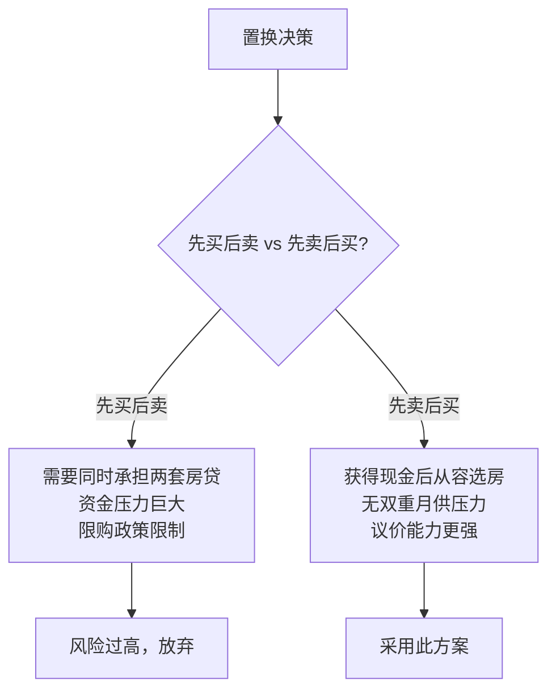
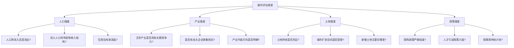

## 案例一：一线城市长期持有——深圳的故事

### 案例背景

深圳是中国房地产市场最具代表性的城市之一。作为改革开放的前沿阵地和科技创新中心，深圳的土地面积仅约 1997 平方公里，不到北京的八分之一、上海的三分之一，却承载着超过 1700 万常住人口，人口密度位居全国前列。人多地少的格局决定了深圳房地产市场的基本面——供给长期受限，需求持续旺盛。

本案例以 2010-2025 年的时间跨度，记录一位普通职场人（化名"陈工"）在深圳长期持有房产的真实经历。陈工并非富二代或投资大佬，而是一位月薪 8000 元起步的软件工程师，通过审慎决策、长期持有和适时优化，实现了家庭资产的跨越式增长。

#### 为什么选深圳作为长期持有的一线城市样本

选择深圳而非北京、上海、广州，有以下几个关键原因：

| 维度 | 深圳 | 北京 | 上海 | 广州 |
|------|------|------|------|------|
| 土地面积 | 1997km² | 16410km² | 6341km² | 7434km² |
| 常住人口 | ~1760万 | ~2180万 | ~2480万 | ~1880万 |
| 人口净流入（近10年） | 持续正流入 | 政策疏解 | 相对稳定 | 正流入 |
| 产业结构 | 科技+金融 | 政治+科技+教育 | 金融+贸易+制造 | 商贸+制造 |
| 平均购房年龄 | ~32岁 | ~35岁 | ~34岁 | ~30岁 |
| 住房自有率 | ~23% | ~70% | ~67% | ~55% |
| 土地供给趋势 | 持续稀缺 | 有新增 | 有新增 | 相对充足 |

深圳住房自有率全国最低，意味着大量潜在购买力尚未释放。同时，深圳的科技产业聚集效应（腾讯、华为、大疆、比亚迪等）持续吸引高收入年轻人才，为房价提供了坚实的购买力支撑。

---

### 执行过程：从首套到资产优化的完整路径

#### 第一阶段：首套房购入（2010年）

##### 购房决策过程

2010 年，陈工在深圳工作三年，月薪从 8000 元涨到了 12000 元，手头积蓄约 15 万元。当时他面临的选择是：

- **选项 A**：继续租房，攒更多钱再说
- **选项 B**：在关外（宝安、龙岗等区域）购入小户型
- **选项 C**：借钱凑首付在关内（南山、福田）购入

陈工最终选择了选项 B，在宝安区西乡购入了一套 60 平米的两居室。决策逻辑如下：

**价格与首付计算：**

```text
房屋总价：约 90 万元（单价 1.5 万/平米）
首付比例：首套 30%
首付金额：27 万元
自有资金：15 万元
借款缺口：12 万元（向亲友借款）
贷款金额：63 万元
贷款利率：基准利率 6.14%（2010年）
月供（等额本息 30 年）：约 3835 元
月供占收入比：3835 / 12000 ≈ 32%
```

**选址考量：**

陈工没有选择"最好的地段"，而是选择了"通勤可接受、价格可承受、有成长空间"的区域。具体分析：

- 西乡靠近地铁 1 号线延长线（当时规划中），通车后通勤到科技园约 40 分钟
- 周边有旧改预期，城市更新项目已在规划
- 片区配套逐步完善，有新建学校和商业体
- 与关内价差明显，同样的总价在南山只能买 30 平米

##### 首套房购入的关键教训

**教训一：不要等"攒够了"再买。** 2010 年深圳均价约 1.5-2 万/平米，到 2015 年已翻倍。如果陈工选择攒钱到 2015 年，同样的预算只能买到一半面积。

**教训二：首套房的核心是"上车"而非"完美"。** 很多人在首套房上纠结学区、朝向、楼层，错过最佳入市时机。首套房的本质是锁定资产价格，后续可以通过置换优化。

**教训三：月供占比控制在 30%-40% 是安全线。** 超过 40% 会严重影响生活质量和抗风险能力。陈工 32% 的月供占比留出了应对突发状况的余地。

---

#### 第二阶段：持有期的资产增值与现金流管理（2010-2015年）

##### 持有成本分析

很多人只看房价涨了多少，忽略了持有成本。陈工在这五年间的实际持有成本如下：

```text
月供支出：3835 元 × 60 个月 = 230,100 元
物业费：2.5 元/平米 × 60 平米 × 60 个月 = 9,000 元
维修基金等杂费：约 3,000 元
装修（入住时一次性）：约 80,000 元
────────────────────────
五年总持有成本：约 322,100 元
```

##### 资产增值情况

```text
2010 年购入价：90 万元
2015 年市场估值：约 220 万元（西乡片区均价约 3.6 万/平米）
五年增值：130 万元
扣除持有成本后的净增值：约 98 万元
杠杆收益率：98 万 / 27 万（首付）≈ 363%
```

这就是房地产杠杆的核心魔力——用 27 万本金撬动了 130 万的增值。当然，杠杆是双刃剑，下跌时同样会放大亏损，这在后面的"风险警示"部分会详细讨论。

##### 持有期的现金流管理策略

陈工在持有期并非"买了就不管"，而是做了几件关键的事：

1. **加速还贷策略**：每年年终奖拿出 30%-50% 用于提前还贷。到 2015 年，贷款余额已从 63 万降至约 48 万，节省了大量利息。

2. **职业发展与收入增长**：五年间月薪从 12000 元增长到 25000 元，月供压力从 32% 降至 15%，释放了更多现金流用于储蓄和投资。

3. **公积金充分利用**：深圳公积金可以冲抵月供，陈工每月公积金约 2000 元（公司+个人），实际现金月供降至约 1800 元。

---

#### 第三阶段：置换升级（2016年）

##### 置换的触发因素

2016 年初，陈工已婚且计划要小孩，60 平米的两居室空间不足。同时，他希望通过置换实现以下目标：

- 面积升级：从 60 平米到 90-100 平米三居室
- 区域优化：从宝安西乡换到南山或前海片区
- 学区考虑：为未来孩子上学做准备

##### 置换操作的具体流程

置换的核心难点在于"先买后卖"还是"先卖后买"。陈工选择了"先卖后买"策略，原因如下：



**具体操作时间线：**

| 时间 | 动作 | 关键要点 |
|------|------|----------|
| 2016年3月 | 挂牌出售西乡房产 | 挂牌价 230 万，心理底价 215 万 |
| 2016年4月 | 成交，售价 222 万 | 买家全款，7天内过户 |
| 2016年4-5月 | 临时租房过渡 | 在南山科技园附近租了两居室，月租 5500 元 |
| 2016年5月 | 确定目标区域 | 南山前海片区，关注新盘和次新房 |
| 2016年6月 | 购入南山房产 | 95 平米三居室，总价 580 万 |

**置换后的财务结构：**

```text
旧房售出所得：222 万
偿还旧房贷款余额：约 46 万
净得现金：176 万
新房总价：580 万
首付比例：二套 50%（深圳2016年政策）
首付金额：290 万
自有资金缺口：290 - 176 = 114 万
解决方案：
  - 亲友借款 30 万
  - 信用贷款 40 万（利率较高，计划2年内还清）
  - 夫妻积蓄 44 万
贷款金额：290 万
月供（等额本息 30 年，利率 4.9%）：约 15,395 元
夫妻月收入合计：约 45,000 元
月供占比：34%
```

##### 置换过程中的风险管控

陈工在置换过程中做了几个重要的风控措施：

**一、设置了明确的时间窗口。** 如果旧房在 3 个月内无法卖出，就降低挂牌价。避免长期挂牌导致被迫降价。

**二、预留了充足的过渡资金。** 租房期间的额外支出（约 2 万/月）提前准备了 6 个月的预算。

**三、控制了杠杆水平。** 虽然借了 70 万（亲友+信用贷），但设定了严格的 2 年还清计划，避免长期高息负债。

---

#### 第四阶段：长期持有与资产优化（2016-2025年）

##### 南山房产的价值增长

```text
2016 年购入价：580 万元（单价约 6.1 万/平米）
2020 年峰值估值：约 1200 万元（前海概念+科技股牛市，单价约 12.6 万/平米）
2023 年调整后估值：约 900 万元（市场回调，单价约 9.5 万/平米）
2025 年当前估值：约 950 万元（市场企稳回升）
```

这个数据揭示了一个重要的事实：**深圳房价并非只涨不跌**。2020 年到 2023 年的回调幅度约 25%，相当于一套房蒸发了 300 万。如果陈工是在 2020 年高点买入，到 2023 年将面临巨大的账面亏损。

##### 持有期的主动管理

陈工并非"买了就躺平"，而是在持有期做了以下优化：

**1. 贷款利率转换（2020年）**

2020 年，央行推动存量房贷利率"LPR 转换"。陈工的房贷从固定利率 4.9% 转为"LPR-20BP"。到 2025 年，随着 LPR 下行，实际利率降至约 3.5%，每月少还约 2000 元。

```text
转换前月供：15,395 元
转换后月供（2025年）：约 13,200 元
每月节省：约 2,195 元
年节省：约 26,340 元
```

**2. 提前还贷节奏（2018-2022年）**

陈工在 2018 年、2020 年、2022 年分别进行了三次提前还贷：

| 时间 | 还款金额 | 还款后贷款余额 | 剩余期限 |
|------|----------|---------------|----------|
| 购入时 | - | 290万 | 30年 |
| 2018年 | 30万 | 260万 | 28年 |
| 2020年 | 50万 | 196万 | 25年 |
| 2022年 | 40万 | 145万 | 22年 |

到 2025 年，贷款余额约 130 万，月供降至约 7800 元，仅占家庭收入的 12%。

**3. 资产配置多元化（2021年起）**

陈工意识到不能把所有资产都押在房产上。从 2021 年开始，他将每年可投资资金的 40% 配置到指数基金和债券，逐步降低房产在总资产中的占比。

```text
2016年资产结构：房产占比 95%，金融资产 5%
2020年资产结构：房产占比 85%，金融资产 15%
2025年资产结构：房产占比 65%，金融资产 35%
```

---

### 成果数据

#### 财务全景

| 指标 | 2010年（起步） | 2016年（置换） | 2025年（当前） |
|------|---------------|---------------|---------------|
| 房产市值 | 90万 | 580万 | 950万 |
| 贷款余额 | 63万 | 290万 | 130万 |
| 房产净值 | 27万 | 290万 | 820万 |
| 家庭月收入 | 12,000元 | 45,000元 | 65,000元 |
| 月供金额 | 3,835元 | 15,395元 | 7,800元 |
| 月供占比 | 32% | 34% | 12% |
| 金融资产 | 3万 | 15万 | 380万 |
| 总资产净值 | 30万 | 305万 | 1,200万 |

#### 投资回报率计算

```text
总投入资金：
  首套房首付：27万
  首套房持有成本（含月供、装修、杂费）：约 85万（5年）
  置换期间租房成本：约 8万
  二套房首付投入（自有+借入）：290万
  提前还贷：120万
  二套房持有成本（月供等）：约 280万（9年）
  ────────────────────
  总投入约：810万

当前总资产：
  房产净值：820万
  金融资产：380万
  ────────────────────
  总资产：1,200万

净收益：1,200 - 810 = 390万
总回报率：390 / 810 ≈ 48%
年化回报率（15年）：约 2.6%

看起来年化回报率不高？别急——
如果只算首付杠杆回报：
  首套房 27万首付 → 置换后净值 290万（6年，杠杆回报 974%）
  核心收益来自杠杆放大，而非全款回报率
```

#### 生活品质变化

除了财务数据，陈工的生活品质也发生了显著变化：

- **通勤时间**：从西乡到科技园 50 分钟 → 南山到科技园 15 分钟
- **居住面积**：60 平米两居室 → 95 平米三居室
- **学区资源**：普通学区 → 南山中上等学区
- **社区环境**：老旧小区 → 品牌开发商次新小区
- **心理状态**：从"担心房价涨"到"安心生活"

---

### 经验总结：长期持有房产的十大原则

#### 原则一：量力而行，不赌极端

月供不超过家庭收入的 40%，留足 6 个月以上的应急资金。陈工每次购房都严格遵守这个纪律，即使在最紧张的置换期也没有突破安全线。

#### 原则二：优先选择"成长型"板块

不要追已经涨到位的"成熟板块"，而是寻找有规划利好但尚未兑现的区域。陈工 2010 年买入西乡时，地铁 1 号线延长线还在规划中；2016 年买入前海时，前海自贸区刚刚起步。

#### 原则三：流动性优于完美

首套房不要追求"完美户型"，要考虑出手时的流动性。小户型、地铁口、低总价的房子流动性最好，置换时更容易卖出。

#### 原则四：置换时机比置换方向更重要

置换的最佳窗口是"市场温和上涨期"——此时旧房容易卖出好价格，新房还未大涨。最差的窗口是"市场疯狂期"——旧房卖了但新房涨得更快，或者"市场冰冻期"——旧房卖不出去。

#### 原则五：杠杆是工具，不是信仰

适度杠杆可以放大收益，但过度杠杆会在市场调整时致命。2021 年深圳有不少"经营贷炒房"的案例，到 2023 年房价回调 20%-30% 时，很多人面临断供风险。

#### 原则六：利率环境影响巨大

同样的贷款金额，利率从 6% 降到 3.5%，30 年总利息相差超过 50%。关注央行政策动向，在利率下行周期可以适当增加杠杆，在利率上行周期应加速还贷。

#### 原则七：不要用短期资金做长期投资

陈工的同事小张在 2019 年用信用卡套现 + 信用贷凑首付买了一套投资房，月供+还款压力巨大。2022 年公司裁员后被迫亏本卖房，损失超过 60 万。

**教训：** 买房的钱必须是"闲钱"或"可控的长期负债"，绝不能用短期高息资金。

#### 原则八：定期审视资产配置

房产不应超过总资产的 70%。随着资产增长，陈工主动将金融资产占比从 5% 提升到 35%，降低了单一资产类别的风险。

#### 原则九：政策是最大的变量

深圳限购政策经历过多次调整（社保年限、户籍要求、首付比例、指导价等）。每次政策变化都会深刻影响市场走势。**不要和政策对着干**，而要在政策框架内寻找最优解。

#### 原则十：房子是用来住的

这句话看似是口号，但确实是长期持有心态的核心。如果你买的房子自己住着舒服，那么即使短期账面亏损，你的"居住价值"并没有减少。心态稳了，才能拿得住。

---

### 风险警示：这个案例的局限性

#### 幸存者偏差

陈工的故事是"成功案例"，但同期也有不少深圳购房者经历了不同的结局：

**案例 A：** 2021 年高点买入龙华某盘，单价 8 万/平米，2023 年跌到 5.5 万/平米，账面亏损 30%，加上利息和交易成本，实际亏损超过 40%。

**案例 B：** 2017 年买了深圳小产权房，价格便宜但无法办理产权证，2023 年旧改政策调整后，补偿预期大幅下降。

**案例 C：** 2020 年用经营贷买入多套公寓，2022 年经营贷到期后续贷困难，被迫低价出售。

#### 深圳楼市的风险因素

| 风险因素 | 描述 | 影响程度 |
|----------|------|----------|
| 限购政策收紧 | 社保年限延长、首付比例提高 | 高 |
| 人口流入放缓 | 科技行业裁员、生活成本过高导致人才外流 | 中高 |
| 保障房大量供给 | 深圳计划"十四五"期间建设筹集保障性住房 54 万套 | 中 |
| 房产税预期 | 长期利空因素，增加持有成本 | 中 |
| 经济周期波动 | 科技行业周期性调整影响购买力 | 中 |
| 利率上行风险 | 如果通胀抬头，央行可能加息 | 低中 |

#### 不适合长期持有的人群

- **收入不稳定者**：自由职业者、创业者在收入不稳定期不宜加杠杆买房
- **短期持有者**：房产交易成本高（税费、中介费约占房价 5%-8%），持有不满 5 年很难覆盖交易成本
- **过度杠杆者**：月供占比超过 50% 的情况极其危险
- **地段选择失误者**：购买了人口净流出、产业空心化的区域，长期持有也难以增值

---

### 进阶思考：从个体案例到方法论

#### 如何判断一个城市是否值得长期持有房产



#### 深圳模式的可复制性分析

深圳的"长期持有增值"模式能否在其他城市复制？需要区分不同情况：

**一线城市对比：**

- **北京**：政治中心，限购最严，但教育资源独一无二。适合有学区需求的家庭长期持有。
- **上海**：经济中心，市场最成熟，价格波动相对温和。适合稳健型投资者。
- **广州**：价格相对亲民，但增值速度慢于深圳。适合自住为主、兼顾保值的需求。
- **深圳**：弹性最大，涨幅和跌幅都领先。适合风险承受能力较强的长期投资者。

**强二线城市的机会：**

成都、杭州、南京、武汉等强二线城市，如果满足"人口持续流入 + 产业升级明确 + 土地供给可控"的条件，也有长期持有价值，但增值预期应低于一线城市。

---

### 附录：陈工购房决策清单

在每次购房决策前，陈工都会对照以下清单进行评估：

**一、财务可行性**
- [ ] 首付资金来源是否合法合规
- [ ] 月供不超过家庭收入的 40%
- [ ] 留有 6 个月以上应急资金
- [ ] 无其他高息负债（信用卡、消费贷等）
- [ ] 未来 2 年收入预期稳定或增长

**二、标的筛选**
- [ ] 距离地铁站步行 10 分钟以内
- [ ] 周边 3 公里内有商业配套
- [ ] 所在区域有人口净流入
- [ ] 片区有明确的规划利好
- [ ] 小区物业管理水平良好
- [ ] 户型方正、朝向合理、楼层适中

**三、交易安全**
- [ ] 产权清晰、无查封无抵押
- [ ] 核实房产证面积与实际面积一致
- [ ] 确认学位未被占用
- [ ] 了解小区过往成交价和挂牌量
- [ ] 聘请专业律师审核合同

**四、持有规划**
- [ ] 明确持有期限（自住/投资）
- [ ] 制定提前还贷计划
- [ ] 评估未来 3 年置换可能性
- [ ] 定期审视资产配置比例

---

### 核心启示

这个案例最核心的启示不是"深圳房价涨了多少倍"——那是一个特定历史时期的结果，无法简单复制。真正的启示是以下几点：

1. **尽早建立"资产思维"**：在收入允许的范围内，尽早将劳动收入转化为资产。等待"完美时机"往往意味着错过"不错的时机"。

2. **杠杆要与现金流匹配**：陈工每次加杠杆都确保月供在可控范围内，这让他在市场波动时从未面临过断供压力。

3. **长期持有需要"持有理由"**：陈工的第一套房是自住，第二套房也是自住。"自住需求"是最强的持有理由，因为它消除了"卖还是不卖"的纠结。

4. **资产优化是持续过程**：从首套到置换，从单一房产到多元配置，陈工的资产结构一直在优化。"买了就不管"是最大的误区。

5. **敬畏风险，尊重周期**：深圳房价并非只涨不跌，2020-2023 年的回调深刻提醒每一位投资者——市场有周期，杠杆有代价，敬畏市场才能活得长久。
