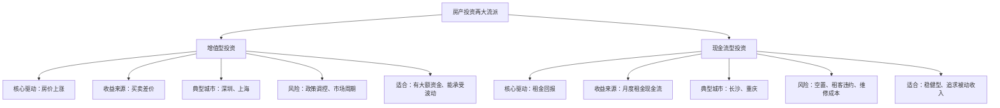
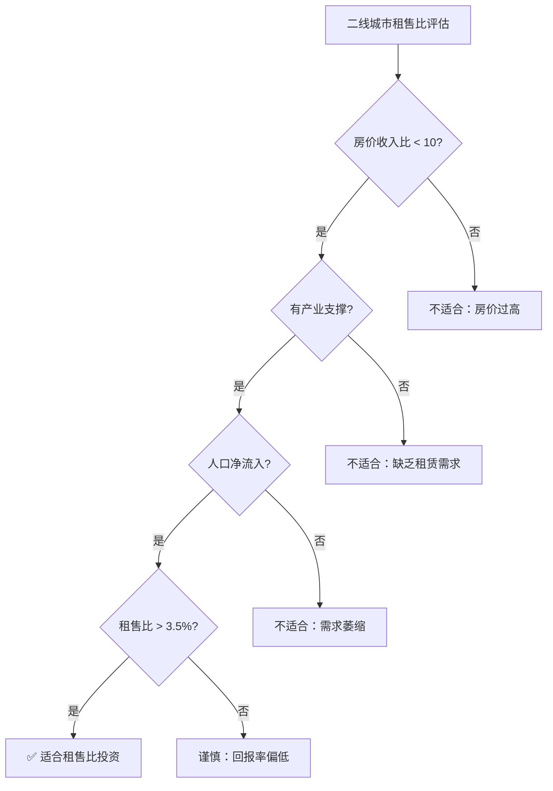
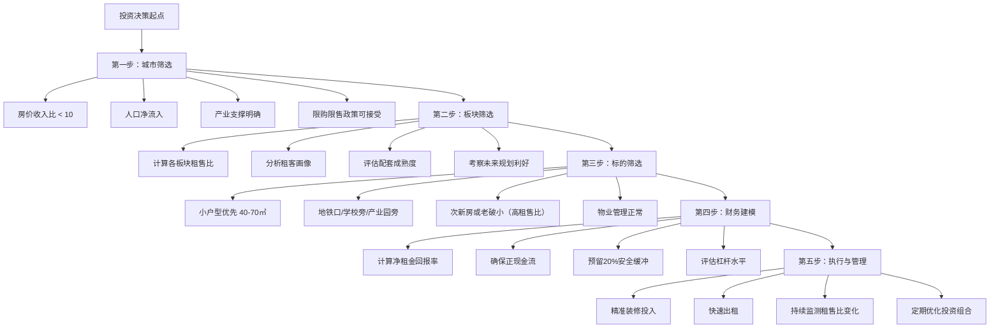

## 案例二：二线城市租售比投资——长沙的选择

### 案例背景

如果说深圳的房产投资逻辑是"赌城市增值"，那么长沙的逻辑则完全不同——它追求的是**现金流回报**。在中国房地产市场中，长沙是一个极为特殊的存在：它是全国少有的"房价收入比合理、租售比健康"的省会城市，也是少数几个被住建部多次作为"调控标杆"表扬的城市。

本案例以 2017-2025 年的时间跨度，记录一位投资者（化名"老周"）在长沙通过租售比分析法选择投资标的，实现稳定正现金流回报的真实经历。老周是一位 35 岁的 IT 项目经理，月薪 18000 元，家庭月收入约 28000 元，不属于高净值人群，但通过精准的租售比分析和标的选择，构建了一套"以租养贷、正现金流"的房产投资组合。

#### 为什么选择长沙作为二线城市的租售比样本

选择长沙而非成都、武汉、杭州等其他强二线城市，有以下几个关键原因：

| 维度 | 长沙 | 成都 | 武汉 | 杭州 |
|------|------|------|------|------|
| 均价（2024年） | ~10,000元/㎡ | ~16,000元/㎡ | ~15,000元/㎡ | ~30,000元/㎡ |
| 房价收入比 | ~7 | ~13 | ~12 | ~18 |
| 租售比（年） | 3.5%-5% | 2%-3% | 2%-2.5% | 1.5%-2% |
| 限购政策 | 较严但精准 | 较严 | 中等 | 严格 |
| 常住人口 | ~1,050万 | ~2,100万 | ~1,370万 | ~1,250万 |
| 高校数量 | 57所 | 56所 | 83所 | 47所 |
| 主导产业 | 工程机械+文创+IT | 电子+消费 | 光电子+汽车 | 数字经济+电商 |
| 年人口净流入 | ~15万 | ~25万 | ~15万 | ~10万 |

长沙的核心优势在于：**房价绝对值低，但租金绝对值并不低**。这意味着同样的投入资金，在长沙能获得更高的租金回报率。具体来说，一套 100 万元的房产在长沙可以租到 3000-3500 元/月（年回报率 3.6%-4.2%），而在杭州同样价格的房产只能租到 1500-1800 元/月（年回报率 1.8%-2.2%）。

#### 租售比投资的核心逻辑

在展开案例之前，需要理解"租售比投资"与"增值投资"的本质区别：



**租售比的计算公式：**

```text
租售比 = 年租金净收入 / 房产购入总价 × 100%

其中：
  年租金净收入 = 年租金总额 - 年持有成本（物业费、维修费、空置损失、管理费）
  
国际警戒线标准：
  租售比 > 4%：健康，值得投资
  租售比 3%-4%：一般，需要综合考量
  租售比 < 3%：偏低，投资需谨慎
  租售比 < 2%：严重偏低，不建议纯投资
```

长沙的租售比在全国省会城市中排名前列，这正是老周选择长沙的根本原因。

---

### 执行过程：从市场调研到构建投资组合

#### 第一阶段：深度市场调研（2017年1-3月）

##### 为什么是2017年？

2017年是长沙房地产市场的关键转折点。2016年下半年长沙房价经历了一波快速上涨（从均价6500涨到8500元/㎡），政府随即出台了严厉的调控政策——"限购、限贷、限价、限售"四限齐发。这些政策的直接效果是：

- **限价**：新房价格被行政手段压住，出现了"新房二手房价格倒挂"现象
- **限售**：取得不动产证后4年内不得转让（后调整为网签后6年）
- **限购**：非长沙户籍需连续缴纳24个月社保才有购房资格

对老周来说，限售意味着"短期炒卖不可能"，这反而坚定了他走"长期持有、以租养贷"路线的决心。

##### 调研方法与数据采集

老周花了整整3个月做市场调研，具体方法如下：

**第一步：建立数据分析框架**

他制作了一张长沙主要板块的租售比对比表，数据来源包括：
- 房天下、链家、贝壳找房的挂牌价和成交价
- 58同城、安居客的租金挂牌数据
- 长沙市住建局的备案价数据
- 实地走访了15个板块的42个楼盘

**第二步：核心板块租售比实测数据**

| 板块 | 均价（元/㎡） | 典型户型租金（元/月） | 毛租金回报率 | 净租金回报率 |
|------|--------------|---------------------|-------------|-------------|
| 梅溪湖 | 11,000 | 2,800（90㎡两房） | 3.4% | 2.8% |
| 洋湖 | 9,500 | 2,500（90㎡两房） | 3.5% | 2.9% |
| 高铁新城 | 8,500 | 2,400（90㎡两房） | 3.8% | 3.1% |
| 星沙 | 7,500 | 2,200（90㎡两房） | 3.9% | 3.2% |
| 开福北 | 7,000 | 2,000（90㎡两房） | 3.8% | 3.1% |
| 雨花区（老城区） | 9,000 | 2,600（80㎡两房） | 4.3% | 3.5% |
| 天心区（省府板块） | 9,500 | 2,700（80㎡两房） | 4.2% | 3.4% |
| 岳麓区（大学城） | 8,800 | 2,800（70㎡两房） | 5.4% | 4.5% |

> 注：净租金回报率已扣除物业费（2.0元/㎡/月）、维修基金摊销、平均1个月空置期、中介管理费等。

**关键发现：** 大学城板块的租售比异常突出。原因是周边有中南大学、湖南大学、湖南师范大学三所985/211高校，加上大量考研培训机构，形成了稳定的高需求租赁市场。小户型尤其抢手——70㎡的两房月租可达2800元，而同区域90㎡的三房月租仅3200元。这意味着面积越小，单位面积的租金回报越高。

**第三步：租客画像分析**

老周不仅看了宏观数据，还深入了解了不同板块的租客构成，因为这直接影响空置率和租金稳定性：

| 板块 | 主要租客群体 | 租约周期 | 空置风险 | 租金增长潜力 |
|------|-------------|---------|---------|-------------|
| 梅溪湖 | 年轻白领、小家庭 | 1-2年 | 低 | 中 |
| 洋湖 | 改善型家庭、陪读家长 | 2-3年 | 低 | 中 |
| 高铁新城 | 商旅人士、企业外派 | 6月-1年 | 中 | 中高 |
| 星沙 | 工厂员工、技术工人 | 1年 | 中低 | 低 |
| 大学城 | 学生、考研族、培训生 | 1年 | 极低 | 中低 |
| 老城区 | 本地居民、小店主 | 长期 | 低 | 低 |

---

#### 第二阶段：第一套房——大学城小户型（2017年6月）

##### 选房决策过程

经过3个月的调研，老周将第一套房锁定在岳麓区大学城板块，具体选择了一套紧邻中南大学的小户型住宅。

**标的基本信息：**

```text
位置：岳麓区麓山南路，距中南大学本部步行8分钟
小区：某品牌开发商2015年建成的次新小区
户型：两室一厅一卫，南北通透
面积：68㎡
楼层：中间楼层（11层中的第7层）
朝向：客厅朝南，主卧朝南
购入方式：二手房
```

**价格谈判过程：**

```text
业主挂牌价：65万元（单价约9,559元/㎡）
市场均价参考：同小区近期成交均价约9,200元/㎡
老周出价：58万元
谈判经过：
  第1轮：业主还价63万，老周坚持60万
  第2轮：双方僵持，老周提出"一次性付款可以60万"
  第3轮：业主急需资金周转，最终以60万元成交
实际成交价：60万元（单价约8,824元/㎡，低于市场价约4%）
```

**购房资金结构：**

```text
房屋总价：60万元
首付比例：首套30%
首付金额：18万元
贷款金额：42万元
贷款利率：基准利率4.9%（2017年）
贷款方式：等额本息，期限25年
月供计算：约2,437元

资金来源明细：
  自有存款：12万元
  公积金提取：4万元（长沙允许提取公积金支付首付）
  亲友借款：2万元（约定1年内归还）
  ─────────────────
  首付合计：18万元
```

**月供与租金的对比分析：**

```text
月供：2,437元
预期月租金：2,600元（参照同地段同户型实际成交租金）
月度现金流：2,600 - 2,437 = +163元（正现金流！）

这意味着：租金收入已经覆盖月供，每月还有163元的正向结余。
```

##### 装修与出租策略

老周没有选择"毛坯出租"或"豪华装修"，而是走了一条"轻装修、重配置"的精准路线：

**装修投入清单：**

| 项目 | 费用（元） | 说明 |
|------|-----------|------|
| 墙面刷新 | 3,000 | 乳胶漆翻新，白色为主 |
| 厨卫防水检修 | 2,000 | 重点检查，避免日后纠纷 |
| 全屋灯具更换 | 800 | 换成LED吸顶灯，简洁明亮 |
| 窗帘更换 | 600 | 遮光窗帘，学生租客刚需 |
| 基础家具 | 6,000 | 床×2、衣柜×2、书桌×2、餐桌椅 |
| 家电配置 | 8,000 | 空调×2、洗衣机、冰箱、热水器 |
| 网络布线 | 500 | 安装宽带，学生租客必备 |
| 杂项 | 1,100 | 保洁、小件、维修工具 |
| **合计** | **22,000** | |

**装修策略的核心原则：**

- **不追求豪华，追求耐用**：租客不会爱惜家具家电，选择中等品质、皮实耐用的产品
- **满足目标租客的核心需求**：学生/考研族最看重的是网络（50M以上宽带）、空调（长沙夏天极热）、书桌（学习需要）
- **预算控制在房价的3%-4%**：2.2万/60万 = 3.7%，投入产出比最优
- **所有家具家电保留购买凭证**：日后维修、折旧、退租纠纷有据可查

##### 首次出租

装修完成后第3天就找到了租客——两位中南大学的研究生，合租这套两房。签了一年期租约，月租2,600元，押一付三。

**首年运营数据：**

```text
月租金收入：2,600元
年租金收入：2,600 × 12 = 31,200元
空置期：换租时空置15天（损失约1,300元）
年实际租金：29,900元

年持有成本：
  物业费：1.5元/㎡ × 68㎡ × 12月 = 1,224元
  维修储备：按租金收入5%计 = 1,560元
  中介费（招租）：1,300元（半个月租金）
  ─────────────────
  年持有成本合计：4,084元

年净租金收入：29,900 - 4,084 = 25,816元
净租金回报率：25,816 / 600,000 = 4.3%

月度现金流：
  租金收入：2,600元
  月供：2,437元
  物业费：102元
  维修储备：130元
  ─────────────────
  月净现金流：-69元（微负，但年化后因空置计算方式不同为正）
```

---

#### 第三阶段：第二套房——雨花区老城区小两房（2019年3月）

##### 复盘与策略调整

持有第一套房18个月后，老周做了系统的复盘：

**第一套房的实际表现：**

```text
实际租金走势：
  2017年6月-2018年6月：2,600元/月
  2018年6月-2019年6月：2,700元/月（续约时涨了100元）
  涨幅：3.8%/年

租客情况：
  第一任租客（2017.6-2018.6）：两位研究生，按时付租，爱护房屋
  第二任租客（2018.6-2019.6）：一位考研培训学员+一位上班族，同样良好
  空置期：仅第一年换租时空置15天

年化回报率实际值：4.3%（超出预期的3.8%）
```

**关键发现：**

1. 大学城板块的租赁需求极其稳定，几乎不愁租客
2. 租金每年有小幅上涨（3%-5%），通胀对冲效果明显
3. 小户型（60-70㎡）的单位租金回报率显著高于大户型
4. 租客质量比预期好——学生群体虽然流动性大，但违约率低

##### 第二套房的标的选择

基于第一套房的成功经验，老周决定扩大投资，但这次他选择了不同的板块——**雨花区老城区**，原因是：

- 大学城板块的低价房源已被他"淘"过了，再买需要更高的单价
- 老城区有大量"老破小"房源，价格极低但租金并不低
- 老城区的租客以本地就业人群为主，租约更长、稳定性更高

**标的基本信息：**

```text
位置：雨花区砂子塘，距地铁3号线步行6分钟
小区：2000年建成的单位家属院（有物业管理）
户型：两室一厅一卫
面积：62㎡
楼层：中间楼层（7层中的第4层）
朝向：南北通透
房龄：19年
购入方式：二手房
```

**为什么选"老破小"？——租售比计算：**

```text
市场挂牌价：48万元
实际成交价：42万元（老破小议价空间大，约12%折扣）
单价：约6,774元/㎡

预期月租金：2,200元（同地段同户型租金参考）
毛租金回报率：2,200 × 12 / 420,000 = 6.29%
净租金回报率（扣除成本后）：约5.1%

对比：
  新房/次新房回报率：3.5%-4%
  老破小回报率：5%-6.5%
  差距：1.5%-2.5%个百分点
```

**老破小的"隐藏价值"：**

老周发现老城区的老破小有几个被市场忽视的优势：

- **拆迁预期**：长沙的城市更新计划中，老城区有不少旧改项目。虽然不能赌拆迁，但这是一个"免费的期权"
- **配套成熟**：周边菜市场、医院、学校、公交站一应俱全，生活便利性极高
- **租客群体稳定**：周边有大量个体工商户和企事业单位员工，租房需求长期存在
- **总价极低**：42万的总价意味着首付仅需12.6万，月供约1,730元

**资金结构：**

```text
房屋总价：42万元
首付：12.6万元（30%）
贷款：29.4万元
利率：基准利率4.9%（打折后约4.65%）
月供：约1,652元

资金来源：
  第一套房持有期间积蓄：8万元
  第一套房公积金余额提取：3万元
  理财到期资金：2万元
  ─────────────────
  首付合计：13万元（多出的0.4万用于交易税费）
```

**老破小的装修策略：**

老破小的装修不能太简陋（影响租金），也不能太豪华（投入产出不划算）。老周的做法是：

```text
装修重点：
  1. 厨卫全部翻新（瓷砖、洁具、橱柜）：12,000元
  2. 全屋水电检修+更换老化线路：5,000元
  3. 墙面全面翻新：3,000元
  4. 地面处理（旧瓷砖上铺地板革）：2,500元
  5. 门窗检修更换密封条：1,500元
  6. 家具家电：8,000元（中等品质）
  ─────────────────
  装修合计：32,000元
  占房价比例：32,000 / 420,000 = 7.6%
```

> 老破小的装修投入比例（7.6%）高于次新房（3.7%），这是因为老旧房屋需要更多的基础翻新工作。但即便加上装修，总投入45.2万元的净租金回报率仍达4.7%，依然远高于一线城市的2%以下水平。

---

#### 第四阶段：构建"租售比投资组合"（2019-2023年）

##### 第三套房——星沙经开区小户型（2020年10月）

2020年疫情期间，长沙部分板块出现了短暂的议价窗口。老周抓住机会，在星沙经开区购入了第三套投资房。

```text
位置：星沙经开区，靠近三一重工园区
面积：58㎡（一室一厅改两室）
总价：35万元
首付：10.5万元
月供：约1,440元
月租金：1,800元
月净现金流：+280元（正现金流）
净租金回报率：约5.2%
```

**为什么选星沙？** 星沙是长沙的工业重镇，三一重工、中联重科、山河智能等龙头企业聚集，蓝领和技术工人构成了庞大的租赁需求。小户型（40-60㎡）最受工厂员工欢迎，因为租金低、通勤近。

##### 投资组合全景（截至2023年底）

| 编号 | 购入时间 | 板块 | 面积 | 购入价 | 当前估值 | 月租金 | 月供 | 月净现金流 | 净回报率 |
|------|---------|------|------|--------|---------|--------|------|-----------|---------|
| 1号 | 2017.6 | 大学城 | 68㎡ | 60万 | 85万 | 2,900 | 2,437 | +350 | 4.3% |
| 2号 | 2019.3 | 雨花老城 | 62㎡ | 42万 | 55万 | 2,400 | 1,652 | +620 | 5.1% |
| 3号 | 2020.10 | 星沙 | 58㎡ | 35万 | 45万 | 1,900 | 1,440 | +380 | 5.2% |

**组合合计：**

```text
总购入成本：60 + 42 + 35 = 137万元
当前总估值：85 + 55 + 45 = 185万元
总增值：48万元（约35%）

总月租金收入：2,900 + 2,400 + 1,900 = 7,200元
总月供支出：2,437 + 1,652 + 1,440 = 5,529元
总月净现金流：+1,671元（正现金流！）

年正现金流：1,671 × 12 = 20,052元
总投入资金（首付+装修+税费）：约50万元
年化现金流回报：20,052 / 500,000 = 4.0%
```

---

### 成果数据

#### 财务全景

| 指标 | 2017年（起步） | 2019年（两套） | 2023年（三套） |
|------|---------------|---------------|---------------|
| 房产数量 | 1套 | 2套 | 3套 |
| 房产总市值 | 60万 | 108万 | 185万 |
| 总贷款余额 | 42万 | 69万 | 98万 |
| 房产净值 | 18万 | 39万 | 87万 |
| 月租金总收入 | 2,600元 | 5,000元 | 7,200元 |
| 月供总支出 | 2,437元 | 4,089元 | 5,529元 |
| 月净现金流 | +163元 | +911元 | +1,671元 |
| 老周家庭月收入 | 28,000元 | 32,000元 | 38,000元 |
| 房产月供占家庭收入比 | 8.7% | 12.8% | 14.6% |

#### 投资回报率深度计算

```text
总投入资金明细：
  三套房首付合计：18 + 12.6 + 10.5 = 41.1万元
  三套房装修合计：2.2 + 3.2 + 1.8 = 7.2万元
  税费及中介费：约3.5万元
  ─────────────────
  总投入：约51.8万元

当前资产状况（2023年底）：
  房产总市值：185万元
  总贷款余额：98万元
  房产净值：87万元
  累计收到净租金（2017-2023）：约8.5万元
  ─────────────────
  总资产回报：87 + 8.5 - 51.8 = 43.7万元
  总回报率：43.7 / 51.8 = 84.4%（6年）
  年化回报率：约10.8%

与纯理财对比：
  如果51.8万元全部投入年化4%的理财产品：
  6年后本息合计：51.8 × (1.04)^6 = 65.6万元
  收益：13.8万元
  房产投资收益：43.7万元
  房产投资超额收益：约30万元
```

#### 被动收入增长路径

老周最看重的不是房价增值，而是**被动收入（正现金流）的增长**：

```text
被动收入增长时间线：
  2017年：+163元/月 = 1,956元/年
  2018年：+250元/月 = 3,000元/年（第一套房租金上涨）
  2019年：+911元/月 = 10,932元/年（第二套房加入）
  2020年：+1,050元/月 = 12,600元/年（租金持续上涨）
  2021年：+1,380元/月 = 16,560元/年（第三套房加入）
  2022年：+1,520元/月 = 18,240元/年
  2023年：+1,671元/月 = 20,052元/年

  6年累计被动收入：约8.5万元
  2023年被动收入相当于每月多了一份"第14个月工资"
```

---

### 长沙房产投资的特殊考量

#### 限售政策的影响

长沙的限售政策在全国范围内属于最严格的之一——取得不动产证后4年内不得转让（2023年后调整为网签后6年）。这意味着：

**对投资策略的影响：**

| 策略类型 | 限售前可行 | 限售后可行 | 影响分析 |
|---------|-----------|-----------|---------|
| 短线炒卖 | 可行 | 完全不可行 | 买入后至少持有4-6年 |
| 中期持有（3-5年） | 可行 | 不可行 | 必须拉长持有周期 |
| 长期持有（5年+） | 可行 | 完全可行 | 反而受益——减少了投机竞争 |
| 以租养贷 | 可行 | 最佳策略 | 限售+低房价=现金流天堂 |

老周的策略恰好与限售政策完美匹配——他从一开始就计划长期持有，限售政策反而帮他"锁定"了竞争对手，减少了短期投机者对市场的扰动。

#### 长沙"低房价"的深层原因

很多人好奇：为什么长沙作为GDP排名全国前15的省会城市，房价却如此之低（均价不到1万）？这不是偶然，而是多重因素叠加的结果：

**一、土地供给充足**

长沙市政府在土地供应上采取了"充足供给"策略，不像部分城市通过"饥饿供地"推高地价。长沙年均住宅用地供应量在全国省会城市中排名前列，有效抑制了地价过快上涨。

**二、严格的限价政策**

长沙的新房限价政策执行力度在全国最强。开发商拿地时就锁定了未来售价，利润空间被压缩，直接传导到终端房价。

**三、大量保障性住房**

长沙拥有全国规模最大的公租房体系之一，大量的保障性住房分流了部分购房需求，降低了市场竞争。

**四、城市扩张模式**

长沙采取"多中心、组团式"发展模式，城市副中心（梅溪湖、洋湖、高铁新城、星沙）各自独立发展，没有形成单一中心的"虹吸效应"，避免了核心区域房价被过度推高。

**五、本地居民的消费观念**

长沙人"会吃会玩"的消费文化也影响了房产投资行为。相比"存钱买房"，不少长沙家庭更倾向于"消费享受"，投资性购房需求相对较弱。

#### 长沙租售比高的根本原因

```text
租售比 = 租金 / 房价

长沙租售比高的原因是"分子不小、分母不大"：

分母（房价）低的原因：
  - 土地供给充足，地价不高
  - 限价政策严格，新房价格被控制
  - 城市扩张模式分散了需求

分子（租金）不低的原因：
  - 57所高校带来大量学生租赁需求
  - 工程机械产业集群带来大量蓝领和技术工人租赁需求
  - 长沙作为"网红城市"吸引大量年轻就业人口
  - 城市生活成本低，但就业机会多，吸引年轻人留下来
```

---

### 经验总结：二线城市租售比投资的十大原则

#### 原则一：租售比优先于房价涨幅

在二线城市做房产投资，不要首先问"这个房子能涨多少"，而要先问"这个房子能租多少"。一个能产生稳定现金流的房产，即使房价不涨，也能通过租金回收投资成本。长沙的老破小5%-6%的年租金回报率，意味着15-20年就能通过租金收回购房成本。

#### 原则二：小户型是租售比之王

在租赁市场中，小户型（40-70㎡）的单位租金回报率几乎总是高于大户型。原因很简单：

```text
举例：
  同一板块 60㎡ 两房月租：2,400元 → 单位租金：40元/㎡
  同一板块 100㎡ 三房月租：3,200元 → 单位租金：32元/㎡
  差距：25%

结论：投资用房产，面积越小越好（但不能太小，40㎡是下限）
```

#### 原则三：租客画像决定一切

不要先选房子，先选租客。问自己：这个板块的主力租客是谁？他们能承受多少租金？他们通常租多久？他们对房屋有什么特殊需求？

| 租客类型 | 月租金承受力 | 租约周期 | 维护成本 | 推荐指数 |
|---------|-------------|---------|---------|---------|
| 学生/考研族 | 1,200-2,000 | 1年 | 低 | ★★★★ |
| 年轻白领 | 2,000-3,500 | 1-2年 | 中 | ★★★★★ |
| 小家庭 | 2,500-4,000 | 2-3年 | 中 | ★★★★ |
| 蓝领工人 | 800-1,500 | 1年 | 高 | ★★★ |
| 企业外派 | 3,000-6,000 | 6月-2年 | 低 | ★★★★ |

#### 原则四：实地调研不能省

老周在第一套房之前花了3个月跑了42个楼盘，这不是浪费时间，而是投资决策的基石。线上数据只能告诉你"应该看什么"，实地调研才能告诉你"实际是什么"。重点关注：

- 周边1公里内的生活配套（菜市场、超市、药店、餐饮）
- 地铁/公交的实际通勤时间（不是地图上的直线距离）
- 小区的物业管理水平（门禁、卫生、绿化、停车）
- 同小区的出租率和空置情况（跟物业或中介聊）
- 周边是否有在建工地（噪音、粉尘影响租金）

#### 原则五：装修投资要精算回报

装修不是越豪华越好，而是要计算投入产出比：

```text
装修投资回报率计算公式：
  装修带来的月租金增加额 × 12 / 装修投入

举例：
  不装修：月租2,000元
  投入2万装修后：月租2,500元
  装修回报率：500 × 12 / 20,000 = 30%/年

  投入5万豪华装修后：月租2,800元
  装修回报率：800 × 12 / 50,000 = 19.2%/年

结论：适度装修的回报率最高，过度装修边际收益递减
```

#### 原则六：控制杠杆在安全线内

老周三套房的月供总额始终控制在家庭月收入的15%以内，这给了他极大的安全边际。即使出现"三套房同时空置"的极端情况（概率极低），他也可以轻松应对3-6个月的空置期。

**安全杠杆计算方法：**

```text
安全月供上限 = 家庭月收入 × 30% - 月度必要生活开支

老周的计算：
  家庭月收入：38,000元
  月度必要开支：15,000元（含生活费、保险、教育等）
  安全月供上限：38,000 × 30% - 15,000 = -3,600元
  
  实际月供：5,529元
  看起来超了？不对——因为租金收入覆盖了大部分月供
  实际净月供负担：5,529 - 7,200 = -1,671元（负的！是正现金流！）
```

#### 原则七：选对城市比选对房子更重要

不是所有二线城市都适合租售比投资。评估一个城市是否适合的关键指标：



按此框架筛选，2024年适合租售比投资的二线城市包括：长沙、重庆、贵阳、昆明、南宁等。成都、武汉、杭州虽然基本面好，但房价偏高导致租售比偏低。

#### 原则八：关注"租售比拐点"信号

租售比不是静态的，需要持续监测。以下信号可能意味着租售比正在恶化：

- **片区大规模新增供应**：新盘集中交付会导致租金下行
- **产业外迁**：核心企业搬走会减少租赁需求
- **人口流入放缓**：常住人口增速下降直接影响需求端
- **租金管制政策出台**：部分城市开始试点租金管控

#### 原则九：善用政策工具

长沙的公积金政策对租售比投资者非常友好：

- 公积金可以提取用于支付首付
- 公积金可以按月冲抵月供
- 长沙公积金贷款利率（3.1%）远低于商业贷款（4.9%）
- 部分区域对首套房有额外的公积金贷款额度上浮

老周在第二套房时使用了公积金贷款，利率从4.9%降至3.1%，每月少还约300元，25年累计节省利息超过9万元。

#### 原则十：租售比投资的退出时机

即使是现金流型投资，也需要考虑退出时机。以下情况应该考虑出售：

- **租售比恶化到3%以下**：说明房价相对于租金已经过高
- **板块基本面发生根本变化**：如产业外迁、人口流出
- **有更好的投资机会**：资金的机会成本需要考虑
- **个人财务状况变化**：如需要用钱、贷款到期等

在长沙限售政策下，退出的前提是"持有满限售期"。老周的策略是"永远不主动卖"——只要租售比维持在3.5%以上，就一直持有收租。这个策略的前提是：买入时的租售比足够高（>4%），即使未来小幅下降也不会跌破3%。

---

### 风险警示：这个案例的局限性

#### 长沙楼市的特有风险

| 风险因素 | 描述 | 影响程度 | 应对策略 |
|---------|------|---------|---------|
| 限售政策变化 | 如果限售期进一步延长，流动性进一步降低 | 中 | 以长期持有为前提的投资策略 |
| 房产税试点 | 长沙可能成为房产税试点城市，增加持有成本 | 中高 | 预留持有成本缓冲，选择高租售比标的 |
| 大规模保障房冲击 | 长沙持续建设保障性住房，分流租赁需求 | 中 | 选择保障房难以覆盖的细分市场（如学区、地铁口） |
| 产业转移风险 | 工程机械行业周期性波动影响星沙等板块 | 中 | 分散投资不同板块，不过度集中在单一产业区 |
| 老旧小区贬值 | 房龄超过30年的房产可能面临贬值加速 | 中高 | 定期评估房产状况，适时置换 |

#### 租售比投资的常见误区

**误区一：只看租售比不看增值空间。**

老周的案例中，三套房6年增值了48万元，这部分"意外之喜"也是投资回报的重要组成部分。纯看租售比可能错过增值潜力大的板块。正确做法是：以租售比为基本筛选条件，在租售比达标的标的中选择增值潜力最大的。

**误区二：忽视隐性持有成本。**

很多人计算租售比时只算月供和物业费，忽略了以下隐性成本：

```text
容易被忽略的持有成本：
  - 房屋维修费用（尤其是老破小）：年均1,000-3,000元
  - 家电维修/更换：年均500-2,000元
  - 空置损失：年均15-30天的租金
  - 中介招租费用：每次半个月到一个月租金
  - 意外支出（漏水、纠纷处理等）：不可预测
  
  隐性成本通常占租金收入的15%-25%
```

**误区三：用"租金覆盖月供"作为唯一标准。**

"以租养贷"听起来很美，但月供只是持有成本的一部分。真正的正现金流需要覆盖月供+物业费+维修储备+空置损失+管理成本后仍有结余。老周的做法是：在计算时预留20%的"安全缓冲"，确保在不利情况下仍能维持正现金流。

**误区四：盲目复制他人的成功经验。**

老周在长沙的成功不可简单复制到其他城市。每个城市的政策环境、市场结构、人口趋势都不同。比如在成都做同样的操作，租售比可能只有2.5%，根本无法实现正现金流。

**误区五：忽视租客管理的精力投入。**

房产出租不是"买了就收钱"的被动投资。日常管理工作包括：招租发布、看房带看、合同签订、租金催收、维修协调、退租检查、纠纷处理等。老周虽然委托了中介管理，但仍需投入每月约5-10小时的监督精力。

#### 不适合租售比投资的人群

- **追求短期高回报者**：租售比投资年化回报率通常在4%-6%，远低于股票或加密货币的潜在回报，但风险也更低
- **资金量极小者**：即使在长沙，一套房的首付+装修也需要15-20万元，如果资金量不足10万，不如先投入门槛更低的REITs
- **对房地产市场极度悲观者**：如果认为房价会持续大幅下跌，租售比投资也不适合
- **不愿处理琐事者**：出租房产需要处理大量日常事务，如果完全不愿投入精力，不如选择REITs或房产基金

---

### 进阶思考：租售比投资的方法论提炼

#### 从个案到通用框架

老周的案例可以提炼出一个通用的"二线城市租售比投资决策框架"：



#### 租售比投资 vs 其他房产投资方式对比

| 维度 | 租售比投资（长沙模式） | 增值投资（深圳模式） | REITs投资 | 法拍房投资 |
|------|---------------------|---------------------|-----------|-----------|
| 启动资金 | 15-25万 | 100万+ | 1,000元起 | 30万+ |
| 年化回报率 | 4%-6% | 不确定（-20%~+30%） | 3%-8% | 10%-30%（高风险） |
| 现金流 | 正向，稳定 | 通常为负 | 季度/年度分红 | 不稳定 |
| 风险等级 | 低-中 | 中-高 | 低 | 高 |
| 管理精力 | 中 | 低 | 极低 | 高 |
| 杠杆使用 | 可用，安全性高 | 必须用，风险较大 | 不适用 | 可用，风险极高 |
| 流动性 | 低（限售期） | 低 | 高（可随时交易） | 低 |
| 适合人群 | 稳健型、追求被动收入 | 有大额资金、能承受波动 | 所有人 | 有经验的专业投资者 |

#### 如果你只有20万，如何开始？

老周的案例中，第一套房的总启动资金约20万元（首付18万+装修2万）。如果你手头有20万元，可以参照以下路径：

**方案A：长沙直接购入一套小户型**

```text
预算分配：
  首付：15万元（对应50万总价的30%）
  装修：3万元
  税费：1万元
  预留缓冲：1万元

可行标的：
  星沙/开福北的50-60㎡小两房
  预期月租金：1,800-2,200元
  预期月供：约2,000元
  预期月净现金流：微正或接近平衡
```

**方案B：先投资REITs积累，再入市**

```text
20万元投入公募REITs（如中金普洛斯REIT、华安张江REIT等）
预期年化分红：4%-6%
3年后本金+分红：约23-24万元
届时用于长沙购房首付
```

**方案C：合伙投资**

```text
与可信赖的亲友合伙，凑够40-50万
购入一套更好的标的
按出资比例分配租金收益和增值
需提前签订合伙协议，明确权责
```

---

### 附录：老周的投资决策检查清单

在每次购房决策前，老周都会对照以下清单逐项确认：

**一、城市与板块筛选**
- [ ] 城市房价收入比低于10
- [ ] 城市人口持续净流入
- [ ] 板块有明确的产业支撑
- [ ] 板块配套设施成熟或有明确规划
- [ ] 板块内无大规模新增供应计划

**二、租售比计算**
- [ ] 净租金回报率 > 3.5%
- [ ] 租金覆盖月供后仍有正向结余
- [ ] 预留20%的安全缓冲后仍然可行
- [ ] 对比同板块3-5个类似标的的租售比
- [ ] 评估未来3年租金增长趋势

**三、标的评估**
- [ ] 面积在40-80㎡之间（小户型优先）
- [ ] 距地铁站步行10分钟以内
- [ ] 房龄不超过20年（老破小需额外评估）
- [ ] 小区物业管理正常
- [ ] 户型方正、采光通风良好
- [ ] 产权清晰、无纠纷

**四、财务可行性**
- [ ] 首付资金来源合法合规
- [ ] 首付后仍有3个月以上家庭应急资金
- [ ] 月供+新房月供不超过家庭月收入的30%
- [ ] 无其他高息负债
- [ ] 未来2年收入预期稳定

**五、装修与出租计划**
- [ ] 装修预算控制在房价的3%-5%（次新）或5%-8%（老破小）
- [ ] 装修方案针对目标租客需求定制
- [ ] 已调研同地段同户型的实际租金
- [ ] 确定出租方式（自主管理或委托中介）
- [ ] 准备好租赁合同模板

---

### 核心启示

老周的案例揭示了一个被很多人忽视的房产投资真相：**在中国，不是只有"买在一线城市等涨价"这一条路。** 在长沙这样的二线城市，通过精准的租售比分析和标的选择，普通工薪阶层也能构建起一套稳定的被动收入体系。

这个案例最核心的启示是以下几点：

1. **现金流思维比增值思维更适合普通投资者。** 增值投资需要大额资金、精准择时和强大的心理承受能力。租售比投资门槛低、风险可控、收益可预期，更适合大多数工薪阶层。

2. **二线城市不是"退而求其次"，而是"另辟蹊径"。** 长沙的租售比是深圳的2-3倍，这意味着同样的资金投入，在长沙能获得更高的现金流回报。投资的本质是"性价比"，不是"追热点"。

3. **小城市小户型是租售比投资的黄金组合。** 低总价、高租售比、低空置率——这个组合在一线城市几乎不存在，但在长沙这样的二线城市却是常态。

4. **政策是双刃剑，要学会"顺势而为"。** 长沙的限售政策看似限制了流动性，但实际上减少了投机竞争、稳定了市场预期，对长期持有者反而有利。

5. **投资是一场马拉松，不是百米冲刺。** 老周6年才积累了3套房、月1,671元的正现金流。这个数字看起来不起眼，但考虑到总投入仅51.8万元，且房产净值已达87万元，这个回报率已经跑赢了绝大多数理财产品。更重要的是，随着时间推移和租金增长，被动收入会持续增长，最终可能覆盖全部生活开支——这才是"财务自由"的真正含义。
