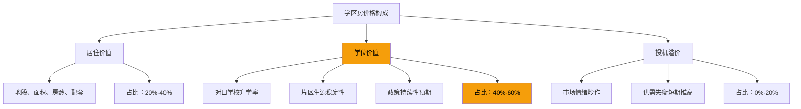
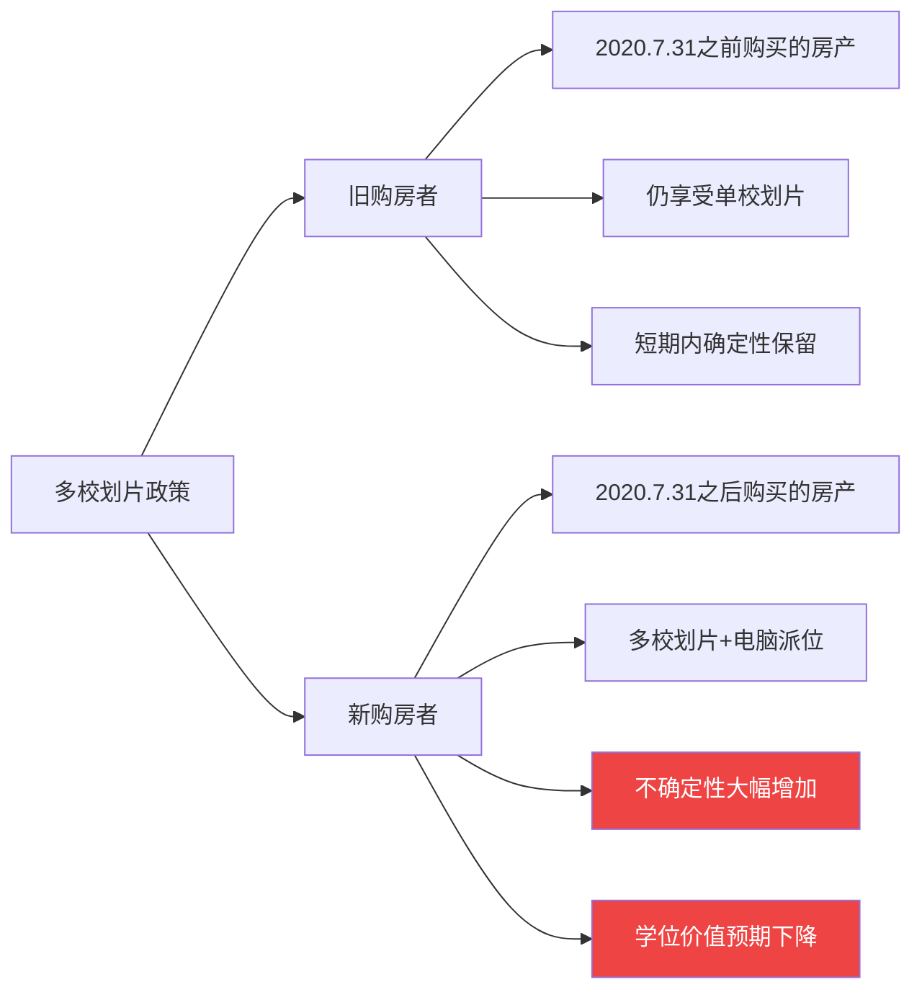

## 案例三：学区房的投资逻辑——北京的教训

### 案例背景

学区房是中国房地产市场中最特殊、最具争议的品类。它的定价逻辑不完全遵循经济规律，而是深度绑定了一个城市的教育资源分配体系。在全国范围内，北京的学区房市场最为极端——一套只有十几平米的平房，因为对口名校，单价可以超过 20 万元/平米，总价甚至高于一套普通大三居。

本案例以 2016-2024 年的时间跨度，记录一个北京普通家庭（化名"刘家"）在学区房投资中的完整经历——从最初的兴奋到中途的焦虑，从政策剧变后的煎熬到最终的深刻反思。刘家并非高收入群体，丈夫刘工是一名软件测试工程师，妻子小敏是小学教师，家庭月收入约 2.5 万元。他们的故事，是数百万北京学区房家庭的缩影，也是理解中国教育政策与房地产市场交织逻辑的绝佳样本。

#### 学区房的本质：教育期权还是房产投资？

在进入案例之前，必须先厘清一个根本问题：**学区房到底是什么？**

很多人把学区房当作"房产投资"来分析，用租金回报率、房价收入比等传统指标去衡量。但这忽略了一个关键事实——学区房的本质是**教育期权**，它 60%-80% 的溢价来源于对口学校的学位价值，而非房产本身的居住价值。



这意味着：**学区房的投资回报率高度依赖教育政策的稳定性**。一旦政策调整（如多校划片、教师轮岗、集团化办学），学位价值可能大幅缩水，而这种风险是传统房产投资分析框架无法捕捉的。

#### 为什么选择北京作为学区房案例

| 维度 | 北京 | 上海 | 深圳 | 广州 |
|------|------|------|------|------|
| 学区房溢价幅度 | 极高（100%-300%） | 高（80%-200%） | 中高（50%-150%） | 中（30%-100%） |
| 顶级学区单价 | 15-25万/㎡ | 12-20万/㎡ | 10-18万/㎡ | 6-12万/㎡ |
| 教育资源集中度 | 极高（西城、海淀） | 高（徐汇、浦东） | 中高（南山、福田） | 中（越秀、天河） |
| 政策改革力度 | 最大（多校划片全面推行） | 大（名额分配改革） | 中 | 中 |
| 学区房流动性 | 高→低（政策后骤降） | 高 | 中高 | 中 |
| 典型对口模式 | 多校划片（2020年后） | 对口+摇号 | 积分入学 | 对口直升 |

北京的特殊性在于：它是全国教育资源最集中的城市，同时也是学区房政策改革力度最大的城市。**西城区和海淀区**集中了北京最优质的中小学教育资源，学区房溢价也最为极端。选择北京，是因为它完整展现了学区房投资的"天堂与地狱"两面。

#### 北京学区房的市场分层

北京学区房市场可以清晰地分为三个梯队：

**第一梯队——"金学区"（西城金融街、德胜、海淀中关村、万柳）**

```text
代表学校：实验二小、育民小学、中关村一小、人大附小
对口小区均价：12-22万/㎡
学区房溢价率：150%-300%
典型房源：60-80㎡两居室，总价800-1500万
特点：顶级教育资源，政策敏感度最高
```

**第二梯队——"银学区"（西城月坛、海淀上地、东城和平里）**

```text
代表学校：育翔小学、上地实验小学、和平里四小
对口小区均价：9-14万/㎡
学区房溢价率：80%-150%
典型房源：60-90㎡两居/三居，总价600-1000万
特点：教育资源优质，价格相对"理性"
```

**第三梯队——"铜学区"（海淀四季青、朝阳望京、丰台等）**

```text
代表学校：各区域内优质小学
对口小区均价：6-10万/㎡
学区房溢价率：30%-80%
典型房源：70-100㎡，总价500-800万
特点：教育资源中上，溢价相对合理
```

---

### 执行过程：从"为了孩子"到"被套其中"

#### 第一阶段：购房决策（2016年）

##### 刘家的背景与动机

2016 年，刘工 32 岁，小敏 30 岁，女儿小雨刚满 2 岁。两人住在朝阳区一套 85 平米的两居室（2013 年购入，贷款余额约 120 万）。随着小雨即将面临幼儿园和小学入学，学区问题成为家庭的核心焦虑。

当时刘家面临的选项：

- **选项 A**：在朝阳区对口入学，片区小学属于中等水平
- **选项 B**：卖掉朝阳房产，在西城或海淀购买学区房
- **选项 C**：保留朝阳房产，额外购买一套小面积学区房"挂学位"

经过反复讨论，刘家选择了**选项 C**——保留朝阳的自住房，在西城购买一套小面积学区房用于"挂学位"。这个决策背后有三个考量：

1. 朝阳的 85 平米房子住着舒服，不想降级居住品质
2. 西城学区房虽贵，但小面积"占坑房"总价可控
3. "买了学区房就稳了"——当时市场普遍信仰

##### 选房过程

刘家将目标锁定在**西城区德胜片区**，原因如下：

```text
德胜片区对口学校：
  - 一流一类：育翔小学、实验二小德胜校区
  - 一流二类：西师附小、五路通小学
  - 片区内无"渣小"，整体教育水平均衡
  - 对口初中：三帆中学、十三中分校等，初中通路优质

2016年德胜片区市场行情：
  - 均价：约10-12万/㎡
  - 挂牌量：较少，卖方市场
  - 成交周期：热门房源1-2周即成交
  - 典型房源：60年代-80年代老公房，50-70㎡两居室
```

**最终选定标的：**

```text
位置：西城区德胜门外，距育翔小学步行5分钟
小区：1978年建成的单位公房（已购公房）
户型：两室一厅一卫，南北通透
面积：56㎡
楼层：6层板房中的第3层
朝向：主卧朝南，客厅朝北
产权：70年住宅产权
```

**价格与资金结构：**

```text
业主挂牌价：620万元（单价约110,714元/㎡）
市场参考价：同小区近期成交价约600-630万
实际成交价：605万元（单价约108,036元/㎡）
谈判过程：
  第1轮：刘家出价580万，业主还价615万
  第2轮：刘家出价595万，业主坚持610万
  第3轮：因业主急需资金（换房链），最终605万成交

资金来源明细：
  朝阳房产评估值：约480万元
  朝阳房产贷款余额：约118万
  朝阳房产净值：约362万（但刘家选择不卖）
  
  朝阳房产抵押贷款（二押）：150万元（利率5.2%）
  信用贷款：80万元（利率6.8%，期限3年）
  亲友借款：60万元
  夫妻积蓄：45万元
  公积金贷款：120万元（利率3.25%，二套利率上浮10%后为3.575%）
  商业贷款：150万元（利率4.9%上浮10%后为5.39%）
  ──────────────────────
  合计可用资金：605万元

月供结构：
  公积金贷款月供：约5,409元（等额本息，25年）
  商业贷款月供：约8,440元（等额本息，25年）
  二押贷款月供：约9,500元（等额本息，10年）
  信用贷月供：约24,500元（等额本息，3年）
  ──────────────────────
  月供合计：约47,849元
  家庭月收入：约25,000元
  月供缺口：约-22,849元
```

##### 刘家的"算盘"与隐含风险

刘家并不是不知道月供压力巨大。他们的"算盘"是：

1. 信用贷 3 年内还清，届时月供降至约 2.3 万元
2. 夫妻收入会增长，3 年后月收入有望达到 3.5 万元
3. 朝阳房产可以出租，月租金约 7,000 元
4. 两边父母可以支援一部分

**将出租收入计算在内后的现金流：**

```text
月收入：
  工资收入：25,000元
  朝阳房产租金：7,000元
  父母支援（预期）：3,000元
  ─────────────────
  月总收入：35,000元

月支出：
  学区房月供：47,849元
  朝阳房产月供：约6,800元（原房贷）
  家庭生活费：约8,000元
  ─────────────────
  月总支出：62,649元

月度缺口：-27,649元
```

即使算上租金和父母支援，月度缺口仍接近 2.8 万元。刘家的应对方案是：动用积蓄填补缺口，同时寄希望于收入增长和信用贷还清后的月供下降。

**这是学区房投资中最常见的致命错误——过度杠杆。**

---

#### 第二阶段：甜蜜期与煎熬期（2016-2019年）

##### 短暂的"正确感"

2016 年购入后，北京学区房市场继续上涨。到 2017 年初，同小区成交价已突破 700 万元（单价约 12.5 万/㎡），刘家的学区房账面增值约 95 万元。

```text
2016年9月购入价：605万元
2017年3月估值：约700万元
账面增值：95万元（6个月增值15.7%）
刘工当时的感受："幸亏当时咬牙买了"
```

2017 年 3 月，北京出台了严厉的"3·17新政"，提高二套房首付比例至 60%-80%，认房又认贷。学区房市场短暂降温，但德胜片区因为"确定性强"（当时仍是单校划片），价格相对坚挺。

2017-2019 年间，刘家的实际生活状态：

```text
2017年：
  月收入：约26,000元（小幅涨薪）
  月租金：7,000元
  父母支援：3,000元
  月总收入：36,000元
  
  月总支出：约61,000元
  月度缺口：-25,000元
  年度积蓄消耗：-30万元
  动用存款：约30万（积蓄几乎耗尽）

2018年：
  信用贷进入第3年，本金减少，但月供不变
  小敏开始做线上家教，月增收约3,000元
  月度缺口缩窄至约-20,000元
  年度积蓄消耗：约-24万元
  开始刷信用卡维持现金流（信用卡负债约8万元）

2019年：
  信用贷还清！月供减少24,500元
  月供降至：约23,349元
  月收入增长至约32,000元（刘工跳槽涨薪）
  租金涨至7,500元
  月总收支基本平衡（微正）
  终于"喘过气来"
```

**三年"煎熬期"的真实代价：**

```text
积蓄消耗：约54万元（2016-2019年累计）
信用卡利息：约2.5万元
信用贷利息：约15万元（3年总利息）
亲友借款利息（人情成本）：约3万元
生活质量下降：无旅行、无社交、衣物减少开支
夫妻关系压力：因财务问题多次争吵
精神状态：长期焦虑、失眠
```

这三年里，刘家的生活质量严重下降。原本可以每年一次家庭旅行、偶尔下馆子的生活，变成了"每个月都在算账"的煎熬。小敏曾说："我不是在养孩子，是在养房子。"

##### 2019年的小确幸

2019 年信用贷还清后，刘家终于"缓过来"了。这一年，女儿小雨顺利入读育翔小学，刘家觉得"一切辛苦都值得了"。学区房的价格也在缓慢回升，德胜片区的成交价回到了 650-680 万元区间。

---

#### 第三阶段：政策剧变——多校划片的冲击（2020-2021年）

##### "多校划片"政策落地

2020 年 4 月，北京市教委发布了《关于 2020 年义务教育阶段入学工作的意见》，明确提出：

> 自 2020 年 7 月 31 日后，在西城区购房并取得房屋产权证书的家庭，适龄子女申请入小学时，不再对应登记入学划片学校，全部以多校划片方式在学区或相邻学区内入学。

简单来说：**2020 年 7 月 31 日之后购买的西城房产，不再保证对口某一所学校，而是通过"多校划片"在片区内多所学校中随机分配。**

这个政策的核心影响：



**刘家的情况：** 由于房产是 2016 年购入的，在 2020 年 7 月 31 日之前，所以女儿小雨入学时仍享受了单校划片政策。从这个角度看，刘家"赌赢了"。

但政策的冲击远不止于此。

##### 政策对学区房价格的冲击

多校划片政策发布后，西城学区房市场出现了明显的分化：

```text
2020年7月-2021年6月德胜片区价格变化：

"金坑房"（极小面积、高单价挂学位房）：
  政策前：15-20万/㎡
  政策后：10-14万/㎡
  跌幅：约30%-40%
  原因：学位确定性丧失，小面积"占坑"逻辑被打破

"改善型"学区房（60-90㎡正常居住户型）：
  政策前：11-14万/㎡
  政策后：9-12万/㎡
  跌幅：约15%-25%
  原因：仍有居住价值支撑，跌幅相对温和

"顶级确定性"房源（2020.7.31前购入可单校对口）：
  政策前：12-16万/㎡
  政策后：11-14万/㎡
  跌幅：约5%-15%
  原因：存量房仍有"确定性溢价"，但预期已开始下降
```

**刘家的学区房估值变化：**

```text
2019年底估值：约680万元
2021年中估值：约620万元
账面缩水：约60万元（-8.8%）

由于刘家的房产属于"存量房"（2020.7.31前购入），跌幅相对有限。
但如果考虑到2017年高点700万的估值，实际已缩水80万元。
```

##### 刘家的焦虑与反思

政策落地后，刘家第一次开始认真思考一个问题：**学区房的"学位价值"到底还剩多少？**

小敏在学校工作，她比普通家长更清楚政策趋势：

```text
小敏观察到的趋势信号：
  1. 集团化办学加速：名校办分校、合并弱校，教育资源均等化
  2. 教师轮岗制度：优质教师在区域内流动，削弱单校优势
  3. 校额到校政策：重点高中招生名额向普通初中倾斜
  4. 多校划片扩大化：从西城、海淀逐步向其他区推广
  5. "双减"政策（2021年）：校外培训被压缩，学区竞争转向校内
```

小敏的一句话让刘工印象深刻："以前是'买学区房=买确定性'，以后可能是'买学区房=买不确定性'。"

---

#### 第四阶段：止损决策与最终结果（2022-2024年）

##### 2022年的市场环境

2022 年，北京二手房市场整体遇冷，学区房也未能幸免：

```text
2022年德胜片区成交数据：
  年成交量：同比下降约40%
  挂牌量：同比增加约30%
  挂牌到成交周期：从平均45天延长到90-120天
  议价空间：从2%-3%扩大到5%-8%
  均价：约10-11万/㎡（相比2021年高点下跌约15%）
```

刘家面临一个关键决策：女儿小雨已经在读二年级，学区房的"学位使命"已经完成了一部分。如果继续持有，需要承受持续的持有成本和价格下行风险；如果卖出，需要面对市场低迷和可能的亏损。

##### 决策分析框架

刘家用了一张表格来梳理决策：

```text
继续持有的理由：
  + 女儿还在读小学，学区房仍有"保底"作用
  + 存量房仍有单校划片确定性
  + 等市场回暖再卖
  + 已经熬了这么久，不想"割肉"

卖出的理由：
  - 每月持有成本约2,000元（物业费、维修、二押利息）
  - 政策趋势不可逆，学位价值持续下降
  - 资金机会成本高——如果卖掉，600万本金可以做其他投资
  - 家庭财务压力仍然存在
  - 小雨升初中后，学区房的"学位使命"彻底结束
```

##### 2023年的卖出决策

2023 年初，小雨升入四年级。刘家决定开始挂牌出售学区房，心理底价 550 万元。

**挂牌与成交过程：**

```text
2023年3月：挂牌价600万元
2023年4月-5月：无带看，下调至570万
2023年6月：3组带看，最高出价530万
2023年7月：下调至550万
2023年8月：买家出价520万，刘家坚持540万
2023年9月：最终以535万元成交
挂牌到成交历时：约6个月
```

**卖出后的财务结算：**

```text
卖出价：535万元

偿还贷款：
  公积金贷款余额：约102万元
  商业贷款余额：约128万元
  二押贷款余额：约100万元
  ─────────────────
  贷款合计偿还：约330万元

交易税费：
  增值税（满2年免征）：0元
  个人所得税（满五唯一免征，但刘家不满足）：约10.7万元（差额20%）
  中介费：约8万元（1.5%）
  ─────────────────
  交易成本合计：约18.7万元

净到手金额：
  535 - 330 - 18.7 = 186.3万元
```

**投资回报率计算：**

```text
总投入明细（2016-2023年）：
  首付及购房相关费用：约30万元（自有积蓄部分）
  三年信用贷利息：约15万元
  二押贷款利息（7年）：约54万元
  公积金贷款利息（7年）：约28万元
  商业贷款利息（7年）：约52万元
  交易买入成本（税费、中介费）：约12万元
  持有成本（物业费、维修等，7年）：约10万元
  ──────────────────────
  总投入：约201万元（不含亲友借款利息和人情成本）

最终收益：
  净到手金额：186.3万元
  减去投入：-201 + 186.3 = -14.7万元

  结论：亏损约14.7万元（不含7年的资金机会成本）

如果考虑机会成本：
  30万元自有资金如果投入年化5%的理财产品（7年）：
  30 × (1.05)^7 = 42.2万元
  收益：12.2万元

  实际亏损 vs 机会成本：14.7 + 12.2 = 26.9万元
  
  也就是说，刘家这7年"投资学区房"的真实成本接近27万元
```

---

### 成果数据

#### 刘家学区房投资的财务全景

| 指标 | 2016年购入 | 2017年高点 | 2021年政策后 | 2023年卖出 |
|------|-----------|-----------|-------------|-----------|
| 房产估值 | 605万 | ~700万 | ~620万 | 535万 |
| 贷款余额 | 605万 | ~590万 | ~450万 | 330万 |
| 房产净值 | 0万 | ~110万 | ~170万 | 205万 |
| 账面盈亏 | - | +95万 | +15万 | -14.7万（含利息成本） |
| 家庭月收入 | 25,000元 | 26,000元 | 35,000元 | 40,000元 |
| 学区房月供 | 47,849元 | 47,849元 | 23,349元 | - |

#### 与"不买学区房"方案的对比

如果刘家 2016 年选择不买学区房，而是在朝阳区对口入学：

```text
方案B：不买学区房

2016年：
  保留朝阳房产，不新增负债
  每月可支配资金：25,000 - 6,800（朝阳月供）- 8,000（生活费）= 10,200元
  年度可投资资金：约12万元

2016-2023年累计：
  可投资资金：约84万元（7年）
  如果投资年化5%理财：约100万元
  朝阳房产净值增长：从362万增至约550万（朝阳房价温和上涨）
  总资产净值：550 + 100 = 650万

方案A：买学区房（实际经历）
  2023年净资产：
    朝阳房产净值：约550万
    学区房卖出净得：约186万（但已用于还贷，实际留存约205万）
    无其他积蓄（全部消耗在月供和利息中）
    总资产净值：约550 + 205 - 186 = 569万

对比差异：
  不买学区房：约650万
  买了学区房：约569万
  差距：约81万元
  买学区房额外承受：7年财务压力、生活质量下降、夫妻关系紧张
```

**结论：刘家买学区房不仅没有赚钱，反而比"不买"的方案少积累了约 81 万元。** 考虑到这 7 年承受的精神压力和生活质量损失，这笔"教育投资"的性价比极低。

#### 女儿小雨的教育"收益"

抛开财务角度，学区房对小雨的教育到底有没有帮助？

```text
小雨的学业情况：
  育翔小学就读：2019-2025年
  成绩：中上水平（班级前15名左右）
  特长：绘画、钢琴
  综合素质：性格开朗，社交能力好

客观分析：
  育翔小学确实提供了优质的教育资源和学习氛围
  但小雨的学业表现并非"出类拔萃"，属于中上水平
  小敏（母亲，小学教师）认为：孩子的成长70%取决于家庭教育，30%取决于学校
  
  如果在朝阳区中等学校就读：
  教育质量差距：存在但非决定性
  小雨的学业表现可能类似（家庭教育是主要变量）
  但家庭财务状况会好得多，父母压力更小，家庭氛围更好
```

小敏的反思："我们花了 7 年时间和 27 万的代价，换来的是一个'不错的学校'。但如果把同样的精力放在家庭教育上，效果可能一样好，甚至更好。而且这 7 年的财务焦虑，其实对孩子的成长是有负面影响的——父母总是在为钱发愁，家庭氛围不可能不受影响。"

---

### 经验总结：学区房投资的十大教训

#### 教训一：学区房≠稳赚不赔

2016 年之前，北京学区房确实是一个"只涨不跌"的神话。但 2020 年多校划片政策彻底打破了这个神话。**学区房的"学位价值"是一张政策凭证，而非实物资产**——政策可以赋予它价值，也可以随时收回。

```text
学区房价格的政策敏感度测试：

政策利好（如：明确单校划片延续）
  → 学位价值确认 → 价格短期上涨5%-15%

政策利空（如：多校划片、教师轮岗）
  → 学位价值存疑 → 价格短期下跌10%-30%

政策中性（如：维持现状）
  → 价格随大市波动，但学区溢价保持稳定

关键结论：学区房价格对政策的敏感度远高于普通房产
```

#### 教训二：不要过度杠杆买学区房

刘家的月供一度达到家庭收入的 190%，这种杠杆水平几乎等于"财务自杀"。他们之所以能"撑过来"，完全靠的是信用贷和父母支援，而不是自身的现金流能力。

**学区房杠杆安全线：**

| 月供/收入比 | 风险等级 | 说明 |
|------------|---------|------|
| <30% | 安全 | 财务压力小，生活质量不受影响 |
| 30%-50% | 警戒 | 需要压缩其他开支，但可控 |
| 50%-80% | 危险 | 任何意外（裁员、降薪）都可能导致断供 |
| >80% | 极度危险 | 不可持续，强烈建议放弃或换方案 |

#### 教训三：学区房的"学位使命"是有时限的

一套学区房的学位价值，通常只在孩子入学前 1-2 年到入学后 6 年（小学阶段）这段时间内有实际意义。一旦孩子入学并稳定就读，学区房的"学位使命"就完成了大部分。如果孩子升入初中，学区房的使命就彻底结束。

```text
学区房价值的时间衰减曲线：

入学前2年：学位价值100%（此时买入最"值"）
入学时：学位价值100%（政策锁定）
就读期间：学位价值逐年递减
  一年级：90%
  二年级：75%
  三年级：60%
  四年级：40%
  五年级：20%
  六年级：5%（即将毕业，学位即将"释放"）
毕业后：学位价值0%（纯房产价值）

建议：如果必须买学区房，在孩子入学前1年买入，
      入学后2-3年内考虑卖出，避免"学位价值归零"后的价格风险。
```

#### 教训四："占坑房"策略风险极高

刘家选择的"保留自住房+买小面积学区房挂学位"策略，在 2016 年看起来很聪明，但实际上叠加了双重风险——既有学区房的政策风险，又有两套房贷的杠杆风险。

**"占坑房"策略的隐藏成本：**

```text
表面成本：
  小面积学区房总价较低，首付可控

隐藏成本：
  1. 单价极高（小面积单价往往是片区最高）
  2. 居住价值极低（不能自住，只能出租或空置）
  3. 流动性风险（政策变化后买家骤减）
  4. 双重持有成本（两套房的物业费、维修基金等）
  5. 出租管理精力（或委托管理费）
  6. 转手时的税费（非唯一住房的个税无法免征）
```

#### 教训五：教育政策的"不可预测性"

学区房投资者最大的敌人不是市场波动，而是**政策的不可预测性**。没有人能在 2016 年准确预测 2020 年的多校划片政策，也没有人能在 2020 年预测 2021 年的"双减"政策和教师轮岗制度。

```text
北京学区房相关政策演变时间线：

2014年：首次提出"多校划片"概念，但未真正实施
2017年：3·17新政，提高首付比例，市场降温
2018年：海淀区开始试点"1911"多校划片政策
2020年：西城区全面推行多校划片（7月31日为分界点）
2021年：北京推行干部教师轮岗制度
2021年："双减"政策落地，校外培训行业崩塌
2022年：多校划片范围进一步扩大
2023年：部分区试点"校额到校"改革
2024年：持续深化教育均衡化改革

趋势判断：教育均衡化是长期国策，不可逆转。
  学区房的"确定性溢价"将持续缩水。
  未来学区房可能回归"居住属性为主、教育属性为辅"的定价逻辑。
```

#### 教训六：不要用"投资思维"买学区房

学区房如果纯从投资角度看，几乎找不到合理的买入理由——租售比极低（通常不到 1%）、流动性差、政策风险高、杠杆压力大。学区房唯一合理的购买理由是：**你确实需要这个学位，且你有能力承受全部持有成本和潜在亏损。**

#### 教训七：计算"全生命周期成本"

很多人只看到学区房的买入价和卖出价，忽略了持有期间的利息成本、机会成本和生活成本。刘家 7 年的利息总额就超过 150 万元，加上交易成本和机会成本，实际成本远高于账面数字。

**学区房全生命周期成本计算模板：**

```text
买入成本 = 房价 + 税费 + 中介费 + 装修改造
持有成本 = 贷款利息（总利息，不是月供）+ 物业费 + 维修费 + 空置损失
卖出成本 = 个税 + 增值税 + 中介费
机会成本 = 同期等额资金投资理财的收益
生活成本 = 因月供压力降低的生活品质（难以量化但真实存在）

总成本 = 买入成本 + 持有成本 + 卖出成本 + 机会成本 + 生活成本
净收益 = 卖出价 - 买入价 - 总成本
```

#### 教训八：关注"学位释放"后的市场冲击

每当一个年级的学生毕业，对应的学位就"释放"出来。如果片区内有大量家庭在同一时期卖出学区房（孩子毕业后），会导致供过于求，价格下行。这种现象被称为"学位释放冲击"。

#### 教训九：学区房≠好教育

最核心的教训。教育质量取决于多重因素：

```text
影响孩子教育质量的因素权重（小敏的教师视角）：

家庭教育（父母陪伴、价值观引导、学习习惯培养）：40%
同伴环境（同学的家庭背景和学习氛围）：25%
学校教育（师资、课程、管理）：20%
课外拓展（兴趣培养、视野拓展）：10%
孩子自身天赋和努力：5%

关键洞察：
  学区房只能影响"学校教育"这个20%的变量
  而且即使在"好学区"，学校教育的边际效应也在递减
  家庭教育的40%权重是任何学区房无法替代的
```

#### 教训十：要有退出策略

刘家在买入时完全没有考虑"如果政策变了怎么办"。一个成熟的学区房投资决策，应该在买入时就制定好退出策略：

```text
退出触发条件：
  1. 政策明确改变（如多校划片落地）→ 评估是否立即止损
  2. 孩子入学后稳定就读2-3年 → 学位使命完成大半，考虑卖出
  3. 月供压力持续超过承受能力 → 不惜亏损也要减轻负担
  4. 发现更好的投资机会 → 计算机会成本后决策
  5. 孩子升学（小升初）→ 学位使命彻底结束，必须卖出
```

---

### 风险警示：学区房投资的系统性风险

#### 幸存者偏差

刘家的故事是"买学区房亏钱"的案例，但市场上也有"买学区房赚钱"的案例——2014 年之前买入、2017 年高点卖出的投资者确实获得了丰厚回报。关键区别在于：

```text
"赚钱"的投资者：
  买入时间早（2014年之前）
  卖出时间巧（2017-2019年高点）
  杠杆适度（月供可控）
  持有时间短（3-5年）

"亏钱"的投资者：
  买入时间晚（2016年之后）
  卖出时间差（2021年之后）
  杠杆过高（月供不可持续）
  持有时间长（7年以上）

规律：学区房投资的盈亏，80%取决于买入和卖出的时机，而非标的本身。
```

#### 学区房的五大系统性风险

| 风险类型 | 具体表现 | 发生概率 | 影响程度 |
|---------|---------|---------|---------|
| 政策风险 | 多校划片、教师轮岗、集团化办学 | 已发生且持续深化 | 极高 |
| 流动性风险 | 政策变化后买家减少，挂牌周期延长 | 高 | 高 |
| 估值风险 | 学位溢价缩水，房价下跌 | 中高 | 高 |
| 财务风险 | 高杠杆持有，收入变化导致断供 | 中 | 极高 |
| 替代风险 | 教育均衡化削弱学区房独有价值 | 高（长期趋势） | 中高 |

#### 不适合购买学区房的人群

- **月供超过家庭收入 50% 的家庭**：财务风险过高
- **无法承受账面亏损 20%-30% 的家庭**：心理压力会导致错误决策
- **孩子已经 3 年级以上才考虑买入的家庭**：学位价值衰减过快
- **对教育政策趋势不了解的家庭**：信息不对称导致决策失误
- **期望通过学区房"赚一笔"的投资者**：纯投资目的已不适合当前市场

---

### 进阶思考：后学区房时代的教育投资策略

#### 教育均衡化趋势下的新格局

多校划片和教师轮岗制度的推行，正在重塑北京的教育格局。未来的趋势是：

```mermaid
graph TD
    A[教育均衡化趋势] --> B[学区房溢价持续缩水]
    A --> C[名校集团化扩张]
    A --> D[普通学校质量提升]

    B --> B1["学区房"逐步回归"房产"属性]
    B --> B2[学位价值从"确定性"变为"概率性"]

    C --> C1[名校分校增多]
    C --> C2[品牌效应被稀释]

    D --> D1[片区内学校差距缩小]
    D --> D2[择校需求下降]

    B1 --> E[后学区房时代]
    B2 --> E
    C1 --> E
    C2 --> E
    D1 --> E
    D2 --> E

    E --> F["居住品质"重新成为购房首要考量]
    E --> G[教育投资从"买房"转向"家庭教育投入"]
    E --> H[课外素质拓展成为新的教育差异化手段]
```

#### 教育投资的新思路

如果把"买学区房"的预算（比如 200 万差价）投入到其他教育方式上，能获得什么？

```text
方案对比：200万"学区房溢价"的替代用途

方案A：投入学区房（传统方案）
  获得：好学区的学位
  风险：政策变化、房价下跌
  灵活性：极低（资金被锁死在房产中）

方案B：投入家庭教育（替代方案）
  200万可以支撑：
  - 一对一优质家教（500元/小时 × 每周10小时 × 12年）= 约31万元
  - 海外游学/夏令营（3万/次 × 6次）= 18万元
  - 兴趣特长培养（乐器、体育、美术等，2万/年 × 12年）= 24万元
  - 优质私立学校学费（如可入学，10万/年 × 6年）= 60万元
  - 剩余67万元：继续投资增值
  ─────────────────
  总教育投入：约133万元
  剩余资金：约67万元（持续增值）

方案C：混合方案
  在中等学区购买舒适住房（省下学区房溢价）
  将节省的资金投入家庭教育
  兼顾居住品质和教育质量
```

**小敏的最终结论：**

"如果让我重新选择，我不会买学区房。我会用同样的钱，给孩子一个更好的家庭环境——更少的财务焦虑、更多的陪伴时间、更丰富的课外体验。好学校很重要，但它只是教育的一个维度，不是全部。而且在教育均衡化的大趋势下，'好学校'和'普通学校'的差距正在缩小。把所有赌注押在学区房上，就像把所有股票买在一个行业里——风险太集中了。"

---

### 核心启示

这个案例最核心的启示不是"学区房一定亏钱"——在特定时间窗口（2014 年前买入、2017 年卖出）确实有盈利空间。真正的启示是以下五点：

1. **学区房的本质是"教育期权"，不是"房产投资"**。它的价值高度依赖政策，而政策是不可预测的。用投资思维买学区房，是最大的认知错误。

2. **过度杠杆是学区房投资的头号杀手**。刘家的亏损不是因为房价跌了多少，而是因为利息成本和财务压力吞噬了所有潜在收益。如果他们用自有资金全款买入，结果会完全不同。

3. **教育政策的趋势是"均衡化"，这是不可逆的国策**。多校划片、教师轮岗、集团化办学，这些政策的共同方向是缩小学校间的差距。这意味着学区房的"确定性溢价"将长期缩水。

4. **好教育≠好学区房**。家庭教育的质量对孩子成长的影响远大于学校。一个财务焦虑、家庭关系紧张的"学区房家庭"，未必比一个财务健康、氛围良好的"普通学区家庭"教育出更好的孩子。

5. **买任何资产前，必须有退出策略**。刘家在买入时完全没有想过"如果政策变了怎么办"。一个成熟的投资者，应该在买入时就设定好止损线和退出条件。
