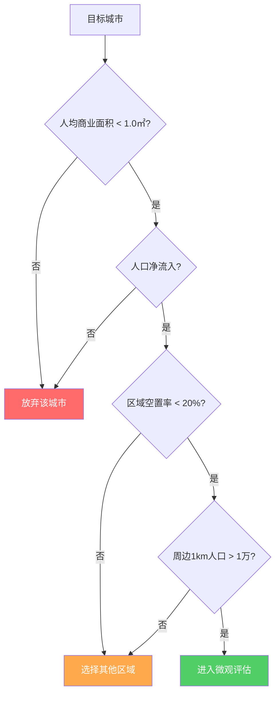

## 案例四：商铺投资的风险教训

> "一铺养三代"这句话在2015年之前或许成立，但在电商冲击、商业格局剧变的今天，商铺投资已经成为房地产投资中陷阱最密集的领域之一。本案例记录了一位投资者从满怀期望到深度套牢的完整经历，以及从中提炼出的商铺投资风险识别框架。

---

### 案例背景

#### 投资者画像

| 维度 | 信息 |
|------|------|
| 年龄 | 35岁，已婚，一个孩子 |
| 职业 | 二线城市国企中层，家庭年收入约35万 |
| 投资经验 | 有一套自住房和一套住宅出租经验 |
| 投资动机 | 想为孩子教育基金做长期资产配置 |
| 可用资金 | 首付能力80万，可承受月供1.2万以内 |

#### 投资时点

2019年初，该投资者所在城市正经历一轮商业地产开发热潮。多个综合体项目同时入市，开发商纷纷打出"包租十年""年化回报8%"等宣传口号。投资者张先生（化名）在朋友推荐下，开始关注一个位于城市新区的商业街项目。

#### 项目基本情况

该项目由一家区域性开发商操盘，位于城市规划的新区核心地段，主打"社区底商+沿街旺铺"概念：

- **位置**：城市新区某主干道旁，距老城区约15公里
- **业态规划**：底层商铺（1-2层），上层为住宅
- **商铺面积**：30-80平方米不等
- **单价**：2.5万-3.8万/平方米（同期住宅约1.2万/平方米）
- **总价区间**：75万-300万
- **承诺回报**：开发商承诺前三年返租，年化租金回报率8%
- **产权年限**：40年商业产权

张先生最终选择了一间约50平方米、单价3万、总价150万的沿街商铺，首付75万（50%），贷款75万，月供约8500元。

---

### 投资决策过程：七个致命误判

#### 误判一：被"包租返利"冲昏头脑

开发商承诺的"年化8%返租"是最大的诱饵。张先生算了一笔账：

- 总价150万，年返租12万（150万×8%）
- 三年返租合计36万，相当于首付从75万降到39万
- 月供8500元，返租月均1万，还能覆盖月供

**实际发生了什么：**

开发商的返租资金来源是购房者自己的购房款。本质上是"用你的钱返给你"的庞氏逻辑。返租协议由一个注册资本仅100万的商业管理公司签订，而非开发商本身。


**教训：** 包租返利的本质是开发商的促销手段，不是真正的投资回报。真正的商铺租金回报率在中国大多数城市仅3%-5%（毛租金），扣除空置期和维护成本后净回报更低。任何承诺超过6%的返租，都需要追问"钱从哪里来"。

#### 误判二：混淆"规划利好"与"真实需求"

开发商宣传的核心卖点是：

- 地铁3号线规划经过（预计2023年通车）
- 项目南侧规划了一个大型公立小学
- 新区管委会已确定搬迁至附近
- 周边3公里内有5个已交付住宅小区，常住人口将超10万

**实际情况：**

| 宣传利好 | 签约时状态 | 交房后两年状态 |
|----------|-----------|---------------|
| 地铁3号线 | 规划公示阶段 | 因财政困难推迟至2028年 |
| 公立小学 | 选址确认 | 土地未征收，开工遥遥无期 |
| 管委会搬迁 | 传闻阶段 | 最终选址在另一片区 |
| 周边住宅入住 | 部分交付 | 入住率不足35%，多数为投资房 |

**教训：** 新区商铺投资的核心风险在于"画饼"。规划与落地之间存在巨大的时间差和不确定性。在政府财政收紧的背景下，基础设施规划的兑现率大幅下降。投资商铺应基于**已兑现的人口和消费力**，而非规划中的蓝图。

#### 误判三：忽略了商铺与住宅的本质差异

张先生以住宅投资的经验来判断商铺，犯了几个关键错误：

| 对比维度 | 住宅 | 商铺 |
|----------|------|------|
| 产权年限 | 70年 | 40年 |
| 贷款首付 | 最低20% | 最低50% |
| 贷款年限 | 最长30年 | 最长10年 |
| 贷款利率 | 首套优惠 | 无优惠，通常上浮10%-20% |
| 交易税费 | 相对较低 | 增值税+土地增值税+个税，综合税率可达差价的30%-50% |
| 转手难度 | 有刚需支撑 | 极难转手，接盘侠稀缺 |
| 租金波动 | 相对稳定 | 受商业环境影响剧烈 |
| 空置风险 | 低（居住刚需） | 高（商业过剩） |
| 增值逻辑 | 跟随城市发展 | 依赖商圈成熟度 |

**教训：** 商铺是完全不同的投资品。住宅有居住刚需兜底，商铺则完全依赖商业运营。商铺的流动性远低于住宅，一旦买入，可能面临"卖不掉、租不出、用不上"的三重困境。

#### 误判四：未做真实的租金调研

张先生的租金预期来自开发商的宣传材料：

- 开发商宣称该区域商铺租金可达150-200元/平方米/月
- 按此计算，50平方米月租金7500-10000元

**实际租金调研（交房后）：**

张先生交房后亲自走访了周边已开业的商铺：

| 调研对象 | 面积 | 实际月租金 | 折合单价 |
|----------|------|-----------|----------|
| 隔壁小区底商A（便利店） | 45㎡ | 3000元 | 67元/㎡/月 |
| 隔壁小区底商B（理发店） | 35㎡ | 2500元 | 71元/㎡/月 |
| 对面小区底商C（空置） | 60㎡ | 挂牌3500元 | 58元/㎡/月 |
| 同项目另一业主招租 | 50㎡ | 挂牌4000元无人问津 | 80元/㎡/月 |

实际租金仅为开发商宣传的40%-50%。更致命的是，周边大量商铺空置，供远大于求。

**教训：** 投资商铺前，必须亲自做租金调研。方法是：在目标商铺周边1公里范围内，逐一走访正在经营的店铺，直接询问实际租金（而非中介挂牌价）。同时统计空置率——空置率超过30%的区域，新商铺几乎不可能按预期出租。

#### 误判五：忽视了商业规划的致命性

该项目的商铺设计存在严重的商业规划缺陷：

- **进深比不合理**：商铺进深12米、面宽仅4米，进深比达到3:1，远超行业建议的2:1上限。深处的空间几乎无法有效利用，很多业态（餐饮、零售）根本无法适配
- **层高不足**：一层层高3.6米，扣除楼板和装修后净高仅3米，无法满足大多数餐饮业态要求的4米以上层高
- **无烟道设计**：商铺未预留餐饮烟道，直接排除了最高租金承受力的业态
- **停车位严重不足**：整个商业街仅配建了20个车位，无法支撑任何需要停车的业态
- **动线设计失败**：商铺沿主干道排布，但主干道中间有隔离带，对面的居民无法步行到达

**教训：** 商铺的硬件条件决定了它能做什么业态，业态决定了租金水平。买商铺前必须带一个有商业运营经验的人实地考察，评估进深比、层高、烟道、上下水、停车位、人流动线等关键参数。

#### 误判六：低估了交易成本对退出的影响

当张先生在交房两年后（2023年）想要止损卖出时，才发现商铺的交易成本高得惊人：

**假设以原价150万卖出的成本明细：**

| 费用项目 | 金额 | 说明 |
|----------|------|------|
| 增值税 | 约7.1万 | 差额的5.3%（不满5年全额征收） |
| 土地增值税 | 约9.5万 | 差额的30%-60%累进税率 |
| 个人所得税 | 约3万 | 差额的20%或全额的1%-3% |
| 中介费 | 4.5万 | 成交价的3% |
| 合计 | 约24.1万 | 占售价的16% |

如果想要实际到手150万，需要报价约174万，而同区域商铺挂牌价普遍在100-120万，根本不可能成交。

**实际成交情况：**

张先生最终在2024年以95万的价格卖出，扣除贷款余额约68万，实际到手仅27万。相比当初投入的75万首付加上已还月供约30万（总计投入约105万），净亏损约78万。

**教训：** 商铺是"进去容易出来难"的投资品。在买入前，必须将交易成本纳入投资回报的测算。商铺的综合交易税费通常占增值部分的30%-50%，这意味着商铺的增值幅度需要远超住宅才能实现相同的净收益。

#### 误判七：没有风险预案

张先生的投资决策中完全没有"如果失败了怎么办"的预案：

- 没有预设止损线
- 没有计算过最坏情况下的现金流压力
- 没有考虑过商铺长期空置对家庭财务的影响
- 没有预留商铺装修和招租的额外资金

**教训：** 任何投资决策都必须包含最坏情况分析。商铺投资尤其如此——你需要回答：如果这个商铺5年租不出去，你的家庭财务是否还能正常运转？

---

### 商铺投资的核心风险清单

基于本案例的教训，以下是商铺投资必须系统评估的风险维度：

#### 风险一：供需失衡风险

中国商业地产的供应量严重过剩。根据中国商业联合会的数据：

- 2023年全国人均商业面积已达1.2平方米，远超国际警戒线的0.8平方米
- 二线城市人均商业面积更高达1.5-2.0平方米
- 社区底商空置率在多数城市超过25%

**评估方法：**

在目标区域进行"空置率实地调研"：

1. 沿目标商铺周边三条主要街道步行
2. 逐间记录商铺的经营状态（营业/空置/装修中）
3. 计算空置率 = 空置商铺数 / 总商铺数
4. 空置率 < 15%：可考虑投资
5. 空置率 15%-30%：高风险，需谨慎
6. 空置率 > 30%：不建议投资

#### 风险二：电商替代风险

线上零售对实体商铺的冲击是结构性的，而非周期性的：

| 消费类别 | 线上渗透率（2024年） | 对商铺的影响 |
|----------|---------------------|-------------|
| 服装鞋帽 | 45%+ | 严重冲击，街铺服装店大量关闭 |
| 3C数码 | 60%+ | 实体店沦为展示厅 |
| 日用百货 | 35%+ | 社区便利店受冲击但仍有生存空间 |
| 餐饮 | 5%（堂食）/ 35%（外卖） | 堂食受影响有限，但外卖降低了对好位置的需求 |
| 教育培训 | 15%+ | 线下需求仍存但监管趋严 |
| 医疗美容 | 5% | 线下刚需，受冲击最小 |
| 便利服务 | 3% | 理发、维修等即时服务仍有线下刚需 |

**结论：** 只有"即时性、体验性、不可替代性"的业态才能在电商时代存活。投资商铺时，必须评估该商铺能承载的业态是否具备这三个特征。

#### 风险三：开发商信用风险

返租承诺的执行主体通常是：

- 开发商旗下的商业管理公司（注册资本低，独立法人）
- 第三方运营公司（与开发商关系松散）
- 甚至有些是临时成立的壳公司

这些公司的偿付能力极弱，一旦招商不顺或开发商资金链紧张，返租承诺就是一纸空文。

**识别方法：**

1. 查工商信息：返租协议签订主体的注册资本、实缴资本、股东结构
2. 查司法风险：在"天眼查"或"企查查"上搜索该主体的涉诉记录
3. 查关联关系：确认该主体与开发商的实际控制关系
4. 查资金监管：返租金是否纳入银行资金监管账户

#### 风险四：产权与法律风险

商铺投资中常见的法律陷阱：

- **使用权商铺**：部分开发商只卖"使用权"而非产权，本质是长期租赁合同，受合同法20年最长租赁期限约束
- **分割产权**：大面积商铺分割成小面积出售，消防验收可能无法通过
- **人防工程**：地下商铺可能是人防工程改建，产权归属复杂
- **共有部分争议**：商铺门前的广场、通道可能是全体业主共有，收益分配存在争议

**防范措施：**

1. 要求查看完整的产权证明文件和规划许可证
2. 委托律师审查购房合同中的免责条款
3. 确认商铺是否具备独立的产权证和土地证
4. 核实消防验收是否通过

#### 风险五：运营管理风险

即使商铺成功出租，运营管理中的风险也不容忽视：

- **租户经营不善**：租户倒闭导致空置，重新招租需要时间
- **租金递减**：随着周边竞争加剧，租金可能逐年下降
- **物业维护成本**：商铺的物业费、维修基金通常高于住宅
- **业态调整风险**：政府可能调整区域规划，限制某些业态

#### 风险六：流动性陷阱

商铺的流动性极差，这是最容易被忽视的风险：

- **接盘群体窄**：商铺买家主要是投资客，而非刚需
- **银行估值低**：二手商铺的银行评估价通常低于市场价，买家贷款额度有限
- **税费转嫁难**：高额交易税费使卖方很难找到愿意接受价格的买家
- **信息不对称**：二手商铺市场缺乏透明的价格发现机制

---

### 商铺投资的正确决策框架

如果经过风险评估后仍决定投资商铺，以下是系统化的决策流程：

#### 第一步：宏观筛选（城市与区域）



#### 第二步：微观评估（项目与商铺）

| 评估维度 | 优质标准 | 危险信号 |
|----------|---------|---------|
| 商圈成熟度 | 周边已有成熟商业运营3年以上 | 全新商圈，无任何运营先例 |
| 人流量 | 工作日日均有效人流3000+ | 人流依赖规划中的地铁/学校 |
| 业态适配 | 进深比≤2:1，层高≥4米，有烟道 | 进深比>2.5:1，无烟道，层高<3.5米 |
| 竞争格局 | 1公里内无同类型大型商业 | 周边3公里内有3个以上综合体 |
| 停车条件 | 车位配比≥1:50㎡ | 车位严重不足或无停车位 |
| 租售比 | 月租金/售价 ≥ 0.5% | 月租金/售价 < 0.3% |
| 开发商资质 | 头部开发商，有成功商业运营经验 | 区域性小开发商，首次做商业 |

#### 第三步：财务测算

投资商铺必须进行严格的财务测算，核心指标包括：

**静态租金回报率：**

```text
年租金回报率 = 年净租金收入 / 商铺总价 × 100%

其中：
年净租金收入 = 月租金 × 12 × (1 - 空置率) - 年物业管理费 - 年维修基金 - 年保险费
```

**动态投资回报率（考虑杠杆）：**

```text
实际投资回报率 = (年净租金收入 - 年贷款利息) / 首付资金 × 100%
```

**持有期内的总回报：**

```text
总回报 = 累计租金收入 + 卖出时净收入 - 首付资金 - 累计月供 - 累计交易成本
```

**关键判断标准：**

- 如果静态租金回报率 < 5%（年化），不建议投资
- 如果动态投资回报率 < 3%（年化），说明杠杆不划算
- 如果总回报在10年持有期内为负，该项目不具备投资价值

#### 第四步：退出策略预设

在买入商铺之前，必须制定清晰的退出策略：

1. **止损线**：设定最大可接受亏损金额，触及后坚决执行
2. **时间线**：设定最长持有年限（建议不超过5年无回报即止损）
3. **替代方案**：如果无法卖出，是否可以自用或改造用途
4. **法律准备**：保留所有交易文件、沟通记录，以备维权

---

### 商铺投资的替代方案

对于希望获取商业地产收益但不想承担商铺投资风险的投资者，以下替代方案值得考虑：

#### 替代方案一：商业地产REITs

2021年中国正式推出基础设施公募REITs，部分产品涉及商业地产：

- **优势**：流动性强（交易所上市交易）、门槛低（几百元起投）、分散投资、专业管理
- **劣势**：产品数量有限、收益率受市场波动影响
- **适合人群**：希望获取商业地产收益但不想直接持有物业的投资者

#### 替代方案二：优质商铺REITs或商铺基金

部分金融机构推出了商铺类投资产品：

- **优势**：专业团队筛选和管理、分散投资多个商铺
- **劣势**：管理费较高、退出机制不如公募产品灵活
- **适合人群**：有一定资金量（通常50万起）的合格投资者

#### 替代方案三：住宅底商租赁而非购买

如果确实看好某个区域的商业前景：

- **优势**：资金占用少、退出灵活、不承担产权风险
- **劣势**：租金可能上涨、不享受物业增值
- **适合人群**：有实际经营需求的创业者

---

### 本案例的关键数据汇总

| 维度 | 买入时 | 卖出时 | 变化 |
|------|--------|--------|------|
| 商铺价格 | 150万 | 95万 | -36.7% |
| 首付投入 | 75万 | — | — |
| 累计月供 | — | 约30万（4年） | — |
| 累计返租收入 | — | 约18万（实际收到） | — |
| 交易税费+中介费 | — | 约10万 | — |
| 总投入 | 105万 | — | — |
| 总回收 | — | 55万（卖房款27万 + 返租18万 + 贷款余额抵扣10万） | — |
| **净亏损** | — | — | **约50万** |
| **亏损率** | — | — | **约47.6%** |

> 注：以上数据为基于典型案例的合理推算，实际数字因个案而异，但亏损比例在同类案例中具有代表性。

---

### 经验总结：商铺投资的"十不买"原则

从本案例中提炼出商铺投资的十条红线：

1. **不买新区首开商铺**——新区商业成熟至少需要5-8年，期间的空置成本足以吞噬所有收益
2. **不买承诺返租的商铺**——返租是开发商的促销工具，不是投资回报
3. **不买小开发商的商铺**——商业运营能力是开发商的核心竞争力，小开发商缺乏经验和资源
4. **不买进深比大于2.5:1的商铺**——这样的商铺业态适配性极差，租金上不去
5. **不买无法做餐饮的商铺**——餐饮是线下最抗电商冲击的业态，也是租金承受力最高的业态
6. **不买周边空置率超过30%的商铺**——供大于求的市场，新入场者只能接受更低的租金
7. **不买租金回报率低于5%的商铺**——低于这个数字，不如把钱存银行
8. **不买没有独立产权证的商铺**——使用权商铺、分割产权商铺都存在法律风险
9. **不买停车位严重不足的商铺**——没有停车条件的商铺，只能做最低端的业态
10. **不买自己算不清账的商铺**——如果财务模型在乐观假设下都不赚钱，现实中一定亏钱

---

### 写在最后

商铺投资是房地产投资中专业门槛最高的领域之一。它不像住宅那样有刚需兜底，也不像股票那样流动性充足。一笔失败的商铺投资，可能让你的资金被锁死5-10年，最终以大幅亏损收场。

**对于普通投资者的建议：**

- 如果你的投资经验仅限于住宅，不要轻易涉足商铺
- 如果你没有商业运营的经验或资源，不要买商铺
- 如果你无法承受5年以上的资金锁定期，不要买商铺
- 如果你无法独立完成租金调研和财务测算，不要买商铺

与其冒着巨大的风险去投资商铺，不如将资金配置到流动性更好、风险更可控的资产中——比如REITs、指数基金，甚至是最简单的银行定期存款。

**投资的第一原则永远是：保住本金。**
