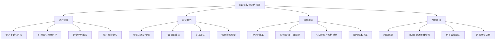

## 案例五：REITs投资实操——不买房也能收租的投资之路

### 案例背景

#### 投资者画像

本案例的主角是一位 35 岁的产品经理（化名"林晨"），坐标杭州，家庭年收入约 50 万元。林晨的情况代表了大量城市中产的典型困境：

- 有一套自住房产，但没有多余资金购买第二套房
- 对房地产投资感兴趣，但受制于限购政策和高额首付
- 希望获得不动产带来的稳定现金流，但不想承担房东的管理麻烦
- 风险偏好中等，追求"比银行存款高、比股票稳"的收益

2021 年 6 月，中国首批基础设施公募 REITs 正式上市，为林晨这样的人群打开了一扇全新的大门。

#### 什么是 REITs：快速回顾

REITs（Real Estate Investment Trusts，不动产投资信托基金）是一种将不动产资产证券化的金融产品。简单来说：

```text
传统买房投资：
  你 → 出资 300 万 → 买一套房 → 收租 → 管理维护

REITs 投资：
  你 → 出资 1000 元 → 买入基金份额 → 享受分红 → 专业团队管理

核心区别：
┌──────────────┬──────────────────┬──────────────────┐
│   维度       │   直接买房       │   投资 REITs     │
├──────────────┼──────────────────┼──────────────────┤
│ 最低门槛     │ 几十万-几百万    │ 100-1000 元      │
│ 流动性       │ 低，卖房需数月   │ 高，T+1 交易     │
│ 管理负担     │ 高，需亲自管理   │ 无，专业团队运营 │
│ 分散投资     │ 难，一套房集中   │ 易，可买多只     │
│ 收益来源     │ 租金+房价增值    │ 分红+价格波动    │
│ 杠杆         │ 可贷款           │ 通常不可         │
│ 税费         │ 契税+个税+中介费 │ 基金交易费用     │
│ 价格波动     │ 不透明，缓慢     │ 透明，实时波动   │
└──────────────┴──────────────────┴──────────────────┘
```

#### 中国公募 REITs 市场概览

中国公募 REITs 于 2021 年 6 月 21 日正式上市，首批 9 只产品。截至 2025 年底，已上市的公募 REITs 超过 40 只，总市值超过 1200 亿元。底层资产涵盖：

| 资产类型 | 代表产品 | 特点 |
|----------|----------|------|
| 产业园区 | 华安张江光大REIT、博时蛇口产园REIT | 租户以科技企业为主，租金增长潜力大 |
| 仓储物流 | 中金普洛斯REIT、红土盐田港REIT | 电商驱动需求，现金流稳定 |
| 高速公路 | 浙商沪杭甬REIT、平安广州广河REIT | 现金流可预测，但受经济周期影响 |
| 保障性租赁住房 | 华夏北京保障房REIT、中金厦门安居REIT | 政策支持，出租率高，但收益率偏低 |
| 环保能源 | 富国首创水务REIT、鹏华深圳能源REIT | 受政策和公用事业定价影响 |
| 商业办公 | 嘉实物美REIT、华夏华润商业REIT | 2023年后新增类型，消费属性强 |

---

### 执行过程：从入门到实操的完整路径

#### 第一阶段：知识储备与市场研究（2021年3月-6月）

##### 起步的动机

2021 年初，林晨在一次行业会议上听到有人讨论"公募 REITs 即将开闸"。他此前对 REITs 的了解仅限于"海外有一种不用买房就能收租的东西"。出于好奇，他开始了系统性学习。

##### 学习路径

林晨用了约 3 个月时间完成了以下学习：

**第一个月：基础概念建立**

- 阅读证监会《公开募集基础设施证券投资基金指引（试行）》全文
- 研读沪深交易所的 REITs 业务规则
- 学习 REITs 的三种估值方法：收益法（DCF）、市场比较法、资产基础法
- 理解"资产支持专项计划 + 公募基金"的双层架构

**第二个月：研究首批产品**

逐只阅读首批 9 只 REITs 的招募说明书，重点关注：

```text
每只产品需要搞清楚的 10 个问题：
1. 底层资产是什么？在哪里？面积多大？
2. 资产评估价值是多少？评估假设是否合理？
3. 当前出租率是多少？历史出租率趋势？
4. 主要租户是谁？租户集中度如何？
5. 剩余土地使用权年限还有多久？
6. 预期分派率是多少？分派频率？
7. 管理人的运营能力和历史业绩？
8. 存续期限是多久？到期如何处置？
9. 有哪些风险因素？最坏情况会怎样？
10. 与同类资产相比，估值是否合理？
```

**第三个月：建立分析框架**

林晨结合自己的产品分析能力，建立了一套 REITs 评估框架：



##### 关键认知突破

在学习过程中，林晨形成了几个重要的认知：

**认知一：中国 REITs 不是"炒股票"。** 公募 REITs 的本质是"资产支持证券"，收益主要来自底层资产的运营收入（租金、收费等），而不是二级市场的价格波动。把它当股票炒，大概率会失望。

**认知二：分派率是核心指标。** 与股票投资看"市盈率"不同，REITs 投资最核心的指标是"净现金流分派率"——即每年实际分到手的现金占买入价格的比例。首批产品的预期分派率在 4%-12% 之间。

**认知三：存续期限很重要。** 中国公募 REITs 大多有明确的存续期限（如高速公路 20 年、产业园区 20-50 年），到期后资产处置或续期，这与海外"永续型 REITs"有本质区别。

---

#### 第二阶段：首批产品投资（2021年6月）

##### 认购决策

2021 年 6 月，首批 9 只 REITs 开始发售。林晨决定用 5 万元参与认购，他选择了 3 只产品：

| 产品 | 认购金额 | 选择理由 |
|------|----------|----------|
| 中金普洛斯REIT（508056） | 20,000 元 | 仓储物流赛道好，普洛斯是全球顶级物流地产运营商 |
| 华安张江光大REIT（508000） | 20,000 元 | 张江科学城核心区位，科技企业租户质量高 |
| 浙商沪杭甬REIT（508001） | 10,000 元 | 高速公路现金流可预测，且地处长三角经济带 |

**认购时的关键计算：**

```text
中金普洛斯REIT：
  发行价：3.89 元/份
  预期分派率：约 4.15%（2021年预测）
  底层资产：7 个仓储物流园区，总面积约 70 万平方米
  出租率：约 85%
  剩余土地年限：约 37 年

华安张江光大REIT：
  发行价：2.99 元/份
  预期分派率：约 4.74%（2021年预测）
  底层资产：张江光大园，位于上海张江科学城
  出租率：约 95%
  剩余土地年限：约 38 年

浙商沪杭甬REIT：
  发行价：8.72 元/份
  预期分派率：约 12%（2021年预测，含资产评估增值部分）
  底层资产：杭徽高速浙江段
  剩余收费年限：约 12 年
```

##### 认购结果

由于首批 REITs 认购火爆，采取了"末日比例配售"的方式：

```text
中金普洛斯REIT：配售比例约 1.8%，林晨实际获配约 360 元
华安张江光大REIT：配售比例约 1.5%，林晨实际获配约 300 元
浙商沪杭甬REIT：配售比例约 2.4%，林晨实际获配约 240 元

首批认购实际投入：约 900 元
剩余资金：约 49,100 元（退回后在二级市场逐步买入）
```

这个配售比例让林晨深刻体会到了"僧多粥少"——首批公募 REITs 的受欢迎程度远超预期。

---

#### 第三阶段：二级市场建仓与策略调整（2021年7月-2022年12月）

##### 二级市场逐步买入

认购配售太少，林晨转向二级市场逐步建仓。他采用"定投+择时"的策略：

**定投规则：**
- 每月固定投入 3000 元买入 REITs
- 按照 40% 仓储物流 + 35% 产业园区 + 25% 高速公路的比例分配
- 当某只产品价格偏离净值超过 15% 时，调整买入比例

**择时规则：**
- 当市场整体溢价率超过 20% 时，暂停定投
- 当市场整体折价率超过 10% 时，加倍定投
- 新产品上市首日不参与追涨

##### 2021年下半年：尝到甜头

首批 REITs 上市后表现强劲：

```text
2021 年 6 月 21 日上市首日至 2021 年底：

中金普洛斯REIT：3.89 → 5.20 元，涨幅 +33.7%
华安张江光大REIT：2.99 → 3.85 元，涨幅 +28.8%
浙商沪杭甬REIT：8.72 → 11.50 元，涨幅 +31.9%

同期分红：
中金普洛斯REIT：0.08 元/份（约 2.1% 年化）
华安张江光大REIT：0.07 元/份（约 2.3% 年化）
浙商沪杭甬REIT：0.45 元/份（约 5.2% 年化）
```

林晨此时的 REITs 持仓市值约 2.8 万元，半年浮盈约 5500 元，加上分红约 400 元。他感到非常兴奋——"不用买房也能收租，而且涨幅比房子还快"。

但这种兴奋很快被现实打脸。

##### 2022年：市场的教训

2022 年，REITs 市场经历了大幅波动。多重因素叠加导致价格回调：

- 宏观经济下行压力加大
- 部分底层资产出租率下降（疫情冲击产业园区）
- 市场流动性不足，少量卖单就能砸出大坑
- 投资者结构单一，机构投资者占比过高导致"踩踏"

```text
2022 年全年表现：

中金普洛斯REIT：5.20 → 3.95 元，跌幅 -24.0%
华安张江光大REIT：3.85 → 2.80 元，跌幅 -27.3%
浙商沪杭甬REIT：11.50 → 8.20 元，跌幅 -28.7%

林晨的持仓情况：
  年初市值：约 42,000 元
  年末市值：约 31,500 元
  浮亏：约 10,500 元
  全年分红：约 2,100 元
  扣除分红后的净浮亏：约 8,400 元
```

这是林晨投资 REITs 以来最痛苦的阶段。他一度产生了"割肉离场"的念头。

##### 关键转折：坚持的理由

林晨最终选择坚持，原因有三：

**一、回归分派率逻辑。** 他重新算了一笔账——以中金普洛斯 REIT 为例，3.95 元的价格对应的净现金流分派率约为 5.2%（相比发行时的 4.15%，收益率反而更高了）。价格下跌意味着"打折买入同样的资产"。

**二、底层资产没有恶化。** 他逐只检查了持仓产品的运营数据：出租率保持在 80% 以上，租金水平没有大幅下降，管理人也没有出现重大问题。价格下跌是市场情绪导致的，而非基本面恶化。

**三、流动性陷阱的认知。** 中国公募 REITs 市场日均成交额只有几亿元，机构投资者占比超过 60%。这种市场结构下，价格容易出现"超涨超跌"。短期价格波动不反映资产真实价值。

```text
林晨在 2022 年底的自我说服逻辑：

"如果一套房的租金回报率是 3%，房价跌了 30%，
你会因为账面亏损就把房子贱卖吗？
不会，因为你知道房子还在、租客还在、租金还在收。
REITs 也是一样——底层的仓库、产业园、高速公路还在，
租金还在收、分红还在发。
价格跌了，只是别人不要了，不是资产不好了。"
```

---

#### 第四阶段：策略升级与持续投资（2023年-2025年）

##### 建立系统化的投资框架

经历了 2022 年的教训后，林晨不再"凭感觉"投资 REITs，而是建立了一套完整的投资体系。

**投资纪律（铁律）：**

```text
一、仓位纪律
  - REITs 总仓位不超过可投资资产的 25%
  - 单只产品不超过 REITs 仓位的 30%
  - 单一资产类型不超过 REITs 仓位的 50%

二、买入纪律
  - 只在"净现金流分派率 > 同期十年国债收益率 + 2%"时买入
  - 新产品上市首月不追涨，等价格稳定后再评估
  - 折价超过 15% 时才考虑加仓

三、卖出纪律
  - 溢价超过 30% 时减仓 1/3
  - 底层资产出租率连续两个季度低于 70% 时清仓该只
  - 管理人发生重大人事变动或合规问题时清仓该只

四、分红纪律
  - 所有分红全部再投资，不取出消费
  - 分红再投资优先买入折价最大的持仓产品
```

##### 2023年：市场回暖与产品扩容

2023 年，REITs 市场经历了先跌后涨的走势，但整体好于 2022 年。同时，市场扩容带来了更多投资标的——保障性租赁住房、商业消费类 REITs 相继上市。

林晨在 2023 年新增了两只持仓：

| 产品 | 买入价格 | 买入理由 |
|------|----------|----------|
| 华夏北京保障房REIT（508068） | 2.85 元/份 | 政策支持强，出租率接近100%，现金流极其稳定 |
| 嘉实物美REIT（508085） | 2.60 元/份 | 消费复苏概念，底层商业物业位于北京核心区 |

##### 2024-2025年：收获期

随着市场逐渐成熟，林晨的投资进入了收获期：

```text
2024 年市场表现：

中金普洛斯REIT：3.95 → 4.60 元，涨幅 +16.5%
华安张江光大REIT：2.80 → 3.35 元，涨幅 +19.6%
浙商沪杭甬REIT：8.20 → 9.10 元，涨幅 +11.0%
华夏北京保障房REIT：2.85 → 3.10 元，涨幅 +8.8%
嘉实物美REIT：2.60 → 3.05 元，涨幅 +17.3%

2024 年全年分红收入：约 8,500 元
2024 年浮盈：约 15,200 元
```

---

### 成果数据

#### 四年投资全景

| 指标 | 2021年底 | 2022年底 | 2023年底 | 2024年底 | 2025年中 |
|------|----------|----------|----------|----------|----------|
| 累计投入本金 | 35,000元 | 71,000元 | 98,000元 | 115,000元 | 115,000元 |
| 持仓市值 | 42,000元 | 31,500元 | 68,000元 | 108,000元 | 125,000元 |
| 累计分红 | 400元 | 2,500元 | 6,800元 | 15,300元 | 21,000元 |
| 浮盈/浮亏 | +7,000元 | -39,500元 | -30,000元 | -7,000元 | +10,000元 |
| 总收益（浮盈+分红） | +7,400元 | -37,000元 | -23,200元 | +8,300元 | +31,000元 |
| 总回报率 | +21.1% | -52.1% | -23.7% | +7.2% | +27.0% |
| 持仓产品数 | 3只 | 3只 | 4只 | 5只 | 5只 |

**收益来源拆解：**

```text
截至 2025 年中的总收益构成：

价格波动收益（浮盈）：+10,000 元
  - 其中 2021 年大涨 +7,000
  - 其中 2022 年大跌 -39,500
  - 其中 2023-2025 年回升 +42,500
分红收益：+21,000 元
  - 年均分红收益率约 5.2%
  - 分红再投资带来的复利效应约 +2,000 元
────────────────────────
总收益：约 31,000 元
总投入：115,000 元
总回报率：约 27.0%（4 年）
年化回报率：约 6.1%
```

#### 与直接买房投资的对比

假设林晨用同样的 11.5 万元作为首付，在杭州购入一套小户型投资房：

```text
假设场景：2021年6月购入杭州某郊区小户型
  房价：总价 150 万元，首付 30% = 45 万元（需额外借款 33.5 万元）
  月供：约 5,800 元（贷款 105 万，利率 5.0%，30 年）
  租金收入：约 2,500 元/月
  月现金流缺口：-3,300 元/月
  4 年总月供支出：约 278,000 元
  4 年总租金收入：约 120,000 元
  4 年净现金流出：约 158,000 元

  2025年房价假设：
  乐观（涨10%）：165万，扣除贷款余额约98万，净值约67万
  中性（不涨不跌）：150万，净值约52万
  悲观（跌15%）：127.5万，净值约29.5万

  对比总结：
  ┌──────────────┬──────────────┬──────────────┐
  │              │   REITs 投资 │   直接买房   │
  ├──────────────┼──────────────┼──────────────┤
  │ 初始投入     │ 11.5万       │ 45万+杠杆    │
  │ 4年现金流    │ +2.1万分红   │ -15.8万缺口  │
  │ 4年价格变化  │ +1.0万浮盈   │ +15万/-22.5万│
  │ 管理负担     │ 无           │ 高           │
  │ 流动性       │ T+1卖出      │ 需数月       │
  │ 灵活性       │ 可随时加减仓 │ 无法部分卖出 │
  └──────────────┴──────────────┴──────────────┘
```

REITs 的优势在于：门槛低、流动性好、无管理负担、现金流为正。劣势在于：无法使用杠杆放大收益、没有"自住"功能、价格波动更频繁。

---

### 经验总结：REITs 投资的八大原则

#### 原则一：把 REITs 当"收租工具"而非"炒股标的"

REITs 的核心价值是稳定分红，而非短期价差。如果你买入一只 REITs 是因为"最近涨得好"，那和追涨股票没有区别。正确的做法是：先看分派率，再看资产质量，最后看价格。

**实操检验标准：** 买入一只 REITs 之前，问自己——"如果明天开始停止交易一个月，我会不会因为无法卖出而焦虑？"如果答案是"会"，说明你的买入逻辑有问题。

#### 原则二：分散投资是生命线

不要把所有钱都押在一只 REITs 上。不同资产类型的风险因素完全不同：

| 资产类型 | 主要风险 | 与经济周期相关性 |
|----------|----------|------------------|
| 仓储物流 | 电商增速放缓、租金下降 | 中等 |
| 产业园区 | 企业缩减办公面积、空置率上升 | 较高 |
| 高速公路 | 车流量下降、收费年限到期 | 较高 |
| 保障性租赁住房 | 政策调整、租金管制 | 较低 |
| 商业消费 | 消费降级、电商冲击 | 高 |

林晨的经验是：至少持有 3 种不同资产类型的 REITs，单只产品仓位不超过总仓位的 30%。

#### 原则三：关注分派率而非净值增长率

很多投资者被"净值增长"吸引，忽略了分派率。但 REITs 的本质是"收租"，分红才是你真正拿到手的钱。

```text
分派率计算公式：

净现金流分派率 = 预计年度可分配金额 / 基金市值

例如：
  某 REITs 预计年度可分配金额为 0.20 元/份
  当前价格为 3.50 元/份
  净现金流分派率 = 0.20 / 3.50 = 5.7%

判断标准：
  分派率 < 3%：可能高估，谨慎买入
  分派率 3%-5%：合理区间，适合长期持有
  分派率 5%-8%：有吸引力，但需确认分红可持续性
  分派率 > 8%：警惕陷阱，可能是特殊因素导致
```

#### 原则四：读懂底层资产的"体检报告"

每只 REITs 每季度发布运营公告，披露出租率、租金水平、重大事项等关键数据。这是你判断资产质量的最重要信息来源。

**必须跟踪的核心指标：**

```text
产业园区类：
  - 出租率（警戒线：低于 75%）
  - 平均租金单价及同比变化
  - 租户行业分布（科技、金融、制造等）
  - 前五大租户占比（过高则集中度风险大）
  - 续租率

仓储物流类：
  - 出租率（警戒线：低于 80%）
  - 租金单价及续约租金增长率
  - 租户行业分布（电商、第三方物流、制造业等）
  - 库存周转率变化（反映租户经营状况）

高速公路类：
  - 日均车流量及同比变化
  - 日均收费金额
  - 剩余收费年限
  - 大修计划及资本支出

保障性租赁住房类：
  - 出租率（通常接近 100%）
  - 租金收缴率
  - 政策调整动向
  - 周边新增供给情况
```

#### 原则五：理解 REITs 的"利率敏感性"

REITs 的价格与利率呈反向关系。当利率下行时，REITs 的分派率相对更有吸引力，资金流入推高价格；当利率上行时，情况相反。

```text
利率影响机制：

十年国债收益率 = 2.5%
某 REITs 分派率 = 5.5%
利差 = 3.0%（有吸引力 → 资金流入 → 价格上涨）

十年国债收益率上升到 3.5%
某 REITs 分派率 = 5.5%（不变）
利差 = 2.0%（吸引力下降 → 资金流出 → 价格下跌）

投资启示：
  利率下行周期 → REITs 牛市概率高
  利率上行周期 → REITs 承压，但分派率提高意味着"打折买入"
  利率高位横盘 → 最佳建仓时机（高分派率 + 利率见顶）
```

#### 原则六：新产品上市不追涨

中国公募 REITs 市场有一个显著特征——新产品上市初期往往被爆炒，溢价率动辄超过 20%、30%，然后在 3-6 个月内回归理性价格。

```text
典型的价格走势模式：

上市首日 → 大幅溢价（+20%~+50%）
1-3个月 → 溢价收窄，价格回落
3-6个月 → 回归合理估值区间
6-12个月 → 开始反映真实运营数据

教训案例：
  某只保障房 REITs 上市首日涨幅 30%，
  3 个月后跌回发行价，追高者亏损约 23%。

正确做法：
  1. 新产品上市后观察 1-3 个月
  2. 等待价格稳定后再评估
  3. 如果基本面好、价格合理，再考虑买入
```

#### 原则七：利用"折价"机会加仓

REITs 市场由于流动性不足，经常出现非理性折价。当一只基本面没有恶化的 REITs 价格大幅下跌时，反而是加仓的好机会。

**林晨的折价加仓策略：**

```text
折价程度与加仓力度：

价格相对净值折价 10% → 小额试探买入（计划仓位的 10%）
价格相对净值折价 15% → 中等力度买入（计划仓位的 20%）
价格相对净值折价 20% → 重仓买入（计划仓位的 30%）
价格相对净值折价 25%+ → 检查基本面是否有恶化，无恶化则全力买入

前提条件：
  - 底层资产运营数据无重大恶化
  - 管理人无重大问题
  - 该产品流动性可接受（日均成交额 > 500 万元）
```

#### 原则八：分红再投资是复利的关键

REITs 的分红如果不取出消费而是再投资，长期来看复利效应非常显著。

```text
复利计算示例：

假设条件：
  初始投入：100,000 元
  年均分派率：5.5%
  年均价格增长：2%
  投资期限：20 年

分红取出不复投：
  终值 = 100,000 × (1 + 2%)^20 = 148,595 元
  累计分红 = 100,000 × 5.5% × 20 = 110,000 元
  总资产 = 258,595 元

分红全部复投：
  年化总回报 = 5.5% + 2% = 7.5%
  终值 = 100,000 × (1 + 7.5%)^20 = 424,785 元
  多赚 = 424,785 - 258,595 = 166,190 元（多 64%）

结论：分红再投资的复利效应在 20 年尺度上可以多赚 60% 以上。
```

---

### 风险警示：REITs 投资不可忽视的六大风险

#### 风险一：流动性风险

中国公募 REITs 市场日均成交额仅数亿元，远低于股票市场。这意味着：

- 大额买入或卖出可能显著影响价格
- 在市场恐慌时可能无法以合理价格卖出
- 机构投资者的集中买卖会放大价格波动

**应对策略：** 不要投入"随时需要用"的钱，REITs 投资的钱至少应该是 3 年以上不用的闲钱。

#### 风险二：底层资产恶化风险

REITs 的分红来自底层资产的运营收入。如果资产运营恶化，分红可能减少甚至中断：

```text
真实案例：
  某高速公路 REITs 因周边新建平行高速分流，
  日均车流量下降 25%，导致可分配金额大幅减少，
  价格从 10 元跌至 6.5 元，跌幅 35%。

  某产业园区 REITs 因主要租户（某互联网公司）大面积退租，
  出租率从 95% 骤降至 65%，
  分派率从 5% 降至 2.8%。
```

**应对策略：** 定期跟踪每季度运营数据，出租率连续下降或租金持续下调时果断减仓。

#### 风险三：政策风险

中国公募 REITs 市场仍处于发展初期，政策调整可能显著影响市场：

- 扩募规则变化可能稀释现有持有人权益
- 税收优惠政策调整可能影响实际收益
- 底层资产准入标准变化可能改变市场格局
- 土地使用权续期政策影响长期资产价值

#### 风险四：估值陷阱

高分派率不一定是好事，可能是"估值陷阱"：

```text
"分派率 10%！快来买！"——但你需要检查：

1. 高分派率是否因为一次性因素？
   （如资产评估增值分配、政府补贴到期等）

2. 分派率是否可持续？
   （底层资产的现金流能否支撑持续分红）

3. 是否存在"吃老本"的风险？
   （用本金或借贷来维持分红，这不可持续）

4. 剩余年限还有多久？
   （临近到期的 REITs，资产残值下降，分派率自然升高）
```

#### 风险五：市场结构风险

中国公募 REITs 市场投资者结构不够均衡：

- 机构投资者占比超过 60%，散户话语权有限
- 保险资金和银行理财是主要机构投资者，其行为具有同质性
- 当机构集体减仓时，市场会出现"流动性黑洞"

#### 风险六：通胀侵蚀风险

REITs 的分派率是名义收益率。如果通胀率高于分派率，实际购买力在缩水。

```text
例如：
  REITs 分派率 = 5%
  通胀率 = 3%
  实际收益率 = 5% - 3% = 2%

  如果通胀率上升到 6%：
  实际收益率 = 5% - 6% = -1%（实际亏损）

应对：
  选择有"租金通胀挂钩"特性的资产类型
  （如部分基础设施类 REITs，收费标准与 CPI 挂钩）
```

---

### 进阶思考：REITs 投资的高阶策略

#### 策略一：构建"REITs 组合"而非买单一产品

借鉴机构投资者的做法，构建一个多资产类型的 REITs 组合：

```text
推荐配置框架（稳健型）：

仓储物流 REITs：30%
  理由：电商渗透率提升是长期趋势，现金流相对稳定

产业园区 REITs：25%
  理由：科技创新驱动，优质园区需求旺盛

保障性租赁住房 REITs：20%
  理由：政策支持力度大，出租率高，波动小

高速公路/基础设施 REITs：15%
  理由：现金流可预测，受经济周期影响相对有限

商业消费类 REITs：10%
  理由：消费复苏弹性大，但风险也较高
```

#### 策略二：利用"REITs vs 债券"的利差交易

当 REITs 分派率与十年国债收益率的利差处于历史高位时，增配 REITs；利差处于历史低位时，减配 REITs。

```text
利差交易逻辑：

正常利差区间：REITs 分派率 - 国债收益率 = 2%~4%
  → 按计划正常配置

利差扩大到 5%+：REITs 相对债券极度便宜
  → 加仓 REITs，减配债券

利差缩小到 1% 以下：REITs 相对债券极度昂贵
  → 减仓 REITs，增配债券
```

#### 策略三：关注"扩募"机会

中国公募 REITs 允许扩募——即注入新的优质资产。成功的扩募可以提升基金规模、降低管理费率、增加分红。

**扩募的判断标准：**

- 扩募资产是否优质？（区位、出租率、现金流）
- 扩募价格是否合理？（是否对现有持有人有利）
- 管理人是否有能力运营更多资产？

#### 策略四：跨市场对比

有条件的话，可以关注港股和新加坡市场的 REITs，与内地产品进行对比：

```text
跨市场对比维度：

香港 REITs：
  优势：产品成熟、信息透明、部分有税收优惠
  劣势：港股流动性不佳、汇率风险、部分产品老旧

新加坡 REITs：
  优势：亚洲最成熟的 REITs 市场、产品丰富、管理规范
  劣势：距离远、信息获取不便、汇率风险

美国 REITs（通过 QDII）：
  优势：全球最大 REITs 市场、产品极丰富、流动性好
  劣势：汇率风险大、信息不对称、税务复杂
```

---

### 常见误区与纠正

#### 误区一："REITs 是低风险产品"

**真相：** REITs 的风险介于债券和股票之间。2022 年中国公募 REITs 平均跌幅超过 20%，个别产品跌幅超过 30%。它不是"保本产品"，也不是"类固收产品"。

#### 误区二："分派率越高越好"

**真相：** 高分派率可能是"估值陷阱"（参见风险警示第四条）。真正的好投资是"合理分派率 + 资产质量优秀 + 管理人能力强"。

#### 误区三："REITs 和房地产股是一回事"

**真相：** 两者有本质区别：

| 维度 | 公募 REITs | 房地产股票 |
|------|-----------|-----------|
| 底层资产 | 直接持有不动产 | 持有公司股权 |
| 收益来源 | 租金/收费分红 | 公司利润分红 |
| 杠杆水平 | 通常较低（<50%） | 通常较高（>70%） |
| 经营风险 | 单一资产，风险明确 | 公司整体经营，风险复杂 |
| 价格驱动 | 资产估值+利率 | 行业政策+公司经营+市场情绪 |
| 分红强制性 | 强制分配可分配金额的 90%+ | 分红由公司董事会决定 |

#### 误区四："买了就不用管了"

**真相：** REITs 需要持续跟踪。至少每季度检查一次：运营数据是否正常、分派是否如期、管理人有无重大变化、市场环境是否影响估值。

#### 误区五："REITs 只适合保守投资者"

**真相：** 不同类型的 REITs 风险收益特征差异很大。高速公路和保障房 REITs 偏稳健，产业园区和商业 REITs 有更高的增长弹性。激进型投资者可以通过增加后者的配比来提高组合预期收益。

---

### 工具清单：REITs 投资实用工具

#### 信息获取

| 工具 | 用途 | 获取方式 |
|------|------|----------|
| 沪深交易所官网 | 公告、运营数据 | 上交所/深交所官网 |
| 中国 REITs 信息网 | 产品汇总、分派率排名 | 各财经网站 |
| 基金招募说明书 | 产品深度分析 | 交易所官网或基金公司 |
| 季度运营公告 | 底层资产经营数据 | 交易所官网 |

#### 分析工具

| 工具 | 用途 | 说明 |
|------|------|------|
| Excel/飞书表格 | 分派率跟踪、组合分析 | 自建模板，记录每季度数据 |
| Wind/Choice 金融终端 | 专业数据查询 | 付费，适合深度投资者 |
| 同花顺/东方财富 | 行情查看、基本数据 | 免费，适合普通投资者 |

#### 交易渠道

| 渠道 | 费率 | 说明 |
|------|------|------|
| 券商 APP | 万分之三至万分之五 | 大多数券商已支持 REITs 交易 |
| 场外申购 | 认购费率约 0.5% | 仅限新产品发行期 |

---

### 附录：林晨的 REITs 投资复盘清单

林晨每半年做一次全面复盘，以下是他的检查清单：

**一、持仓健康度检查**
- [ ] 每只持仓的最新出租率/车流量是否在正常范围
- [ ] 最近一次分红是否如期到账，金额是否符合预期
- [ ] 管理人是否发布重大事项公告
- [ ] 组合中单只产品仓位是否超过 30%
- [ ] 单一资产类型仓位是否超过 50%

**二、估值合理性检查**
- [ ] 每只持仓的当前分派率是多少
- [ ] 分派率与十年国债的利差是否在合理区间
- [ ] 是否有产品溢价率过高需要减仓
- [ ] 是否有产品折价率过大需要研究原因

**三、市场环境检查**
- [ ] 宏观利率环境是否发生变化
- [ ] REITs 市场是否有新政策出台
- [ ] 是否有新的优质产品可以纳入组合
- [ ] 是否有产品即将到期需要提前规划

**四、资金管理检查**
- [ ] 下个月的定投金额和比例是否需要调整
- [ ] 分红再投资是否执行到位
- [ ] REITs 仓位占总可投资资产的比例是否在 25% 以内

---

### 核心启示

林晨四年的 REITs 投资经历，浓缩为以下几点核心认知：

**一、REITs 是"懒人版"的房地产投资。** 不需要看房、不需要谈判、不需要管理租客，却能享受不动产带来的租金收益。对于没有精力管理实物房产的上班族来说，REITs 是接触不动产投资的最佳入口。

**二、价格波动不等于风险，基本面恶化才是真正的风险。** 2022 年的大幅下跌教会了林晨一个道理——价格是市场情绪的反映，而资产质量才是价值的根基。只要底层资产在正常运营，价格早晚会回归。

**三、分散投资 + 长期持有 + 分红再投资 = REITs 投资的"不可能三角"的最优解。** 这三者缺一不可。分散降低风险，长期持有平滑波动，分红再投资放大复利。

**四、REITs 不是"稳赚不赔"的。** 它有流动性风险、资产恶化风险、政策风险、利率风险。任何告诉你"REITs 很安全"的人，要么不懂，要么在骗你。尊重风险，才能获得回报。

**五、最重要的投资决策是"是否投资"，而非"投资哪只"。** 很多人花大量时间研究哪只 REITs 更好，却迟迟不敢迈出第一步。林晨的经验是：先用小额资金入场体验，边投资边学习，远比纸上谈兵有效。
