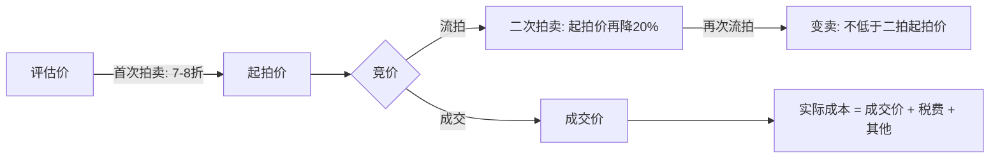
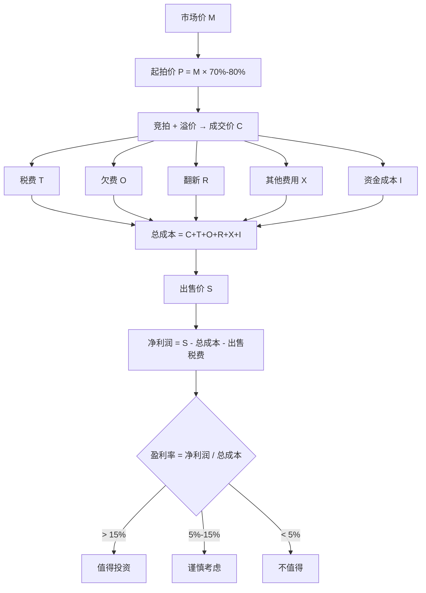

## 案例六：法拍房的套利机会

法拍房（司法拍卖房产）是中国房地产市场中一个特殊的投资渠道。当房产所有人因债务纠纷、贷款违约、司法判决等原因无法偿还债务时，法院依法对其名下房产进行强制拍卖，所得款项用于清偿债务。由于拍卖的目的是快速变现偿债，法拍房的起拍价通常低于市场价，这个价差就构成了套利空间。

但"便宜"的背后往往暗藏风险——隐性债务、占用纠纷、税费陷阱、清场困难等问题，让不少投资者从"捡漏"变成了"踩坑"。本案例通过周先生的真实操作经历，完整还原法拍房投资的全流程，剖析其中的机会与陷阱。

---

### 案例背景

#### 什么是法拍房：制度框架与运作机制

法拍房的法律依据主要是《民事诉讼法》第二百四十四条至第二百四十八条，以及《最高人民法院关于人民法院民事执行中拍卖、变卖财产的规定》。当被执行人未按执行通知履行法律文书确定的义务时，法院有权查封、扣押、冻结、拍卖其财产。

法拍房的来源主要包括以下几类：

| 来源类型 | 典型场景 | 占比（估算） | 隐性风险等级 |
|----------|----------|-------------|-------------|
| 银行贷款违约 | 房主断供，银行申请强制执行 | 约40%-50% | 中 |
| 民间借贷纠纷 | 房产抵押给民间借贷方，无力偿还 | 约20%-30% | 高（可能有多重抵押） |
| 司法判决执行 | 经济纠纷、离婚财产分割等判决 | 约15%-20% | 中高 |
| 涉刑事案件 | 没收违法所得、罚金执行 | 约5%-10% | 高（可能涉及复杂背景） |
| 企业破产清算 | 企业名下房产被强制处置 | 约5%-10% | 中 |

法拍房的拍卖流程在2017年发生重大变化——最高人民法院发布规定，要求司法拍卖全面转向网络拍卖。目前主要的法拍平台包括：

- **人民法院诉讼资产网**（最高院官方平台）
- **京东拍卖**（京东旗下，法拍房最多）
- **阿里拍卖·司法**（淘宝旗下，覆盖面广）
- **中国拍卖行业协会网**
- **工商银行融e购**
- **北京产权交易所**
- **公拍网**

不同平台上架的法拍房数量差异较大。京东拍卖和阿里拍卖是房源最集中的两个平台，建议同时关注。

#### 法拍房的价格形成机制

法拍房的价格由以下几个环节决定：



**评估价**：法院委托有资质的评估机构对房产进行市场价值评估。评估价通常参考近期同区域类似房产的成交价格，但评估时点可能与拍卖时点有数月差距，导致评估价偏高或偏低。

**起拍价**：首次拍卖的起拍价不得低于评估价的70%（即最低可打七折）。实践中，首次拍卖的起拍价通常设定为评估价的70%-80%。

**成交价**：最终成交价取决于竞拍人数和激烈程度。热门房源可能被竞价抬高至接近甚至超过市场价；冷门房源则可能在起拍价附近成交。

**实际成本**：成交价只是买入成本的一部分，还需要加上税费（契税、个税、增值税及附加）、可能存在的欠缴费用（物业费、水电费、燃气费）、以及清场费用（如果有人占用）。

#### 为什么法拍房存在价差

法拍房低于市场价的原因主要有四点：

1. **信息不对称**：法拍房市场参与者相对较少，很多人不知道或不敢参与，竞争不如二手房市场激烈
2. **风险折价**：法拍房存在隐性风险（占用、欠费、产权瑕疵），买家要求风险补偿
3. **全款要求**：多数法拍房要求短期内（通常7-30天）全额付款，限制了利用杠杆的买家数量
4. **心理因素**：中国传统文化忌讳"别人不要的房子"，法拍房在心理上有一定贬值

周先生正是利用了这些因素，以低于市场价25%的价格拍入一套住宅，并在6个月内完成翻新出售，实现了年化33%的收益。

---

### 案例主角与决策背景

周先生，35岁，二线城市某企业中层管理人员，年薪约30万元。他此前有过两套房产的购买和出售经验，对房地产交易流程较为熟悉，但没有法拍房投资经历。

2022年初，周先生注意到所在城市法拍房数量明显增多——这与当时的经济环境和部分业主断供有关。他开始系统性地研究法拍房市场，经过3个月的学习和准备工作，决定出手。

#### 周先生选择法拍房投资的原因

| 维度 | 具体考量 |
|------|---------|
| 市场机会 | 2022年法拍房供应量增加，竞争相对不那么激烈 |
| 资金条件 | 手头有约180万流动资金，可以全款支付 |
| 专业知识 | 有房产交易经验，了解过户、税费流程 |
| 风险承受 | 设定了单笔最大亏损20万的止损线 |
| 时间精力 | 可以投入2-3个月做尽调和后续处置 |

---

### 执行过程：从筛选到退出的全链条操作

#### 第一阶段：系统学习与信息收集（第1-2个月）

周先生没有急于出手，而是花了两个月时间做法拍房的知识储备和市场调研。

##### 学习法拍房的法律知识

他系统学习了以下内容：

- 《民事诉讼法》中关于执行拍卖的条款
- 《最高人民法院关于人民法院民事执行中拍卖、变卖财产的规定》
- 《最高人民法院关于人民法院网络司法拍卖若干问题的规定》（法释〔2016〕18号）
- 所在城市关于法拍房的限购政策（部分城市法拍房也纳入限购范围）
- 法拍房的税费政策（特别是原业主可能产生的税费转嫁问题）

##### 建立法拍房筛选标准

经过研究，周先生建立了自己的法拍房筛选框架：

```yaml
筛选标准:
  价格门槛:
    - 起拍价低于市场价30%以上
    - 成交价（含所有费用）低于市场价15%以上
  房源类型:
    - 优先：住宅（70年产权）
    - 谨慎：商住公寓（税费高、贷款难）
    - 回避：商铺、写字楼（流动性差）
  产权状况:
    - 必须：产权清晰，已取得不动产权证
    - 必须：无多重抵押
    - 优选：法院已明确公告无租约
  占用情况:
    - 最优选：空置（公告明确标注"空置"）
    - 次选：被执行人自行居住（法院承诺协助清场）
    - 回避：有案外人占用、有长期租约
  区域选择:
    - 优选：成熟居住区，交通便利，配套完善
    - 原因：便于后续出租或出售，流动性好
```

##### 关注和跟踪目标房源

在京东拍卖和阿里拍卖上，周先生同时关注了约30套法拍房。他建立了跟踪表格，记录每套房产的基本信息、评估价、起拍价、围观人数、报名人数等关键数据。通过持续跟踪，他总结出以下规律：

- 围观人数超过500但报名人数不足10的房源，成交价通常较低
- 首次拍卖的房源竞争通常比二次拍卖激烈
- 周末截止竞拍的房源，参与人数比工作日多
- "瑕疵说明"篇幅越长的房源，参与竞拍的人越少（但不一定代表风险更高，可能是法院披露更详细）

#### 第二阶段：目标房源选定与深度尽调（第2-3个月）

##### 发现目标房源

2022年5月，周先生在京东拍卖上发现一套目标房源：

```text
房源基本信息：
- 位置：某二线城市核心区（距地铁站800米）
- 面积：98平米，三室两厅一卫
- 楼层：中间楼层（总高18层的第10层）
- 建成年份：2012年
- 评估价：约200万元
- 起拍价：140万元（评估价的70%）
- 保证金：14万元（起拍价的10%）
- 加价幅度：7000元/次
- 拍卖时间：2022年6月15日
- 竞拍周期：24小时（从6月15日10:00至6月16日10:00）
```

公告中注明：该房产系银行贷款违约被强制执行，原业主已搬离，目前空置。法院已委托评估，产权清晰，已取得不动产权证。

##### 深度尽调流程

这是整个操作中最关键的环节。周先生的尽调分为以下几个方面：

**（1）产权调查**

周先生通过法院公告中披露的信息，前往不动产登记中心查询了该房产的产权登记信息：

- 确认产权人为被执行人（与公告一致）
- 确认仅有一笔抵押（银行贷款，即本案执行标的）
- 确认无查封轮候（即没有其他法院也在执行同一房产）
- 确认房产证已办理（非期房、非未办证房产）

> **关键提醒**：轮候查封是法拍房的重大风险。如果有多家法院查封同一房产，即使你拍下了，也可能面临其他债权人提出异议。务必在竞拍前确认无轮候查封。

**（2）现场勘察**

周先生亲自到现场查看了两次：

- 第一次：工作日白天，查看房屋内部状况、周边环境、物业管理水平
- 第二次：周末晚间，观察停车情况、邻居活动、噪音水平

现场发现的问题：
- 房屋内部状况一般，墙面有明显污渍，地板有部分损坏，需要翻新
- 卫生间有轻微渗水痕迹（从楼下天花板可见）
- 阳台外立面有脱落风险（物业已在处理）
- 小区物业管理水平中等偏上，绿化和公共区域维护尚可

**（3）欠费调查**

这是很多新手容易忽略的环节。周先生联系了物业公司，查询该房产的欠缴费用：

```text
欠缴费用清单：
- 物业费：欠缴18个月，合计约10,800元（月费600元）
- 水费：欠缴约1,200元
- 电费：欠缴约800元
- 燃气费：欠缴约600元
- 暖气费（北方城市适用）：欠缴约4,500元
合计：约17,900元
```

> **关键提醒**：法拍房的欠费承担问题比较复杂。一般来说，水电气的欠费跟随房产，由买受人承担；物业费的承担主体则存在争议，部分法院在公告中明确由买受人承担，部分法院则不提及。周先生的案例中，法院公告明确"物业费、水电费等欠缴费用由买受人自行承担"。这些费用虽然金额不大，但如果漏算会影响收益。

**（4）租赁和占用调查**

周先生在拍卖公告中确认该房产"目前空置"，但为了保险起见，他还做了以下验证：

- 向物业管理人员确认：该房屋近半年无人居住
- 向邻居了解：原业主已搬走约一年
- 通过法院公告确认：法院已张贴搬迁通知，原业主未提出异议

> **关键提醒**："买卖不破租赁"是法拍房最棘手的风险之一。如果原业主在被查封前签订了长期租赁合同（例如10年、20年），且租约已在房管部门备案，那么即使你拍下了房产，租户也有权继续居住至租约到期。部分原业主会恶意签订虚假长期租约来对抗执行，这种情况需要通过诉讼解决，耗时漫长。

**（5）税费预估**

法拍房的税费计算比普通二手房交易更复杂，因为可能存在"税费转嫁"的情况。周先生请了一位熟悉法拍房的房产中介帮忙测算：

```text
税费测算：
- 成交价假设：150万元（起拍价+合理溢价）
- 契税：150万 × 1.5% = 22,500元（首套房90平米以上）
- 个人所得税：150万 × 1% = 15,000元（核定征收）
- 增值税及附加：免征（原业主取得房产已满2年）
- 其他费用（登记费、工本费等）：约500元
- 税费合计：约38,000元
```

> **关键提醒**：法拍房税费的最大陷阱是"原业主的税费由买受人承担"。部分法院公告会明确写"办理过户过程中产生的相关税费，依照法律、法规规定由相应主体承担"，这意味着原业主应缴的个税、增值税等由原业主自己承担。但也有法院公告写"一切税费由买受人承担"，这种情况下你需要额外承担原业主应缴的税费，可能多出数万甚至数十万元。**竞拍前必须仔细阅读拍卖公告中的税费条款。**

**（6）市场价验证**

周先生通过以下渠道交叉验证了该房产的市场价：

- 链家、贝壳等平台的同小区近期成交价：190-210万元
- 中介报价（同户型在售）：挂牌价200-215万元
- 评估机构的评估报告：200万元

综合判断，该房产的市场价约为200万元，与评估价一致。

#### 第三阶段：竞拍策略与执行（第3个月）

##### 资金准备

法拍房竞拍通常要求在成交后7-30天内支付全款。周先生的资金安排如下：

```text
资金规划：
- 流动资金（银行存款）：120万元
- 理财产品赎回：40万元（预留5个工作日赎回时间）
- 向亲友短期借款：20万元（作为安全垫）
- 可用资金上限：180万元
- 竞拍上限设定：155万元（含税费后总成本约165万元，低于市场价约18%）
```

> **关于法拍房贷款**：部分银行已开通法拍房按揭贷款业务，但流程与普通购房贷款不同——需要在竞拍前获得银行的贷款预审批，拍卖成交后在规定时间内放款。由于贷款审批存在不确定性，多数资深法拍房投资者建议全款参拍，拍下后再办理抵押贷款回笼资金。

##### 竞拍策略

周先生制定了详细的竞拍策略：

1. **不在第一时间出价**：观察前24小时中前20小时的竞争态势，了解有多少人参与
2. **设置心理价位上限**：绝对上限155万元，超过则放弃
3. **最后阶段集中出价**：在拍卖最后30分钟内开始集中出价，避免过早暴露意图
4. **利用"延时出价"规则**：京东拍卖规定，在拍卖结束前5分钟内有新的出价，拍卖时间自动延长5分钟（最多延长至拍卖开始后24小时）。周先生计划在延时阶段果断出价

##### 竞拍实况

```text
竞拍时间线：
6月15日 10:00  拍卖开始，起拍价140万元
6月15日 10:05  第一次出价：140万元（A竞买人）
6月15日 14:30  共5次出价，当前价143.5万元
6月16日 06:00  共8次出价，当前价146.3万元（3人参与）
6月16日 09:20  周先生首次出价：147万元
6月16日 09:45  A竞买人出价：147.7万元
6月16日 09:50  周先生出价：148.4万元
6月16日 09:55  延时触发，拍卖延长5分钟
6月16日 09:57  A竞买人出价：149.1万元
6月16日 09:58  周先生出价：149.8万元
6月16日 10:03  延时结束，无人再出价
最终成交价：149.8万元
```

周先生以149.8万元的价格成功拍得该房产，相比市场价200万元，折价约25%。

#### 第四阶段：过户与翻新（第3-4个月）

##### 支付尾款与办理过户

竞拍成功后，周先生按要求在7天内支付了全款（扣除已缴纳的保证金14万元，实际补缴135.8万元）。随后，法院出具了《执行裁定书》和《协助执行通知书》，周先生持这些文件到不动产登记中心办理过户手续。

过户过程中遇到的一个小插曲：原业主名下有一笔小额税务欠缴记录（非房产相关），税务窗口要求先缴清才能办理过户。周先生代缴了约2000元的欠税后顺利过户。这笔费用在竞拍公告中未提及，属于"尽调盲区"。

> **经验教训**：过户前的税费核查要尽量全面。除了房产相关税费，原业主的个人税务记录、社保欠缴等也可能影响过户流程。建议在竞拍前委托律师做一个全面的背景调查。

##### 翻新工程

周先生根据现场勘察的结果，制定了针对性的翻新方案：

```text
翻新清单与预算：
1. 墙面粉刷（全屋）：8,000元
2. 地板修复/更换（局部更换约20平米）：6,000元
3. 卫生间防水修复：3,000元
4. 厨卫清洁深度处理：2,000元
5. 灯具更换：1,500元
6. 门窗五金件更换：2,000元
7. 阳台修补：1,500元
8. 家具软装（简约风格，用于出售展示）：8,000元
翻新总预算：32,000元
实际花费：约30,000元（部分项目自行完成节省了人工费）
翻新工期：约3周
```

翻新的原则是"花小钱办大事"——不做大规模改造，只做影响视觉效果和基本功能的修复。因为目的是快速出售而非长期自住，翻新重点放在墙面、地板和卫生间这三个买家最关注的方面。

#### 第五阶段：出售与收益核算（第4-6个月）

##### 挂牌出售

翻新完成后，周先生在多个平台同时挂牌：

- 链家/贝壳：挂牌价195万元
- 58同城/安居客：挂牌价193万元
- 朋友圈/社群推广：底价190万元

挂牌策略是"略低于市场价，快速成交"。周先生的目标是在3个月内完成出售，避免资金占用时间过长。

##### 实际出售过程

```text
出售时间线：
- 第1周：挂牌，约20组客户看房
- 第2周：收到第一份报价185万元，拒绝
- 第3周：收到报价188万元，还价192万元，未成交
- 第4周：收到报价190万元，接受
- 第5-8周：买方办理贷款审批
- 第9周：正式过户，收到全款

最终成交价：190万元
挂牌到成交周期：约9周（含买方贷款审批时间）
```

##### 完整收益核算

```text
收入端：
- 房产出售收入：190万元

支出端：
- 竞拍成交价：149.8万元
- 契税：22,500元
- 个人所得税：15,000元
- 其他过户费用：500元
- 代缴原业主欠税：2,000元
- 欠缴物业费+水电费：17,900元
- 翻新费用：30,000元
- 出售时中介费（1%）：19,000元
- 出售时个人所得税：19,000元（出售价的1%，核定征收）
- 资金成本（按年化4%计算6个月）：约30,000元
- 支出合计：1,563,900元

净利润：1,900,000 - 1,563,900 = 336,100元
资金回报率：336,100 / 1,563,900 ≈ 21.5%
年化回报率：约43%（6个月周期）
```

> **说明**：资金成本是很多法拍房投资者容易忽略的隐性成本。如果150万元资金来源于自有存款，看起来没有利息支出，但放弃了同期理财收益（约3%/年），这就是机会成本。如果资金来源于借款，则是实际的利息支出。在计算真实收益时，必须把资金成本纳入。

---

### 风险复盘：差点踩的坑

周先生的操作整体顺利，但过程中也遇到了几个风险点，值得后来者警惕。

#### 风险一：竞价失控的风险

拍卖过程中，如果多人激烈竞争，成交价可能被抬高到接近甚至超过市场价，此时法拍房就失去了价格优势。周先生设定的155万元上限是基于"含所有费用后仍低于市场价15%"的安全边际计算的。如果成交价达到155万元，含税费和翻新后的总成本约170万元，相比200万市场价仍有15%的空间，仍有利可图。

**控制方法**：永远在竞拍前计算好"含所有费用的总成本上限"，并严格执行。在拍卖现场情绪容易激动，一旦超过心理价位，果断放弃。

#### 风险二：税费转嫁的不确定性

虽然本案中税费条款相对清晰，但周先生后来了解到，同一批次拍卖的另一套房产，公告中写明"一切税费由买受人承担"，原业主为公司持有房产，涉及增值税和土地增值税，买受人额外承担了约20万元的税费。

**防范方法**：逐字逐句阅读拍卖公告中的税费条款。如果写"由相应主体承担"，一般只承担买方税费；如果写"由买受人承担"，则可能需要承担卖方税费。遇到不明确的条款，打电话给法院执行局确认。

#### 风险三：清场的潜在困难

虽然本案房产为空置状态，但周先生在竞拍前了解到同城另一个案例：一位投资者拍下了一套法拍房，但原业主拒绝搬离，且有一位老人居住其中。法院虽然出具了腾房裁定，但考虑到社会稳定因素，执行进度非常缓慢，投资者等了8个月才拿到房子。

**防范方法**：

- 优先选择法院公告明确标注"空置"或"被执行人已搬离"的房源
- 避免有老人、小孩或残疾人居住的房源（清场社会阻力大）
- 查看法院公告中是否有"法院负责清场"的承诺（部分法院不做此承诺）
- 预留清场时间和费用预算

#### 风险四：房产质量的隐性问题

周先生的房子有卫生间渗水问题，翻新时修复了。但如果遇到更严重的结构问题（如承重墙损坏、地基下沉、严重白蚁侵蚀等），修复成本可能远超预期。

**防范方法**：竞拍前务必现场查看，最好带一位有经验的装修师傅或验房师同行。如果无法进入室内查看（部分法拍房在竞拍前不允许看房），则需要更谨慎地评估风险。

---

### 法拍房投资的成本收益模型

基于周先生的案例，我们可以建立一个通用的法拍房投资成本收益模型：



#### 关键参数对照表

| 参数 | 周先生案例 | 保守估计 | 激进估计 |
|------|-----------|---------|---------|
| 市场价折扣率 | 25% | 15% | 35% |
| 税费占成交价比 | 2.5% | 2% | 5%（含卖方税费） |
| 欠费占成交价比 | 1.2% | 0.5% | 3% |
| 翻新占成交价比 | 2% | 1% | 5% |
| 持有周期 | 6个月 | 3个月 | 12个月 |
| 资金年化成本 | 4% | 3% | 8%（借款） |
| 出售价（相对市场价） | 95% | 90% | 100% |
| 净利润率 | 21.5% | 8% | 35% |

#### 盈亏平衡分析

法拍房投资的盈亏平衡点取决于以下公式：

```text
盈亏平衡成交价 = (出售价 - 出售税费 - 欠费 - 翻新费 - 其他费用 - 资金成本) / (1 + 买入税率)

举例：
出售价 = 190万
出售税费 ≈ 3.8万
欠费 = 1.8万
翻新费 = 3万
其他费用 = 0.5万
资金成本 = 3万
买入税率 ≈ 2.5%

盈亏平衡成交价 = (190 - 3.8 - 1.8 - 3 - 0.5 - 3) / 1.025 ≈ 173.6万

即：如果成交价超过173.6万，这笔投资就会亏损。
周先生的成交价149.8万，距盈亏平衡点有约24万的安全边际。
```

---

### 法拍房投资的进阶策略

#### 策略一：法拍房+抵押贷款回笼资金

全款拍下法拍房后，立即办理银行抵押贷款，通常可以贷到评估价的60%-70%。以周先生的案例为例：

```text
拍下价：149.8万
抵押贷款（评估价200万的60%）：120万
实际占用资金：149.8 - 120 = 29.8万
6个月后出售净收益：33.6万
实际资金回报率：33.6 / 29.8 ≈ 112.7%
```

通过抵押贷款回笼资金，实际资金回报率大幅提升。但需要注意：抵押贷款有利息成本（约4%-5%/年），且审批需要时间。

#### 策略二：法拍房+出租持有

如果不急于出售，也可以选择长期持有出租。以周先生的房产为例：

```text
月租金收入：约3,500-4,000元
年租金收入：约42,000-48,000元
租金回报率（基于总成本156万）：2.7%-3.1%
加上年化增值（假设3%-5%）：总回报率约6%-8%
```

这个回报率不算高，但如果配合抵押贷款降低实际资金占用，回报率会更可观。

#### 策略三：法拍房代拍服务

随着法拍房市场的发展，一些有经验的投资者开始提供法拍房代拍服务——帮助客户筛选房源、做尽调、指导竞拍，收取服务费（通常为成交价的1%-3%或固定费用2-5万元）。这是另一种变现路径，风险低、投入少，但需要积累足够的专业知识和案例经验。

---

### 法拍房投资常见误区

#### 误区一：法拍房都很便宜

**事实**：并非所有法拍房都低于市场价。热门城市的热门房源，竞拍激烈程度可能导致成交价接近甚至超过市场价。此外，加上税费和可能的欠费后，实际成本可能与市场价持平。

**建议**：用"含所有费用的总成本"与"市场价"做对比，而不是只看成交价与评估价的差距。

#### 误区二：法拍房可以贷款买

**事实**：法拍房竞拍通常要求在7-30天内支付全款。虽然部分银行提供法拍房按揭贷款，但需要提前获得贷款预审批，且审批周期和放款时间存在不确定性。如果未能在规定时间内付款，保证金将被没收。

**建议**：首次参与法拍房投资建议全款。拍下后再办理抵押贷款回笼资金。如果必须贷款参拍，务必提前与银行确认贷款预审批，并预留充足的安全余量。

#### 误区三：法院公告说清场就一定能清场

**事实**：法院的清场承诺在执行层面可能面临诸多困难。特别是涉及老人、残疾人等弱势群体的清场，法院往往会非常谨慎，执行周期可能长达数月甚至一年以上。

**建议**：不要完全依赖法院的清场承诺。优先选择已空置的房源，将清场视为"锦上添花"而非"必要条件"。

#### 误区四：只要价格低就可以拍

**事实**：价格低可能有低的原因——可能是凶宅、可能有严重的质量问题、可能位于流动性极差的区域。评估一套法拍房是否值得投资，需要综合考虑价格、区位、品质、流动性等多个维度。

**建议**：建立系统的筛选标准，不被单一的低价因素所吸引。

#### 误区五：法拍房不需要中介

**事实**：虽然法拍房可以自行参拍，但一个熟悉法拍房流程的中介或律师可以帮你规避很多风险——税费测算、产权核查、合同审查等环节都需要专业支持。

**建议**：首次参拍建议聘请专业律师或法拍房顾问，费用通常在1-3万元，相比可能规避的风险，这是值得的投入。

---

### 法拍房投资操作清单

以下是基于周先生案例总结的法拍房投资完整操作清单，可直接用于实操：

```text
法拍房投资操作清单（按时间顺序）

【准备阶段】
□ 学习法拍房相关法律法规
□ 了解当地法拍房限购政策
□ 确定投资预算上限和最低回报率要求
□ 建立法拍房筛选标准
□ 关注京东拍卖、阿里拍卖等平台
□ 联系法拍房律师或顾问
□ 准备充足的资金（建议预算的120%作为安全垫）

【筛选阶段】
□ 每日浏览新上架法拍房
□ 初步筛选符合标准的房源（价格、区域、类型）
□ 记录目标房源的基本信息
□ 评估起拍价与市场价的差距

【尽调阶段】
□ 查询产权登记信息（不动产登记中心）
□ 确认无多重查封
□ 确认产权证已办理
□ 现场查看房屋状况（至少2次，不同时段）
□ 查询欠缴费用（物业、水电气等）
□ 确认占用和租赁状况
□ 测算税费（区分买方税费和卖方税费）
□ 验证市场价（多渠道交叉验证）
□ 计算含所有费用的总成本
□ 评估盈亏平衡点和安全边际

【竞拍阶段】
□ 缴纳保证金
□ 设定竞拍价格上限（严格执行）
□ 制定竞拍出价策略
□ 准备充足的资金（确保可在7-30天内支付全款）
□ 按策略参与竞拍
□ 未拍到则申请退还保证金

【过户阶段】
□ 按时支付全款
□ 获取法院《执行裁定书》和《协助执行通知书》
□ 缴纳契税和其他税费
□ 办理不动产过户登记
□ 处理可能的意外费用（如原业主欠税）

【处置阶段】
□ 评估自住、出租还是出售
□ 如需翻新，制定针对性方案
□ 如出租，寻找租客并签订租赁合同
□ 如出售，多平台挂牌并制定定价策略
□ 完成交易，核算最终收益
```

---

### 案例启示

周先生的法拍房投资案例，为我们提供了以下核心启示：

**第一，法拍房的套利机会确实存在，但有严格的前提条件。** 25%的市场价折让并非凭空而来——它建立在充分尽调、精准判断和严格执行的基础之上。没有尽调能力的投资者，看到的可能不是"25%的折扣"，而是"一个被别人放弃的房子"。

**第二，尽调是法拍房投资的核心竞争力。** 周先生花了两个月学习和调研，又花了一个月做深度尽调。这些前期投入的时间和精力，直接决定了后续操作的安全性和收益水平。跳过尽调直接竞拍，本质上是在赌博。

**第三，全款能力和风险预算是入场的基本门槛。** 法拍房要求短期内全款支付，这本身就筛掉了大部分普通投资者。同时，周先生设定了20万元的最大亏损上限，保证即使出现最坏情况，也不会对家庭财务造成致命影响。

**第四，法拍房投资不适合新手。** 这不是一句空话。法拍房涉及法律、税务、房产评估、装修工程、市场交易等多个专业领域，需要投资者具备跨领域的知识储备和实操经验。建议至少有过2-3次普通二手房交易经验后，再考虑法拍房投资。

**第五，从低价竞拍开始积累经验。** 如果确实对法拍房感兴趣，可以从低价位的小户型开始尝试（例如50-100万元的房源），即使出错，损失也在可控范围内。通过1-2次实操积累经验后，再逐步提高投资规模。

