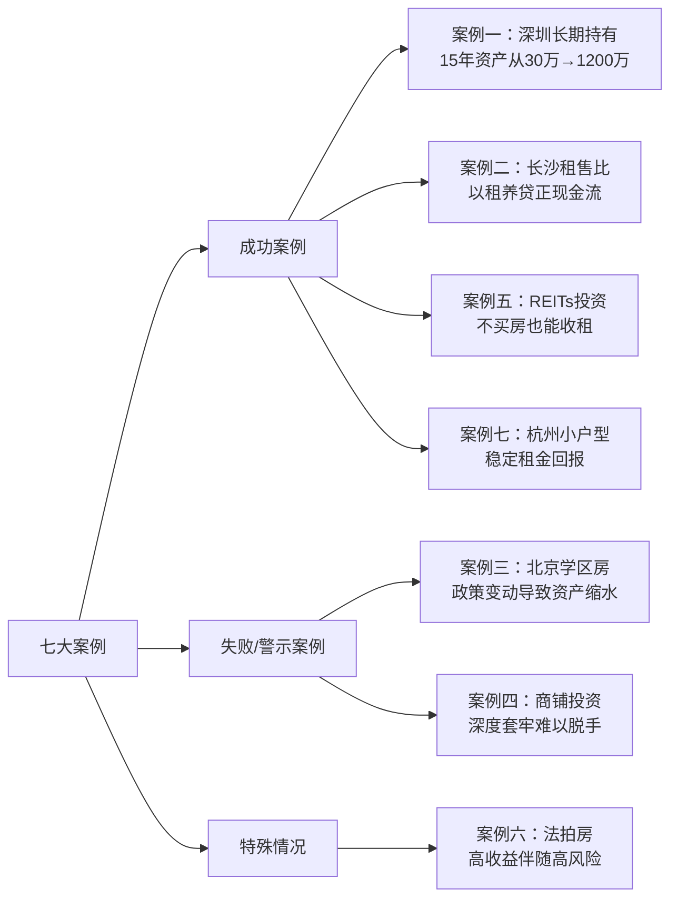
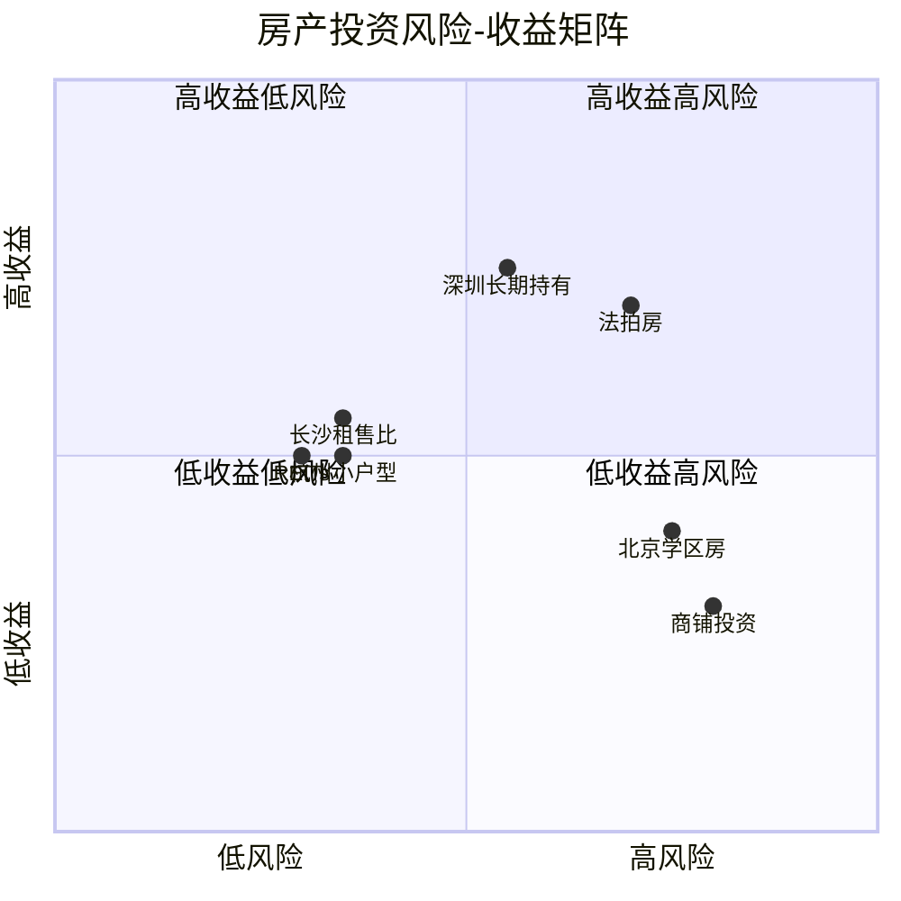
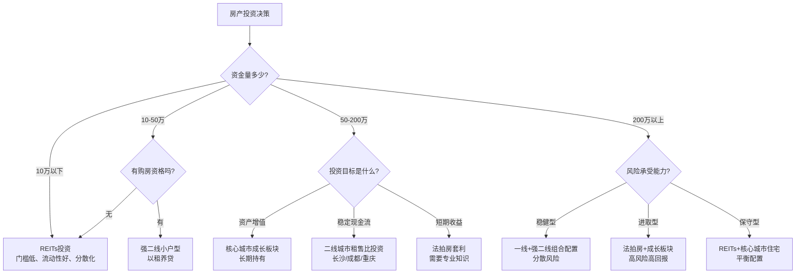
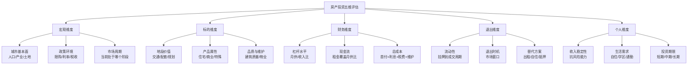

## 案例总结：七大实战案例的横向对比与核心启示

前六个案例分别展示了房产投资的不同路径——有成功的经验，也有失败的教训。本章将这些案例进行横向对比分析，提炼出贯穿所有投资决策的底层逻辑，帮助读者建立一套系统化的房产投资决策框架。

### 一、七大案例全景扫描

#### 案例概览表

| 维度 | 案例一：深圳长期持有 | 案例二：长沙租售比 | 案例三：北京学区房 | 案例四：商铺投资 | 案例五：REITs | 案例六：法拍房 | 案例七：杭州租房 |
|------|---------------------|-------------------|-------------------|-----------------|--------------|---------------|-----------------|
| **核心策略** | 城市增值+杠杆放大 | 现金流回报 | 教育资源绑定 | 商业租金 | 证券化不动产 | 信息差套利 | 正现金流 |
| **投资类型** | 住宅长期持有 | 住宅以租养贷 | 住宅学区溢价 | 商铺 | 金融产品 | 住宅+非住宅 | 住宅小户型 |
| **资金门槛** | 中高（首付百万级） | 中（30-50万） | 极高（学区溢价） | 高（总价高） | 低（千元起） | 中（全款/高首付） | 中（20-40万） |
| **风险等级** | 中 | 中低 | 高 | 极高 | 中 | 中高 | 中低 |
| **收益来源** | 资产增值 | 租金现金流 | 学位溢价 | 租金+增值 | 分红+增值 | 价差 | 租金现金流 |
| **投资周期** | 5-15年 | 3-5年以上 | 3-8年 | 5-10年 | 灵活 | 6-12个月 | 3-5年以上 |
| **最终结果** | 成功（资产翻倍） | 成功（正现金流） | 失败（政策冲击） | 失败（深度套牢） | 成功（稳健回报） | 谨慎成功 | 成功（稳定收益） |

#### 案例分类：成功路径与失败教训



---

### 二、核心指标横向对比

#### 收益率对比

投资回报率是衡量投资效果的核心指标，但不同投资类型的收益率计算方式差异很大：

| 案例 | 投入资金 | 持有期收益 | 年化回报率 | 杠杆倍数 | 杠杆后年化 |
|------|----------|-----------|-----------|----------|-----------|
| 深圳长期持有 | 27万首付 | 净资产820万 | 2.6%（全款口径） | 3.3倍 | 约8.6% |
| 长沙租售比 | 35万首付 | 年租金5.4万 | 4.2%（租金口径） | 2.9倍 | 约12.2% |
| 北京学区房 | 200万首付 | 学位价值+房价 | 不适用（混合属性） | 2.5倍 | 不适用 |
| 商铺投资 | 180万 | 年租金7.2万（名义） | 2.8%（名义），实际为负 | 1.5倍 | 亏损 |
| REITs | 10万 | 年分红+价差 | 5%-8% | 1倍（无杠杆） | 5%-8% |
| 法拍房 | 全款85万 | 短期利润15万 | 约21%（单次） | 1倍 | 约21% |
| 杭州小户型 | 30万首付 | 年净租金3.6万 | 约4%（租金口径） | 3.3倍 | 约13.2% |

#### 风险-收益矩阵



这个矩阵揭示了一个关键规律：**高收益不一定伴随高风险，低收益也不一定安全**。长沙租售比和杭州小户型属于"中等风险+合理收益"的稳健象限，而商铺投资则落入了"高风险+低收益"的最差象限。

#### 流动性对比

流动性是房产投资中最容易被忽视、却在关键时刻最致命的因素：

| 案例 | 挂牌到成交周期 | 变现难度 | 流动性评级 |
|------|--------------|----------|-----------|
| 深圳长期持有 | 1-3个月 | 中等（市场调整期可延长至6个月+） | ★★★☆☆ |
| 长沙租售比 | 2-4个月 | 较高（二手房市场活跃度一般） | ★★☆☆☆ |
| 北京学区房 | 取决于政策周期 | 极高（政策变动时几乎无人接盘） | ★☆☆☆☆ |
| 商铺投资 | 6个月-数年 | 极高（商铺流动性极差） | ★☆☆☆☆ |
| REITs | T+1或T+2 | 极低（交易所买卖，即时变现） | ★★★★★ |
| 法拍房 | 1-3个月 | 低（低于市价出售即可快速成交） | ★★★★☆ |
| 杭州小户型 | 2-4个月 | 中等 | ★★★☆☆ |

**核心发现**：REITs 的流动性远超所有实物房产投资。在需要快速变现的场景下，REITs 是唯一不会被"套住"的房地产投资方式。

---

### 三、成功案例的共性规律

对四个成功案例（深圳长期持有、长沙租售比、REITs、杭州小户型）进行提炼，可以总结出五条共性规律：

#### 规律一：投资逻辑清晰，不依赖单一变量

成功案例的投资者都有明确的核心逻辑，且不依赖单一变量实现收益：

- **深圳案例**：逻辑 = 城市基本面（人口+产业+土地稀缺）+ 杠杆放大 + 长期持有。即使某一个变量不及预期（如2020-2023年房价回调），其他变量仍能支撑投资回报。
- **长沙案例**：逻辑 = 低房价高租金 + 以租养贷 + 多套分散。即使某一套房的租金下降，其他房产的租金可以对冲。
- **REITs案例**：逻辑 = 底层资产收益 + 分散投资 + 流动性优势。不依赖房价上涨，底层资产的运营收入是分红来源。
- **杭州案例**：逻辑 = 低总价高租售比 + 精细化管理 + 稳定现金流。

**反面教训**：北京学区房的逻辑几乎100%依赖"学区政策不变"这一个变量，一旦政策调整，整个投资逻辑崩塌。商铺投资的逻辑依赖"电商不会冲击线下商业"这一个假设，假设不成立，投资失败。

#### 规律二：杠杆水平控制在安全区间

所有成功案例的月供/收入比都在可控范围内：

| 案例 | 月供占收入比 | 安全边际 |
|------|------------|----------|
| 深圳案例（初期） | 32% | 充足（收入增长空间大） |
| 深圳案例（置换后） | 34% | 充足（夫妻双收入） |
| 长沙案例 | 月租金覆盖月供的85%-100% | 充足（现金流自给） |
| 杭州案例 | 月租金覆盖月供的90%+ | 充足 |

**反面教训**：商铺投资者的月供+运营成本远超租金收入，长期处于现金流亏损状态。

```text
安全杠杆的三条铁律：
  ① 月供 ≤ 家庭月收入的 40%
  ② 预留 ≥ 6 个月月供的应急资金
  ③ 不使用短期高息资金（信用卡、消费贷）做长期投资
```

#### 规律三：买入时机和价格留有安全边际

成功案例的投资者都不是在市场最疯狂的时候入场：

- **深圳**：2010年购入，当时市场刚从2008年金融危机中恢复，价格处于相对低位
- **长沙**：2017年购入，长沙房价在全国省会中一直偏低，不存在泡沫
- **杭州**：选择的是小户型、非核心地段，价格基数低，下行空间有限
- **REITs**：2021-2022年入场，部分REITs价格低于资产净值，有安全边际

**反面教训**：北京学区房在2017年政策收紧前的高点购入，商铺在"一铺养三代"的惯性思维下购入，两者都缺乏价格安全边际。

#### 规律四：投资标的具备"可替代性"和"退出通道"

成功案例的投资者都考虑了"如果投资失败怎么办"：

- 深圳房产：自住属性强，即使不增值也能住
- 长沙房产：租金收入稳定，不依赖出售变现
- REITs：交易所随时可卖
- 杭州小户型：流动性尚可，降价即能出手

**反面教训**：学区房在政策变动后几乎无法按原价出手；商铺挂了两年都卖不出去，退出通道几乎为零。

#### 规律五：持续优化，不"买了就忘"

成功案例的投资者都在持有期做了主动管理：

- 深圳：利率转换（LPR），提前还贷，资产配置多元化
- 长沙：租客筛选优化，租金逐年调整，维护保养
- REITs：定期评估底层资产，动态调整持仓比例
- 杭州：精细化租客管理，降低空置率

---

### 四、失败案例的共性教训

对两个失败/警示案例（北京学区房、商铺投资）进行提炼，教训更加深刻：

#### 教训一：过度依赖单一政策/趋势变量

| 失败案例 | 核心依赖变量 | 变量变化 | 后果 |
|----------|------------|----------|------|
| 北京学区房 | 教育政策不变（划片、多校划片） | 2020年多校划片政策推行 | 学区溢价瞬间蒸发30%-50% |
| 商铺投资 | 线下商业不受电商冲击 | 社区商业持续萎缩 | 租金下降，空置率攀升 |

**深层原因**：这两个案例的投资者都犯了"线性外推"的错误——认为过去的趋势会永远持续。北京学区房投资者认为"名校永远稀缺"，商铺投资者认为"地段永远值钱"。但政策和技术变革可以瞬间改变底层逻辑。

#### 教训二：忽视流动性风险

学区房和商铺的共同特点是——买入容易卖出难。

- 学区房在政策收紧后，买家数量骤降，挂牌半年无人问津
- 商铺的潜在买家本就有限（投资门槛高、贷款条件严），市场下行时更是有价无市

**流动性风险的三个阶段**：

```text
阶段一（正常期）：挂牌1-3个月可成交
阶段二（承压期）：挂牌6个月+，需降价10%-20%
阶段三（危机期）：挂牌1年+，降价30%仍无人接盘，被迫继续持有或断供
```

#### 教训三：成本被低估，收益被高估

| 成本项 | 学区房投资者的预期 | 实际情况 |
|--------|-------------------|----------|
| 溢价成本 | "学位用完还能卖原价" | 政策变动后溢价归零 |
| 机会成本 | 未计算（200万首付的理财收益） | 200万×4%×8年=64万 |
| 持有成本 | "房贷就是存钱" | 利息支出+物业+维修≈40万 |
| 心理成本 | 未考虑 | 8年焦虑、家庭矛盾 |

| 成本项 | 商铺投资者的预期 | 实际情况 |
|--------|-------------------|----------|
| 租金回报 | "年化5%-6%" | 实际2.8%，扣除空置后更低 |
| 维护成本 | "不怎么花钱" | 装修+维修+中介费远超预期 |
| 税费成本 | 未充分了解 | 买卖税费高达房价10%-15% |
| 退出成本 | "随时可以卖" | 挂了两年无人问津 |

---

### 五、不同投资场景的最优策略匹配

通过七大案例的对比分析，可以为不同类型的投资者匹配最优策略：

#### 投资者画像与策略匹配表

| 投资者类型 | 资金量 | 风险偏好 | 推荐策略 | 参考案例 | 不推荐 |
|-----------|--------|----------|----------|----------|--------|
| 刚需自住+保值 | 30-100万 | 低 | 核心城市小户型长期持有 | 深圳、杭州 | 商铺、法拍房 |
| 有余力的投资型 | 50-200万 | 中 | 二线城市租售比投资 | 长沙 | 学区房、商铺 |
| 资金有限的入门者 | 1-10万 | 中低 | REITs定投 | REITs | 实物房产（资金不足） |
| 有经验的进阶者 | 100万+ | 中高 | 法拍房+长期持有组合 | 法拍房+深圳 | 纯商铺 |
| 不想管理实物资产 | 灵活 | 低-中 | REITs + 房产基金 | REITs | 任何实物房产 |
| 高净值人群 | 500万+ | 中 | 多城市配置（一线+强二线） | 深圳+长沙 | 单一城市集中 |

#### 策略选择决策树



---

### 六、房产投资的核心决策框架

综合七大案例的经验教训，可以提炼出一个通用的房产投资决策框架——"五维评估模型"：

#### 五维评估模型



#### 五维评估打分表

读者可以对任何房产投资标的进行量化评估，每个维度满分20分，总分100分：

| 评估维度 | 评估要点 | 案例一深圳 | 案例二长沙 | 案例三学区 | 案例四商铺 | 案例五REITs | 案例六法拍 | 案例七杭州 |
|----------|----------|-----------|-----------|-----------|-----------|------------|-----------|-----------|
| 宏观维度 | 城市、政策、周期 | 18 | 15 | 12 | 8 | 14 | 14 | 16 |
| 标的维度 | 地段、产品、品质 | 16 | 14 | 10 | 6 | 12 | 10 | 14 |
| 财务维度 | 杠杆、现金流、成本 | 15 | 18 | 8 | 5 | 16 | 12 | 17 |
| 退出维度 | 流动性、退出时机 | 12 | 10 | 4 | 3 | 19 | 15 | 12 |
| 个人维度 | 收入、需求、期限 | 16 | 14 | 10 | 10 | 15 | 10 | 14 |
| **总分** | | **77** | **71** | **44** | **32** | **76** | **61** | **73** |

**评分解读**：
- **80分以上**：优质投资机会，值得重仓
- **60-80分**：合格投资，需要做好风险管理
- **40-60分**：高风险，仅适合有经验的投资者
- **40分以下**：不建议投资

---

### 七、案例启示：从"炒房思维"到"资产配置思维"

#### 中国房产投资的范式转变

七大案例最深层的启示是：**中国房产投资正在从"闭眼买入就能赚"的1.0时代，进入"精细化选择、专业化管理"的2.0时代**。

| 维度 | 1.0时代（2000-2015） | 2.0时代（2015至今） |
|------|---------------------|---------------------|
| 核心逻辑 | 城镇化红利，买了就涨 | 分化加剧，选择比努力重要 |
| 收益来源 | 资产增值为主 | 租金现金流+选择性增值 |
| 杠杆态度 | 尽量多贷 | 适度杠杆，注重现金流安全 |
| 投资标的 | 住宅为主，不太挑 | 需要精细化筛选（城市/板块/产品） |
| 专业要求 | 低（随便买都赚） | 高（需要研究城市、政策、财务） |
| 风险意识 | 低（"房价永远涨"） | 高（需要考虑退出、流动性、政策） |

#### 普通投资者的行动指南

基于七大案例的经验教训，普通投资者应遵循以下行动指南：

**第一，先学习再投资**。房产投资的交易成本极高（买卖一次税费+中介费约占房价5%-8%），容错空间很小。在投入真金白银之前，至少要理解以下知识：
- 城市基本面分析方法（人口、产业、土地供给）
- 租售比、房价收入比等核心指标的计算与解读
- 贷款产品比较（等额本息vs等额本金、固定vs浮动利率）
- 当地限购限贷政策的具体条款
- 房产交易的全流程和税费结构

**第二，从小额开始积累经验**。如果资金有限，可以从REITs开始，用几千元就体验房地产投资的收益和波动，同时学习如何分析底层资产、评估分红可持续性。

**第三，第一套房以自住为核心**。案例一的陈工之所以能拿住15年，核心原因是他住在这套房子里。"自住属性"是最好的持有理由，它让你不被短期价格波动吓跑。

**第四，投资型房产要算清现金流账**。不要只看房价涨不涨，先算清楚：租金收入 - 月供 - 物业费 - 维护费 - 空置损失 = 净现金流。如果净现金流为负，就要问自己：你能承受多长时间的现金流亏损？

**第五，永远留有退出通道**。在买入任何房产之前，问自己一个问题："如果明天我急需用钱，这套房能在多长时间内、以什么价格卖出去？"如果答案是"不知道"或"很难"，就要慎重考虑。

**第六，定期审视，不要"买了就忘"**。每年至少审视一次：资产配置是否合理（房产占比是否过高）、贷款利率是否可以优化、租金是否需要调整、是否需要置换升级。

---

### 八、延伸思考：房产投资与其他资产的协同

房产不应该是投资组合中的唯一资产。从七大案例中可以清晰看到：

- 深圳案例的陈工从2021年开始将金融资产占比从15%提升到35%，主动降低房产集中度
- REITs案例的林晨用REITs替代了第二套房的购买需求，同时保留了股票、债券等其他资产
- 长沙案例的老周虽然持有三套房，但同时配置了指数基金和黄金作为对冲

**建议的资产配置比例（房产投资部分）**：

| 风险偏好 | 房产占比 | REITs占比 | 现金/债券占比 | 说明 |
|----------|----------|-----------|-------------|------|
| 保守型 | 30%-40% | 10%-15% | 45%-60% | 房产以自住为主，REITs补充 |
| 稳健型 | 40%-50% | 10%-20% | 30%-40% | 自住+1套投资房+REITs |
| 进取型 | 50%-60% | 10%-15% | 25%-35% | 多套房产+杠杆+REITs |

**红线**：任何单一资产类别（包括房产）不应超过总资产的70%。过度集中在一个资产类别上，本质上是在赌博而不是投资。

---

### 九、本节核心要点提炼

综合七大案例，房产投资的核心要义可以浓缩为以下几句话：

1. **选对城市比选对房子重要**——人口流入、产业升级、土地稀缺是城市增值的三要素
2. **现金流比账面增值重要**——能产生正现金流的房产才是好投资
3. **流动性比收益率重要**——卖不掉的资产，再高的账面收益都是纸上富贵
4. **杠杆是双刃剑**——放大收益的同时也放大风险，控制月供/收入比在40%以内
5. **政策是最大变量**——不要和政策对着干，在政策框架内寻找最优解
6. **分散配置是终极保障**——不把所有鸡蛋放在房产这一个篮子里
7. **投资是认知的变现**——持续学习、独立判断，是房产投资乃至所有投资的根本

这七条原则，不是教科书上的空洞理论，而是七个真实案例用真金白银换来的血泪教训。记住它们，并在每一次投资决策前逐一对照，你就能避开大多数陷阱，在房产投资这条路上走得更稳、更远。
