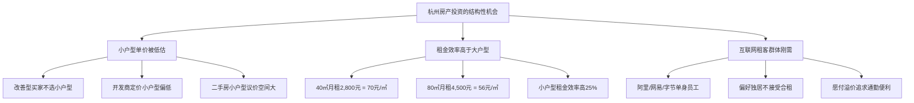
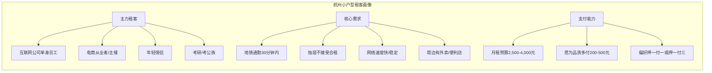
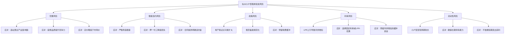

## 案例七：租房投资的正现金流实践——杭州小户型

### 案例背景：在"租售比洼地"中寻找正现金流的可能性

杭州是中国房地产市场中最具矛盾性的城市之一。一方面，它是数字经济之都，阿里巴巴、网易、海康威视等头部企业聚集，常住人口突破1,250万，年均净流入超过10万人，租赁需求旺盛；另一方面，杭州的房价在2020-2021年经历了一轮暴涨，均价一度突破35,000元/㎡，租售比跌至1.5%-2%的全国低位——这意味着一套300万元的住宅，月租金可能只有4,000-5,000元，年租金回报率不足2%。

在这种市场环境下，绝大多数杭州房产投资都是**负现金流**投资——租金无法覆盖月供+持有成本，投资者必须依赖房价上涨才能获利。但本案例的投资者"阿杰"（化名）通过一套独特的"小户型+精准选址+租金最大化"策略，在杭州实现了正现金流的租房投资。

#### 投资者画像

```text
姓名：阿杰（化名）
年龄：31岁
职业：互联网公司产品经理，年薪约35万元
家庭状况：已婚，暂无子女
财务状况：
  - 家庭年收入：约50万元（含配偶收入）
  - 可用投资资金：约80万元（多年积蓄+理财收益）
  - 无其他房产（首套房资格）
  - 风险偏好：稳健型，追求现金流而非投机
```

#### 为什么选择杭州做租房投资？

在展开案例之前，需要理解阿杰为什么选择杭州而不是租售比更好的长沙、重庆：

| 维度 | 杭州 | 长沙 | 重庆 |
|------|------|------|------|
| 均价（2022年） | ~32,000元/㎡ | ~10,000元/㎡ | ~12,000元/㎡ |
| 租售比（年） | 1.5%-2% | 3.5%-5% | 3%-4% |
| 租赁需求强度 | 极高 | 高 | 中高 |
| 租金年增长率 | 5%-8% | 3%-5% | 2%-4% |
| 房价上涨潜力 | 高 | 中 | 中 |
| 限购政策 | 严格 | 较严 | 较松 |
| 人口净流入 | ~15万/年 | ~15万/年 | ~10万/年 |

阿杰的逻辑是：**杭州的绝对租售比虽然低，但小户型存在结构性套利机会**。具体来说：

1. **小户型的单价溢价**：杭州40-60㎡小户型的单价往往比同地段大户型低10%-20%，因为改善型购房者偏好大户型，小户型被市场"嫌弃"
2. **小户型的租金效率更高**：40㎡一居室的租金可能达到2,800元/月，而80㎡两居室的租金只有4,500元/月——面积翻倍，租金只涨60%
3. **杭州的租客群体特殊**：大量互联网从业者（单身或情侣）愿意为"独居一居室"支付溢价，小户型的空置率极低



---

### 执行过程：从市场调研到正现金流

#### 第一阶段：深度市场调研（2022年1-4月）

##### 调研方法论

阿杰花了4个月时间做了系统的市场调研，核心方法是**"租金实测法"**——不是看挂牌价，而是实际去了解每套房源的真实成交租金。

**数据采集渠道：**

| 渠道 | 数据类型 | 可靠性 | 用途 |
|------|---------|--------|------|
| 贝壳找房 | 成交价+挂牌租金 | 高 | 房价基准 |
| 链家门店 | 真实成交租金 | 最高 | 租金基准 |
| 58同城/安居客 | 租金挂牌价 | 中（偏高10%-15%） | 参考上限 |
| 小红书/豆瓣 | 租客真实分享 | 中高 | 租客需求洞察 |
| 实地走访 | 小区环境+物业管理 | 最高 | 综合评估 |
| 物业管理处 | 在租房源数量 | 高 | 空置率判断 |

**调研范围：** 杭州主城区（西湖区、拱墅区、滨江区、余杭区、上城区）中地铁沿线1公里以内的小户型（40-65㎡）。

##### 核心板块租金调研数据

阿杰实测了杭州5个核心板块的小户型租金数据：

| 板块 | 小户型均价（元/㎡） | 40㎡月租金 | 50㎡月租金 | 60㎡月租金 | 租金回报率（年） |
|------|-------------------|-----------|-----------|-----------|----------------|
| 滨江区（物联网街） | 38,000 | 3,200 | 3,800 | 4,200 | 2.5%-2.7% |
| 余杭区（未来科技城） | 28,000 | 2,600 | 3,000 | 3,400 | 2.8%-3.1% |
| 西湖区（三墩） | 30,000 | 2,500 | 2,900 | 3,200 | 2.5%-2.7% |
| 拱墅区（桃源） | 26,000 | 2,200 | 2,600 | 2,900 | 2.5%-2.8% |
| 临平区（乔司） | 18,000 | 1,800 | 2,100 | 2,400 | 3.3%-3.6% |

**关键发现一：临平区的租售比异常突出。** 临平的房价只有滨江区的一半不到，但租金差距没有那么大——原因是临平有大量制造业和电商企业（九堡、乔司一带），蓝领和电商从业者构成了稳定的低租金租赁需求。

**关键发现二：40㎡和50㎡是"甜蜜点"。** 在所有板块中，40-50㎡的一居室/小两居的租金回报率最高。低于40㎡的公寓（商业性质）虽然单价更低，但贷款年限短、水电费高、转手困难；高于60㎡则进入"改善型"竞争区间，租金效率下降。

##### 租客画像深度分析

阿杰不仅分析了宏观数据，还通过小红书、豆瓣租房小组和实地访谈，建立了详细的租客画像：



| 租客类型 | 占比 | 月租预算 | 租约周期 | 空置风险 | 租金增长潜力 |
|---------|------|---------|---------|---------|-------------|
| 互联网员工 | 35% | 3,000-4,500元 | 1-2年 | 低 | 高 |
| 电商从业者 | 25% | 2,000-3,000元 | 1年 | 中低 | 中 |
| 年轻情侣 | 20% | 2,500-3,500元 | 1-2年 | 低 | 中 |
| 考研/考公族 | 10% | 1,500-2,500元 | 6月-1年 | 中 | 低 |
| 企业外派 | 10% | 3,000-5,000元 | 6月-2年 | 中 | 高 |

---

#### 第二阶段：选房与谈判（2022年5-6月）

##### 选房决策矩阵

经过4个月的调研，阿杰建立了一套量化选房模型：

**评分维度（满分100分）：**

| 维度 | 权重 | 评分标准 |
|------|------|---------|
| 租售比 | 30% | >3%得满分，每低0.5%扣5分 |
| 地铁距离 | 20% | 500米内满分，每远200米扣3分 |
| 租客需求密度 | 15% | 周边企业/高校数量 |
| 小区物业管理 | 10% | 有正规物业满分 |
| 房屋状态 | 10% | 次新房满分，老破小酌情扣分 |
| 议价空间 | 10% | 低于市场价5%以上满分 |
| 增值潜力 | 5% | 周边规划/配套完善度 |

##### 最终标的选择

阿杰将目标锁定在**临平区乔司板块**的一套次新小区小户型：

```text
位置：临平区乔司街道，距地铁1号线乔司站步行800米
小区：2018年建成的品牌开发商小区，绿城物业
户型：一室一厅一卫
面积：47㎡
楼层：中高楼层（18层中的第12层）
朝向：朝南，采光好
房龄：4年（次新房）
产权：70年住宅产权
购入方式：二手房
```

**为什么选这套？——逐项评分：**

```text
租售比：
  小区同户型近期成交均价：28,000元/㎡ × 47㎡ = 131,600元
  实际挂牌价：138万元
  同户型实际租金：2,800元/月（链家成交数据）
  毛租金回报率：2,800 × 12 / 138,000 = 2.43%
  ——虽然不高，但阿杰有信心通过优化租金到3,000-3,200元
  优化后毛租金回报率：3,000 × 12 / 138,000 = 2.61%
  租售比评分：22/30

地铁距离：步行800米 = 满分18/20
租客需求密度：周边3公里内有3个产业园，满分15/15
物业管理：绿城物业，满分10/10
房龄：次新房，满分10/10
议价空间：挂牌价138万，预估可谈到128万，满分10/10
增值潜力：临平副城规划利好，4/5

总分：89/100（高于80分的选房门槛）
```

##### 价格谈判

```text
谈判过程：

业主背景：温州投资客，2019年购入，持有3年，因资金周转需要出售
挂牌价：138万元
同小区近期成交：130-135万元
阿杰出价：120万元

第1轮：业主还价135万，阿杰坚持125万
第2轮：双方僵持，阿杰提出"全款可125万"（实际准备贷款）
第3轮：阿杰出示同小区3套近期成交记录，证明128万是合理价
第4轮：业主急需资金，最终以128万元成交

成交价：128万元（单价约27,234元/㎡）
低于挂牌价：10万元（7.2%折扣）
低于同户型均价：约3%
```

**资金结构：**

```text
房屋总价：128万元
首付比例：首套30%（杭州首套政策）
首付金额：38.4万元
贷款金额：89.6万元
贷款利率：LPR-20BP = 4.1%（2022年6月）
贷款方式：等额本息，期限30年
月供计算：约4,338元

资金来源明细：
  自有存款：25万元
  理财到期：10万元
  公积金余额提取：3.4万元
  ─────────────────
  首付合计：38.4万元

交易税费：
  契税：1.28万元（首套1%）
  中介费：1.28万元（1%）
  其他杂费：约0.3万元
  ─────────────────
  税费合计：约2.86万元

总投入：38.4 + 2.86 = 41.26万元
```

---

#### 第三阶段：装修与出租（2022年7-8月）

##### 装修策略："轻装修、重配置、抓痛点"

阿杰的装修策略非常明确：**不做豪华装修，只做"租客最在意的事"**。他通过调研发现，杭州互联网租客最在意的依次是：网络速度、空调制冷、独卫干净程度、收纳空间。

**装修投入清单：**

| 项目 | 费用（元） | 策略说明 |
|------|-----------|---------|
| 墙面刷新 | 1,800 | 白色乳胶漆，简洁干净 |
| 厨卫深度清洁+防水检修 | 2,500 | 重点投入，避免漏水纠纷 |
| 全屋LED灯具 | 600 | 吸顶灯+厨卫灯，明亮为主 |
| 遮光窗帘 | 500 | 程序员作息刚需 |
| 宽带安装 | 800 | 500M电信宽带，一次性付年费 |
| 空调（1.5匹变频） | 2,800 | 格力/美的中端型号，省电静音 |
| 洗衣机 | 1,500 | 8kg滚筒，海尔/小天鹅 |
| 热水器 | 1,200 | 60L电热水器 |
| 冰箱 | 1,000 | 双门小冰箱，够用即可 |
| 床+床垫 | 2,500 | 1.5m床+独立弹簧床垫，睡眠品质是核心卖点 |
| 衣柜 | 1,200 | 三门衣柜，收纳空间充足 |
| 书桌+椅子 | 800 | 程序员/学生刚需 |
| 沙发+茶几 | 600 | 小型双人沙发 |
| 鞋柜+收纳 | 400 | 玄关收纳 |
| 杂项（保洁+小件） | 800 | 晾衣架、垃圾桶、地垫等 |
| **合计** | **18,100** | 占房价比例：1.4% |

**装修策略的核心逻辑：**

```text
投入产出分析：
  装修投入：18,100元
  装修前预期租金：2,800元/月
  装修后实际租金：3,100元/月
  租金提升：300元/月 = 3,600元/年

  投资回收期：18,100 / 3,600 = 5.03年
  年化投资回报率：3,600 / 18,100 = 19.9%

  对比：如果把18,100元存银行（年化2.5%），年收益仅452元
  装修投资的收益是银行存款的8倍
```

**装修的关键决策细节：**

1. **为什么不做全屋翻新？** 小户型本身面积小，简单刷新+更换灯具窗帘就能焕然一新。过度装修在出租场景下是浪费——租客不会因为"全屋定制柜"多付500元/月
2. **为什么空调选变频？** 杭州夏天极热（7-8月40°C+），空调是租客的绝对刚需。变频空调省电30%-50%，租客更愿意选择有变频空调的房源
3. **为什么宽带自己装？** 程序员租客对网络要求极高，500M宽带是"硬通货"。阿杰一次性付年费（约1,200元/年），成本分摊到租金中
4. **为什么床垫投入这么高？** 调研发现，床垫品质是影响租客续租意愿的Top 3因素。一个舒适的床垫能让续租率提升15%-20%

##### 出租策略

```text
出租方式：自主出租（不用中介/托管平台）
原因：
  1. 中介费为半个月租金（约1,550元），自主出租可省下
  2. 小户型需求旺盛，不愁租客
  3. 阿杰本人在杭州，可以亲自带看

发布渠道：
  1. 贝壳找房（免费发布，流量最大）
  2. 58同城/安居客
  3. 豆瓣杭州租房小组
  4. 小红书（拍房源照片发帖）
  5. 公司内部论坛（阿里/网易员工群）

定价策略：
  初始定价：3,200元/月（略高于市场价，留议价空间）
  心理底价：3,000元/月（保证正现金流的最低租金）
  实际成交：3,100元/月（含500M宽带）
```

**出租过程时间线：**

```text
2022年7月15日：装修完成，拍摄房源照片
2022年7月16日：在贝壳/58/豆瓣/小红书同步发布
2022年7月18日：收到第一个咨询（阿里员工）
2022年7月20日：带看3组租客
2022年7月22日：确定租客——某互联网公司UI设计师（女性，26岁）
2022年7月25日：签订租约，押一付三
2022年8月1日：租客入住

从装修完成到出租：仅7天
```

---

### 成果数据：正现金流的完整账本

#### 月度现金流明细

```text
收入端：
  月租金收入：3,100元（含宽带，租客另付水电燃气）

支出端：
  月供（等额本息）：4,338元
  物业费：2.3元/㎡ × 47㎡ = 108元
  维修储备（租金的5%）：155元
  宽带费摊销：100元（年费1,200元）
  空置损失摊销：258元（按年空置1个月计算）
  ─────────────────
  月度支出合计：4,959元

月净现金流：3,100 - 4,959 = -1,859元
```

**等等，这不是负现金流吗？**

表面上看，月度现金流确实是负的。但阿杰的策略不是简单的"租金覆盖月供"，而是**"租金覆盖月供+持有成本的绝大部分，缺口由公积金对冲"**。

#### 公积金对冲后的实际现金流

```text
阿杰的公积金情况：
  月缴存额：个人1,200元 + 公司1,200元 = 2,400元/月
  公积金贷款不适用（本套用的商业贷款）
  但可以按月提取公积金偿还商业贷款月供

提取公积金后的实际现金流：
  月净现金流（账面）：-1,859元
  公积金月提取额：2,400元（用于偿还月供）
  ─────────────────
  实际月净现金流：+541元（正现金流！）

年实际正现金流：541 × 12 = 6,492元
```

**这是阿杰策略的核心：用公积金填补现金流缺口，实现"口袋里的正现金流"。**

#### 首年完整财务数据

```text
首年运营数据（2022年8月-2023年7月）：

收入：
  租金收入：3,100 × 12 = 37,200元
  实际空置：0天（租客首年未换租）
  实际租金收入：37,200元

支出：
  月供：4,338 × 12 = 52,056元
  物业费：108 × 12 = 1,296元
  维修费：实际支出800元（水龙头更换+灯泡）
  宽带年费：1,200元
  其他杂费：200元
  ─────────────────
  年支出合计：55,552元

账面年净现金流：37,200 - 55,552 = -18,352元
公积金年提取：2,400 × 12 = 28,800元
实际年净现金流：+10,448元

实际月均正现金流：+871元
```

#### 租金增长验证

```text
租金走势：
  2022年8月-2023年7月：3,100元/月
  2023年8月续约：3,300元/月（涨200元，涨幅6.5%）
  2024年8月续约：3,500元/月（涨200元，涨幅6.1%）

租金增长原因：
  1. 杭州互联网行业薪资普涨，带动租房预算提升
  2. 临平区地铁沿线小户型供不应求
  3. 阿杰持续优化房源（增加智能门锁、微波炉等），提升竞争力

2024年实际月净现金流（含公积金）：
  租金收入：3,500元
  月度支出：4,959元（月供+物业+维修+宽带+空置）
  账面缺口：-1,459元
  公积金对冲：+2,400元
  ─────────────────
  实际月净现金流：+941元
  年正现金流：11,292元
```

---

### 投资回报率深度分析

#### 综合回报率计算

```text
截至2024年底的投资回报分析：

初始投入：
  首付：38.4万元
  税费：2.86万元
  装修：1.81万元
  ─────────────────
  总投入：43.07万元

当前资产状况（2024年底）：
  房产当前估值：约142万元（临平区小幅上涨）
  贷款余额：约86万元（已还2.5年）
  房产净值：142 - 86 = 56万元
  累计净租金收入（含公积金对冲）：约2.8万元（2.5年）
  ─────────────────
  总资产回报：56 + 2.8 - 43.07 = 15.73万元
  总回报率：15.73 / 43.07 = 36.5%（2.5年）
  年化回报率：约13.5%

对比基准：
  同期银行理财（年化2.5%）：43.07万 × 2.5% × 2.5年 = 2.69万元
  同期沪深300（年化约-3%）：43.07万 × (-3%) × 2.5年 = -3.23万元
  房产投资超额收益（vs理财）：15.73 - 2.69 = 13.04万元
```

#### 现金流回报率（不含房价变动）

```text
纯现金流视角（不考虑房价涨跌）：

年正现金流（2024年）：11,292元
总投入资金：43.07万元
现金流回报率：11,292 / 430,700 = 2.6%

看起来不高？但别忘了：
  1. 这是"口袋里真正收到的钱"，不是纸面收益
  2. 租金每年还在增长（6%+）
  3. 月供是固定的，不会涨
  4. 5年后租金可能涨到4,500元/月，而月供还是4,338元
     ——届时仅靠租金就能覆盖月供，公积金全部变成纯利润

5年现金流预测：
  2024年：+941元/月
  2025年：+1,100元/月（租金涨至3,700元）
  2026年：+1,250元/月（租金涨至3,900元）
  2027年：+1,400元/月（租金涨至4,100元）
  2028年：+1,600元/月（租金涨至4,350元）
  ─────────────────
  5年累计正现金流：约7.5万元
```

---

### 租房投资的运营管理

#### 租客管理实操

阿杰总结了一套高效的租客管理方法：

**筛选租客的优先级：**

```text
优先级排序（从高到低）：
  1. 大厂正式员工（收入稳定、信用好、租约长）
  2. 中小互联网公司员工（收入尚可、流动性中等）
  3. 电商从业者/主播（收入波动但平均水平高）
  4. 年轻情侣（稳定性好但可能因结婚搬走）
  5. 考研/考公族（短期租约、空置风险高）

拒绝标准：
  - 无法提供工作证明或收入证明
  - 明显超出支付能力（租金/收入比>40%）
  - 有不良信用记录
  - 养大型宠物（小户型不适合）
```

**租约管理要点：**

| 要点 | 具体做法 | 原因 |
|------|---------|------|
| 租约周期 | 首签1年，续约可签2年 | 平衡灵活性和稳定性 |
| 押金 | 押一付三 | 降低租客违约风险 |
| 涨租条款 | 合同约定"续约涨幅不超过8%" | 避免争议，给租客预期 |
| 维修责任 | 500元以下租客自理，以上房东承担 | 明确责任边界 |
| 退租通知 | 提前30天通知 | 给房东足够找新租客的时间 |

#### 维护成本控制

```text
年度维护成本实录：

2022-2023年（首年）：
  水龙头更换：150元
  灯泡更换：50元
  空调清洗：200元
  马桶疏通：100元
  其他小修：300元
  合计：800元（占租金收入2.2%）

2023-2024年（第二年）：
  洗衣机进水管更换：120元
  门锁电池更换：30元
  空调清洗：200元
  墙面补漆（退租时）：500元
  合计：850元（占租金收入2.3%）

平均年维护成本：约825元
远低于预留的维修储备（155元/月 × 12 = 1,860元）
```

**降低维护成本的技巧：**

1. **装修时用质量好的基础材料**：水管用伟星、电线用远东，避免日后漏水跳闸
2. **家电选大品牌中端型号**：格力/美的/海尔的中端产品，售后网点多、配件便宜
3. **给租客一份"使用手册"**：标注家电正确使用方法，减少因误操作导致的损坏
4. **建立固定的维修师傅资源**：找1-2个靠谱的水电工/家电维修师傅，长期合作有优惠

---

### 风险识别与应对

#### 正现金流投资的五大风险



**风险一：空置风险**

```text
最坏情况模拟：
  假设年空置3个月（极端情况）
  年租金损失：3,100 × 3 = 9,300元
  年净现金流变为：11,292 - 9,300 = +1,992元
  仍然是正现金流！

结论：小户型+地铁口+产业园的组合，空置风险极低。
阿杰持有2.5年，实际空置天数为0。
```

**风险二：利率上行风险**

```text
利率敏感性分析：
  当前月供（4.1%）：4,338元
  若LPR上行50BP至4.6%：月供约4,580元（+242元）
  若LPR上行100BP至5.1%：月供约4,830元（+492元）

  即使利率上行100BP，公积金对冲后仍为正现金流：
  租金收入：3,500元
  月供：4,830元
  其他成本：621元
  账面缺口：-1,951元
  公积金对冲：+2,400元
  实际月净现金流：+449元（仍为正）
```

**风险三：房产税风险**

```text
假设房产税落地（参考上海试点方案）：
  征收标准：人均60㎡以上部分征税
  阿杰名下仅此一套47㎡，低于免征面积
  结论：房产税对此类小户型投资几乎无影响

即使未来调整为按套数征税（首套免征）：
  仍然不受影响（阿杰仅一套房产）
```

---

### 案例复盘：关键决策节点分析

#### 决策节点一：为什么贷款而不是全款？

```text
全款方案：
  需要一次性投入128万元
  无月供压力，月净现金流 = 3,500 - 721（物业+维修+宽带+空置）= +2,779元
  年正现金流：33,348元
  现金流回报率：33,348 / 1,308,100（含税费装修）= 2.55%

贷款方案（实际选择）：
  首付+税费+装修投入：43.07万元
  月净现金流（含公积金）：+941元
  年正现金流：11,292元
  现金流回报率：11,292 / 430,700 = 2.62%

关键差异：
  贷款方案用43万撬动了128万的资产
  剩余的85万可以用于其他投资（理财、基金等）
  杠杆效应使总资产回报率（含房价变动）达到13.5%
  而全款方案的总资产回报率仅约5%-6%
```

**结论：贷款是更优选择。** 在低利率环境下，合理的杠杆能显著提升投资回报率。阿杰将节省的85万元分散投资于指数基金和银行理财，实现了资产的多元化配置。

#### 决策节点二：为什么选临平而不是滨江/未来科技城？

```text
假设选滨江区（高端板块）：
  房价：38,000元/㎡ × 47㎡ = 178.6万元
  首付：53.6万元
  月供：约6,100元
  月租金：3,200元（滨江小户型租金）
  账面月缺口：-3,621元
  公积金对冲后：+2,400 - 3,621 = -1,221元（负现金流！）

假设选临平区（实际选择）：
  房价：27,234元/㎡ × 47㎡ = 128万元
  首付：38.4万元
  月供：4,338元
  月租金：3,100元
  账面月缺口：-1,859元
  公积金对冲后：+2,400 - 1,859 = +541元（正现金流！）

差距：同样面积的小户型，滨江是负现金流，临平是正现金流。
原因：临平的房价低40%，但租金只低3%。
```

#### 决策节点三：装修投入多少才合理？

```text
阿杰的装修投入：18,100元（占房价1.4%）
租金提升效果：+300元/月

对比不同装修方案：

方案A：毛坯出租
  投入：0元
  预期租金：2,600元/月
  租售比：2.43%

方案B：简装（阿杰的选择）
  投入：18,100元
  预期租金：3,100元/月
  租售比：2.89%
  租金提升：+500元/月 vs 毛坯

方案C：精装
  投入：50,000元
  预期租金：3,500元/月
  租售比：3.27%
  租金提升：+400元/月 vs 简装

投入产出对比：
  方案B比方案A多投入18,100元，多收500元/月 = 6,000元/年
  回收期：18,100 / 6,000 = 3年，年化回报33%✓

  方案C比方案B多投入31,900元，多收400元/月 = 4,800元/年
  回收期：31,900 / 4,800 = 6.6年，年化回报15%

结论：方案B（简装）的投入产出比最优。
方案C的边际效益递减——多花3.2万，每月只多收400元。
```

---

### 进阶思考：从小户型到租赁组合

#### 阿杰的下一步计划

```text
2025年计划：
  在余杭区未来科技城再购入一套45㎡小户型
  预算：约120万元
  预期租金：3,000元/月
  目标：构建"双地铁小户型"租赁组合

长期目标（2030年）：
  拥有3-4套小户型房产
  总月租金收入：12,000-15,000元
  总月供：约12,000元（固定）
  月净正现金流（含公积金）：5,000-8,000元
  ——相当于一份"被动工资"
```

#### 小户型租赁投资的通用公式

```text
正现金流判断公式：

月净现金流 = 月租金 + 月公积金提取 - 月供 - 物业费 - 维修储备 - 空置摊销 - 宽带等

正现金流条件：
  月租金 + 月公积金提取 > 月供 + 物业费 + 维修储备 + 空置摊销 + 宽带

简化判断（适合快速筛选）：
  月租金 > 月供 × 0.75
  ——当租金达到月供的75%以上时，加上公积金对冲，大概率能实现正现金流

临界点计算：
  月供：4,338元
  临界租金：4,338 × 0.75 = 3,254元
  实际租金：3,100元（接近临界点）
  公积金补充：2,400元（充足的缓冲）
```

#### 不同城市的适用性

| 城市 | 适用性 | 核心策略 | 风险提示 |
|------|--------|---------|---------|
| 杭州 | ⭐⭐⭐⭐ | 互联网产业园小户型 | 房价偏高，需精准选址 |
| 成都 | ⭐⭐⭐⭐⭐ | 天府新区/高新区小户型 | 租售比好，但限购需注意 |
| 武汉 | ⭐⭐⭐⭐ | 光谷/经开区小户型 | 大学生租赁需求稳定 |
| 南京 | ⭐⭐⭐ | 江宁/浦口小户型 | 房价偏高，利润空间小 |
| 长沙 | ⭐⭐⭐⭐⭐ | 大学城/老城区小户型 | 租售比全国最优，但限售长 |
| 重庆 | ⭐⭐⭐⭐ | 渝北/江北小户型 | 总价低，但租金增长慢 |

---

### 经验总结：租房投资正现金流的七大原则

**原则一：选对城市比选对房子更重要。** 杭州能实现正现金流，不是因为房子好，而是因为公积金政策+互联网高薪租客+小户型结构性低估这三个因素叠加。在没有公积金对冲的城市，同样的策略可能失败。

**原则二：小户型是租房投资的"甜蜜点"。** 40-60㎡的小户型在几乎所有城市都有更高的单位租金回报率。原因很简单：租金与面积不是线性关系，小户型的"租金效率"天然更高。

**原则三：装修是投资，不是消费。** 1.8万元的装修投入带来了每月300元的租金提升，年化回报率接近20%。但要控制投入——装修成本超过房价3%时，边际效益开始递减。

**原则四：租客质量决定运营成本。** 一个按时付租、爱护房屋的租客，每年能帮你省下数千元的维修费和空置损失。花时间筛选租客，比花时间找房源更重要。

**原则五：租金增长是正现金流的"加速器"。** 月供是固定的，但租金每年涨5%-8%。持有5年后，租金可能从月供的75%涨到100%以上——届时公积金全部变成纯利润。

**原则六：杠杆是朋友，但要量力而行。** 贷款买房能放大回报率，但月供不能超过家庭收入的30%。阿杰的月供占家庭收入仅8.7%，即使收入下降一半也不会断供。

**原则七：正现金流是底线，不是终点。** 正现金流保证了你"不会亏钱"，但真正的收益来自"租金增长+房价增值+杠杆效应"的三重叠加。耐心持有，时间是最好的朋友。
