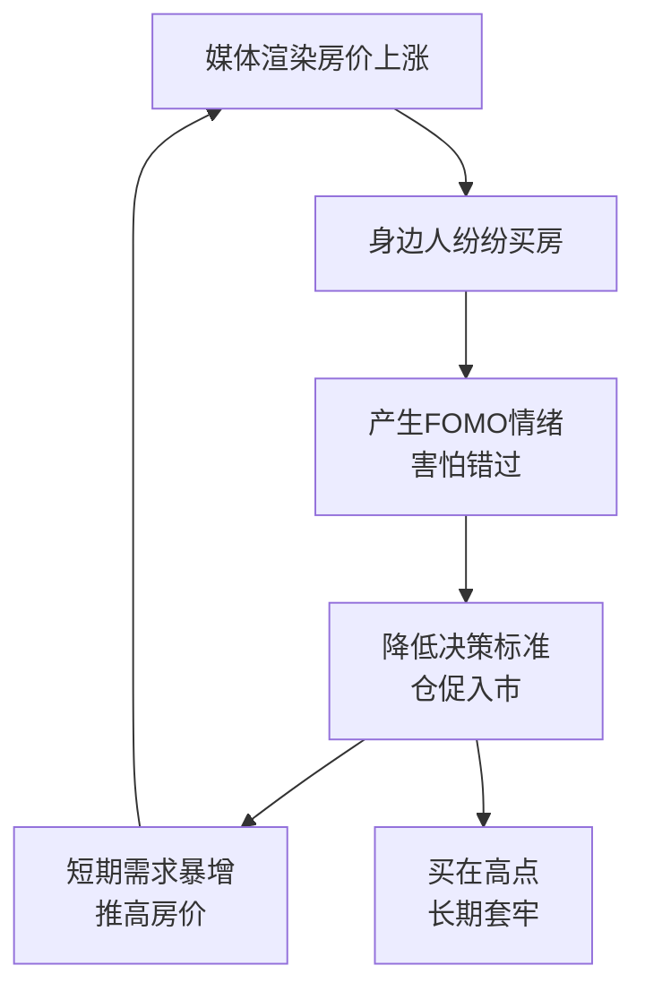
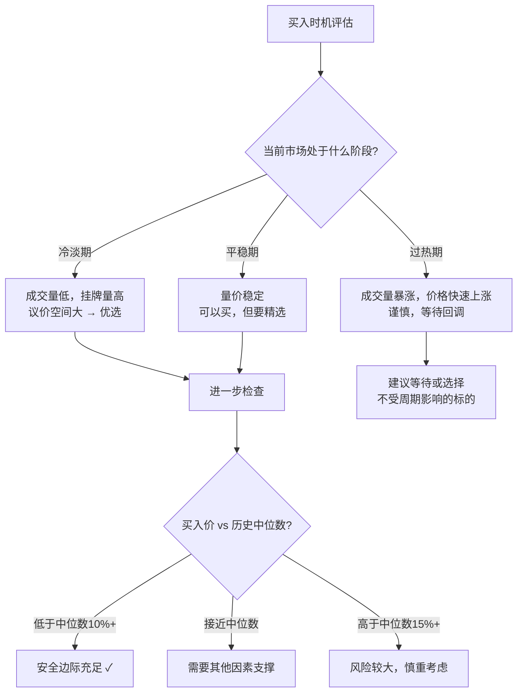
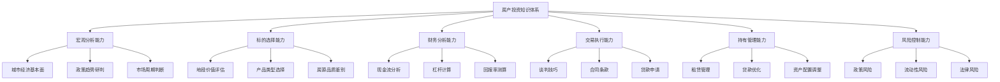

## 从这些案例中我们可以学到什么（补充）

上一节对七大案例进行了横向对比和核心启示提炼。本节在此基础上，从行为金融学、决策心理学、实操工具和长期资产管理四个维度，补充更深层、更落地的投资认知。这些内容不是"锦上添花"，而是在真实投资中帮你避开那些不写在教科书里的暗坑。

---

### 一、行为金融学视角：为什么聪明人也会在房产上犯错

七大案例中，失败的投资者并不愚蠢——北京学区房的投资者做了大量功课，商铺投资者也有出租经验。他们犯错的根源不在"不懂"，而在"人性"。行为金融学揭示了系统性的认知偏差，在房产投资中尤为致命。

#### 1.1 锚定效应（Anchoring Bias）

**定义**：人们在做决策时，过度依赖最先获得的信息（"锚点"），后续判断被这个锚点严重扭曲。

**案例中的体现**：

| 案例 | 锚点 | 实际情况 | 后果 |
|------|------|----------|------|
| 北京学区房 | "这套房2015年值600万，现在800万还是便宜的" | 政策变动后，同类房源成交价跌至550万 | 以800万买入，账面亏损250万 |
| 商铺投资 | "开发商说年回报8%，10年就是80万" | 开发商第4年资金链断裂，实际3年只收了24万 | 损失41万 |
| 深圳案例（正面） | 陈工没有锚定在"关内才值钱"，而是锚定在"我能承受的价格+有成长性的区域" | 宝安从"关外"变成了前海辐射区 | 资产增值10倍+ |

**应对方法**：

```text
决策前问自己三个问题：
  ① 我的判断是基于事实数据，还是基于某个"印象深刻的数字"？
  ② 如果这套房标价不是X万，而是比X低30%，我还会觉得值吗？
  ③ 如果从零开始分析，不看任何历史价格，我愿意出多少钱？
```

#### 1.2 沉没成本谬误（Sunk Cost Fallacy）

**定义**：因为已经投入了大量成本（时间、金钱、精力），即使继续投入明显不合理，也不愿意止损退出。

**案例中的体现**：

- **商铺投资者**张先生：前3年开发商正常返租时，他有机会以微亏的价格转手，但他想"再等等，至少把首付赚回来"。等到第5年开发商跑路，商铺已经完全无法脱手。
- **北京学区房**投资者：学区政策调整后，及时止损本可以回收大部分资金，但"已经投入了200万首付+8年月供"的心理让他继续持有，最终亏损扩大。

**沉没成本在房产投资中的特殊性**：

房产不同于股票——卖出一套房的交易成本极高（税费+中介费约占房价5%-8%），这使得"止损"的门槛天然就高。很多投资者因此陷入"既然已经亏了这么多，不如再等等"的陷阱。

```text
正确的止损思维框架：

  "从今天起，如果我手里有等值的现金，我会买这套房吗？"
  
  如果答案是"不会" → 应该考虑卖出，不管已经亏了多少
  如果答案是"会"   → 继续持有是合理的，但要基于客观分析
  
  注意：交易成本（5%-8%）确实是客观存在的摩擦，
  但不应该成为"永远不卖"的借口。
  如果持有成本（月供利息+物业+机会成本）每年超过房价的5%，
  那么"等等再说"本身就是昂贵的决定。
```

#### 1.3 羊群效应（Herd Behavior）

**定义**：看到别人做什么，就跟着做什么，放弃独立判断。

**案例中的体现**：

- **商铺投资者**："朋友买了都说好"——朋友也买了同一个项目，后来一起被套。
- **北京学区房**："学区房永远涨"是当时的社会共识，2016-2017年大量家长跟风买入。
- **正面案例**：长沙租售比投资者老周在2017年全国"抢房潮"中反其道而行，选择了长沙这个"冷门"城市——因为他的分析告诉他租售比才是核心指标。

**羊群效应的放大机制**：



**应对方法**：

建立"逆向检查清单"——当所有人都在做同一件事时，问自己：

| 检查项 | 具体问题 |
|--------|----------|
| 独立数据 | 我有没有自己的数据分析，还是只看了新闻和朋友圈？ |
| 反面论据 | 能不能列出3个"不应该买"的理由？如果列不出，说明思考不够充分 |
| 最坏情况 | 如果3年后房价跌30%，我的财务状况会怎样？ |
| 机会成本 | 这笔钱如果投到别的地方（指数基金、REITs、银行理财），预期回报如何？ |

#### 1.4 过度自信偏差（Overconfidence Bias）

**定义**：高估自己的判断准确性，低估不确定性和风险。

**过度自信在房产投资中的三种表现**：

| 表现 | 案例中的例子 | 后果 |
|------|------------|------|
| 高估信息优势 | "我在这个城市住了20年，比分析师更懂市场" | 忽视宏观政策变化（如限购、学区改革） |
| 低估风险 | "房价最多跌10%，不可能跌更多" | 2021年后部分城市房价实际跌幅超过30% |
| 高估自己对时机的把握 | "等房价跌了我再卖" | 实际操作中，几乎没有人能准确判断卖点 |

**案例中的正面示范**：

- **REITs投资者林晨**：承认自己"看不准房价走势"，所以选择REITs——通过分散投资和专业管理来弥补个人判断的局限。
- **杭州投资者阿杰**：不预测房价涨跌，只关注现金流是否为正——"如果房价不涨，我靠租金能不能赚钱？"

#### 1.5 禀赋效应（Endowment Effect）

**定义**：人们对自己拥有的东西赋予过高的价值——"我的房子就值这个价"。

**在房产投资中的致命影响**：

- 高估自己房产的价值，挂牌价远高于市场价，错过最佳出售窗口
- 不愿意接受合理的降价建议，认为"买家不懂行"
- 对自己房产的缺点视而不见（"朝北其实也还好""噪音习惯就好"）

**应对方法**：

```text
定期做"旁观者评估"——每半年用以下方法重新评估自己的房产：

1. 在贝壳/链家/安居客上查看同小区、同户型的最近3个月成交价（不是挂牌价）
2. 查看同区域竞品房源的挂牌量和去化速度
3. 如果这套房不是你的，你愿意用多少钱买？
4. 找一个不做房产投资的朋友，让他客观评价这套房的优缺点
```

---

### 二、决策心理学：房产投资中的关键决策节点

买房不像买股票——每天都能交易、随时能调整。房产投资的每个决策节点都是"大决策"，一旦做出，纠错成本极高。以下是从七大案例中提炼出的关键决策节点及应对策略。

#### 2.1 买入决策：何时出手

七大案例中，买入时机对最终收益的影响超过50%：

| 案例 | 买入时点 | 市场环境 | 对收益的影响 |
|------|----------|----------|------------|
| 深圳长期持有 | 2010年 | 金融危机后复苏期 | 买入价低，后续增值空间大，贡献了总收益的60%+ |
| 长沙租售比 | 2017年 | 长沙房价全国洼地 | 低基数意味着高租售比，正现金流从第一天开始 |
| 北京学区房 | 2017年高点 | 学区政策收紧前夜 | 买在最高点，后续所有操作都是在"填坑" |
| 商铺投资 | 2019年 | 商业地产过剩期 | 供给过剩+电商冲击，从一开始就处于不利地位 |

**买入时机的评估框架**：



#### 2.2 持有决策：什么时候该卖

"什么时候卖"比"什么时候买"更难。买入时你只需要分析一次，持有期你需要持续评估"继续持有"是否仍然合理。

**持有期的年度审视清单**：

每年至少做一次以下检查，任何一项触发"警告"就需要认真考虑调整：

| 审视维度 | 正常信号 | 警告信号 | 行动建议 |
|----------|----------|----------|----------|
| 现金流 | 租金覆盖月供80%以上 | 连续6个月租金无法覆盖月供50% | 提高租金或考虑出售 |
| 区域基本面 | 人口持续流入、产业在升级 | 人口净流出、龙头企业搬迁 | 深入调研后决定 |
| 政策环境 | 限购限贷政策稳定或放松 | 加码限购、房产税试点扩围 | 评估政策对标的的具体影响 |
| 资产占比 | 房产占总资产50%以下 | 房产占比超过70% | 逐步减持，分散配置 |
| 贷款利率 | 利率处于下降通道或可接受水平 | 利率上行且月供压力增大 | 考虑提前还贷或利率转换 |
| 持有成本 | 成本可控，年持有成本<房价3% | 维修费用激增、物业恶化 | 评估是否值得继续持有 |

#### 2.3 置换决策：先买还是先卖

案例三（房产置换）揭示了一个常见困境：先卖后买还是先买后卖？

| 策略 | 适用场景 | 优点 | 缺点 |
|------|----------|------|------|
| 先卖后买 | 市场平稳或下行期 | 资金确定、风险低 | 可能需要租房过渡 |
| 先买后卖 | 市场快速上行期 | 不会踏空 | 需要同时承担两套房的月供，资金压力大 |
| 卖买同步 | 理想情况 | 无缝衔接 | 操作难度大，需要精确时间把控 |

**置换的隐性成本（容易被忽略）**：

```text
一次完整的置换（卖出A房+买入B房）的隐性成本清单：

  卖出A房：
    ├── 中介费：成交价的 1%-3%（买卖双方各付或买方全付，因城市而异）
    ├── 增值税：满2年免征，不满2年按5.3%征收
    ├── 个人所得税：满5唯一免征，否则按差额20%或全额1%-2%
    ├── 提前还贷违约金（如有）：剩余本金的 0.5%-3%
    └── 搬家+临时租房费用：约 1-3 万元

  买入B房：
    ├── 契税：首套1%-1.5%，二套1%-3%（因城市和面积而异）
    ├── 中介费（二手房）：成交价的 1%-3%
    ├── 贷款相关费用：评估费、担保费等约 0.5-1 万元
    └── 装修费用：通常 10-30 万元

  总计：一次置换的摩擦成本通常占置换总金额的 8%-15%
  
  这意味着：如果你的房子涨了10%，一次置换就把涨幅全吃掉了。
  所以置换频率不宜过高，建议至少间隔5年以上。
```

---

### 三、实操工具箱：从案例中提炼的投资决策工具

#### 3.1 房产投资回报计算器

不要凭感觉判断一套房是否值得投资。用以下公式量化计算：

```text
核心公式：真实年化回报率

  真实年化回报 = (年租金净收入 + 年资产增值 - 年持有成本) / 总投入资金

  其中：
    年租金净收入 = 月租金 × 12 × (1 - 空置率) - 年物业管理费 - 年维修基金 - 年保险费
    年资产增值 = (当前估值 - 买入价) / 持有年数（用于估算，不代表每年实际增值）
    年持有成本 = 年贷款利息 + 年物业费 + 年维修费 + 年房产税（如有）

  示例——杭州小户型案例（阿杰）：
    总投入：80万（首付+税费+装修）
    年租金净收入：2800 × 12 × 0.95 - 3600 - 2000 - 500 = 25,540 元
    年资产增值（按3%估算）：90万 × 3% = 27,000 元
    年持有成本（贷款利息部分）：62万 × 4% = 24,800 元
    真实年化回报 = (25,540 + 27,000 - 24,800) / 800,000 ≈ 3.5%
    杠杆后年化 ≈ 3.5% × (150万 / 80万) ≈ 6.5%
```

#### 3.2 租售比速查表

租售比是判断一个区域房产投资价值的最快速工具：

| 租售比（年） | 判断 | 说明 | 典型城市/区域 |
|-------------|------|------|-------------|
| > 5% | 优秀 | 租金远超持有成本，正现金流概率高 | 长沙部分区域、重庆老城区 |
| 3%-5% | 合格 | 租金基本覆盖持有成本，需精选房源 | 成都高新区、武汉光谷 |
| 2%-3% | 偏低 | 需要房价上涨来弥补现金流缺口 | 杭州、南京、苏州 |
| < 2% | 不适合以租养贷 | 纯投机，现金流严重为负 | 北京/上海核心学区、深圳豪宅 |

**注意**：租售比是静态指标，还要结合租金增长率来看。一个租售比2%但租金年增8%的城市（如杭州），5年后租售比可能达到3%，长期看仍然可行。

#### 3.3 房产投资决策检查清单

在做出任何买入决定之前，逐项检查以下清单。任何一项打"否"都需要深入研究后再决定：

```text
【宏观层面】
  □ 这个城市的人口是否在过去5年持续净流入？        是 / 否
  □ 这个城市的主导产业是否在升级或扩张？            是 / 否
  □ 当前的限购限贷政策是否允许我购买？              是 / 否
  □ 房产税试点是否可能在未来3年扩展到这个城市？      是 / 否 / 不确定

【标的层面】
  □ 我是否实地看过这套房（至少2次，不同时间段）？    是 / 否
  □ 周边1公里内的配套设施（地铁/学校/医院/商业）是否满足需求？ 是 / 否
  □ 同小区同户型最近3个月的实际成交价是否了解？       是 / 否
  □ 房屋是否有产权纠纷、抵押、查封等问题？           是 / 否
  □ 物业管理水平如何？小区环境和邻居素质如何？         好 / 一般 / 差

【财务层面】
  □ 首付+税费+装修的总投入是否在我的承受范围内？      是 / 否
  □ 月供是否不超过家庭月收入的40%？                   是 / 否
  □ 是否预留了至少6个月月供的应急资金？                是 / 否
  □ 租金（如果出租）能覆盖月供的多少比例？            ____%
  □ 如果房价下跌20%，我是否能承受心理和财务压力？     是 / 否

【退出层面】
  □ 如果急需用钱，这套房能在多长时间内卖出？          ____个月
  □ 最坏情况下（降价30%），我是否仍有退出空间？       是 / 否
  □ 这套房除了出售，是否有其他退出方式（出租/抵押）？  是 / 否
```

#### 3.4 房产投资复盘模板

每次投资结束后（无论成功还是失败），用以下模板复盘，积累经验：

```text
【投资复盘记录】

基本信息：
  标的：_______________
  买入时间：___________  卖出时间：___________（如适用）
  买入价：___________    卖出价：___________（如适用）
  持有期限：___________

决策回顾：
  当初买入的核心逻辑是什么？_______________________________
  这个逻辑被验证了吗？是 / 部分验证 / 否
  如果重来一次，会做出相同的决定吗？是 / 否
  
收益分析：
  总投入（首付+税费+装修+持有期成本）：___________
  总回收（卖出价+持有期租金收入）：___________
  净收益：___________
  年化回报率：___________%

关键教训：
  做对了什么？___________________________________________
  做错了什么？___________________________________________
  最大的意外是什么？_____________________________________
  下次会怎么改进？_______________________________________
```

---

### 四、长期资产管理：买完之后的那些事

大部分房产投资文章聚焦在"买什么"和"怎么买"，但七大案例清楚地表明：**买入后的长期管理，对最终收益的影响不亚于买入决策本身**。

#### 4.1 贷款管理：利率优化是持续工程

贷款不是签完合同就不管了。利率环境在变化，你的财务状况也在变化，贷款策略应该随之调整。

**利率优化的四个时机**：

| 时机 | 操作 | 预期收益 |
|------|------|----------|
| LPR下调后 | 等待重定价日自动调整，或咨询银行是否可提前切换 | 月供减少数百至数千元 |
| 市场利率大幅低于合同利率时 | 考虑转贷（需计算手续费是否划算） | 长期节省利息数万至数十万 |
| 手头有闲置资金且无更好投资渠道时 | 部分提前还贷，缩短贷款期限 | 减少总利息支出 |
| 公积金利率调整时 | 确认公积金贷款利率是否已更新 | 月供可能减少 |

**提前还贷的决策模型**：

```text
是否应该提前还贷？取决于以下比较：

  选项A：提前还贷 → 节省的利息 = 剩余本金 × (合同利率 - 提前还款违约金率)
  选项B：不还贷，将资金投资 → 预期收益 = 资金量 × 投资年化回报率

  如果 投资年化回报率 > 贷款利率 → 不提前还贷更划算
  如果 投资年化回报率 < 贷款利率 → 提前还贷更划算
  
  但要注意：
  ① 投资回报是预期的、不确定的，贷款利息是确定的
  ② 保留足够的应急资金（至少6个月月供）后再考虑提前还贷
  ③ 如果贷款享受了首套房利率优惠（如公积金3.1%），通常不建议提前还贷
```

#### 4.2 租赁管理：从"租出去"到"租得好"

出租房产不是"挂上去等电话"那么简单。精细化的租赁管理可以让同一套房的年租金收入差距达到20%-30%。

**租金最大化的七个实操策略**：

| 策略 | 具体做法 | 预期提升 |
|------|----------|----------|
| 精装修 | 投入2-3万元做基础装修+软装搭配，拍照上传 | 租金提升15%-25% |
| 多平台发布 | 同时在贝壳、安居客、58同城、豆瓣租房小组发布 | 缩短空置期50%+ |
| 定价策略 | 首月定价略低于市场价5%，快速出租后再逐年调整 | 年化收益更高（空置损失<首月让利） |
| 筛选租客 | 优先选择有稳定工作、长期租住意愿的租客 | 降低空置率和维修成本 |
| 签长约 | 签2-3年合同，约定每年租金涨幅3%-5% | 锁定收入，减少换租成本 |
| 快速响应 | 租客报修24小时内响应，小问题48小时内解决 | 提高续租率 |
| 定期调价 | 每年根据市场行情调整租金（通常3%-5%） | 长期租金增长跑赢通胀 |

**租客筛选评分卡**：

| 评估维度 | 权重 | 评分标准 |
|----------|------|----------|
| 收入稳定性 | 30% | 有正式工作+工资流水=5分；自由职业但收入稳定=3分；无稳定收入=1分 |
| 租住时长意愿 | 25% | 计划租2年以上=5分；1-2年=3分；不确定=1分 |
| 信用记录 | 20% | 芝麻信用700+且无逾期=5分；650-700=3分；650以下=1分 |
| 生活习惯 | 15% | 无宠物+不吸烟+无小孩（视房况）=5分；有轻微影响=3分 |
| 沟通态度 | 10% | 沟通顺畅、尊重合同=5分；一般=3分；态度差=1分 |

总分4分以上的租客优先签约，3-4分需要额外押金或担保，3分以下建议拒绝。

#### 4.3 资产配置动态调整

房产投资不应该是一次性的"买入-忘记"。随着市场环境和个人财务状况的变化，需要定期审视和调整。

**年度资产配置审视框架**：

```text
每年1月（或购房周年日），完成以下审视：

1. 房产占比检查
   当前房产净值 / 家庭总资产 = ____%
   
   参考标准：
   - < 50%：健康，可以考虑增持
   - 50%-70%：偏高，应考虑逐步减持或增加其他资产
   - > 70%：危险，需要尽快分散

2. 现金流健康度
   月租金收入 - 月供 - 物业费 - 维修预留 = ____元
   
   正值：健康，可以继续持有
   负值但可控（<月收入20%）：需要关注，考虑提高租金或降低其他支出
   严重负值（>月收入20%）：需要认真评估是否出售

3. 区域基本面复查
   过去一年该区域的人口变化：____
   过去一年该区域的产业变化：____
   过去一年该区域的政策变化：____
   
   任何一项出现负面趋势 → 深入调研

4. 机会成本评估
   如果把房产净值（卖出后到手的现金）投入其他资产：
   - 指数基金定投：预期年化 8%-12%
   - REITs：预期年化 5%-8%
   - 银行理财：预期年化 3%-4%
   
   对比当前房产的真实年化回报，是否仍然有持有优势？
```

---

### 五、不同人生阶段的房产投资策略

七大案例的投资者处于不同的人生阶段，他们的策略选择与人生阶段密切相关。以下是一个基于人生阶段的房产投资策略框架。

#### 5.1 人生阶段与房产策略匹配表

| 人生阶段 | 年龄段 | 财务特征 | 推荐策略 | 风险控制重点 | 参考案例 |
|----------|--------|----------|----------|------------|----------|
| 起步期 | 22-30岁 | 收入增长快，积蓄少，负债能力强 | 首套自住+利用首套优惠 | 月供不超过收入40%，预留应急资金 | 深圳陈工（2010年） |
| 积累期 | 30-40岁 | 收入稳定增长，有一定积蓄 | 自住+1套投资房，开始REITs配置 | 不过度加杠杆，保持现金流正向 | 长沙老周 |
| 稳定期 | 40-50岁 | 收入高峰，家庭支出增大 | 优化存量资产，减少杠杆 | 关注流动性，为子女教育/养老做准备 | 杭州阿杰 |
| 收获期 | 50岁以上 | 收入可能下降，资产积累完成 | 降低房产占比，增加现金流资产 | 优先流动性好的资产（REITs>实物房产） | REITs林晨 |

#### 5.2 各阶段的关键决策

**起步期（22-30岁）的核心决策**：

```text
关键问题：要不要在收入还不高的时候买房？

答案取决于三个条件是否同时满足：
  ① 有稳定工作且收入有增长预期
  ② 所在城市有人口流入和产业支撑
  ③ 月供压力可控（首付靠积蓄+家庭支持，月供<收入40%）

三个条件都满足 → 尽早买入，利用首套房贷款优惠
有两个满足   → 可以等1-2年，积累更多首付
只有一个或没有 → 不要急，先租房+REITs积累经验
```

**积累期（30-40岁）的核心决策**：

```text
关键问题：要不要买第二套房（投资型）？

决策框架：
  ① 第一套房的贷款余额是否已低于房产价值的50%？
  ② 家庭应急资金是否≥12个月总月供（含两套房）？
  ③ 第二套房的租金能否覆盖月供的80%以上？
  ④ 家庭总收入扣除所有月供后，是否仍有40%以上的自由现金流？

四个条件都满足 → 可以考虑第二套
三个条件满足   → 谨慎考虑，优选高租售比区域
两个或以下     → 不建议，先优化第一套房的贷款结构
```

---

### 六、案例之外的补充知识：房产投资的法律与税务常识

七大案例没有深入讨论法律和税务问题，但这些"隐形因素"在实际投资中经常造成重大影响。

#### 6.1 房产交易的关键税费

| 税费项目 | 买方承担 | 卖方承担 | 备注 |
|----------|----------|----------|------|
| 契税 | 1%-3% | — | 首套≤90㎡为1%，>90㎡为1.5%；二套3% |
| 增值税及附加 | — | 5.3%（满2年免征） | 不满2年的住房需缴纳 |
| 个人所得税 | — | 差额20%或全额1%-2% | 满5年且唯一住房免征 |
| 中介费 | 1%-3% | 1%-3% | 各城市和中介公司标准不同 |
| 评估费 | 0.1%-0.5% | — | 贷款时银行要求 |
| 公证费 | 0.1%-0.3% | — | 部分交易需要 |

**税费优化的合法策略**：

| 策略 | 适用场景 | 节税效果 |
|------|----------|----------|
| 满5唯一再卖 | 卖方持有满5年且是唯一住房 | 免征个人所得税，节省数万至数十万 |
| 满2年再卖 | 不急于出手 | 免征增值税及附加，节省约5.3% |
| 合理评估 | 法拍房、赠与房 | 评估价影响税费基数 |
| 夫妻间更名 | 调整产权人以满足"唯一"条件 | 需提前规划，有时间成本 |

#### 6.2 房产投资中的法律风险防范

| 风险类型 | 表现 | 防范措施 |
|----------|------|----------|
| 产权纠纷 | 共有人未签字、继承权争议 | 要求所有产权人到场签约，查档核实 |
| 抵押未解除 | 房产有未还清的银行贷款或民间借贷 | 签约前查档确认无抵押，或约定解押时间 |
| 租约限制 | "买卖不破租赁"——已有长期租约 | 签约前确认租约情况，租约>2年需特别注意 |
| 违建风险 | 阳台封闭、地下室改建等 | 核实房产证面积与实际面积是否一致 |
| 学区名额占用 | 原业主子女仍在使用学位 | 到教育局查询学位使用情况，合同约定学位保证条款 |

---

### 七、从"个别案例"到"投资体系"：构建你自己的房产投资方法论

七大案例是七个具体的故事，但你需要的不是记住每个故事的细节，而是从中构建一套属于自己的、可复用的投资方法论。

#### 7.1 房产投资知识体系框架



#### 7.2 学习路径建议

| 阶段 | 学习内容 | 实践方式 | 预计时间 |
|------|----------|----------|----------|
| 入门 | 理解房产投资的基本概念和指标 | 阅读本章+关注房产新闻 | 1-2个月 |
| 进阶 | 学会分析城市和区域基本面 | 研究所在城市的房产数据 | 2-3个月 |
| 实战 | 从REITs或小额房产开始实践 | 用小资金试水，积累经验 | 6-12个月 |
| 精通 | 形成自己的投资框架和判断体系 | 持续投资+定期复盘 | 3-5年 |

#### 7.3 持续学习的信息源

| 类型 | 推荐来源 | 用途 |
|------|----------|------|
| 官方数据 | 国家统计局、各城市住建局网站 | 房价指数、成交量、政策文件 |
| 市场数据 | 贝壳研究院、中指研究院、克而瑞 | 市场分析报告、城市排名 |
| 财经媒体 | 财新、第一财经、经济观察报 | 宏观经济和政策解读 |
| 社区讨论 | 知乎房产话题、豆瓣买房小组 | 真实案例和经验分享 |
| 专业书籍 | 《房地产投资分析》《REITs投资指南》 | 系统性知识补充 |

---

### 八、本节核心要点

本节从行为金融学、决策心理学、实操工具、长期管理和知识体系五个维度，补充了七大案例总结中未涉及的深层内容。核心要点如下：

1. **认知偏差是最大的敌人**——锚定效应、沉没成本、羊群效应、过度自信和禀赋效应，是房产投资者最常犯的系统性错误。认识它们，才能克服它们。

2. **决策节点比日常管理更重要**——买入时机、持有评估、置换决策，每个节点都需要系统化的评估框架，而不是凭感觉。

3. **用工具代替直觉**——回报率计算器、租售比速查表、投资检查清单、复盘模板，这些工具的价值在于把主观判断转化为客观评估。

4. **买入后的管理决定最终收益**——贷款优化、租赁管理、资产配置调整，这些"不起眼"的日常工作，长期来看对收益的影响不亚于买入决策。

5. **构建自己的投资体系**——不要满足于记住几个案例，而要从中提炼出可复用的方法论，形成自己的投资框架。投资是认知的变现，持续学习和复盘是最好的投资。
