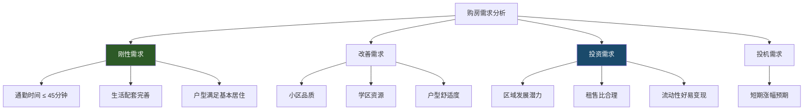
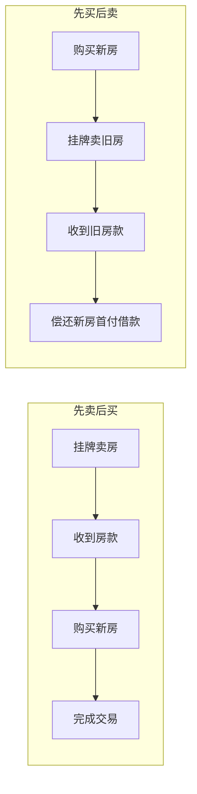
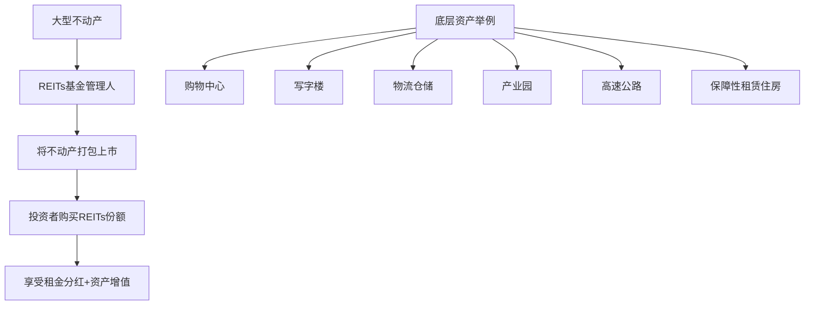
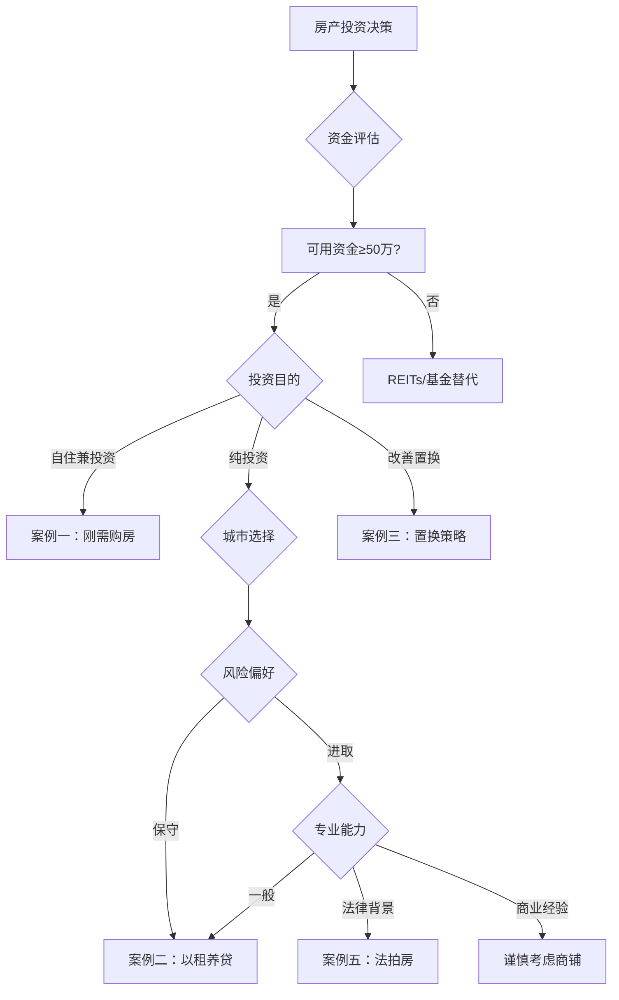

## 六、房产投资实战案例详解

房产投资的理论再扎实，最终都要落地到真实场景中检验。本章通过六个覆盖不同投资类型、不同资金规模、不同风险偏好的实战案例，完整呈现从决策分析、资金规划、风险评估到最终收益的全链条。每个案例都不是简单的"成功故事"或"失败教训"，而是还原决策过程中面临的真实权衡——信息不完整时如何判断，资金有限时如何取舍，市场波动时如何应对。

### 案例一：首次购房者的自住兼投资决策

#### 1.1 人物画像与财务状况

| 维度 | 详情 |
|------|------|
| 姓名 | 小李 |
| 年龄 | 28岁 |
| 职业 | 互联网公司后端开发工程师 |
| 年薪 | 30万（税后约24万，月薪约2万） |
| 存款 | 50万（工作4年积蓄35万 + 父母支持15万） |
| 负债 | 无 |
| 公积金 | 月缴存3600元（公司+个人各1800） |
| 家庭情况 | 单身，父母在外地，无其他房产 |

小李的核心矛盾是：刚需自住 vs 资产增值。作为程序员，他清楚知道行业有周期性，35岁危机并非空穴来风，因此在购房决策上格外谨慎——既要解决居住问题，又不想因为一套房子锁死未来5-10年的财务灵活性。

#### 1.2 需求分析框架

购房需求可以拆分为四个层次，优先级依次递减：



小李属于**刚性需求为主、投资需求为辅**。这意味着：
- 自住体验是第一位的，不能为了投资潜力牺牲居住品质
- 但也不能完全不考虑增值，毕竟这是大多数人一生中最大的一笔投资
- 首套房的优势在于低首付（20%-30%）、低利率（首套优惠）、低税费（契税减免）

#### 1.3 城市与区域选择

**城市筛选逻辑**：

| 筛选维度 | 杭州表现 | 对比城市（成都/南京） | 结论 |
|----------|---------|---------------------|------|
| 产业支撑 | 互联网+数字经济，阿里/网易/字节 | 成都：互联网偏弱；南京：软件强但规模小 | 杭州胜 |
| 人口流入 | 2020-2024年净增约200万 | 成都：300万+；南京：100万+ | 成都>杭州>南京 |
| 房价水平 | 3-4万/㎡（核心区） | 成都：1.5-2.5万；南京：2.5-3.5万 | 成都最友好 |
| 租金回报率 | 1.5-2.5% | 成都：3-4%；南京：2-3% | 成都最友好 |
| 落户政策 | 较宽松 | 成都：宽松；南京：宽松 | 持平 |

小李选择杭州的决定性因素是**工作在杭州，且互联网行业在杭州的就业密度最高**。自住需求决定了"在哪里工作就在哪里买"是第一原则。

**区域选择——未来科技城**：

杭州的板块可以粗分为三类：
- **核心改善区**（钱江新城、滨江）：单价5-8万，总价门槛500万+，超出预算
- **产业新区**（未来科技城、萧山科技城）：单价3-4.5万，有产业和人口支撑
- **远郊新区**（临安、富阳）：单价1.5-2.5万，配套不足，通勤困难

未来科技城的优势：
1. **产业聚集效应**：阿里巴巴全球总部、字节跳动、快手等3000+科技企业入驻，创造了大量高薪就业岗位
2. **地铁5号线已通车**：连接主城核心区，通勤时间可控
3. **配套逐步成熟**：EFC（欧美金融城）、万达广场等商业体已开业
4. **人口结构年轻**：25-35岁科技从业者为主，消费力强，租赁需求旺盛

#### 1.4 房源选择与资金测算

**选定房源**：

| 项目 | 详情 |
|------|------|
| 楼盘 | 某品牌开发商精装交付 |
| 户型 | 90㎡三室两厅一卫 |
| 单价 | 3.5万/㎡ |
| 总价 | 315万 |
| 朝向 | 南北通透，中间楼层 |
| 交付时间 | 2025年底 |

**资金规划明细**：

```text
收入端：
  存款现金：50万
  需要借款：约45万（向亲戚朋友，约定2年内还清）
  可用首付：95万

支出端：
  首付（30%）：94.5万
  契税（首套90㎡以下1%，90㎡以上1.5%）：4.725万
  维修基金：约2万
  装修（精装交付，软装约8万）：8万
  其他杂费（律师费、登记费等）：0.5万
  ──────────────
  总支出：约109.7万
  资金缺口：约15万（从后续工资中补齐，交付前有缓冲期）

贷款规划：
  贷款金额：220.5万
  贷款方式：组合贷（公积金120万 + 商贷100.5万）
  公积金利率：3.1%
  商贷利率：3.8%（首套优惠）
  混合利率等效：约3.4%
  贷款期限：30年
  等额本息月供：约9,780元
  公积金月冲：3,600元
  实际每月现金支出：约6,180元

月供压力测试：
  月收入：20,000元
  月供（扣除公积金冲抵后）：6,180元
  月供收入比：30.9%（警戒线为50%，健康范围内）
  每月生活开支：约6,000元
  每月可还亲友借款：约5,000元
  亲友借款还清时间：约9个月（95万-50万=45万，月还5000需90个月）
  ⚠ 注意：45万亲友借款，每月还5000需要7.5年，压力不小
  实际方案调整：前2年每月还6000，加上年终奖集中还款，争取3年内还清
```

**组合贷的优势量化**：

| 对比项 | 纯商贷220.5万 | 组合贷120+100.5万 | 节省 |
|--------|-------------|-------------------|------|
| 月供 | 约10,280元 | 约9,780元 | 500元/月 |
| 30年总利息 | 约149.5万 | 约131.5万 | 约18万 |

仅靠合理利用公积金贷款，30年可以节省约18万利息，这相当于白赚了一辆车。

#### 1.5 购房后三年跟踪

| 时间节点 | 房价（万/㎡） | 房产市值 | 贷款余额 | 净资产 | 变化 |
|----------|-------------|---------|---------|--------|------|
| 购入时 | 3.5 | 315万 | 220.5万 | 94.5万 | — |
| 第1年末 | 3.7 | 333万 | 216万 | 117万 | +22.5万 |
| 第2年末 | 4.0 | 360万 | 211万 | 149万 | +32万 |
| 第3年末 | 4.5 | 405万 | 206万 | 199万 | +50万 |

三年资产增值：199万 - 94.5万 = **104.5万**（含房价涨幅+贷款本金偿还）

但需要注意的隐性成本：
- 三年房贷利息支出：约22万
- 三年亲友借款利息（按年化3%计算）：约4万
- 机会成本（50万存款如果买理财，3年约5%年化收益）：约7.5万
- 扣除隐性成本后的真实收益：104.5万 - 22万 - 4万 - 7.5万 = **约71万**

#### 1.6 关键决策复盘

**做对了什么**：
1. **组合贷策略**：充分利用公积金低利率，30年省18万利息
2. **选择产业区**：未来科技城有真实就业人口支撑，不是概念炒作
3. **南北通透户型**：流动性好，未来转手或出租都有优势
4. **精装交付**：省去了装修的时间和精力成本，对单身程序员尤其重要

**可以做得更好的地方**：
1. **亲友借款45万压力偏大**：可以考虑买总价更低的房源（如80㎡两居），把首付缺口控制在20万以内
2. **没有同步考虑租房替代方案**：如果月供+借款还款超过月收入50%，应该推迟购房
3. **忽略了车位问题**：未来科技城车位约15-20万，应纳入总体预算

**适用人群画像**：
- 25-35岁，有稳定收入的刚需购房者
- 工作在一二线城市产业聚集区
- 首付能力在总价25%-35%之间
- 月供收入比控制在35%以内

---

### 案例二：投资性购房的以租养贷

#### 2.1 投资者画像

| 维度 | 详情 |
|------|------|
| 姓名 | 老王 |
| 年龄 | 35岁 |
| 职业 | 外企中层管理（供应链总监） |
| 年收入 | 50万（税后约38万） |
| 家庭 | 已婚，一孩（3岁），配偶全职带娃 |
| 现有资产 | 自住房一套（无贷款，市值约300万），存款80万 |
| 风险偏好 | 中等偏保守，追求稳定现金流 |

老王的核心需求是：**用存量资金构建一条稳定的被动收入管道**。他不追求房价暴涨，而是看重每月可见的租金收入——这是中年家庭对抗职业不确定性的安全垫。

#### 2.2 投资逻辑：为什么选以租养贷

以租养贷的核心逻辑是**用租金覆盖房贷，甚至产生正向现金流**，这意味着：
- 你不需要额外掏钱养房
- 租客帮你还贷款
- 房价上涨的部分是纯赚的
- 房价不涨也不亏（租金已经覆盖了持有成本）

但要实现这个目标，必须满足两个条件：

| 条件 | 含义 | 全国达标城市 |
|------|------|------------|
| 租售比 ≥ 3% | 年租金/房价 ≥ 3% | 成都、长沙、重庆、沈阳等 |
| 租金 ≥ 月供 | 扣除管理费后租金能覆盖月供 | 同上（需低首付比例配合） |

一线城市（北上广深）的租售比普遍只有1.5%-2%，无法实现以租养贷。因此，**以租养贷策略天然指向强二线及以下城市**。

#### 2.3 城市与房源选择

**选择成都的原因**：

| 维度 | 成都数据 | 全国对比排名 |
|------|---------|------------|
| 常住人口 | 2140万（2024年） | 第4 |
| 近5年净增人口 | 300万+ | 第2（仅次于深圳） |
| GDP | 2.2万亿（2024年） | 第7 |
| 平均房价 | 1.5-2万/㎡ | 新一线最低之一 |
| 租金回报率 | 3-4% | 新一线最高之一 |
| 互联网就业 | 字节、腾讯、阿里均有分部 | 新一线前3 |

成都的人口虹吸效应极强——它不仅吸引四川省内人口，还辐射整个西南地区（云贵藏）。大量年轻人涌入创造了持续的租赁需求。

**区域选择——高新区南区**：

成都的租赁热点区域可以分为四类：

| 区域类型 | 代表区域 | 租金水平 | 租售比 | 适合投资？ |
|----------|---------|---------|--------|----------|
| 核心商务区 | 春盐商圈 | 高 | 低（2%左右） | ❌ 价格太高 |
| 科技产业区 | 高新区南区 | 中高 | 高（3-4%） | ✅ 最佳选择 |
| 大学周边 | 川大/电子科大附近 | 中 | 中（2.5-3%） | ⚠ 租客流动性大 |
| 远郊新区 | 天府新区远端 | 低 | 低（1.5-2%） | ❌ 配套不足 |

高新区南区的优势：
1. 天府软件园聚集了上万家企业，年轻白领密度极高
2. 地铁1号线直达市中心，通勤方便
3. 周边商业配套成熟（银泰城、九方等）
4. 租客质量高（科技企业白领），租金支付能力强，租约稳定

#### 2.4 房源选择与详细测算

**选定房源**：

| 项目 | 详情 |
|------|------|
| 类型 | 二手次新房（房龄5年） |
| 小区 | 某品牌物业次新小区 |
| 户型 | 70㎡两室一厅一卫 |
| 楼层 | 中间楼层，朝南 |
| 单价 | 1.8万/㎡ |
| 总价 | 126万 |
| 周边租金参考 | 同户型3300-3800元/月 |

**资金规划**：

```text
投入资金：
  首付（50%）：63万
  中介费（2%）：2.52万
  契税（二套3%）：3.78万
  个税（如卖方转嫁）：约1.26万（1%）
  贷款服务费：0.3万
  简单翻新（刷墙+换锁+添置家电）：2万
  ──────────────
  总投入：约72.86万

贷款规划：
  贷款金额：63万
  贷款方式：商贷（二套利率4.2%）
  贷款期限：20年
  等额本息月供：3,895元

租金收入：
  预计月租金：3,500元
  物业管理费（房东承担）：150元/月
  实际到手租金：3,350元/月

现金流分析：
  月租金收入：3,350元
  月供支出：3,895元
  月净现金流：-545元（前20年）
  20年贷款还清后：+3,350元/月
```

等一下——这个测算结果是**负现金流**，并不是真正的"以租养贷"。这正是很多投资者忽略的关键点。老王的实际操作中做了两个调整：

**调整一：提高首付比例到60%**

```text
首付（60%）：75.6万
贷款：50.4万
月供（20年，4.2%）：3,115元
月租金到手：3,350元
月净现金流：+235元  ← 终于转正了
总投入：75.6万 + 税费杂费约10万 = 85.6万
```

**调整二：选择等额本金还款方式**

等额本金前期月供更高，但总利息更少。以贷款50.4万、20年、4.2%计算：

| 还款方式 | 首月月供 | 末月月供 | 总利息 |
|----------|---------|---------|--------|
| 等额本息 | 3,115元 | 3,115元 | 24.4万 |
| 等额本金 | 3,836元 | 2,108元 | 21.2万 |

等额本金总利息少3.2万，但首月月供3,836元超过了租金3,350元，前几个月是负现金流。老王选择等额本息，追求现金流的稳定性。

#### 2.5 投资回报全景分析

| 指标 | 数值 | 说明 |
|------|------|------|
| 总投入资金 | 85.6万 | 首付+税费+翻新 |
| 年租金收入 | 40,200元 | 3,350×12 |
| 年租金回报率 | 4.7% | 40,200/856,000 |
| 月净现金流 | +235元 | 基本持平 |
| 租售比 | 3.3% | 40,200/1,260,000 |
| 预期房价年涨幅 | 3-5% | 成都近年平均 |
| 预期总年化回报 | 7.7%-9.7% | 租金+房价涨幅 |
| 空置风险准备金 | 每年预留1个月租金 | 3,350元/年 |
| 维修基金 | 每年预留2,000元 | 家电维修/更换 |

扣除空置和维修成本后，**实际年化租金回报约3.9%**，加上房价涨幅，总年化回报在7%-9%之间。这个回报率跑赢银行理财（3%-4%）和大部分债券基金，但低于股市长期回报（10%-12%），其优势在于**杠杆放大**和**现金流可见**。

#### 2.6 以租养贷的风险清单

| 风险类型 | 具体表现 | 应对策略 |
|----------|---------|---------|
| 空置风险 | 租客退租后1-2个月租不出去 | 选址在租赁活跃区域，租金略低于市场价5% |
| 租客违约 | 租客拖欠租金或损坏房屋 | 签规范合同，收取押金（押一付三），买房东保险 |
| 利率上升 | LPR上调导致月供增加 | 预留6个月月供作为缓冲资金 |
| 房价下跌 | 房产市值低于贷款余额（负资产） | 长期持有不恐慌卖出，租金持续覆盖持有成本 |
| 政策风险 | 房产税开征增加持有成本 | 关注政策动向，分散投资不把全部身家押在房产上 |
| 物业老化 | 房龄增加导致租金下降 | 每5年进行一次小翻新（刷墙+换家电），保持竞争力 |

#### 2.7 关键教训与适用人群

**教训总结**：
1. **租售比是核心筛选指标**：年租售比低于2.5%的房源，以租养贷基本不可能实现
2. **首付比例决定现金流**：首付50%在强二线才勉强做到以租养贷，首付60%才比较安全
3. **不要忽略隐性成本**：空置、维修、管理、物业费都是真实支出
4. **杠杆是双刃剑**：以租养贷的核心是借银行的钱，但月供是刚性支出，租金不是

**适用人群**：
- 有50万以上闲置资金的家庭
- 已有自住房，追求稳定被动收入
- 风险偏好中等，能接受3-5年持有周期
- 有耐心处理租赁管理事务（或愿意委托中介）

---

### 案例三：房产置换的时机与策略

#### 3.1 置换者画像

| 维度 | 详情 |
|------|------|
| 姓名 | 张女士 |
| 年龄 | 40岁 |
| 家庭 | 已婚，孩子6岁（即将上小学） |
| 现有住房 | 90㎡两居室，市值280万，无贷款 |
| 家庭收入 | 夫妻合计年收入45万 |
| 存款 | 60万 |
| 置换紧迫性 | 高（学区划片每年5月确定） |

张女士的置换是典型的**改善型+学区型双重驱动**。孩子入学时间是硬约束，这使得置换决策有了明确的deadline。

#### 3.2 置换策略对比

房产置换有两种基本策略，各有利弊：



| 对比维度 | 先卖后买 | 先买后卖 |
|----------|---------|---------|
| 资金压力 | 低（卖房款到位再买） | 高（需要垫资或借款付首付） |
| 时间压力 | 高（卖房后需快速找到新房） | 低（可以从容卖旧房） |
| 议价能力 | 弱（卖房时可能被压价） | 强（不急卖，可以等好价格） |
| 市场风险 | 低 | 高（如果旧房卖不掉，背负双贷） |
| 适合人群 | 资金紧张，风险厌恶型 | 资金充裕，可承担短期高杠杆 |

张女士选择**先卖后买**，因为：
1. 存款60万不足以独立支付改善房首付
2. 孩子入学时间紧迫，不能冒"旧房卖不掉"的风险
3. 夫妻收入虽稳定但不算高，无法承受双贷压力

#### 3.3 置换全流程时间线

```text
时间线（以5月入学为deadline倒推）：

T-8月（9月）：开始看房
  ├─ 确定目标学区：XX小学（市重点，对口初中也不错）
  ├─ 筛选学区内小区：3-4个候选
  ├─ 了解价格区间：120㎡三居室，400-500万
  └─ 同步评估现有住房售价

T-6月（11月）：挂牌卖房
  ├─ 挂牌价：290万（参考同小区近3月成交价）
  ├─ 委托3家中介同时挂牌
  ├─ 每周跟进带看量和反馈
  └─ 预期成交价：275-285万

T-4月（1月）：卖房成交
  ├─ 最终成交价：280万（让价3.5%）
  ├─ 签约→网签→资金监管→过户
  ├─ 买家贷款审批约1个月
  └─ 预计2月中旬收到全部房款

T-2月（3月）：购买新房
  ├─ 可用资金：280万（卖房款）+ 60万（存款）= 340万
  ├─ 目标房源：XX小区120㎡三居室，总价450万
  ├─ 首付：340万（76%首付，大幅降低贷款压力）
  ├─ 贷款：110万
  ├─ 月供：约5,300元（20年，利率3.8%）
  └─ 签约→网签→贷款审批→过户

T-1月（4月）：完成交易+入学登记
  ├─ 拿到新房房产证
  ├─ 办理户口迁入
  └─ 完成入学信息采集

T+1月（6月）：装修
  ├─ 简装预算：25万
  ├─ 工期：2个月
  └─ 暂住过渡房（租房，月租4,000元）

T+3月（8月底）：入住
  └─ 9月开学，孩子顺利入学
```

#### 3.4 置换过程中的税费全清单

置换涉及两次交易（一卖一买），税费是很多人忽略的大额支出：

**卖房税费**（张女士作为卖方）：

| 税费项目 | 计算方式 | 金额 |
|----------|---------|------|
| 增值税 | 满2年免征 | 0 |
| 个人所得税 | 满五唯一免征，否则差额20%或全额1% | 0（满五唯一） |
| 中介费 | 成交价1%-2% | 2.8万-5.6万 |
| **卖方合计** | | **2.8万-5.6万** |

**买房税费**（张女士作为买方）：

| 税费项目 | 计算方式 | 金额 |
|----------|---------|------|
| 契税 | 二套3%（450万×3%） | 13.5万 |
| 中介费 | 成交价1%-2% | 4.5万-9万 |
| 贷款服务费 | 0.3%-0.5% | 0.33万-0.55万 |
| 权属登记费 | 固定 | 0.008万 |
| **买方合计** | | **18.3万-23万** |

**置换总税费**：约**21万-28.6万**，占置换总额的3%-4%。

这是一个容易被忽略的数字——张女士的60万存款，扣除税费后实际可用只有32-39万，远少于预期。幸好卖房款280万弥补了缺口。

#### 3.5 关键风险与应对

**风险一：卖房周期过长，错过入学时间**

应对策略：
- 挂牌价略低于市场价3%-5%，换取更快成交
- 同时委托多家中介，扩大曝光
- 准备Plan B：如果3个月内卖不掉，先用存款+信用贷支付新房首付

**风险二：买入的学区房政策调整**

应对策略：
- 优先选择"多校划片"政策尚未实施的区域
- 购买前向教育局确认对口关系
- 选择对口初中也好的"双学区"，降低政策变动风险

**风险三：贷款审批不通过**

应对策略：
- 提前6个月养好征信（不逾期、不频繁申卡）
- 卖房款到位后再申请新房贷款，提供大额首付证明
- 准备公积金贷款（利率更低、审批更稳）

#### 3.6 置换优化建议

| 优化点 | 原方案 | 优化方案 | 节省/收益 |
|--------|--------|---------|----------|
| 卖房定价 | 挂牌290万 | 挂牌285万，心理底价278万 | 成交快1个月，减少过渡租金 |
| 新房首付比例 | 76% | 60%（留40万应急+装修） | 财务更灵活 |
| 中介费 | 各付1.5% | 卖方只付1%，买方选独家代理谈1% | 节省约4万 |
| 装修 | 25万全包 | 15万半包（自己选材） | 节省10万 |
| 过渡期租房 | 随意租房 | 提前和新房业主协商返租2个月 | 节省0.8万 |

#### 3.7 关键教训

1. **置换是两次交易，税费成本不可忽略**：通常占总额3%-5%，必须提前纳入预算
2. **先卖后买是安全策略**：除非你有充裕的流动资金，否则不要尝试先买后卖
3. **时间线管理是核心**：用deadline倒推每个节点，预留1-2个月的缓冲
4. **学区房要买"确定性"**：不要赌政策，买已经有明确对口关系的学区房
5. **置换期间的隐性成本**：过渡租房、搬家费、临时仓储费，合计约1-3万

---

### 案例四：商铺投资的教训——"包租"陷阱

#### 4.1 受害者画像

| 维度 | 详情 |
|------|------|
| 姓名 | 老赵 |
| 年龄 | 45岁 |
| 职业 | 小型贸易公司老板 |
| 年收入 | 约40万 |
| 投资经验 | 有股票和基金投资经验，无房产投资经验 |
| 投资动机 | 手里有50万闲钱，看到"包租10年，年回报8%"的广告 |

老赵代表了一类典型的投资受害者：有一定资金但缺乏房产投资知识，容易被"稳定高回报"的承诺吸引。

#### 4.2 "包租"模式解析

所谓"售后包租"，是指开发商将商铺出售给个人投资者，同时承诺在一定年限内代为出租并支付固定回报。其商业逻辑表面上是：


但真实逻辑往往是：


**这就是典型的"庞氏结构"——用后来投资者的钱支付先来投资者的回报**。一旦新增投资者减少或开发商资金链断裂，整个链条崩塌。

#### 4.3 老赵的投资过程还原

```text
决策阶段（第0年）：
  ├─ 看到广告：XX商业广场，黄金旺铺，包租10年，年回报8%
  ├─ 实地考察：售楼处富丽堂皇，销售员热情专业
  ├─ 看到的材料：品牌商家入驻意向书、周边规划图、政府批文
  ├─ 犹疑点：商铺位置偏僻，周边没有成熟社区
  ├─ 销售员话术："现在偏不代表以后偏，XX地铁3年后通车"
  ├─ 最终决定：投资100万（首付50万+贷款50万）
  └─ 签订：购房合同 + 包租协议

持有阶段（第1-3年）：
  ├─ 第1年：开发商按时支付租金8万（打到银行卡）
  ├─ 第2年：开发商按时支付租金8万
  ├─ 第3年：开发商按时支付租金8万（但延迟了2周）
  ├─ 老赵感受："果然如销售所说，稳稳的幸福"
  └─ 累计收到租金：24万

崩盘阶段（第4-5年）：
  ├─ 第4年初：租金延迟了2个月才到账
  ├─ 第4年中：开发商发通知，因"市场环境变化"，租金下调至6%
  ├─ 第4年末：租金延迟4个月
  ├─ 第5年初：开发商资金链断裂，停止支付租金
  ├─ 老赵去现场看：商铺根本没有租出去，空置率超过70%
  ├─ 找开发商：办公室人去楼空，法人已变更
  └─ 走法律途径：起诉，但开发商无可执行资产
```

#### 4.4 损失全景计算

| 项目 | 金额 | 说明 |
|------|------|------|
| 首付投入 | 50万 | 现金 |
| 5年贷款利息 | 约13.5万 | 50万贷款，年利率5.4%，5年利息 |
| 已付贷款本金 | 约12万 | 5年等额本息 |
| 已收租金 | 24万 | 前3年共24万 |
| **净损失** | **约51.5万** | 50+13.5-24+12（未还贷款） |
| 剩余贷款 | 38万 | 仍需继续偿还 |
| 商铺残值 | 约15-20万 | 位置差，无人接盘 |
| **实际总亏损** | **约70-75万** | 净损失+剩余贷款-残值 |

更残酷的是：商铺贷款还在继续扣款，老赵每个月还要还约2,500元，直到贷款到期。这就是商铺投资失败的真实代价——**不仅损失了本金，还背上了持续的债务**。

#### 4.5 商铺投资的深层风险分析

商铺投资的风险远高于住宅，原因在于：

| 风险维度 | 住宅 | 商铺 |
|----------|------|------|
| 流动性 | 高（刚需市场，总有买家） | 低（投资市场，下行时无人接盘） |
| 租金稳定性 | 高（居住是刚需） | 低（依赖商户经营状况） |
| 估值逻辑 | 对标周边成交价 | 对标租金回报率（6%-8%才合理） |
| 贷款条件 | 首套可贷70%，利率低 | 通常贷50%，利率上浮10%-20% |
| 税费成本 | 契税1%-3% | 契税3%+可能的土地增值税 |
| 政策风险 | 相对稳定 | 受电商冲击、商业规划变动影响大 |
| 转让难度 | 较容易 | 极难，需找到接盘的投资者 |

#### 4.6 如何识别商铺投资骗局

**红旗信号**（出现以下任何一条就应高度警惕）：

1. **承诺固定回报率超过6%**：正规商铺的实际回报率在4%-6%之间，超过这个数字大概率是虚高的
2. **开发商自持比例低于30%**：如果开发商自己都不愿意持有大部分商铺，说明他对这个项目的信心不足
3. **包租协议中的免责条款**：仔细阅读包租协议，很多协议中有"不可抗力免责""开发商有权调整租金"等条款
4. **商铺位于新建商圈**：新商圈需要5-8年培育期，前3-5年大概率亏损
5. **产权式商铺/分割式商铺**：将一个大空间分割成几十个小产权出售，流动性极差
6. **销售团队过于热情**：正规投资不需要"逼单""限时优惠""名额有限"等话术

**合格的商铺投资应该满足的条件**：

| 条件 | 标准 | 重要性 |
|------|------|--------|
| 位置 | 已成熟商圈或核心社区底商 | ★★★★★ |
| 人流 | 日均自然人流≥3000人 | ★★★★★ |
| 租售比 | 年租金/售价 ≥ 5% | ★★★★☆ |
| 产权 | 独立产权，可独立经营 | ★★★★☆ |
| 层高 | 一层>二层>三层（一层溢价最高） | ★★★★☆ |
| 面积 | 30-80㎡（小面积流动性好） | ★★★☆☆ |
| 周边竞品 | 周边商铺空置率 < 20% | ★★★★☆ |

#### 4.7 老赵的止损方案

当商铺投资已经失败，核心问题是**如何止损**，而不是"等着回本"：

| 方案 | 操作 | 预期回收 | 难度 |
|------|------|---------|------|
| 低价转让 | 以市场价6-7折出售 | 15-20万 | 中（需找到接盘者） |
| 自行出租 | 自己找租户，不依赖开发商 | 月租2000-3000元 | 低（但位置差很难租） |
| 改变用途 | 如政策允许，改为仓储/工作室 | 月租1500-2500元 | 中（需确认政策） |
| 法律途径 | 起诉开发商违约 | 不确定，周期长 | 高 |
| 烂在手里 | 继续还贷，等待区域发展 | 可能5-10年后 | 低（但持续亏损） |

老赵最终选择了**低价转让+自行出租并行**的策略：挂牌18万出售（原价100万），同步自己张贴出租信息。6个月后以16万卖出，割肉离场。

#### 4.8 核心教训

1. **"包租"承诺是商铺投资最大的红旗**：任何需要开发商承诺回报的投资，本质上都是在赌开发商的信用
2. **商铺的价值 = 位置 × 人流 × 经营**：三者缺一不可
3. **商铺投资门槛比住宅高得多**：不仅需要更多资金，还需要商业判断力
4. **新手不建议碰商铺**：先通过住宅投资积累经验，再考虑商铺
5. **独立调查比销售话术重要100倍**：去实地蹲点数人流，去周边商铺和店主聊天，而不是听销售员讲故事

---

### 案例五：法拍房的投资机会与风险

#### 5.1 投资者画像

| 维度 | 详情 |
|------|------|
| 姓名 | 陈先生 |
| 年龄 | 38岁 |
| 职业 | 律师事务所合伙人 |
| 年收入 | 80万 |
| 投资经验 | 丰富，有股票、基金、住宅投资经验 |
| 投资动机 | 寻找低于市场价的房产投资机会 |
| 独特优势 | 法律背景，熟悉司法流程和风险 |

法拍房（法院拍卖房产）是因债务纠纷、抵押执行等原因被法院强制拍卖的房产。其核心吸引力在于**通常低于市场价20%-30%**，但风险也相应更高。

#### 5.2 法拍房的优势与风险全景

| 维度 | 优势 | 风险 |
|------|------|------|
| 价格 | 通常为市场价7-8折 | 热门房源可能溢价到市场价 |
| 产权 | 法院裁定书具有法律效力 | 可能存在多次抵押、产权纠纷 |
| 税费 | 部分税费由法院从拍卖款中扣除 | 可能需要承担原业主的欠税 |
| 入住 | 拍下即可办理过户 | 原住户可能拒绝搬离（清场困难） |
| 贷款 | 可以贷款购买 | 部分法拍要求全款，贷款审批时间紧 |
| 信息 | 法院公告公开透明 | 隐性问题（凶宅、违建、漏水）不一定披露 |

#### 5.3 陈先生的法拍房操作全流程

**第一步：信息搜集与筛选**

```text
信息来源：
  ├─ 人民法院诉讼资产网（官方平台）
  ├─ 京东拍卖/阿里拍卖（第三方平台）
  ├─ 当地法院公告栏
  └─ 专业法拍房中介（收取成交价1%-3%服务费）

筛选标准（陈先生设定）：
  ├─ 目标城市：本市（便于实地考察）
  ├─ 目标区域：核心城区（保值性强）
  ├─ 房产类型：住宅（非商铺、非工业）
  ├─ 折扣率：≥市场价75%
  ├─ 产权情况：单一产权（非共有）
  ├─ 占用情况：空置或业主配合
  └─ 贷款支持：支持按揭贷款
```

**第二步：深度尽调**

经过初步筛选，陈先生锁定了3套房源，最终选择其中1套进行深度尽调：

| 尽调项目 | 调查方式 | 结果 |
|----------|---------|------|
| 产权核查 | 不动产登记中心查询 | 无抵押，无查封（仅法院本轮查封） |
| 欠费核查 | 物业公司查询 | 欠物业费2.3万，欠水电气费0.5万 |
| 户口核查 | 派出所查询 | 原业主户口在此，需自行协商迁出 |
| 实地查看 | 亲自上门+带装修师傅 | 房屋状况良好，无结构性问题 |
| 邻居走访 | 和楼上楼下邻居聊天 | 非凶宅，无异常 |
| 周边价格 | 链家/贝壳查同户型成交价 | 市场价约320万 |
| 法院公告 | 阅读执行裁定书 | 因银行贷款违约被执行，无其他纠纷 |

**第三步：竞拍策略**

```text
拍卖信息：
  起拍价：224万（市场价320万的70%）
  保证金：22.4万（起拍价10%）
  加价幅度：每次1万
  拍卖时间：24小时（10:00-次日10:00）
  竞拍人数：报名7人

竞拍策略：
  ├─ 心理底价：260万（市场价的81%）
  ├─ 前期不急出手，观察竞争态势
  ├─ 最后10分钟开始出价
  ├─ 每次加价1万（不激进，试探对手底线）
  └─ 超过260万立即放弃

实际竞拍过程：
  ├─ 起拍价224万，前6小时无人出价
  ├─ 第7小时，有人出价224万
  ├─ 最后2小时，3人开始竞争
  ├─ 最后30分钟：价格推到248万
  ├─ 最后10分钟：陈先生出价250万
  ├─ 最后3分钟：竞争对手出价252万
  ├─ 陈先生出价254万
  └─ 最终成交：254万（无人继续加价）
```

**第四步：过户与入住**

```text
时间线：
  拍卖成交日（D日）：
    └─ 24小时内支付尾款231.6万（总价254万-保证金22.4万）

  D+7日：
    └─ 法院出具《执行裁定书》《协助执行通知书》

  D+14日：
    └─ 持裁定书到不动产登记中心办理过户
    └─ 缴纳契税：254万 × 3% = 7.62万（二套）
    └─ 缴纳欠缴物业费/水电费：2.8万（法拍房需买方承担）

  D+30日：
    └─ 拿到新不动产权证

  D+45日：
    └─ 与原业主协商户口迁出（给了1万元"搬家费"）
    └─ 原业主配合搬离，未发生冲突

  D+60日：
    └─ 简单翻新入住（花费5万）
```

#### 5.4 投资回报计算

| 项目 | 金额 | 说明 |
|------|------|------|
| 购入总价 | 254万 | 法拍成交价 |
| 契税 | 7.62万 | 二套3% |
| 欠费代缴 | 2.8万 | 物业+水电 |
| 搬家补偿 | 1万 | 给原业主 |
| 翻新费用 | 5万 | 刷墙+换锁+添置家具 |
| 中介服务费 | 0 | 未用中介 |
| **总投入** | **270.42万** | |
| 当前市场价 | 320万 | 同户型成交参考 |
| **账面浮盈** | **49.58万** | 即时浮盈约18.3% |

如果选择出租：
- 预计月租金：4,500元
- 年租金回报率：4,500×12/2,704,200 = **2.0%**
- 加上房价涨幅，预期总年化回报：5%-8%

#### 5.5 法拍房的十大陷阱

| 序号 | 陷阱 | 后果 | 防范方法 |
|------|------|------|---------|
| 1 | 租约在先 | "买卖不破租赁"，最长20年无法入住 | 核查租赁合同签订时间，警惕拍卖前突击签租约 |
| 2 | 多重抵押 | 可能存在轮候查封，过户困难 | 到不动产登记中心查完整抵押信息 |
| 3 | 欠缴税费 | 原业主欠税可能由买方承担 | 提前向税务局查询欠税情况 |
| 4 | 户口占用 | 原业主户口不迁出，影响学区 | 拍卖前到派出所查询，确认可协商 |
| 5 | 凶宅/事故房 | 严重影响居住心理和转手价格 | 邻居走访+网上搜索+物业确认 |
| 6 | 违建/改建 | 面积与产权证不符，可能被要求拆除 | 实地测量+对比产权证 |
| 7 | 物业欠费 | 大额欠费可能转嫁给买方 | 拍卖前向物业公司查询 |
| 8 | 清场困难 | 原住户拒绝搬离，法院执行周期长 | 优先选择空置房或业主自愿搬离的 |
| 9 | 贷款失败 | 法拍要求7天内付清全款 | 提前获得银行预审批 |
| 10 | 溢价竞拍 | 竞争激烈导致拍出高于市场价 | 设定严格的心理底价并遵守 |

#### 5.6 适用人群

法拍房适合以下人群：
1. **有法律知识背景**或愿意请专业法拍房律师全程陪同
2. **有充裕资金**，能承受短期内全款支付的压力
3. **有耐心**做深度尽调，不急于成交
4. **风险承受能力强**，能接受过户延迟、清场困难等不确定性

**不适合法拍房的人群**：首次购房者、资金紧张者、怕麻烦者、对法律流程不熟悉且不愿请专业人士者。

---

### 案例六：REITs——不买房也能投资房地产

#### 6.1 投资者画像

| 维度 | 详情 |
|------|------|
| 姓名 | 小周 |
| 年龄 | 26岁 |
| 职业 | 电商运营 |
| 年收入 | 18万 |
| 可投资资金 | 15万 |
| 投资目标 | 参与房地产投资，但资金不够买房 |
| 风险偏好 | 中等 |

小周代表了大量年轻人的真实困境：看好房地产市场，但一二线城市动辄百万的首付门槛让人望而却步。REITs（不动产投资信托基金）提供了一种**用小资金参与大物业投资**的途径。

#### 6.2 REITs是什么

REITs的本质是**把大型不动产（写字楼、商场、物流园、高速公路等）的产权拆分成小份额，让普通投资者也能买卖**。可以理解为"房产的股票"：



**中国REITs（基础设施公募REITs）的基本特征**：

| 特征 | 说明 |
|------|------|
| 上市场所 | 上交所、深交所 |
| 最低投资门槛 | 约100-1000元（1手起） |
| 底层资产 | 基础设施（产业园区、高速公路、仓储物流、保障房等） |
| 收益来源 | 租金分红（强制分配90%以上利润）+ 二级市场价格波动 |
| 流动性 | 上市交易，T+1 |
| 税收 | 分红部分暂无个人所得税（政策优惠期） |
| 风险等级 | 中等（介于股票和债券之间） |

#### 6.3 小周的REITs投资方案

**第一步：了解REITs产品**

截至2025年，中国公募REITs已有30+只产品上市，底层资产类型分布如下：

| 资产类型 | 代表产品 | 分红率 | 风险特征 |
|----------|---------|--------|---------|
| 产业园区 | 华安张江光大REIT | 4%-5% | 受科技产业景气度影响 |
| 高速公路 | 浙商沪杭甬REIT | 5%-7% | 现金流稳定，但增长有限 |
| 仓储物流 | 中金普洛斯REIT | 3%-5% | 受电商/物流需求驱动 |
| 保障性租赁住房 | 华夏北京保障房REIT | 3%-4% | 政策支持，最稳定 |
| 生态环保 | 富国首创水务REIT | 4%-6% | 公用事业属性，现金流稳定 |

**第二步：构建投资组合**

小周的15万资金配置方案：

```text
REITs投资组合（总投入15万）：

核心仓位（60%，9万）：
  ├─ 产业园区REIT：3万（看好科技产业复苏）
  ├─ 仓储物流REIT：3万（受益于电商持续增长）
  └─ 保障房REIT：3万（政策支持，防守型）

卫星仓位（30%，4.5万）：
  ├─ 高速公路REIT：2.5万（高分红，现金流补充）
  └─ 生态环保REIT：2万（公用事业，抗周期）

现金储备（10%，1.5万）：
  └─ 货币基金：用于REITs价格下跌时加仓
```

**第三步：预期收益测算**

| 收益来源 | 年化预期 | 说明 |
|----------|---------|------|
| 分红收益 | 4%-5% | 15万 × 4.5% = 6,750元/年 |
| 价格增值 | 3%-8% | 视市场环境波动 |
| **合计预期** | **7%-13%** | **15万 × 10% = 15,000元/年** |

注意：REITs价格会波动，分红也不固定。以上是长期平均预期，短期内可能出现亏损。

#### 6.4 REITs vs 直接买房对比

| 对比维度 | 直接买房 | REITs投资 |
|----------|---------|----------|
| 资金门槛 | 50万-200万（首付） | 100元起 |
| 流动性 | 差（卖房需1-6个月） | 好（T+1交易） |
| 杠杆 | 可用房贷（3-5倍杠杆） | 无杠杆 |
| 分红/租金 | 需自己管理租客 | 基金管理人代管 |
| 税费 | 契税+个税+增值税 | 暂免个人所得税 |
| 分散化 | 一套房=单一资产 | 可投资多个不同类型物业 |
| 管理成本 | 高（维修、租客管理） | 低（基金公司代管） |
| 增值潜力 | 高（土地稀缺性+杠杆放大） | 中（无杠杆，受市场情绪影响） |
| 适合人群 | 有大额资金+长期持有 | 资金少+追求流动性 |

#### 6.5 REITs投资的注意事项

1. **不要把REITs当股票炒**：REITs的回报主要来自分红和长期增值，短线交易容易被手续费和价差吃掉收益
2. **关注底层资产质量**：买REITs就是买底层资产，要了解资产所在的区域、租户质量、出租率
3. **注意估值水平**：REITs的P/NAV（价格/净资产）超过1.2时偏贵，低于0.9时可能是买入机会
4. **分散配置**：不要All in单一REITs，至少配置3-5只不同类型的产品
5. **关注利率环境**：利率上升时REITs价格通常下跌（因为分红吸引力相对下降），利率下降时REITs受益
6. **中国REITs市场仍在早期**：产品数量少、流动性不如成熟市场，要做好长期持有的准备

#### 6.6 适用人群

REITs适合以下人群：
- 资金量在50万以下，无法直接买房的年轻投资者
- 已有自住房，想增加房地产配置但不想管理物业的投资者
- 追求稳定现金流的退休规划者
- 希望分散投资组合、降低单一资产风险的投资者

---

### 六大案例横向对比与投资决策矩阵

| 对比维度 | 案例一：自住兼投资 | 案例二：以租养贷 | 案例三：房产置换 | 案例四：商铺投资 | 案例五：法拍房 | 案例六：REITs |
|----------|---------|---------|---------|---------|---------|---------|
| 资金门槛 | 50-100万 | 60-90万 | 50-100万（含旧房） | 30-100万 | 100-300万 | 1万起 |
| 风险等级 | ★★☆☆☆ | ★★★☆☆ | ★★☆☆☆ | ★★★★★ | ★★★★☆ | ★★★☆☆ |
| 预期年化回报 | 5%-15% | 7%-10% | 不适用（改善需求） | -50%~8% | 5%-15% | 7%-13% |
| 流动性 | ★★★☆☆ | ★★☆☆☆ | ★★☆☆☆ | ★☆☆☆☆ | ★★☆☆☆ | ★★★★★ |
| 管理难度 | 低 | 中 | 高（两次交易） | 高 | 高 | 极低 |
| 杠杆效应 | 有（3倍） | 有（1-2倍） | 有（但比例低） | 有（2倍） | 有（需全款居多） | 无 |
| 适合人群 | 刚需购房者 | 有闲钱的家庭 | 改善型家庭 | 不推荐新手 | 有法律背景者 | 资金少的年轻投资者 |

### 房产投资的通用决策框架

无论选择哪种房产投资方式，都应该遵循以下决策框架：



### 写在最后：投资的本质是认知变现

六个案例，六种结局。成功的案例（自住投资、以租养贷、法拍房、REITs）有一个共同点：**投资者在决策前做了充分的信息搜集和风险评估**。失败的案例（商铺投资）也有一个共同点：**被"稳赚不赔"的承诺冲昏了头脑，忽略了独立验证**。

房产投资不是赌博，也不是理财，它是一种**需要专业知识、耐心和纪律的资产配置行为**。在投入真金白银之前，请确保：

1. 你理解这个资产的**底层逻辑**（为什么它会增值？租金从哪里来？）
2. 你做了**压力测试**（如果房价跌20%你能承受吗？如果租金空置3个月呢？）
3. 你有**退出计划**（如果需要变现，多长时间能卖出？折价多少？）
4. 你咨询了**专业人士**（律师、税务师、有经验的投资者，而不是销售员）

投资的第一条规则是：**不要亏钱**。第二条规则是：**不要忘记第一条**。
