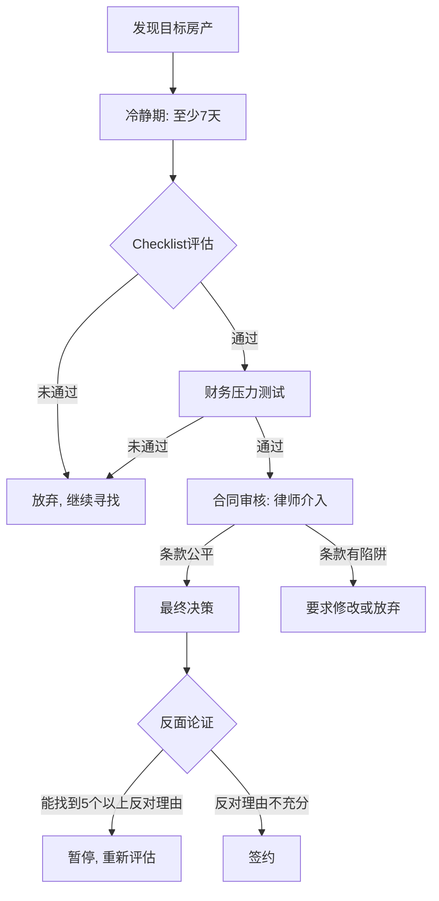

## 房产投资常见误区：七个真实案例的血泪教训

理论章节系统梳理了房产投资的十二大认知误区及其心理机制。本节通过七个真实案例，将抽象的误区具象化——每一个案例都是一个真实投资者踩坑的完整故事，包含决策背景、错误推理过程、最终代价和复盘反思。读完这些案例，你会发现：误区之所以危险，不是因为它们看起来像错误，恰恰相反，它们在当时看起来都"非常合理"。

---

### 案例一：深圳"永远涨"神话的破灭

**误区标签：** 房价永远涨（近因偏差 + 损失厌恶）

#### 人物画像

陈女士，35岁，深圳某互联网公司产品经理，家庭月收入约4.5万元。2020年底，她和丈夫决定购入第二套房产用于投资。此前他们在2016年购入的自住房已从350万涨到580万，这段经历让她坚信"深圳房价只涨不跌"。

#### 决策过程

陈女士看中龙华区某次新小区一套89㎡三房，挂牌价680万。当时市场正处于2020年深圳楼市的狂热期，该小区同户型在2019年成交价仅为520万，一年涨幅超过30%。

她的决策逻辑如下：

1. "2016年买的第一套房涨了65%，这次也不会例外"
2. "深圳是全国最年轻的城市，人口持续流入，房价没有下跌的理由"
3. "政府调控了这么多年，每次调控后都涨得更猛"
4. "不买的话，明年可能要750万才买得到"

2021年1月，她以665万（业主降价15万）购入该房产。首付约200万（含向父母借款60万），贷款465万，月供约23,000元。两套房月供合计约35,000元，占家庭月收入的78%。

#### 市场转折

2021年2月，深圳出台二手房参考价政策，银行按照参考价放贷。该小区的参考价仅为480万/89㎡，远低于实际成交价。这意味着：

- 买家贷款额度大幅缩水，需要更高首付
- 市场成交量骤降，二手房流动性几近冻结
- 挂牌量激增，业主纷纷降价抛售

到2023年底，该小区同户型成交价跌至约450万，较购入价下跌约32%。

#### 代价清算

| 项目 | 金额 |
|------|------|
| 购入价 | 665万 |
| 2023年底市值 | 约450万 |
| 账面浮亏 | -215万 |
| 2年贷款利息支出 | 约48万 |
| 首付200万的机会成本（年化4%，2年） | 约16万 |
| **总实际亏损** | **约279万** |

更严重的是现金流危机：两套房月供35,000元，加上生活开支，每月几乎没有结余。2022年丈夫公司裁员，收入降至3万/月，月供占比飙升至117%。被迫借网贷维持月供，半年内新增负债12万。最终在2023年将第一套房以530万卖出（原始购入价350万，但扣除利息和税费后净收益不足80万），用以缓解第二套房的月供压力。

#### 复盘反思

陈女士犯了三个叠加错误：

1. **近因偏差**：用2016-2020年的上涨经验线性外推，忽略了市场已在高位的事实。2020年深圳的房价收入比已超过40倍，位居全球前列。
2. **过度杠杆**：月供占收入78%，毫无安全边际。任何收入波动都会导致断供。
3. **忽视政策风险**：深圳的二手房参考价政策是史无前例的调控创新，直接打击了高杠杆投资客的生存空间。

**正确的做法应该是：** 即使看好深圳房产，也应选择月供不超过家庭收入40%的标的，预留至少12个月应急资金，且对"政策可能进一步收紧"做压力测试。

---

### 案例二：三线城市"价值洼地"的陷阱

**误区标签：** 盲信价值洼地（控制幻觉 + 幸存者偏差）

#### 人物画像

刘先生，42岁，某省会城市公务员，家庭年收入约25万元。2017年，他在同事的推荐下开始关注某中部三线城市的"新区投资机会"。

#### 决策过程

该城市2016年推出新区规划，定位为"城市副中心"，规划了高铁新城、大学城、科技产业园等概念。宣传材料显示：

- 高铁站已开工建设，预计2019年通车
- 某211大学拟建分校区，预计招生1万人
- 政府招商引资30亿元的电子信息产业园
- 新区房价仅4,500-5,500元/㎡，而老城区已达8,000元/㎡

刘先生的推理逻辑：

1. "高铁通车后，这里就是半小时经济圈，价值一定会回归"
2. "大学城带来师生消费，产业园带来就业人口，需求端有支撑"
3. "现在5,000元/㎡买入，涨到8,000元/㎡就能赚60%，比存银行强多了"
4. "同事老王已经买了两套，他做了很多研究，不会看走眼"

2017年6月，刘先生以5,200元/㎡的价格购入一套120㎡的新房，总价62.4万。全款支付（动用了多年积蓄+向亲戚借款15万）。

#### 现实发展

| 承诺 | 实际结果 |
|------|----------|
| 2019年高铁通车 | 2020年通车，但站点距离新区核心区8公里，无公交接驳 |
| 211大学分校区 | 2021年项目搁置，改为某职业学院的实训基地 |
| 电子信息产业园 | 招商不利，仅入驻3家小企业，用工不足200人 |
| 预期入住人口10万 | 2023年实际入住不足1万，大量楼盘空置 |

到2023年底，该小区二手房挂牌价仅为3,800-4,200元/㎡，且几乎没有成交。刘先生挂牌出售1年多，最低降到3,500元/㎡仍无人接盘。

#### 代价清算

| 项目 | 金额 |
|------|------|
| 购入总价 | 62.4万 |
| 当前市值（按4,000元/㎡） | 48万 |
| 4年物业费 | 约1.4万 |
| 装修（毛坯简装出租，未果） | 约8万 |
| 借款利息（15万，年息5%） | 约3万 |
| 首付资金机会成本（62.4万×4%×4年） | 约10万 |
| **总损失** | **约37万** |

刘先生62.4万的投资，4年后变成了一个卖不掉、租不出、住不了的"负资产"。

#### 复盘反思

1. **把"规划"当成"现实"**：新区规划的兑现率在中国三四线城市通常不足30%。高铁、大学城、产业园这些概念，在一二线城市核心区尚需5-10年才能兑现，在人口流出的三线城市更是遥遥无期。
2. **只看到"便宜"，没看到"为什么便宜"**：老城区8,000元/㎡是因为有真实的居住需求支撑，新区4,500元/㎡是因为没有人口、没有配套、没有流动性。价格低不是价值洼地，是价值陷阱。
3. **未验证信息来源**：同事老王的"研究"不过是看了几篇中介的软文和售楼处的宣传册，并非真正的人口、产业、土地数据。

**正确的做法应该是：** 先查阅该城市过去5年的人口变动数据（国家统计局年鉴），发现该市2015-2020年常住人口净流出30万+，就应该直接排除。实地考察新区的入住率（晚上数灯），查证大学城和产业园是否有实质动工，查看当地二手房平台的真实成交记录（而非挂牌价）。

---

### 案例三：学区房政策突变下的资产缩水

**误区标签：** 学区房永远保值（禀赋效应 + 线性外推）

#### 人物画像

赵女士，38岁，北京某事业单位职工，家庭年收入约40万元。2017年，为了让即将上小学的女儿进入海淀区某知名小学，赵女士决定购入学区房。

#### 决策过程

目标房产是海淀区某老旧小区的一居室，面积42㎡，挂牌价480万。该小区对口的是海淀区排名前十的小学。

赵女士的推理逻辑：

1. "海淀区的教育资源是全国最好的，学区房不可能贬值"
2. "就算房价不涨，孩子读完6年小学后，学位可以恢复，还能原价卖出去"
3. "同事2015年买的学区房，两年涨了40%，这是稳赚不赔的"
4. "不买学区房，孩子就要去普通学校，这个代价我承受不起"

2017年5月，以460万成交。首付约230万（含卖掉郊区小户型的120万+家庭积蓄80万+借款30万），贷款230万，月供约12,000元。

#### 政策冲击

2020年4月，北京市教委发布新政：

- 海淀区推行"多校划片"，该小区不再100%对口该知名小学
- 实行"电脑随机派位"，分配到目标小学的概率降至约40%
- 2021年起，新购房者执行新政策；2017年之前购房的"老人"暂按原政策

表面上看，赵女士作为"老人"暂不受影响。但市场预期已经发生根本性转变：

- 潜在买家知道政策随时可能追溯适用，不敢高价接盘
- 该小区同户型挂牌价从480万降至350万，仍少有人问津
- 2022年，该知名小学的入学名额中，"多校划片"的比例已提升至60%

#### 代价清算

| 项目 | 金额 |
|------|------|
| 购入价 | 460万 |
| 2023年底市值 | 约320万 |
| 6年贷款利息（已还6年月供） | 约65万 |
| 装修翻新 | 约8万 |
| 30万借款利息 | 约5万 |
| 首付230万的机会成本（年化4%，6年） | 约60万 |
| **总损失** | **约278万** |

更深层的代价是心理层面的：6年住在42㎡的老破小里，生活品质严重下降；家庭因借款和月供压力频繁争吵；女儿最终通过派位进入了目标小学，但赵女士深知，即便如此，这笔投资的经济账也完全失败了。

如果将230万首付和每月差额（月供12,000 - 租房5,000 = 7,000元）用于投资，6年后保守估计总值超过350万，远超当前房产市值。

#### 复盘反思

1. **混淆了"教育消费"和"房产投资"**：如果将460万中的140万溢价视为"6年教育成本"，相当于每年23.3万——超过绝大多数国际学校的学费。
2. **未对政策风险做情景分析**：多校划片在2014年就已在北京其他区试行，海淀区的推行只是时间问题。购买前应至少评估"政策不变"和"政策改变"两种情景。
3. **用情感替代理性**："为了孩子"这个理由让人放弃了所有财务分析。

**正确的做法应该是：** 将学区房溢价单独计算（总价 - 同地段非学区房价格），评估这部分溢价的"沉没成本"是否可接受。如果溢价超过50万，应同时考虑私立学校、租房入学等替代方案。

---

### 案例四：商铺"一铺养三代"的深度套牢

**误区标签：** 商铺投资（幸存者偏差 + 沉没成本谬误）

#### 人物画像

周先生，48岁，某二线城市个体工商户，经营建材生意，家庭年收入约35万元。2016年，周先生听信"一铺养三代"的说法，决定投资商铺作为养老保障。

#### 决策过程

目标房产是某新开发社区的底商，位于二线城市近郊，面积80㎡，售价160万。开发商承诺"前3年包租，年回报6%"，即前3年每年返还9.6万租金。

周先生的推理逻辑：

1. "开发商包租3年，等于先锁定18%的回报，稳赚"
2. "小区规划入住3,000户，底商肯定不愁租"
3. "商铺比住宅好，不用装修、不怕租客糟蹋，而且商铺越老越值钱"
4. "将来不想租了，卖掉也能赚一笔"

首付80万（50%），贷款80万（商业贷款，10年期，利率5.8%），月供约8,800元。

#### 现实发展

**前3年（包租期）：** 开发商确实按约定支付了每年9.6万的租金。但周先生没有注意到，这3年租金实际上被加在了售价里——同区域同类型底商的真实市场价仅为120-130万。

**第4年起（自主招租）：** 包租期结束后，周先生开始自行招租。

| 年份 | 租金收入 | 月供支出 | 净现金流 |
|------|----------|----------|----------|
| 第1-3年 | 9.6万/年 | 10.56万/年 | -0.96万/年 |
| 第4年 | 4.8万（空置5个月） | 10.56万/年 | -5.76万/年 |
| 第5年 | 3.6万（空置7个月） | 10.56万/年 | -6.96万/年 |
| 第6年 | 6万（全年出租，租金下调） | 10.56万/年 | -4.56万/年 |
| 第7年 | 5.4万（空置3个月） | 10.56万/年 | -5.16万/年 |

实际租金年收入仅3.6-6万元，远低于包租期的9.6万，更远低于周先生预期的"年回报6%"。

**社区配套远不及预期：** 规划的3,000户实际入住仅约800户。周边500米内又新开了两家大型商超，底商的人流被进一步分流。电商冲击下，入驻的租户（便利店、小餐馆）经营困难，频繁更换。

#### 代价清算（持有7年后）

| 项目 | 金额 |
|------|------|
| 购入价 | 160万 |
| 当前估值（按市场成交价） | 约90万 |
| 7年月供总计 | 约74万 |
| 7年租金收入总计 | 约40万 |
| 7年净现金流亏损 | -34万 |
| 税费预估（若卖出：增值税+土地增值税+个税+中介费） | 约18-25万 |
| **卖出后实际到手** | **约65-72万** |
| **总投入（首付+7年月供+税费）** | **约154万** |
| **总亏损** | **约82-89万** |

周先生想止损卖出，但商铺挂了1年多无人问津。最终在2023年以85万"割肉"成交，含税费实际到手约62万。80万首付+74万月供，投入154万，只拿回62万，净亏损约92万。

#### 复盘反思

1. **"包租"是开发商的定价游戏**：前3年租金本质上是开发商在售价上加了30万再分期返还给你，你并没有"白赚"这18%的租金。
2. **商铺的流动性陷阱**：商铺的潜在买家极其有限（投资门槛高、贷款条件严、税费沉重），市场下行时几乎无法脱手。
3. **税费是商铺投资的"隐形杀手"**：商铺卖出时的税费（增值税、土地增值税、个人所得税、中介费）可能占到增值部分的50-70%。即使账面不亏，算上税费也是亏损。
4. **电商冲击是结构性的，不是周期性的**：中国网上零售额占比从2016年的15%上升到2023年的28%以上，线下商铺的"人流红利"不可逆地消退。

**正确的做法应该是：** 如果追求稳定现金流，年化租金回报率低于8%的商铺不要碰；如果要投资商业地产，公募REITs是更好的选择——门槛低（千元起）、流动性好（T+1变现）、分散化（一篮子物业）、无需管理租户。

---

### 案例五：跟风买房在市场顶部的惨痛教训

**误区标签：** 跟风买房（社会认同偏差 + FOMO）

#### 人物画像

林先生，30岁，某沿海二线城市IT工程师，月收入1.8万元，单身。2021年初，他看到身边同事、朋友纷纷买房且"都赚了"，产生了强烈的焦虑感。

#### 决策过程

2020年下半年至2021年初，该城市房价出现了一波快速上涨，部分热门板块半年涨幅达15-20%。林先生的社交圈里：

- 同事A 2019年买的房，涨了30%
- 大学同学B 2020年初买的房，涨了20%
- 朋友圈中介天天发"再不买又要涨"的推文
- 家人不断催促"现在不买以后更买不起"

林先生的推理逻辑：

1. "身边所有人都在买房赚钱，不买就是傻子"
2. "工资涨不过房价，现在不买以后更买不起"
3. "政策虽然在调控，但每次调控完都涨得更猛"
4. "利率还在低位，月供压力不大"

2021年3月，林先生购入某远郊板块一套89㎡新房，总价210万。首付63万（其中30万为父母资助，15万为信用贷），贷款147万，月供约7,500元，占月收入的42%。

#### 市场转折

购入后不到3个月，该城市出台了更严格的限购限贷政策，同时房贷利率从5.0%上调至5.8%。市场迅速降温：

- 2021年下半年：成交量腰斩，价格横盘
- 2022年：价格开始松动，部分板块下跌5-10%
- 2023年：该远郊板块跌幅达20-25%，挂牌量激增但无人接盘

到2023年底，同小区二手房成交价约为155-160万，较购入价下跌约25%。

#### 代价清算

| 项目 | 金额 |
|------|------|
| 购入价 | 210万 |
| 2023年底市值 | 约158万 |
| 3年贷款利息 | 约22万 |
| 信用贷利息（15万，年息8%） | 约3.6万 |
| 首付63万的机会成本（年化4%，3年） | 约7.6万 |
| **账面浮亏** | **-52万** |
| **含利息和机会成本的总亏损** | **约85万** |

更糟糕的是，由于房产位于远郊，通勤不便，林先生仍然在公司附近租房居住，月租金2,500元。月供7,500 + 租金2,500 = 每月固定支出1万元，占月收入的55%以上，生活质量严重下降。

#### 复盘反思

1. **FOMO驱动的决策**：林先生买房的核心动机不是"需要住房"或"做了充分研究"，而是"害怕错过"。这种恐惧被社交媒体和中介营销放大到了极致。
2. **盲目跟随而非独立判断**：同事A和同学B的"成功"发生在完全不同的市场阶段——2019年和2020年初是该城市房价的启动期，而2021年初已经是过热期。照搬别人的经验，必然踩在不同的市场节点上。
3. **信用贷付首付是自杀行为**：信用贷利率高（8%）、期限短（通常1-3年），用来付首付意味着短期内要同时偿还房贷和信用贷，现金流极度脆弱。
4. **远郊房产的致命缺陷**：没有自住需求支撑的远郊房产，完全依赖"升值"来证明其投资价值。一旦升值预期破灭，它就是一个"住不了、租不掉、卖不掉"的负资产。

**正确的做法应该是：** 当FOMO情绪最强烈时，恰恰是最应该冷静的时候。林先生应该：（1）计算当前城市的房价收入比，如果超过20倍，说明已经脱离基本面；（2）不使用任何借款付首付；（3）如果有自住需求，选择通勤便利的城区小户型，而非远郊大户型。

---

### 案例六：不读合同踩进精装房的坑

**误区标签：** 不看合同细节（权威偏差 + 现状偏差）

#### 人物画像

黄先生，33岁，某新一线城市程序员，首次购房。2022年购入某品牌开发商的精装交付新房，总价185万，95㎡三房。

#### 决策过程

黄先生是首次购房，对合同条款完全没有经验。在售楼处签约时：

- 销售人员说："这是标准合同，全行业都这么签，您放心"
- 合同文本长达60多页，加上补充协议共80多页
- 黄先生花了约20分钟翻阅了合同的主要条款
- 补充协议共15页，销售人员说"都是格式条款，不用细看"
- 黄先生急于签约（因为销售说"这套房还有3组客户在排队"），直接签了字

#### 问题爆发

2023年交房时，黄先生发现以下问题：

**问题一：装修严重缩水**

合同正文中，装修标准仅写了"精装修交付"，没有具体的品牌、型号、规格要求。补充协议中有一条："开发商有权根据实际情况调整装修材料，不低于同等档次"。

实际交付的装修：
- 厨房台面：合同宣传册写的是"石英石"，实际交付为劣质人造石，多处开裂
- 卫浴品牌：宣传册展示的是科勒/TOTO，实际交付为不知名国产品牌
- 地板材质：宣传册写"实木复合地板"，实际为强化地板
- 门窗五金：宣传册展示的品牌五金件，实际为无品牌通用件

黄先生找开发商理论，开发商拿出合同："合同里只写了'精装修'，没有约定具体品牌。补充协议约定了'同等档次调整权'。"

**问题二：面积缩水**

合同约定建筑面积95㎡，实测仅为92.3㎡，缩水2.7㎡（约2.8%）。黄先生认为应退差价，但合同补充协议约定："面积误差在3%以内，双方互不找补。"这个条款合法有效，黄先生无法主张退款。

按该区域房价1.95万/㎡计算，2.7㎡的差价约5.3万元。

**问题三：延期交房无赔偿**

合同约定2023年6月30日交房，实际延迟至2023年11月15日才交付，延迟约4.5个月。黄先生要求违约金，但合同中约定的违约条款为："因政府管控、疫情等不可抗力导致的延期不视为违约。"开发商援引此条款，拒绝赔偿。

#### 代价清算

| 项目 | 金额 |
|------|------|
| 装修缩水的差价（请装修公司评估） | 约5-8万 |
| 面积缩水差价 | 约5.3万 |
| 延期交房期间的额外租房成本 | 约1.8万 |
| 合计损失 | 约12-15万 |

黄先生咨询律师后得知，由于合同条款对开发商极为有利，打官司的胜算不高且周期漫长（1-2年），最终只能接受损失。

#### 复盘反思

1. **"标准合同"不等于"公平合同"**：开发商的合同是经过专业律师团队反复打磨的，目的就是最大化保护开发商利益。所谓"标准"是行业惯例，不是消费者保护标准。
2. **补充协议才是真正的陷阱**：合同正文通常是住建部门的示范文本，相对公平。但开发商会在补充协议中架空正文的保护条款——"同等档次调整权"就是最典型的例子。
3. **口头宣传不等于合同承诺**：宣传册、样板间、销售人员的口头承诺，如果没有写入合同，在法律上几乎没有约束力。
4. **"今天不定就没了"是最大的红旗**：任何催促你快速签约的销售行为，都说明对方怕你想清楚。好房子不需要催。

**正确的做法应该是：** （1）花3-5天逐条审读合同和补充协议，重点审核装修标准、面积误差、违约责任、配套设施；（2）将所有宣传承诺（品牌、材质、配套）写入合同附件；（3）请律师审核合同（费用约1,000-3,000元），重点检查补充协议中与正文矛盾的条款；（4）保留所有宣传资料、微信记录、录音作为证据。

---

### 案例七：情绪化决策买下"定时炸弹"

**误区标签：** 情绪化决策（样板间效应 + 稀缺焦虑 + 沉没成本）

#### 人物画像

杨女士，29岁，某一线城市金融行业从业者，月收入2.2万元。2022年决定购入婚房，和未婚夫共同承担。

#### 决策过程

杨女士和未婚夫在3个月内看了约40套房，身心俱疲。每次看房都涉及周末两整天的时间投入，加上与中介反复沟通、与业主谈判，两人开始出现"决策疲劳"。

第42套房是某品牌开发商的尾盘，样板间装修精美，开放式的厨房、落地窗、智能马桶，每一处都符合杨女士对"理想之家"的想象。销售人员说：

- "这是最后3套了，明天还有两组客户来看"
- "尾盘特惠，比开盘价便宜了8%"
- "今天交定金可以额外享受99折"

杨女士当场兴奋不已，未婚夫提醒"再考虑考虑"，但杨女士说："看了这么多套了，这套最满意，不定又要被别人抢走了。"

当天下午交了15万定金，次日签订购房合同。总价320万，首付96万（含双方父母资助60万），贷款224万，月供约11,400元。

#### 问题发现

签约后第三天，杨女士冷静下来开始仔细了解：

1. **噪音问题**：该楼盘紧邻城市主干道和高架桥，晚上10点后仍有大量货车通行，实测卧室噪音约55分贝（国家标准住宅卧室夜间应低于37分贝）。样板间在白天开放且播放了背景音乐，完全掩盖了噪音。
2. **物业口碑极差**：该开发商前期交付的另一个楼盘，业主投诉率极高——电梯频繁故障、绿化维护差、物业费涨价但服务下降。
3. **车位严重不足**：小区规划住户800户，车位仅400个（配比0.5:1），且售价高达18万/个。
4. **交通不便**：虽然销售宣传"地铁500米"，实际步行距离超过1.2公里，且中间没有直达人行道。

杨女士想要退房，但合同约定："买方违约退房，定金不退，另需支付总房价2%的违约金。"这意味着退房将损失15万定金 + 6.4万违约金 = 21.4万。

#### 代价清算

**选择一：退房，损失约21.4万**

| 项目 | 金额 |
|------|------|
| 定金 | -15万 |
| 违约金（320万×2%） | -6.4万 |
| **总损失** | **-21.4万** |

**选择二：入住忍受，长期代价更大**

| 项目 | 金额 |
|------|------|
| 因噪音导致的睡眠质量问题（长期健康成本） | 无法量化 |
| 物业差导致的居住体验下降 | 无法量化 |
| 因噪音和配套差，未来转售时的价格折损（预估10-15%） | -32万至-48万 |
| 车位购买 | -18万 |

杨女士最终选择了退房，损失21.4万。她后来在距离原目标区域3公里的地方，以285万购入了一套二手房，小区安静、物业口碑好、车位充足、地铁步行5分钟。

#### 复盘反思

1. **"决策疲劳"是情绪化决策的温床**：看了40套房后，大脑已经放弃了审慎评估，进入了"随便定一个算了"的模式。这种状态下做出的决策，往往是灾难性的。
2. **样板间是最精密的"情绪操控器"**：开发商在样板间的设计上投入了巨大的精力——灯光色温、背景音乐、空间尺度（样板间通常比实际交付大5-10%）、家具尺寸（用缩小版家具制造空间感），一切为了让你产生"这就是我想要的家"的情感反应。
3. **"最后3套"几乎永远是谎言**：销售人员制造稀缺焦虑是最基本的销售技巧。即使真的只剩3套，也不代表你应该仓促决定。
4. **15万定金的教训比320万的血亏便宜得多**：杨女士虽然损失了21.4万，但如果忍痛入住，长期的居住痛苦和转售折损将远超这个数字。

**正确的做法应该是：** （1）制定购房Checklist，在看房前列出"必须满足"和"加分"条件，每套房对照打分；（2）看中一套房后强制等待至少7天，在不同时段（早中晚、工作日和周末）分别去感受噪音、人流、交通；（3）在小区业主群、物业、论坛等渠道了解真实居住体验；（4）带一位理性的"旁观者"（未被决策疲劳影响的朋友或家人）共同评估。

---

### 七个案例的横向对比

| 维度 | 案例一：深圳"永远涨" | 案例二：三线"价值洼地" | 案例三：北京学区房 | 案例四：商铺套牢 | 案例五：跟风买房 | 案例六：不读合同 | 案例七：情绪化决策 |
|------|---------------------|----------------------|-------------------|-----------------|-----------------|------------------|-------------------|
| **核心误区** | 房价永远涨 | 盲信价值洼地 | 学区房保值 | 一铺养三代 | 跟风FOMO | 不看合同 | 情绪化决策 |
| **心理偏差** | 近因偏差 | 控制幻觉 | 禀赋效应 | 幸存者偏差 | 社会认同 | 权威偏差 | 决策疲劳 |
| **亏损金额** | 约279万 | 约37万 | 约278万 | 约92万 | 约85万 | 约12-15万 | 约21万（止损价） |
| **核心教训** | 杠杆是双刃剑 | 便宜不等于有价值 | 情感不能替代分析 | 商铺≠住宅 | 别人的时机≠你的时机 | 合同是最后防线 | 冷静期是免费保险 |

---

### 建立"防踩坑"决策系统

七个案例的共同教训是：**单靠直觉和经验做房产决策，失败是必然的。** 你需要一套系统化的决策流程来对抗认知偏差。

#### 防踩坑清单（购房前必做）

**第一步：财务体检**

- [ ] 月供不超过家庭税后月收入的30%
- [ ] 首付全部为自有资金（零借款）
- [ ] 首付之外仍有至少12个月月供的应急储备金
- [ ] 压力测试通过：收入下降30%、利率上升1%时仍可承受月供
- [ ] 房产投资不超过家庭总资产的60%

**第二步：标的验证**

- [ ] 查阅目标城市过去3年的人口变动数据
- [ ] 查阅目标区域过去3年的真实成交价（非挂牌价）
- [ ] 实地考察：不同时段（早中晚、工作日周末）分别到访
- [ ] 晚上8-10点数目标小区亮灯窗户，评估入住率
- [ ] 在业主群/论坛/物业了解真实居住体验
- [ ] 查证所有宣传承诺（地铁、学校、商业）的兑现时间表

**第三步：合同审核**

- [ ] 花3-5天逐条审读合同和补充协议
- [ ] 重点审核：装修标准、面积误差、违约责任、配套设施
- [ ] 将口头承诺写入合同附件
- [ ] 请专业律师审核合同（费用1,000-3,000元）
- [ ] 保留所有宣传资料、沟通记录

**第四步：情绪检查**

- [ ] 是否有人催促你"今天必须决定"？（如果有，高度警惕）
- [ ] 你是否已经看了超过30套房？（如果是，先休息一周再决定）
- [ ] 你是否被样板间的"美感"打动？（如果是，回到实际户型图和尺寸）
- [ ] 你是否在跟风？（如果理由是"别人都在买"，暂停）
- [ ] 找一个不买房的朋友，让他/她列出3个反对理由

---

### 写在最后

房产投资的每一个误区，都不是因为投资者"愚蠢"，而是因为人性的弱点在巨额资金的压力下被放大了。近因偏差让我们用过去推断未来，社会认同让我们跟着人群走，损失厌恶让我们在该止损时加仓，情感需求让我们把"家"和"投资"混为一谈。

认识到这些偏差的存在，是防范它们的第一步。但仅靠"知道"是不够的——你需要用系统化的流程来对抗直觉。上述的决策清单和防踩坑流程，就是在你最冲动的时候保护你的"安全网"。

记住：**在房产市场中，没有哪一套房是"非买不可"的。错过了这一套，还有下一套。但如果踩进了一个坑，代价可能是几年甚至十几年的财务困境。**
