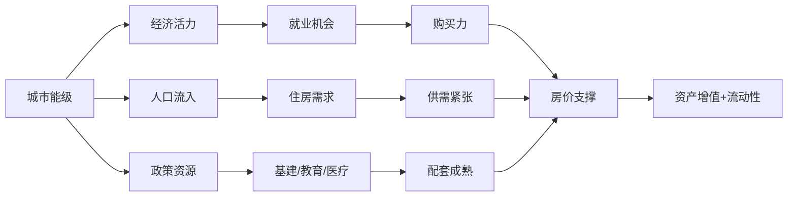
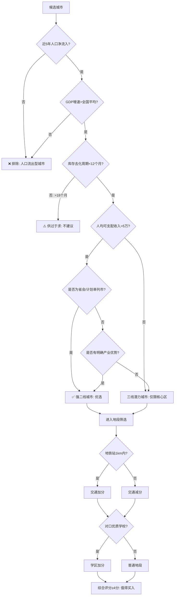
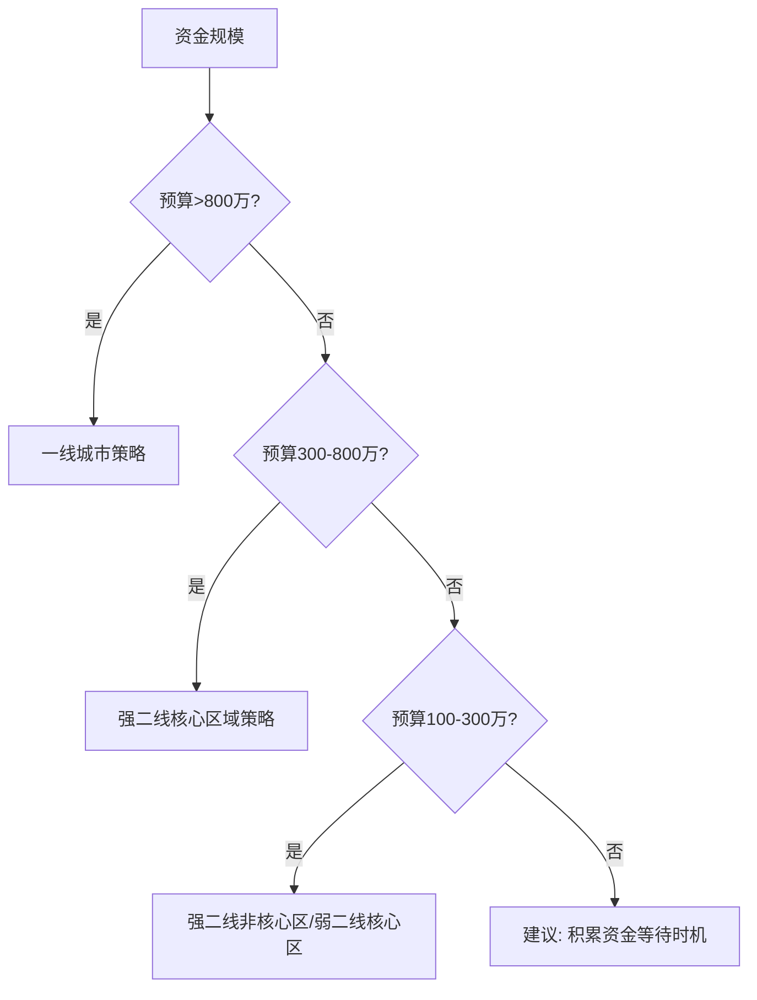
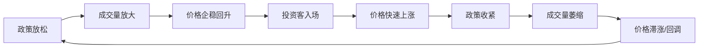

## 一、城市选择框架

买房第一原则：**选对城市比选对房子更重要。**

同一笔资金，投在不同城市，5年后的资产差异可能达到2-3倍。这不是夸张——2015年同样100万，买在杭州未来科技城和买在东北某四线城市，到2023年前者翻了近3倍，后者可能还跌了20%。城市选择的本质是选择一个城市的经济活力、人口虹吸能力和制度红利，这些宏观因素远比户型朝向更能决定你的投资回报。

本章提供一套系统化的城市筛选框架，从宏观到微观、从定性到定量，帮你做出理性的城市投资决策。

---

### 1.1 为什么城市选择是房产投资的第一变量

#### 房产价值的本质构成

房产的价格由三部分构成：

| 组成部分 | 占比 | 决定因素 | 举例 |
|---------|------|---------|------|
| 土地价值 | 50-70% | 城市能级、地段、供需 | 同面积地块，北京核心区 vs 县城差100倍 |
| 建筑价值 | 15-25% | 建材、工艺、折旧 | 全国差异不大，且随年限递减 |
| 附加价值 | 10-30% | 学区、配套、品牌 | 同地段学区房比非学区贵30-50% |

土地价值是核心变量，而土地价值由城市能级决定。建筑成本全国差异不大（2000-4000元/㎡），真正拉开价格差距的是城市赋予土地的稀缺性和使用价值。

#### 城市能级决定资产流动性

投资房产不仅看增值，更看**流动性**——你能否在需要时顺利卖出。一线城市和强二线城市的二手房市场活跃，挂牌30-60天基本能成交；而三四线城市的二手房市场萎缩，挂牌半年甚至一年无人问津的情况非常普遍。

#### 城市分化是长期趋势

中国房地产已经告别"全面上涨"时代。2016年"房住不炒"政策定调后，城市间分化加剧：

- **人口流入型城市**：需求持续，价格有支撑，调整后能恢复
- **人口流出型城市**：需求萎缩，库存高企，价格长期阴跌

这不是周期波动，而是结构性变化。随着城镇化率从2015年的56%提升到2023年的66%，增量空间收窄，存量博弈时代，选错城市的代价比以往任何时候都大。

---

### 1.2 城市分级评估体系

#### 四级城市分类标准

不是所有城市都值得投资。以下分级基于经济体量、人口趋势、产业质量三个核心维度：

**一线城市（北京、上海、广州、深圳）**

| 维度 | 特征 |
|------|------|
| GDP | 全国前4，单城GDP超3万亿 |
| 人口 | 持续净流入，常住人口超1500万 |
| 产业 | 多元化高端产业（金融、科技、总部经济） |
| 土地 | 供应极度稀缺，核心区基本无新增 |
| 二手房 | 市场活跃，流动性极强 |
| 投资逻辑 | 资产保值抗通胀，但总价门槛高、政策限购严 |

**强二线城市（杭州、成都、南京、武汉、苏州、长沙等）**

| 维度 | 特征 |
|------|------|
| GDP | 全国排名5-20，单城GDP超1万亿 |
| 人口 | 省内虹吸效应明显，年净流入10万+ |
| 产业 | 有明确支柱产业（如杭州互联网、成都电子、武汉光电子） |
| 土地 | 核心区稀缺，新区仍有供应 |
| 二手房 | 核心区流动性好，新区一般 |
| 投资逻辑 | 增长潜力大，性价比高，是当前最佳投资标的 |

**弱二线和三线城市**

| 维度 | 特征 |
|------|------|
| GDP | 排名20-80，GDP在3000亿-8000亿之间 |
| 人口 | 增长放缓或微弱净流入，部分已转为流出 |
| 产业 | 产业结构单一（资源型、传统制造型居多） |
| 土地 | 供应充足，地方政府依赖土地财政 |
| 二手房 | 市场低迷，成交周期长 |
| 投资逻辑 | 仅限自住，投资风险极高 |

**四线及以下城市**

| 维度 | 特征 |
|------|------|
| GDP | 排名80以后，经济体量小 |
| 人口 | 持续流出，老龄化严重 |
| 产业 | 缺乏有竞争力的产业 |
| 土地 | 严重供过于求 |
| 二手房 | 几乎无流动性 |
| 投资逻辑 | **明确不建议投资**，仅自住刚需可考虑 |

#### 核心数据对比

以2023年典型城市为例：

| 指标 | 深圳(一线) | 杭州(强二线) | 洛阳(弱二线) | 阜阳(四线) |
|------|-----------|-------------|-------------|-----------|
| GDP(万亿) | 3.46 | 2.01 | 0.58 | 0.33 |
| 近5年人口变化 | +120万 | +170万 | -5万 | -45万 |
| 人均可支配收入(万) | 7.28 | 7.03 | 3.68 | 2.71 |
| 库存去化周期(月) | 8.2 | 9.5 | 18.3 | 28.6 |
| 二手房月均成交(套) | 3200 | 5800 | 680 | 120 |

数据来源：各市统计局公报、克而瑞研究院、贝壳研究院。表格中的数据清晰展示了一个规律——经济活力越强的城市，人口流入越多，库存越健康，市场流动性越好。

---

### 1.3 城市筛选六大核心指标

选城市不能凭感觉，必须用数据说话。以下是经过实践验证的六大核心指标：

#### 指标一：人口趋势（权重30%）

**为什么人口最重要？** 房地产的本质是人的居住需求。没有人口流入，一切利好都是空中楼阁。

**核心数据：**
- 近5年常住人口增长率
- 近3年户籍人口变化
- 小学生在校人数变化（排除统计水分的"照妖镜"）

**优选标准：**
- 近5年人口净增长率 > 3%（年均0.6%以上）
- 小学生数量稳中有增

**数据来源：** 各市统计局《国民经济和社会发展统计公报》、第七次人口普查数据

**实操技巧：** 官方人口数据有时会"注水"，一个更可靠的替代指标是**小学生在校人数变化**。小学生数量反映的是真实家庭迁移行为，比单纯的常住人口统计更能反映真实的人口流入趋势。教育部和各市教育局每年都会公布这个数据。

#### 指标二：经济增长（权重20%）

**核心数据：**
- 近3年GDP增速是否持续高于全国平均水平
- 人均GDP和人均可支配收入
- 财政收入增速（反映政府"造血能力"）

**优选标准：**
- 近3年GDP增速持续 > 全国平均（2023年全国平均5.2%）
- 人均可支配收入 > 5万元/年
- 一般公共预算收入增速 > 5%

**警惕信号：** 如果一个城市GDP增速高但财政收入下降，说明经济增长质量差，可能是靠举债投资拉动的"虚假繁荣"。

#### 指标三：库存去化周期（权重20%）

**为什么关注库存？** 供过于求的市场，价格不可能上涨。库存去化周期是最直接反映供需关系的指标。

**计算方法：**

$$去化周期（月）= 当前库存面积 ÷ 近12个月月均销售面积$$

**判断标准：**
- < 6个月：严重供不应求，价格有上涨压力
- 6-12个月：供需平衡，健康区间
- 12-18个月：供略过于求，需谨慎
- \> 18个月：严重供过于求，**不建议投资**

**数据来源：** 克而瑞（CRIC）、中指研究院（中指院）、各地住建局每月公布的数据

#### 指标四：产业结构（权重15%）

**核心逻辑：** 产业决定就业，就业决定收入，收入决定购买力。

**优选产业类型：**
- **科技/互联网**：高薪岗位多，年轻人聚集（杭州、深圳、成都）
- **金融/总部经济**：薪资水平高，消费能力强（上海、北京）
- **高端制造**：稳定就业，持续增长（苏州、宁波、合肥）
- **新兴产业集群**：新能源、生物医药、人工智能（合肥、常州）

**警惕产业类型：**
- 资源依赖型（煤炭、石油）：受资源价格波动大
- 单一支柱型：一旦产业衰退，整个城市经济塌方
- 传统劳动密集型：容易被成本更低的地区替代

**判断方法：** 查看城市上市公司数量和行业分布（东方财富网可查），以及城市发布的"十四五"产业规划。

#### 指标五：土地供应（权重10%）

**核心逻辑：** 土地供应节奏直接影响新房供给量，进而影响房价。

**关键数据：**
- 近3年住宅用地供应计划和实际成交量
- 土地溢价率（反映开发商拿地意愿）
- 地价占房价比（越高说明土地越稀缺）

**优选信号：**
- 土地供应有节制，年供应量与销售量基本匹配
- 土地溢价率稳定在10-30%（太高说明泡沫，太低说明没信心）
- 核心区域地块稀缺，新地供应主要在郊区

**数据来源：** 各市自然资源和规划局官网、中国土地市场网

#### 指标六：政策环境（权重5%）

**关注重点：**
- 限购政策：是否有放松趋势
- 人才政策：落户门槛、购房补贴
- 金融政策：房贷利率、首付比例
- 城市规划：是否有重大利好（如升格为国家中心城市、获批自贸区等）

> **注意：** 政策是短期变量，不能作为投资的核心依据。政策利好只能加速一个好城市的价值兑现，不能拯救一个基本面差的城市。

#### 综合评分模板

将六大指标量化，制作城市筛选评分卡：

| 指标 | 权重 | 评分标准(1-5分) | 数据来源 |
|------|------|-----------------|---------|
| 人口趋势 | 30% | 5分:净增>5%; 3分:0-3%; 1分:净流出 | 统计公报+教育数据 |
| 经济增长 | 20% | 5分:GDP增速>8%; 3分:5-8%; 1分:<3% | 统计局数据 |
| 库存去化 | 20% | 5分:<6月; 3分:6-12月; 1分:>18月 | 克而瑞/中指院 |
| 产业结构 | 15% | 5分:多元高端; 3分:有支柱产业; 1分:单一资源型 | 上市公司+产业规划 |
| 土地供应 | 10% | 5分:供应节制; 3分:适中; 1分:严重过量 | 自然资源局 |
| 政策环境 | 5% | 5分:重大利好; 3分:平稳; 1分:限制性政策 | 政策文件 |

**使用方法：** 对候选城市逐项打分，加权求和。总分4分以上的城市值得深入研究，3-4分之间需要谨慎评估具体板块，3分以下直接排除。

---

### 1.4 城市选择决策流程图

---

### 1.5 城市内部地段选择

选对城市只是第一步，选对板块和地段同样关键。同一个城市内部，不同板块的价格走势可能完全不同。

#### 地段选择核心逻辑：跟着五大资源走

| 资源类型 | 优先级 | 溢价幅度 | 判断标准 |
|---------|--------|---------|---------|
| 交通资源（地铁） | ★★★★★ | 15-25% | 步行10分钟内（约800米） |
| 教育资源（学区） | ★★★★☆ | 20-50% | 对口学校升学率排名 |
| 商业资源 | ★★★☆☆ | 5-15% | 成熟商圈1km内 |
| 医疗资源 | ★★★☆☆ | 5-10% | 三甲医院3km内 |
| 产业资源 | ★★★★☆ | 10-30% | 高新园区/CBD就业辐射区 |

#### "地铁房"的精确标准

不是靠近地铁就算地铁房。业内有明确的分级标准：

| 分类 | 步行距离 | 步行时间 | 市场认可度 | 溢价幅度 |
|------|---------|---------|-----------|---------|
| 正地铁房 | ≤500米 | ≤6分钟 | 最高 | 20-25% |
| 准地铁房 | 500-800米 | 6-10分钟 | 高 | 15-20% |
| 近地铁房 | 800-1200米 | 10-15分钟 | 中 | 8-15% |
| 伪地铁房 | >1200米 | >15分钟 | 低 | <5% |

> **数据支撑：** 贝壳研究院2023年数据显示，北京、上海、深圳地铁房（800米内）成交均价比非地铁房高出15-25%，且平均成交周期缩短15-20天。但要注意，地铁规划中的线路与已建成线路的溢价差异巨大——规划可能变更，只有已通车的地铁站才是确定性利好。

**避坑要点：** 购买"地铁规划概念房"时务必确认：（1）线路是否已获国家发改委批复（未批复的可能只是地方政府愿景）；（2）站点位置是否已确定（站点可能调整）；（3）预计通车时间（5年以上才有价值折现的不确定性太大）。

#### 学区房的深度分析

学区房是中国房产市场的一个特殊品类，其溢价逻辑和风险都需要单独分析。

**学区溢价的核心逻辑：**
- 优质教育资源稀缺且分配不均
- "就近入学"政策将房产与学位绑定
- 家长为子女教育愿意支付高额溢价

**学区房溢价幅度参考：**

| 城市 | 核心学区 | 溢价率 | 备注 |
|------|---------|--------|------|
| 北京（海淀） | 中关村三小、人大附中 | 30-50% | 全国学区溢价最高区域 |
| 上海（徐汇） | 上海中学对口 | 25-40% | 顶级学区溢价显著 |
| 深圳（福田） | 深圳外国语对口 | 20-35% | 近年有所回调 |
| 杭州（西湖） | 学军小学对口 | 20-30% | 互联网新贵推高溢价 |

**学区房的重大风险：**

1. **政策风险：** 多校划片政策正在全国推广，一旦实施，"一房一校"变为"一房多校随机分配"，确定性溢价将大幅缩水。北京、上海已率先试点。
2. **教师轮岗：** 优质师资轮岗制度削弱了"名校"的含金量，长期来看会降低学区房溢价。
3. **出生率下降：** 2016年全面二孩后出生人口持续走低，2023年仅902万，未来学位竞争压力减轻，学区房需求可能下降。

**建议：** 如果是投资目的，不建议重仓学区房；如果是自用（孩子确实要上学），可以买但不要为纯粹的学区溢价买单。

#### 新区 vs 老城区的决策矩阵

| 维度 | 老城区 | 成熟新区 | 发展中新区 | "画饼"新区 |
|------|--------|---------|-----------|-----------|
| 配套成熟度 | ★★★★★ | ★★★★☆ | ★★☆☆☆ | ★☆☆☆☆ |
| 房屋品质 | ★★☆☆☆ | ★★★★☆ | ★★★★★ | ★★★★★ |
| 价格水平 | 高 | 中高 | 中 | 低 |
| 增值潜力 | 低（已兑现） | 中（缓慢增长） | 高（潜力大） | 不确定 |
| 风险等级 | 低 | 低 | 中 | 极高 |
| 适合人群 | 自住改善 | 稳健投资 | 进取投资 | **不建议** |

**如何判断一个新区是否有前途：**

1. **看政府投入：** 是否有真实的基建投入（地铁开工、学校/医院建设），而非停留在纸面规划
2. **看企业入驻：** 是否有知名企业签约入驻产业园区，而非只有住宅开发
3. **看人口导入：** 已交付小区入住率是否超过50%，而非大量空置
4. **看商业开业：** 是否有品牌商业体开业运营，而非只有底商
5. **看时间线：** 从规划到成熟通常需要8-15年，3年内能基本成型的新区才有确定性

> **实操建议：** 选择"已有一定配套基础的新区"——即政府已投入大量基建、有2-3个楼盘已交付入住、地铁已通车或即将通车的新区。这种新区的利好已部分兑现，风险可控，且仍有增值空间。

---

### 1.6 城市投资策略分级

不同能级的城市需要不同的投资策略：

**一线策略：** 核心区小户型 > 近郊地铁房 > 远郊大户型。一线城市总价门槛高，优先选择核心区小户型（总价可控、流动性好、租金回报高），而非远郊大户型（虽然面积大但通勤不便、流动性差）。

**强二线策略：** 新城核心板块 > 老城次新房 > 远郊新城。强二线城市处于快速扩张期，新城核心板块增值空间最大，但必须选择有真实产业和人口导入支撑的板块。

**投资纪律：** 弱三线以下城市不投资，不自住不买，不被"低价"诱惑。一套四线城市的房子看起来便宜（30万），但流动性极差、增值无望，这30万的机会成本远高于表面数字。

---

### 1.7 常见误区与纠正

#### 误区一："房价低=便宜=有上涨空间"

**错误逻辑：** 这个县城房价才4000元/㎡，省会要2万，肯定有上涨空间。

**正确理解：** 房价低往往是因为没有人愿意出更高的价格。价格反映的是供需关系和预期，低价背后可能是人口流出、库存过剩、产业衰退。鹤岗的房价300元/㎡，不代表它"便宜"，而代表它的居住价值就值这么多。

#### 误区二："跟着大开发商走就不会错"

**错误逻辑：** 万科/碧桂园都在这个新区拿地了，肯定有前途。

**正确理解：** 大开发商在三四线城市拿地是冲规模去的，不代表看好该区域的长期价值。2018-2021年多家头部房企在三四线大规模拿地，后来的暴雷潮证明这些项目大多亏损严重。开发商的判断力并不比你强多少，他们也有看走眼的时候。

#### 误区三："省会城市一定值得投资"

**错误逻辑：** 这是省会城市，有政策优势，肯定没问题。

**正确理解：** 并非所有省会都值得投资。判断省会城市要看它对全省人口的虹吸能力。像杭州、成都、武汉这样能虹吸全省甚至跨省人口的强省会值得投资；但像石家庄（被北京天津虹吸）、南昌（人口吸引力弱）、南宁（经济体量小）等省会，其投资价值需要具体分析。

#### 误区四："跟着高铁规划买"

**错误逻辑：** 这个城市要建高铁站了，房价肯定涨。

**正确理解：** 高铁对三四线城市的影响是双面的。高铁确实能带来短期的概念炒作，但长期来看，高铁更可能加速人口向中心城市流出——因为交通更便利了，年轻人去大城市工作变得更方便。只有那些本身就有产业和人口吸引力的城市，高铁才是锦上添花。

#### 误区五："旅游城市适合投资"

**错误逻辑：** 这是旅游城市，人流量大，适合买房做民宿或等升值。

**正确理解：** 旅游城市的房产投资有特殊逻辑。旅游人流量≠常住人口，旺季的热闹不代表全年的住房需求。旅游城市的房产往往季节性明显，空置率高，租金收益不稳定。海南是少数成功的案例（有自贸港政策加持），但大多数旅游城市的房产投资回报并不理想。

---

### 1.8 实操工具与数据来源

#### 免费数据查询平台

| 数据类型 | 平台 | 网址 | 用途 |
|---------|------|------|------|
| 人口/经济数据 | 各市统计局官网 | 各地统计局 | GDP、人口、收入等基础数据 |
| 土地市场 | 中国土地市场网 | www.landchina.com | 土地出让信息 |
| 房价走势 | 国家统计局70城指数 | www.stats.gov.cn | 宏观房价趋势 |
| 库存数据 | 克而瑞/中指院 | 各自官网 | 去化周期、供应量 |
| 二手房成交 | 贝壳找房/链家 | ke.com / lianjia.com | 真实成交价和成交量 |
| 城市规划 | 各市自然资源局 | 各地官网 | 控规、地铁规划、供地计划 |
| 产业数据 | 天眼查/企查查 | tianyancha.com | 企业注册数量、行业分布 |

#### 城市调研checklist

到一个陌生城市做投资调研，建议至少待3天，完成以下清单：

**第一天：宏观感知**
- [ ] 实地感受城市活力（商圈人流量、交通拥堵程度）
- [ ] 查看城市天际线（高楼密度反映经济活跃度）
- [ ] 逛当地最大的房产中介门店，了解市场温度
- [ ] 与出租车/网约车司机聊天（本地人的真实感受）

**第二天：板块考察**
- [ ] 走访2-3个候选板块，实地感受配套
- [ ] 看新盘售楼处的人气和销售说辞
- [ ] 查看已交付小区的入住率（晚上数亮灯户数）
- [ ] 走访周边学校、医院、商超

**第三天：数据验证**
- [ ] 在贝壳/链家上查看该板块近6个月真实成交数据
- [ ] 对比挂牌价与成交价的差距（差距越大说明市场越冷）
- [ ] 查看该板块的土地出让记录和未来供应计划
- [ ] 整理调研笔记，对照评分模板打分

---

### 1.9 进阶：城市周期与择时

#### 城市房地产周期模型

每个城市的房地产市场都有周期性波动，但不同城市的周期并不同步。理解周期有助于在合适的时间点进入。

**各阶段特征与策略：**

| 阶段 | 市场信号 | 策略 |
|------|---------|------|
| 底部期 | 成交量低迷，政策开始放松，利率下调 | **最佳买入时机**，议价空间大 |
| 回暖期 | 成交量回升，价格企稳，看房人增多 | 尽快买入，选择余地仍在 |
| 上涨期 | 价格快速上涨，投资客涌入，地王频出 | 谨慎追高，优选标的 |
| 高位期 | 价格滞涨，政策收紧，利率上行 | 停止买入，考虑获利了结 |
| 下调期 | 成交萎缩，价格回调，悲观情绪蔓延 | 持有等待，不急于割肉 |

**如何判断当前处于哪个阶段？** 关注三个先行指标：
1. **政策风向：** 政策从收紧转为放松（如降首付、降利率、放松限购），通常意味着底部期到来
2. **成交量：** 成交量是价格的先行指标，量先于价——成交量连续3个月环比增长，通常是回暖信号
3. **带看量：** 贝壳等平台的带看数据能提前1-2个月反映市场热度变化

#### 逆向投资思维

当大多数人恐惧时，可能是机会。但逆向投资不是盲目抄底，而是在基本面良好的城市遇到短期利空时买入。

**可逆向的条件：**
- 城市基本面（人口、产业、经济）没有恶化
- 下跌原因是宏观调控或短期因素（如疫情、政策收紧）
- 价格已回调15-25%，接近合理估值
- 库存去化周期仍在健康区间

**不可逆向的情况：**
- 人口持续流出且产业衰退
- 库存去化周期超过24个月
- 当地经济依赖单一衰退产业
- 土地财政依赖度过高且土地卖不出去

---

### 1.10 本章小结

城市选择是房产投资的第一变量，其重要性远超户型、朝向、楼层等微观因素。核心要点回顾：

1. **人口是根本：** 没有人口流入的城市，房产没有投资价值
2. **产业是支撑：** 多元化高端产业支撑高薪就业和持续购买力
3. **库存是温度计：** 去化周期>18个月的城市，供过于求，价格难以上涨
4. **数据说话：** 不凭感觉选城市，用六大指标量化评估
5. **地段次之：** 选对城市后，跟着地铁和学区选板块
6. **纪律第一：** 弱三线以下城市不投资，不被低价诱惑
7. **周期思维：** 在市场底部期进入，享受政策红利和估值修复
