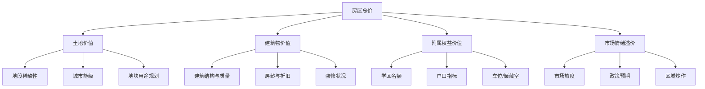
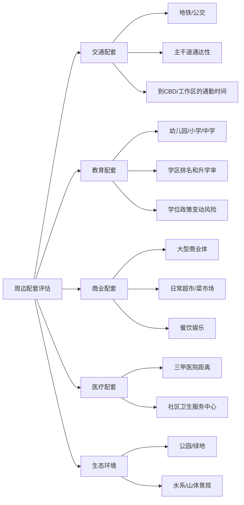
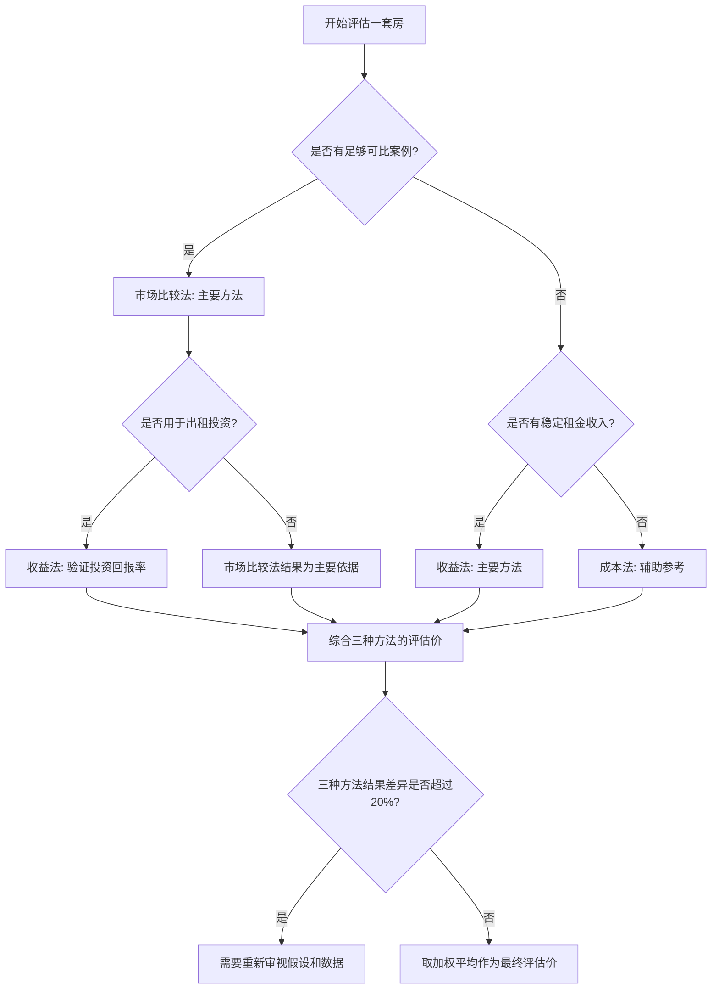
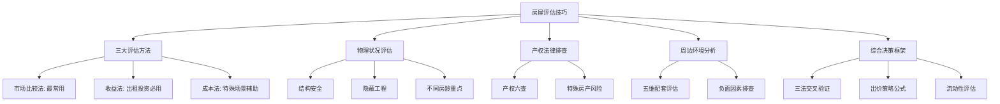

## 二、房屋评估技巧

选对城市之后，下一个关键问题是：**在同一座城市里，如何判断一套房子到底值不值这个价？**

房屋评估不是中介嘴里"这套房很抢手"的口头判断，而是一套可以量化、可以复现、可以对比的系统化分析方法。掌握评估技巧，你能做到三件事：避免高位接盘、发现被低估的资产、在谈判桌上拥有数据支撑的议价权。

本章从价值构成原理出发，逐一讲解市场比较法、收益法、成本法三大核心评估方法，然后覆盖房屋物理状况评估、产权风险排查、周边环境分析等实操维度，最后给出一个完整的评估决策框架和常见误区。

---

### 2.1 房屋价值的本质构成

在学习"怎么评"之前，先理解"评的是什么"。一套房子的价格由以下四个层面构成：



| 构成部分 | 价格占比 | 关键变量 | 折旧特征 |
|---------|---------|---------|---------|
| 土地价值 | 50-70% | 城市、地段、容积率、规划 | 不折旧，随城市发展增值 |
| 建筑物价值 | 15-25% | 结构、建材、房龄、维护 | 每年折旧1-2%，30年后趋近残值 |
| 附属权益 | 10-30% | 学区、户口、配套 | 学区政策变动可瞬间归零 |
| 情绪溢价 | -10%~+20% | 市场周期、政策、炒作 | 周期波动，牛市溢价，熊市折价 |

**核心认知**：评估一套房，本质上是在做"价值拆分"——把报价拆成上述四个部分，逐一判断每个部分的合理性和可持续性。一套学区占价40%的房子，如果学区政策调整，价值可能瞬间缩水三成。

---

### 2.2 市场比较法（Market Comparison Approach）

这是二手房评估中**最常用、最直观**的方法，也是银行评估价的主要依据。原理简单：同一区域、相似条件的房子，价格应该接近。

#### 2.2.1 基本原理

找3-5套近期成交的可比案例（comparable sales，简称"comps"），逐项修正差异，得出目标房产的合理市场价值。

**计算公式**：

```text
评估价 = 可比案例成交均价 × 各修正系数的乘积
```

修正系数包括：区位修正、楼层修正、朝向修正、装修修正、面积修正、房龄修正、交易时间修正。

#### 2.2.2 可比案例的选取标准

选取可比案例是整个评估过程最关键的一步。选错了案例，后面的修正再精确也没用。

**硬性条件**（必须满足）：
- 同一行政区或相邻板块（步行15分钟范围内）
- 成交时间在6个月以内（市场变动大的时期缩短到3个月）
- 物业类型相同（住宅对住宅，不要拿公寓对比住宅）
- 面积差异不超过20%（70㎡不要和120㎡直接对比）

**优选条件**（尽量满足）：
- 同一小区或同一条街的相邻小区
- 相同楼层段（低/中/高）
- 相同朝向（南向对比南向）
- 成交价而非挂牌价（挂牌价可能虚高10-30%）

**数据来源**：

| 渠道 | 数据类型 | 可靠性 | 获取方式 |
|------|---------|--------|---------|
| 贝壳找房 | 真实成交价 | ★★★★★ | 搜索小区→查看"成交记录" |
| 链家APP | 历史成交+挂牌 | ★★★★☆ | 同上 |
| 安居客 | 挂牌价 | ★★★☆☆ | 仅作参考，需打折 |
| 小区业主群 | 内部成交信息 | ★★★★☆ | 直接询问邻居 |
| 中介门店 | 最新成交 | ★★★★☆ | 多问几家交叉验证 |
| 法院拍卖公告 | 法拍成交价 | ★★★☆☆ | 京东拍卖/阿里拍卖 |
| 住建局备案 | 官方网签价 | ★★★★★ | 部分城市可查，可能做低税 |

#### 2.2.3 七大修正系数详解

**（1）区位修正（权重最大，±15%）**

即使同一板块，临街与内庭、靠近地铁与远离地铁的价差也很显著。

| 区位因素 | 加价条件 | 减价条件 |
|---------|---------|---------|
| 地铁距离 | 步行5分钟内，+5-8% | 步行15分钟以上，-3-5% |
| 学区质量 | 第一梯队学区，+10-30% | 无学区或学区差，基准价 |
| 商业配套 | 大型商业综合体500米内，+3-5% | 周边配套匮乏，-5% |
| 环境噪音 | 小区内庭、不临街，+5% | 临主干道/高架/铁路，-8-15% |
| 嫌恶设施 | 无嫌恶设施，基准价 | 挨着殡仪馆/垃圾站/变电站，-10-20% |

> **实操要点**：嫌恶设施是很多新手忽略的减分项。买房前一定要在地图上检查周边1公里范围内是否有：垃圾处理厂、殡仪馆、高压变电站、化工厂、加油站。这些设施不仅影响居住体验，还会严重压制房价涨幅。

**（2）楼层修正（±5-10%）**

| 楼层类型 | 多层（6-7层无电梯） | 高层（18层以上） |
|---------|-------------------|-----------------|
| 低层（1-3楼） | 1楼-5%（潮湿/隐私差），2-3楼基准价 | 低区-3%（采光/噪音） |
| 中层（4-6楼） | 4-5楼+5%（最佳），6楼-3%（爬楼累） | 中区基准价（总楼层的1/3-2/3） |
| 高层（7楼以上） | 不适用 | 高区+3-8%（视野/采光） |
| 顶楼 | -5-8%（漏水/隔热风险） | -3-5%（同上，但景观补偿） |
| 底层带花园 | +5-10%（如果花园有产权） | 不适用 |

**特殊楼层溢价**：在风水偏好地区（广东、福建），带"8"的楼层溢价1-2%，带"4"的楼层折价1-2%。在北方城市，这种影响较小。

**（3）朝向修正（±3-8%）**

| 朝向 | 修正系数 | 理由 |
|------|---------|------|
| 正南 | +5%（基准之上） | 采光最佳，冬暖夏凉 |
| 东南 | +3% | 上午采光好，通风佳 |
| 西南 | +0%（基准） | 下午有西晒，但冬天暖 |
| 正东 | -2% | 只有上午采光 |
| 正西 | -5-8% | 严重西晒，夏天室内温度高3-5℃ |
| 正北 | -5-8% | 冬天几乎无直射阳光 |

**（4）装修修正（±5-15%）**

装修是最"虚"的价值组成部分——卖家觉得花了30万装修至少值20万，买家觉得你那装修风格我全要拆。

**评估原则**：装修价值 = 重置成本 × 成新率 × 偏好折扣

| 装修等级 | 重置成本（元/㎡） | 5年成新率 | 偏好折扣 | 实际增值贡献 |
|---------|-----------------|----------|---------|------------|
| 简装 | 800-1200 | 60% | 0.7 | +300-500元/㎡ |
| 中档 | 1500-2500 | 50% | 0.6 | +450-750元/㎡ |
| 高档 | 3000-5000+ | 40% | 0.5 | +600-1250元/㎡ |
| 豪装 | 8000+ | 30% | 0.3 | +720-1000元/㎡ |

> **关键洞察**：豪华装修的投资回报率极低。8000元/㎡的装修，5年后买家只愿意多付720-1000元/㎡，贬值率超过85%。对投资客而言，买毛坯或简装自己控制成本更划算。

**（5）面积修正（±3-5%）**

同小区不同面积段的单价并不相同。通常：
- 90㎡以下刚需户型：单价最高（总价门槛低，接盘侠最多）
- 90-120㎡改善户型：单价适中
- 144㎡以上大户型：单价最低（总价高，流动性差）
- 面积差异超过20%时，不能直接对比单价，需要引入面积修正系数

**（6）房龄修正（每年-0.5-1.5%）**

| 房龄 | 年修正率 | 说明 |
|------|---------|------|
| 0-5年 | 0% | 新房/次新房，无折旧 |
| 5-10年 | -0.5%/年 | 轻微折旧，品质尚好 |
| 10-20年 | -1%/年 | 明显老化，管道/电路可能需更换 |
| 20-30年 | -1.5%/年 | 严重老化，银行贷款年限受限 |
| 30年以上 | 评估困难 | 需个案分析，可能接近拆迁预期 |

> **注意**：房龄修正不是线性的。老城区的"老破小"如果在拆迁预期区内，反而可能因拆迁预期而溢价。房龄折旧要结合地段价值一起看。

**（7）交易时间修正（±0-10%）**

如果可比案例的成交时间与评估时点相差较远，需要做时间修正。方法是参考城市房价指数的月度变化。

```text
时间修正系数 = 当期房价指数 ÷ 成交时房价指数
```

数据来源：国家统计局70城房价指数、中指研究院百城指数、贝壳研究院数据。

#### 2.2.4 市场比较法的完整计算示例

**目标房产**：杭州市西湖区某小区，89㎡，中层/18层，南向，简装，房龄8年，2024年6月评估。

**可比案例选取**：

| 项目 | 案例A | 案例B | 案例C |
|------|-------|-------|-------|
| 小区 | 同小区 | 相邻小区300米 | 同小区 |
| 面积 | 92㎡ | 85㎡ | 95㎡ |
| 楼层 | 高层/18 | 中层/18 | 低层/18 |
| 朝向 | 南向 | 东南 | 南向 |
| 装修 | 中档 | 简装 | 简装 |
| 房龄 | 8年 | 6年 | 8年 |
| 成交时间 | 2024年4月 | 2024年3月 | 2024年5月 |
| 成交单价 | 32000元/㎡ | 33500元/㎡ | 30500元/㎡ |

**逐项修正**（以案例A为基准）：

| 修正项 | 案例A | 案例B | 案例C |
|--------|-------|-------|-------|
| 成交单价 | 32000 | 33500 | 30500 |
| 区位修正 | 同小区 0% | 相邻小区 -2% | 同小区 0% |
| 楼层修正 | 高区 +3% | 中区 0% | 低区 -3% |
| 朝向修正 | 南向 0% | 东南 -2% | 南向 0% |
| 装修修正 | 中档→简装 -3% | 简装 0% | 简装 0% |
| 面积修正 | +1% | -1% | +1% |
| 房龄修正 | 0% | +1% | 0% |
| 时间修正 | +1% | +1% | 0% |
| **修正后单价** | **32000×1.01≈32320** | **33500×0.95≈31825** | **30500×0.97≈29585** |

**评估结论**：三个修正后的单价取加权平均（权重根据可比性分配：A=0.4, B=0.3, C=0.3）

```text
评估单价 = 32320×0.4 + 31825×0.3 + 29585×0.3
         = 12928 + 9547.5 + 8875.5
         = 31351 元/㎡
评估总价 = 31351 × 89 = 278.9万元
```

---

### 2.3 收益法（Income Approach）

收益法从"投资回报"的角度评估房产价值，核心逻辑是：**一套房的价值等于它未来能产生的净收益的现值。** 这个方法特别适合评估出租型房产和商业地产。

#### 2.3.1 基本公式

**直接资本化法**：

```text
房产价值 = 年净租金收入 ÷ 资本化率
```

其中：
- 年净租金收入 = 年租金总额 - 空置损失 - 运营费用（物业费、维修费、保险、管理费）
- 资本化率（Cap Rate）= 该区域同类物业的平均投资回报率

**收益还原法（DCF折现法）**：

```text
房产价值 = Σ [第t年净收益 ÷ (1+r)^t] + [终值 ÷ (1+r)^n]
```

其中r为折现率（通常5-8%），n为持有年限，终值为n年后出售的预期价格。

#### 2.3.2 租金的确定方法

租金不是随便估的，需要参考真实市场数据：

**数据来源**：
- 贝壳找房/链家：搜索同小区在租房源的挂牌价，打85-90折为实际成交租金
- 58同城/安居客：参考但可信度较低
- 长租公寓平台（自如、泊寓）：同小区托管价打8折为业主直租价
- 已入住租客：直接询问邻居

**租金修正因素**：

| 因素 | 加租条件 | 减租条件 |
|------|---------|---------|
| 装修品质 | 精装修+拎包入住，+15-25% | 毛坯/老旧装修，-20-30% |
| 楼层朝向 | 中高楼层南向，+5-10% | 低楼层/北向，-5-10% |
| 家具家电 | 全套品牌家电，+10-15% | 空房出租，-10-15% |
| 租约灵活性 | 可短租，+10% | 要求年付/长租，-5% |
| 配套设施 | 有车位/储藏室，+5% | 无任何配套，基准价 |

#### 2.3.3 资本化率的确定

资本化率是收益法中最敏感的参数，差1个百分点，评估结果可能差20%。

**中国主要城市住宅资本化率参考（2024年）**：

| 城市等级 | 资本化率 | 说明 |
|---------|---------|------|
| 一线城市核心区 | 1.5-2.5% | 房价极高，租售比严重倒挂 |
| 一线城市外围 | 2.0-3.0% | 稍好，但仍偏低 |
| 二线城市核心区 | 2.5-3.5% | 部分城市可达4% |
| 二线城市外围 | 3.0-4.5% | 租售比相对合理 |
| 三四线城市 | 3.5-6.0% | 房价低但租金也低，空置率高 |
| 商业地产 | 4.0-8.0% | 取决于业态和位置 |

> **关键认知**：中国的住宅资本化率全球垫底。一线城市1.5-2.5%的回报率意味着"买房出租"本身是亏钱的——你的月供远高于租金收入。投资逻辑不是靠租金回本，而是靠资产增值。这和欧美市场（资本化率4-8%）有本质区别。

#### 2.3.4 收益法计算示例

**目标房产**：成都某小区，100㎡两居室，购入价180万。

```text
月租金：3500元
年租金总额：3500 × 12 = 42000元
空置损失（按1个月计算）：-3500元
物业费（业主承担部分）：-2400元（200元/月）
维修基金/维护费：-2000元
保险费：-500元
年净租金收入 = 42000 - 3500 - 2400 - 2000 - 500 = 33600元

资本化率取成都该区域3.2%
收益法评估价 = 33600 ÷ 3.2% = 105万元

实际购入价180万 vs 收益法评估价105万
差额75万 = 你为"资产增值预期"支付的溢价
```

这个计算揭示了一个残酷的事实：**如果只看租金回报，这套房只值105万。你多花的75万，赌的是房价未来会涨。** 如果房价不涨甚至下跌，你就是高位接盘。

---

### 2.4 成本法（Cost Approach）

成本法的逻辑是：**一套房的价值 = 重新建造同等房产所需的成本 - 折旧 + 土地价值。** 这个方法在以下场景最有用：

- 新房评估（没有可比案例时）
- 特殊用途房产（厂房、仓库）
- 评估装修和改建的增值效果
- 保险理赔定价

#### 2.4.1 计算公式

```text
评估价 = 土地价值 + 建造成本 - 实体折旧 - 功能折旧 - 经济折旧
```

**各组成部分的估算**：

| 组成 | 估算方法 | 典型数值 |
|------|---------|---------|
| 土地价值 | 参考同区域土地出让楼面价 | 通过土拍公告获取 |
| 建造成本 | 建筑面积 × 单方造价 | 住宅2000-5000元/㎡ |
| 实体折旧 | 房龄 × 年折旧率 | 住宅1-2%/年 |
| 功能折旧 | 设计过时/功能缺陷 | 个案评估，0-20% |
| 经济折旧 | 外部环境恶化 | 个案评估，0-30% |

**单方造价参考（2024年）**：

| 建筑类型 | 结构 | 单方造价（元/㎡） |
|---------|------|-----------------|
| 普通住宅 | 框架剪力墙 | 2000-3000 |
| 高端住宅 | 框架剪力墙 | 3000-5000 |
| 别墅 | 框架结构 | 3500-6000 |
| 商业写字楼 | 框架核心筒 | 4000-7000 |
| 工业厂房 | 钢结构 | 1200-2500 |

#### 2.4.2 成本法的实际应用场景

成本法在中国二手房市场中使用较少，因为土地价值难以单独剥离。但在以下场景非常实用：

1. **自建房/农村房产评估**：没有市场交易数据，只能按建造成本估算
2. **装修增值评估**：评估装修到底给房子增值了多少
3. **拆迁补偿谈判**：拆迁方常用成本法压低补偿价，你需要知道这个逻辑来反驳
4. **房产保险定价**：按重置成本投保

---

### 2.5 房屋物理状况评估

再好的地段、再合理的价格，如果房子本身有硬伤，都是坑。物理状况评估是看房过程中最重要的环节。

#### 2.5.1 建筑结构评估

| 结构类型 | 使用寿命 | 抗震等级 | 特征识别 | 风险点 |
|---------|---------|---------|---------|--------|
| 砖混结构 | 50年 | 较差 | 墙体厚、不能拆墙 | 20年以上需重点检查 |
| 框架结构 | 60年 | 良好 | 柱子承重、墙可拆 | 相对安全 |
| 剪力墙结构 | 70年 | 优秀 | 高层住宅常见 | 不能随意拆墙 |
| 钢结构 | 50-100年 | 优秀 | 超高层/商业 | 防火要求高 |

**如何识别结构问题**：

- **墙体裂缝**：细小的表面裂纹（发丝纹）通常是抹灰层问题，不严重。但如果裂缝宽度超过2mm、呈45度斜向、贯穿墙体，很可能是结构沉降问题，必须警惕。
- **楼板变形**：在房间中间放一个弹珠，如果它明显滚动，说明楼板有变形。
- **门窗变形**：门窗关不严、开关困难，可能是结构沉降导致的框体变形。

#### 2.5.2 隐蔽工程评估

隐蔽工程是二手房最大的"雷区"——看不见、查不到、修起来代价巨大。

**水电系统检查清单**：

```text
□ 电路检查
  - 总开关容量（至少63A，全屋大功率设备多的需要80A以上）
  - 电线截面积（照明1.5mm²，插座2.5mm²，空调/厨房4mm²）
  - 是否为铜芯线（铝芯线已淘汰，存在安全隐患）
  - 电气回路数量（至少4回路：照明、普通插座、厨房、卫生间）
  - 是否有漏电保护器

□ 水路检查
  - 水压测试（打开所有水龙头，看水流是否明显减小）
  - 下水通畅测试（同时冲马桶、放洗手池水、开洗衣机）
  - 热水器类型和容量
  - 水管材质（PPR为佳，镀锌管已淘汰需更换）

□ 防水检查
  - 卫生间墙面是否有水渍/霉斑
  - 天花板是否有渗水痕迹（尤其看顶楼和卫生间正上方）
  - 窗框四周是否有渗水
  - 阳台地面是否有积水
```

**暖通系统**：
- 中央空调品牌、年限、制冷/制热效果
- 地暖管路材质（PE-RT优于PEX）和使用年限
- 新风系统是否安装及运行状态

#### 2.5.3 不同房龄的重点检查项

| 房龄 | 重点检查项 | 常见问题 | 修缮成本估算 |
|------|-----------|---------|------------|
| 0-5年 | 基本无问题，检查开发商装修质量 | 精装房常见偷工减料 | 低（0-2万） |
| 5-10年 | 水电、防水、五金件 | 水龙头漏水、防水层老化 | 中（2-5万） |
| 10-15年 | 管道老化、电路负荷、外墙保温 | 下水管堵塞、电线老化 | 中高（5-10万） |
| 15-20年 | 结构安全、全部管线 | 需要全面翻新 | 高（10-20万） |
| 20年以上 | 结构鉴定、管线更换、电梯 | 可能需要结构加固 | 极高（20万+） |

> **经验法则**：房龄超过15年的二手房，看房时至少要预留10万的翻新预算。如果实际成交价加上翻新成本后单价超过同品质次新房，就不值得买。

#### 2.5.4 常见房屋硬伤及影响

| 硬伤类型 | 严重程度 | 对价格的影响 | 能否修复 |
|---------|---------|------------|---------|
| 承重墙被砸 | ★★★★★ | -20-30%，且存在安全隐患 | 极难修复，需结构加固 |
| 严重渗水 | ★★★★☆ | -10-15% | 可修复，但需持续维护 |
| 凶宅 | ★★★★★ | -20-40% | 不可修复（心理因素） |
| 临主干道/高架 | ★★★☆☆ | -5-15% | 可通过隔音窗部分缓解 |
| 底层潮湿 | ★★★☆☆ | -5-10% | 可通过防水/除湿改善 |
| 采光严重不足 | ★★★☆☆ | -5-10% | 难以根本改善 |
| 异形户型 | ★★☆☆☆ | -3-8% | 可通过装修部分优化 |
| 紧邻电梯机房 | ★★★☆☆ | -3-5% | 可做隔音处理 |

---

### 2.6 产权与法律风险评估

物理状况没问题，不代表可以放心交易。产权风险是二手房交易中最大的法律陷阱。

#### 2.6.1 产权核查清单

**必须核查的六项核心信息**：

1. **产权人身份**：房产证上的产权人是否与卖方一致？是否有共有权人？（夫妻共有房必须双方签字）
2. **产权性质**：是商品房、经适房、房改房、还是小产权房？不同性质的交易限制完全不同
3. **抵押状况**：是否有银行抵押？抵押金额多少？（不动产登记中心可查）
4. **查封状况**：是否被法院查封？（查封房不能过户）
5. **租赁状况**：是否有租约？租约到期时间？（"买卖不破租赁"——买了房也赶不走租客）
6. **户口状况**：是否有户口挂靠？卖方是否承诺迁出？

**产权类型交易限制对照表**：

| 产权类型 | 能否交易 | 限制条件 | 税费特点 |
|---------|---------|---------|---------|
| 商品房 | ✅ 可自由交易 | 无限购限制则无 | 正常税费 |
| 经济适用房 | ⚠️ 有条件限制 | 满5年才能上市，需补缴土地收益 | 需补缴差价50%左右 |
| 房改房 | ⚠️ 有条件限制 | 需原单位同意，部分需补缴土地出让金 | 成本价购入的需缴收益金 |
| 限价房 | ⚠️ 有条件限制 | 满5年才能交易，收益分成 | 政府有优先回购权 |
| 小产权房 | ❌ 无法过户 | 不受法律保护，不能贷款 | 无正式税费 |
| 公寓/商住 | ✅ 可交易 | 首付高（50%+）、贷款年限短（10年） | 税费比住宅高很多 |

#### 2.6.2 产权风险的排查方法

**第一步：调档查询**

携带身份证和房产证复印件，到房屋所在地的不动产登记中心查询房屋登记簿。查询内容包括：
- 产权人信息
- 抵押登记信息
- 查封登记信息
- 异议登记信息

费用：通常免费或几十元。

**第二步：核实学区**

如果是为了学区买房，必须到对应学校的教务处核实：
- 该地址是否在学区范围内（学区每年可能调整）
- 学位是否已被占用（部分城市实行"六年一学位"政策）
- 入学对落户年限的要求

**第三步：核实户口**

到房屋所在地派出所查询：
- 该地址下挂靠了几个人的户口
- 是否有非家庭成员的户口挂靠
- 卖方是否承诺在过户前迁出（必须写入合同并约定违约金）

**第四步：核实物业欠费**

到物业公司查询：
- 是否有拖欠物业费
- 是否有拖欠水电气暖费
- 是否有车位租赁纠纷

> **血泪教训**：有买家过户后才发现原业主欠了3年物业费共2万多，而且原业主已经失联。物业费跟随房屋，新业主有连带缴纳义务。过户前一定要查清楚。

#### 2.6.3 特殊房产的风险评估

**法拍房**：价格通常低于市场价10-30%，但风险也更大。
- 风险1：无法实地看房，可能买到严重损坏的房产
- 风险2：可能存在长期租约（恶意租赁对抗执行）
- 风险3：原住户拒绝搬离，清场困难
- 风险4：税费可能全部由买方承担（包括卖方应缴的个税、增值税）

**凶宅**：法律没有统一定义，通常指发生过非正常死亡的房屋。
- 查询方法：询问邻居、物业、社区民警，搜索新闻报道
- 法律权利：如果卖方故意隐瞒，买方可以主张撤销合同

**拆迁预期房**：老城区可能面临拆迁的房屋。
- 风险：拆迁时间不确定，可能等10年甚至更久
- 机会：如果拆迁补偿方案好，可能获得1.5-3倍的补偿
- 评估方法：查看城市更新规划、了解项目进展阶段

---

### 2.7 周边环境与配套评估

房子不是孤岛，它的价值很大程度上由周边环境决定。同一条马路两侧的小区，可能因为一个属于好学区、一个不属于，单价差出50%。

#### 2.7.1 配套评估的五个维度



#### 2.7.2 各配套对房价的影响权重

| 配套类型 | 对房价的影响权重 | 作用机制 |
|---------|---------------|---------|
| 学区 | ★★★★★（+10-50%） | 教育刚需，最稳定的溢价因素 |
| 地铁 | ★★★★☆（+5-15%） | 降低通勤成本，扩大客群范围 |
| 商业 | ★★★☆☆（+3-8%） | 提升生活便利性和区域人气 |
| 医疗 | ★★☆☆☆（+2-5%） | 对老年人群体影响更大 |
| 公园/景观 | ★★★☆☆（+3-10%） | 提升居住品质，景观房溢价明显 |
| 产业/就业 | ★★★★☆（+5-15%） | 决定区域购买力和租赁需求 |

#### 2.7.3 负面环境因素的排查

买房前，务必在以下地图/平台上做全面排查：

**排查工具清单**：

| 工具 | 排查内容 | 使用方法 |
|------|---------|---------|
| 高德/百度地图 | 周边设施全貌 | 切换卫星图模式，检查1公里范围内 |
| 天眼查/企查查 | 周边工厂/企业 | 搜索是否有化工、制造类企业 |
| 城市规划局官网 | 片区规划变更 | 查看控制性详细规划、规划公示 |
| 生态环境局官网 | 环境污染信息 | 查看环评公示、排污许可证 |
| 12345市民热线 | 社区投诉热点 | 搜索是否有噪音/污染投诉 |
| 裁判文书网 | 历史纠纷 | 搜索小区名称+纠纷关键词 |

**负面因素距离影响表**：

| 负面因素 | 影响范围 | 价格影响 | 可缓解程度 |
|---------|---------|---------|----------|
| 垃圾填埋场 | 3公里 | -10-20% | 不可缓解 |
| 殡仪馆 | 2公里 | -10-30% | 不可缓解 |
| 高压输电线 | 200米 | -5-10% | 不可缓解 |
| 高架桥/快速路 | 100米 | -5-15% | 隔音窗可部分缓解 |
| 铁路/城铁 | 200米 | -5-10% | 隔音窗可部分缓解 |
| 加油站 | 300米 | -3-5% | 不可缓解 |
| 工厂（无污染） | 500米 | -3-5% | 视工厂类型而定 |
| 建筑工地 | 临近 | -0-5%（临时） | 完工后恢复 |

---

### 2.8 三种评估方法的综合运用

在实际操作中，不应该只用一种方法，而应该三种方法交叉验证。

#### 2.8.1 三种方法的适用场景对比

| 方法 | 最佳适用场景 | 优势 | 局限性 |
|------|------------|------|--------|
| 市场比较法 | 普通住宅二手房 | 最直观、市场认可度高 | 依赖可比案例的质量和数量 |
| 收益法 | 出租型房产、商业地产 | 反映投资回报逻辑 | 资本化率取值主观性强 |
| 成本法 | 新房、特殊用途房产 | 理论基础扎实 | 土地价值难以准确估算 |

#### 2.8.2 综合评估决策矩阵



#### 2.8.3 最终定价策略

评估完成后，你需要一个"出价策略"，而不是直接按评估价出价。

```text
出价公式：
合理出价 = 评估价 - 谈判空间 - 风险折价 - 翻新预算

其中：
- 谈判空间 = 评估价 × 5-10%（二手房通常有议价空间）
- 风险折价 = 根据发现的风险项逐项计算
- 翻新预算 = 根据房屋状况估算的实际翻新成本
```

**示例**：
```text
评估价：300万
谈判空间：300万 × 8% = 24万
风险折价：房龄偏老，预留5万
翻新预算：简装需重新装修，预算12万

合理出价 = 300万 - 24万 - 5万 - 12万 = 259万
首次出价可以更低：245-250万（留出谈判余地）
```

---

### 2.9 房屋评估的常见误区

#### 误区一：只看单价，不看总价

单价3万和单价3.5万，听起来差距很大。但如果一个是60㎡（总价180万），一个是90㎡（总价315万），实际资金需求完全不同。评估时，**总价和流动性**比单价更重要。小户型单价虽高，但总价低、接盘侠多、流动性好。

#### 误区二：过度依赖中介报价

中介的利益结构决定了他们不可能完全站在买方角度：
- 中介费按成交价百分比收取，价格越高佣金越高
- 部分中介会联合卖家做高挂牌价
- "这套房很抢手"是最常见的话术

**正确做法**：自己先用市场比较法算出评估价，中介报价仅作参考。

#### 误区三：忽视持有成本

买房不只是一次性支出，持有成本可能让你的投资回报大打折扣。

| 持有成本项 | 年均成本（以200万房产为例） |
|-----------|-------------------------|
| 房贷利息 | 6-8万元（贷款150万，利率4.5%） |
| 物业费 | 0.3-0.8万元 |
| 维修维护 | 0.2-0.5万元 |
| 房产税（试点城市） | 0.5-1.2万元 |
| 机会成本（资金占用） | 2-4万元（200万按2-3%理财收益） |
| **合计** | **9-14.5万元/年** |

如果这套房的年租金收入只有4万，那你的年净亏损就是5-10.5万。这就是为什么"评估投资回报率"必须考虑全部持有成本。

#### 误区四：被"装修溢价"迷惑

卖家花50万装修的房子，不代表你能多卖50万。装修是高度个人化的消费，二手折价率极高。前文已给出量化数据：50万装修，5年后评估增值可能只有10-15万。

**反向操作**：专门找装修差的房子——价格被低估，自己翻新后可以获得更大的增值空间。

#### 误区五：忽视政策风险

以下政策变动可能直接影响房产价值：

| 政策变动 | 影响机制 | 影响幅度 |
|---------|---------|---------|
| 学区划片调整 | 学区房失去学区属性 | -20-40% |
| 房产税落地 | 增加持有成本，抑制投机 | -10-20%（短期冲击） |
| 限购放松 | 短期刺激成交量和价格 | +5-15%（短期） |
| 限售政策 | 限制流动性，压制投机 | -5-10% |
| 城市更新/拆迁 | 区域价值重估 | +30-200%（取决于补偿方案） |
| 地铁规划变更 | 交通便利性变化 | ±5-15% |

#### 误区六：只看现状，不看规划

房产价值评估必须考虑未来3-5年的区域规划变化。一套现在看起来偏远的房子，如果3年后通地铁，价值可能上涨20-30%。反过来，一套现在安静的小区，如果旁边规划了高架桥，价值可能下跌10%。

**信息来源**：
- 城市总体规划（市政府官网，每5年修编一次）
- 控制性详细规划（规划局官网，确定具体地块用途）
- 重大项目公示（地铁、商业综合体、学校等）
- 土地出让公告（了解周边新盘定价，影响二手房价格）

---

### 2.10 房屋评估工具与实操模板

#### 2.10.1 在线评估工具

| 工具名称 | 功能 | 数据来源 | 准确度 |
|---------|------|---------|--------|
| 贝壳估价 | 输入地址自动估价 | 平台真实成交数据 | ★★★★☆ |
| 中国房价行情网 | 区域均价、趋势分析 | 国家统计局+平台数据 | ★★★☆☆ |
| 诸葛找房 | 房价评估+市场分析 | 多平台聚合数据 | ★★★☆☆ |
| 银行评估系统 | 贷款审批用评估价 | 银行内部数据库 | ★★★★★（但偏保守） |

> **注意**：在线工具的估价只能作为初步参考。它们的算法通常基于历史成交数据的统计模型，无法考虑房屋的具体状况（装修、楼层、朝向等），误差可能在±15%。

#### 2.10.2 自制评估模板

以下是一个完整的房屋评估记录模板，看房时逐项填写，方便横向对比多套房源：

```markdown
## 房屋评估记录表

### 基本信息
- 小区名称：
- 地址：
- 面积：____㎡  户型：____室____厅____卫
- 楼层：____/____层  朝向：
- 建筑类型：□多层 □小高层 □高层
- 房龄：____年  产权类型：□商品房 □经适房 □其他
- 挂牌价：____万  单价：____元/㎡

### 物理状况评估（1-5分）
- 结构安全性：____分
- 水电系统：____分
- 防水状况：____分
- 门窗密封：____分
- 装修状况：____分
- 采光通风：____分
- 噪音水平：____分（1=安静，5=非常吵）
- 综合物理评分：____分

### 配套评估（1-5分）
- 地铁距离：____分钟，评分____分
- 学区质量：____分
- 商业配套：____分
- 医疗配套：____分
- 生活便利度：____分

### 市场比较法评估
- 可比案例1：____小区，____㎡，成交价____万，日期____
- 可比案例2：____小区，____㎡，成交价____万，日期____
- 可比案例3：____小区，____㎡，成交价____万，日期____
- 修正后评估价：____万

### 收益法评估（如适用）
- 预估月租金：____元
- 年净租金收入：____元
- 资本化率：____%
- 收益法评估价：____万

### 风险项记录
- 风险1：
- 风险2：
- 风险3：

### 综合评估结论
- 评估合理价格区间：____万 - ____万
- 建议出价：____万
- 是否推荐购买：□强烈推荐 □可以考虑 □谨慎 □不推荐
- 推荐/不推荐理由：
```

#### 2.10.3 评估报告的撰写要点

如果你需要为投资决策或贷款申请撰写正式评估报告，应包含以下要素：

1. **评估目的**：购买决策 / 贷款申请 / 投资分析 / 保险定价
2. **评估时点**：明确评估基准日
3. **评估对象**：房产基本信息、产权状况
4. **评估方法**：使用的评估方法及选择理由
5. **评估过程**：可比案例选取、修正过程、计算过程
6. **评估结论**：评估价值及价值类型（市场价值 / 投资价值）
7. **特别事项说明**：风险提示、假设条件、限制条件

---

### 2.11 进阶：专业评估师的思维框架

普通购房者学会上述方法已经足够应对95%的场景。如果你想更进一步，以下是专业评估师的进阶思维。

#### 2.11.1 区域市场周期判断

同一套房子在不同市场周期下的评估价可能差30%以上。专业评估师会判断当前处于周期的哪个阶段：

| 周期阶段 | 市场特征 | 评估策略 |
|---------|---------|---------|
| 复苏期 | 成交量先于价格回升，笋盘减少 | 可以稍高于市场价出价，抢占先机 |
| 繁荣期 | 量价齐升，业主心态强势 | 严格按评估价出价，不追高 |
| 滞涨期 | 价格横盘，成交放缓 | 可以低于评估价5-10%出价 |
| 衰退期 | 量价齐跌，笋盘增多 | 可以低于评估价15-20%出价 |

#### 2.11.2 流动性评估

投资房产不仅要评估"值多少钱"，还要评估"多久能卖出去"。

**流动性评分模型**：

| 评估维度 | 高流动性 | 低流动性 |
|---------|---------|---------|
| 总价段 | 低于板块均价，刚需段 | 远超板块均价，豪宅段 |
| 面积段 | 60-120㎡ | 200㎡以上 |
| 户型 | 标准两居/三居 | 异形户型/超大一居 |
| 位置 | 核心地段，配套成熟 | 远郊，配套欠缺 |
| 产权 | 纯商品房 | 经适房/房改房/商住 |
| 市场热度 | 成交活跃板块 | 冷门板块 |

流动性差的房产，即使评估价合理，也可能因为卖不出去而被迫大幅降价。对投资客而言，**流动性是比增值潜力更重要的考量因素**。

#### 2.11.3 边际改善原理

在评估中，有一个容易被忽略的原理：**同一小区中，花同样的钱改善最差的那个属性，回报最高。**

举例：一个小区，朝南的房子320万，朝北的房子290万。如果你买朝北的那套，花2万装一套全屋暖光照明系统和一个新风系统，居住体验大幅提升，但实际只多花了2万就获得了接近30万差价的房子。这就是边际改善——改善"短板"比提升"长板"更有性价比。

这个原理在选房时的应用：**与其买同一小区里最贵的那套"完美"房源，不如买最便宜的那套有明确改善空间的房源。** 前提是那些缺陷是可以修复的（装修差、采光可以通过灯光弥补），而不是不可修复的（结构问题、临高架）。

---

### 2.12 本节要点回顾



**核心原则总结**：

1. **数据驱动**：一切评估结论都要有数据支撑，不要凭感觉
2. **交叉验证**：至少用两种方法评估，结果差异超过20%要重新审视
3. **风险优先**：先排查硬伤和风险，再评估增值潜力
4. **动态视角**：评估时要考虑未来3-5年的规划变化和政策风险
5. **流动性思维**：投资房产，能卖出去比涨了多少更重要
6. **反向思维**：别人恐惧时贪婪——市场低迷期恰恰是最好的评估买入时机

掌握房屋评估技巧，你就能在房产投资中做到"心中有数"——知道一套房到底值多少，知道应该出什么价，知道风险在哪里。这是从"凭感觉买房"到"理性投资"的关键一步。
