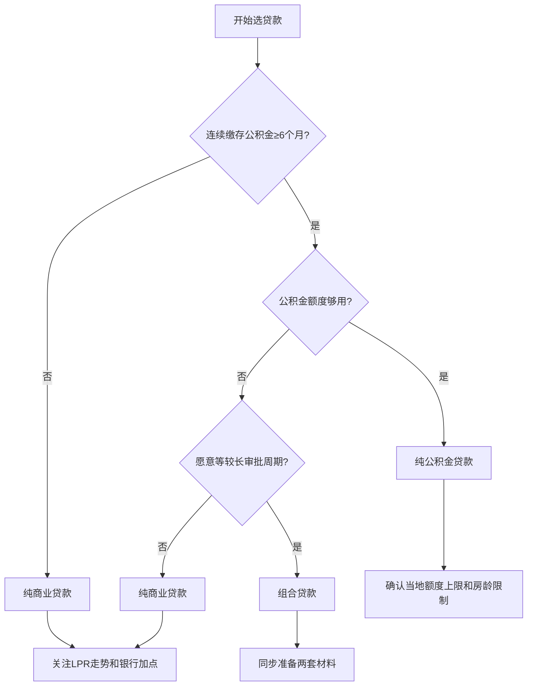
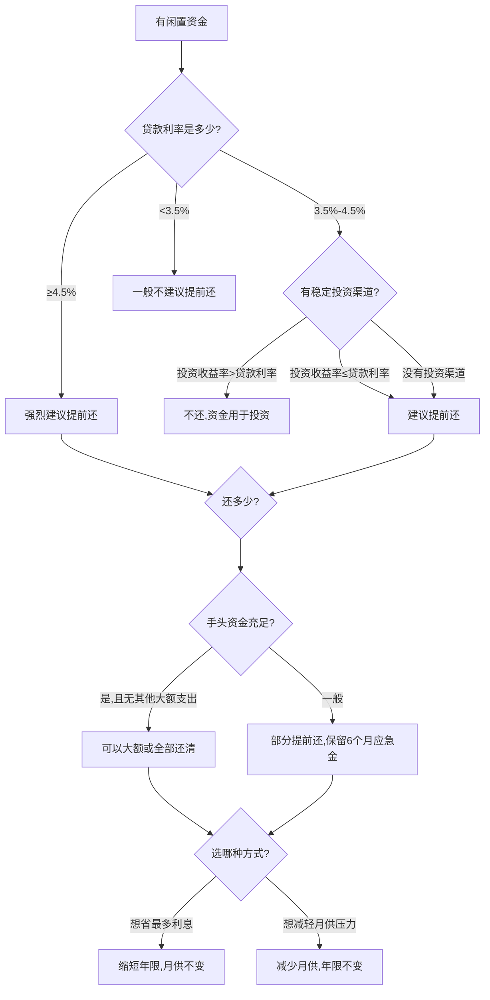

## 三、贷款策略

房产贷款是绝大多数购房者绕不开的核心环节。对于普通家庭而言，一套房的贷款金额往往在几十万到数百万之间，还款周期长达20-30年。贷款策略的选择直接决定了你在这笔最大财务决策中是多付几十万利息还是省下几十万——这个差额可能相当于一个普通家庭好几年的收入。

本节从贷款类型选择、还款方式优化、杠杆运用、提前还贷决策、转贷与再融资五个维度，系统讲解房产贷款的核心策略。理论基础部分（第八节"房产贷款策略深度分析"）已介绍了贷款方式对比和还款方式的基本概念，本节聚焦于**实操层面的策略优化和决策框架**。

---

### 1. 贷款类型全景解析与选择策略

#### 1.1 四种主要贷款类型

中国房产贷款主要分为四大类，每种贷款的准入条件、利率水平、额度上限和适用场景各不相同：

**（一）住房公积金贷款**

公积金贷款是利率最低的贷款方式，本质上是一种政策性住房金融工具。它由各地住房公积金管理中心发放，资金来源是职工和单位共同缴存的住房公积金。

核心参数：
- 利率：首套房5年以上年利率3.1%（2024年调整后），二套3.575%
- 额度上限：因城市而异。北京个人最高120万、夫妻120万；上海个人最高50万、夫妻100万；广州个人最高60万、夫妻100万；深圳个人最高50万、夫妻90万
- 贷款条件：连续缴存6个月以上（部分城市要求12个月），账户状态正常
- 审批周期：通常1-3个月，比商业贷款慢
- 房龄限制：房龄+贷款年限一般不超过47年（各地有差异）

优势与局限：

| 维度 | 优势 | 局限 |
|------|------|------|
| 利率 | 全市场最低，比商贷低1个百分点以上 | 无法享受LPR下行红利（固定利率） |
| 额度 | 月供压力小 | 额度上限低，一线城市往往不够覆盖总价 |
| 申请 | 不受银行信贷额度紧张影响 | 审批周期长，部分卖家不接受 |
| 灵活性 | 可提前还贷无违约金 | 异地使用受限，提取条件严格 |

**（二）商业贷款（按揭贷款）**

商业贷款是银行自营的住房按揭贷款，也是大多数人买房时使用的主要贷款方式。

核心参数：
- 利率：以LPR为基准加减基点。2024-2025年首套房利率普遍在LPR-30bp至LPR-50bp，即3.0%-3.2%左右；二套LPR+30bp至LPR+60bp，即3.6%-3.9%左右。各城市、各银行差异较大
- 额度：一般可贷房屋评估价的70%（首套）或40%-60%（二套），具体取决于城市政策
- 审批周期：通常2-4周
- 还款年限：最长30年，且借款人年龄+贷款年限一般不超过70岁（部分银行65岁）

利率定价机制详解：

商业贷款利率 = LPR + 银行加点

LPR（贷款市场报价利率）由18家报价行每月20日报价产生，分为1年期和5年期以上两个品种。房贷锚定5年期以上LPR。LPR会浮动，但银行加点在合同签订后通常不变（存量房贷在2023年有过一次统一调整）。

这意味着：如果你在LPR高位时签了高加点的合同，即使后来LPR下降，你的利率仍然偏高。这就是为什么关注LPR走势和争取低加点非常重要的原因。

**（三）组合贷款**

当公积金额度不足以覆盖所需贷款金额时，可以申请组合贷款——公积金贷款+商业贷款的组合。

实操要点：
- 两笔贷款同时申请，由公积金中心和商业银行分别审批
- 公积金部分和商贷部分的利率分别适用
- 还款时两笔贷款独立计算，但可以设置同一还款账户
- 审批周期比纯商贷长，因为要走公积金审批流程
- 部分开发商或卖家对组合贷款有抵触（因为放款慢）

选择逻辑：公积金额度能覆盖全部需求 → 纯公积金贷款；公积金额度不够 → 组合贷款；不满足公积金条件 → 纯商贷。

**（四）经营贷（特殊用途，需合规）**

经营贷是银行面向企业主或个体工商户发放的贷款，利率曾经比房贷低很多（最低2.8%-3.0%），因此市场上出现了"经营贷置换房贷"的操作。

重要警告：
- 用经营贷资金买房或偿还房贷属于**违规操作**，银保监会明确禁止
- 一旦被查出，银行有权要求**立即全额偿还贷款**
- 经营贷通常期限短（3-5年，部分可到10年），需要续贷，存在断贷风险
- 通过中介包装公司申请经营贷，还面临法律风险和高额中介费
- 2023年以来监管部门严查经营贷违规流入楼市，大量违规案例被处罚

本节提及经营贷是为了完整呈现贷款类型全景，**强烈建议通过正规渠道申请合规的住房贷款**。

#### 1.2 贷款类型选择决策树

#### 1.3 银行选择的隐藏差异

不同银行的房贷产品看似大同小异，实际上存在多个容易被忽略的差异：

| 比较维度 | 关键差异 | 影响 |
|----------|----------|------|
| 利率加点 | 同一城市不同银行可差10-30bp | 100万贷款30年可差3-8万利息 |
| 提前还贷政策 | 有的免费，有的收1-3个月利息作违约金 | 影响后续提前还贷策略 |
| 审批松紧 | 对流水、征信的要求不同 | 资质边缘者可能被某银行拒贷 |
| 放款速度 | 1周到3个月不等 | 影响交易时效和卖家意愿 |
| 提前还贷次数限制 | 有的限制每年1-2次 | 影响还款灵活性 |
| 网银操作 | 部分银行支持线上提前还贷 | 省去跑网点的麻烦 |

实操建议：至少比较3-5家银行的贷款条件。除了利率，重点关注提前还贷政策和放款速度。中介推荐的银行不一定是利率最低的——中介可能因为返佣推荐某家银行。

---

### 2. 还款方式深度对比与选择策略

#### 2.1 等额本息与等额本金的数学本质

等额本息和等额本金是最常见的两种还款方式，理解它们的数学原理才能做出正确选择。

**等额本息**：每月还款额固定，公式为：

月供 = 贷款本金 × 月利率 × (1+月利率)^还款月数 / [(1+月利率)^还款月数 - 1]

这种方式下，前期月供中利息占比高、本金占比低，随着时间推移逐渐反转。前5年的月供中，利息可能占60%-70%。

**等额本金**：每月偿还相同的本金，加上剩余本金产生的利息，因此月供逐月递减。

每月本金 = 贷款总额 / 还款月数
每月利息 = 剩余本金 × 月利率
月供 = 每月本金 + 每月利息

#### 2.2 详细数据对比（贷款100万，利率3.5%，30年）

| 指标 | 等额本息 | 等额本金 | 差额 |
|------|---------|---------|------|
| 首月月供 | 4,490元 | 5,694元 | 多1,204元 |
| 第5年月供 | 4,490元 | 5,374元 | 多884元 |
| 第10年月供 | 4,490元 | 4,874元 | 多384元 |
| 第15年月供 | 4,490元 | 4,374元 | 少116元 |
| 第20年月供 | 4,490元 | 3,874元 | 少616元 |
| 末月月供 | 4,490元 | 2,787元 | 少1,703元 |
| 总利息 | 61.6万 | 52.6万 | 少9.0万 |
| 总还款 | 161.6万 | 152.6万 | 少9.0万 |

关键发现：等额本金比等额本息少付约9万元利息（利率3.5%、贷款100万的情况下）。但这9万元的"节省"是有代价的——前10年每月多还数百到上千元。

#### 2.3 还款方式选择决策矩阵

| 你的情况 | 推荐方式 | 原因 |
|----------|----------|------|
| 月收入稳定，现金流紧张 | 等额本息 | 月供固定，便于规划家庭预算 |
| 月收入高，前期还款能力强 | 等额本金 | 总利息少，且前期本金还得快 |
| 计划5-10年内提前还清 | 等额本息 | 前期利息占比高但总期限短时差异不大 |
| 贷款利率很低（<3%） | 等额本息 | 低利率下总利息差异小，保持现金流灵活性更重要 |
| 想最大化利用杠杆 | 等额本息 | 月供低意味着可以留更多资金用于其他投资 |
| 收入预期增长（如职场新人） | 等额本息 | 当前月供压力小，未来收入增长后可以提前还贷 |

核心原则：不要为了省利息而让自己的现金流过度紧张。保留足够的流动资金（至少6个月月供的储备金）比省利息更重要。一旦断供，损失远超利息差额。

#### 2.4 先息后本与其他特殊还款方式

部分银行提供"先息后本"还款方式，即前几年只还利息、不还本金（或还极少本金），之后再开始还本金。

特点：
- 前期月供极低（只还利息）
- 总利息远高于等额本息和等额本金
- 适合短期持有、预期未来有大笔收入进账的情况
- 风险在于：如果房价下跌或收入不如预期，后期月供会大幅上升

计算示例（100万贷款、利率3.5%、30年期、前5年先息后本）：
- 前5年月供：约2,917元（纯利息）
- 第6年起月供：约4,774元（比直接等额本息高，因为本金未减少）
- 总利息：约76万（比等额本息多14万）

结论：除非有明确的资金安排（比如前5年把月供差额投入更高收益的项目），否则不建议普通购房者选择先息后本。

---

### 3. 杠杆策略：房产投资的核心武器

#### 3.1 杠杆的数学原理

房产投资的最大优势之一是银行提供的低息杠杆。理解杠杆的放大效应，是房产投资的核心能力。

杠杆收益率计算：

假设你有100万现金，购买一套300万的房产（首付100万+贷款200万），一年后房价上涨10%：

- 房产增值：300万 × 10% = 30万
- 投资收益率（对自有资金）：30万 / 100万 = 30%
- 扣除贷款利息（假设3.5%）：200万 × 3.5% = 7万
- 净收益：30万 - 7万 = 23万
- 净收益率：23万 / 100万 = 23%

如果没有杠杆，100万买100万的房产，房价上涨10%的收益率仅为10%。杠杆将收益率从10%放大到了23%。

但杠杆是双刃剑。如果房价下跌10%：

- 房产贬值：300万 × 10% = 30万
- 亏损率（对自有资金）：30万 / 100万 = 30%
- 还要支付利息7万
- 总亏损：37万 / 100万 = 37%

杠杆放大了收益，也放大了亏损。在房价下跌时，甚至可能出现"资不抵债"——房产市值低于剩余贷款本金，即"负资产"。

#### 3.2 首付比例的策略选择

首付比例决定了杠杆倍数：

| 首付比例 | 杠杆倍数 | 房价涨10%的收益率 | 房价跌10%的亏损率 | 适用场景 |
|----------|----------|-------------------|-------------------|----------|
| 20% | 5倍 | 50%（扣除利息后约43%） | 50%（加上利息约57%） | 高杠杆、高风险高回报 |
| 30% | 3.3倍 | 33%（扣除利息后约26%） | 33%（加上利息约40%） | 首套常规选择 |
| 50% | 2倍 | 20%（扣除利息后约16%） | 20%（加上利息约24%） | 二套、稳健策略 |
| 70% | 1.4倍 | 14%（扣除利息后约12%） | 14%（加上利息约17%） | 保守投资者 |

策略建议：
- 刚需首套：不必追求高杠杆，按政策最低首付购买即可，保留现金应对装修和应急
- 投资性购房：在自身风险承受能力范围内适度利用杠杆，但要确保负现金流可承受
- 改善型换房：卖旧买新，用旧房回款控制杠杆倍数
- 现金充裕：不一定要全款。低利率环境下，贷款多余资金投入更高收益的资产可能是更优策略

#### 3.3 贷款年限的策略选择

很多人纠结于"贷20年还是30年"。这个选择的核心逻辑如下：

**贷款年限越长越好**的情况：
- 贷款利率低于你投资的预期收益率
- 想保持每月现金流的灵活性
- 预期收入会持续增长
- 通货膨胀环境下，未来的月供实际购买力下降

**贷款年限越短越好**的情况：
- 贷款利率较高（>5%）
- 没有安全的投资渠道跑赢贷款利率
- 不想承受长期负债的心理压力
- 退休前想还清贷款

一个经常被忽略的事实：30年贷款和20年贷款的利率是相同的（同一种贷款产品）。贷款年限长只是让你每个月少还一些，但总利息会多。关键问题是：多出来的这部分钱（月供差额）你能获得比贷款利率更高的投资回报吗？

数值示例（贷款100万，利率3.5%）：

| 贷款年限 | 月供 | 总利息 | 比30年少付利息 |
|----------|------|--------|----------------|
| 10年 | 9,889元 | 18.7万 | 42.9万 |
| 15年 | 7,149元 | 28.7万 | 32.9万 |
| 20年 | 5,799元 | 39.2万 | 22.4万 |
| 25年 | 5,006元 | 50.2万 | 11.4万 |
| 30年 | 4,490元 | 61.6万 | — |

如果你选20年而非30年，月供多1,309元，但省22.4万利息。问题是：每月多出的1,309元如果投入年化4%的理财产品，30年后复利累积能到多少？这需要具体计算。

---

### 4. 提前还贷的精细化决策框架

#### 4.1 提前还贷的完整决策模型

提前还贷不是一个简单的"有钱就还"的决策，而是一个需要综合考虑多个变量的财务决策。

#### 4.2 三种提前还贷方式的精确对比

假设贷款100万、利率3.5%、已还5年，此时提前还20万：

**方式一：缩短年限，月供不变**
- 还款期从剩余25年缩短至约19年
- 节省利息：约15.2万
- 每月月供不变（约4,490元）

**方式二：减少月供，年限不变**
- 月供从约4,490元降至约3,590元（每月少还约900元）
- 节省利息：约7.8万
- 还款期仍为25年

**方式三：缩短年限+减少月供（部分银行支持折中方案）**
- 月供和年限都有所调整
- 节省利息介于两者之间

结论：想省最多利息选缩短年限；想减轻月供压力选减少月供。两种方式的利息差距在上述场景中约为7.4万。

#### 4.3 提前还贷的隐藏成本与注意事项

很多人在考虑提前还贷时忽略了以下重要因素：

**违约金**：部分银行在贷款前1-3年内提前还贷收取违约金，通常为提前还款金额的1%-3%或1-3个月利息。务必在签贷款合同时确认这一条款。

**还款时间窗口**：等额本息方式下，前期还的主要是利息。如果已经还了总期限的1/3以上（例如30年贷款已还10年以上），提前还贷节省的利息大幅减少，因为前期利息已经付得差不多了。

最佳提前还贷时间点：在还款期限的前1/3时间内提前还贷效果最好。30年贷款的最佳提前还贷窗口是前10年。

**机会成本**：还给银行的钱无法再拿出来。如果还完贷款后遇到急需用钱的情况（疾病、失业、商机），你可能需要以更高利率借钱。保留流动性比省利息更重要。

**公积金贷款不建议提前还**：公积金贷款利率已经很低（3.1%左右），任何稳健投资的收益率都能覆盖这个利率。

#### 4.4 2023-2025年存量房贷利率调整的影响

2023年9月，央行推动了存量首套住房贷款利率下调，大量在2019-2022年高利率时期（5.0%-6.0%+）签订的贷款合同被调整到LPR或LPR-20bp水平。2024年10月又进行了一次批量调整。

这一政策带来的变化：
- 大量高利率存量贷款被降至3.3%-3.9%
- 之前因利率高而急于提前还贷的动机大大减弱
- 提前还贷潮有所缓解，但并未完全消退
- 如果你的贷款利率已经降到3.5%以下，提前还贷的紧迫性已经不高

实操建议：登录你的贷款银行APP，查看当前实际执行利率。如果已在3.5%以下，把闲钱投入稳健理财（如大额存单、国债）可能比提前还贷更划算。

---

### 5. 转贷与再融资策略

#### 5.1 什么是转按揭（转贷）

转按揭是指将现有贷款从一家银行转移到另一家银行，通常是为了获得更低的利率或更好的贷款条件。

合法的转按揭流程：
1. 向目标银行申请贷款审批
2. 审批通过后，目标银行放款偿还原贷款
3. 在目标银行重新签订贷款合同
4. 办理抵押登记变更

注意：目前大部分银行不直接接受个人申请转按揭，需要通过特定渠道办理。操作过程中存在风险，务必确认合法合规。

#### 5.2 利率差多少值得转贷？

转贷有成本（评估费、公证费、抵押登记费、可能的提前还贷违约金），因此需要计算净收益。

粗略判断标准：
- 利率差 ≥ 0.5%：值得认真考虑
- 利率差 ≥ 1.0%：强烈建议转贷
- 利率差 < 0.3%：一般不值得折腾

计算示例：剩余贷款80万，从利率4.3%转到3.3%，剩余20年：
- 原月供：4,975元
- 新月供：4,540元
- 每月节省：435元
- 20年总节省：10.4万
- 转贷成本（估算）：0.5-1.5万
- 净收益：约9-10万

#### 5.3 LPR重定价日的策略

LPR浮动利率贷款每年有一次重定价日（通常为每年1月1日或贷款发放日），届时利率按最新LPR调整。

策略：
- 如果LPR呈下降趋势，选择**按年1月1日**重定价，可以最快享受利率下调
- 如果你的银行支持更频繁的重定价（如按季度），在LPR下行周期更为有利
- 如果LPR呈上升趋势，合同签订时锁定的加点才是你的保护

---

### 6. 以租养贷的策略与计算

#### 6.1 以租养贷的完整计算模型

"以租养贷"是指用租金收入覆盖房贷月供，实现房产的自我供养。这是房产投资中最理想的状态。

计算公式：

月净租金 = 月租金 - 物业费 - 维修基金 - 空置损失 - 房屋折旧分摊 - 个人所得税

以租养贷条件：月净租金 ≥ 月供

具体示例（一套二线城市的房产）：

| 项目 | 金额 | 说明 |
|------|------|------|
| 房屋总价 | 150万 | - |
| 首付（30%） | 45万 | - |
| 贷款金额 | 105万 | - |
| 贷款利率 | 3.5% | 30年等额本息 |
| 月供 | 4,720元 | - |
| 月租金 | 4,000元 | - |
| 物业费 | 300元 | - |
| 维修基金分摊 | 100元 | 按年均1,200元计 |
| 空置损失 | 200元 | 假设年空置1个月，摊到每月 |
| 月净租金 | 3,400元 | - |
| 月缺口 | 1,320元 | 需要自己补贴 |

这套房不能实现完全的以租养贷，每月需要补贴1,320元。但如果你能争取到更低的首付比例（降低杠杆）或选择租售比更高的区域，差距可以缩小甚至翻转。

#### 6.2 实现以租养贷的关键条件

- 租售比 ≥ 贷款利率：这是以租养贷的数学基础
- 当前中国大部分城市租售比在1.5%-3%之间，低于贷款利率3%-3.5%
- 少数城市的老旧小区、学区小户型、商业公寓可能达到4%-6%的租售比
- 长租公寓模式（一套房隔成多间出租）可以提高租售比，但面临政策风险

实现以租养贷的实操策略：
1. **选择高租售比城市**：如长沙、重庆、贵阳等二线城市
2. **选择小户型**：一居室和小两居的租售比通常高于大户型
3. **选择交通便利的区域**：地铁口、写字楼附近的房子出租率高
4. **提高首付比例**：降低月供金额，使租金更容易覆盖
5. **选择较短贷款年限**：月供虽然更高，但本金减少更快

---

### 7. 多套房贷款策略

#### 7.1 多套房的贷款限制

中国对多套房贷款有严格限制：

| 套数认定 | 首付比例（一般情况） | 利率 |
|----------|----------------------|------|
| 首套房 | 20%-30% | LPR-30bp至LPR-50bp |
| 二套房 | 30%-70%（城市差异大） | LPR+30bp至LPR+60bp |
| 三套及以上 | 多数城市不予贷款 | - |

套数认定标准：
- "认房又认贷"：名下有房或有贷款记录都算（最严格）
- "认房不认贷"：只看名下当前有无房产（2023年后多数城市已调整为此标准）
- "认贷不认房"：只看有无未还清的房贷记录

2023年以来，多数城市已执行"认房不认贷"政策，即只要你当前名下无房（已卖掉），再买就算首套，享受首套利率和首付比例。这对改善型换房非常有利。

#### 7.2 多套房的资金规划

投资多套房时，现金流规划至关重要：

- 第一套房的月供用工资覆盖
- 第二套房的月供优先用第一套房的租金覆盖
- 第三套房的月供用前两套的租金覆盖
- 始终保持至少6个月所有房产月供总和的现金储备
- 所有房产的月供总额不应超过家庭月收入的50%

风险边界：如果连续2个月无法覆盖所有月供，说明杠杆过高，应考虑出售流动性最差的房产。

---

### 8. 常见贷款误区与纠正

#### 误区一："等额本金一定比等额本息好"

纠正：等额本金总利息少，但前期月供压力大。如果你的收入不会大幅增长，前期高月供可能影响生活质量。把前期多付的钱用于投资，可能获得比省下的利息更高的回报。

#### 误区二："贷款年限越短越好"

纠正：在低利率环境下（<3.5%），贷款年限越长越好。你的资金用于投资可以获得比贷款利率更高的回报。月供少意味着更多的流动资金和投资弹药。

#### 误区三："有闲钱就提前还贷"

纠正：提前还贷需要计算机会成本。如果你的投资年化收益能稳定超过贷款利率，提前还贷反而是亏的。此外，还完贷后的流动性丧失是巨大风险。

#### 误区四："利率下降了就一定要转贷"

纠正：转贷有成本（评估费、手续费、时间成本），需要计算净收益。利率差小于0.3%通常不值得折腾。

#### 误区五："公积金贷款能贷多少就贷多少"

纠正：公积金贷款利率确实低，但公积金贷款有额度上限，且审批慢、房龄限制严格。如果公积金额度不够，组合贷款是合理选择，不要为了纯公积金贷款而降低购房标准。

#### 误区六："只看月供不看总成本"

纠正：同一套房、同一贷款金额，不同银行的利率差0.1%，30年下来可能差好几万。不要觉得"差不多就行"，多花半天时间比较银行可以省下真金白银。

#### 误区七："二套利率高就放弃改善"

纠正：2023年"认房不认贷"政策实施后，卖掉旧房再买新房可以算首套。利用这个政策窗口改善住房条件，利率和首付都可以享受首套优惠。

---

### 9. 实操清单

#### 9.1 贷款前准备清单

- [ ] 查询个人征信报告（中国人民银行征信中心，每年2次免费查询）
- [ ] 确认公积金缴存状态和可贷额度（当地公积金管理中心官网或APP）
- [ ] 准备近6个月银行流水（月收入需覆盖月供的2倍以上）
- [ ] 计算家庭负债收入比（所有月供/月收入 ≤ 50%）
- [ ] 比较至少3家银行的贷款条件
- [ ] 确认银行的提前还贷政策（违约金、次数限制、预约时间）
- [ ] 准备首付资金并确认资金来源合规（不能是消费贷或经营贷）

#### 9.2 贷款申请材料清单

- 身份证、户口本
- 婚姻证明（已婚需配偶共同签字）
- 收入证明（单位盖章）
- 银行流水（近6个月）
- 购房合同
- 首付款收据
- 征信报告（银行会自行查询，但建议提前自查）
- 公积金缴存证明（申请公积金贷款时）

#### 9.3 贷后管理清单

- [ ] 每年关注LPR变化，计算重定价后的月供变化
- [ ] 保留还款凭证，定期核对还款记录
- [ ] 评估提前还贷的时机（利率高于4%且有闲置资金时）
- [ ] 关注存量房贷利率调整政策
- [ ] 如利率高于市场平均水平，评估转贷可能性
- [ ] 保持良好征信记录，为未来贷款需求打基础
