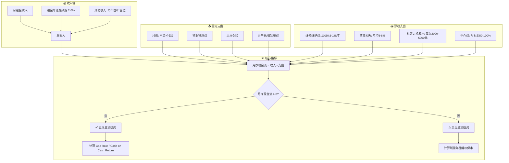
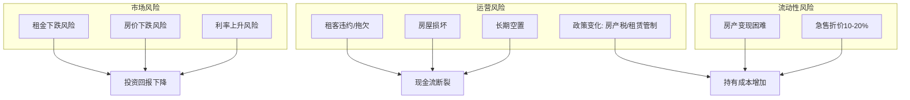

## 四、租房投资分析

租房投资的本质是用房产作为载体，通过租金收入获取持续现金流。与纯靠房价上涨的投机不同，真正的租房投资追求的是**正现金流**——每月租金收入超过所有持有成本。本章从现金流模型出发，系统讲解如何评估一处房产是否值得作为出租投资，如何优化收益，以及如何管理风险。

### 4.1 房产投资现金流全景模型

在分析任何一处出租房产之前，先理解现金流的完整结构：



> **核心判断标准**：一处值得投资的出租房产，应该在不依赖房价上涨的情况下就能产生正现金流。如果你必须赌房价上涨才能获利，那不是投资，是投机。

### 4.2 现金流计算详解

#### 4.2.1 收入端：租金收入的确定

租金收入不是简单地看中介挂牌价，而是需要多维度交叉验证：

**确定合理租金的方法：**

| 方法 | 操作 | 可信度 |
|------|------|--------|
| 同小区成交价 | 在贝壳/链家查看同户型近3个月实际成交租金 | ★★★★★ |
| 周边小区对比 | 半径1公里内同类房源租金中位数 | ★★★★ |
| 租房平台挂牌价 | 自如/豆瓣/闲鱼挂牌价打85折 | ★★★ |
| 租金回报率反推 | 当地平均租金回报率 × 房价 ÷ 12 | ★★★ |

**租金定价公式：**

```text
合理月租金 = 同小区同户型近3个月实际成交租金中位数 × 位置修正系数 × 装修修正系数

位置修正系数：
- 地铁口500米内：1.05-1.10
- 学区房：1.10-1.20
- 商业区周边：1.05-1.15
- 偏远区域：0.85-0.95

装修修正系数：
- 精装修带家具家电：1.00（基准）
- 简装：0.85-0.90
- 毛坯：0.60-0.70
```

#### 4.2.2 支出端：持有成本全清单

大多数投资者只算月供，忽略了大量隐性成本。以下是完整的持有成本清单：

**每月固定支出：**

| 支出项 | 计算方式 | 典型范围 |
|--------|----------|----------|
| 月供（等额本息） | 贷款金额×月利率×(1+月利率)^期数÷[(1+月利率)^期数-1] | 贷款100万/30年/4.0%：4,774元/月 |
| 物业管理费 | 按建筑面积收取 | 1.5-5元/㎡/月 |
| 房屋保险 | 房价×0.1-0.3%/年 | 年缴 |
| 租赁税费 | 租金×4-8%（各地不同） | 见当地政策 |

**年度/不定期支出：**

| 支出项 | 预算标准 | 说明 |
|--------|----------|------|
| 维修维护 | 房价×0.5-1%/年 | 老房取上限，新房取下限 |
| 空置损失 | 年均1个月租金 | 含招租期+换租过渡期 |
| 租客更换成本 | 2,000-5,000元/次 | 深度保洁+墙面修补+中介费 |
| 中介费 | 0.5-1个月租金 | 由房东承担的地区需计入 |
| 大修基金 | 特殊情况 | 水管爆裂、电路改造等 |

**隐性成本（最容易忽略）：**

- **机会成本**：首付款如果不买房，存大额存单年化2.5-3%，买国债年化2.5-3.5%
- **折旧成本**：房屋装修和家电每年贬值约5-10%
- **管理成本**：如果自管，你的时间有价；如果托管，托管费5-10%
- **税费成本**：房产交易时的增值税、个税、契税等

#### 4.2.3 完整现金流计算示例

**场景设定：** 二线城市一套总价150万的80㎡两居室

```text
=== 收入端 ===
月租金：4,500元
年租金收入：4,500 × 12 = 54,000元

=== 支出端 ===
首付：45万（30%）
贷款：105万，利率3.95%，30年等额本息
月供：4,983元（年缴：59,796元）
物业费：2.4元/㎡/月 × 80㎡ = 192元/月（年缴：2,304元）
维修预留：150万 × 0.8% = 12,000元/年
空置损失：4,500元/年（按1个月）
租赁税费：54,000 × 5% = 2,700元/年
房屋保险：150万 × 0.15% = 2,250元/年

=== 年度现金流 ===
年收入：54,000元
年支出：59,796 + 2,304 + 12,000 + 4,500 + 2,700 + 2,250 = 83,550元
年净现金流：54,000 - 83,550 = -29,550元
月净现金流：-2,463元

=== 机会成本对比 ===
首付款45万存大额存单：45万 × 2.8% = 12,600元/年
实际年亏损：-29,550 + (-12,600) = -42,150元
```

**结论：** 这处房产每年实际亏损约4.2万元。要保本，房价需每年上涨至少2.8%。这还不包括交易时的税费和中介费。

### 4.3 核心投资指标体系

判断一处房产是否值得投资，不能只靠直觉，需要用以下量化指标：

#### 4.3.1 毛租金回报率（Gross Yield）

```text
毛租金回报率 = 年租金收入 ÷ 房产购买价格 × 100%

示例：年租金54,000 ÷ 房价1,500,000 = 3.6%
```

**解读：**
- \> 5%：优质投资标的
- 3-5%：一般水平，需结合其他指标判断
- < 3%：在中国一线城市较常见，需依赖房价增值

**中国主要城市毛租金回报率参考（2024-2025）：**

| 城市 | 平均毛租金回报率 | 特点 |
|------|-----------------|------|
| 北京 | 1.5-2.0% | 房价高，租金回报率极低 |
| 上海 | 1.5-2.0% | 同上 |
| 深圳 | 1.2-1.8% | 全国最低区间 |
| 广州 | 2.0-2.5% | 一线城市中相对较高 |
| 成都 | 2.5-3.5% | 新一线城市代表 |
| 重庆 | 3.0-4.0% | 房价相对较低 |
| 长沙 | 3.5-4.5% | 租金回报率较高 |

#### 4.3.2 净租金回报率（Net Yield）

```text
净租金回报率 = (年租金收入 - 年持有成本) ÷ 房产购买价格 × 100%

年持有成本 = 物业费 + 维修费 + 空置损失 + 税费 + 保险

示例：(54,000 - 23,754) ÷ 1,500,000 = 2.02%
```

净租金回报率才是真实收益。很多中介只提毛回报率，有意忽略持有成本。

#### 4.3.3 现金回报率（Cash-on-Cash Return）

这是最重要的投资指标——衡量你实际投入的现金获得了多少回报：

```text
现金回报率 = 年净现金流 ÷ 总初始投入 × 100%

总初始投入 = 首付 + 购房税费 + 装修费 + 中介费

示例：
首付：45万
购房税费（契税1.5%+维修基金等）：约3万
简装费用：5万
中介费：3万
总初始投入：56万

年净现金流：-29,550元

现金回报率 = -29,550 ÷ 560,000 = -5.28%
```

**解读：**
- \> 8%：非常优秀的投资
- 5-8%：良好
- 0-5%：勉强及格
- < 0%：负现金流，需谨慎

#### 4.3.4 资本化率（Cap Rate）

```text
Cap Rate = 年净运营收入(NOI) ÷ 房产市场价值 × 100%

NOI = 年租金收入 - 年运营支出（不含月供、不含装修折旧）

示例：
年租金：54,000
年运营支出：2,304 + 12,000 + 4,500 + 2,700 + 2,250 = 23,754
NOI = 54,000 - 23,754 = 30,246
Cap Rate = 30,246 ÷ 1,500,000 = 2.02%
```

Cap Rate不考虑融资方式，便于横向比较不同房产的内在回报能力。它回答的问题是：如果我全款买下这处房产，年回报率是多少？

#### 4.3.5 盈亏平衡入住率

```text
盈亏平衡入住率 = 年固定持有成本 ÷ 满租年收入 × 100%

示例：
年固定成本（物业费+维修+税费+保险）：19,254
满租年收入：54,000
盈亏平衡入住率 = 19,254 ÷ 54,000 = 35.7%
```

这意味着只要入住率超过35.7%，就能覆盖运营成本（不含月供）。但含月供的盈亏平衡入住率：

```text
含月供盈亏平衡入住率 = (59,796 + 19,254) ÷ 54,000 = 146.4%
```

即使满租也无法覆盖全部成本，印证了负现金流的判断。

#### 4.3.6 投资回报指标对比总览

| 指标 | 公式 | 衡量什么 | 及格线 |
|------|------|----------|--------|
| 毛租金回报率 | 年租金÷房价 | 租金相对房价的高低 | > 3% |
| 净租金回报率 | NOI÷房价 | 扣除运营成本后的真实回报 | > 2% |
| 现金回报率 | 年净现金流÷总投入 | 你投的现金赚了多少 | > 5% |
| Cap Rate | NOI÷市场价值 | 房产本身的回报能力 | > 4% |
| 盈亏平衡入住率 | 固定成本÷满租收入 | 抗空置风险的能力 | < 70% |

### 4.4 提高租金收益的实战策略

#### 4.4.1 策略一：精装修溢价

**投入产出分析：**

| 装修等级 | 投入预算 | 月租金提升 | 回收周期 | 年化回报 |
|----------|----------|-----------|----------|----------|
| 基础翻新（刷墙+换灯+深度保洁） | 5,000-10,000元 | 200-500元 | 1-2年 | 24-60% |
| 中等翻新（含厨卫局部改造） | 2-4万元 | 500-1,000元 | 2-4年 | 15-30% |
| 精装修（全屋改造+品牌家电） | 5-10万元 | 1,000-2,000元 | 3-5年 | 12-24% |

**装修要点：**
- **重点投入厨卫**：租客对厨房和卫生间的敏感度最高，投入产出比最好
- **家电选性价比品牌**：美的/海尔基础款即可，不必用进口品牌
- **风格走简约现代**：白墙+原木色家具+灰色调软装，接受度最广
- **务必做深度保洁**：花500元做一次专业保洁，租金能多要200-300元/月
- **拍照要专业**：请摄影师或用好手机拍摄，第一印象决定看房率

#### 4.4.2 策略二：分割出租（合租模式）

**适用条件：** 面积≥90㎡、房间≥3个、靠近商圈或地铁

**收益对比：**

```text
整租：三居室 6,000元/月
分割出租：
  - 主卧（独立卫浴）：2,500元/月
  - 次卧A：1,800元/月
  - 次卧B：1,600元/月
  - 公共区域分摊：含在各房间价格中
  合计：5,900元/月
```

看似整租和分割差不多，但分割出租的实际优势在于：
- **空置风险分散**：一间空了，其他两间还在产生收入
- **定价灵活**：可以根据市场单独调价
- **旺季溢价**：毕业季、春节后需求旺盛时可以提价

**分割出租的风险和对策：**

| 风险 | 对策 |
|------|------|
| 租客纠纷 | 制定公共区域使用规则，写入合同 |
| 管理成本高 | 使用智能门锁、自动抄表，减少现场管理 |
| 政策限制 | 确认当地是否允许隔断出租，人均面积≥5㎡ |
| 房屋损耗大 | 收取较高押金，合同约定赔偿条款 |
| 消防安全 | 不得打隔断改变房屋结构，保持逃生通道 |

#### 4.4.3 策略三：长租公寓托管

**托管模式对比：**

| 平台 | 托管模式 | 租金折扣 | 管理费 | 保底租金 | 适合人群 |
|------|----------|----------|--------|----------|----------|
| 自如 | 包租+装修 | 自如定价 | 含在差价中 | 有（空置期也付） | 不想操心的房东 |
| 贝壳省心租 | 代管 | 房东定价 | 租金5-8% | 无 | 想保留定价权的房东 |
| 本地中介 | 帮租 | 房东定价 | 半个月-1个月租金 | 无 | 有精力管理的房东 |

**托管收益计算：**

```text
自管模式：
月租金收入：4,500元
管理时间成本：约5小时/月（含沟通、维修协调）
折合时薪：假设你时薪100元，成本500元/月
实际收益：4,000元/月

自如托管模式：
自如给房东：3,800元/月（扣除装修折旧后）
管理时间成本：0
实际收益：3,800元/月

省心租代管模式：
月租金：4,500元
管理费：4,500 × 8% = 360元
实际收益：4,140元/月
管理时间：约2小时/月
```

**选择建议：**
- 名下房产≤2套且工作繁忙：选自如托管，省心最重要
- 名下房产3-5套：选代管模式，保留定价权
- 名下房产≥5套：自建管理团队或自管，成本最低

#### 4.4.4 策略四：短租/民宿

**收益潜力：**

```text
长租对比短租收益（以旅游景区城市为例）：

长租模式：
月租金：3,000元
年收入：36,000元
入住率：95%

民宿模式：
日均房价：280元
年入住率：65%（淡旺季平均）
年收入：280 × 365 × 65% = 66,430元

差额：+30,430元（提升84.5%）
```

但短租的隐性成本远高于长租：

| 成本项 | 长租 | 短租/民宿 |
|--------|------|-----------|
| 平台佣金 | 0-8% | 10-20% |
| 清洁费 | 几乎为0 | 50-100元/次 |
| 布草更换 | 不需要 | 每次入住更换 |
| 水电气 | 租客自付 | 含在房价中 |
| 折旧速度 | 正常 | 2-3倍 |
| 管理时间 | 2-3小时/月 | 10-20小时/月 |
| 政策风险 | 低 | 高（各地管控趋严） |
| 消防/治安要求 | 基本 | 需要特种行业许可 |

**适合做民宿的条件：**
- 位于热门旅游城市或核心商圈
- 小区物业允许短租
- 当地政策明确许可或至少不禁止
- 你有足够时间或愿意付费给代运营公司

### 4.5 租房投资的风险分析

#### 4.5.1 主要风险清单



#### 4.5.2 风险应对策略

**租客风险管控：**

| 风险场景 | 预防措施 | 事后应对 |
|----------|----------|----------|
| 拖欠房租 | 押一付三，查看征信报告 | 合同约定逾期7天可解除，预留律师费 |
| 房屋损坏 | 入住前拍照存档，收2个月押金 | 合同明确赔偿标准，购买房东保险 |
| 违规转租 | 合同明确禁止，定期（每季度）上门检查 | 合同约定违约金条款 |
| 租客纠纷（合租） | 制定公共区域规则，入住前签署确认 | 出问题前调解，严重的要求搬离 |
| 拒不搬离 | 合同明确到期条款 | 走法律途径，切勿私自换锁断电 |

**市场风险管控：**

- **利率上升**：优先选择固定利率贷款，或在利率低点提前还贷
- **租金下跌**：选择人口净流入城市，刚需租赁需求稳定的区域
- **房价下跌**：不依赖房价增值做投资决策，只投正现金流房产
- **政策变化**：关注房产税试点城市动态，预留额外税费空间

**流动性风险管控：**

- 房产投资的钱至少3年内不需要动用
- 保持一定比例的流动资产（现金、基金）作为应急
- 不要把所有资产都押在房产上
- 选择流动性好的区域（核心地段、优质学区、地铁口）

### 4.6 租房投资的选址逻辑

#### 4.6.1 租金回报率最高的城市特征

选择投资城市时，关注以下指标：

| 指标 | 重要性 | 数据来源 |
|------|--------|----------|
| 人口净流入 | ★★★★★ | 国家统计局/城市统计公报 |
| 产业聚集度 | ★★★★ | 当地GDP、企业数量 |
| 房价收入比 | ★★★★ | 房价÷家庭年收入 |
| 租金回报率 | ★★★★ | 贝壳研究院数据 |
| 土地供应量 | ★★★ | 供过于求则房价承压 |
| 限购政策 | ★★★ | 影响未来交易流动性 |

#### 4.6.2 城市内部的板块选择

在选定城市后，板块选择决定租金稳定性和增值潜力：

**优先选择的区域：**
1. **地铁沿线**（步行10分钟内）：租金溢价10-20%，空置率低
2. **产业园区周边**（2公里内）：稳定的工作人口支撑租赁需求
3. **优质学区**：虽然"多校划片"政策在推行，但核心学区仍有溢价
4. **成熟商圈**：配套完善，生活便利，租客粘性高

**谨慎选择的区域：**
1. **新城开发区**：配套不成熟，入住率低，空置风险大
2. **远郊别墅区**：租赁需求弱，流动性极差
3. **过度依赖单一产业的区域**：产业衰退则租金崩塌
4. **旅游地产**：季节性空置严重，长租需求弱

#### 4.6.3 户型选择

| 户型 | 租赁需求 | 租金稳定性 | 空置率 | 推荐指数 |
|------|----------|-----------|--------|----------|
| 一居室（40-60㎡） | 极高 | 高 | 低 | ★★★★★ |
| 两居室（70-90㎡） | 高 | 高 | 低 | ★★★★★ |
| 三居室（100-120㎡） | 中 | 中 | 中 | ★★★ |
| 四居及以上 | 低 | 低 | 高 | ★★ |
| 商住公寓 | 中 | 低 | 中 | ★★ |

**一居室和两居室是租房投资的最佳选择**——需求群体最大（单身、情侣、小家庭），空置期短，定价灵活。

### 4.7 融资策略与杠杆运用

#### 4.7.1 贷款方案对比

| 贷款类型 | 利率范围 | 贷款年限 | 月供（100万） | 适合场景 |
|----------|----------|----------|--------------|----------|
| 首套房商业贷款 | 3.5-4.0% | 30年 | 4,490-4,774元 | 首套购房 |
| 二套房商业贷款 | 4.0-4.5% | 30年 | 4,774-5,067元 | 投资第二套 |
| 经营贷（需公司） | 3.0-3.8% | 10-20年 | 利率低但期限短 | 有公司的投资者 |
| 公积金贷款 | 3.1% | 30年 | 4,270元 | 利率最低，但额度有限 |

> **警示**：经营贷买房属于违规操作，一旦被银行查实会要求提前还贷，风险极大。务必合规操作。

#### 4.7.2 杠杆收益率计算

杠杆能放大收益，也能放大亏损：

```text
场景A：全款买房
投入：150万
年净运营收入（不含月供）：30,246元
年化回报：30,246 ÷ 1,500,000 = 2.02%

场景B：贷款70%买房
投入：45万（首付）+ 3万（税费）+ 5万（装修）+ 3万（中介费）= 56万
年净现金流：-29,550元
现金回报率：-29,550 ÷ 560,000 = -5.28%

场景B的杠杆效应：
- 如果房价涨5%：增值75,000元，实际收益75,000 - 29,550 = 45,450元
  对56万投入的回报率 = 8.12%
- 如果房价跌5%：贬值75,000元，实际亏损75,000 + 29,550 = 104,550元
  对56万投入的亏损率 = -18.67%
```

杠杆的核心逻辑：**放大波动**。在房价上行周期是利器，在下行周期是绞索。

#### 4.7.3 月供压力测试

在贷款前，必须做压力测试——假设租金收入下降20%、利率上升1%、空置2个月，你是否还能扛住？

```text
压力测试公式：
月最大可承受月供 = (家庭月收入 × 50%) - 其他固定支出 - 压力缓冲

示例：
家庭月收入：25,000元
其他月固定支出（生活+车贷等）：8,000元
压力缓冲（20%）：3,400元

月最大可承受月供 = 25,000 × 50% - 8,000 - 3,400 = 1,100元

这意味着：如果租金不能覆盖大部分月供，你需要极低的月供才安全
```

**黄金法则：** 租金至少覆盖月供的70%，且月供不超过家庭月收入的40%。

### 4.8 税务规划

#### 4.8.1 出租房产涉及的税种

| 税种 | 税率 | 说明 |
|------|------|------|
| 增值税 | 1.5%（个人出租住房） | 月租金≤10万免征（部分地区） |
| 房产税 | 4%（个人出租住房） | 住宅优惠税率 |
| 个人所得税 | 10%（住房） | 可扣除修缮费（800元/月上限） |
| 城建税及附加 | 增值税的12% | 随增值税缴纳 |
| 印花税 | 免征 | 个人出租住房免征 |

**实际综合税负估算：**

```text
月租金：5,000元

应缴税费（简化计算）：
- 增值税：5,000 ÷ 1.05 × 1.5% = 71.43元
- 房产税：(5,000 - 71.43) × 4% = 197.14元
- 个税：(5,000 - 71.43 - 197.14 - 800) × 10% = 393.14元
- 附加税：71.43 × 12% = 8.57元

月缴税合计：约670元
综合税负率：670 ÷ 5,000 = 13.4%
```

#### 4.8.2 合法节税策略

- **据实申报扣除项**：修缮费用、贷款利息都可以在税前扣除
- **利用月租金10万免征额**：如果有多套房产，分散到不同家庭成员名下
- **签订正式租赁合同**：备案后才能享受住房优惠税率
- **保留所有维修发票**：维修费用可以抵扣部分个税

### 4.9 租房投资决策清单

在决定投资一处出租房产前，用这个清单逐项确认：

**□ 基本条件**
- [ ] 毛租金回报率 > 3%（或当地合理水平）
- [ ] 月租金 > 月供的70%
- [ ] 月供 < 家庭月收入的40%
- [ ] 首付+税费+装修不超出可动用资金的80%

**□ 市场验证**
- [ ] 该城市人口净流入
- [ ] 该板块租赁需求旺盛（查看贝壳/链家租赁成交量）
- [ ] 同小区空置率 < 10%（近半年内有稳定成交）
- [ ] 租金过去3年有增长或至少持平

**□ 风险评估**
- [ ] 即使租金下降20%，仍可承受月供
- [ ] 即使利率上升1%，仍可承受月供
- [ ] 即使空置2个月，现金流不会断裂
- [ ] 房产税开征后，持有成本仍在可承受范围

**□ 物业条件**
- [ ] 房龄 < 20年（超过20年贷款年限受限）
- [ ] 产权清晰，无纠纷
- [ ] 小区物业管理良好
- [ ] 交通便利（地铁/公交站10分钟内）

**□ 法律合规**
- [ ] 确认当地限购政策（是否限购、限贷）
- [ ] 确认当地租赁税费政策
- [ ] 标准租赁合同模板已准备好
- [ ] 房东责任险已了解

### 4.10 从一套到多套：规模化路径

当第一套房投资成功后，可以考虑逐步扩大规模：


**规模化关键节点：**

| 阶段 | 房产数量 | 管理方式 | 注意事项 |
|------|----------|----------|----------|
| 起步期 | 1-2套 | 自管 | 重在学习，控制成本 |
| 成长期 | 3-5套 | 半托管 | 建立标准化流程 |
| 成熟期 | 6-10套 | 专业管理 | 考虑成立公司，享受税收优惠 |
| 规模期 | 10套+ | 团队管理 | 资产证券化、REITs等 |

**规模化的核心能力：**
1. **融资能力**：多套房贷款受限后，需要经营贷、抵押贷等替代方案
2. **管理能力**：统一装修标准、统一定价策略、统一流程管理
3. **风险控制**：分散投资区域，不把所有房产押在同一板块
4. **税务规划**：成立公司持有房产，合理利用税收政策

### 4.11 常见误区与纠正

| 误区 | 真相 |
|------|------|
| "买房出租一定赚钱" | 负现金流的房产会持续消耗你的资金，不赚反亏 |
| "房价涨了就等于赚了" | 房价涨但卖不掉、或卖出要交高额税费，纸面富贵不等于真实收益 |
| "租金会一直涨" | 经济下行、人口减少、供应增加都会压低租金 |
| "装修越豪华租金越高" | 超过一定阈值后，装修投入的边际收益递减 |
| "出租不用交税" | 个人出租住房有明确的纳税义务，不报税有被追缴的风险 |
| "房产是最好的抗通胀资产" | 只有正现金流的房产才能抗通胀，负现金流的房产在通胀+加息环境下更危险 |
| "贷款越多杠杆越大赚越多" | 杠杆放大收益的同时也放大亏损，下行周期可能导致资不抵债 |

### 4.12 本节核心要点

1. **正现金流是底线**：不投资任何不产生正现金流的出租房产
2. **用净回报率做决策**：毛回报率是障眼法，扣除所有成本后的净回报才是真相
3. **租金回报率选股**：优先选择人口净流入、房价收入比低的城市
4. **一居两居最优**：需求最旺盛、空置率最低、定价最灵活
5. **压力测试不可省**：假设最坏情况发生，你是否还能扛住
6. **税务要合规**：合理节税不等于逃税，保留所有凭证
7. **从小做起**：先用一套房验证模式，再考虑规模化
