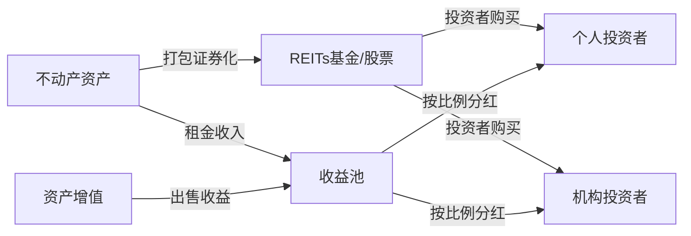
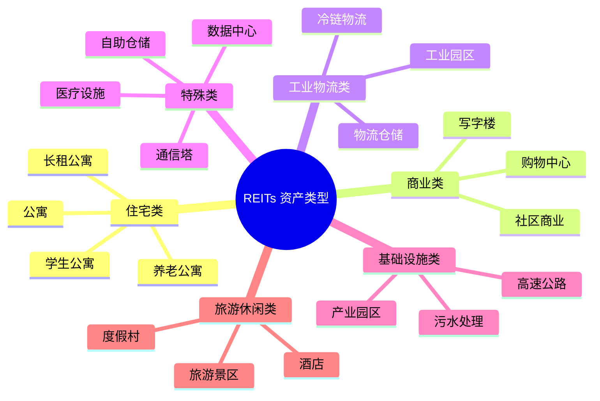
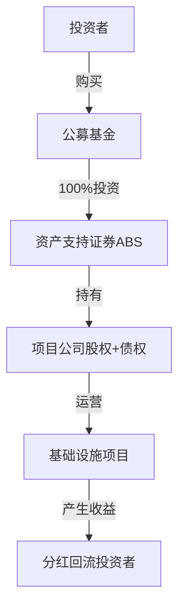
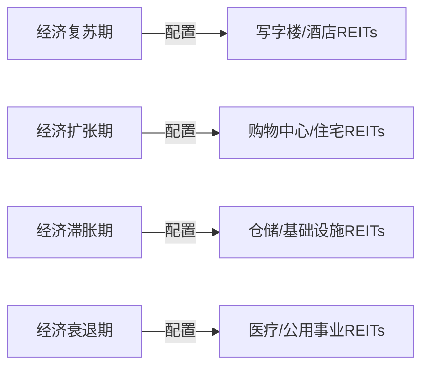
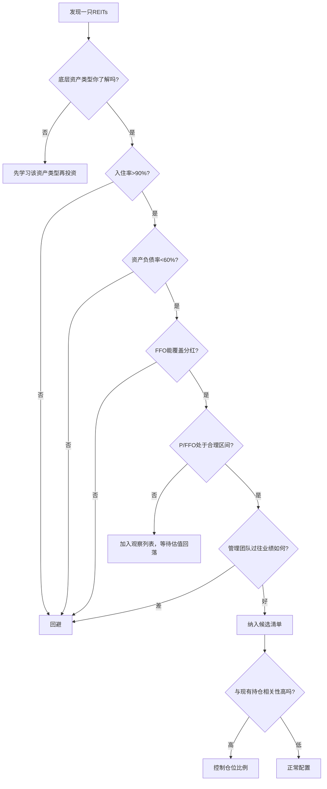

## 五、REITs——不买房也能投资房地产

传统房地产投资的门槛动辄数十万甚至数百万，还要操心租客、维修、贷款、税费。REITs（Real Estate Investment Trusts，房地产投资信托基金）的出现，彻底改变了这一格局——你可以像买卖股票一样，用几百元参与商业地产、物流园区、数据中心等优质不动产的投资，并定期获取租金分红。

### 1. REITs 的本质：把房产装进证券里

#### 1.1 定义与核心机制

REITs 是一种将房地产资产证券化的金融工具。其运作原理可以拆解为三个环节：

1. **资产汇集**：REITs 管理方收购或持有多种不动产（写字楼、商场、公寓、仓储、医院等）
2. **份额发行**：将这些资产打包，以基金份额或股票的形式向投资者发行
3. **收益分配**：REITs 将租金收入、资产增值等收益，按规定比例定期分配给持有人

#### 1.2 REITs 的法律约束

REITs 不是想做就能做的，各国对其都有严格的法律要求，核心约束包括：

| 约束维度 | 典型要求 | 目的 |
|----------|----------|------|
| 资产比例 | 75%以上资产必须是不动产相关 | 确保本质是房地产投资 |
| 收入比例 | 75%以上收入来自租金或不动产销售 | 防止偏离主业 |
| 分红比例 | 90%以上应税收入必须分红 | 保障投资者持续收益 |
| 股东人数 | 最低股东数量要求（如美国100人） | 防止变相私有化 |
| 杠杆限制 | 部分国家限制资产负债率 | 控制系统性风险 |

这些约束的核心逻辑是：**REITs 享受税收优惠（公司层面免征所得税），代价是必须把大部分收益分给投资者**。这是一种制度设计上的"利益绑定"。

#### 1.3 REITs 与相关概念的区别

很多人容易混淆 REITs、房地产基金、MBS 等概念，下表做清晰对比：

| 维度 | REITs | 房地产私募基金 | MBS（抵押贷款支持证券） | 房地产股票 |
|------|-------|---------------|----------------------|-----------|
| 投资标的 | 直接持有不动产 | 直接持有不动产 | 房地产贷款债权 | 房地产公司股权 |
| 流动性 | 高（上市交易） | 低（锁定期长） | 中 | 高 |
| 分红要求 | 法律强制90%+ | 无强制 | 按贷款还款分配 | 公司自行决定 |
| 门槛 | 低（数百元起） | 高（百万起） | 中 | 低 |
| 管理方式 | 专业团队管理 | GP管理 | 金融机构管理 | 公司管理层 |
| 税收优惠 | 有（公司层面免税） | 无特殊优惠 | 无特殊优惠 | 无特殊优惠 |

### 2. REITs 的分类体系

#### 2.1 按组织形式分

**契约型 REITs**：通过信托契约设立，投资者是信托受益人。中国公募 REITs 目前以此为主。

**公司型 REITs**：以公司形式设立，投资者是股东。美国 REITs 多为此类，投资者拥有投票权。

#### 2.2 按投资方式分

| 类型 | 运作方式 | 收益来源 | 风险特征 | 典型占比 |
|------|----------|----------|----------|----------|
| 权益型（Equity） | 直接持有并运营不动产 | 租金+资产增值 | 受房地产市场直接影响 | ~90% |
| 抵押型（Mortgage） | 贷款给房地产开发商或购买MBS | 贷款利息 | 受利率和违约风险影响 | ~8% |
| 混合型（Hybrid） | 兼有以上两种 | 租金+利息 | 风险和收益居中 | ~2% |

#### 2.3 按底层资产类型分

这是投资者最需要关注的分类，因为不同类型的不动产有截然不同的经济周期和风险特征：

各类资产的核心特征对比：

| 资产类型 | 租约期限 | 抗周期性 | 增长潜力 | 适合的经济环境 |
|----------|----------|----------|----------|--------------|
| 数据中心 | 长期（5-15年） | 强 | 高 | 数字化加速期 |
| 物流仓储 | 中长期（3-10年） | 较强 | 高 | 电商/供应链升级期 |
| 医疗设施 | 长期（10-20年） | 强 | 中 | 老龄化社会 |
| 公寓/住宅 | 短期（1-2年） | 中 | 中 | 城镇化/人口流入期 |
| 写字楼 | 中长期（3-10年） | 中 | 中 | 经济扩张期 |
| 购物中心 | 中期（3-8年） | 弱 | 中低 | 消费升级期 |
| 酒店 | 短期（按日/月） | 弱 | 高 | 旅游复苏期 |
| 通信塔 | 长期（5-20年） | 强 | 中 | 5G建设期 |

### 3. 全球 REITs 市场全景

#### 3.1 主要市场概览

| 市场 | 起步年份 | 当前规模 | 代表性指数 | 特点 |
|------|----------|----------|-----------|------|
| 美国 | 1960年 | ~1.3万亿美元 | MSCI US REIT Index | 最成熟，品类最全 |
| 日本 | 2001年 | ~1200亿美元 | TSE REIT Index | 亚洲最大，流动性好 |
| 新加坡 | 2002年 | ~800亿美元 | FTSE ST REIT Index | 亚洲REITs枢纽 |
| 中国香港 | 2005年 | ~300亿美元 | 恒生REIT指数 | 以商业地产为主 |
| 澳大利亚 | 1971年 | ~1000亿美元 | S&P/ASX 200 A-REIT | 历史悠久 |
| 中国大陆 | 2021年 | ~1000亿人民币 | 中证REITs指数 | 新兴市场，政策驱动 |

#### 3.2 中国公募 REITs（C-REITs）

中国公募 REITs 于 2021 年 6 月正式开闸，采用"公募基金+ABS"的独特结构：

**中国 C-REITs 的独特之处：**

- **底层资产限定**：聚焦基础设施——产业园区、仓储物流、高速公路、污水处理、保障性租赁住房等，不包括商品住宅
- **强制分红**：每年至少分配可供分配金额的 90%
- **扩募机制**：运营良好可申请扩募，注入新资产
- **交易场所**：沪深交易所上市，证券账户直接买卖

**已上市项目示例（截至2024年）：**

| 项目名称 | 底层资产类型 | 所在区域 | 特点 |
|----------|-------------|----------|------|
| 华安张江光大园 | 产业园区 | 上海 | 首批上市 |
| 中金普洛斯仓储 | 物流仓储 | 多城市 | 仓储龙头 |
| 华夏越秀高速 | 高速公路 | 湖北 | 收费公路 |
| 华夏北京保障房 | 保障性租赁住房 | 北京 | 民生类 |
| 鹏华深圳能源 | 清洁能源 | 深圳 | 新能源 |

### 4. 投资 REITs 的核心指标

#### 4.1 收益指标

投资 REITs 不能只看股价涨跌，需要理解其特有的估值体系：

**分红收益率（Dividend Yield）**

$$\text{分红收益率} = \frac{\text{每股年分红}}{\text{每股价格}} \times 100\%$$

REITs 的分红收益率通常在 3%-8% 之间，显著高于多数股票。但要注意：高收益率可能是股价下跌导致的"被动升高"，不一定是好事。

**FFO（运营资金，Funds From Operations）**

$$\text{FFO} = \text{净利润} + \text{折旧摊销} - \text{资产出售收益}$$

FFO 是 REITs 估值的核心指标，因为房地产的折旧是非现金支出，会低估真实盈利能力。FFO 去掉折旧影响，更准确反映运营现金流。

**AFFO（调整后运营资金，Adjusted FFO）**

$$\text{AFFO} = \text{FFO} - \text{经常性资本支出}$$

AFFO 在 FFO 基础上扣除了维护物业所需的资本支出，是衡量 REITs 可持续分红能力的"黄金指标"。

**P/FFO 倍数**

$$\text{P/FFO} = \frac{\text{股价}}{\text{每股FFO}}$$

类比股票的 P/E，P/FFO 是 REITs 最常用的估值倍数。一般来说：
- P/FFO < 12：可能被低估，需检查是否有基本面问题
- P/FFO 12-18：合理区间
- P/FFO > 18：可能被高估，除非有明确增长预期

#### 4.2 运营指标

| 指标 | 含义 | 健康范围 | 异常信号 |
|------|------|----------|----------|
| 入住率（Occupancy Rate） | 已出租面积/总面积 | >90% | 持续下降说明需求疲软 |
| 租约到期分布 | 各年到期的租约占比 | 均匀分布 | 集中到期=续租风险 |
| 租金增长率 | 同比租金变化 | >CPI | 负增长=竞争力下降 |
| 净经营收入（NOI） | 租金收入-运营成本 | 持续增长 | 下滑要查原因 |
| 资产负债率 | 总负债/总资产 | <60% | >65%需警惕 |
| 利息覆盖倍数 | EBITDA/利息费用 | >3倍 | <2倍=偿债压力大 |
| NAV折溢价 | (股价-每股NAV)/NAV | -10%~+20% | 深度折价需查原因 |

#### 4.3 估值方法：NAV 计算

NAV（净资产价值，Net Asset Value）是 REITs 最基础的估值方法：

$$\text{每股NAV} = \frac{\text{资产组合市场价值} - \text{总负债}}{\text{总份额数}}$$

实操中，资产组合市场价值的估算方法：

$$\text{资产市场价值} = \frac{\text{该资产NOI}}{\text{资本化率（Cap Rate）}}$$

资本化率（Cap Rate）反映了市场对该类不动产的预期收益率：
- 核心地段写字楼：4%-5%
- 物流仓储：5%-6%
- 社区商业：6%-7%
- 产业园区：5.5%-7%

**实操示例：**

假设某 REITs 持有一栋写字楼，年 NOI 为 5000 万元，同类物业 Cap Rate 为 5%，则该资产估值 = 5000万 / 5% = 10亿元。若 REITs 总负债 3 亿元，发行 1 亿份，则每股 NAV = (10亿 - 3亿) / 1亿份 = 7 元。如果当前股价 6 元，则折价率 = (6 - 7) / 7 = -14.3%，可能存在投资机会。

### 5. REITs 投资实战策略

#### 5.1 策略一：核心持有收息策略

**适合人群**：追求稳定现金流的保守型投资者

**操作方式**：
1. 选择分红收益率 4%-6%、连续 5 年以上稳定分红的 REITs
2. 底层资产优选：物流仓储、数据中心、医疗设施等抗周期类型
3. 分散持有 5-10 只不同资产类型的 REITs
4. 分红再投资，利用复利效应

**配置示例：**

| 资产类型 | 配置比例 | 选择逻辑 |
|----------|----------|----------|
| 物流仓储 | 25% | 电商驱动，需求刚性 |
| 数据中心 | 20% | 数字化趋势不可逆 |
| 医疗设施 | 20% | 老龄化+抗周期 |
| 保障性住房 | 15% | 政策支持，需求稳定 |
| 产业园区 | 10% | 经济复苏弹性 |
| 通信基础设施 | 10% | 5G建设红利 |

#### 5.2 策略二：周期轮动策略

**适合人群**：有一定分析能力的主动型投资者

**核心逻辑**：不同类型的 REITs 在经济周期的不同阶段表现差异显著。

**轮动信号识别：**

| 经济信号 | 判断方法 | 应增配的REITs类型 |
|----------|----------|-----------------|
| PMI连续3月>50 | 制造业扩张 | 工业物流、产业园区 |
| 消费零售增速>8% | 消费景气 | 购物中心、社区商业 |
| CPI持续>3% | 通胀升温 | 住宅、基础设施（租金挂钩CPI） |
| 失业率下降 | 就业改善 | 写字楼、酒店 |
| 利率下降周期 | 货币宽松 | 全面利好，优先高杠杆型 |

#### 5.3 策略三：打新+二级市场套利策略（中国C-REITs特有）

**操作逻辑**：
1. **打新**：C-REITs 发行时参与网上认购，上市首日通常有溢价
2. **扩募参与**：优质 REITs 扩募时以略低于市价参与
3. **折价买入**：当 NAV 折价超过 15% 时分批建仓

**注意事项**：C-REITs 打新收益在降低，早期项目上市涨幅可达 20%-30%，后期项目涨幅趋窄，需精选标的。

#### 5.4 策略四：全球配置策略

**适合人群**：资金量较大、追求分散化的投资者

通过 QDII 基金或港股/美股券商，配置全球 REITs：

| 市场 | 推荐方向 | 理由 |
|------|----------|------|
| 美国 | 数据中心+物流 | 科技基础设施领先 |
| 日本 | 综合REITs | 估值合理，日元资产对冲 |
| 新加坡 | 商业+物流 | 亚洲枢纽，分红稳定 |
| 中国 | 产业园区+保障房 | 政策红利期 |

### 6. REITs 的风险图谱

#### 6.1 主要风险详解

**利率风险（最核心）**

REITs 对利率极为敏感，逻辑链条：

$$\text{利率上升} \rightarrow \begin{cases} \text{融资成本增加} \rightarrow \text{分红减少} \\ \text{债券吸引力上升} \rightarrow \text{资金流出REITs} \\ \text{不动产估值下降} \rightarrow \text{NAV缩水} \end{cases}$$

历史数据验证：2022年美联储激进加息期间，美国 REITs 指数下跌超过 25%。

**应对方法**：
- 利率上行期减配高杠杆 REITs
- 优先选择浮动利率贷款占比低的标的
- 关注利率见顶信号，提前布局

**经济衰退风险**

经济下行导致空置率上升、租金下降、NOI 减少。不同资产类型的敏感度差异很大：

| 资产类型 | 衰退敏感度 | 原因 |
|----------|-----------|------|
| 酒店 | 极高 | 按日计价，需求即时反应 |
| 写字楼 | 高 | 企业缩减办公面积 |
| 购物中心 | 高 | 消费者支出收缩 |
| 公寓 | 中 | 住房需求刚性，但换租降级 |
| 物流仓储 | 中低 | 电商渗透提供支撑 |
| 数据中心 | 低 | 数字化转型不可逆 |
| 医疗设施 | 低 | 医疗需求刚性 |
| 通信塔 | 极低 | 长期合约，流量刚需 |

**政策风险**

- 中国 C-REITs 政策仍在完善中，税收、扩募、资产范围等规则可能调整
- 租金管制政策直接影响住宅类 REITs 收益
- 土地使用年限到期的续期政策不确定

**管理风险**

REITs 的价值高度依赖管理团队的运营能力：
- 资产收购时是否买贵了
- 租赁策略是否合理（租户质量、租约结构）
- 资本运作是否高效（融资时机、杠杆控制）

**流动性风险**

- 中国 C-REITs 市场规模尚小，个别项目日均成交额低
- 遇到大额卖出可能产生显著的冲击成本
- 机构投资者占比高，"羊群效应"可能放大波动

#### 6.2 风险控制清单

| 控制维度 | 具体措施 | 频率 |
|----------|----------|------|
| 分散化 | 不少于5只不同类型REITs | 持续 |
| 仓位管理 | 单只REITs不超过总资产的10% | 持续 |
| 跟踪指标 | 每季度检查FFO、入住率、负债率 | 季度 |
| 利率监控 | 关注央行动态和国债收益率走势 | 月度 |
| 止损纪律 | 单只亏损超20%强制审视逻辑 | 触发时 |
| 再平衡 | 偏离目标配置超过5%时调整 | 半年 |

### 7. 中国投资者参与 REITs 的实操指南

#### 7.1 参与渠道对比

| 渠道 | 可投范围 | 门槛 | 费用 | 适合人群 |
|------|----------|------|------|----------|
| 证券账户（沪深交易所） | 中国C-REITs | 无特殊门槛 | 佣金+管理费 | 所有投资者 |
| 公募REITs基金 | C-REITs组合 | 1元起 | 管理费0.1%-0.5% | 不愿选单只标的 |
| QDII基金 | 全球REITs | 100元起 | 管理费0.8%-1.5% | 全球配置需求 |
| 港股/美股券商 | 海外REITs | 千元起 | 佣金+汇兑成本 | 有海外账户 |
| REITs ETF | 指数化配置 | 100元起 | 管理费0.3%-0.6% | 被动投资者 |

#### 7.2 买卖操作流程（以C-REITs为例）

1. **开户**：在证券公司开通证券账户（已有股票账户即可）
2. **权限开通**：在券商APP中开通"基础设施基金"交易权限
3. **银证转账**：将资金从银行转入证券账户
4. **搜索标的**：输入REITs代码（如 508056）或名称搜索
5. **下单交易**：与买卖股票相同操作，最低100份起
6. **查看分红**：分红自动到账，可在"资金流水"中查看

#### 7.3 税费结构

**中国 C-REITs 税费：**

| 费用项目 | 比例/金额 | 说明 |
|----------|----------|------|
| 认购/申购费 | 0 | 一般无 |
| 佣金 | 0.02%-0.05% | 与券商协商 |
| 管理费 | 0.1%-0.5%/年 | 从基金资产扣除 |
| 托管费 | 0.01%-0.05%/年 | 从基金资产扣除 |
| 分红所得税 | 暂免 | 政策红利期 |
| 资本利得税 | 暂免 | 政策红利期 |

**美国 REITs 税费（中国投资者通过美股持有）：**

| 费用项目 | 说明 |
|----------|------|
| 股息预扣税 | 通常30%（中美税收协定可降至10%） |
| 资本利得税 | 通常0%（非美国居民） |
| 佣金 | 各券商不同，多数免佣 |

### 8. REITs 分析实战案例

#### 8.1 案例：如何分析一只物流仓储 REITs

假设你正在评估一只物流仓储类 C-REITs，以下是完整的分析框架：

**第一步：看底层资产质量**
- 地段：位于哪个城市的哪个区？周边交通如何？（核心物流枢纽 > 偏远地区）
- 物业类型：高标准仓库还是普通仓库？（高标仓租金更高、空置率更低）
- 入住率：当前多少？趋势如何？（>95% 优秀，<85% 需警惕）
- 租户结构：前五大租户占比？是否有头部电商/物流企业？（集中度不宜超过50%）

**第二步：看财务指标**
- 收入增长率：是否跑赢通胀？
- NOI 利润率：是否在提升？（说明运营效率改善）
- FFO/AFFO：是否足以覆盖分红？
- 资产负债率：是否合理？（<55% 较安全）
- 分红收益率：与同类比是否合理？（过高可能是陷阱）

**第三步：看管理团队**
- 管理方的行业经验和过往业绩
- 是否有扩募能力和意愿
- 资本运作能力（融资成本是否低于同行）

**第四步：看估值**
- 当前 P/FFO 与历史区间对比
- NAV 折溢价情况
- 与同类 REITs 的横向比较

**第五步：看外部环境**
- 所在城市物流需求趋势
- 电商渗透率变化
- 利率环境和融资成本预期

#### 8.2 红旗信号：这些情况要警惕

| 红旗信号 | 为什么危险 | 应对 |
|----------|-----------|------|
| 入住率连续3季下降 | 需求萎缩或竞争加剧 | 深入调研后决定 |
| 前三大租户占比>60% | 单一租户离开损失巨大 | 等租户结构改善 |
| FFO < 分红总额 | 不可持续的"透支分红" | 减持或回避 |
| 资产负债率>65% | 利率上升时压力巨大 | 回避 |
| 频繁更换管理人 | 内部治理问题 | 回避 |
| 分红收益率>10% | 可能是股价暴跌导致 | 谨慎分析 |
| 底层资产估值异常波动 | 可能存在关联交易或估值操纵 | 回避 |

### 9. 常见误区与纠正

#### 误区一："REITs就是买房子的替代品"

**事实**：REITs 买的是不动产产生的现金流，不是房产本身。你无法提取砖头，但你能获得稳定的租金分红。REITs 的价格受股票市场情绪影响，短期波动可能与房价走势不一致。

#### 误区二："分红越高越好"

**事实**：高分红可能来自三种情况——（1）资产真的好；（2）股价暴跌导致"被动高收益"；（3）管理层透支未来（分红超过 AFFO）。需要区分这三种情况，只选第一种。

#### 误区三："REITs是低风险投资"

**事实**：REITs 有股权属性，短期价格波动可能很大。2022 年全球 REITs 普遍下跌 20%-30%。REITs 的"低风险"体现在长期持有、分散配置时的收益稳定性，而非短期价格波动小。

#### 误区四："中国 C-REITs 和国外 REITs 一样"

**事实**：两者有显著差异——底层资产不同（中国聚焦基础设施，国外覆盖全品类）、交易结构不同（公募基金+ABS vs 直接上市）、流动性不同（中国市场规模小得多）。投资逻辑不能简单套用。

#### 误区五："REITs 可以对冲通胀"

**事实**：部分 REITs 确实有通胀对冲功能——尤其是租约中包含 CPI 挂钩条款的住宅和基础设施类。但写字楼等长期固定租约的 REITs，在通胀初期可能因成本上升而利润受损。需要区分资产类型。

### 10. 进阶专题

#### 10.1 REITs 在资产配置中的角色

REITs 与传统股债的相关性分析表明：

| 资产组合 | 相关系数（vs 标普500） | 年化收益 | 最大回撤 |
|----------|----------------------|----------|----------|
| 纯股票 | 1.0 | ~10% | ~-35% |
| 股票+债券（80/20） | 0.9 | ~9% | ~-28% |
| 股票+REITs（80/20） | 0.9 | ~10.5% | ~-30% |
| 股票+债券+REITs（60/20/20） | 0.8 | ~9.5% | ~-22% |

关键结论：将 REITs 纳入资产配置，可以在不显著降低收益的情况下，改善组合的风险收益比（尤其在股债商多元组合中）。

#### 10.2 杠杆与REITs的关系

当利率下降时：
- REITs 融资成本下降 → NOI 提升 → 分红增加
- 无风险利率下降 → REITs 的收益率优势凸显 → 资金流入
- 以上双重利好使 REITs 在降息周期表现优异

当利率上升时：
- 反向传导，但存在时滞——REITs 通常在加息初期仍表现尚可（经济向好支撑），在加息后期开始承压

实操建议：关注 10 年期国债收益率的拐点，作为 REITs 配置的重要参考信号。

#### 10.3 REITs 的 ESG 投资趋势

全球 REITs 越来越重视 ESG（环境、社会、治理）：

- **绿色建筑认证**（LEED、BREEAM）的物业租金溢价 5%-10%
- **碳中和目标**推动老旧物业改造投资
- ESG 评级高的 REITs 更受机构投资者青睐，估值溢价逐步形成
- 中国 C-REITs 中的清洁能源、污水处理等项目天然契合 ESG 主题

### 11. 快速决策框架

当你面对一只 REITs 时，用以下流程快速筛选：

### 12. 关键要点总结

| 维度 | 要点 |
|------|------|
| 本质 | 不动产证券化，赚的是租金分红+资产增值 |
| 核心指标 | FFO、AFFO、NAV、分红收益率、P/FFO |
| 最大风险 | 利率变动、经济周期、管理能力 |
| 配置价值 | 与股债低相关，改善组合风险收益比 |
| 中国市场 | C-REITs 刚起步，政策红利期，但流动性待提升 |
| 选标原则 | 好资产+好管理+合理估值，缺一不可 |
| 持有心态 | 长期持有收息为主，短期交易为辅 |
