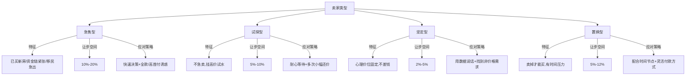
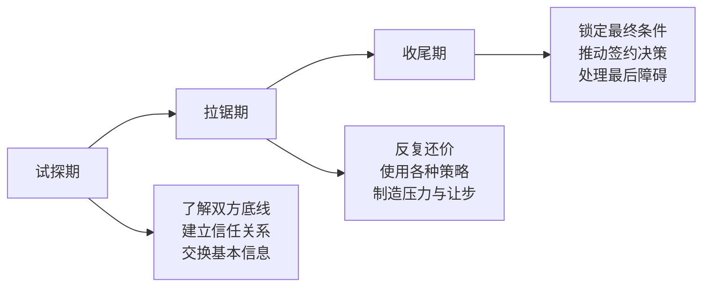
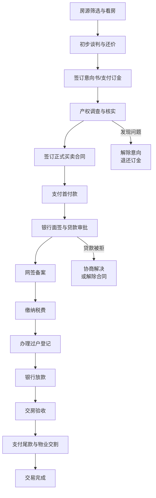

# 六、谈判与交易技巧

房地产交易的最终成交价，往往不是由市场均价决定的，而是由买卖双方在谈判桌上的博弈决定的。同一套房，谈判能力强的买家可能比市场价格低 8%-15% 拿下，而缺乏技巧的买家甚至会多付 5%-10%。谈判是房地产投资中"离钱最近"的环节——每一分议价都是净利润。

本章从谈判心理学、信息博弈、价格锚定、节奏控制、合同条款、交易流程、风险防范七个维度，系统讲解如何在房地产交易中争取最优条件。

---

## 1. 谈判前的信息准备

### 1.1 为什么要"未谈先算"

谈判的本质是信息不对称博弈。谁掌握的信息更多、更准确，谁就在谈判中占据主动。很多买家犯的最大错误是"还没做好功课就去谈价格"，结果被中介或卖家牵着鼻子走。

### 1.2 必须掌握的六类信息

| 信息类别 | 具体内容 | 获取渠道 |
|----------|----------|----------|
| **房源真实信息** | 产权性质、面积误差、抵押/查封状态、是否有租约 | 不动产登记中心查档 |
| **卖家动机** | 为什么卖？急不急？是否已买新房？资金链是否紧张？ | 中介沟通、看房时观察 |
| **市场可比数据** | 同小区/同地段近 6 个月成交均价、挂牌均价、成交周期 | 贝壳/链家成交记录、房管局备案价 |
| **房屋硬伤** | 采光、噪音、漏水、户型缺陷、楼层劣势 | 实地多时段看房、邻居走访 |
| **小区基本面** | 物业费、停车费、容积率、绿化率、业主群氛围 | 物业公司、业主论坛/群 |
| **政策环境** | 限购限贷政策、税费变化、学区划片调整 | 当地住建局、教育局公告 |

### 1.3 可比价格分析法（CMA）

可比市场分析（Comparative Market Analysis）是谈判中最有力的武器。具体做法：

**第一步：收集近期成交数据**

在贝壳找房、链家、安居客等平台，筛选同小区或相邻小区近 6 个月内的实际成交记录（注意是"成交价"而非"挂牌价"）。至少收集 5-8 条数据。

**第二步：建立对比表格**

```text
┌────────────┬────────┬────────┬────────┬────────┬────────┐
│ 对比维度    │ 目标房  │ 可比1   │ 可比2   │ 可比3   │ 可比4   │
├────────────┼────────┼────────┼────────┼────────┼────────┤
│ 面积(m²)    │ 89     │ 87     │ 92     │ 88     │ 91     │
│ 楼层        │ 18/33  │ 12/33  │ 25/33  │ 8/33   │ 20/33  │
│ 装修        │ 精装   │ 毛坯   │ 精装   │ 简装   │ 精装   │
│ 朝向        │ 南北   │ 南     │ 南北   │ 东     │ 南北   │
│ 成交价(万)   │ 待定   │ 285    │ 310    │ 265    │ 298    │
│ 成交单价    │ 待定   │ 32759  │ 33696  │ 30114  │ 32747  │
│ 成交时间    │ -      │ 1个月前 │ 2个月前 │ 4个月前 │ 3个月前 │
└────────────┴────────┴────────┴────────┴────────┴────────┘
```

**第三步：修正差异因素**

- 楼层差异：通常每高一层加 0.3%-0.5%，低楼层（1-3层）折价 3%-5%
- 装修差异：精装比毛坯溢价 5%-15%，简装溢价 2%-5%
- 朝向差异：南北通透溢价 5%-8%，纯西晒折价 3%-5%
- 时间差异：市场下行期每月折价 0.5%-1%，上行期每月加价 0.5%-1%

**第四步：得出合理价格区间**

经过修正后，你就能得出目标房产的合理市场价区间。这个区间就是你谈判的锚点。

---

## 2. 谈判心理学：理解对手

### 2.1 卖方心理画像

不同类型的卖家，其价格敏感度和让步空间完全不同：



### 2.2 判断卖家真实动机的方法

1. **看挂牌时长**：挂牌超过 3 个月未成交，说明价格偏高或房源有硬伤，卖家心态逐渐松动
2. **看调价记录**：频繁小幅降价（如每次降 2-3 万）说明卖家在试探市场，仍有降价空间
3. **问中介细节**："业主是什么原因卖房？""有没有其他买家在谈？""业主对付款方式有要求吗？"
4. **看房时观察**：房子是否已搬空（急售信号）、是否有多把钥匙在中介手里（急售信号）、装修是否有近期维护（不急卖信号）
5. **电话沟通**：通过中介转达一些"不合理"的还价，观察卖家的第一反应——愤怒说明还有空间，冷淡说明可能接近底线

### 2.3 中介的立场与利益

中介的核心利益是**尽快成交**，而不是帮买家压价或帮卖家抬价。理解这一点至关重要：

- 中介费通常按成交价的 1%-3% 收取，所以成交价越高佣金越高
- 但成交周期越长，中介的时间成本越大，所以他们也想快速促成交易
- 中介通常掌握卖家的真实底线，但不会直接告诉你
- 中介会通过"制造竞争"来推动你加价——"还有另一个买家也在谈"

**应对策略：**
- 与中介建立良好关系，但始终保持独立判断
- 多通过不同中介了解同一房源的信息（交叉验证）
- 不要在中介面前表现出对房源的强烈兴趣
- 适当给中介"甜头"：承诺成交后额外给红包，换取更多信息

---

## 3. 价格谈判的核心技巧

### 3.1 锚定效应：谁先出价谁就定调

行为经济学中的"锚定效应"在房地产谈判中极为显著。第一个出现的数字会成为后续谈判的参照点。

**卖家先出价（挂牌价）时的应对：**

- 如果挂牌价明显高于市场价，不要直接砍价，而是用 CMA 数据"重新锚定"
- 话术示例："我做了详细的市场分析，同小区近 6 个月的成交均价是 XX 万/平米，考虑到楼层和装修差异，我初步的评估价是 XX 万。"
- 关键：用数据说话，而不是用感觉说话

**买家先出价的策略：**

- 在买方市场或卖家急售时，可以主动先出价，把谈判锚点定在较低位置
- 先出价应该低于你的心理预期 5%-10%，留出还价空间
- 但不要低到离谱——过于离谱的报价会让卖家直接拒绝谈判

### 3.2 还价的节奏与幅度

还价不是一步到位的，而是一个逐步逼近的过程。节奏控制的核心原则是：**每次让步幅度递减**，向卖家传递"快到底线了"的信号。

```text
【还价节奏示例】

挂牌价：350万
买家心理价位：310万

第一轮报价：290万（低于心理价位 6.5%）
卖家还价：345万
买家加价：295万（+5万）
卖家还价：340万
买家加价：300万（+5万）
卖家还价：335万
买家加价：303万（+3万，幅度递减→信号：接近底线）
卖家还价：330万
买家加价：305万（+2万，继续递减）
卖家还价：320万
买家加价：308万（+3万，最后一步）
卖家还价：315万
买家：310万，双方折中 → 最终成交：312万
```

**关键技巧：**
- 每次加价幅度递减（5→5→3→2→2），让卖家感觉你在接近底线
- 每次加价都要给出理由（"考虑到装修需要翻新"、"楼层不太理想"）
- 不要每次卖家降价你就马上加价——适当的沉默和拖延能施加压力
- 在接近目标价时，可以用"凑整"心理："310 万，我今天就能下定"

### 3.3 非价格因素的运用

价格谈判不是唯一的战场。很多时候，非价格因素可以成为突破僵局的关键：

| 非价格筹码 | 对卖家的价值 | 使用场景 |
|-----------|------------|---------|
| 全款/高首付 | 资金回笼快，省去贷款审批风险 | 卖家急用钱时非常有效 |
| 灵活交房时间 | 可以配合卖家的搬迁计划 | 卖家置换、需要时间找新房 |
| 不追究房屋瑕疵 | 省去卖家维修/折价的麻烦 | 房屋有明显老化或小瑕疵 |
| 承担部分税费 | 减少卖家的交易成本 | 满五不唯一、税费较高的房源 |
| 快速过户 | 缩短交易周期 | 卖家有时间压力 |
| 保留部分家具家电 | 卖家省去搬运麻烦 | 卖家准备搬去外地或已买精装房 |

**示例话术：**

"价格上我们各退一步，312 万成交。我可以全款支付，两周内完成过户。另外房子现在的家具家电如果你们不方便搬走，我可以一并留下，省去你们的麻烦。"

### 3.4 应对常见谈判话术

**卖家/中介常用话术及应对：**

**话术一："已经有另一个买家出价 330 万了"**

- 分析：制造竞争压力是最常用的手段。很多情况下"另一个买家"并不存在或出价被夸大
- 应对："那很好，如果他们确实出 330 万，建议您尽快跟他们成交。我的出价是基于详细的市场分析得出的，我相信是合理的价格。"
- 核心：不被情绪驱动，用冷静回应打破施压

**话术二："这个价格业主绝对不会卖的"**

- 分析：中介在试探你的价格弹性，看你能加多少
- 应对："我理解业主的心理预期，但市场数据摆在那里。您可以把我的报价转给业主，我们都不急，看看业主的想法。"
- 核心：不要因为"绝对"就放弃还价

**话术三："这个房子很抢手，今天不定可能就没了"**

- 分析：制造紧迫感，迫使你仓促决策
- 应对："好房子我认可，但买房是大事，我需要综合考虑。如果真有其他买家要买，那说明这个房子确实好，我也替业主高兴。"
- 核心：越被催促越要冷静

**话术四："这个价格已经是业主的底线了"**

- 分析：底线通常是动态的，尤其是在挂牌时间较长的情况下
- 应对："我能感受到业主的诚意。这样吧，我在价格上再加 2 万，但希望业主在付款方式上能配合我做贷款，大家各让一步。"
- 核心：换一个维度继续谈判

---

## 4. 谈判的节奏控制

### 4.1 谈判的三个阶段



### 4.2 试探期：建立信息优势

试探期的核心目标是**尽可能多地了解卖家的情况**，同时**隐藏自己的真实意图和底线**。

**应该做的事：**
- 多次看房，每次看房时与中介聊天，收集卖家信息
- 提出各种问题试探卖家反应："这个价格含不含车位？""家电留不留？""最快什么时候能交房？"
- 表达兴趣但不表达急切："这个房子还不错，我在对比几个小区"

**不应该做的事：**
- 不要在第一次看房时就出价
- 不要暴露你的预算上限
- 不要说"这个房子太完美了"之类的话
- 不要在卖家面前讨论你的投资计划

### 4.3 拉锯期：消耗对方意志

拉锯期是最考验耐心的阶段。核心策略是**用时间消耗卖家的意志**，同时**保持自己的情绪稳定**。

**有效策略：**

1. **拖延战术**：收到卖家报价后不要立刻回复，间隔 1-3 天再还价。拖延会让急售型卖家焦虑，从而加快让步
2. **分项谈判**：不要只谈总价，把价格拆分为多个部分分别讨论——房价、车位、家具家电、维修基金、物业费结清等
3. **条件交换**：每次让步都要求对方回应——"我可以在价格上加 2 万，但希望业主承担个税"
4. **适时沉默**：当谈判陷入僵局时，主动沉默 2-3 天。很多时候沉默本身就是压力

### 4.4 收尾期：锁定交易

当价格接近双方心理预期时，进入收尾期。这个阶段的关键是**快速推进，防止变卦**。

**收尾技巧：**

1. **"最后一步"法**："这是我们最后的让步了，312 万全款，两周过户。如果业主同意，我们明天就签合同。"
2. **"拆分差额"法**：双方差距 5 万时，提议各让一半——"我们都再让 2.5 万，312.5 万成交。"
3. **"打包成交"法**：把所有条件打包成一个方案——"总价 310 万，我承担个税，全款 15 天过户，家具家电全部留下。"
4. **"时间压力"法**："我下周还有两套房要看，如果这套今天能定，我就不去看了。"
5. **"定金锁定"法**：条件谈好后立即支付定金（通常 5-10 万），用法律约束力锁定交易

---

## 5. 合同条款谈判

### 5.1 买卖合同中的关键条款

价格谈妥只是第一步，合同条款中的细节同样关系到你的切身利益。以下是必须重点关注的条款：

**（1）付款方式与时间节点**

```text
典型付款安排（贷款购房）：

签约日    → 支付定金（5-10万）
网签后5日  → 支付首付款（扣除已付定金）
贷款审批后 → 银行放款至卖方账户
过户当日   → 支付尾款（如有）

关键要点：
- 首付款的支付时间要留足贷款审批的缓冲期
- 尾款比例建议保留 5%-10%，待交房验收后支付
- 约定银行放款超期的处理方式
```

**（2）交房标准与验收**

合同中必须明确约定：
- 交房时房屋的状态（保持现状/清空/保留哪些家具家电）
- 水电气暖物业费的结算截止日期
- 房屋内设施设备的清单和完好状态
- 验收不合格时的处理方式（维修/折价/解除合同）

**（3）违约责任**

这是保护买方权益最重要的条款：
- 卖方违约（不卖了/涨价/拖延过户）：双倍返还定金 + 违约金（建议为房价的 10%-20%）
- 买方违约（不买了）：定金不退
- 贷款未获批的处理方式：约定解约条件，全额退还已付款项
- 逾期交房/逾期付款的违约金：建议按日计算，每日万分之五

**（4）户口迁移**

- 约定卖方必须在过户后 XX 日内迁出所有户口
- 预留户口保证金（建议 3-5 万），待户口迁出后支付
- 约定逾期未迁户口的违约金（按日计算）

### 5.2 补充协议的妙用

买卖合同是标准格式，很多细节需要通过补充协议来约定。以下是一些实用的补充协议条款：

**"无凶宅保证"条款**

> 甲方保证该房屋在持有期间未发生过非正常死亡事件。如甲方违反此保证，乙方有权解除合同，甲方应全额退还已收款项并赔偿乙方因此遭受的一切损失（包括但不限于装修费、搬家费、房价差价损失）。

**"无重大瑕疵披露"条款**

> 甲方保证已如实披露该房屋的所有已知瑕疵，包括但不限于：结构性裂缝、渗水漏水、白蚁侵害、噪音源（如临近变电站/垃圾站/高架桥）等。如甲方隐瞒上述瑕疵，乙方有权要求甲方承担维修费用或相应折价。

**"学位占用"条款（学区房专用）**

> 甲方保证该房屋对应的学位名额未被占用，且自过户之日起 XX 年内不会被占用。如学位已被占用或在约定期限内被占用，甲方应赔偿乙方学位损失 XX 万元。

### 5.3 定金与订金的区别

这两个词一字之差，法律含义天差地别：

| 对比项 | 定金 | 订金 |
|--------|------|------|
| 法律性质 | 担保方式，受《民法典》约束 | 预付款性质，无明确法律规定 |
| 买方违约 | 定金不退 | 应当退还（可能扣除合理费用） |
| 卖方违约 | 双倍返还定金 | 原额退还 |
| 金额限制 | 不超过合同标的额的 20% | 无限制 |
| 适用场景 | 正式签约后的担保 | 意向金、诚意金 |

**实操建议：** 在签订正式合同前支付的钱叫"订金"（意向金），签订合同时支付的钱叫"定金"。不要在还没有签合同的时候就支付"定金"。

---

## 6. 交易全流程与风险控制

### 6.1 二手房交易全流程



### 6.2 产权调查清单

在签订正式合同前，必须完成以下产权调查：

**到不动产登记中心查档，确认：**

- [ ] 产权人与卖方身份一致（防止无权处分）
- [ ] 房屋面积与证载面积一致
- [ ] 产权性质（商品房/经济适用房/房改房/小产权）
- [ ] 是否存在抵押（如有抵押，约定解押时间和方式）
- [ ] 是否存在查封（查封房绝对不能买）
- [ ] 是否存在异议登记
- [ ] 共有权人是否全部同意出售（夫妻共有房产需要双方签字）
- [ ] 土地使用年限及到期处理方式

**额外调查：**

- [ ] 是否有租约（买卖不破租赁，租客有优先购买权）
- [ ] 是否有户口挂靠（影响你的落户）
- [ ] 学位是否被占用（学区房必须查）
- [ ] 物业费/水电费是否有欠缴
- [ ] 是否在拆迁范围内（可能有额外补偿）

### 6.3 税费测算

二手房交易涉及的税费直接影响你的实际成本，必须在谈判前就测算清楚：

| 税费项目 | 承担方 | 标准 | 备注 |
|----------|--------|------|------|
| 契税 | 买方 | 首套90㎡以下1%；首套90㎡以上1.5%；二套3% | 以家庭为单位认定 |
| 增值税 | 卖方（常转嫁给买方） | 满2年免征；不满2年全额5.3% | 以契税票或产权证日期为准 |
| 个人所得税 | 卖方（常转嫁给买方） | 满五唯一免征；否则差额20%或全额1% | "满五唯一"是最优条件 |
| 中介费 | 双方各付 | 成交价的 1%-3% | 可以谈，通常可以打7折 |
| 评估费 | 买方 | 评估价的 0.1%-0.5% | 贷款时需要 |
| 贷款服务费 | 买方 | 1000-3000元 | 部分银行不收 |
| 权属登记费 | 买方 | 80元/套 | 固定费用 |

**税费谈判技巧：**

"满五唯一"的房源在税费上有巨大优势。如果房源不是"满五唯一"，可以将税费差额作为还价依据：

"这套房不是满五唯一，多出来的个税大约 3 万块，这部分应该在房价里体现。我的报价 290 万已经考虑了这个因素。"

### 6.4 资金安全

二手房交易中最大的风险之一是资金安全。常见的资金风险包括：

**风险一：卖方收到首付款后携款消失**

- 防范：首付款通过资金监管账户支付，不直接转给卖方个人账户
- 防范：首付款支付与网签备案同步进行

**风险二：贷款审批不通过，首付已付**

- 防范：合同中约定"贷款未获批可解除合同，全额退款"
- 防范：在签约前先做贷款预审，确认自己的贷款资质

**风险三：过户前房屋被查封**

- 防范：过户前再次查询产权状态
- 防范：合同中约定"如过户前房屋被查封，卖方应双倍返还定金"

**资金监管方案：**

```text
推荐的资金支付路径：

定金（5-10万） → 直接支付给卖方（签收据）
首付款（扣除定金） → 存入银行资金监管账户
银行贷款 → 直接打入资金监管账户
尾款（5%-10%） → 交房验收后支付

资金监管账户在过户完成后自动解冻，
将款项划转给卖方。
```

---

## 7. 不同场景的谈判策略

### 7.1 新房谈判

很多人认为新房是开发商定价，没有谈判空间。实际上，新房同样有议价空间，尤其是以下情况：

- **尾盘房源**：开发商清盘时愿意给更大折扣
- **特价房/工抵房**：开发商用于抵扣工程款的房源，价格通常低于市场价 10%-20%
- **开盘初期**：为了营造热销氛围，开发商有时会给首批客户内部折扣
- **团购买房**：组织多人一起购买，可以争取额外折扣

**新房谈判话术：**

"我是刚需自住，对比了周边几个楼盘，你们这个盘我比较认可，但价格确实超出了我的预算。如果能给到 XX 的折扣，我今天就可以交定金。"

### 7.2 法拍房谈判

法拍房的"谈判"不在拍卖现场，而在拍卖前的尽职调查：

- 实地看房（部分法拍房可以预约看样）
- 查询是否有长期租约（买卖不破租赁）
- 查询是否有户口挂靠（法拍房不负责迁户口）
- 了解是否存在占用（有人住着不搬走）
- 计算全部税费（法拍房的税费通常由买方承担）

### 7.3 跨城市远程谈判

如果你在异地投资房产，远程谈判需要额外注意：

- 委托当地可信赖的中介或朋友代为看房和初步谈判
- 视频看房时要求中介展示所有房间、窗外景观、楼道、小区环境
- 合同签署可以委托公证（需要提前办理委托公证书）
- 资金走监管账户，不走个人转账

---

## 8. 谈判中的常见误区

### 误区一：只关注单价，忽略总价

很多买家只盯着"每平米降了多少"，却忽略了车位费、物业费、维修基金、装修成本等隐性支出。谈判的目标是最优总成本，而不只是最低单价。

### 误区二：第一次报价就出底价

一次性把价格压到最低，看似高效，实际上：
- 卖家直接拒绝，失去谈判机会
- 即使成交，卖家可能在后续环节（交房标准、家具家电）找回差价
- 没有还价空间，谈判没有缓冲地带

### 误区三：被情绪绑架

"这套房子我太喜欢了"——这种心态是谈判中的致命弱点。一旦卖家或中介感知到你的强烈购买欲望，你的还价空间就会急剧缩小。

**正确心态：** 任何时候都要做好"谈崩"的准备。市场上永远有下一套房子，但你的钱赚起来不容易。

### 误区四：忽略合同细节

很多买家在价格谈判上花费大量精力，却对合同条款草草签字。合同中的违约责任、交房标准、户口迁移、贷款风险等条款，任何一个出问题都可能让你付出远超"省下来"的代价。

### 误区五：不保留谈判记录

所有的口头承诺都不具有法律效力。谈判过程中达成的每一项共识，都应该落实到书面（合同或补充协议）。微信聊天记录可以作为辅助证据，但不能替代正式合同。

### 误区六：只通过一个中介谈判

同一套房源可能挂在多家中介。不同中介对卖家的了解程度不同，佣金折扣也不同。通过多个中介了解情况，选择信息最透明、服务最好的中介来推进交易。

---

## 9. 进阶技巧

### 9.1 反向谈判：主动制造选择

高阶买家不是在一套房子上死磕，而是同时推进 2-3 套房源的谈判。当你手握多个备选方案时，你的谈判地位会显著提升：

"张经理，我这边同时在看 XX 小区的另一套房，两套条件差不多，谁先给到我的目标价我就定谁。"

这种策略的前提是你确实有备选方案，而不是虚张声势。

### 9.2 利用市场周期

- **买方市场（供大于求）**：大胆还价，卖家有库存压力，通常愿意让步 10%-15%
- **卖方市场（供不应求）**：减少价格谈判力度，重点争取非价格条件
- **政策调控期**：限购限贷政策出台后的 1-3 个月是谈判黄金期，市场观望情绪浓厚
- **年底（11-12月）**：部分卖家为了在年底前完成交易（如还贷、纳税），谈判空间更大

### 9.3 建立长期关系网络

真正的房产投资高手不是每次都从零开始谈判，而是通过长期积累建立起自己的关系网络：

- **固定合作的中介**：2-3 个信任的中介，会在好房源出来的第一时间通知你
- **银行信贷经理**：贷款审批更快，额度更高
- **律师/法务顾问**：合同审核、纠纷处理的专业支持
- **装修团队**：快速评估翻新成本，为还价提供依据

### 9.4 谈判复盘

每次谈判（无论成交与否）都值得复盘：

```text
谈判复盘模板：

1. 房源基本信息：小区、面积、楼层、挂牌价
2. 我的出价 vs 最终结果
3. 卖家的类型和动机判断是否准确？
4. 哪些策略起了作用？哪些没有？
5. 我在哪个环节让步过多？
6. 如果重来一次，我会怎么做？
7. 从这次谈判中学到了什么？
```

---

## 10. 实操案例

### 案例：如何用数据谈判省下 22 万

**背景：** 某二线城市，一套 89㎡两居室，挂牌价 320 万，业主置换新房，已挂牌 2 个月。

**第一步：信息收集**

通过贝壳找房收集同小区近 6 个月成交数据：

- 同户型（89㎡两居）平均成交价：295 万
- 最近一套成交（1 个月前，中楼层精装）：302 万
- 目标房源特点：低楼层（3/18），西晒，装修老旧需要翻新

**第二步：建立谈判策略**

- 合理市场价区间：285-295 万（低楼层折价、西晒折价、装修翻新成本）
- 第一轮报价：275 万（低于合理价 10 万，留出空间）
- 心理底线：295 万
- 非价格筹码：全款、灵活交房

**第三步：谈判过程**

- **第一轮**：报价 275 万，卖家拒绝，中介说"差距太大"
- **第二轮**（3天后）：加到 282 万，说明理由——"低楼层和西晒影响居住体验，装修至少要花 15 万"
- **第三轮**（5天后）：卖家还价 310 万，我加到 286 万——"同小区上个月同户型成交才 302 万，那个还是中楼层精装，我这个条件明显不如"
- **第四轮**（4天后）：卖家还价 305 万，我坚持 288 万——"我可以全款，两周过户，帮业主省去贷款等待的时间"
- **第五轮**（1周后）：中介反馈卖家急着买新房，愿意降价。最终以 298 万成交，我承担个税（约 3 万）

**最终成本：** 298 万（房价）+ 3 万（个税）= 301 万
**相比挂牌价节省：** 320 万 - 301 万 = 19 万（加上个税部分实际总成本优势约 22 万）

---

## 总结

房地产谈判是一项综合能力，涉及信息收集、心理博弈、价格分析、节奏控制、法律知识等多个维度。掌握以下核心原则：

1. **信息为王**：谈判前做好充分的信息准备，用数据说话
2. **理解对手**：判断卖家类型和动机，对症下药
3. **节奏控制**：不急不躁，用时间和耐心换取空间
4. **非价格筹码**：付款方式、交房时间、税费承担都可以成为谈判工具
5. **合同细节**：价格谈好只是一半，合同条款同样重要
6. **保持理性**：任何时候都要做好"不买"的准备
7. **持续复盘**：每次谈判都是学习机会

谈判能力不是天生的，而是通过一次次实战磨炼出来的。从下一次看房开始，就有意识地运用这些技巧，你会发现自己的议价能力在不断提升。
