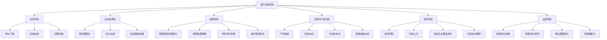
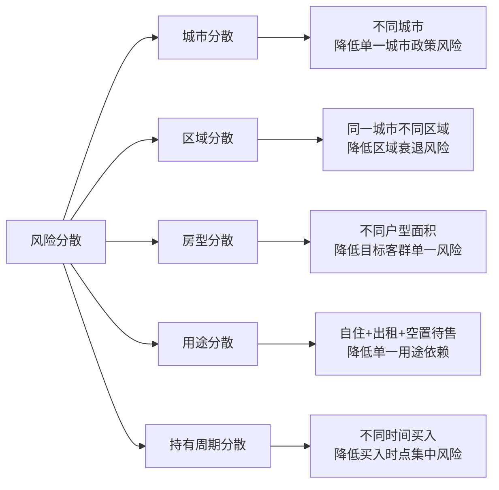

## 七、房产投资的风险管理

房地产投资是普通人一生中最大的单笔财务决策，一套房产动辄几十万到数百万，贷款周期长达20-30年。与股票、基金等金融资产不同，房产投资的风险具有**高杠杆、低流动性、长周期、政策敏感**四大特征。一次风险管理失误，可能导致数年甚至数十年的财务困境。

风险管理不是"买了保险就万事大吉"，而是一套贯穿**投前评估、交易执行、持有运营、退出变现**全生命周期的系统工程。本节从风险识别与分类、风险评估框架、六大核心风险的应对策略、组合层面的风险管理、风险监控与应急预案五个维度，系统讲解房产投资的风险管理体系。

---

### 1. 房产投资风险的全景图谱

#### 1.1 风险的本质：不确定性 × 暴露程度

风险 = 不确定性发生的概率 × 一旦发生造成的损失暴露

理解这个公式是风险管理的起点。有些风险概率低但损失巨大（如产权纠纷导致房产被收回），有些风险概率高但损失可控（如租金季节性波动）。风险管理的核心是：**优先处理那些"概率×损失"乘积最大的风险**。

#### 1.2 六大核心风险分类



#### 1.3 风险的生命周期分布

不同阶段面临的风险重点不同：

| 投资阶段 | 主要风险 | 发生概率 | 潜在损失 |
|----------|----------|----------|----------|
| **选房阶段** | 区域判断失误、房屋质量缺陷、信息不对称 | 中 | 高（影响长期收益） |
| **交易阶段** | 产权纠纷、合同陷阱、资金安全 | 低 | 极高（可能血本无归） |
| **持有前期**（0-2年） | 断供、租金不及预期、政策突变 | 中 | 高 |
| **持有中期**（2-10年） | 房屋老化、区域变化、利率波动 | 中 | 中 |
| **持有后期**（10年+） | 房屋贬值、流动性枯竭、维修成本激增 | 高 | 中 |
| **退出阶段** | 折价出售、税费侵蚀、交易失败 | 中 | 中 |

---

### 2. 风险评估框架：投资前的"体检"

#### 2.1 个人风险承受能力评估

在做任何房产投资决策之前，首先要评估自己的风险承受能力。这不是一个模糊的概念，而是可以量化计算的。

**财务安全线计算：**

```text
安全月供上限 = 家庭月收入 × 40% - 现有负债月供

应急储备金 = 家庭月支出 × 6（至少覆盖6个月）

可动用投资资金 = 总资产 - 应急储备金 - 已有负债 - 预留装修/税费

杠杆安全比 = 房产贷款总额 / 家庭年收入

  → < 5：安全区间
  → 5-8：警戒区间，需要稳定的租金收入补充
  → > 8：高危区间，一旦收入下降将面临断供
```

**风险承受能力评估表：**

| 评估维度 | 低风险承受（保守型） | 中风险承受（稳健型） | 高风险承受（进取型） |
|----------|---------------------|---------------------|---------------------|
| 收入稳定性 | 自由职业/不稳定 | 企业中层/稳定 | 公务员/事业编/企业高管 |
| 年龄阶段 | 临近退休（50+） | 中年（35-50） | 青年（25-35） |
| 家庭负担 | 多子女/赡养老人 | 一孩家庭 | 单身/无子女 |
| 已有负债 | 高（信用卡/消费贷） | 中（已有房贷） | 低（无负债） |
| 投资经验 | 无房产投资经验 | 有1-2套经验 | 多套房产投资经验 |
| 现金储备 | < 6个月月供 | 6-12个月月供 | > 12个月月供 |
| **建议最大杠杆** | **首付≥50%** | **首付30%-50%** | **首付20%-30%** |

#### 2.2 单套房产的风险评估清单

在决定购买某套具体房产之前，用以下清单逐一排查风险：

**产权风险排查：**

- [ ] 到不动产登记中心查档，确认产权清晰、无抵押/查封
- [ ] 确认产权人与卖方一致，共有权人全部同意出售
- [ ] 确认产权性质（商品房/经适房/房改房/小产权），不同性质交易限制不同
- [ ] 确认土地使用年限及到期处理方式
- [ ] 查询是否有租约（买卖不破租赁）
- [ ] 查询户口挂靠情况（影响落户和学区）
- [ ] 学区房需确认学位是否被占用

**物理风险排查：**

- [ ] 多时段看房（上午、下午、晚上各一次），评估采光和噪音
- [ ] 检查是否有结构性裂缝（尤其是承重墙和楼板）
- [ ] 检查厨卫防水（要求查看楼下天花板是否有渗水痕迹）
- [ ] 检查门窗密封性和老化程度
- [ ] 了解小区物业管理水平和业主满意度
- [ ] 查询房屋是否发生过非正常死亡事件（凶宅）
- [ ] 了解周边是否有嫌恶设施（垃圾站、变电站、高架桥、化工厂）

**市场风险排查：**

- [ ] 查询同小区近6个月的真实成交价（非挂牌价）
- [ ] 了解区域未来3-5年的规划（地铁、商业、学校）
- [ ] 评估区域人口流入/流出趋势
- [ ] 了解当地库存去化周期（>18个月为高库存警戒线）
- [ ] 评估租金水平和空置率

#### 2.3 风险评分矩阵

将上述排查结果转化为量化评分，辅助决策：

```text
风险评分 = Σ (风险因素权重 × 严重程度得分)

严重程度得分：1=极低风险, 2=低风险, 3=中等风险, 4=高风险, 5=极高风险

权重分配（可根据个人情况调整）：
- 产权风险：权重 25%（出问题可能血本无归）
- 财务风险：权重 25%（直接影响生存）
- 市场风险：权重 20%（影响收益）
- 物理风险：权重 15%（影响居住和租金）
- 政策风险：权重 10%（不可控但可预判）
- 运营风险：权重 5%（可管理）

总评分解读：
- 1.0-2.0：低风险，可以投资
- 2.0-3.0：中等风险，需要针对性风控措施
- 3.0-4.0：高风险，建议放弃或大幅压价
- 4.0-5.0：极高风险，坚决不投
```

---

### 3. 市场风险的识别与应对

#### 3.1 房价下跌的三种模式

房价下跌不是单一形态，不同下跌模式的应对策略完全不同：

| 下跌模式 | 特征 | 持续时间 | 历史案例 | 应对策略 |
|----------|------|----------|----------|----------|
| **周期性调整** | 10%-20%的正常回调 | 1-3年 | 2014年全国性调整、2022-2024年调整 | 持有不动，等待恢复 |
| **结构性下跌** | 特定区域/类型永久性价值重估 | 5年+ | 三四线城市去库存、商办过剩 | 尽早止损退出 |
| **系统性崩盘** | 全面暴跌，成交量枯竭 | 5-10年 | 日本1990年代（跌幅60%-70%） | 极端情况，保留现金流生存 |

#### 3.2 区域衰退的预警信号

区域衰退往往不是突然发生的，而是有一系列可观察的先行指标：

**一级预警信号（出现1个就要警惕）：**

- 大型商业体关闭或长期空置
- 优质学校搬迁或合并
- 主要产业/企业大规模裁员或迁出
- 区域人口连续2年净流出

**二级预警信号（出现2个以上建议考虑退出）：**

- 新房成交量持续下降，库存去化周期超过24个月
- 二手房挂牌量激增但成交周期大幅延长（超过6个月）
- 租金连续2年下降
- 物业服务质量明显下降，业主投诉增多
- 周边在建项目停工烂尾

**三级预警信号（出现1个就要果断行动）：**

- 区域规划的重大利好被取消（如地铁线路被砍、商业中心易址）
- 区域出现重大负面事件（如工厂爆炸、严重污染曝光）
- 地方政府财政严重困难，公共服务缩水

#### 3.3 市场风险的应对策略

**策略一：买在价值洼地，留足安全边际**

不要追涨买入。在市场情绪亢奋时入场，本身就承担了极高的市场风险。正确的做法是：在市场调整期、成交量低迷时买入优质资产。安全边际至少要有20%——即你评估的合理价值是100万，买入价不超过80万。

**策略二：选择有长期需求支撑的区域**

人口持续流入的城市和区域，即使短期调整，长期也有回升动力。关注以下指标：
- 城市近5年常住人口增长率（>1%为正向）
- 城市产业结构（多元化优于单一产业）
- 高校毕业生留存率（反映城市吸引力）
- 轨道交通规划密度

**策略三：不要把所有鸡蛋放在一个篮子里**

即使只投资房产，也要在不同城市、不同区域、不同房型之间分散。具体建议：
- 同一城市持有不超过2套
- 同一区域持有不超过1套
- 住宅和商办（如有）不超过总投资的30%
- 房产投资总额不超过家庭总资产的70%

---

### 4. 流动性风险的识别与应对

#### 4.1 房产的流动性真相

房产是典型的**低流动性资产**。与股票可以在几秒钟内卖出不同，一套房产从挂牌到成交的平均周期：

| 城市等级 | 市场正常时 | 市场低迷时 | 急售折价幅度 |
|----------|-----------|-----------|-------------|
| 一线核心区 | 1-3个月 | 3-6个月 | 5%-10% |
| 一线远郊 | 2-4个月 | 6-12个月 | 10%-15% |
| 二线核心区 | 2-4个月 | 4-8个月 | 8%-12% |
| 三四线城市 | 3-6个月 | 6-18个月 | 15%-25% |
| 商办/公寓 | 3-12个月 | 12-36个月 | 20%-30% |

这些数据意味着：如果你急需用钱（失业、疾病、债务到期），房产可能无法在你需要的时间内变现，或者必须大幅折价才能快速出手。

#### 4.2 流动性风险的量化评估

在投资房产前，用以下指标评估流动性风险：

```text
流动性风险得分 = 城市等级系数 × 房型系数 × 挂牌竞争系数

城市等级系数：
  一线核心区 = 1.0, 一线远郊 = 1.3, 二线核心区 = 1.2
  二线远郊 = 1.5, 三四线 = 2.0

房型系数：
  住宅70-120㎡主流户型 = 1.0, 住宅>150㎡大户型 = 1.3
  住宅<50㎡超小户型 = 1.2, 商办/公寓 = 2.0, 别墅 = 1.8

挂牌竞争系数：
  同小区挂牌率 < 3% = 0.8, 3%-5% = 1.0, 5%-10% = 1.3, >10% = 1.8

得分解读：
  < 1.2：流动性好，变现压力小
  1.2-2.0：流动性一般，急售需要折价
  2.0-3.0：流动性差，变现困难
  > 3.0：流动性极差，可能长期无法变现
```

#### 4.3 流动性风险管理策略

**策略一：保持"可售状态"**

即使不打算卖房，也要保持房产处于随时可售的状态：
- 保持房产证原件妥善保管
- 确保产权清晰无纠纷（如有抵押，了解解押流程和时间）
- 房屋保持基本维护状态，不要过度个性化装修
- 了解当前市场行情，心中有底价

**策略二：建立"流动性缓冲池"**

流动性风险的本质是"需要用钱时拿不出来"。解决方案是在房产投资组合之外保持足够的流动资产：

```text
流动性缓冲池 = 所有房产月供总额 × 12 + 预期大额支出

具体构成：
- 现金/货币基金：覆盖6个月月供
- 短期理财（3个月到期）：覆盖6个月月供
- 可快速变现的金融资产（股票/基金）：额外储备
```

**策略三：避免"流动性陷阱"资产**

以下房产类型流动性极差，投资时需要特别谨慎：

- **商办物业**：交易税费高（综合税率可达30%+）、贷款条件差（首付50%、利率上浮）、转手困难
- **小产权房**：无法合法交易，只能私下转让
- **旅游地产**：季节性需求、空置率高、接盘侠少
- **超大户型**（200㎡以上）：受众面窄，成交周期长
- **远郊新区未成熟区域**：配套不完善，入住率低，转手困难
- **老破小（无学区加持）**：银行评估价低，贷款额度受限

---

### 5. 政策风险的识别与应对

#### 5.1 影响房产投资的关键政策

中国房地产市场是政策驱动型市场，政策变化可以迅速改变投资环境：

| 政策类型 | 变化方向 | 对投资者的影响 | 历史案例 |
|----------|----------|---------------|----------|
| **限购政策** | 放松/收紧 | 直接影响购买资格和需求量 | 2023年多地取消限购 |
| **限贷政策** | 放松/收紧 | 影响首付比例和贷款额度 | 2023年"认房不认贷" |
| **利率政策** | 上升/下降 | 影响月供成本和购买力 | 2024年LPR多次下调 |
| **税费政策** | 增加/减免 | 影响交易成本和持有成本 | 增值税免征年限调整 |
| **学区政策** | 多校划片/就近入学 | 影响学区房价值 | 北京多校划片改革 |
| **城市规划** | 利好/利空 | 影响区域长期价值 | 地铁线路规划变更 |
| **土地政策** | 供应增加/减少 | 影响未来供需格局 | 集中供地制度 |
| **租赁政策** | 鼓励/限制 | 影响租金收益和运营模式 | 长租公寓监管加强 |

#### 5.2 政策风险的预判方法

政策变化看似不可预测，但实际上有规律可循：

**宏观层面的政策信号：**

1. **经济下行期**：政策倾向于放松限购限贷、降低利率、减免税费，刺激房地产市场
2. **经济过热期**：政策倾向于收紧调控、提高利率、增加限购条件，抑制投机
3. **政治周期**：重大会议前后（如两会、中央经济工作会议）通常是政策密集出台期
4. **舆论风向**：官方媒体对房地产的表态（"房住不炒"vs"支持合理住房需求"）是重要信号

**地方层面的政策信号：**

1. 土地出让金收入大幅下降 → 地方政府有动力放松调控
2. 库存去化周期超过18个月 → 大概率出台去库存政策
3. 房企暴雷事件频发 → 监管可能出手稳定市场
4. 人口持续流出 → 政策难以逆转基本面

#### 5.3 政策风险的应对策略

**策略一：不要赌政策**

政策变化是外生变量，个人无法控制。投资决策不应建立在"政策会放松"或"政策会收紧"的预期上。应该选择在**任何政策环境下都能自洽**的投资标的。

**策略二：关注政策趋势而非单次政策**

单次政策的影响是短期的，趋势性政策的影响是长期的。例如：
- "房住不炒"是长期基调，意味着投资性需求的政策红利在减少
- "租购并举"是长期趋势，意味着租赁市场的政策环境在改善
- "新型城镇化"是长期方向，意味着核心城市群的人口聚集效应会持续

**策略三：选择政策风险最小的投资方式**

| 投资方式 | 政策风险等级 | 原因 |
|----------|-------------|------|
| 核心城市刚需住宅 | 低 | 政策始终支持刚需 |
| 核心城市改善住宅 | 中低 | "认房不认贷"等政策利好 |
| 学区房 | 高 | 学区划片政策随时可能变化 |
| 商办物业 | 高 | 政策支持力度弱，税费政策不利 |
| 三四线城市投资房 | 高 | 人口流出趋势下政策难以逆转 |
| 法拍房 | 中 | 涉及司法程序，政策变化影响有限 |

---

### 6. 法律与产权风险的防范

#### 6.1 产权风险的常见类型

产权风险是房产投资中**破坏力最大**的风险类型，一旦发生，可能导致房产完全丧失或陷入长期诉讼。

**类型一：产权不清晰**

- 卖方并非真实产权人（代理人伪造委托书）
- 夫妻共有房产，一方擅自出售
- 继承房产，继承人之间存在争议
- 开发商一房多卖

**类型二：产权负担**

- 房产已抵押给银行或个人（未解押前无法过户）
- 房产被法院查封（可能涉及卖方的债务纠纷）
- 房产存在异议登记（第三方对产权提出异议）
- 房产存在长期租约（买卖不破租赁，租客有优先购买权）

**类型三：产权性质特殊**

- 经济适用房：交易受限（通常需满5年），需补缴土地出让金
- 房改房：可能需要原单位同意，部分产权可能属于单位
- 小产权房：不受法律保护，无法合法交易和过户
- 军产房：交易需要军队审批，限制多

#### 6.2 合同风险的防范

**必须在合同中明确约定的条款：**

```text
1. 房屋基本信息
   - 地址、面积、产权证号、产权性质
   - 与产权证一致，不得有误差

2. 价格与付款
   - 成交总价（大写+小写）
   - 付款方式和时间节点（定金、首付、贷款、尾款）
   - 资金监管方式

3. 过户与交房
   - 过户时间（签约后XX个工作日内）
   - 交房时间（过户后XX日内）
   - 交房标准（现状/清空/保留哪些物品）

4. 违约责任
   - 卖方违约：双倍返还定金 + 违约金（建议房价10%-20%）
   - 买方违约：定金不退
   - 逾期过户/交房的违约金（按日计算，建议每日万分之五）
   - 贷款未获批的处理方式

5. 特殊约定
   - 无凶宅保证
   - 无重大瑕疵披露
   - 学位未被占用（学区房）
   - 户口迁出时间和保证金
   - 物业费、水电费结清
```

#### 6.3 租赁相关的法律风险

以租养贷或专门做租房投资时，需要了解以下法律风险：

**租客权益保护：** 根据《民法典》，租赁合同期间，房东不能随意涨租、不能无正当理由提前解约、不能限制租客的正常使用权利。合同期满前解除合同，通常需要赔偿租客1-2个月租金。

**租赁备案义务：** 出租房屋应当到当地住建部门备案登记。未备案的租赁合同在发生纠纷时可能面临举证困难。部分地区对未备案的房东有行政处罚。

**群租与改造风险：** 将一套房隔成多间出租（群租）在多数城市受到限制。违规群租可能面临行政处罚，且一旦发生安全事故，房东需承担主要责任。

**租金贷风险：** 如果通过长租公寓平台出租，需警惕平台使用"租金贷"模式——平台一次性收取租客全年租金（通过贷款），但按月支付给房东。一旦平台暴雷，房东可能面临租金断付但无法收回房屋的困境（因为租客已经付了全年租金）。

---

### 7. 财务风险的管控

#### 7.1 断供风险的预防与应对

断供是房产投资中最严重的财务风险。一旦断供，后果包括：

- 征信记录严重受损（影响未来5年的贷款和信用卡申请）
- 银行起诉，房产被法院拍卖（通常以市场价的70%-80%起拍）
- 拍卖所得不足以偿还贷款的部分，仍需偿还（银行可以继续追偿）
- 法律诉讼费用由借款人承担

**断供的预防机制：**

```text
"三层防线"模型：

第一层：收入防线
  → 月供 ≤ 家庭月收入的 40%
  → 两套及以上房产，月供总额 ≤ 家庭月收入的 50%

第二层：现金流防线
  → 保持 6 个月所有月供总额的现金储备
  → 每套出租房产的空置期按 2 个月/年计算

第三层：退出防线
  → 每套房产的"止损价"（低于此价出售仍有正净值）
  → 确保在需要时能在 3 个月内以止损价变现
```

**如果已经面临断供风险：**

1. **立即与银行沟通**：申请延期还款（部分银行支持最长6个月的宽限期）
2. **调整还款方式**：从等额本金改为等额本息，降低月供
3. **申请延长贷款年限**：将20年延长至30年，降低月供
4. **主动出售房产**：在断供前主动出售，保住征信记录和部分资产
5. **切勿以贷养贷**：不要用消费贷、信用卡套现来还房贷，这只会加速债务恶化

#### 7.2 利率上升的风险管理

虽然当前中国处于低利率环境，但20-30年的贷款周期中，利率可能经历多轮升降。

**利率上升的影响测算：**

```text
假设贷款100万，等额本息，30年：

利率3.0%时：月供 4,216元，总利息 51.8万
利率3.5%时：月供 4,490元，总利息 61.6万
利率4.0%时：月供 4,774元，总利息 71.9万
利率4.5%时：月供 5,067元，总利息 82.4万
利率5.0%时：月供 5,368元，总利息 93.3万

利率从3.0%上升到5.0%：
  月供增加 1,152元/月（+27%）
  总利息增加 41.5万（+80%）
```

**应对策略：**

- 在利率低位时尽量选择固定利率（如有选项）或短重定价周期
- 月供预算留出20%-30%的缓冲空间（即实际可承受月供应比当前月供高30%）
- 利率上升时优先考虑提前还贷（如果投资收益率低于新利率）
- 关注LPR走势，在重定价日前评估是否需要调整策略

#### 7.3 租金波动的风险管理

租金不是固定收入，它会受到经济周期、人口流动、供给变化等多种因素影响。

**租金下降的常见原因：**

| 原因 | 影响程度 | 可逆性 | 应对策略 |
|------|----------|--------|----------|
| 经济衰退/失业率上升 | 高 | 可逆（经济恢复后回升） | 降低租金保入住率 |
| 区域新增大量租赁供给 | 中-高 | 部分可逆 | 差异化装修、提升服务 |
| 人口流出 | 高 | 难以逆转 | 考虑出售房产 |
| 租赁政策变化（如租金管制） | 中 | 取决于政策 | 调整投资策略 |
| 房屋老化、设施陈旧 | 中 | 可通过翻新改善 | 投入翻新资金 |

**租金收入的安全垫计算：**

```text
安全月供 = 租金收入 × 0.7（扣除30%的空置、维修、管理成本）

即：如果你的月供是4,000元，你的月租金至少要达到 4,000 / 0.7 = 5,714元
才能在考虑所有运营成本后实现以租养贷。

如果租金只覆盖月供的80%以下，说明这套房产的财务风险较高。
```

#### 7.4 负现金流的累计效应

很多投资者只关注房价涨跌，忽略了负现金流的累积效应。长期负现金流会像温水煮青蛙一样侵蚀你的财务健康。

**负现金流的完整计算：**

```text
月度净现金流 = 月租金收入 - 月供 - 物业费 - 维修基金 - 保险费 - 管理费 - 月均空置损失 - 月均税费

年度总成本 = 月供×12 + 物业费×12 + 年度维修预算 + 保险费 + 房产税（如有）+ 空置损失
年度总收入 = 实际租金收入×12（扣除空置月份）
年度净现金流 = 年度总收入 - 年度总成本
```

**案例分析：一套二线城市投资房的现金流**

```text
房产信息：
  总价150万，首付45万，贷款105万，利率3.5%，30年等额本息
  月租金收入：3,800元

月度支出：
  月供：4,720元
  物业费：280元
  维修基金分摊：80元（年均1,000元）
  保险费分摊：40元（年均500元）
  空置损失分摊：320元（假设年空置1个月）
  管理费（如委托中介）：190元（租金的5%）

月度净现金流 = 3,800 - 4,720 - 280 - 80 - 40 - 320 - 190 = -1,830元
年度净现金流 = -21,960元

意味着这套房每年需要从你的工资中补贴近2.2万元。
如果房价不涨（甚至下跌），这笔投资的实际亏损更大。
```

---

### 8. 运营风险的管理

#### 8.1 房屋维护与维修风险管理

房屋是物理资产，会随时间老化。维修成本是房产持有期间的刚性支出。

**常见维修成本预估：**

| 维修项目 | 预计费用 | 发生频率 | 预防措施 |
|----------|----------|----------|----------|
| 水管漏水/堵塞 | 500-3,000元/次 | 每2-3年 | 定期检查水管、使用优质管材 |
| 电路故障 | 1,000-5,000元/次 | 每3-5年 | 老旧房屋更换电线 |
| 防水层失效 | 3,000-15,000元/次 | 每8-10年 | 入住前做好防水测试 |
| 门窗更换 | 5,000-20,000元/套 | 每15-20年 | 选择品牌门窗 |
| 墙面翻新 | 3,000-10,000元/次 | 每5-8年 | 使用耐擦洗涂料 |
| 厨卫翻新 | 20,000-50,000元/次 | 每10-15年 | 选择耐用材料 |
| 电梯维修/更换 | 按公摊分摊，5,000-20,000元 | 不定期 | 关注电梯维保记录 |

**维修基金的建立：**

```text
建议按房产评估价的0.5%-1%/年预留维修基金

示例：150万的房产，每年预留7,500-15,000元
存入专用账户，专款专用

如果出租房产，可将维修基金纳入租金定价计算
```

#### 8.2 租客风险管理

租客是租房投资的核心环节。好的租客让你省心省力，坏的租客可能带来巨大的经济损失和法律纠纷。

**租客筛选标准：**

| 筛选维度 | 优质租客特征 | 风险租客信号 |
|----------|-------------|-------------|
| 收入证明 | 稳定工作，月收入≥租金3倍 | 无法提供收入证明或收入刚好覆盖租金 |
| 身份核实 | 身份证、工作证可验证 | 拒绝提供身份信息或信息不一致 |
| 租房历史 | 有良好的租房记录和房东推荐 | 频繁搬家，上一任房东不愿推荐 |
| 租期意愿 | 愿意签1年以上长期租约 | 只愿短租或含糊其辞 |
| 付款方式 | 愿意押一付三或押二付一 | 要求押零付一或月付 |
| 居住人数 | 明确告知实际居住人数 | 回避人数问题或明显超标 |

**租客风险的合同防范：**

在租赁合同中必须明确以下条款：

1. **押金条款**：通常为1-2个月租金，用于覆盖可能的损坏和欠租
2. **维修责任**：自然损耗由房东负责，人为损坏由租客负责
3. **转租限制**：未经房东书面同意不得转租
4. **提前退租**：提前退租需提前30天通知，且扣除1个月租金作为违约金
5. **房屋用途**：明确仅限居住，不得用于经营或其他用途
6. **宠物条款**：是否允许宠物，如有损坏如何赔偿
7. **定期检查**：房东有权每季度检查房屋状况（需提前预约）

#### 8.3 物业管理恶化的风险

物业管理水平直接影响居住体验和房产价值。物业管理恶化是一个缓慢但不可逆的过程（在没有业委会有效干预的情况下）。

**物业管理恶化的信号：**

- 保安形同虚设，外来人员随意进出
- 公共区域卫生状况明显下降
- 电梯故障频发，维修响应时间延长
- 绿化无人维护，公共设施损坏无人修理
- 物业费收缴率下降（恶性循环的开始）
- 优秀物业人员大量离职

**应对策略：**

- 购房前考察物业公司品牌和口碑
- 关注业委会的运作状况（有活跃业委会的小区物业更可控）
- 积极参与业主大会，对物业服务质量进行监督
- 如果物业严重恶化，推动更换物业公司（需要业主大会2/3以上同意）

---

### 9. 组合层面的风险管理

#### 9.1 房产投资组合的风险分散

当持有2套及以上房产时，需要从组合层面管理风险，而不是孤立地看每一套房。

**分散维度：**



**组合风险评估指标：**

| 指标 | 计算方法 | 健康范围 |
|------|----------|----------|
| 集中度风险 | 单一城市房产价值 / 总房产价值 | < 60% |
| 杠杆率 | 总贷款 / 总房产市值 | < 60% |
| 月供收入比 | 总月供 / 家庭月收入 | < 50% |
| 空置风险 | 出租房产空置月数 / 12 | < 15% |
| 现金流覆盖率 | 租金收入 / 月供总额 | > 70% |
| 流动性比率 | 可变现流动资产 / 总月供 | > 6个月 |

#### 9.2 房产与金融资产的组合配置

房产不应是唯一的投资品种。从风险管理角度，房产投资应与金融资产形成互补：

**推荐的资产配置框架（总资产100万为例）：**

```text
保守型（35岁以下，收入增长期）：
  房产（含自住）：50%-60%（50-60万）
  股票/基金：20%-30%（20-30万）
  固收类（债券/理财）：10%-15%（10-15万）
  现金/货币基金：5%-10%（5-10万）

稳健型（35-50岁，收入稳定期）：
  房产（含自住）：60%-70%（60-70万）
  股票/基金：15%-20%（15-20万）
  固收类：10%-15%（10-15万）
  现金/货币基金：5%-10%（5-10万）

保守型（50岁以上，退休规划期）：
  房产（含自住）：40%-50%（40-50万）
  股票/基金：10%-15%（10-15万）
  固收类（债券/大额存单）：25%-35%（25-35万）
  现金/货币基金：10%-15%（10-15万）
```

核心原则：**房产占比不宜超过总资产的70%**。因为房产的低流动性意味着，在极端情况下（如重大疾病、失业），你可能无法及时变现房产来应对危机。

---

### 10. 风险监控与应急预案

#### 10.1 定期风险审查机制

风险管理不是一次性工作，而是需要持续监控和定期审查的过程。

**月度检查（5分钟）：**

- [ ] 所有房产的月供是否正常扣款
- [ ] 租金是否按时到账
- [ ] 现金储备是否低于6个月月供
- [ ] 是否有任何账单逾期

**季度检查（30分钟）：**

- [ ] 各房产的租金水平是否变化
- [ ] 区域是否有新的政策变化
- [ ] 房屋是否有需要维修的问题
- [ ] 租客合同是否即将到期

**年度检查（2小时）：**

- [ ] 各房产的市场价值评估（参考成交数据）
- [ ] 投资组合的整体收益率计算
- [ ] 贷款利率是否需要调整（LPR变化）
- [ ] 房产投资的税务规划
- [ ] 保险覆盖是否充足
- [ ] 组合集中度是否过高

#### 10.2 应急预案清单

**场景一：失业/收入大幅下降**

```text
触发条件：家庭月收入下降30%以上

应急步骤：
1. 立即盘点所有房产的现金流状况
2. 优先保证自住房的月供（征信最重要）
3. 对出租房产：降低租金5%-10%以确保入住率
4. 对空置房产：尽快出租或出售
5. 申请银行延期还款（最长6个月）
6. 如果6个月内无法恢复收入，启动出售最差资产的流程
```

**场景二：房价大幅下跌**

```text
触发条件：持有房产市值下降20%以上

应急步骤：
1. 评估下跌性质（周期性调整 vs 结构性下跌）
2. 计算当前杠杆率是否仍在安全区间
3. 如果是周期性调整且现金流正常 → 持有不动
4. 如果是结构性下跌（区域衰退） → 3-6个月内出售止损
5. 切勿恐慌性抛售（在市场最恐慌时卖房通常是最差选择）
6. 如果有多套房，优先出售流动性最差的
```

**场景三：租客违约/损坏房屋**

```text
触发条件：租客连续2个月未付租金或严重损坏房屋

应急步骤：
1. 书面通知租客（保留送达证据）
2. 协商解决（给予合理宽限期）
3. 协商不成 → 发律师函
4. 律师函无效 → 起诉（小额诉讼通常3-6个月结案）
5. 同时评估是否需要换锁（注意：在法院判决前自行换锁可能违法）
6. 事后：加强租客筛选标准，增加押金比例
```

**场景四：重大房屋质量问题**

```text
触发条件：发现结构性问题（裂缝、渗水、地基下沉）

应急步骤：
1. 立即请专业机构鉴定（费用约2,000-5,000元）
2. 如果是新房/次新房 → 开发商保修期内要求开发商负责
3. 如果是二手房 → 评估是否在购房时卖方隐瞒了问题
4. 如果有证据证明卖方隐瞒 → 可以起诉要求赔偿
5. 紧急维修以防止问题扩大
6. 调整房产估值和投资计划
```

#### 10.3 保险配置建议

保险是风险管理的重要工具，但很多房产投资者忽略了这一点。

| 保险类型 | 保障范围 | 年费用 | 是否必要 |
|----------|----------|--------|----------|
| **房屋主体保险** | 火灾、爆炸、自然灾害造成的房屋损毁 | 200-500元 | 强烈建议 |
| **家庭财产保险** | 室内装修、家具家电的损失 | 100-300元 | 建议 |
| **出租人责任险** | 租客在房屋内发生意外的赔偿责任 | 100-200元 | 出租房必买 |
| **租金损失险** | 因保险事故导致无法出租的租金损失 | 200-500元 | 可选 |
| **房贷险（已非强制）** | 借款人因意外丧失还款能力 | 按贷款金额计算 | 可选 |
| **个人意外险/定期寿险** | 覆盖房贷余额的身故/残疾保障 | 500-2,000元 | 强烈建议 |

**核心建议：** 至少购买房屋主体保险和一份覆盖贷款余额的定期寿险。前者保护资产本身，后者保护家庭——如果贷款人发生意外，保险赔付可以偿还剩余贷款，避免家人面临断供和失去住房的双重打击。

---

### 11. 常见风险管理误区

#### 误区一："房价永远涨，不需要风险管理"

**纠正：** 日本东京房价在1990年达到顶峰后下跌了60%-70%，直到2020年才基本恢复，用了整整30年。中国部分三四线城市的房价从2021年至今已下跌30%-50%。"永远涨"是一种幸存者偏差——你只看到了上涨的城市和时段。

#### 误区二："有房子就有安全感，不需要金融资产"

**纠正：** 房子是"砖头"，不能当饭吃。在你失业、生病、急需用钱的时候，一套无法及时变现的房子可能比没有房子更危险。保持足够的金融资产（现金、股票、基金）作为流动性缓冲，比多买一套房更重要。

#### 误区三："买了房就不用管了"

**纠正：** 房产是需要持续管理的资产。租客管理、房屋维护、政策跟踪、市场监控、贷款优化——每一项都需要投入时间和精力。"买了就忘"的态度可能导致你在不知不觉中积累风险。

#### 误区四："只看收益率，不看风险"

**纠正：** 高收益率必然伴随高风险。商办物业的租金收益率可能达到6%-8%，但流动性极差、税费极高、政策风险大。法拍房可能低于市场价20%-30%，但可能面临占用、长租约、户口等陷阱。投资决策应该看**风险调整后的收益率**。

#### 误区五："分散投资就是多买几套房"

**纠正：** 如果你买的5套房都在同一个城市、同一个区域、同一种房型，那不叫分散，叫集中。真正的分散需要跨城市、跨区域、跨房型，甚至跨资产类别（房产+金融资产）。

#### 误区六："贷款越多杠杆越高越赚钱"

**纠正：** 杠杆是双刃剑。高杠杆在房价上涨时放大收益，在房价下跌时同样放大亏损。2022-2024年很多高杠杆投资者的惨痛教训表明：杠杆率过高（首付低于20%、多套房叠加贷款）在市场下行时可能导致资不抵债。

#### 误区七："保险是浪费钱"

**纠正：** 保险的本质是用小钱转移大风险。一年几百元的房屋保险，可以在火灾、水灾等极端事件中避免数十万的损失。一年千元的定期寿险，可以在贷款人意外身故时保护家人不失去住房。保险的成本远低于风险敞口。

---

### 12. 风险管理实操清单

#### 12.1 投资前的风险管理清单

- [ ] 完成个人风险承受能力评估
- [ ] 计算安全月供上限和杠杆安全比
- [ ] 确保应急储备金≥6个月所有月供
- [ ] 完成目标房产的产权风险排查
- [ ] 完成目标房产的物理风险排查
- [ ] 完成目标房产的市场风险排查
- [ ] 完成风险评分矩阵评估
- [ ] 确认房产投资后总杠杆率仍在安全区间
- [ ] 确认房产投资后资产配置比例合理（房产<总资产70%）

#### 12.2 交易中的风险管理清单

- [ ] 合同中包含所有必要保护条款
- [ ] 使用资金监管账户支付大额款项
- [ ] 过户前再次查询产权状态
- [ ] 购买房屋保险
- [ ] 购买覆盖贷款余额的定期寿险

#### 12.3 持有期的风险管理清单

- [ ] 建立月度/季度/年度风险审查机制
- [ ] 建立维修基金专户
- [ ] 制定并演练应急预案
- [ ] 定期评估房产市场价值
- [ ] 关注政策变化和区域发展动态
- [ ] 优化贷款策略（利率调整、提前还贷决策）
- [ ] 保持足够的流动性缓冲

---

房产投资的风险管理，核心思想是**永远不要让一笔投资的失败威胁到你的基本生活**。通过科学的风险评估、分散化的投资组合、充足的流动性储备、完善的法律保护和持续的风险监控，你可以在享受房产投资收益的同时，将风险控制在可承受的范围内。记住：在投资中，**活下来比赚钱更重要**——只有活下来，才有机会等到下一个上涨周期。
