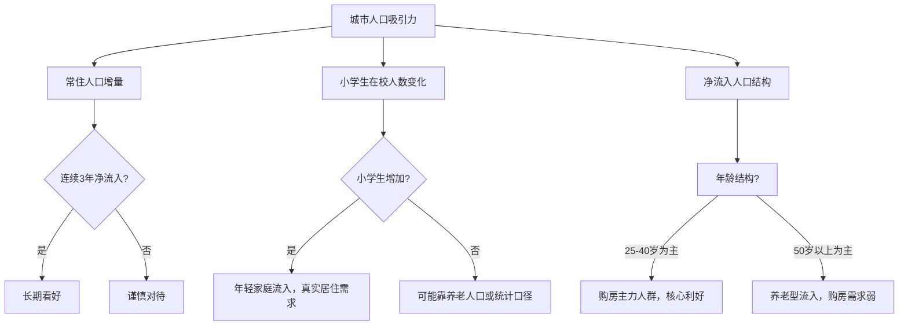
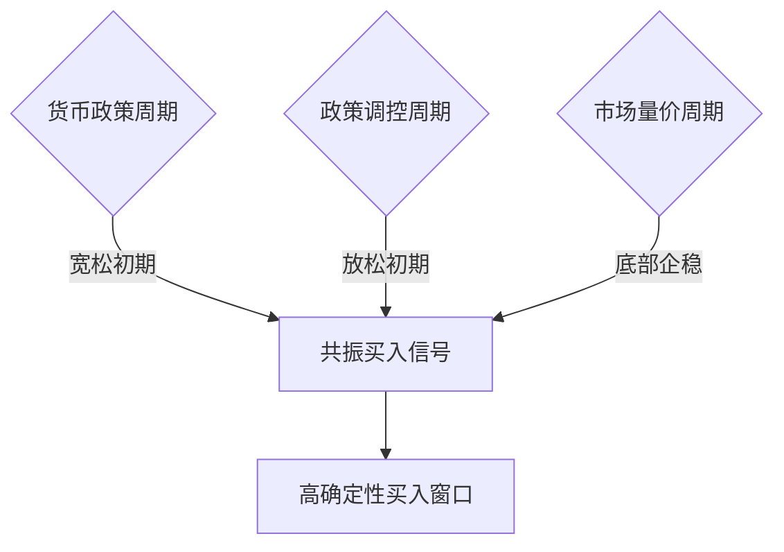
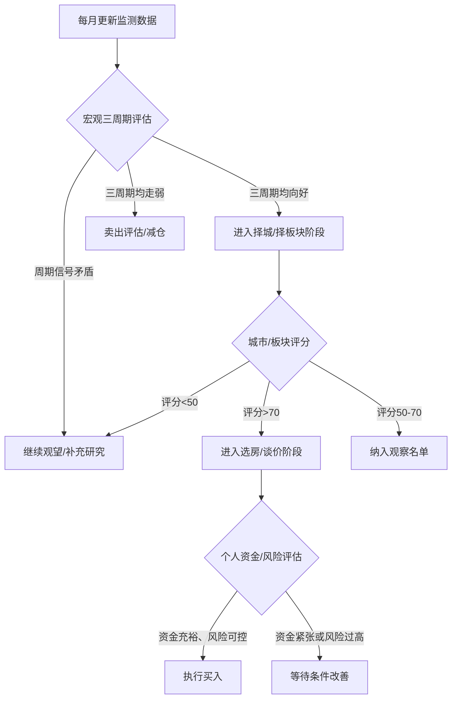

## 十、房产投资的时机判断

房产投资的收益中，**时机选择的贡献度远超标的本身**。同一套房，2015年买入和2021年买入，结果可能天壤之别。本章系统讲解如何判断买入时机、持有节奏和卖出窗口，构建一套可复用的时机分析框架。

---

### 1. 为什么时机在房产投资中至关重要

#### 1.1 房产的特殊性决定时机权重极高

与股票不同，房产具有三个让时机选择格外关键的特性：

| 特性 | 股票 | 房产 | 对时机的影响 |
|------|------|------|-------------|
| 流动性 | T+1卖出 | 挂牌周期3-12个月 | 买错了很难快速止损 |
| 杠杆倍数 | 融资融券1-2倍 | 按揭3-5倍杠杆 | 时机错误放大亏损 |
| 交易成本 | 佣金0.02%-0.05% | 税费+中介费占总价5%-10% | 频繁交易不可行 |
| 持有成本 | 几乎为零 | 物业费+资金利息+折旧 | 持有期间持续消耗 |
| 信息透明度 | 实时行情 | 成交数据滞后1-3个月 | 判断难度更大 |

**核心结论**：房产投资几乎不允许"试错-修正"的模式，必须在出手前就有较高把握。这就要求投资者具备系统化的时机判断能力。

#### 1.2 时机判断的收益量化

假设同一城市同一区域，两种策略的对比：

| 策略 | 买入时点 | 买入均价(元/m²) | 5年后均价 | 涨幅 | 100m²净收益 |
|------|---------|-----------------|----------|------|-------------|
| 顺周期买入 | 2016年Q2 | 15,000 | 25,000 | +67% | +100万 |
| 逆周期买入 | 2017年Q4 | 22,000 | 25,000 | +14% | +30万 |
| 顶部买入 | 2021年Q1 | 30,000 | 23,000 | -23% | -70万 |

仅时机差异就造成了170万的收益差。在杠杆放大下，这个差距会更加惊人。

---

### 2. 房产周期的底层逻辑

#### 2.1 房地产周期的四阶段模型

房产市场遵循可预测的周期规律，每个完整周期约7-10年，可划分为四个阶段：


各阶段特征对比：

| 阶段 | 成交量 | 价格走势 | 库存水平 | 政策方向 | 开发商行为 | 投资者情绪 |
|------|--------|---------|---------|---------|-----------|-----------|
| 复苏期 | 逐步放量 | 止跌企稳 | 去化加速 | 宽松刺激 | 谨慎拿地 | 观望→试探 |
| 繁荣期 | 快速放大 | 加速上涨 | 持续走低 | 渐趋收紧 | 积极扩张 | 蜂拥入场 |
| 滞涨期 | 开始萎缩 | 涨幅收窄/横盘 | 开始堆积 | 全面收紧 | 放缓开发 | 分歧加大 |
| 衰退期 | 大幅萎缩 | 明显下跌 | 高位堆积 | 逐步放松 | 降价促销 | 恐慌抛售 |

**关键认知**：大多数普通投资者在繁荣期入场（因为身边人都在赚钱），在衰退期割肉（因为恐慌），完美实现"高买低卖"。专业投资者恰恰相反。

#### 2.2 驱动周期的三大引擎

**引擎一：货币政策周期**

央行的货币政策是房地产周期最核心的驱动力。传导链条如下：

```text
央行降准/降息 → 银行放贷能力增强 → 房贷利率下降 → 月供减少/购买力提升
→ 需求释放 → 成交放量 → 价格上涨 → 抵押物升值 → 银行更愿放贷（正反馈）
```

逆向过程：
```text
央行收紧 → 房贷利率上升 → 月供增加/额度收紧 → 需求萎缩
→ 成交低迷 → 价格松动 → 抵押物贬值 → 银行惜贷（负反馈）
```

**核心监测指标**：

| 指标 | 含义 | 利好信号 | 利空信号 |
|------|------|---------|---------|
| LPR（贷款市场报价利率） | 房贷定价基准 | 连续下调 | 连续上调或持平 |
| 首付比例 | 购房门槛 | 下调至20%-25% | 上调至30%-40% |
| 房贷审批速度 | 银行放贷意愿 | 2-4周放款 | 排队3个月以上 |
| M2增速 | 广义货币供应 | 高于GDP增速2%+ | 低于GDP增速 |
| 社融增量 | 实体融资需求 | 同比多增 | 同比少降 |
| 住房公积金政策 | 政策风向标 | 提额/降利率/扩大范围 | 收紧使用条件 |

**引擎二：政策调控周期**

中国房地产受政策影响极大，政策周期通常比市场周期领先3-6个月：

**宽松政策清单**（买入窗口逐步打开）：
- 取消或放松限购（外地人购房资格恢复）
- 降低首付比例（首套20%、二套30%）
- 降低房贷利率（首套利率破4%）
- 放宽限售年限（从5年缩短到2年或取消）
- 购房补贴（契税减免、人才购房补贴）
- 放宽公积金贷款条件
- 降低交易税费（增值税免征年限从5年降为2年）

**收紧政策清单**（卖出窗口逐步打开）：
- 升级限购（社保年限延长、套数限制）
- 提高首付比例（二套50%-70%）
- 房贷利率上浮（基准利率+20%-30%）
- 加强限售（延长至3-5年）
- 严查经营贷/消费贷入楼市
- 土地供应增加（未来供给预期增大）
- 房产税试点扩围信号

**政策解读技巧**：
- 看**边际变化**而非绝对水平——从"严控"到"不再提严控"就是放松信号
- 看**高层定调**——政治局会议、国务院常务会议的表态比地方政策更关键
- 看**执行力度**——文件写了但银行不执行，等于没放松
- 看**政策组合拳**——单一政策效果有限，连续3个以上同方向政策才构成趋势

**引擎三：人口与城市化周期**

人口是房地产的终极基本面。判断一个城市的房产长期价值，核心看以下指标：



**关键人口数据来源**：
- 各市统计局年度统计公报（常住人口、出生率）
- 教育局学区数据（小学生数量反映真实家庭流入）
- 高德/百度人口热力图（实时人口密度变化）
- 铁路/航空客流数据（商务活跃度代理指标）
- 外卖/快递单量数据（实际居住人口代理指标）

---

### 3. 判断买入时机的实战框架

#### 3.1 宏观择时：三周期共振法

当以下三个周期同时处于"底部区域"时，是最佳买入窗口：



**三周期状态判断表**：

| 维度 | 底部信号（买入） | 顶部信号（卖出） |
|------|-----------------|-----------------|
| 货币周期 | LPR连续下调、首付比例降低、房贷额度充裕 | LPR上调或持平、房贷审批收紧、额度紧张 |
| 政策周期 | 连续出台3个以上宽松政策、限购实质放松 | 政策从"支持"转为"规范"、表态从暖变冷 |
| 市场周期 | 成交量触底回升、挂牌价止跌、业主议价空间缩小 | 成交量创历史新高后回落、挂牌量激增、"日光盘"频现 |

**历史验证**：

| 时间窗口 | 货币信号 | 政策信号 | 市场信号 | 买入后3年收益 |
|---------|---------|---------|---------|-------------|
| 2014年Q4-2015年Q2 | 降息降准周期 | 930新政+330新政 | 底部放量 | 一线+50%-80% |
| 2018年Q4-2019年Q1 | LPR改革降利率 | 多城松绑限购 | 底部企稳 | 分化行情+20%-40% |
| 2022年Q1-Q3 | 降息降准 | 多轮救市政策 | 成交萎缩 | 一线核心区企稳回升 |

#### 3.2 微观择时：城市/板块信号体系

即使宏观环境适合买入，不同城市和板块的节奏差异巨大。需要一套微观信号体系来精确定位。

**城市级别的择时信号**：

| 信号 | 具体指标 | 数据来源 | 权重 |
|------|---------|---------|------|
| 库存去化周期 | <12个月为供不应求 | 各市住建局/克而瑞 | ★★★★★ |
| 土地市场热度 | 溢价率触底回升、流拍率下降 | 土地交易中心 | ★★★★ |
| 二手房成交量 | 连续3个月环比增长 | 贝壳/链家数据 | ★★★★ |
| 挂牌价vs成交价 | 价差收窄至5%以内 | 二手房平台 | ★★★ |
| 中介门店开关 | 新开店数>关店数 | 实地调研 | ★★★ |
| 开发商推盘节奏 | 预售证发放加快 | 住建局官网 | ★★ |
| 法拍房数量 | 数量减少、流拍率下降 | 京东/阿里法拍 | ★★★ |

**板块级别的择时信号**：

| 信号 | 解读 | 操作建议 |
|------|------|---------|
| 地铁规划获批并动工 | 交通利好从预期变为现实 | 动工前6-12个月布局 |
| 名校分校签约落地 | 教育配套实质性提升 | 签约消息确认时入场 |
| 大型商业体开业 | 商业配套成熟度提升 | 开业前12-18个月布局 |
| 产业园区/企业总部落户 | 就业人口导入 | 规划公示期入场 |
| 老旧小区改造启动 | 片区环境改善预期 | 改造启动时布局周边 |
| 医院/公园等公共设施落地 | 生活品质提升 | 规划确定时入场 |

#### 3.3 价格信号：底部特征清单

当一个区域出现以下5个以上信号时，大概率处于价格底部：

1. **二手房成交量连续3个月回升**——最可靠的底部信号，量在价先
2. **业主降价幅度收窄**——从最初挂牌价降10%-15%收窄到降3%-5%
3. **中介带看量增加**——市场关注度回升但价格尚未跟上
4. **银行房贷利率处于低位**——贷款成本优势明显
5. **租金回报率回升**——当租金回报率接近或超过房贷利率时，持有成本为零
6. **法拍房流拍率下降**——法拍是市场最悲观的价格锚，法拍企稳说明底部已近
7. **开发商不再降价促销**——新房价格企稳是市场信心恢复的标志
8. **土拍市场出现"抢地"**——开发商对未来预期转好
9. **相关股票/债券率先企稳**——资本市场对地产预期领先于实体市场
10. **媒体/舆论从全面看空转为有分歧**——当所有人都看空时，空头力量已释放殆尽

---

### 4. 判断卖出时机的实战框架

#### 4.1 卖出信号体系

卖出比买入更难判断，因为人性中的贪婪和"再涨一点"心理会严重干扰决策。必须建立纪律性的卖出规则。

**一级卖出信号（强烈建议卖出）**：

| 信号 | 具体表现 | 紧迫程度 |
|------|---------|---------|
| 政策急转弯 | 限购升级、首付提高、利率大幅上浮 | 信号出现后3-6个月内行动 |
| 成交量断崖下跌 | 月成交量环比下降30%以上，连续2个月 | 立即行动 |
| 库存去化周期突破18个月 | 市场从供不应求转为供过于求 | 3个月内行动 |
| 开发商大规模降价 | 同区域新房降价10%以上 | 立即行动 |
| 房贷利率快速上行 | 3个月内上行超过50bp | 信号确认后行动 |

**二级卖出信号（考虑减仓）**：

| 信号 | 具体表现 | 操作建议 |
|------|---------|---------|
| 挂牌量激增 | 同小区挂牌量比正常时期翻倍 | 出售非核心资产 |
| 成交周期拉长 | 从挂牌到成交平均周期超过6个月 | 主动降价抢跑 |
| 租金回报率跌破2% | 持有成本大于租金收益 | 考虑置换更高回报标的 |
| 周边大量新盘入市 | 未来1-2年供给压力增大 | 优先出手老旧房源 |
| 房产税试点扩围 | 持有成本预期上升 | 优化持有结构 |

#### 4.2 卖出时机的决策矩阵

不是所有房产都应在同一时点卖出，需要根据标的特征制定差异化策略：

| 标的类型 | 核心优势 | 最佳卖出窗口 | 持有建议 |
|---------|---------|-------------|---------|
| 核心地段优质学区房 | 稀缺性、学区价值 | 学区政策重大变革前 | 长期持有，除非政策突变 |
| 远郊投资盘 | 低价、规划预期 | 规划利好兑现时 | 利好兑现即卖出 |
| 老破小 | 地段、总价低 | 棚改/旧改政策窗口 | 政策利好期出手 |
| 商铺/公寓 | 租金回报 | 商业成熟期 | 成熟后持有收租或卖出 |
| 旅居/度假房 | 景观、稀缺性 | 旅游市场高点 | 非核心资产，获利了结 |

#### 4.3 纪律性卖出规则

为了避免情绪干扰，建议在买入时就预设卖出条件：

**止盈规则**：
- 涨幅达到50%-80%时，出售30%-50%仓位（锁定部分利润）
- 涨幅达到100%以上时，出售至成本完全回收（零成本持仓）

**止损规则**：
- 账面亏损达20%时，重新评估持有理由
- 若持有逻辑被破坏（如规划取消、学区调整），果断止损

**时间规则**：
- 持有超过7年未达预期收益，考虑置换更优标的
- 房龄超过20年且无拆迁/旧改预期，考虑出手

---

### 5. 不同类型投资者的时机策略

#### 5.1 刚需自住型

**核心原则**：自住需求优先，时机为辅。

刚需购房者不应过度择时，原因如下：
- 居住需求是刚性的，等待的成本（租房费用、生活不便）是确定的
- 房价涨跌是不确定的，确定性的成本不应该为不确定的收益让路
- 自住房的"收益"不仅是房价涨跌，还包括生活品质、孩子学区、通勤时间

**但仍可以优化时机**：
- 优先选择政策宽松期出手（首付低、利率低、选择多）
- 避开"全民抢房"的狂热期（此时溢价高、选择少、容易冲动决策）
- 年底和春节前通常是议价空间较大的时期（业主急用钱）
- 新盘首开和尾盘清盘通常是优惠力度最大的节点

**刚需择时检查清单**：
- [ ] 首付资金已到位且不影响家庭应急储备
- [ ] 月供不超过家庭收入的40%
- [ ] 至少看过20套房以上再做决定
- [ ] 了解目标区域过去3年的价格走势
- [ ] 确认贷款利率处于相对低位
- [ ] 已比较新房和二手房的性价比

#### 5.2 改善置换型

**核心原则**：先卖后买还是先买后卖，取决于市场阶段。

| 市场阶段 | 策略 | 原因 |
|---------|------|------|
| 上升期 | 先买后卖 | 卖得晚价格更高，但要确保资金链不断 |
| 下降期 | 先卖后买 | 卖得早少亏，买得晚更便宜 |
| 横盘期 | 同步操作 | 价格稳定，重点是找到合适的置换标的 |

**改善型时机优化**：
- 利用"带押过户"等新政策降低交易摩擦
- 在市场低迷期置换往往更划算——虽然自己的房子卖得便宜，但要买的房子降得更多
- 关注开发商"以旧换新"活动，部分城市有官方平台支持

#### 5.3 投资型

**核心原则**：逆周期操作，人弃我取。

投资型购房的时机要求最为严格，因为投资的唯一目的就是收益最大化。

**投资型买入时机评分表**（满分100分，70分以上可出手）：

| 评分维度 | 权重 | 100分条件 | 0分条件 |
|---------|------|----------|---------|
| 货币环境 | 20% | LPR处于下行通道、房贷利率<4% | 房贷利率>5.5%且在上行 |
| 政策环境 | 20% | 连续出台宽松政策、限购取消 | 限购升级、限贷收紧 |
| 市场库存 | 15% | 去化周期<8个月 | 去化周期>24个月 |
| 价格位置 | 15% | 较高点回调20%以上 | 处于历史最高位附近 |
| 人口趋势 | 10% | 年净流入>10万人 | 连续净流出 |
| 产业支撑 | 10% | 有明确产业导入（高新/金融/总部） | 产业空心化 |
| 租金回报 | 5% | 租金回报率>3% | 租金回报率<1.5% |
| 个人资金 | 5% | 资金充裕、不影响流动性 | 高杠杆、无安全垫 |

**使用方法**：逐项打分后加权求总分。70分以上为"可以出手"，80分以上为"积极布局"，50分以下为"坚决观望"。

---

### 6. 时机判断的工具与数据源

#### 6.1 必备数据监测清单

| 数据类型 | 数据源 | 更新频率 | 用途 |
|---------|--------|---------|------|
| LPR利率 | 中国人民银行官网 | 每月20日 | 判断货币环境 |
| 房贷利率 | 融360/各银行官网 | 每月 | 了解实际贷款成本 |
| 新房/二手房成交量 | 各市住建局/克而瑞/中指院 | 每周/每月 | 判断市场活跃度 |
| 库存去化周期 | 克而瑞/中指研究院 | 每月 | 判断供需关系 |
| 土地成交数据 | 各市自然资源局/土地交易中心 | 每次土拍后 | 判断开发商预期 |
| 人口数据 | 各市统计局年度公报 | 每年 | 判断长期趋势 |
| 房价指数 | 国家统计局70城房价指数 | 每月15日 | 跟踪价格走势 |
| 法拍房数据 | 京东拍卖/阿里拍卖 | 实时 | 观察市场底部信号 |
| 挂牌量/带看量 | 贝壳/链家 | 每周 | 判断市场热度 |
| 房企销售数据 | 克而瑞/企业公告 | 每月 | 判断行业景气度 |

#### 6.2 实操监测流程

建议建立个人的"房产周期仪表盘"，每月底花1小时更新一次：

**月度监测模板**：

```markdown
## 房产周期月度监测报告 - {年月}

### 一、宏观信号
- LPR: 1年期___% / 5年期___% (环比: ↑/↓/→)
- 房贷利率(首套): ___% (环比: ↑/↓/→)
- 最新政策动向: _______________

### 二、市场信号
- 目标城市新房成交面积: ___万m² (环比: ±___%)
- 目标城市二手房成交套数: ___套 (环比: ±___%)
- 库存去化周期: ___个月 (环比: ↑/↓/→)
- 土拍溢价率: ___% (环比: ↑/↓/→)

### 三、目标板块信号
- 目标小区挂牌均价: ___元/m² (环比: ↑/↓/→)
- 挂牌量: ___套 (环比: ↑/↓/→)
- 最近成交价与挂牌价差距: ___%
- 租金水平: ___元/月 (回报率: ___%)

### 四、综合判断
- 三周期共振状态: ___/___/___ (货币/政策/市场)
- 当前周期阶段: 复苏/繁荣/滞涨/衰退
- 操作建议: 加仓/持有/减仓/观望
```

#### 6.3 关键时间节点规律

中国房地产市场有一些可利用的季节性和事件性规律：

| 时间节点 | 规律 | 操作建议 |
|---------|------|---------|
| 春节后(2-3月) | "小阳春"，成交量季节性回升 | 不要误判为趋势性回暖 |
| 年中(6月) | 开发商冲半年业绩，促销力度大 | 投资型买家可关注特价房源 |
| 金九银十(9-10月) | 传统旺季，推盘量增加 | 选择多但竞争也多 |
| 年底(11-12月) | 开发商冲年度目标，急售盘增多 | 议价空间最大 |
| 政策发布后1-3个月 | 市场消化期，存在信息差 | 快速反应的窗口期 |
| 两会期间(3月) | 政策定调期，信息密集 | 关注政府工作报告中房地产表述 |
| 中央经济工作会议(12月) | 来年经济政策定调 | 提前预判次年房地产政策走向 |

---

### 7. 时机判断的常见误区

#### 7.1 七大认知陷阱

**误区一："等最低点再买"**

事实：没有人能精确抄底。即使专业机构，判断底部的误差也在5%-10%。而等待过程中，优质房源可能已被别人买走，错过的机会成本远大于多付的5%房价。

**正确做法**：判断"底部区域"而非"最低点"。当多个底部信号出现时，在区域内分批买入。

**误区二："所有人都在买房所以我也要买"**

事实：当大众蜂拥入场时，往往已是周期中后段。市场情绪是滞后指标，不是领先指标。

**正确做法**：当身边不关注房产的人都开始讨论买房时，反而应该警惕。

**误区三："国家不会让房价跌"**

事实：政策的目标是"稳定"而非"只涨不跌"。多个城市在多个周期中出现过20%-40%的下跌。

**正确做法**：基于客观数据判断，而非基于"信仰"。即使长期看好，也要关注中期波动风险。

**误区四："看新闻联播就够了"**

事实：政策信号需要结合执行层面来看。中央说"支持"但地方银行不放款，实际效果大打折扣。

**正确做法**：顶层定调+基层执行+市场反馈三层验证。

**误区五："这个城市一直涨所以会继续涨"**

事实：没有只涨不跌的市场。日本东京1990年后跌了20年，中国部分三四线城市2017年后持续阴跌。

**正确做法**：每一轮周期的驱动因素不同，需要具体分析当下周期的支撑因素是否还在。

**误区六："别人说年底是买房好时机所以年底买"**

事实：季节性规律只是参考因素之一，不能脱离宏观环境单独使用。在衰退期的年底买入，可能买到的是"下跌中继"。

**正确做法**：季节性择时必须叠加周期性判断。

**误区七："房价跌了20%所以到底了"**

事实：下跌幅度不等于见底。历史上多次出现"跌了20%之后又跌了20%"的情况。

**正确做法**：用成交量、库存、政策等多维信号交叉验证，而非单纯看跌幅。

#### 7.2 行为金融学陷阱

| 心理陷阱 | 表现 | 纠正方法 |
|---------|------|---------|
| 锚定效应 | 以过去高价为参考，觉得"便宜了" | 以当前租金回报率和收入比为锚 |
| 确认偏误 | 只关注支持自己判断的信息 | 主动寻找反面证据 |
| 从众效应 | 跟风买房/卖房 | 建立自己的分析框架并严格执行 |
| 损失厌恶 | 亏损时不愿卖出，"回本再说" | 设定止损线，认错不丢人 |
| 过度自信 | 凭直觉做决策，不做数据分析 | 所有决策必须有数据支撑 |
| 近因偏差 | 过度关注最近的涨跌，忽视长期趋势 | 拉长观察窗口到5-10年 |
| 禀赋效应 | 对自己持有的房产估值偏高 | 定期以"如果我没持有，现在会买吗"自检 |

---

### 8. 实战案例：完整时机分析

#### 8.1 案例：2014-2016年一线城市的买入窗口

**背景**：2014年全国楼市低迷，库存高企，部分城市限购松绑。

**信号时间线**：

| 时间 | 事件 | 信号类型 |
|------|------|---------|
| 2014年9月 | 央行发布930新政（认贷不认房） | 政策转向 |
| 2014年11月 | 央行降息（一年期贷款利率降至5.6%） | 货币宽松 |
| 2015年3月 | 330新政（二套首付降至40%、营业税免征5改2） | 政策加码 |
| 2015年5月 | 央行再次降息（降至5.1%） | 货币持续宽松 |
| 2015年Q2 | 一线城市成交量开始回升 | 市场底部确认 |
| 2015年9-10月 | 一线城市房价开始上涨 | 价格信号确认 |
| 2016年Q1 | 全面上涨，恐慌性入市 | 繁荣期确立 |

**分析**：如果在2014年Q4至2015年Q2期间买入一线城市核心区域，到2016年底收益普遍在50%-80%。三周期在2015年Q2完全共振——货币宽松+政策刺激+市场底部放量。

**错过窗口后的教训**：2016年Q3之后追入的投资者，很多买在了阶段性高点，部分城市到2018年才回到2016年的价格水平。

#### 8.2 案例：2021-2023年的卖出信号

**信号时间线**：

| 时间 | 事件 | 信号类型 |
|------|------|---------|
| 2020年8月 | 三道红线政策出台 | 政策收紧信号 |
| 2021年1月 | 银行房贷集中度管理 | 货币收紧信号 |
| 2021年Q2 | 二手房指导价出台（深圳率先） | 政策急转弯 |
| 2021年Q3 | 恒大暴雷，行业信心崩塌 | 市场恐慌 |
| 2021年Q4 | 多城成交量腰斩 | 量价齐跌确认 |
| 2022年 | 全国房价普跌，部分城市跌20%-30% | 衰退期深化 |

**分析**：2021年Q1已有多个强烈卖出信号——三道红线+房贷集中度+指导价。如果在此时出售非核心资产，可以避免后续20%-30%的跌幅。

---

### 9. 建立个人时机判断系统

#### 9.1 系统化决策流程



#### 9.2 纪律性投资日历

| 月份 | 例行工作 | 重点关注 |
|------|---------|---------|
| 1月 | 年度总结、更新年度预测 | 各市上年成交数据汇总 |
| 2月 | 春节后市场回暖观察 | 小阳春是否出现 |
| 3月 | 两会政策信号解读 | 政府工作报告房地产表述 |
| 4月 | Q1数据汇总、调整策略 | 一季度GDP、社融数据 |
| 5月 | 板块深度调研 | 实地踩盘、了解真实市场温度 |
| 6月 | 半年业绩期促销观察 | 开发商特价房源、以旧换新 |
| 7月 | 中期政策评估 | 政治局会议对房地产表态 |
| 8月 | 金九银十前期准备 | 预判秋季市场走势 |
| 9-10月 | 传统旺季跟踪 | 成交量是否符合预期 |
| 11月 | 年终策略调整 | 确定是否在年底出手 |
| 12月 | 中央经济工作会议解读 | 来年政策方向定调 |

#### 9.3 决策记录与复盘

每次买入或卖出决策后，记录以下信息以便复盘：

```markdown
## 房产交易决策记录

### 基本信息
- 标的: _______________
- 操作: 买入 / 卖出
- 时间: ____年__月
- 价格: ____元/m²，总价____万

### 决策依据（买入时填写）
- 货币周期判断: ___/10分
- 政策周期判断: ___/10分
- 市场周期判断: ___/10分
- 城市/板块评分: ___/100分
- 综合判断: _______________

### 预期与实际
- 买入时预期: 3年涨___%，5年涨___%
- 实际结果(3年后): 涨/跌___%
- 偏差原因分析: _______________

### 经验教训
- 做对了什么: _______________
- 做错了什么: _______________
- 下次改进: _______________
```

---

### 10. 总结：时机判断的核心心法

**三个核心原则**：

1. **顺势而为，逆向布局**——在宏观趋势明确时顺应，在市场恐慌时布局。不与大趋势对抗，但不在大众狂热时追高。

2. **数据驱动，纪律执行**——建立系统化的监测框架，用数据替代感觉。一旦规则触发，坚决执行，不受情绪干扰。

3. **多维验证，宁缺毋滥**——单一信号不可靠，需要货币+政策+市场三维共振。宁可错过，不可错买。

**最后的忠告**：

时机判断不是精确科学，而是一种概率游戏。即使做了最充分的分析，也可能因为黑天鹅事件（如疫情、重大政策转向）而出现偏差。因此：

- 永远留有安全垫——不要满杠杆操作
- 分散而非集中——不要把所有资金押在同一城市同一板块
- 接受不完美——买到最低点80%的位置就已经很成功了
- 时间是朋友——对于优质标的，即使短期时机不佳，长期持有也能获得合理回报
