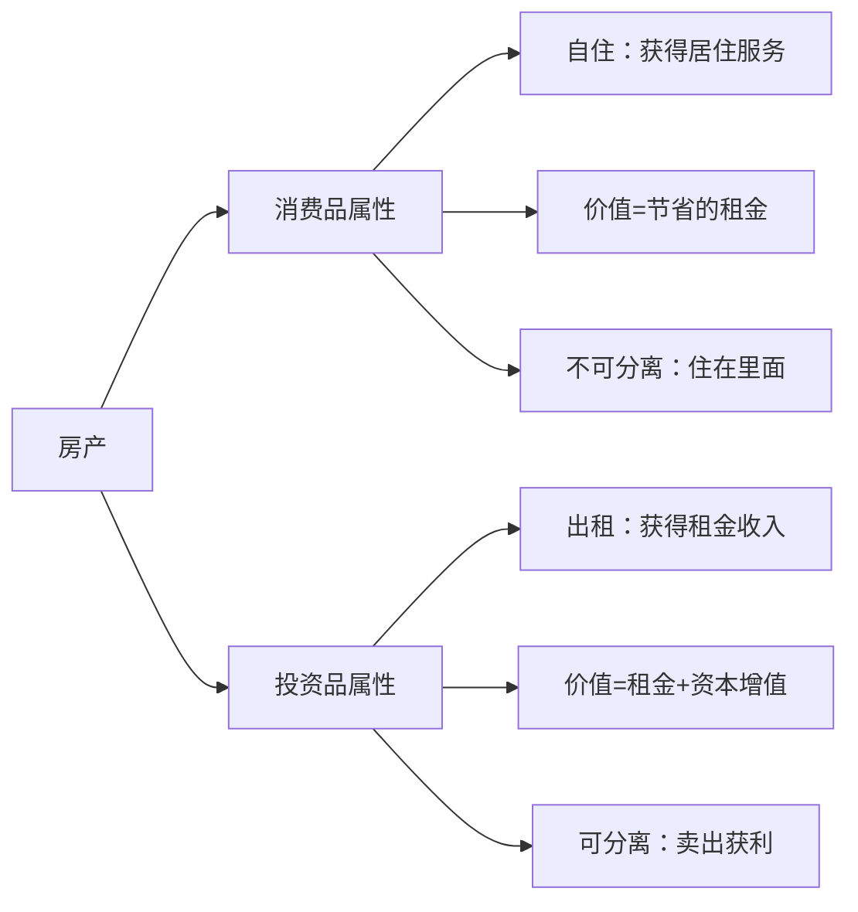
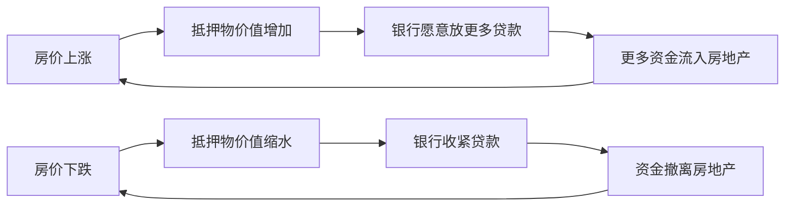

## 一、房地产的资产属性

房地产之所以值得单独用一整章来讨论，是因为它在所有资产类别中拥有独一无二的属性组合。理解这些属性，是做出理性房产投资决策的第一步——不理解本质就贸然入场，无异于蒙眼开车。

本节从物理属性、经济属性、法律属性、金融属性四个维度，完整拆解房地产作为资产的本质特征，并与其他资产类别进行对比，帮你建立对"房产到底是什么"的底层认知。

### 1. 为什么理解资产属性是投资的前提

很多人买房时只关心"涨不涨"，却不理解房产这种资产的根本特性。这导致一系列决策失误：

- **把高流动性预期套在低流动性资产上**：股票跌了可以当天止损，房子跌了可能挂半年卖不出去
- **忽视持有成本**：物业费、维修基金、折旧、贷款利息——房产的隐性持有成本远高于多数人的想象
- **低估政策影响**：限购、限贷、限售、房产税试点——政策可以在一夜之间改变房产的流动性和价值
- **错配投资期限**：用短线思维做长线资产，或者用长线资金做短线投机

理解资产属性的核心价值在于：**让你知道在什么条件下、用什么策略、承担什么风险来持有房产**。

### 2. 房地产的物理属性

房地产（Real Estate）的"不动"二字，决定了它与其他所有资产的根本区别。

#### 2.1 不可移动性（Immobility）

这是房地产最本质的物理特征。股票可以在全球交易所自由买卖，黄金可以从纽约运到上海，但一栋房子永远钉在它所在的那块地上。

**这意味着什么？**

- **区位决定价值**：同一栋建筑，放在深圳南山和放在鹤岗，价值天差地别。你买的不只是"房子"，更是"位置"——这就是房地产界的核心法则"Location, Location, Location"
- **价值高度本地化**：全国房价走势只对宏观判断有用，具体到你的房子，决定价值的是你所在城市、所在板块、所在小区的具体条件
- **无法对冲地理风险**：你不能像分散股票持仓那样，把一套房"分散"到不同城市（除非你有多套房）。地震、洪水、区域经济衰退——地理风险与资产绑定
- **受制于周边环境变化**：你买房时旁边是公园，三年后变成了垃圾站——你无法"搬家"，只能承受价值贬损

**投资启示**：买房决策中，选对城市和地段的重要性远大于选对户型和楼层。位置是不可更改的，而装修可以。

#### 2.2 耐久性（Durability）

一栋设计合理的住宅建筑，使用寿命通常在50-70年（中国住宅用地使用权为70年）。商业地产更长，钢筋混凝土结构的写字楼设计寿命可达80-100年。

**耐久性带来的双重效应**：

| 效应 | 正面 | 负面 |
|------|------|------|
| 时间维度 | 可以长期持有，享受城市发展红利 | 也会随时间折旧，维护成本递增 |
| 市场维度 | 存量市场巨大，二手交易有基础 | 新房供应持续累积，老旧房产竞争力下降 |
| 金融维度 | 可作为长期贷款抵押物 | 抵押物价值随楼龄增长而下降 |

**关键数据**：中国住宅的物理折旧速度约为每年1.5%-2%（不考虑地段增值）。这意味着如果一个板块没有发展红利，一套房在20年后的物理价值只剩初始价值的60%-70%。但现实中，地段增值通常远超物理折旧，所以看起来"老房子也在涨"——涨的是地价，不是房子本身。

**投资启示**：买房时关注房龄。房龄超过20年的房子，贷款难度增加（银行通常要求房龄+贷款年限≤50年），且未来转手时买家范围缩小。如果你做长期持有（10年以上），优选次新房（房龄5年内），而非老破小。

#### 2.3 异质性（Heterogeneity）

世界上没有两套完全相同的房产。即使是同一小区、同一户型、同一楼层的两套房，也会因为朝向、装修、视野、噪音、楼层位置（东边套/西边套/中间套）等因素而存在价值差异。

**异质性的影响**：

- **定价困难**：不像股票有实时统一价格，房产定价高度依赖个案评估。同一小区的挂牌价可能相差20%-30%
- **信息不对称严重**：卖家比买家更了解房屋的真实状况（漏水、噪音、邻里纠纷等），这构成了经典的"柠檬市场"问题
- **标准化程度低**：无法像大宗商品一样批量交易，每一笔房产交易都是独特的
- **比较成本高**：买房需要大量看房、对比、调查，时间成本和精力成本远高于买股票或基金

**投资启示**：因为异质性，买房不能只看均价和宏观数据。你必须亲自看房、实地考察、做尽职调查。同时，异质性也意味着存在"捡漏"的可能——在信息不对称的市场中，愿意花更多精力做功课的人，有机会找到被低估的标的。

#### 2.4 供给的天然受限性

土地是不可再生资源。一个城市的核心地段，可供开发的土地面积是有限的——这与股票不同，理论上公司可以无限增发股票，但政府无法"增发"土地（填海造陆除外，且成本极高）。

**供给受限的表现**：

- **核心地段稀缺**：北京二环内、上海内环、深圳南山——这些区域已经无地可供，新增供应几乎为零
- **供给弹性低**：从土地出让到房屋交付通常需要3-5年，短期内无法快速增加供给
- **规划管控**：政府通过土地利用规划、容积率限制、建筑高度限制等手段控制供给

但要注意：**供给受限不等于价格只涨不跌**。三四线城市的土地供给虽然也受规划管控，但相对于需求来说供给过剩，照样面临价格下行压力。供给受限对价格的支撑作用，**只在需求旺盛的区域才成立**。

### 3. 房地产的经济属性

物理属性决定了房地产"是什么"，经济属性决定了它"值多少"。

#### 3.1 消费品与投资品的双重身份

这是房地产最独特的经济属性之一。一套自住房同时是：

**消费品维度**：你获得了居住服务（shelter service），满足了马斯洛需求层次中"安全需求"的基本层面。这部分价值体现为你不需要支付租金的机会成本。

**投资品维度**：房产作为实物资产，其价格随市场供需变动，可能带来资本增值或贬值。你持有的是一个可能升值（或贬值）的资产头寸。

**关键区别**：



**实操判断公式**：

```text
真实年化回报 = 租金收益率 + 资本增值率 - 持有成本率

其中：
- 租金收益率 = 年租金 / 房产总价值
- 资本增值率 = 年均房价涨幅
- 持有成本率 = (物业费 + 维修费 + 贷款利息 + 房产税 + 折旧) / 房产总价值
```

**举例说明**：一套价值300万的房产，年租金6万（租金收益率2%），年均房价涨幅3%（资本增值率3%），年持有成本4.5万（持有成本率1.5%）。真实年化回报 = 2% + 3% - 1.5% = 3.5%。如果同期银行理财收益4%，那么这套房作为投资品的实际回报还不如银行理财——但它同时满足了你的居住需求。

#### 3.2 杠杆属性：房地产是普通人最容易获得的高杠杆资产

这是房地产投资的核心魅力之一，也是最大的风险来源。

**为什么说它"最容易获得杠杆"？**

- 首套房首付比例通常为20%-30%，意味着你用100万就能控制300-500万的资产
- 房贷利率是普通个人能获得的最低利率贷款（中国2024年首套房利率约3.0%-3.5%）
- 贷款期限长达20-30年，远超其他消费贷款或经营贷款
- 银行愿意放贷的前提是：房产是公认的优质抵押物

**杠杆的放大效应**：

| 场景 | 首付（自有资金） | 房产价值 | 房价上涨10% | 资产增值 | 自有资金回报率 |
|------|----------------|---------|------------|---------|-------------|
| 全款买房 | 300万 | 300万 | +30万 | 30万 | 10% |
| 首付30% | 90万 | 300万 | +30万 | 30万 | 33.3% |
| 首付20% | 60万 | 300万 | +30万 | 30万 | 50% |

杠杆把10%的房价涨幅放大成了33%-50%的自有资金回报率。这就是为什么过去20年很多中国家庭通过买房实现了财富快速增长——不是因为他们是投资天才，而是因为他们用3-5倍的杠杆押注了一个持续上涨的市场。

**但杠杆是双刃剑**：

| 场景 | 首付（自有资金） | 房产价值 | 房价下跌10% | 资产缩水 | 自有资金损失率 |
|------|----------------|---------|------------|---------|-------------|
| 全款买房 | 300万 | 300万 | -30万 | 30万 | 10% |
| 首付30% | 90万 | 300万 | -30万 | 30万 | 33.3% |
| 首付20% | 60万 | 300万 | -30万 | 30万 | 50% |

当房价下跌10%时，30%首付的投资者已经损失了三分之一的本金。如果房价下跌30%（这在某些城市已经发生），30%首付的投资者本金归零——这就是"负资产"（房产市值低于剩余贷款余额）。在中国，由于贷款追索权有限（大部分情况下银行只能收回房子，不能追索借款人其他资产），最坏的结果是失去房子和首付，但不会欠银行钱。在美国部分州（非recourse states），你甚至可能在失去房子后还欠银行差额。

**杠杆的安全边际**：

- 月供不超过家庭月收入的40%——这是红线
- 首付不低于30%——给自己留出房价下跌的安全垫
- 保留至少6个月月供的应急资金——防止收入中断导致断供
- 贷款年限优选20-25年——30年贷款的总利息几乎等于本金

#### 3.3 抗通胀属性：房地产是经典的通胀对冲资产

从长期看，房地产具有抗通胀的特性。原因在于：

- **建安成本随通胀上升**：水泥、钢筋、人工——建筑材料和劳动力成本随通胀上涨，推动新房价格上行
- **土地供给受限**：在需求稳定的城市，土地的稀缺性意味着价格会随货币贬值而上升
- **租金随通胀调整**：租金通常跟随CPI（消费者物价指数）变动，通胀越高，租金涨幅越大
- **债务被通胀稀释**：如果你贷款买房，通胀实际上在帮你"减轻"债务负担——你还的是贬值后的钱

**历史数据佐证**：

美国房地产从1900年到2023年，扣除通胀后的实际年化回报约为0.5%-1%（Robert Shiller的数据）。看起来不高，但加上3%-5%的名义通胀，名义年化回报约4%-6%。再加上3-5倍杠杆和租金收入，实际的自有资金回报率远高于此。

中国的数据更显著：1998年房改到2021年，中国主要城市房价年均涨幅约8%-12%，远超同期CPI（约2%-3%）。但2021年后部分城市房价回调，提醒我们抗通胀不是"永远涨"，而是"长期趋势向上"。

**重要警示**：抗通胀属性在**长期**成立，但不意味着中短期不会下跌。日本1990年房地产泡沫破裂后，东京房价直到2020年左右才回到1990年的水平——整整30年。如果你在泡沫顶部买入，抗通胀属性可能几十年后才能兑现。

#### 3.4 低流动性：房地产最大的"硬伤"

流动性（Liquidity）是指资产在不显著损失价值的情况下，转化为现金的速度和便利程度。在所有常见资产类别中，房地产的流动性几乎是最差的。

**流动性对比**：

| 资产类别 | 变现速度 | 交易成本 | 价格确定性 | 可分割性 |
|---------|---------|---------|-----------|---------|
| 货币基金 | T+0 | 几乎为零 | 确定 | 完全可分 |
| 股票 | T+1 | 万分之几 | 实时确定 | 最小1股 |
| 债券 | T+1至T+3 | 较低 | 基本确定 | 面额限制 |
| 黄金 | 当天 | 1%-3% | 实时确定 | 可分割 |
| 房产 | 1-12个月 | 5%-10% | 不确定 | 不可分割 |
| 私募股权 | 1-5年 | 极高 | 高度不确定 | 不可分割 |

**房产低流动性的具体表现**：

- **变现周期长**：从挂牌到成交，通常需要1-6个月。在市场低迷期，可能挂一年都卖不出去
- **交易成本高**：买卖一套房涉及的税费（契税、增值税、个税、中介费）通常占房价的5%-10%
- **价格发现困难**：不像股票每秒都有最新价格，房产的"真实市场价"只能通过成交来验证，挂牌价≠成交价
- **不可分割**：你不能卖掉半套房来应急。要么全卖，要么不卖
- **交易流程复杂**：看房、谈价、签合同、贷款审批、过户、交房——整个流程可能耗时2-3个月

**低流动性带来的投资影响**：

1. **止损困难**：股票亏损20%可以立即卖出止损，房产亏损20%你可能根本卖不出去，或者卖出后扣完税费实际亏损更大
2. **机会成本高**：资金被锁定在房产中，无法灵活调配到其他可能收益更高的资产
3. **被迫长期持有**：即使你急需用钱，房产也无法快速变现，可能被迫大幅降价出售
4. **羊群效应放大**：当所有人都想卖时，买方消失，流动性枯竭，价格可能出现螺旋式下跌

**投资启示**：买房前问自己一个问题——如果明天急需用钱，你能承受多久无法动用这笔资金？如果答案是"不能超过一个月"，那么房产不适合作为你的投资工具。

### 4. 房地产的法律属性

房地产不是简单的商品，它是一束法律权利的集合。理解这些法律属性，才能避免交易中的重大风险。

#### 4.1 产权制度：所有权、使用权、收益权的分离

在中国，房地产的产权制度具有独特性：

**土地使用权 vs 房屋所有权**：

| 权利类型 | 归属 | 期限 | 法律依据 |
|---------|------|------|---------|
| 土地所有权 | 国家或集体 | 永久 | 《宪法》第10条 |
| 住宅用地使用权 | 个人/企业 | 70年 | 《城镇国有土地使用权出让和转让暂行条例》 |
| 商业用地使用权 | 个人/企业 | 40年 | 同上 |
| 工业用地使用权 | 个人/企业 | 50年 | 同上 |
| 房屋所有权 | 个人/企业 | 永久（随建筑存在） | 《物权法》第39条 |

这意味着你买的房产实际上是：**房屋的永久所有权 + 土地的70年使用权**（住宅）。

**70年到期怎么办？**

《民法典》第359条规定："住宅建设用地使用权期限届满的，自动续期。续期费用的缴纳或者减免，依照法律、行政法规的规定办理。"——法律已经明确会自动续期，但具体费用标准尚未明确。目前的政策预期是：续期费用不会太高，可能按面积收取象征性费用。

**实际影响**：对于普通住宅购房者，70年产权问题的实际影响很小。真正需要关注的是：
- **40年产权的商业公寓**：不能落户、水电费按商业标准收取（比民用高50%-100%）、交易税费更高、贷款年限通常只有10年
- **50年产权的工业用地改住宅**：存在政策风险，可能被要求恢复原用途

#### 4.2 他项权利：抵押、租赁、地役权

一套房产上可能存在多种权利负担，购买前必须查清：

**抵押权**：最常见的他项权利。如果卖家的房贷尚未还清，银行对房产拥有抵押权。交易时必须先解押（还清贷款或用买方首付款解押），否则无法过户。法拍房就是因为抵押权人（银行）行使抵押权而被法院强制拍卖的房产。

**租赁权**："买卖不破租赁"——即使房产被出售，租户在租约期内有权继续居住。如果买了一套有长期租约（比如签了10年租约）的房子，你必须等租约到期才能自用或重新出租。购买二手房时，务必核实是否存在租约以及租约期限。

**地役权**：邻居可能拥有通过你家门前道路通行的地役权，或者你家的采光权、通风权可能受到相邻建筑的影响。这些权利虽小，但可能严重影响居住体验和房产价值。

#### 4.3 登记制度：不动产统一登记

2023年4月，中国全面实现不动产统一登记。这意味着：
- 全国所有房产、土地、林地等不动产信息统一入库
- 每个人名下的不动产数量在全国范围内可查
- 这为未来的房产税征收提供了技术基础

**投资启示**：不动产统一登记使得"假离婚规避限购"等操作的风险大幅增加。同时，这也意味着房产的产权信息更加透明，降低了产权纠纷的风险。

### 5. 房地产的金融属性

在现代金融体系中，房地产不仅是实物资产，更是金融系统的核心组成部分。

#### 5.1 信贷抵押品属性

房产是银行最偏爱的抵押物——这既支撑了房产的价值，也构成了系统性风险的来源。

**为什么银行偏爱房产抵押物？**

- 房产价值相对稳定，不像股票那样波动剧烈
- 房产不可转移（你没法半夜把房子搬走）
- 房产有实用价值（即使借款人违约，银行可以收回并处置）
- 处置流程成熟（司法拍卖制度完善）

**信贷扩张与房价的关系**：



这种"顺周期"机制意味着：**房价上涨会自我强化，房价下跌也会自我强化**。当所有人都认为房价只涨不跌时，银行大量放贷，推高房价，验证了"只涨不跌"的预期——直到某个临界点，预期逆转，螺旋式下跌开始。

**全球案例**：2008年美国次贷危机就是信贷与房价正反馈循环的极端案例。当房价下跌导致大量房贷违约，银行收紧信贷，进一步压低房价，形成了"房价下跌→违约→银行亏损→信贷紧缩→房价继续下跌"的死亡螺旋。

#### 5.2 金融衍生品基础资产

在成熟市场中，房地产可以通过证券化变成金融产品：

- **MBS（抵押贷款支持证券）**：银行把大量房贷打包成证券卖给投资者，提前回笼资金。这是美国次贷危机的核心产品
- **CMBS（商业抵押贷款支持证券）**：针对商业地产的MBS
- **REITs（房地产投资信托基金）**：把大型商业地产（商场、写字楼、物流仓库等）的收益权拆分成小额份额，让普通投资者也能参与。中国公募REITs于2021年正式开市
- **ABS（资产支持证券）**：以物业费、租金等未来现金流为基础资产发行的证券

**投资启示**：如果你想参与房地产投资但不想买房，REITs是最成熟的工具。它解决了房产投资的两大痛点——高门槛和低流动性。1000元就可以买入，T+1卖出（详见核心技巧篇REITs章节）。

#### 5.3 货币蓄水池功能

在中国经济中，房地产扮演着"货币蓄水池"的角色：

- 央行发行的货币（M2）大量流入房地产，沉淀在钢筋水泥中，减缓了对消费品价格的冲击
- 如果这些资金没有被房地产"锁定"，可能推高日常消费品价格，引发严重通胀
- 这也解释了为什么中国M2/GDP比值远高于其他国家（2023年约2.3倍，而美国约0.9倍），但CPI却相对温和

**投资启示**：当政府收紧房地产信贷（"去杠杆"）时，原本流向房地产的资金可能转向其他领域（股市、大宗商品、消费品），引发这些领域的价格波动。

### 6. 房地产的政策敏感性

在所有资产类别中，房地产可能是受政策影响最大的。这既是中国的特色，也是全球的共性。

#### 6.1 影响房地产的核心政策工具

| 政策类型 | 具体工具 | 影响方向 | 影响力度 |
|---------|---------|---------|---------|
| 需求端调控 | 限购、限贷、首付比例 | 直接抑制或释放购买需求 | ★★★★★ |
| 供给端调控 | 土地出让、预售许可 | 影响新房供应量和节奏 | ★★★★ |
| 金融政策 | 房贷利率、LPR调整 | 影响购房成本和投资回报 | ★★★★★ |
| 财税政策 | 契税、增值税、房产税 | 影响交易成本和持有成本 | ★★★★ |
| 行政政策 | 限价、限售、摇号 | 直接干预市场价格和流动性 | ★★★★★ |
| 户籍政策 | 落户条件、人才引进 | 影响购房资格和人口流入 | ★★★ |

#### 6.2 政策周期的典型模式

中国房地产政策呈现明显的"松紧交替"周期：

**紧缩期（政策收紧）**：房价过快上涨→政府出台限购限贷→市场降温→成交量下降→开发商资金紧张→土地流拍

**宽松期（政策放松）**：经济下行压力→政府放松限购限贷、降息降准→市场回暖→成交量回升→房价企稳→新一轮上涨预期形成

**关键判断指标**：

- **政策底**：当限购开始松绑、房贷利率下调时，通常意味着政策底已到
- **市场底**：政策底之后3-6个月，成交量开始回升，标志着市场底
- **价格底**：市场底之后6-12个月，房价开始企稳，标志着价格底

三个"底"之间存在时滞。急于抄底的投资者往往买在政策底，但承受了市场底和价格底之前的继续下跌。

#### 6.3 "房住不炒"的长期影响

2016年底中央经济工作会议首次提出"房住不炒"，这一定位意味着：

- **投资回报率下降**：过去"买入即赚"的时代结束，未来房产投资需要更精细的分析
- **分化加剧**：核心城市优质地段仍有保值增值空间，但大量三四线城市和远郊楼盘将面临价值重估
- **投机空间收窄**：限售政策（通常2-5年）大幅提高了短线投机的资金成本和风险
- **租赁市场发展**：政策鼓励发展长租房市场，租金收益率可能逐步提升

### 7. 房地产与其他资产的核心差异对比

理解了房地产的四大属性后，通过与其他资产的直接对比，能更清晰地看到它的优劣势：

| 维度 | 房地产 | 股票 | 债券 | 黄金 | 银行存款 |
|------|-------|------|------|------|---------|
| 预期回报 | 中等（4%-8%） | 较高（8%-12%） | 较低（3%-5%） | 低（0%-3%） | 最低（1%-3%） |
| 风险水平 | 中等 | 较高 | 较低 | 中等 | 最低 |
| 流动性 | 极低 | 极高 | 高 | 高 | 极高 |
| 杠杆便利性 | 极高 | 低（融资融券门槛高） | 不适用 | 低 | 不适用 |
| 抗通胀能力 | 强 | 中等 | 弱 | 强 | 极弱 |
| 收入来源 | 租金 | 股息 | 票息 | 无 | 利息 |
| 管理难度 | 高 | 低 | 低 | 极低 | 极低 |
| 信息不对称 | 严重 | 较低 | 低 | 低 | 无 |
| 交易成本 | 高（5%-10%） | 低（<0.1%） | 低 | 中等 | 无 |
| 最低投资门槛 | 极高（数十万起） | 低（几百元） | 中等（千元起） | 低（几百元） | 无限制 |

**一句话总结**：房地产是**高门槛、低流动性、强杠杆、抗通胀、受政策强影响**的实物资产。它的核心优势在于杠杆和抗通胀，核心劣势在于流动性和管理成本。

### 8. 中国房产的特殊属性

除了全球通用的房地产属性外，中国房产还有一些独特的附加属性：

#### 8.1 户籍与教育资源绑定

在中国的很多城市，房产与以下公共服务直接挂钩：

- **户籍（户口）**：部分城市购房可落户，享受当地社保、医保等公共服务
- **学区**：优质公立学校按照学区划分招生，学区房因此获得教育溢价（通常比同地段非学区房贵20%-50%）
- **社会认同**：在中国文化中，"有房"是婚姻、社交中的重要筹码，这种社会属性给房产增加了额外的"效用"

**投资启示**：学区房的溢价来自教育政策，而非房屋本身。当政策变动（如多校划片、教师轮岗）削弱学区与房产的绑定关系时，学区房溢价可能迅速消失——北京、上海已有多个这样的案例。

#### 8.2 土地财政依赖

中国地方政府高度依赖土地出让金收入（部分城市占地方财政收入的30%-50%）。这意味着：

- 地方政府有推高地价的内在动力（高价卖地→更多财政收入→更多基建投资→城市更宜居→地价更高）
- 但这种正反馈循环的另一面是：当房价下跌、开发商不拿地时，地方政府财政收入锐减，可能导致公共服务质量下降
- "土地财政"的可持续性存疑，这也是未来房产税可能推出的重要背景

#### 8.3 开发商预售制度

中国商品房销售以预售为主（期房），这意味着购房者在房子建成前就支付了全款（或开始还贷）。这种制度：

- **优点**：预售价格通常低于现房，购房者获得了"时间折价"
- **风险**：开发商可能资金链断裂导致烂尾楼（2022年多地爆发的"停贷潮"就是极端案例）
- **建议**：优先选择财务稳健的开发商（国企/央企优先），关注项目的预售资金监管情况

### 9. 常见认知误区

#### 误区一："房产是最好的投资"

**纠正**：房产是**中国过去20年**表现最好的投资之一，但这不等于它永远是最好的。日本1990年后、美国2008年后、中国2021年后部分城市的情况都表明，房产投资也有亏损的可能。"最好"取决于买入时机、持有成本和退出时机。

#### 误区二："房子永远不会变成零"

**纠正**：虽然房产不会像股票那样归零（它有实物价值），但在极端情况下（如资源枯竭型城市），房产的价值可能低于其负债（负资产）。鹤岗的"白菜价"房子就是例子——不是房子不存在，而是没有人愿意出高价买。

#### 误区三："买房等于抗通胀"

**纠正**：长期看确实如此，但前提是**正确的城市和地段**。人口流出的城市，房价可能长期跑输通胀。此外，抗通胀是长期属性，中短期你可能面临亏损。

#### 误区四："自住房不算投资"

**纠正**：从会计学角度，自住房确实是你的资产（资产负债表上列入"不动产"），其增值也会增加你的净资产。但自住房的"投资回报"无法自由兑现——因为卖掉后你需要再买一套（或租房），除非你选择搬到更便宜的城市。所以自住房是"非流动性投资"。

#### 误区五："房价跌了银行会补差价"

**纠正**：完全不会。贷款金额是你和银行的债务关系，与房产市值无关。房价跌了，你的贷款一分不少。这就是杠杆的风险所在。

### 10. 本节核心框架总结

```mermaid
graph TD
    A[房地产资产属性] --> B[物理属性]
    A --> C[经济属性]
    A --> D[法律属性]
    A --> E[金融属性]
    A --> F[政策敏感性]
    A --> G[中国特色属性]
    
    B --> B1[不可移动：区位决定价值]
    B --> B2[耐久性：长期持有但会折旧]
    B --> B3[异质性：没有两套房完全相同]
    B --> B4[供给受限：核心地段不可再生]
    
    C --> C1[双重身份：消费品+投资品]
    C --> C2[杠杆效应：3-5倍放大回报和风险]
    C --> C3[抗通胀：长期趋势向上]
    C --> C4[低流动性：变现慢、成本高]
    
    D --> D1[产权制度：70年使用权+永久所有权]
    D --> D2[他项权利：抵押、租赁、地役权]
    D --> D3[登记制度：全国统一不动产登记]
    
    E --> E1[信贷抵押品：银行最偏爱的抵押物]
    E --> E2[证券化基础：MBS/REITs/ABS]
    E --> E3[货币蓄水池：吸纳超发货币]
    
    F --> F1[限购限贷：直接调控需求]
    F --> F2[利率政策：影响购房成本]
    F --> F3[房住不炒：投资回报率下降]
    
    G --> G1[户籍/学区绑定：附加公共服务价值]
    G --> G2[土地财政：地方政府依赖]
    G --> G3[预售制度：期房购买风险]
```



**回到起点**：买房决策的理性框架

理解了房地产的全部资产属性后，你现在应该能够回答以下问题：

1. **我买的是什么？** ——一束物理、经济、法律、金融权利的集合体
2. **它的核心优势是什么？** ——杠杆便利性和长期抗通胀
3. **它的核心劣势是什么？** ——低流动性和高持有成本
4. **什么因素最能影响它的价值？** ——区位（城市+地段）、政策环境、信贷条件
5. **什么情况下不该买？** ——资金流动性需求高、收入不稳定、当地房价收入比过高、人口持续流出

这些认知框架将贯穿本章后续的所有内容——从房价分析、贷款策略到投资实操，每一步都建立在对房产资产属性的深刻理解之上。

---

> **延伸阅读**：下一节《二、房价的核心决定因素》将从人口、经济、土地、政策四个维度，深入分析"什么决定了房价"——理解了资产属性（本节），你才能更好地理解价格形成机制（下一节）。
