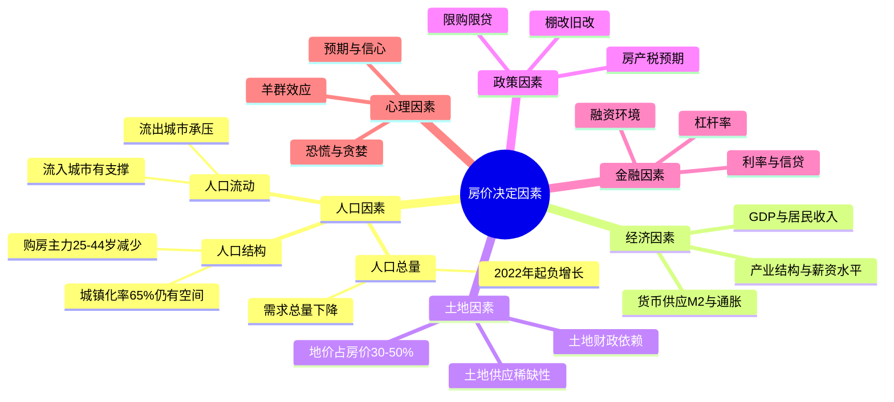
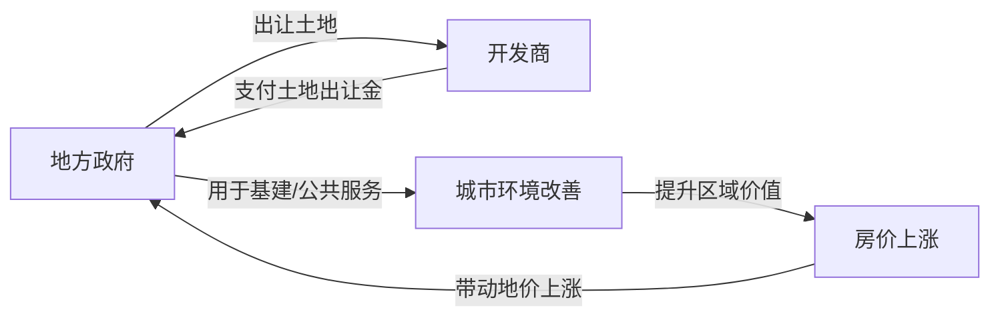
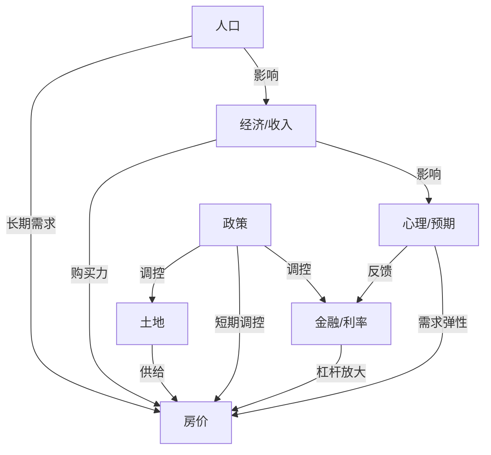

## 二、房价的核心决定因素

房价不是随机波动的数字，而是多重力量博弈的结果。理解这些力量的本质、作用机制和相互关系，是做出正确投资决策的前提。本节将从经济学底层逻辑出发，系统拆解影响房价的六大核心因素，并建立一套可操作的分析框架。

### 📊 房价影响因素全景图

> **核心结论**：人口是房价的长期决定因素，政策是短期最大变量，金融是中期放大器。中国人口拐点已至，城镇化速度放缓，这意味着全国房价普涨的时代已经结束。未来房产投资的核心逻辑是"选对城市"——人口持续流入的一线和强二线城市核心区仍有支撑，而人口流出的三四线城市将面临长期下行压力。

### 2.1 人口因素（长期最核心）

人口是房地产需求的根本来源。房子最终是给人住的，脱离人口谈房价就是无根之木。

#### 2.1.1 人口总量：从增量时代到存量时代

中国人口在2022年出现了历史性拐点——总人口首次负增长，全年减少85万人。2023年进一步减少208万人，2024年减少约139万人。这不是短期波动，而是不可逆转的长期趋势。

**负增长的传导机制：**

| 时间维度 | 影响路径 | 影响程度 |
|---------|---------|---------|
| 短期（1-3年） | 心理预期改变，购房意愿下降 | 较弱 |
| 中期（3-10年） | 适龄购房人口减少，需求萎缩 | 中等 |
| 长期（10年+） | 总需求持续收缩，库存压力加大 | 强烈 |

关键数据：中国总和生育率已降至约1.0左右，远低于2.1的更替水平。这意味着每一代人口约为上一代的一半。按此趋势，到2050年中国总人口可能降至12亿以下，比峰值减少约2亿人。

但需要注意：人口下降对不同城市的影响是不对称的。一线和强二线城市凭借优质资源，可以"虹吸"其他城市的人口，维持甚至增加本地需求。而三四线城市则面临"人口流失+自然减少"的双重压力。

#### 2.1.2 人口结构：谁在买房

**城镇化率**：目前约66%，发达国家通常在80%以上。理论上还有14个百分点的提升空间，按每年约1个百分点的速度，还需要10-15年。但城镇化速度在放缓——从高峰期的每年1.4个百分点降至目前的约0.5个百分点。更重要的是，新增城镇化人口主要流向大城市群，而非均匀分布。

**年龄结构**：25-44岁是购房的主力年龄段。这个群体的规模正在快速缩小：

- 1990年代年均出生人口约2000万
- 2000年代降至约1600万
- 2010年代进一步降至约1500万
- 2020年代骤降至约900-1000万

这意味着10-20年后，购房主力人群将比现在减少约30-40%。

**家庭规模**：中国平均家庭户规模从2000年的3.44人下降到2020年的2.62人。单人户、二人户占比持续上升。小家庭化趋势意味着同样数量的人口需要更多住房单元，部分对冲了人口减少的影响。但这个因素的量级远小于人口总量下降的影响。

#### 2.1.3 人口流动：城市间的零和博弈

人口流动是理解城市房价分化的核心钥匙。在总人口下降的大背景下，城市之间的人口竞争是零和博弈——你的增长就是别人的减少。

**人口流动的规律：**
- 经济机会是第一驱动力（就业、薪资、产业）
- 公共资源是第二驱动力（教育、医疗、文化）
- 生活成本是调节变量（房价过高会抑制流入）
- 城市群效应：核心城市带动周边，形成都市圈

**2020-2024年人口流动格局：**
- 持续流入：长三角（杭州、合肥、南京）、珠三角（深圳、广州、佛山）、成渝（成都）
- 相对稳定：北京（受控人口规模）、上海（有所回升）
- 持续流出：东北大部分城市、中西部三四线城市、资源枯竭型城市

**关键判断**：看一个城市的房价前景，首先要看它的人口是流入还是流出。人口流入不保证房价一定涨，但人口流出几乎意味着房价必然承压。

### 2.2 经济因素（决定购买力）

#### 2.2.1 GDP增长与居民收入

经济增长通过两条路径影响房价：一是提高居民收入，增强购房能力；二是提升城市吸引力，增加住房需求。

GDP增速每下降1个百分点，对房价的影响是间接但深远的。2010年前后中国GDP增速在10%以上，房价年涨幅普遍超过15%。2020年后GDP增速降至5%左右，多数城市房价进入横盘或下跌通道。

更直接的指标是**居民可支配收入增速**。当收入增速持续高于房价增速时，房价收入比下降，购买力增强；反之则购买力减弱。过去几年，多数城市居民收入增速已经跑赢房价涨幅（因为房价在跌），这实际上是购买力在修复。

#### 2.2.2 产业结构与薪资水平

不同产业的薪资水平差异巨大，这直接影响了不同城市的房价天花板：

| 产业类型 | 代表城市 | 平均薪资水平 | 对房价的支撑力 |
|---------|---------|------------|-------------|
| 金融 | 上海、深圳、北京 | 高 | 极强 |
| 互联网/科技 | 杭州、深圳、北京 | 高 | 极强 |
| 制造业 | 东莞、苏州、佛山 | 中等 | 中等 |
| 资源型 | 鄂尔多斯、大庆 | 波动大 | 弱且不稳定 |
| 农业主导 | 多数三四线 | 较低 | 弱 |

一个城市如果有多个高薪产业聚集，其房价就有坚实的收入支撑。反之，如果产业结构单一且薪资水平低，房价上涨就缺乏基本面支持。

#### 2.2.3 货币供应（M2）与资产价格

M2（广义货币供应量）是理解中国房价绕不开的变量。过去20年，中国M2从2004年的约25万亿增长到2024年的约313万亿，增长约12倍。同期，一线城市房价涨幅大致也在10-15倍。

这不是巧合。货币超发→资产价格上涨，是全球性的规律。当大量货币涌入经济体，而实体经济无法完全吸收时，多余的资金会涌入资产市场（房地产、股市），推高价格。

**M2增速放缓的影响：**
- 2007年前后：M2年增速约17-18%，房价高速上涨
- 2015年前后：M2年增速降至12%左右，房价增速放缓
- 2023-2024年：M2年增速约8-10%，房价多数城市下跌

M2增速从两位数降至个位数，意味着货币推动资产价格上涨的动力在减弱。这是一个结构性变化，不是短期波动。

### 2.3 土地因素（供给端的核心）

#### 2.3.1 土地供应的稀缺性

土地是房地产的原材料，土地供应直接决定了住房供给。中国的土地制度是国有制，地方政府是唯一的土地供应方，这使得土地供应具有垄断性。

**土地稀缺性的层次：**
- **物理稀缺**：一线城市可用于开发的土地确实有限（深圳最为典型，面积仅1997平方公里）
- **制度稀缺**：土地供应由政府控制，可以通过控制供地节奏来影响市场
- **区位稀缺**：核心区位的土地具有不可替代性（靠近CBD、地铁、学校）

2021年后，全国土地市场大幅降温，土地出让收入从2021年的8.7万亿降至2023年的约5.8万亿。开发商拿地意愿下降，意味着未来2-3年新房供应将减少。供应减少是否能支撑房价，取决于需求端是否同步萎缩。

#### 2.3.2 土地财政与房价的共生关系

地方政府对土地出让收入的依赖是中国房地产市场的独特现象。土地出让收入一度占地方财政收入的40%以上。

**土地财政的传导链：**

这个正反馈循环在过去20年推动了中国城市的快速建设，也推高了房价。但当循环断裂时（土地卖不出去→财政紧张→基建放缓→城市吸引力下降），就会形成负反馈。

地价通常占房价的30-50%（一线城市更高）。地价下跌最终会传导到房价，因为开发商的拿地成本降低了。2022-2024年，多个城市的地价较峰值下降了30-50%，这意味着未来入市的新房成本更低，可能进一步压低周边二手房价格。

### 2.4 政策因素（短期最大变量）

政策是中国房地产市场短期波动的最大驱动力。一纸文件可以在一夜之间改变市场预期。

#### 2.4.1 限购政策

限购通过限制购买资格来直接抑制需求。中国从2010年开始在主要城市实施限购，2021年前后是最严时期。

**限购松绑的市场反应：**
- 短期（1-3个月）：成交量明显放大，被压制的需求集中释放
- 中期（3-12个月）：效果递减，取决于基本面是否支撑
- 长期：限购本身不创造需求，只是改变需求的时间分布

2023-2024年，多数城市已经大幅放松甚至取消限购，但效果有限。这说明当前房价下跌不是政策限制导致的，而是基本面（人口、收入、预期）在起作用。

#### 2.4.2 限贷与利率政策

信贷政策是影响房价最有效的短期工具。它直接改变了购房者的支付能力。

**关键变量：**
- **首付比例**：从30%降到20%，购买力提升约15%（同样预算能买更贵的房子）
- **贷款利率**：利率从6%降到4%，30年贷款的月供减少约25%，总利息减少约40%
- **贷款额度**：公积金贷款上限、商业贷款审批松紧

2024年，首套房贷利率降至历史低位（约3.0-3.5%），首付比例降至15-20%，但市场反应仍然平淡。这表明问题不在于购买力不足，而在于购买意愿不足——人们对未来房价上涨缺乏信心。

#### 2.4.3 房产税

房产税是悬在房地产市场上方的达摩克利斯之剑。它会从根本上改变持有房产的成本结构。

**房产税的影响测算：**

假设一套价值500万的房产，按国际惯例1-2%的税率：
- 年缴税额：5-10万元
- 相当于月供增加4000-8000元
- 对投资回报率的影响：从2%的租金回报直接变为0-负值

这将迫使大量投资性房产进入市场，增加供给，压低价格。目前房产税仅在上海和重庆有小范围试点（税率极低，影响有限），但全面推行的预期始终存在，对市场心理产生持续压制。

#### 2.4.4 棚改与旧改

棚改货币化是2016-2018年三四线城市房价暴涨的最大推手。其机制是：政府拆除旧房→给居民现金补偿→居民拿着现金去买新房→开发商卖完房继续拿地→政府用土地收入继续搞棚改。

这个循环在2019年棚改规模大幅缩减后断裂，三四线城市房价随之回落。这是一个典型的政策驱动房价的案例——政策来时涨得猛，政策退时跌得也狠。

### 2.5 金融因素（中期放大器）

#### 2.5.1 利率周期

利率是影响房价最重要的金融变量。低利率降低购房成本，增加需求；同时降低其他投资回报，促使资金流入房地产。

**利率对房价的量化影响：**

以贷款100万、30年等额本息为例：

| 贷款利率 | 月供（元） | 总利息（万） | 较基准节省（万） |
|---------|-----------|------------|--------------|
| 6.0% | 5,996 | 115.8 | — |
| 5.0% | 5,368 | 93.3 | 22.5 |
| 4.0% | 4,774 | 71.9 | 43.9 |
| 3.5% | 4,490 | 61.6 | 54.2 |
| 3.0% | 4,216 | 51.8 | 64.0 |

利率从6%降到3%，月供减少30%，总利息节省64万。这意味着在相同月供承受能力下，购房者可以多贷近40%的款。利率下降对房价有显著的正向推动作用。

中国房贷利率从2021年的约5.5-6.0%降至2024年的约3.0-3.5%，降幅超过200个基点，是历史罕见的宽松周期。但即便如此，市场反应仍然冷淡，说明其他因素（预期、人口）的压制力度更大。

#### 2.5.2 杠杆率与金融风险

居民杠杆率（居民债务/GDP）从2010年的约28%上升到2023年的约63%，已接近发达国家平均水平。继续加杠杆的空间有限。

**杠杆率的双刃剑效应：**
- 上行期：杠杆放大收益，房产增值远超自有资金回报
- 下行期：杠杆放大亏损，首付可能被跌穿

举例：100万房产，首付30万，贷款70万。房价跌20%后，房产价值80万，扣除贷款70万，净资产仅10万——亏损67%（从30万到10万）。这就是杠杆在下行期的杀伤力。

#### 2.5.3 开发商融资环境

开发商的融资能力直接影响新房供应和土地市场。2021年后"三道红线"政策导致多家大型房企暴雷（恒大、碧桂园等），新房供应急剧收缩，土地市场大幅降温。

融资环境的传导链：开发商融资困难→拿地减少→新房供应减少→短期可能支撑存量房价→但烂尾风险增加→购房者信心下降→需求也减少。

### 2.6 心理与预期因素（被低估的力量）

#### 2.6.1 预期的自我实现

房地产市场存在强烈的自我实现预言效应。当多数人预期房价上涨时，会加速入市，推高需求，房价真的上涨；当多数人预期房价下跌时，会持币观望，减少需求，房价真的下跌。

2021年前，"房价永远涨"是深入人心的信念，支撑了大量投资性购房。2022年后，随着房价持续下跌，这个信念被打破，市场进入"越跌越不买"的负反馈循环。

#### 2.6.2 羊群效应

房地产市场的羊群效应极为明显。新闻报道房价上涨→更多人入市→中介和媒体渲染紧张气氛→更多人恐慌性购买→房价进一步上涨。下跌时则反向运作。

#### 2.6.3 信心的重建需要时间

从历史经验看，房价下行周期中，信心的恢复通常滞后于价格企稳。即使价格已经见底，人们仍然需要看到持续数月甚至数年的稳定数据后才愿意重新入市。日本的经验表明，这个信心重建过程可能长达10-20年。

### 2.7 六大因素的交互关系

这六大因素不是孤立运作的，它们之间存在复杂的相互作用：

**典型场景分析：**

| 场景 | 人口 | 经济 | 土地 | 政策 | 金融 | 预期 | 房价走势 |
|-----|------|------|------|------|------|------|---------|
| 2016-2018棚改潮 | 中性 | 稳定 | 收缩 | 强刺激 | 宽松 | 乐观 | 三四线暴涨 |
| 2020-2021调控期 | 中性 | 稳定 | 正常 | 强收紧 | 收紧 | 分化 | 涨幅收窄 |
| 2022-2024下行期 | 负面 | 放缓 | 冷淡 | 转宽松 | 宽松 | 悲观 | 普遍下跌 |
| 理想上行期 | 正面 | 强劲 | 紧张 | 支持 | 宽松 | 乐观 | 全面上涨 |

当前（2024-2025年）的困境在于：政策和金融已经大幅宽松，但人口和预期两个最根本的因素是负面的，导致宽松政策的效果大打折扣。

### 2.8 投资者实操框架

理解了六大因素后，投资者需要一个可操作的分析框架来评估具体城市和具体房产的投资价值。

#### 2.8.1 城市评估清单

在选择投资城市时，按以下维度打分（每项1-5分）：

| 维度 | 评估指标 | 数据来源 | 权重 |
|-----|---------|---------|-----|
| 人口趋势 | 近3年常住人口变化 | 统计公报 | 25% |
| 经济活力 | GDP增速、人均可支配收入 | 统计公报 | 20% |
| 产业结构 | 高薪产业占比、就业机会 | 招聘平台数据 | 15% |
| 土地供应 | 近年土地出让面积变化 | 自然资源局 | 10% |
| 库存去化 | 新房去化周期（月） | 中指院/克而瑞 | 15% |
| 政策环境 | 限购松绑程度、人才政策 | 政府官网 | 5% |
| 租金回报 | 租金/房价比 | 贝壳/链家 | 10% |

**评分解读：**
- 4.0分以上：具备投资价值，可重点考虑
- 3.0-4.0分：一般，需结合具体区位和产品判断
- 3.0分以下：不建议投资，风险较高

#### 2.8.2 关键指标的获取方法

**人口数据：** 查阅各市统计局发布的年度统计公报，重点关注"常住人口"和"户籍人口"的变化。如果常住人口持续增长但户籍人口不变或下降，说明有大量外来人口流入。

**库存去化周期：** 中指研究院、克而瑞等机构每月发布各城市库存数据。去化周期超过18个月属于高库存，价格承压；低于12个月属于低库存，价格有支撑。

**租金回报率：** 用年租金除以当前房价。中国多数城市当前租金回报率在1.5-2.5%之间。如果租金回报率低于无风险利率（国债收益率），纯投资角度来看房产缺乏吸引力。

#### 2.8.3 常见误区

**误区一："城市GDP高，房价就一定高"**
GDP总量大不等于居民购买力强。要看人均可支配收入和房价收入比。重庆GDP总量很高，但人均收入有限，房价远低于GDP更低的厦门。

**误区二："利率低就应该买房"**
低利率降低了持有成本，但如果房价在下跌，利率再低也可能亏损。2023-2024年利率处于历史低位，但多数城市房价仍在下跌。

**误区三："人口流入的城市房价一定涨"**
人口流入是必要条件但不是充分条件。还要看流入人口的购买力、当地库存量、收入房价比等因素。有些城市人口在流入，但新房供应量更大，房价依然承压。

**误区四："政策放松了房价就会涨"**
政策放松只是去除了限制，不等于创造了需求。如果基本面（人口、收入、预期）不支撑，放松限购只会带来短暂的成交量反弹，不会改变价格趋势。

**误区五："一线城市永远安全"**
一线城市整体抗跌能力确实更强，但内部分化也很严重。一线城市的远郊板块、老破小、商住公寓等产品，下跌幅度可能超过二线城市的核心区。"买一线"不等于"随便买"。

### 2.9 不同城市层级的房价逻辑

#### 2.9.1 一线城市

**支撑因素：** 人口持续流入（尽管增速放缓）、优质公共资源集中、土地稀缺、高薪产业聚集。

**风险因素：** 房价收入比极高（普遍超过30倍）、政策调控压力大、部分区域供应过剩（远郊新城）。

**核心逻辑：** 一线城市的房产价值高度分化。核心区（地铁沿线、优质学区、成熟商圈）有长期支撑；远郊区、缺乏配套的新城则风险较高。

#### 2.9.2 强二线城市

代表城市：杭州、成都、南京、苏州、武汉、合肥等。

**支撑因素：** 产业承接（从一线溢出）、人才政策吸引力、省会首位度提升、城镇化增量。

**风险因素：** 新房供应量大、土地财政依赖度高、经济下行时抗风险能力弱于一线。

**核心逻辑：** 强二线是未来10年中国房地产最具机会的板块，但也是分化最严重的板块。选对城市和板块至关重要。

#### 2.9.3 三四线及以下城市

**支撑因素：** 几乎没有长期支撑因素。短期可能有政策刺激（如新一轮棚改），但不可持续。

**风险因素：** 人口持续流出、产业基础薄弱、库存过剩、土地财政难以为继。

**核心逻辑：** 除少数特殊城市（如核心城市群的卫星城、特色产业城市）外，三四线城市的房产不具备投资价值，仅适合自住需求。

### 2.10 历史镜鉴：其他国家的房价决定因素

**日本（1990年后）：** 人口老龄化+经济停滞→房价持续下跌超过20年。东京核心区在2010年代才开始回升，偏远地区至今未恢复。教训：人口是长期决定因素，一旦拐头很难逆转。

**美国（2008年后）：** 次贷危机→房价暴跌→低利率+人口增长→2012年后持续回升。启示：如果人口基本面健康，房价下跌后可以恢复。

**韩国（2020年后）：** 人口负增长+首尔人口外迁→房价承压。但首尔核心区因资源集中仍有支撑。启示：即使全国人口下降，核心城市仍可维持。

中国的情况更接近日本而非美国——人口拐点已至，且生育率极低。但中国的优势在于城镇化率仍有提升空间（日本1990年已超过77%），以及政府对市场的调控能力更强。最终结果可能是介于日美之间——全国普涨不再，但核心城市仍有结构性机会。
