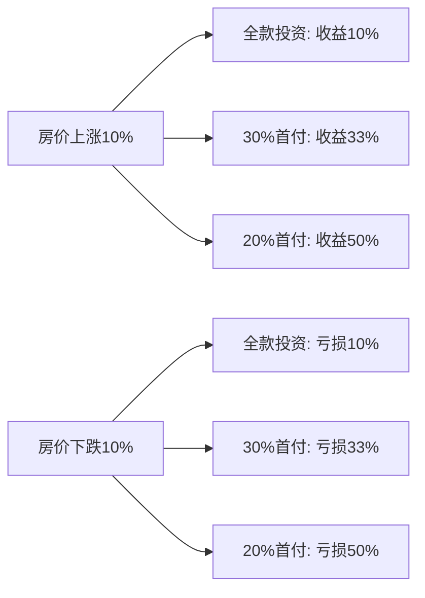
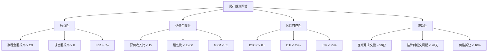

## 三、关键评估指标

理解了房地产的资产属性（第一章）和房价的决定因素（第二章）之后，你已经具备了"看懂房产"的能力。但"看懂"不等于"算清"——一套房子到底值不值得买、该出多少钱、未来能赚多少，这些决策最终要落到数字上。

本节系统介绍房产投资中必须掌握的核心评估指标。这些指标不是学术概念，而是每一个理性房产投资者在做决策时必须计算、必须比较的实操工具。掌握它们，你就能从"感觉这套房不错"进化到"这套房的年化收益率是4.2%，租售比为1:580，在当前市场环境下属于中等偏下水平"——用数据说话，而不是凭感觉下注。

### 1. 为什么需要量化评估指标

房产投资中最大的陷阱是"感性决策"。很多人买房的逻辑是：

- "这个小区环境好" → 环境好的小区不一定能租出去
- "学区房肯定涨" → 学区政策随时可能调整
- "这个地段未来有地铁" → 地铁规划从立项到通车平均需要5-8年
- "我朋友在这里买了赚了" → 他买的时间点和你的完全不同

这些判断并非毫无道理，但它们缺少一个关键环节：**量化验证**。一套环境好、有学区、未来有地铁的房子，如果价格已经被透支到收益率只有1.5%，那它的投资价值可能还不如一套看起来普通但租售比合理的房子。

量化指标的核心价值在于：

1. **消除主观偏见**：用数字代替感觉，减少情绪化决策
2. **横向可比**：不同城市、不同户型、不同类型的投资可以用同一把尺子衡量
3. **纵向追踪**：同一个指标在时间维度上的变化，能揭示趋势
4. **风险预警**：当关键指标偏离正常区间时，提醒你注意风险

### 2. 投资回报类指标

这类指标回答一个核心问题：**这笔投资能赚多少钱？**

#### 2.1 租售比（Price-to-Rent Ratio）

**定义：** 房屋总价与年租金收入的比值。国际上通用的计算方式是"房价÷年租金"，在中国习惯用"每平米月租金÷每平米房价"来表示。

**计算公式：**

```text
租售比 = 房屋总价 ÷ 年租金收入

示例：
  房价：300万元
  月租金：6,000元（年租金：72,000元）
  租售比 = 3,000,000 ÷ 72,000 = 41.7（即1:417）
```

国际经验法则：

| 租售比区间 | 含义 | 投资建议 |
|-----------|------|---------|
| 1:100 - 1:200 | 租金收益极高 | 异常情况，需核实数据真实性 |
| 1:200 - 1:300 | 租金回报合理 | 具有投资价值 |
| 1:300 - 1:400 | 租金回报偏低 | 需要靠房价上涨来弥补 |
| 1:400 - 1:500 | 租金回报很差 | 投资风险较高 |
| >1:500 | 租金几乎可以忽略 | 纯投机，不适合投资 |

**中国市场的现实：** 中国一线城市的租售比普遍在1:500到1:800之间，远超国际警戒线。这意味着在一线城市买房出租，单纯靠租金回本需要40-60年以上。这个数字背后有两层含义：

- **正面解读**：市场预期房价还有上涨空间，买家愿意接受低租金回报来换取资产增值
- **负面解读**：如果房价不再上涨，这个收益率连银行定期存款都跑不过

**实操要点：**

计算租售比时要注意几个常见陷阱：

1. **用实际成交租金，而非挂牌价**：很多平台显示的租金偏高，实际成交价可能低10%-20%
2. **扣除空置期**：一年中不可能365天都租满，按11个月计算更现实
3. **扣除维护成本**：物业费、维修费、家具家电折旧，这些通常由房东承担
4. **区分毛租金和净租金**：毛租金是租客付的总金额，净租金要减去中介费、空置损失、维护费

**修正后的净租售比计算：**

```text
净租售比 = 房屋总价 ÷ 净年租金收入

净年租金 = 月租金 × 11（考虑1个月空置）- 年物业费 - 年维修预算 - 中介费摊销

示例：
  房价：300万元
  月租金：6,000元
  年物业费：3,600元（300元/月）
  年维修预算：2,000元
  中介费摊销：3,000元（一次性付一个月，按2年租约摊销）
  
  净年租金 = 6,000 × 11 - 3,600 - 2,000 - 3,000 = 57,400元
  净租售比 = 3,000,000 ÷ 57,400 = 52.3（即1:523）
```

#### 2.2 毛租金回报率（Gross Rental Yield）

**定义：** 年租金收入占房屋总价的百分比，是租售比的倒数形式，更直观地反映收益率。

**计算公式：**

```text
毛租金回报率 = (年租金收入 ÷ 房屋总价) × 100%

示例：
  年租金：72,000元
  房价：3,000,000元
  毛租金回报率 = (72,000 ÷ 3,000,000) × 100% = 2.4%
```

这个指标的优势在于直观——你一眼就能看出"这套房每年能给我带来多少百分比的租金回报"。

**不同城市的毛租金回报率参考（2024年数据）：**

| 城市 | 住宅平均毛租金回报率 | 特点 |
|------|-------------------|------|
| 北京 | 1.5% - 2.0% | 房价极高，租金回报率最低 |
| 上海 | 1.6% - 2.2% | 核心区极低，外环相对较好 |
| 广州 | 2.0% - 2.8% | 在一线城市中回报率最高 |
| 深圳 | 1.3% - 1.8% | 房价收入比全国最高 |
| 成都 | 2.5% - 3.5% | 新一线中表现较好 |
| 长沙 | 3.0% - 4.0% | 房价控制严格，租售比全国领先 |
| 重庆 | 2.8% - 3.5% | 供应量大但租金也相对稳定 |

#### 2.3 净租金回报率（Net Rental Yield）

**定义：** 在毛租金回报率基础上，扣除所有持有成本后的实际收益率。这是评估"买房出租"是否划算的核心指标。

**计算公式：**

```text
净租金回报率 = [(年租金收入 - 年持有成本) ÷ 房屋总价] × 100%

年持有成本包括：
  - 物业费
  - 维修基金
  - 房屋保险
  - 房产税（如适用）
  - 物业租金所得税
  - 房屋折旧/维护预留
  - 空置损失
  - 管理费（如果委托中介管理）
```

**详细计算示例：**

假设购买一套二线城市的公寓用于出租：

```text
基本信息：
  购入价格：150万元
  月租金：3,500元

年收入：
  毛租金收入 = 3,500 × 12 = 42,000元
  空置损失（1个月）= -3,500元
  实际租金收入 = 38,500元

年支出：
  物业费 = 2,400元（200元/月）
  维修预留 = 2,000元
  个人所得税（租金的10%，各地政策不同）= 3,850元
  房屋保险 = 500元
  管理费（委托中介，租金的8%）= 3,080元
  总持有成本 = 11,830元

净租金收入 = 38,500 - 11,830 = 26,670元

净租金回报率 = (26,670 ÷ 1,500,000) × 100% = 1.78%
```

注意：从毛租金回报率的2.8%到净租金回报率的1.78%，缩水了近40%。这就是为什么经验丰富的投资者永远只看净租金回报率。

#### 2.4 现金回报率（Cash-on-Cash Return）

**定义：** 年净现金流占实际投入现金的百分比。与净租金回报率的关键区别在于：它考虑了杠杆（贷款）的影响。

**计算公式：**

```text
现金回报率 = (年净现金流 ÷ 初始投入现金) × 100%

初始投入现金 = 首付 + 购房税费 + 装修费 + 其他前期费用

年净现金流 = 年租金收入 - 年房贷还款 - 年持有成本
```

**为什么这个指标最重要？**

大多数房产投资者使用贷款，而非全款购房。杠杆会同时放大收益和风险。现金回报率反映的是你"实际掏出来的钱"每年能赚多少——这才是真正的投资效率。

**全款 vs 贷款对比示例：**

```text
同一套房产：
  房价：200万元
  月租金：5,000元
  年净租金收入（扣除非贷款成本）：48,000元

方案A - 全款购买：
  初始投入：200万元
  年净现金流：48,000元
  现金回报率 = 48,000 ÷ 2,000,000 = 2.4%
  净租金回报率 = 2.4%（与现金回报率相同）

方案B - 贷款购买（首付30%，利率4.2%，30年等额本息）：
  首付：60万元
  购房税费：6万元
  装修：15万元
  初始投入合计：81万元
  
  贷款金额：140万元
  月供 = 6,849元（等额本息）
  年房贷还款 = 82,188元
  
  年净现金流 = 48,000 - 82,188 = -34,188元（负现金流！）
  现金回报率 = -34,188 ÷ 810,000 = -4.22%
```

这个例子揭示了一个残酷的现实：在租售比极低的一线城市，贷款买房出租几乎必然是负现金流。投资者的收益完全依赖于房价上涨——如果房价不涨甚至下跌，就是一笔持续亏损的投资。

**正向现金回报率的条件：**

```text
当且仅当：月租金 > 月供 + 月持有成本
才有正向现金流

这通常要求：
1. 租售比 < 1:300（即毛租金回报率 > 3.3%）
2. 或者首付比例很高（>50%）
3. 或者贷款利率很低（<3%）
```

#### 2.5 内部收益率（IRR, Internal Rate of Return）

**定义：** 考虑了所有现金流（买入支出、持有期间的净租金收入、卖出时的回收金额）后的年化复合收益率。这是评估房产投资的终极指标。

**计算公式：**

IRR没有简单的手算公式，需要通过试错法或财务计算器求解。其数学定义是使所有现金流的净现值（NPV）等于零的折现率：

```text
NPV = 0 = -C₀ + C₁/(1+r) + C₂/(1+r)² + ... + Cₙ/(1+r)ⁿ + P/(1+r)ⁿ

其中：
  C₀ = 初始投入（首付+税费+装修）
  Cₙ = 第n年的净租金现金流
  P = 卖出时的净回收金额（售价-贷款余额-交易税费）
  r = IRR（内部收益率）
  n = 持有年限
```

**Python 计算示例：**

```python
import numpy as np
from scipy.optimize import brentq

def calculate_irr(cash_flows):
    """计算内部收益率
    cash_flows: 列表，第一个元素为初始投入（负数），后续为每年净现金流
    """
    def npv(rate):
        return sum(cf / (1 + rate) ** i for i, cf in enumerate(cash_flows))
    
    return brentq(npv, -0.5, 1.0)

# 示例：持有5年的房产投资
initial_investment = -810000  # 初始投入81万
annual_net_cf = -34188         # 年净现金流（负值表示补贴租金不足）
sale_price = 2300000           # 5年后卖出价格
remaining_loan = 1280000       # 剩余贷款
selling_costs = 120000         # 卖出税费
net_sale = sale_price - remaining_loan - selling_costs  # 90万

cash_flows = [
    initial_investment,
    annual_net_cf,
    annual_net_cf,
    annual_net_cf,
    annual_net_cf,
    annual_net_cf + net_sale
]

irr = calculate_irr(cash_flows)
print(f"5年持有IRR: {irr*100:.2f}%")
```

IRR的优势在于它是唯一一个考虑了"时间价值"的指标。同样赚100万，3年赚到和10年赚到，投资价值完全不同。

**IRR的决策标准：**

| IRR 水平 | 含义 | 对比基准 |
|----------|------|---------|
| < 3% | 跑不赢国债，不值得 | 10年期国债收益率约2.5%-2.8% |
| 3% - 5% | 勉强及格，考虑风险后性价比低 | 银行大额存单2.5%-3% |
| 5% - 8% | 合理回报，可以考虑 | 优质债券基金4%-6% |
| 8% - 12% | 较好回报，值得投资 | 股票指数基金长期均值8%-10% |
| > 12% | 优秀回报，但需警惕风险 | 超越大多数资产类别 |

### 3. 估值类指标

这类指标回答的问题是：**这套房贵不贵？**

#### 3.1 房价收入比（Price-to-Income Ratio）

**定义：** 房屋总价与家庭年收入的比值，衡量一个家庭不吃不喝多少年能买下一套房。

**计算公式：**

```text
房价收入比 = 房屋总价 ÷ 家庭年收入

示例：
  房价：300万元
  家庭年收入：30万元
  房价收入比 = 300 ÷ 30 = 10（即不吃不喝10年）
```

**国际经验标准：**

| 房价收入比 | 评估 | 说明 |
|-----------|------|------|
| 3 - 6 | 合理区间 | 国际公认的可负担标准 |
| 6 - 9 | 偏高 | 购房压力较大，但尚可承受 |
| 9 - 12 | 过高 | 严重挤压家庭消费和其他投资 |
| > 12 | 极度扭曲 | 房价脱离居民收入基本面 |

**中国主要城市房价收入比（2024年）：**

| 城市 | 房价收入比 | 解读 |
|------|-----------|------|
| 深圳 | 30+ | 全球最难买房的城市之一 |
| 北京 | 25+ | 核心区基本与普通家庭无缘 |
| 上海 | 22+ | 内环内需要两代人积蓄 |
| 厦门 | 20+ | 人口规模不大但房价畸高 |
| 广州 | 15+ | 在一线城市中最"友好" |
| 成都 | 12+ | 新一线中偏高 |
| 长沙 | 8+ | 全国省会城市中的"洼地" |
| 重庆 | 9+ | 供应量大压低了收入比 |

**深层解读：**

房价收入比偏高并不意味着"不能买"或"一定会跌"。在中国，它反映的是：

1. **财富存量分布不均**：很多家庭买房靠的不是工资收入，而是父母资助、拆迁补偿、投资收益等存量财富
2. **预期差异**：如果预期房价每年涨5%，接受15倍的房价收入比在逻辑上是自洽的
3. **租金替代**：高房价收入比的城市往往也是人口净流入城市，租房需求旺盛

但对于个人投资者而言，房价收入比过高的城市意味着：你买入时的价格可能已经透支了未来的增长空间。

#### 3.2 房租收入比（Rent-to-Income Ratio）

**定义：** 月租金占月收入的比例，衡量租房者的负担程度。从投资者角度，这个指标反映了潜在租客群体的支付能力上限。

**计算公式：**

```text
房租收入比 = (月租金 ÷ 月收入) × 100%

投资者视角的解读：
  如果目标租客月收入1万元，房租收入比30%意味着月租上限是3,000元
  当你的租金定到4,000元时，可租人群急剧缩小
```

**一般标准：**

| 房租收入比 | 租客体验 | 投资者启示 |
|-----------|---------|-----------|
| < 20% | 轻松 | 租客群体庞大，空置风险低 |
| 20% - 30% | 合理 | 主流水平，健康租赁市场 |
| 30% - 40% | 压力较大 | 租客对价格敏感，涨租空间有限 |
| > 40% | 难以承受 | 租客流失风险高，空置期可能延长 |

**对投资者的实际意义：**

房租收入比不是用来评估你的房子的，而是用来评估你的**租金定价策略**。当目标区域的房租收入比已经很高时，意味着：

- 租金继续上涨的空间很小
- 租客的违约风险更高（财务压力大）
- 经济下行时，这些区域的空置率会率先上升

#### 3.3 租金乘数（Gross Rent Multiplier, GRM）

**定义：** 房价与年租金的比值，本质上与租售比相同，但在国际房产投资中更常用作快速筛选工具。

**计算公式：**

```text
GRM = 房屋售价 ÷ 年毛租金

示例：
  售价：180万元
  年毛租金：54,000元（月租4,500元）
  GRM = 1,800,000 ÷ 54,000 = 33.3
```

**GRM的使用方法：**

GRM最大的价值在于**快速比较**。当你需要在短时间内筛选大量房源时，GRM能帮你快速排除明显不划算的选项。

```text
快速筛选流程：
  1. 计算每个候选房源的GRM
  2. 同一区域、同类型房产按GRM排序
  3. GRM最低的，租金回报最高
  4. 选择GRM最低的3-5套，再做详细分析
```

**GRM的局限性：**

GRM是"毛"指标，不考虑空置率、运营成本、融资结构。两个GRM相同的物业，实际收益可能差异巨大：

```text
物业A：GRM=30，物业费低，无需维修，稳定长租客
物业B：GRM=30，物业费高，频繁维修，租客周转快

→ 实际投资回报：A >> B
```

所以GRM只适合做初筛，不能作为最终决策依据。

### 4. 风险与杠杆类指标

这类指标回答的问题是：**这笔投资的风险有多大？我的财务安全边际够不够？**

#### 4.1 首付比例与贷款价值比（LTV, Loan-to-Value）

**定义：** LTV = 贷款金额 ÷ 房产评估价值，反映杠杆程度。

**计算公式：**

```text
LTV = (贷款金额 ÷ 房产评估价值) × 100%

示例：
  房价：200万元
  首付：60万元（30%）
  贷款：140万元
  LTV = (1,400,000 ÷ 2,000,000) × 100% = 70%
```

**杠杆的双面性：**



**LTV与风险的关系：**

| LTV | 杠杆倍数 | 房价下跌10%时的损失 | 风险等级 |
|-----|---------|-------------------|---------|
| 50%（首付50%） | 2倍 | 本金损失20% | 低 |
| 70%（首付30%） | 3.3倍 | 本金损失33% | 中 |
| 80%（首付20%） | 5倍 | 本金损失50% | 高 |

**负资产风险：** 当房价跌幅超过首付比例时，你将陷入"负资产"——房产价值低于剩余贷款余额。这时即使卖掉房子，你还要倒贴钱给银行。

#### 4.2 偿债覆盖率（DSCR, Debt Service Coverage Ratio）

**定义：** 净运营收入与年债务偿还额的比值，衡量租金收入能否覆盖房贷还款。

**计算公式：**

```text
DSCR = 年净运营收入 ÷ 年债务偿还额

年净运营收入 = 年租金收入 - 运营费用（不含房贷）
年债务偿还额 = 月供 × 12

示例：
  年净运营收入：35,000元
  年房贷还款：82,000元
  DSCR = 35,000 ÷ 82,000 = 0.43
```

**DSCR的解读：**

| DSCR | 含义 | 投资建议 |
|------|------|---------|
| > 1.2 | 租金收入充分覆盖还款 | 安全区间，现金流为正 |
| 1.0 - 1.2 | 基本覆盖，余量不足 | 勉强可行，但抗风险能力弱 |
| 0.8 - 1.0 | 需要自掏腰包补贴差额 | 需要认真评估是否值得 |
| < 0.8 | 大量补贴，依赖房价上涨 | 高风险投机行为 |

**在中国市场的现实：** 一线城市的DSCR普遍在0.3-0.6之间，意味着投资者每月需要额外拿出数千元来补贴房贷。这本质上是在"定投"一套房子，赌的是房价未来涨幅能覆盖这些沉没成本。

#### 4.3 负债率（Debt-to-Income Ratio, DTI）

**定义：** 月度总债务支出占月收入的比例，银行审批贷款的核心指标。

**计算公式：**

```text
DTI = (月总债务支出 ÷ 月总收入) × 100%

月总债务支出 = 房贷月供 + 车贷月供 + 信用卡最低还款 + 其他贷款月供

示例：
  月收入：20,000元
  现有房贷月供：6,000元
  车贷月供：2,000元
  DTI = (8,000 ÷ 20,000) × 100% = 40%
```

**银行的审核标准：**

- **DTI < 50%**：大部分银行可以接受
- **DTI 50%-70%**：审批难度加大，可能要求更高首付或利率上浮
- **DTI > 70%**：基本无法通过银行审批

**个人安全线：**

银行的标准是"能贷给你"，不代表"你应该贷"。理性的个人安全线应该更保守：

```text
安全线建议：
  DTI < 30%：健康，有充足的应急储备空间
  DTI 30%-40%：偏紧，需要严格控制其他支出
  DTI 40%-50%：危险，任何收入中断都可能导致断供
  DTI > 50%：极度危险，不建议增加任何负债
```

#### 4.4 安全边际（Margin of Safety）

**定义：** 来自价值投资的概念，指实际购入价格低于"内在价值"的幅度。在房产投资中，安全边际体现在多个维度。

**安全边际的计算思路：**

```text
安全边际 = (估算合理价值 - 实际购入价格) ÷ 估算合理价值

示例：
  某小区同户型近半年成交均价：280万元
  你的购入价格：245万元
  安全边际 = (2,800,000 - 2,450,000) ÷ 2,800,000 = 12.5%
```

**安全边际的多维体现：**

| 安全边际维度 | 具体表现 | 量化方法 |
|------------|---------|---------|
| 价格安全边际 | 低于市场均价购入 | 对比近期成交价 |
| 租金安全边际 | 租金有上涨空间 | 对比同类房源租金 |
| 现金流安全边际 | 即使租金下降20%仍可覆盖 | 压力测试 |
| 利率安全边际 | 即使利率上升2%仍可承受 | 月供敏感性分析 |
| 流动性安全边际 | 即使市场低迷也能在3个月内出手 | 分析区域成交量 |

### 5. 综合评估框架

单个指标只能反映投资的某一个方面，真正的决策需要综合多个指标。以下是一套实用的综合评估框架。

#### 5.1 房产投资评估矩阵



#### 5.2 决策评分卡模板

在实际决策中，可以为每个指标设定权重和评分，计算综合得分：

```python
# 房产投资评估评分卡

def evaluate_property(scores: dict) -> dict:
    """
    评估一套房产的投资价值
    
    scores 字典的 key 为指标名，value 为 (得分, 权重) 元组
    得分范围: 1-5（1=很差, 5=优秀）
    """
    weights = {
        '净租金回报率':  0.20,  # 收益是核心
        '现金回报率':    0.15,
        'IRR预期':       0.15,
        '房价收入比':    0.10,
        'DSCR':          0.10,
        '安全边际':      0.10,
        '流动性':        0.10,
        '区域前景':      0.10,
    }
    
    total_score = 0
    for metric, (score, weight) in zip(scores.keys(), 
                                        zip(scores.values(), weights.values())):
        total_score += score * weight
    
    if total_score >= 4.0:
        verdict = "强烈推荐"
    elif total_score >= 3.5:
        verdict = "推荐"
    elif total_score >= 2.5:
        verdict = "一般，需要房价上涨来弥补"
    elif total_score >= 2.0:
        verdict = "不推荐，风险收益比不理想"
    else:
        verdict = "强烈不推荐"
    
    return {"综合得分": round(total_score, 2), "评级": verdict}

# 使用示例
scores = {
    '净租金回报率': 2,   # 1.8%，偏低
    '现金回报率':   1,   # 负现金流
    'IRR预期':      3,   # 5%左右，假设房价温和上涨
    '房价收入比':   2,   # 15倍，偏高
    'DSCR':         2,   # 0.5，需补贴
    '安全边际':     3,   # 低于市场价5%购入
    '流动性':       4,   # 核心地段，容易出手
    '区域前景':     4,   # 有产业支撑和人口流入
}

result = evaluate_property(scores)
print(f"综合得分: {result['综合得分']}")
print(f"评级: {result['评级']}")
```

#### 5.3 敏感性分析

任何预测都有误差，好的投资者不会只看"最可能"的情景，而是会分析"如果假设错了会怎样"。

**关键变量敏感性分析表：**

以一套150万元的贷款购买房产为例，分析各变量变化对现金回报率的影响：

| 变量 | 基准假设 | 乐观情景 | 悲观情景 | 对现金回报率的影响 |
|------|---------|---------|---------|-----------------|
| 房价年涨幅 | 3% | 8% | -5% | ±（极大，决定盈亏） |
| 月租金 | 3,500元 | 4,000元 | 2,800元 | ±2%-3% |
| 贷款利率 | 4.2% | 3.5% | 5.5% | ±1%-2% |
| 空置率 | 8% | 0% | 25% | ±1%-2% |
| 维护成本 | 2,000元/年 | 500元/年 | 8,000元/年 | ±0.3%-0.5% |

**核心启示：** 房价涨幅是影响投资回报的最大变量，远超租金、利率等因素。这意味着在房价下行周期中，"买房出租"的投资逻辑极其脆弱。

### 6. 常见误区与纠正

#### 误区一：只看房价涨跌，忽略持有成本

**典型思维：** "这套房5年涨了50万，赚了！"

**真实账本：**

```text
表面收益：+500,000元

实际扣减：
  5年房贷利息：-180,000元
  5年物业费：  -18,000元
  装修折旧：  -50,000元
  维修费用：  -15,000元
  卖出税费：  -80,000元
  中介费用：  -30,000元
  
实际净收益：500,000 - 373,000 = 127,000元
5年总投入（首付+月供）：1,200,000元
实际年化收益率：约2.1%
```

2.1%的年化收益率，连银行大额存单都不如。

#### 误区二：用当前租金预测未来收益

**陷阱：** 租金不是一成不变的。经济下行时租金会下降，新盘集中交付时区域租金会被压低，政策变动（如保障房大量入市）也会冲击租金水平。

**纠正方法：** 用"压力测试租金"——在当前租金基础上打八折来计算，如果打八折后仍然划算，这笔投资才经得起考验。

#### 误区三：忽视流动性成本

**陷阱：** 很多人计算收益时只考虑"买入价"和"卖出价"的差额，却忽略了卖出时的真实摩擦成本。

**房产交易的全部摩擦成本（以卖方视角）：**

```text
假设出售一套持有3年的房产，售价300万元：

1. 增值税及附加（不满2年）：约15万元
   满2年免征（普通住宅）
2. 个人所得税：约6万元（差额的20%或全额的1%-2%）
3. 中介费：约6万元（成交价的2%）
4. 贷款提前还款违约金：约1-3万元
5. 其他杂费：约0.5万元

总摩擦成本：约14-30万元（占房价的4.7%-10%）
```

这意味着你的房产必须至少增值5%-10%，卖出时才能不亏。

#### 误区四：把"自住改善"包装成"投资"

**陷阱：** "我买这套房是改善居住，同时也是投资。"

**真相：** 自住房和投资房的评估标准完全不同。自住房的首要标准是"住着舒服"，投资房的首要标准是"收益划算"。把两者混为一谈，往往两边都不满意。

**建议：** 如果是自住，就按自住的需求（学区、通勤、户型、社区）来决策，不要用投资指标来合理化高价。如果是投资，就严格按照投资指标来筛选，不要因为"自己也想住"而支付溢价。

### 7. 进阶内容：不同投资策略的指标侧重

不同的房产投资策略，对指标的侧重点完全不同：

#### 7.1 长期持有出租

**核心指标优先级：**

```text
1. 净租金回报率（最重要）
2. DSCR（确保现金流可持续）
3. 区域人口流入趋势（确保长期租客来源）
4. 房价收入比（估值参考）
```

**适合的物业类型：** 小户型公寓、学区房、产业园区周边住宅

#### 7.2 翻新转售（Flip）

**核心指标优先级：**

```text
1. 买入价 vs 市场价的折让幅度（安全边际）
2. 预期翻新成本（精确到每一项）
3. 预期售价（参考近期同品质成交）
4. 持有周期（越短越好，降低利息和市场风险）
5. IRR（确保短期收益足够高）
```

**Flip的盈利公式：**

```text
利润 = 售出价 - 买入价 - 翻新成本 - 交易税费 - 持有期间利息 - 时间成本

翻新转售的IRR要求通常 > 20%（年化），否则不如其他投资渠道
```

#### 7.3 REITs投资

**核心指标优先级：**

```text
1. 分红收益率（Dividend Yield）
2. 底层资产质量（出租率、租户质量）
3. 价格/净资产比率（P/NAV，类似股票的PB）
4. 资产管理费率
5. 杠杆率（REITs的负债水平）
```

### 8. 工具推荐

在实际操作中，手动计算上述所有指标既繁琐又容易出错。以下是几个实用的工具和方法：

| 工具 | 用途 | 获取方式 |
|------|------|---------|
| Excel/Google Sheets | 自建投资分析模型 | 最灵活，可完全定制 |
| 贝壳找房APP | 查看小区成交价、租金、挂牌量 | 应用商店下载 |
| 中国房价行情网 | 查看城市/区域房价走势和租售比 | 定制数据查询 |
| 中指研究院 | 专业房地产数据和报告 | 行业报告免费下载 |
| Python + scipy | 计算IRR等复杂指标 | 开源免费 |

**基础 Excel 模板结构建议：**

```text
Sheet 1 - 物业基本信息
  小区名称、地址、面积、楼层、朝向、房龄、挂牌价、成交价

Sheet 2 - 租金分析
  周边租金对比、预期月租、空置率假设、净年租金

Sheet 3 - 成本分析
  首付、税费、装修、贷款参数、月供计算

Sheet 4 - 收益分析
  毛/净租金回报率、现金回报率、IRR计算（5年/10年/20年）

Sheet 5 - 敏感性分析
  房价涨幅、租金变化、利率变化的场景对比

Sheet 6 - 综合评分
  各指标得分和加权总分
```

### 9. 本节小结

房产投资的关键评估指标构成了一个完整的决策体系：

- **收益性指标**（租售比、租金回报率、IRR）告诉你"能赚多少"
- **估值指标**（房价收入比、GRM）告诉你"贵不贵"
- **风险指标**（DSCR、DTI、LTV）告诉你"扛不扛得住"
- **安全边际**告诉你"犯错的空间有多大"

单一指标不能决定一切，但当你系统性地计算、比较、权衡这些指标时，你的决策质量将远超那些"凭感觉买房"的人。

记住：**好的投资决策不是预测未来，而是在不确定性中寻找安全边际**。这些指标就是你丈量安全边际的尺子。
