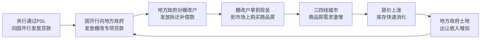
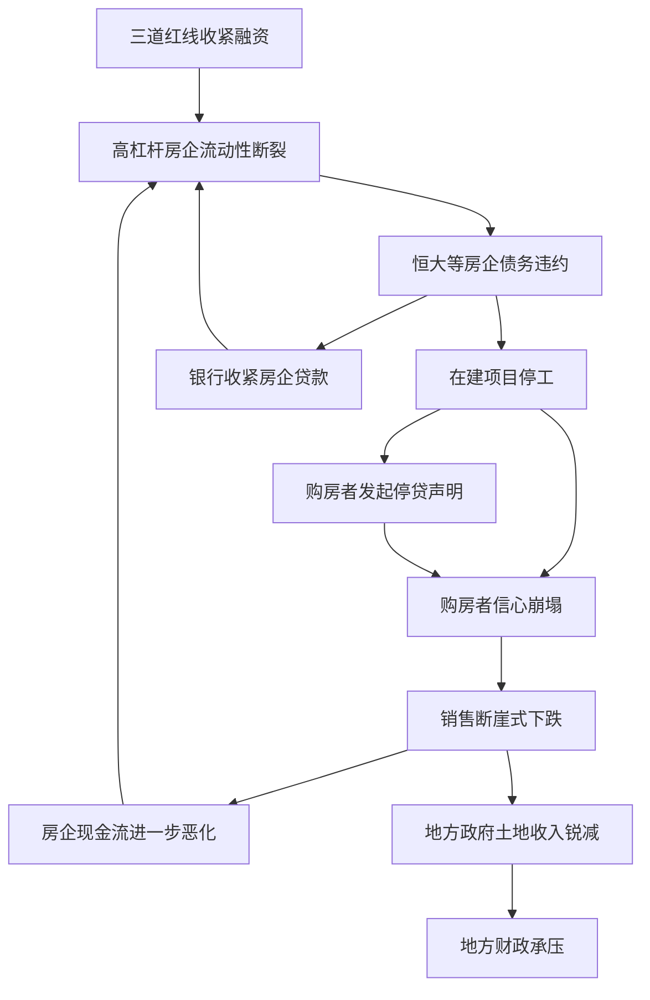
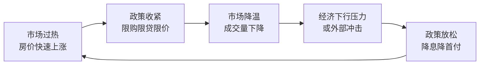

## 四、中国房地产市场的历史与现状

理解房价的决定因素和评估指标之后，你需要一个关键的背景知识：中国房地产市场是怎么走到今天的？它经历了哪些重大转折？当前处于什么阶段？

这不是"了解历史故事"那么简单——**市场是有记忆的**。今天的政策逻辑、开发商行为模式、购房者心态，全部根植于过去25年的经历。不理解这段历史，你就无法理解为什么"房住不炒"这四个字的分量，也无法判断当前市场是在"筑底"还是在"下行中途"。

本节将完整梳理中国房地产市场的演进脉络，分析每个阶段的核心逻辑，并建立一套判断当前市场位置的分析框架。

### 1. 1998年之前：福利分房时代

#### 1.1 住房制度的基本形态

1998年之前，中国城镇住房实行**福利分配制度**。核心特征：

- **单位建房、分配住房**：国有企业、机关事业单位为职工建造住房，按工龄、职务、家庭人口等条件排队分配
- **低租金、无产权**：住房租金极低（通常不到家庭收入的5%），但职工没有房屋产权，只有使用权
- **住房短缺严重**：1978年城镇人均住房面积仅3.6平方米，大量家庭三代同堂，排队等房往往需要5-10年
- **无市场化交易**：不存在真正意义上的房地产市场，住房不是商品

#### 1.2 改革的酝酿

1980年代开始，住房制度改革逐步推进：

- **1980年**：邓小平提出"住房商品化"构想，允许私人拥有住房
- **1988年**：宪法修正案删除"土地不得出租"条款，土地使用权可依法转让
- **1991年**：上海率先试行住房公积金制度
- **1994年**：国务院发布《关于深化城镇住房制度改革的决定》，提出建立住房公积金制度、推进公房出售

这些改革是渐进式的，真正改变游戏规则的是1998年。

### 2. 1998-2002年：住房市场化改革启动

#### 2.1 1998年房改的核心内容

1998年7月，国务院发布**23号文**《关于进一步深化城镇住房制度改革加快住房建设的通知》，这是一份改变中国城市面貌的文件。核心政策：

| 改革措施 | 具体内容 | 影响 |
|----------|----------|------|
| 停止福利分房 | 自1998年下半年起，全国停止住房实物分配 | 住房需求全面推向市场 |
| 住房分配货币化 | 实行住房补贴制度，将住房消费纳入工资 | 购买力释放 |
| 发展住房金融 | 大力发展个人住房贷款，降低首付比例 | 杠杆撬动需求 |
| 建立多层次住房体系 | 商品房+经济适用房+廉租房 | 满足不同收入群体需求 |
| 开放住房二级市场 | 允许已购公房上市交易 | 存量房市场启动 |

#### 2.2 为什么1998年是关键转折点

三个宏观背景促成了这次改革：

**第一，亚洲金融危机的外部压力。** 1997年亚洲金融危机爆发，中国出口承压，经济增长放缓。政府需要找到新的经济增长引擎。房地产投资体量大、产业链长（上游钢铁水泥、下游家电装修），天然具备拉动经济的能力。

**第二，国企改革的配套需求。** 1998年正值国企改革攻坚期，大量职工下岗。将住房从单位福利中剥离出来，有助于减轻企业负担，促进劳动力自由流动。

**第三，城镇化的内在需求。** 中国城镇化率从1998年的33%开始加速上升，大量农村人口进城需要住房，市场化供给体系比福利分房更能满足这种需求。

#### 2.3 这一阶段的市场特征

- 房价温和上涨，市场处于培育期
- 开发商数量快速增加，行业集中度低
- 个人住房贷款利率较低（基准利率下浮10%-15%）
- 购房者以自住为主，投资意识尚未觉醒

### 3. 2003-2007年：黄金发展期

#### 3.1 房地产成为支柱产业

2003年，国务院18号文首次明确**房地产是国民经济支柱产业**。这一定位彻底确立了房地产在经济中的核心地位。

这一阶段的核心驱动力：

**城镇化加速。** 2003-2007年，城镇化率从40.5%升至45.9%，每年新增城镇人口超过2000万。大量人口涌入一二线城市，住房需求井喷。

**货币宽松。** M2（广义货币供应量）从2003年的22万亿增长到2007年的40万亿，年均增速超过16%。大量流动性涌入房地产市场。

**投资渠道匮乏。** 2003-2007年，中国居民的投资渠道极其有限：银行存款利率低（一年期定期存款利率约2%-3%），股市波动剧烈（2007年暴涨至6124点后暴跌），理财市场刚起步。房产成为少数可加杠杆、相对稳定、且看得见摸得着的投资品。

#### 3.2 房价快速上涨

这一时期，一二线城市房价涨幅惊人：

- **上海**：2003-2005年，内环房价从约7000元/㎡涨至约15000元/㎡，涨幅超过100%
- **北京**：2003-2007年，四环内房价从约6000元/㎡涨至约15000元/㎡
- **深圳**：2005-2007年，关内房价从约8000元/㎡涨至约18000元/㎡

房价快速上涨催生了中国第一波"全民炒房"热潮。

#### 3.3 早期调控政策的出台

面对房价过快上涨，政府开始出台调控措施：

| 时间 | 政策 | 核心内容 | 效果 |
|------|------|----------|------|
| 2005年3月 | "国八条" | 稳定房价的八项措施 | 短期降温后反弹 |
| 2005年5月 | "七部委新政" | 调整住房供应结构，限制投机 | 部分城市房价短暂回落 |
| 2006年5月 | "国六条" | 提出"90/70"政策（90㎡以下住房占70%） | 增加中小户型供给 |
| 2007年9月 | "二套房贷新政" | 二套房首付提高到40%，利率上浮10% | 需求端抑制效果明显 |

这一阶段的调控特点：**政策目标从"抑制房价过快上涨"逐步转向"遏制投机性需求"**，但调控力度受制于经济增长需要，往往"按下葫芦浮起瓢"。

### 4. 2008-2009年：金融危机与"四万亿"刺激

#### 4.1 全球金融危机的冲击

2008年9月雷曼兄弟破产，全球金融危机爆发。中国房地产市场急剧降温：

- 2008年11月，全国商品房销售面积同比下降18.3%
- 开发商资金链紧张，部分项目出现降价促销
- 土地市场流拍频发，地方政府土地出让收入锐减
- 购房者观望情绪浓厚，成交量断崖式下跌

#### 4.2 "四万亿"刺激计划

2008年11月，国务院推出**4万亿经济刺激计划**。房地产领域的主要刺激措施：

- **降首付**：首套房首付比例降至20%，二套房首付降至改善型的20%
- **降利率**：5年以上贷款利率从7.83%降至5.94%，降息幅度达189个基点
- **降税费**：契税优惠、营业税减免、个人所得税减免
- **放松限购**：取消此前出台的限外令等抑制需求的政策

#### 4.3 刺激的后果

"四万亿"对房地产市场的效果立竿见影，但后果深远：

**短期效果（2009年）：** 市场迅速V型反转。2009年全国商品房销售面积达9.37亿平方米，同比增长42.1%；销售额4.4万亿元，同比增长75.5%。一线城市房价重新进入快速上涨通道。

**长期后果：** 货币超发导致资产价格全面上涨，房价收入比持续攀升。更重要的是，这次刺激确立了一个市场预期——**"政府不会让房价跌"**。这个预期在此后十多年里深刻影响了购房者的决策行为，也使得每次调控都面临"调控-放松-再调控"的循环。

### 5. 2010-2013年：限购时代与结构性调控

#### 5.1 史上最严调控

面对2009年房价的报复性反弹，2010年起政府推出了一系列被称为"史上最严"的调控措施：

**2010年"国十条"（4月）：**
- 实行差别化住房信贷政策，二套房首付不低于50%，利率不低于基准利率1.1倍
- 首次提出"限购"概念

**2011年"新国八条"（1月）：**
- 一二线城市全面实施限购：本地家庭限购2套，外地家庭限购1套且需提供社保/纳税证明
- 二套房首付提至60%，利率上浮至1.1倍
- 房产税在上海和重庆试点

**限购政策的覆盖面：** 到2011年底，全国超过40个城市实施限购政策，覆盖所有一二线城市和部分热点三线城市。

#### 5.2 政策效果分析

限购政策的核心逻辑是**压制需求端**，效果显著但有限：

| 维度 | 效果 | 局限 |
|------|------|------|
| 成交量 | 限购城市成交量下降30%-50% | 假离婚、借名买房等规避手段层出不穷 |
| 房价 | 短期停涨或微跌 | 核心地段优质房源依然坚挺 |
| 土地市场 | 土地溢价率下降 | 地方政府财政收入承压 |
| 开发商 | 中小开发商资金链紧张 | 大型开发商借机兼并扩张 |
| 投资需求 | 被压制 | 需求并未消失，只是被延迟和转移 |

**限购的一个重要副作用：** 需求被从限购城市挤压到不限购的三四线城市，催生了三四线城市的第一波房价上涨。

#### 5.3 保障房建设的推进

这一时期，政府同时加大了保障性住房建设力度：

- 2010年提出建设580万套保障房
- 2011年提出建设1000万套保障房（含公租房、廉租房、经适房、限价房）
- 2012-2013年持续大规模建设

保障房建设的目的：一是解决中低收入家庭住房问题，二是对冲商品房投资下滑对经济的影响。

### 6. 2014-2016年：去库存与市场分化

#### 6.1 库存危机

2014年前后，中国房地产市场面临严重的库存问题：

- 截至2015年底，全国商品房待售面积约7.19亿平方米
- 三四线城市库存去化周期超过20个月（部分城市超过30个月）
- 大量已出让土地未开发，形成"隐性库存"
- 开发商降价促销，部分项目亏损出清

库存危机的根源：2010-2013年限购政策将需求从一二线挤压到三四线，地方政府大量供地，开发商跟进建设，但三四线城市的真实需求有限，最终形成过剩。

#### 6.2 去库存政策组合

2015年底，中央经济工作会议将"去库存"列为2016年供给侧结构性改革五大任务之一。主要措施：

**需求端刺激：**
- 2015年连续5次降息，5年以上贷款利率从6.15%降至4.9%
- 首套房首付降至25%（非限购城市降至20%）
- 二套房首付降至40%
- 公积金贷款额度提升

**棚改货币化安置：** 这是去库存最具"杀伤力"的政策。2015-2018年，全国棚改年均超过600万套，其中货币化安置比例从2014年的9%飙升至2016年的48.5%。

棚改货币化的核心机制：

棚改货币化本质上是**央行印钱→拆迁户拿钱买房→消化库存→开发商拿地→地方政府还贷**的资金闭环。它在短期内极其有效地消化了三四线城市库存，但也推高了这些城市的房价，透支了未来需求。

#### 6.3 市场的严重分化

2015-2016年，市场出现了显著的**城市分化**：

**一线城市：** 2015年下半年起率先反弹，2016年深圳房价涨幅超过50%，上海和北京涨幅30%以上。核心原因：一线城市人口持续流入、土地供给有限、改善性需求释放。

**强二线城市：** 南京、苏州、厦门、合肥被称为"楼市四小龙"，2016年房价涨幅30%-50%。

**三四线城市：** 受棚改货币化推动，2016-2018年迎来一波上涨。但这种上涨缺乏人口和产业支撑，本质上是政策驱动的脉冲式行情。

### 7. 2016-2020年："房住不炒"时代

#### 7.1 政策基调的根本转变

2016年12月，中央经济工作会议首次提出**"房子是用来住的，不是用来炒的"**（简称"房住不炒"）。这一定位标志着中国房地产调控思路的根本转变：

- **之前**：调控是周期性的，房价涨了就压一压，跌了就松一松
- **之后**：调控是持续性的，"房住不炒"成为长期政策基调

#### 7.2 长效机制建设

"房住不炒"提出后，一系列长效机制开始建立：

**限购限贷常态化：** 不再是临时措施，而是成为制度安排。限购城市数量从高峰期的40+个逐步调整，但核心城市始终严格。

**限价政策：** 新房销售价格受到政府指导价限制。在热点城市，新房限价导致"一二手房价格倒挂"——同一个地段，新房价格低于二手房，买到就是赚到，出现了"万人摇号"的怪象。

**限售政策：** 购买后2-5年内不得转让，压缩投机空间。

**房地产税讨论：** 房地产税立法被多次提及，但始终未能正式推出。2021年全国人大常委会授权国务院在部分地区开展房地产税改革试点，但2022年因市场下行暂缓。

#### 7.3 2020年疫情后的短暂繁荣

2020年新冠疫情初期，市场短暂低迷后迅速反弹：

- 全球央行大放水，流动性泛滥
- 中国率先控制疫情，出口强劲增长
- 居民储蓄率提升，购房意愿回升
- 2020年下半年至2021年上半年，多个热点城市房价创历史新高

这一轮繁荣给市场参与者一个错误信号——**"房地产永远会反弹"**。

### 8. 2021年至今：深度调整与转型期

#### 8.1 "三道红线"与信贷收紧

2020年8月，住建部和央行联合推出**"三道红线"**政策，对房地产开发商的融资实施量化管控：

| 红线指标 | 标准 | 触碰后果 |
|----------|------|----------|
| 剔除预收款后的资产负债率 | ≤70% | 有息负债不得增加 |
| 净负债率 | ≤100% | 有息负债年增速≤10% |
| 现金短债比 | ≥1 | 有息负债年增速≤15% |

**三条全踩（红档）：** 有息负债不得新增。

"三道红线"的政策意图是控制开发商的杠杆率，防范系统性金融风险。但它的时机选择——在市场已经开始降温时推出——加速了行业的流动性危机。

#### 8.2 恒大危机与行业连锁反应

2021年下半年起，以恒大为代表的房企债务危机全面爆发：

**恒大（2021年9月）：**
- 总负债超过2万亿元，成为中国乃至全球最大的房企债务违约事件
- 恒大理财、商票逾期，供应商和购房者受到波击
- 在全国有超过700个未交付项目，涉及数十万购房者

**危机的蔓延：**
- 花样年、佳兆业、融创、世茂、旭辉等多家大型民营房企先后出现债务违约
- 行业信用崩塌，民营房企融资几乎完全冻结
- 购房者信心崩溃，"停贷潮"——部分购房者因楼盘停工集体声明停止偿还贷款
- 土地市场急剧降温，地方财政收入大幅缩水

这个负反馈循环是2021-2023年中国房地产市场恶化的核心机制。

#### 8.3 救市政策的逐步加码

面对行业危机，政策从"三道红线"的收紧迅速转向放松：

**2022年：**
- 多次降息降准
- "保交楼"成为政策核心，设立2000亿元保交楼专项借款
- 放松限购限贷城市超过300个
- 房贷利率下限多次下调

**2023年：**
- "认房不认贷"在一二线城市全面实施
- 首套房贷利率降至历史低位（LPR-20bp，最低约3.7%）
- 多数二线城市全面取消限购
- 一线城市放宽非核心区域限购
- "三大工程"：保障性住房、城中村改造、平急两用基础设施

**2024年：**
- 一线城市进一步放松限购（北京五环外、上海外环外取消限购）
- 房贷利率继续下行至3%以下
- 央行设立3000亿元保障性住房再贷款，支持地方收购存量商品房用作保障房
- 降低首付比例：首套15%，二套25%
- 取消全国层面房贷利率下限

#### 8.4 当前市场的关键数据（截至2025年）

**房价走势：**
- 70个大中城市新建商品住宅价格指数从2021年高点累计下跌约10%-15%
- 二手房跌幅更大，多数城市累计下跌15%-30%
- 一线城市核心区相对抗跌，三四线城市跌幅最深
- 二手房挂牌量持续高位，北京超过15万套，上海超过20万套

**成交量：**
- 2024年全国商品房销售面积约9.7亿平方米，较2021年峰值（17.9亿平方米）下降约46%
- 销售金额约9.7万亿元，较2021年峰值（18.2万亿元）下降约47%

**开发商格局：**
- 民营房企大面积出险，行业集中度向国企央企集中
- 2024年销售额TOP10中，国企央企占比超过70%
- 行业从"高周转、高杠杆、高增长"模式转向"低杠杆、低增长、重运营"模式

**库存与去化：**
- 一线城市去化周期约12-15个月（相对健康）
- 二线城市去化周期约18-24个月
- 三四线城市去化周期超过30个月（部分城市超过40个月）

### 9. 市场周期规律总结

回顾1998年以来的25年，中国房地产市场呈现出明显的**政策驱动型周期**特征：

| 周期 | 起点 | 高点 | 触发因素 | 政策响应 |
|------|------|------|----------|----------|
| 第一轮 | 2003年 | 2007年 | 城镇化+货币宽松 | 限购限贷 |
| 第二轮 | 2009年 | 2010年 | 四万亿刺激 | 国十条+限购扩围 |
| 第三轮 | 2015年 | 2017年 | 去库存+棚改货币化 | 调控加码+限售 |
| 第四轮 | 2020年 | 2021年 | 疫后流动性宽松 | 三道红线+信贷收紧 |
| 第五轮 | 2022年至今 | — | 行业危机+信心崩塌 | 持续救市中 |

**2021年以来的调整与前几轮的本质区别：**

前几轮调整是**政策主动调控**的结果——政策松了就反弹。本轮调整叠加了三个结构性变化：

1. **人口拐点**：2022年中国总人口首次负增长，购房主力人口（25-44岁）持续减少
2. **城镇化放缓**：城镇化率已达66%，增速从每年1.3个百分点降至0.5个百分点
3. **居民杠杆率见顶**：居民部门杠杆率从2008年的18%升至2023年的约63%，继续加杠杆的空间有限

这意味着**过去"政策一松就涨"的规律可能不再适用**。市场正在从"总量扩张"时代进入"结构分化"时代。

### 10. 对房产投资者的核心启示

#### 10.1 必须更新的认知

**旧认知：** "中国房价永远涨"、"政府不会让房价跌"、"买房是最好的投资"。

**新现实：**
- 房价可以下跌，而且已经在下跌
- 政府的目标是"稳"，不是"涨"——防止大跌和防止大涨同样重要
- 买房不再是"闭眼买入就能赚钱"的投资，需要精挑细选

#### 10.2 城市分化的不可逆趋势

未来的房地产市场将高度分化：

- **核心城市核心地段**：依然有保值增值能力，但回报率将回归合理水平（年化3%-5%）
- **强二线城市产业新区**：取决于产业导入和人口流入情况，需要具体分析
- **弱二线和三线城市**：人口流出趋势难以逆转，房产大概率缓慢贬值
- **四五线及县城**：房产可能逐步回归"消费品"属性，投资价值极低

#### 10.3 分析框架：判断市场位置的四个维度

在做任何房产投资决策之前，先评估以下四个维度：

| 维度 | 关键指标 | 当前状态 | 评估方法 |
|------|----------|----------|----------|
| **政策环境** | 房贷利率、首付比例、限购政策、信贷额度 | 全面宽松 | 对比历史政策周期的宽松程度 |
| **市场温度** | 成交量、房价走势、库存去化周期、二手房挂牌量 | 低温筑底中 | 跟踪月度数据变化趋势 |
| **人口基本面** | 常住人口变化、净流入/流出、年龄结构、结婚对数 | 分化严重 | 按城市逐一分析 |
| **居民购买力** | 房价收入比、居民杠杆率、收入增速、储蓄率 | 杠杆空间有限 | 计算目标城市的房价收入比 |

**当四个维度中有三个以上指向积极信号时，才值得认真考虑投资。** 这个标准会过滤掉大多数冲动型决策。

#### 10.4 历史不会重复，但会押韵

中国房地产市场的"黄金时代"（2003-2021年）已经结束。这不是悲观判断，而是事实认知。但"结束"不等于"崩盘"——中国城镇化仍在推进，核心城市仍有真实的住房需求，改善性需求仍有释放空间。

对投资者来说，关键是**从"买什么都涨"的β思维，转向"选对标的才有收益"的α思维**。未来的房产投资，将更接近于一种需要专业知识、精细计算和长期耐心的技能，而不是一种全民皆可参与的财富游戏。

理解中国房地产市场的历史和现状，不是为了预测未来——没有人能准确预测。而是为了**识别哪些规律已经改变、哪些规律仍然有效、哪些风险在累积、哪些机会在酝酿**。这才是研究市场历史的真正价值。
