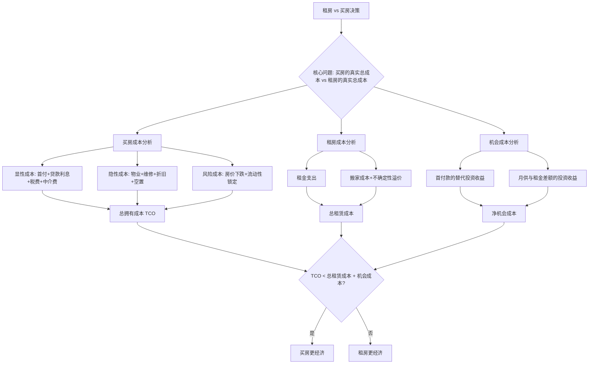

## 五、租房vs买房的经济学分析

租房还是买房，是每个人一生中最大的财务决策之一。这个决策不仅涉及金额巨大（通常是家庭资产的60-80%），还牵涉到生活方式、职业规划、家庭结构等多重维度。遗憾的是，大多数人在这个问题上依赖的是直觉、社会压力和碎片化的信息，而非系统的经济学分析。

本节将从经济学原理出发，建立一套可量化的分析框架，帮助你在任何市场环境下做出理性决策。

### 5.1 决策全景：一张图看懂核心逻辑



### 5.2 买房的真实成本：远不止房价

大多数人评估买房成本时，只看到"房价100万，首付30万，月供3500"。但真实的持有成本要复杂得多。

#### 5.2.1 显性成本拆解

| 成本项目 | 计算方式 | 100万房产示例 |
|---------|---------|-------------|
| 首付 | 房价 × 首付比例(20-30%) | 30万 |
| 贷款利息 | 本金 × 利率 × 年限(等额本息) | 30年4.2%利率，70万贷款总利息约54万 |
| 中介费 | 成交价 × 1-3% | 1-3万（买卖各付1%） |
| 契税 | 成交价 × 1-3%（首套/二套） | 1-3万 |
| 个人所得税 | 差额 × 20% 或 成交价 × 1% | 视情况而定，0-5万 |
| 增值税及附加 | 不满两年需缴纳 | 0-5.6万 |
| 评估费+贷款手续费 | 贷款额 × 0.1-0.5% | 0.07-0.35万 |
| 装修费 | 通常每平米800-3000元 | 8-30万（按100平米） |

以100万房产为例，全生命周期（30年持有）的显性总成本约为：

- 首付：30万
- 贷款本金+利息：124万（70万本金 + 54万利息）
- 交易税费（买入+卖出）：5-15万
- 装修费：10-30万
- **合计：169-199万**

也就是说，一套100万的房子，30年下来你实际支付了170-200万。

#### 5.2.2 隐性成本拆解

| 成本项目 | 年均支出（100万房产） | 30年累计 |
|---------|-------------------|---------|
| 物业费 | 2400-6000元（2-5元/㎡/月） | 7.2-18万 |
| 维修基金+日常维修 | 1000-3000元 | 3-9万 |
| 房屋折旧 | 年均1-2%（建筑部分） | 30-60万 |
| 房产税（未来可能） | 评估价 × 0.4-1.2% | 潜在12-36万 |
| 暖气费（北方城市） | 2000-4000元 | 6-12万 |
| **隐性成本合计** | — | **58-135万** |

#### 5.2.3 机会成本——最容易被忽视的成本

机会成本是买房决策中被忽视最多、却影响最大的因素。

**首付款的机会成本**：30万首付如果投入年化5%的理财产品，30年后的终值为：

$$FV = 30万 \times (1+5\%)^{30} = 30万 \times 4.32 = 129.7万$$

也就是说，仅仅首付款这一项，30年的机会成本就接近100万。

**月供与租金差额的机会成本**：假设月供3500元，同地段租金2000元，差额1500元/月。如果这1500元每月定投年化5%的产品：

$$FV = 1500 \times \frac{(1+0.05/12)^{360}-1}{0.05/12} = 1500 \times 832.26 = 124.8万$$

两项机会成本合计约**125-225万**，这才是买房最大的隐性代价。

#### 5.2.4 买房真实成本汇总

| 成本类别 | 30年累计（100万房产） |
|---------|---------------------|
| 显性成本 | 169-199万 |
| 隐性成本 | 58-135万 |
| 机会成本 | 125-225万 |
| **减去：房产残值** | -80-150万（取决于增值） |
| **净成本** | **172-409万** |

如果房产增值覆盖了持有成本，买房就是好投资；如果覆盖不了，租房+投资的组合可能更优。

### 5.3 租房的真实成本：不只是每月租金

#### 5.3.1 租房的直接成本

租房成本相对简单透明：

| 成本项目 | 说明 | 年均支出（同等条件） |
|---------|------|------------------|
| 月租金 | 核心支出 | 2-2.5万（2000-2100元/月） |
| 押金 | 通常1-3个月租金 | 一次性0.4-0.6万（可退） |
| 中介费 | 通常0.5-1个月租金 | 0.1-0.2万 |
| 搬家成本 | 每次搬家500-2000元 | 按3年搬一次计，年均300-700元 |
| 租金上涨 | 年均3-5% | 逐年递增 |

30年租房的总支出（假设租金年涨3%）：

$$总租金 = 2.4万 \times \frac{(1.03^{30}-1)}{0.03} = 2.4万 \times 47.58 = 114.2万$$

#### 5.3.2 租房的隐性成本

- **不确定性溢价**：房东可能不续约、涨租、卖房，导致被迫搬家。每次搬家涉及找房、搬家、适应新环境的时间和精力成本，以及孩子转学、通勤变化等隐性损失。
- **装修限制**：无法按自己喜好改造居住环境，生活品质打折扣。
- **社会成本**：在中国文化语境下，租房可能影响婚恋、子女入学（学区房问题）、社会认同感。这些虽然不是纯经济因素，但对生活满意度有实质影响。
- **租金与通胀**：租金长期跟随通胀上涨，而固定利率房贷的月供是固定的。20年前月供2000元压力很大，现在2000元月供几乎没有压力。这是买房对抗通胀的核心优势。

#### 5.3.3 租房的机会收益

租房省下的资金（首付款 + 月供与租金差额）如果妥善投资，30年后的终值：

$$总终值 = 129.7万 + 124.8万 = 254.5万$$

扣除30年总租金114.2万，净收益约**140.3万**。

### 5.4 核心分析模型：租售比与房价收入比

#### 5.4.1 租售比——最直观的判断指标

租售比 = 年租金 ÷ 房价，反映房产的投资回报率。

| 租售比范围 | 含义 | 决策建议 |
|----------|------|---------|
| > 5% | 房产被严重低估 | 买房明显优于租房 |
| 3-5% | 合理区间 | 根据个人情况决定 |
| 2-3% | 偏高，买房优势减弱 | 需要房价增值来弥补 |
| < 2% | 房产严重高估 | 租房明显优于买房 |

**中国现状**：2023-2025年，一线城市核心区租售比普遍在1.5-2.5%，二线城市在2-3%，三四线城市在3-5%。从纯经济角度看，一线城市买房的投资回报率很低，买房的主要收益来自房价增值预期。

**租售比的计算示例**：

一套500万的房子，月租金8000元：
- 年租金 = 8000 × 12 = 9.6万
- 租售比 = 9.6 ÷ 500 = 1.92%
- 结论：低于2%，从投资角度看不划算，买房的经济优势主要依赖房价上涨

#### 5.4.2 房价收入比——衡量购买力

房价收入比 = 房价 ÷ 家庭年收入

| 房价收入比 | 含义 | 国际参考 |
|----------|------|---------|
| < 6 | 购买压力较小 | 国际合理区间 |
| 6-9 | 有一定压力 | 多数发达国家水平 |
| 9-12 | 压力较大 | 需要家庭支持 |
| > 12 | 压力极大 | 不建议强行上车 |

**中国现状**：2024年数据，深圳约35，北京约28，上海约26，杭州约18，成都约12，长沙约8。一线城市房价收入比远超国际警戒线，这意味着在这些城市买房，财务压力极大。

#### 5.4.3 月供收入比——衡量现金流安全

月供收入比 = 月供 ÷ 家庭月收入

- **< 30%**：健康区间，不影响生活质量
- **30-50%**：有压力但可承受，需要节约其他开支
- **50-70%**：压力很大，任何收入波动都可能导致断供
- **> 70%**：极度危险，强烈建议不要购买

银行通常要求月供不超过收入的50%，但实际安全线应控制在30%以内。

### 5.5 经济学决策模型：净现值法

最严谨的租vs买比较方法是**净现值法（NPV）**——将两种方案的所有现金流折算到同一时间点进行比较。

#### 5.5.1 买房的NPV计算

```text
买房NPV = -首付 - Σ(月供 × 折现因子) - Σ(持有成本 × 折现因子) + 房产终值 × 折现因子
```

**Python计算示例**：

```python
import numpy as np

def buy_npv(price, down_ratio, rate, years, annual_cost_rate,
             appreciation, discount_rate, sell_cost_ratio):
    """计算买房方案的净现值"""
    down = price * down_ratio
    loan = price - down
    monthly_rate = rate / 12
    n_months = years * 12

    # 等额本息月供
    monthly_payment = loan * monthly_rate * (1 + monthly_rate)**n_months / \
                      ((1 + monthly_rate)**n_months - 1)

    # 月供现值
    pv_payments = monthly_payment * (1 - (1 + monthly_rate)**(-n_months)) / monthly_rate

    # 持有成本现值（物业费、维修等，假设年涨3%）
    annual_cost = price * annual_cost_rate
    monthly_discount = discount_rate / 12
    pv_costs = sum(annual_cost / 12 / (1 + monthly_discount)**i
                   for i in range(n_months))

    # 房产终值（扣除卖出税费）
    future_value = price * (1 + appreciation)**years * (1 - sell_cost_ratio)
    pv_future = future_value / (1 + discount_rate)**years

    return -down - pv_payments - pv_costs + pv_future

# 示例：100万房产
result = buy_npv(
    price=1_000_000,
    down_ratio=0.3,
    rate=0.042,       # 贷款利率4.2%
    years=30,
    annual_cost_rate=0.015,  # 每年持有成本1.5%
    appreciation=0.02,       # 房价年涨2%
    discount_rate=0.04,      # 折现率4%
    sell_cost_ratio=0.05     # 卖出费用5%
)
print(f"买房方案NPV: {result:,.0f}元")
```

#### 5.5.2 租房的NPV计算

```python
def rent_npv(rent_monthly, rent_growth, years, invest_return,
             discount_rate, savings_from_buying):
    """计算租房+投资方案的净现值"""
    n_months = years * 12
    monthly_discount = discount_rate / 12
    monthly_invest = invest_return / 12

    # 租金现值（逐年递增）
    total_pv = 0
    for year in range(years):
        annual_rent = rent_monthly * 12 * (1 + rent_growth)**year
        for month in range(12):
            m = year * 12 + month
            total_pv += (annual_rent / 12) / (1 + monthly_discount)**m

    # 投资终值（省下的首付+月供差额用于投资）
    # 简化：假设省下的钱全部投入
    future_savings = savings_from_buying * (1 + invest_return)**years
    pv_savings = future_savings / (1 + discount_rate)**years

    return -total_pv + pv_savings

# 示例：租金2000/月
result_rent = rent_npv(
    rent_monthly=2000,
    rent_growth=0.03,       # 租金年涨3%
    years=30,
    invest_return=0.05,     # 投资年化5%
    discount_rate=0.04,
    savings_from_buying=300000  # 省下的首付款
)
print(f"租房方案NPV: {result_rent:,.0f}元")
```

**两个NPV谁大，谁就是更优方案。**

#### 5.5.3 盈亏平衡分析

除了计算NPV，还可以找到**盈亏平衡点**——房价需要以多少速度增长，买房才能跑赢租房。

```python
def breakeven_appreciation(price, down_ratio, rate, years,
                           annual_cost_rate, rent_monthly, rent_growth,
                           invest_return, sell_cost_ratio):
    """找到买房与租房NPV相等时的房价年增长率"""
    from scipy.optimize import brentq

    def npv_diff(appreciation):
        buy = buy_npv(price, down_ratio, rate, years,
                       annual_cost_rate, appreciation, 0.04, sell_cost_ratio)
        rent = rent_npv(rent_monthly, rent_growth, years,
                         invest_return, 0.04, price * down_ratio)
        return buy - rent

    # 在0%-10%范围内求解
    return brentq(npv_diff, -0.05, 0.10)

# 示例
be = breakeven_appreciation(
    price=1_000_000, down_ratio=0.3, rate=0.042, years=30,
    annual_cost_rate=0.015, rent_monthly=2000, rent_growth=0.03,
    invest_return=0.05, sell_cost_ratio=0.05
)
print(f"房价年涨幅需达到 {be*100:.1f}% 才能跑赢租房+投资")
```

如果计算结果是年涨2.5%，意味着只要房价每年涨幅超过2.5%，买房就比租房划算。你可以根据对未来房价的判断来决策。

### 5.6 情景分析：不同市场环境下的最优选择

#### 5.6.1 房价上涨期（年涨5%以上）

在房价快速上涨期，买房的优势非常明显。100万的房产5年后价值127.6万，增值27.6万，远超持有成本。此时"六个钱包"凑首付上车的策略在经济上是合理的。

但需要注意：上涨期往往是周期尾声，追涨风险很大。2021年高位买房的人，很多面临20-30%的账面亏损。

#### 5.6.2 房价横盘期（年涨0-2%）

这是最常见的情况，也是最需要仔细计算的情况。房价小幅上涨可能刚好覆盖持有成本，也可能不够。此时租售比成为关键指标：

- 租售比 > 3%：买房略优，持有成本被租金覆盖
- 租售比 2-3%：基本持平，取决于个人偏好
- 租售比 < 2%：租房更优，买房的机会成本太高

#### 5.6.3 房价下跌期（年跌2-5%）

买房全面劣势。不仅账面亏损，还面临负资产风险（房价低于贷款余额）。此时租房+投资是明确更优的选择。

#### 5.6.4 高通胀环境（CPI > 5%）

高通胀下买房有一个独特优势：**固定利率贷款是通胀的天然对冲**。月供不变，但工资和物价都在涨，实际还款压力逐年下降。同时房产作为实物资产，通常能跟上甚至超越通胀。

### 5.7 中国特色因素

在中国做租房vs买房决策，还需要考虑一些独特的制度和文化因素：

#### 5.7.1 户籍与公共服务绑定

中国的户籍制度使得买房与子女教育、医疗、社保等公共服务深度绑定。在很多城市，租房者的子女入学排序低于购房者，甚至无法进入优质公立学校。这个"隐性福利"难以量化，但对有学龄子女的家庭而言可能是决定性因素。

**应对策略**：
- 部分城市已出台"租购同权"政策（如广州、杭州），但仍存在执行差距
- 可以关注当地教育局的入学政策，了解租房家庭的实际入学情况
- 有些城市允许"积分入学"，租房也有积分，但通常低于买房

#### 5.7.2 婚恋市场中的房产信号

在中国婚恋市场上，房产是重要的"信号"——它传递了经济实力、稳定性和承诺的信号。虽然这不是纯粹的经济考量，但对很多年轻人来说是现实压力。

**理性看待**：婚恋中的房产需求，本质上是对稳定性和安全感的需求。如果双方能够理性沟通，租房+共同投资可能比"掏空六个钱包买房"的财务状况更健康。

#### 5.7.3 公积金的使用策略

公积金贷款利率（3.1%）远低于商贷（4.2%+），这是买房的一个额外优势。但公积金也可以提取用于支付房租。

**对比**：
- 公积金贷款买房：利率3.1%，贷款额度有上限（各地不同，通常60-120万）
- 提取公积金付房租：通常每月可提1500-3000元，需要租房合同和发票
- 公积金余额理财：年化约1.5%（公积金存款利率）

如果公积金余额较高且能用足贷款额度，买房的公积金贷款优势明显。如果公积金不多，这个因素影响有限。

#### 5.7.4 房产税的潜在影响

虽然房产税尚未全面开征，但长期来看是大概率事件。参考上海、重庆试点方案：

- 上海：人均60㎡免征，超出部分税率0.4-0.6%
- 重庆：高档住房（均价2倍以上）税率0.5-1.2%

如果全面推行，持有成本将显著增加。以一套评估价300万的房产为例：
- 人均免征后应税面积80㎡
- 年税额 = 300万 × 0.6% = 1.8万/年
- 30年累计 = 54万

这将进一步拉大买房与租房的成本差距。

### 5.8 不同人生阶段的决策建议

#### 5.8.1 22-28岁：职业初期

- 优先级：职业发展 > 买房
- 建议：租房，把资金和精力投入自我提升和职业发展
- 原因：这个阶段流动性最重要，换城市、换行业都可能带来巨大收益
- 例外：如果在强二线城市有家庭支持，且确定长期定居，可以考虑

#### 5.8.2 28-35岁：事业上升期+成家

- 这是买房决策的关键窗口期
- 需要综合评估：收入稳定性、定居意愿、家庭需求、当地市场
- 建议：月供控制在收入30%以内，留足应急资金（6个月支出）
- 如果收入不够，先租房积累，不要"上车焦虑"

#### 5.8.3 35-50岁：家庭稳定期

- 通常已有房产，关注的是改善换房
- 换房决策：新房成本 vs 当前房产增值 + 改善收益
- 注意：不要为了"改善"而过度加杠杆

#### 5.8.4 50岁以上：退休规划期

- 买房需谨慎：贷款年限受限，退休后收入下降
- 如果已有房产，考虑是否需要"以房养老"或置换到生活成本更低的城市
- 租房反而是更灵活的选择：可以随养老需求变化调整居住地

### 5.9 常见误区与纠正

#### 误区一："租房是帮房东还贷"

**表面逻辑**：房东用你的租金还贷款，你帮别人买了房。

**实际分析**：房东的租金回报率可能只有2%，而你省下的首付+月供差额如果投资，回报可能5%以上。房东在用低成本资金（你的租金）持有低回报资产，而你在用高回报策略（投资）积累财富。

**反例**：2022年在某二线城市买了一套150万的房子，月供5000元，租金2500元。两年后房价跌到120万，账面亏损30万+两年利息支出12万。如果租房+投资，不仅省了42万，还能赚投资收益。

#### 误区二："房贷是最便宜的贷款"

**表面逻辑**：房贷利率4%，比信用贷、消费贷便宜，所以应该尽量多贷款。

**实际分析**：房贷便宜是相对于其他贷款而言的，但4%的贷款利率如果投资回报低于4%，贷款就是亏钱的。更重要的是，贷款放大了风险——房价下跌10%，你的本金可能亏损30%（杠杆效应）。

#### 误区三："房子是抗通胀的最佳资产"

**历史数据**：中国过去20年房价年均涨幅约8%，确实跑赢了通胀（年均2-3%）。但这个阶段是特殊的城市化进程驱动的，未来难以复制。

**对比其他资产**：
- 沪深300指数：过去20年年化约8-10%（含分红）
- 黄金：过去20年年化约8%
- 房产的流动性远差于股票和黄金，变现需要数月，且有交易成本

#### 误区四："买房才算有家"

**文化因素**：中国人对"有恒产者有恒心"有深厚的文化认同。

**理性分析**：家是由人构成的，不是由房产证构成的。过度追求买房可能导致：
- 掏空家庭积蓄，降低抗风险能力
- 限制职业选择（不敢换城市、不敢创业）
- 降低生活质量（月供压力下节衣缩食）

#### 误区五："现在不买以后更贵"

**现实检验**：2021年买房的人，很多面临20-30%的亏损。房价并非只涨不跌。

**概率思维**：房价走势存在不确定性，与其赌方向，不如做好两个方向的准备：
- 如果判断房价会涨：适当加杠杆，但控制在安全范围内
- 如果判断房价会跌或不确定：租房+投资，保留灵活性

### 5.10 实操决策清单

在做出最终决策前，逐一回答以下问题：

**第一组：基本条件**

- [ ] 你确定在这个城市长期生活（5年以上）吗？
- [ ] 你的收入来源稳定吗（不是创业初期、不是合同工）？
- [ ] 你有足够的应急资金（6个月支出，不含首付）吗？
- [ ] 你的月供/收入比低于30%吗？

**第二组：市场判断**

- [ ] 当地租售比在2.5%以上吗？
- [ ] 房价收入比低于12吗？
- [ ] 你认为未来5年房价不会大幅下跌吗？
- [ ] 当地有人口净流入吗？

**第三组：个人偏好**

- [ ] 你对居住稳定性有强烈需求吗（孩子上学、父母同住）？
- [ ] 你能够承受房价下跌20%的心理压力吗？
- [ ] 你愿意承担维修、管理等琐事吗？
- [ ] 你的配偶/家人支持这个决定吗？

**评分标准**：
- 12个全部勾选：买房是合理选择
- 9-11个：大部分条件满足，可以考虑
- 6-8个：需要慎重，建议暂缓
- 5个以下：强烈建议租房

### 5.11 数据工具与资源

#### 在线计算器

- **贝壳找房**：提供房贷计算器、税费计算器
- **链家APP**：可查看小区历史成交价和租金，计算实际租售比
- **房天下**：提供全国城市房价收入比数据

#### 关键数据查询

| 数据 | 查询渠道 |
|------|---------|
| 城市房价 | 国家统计局70城房价指数、贝壳研究院 |
| 租金水平 | 豆瓣租房小组、贝壳/链家租金数据 |
| 人口流入 | 各市统计局常住人口数据 |
| 贷款利率 | 央行LPR公告、各银行官网 |
| 公积金政策 | 当地住房公积金管理中心 |

#### 推荐分析工具

```bash
# 用Python快速计算你的具体情况
pip install numpy scipy matplotlib

# 计算买房vs租房的NPV对比
python rent_vs_buy.py --price 2000000 --rent 4000 --rate 0.038 --years 30
```

### 5.12 总结：一张表看清全局

| 维度 | 买房优势 | 租房优势 |
|------|---------|---------|
| 资产积累 | ✅ 强制储蓄，积累实物资产 | ❌ 无资产积累 |
| 灵活性 | ❌ 流动性差，变现慢 | ✅ 随时可以换城市/换房 |
| 杠杆收益 | ✅ 房价涨时收益放大 | ❌ 无杠杆收益 |
| 杠杆风险 | ❌ 房价跌时亏损放大 | ✌️ 无杠杆风险 |
| 对抗通胀 | ✅ 固定月供+资产升值 | ❌ 租金随通胀上涨 |
| 生活品质 | ✅ 可自由装修，归属感强 | ❌ 受限于房东 |
| 机会成本 | ❌ 首付锁定，资金效率低 | ✅ 资金可灵活投资 |
| 心理压力 | ❌ 月供压力+房价焦虑 | ✚ 搬家不确定性 |
| 公共服务 | ✅ 子女入学、户籍等 | ❌ 部分城市受限 |
| 持有成本 | ❌ 物业费+维修+折旧 | ✌️ 无隐性持有成本 |

**最终建议**：

没有绝对正确的答案，只有适合你的答案。用本节的框架和工具，输入你自己的数据（房价、租金、收入、预期），计算出量化结果，再结合个人偏好和生活规划做出决策。

记住两句话：
1. **买房是消费+投资的组合，租房是纯消费+自由投资的组合**——两者的本质区别在于资产配置方式不同
2. **最大的错误不是买了跌了或租了涨了，而是在不了解真实成本的情况下做出决策**——本节的目标就是帮你消除这个信息差
