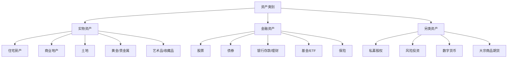
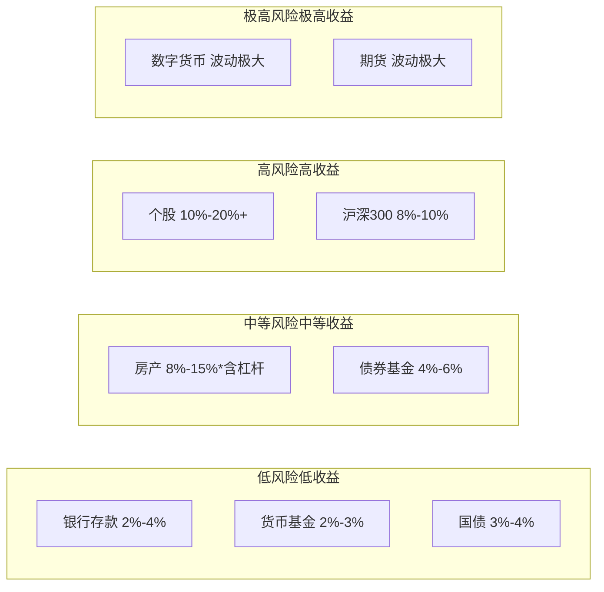
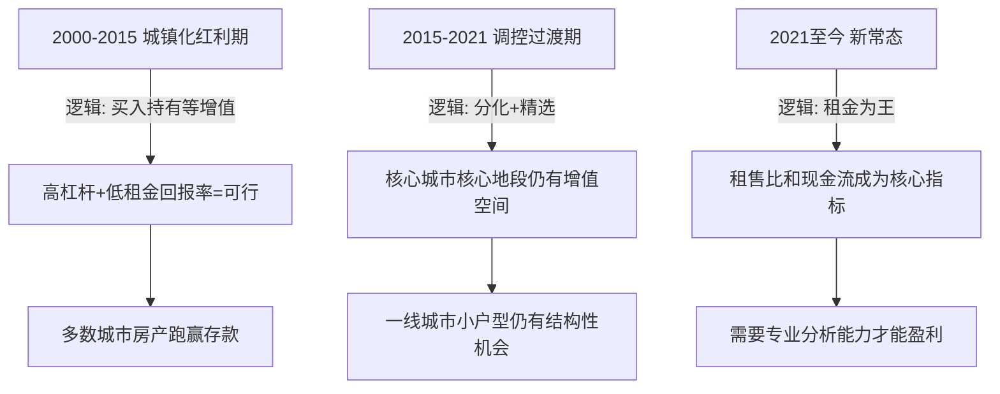

## 六、房地产与其他资产的比较

投资的本质是在不同资产之间做出选择。要真正理解房地产投资的价值，不能孤立地看房产本身，而必须将其放入整个资产谱系中进行横向对比。股票、债券、黄金、基金、银行理财、数字货币——每种资产都有独特的风险收益特征、流动性结构和税收待遇。投资者的核心任务，是根据自身的资金规模、风险承受能力、时间周期和生活目标，在这些资产之间找到最优配置。

本节将从收益、风险、流动性、杠杆、税收、门槛六大维度，系统对比房地产与主流资产类别的差异，帮助你建立清晰的资产配置认知框架。

---

### 一、为什么要进行跨资产比较

#### 1.1 机会成本思维

每一笔投入房地产的资金，都意味着放弃了这笔钱在其他资产上的潜在回报。经济学称之为"机会成本"。如果你用100万买了一套房产，这100万就无法同时投入股市、债市或创业。因此，"房产好不好"这个问题，本质上是"房产比其他选择好不好"。

#### 1.2 资产配置的基本逻辑

现代投资组合理论（Modern Portfolio Theory，MPT）的核心观点是：**不同资产之间的低相关性可以降低整体组合的波动率**。房产与股票的相关系数通常在0.2-0.4之间（取决于市场周期），这意味着在组合中加入房产，理论上可以改善风险调整后收益。

#### 1.3 人生阶段适配

不同人生阶段适合不同的资产配置侧重：

- **25-35岁（积累期）**：收入增长快，风险承受力高，可适度加大权益类资产比例
- **35-50岁（稳定期）**：家庭责任加重，需要稳定现金流，房产和债券比重上升
- **50岁以上（收获期）**：保本优先，流动性需求增大，逐步降低杠杆资产比例

---

### 二、主流资产类别全景图

在展开详细对比之前，先建立一张完整的资产分类地图：

---

### 三、核心维度对比：房产 vs 六大资产

#### 3.1 收益性对比

**（1）长期收益率**

根据国内外历史数据，各类资产的长期年化收益率大致如下：

| 资产类别 | 年化收益率（名义） | 年化收益率（扣除通胀后） | 收益来源 |
|---------|-----------------|---------------------|---------|
| 中国住宅房产（2000-2020） | 8%-15% | 5%-12% | 资本增值+租金 |
| 中国住宅房产（2020-至今） | -5%-3% | -8%-0% | 租金为主，部分城市资本贬值 |
| 沪深300指数 | 8%-10% | 5%-7% | 股息+资本增值 |
| 中证全债指数 | 4%-5% | 1%-3% | 票息+资本利得 |
| 银行定期存款 | 2%-4% | -1%-1% | 利息 |
| 黄金（人民币计价） | 6%-8% | 3%-5% | 价格升值 |
| 货币基金 | 2%-3% | -1%-0% | 利息 |

**关键洞察**：房产的收益具有强烈的**时间分段特征**。2015年之前买入的一线城市房产，年化收益率轻松超过15%；但2021年之后入场的投资者，很多面临账面亏损。这与股票指数的"均值回归"特性形成鲜明对比——沪深300在任何一个10年滚动周期内的收益，波动范围远小于房产。

**（2）收益的确定性**

- **房产**：租金收益相对确定（签了合同就有），但资本增值高度不确定，受政策、地段、时机影响巨大
- **股票**：短期极度不确定，但长期（20年+）的收益确定性反而高于房产（因为分散在数百家公司）
- **债券**：持有到期的收益最为确定，但收益率也最低
- **黄金**：没有内在收益，完全依赖价格变动，确定性最低

**（3）复利效应**

股票和基金可以自动实现复利（分红再投资），而房产的复利效应较弱——租金收入需要累积到一定金额才能再投资一套房产，门槛远高于基金定投。

#### 3.2 风险性对比

**（1）波动率**

| 资产类别 | 年化波动率 | 最大回撤（典型值） |
|---------|----------|----------------|
| 住宅房产 | 5%-15% | -20%-40%（局部市场） |
| 沪深300 | 20%-30% | -50%-70% |
| 中证全债 | 2%-5% | -5%-10% |
| 黄金 | 15%-20% | -30%-45% |
| 货币基金 | <1% | 几乎为0 |

**表面上看，房产的波动率远低于股票。但这是一个危险的错觉。** 原因有三：

- 房产交易频率极低（一年可能就几十套成交），**价格发现机制不充分**，报表上的"波动率低"很多是流动性不足导致的虚假平稳
- 房产是杠杆资产（通常3-5倍杠杆），净值的实际波动被放大了3-5倍。一套300万的房子，首付100万，房价跌20%意味着你的本金跌了60%
- 房产没有实时报价，投资者对亏损的感知存在严重滞后

**（2）系统性风险**

不同资产面对的系统性风险来源不同：

- **房产**：宏观调控政策（限购限贷）、利率变动、人口结构变化、城市化进程放缓
- **股票**：经济衰退、企业盈利下滑、流动性紧缩、地缘政治冲突
- **债券**：利率上行、信用违约潮、通胀超预期
- **黄金**：美元走强、央行抛售、通缩预期

**（3）非系统性风险（可分散风险）**

房产的非系统性风险特别高——你买的某一套具体房子，其风险几乎无法分散。烂尾、学区划片变更、小区物业管理恶化、邻里纠纷、房屋质量问题，这些都是持有单一房产必须面对的特有风险。而购买沪深300指数基金，就自动分散到了300家公司。

#### 3.3 流动性对比

流动性是房产最大的短板之一。下表从多个维度衡量各资产的流动性：

| 维度 | 房产 | 股票/基金 | 银行存款 | 黄金 |
|------|------|----------|---------|------|
| 变现速度 | 30-180天 | T+1到T+7 | 即时 | 1-3天 |
| 交易成本 | 房价的5%-10%（税费+中介费） | 0.05%-0.15% | 0 | 0.5%-2% |
| 价格折让 | 急售通常低于市价10%-20% | 几乎无折让 | 无 | 极小 |
| 最小交易单位 | 一整套（数十万到数百万） | 1手/1元起 | 无限制 | 1克起 |
| 信息透明度 | 低（挂牌价≠成交价） | 高（实时行情） | 高 | 中等 |

**流动性不足的代价**：当市场下行时，股票投资者可以在第一时间止损，但房产投资者往往只能眼睁睁看着房价下跌，因为找到一个愿意接盘的买家可能需要数月。这种"被锁死"的感觉，是房产投资者心理压力最大的来源之一。

#### 3.4 杠杆特性对比

房产是普通人唯一能够以低利率、长期限、大规模获取杠杆的资产。这是房产投资最大的结构性优势，值得深入分析。

**（1）杠杆可得性对比**

| 资产 | 杠杆比例 | 融资成本 | 期限 | 获取难度 |
|------|---------|---------|------|---------|
| 房产 | 70%（首付30%） | 3%-5% | 10-30年 | 低（银行主动提供） |
| 股票（融资融券） | 100%（1:1） | 6%-8% | 6个月续约 | 高（需50万门槛） |
| 期货 | 80%-95% | 交易所保证金 | 到期交割 | 高（需专业知识） |
| 经营贷（违规入楼市） | 70%-80% | 3.5%-5% | 1-10年 | 中（有合规风险） |

**（2）杠杆的双刃剑效应**

杠杆放大收益的同时也放大亏损。用具体数字说明：

假设你有100万本金，投资一套300万的房产（贷款200万，利率4%，月供约9,550元，30年期）：

**情景一：房价上涨30%**
- 房产价值：390万
- 贷款余额：约195万（还了部分本金）
- 净资产：195万
- 收益率：(195-100)/100 = **95%**（杠杆放大了3.17倍）

**情景二：房价下跌20%**
- 房产价值：240万
- 贷款余额：约198万
- 净资产：42万
- 亏损率：(42-100)/100 = **-58%**（杠杆放大了2.9倍）

**情景三：房价下跌30%（负资产）**
- 房产价值：210万
- 贷款余额：约199万
- 净资产：11万
- 亏损率：**-89%**

**（3）杠杆的时间价值**

房贷杠杆还有一个独特优势：通胀侵蚀债务。假设年通胀率3%，30年后你偿还的200万本金的实际购买力仅相当于今天的约82万。你用"贬值后的钱"偿还了"升值前的债务"，这个效应在股票融资中完全不存在。

#### 3.5 税收待遇对比

税收是影响实际收益的关键变量，不同资产的税收待遇差异巨大：

| 税种/费用 | 房产 | 股票 | 基金 | 银行存款 | 黄金 |
|-----------|------|------|------|---------|------|
| 持有成本 | 房产税（试点中）、物业费、维修基金 | 无 | 管理费1%-1.5%/年 | 无 | 存储费（实物） |
| 交易税费 | 增值税、个税、契税、中介费（合计5%-12%） | 印花税0.05%、佣金0.02%-0.03% | 申购赎回费0%-1.5% | 无 | 增值税（标准金免征） |
| 收益税 | 房租收入个税20%（实际征管宽松） | 股息税20%（持有1年免征）、资本利得暂免 | 分红税（视类型） | 利息税20%（实际暂免） | 暂无明确征收 |
| 税收优惠 | 首套房契税优惠、满五唯一免个税 | 股息差别化征税 | 公募基金分红暂免个税 | 无 | 无 |

**房产的税收特点**：交易环节税负最重（买卖一次损失5%-12%），但持有环节的实际税负极低（物业费和维修基金相对房屋价值微不足道）。这意味着房产天然适合长期持有、低频交易。

#### 3.6 投资门槛对比

| 资产 | 最低入场资金 | 知识门槛 | 时间精力 | 管理复杂度 |
|------|------------|---------|---------|----------|
| 房产 | 30-100万（首付） | 中等（需了解区域市场、贷款、税费） | 中等（前期调研耗时，后期出租管理） | 中高 |
| 股票 | 数百元 | 低（开户即可） | 可高可低（取决于策略） | 低-中 |
| 指数基金 | 1元 | 极低 | 极低（定投即可） | 极低 |
| 银行理财 | 1元起 | 极低 | 极低 | 极低 |
| 黄金 | 数百元（纸黄金/ETF） | 低 | 低 | 低 |
| 数字货币 | 几十元 | 中高 | 中等 | 中等 |

---

### 四、深度专题对比

#### 4.1 房产 vs 股票：最核心的对决

这是大多数投资者面临的主要选择，值得深入展开。

**（1）风险收益散点图**

**（2）详细对比分析**

| 对比维度 | 房产 | 股票/指数基金 |
|---------|------|-------------|
| 核心优势 | 杠杆放大、抗通胀、实物安全感、租金现金流 | 流动性强、分散化、门槛低、复利效应强 |
| 核心劣势 | 流动性差、交易成本高、非系统性风险大 | 波动性大、情绪干扰强、需要纪律 |
| 适合人群 | 有耐心、追求稳定现金流、能承担大额首付的投资者 | 各类投资者，尤其适合定投的工薪族 |
| 最佳策略 | 选对城市和地段，长期持有（10年+） | 定期定额、长期持有（至少一个牛熊周期） |
| 最差情况 | 烂尾、错判城市/地段、高位接盘 | 高位满仓、频繁交易、追涨杀跌 |
| 心理挑战 | 担心房价跌但卖不掉 | 看着账户每天波动、忍住不卖 |

**（3）一个关键洞察：房产投资的"强制纪律"效应**

很多投资者在股市亏钱，并非因为选错了股票，而是因为**管不住自己的手**——下跌时恐慌割肉，上涨时冲动追高。房产由于流动性差、交易成本高，反而形成了一种"强制长期持有"的纪律约束。这是房产投资经常跑赢个人股票投资的一个容易被忽视的原因。

#### 4.2 房产 vs 黄金：避险属性之争

黄金和房产都被视为"抗通胀"资产，但两者的机制完全不同：

- **黄金**：通过稀缺性和全球共识来保值，没有现金流，收益完全来自价格变动
- **房产**：通过实物使用价值和租金收入来保值，同时可能获得资本增值

**在不同经济环境下的表现对比：**

| 经济环境 | 房产表现 | 黄金表现 | 胜出方 |
|---------|---------|---------|--------|
| 温和通胀+经济增长 | 优（租金涨+房价涨） | 中等 | 房产 |
| 高通胀+经济停滞 | 中等（租金滞后于通胀） | 优（黄金大涨） | 黄金 |
| 经济衰退+通缩 | 差（房价跌+租金跌） | 中等（避险需求支撑） | 黄金 |
| 利率下行周期 | 优（估值扩张） | 优（机会成本降低） | 持平 |
| 利率上行周期 | 差（估值压缩） | 差（持有成本上升） | 持平 |
| 地缘政治危机 | 差（不可移动） | 优（全球避险） | 黄金 |

**结论**：房产和黄金的避险逻辑不同，不是替代关系而是互补关系。保守型投资者在持有房产的同时配置5%-15%的黄金，可以显著改善组合在极端环境下的表现。

#### 4.3 房产 vs 债券：稳定性之争

债券和房产都提供相对稳定的现金流，但特征截然不同：

- **债券**：现金流完全确定（票息固定），本金波动小，流动性好，但收益率低
- **房产**：现金流相对确定（租金），但存在空置风险和租金下降风险，流动性差，杠杆收益可观

对于追求稳定收入的投资者而言，"房产+债券"的组合比单独持有任何一种都更优：债券提供流动性储备和确定性收入，房产提供杠杆收益和抗通胀能力。

#### 4.4 房产 vs REITs：同源异流

REITs（房地产投资信托基金）是房产投资的证券化形式，两者的比较详见本章核心技巧部分。这里仅列出关键差异：

| 维度 | 直接持有房产 | REITs |
|------|------------|-------|
| 流动性 | 差 | 好（场内交易） |
| 杠杆 | 个人贷款（3-5倍） | 基金层面杠杆（通常1-2倍） |
| 分散化 | 单一物业 | 数十到数百物业 |
| 管理责任 | 业主自行管理 | 专业团队管理 |
| 税收 | 交易税负重 | 分红税负较轻 |
| 起投金额 | 数十万 | 数百元 |
| 收益确定性 | 高度依赖具体物业 | 相对分散 |

---

### 五、资产配置框架：如何在实践中做出选择

#### 5.1 核心配置原则

**（1）不要把鸡蛋放在一个篮子里**

即使房产在过去20年表现优异，也不应将全部资产投入房产。合理的配置应考虑分散化。

**（2）根据生命周期动态调整**

**（3）留足流动性缓冲**

无论资产配置比例如何，始终保持6-12个月生活支出的现金或货币基金储备。房产的流动性差意味着它不能充当应急资金来源。

#### 5.2 不同资金规模的配置建议

| 可投资资金 | 建议配置 | 说明 |
|-----------|---------|------|
| 10万以下 | 指数基金定投80%+货币基金20% | 资金不足以做房产首付，优先积累 |
| 10-50万 | 指数基金50%+债券基金30%+黄金/现金20% | 可考虑非一线城市的首付，但需评估月供压力 |
| 50-200万 | 房产（首付）40%-50%+指数基金30%+债券/黄金20%-30% | 可在多数城市入手首套，同时保持金融资产配置 |
| 200万以上 | 房产40%-50%+股票/基金25%-30%+债券15%+黄金5%-10%+另类5% | 多元化配置，可考虑不同类型房产（住宅+REITs） |

#### 5.3 一个实用的决策清单

在决定将资金投入房产还是其他资产之前，回答以下问题：

1. **我是否有6个月以上的应急储备金？** → 没有则先积累，不投资任何非流动性资产
2. **这笔钱5年内是否需要用到？** → 是则不适合投入房产或股票
3. **我所在城市的租售比是多少？** → 超过1:500则买房不如租房，将差额投入基金
4. **我能否承受房价下跌30%的心理压力？** → 不能则降低房产配置比例
5. **我的收入是否稳定？** → 不稳定则减少杠杆（降低房贷比例）
6. **我是否已有房产？** → 已有多套则应增加金融资产配置，避免过度集中

---

### 六、常见误区与纠正

#### 误区一："房产永远是最好的投资"

**现实**：没有任何一类资产"永远"是最好的。日本1990年后房产泡沫破裂，东京核心区房价花了30年才回到当年水平。中国2021年以来，多数城市房价也经历了显著回调。过去20年中国房产的优异表现，是城镇化率从36%到65%的历史性机遇叠加的结果，这个红利正在消退。

**纠正**：用历史数据做决策，但要区分"结构性红利期"和"均值回归期"。当前阶段更应关注房产的租金回报率而非资本增值预期。

#### 误区二："股票太危险，买房才安全"

**现实**：如前文分析，房产的实际波动被杠杆放大后，风险可能高于分散化的股票组合。而且股票可以随时止损，房产不能。

**纠正**：安全性不取决于资产类型，而取决于投资方式。定期定额投资沪深300指数基金，长期风险远低于在三四线城市高位买入一套房。

#### 误区三："房贷是最大的负担，应该尽快还清"

**现实**：房贷是普通人能获得的利率最低、期限最长的贷款。如果投资收益率高于贷款利率，保留贷款并用多余资金投资是更优选择。

**纠正**：当房贷利率<5%，且你有稳定的投资渠道（如指数基金长期年化8%+），提前还贷的机会成本很高。但如果你没有投资能力，提前还贷相当于无风险收益。

#### 误区四："黄金能替代房产做避险配置"

**现实**：黄金不产生现金流，持有成本（存储、保险）和交易成本不低。在温和通胀的正常经济环境下，黄金的长期回报率远低于房产和股票。

**纠正**：黄金是极端场景的保险（战争、恶性通胀、货币危机），不是常规投资工具。配置比例建议控制在总资产的5%-15%。

#### 误区五："有了房产就不需要其他资产"

**现实**：过度集中于单一资产类别是最常见的投资错误。即便你坚信房产是最好的资产，也应该保留一部分流动资产以应对突发需求。

**纠正**：房产配置占总资产的比例，建议不超过60%-70%。剩余部分配置在流动性更好的金融资产中。

---

### 七、全球视角：不同市场的房产投资对比

#### 7.1 中美房产投资差异

| 维度 | 中国 | 美国 |
|------|------|------|
| 产权 | 70年使用权 | 永久产权 |
| 房贷利率 | 3%-5%（浮动为主） | 6%-7%（2024年，固定利率为主） |
| 房产税 | 试点中，尚未全面征收 | 每年1%-3%的房产评估价值 |
| 交易成本 | 极高（合计8%-15%） | 中等（5%-8%） |
| 租售比 | 1:500-1:800（租金回报率低） | 1:150-1:250（租金回报率高） |
| 首付比例 | 20%-30% | 3.5%-20% |
| 投资逻辑 | 以资本增值为主 | 以租金现金流为主 |

**核心启示**：中国房产投资长期以"低租金回报+高资本增值"为特征，这是发展中国家城镇化红利的典型模式。随着城镇化率接近发达国家水平，投资逻辑正从"赌增值"转向"看租金"。

#### 7.2 投资逻辑的演变

---

### 八、总结：房产在资产配置中的定位

回到本节的核心问题：房地产在你的投资组合中应该占据什么位置？

**房产的结构性优势**：
- 普通人能获得的最佳杠杆工具（低利率、长期限）
- 实物资产的心理安全感
- 天然的强制长期持有纪律
- 抗通胀的实物锚定

**房产的结构性劣势**：
- 流动性极差，变现周期长
- 交易成本高昂，摩擦损耗大
- 非系统性风险高（单一物业）
- 管理维护需要持续投入精力

**最佳定位**：房产是资产组合中的**"压舱石"**——提供稳定性、杠杆收益和抗通胀保护，但不应成为全部。配合流动性更好的股票/基金、确定性更强的债券、以及极端场景保护的黄金，才能构建一个在各种经济环境下都能存活并增值的投资组合。

没有最好的资产，只有最适合你的资产配置。理解每种资产的特性，根据自己的生命周期、风险偏好和资金状况做出理性选择，才是投资的正道。
