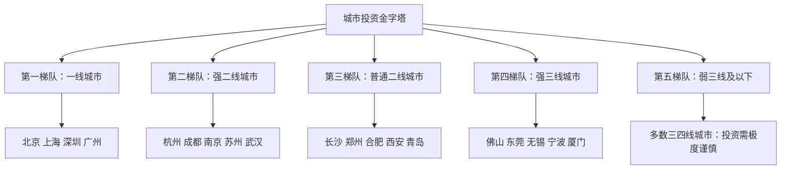
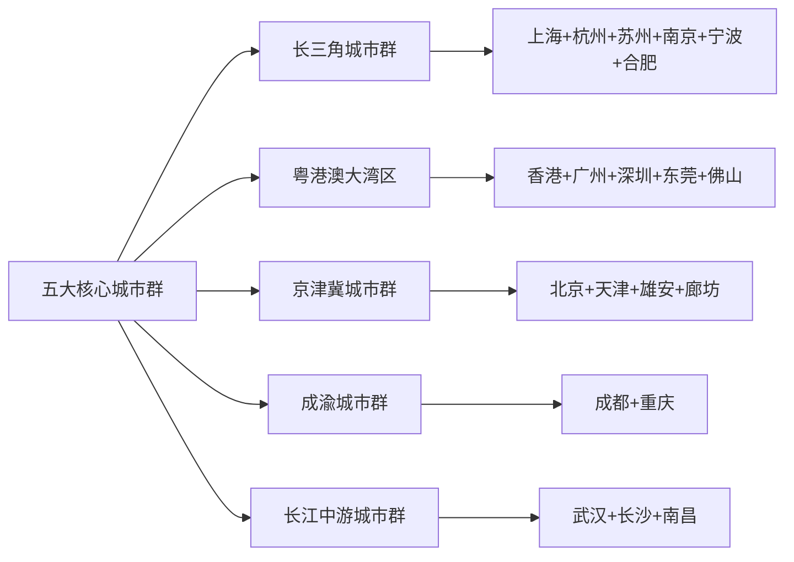
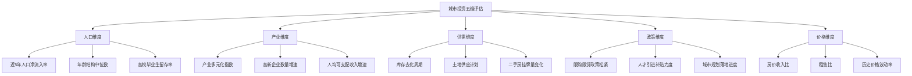

## 七、中国主要城市房产投资分析

中国房地产市场最显著的特征是**高度分化**。同样是一套100平方米的房子，在北京西城区可能价值1500万，在长沙岳麓区可能只要150万，在某些三四线城市可能连50万都卖不出去。这种差异不是随机产生的，而是由城市能级、产业结构、人口流动、土地政策和金融环境等多重因素共同决定的。

理解城市分化逻辑，是房产投资的第一步。本章将从一线城市到新兴潜力城市逐层分析，为不同资金量级和风险偏好的投资者提供决策参考。

### 7.1 城市分层框架：理解中国城市的"金字塔"

中国城市的行政等级和经济能级决定了资源分配的底层逻辑。理解这个框架，才能明白为什么"买对城市"比"买对房子"更重要。

**分层的核心依据：**

| 维度 | 一线 | 强二线 | 普通二线 | 强三线 | 弱三线及以下 |
|------|------|--------|----------|--------|-------------|
| GDP规模 | >3万亿 | 1.5-3万亿 | 8000亿-1.5万亿 | 5000-8000亿 | <5000亿 |
| 人口流向 | 持续净流入 | 强劲流入 | 温和流入 | 基本持平 | 净流出 |
| 产业层级 | 金融+科技+总部 | 科技/制造/消费 | 区域中心型产业 | 专业制造/外贸 | 资源型/农业型 |
| 土地依赖度 | 低（<30%财政） | 中（30-40%） | 较高（40-50%） | 高（>50%） | 极高（>60%） |
| 库存周期 | <8个月 | 8-12个月 | 12-18个月 | 18-24个月 | >24个月 |
| 投资确定性 | 最高 | 较高 | 中等 | 较低 | 极低 |

### 7.2 一线城市深度分析

一线城市是房产投资的"压舱石"。它们的共同特征是：资源高度集中、人口持续流入、土地供应有限、政策调控最严。但四个城市的投资逻辑各有不同。

#### 7.2.1 北京：政治中心的特殊逻辑

**城市基本面：**

北京的特殊性在于它不仅是经济城市，更是政治中心。这意味着它的资源配置逻辑与纯经济型城市不同——中央部委、央企总部、科研院所、顶尖高校的集中度全国第一，这些机构不会因为经济周期而搬迁。

- **常住人口：** 约2180万（2024年），实际管理服务人口接近3000万
- **GDP：** 约4.3万亿元，人均GDP约20万元
- **产业结构：** 服务业占比超过83%，金融业、信息技术、科技服务业为三大支柱
- **土地供应：** 年度住宅用地供应约300-400公顷，严格执行减量发展

**房价现状与历史走势：**

北京房价经历了几个关键节点：2008年金融危机后快速反弹（2009年涨幅超50%）、2017年"317调控"后进入长达两年的调整期、2020年疫情后回暖、2021年下半年再次转弱。截至2025年，北京二手房均价约5.5-6万元/平方米，核心区（西城、东城、海淀、朝阳）均价在8-12万/平方米。

**区域投资价值矩阵：**

| 区域 | 均价（万/㎡） | 核心驱动力 | 投资评级 | 风险提示 |
|------|-------------|-----------|---------|---------|
| 西城 | 10-14 | 金融街+顶级学区 | ★★★★☆ | 学区政策变动风险 |
| 海淀 | 8-12 | 科技产业+顶尖学区 | ★★★★☆ | 部分老旧小区品质差 |
| 朝阳 | 6-9 | CBD+国际化+商业 | ★★★★☆ | 区域面积大，分化严重 |
| 东城 | 9-12 | 核心区稀缺性 | ★★★☆☆ | 供应极少，流动性一般 |
| 丰台 | 4-6 | 丽泽商务区+南城计划 | ★★★☆☆ | 发展不均衡 |
| 通州 | 3-4.5 | 城市副中心 | ★★☆☆☆ | 供应量大，兑现周期长 |
| 大兴 | 3-4 | 新机场+亦庄 | ★★★☆☆ | 亦庄独立性强 |
| 昌平 | 3-4.5 | 未来科学城+回龙观 | ★★★☆☆ | 交通依赖地铁线 |
| 远郊（房山、密云等） | 1.5-2.5 | 价格洼地 | ★★☆☆☆ | 产业支撑弱，流动性差 |

**北京投资的核心逻辑：**

1. **学区房正在经历价值重估。** 2021年以来多校划片政策逐步推行，学区房的确定性溢价被削弱。短期内顶级学区仍有支撑，但长期看政策风险大于收益。如果投资学区房，应以"自住+保值"心态而非"投资升值"心态。

2. **产业聚集区比行政区划更重要。** 望京的互联网产业、亦庄的高端制造、西二旗的科技企业，这些产业聚集区的房产需求是真实且持续的。关注产业导入，而非行政区名称。

3. **"老破小"正在被市场淘汰。** 北京存量房中，1990年代以前的房子占比不低。随着居民对居住品质要求提高和新房限价政策，老旧小区的价值支撑在弱化，除非有顶级学区加持。

#### 7.2.2 上海：经济中心的多元价值

**城市基本面：**

上海是中国经济开放度最高的城市，也是唯一一个同时具备国际金融中心、国际贸易中心、国际航运中心、国际科技创新中心"四个中心"定位的城市。

- **常住人口：** 约2490万（2024年），外籍常住人口约17万（全国最多）
- **GDP：** 约4.9万亿元，人均GDP约19.5万元
- **产业结构：** 金融业增加值全国第一（约8600亿元），集成电路、生物医药、人工智能为三大先导产业
- **土地供应：** 年度住宅用地约400-500公顷，内环内几乎无新增

**上海的"环线逻辑"：**

上海是环线分化最清晰的城市。内环（内环高架以内）是绝对核心，中环到外环之间是改善型主力区域，外环以外是刚需和新城区域。

- **内环内（黄浦、静安、徐汇、长宁核心区）：** 均价10-16万/㎡，供应极度稀缺，保值能力最强。上海内环的土地开发率已超过95%，新增供应几乎为零。
- **中环区域（浦东核心、杨浦、虹口、普陀）：** 均价6-10万/㎡，有产业支撑的区域（如张江、五角场）表现优于纯居住区。
- **外环区域（闵行、宝山、嘉定、松江、青浦、浦东外围）：** 均价3-6万/㎡，分化最大。地铁沿线、产业园区周边有支撑，远离地铁和产业的板块风险较高。
- **远郊新城（临港、奉贤、金山、崇明）：** 均价1.5-3万/㎡，投资需要极长的持有周期和明确的产业预期。

**上海特殊的投资机会：**

1. **城市更新红利。** 上海正在推进大规模城市更新，市中心老旧小区拆迁改造释放的地块价值极高。关注黄浦、静安等区域的城市更新项目。
2. **五大新城规划。** 嘉定、青浦、松江、奉贤、南汇五大新城是上海未来人口和产业疏解的主要方向，但兑现周期长，投资需耐心。
3. **临港自贸区。** 作为特殊政策区，临港有独立的购房政策和产业导入计划，但目前配套尚不成熟，适合超长期投资者。

#### 7.2.3 深圳：科技之城的高波动特征

**城市基本面：**

深圳是中国最年轻的一线城市，平均年龄约32岁，也是科技密度最高的城市——拥有华为、腾讯、大疆、比亚迪等全球级科技企业。

- **常住人口：** 约1780万（2024年），实际管理人口超过2200万
- **GDP：** 约3.6万亿元，人均GDP约20.3万元（一线最高）
- **产业结构：** 高新技术产业产值占比超过60%，PCT国际专利申请量连续多年全国第一
- **土地面积：** 不到2000平方公里（北京的1/8，上海的1/3），可开发土地基本用尽

**深圳的"南山-福田-龙华"三角：**

| 区域 | 均价（万/㎡） | 核心特征 | 投资评级 |
|------|-------------|---------|---------|
| 南山 | 8-14 | 科技总部+前海自贸区 | ★★★★★ |
| 福田 | 7-11 | CBD+行政中心 | ★★★★☆ |
| 宝中 | 6-9 | 前海辐射+配套成熟 | ★★★★☆ |
| 龙华 | 4-7 | 北站枢纽+观澜高新 | ★★★☆☆ |
| 龙岗 | 3-5 | 大运新城+华为辐射 | ★★★☆☆ |
| 光明 | 3-5 | 科学城规划 | ★★★☆☆ |
| 坪山 | 2-3.5 | 新能源产业 | ★★☆☆☆ |
| 盐田/大鹏 | 3-5 | 旅游资源，居住为主 | ★★☆☆☆ |

**深圳投资的核心风险与机遇：**

- **风险一：政策波动大。** 2021年二手房指导价政策出台后，深圳成交量暴跌超过60%，部分片区房价回调20-30%。深圳的调控政策往往是全国最严的，政策面的不确定性是最大风险。
- **风险二：杠杆率过高。** 深圳居民杠杆率在全国城市中名列前茅，很多购房者的月供收入比超过50%，一旦收入下降或利率上升，断供风险不可忽视。
- **机遇一：人口结构优势。** 深圳的年轻人口结构意味着长期住房需求旺盛，且城市对年轻人的吸引力仍在。
- **机遇二：产业升级红利。** 新能源（比亚迪）、半导体、人工智能等产业的发展为深圳经济提供了新的增长引擎。

#### 7.2.4 广州：一线城市的"价值洼地"

**城市基本面：**

广州是一线城市中房价最低、调控最松的城市，也是唯一一个部分区域取消了限购的一线城市。

- **常住人口：** 约1880万（2024年），实际服务人口超过2200万
- **GDP：** 约3.1万亿元，汽车产业（广汽）是第一大工业支柱
- **产业结构：** 汽车制造、电子信息、石油化工为三大工业支柱，商贸、物流、专业服务是服务业核心
- **粤港澳大湾区：** 作为大湾区核心引擎城市，与深圳、香港、澳门形成协同效应

**广州的"东进南拓"格局：**

- **天河（珠江新城、天河公园）：** 均价5-9万/㎡，CBD所在地，广州房价天花板。珠江新城是华南地区的金融中心，聚集了大量金融机构和跨国企业总部。
- **越秀：** 均价4-7万/㎡，老城区，教育医疗资源最密集，但城市面貌老旧。
- **海珠（琶洲）：** 均价3.5-6万/㎡，琶洲互联网创新集聚区是广州数字经济的核心载体，阿里巴巴、腾讯、小米等企业在此设立区域总部。
- **荔湾、白云：** 均价2-4万/㎡，白云新城规划有增量预期。
- **番禺、黄埔：** 均价2-3.5万/㎡，黄埔开发区和科学城是广州产业发展的主阵地。
- **南沙：** 均价1.5-2.5万/㎡，粤港澳大湾区地理几何中心，规划宏大但兑现缓慢。

**广州投资的独特优势：**

1. **租售比在一线城市中最优。** 天河区部分小区租售比可达2.5-3%，远高于北京的1.5%和上海的1.8%。这意味着持有成本更低，现金流更健康。
2. **限购政策最宽松。** 非核心区域已经放开限购，外地人购房门槛在一线城市中最低。
3. **大湾区协同效应。** 广深港高铁、港珠澳大桥等基础设施使广州与大湾区其他城市的联系更加紧密，人才和产业的流动带来更多住房需求。

#### 7.2.5 一线城市投资对比总览

| 维度 | 北京 | 上海 | 深圳 | 广州 |
|------|------|------|------|------|
| 均价（万/㎡） | 5.5-6 | 5.5-6.5 | 5-6 | 3-3.5 |
| 房价收入比 | 约35倍 | 约30倍 | 约40倍 | 约22倍 |
| 租售比 | 约1.5% | 约1.8% | 约1.3% | 约2.5% |
| 限购严格度 | ★★★★★ | ★★★★★ | ★★★★★ | ★★★☆☆ |
| 人口增长趋势 | 微降/持平 | 微增 | 增长放缓 | 稳定增长 |
| 产业驱动力 | 科技+金融+总部 | 金融+贸易+航运 | 科技+新能源 | 汽车+商贸+数字 |
| 最大风险 | 学区政策+人口疏解 | 外部经济冲击 | 政策调控+杠杆 | 产业升级速度 |
| 适合投资者类型 | 长期保值型 | 长期保值型 | 高风险高收益型 | 稳健增值型 |

### 7.3 强二线城市深度分析

强二线是当前房产投资中**性价比最高**的梯队。这些城市具备一线城市的部分特征（人口流入、产业升级、基础设施完善），但房价只有一线的1/2甚至1/3。关键在于识别哪些城市具有"准一线"潜力。

#### 7.3.1 杭州：数字经济之城

**核心数据：**
- GDP约2.1万亿元，人口约1250万（2024年）
- 数字经济核心产业增加值占GDP比重超过28%，全国第一
- 阿里巴巴总部所在地，带动了整个电商、直播、金融科技生态链

**房价格局：**
- 核心区（西湖、拱墅、滨江）：4-7万/㎡
- 次核心（上城、余杭未来科技城）：3-5万/㎡
- 外围（萧山、临平、富阳）：1.5-3万/㎡
- 2021年亚运会前房价冲高后回落，目前处于调整末期

**投资逻辑：**
1. **产业支撑扎实。** 互联网+数字经济+直播电商的产业链完整，高薪岗位密度大。
2. **人口吸引力强。** 近5年年均净流入超过30万人，在强二线中名列前茅。
3. **亚运会红利。** 2022年亚运会推动了大规模基础设施建设（地铁从4条扩展到12条），长期利好。
4. **风险提示：** 部分远郊板块（临安、桐庐方向）供应量大，去化困难。

#### 7.3.2 成都：西部龙头

**核心数据：**
- GDP约2.2万亿元，人口约2140万（2024年，含简阳）
- 社会消费品零售总额全国前列，消费力旺盛
- 电子信息产业产值超过1万亿元，是全球重要的电子信息产业基地

**房价格局：**
- 核心区（锦江、青羊、高新南区）：2-3.5万/㎡
- 次核心（武侯、金牛、成华）：1.5-2.5万/㎡
- 外围（天府新区、龙泉驿、双流）：1-2万/㎡
- 近郊（温江、郫都、新都）：0.8-1.5万/㎡

**投资逻辑：**
1. **人口基数大且持续流入。** 成都是西部地区最大的人口磁极，对整个西南地区有强大的虹吸效应。
2. **房价收入比合理。** 约15倍，在同级别城市中偏低，说明房价有收入支撑。
3. **天府新区的长期价值。** 天府新区是国家级新区，规划面积1578平方公里，对标浦东新区，但需要10-15年的兑现周期。
4. **风险提示：** 成都土地供应量大，新房库存较高，短期有去库存压力。

#### 7.3.3 武汉：中部枢纽

**核心数据：**
- GDP约2万亿元，人口约1380万（2024年）
- 在校大学生超过130万，全国第一，人才储备丰厚
- 光谷（东湖高新区）是中国光电子产业的发源地

**投资逻辑：**
1. **教育资源优势转化为产业优势。** 光谷聚集了烽火通信、华工科技、长飞光纤等光电子企业，近年又引入了小米、字节跳动等互联网企业的第二总部。
2. **交通枢纽地位。** 武汉是全国高铁网络的中心节点，4小时可达全国主要城市。
3. **风险提示：** 新房供应量持续高位，库存去化周期偏长，部分远郊板块存在过剩风险。

#### 7.3.4 南京：科教重镇

**核心数据：**
- GDP约1.8万亿元，人口约950万（2024年）
- 双一流高校数量全国第三（12所），仅次于北京和上海
- 江北新区是国家级新区

**投资逻辑：**
1. **人口质量高。** 南京的高校毕业生留宁比例逐年提升，高端人才供给充足。
2. **房价有支撑但不便宜。** 南京核心区房价在3-5万/㎡，在强二线中偏高，但与收入水平匹配。
3. **河西-江北的双核格局。** 河西是成熟核心区，江北是新兴发展区，两者形成互补。

#### 7.3.5 苏州：制造业高地

**核心数据：**
- GDP约2.5万亿元（全国地级市第一），人口约1300万
- 工业总产值超过4万亿元，是全球最大的制造业基地之一
- 外资企业超过1.5万家，世界500强投资项目超过400个

**投资逻辑：**
1. **经济实力被严重低估。** 苏州GDP超过多数省会城市，但房价只有杭州、南京的60-70%。
2. **工业园区的价值。** 苏州工业园区是中国和新加坡合作项目，产业层次和城市管理水平在全国开发区中名列前茅。
3. **长三角一体化红利。** 沪苏同城化趋势下，苏州承接上海产业和人口外溢的机会增加。

#### 7.3.6 长沙：低房价的模范城市

**核心数据：**
- GDP约1.4万亿元，人口约1060万（2024年）
- 房价收入比约10倍，是同级别城市中最低的
- 工程机械产业集群全国第一（三一重工、中联重科）

**投资逻辑：**
1. **"房住不炒"的标杆。** 长沙通过严格的限购限价政策，长期将房价控制在合理水平。这既是优势（居住成本低，吸引人才），也是劣势（投资升值空间有限）。
2. **人口净流入但房价不涨。** 这说明长沙的住房供应是充足的，投资房产的资本利得预期不宜过高。
3. **适合租售比投资。** 长沙的租售比约3-4%，在二线城市中属于较高水平，适合"以租养贷"策略。

#### 7.3.7 强二线城市综合对比

| 城市 | GDP（万亿） | 人口（万） | 核心区均价（万/㎡） | 房价收入比 | 租售比 | 人口流入趋势 | 综合投资评级 |
|------|-----------|----------|-------------------|-----------|--------|------------|------------|
| 杭州 | 2.1 | 1250 | 4-7 | 22倍 | 1.8% | 强劲 | ★★★★☆ |
| 成都 | 2.2 | 2140 | 2-3.5 | 15倍 | 2.5% | 强劲 | ★★★★☆ |
| 苏州 | 2.5 | 1300 | 2-3.5 | 14倍 | 2.8% | 稳定 | ★★★★☆ |
| 南京 | 1.8 | 950 | 3-5 | 18倍 | 2.0% | 温和 | ★★★☆☆ |
| 武汉 | 2.0 | 1380 | 1.5-2.5 | 13倍 | 2.8% | 温和 | ★★★☆☆ |
| 长沙 | 1.4 | 1060 | 1-1.5 | 10倍 | 3.5% | 稳定 | ★★★☆☆ |

### 7.4 新兴潜力城市分析

除了一线和强二线，还有一些城市因为特定的政策红利或产业变革而具有投资价值。这些城市的风险更高，但潜在回报也更大。

#### 7.4.1 合肥：最成功的"风投城市"

合肥在过去十年中堪称中国城市发展的最大黑马。通过精准的产业投资（京东方、蔚来汽车、长鑫存储等），合肥从一个中部普通省会跃升为新能源汽车和半导体产业的重要基地。

- **核心产业：** 新能源汽车（蔚来、大众安徽、比亚迪合肥基地）、半导体（长鑫存储）、人工智能（科大讯飞）
- **房价水平：** 核心区1.5-2.5万/㎡，滨湖新区1.2-2万/㎡
- **投资关注点：** 滨湖新区是城市发展的主方向，但供应量大；高新区因科大讯飞等企业聚集而有产业支撑

#### 7.4.2 西安：西北龙头

西安是西北地区唯一的国家中心城市，拥有丰富的高校资源（西安交大、西北工大等）和军工科研基础。

- **核心产业：** 航空航天（西飞、航天四院）、电子信息（三星西安工厂）、文化旅游
- **房价水平：** 核心区（高新、曲江）1.5-2.5万/㎡，主城区1-1.8万/㎡
- **投资关注点：** 高新区是西安经济发展的引擎，三星半导体工厂带动了整个产业链；曲江新区以文旅和高端居住为主

#### 7.4.3 佛山/东莞：大湾区制造业双子星

这两个城市不显山不露水，但经济体量惊人——佛山GDP超过1.3万亿，东莞超过1.1万亿，均超过大部分省会城市。

- **佛山优势：** 家电（美的、格兰仕）、陶瓷、铝型材产业强大，靠近广州，广佛同城化程度高。南海、顺德的房价1-2万/㎡，适合预算有限但想进入大湾区的投资者。
- **东莞优势：** 电子信息制造业（华为终端总部在松山湖）、智能制造。松山湖片区2-3万/㎡，有华为带动的产业效应。

#### 7.4.4 需要极度谨慎的城市类型

以下类型的城市，除非有特殊自住需求，否则不建议投资：

**第一类：人口持续流出型**
- 特征：近5年常住人口净减少超过5%，年轻人（18-35岁）外流比例超过10%
- 典型代表：东北多数城市（鹤岗、双鸭山、七台河等）、部分西北城市（白银、武威等）
- 本质：住房需求在萎缩，即使房价很低，也可能"没有最低只有更低"

**第二类：产业单一/资源枯竭型**
- 特征：GDP高度依赖单一产业（煤炭、钢铁、石油），且该产业处于下行周期
- 典型代表：鄂尔多斯（煤炭）、鞍山（钢铁）、玉门（石油枯竭）
- 本质：产业衰退→就业减少→人口外流→房价下跌，这个传导链条几乎不可逆

**第三类：库存严重过剩型**
- 特征：新房库存去化周期超过24个月，且仍在持续供地
- 典型代表：部分中部三四线城市、环京环沪的过度开发区域
- 本质：供大于求，价格下行压力持续存在

**第四类：过度依赖棚改货币化型**
- 特征：2016-2018年房价大幅上涨主要靠棚改货币化推动，棚改退潮后需求断崖式下降
- 典型代表：2018年后的菏泽、阜阳、周口等
- 本质：棚改创造的是短期需求而非长期需求，退潮后没有真实需求支撑

### 7.5 城市群视角：从单城投资到区域布局

单独看一个城市是不够的，中国的城市化正在从"单城扩张"转向"城市群协同"。理解城市群格局，能帮助投资者发现跨城市的套利机会。

**城市群投资的核心原则：**

1. **核心城市买确定性，外围城市买性价比。** 如果预算充足，在上海、深圳核心区买确定性；如果预算有限，可以考虑核心城市1小时通勤圈内的"卫星城"，如昆山（上海旁）、惠州（深圳旁）、佛山（广州旁）。

2. **交通基础设施决定卫星城价值。** 有高铁站或地铁延伸的卫星城，与核心城市的联动更强，房产价值更有可能兑现。没有轨道交通连接的"名义上的卫星城"本质上还是独立城市。

3. **产业转移承接能力是关键。** 能承接核心城市产业外溢的城市，房价有真实支撑；只有居住功能没有产业的"睡城"，价值天花板很低。

**重点城市群投资机会：**

| 城市群 | 核心城市 | 高性价比卫星城 | 投资逻辑 |
|--------|---------|--------------|---------|
| 长三角 | 上海 | 昆山、嘉兴、太仓 | 沪苏同城化、产业外溢 |
| 大湾区 | 深圳 | 惠州、中山（需深中通道） | 深圳房价外溢、交通改善 |
| 大湾区 | 广州 | 佛山（南海、顺德） | 广佛同城、制造业支撑 |
| 京津冀 | 北京 | 天津武清、廊坊北三县 | 京津冀协同发展 |
| 成渝 | 成都 | 眉山（天府新区南区） | 天府新区南拓 |

### 7.6 城市投资决策的实操框架

理论分析最终要落地到具体的投资决策。以下是一个可操作的城市选择框架。

#### 7.6.1 城市筛选的"五维模型"

#### 7.6.2 数据获取渠道

评估一个城市的房产投资价值，需要获取上述五维数据。以下是主要数据来源：

| 数据类型 | 来源 | 获取方式 |
|---------|------|---------|
| 人口数据 | 各市统计局年度统计公报 | 官网免费下载 |
| GDP/产业数据 | 各市统计局、国家统计局 | 官网免费下载 |
| 房价数据 | 贝壳研究院、中指研究院 | 部分免费，深度报告付费 |
| 库存数据 | 克而瑞、中指院 | 行业报告（部分付费） |
| 土地数据 | 各市自然资源局土地出让公告 | 官网免费 |
| 二手房数据 | 贝壳找房、链家APP | 实时查询 |
| 政策信息 | 各市住建局官网 | 政策文件免费 |

#### 7.6.3 投资者分层策略

不同资金量级的投资者，适合不同的城市和策略：

**50万以下预算：**
- 目标城市：长沙、成都外围、武汉远郊、佛山
- 策略：小户型出租型投资，追求租售比
- 预期年化收益：租金3-4% + 资本增值1-2% = 4-6%

**50-150万预算：**
- 目标城市：成都核心区、武汉光谷、杭州外围、苏州工业园区
- 策略：兼顾自住和投资，选择有产业支撑的板块
- 预期年化收益：租金2-3% + 资本增值2-4% = 4-7%

**150-300万预算：**
- 目标城市：广州核心区、杭州核心区、南京河西
- 策略：核心区域优质标的，长期持有
- 预期年化收益：租金1.5-2.5% + 资本增值3-5% = 4.5-7.5%

**300万以上预算：**
- 目标城市：北京、上海、深圳核心区
- 策略：顶级资源稀缺标的，保值为主
- 预期年化收益：租金1-2% + 资本增值3-6% = 4-8%

### 7.7 常见误区与纠正

**误区一："一线城市永远涨"**

事实：一线城市也有下跌周期。2017年北京"317调控"后，部分片区房价回调超过15%；2021年深圳在严厉调控下，部分片区回调超过20%。一线城市的优势是"跌得少、恢复快"，而非"永远涨"。

**误区二："房价低=投资价值高"**

事实：房价低可能是因为需求不足，而非价值被低估。鹤岗的房价2-3万一套，但没有投资价值，因为没有人口和产业支撑。判断投资价值应看"房价与基本面的匹配度"，而非绝对价格。

**误区三："跟着大开发商拿地走"**

事实：大开发商的拿地逻辑基于"规模和周转"，而非"投资回报最大化"。他们可能在某个城市拿了大量地是因为拿地价格便宜，而非看好后市。投资者应独立分析，而非盲目跟随。

**误区四："规划好=一定能涨"**

事实：城市规划从公布到兑现通常需要5-15年，期间可能因为政策变化、资金问题、产业调整等因素而延期甚至取消。"画饼"和"真饼"之间的差距往往很大。投资规划区域，需要有足够长的持有耐心和对规划可行性的独立判断。

**误区五："跟着地铁买准没错"**

事实：地铁是加分项，但不是决定因素。一个有地铁但没有产业支撑的片区，可能只是一个"有地铁的睡城"。真正有价值的是"地铁+产业+配套"的组合，三者缺一不可。

### 7.8 本节核心要点

1. **城市选择是房产投资的第一决策。** 买错城市，再好的房子也难升值。
2. **五大维度评估城市：** 人口流入、产业质量、供需关系、政策环境、价格合理性。
3. **一线城市买确定性，强二线买性价比，新兴城市买潜力但要控制仓位。**
4. **城市群视角比单城视角更重要。** 关注核心城市与卫星城的联动关系。
5. **远离人口流出、产业单一、库存高企的城市，无论房价多低。**
6. **规划≠现实。** 投资规划区域需要极长的持有周期和对规划可行性的独立判断。
7. **数据驱动决策。** 用统计数据而非感觉和传言来评估城市投资价值。
