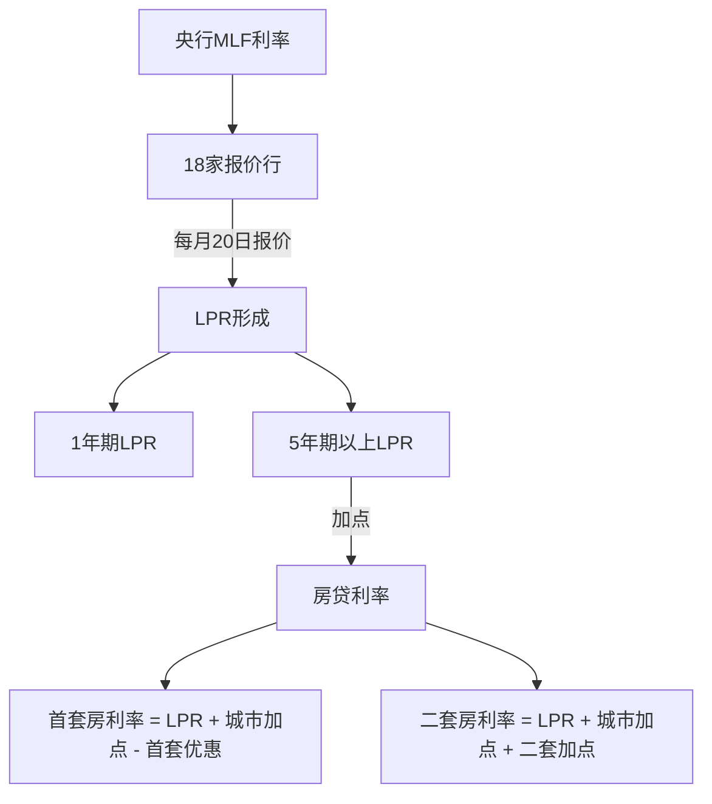
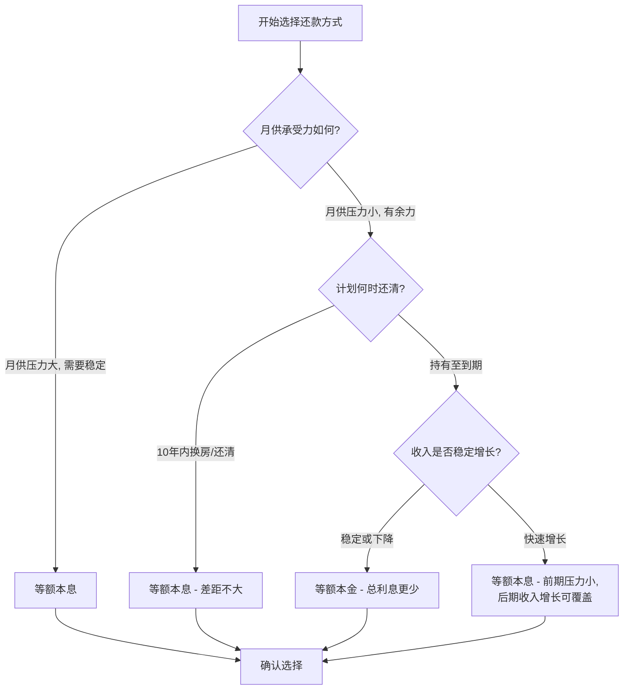
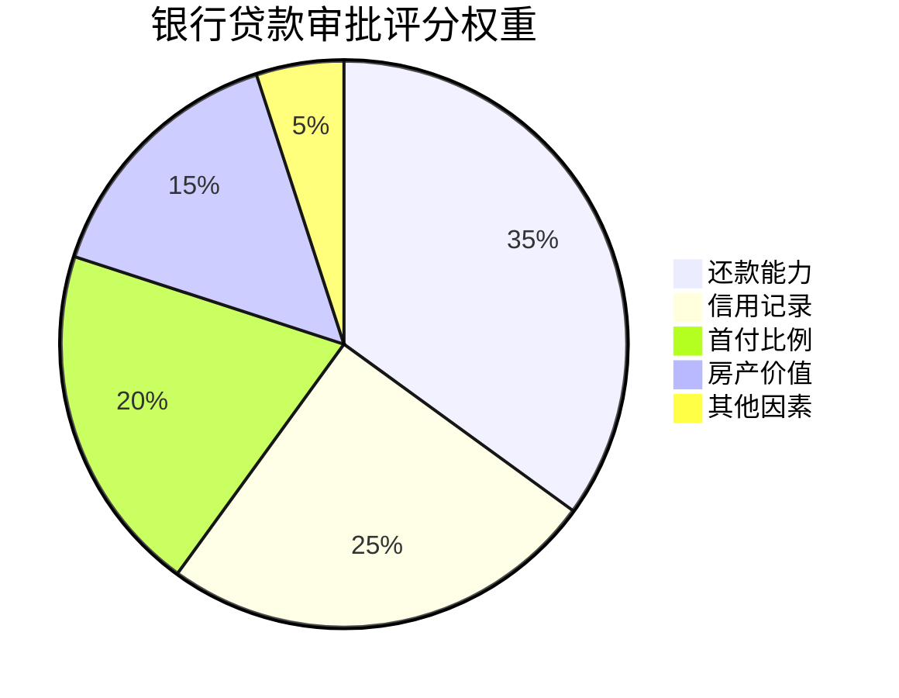
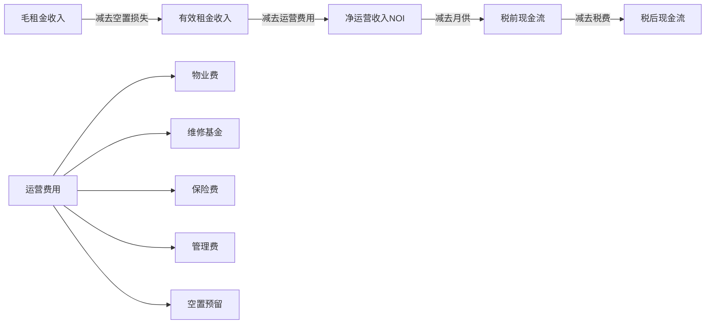
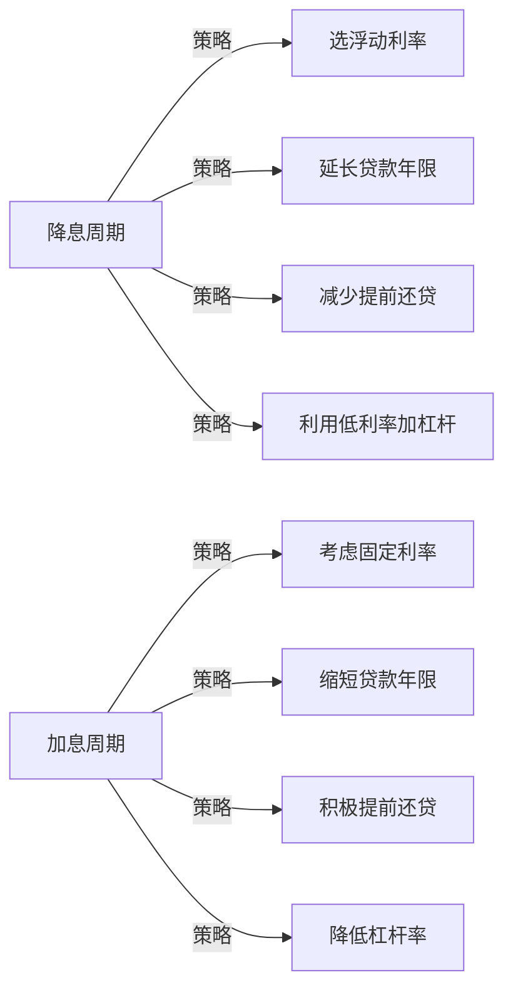

## 八、房产贷款策略深度分析

房产贷款是普通家庭一生中金额最大、期限最长的金融决策。一笔100万、30年期的贷款，总利息支出可能接近甚至超过本金本身。贷款策略的微小差异——利率差0.1%、还款方式不同、提前还贷时机选择——最终可能导致数十万元的财务差距。本章从贷款产品选择、利率机制解读、还款方式决策、提前还贷分析、现金流管理五个维度，系统拆解房产贷款的核心策略。

### 8.1 中国房贷产品体系

#### 8.1.1 三大贷款类型详解

**公积金贷款**

住房公积金贷款是政策性住房贷款，由住房公积金管理中心委托商业银行发放。其核心优势在于利率显著低于商业贷款，这源于公积金制度的互助性质——缴存人共同出资形成资金池，贷款利率不以盈利为主要目的。

具体规则如下：

| 要素 | 说明 |
|------|------|
| 利率水平 | 首套房5年以上：2.85%（2024年10月调整后）；二套：3.325% |
| 贷款额度 | 各城市差异极大。北京个人最高120万，夫妻120万；上海个人最高50万（有补充公积金60万），夫妻120万；深圳个人最高50万，夫妻90万 |
| 缴存要求 | 通常要求连续缴存6-12个月，中间不能断缴 |
| 审批周期 | 较长，通常1-3个月 |
| 房龄限制 | 一般要求房龄+贷款年限≤47年（各地不同） |
| 首付比例 | 首套最低20%，二套最低30%-60%（因城施策） |

公积金贷款的局限性也很明显：额度上限低，在一线城市往往无法覆盖全部贷款需求；审批流程长，对急迫交易不友好；对房屋类型有限制，通常只支持普通住宅。

**商业贷款**

商业贷款是商业银行以市场利率发放的住房贷款，是大多数购房者的主要融资渠道。2019年LPR改革后，商业房贷利率以LPR（贷款市场报价利率）为基准加点形成。

具体规则如下：

| 要素 | 说明 |
|------|------|
| 利率形成 | LPR + 银行加点。2024年5年期LPR为3.6%，各城市加点不同，首套实际利率约3.0%-3.5% |
| 贷款额度 | 无硬性上限，取决于房价、首付比例和还款能力 |
| 审批速度 | 通常2-4周 |
| 首付比例 | 首套最低15%-20%，二套最低25%-40%（因城施策） |
| 贷款年限 | 最长30年，借款人年龄+贷款年限一般不超过70岁（部分银行放宽至75岁） |

商业贷款的核心优势是额度高、审批快、适用范围广。劣势是利率高于公积金贷款。

**组合贷款**

当公积金额度不足以覆盖全部贷款需求时，可以申请组合贷款——公积金部分按公积金利率、商业部分按商贷利率分别计算。组合贷款的优势在于综合利率低于纯商贷，劣势在于审批周期长（需要公积金中心和银行双重审批）、手续复杂、部分卖方不愿接受。

> 实操建议：如果公积金额度差距不大（比如差10-20万），可以考虑先用纯商贷，后续通过"商转公"降低利率。部分城市支持商转公，但条件各异，需要提前咨询当地公积金中心。

#### 8.1.2 LPR利率机制深度解读

LPR（Loan Prime Rate，贷款市场报价利率）是2019年8月起实施的贷款定价基准机制，理解它是理解房贷利率的关键。

**LPR的核心运作逻辑：**

1. **报价机制**：18家报价行（工农中建交等大型银行+部分股份制银行+城商行+外资行+民营银行）每月20日报价，去掉最高和最低各2个，取算术平均值
2. **期限结构**：1年期LPR影响短期贷款（如经营贷），5年期以上LPR直接影响房贷
3. **调整频率**：LPR每月公布一次，但已发放房贷的利率调整周期可以选择每年1月1日调整或按放款日对月对日调整
4. **历史走势**：5年期LPR从2019年8月的4.85%逐步降至2024年的3.6%，累计降幅达125个基点

**重定价日选择策略：**

- **每年1月1日**：以上年12月LPR为准。好处是可预测性强，坏处是如果年中LPR下降，要等到次年1月才能享受
- **放款日对月对日**：以放款月份的LPR为准。好处是能更快享受LPR下降，坏处是调整时间分散，管理稍复杂

> 实操建议：在降息周期中，选择放款日对月对日更有利；在加息周期中，选择1月1日更稳妥。当前（2024-2025年）处于降息周期，建议选择放款日对月对日。

#### 8.1.3 固定利率与浮动利率的选择

2020年存量房贷转换时，很多人面临过固定利率vs浮动利率（LPR+加点）的选择。这个决策的本质是对未来利率走势的判断。

| 维度 | 固定利率 | 浮动利率（LPR+加点） |
|------|---------|---------------------|
| 利率确定方式 | 签约时锁定，整个贷款周期不变 | 随LPR定期调整 |
| 适合场景 | 利率处于历史低位，预期未来上升 | 利率处于高位或下降趋势中 |
| 风险 | 如果利率下降，无法享受降息红利 | 如果利率上升，月供增加 |
| 当前建议 | 2024年后新发放房贷均为浮动利率，无需选择 | 当前利率处于历史低位，浮动利率更优 |

### 8.2 还款方式的数学分析与决策

#### 8.2.1 等额本息 vs 等额本金

**等额本息**每月还款金额固定，计算公式为：

$$月供 = 本金 \times \frac{月利率 \times (1+月利率)^{还款月数}}{(1+月利率)^{还款月数}-1}$$

**等额本金**每月偿还本金固定，利息逐月递减：

$$月供 = \frac{本金}{还款月数} + 剩余本金 \times 月利率$$

两种方式的核心差异在于本金偿还节奏。等额本息前期还的主要是利息，本金减少慢；等额本金前期就大量偿还本金，利息自然减少更快。

**详细对比（贷款100万，利率3.6%，30年）：**

| 对比指标 | 等额本息 | 等额本金 | 差异 |
|---------|---------|---------|------|
| 首月月供 | 4,546元 | 6,167元 | 等额本金多1,621元 |
| 末月月供 | 4,546元 | 2,789元 | 等额本金少1,757元 |
| 第5年月供 | 4,546元 | 5,625元 | 等额本金多1,079元 |
| 第10年月供 | 4,546元 | 5,083元 | 等额本金多537元 |
| 第15年月供 | 4,546元 | 4,542元 | 基本持平 |
| 总利息 | 63.7万 | 54.1万 | 等额本金省9.6万 |
| 总还款 | 163.7万 | 154.1万 | 等额本金少9.6万 |
| 前5年已还本金 | 13.6万 | 16.7万 | 等额本金多还3.1万 |

**关键洞察：**

- 等额本息总利息多出约9.6万，但前15年月供压力更小
- 等额本金在第15年左右月供与等额本息持平，此后更低
- 如果计划在10年内提前还清，两种方式的实际差距会大幅缩小（因为提前还贷时利息计算截止到还款日）
- 等额本金的优势在贷款后期才明显体现，而大多数人会在贷款中期换房或提前还贷

#### 8.2.2 先息后本与其他特殊还款方式

部分银行或特定贷款产品（如经营贷）提供先息后本方式：前期只还利息，到期一次性还本。

| 还款方式 | 月供特点 | 总利息 | 适合场景 |
|---------|---------|--------|---------|
| 等额本息 | 固定月供 | 中等 | 收入稳定，长期持有 |
| 等额本金 | 逐月递减 | 最低 | 收入较高，前期还款能力强 |
| 先息后本 | 前期极低，末期极高 | 最高 | 短期周转，预期未来有大笔收入 |

> 风险警示：先息后本看似月供低，但总利息最高，且到期还本压力巨大。如果用于房产投资"以贷养贷"，一旦房价下跌或资金链断裂，风险极高。普通购房者不建议使用此方式。

#### 8.2.3 还款方式选择的决策流程

### 8.3 提前还贷的量化决策模型

#### 8.3.1 提前还贷的收益计算

提前还贷的本质是用确定的"省下的利息"来对比不确定的"其他投资收益"。这是一个机会成本问题。

**核心公式：**

$$提前还贷收益率 = \frac{节省的利息}{提前还贷的本金} \times 100\%$$

这个收益率等于你的贷款利率。也就是说，如果你的贷款利率是3.6%，提前还贷相当于获得一个年化3.6%的无风险收益。

**决策标准：**

| 条件 | 决策 |
|------|------|
| 贷款利率 > 可获得的无风险收益率（如国债、大额存单） | 倾向提前还贷 |
| 贷款利率 < 可获得的无风险收益率 | 不提前还贷 |
| 有更好的投资机会且收益率 > 贷款利率 × 1.5（风险溢价） | 不提前还贷 |
| 没有更好的投资机会，资金闲置 | 强烈建议提前还贷 |

#### 8.3.2 提前还贷的两种模式对比

**缩短年限（月供不变）** vs **减少月供（年限不变）**

假设条件：贷款100万，利率3.6%，已还5年，此时提前还20万。

| 对比指标 | 缩短年限 | 减少月供 |
|---------|---------|---------|
| 还款年限变化 | 从25年缩短至约19年 | 25年不变 |
| 月供变化 | 不变（约4,546元） | 从4,546元降至约3,637元 |
| 节省总利息 | 约12.8万 | 约8.2万 |
| 月供减少 | 0元 | 约909元/月 |
| 剩余还款总额减少 | 约32.8万 | 约28.2万 |

**缩短年限之所以省更多利息**，是因为减少了资金占用的时间。利息的本质是资金的时间成本——你借银行的钱越久，付的利息越多。缩短年限直接减少了借款时间。

**但减少月供也有其价值：** 降低每月现金流压力，提高家庭财务安全边际。特别是当月供占收入比例超过40%时，减少月供带来的心理安全感和财务灵活性可能比多省几万利息更重要。

> 实操建议：
> - 月供占收入比 < 30%：选缩短年限，最大化省息
> - 月供占收入比 30%-50%：选减少月供，降低压力
> - 月供占收入比 > 50%：必须减少月供，否则财务风险过高
> - 部分银行支持"双减"（既减月供又缩年限），可以协商

#### 8.3.3 提前还贷的最佳时机

提前还贷的时机对节省利息影响巨大。贷款前期（前1/3周期）提前还贷效果最好，后期效果递减。

**原因解析：** 等额本息的还款前期，月供中利息占比高达70%-80%，本金占比仅20%-30%。这意味着前期你付的大部分是利息，提前还贷能跳过大量未来利息。到了还款后期，月供中本金占比已经很高，剩余利息本就不多了，提前还贷的边际收益很小。

**时机选择量化对比（贷款100万，利率3.6%，等额本息30年，提前还20万）：**

| 提前还贷时点 | 节省利息 | 说明 |
|------------|---------|------|
| 第1年末 | 约16.2万 | 效果最佳 |
| 第5年末 | 约13.5万 | 效果很好 |
| 第10年末 | 约10.1万 | 效果一般 |
| 第15年末 | 约6.8万 | 效果递减 |
| 第20年末 | 约3.6万 | 效果较差 |
| 第25年末 | 约0.9万 | 几乎无意义 |

> 核心结论：如果计划提前还贷，越早越好。贷款前10年是黄金窗口期。

#### 8.3.4 不建议提前还贷的场景

1. **公积金贷款**：公积金利率本身已是市场最低（2.85%），资金用于任何稳健理财都可能跑赢这个利率
2. **利率已低于3%的商贷**：在通胀环境下，实际利率可能接近零甚至为负，贷款本身就是"占便宜"
3. **有违约金**：部分银行对贷款发放后1-3年内提前还贷收取违约金（通常为还款金额的1%-3%），需要计算净收益
4. **会影响应急储备**：如果提前还贷后家庭流动资金不足6个月支出，不建议操作
5. **有更好的投资渠道**：如果能稳定获得高于贷款利率的投资收益（扣除风险溢价后），资金应优先投资

### 8.4 再融资策略

#### 8.4.1 什么是再融资

再融资（Refinancing）是指用一笔新贷款替换原有贷款，通常目的是获得更低的利率或改变贷款条件。在中国语境下，主要有两种形式：

**转按揭（跨行转贷）：** 将房贷从利率较高的银行转到利率较低的银行。2024年政策明确支持存量房贷利率下调，各银行陆续出台调整方案，降低了转按揭的需求。

**商转公：** 将商业贷款转为公积金贷款。适用于已购房时未使用公积金贷款或公积金额度不足，后续条件满足的情况。

#### 8.4.2 再融资的决策计算

再融资有成本，必须计算净收益：

$$净收益 = 节省的利息 - 再融资成本$$

再融资成本包括：

| 成本项目 | 金额估算 | 说明 |
|---------|---------|------|
| 提前还清原贷款的手续费 | 0-1% | 部分银行免收 |
| 新贷款的评估费 | 500-2000元 | 房屋价值评估 |
| 新贷款的担保费 | 0-贷款额×0.3% | 视银行要求 |
| 抵押登记变更费 | 80-500元 | 各地标准不同 |
| 中介/服务费 | 0-贷款额×1% | 如通过中介办理 |
| 时间成本 | 1-3个月 | 审批期间可能需要垫资 |

**再融资决策公式：**

$$利率差阈值 = \frac{再融资成本}{剩余贷款本金 \times 剩余年限}$$

一般经验规则：当新旧贷款利率差超过0.5个百分点，且剩余贷款年限超过10年时，再融资通常值得考虑。

#### 8.4.3 再融资的注意事项

- **征信要求**：再融资期间银行会重新审查征信，确保近2年内无逾期记录
- **收入证明**：需要重新提供收入证明，且要求月供不超过月收入的50%
- **房产评估**：如果房价下跌，评估价可能低于买入价，影响贷款额度
- **政策变化风险**：再融资过程中政策可能调整，导致条件变化
- **垫资风险**：部分再融资需要先用自有资金或过桥贷款还清原贷款，过桥贷款利息通常很高（日息万分之三到万分之五），需要控制过渡时间

### 8.5 银行评估逻辑与贷款申请实操

#### 8.5.1 银行如何评估贷款申请

银行审批房贷主要看五个维度，每个维度都有内部评分：

**还款能力评估：**

- 月收入证明：通常要求月供不超过月收入的50%，最好控制在30%-40%
- 银行流水：近6个月工资流水，要求稳定且呈增长趋势
- 负债率：信用卡分期、车贷、消费贷等都会计入负债，总负债率不宜超过50%
- 工作稳定性：公务员、事业单位、大型企业员工评分最高；自由职业者、个体户评分较低

**信用记录评估：**

- 近2年逾期次数：连续3次或累计6次逾期，多数银行直接拒贷
- 信用卡使用率：使用额度超过总额度80%会被视为风险信号
- 征信查询次数：近半年硬查询超过6次会被关注
- 担保记录：为他人担保会计入或有负债

#### 8.5.2 提高贷款通过率的实操方法

**申请前3-6个月的准备工作：**

1. **清理小额贷款**：还清所有消费贷、网贷、信用卡分期。银行看到小额贷款记录会质疑你的资金状况
2. **降低信用卡使用率**：将信用卡使用额度控制在总额度的30%以内
3. **停止申请新信用卡和贷款**：避免产生硬查询记录
4. **保持工资流水稳定**：不要在申请前突然大额转入转出，保持自然的收支记录
5. **准备辅助收入证明**：如果有租金收入、投资收益等，可以作为补充材料

**选择银行的策略：**

| 银行类型 | 利率特点 | 审批特点 | 适合人群 |
|---------|---------|---------|---------|
| 国有四大行 | 利率较低，优惠少 | 审批严格，流程规范 | 收入稳定、征信良好的上班族 |
| 股份制银行 | 利率灵活，可能有优惠 | 审批相对灵活 | 有一定谈判空间的客户 |
| 城商行/农商行 | 利率可能较高 | 审批较松，额度可能更高 | 征信略有瑕疵或收入证明不完美的客户 |

> 实操建议：同时向2-3家银行提交贷款预审申请（非正式申请），比较利率和条件后再做选择。预审通常不影响征信。

#### 8.5.3 贷款谈判技巧

房贷利率并非完全不可谈判，以下因素可以帮助你获得更优惠的条件：

1. **成为银行VIP客户**：在贷款银行存入大额存款（通常50万以上）或购买理财产品，可以获得利率优惠
2. **选择楼盘合作银行**：开发商与特定银行有合作关系，通常能获得比自行申请更优惠的利率
3. **把握政策窗口**：LPR下调后、年末冲量期（11-12月）、年初开门红期（1-2月），银行通常有更多利率优惠空间
4. **比较不同银行报价**：拿着A银行的报价去B银行谈判，竞争会带来更好的条件
5. **关注地方政府补贴**：部分城市对首套房购房者有利率补贴或契税减免政策

### 8.6 房产投资的现金流管理

#### 8.6.1 现金流分析框架

房产投资的现金流分为三个层次：

**关键指标计算：**

| 指标 | 公式 | 健康基准 |
|------|------|---------|
| 毛租金回报率 | 年租金 / 房产总价 | > 2%（一线城市）；> 3%（二三线城市） |
| 净租金回报率 | NOI / 房产总价 | > 1.5% |
| 租售比 | 月租金 / 房产总价 | > 1:300 |
| 现金流回报率 | 年税前现金流 / 首付+交易成本 | > 5% |
| 月供收入比 | 月供 / 家庭月收入 | < 40% |

#### 8.6.2 正现金流房产的特征

正现金流房产是指租金收入能够覆盖所有持有成本（月供+物业费+维修费+保险+空置预留）的房产。

**获取正现金流的策略：**

1. **提高首付比例**：首付越多，贷款越少，月供越低，越容易实现正现金流。但这会降低杠杆效应
2. **选择高租售比区域**：通常远离市中心但交通便利的区域、大学城附近、产业园区周边租售比较高
3. **提升租金**：装修升级、分割出租（如三居改四居分租）、长租改短租等方式提升单位租金
4. **降低融资成本**：使用公积金贷款、争取更低利率、选择最优还款方式
5. **控制运营成本**：选择物业费合理的小区、自管出租减少中介费

**正现金流案例分析：**

> 案例：某二线城市一套80平两居室，总价100万
>
> - 首付30万，贷款70万，利率3.6%，等额本息30年，月供3,183元
> - 精装修后月租金3,200元
> - 物业费200元/月，维修预留100元/月，空置预留（年空置1个月）267元/月
> - 月净现金流 = 3,200 - 3,183 - 200 - 100 - 267 = -550元
>
> 看起来是负现金流。但考虑以下因素：
> - 每月偿还本金约1,200元（这是资产积累，不是损失）
> - 房产潜在增值（假设年增值3%，年增值30,000元）
> - 综合年回报 = (3,200×11 - 3,183×12 - 200×12 - 100×12) + 30,000 = 年增值约29,300元
> - 首付30万的年回报率约9.8%

这个案例说明：纯看现金流可能是负的，但综合考虑本金偿还和资产增值，投资回报可能是合理的。关键是确保每月负现金流在可承受范围内。

#### 8.6.3 负现金流的风险管控

如果你持有的是负现金流房产，需要严格管理风险：

**月供储备金要求：**

| 风险等级 | 月供储备金 | 说明 |
|---------|----------|------|
| 安全 | ≥12个月月供 | 从容应对各种突发情况 |
| 一般 | 6-12个月月供 | 基本安全，需要关注现金流 |
| 危险 | < 6个月月供 | 一旦收入中断将面临断供风险 |

**断供的后果极其严重：**

1. 征信记录留下严重逾期，5年内难以获得任何贷款
2. 银行起诉后房产被法拍，法拍价通常低于市场价20%-30%
3. 法拍所得不足以覆盖剩余贷款的部分，仍需偿还
4. 可能被列入失信被执行人名单，限制高消费

> 核心原则：永远不要让自己陷入断供的境地。宁可降价出售，也不要被动等待法拍。

#### 8.6.4 以租养贷的精细化管理

以租养贷不是简单的"租金≥月供"，而是需要精细管理的过程：

1. **租金定价策略**：参考同区域同品质房源定价，初期可略低于市场价快速出租，稳定后逐步调整
2. **租约管理**：签1年以上长约锁定租客，约定租金年涨幅（通常3%-5%）
3. **维修预算**：每年预留房产价值的1%-2%作为维修基金
4. **税务处理**：租金收入需要申报个人所得税（住房出租综合税率通常2%-4%），但可以扣除维修费、贷款利息等成本
5. **保险配置**：购买房东责任险和房屋财产险，覆盖租客意外和房屋损坏风险

### 8.7 常见贷款误区与纠正

#### 误区一：等额本息比等额本金多还很多利息，所以等额本金一定更好

**纠正**：虽然等额本金总利息更少，但前期月供压力大。更重要的是，大多数人在贷款周期中会换房或提前还贷，实际支付的利息差距远小于理论计算。选择还款方式应以月供承受力为第一优先级。

#### 误区二：有闲钱就应该提前还贷

**纠正**：提前还贷的机会成本是这些钱用于其他投资可能获得的收益。如果贷款利率低于4%，而你能获得稳定5%-6%的投资收益，提前还贷反而是亏损的。此外，保持一定的流动资金对家庭财务安全至关重要。

#### 误区三：贷款年限越短越好

**纠正**：贷款年限短意味着月供高，财务灵活性低。在利率较低的环境下，选择较长年限、保留更多现金流用于投资或应急，往往是更优策略。贷款30年不是因为还不起，而是因为资金有时间价值。

#### 误区四：银行利率都一样，不用比较

**纠正**：虽然LPR基准相同，但各银行的加点不同，实际利率差异可达0.1%-0.3%。对100万贷款30年来说，0.2%的利率差异意味着总利息差约4万元。花一天时间比较多家银行的报价，回报率极高。

#### 误区五：公积金贷款一定比商贷好

**纠正**：公积金额度低、审批慢、限制多。在以下情况下商贷可能更优：公积金额度远不够覆盖贷款需求且不支持组合贷；交易时间紧迫卖方不愿等公积金审批；公积金贷款对房屋类型有限制。

### 8.8 进阶策略

#### 8.8.1 杠杆效应与风险平衡

房贷的本质是杠杆——用较少的自有资金控制较大价值的资产。杠杆既能放大收益，也能放大亏损。

**杠杆收益示例：**

| 场景 | 全款100万买房 | 首付30万+贷款70万 |
|------|-------------|------------------|
| 房价涨20% | 收益20万，回报率20% | 收益20万，回报率67%（基于30万首付） |
| 房价跌20% | 亏损20万，亏损率20% | 亏损20万，亏损率67%（基于30万首付），且仍欠银行70万 |

杠杆在房价上涨时是放大器，在房价下跌时同样是放大器。2021年以来部分城市房价回调20%-30%，高杠杆购房者面临的不仅是账面亏损，还有持续的月供压力。

**杠杆安全边际原则：**

1. 月供不超过家庭收入的40%
2. 储备金覆盖12个月以上月供
3. 房贷总额不超过家庭年收入的6-8倍
4. 房产投资不超过家庭总资产的60%

#### 8.8.2 多套房贷款策略

对于持有多套房产的投资者，贷款策略需要系统规划：

1. **贷款顺序**：第一套用足公积金额度，后续各套根据利率环境选择最优贷款组合
2. **现金流交叉管理**：正现金流房产的盈余可以补贴负现金流房产，但要确保整体组合现金流为正或可控
3. **退出计划**：每套房产都应有明确的退出时间节点和触发条件（如房价涨幅达到预期、现金流恶化到某个阈值）
4. **集中还款vs分散持有**：根据市场环境动态调整——上涨周期适当加杠杆，下行周期优先还贷降杠杆

#### 8.8.3 利率周期与贷款策略

> 当前环境判断（2024-2025年）：处于降息周期尾声或利率低位。策略建议：优先选择浮动利率以享受未来可能的进一步降息；贷款年限可适当拉长；提前还贷可不急，将资金用于更高效的投资。但需关注通胀回升和利率触底反弹的风险。
