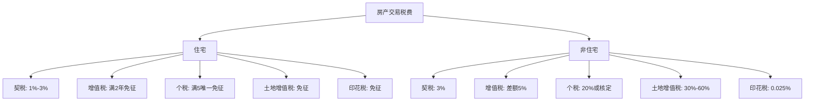
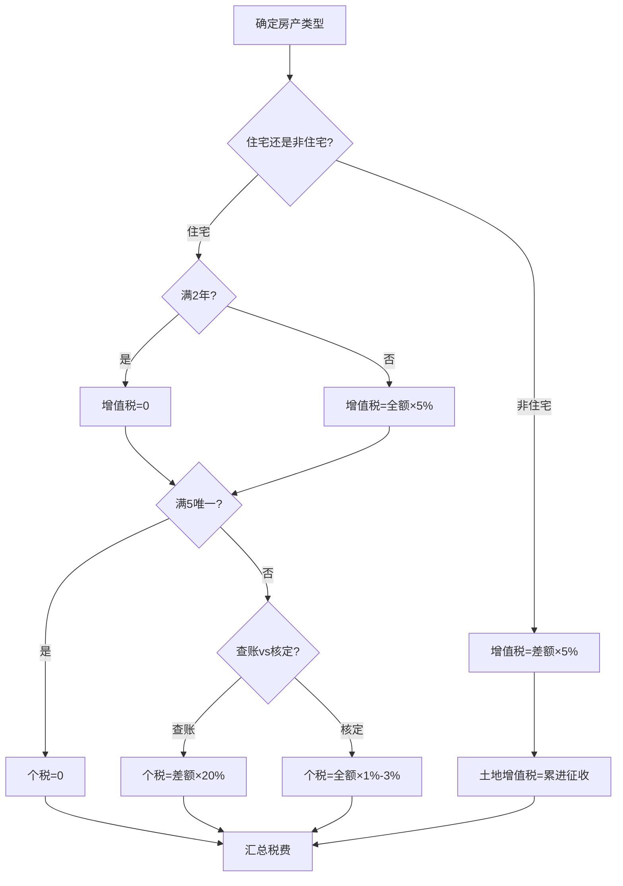
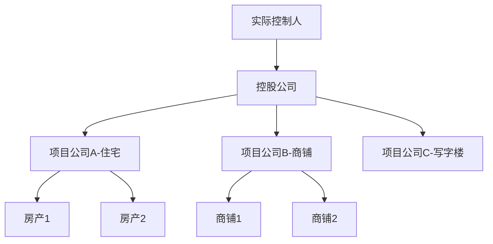

## 九、房产投资的税务筹划

房产投资是资金密集型活动，税费成本在整个投资回报中占据举足轻重的地位。一套总价300万元的住宅，从购入到出售，涉及的税费总额可能高达数十万元。如果缺乏系统的税务筹划意识，投资者可能在不知不觉中损失10%-20%的预期收益。本章将从税种体系、交易环节、持有环节、筹划策略、法律风险五个维度，构建完整的房产投资税务知识框架。

**本章导读**：


### 9.1 房产投资的税种全景图

#### 9.1.1 税制设计的底层逻辑

理解房产相关税制，首先要理解政府对房产征税的政策目标。房产税收体系的设计遵循三个核心逻辑：

1. **调节财富分配**：房产是中国家庭最大的财富载体，通过交易环节和持有环节的税收，调节因房产增值带来的财富差距
2. **抑制投机需求**：差别化的税率设计（如持有时间越长税率越低、唯一住房免税）引导住房回归居住属性
3. **增加地方财政收入**：土地增值税、契税、房产税等属于地方税种，是地方政府的重要财政来源

这三个逻辑决定了税制的核心特征：**交易环节重税、持有环节轻税、长期自住最优待**。投资者必须顺应这个逻辑进行筹划，而非对抗它。

#### 9.1.2 涉及的主要税种总览

房产投资贯穿"取得→持有→转让"三个阶段，每个阶段对应不同的税种：

| 阶段 | 税种 | 纳税人 | 计税依据 | 税率范围 |
|------|------|--------|----------|----------|
| **取得环节** | 契税 | 买方 | 成交价/评估价 | 1%-3% |
| **取得环节** | 印花税 | 买卖双方 | 合同金额 | 0.025%（个人住房免征） |
| **持有环节** | 房产税 | 产权所有人 | 房产余值/租金收入 | 1.2%或12% |
| **持有环节** | 城镇土地使用税 | 土地使用者 | 实际占用面积 | 按地区差异定额 |
| **转让环节** | 增值税及附加 | 卖方 | 增值额 | 5%（附加约0.6%） |
| **转让环节** | 个人所得税 | 卖方 | 转让所得/核定 | 20%或1%-3% |
| **转让环节** | 土地增值税 | 卖方（企业） | 增值额 | 30%-60%累进 |
| **转让环节** | 印花税 | 买卖双方 | 合同金额 | 0.025%（个人住房免征） |

> **关键认知**：个人住房与非住宅（商铺、写字楼、公寓）的税务处理存在显著差异。非住宅的税费负担通常远高于住宅，这是很多初入商铺投资的买家容易忽略的重大风险。

#### 9.1.3 住宅与非住宅的税务差异对比



以一套购入价200万、卖出价300万的房产为例，住宅与非住宅的卖方税费差异如下：

| 税种 | 住宅（满5唯一） | 住宅（不满2年） | 非住宅（商铺） |
|------|-----------------|-----------------|----------------|
| 增值税及附加 | 0 | 约16.5万 | 约4.7万（差额） |
| 个人所得税 | 0 | 约2万（核定） | 约20万（差额20%） |
| 土地增值税 | 0 | 0 | 约13.5万 |
| 印花税 | 0 | 0 | 约500元 |
| **合计** | **0** | **约18.5万** | **约38.2万** |

上表清晰地展示了三个重要事实：

1. **住宅满五唯一的税费优势极其显著**（接近零税负）。这是中国税制对自住需求的政策倾斜，投资者应充分利用
2. **不满两年的住宅税费也不低**，持有时间是核心变量。短期炒房的税费成本可能吞噬大部分增值收益
3. **非住宅的税费可能是住宅的数十倍**，严重侵蚀投资收益。购买商铺前必须将税费纳入回报率测算

### 9.2 购入环节的税务详解

#### 9.2.1 契税——最大头的购入税费

契税是购房时必须缴纳的税种，无法逃避，但可以通过合理的合同价和首套房认定来优化。

**现行税率标准（住宅）**：

根据2024年11月发布的《关于促进房地产市场平稳健康发展有关税收政策的公告》，自2024年12月1日起执行新标准：

| 情形 | 面积≤140㎡ | 面积>140㎡ |
|------|-----------|------------|
| 首套房 | 1% | 1.5% |
| 二套房 | 1% | 2% |
| 三套及以上 | 3% | 3% |

> **政策变化要点**：2024年12月新政将享受1%低税率的面积标准从90㎡提高到140㎡，同时将首套和二套140㎡以下的税率统一为1%。这一变化显著降低了改善型需求的购房成本。以400万、120㎡的二套房为例，契税从旧政的8万（2%）降至4万（1%），节省4万元。

**非住宅契税**：商铺、写字楼、公寓（40年/50年产权）契税统一为3%，无任何优惠。

**契税筹划要点**：

1. **首套房认定策略**：首套房的契税优惠力度大。已婚人士以家庭为单位认定，如果配偶名下无房，用配偶名义购买可享受首套优惠。需要注意"认房"和"认贷"的区别：
   - **认房**：在不动产登记系统中查询家庭名下的住房数量
   - **认贷**：在央行征信系统中查询家庭的住房贷款记录
   - 部分城市执行"认房不认贷"（2023年9月起多数城市已实施），即只要当前名下无房，即使有过贷款记录也可算首套
   - 少数城市仍执行"认房又认贷"，需提前了解当地政策

2. **合同价与评估价取高原则**：契税以合同价和评估价中较高者为计税基础。如果合同价明显低于市场价，税务机关会按评估价征收。因此不要为了少缴契税而故意做低合同价——既无法达到目的，还可能引发税务稽查。

3. **面积临界点的考量**：140㎡是重要的面积临界点。以500万房价为例，首套房140㎡以下契税5万（1%），140㎡以上契税7.5万（1.5%），差距2.5万。如果有多个户型可选，面积接近临界点时需要综合考量。

4. **期房契税缴纳时机**：契税的缴纳时间影响"满2年"和"满5年"的认定起点（以契税完税证明或房产证孰先原则）。尽早缴纳契税可以更早享受增值税免征和个税免征的优惠。

#### 9.2.2 维修基金与相关费用

虽然严格意义上不属于"税"，但维修基金是购房时的强制性支出，金额不低：

- **商品住宅**：购房款的2%-3%（各地标准不同）
- **计算示例**：300万房产 × 2.5% = 7.5万元
- **缴纳时间**：交房前一次性缴纳
- **管理方式**：由当地住建部门监管，业主委员会成立后移交

这笔费用在购入时一次性缴纳，后续不可退还（房屋灭失除外），应纳入投资成本计算。在计算投资回报率时，维修基金应计入总投入成本。

#### 9.2.3 其他购入费用

| 费用项目 | 金额/比例 | 备注 |
|----------|-----------|------|
| 权属登记费 | 80-100元/套 | 住宅标准 |
| 抵押登记费 | 80元/套 | 贷款购房时 |
| 中介费 | 1%-3% | 可协商，买卖双方各付或单方承担 |
| 评估费 | 0.1%-0.5% | 贷款时银行要求评估 |
| 律师见证费 | 500-2000元 | 部分城市/银行要求 |
| 公证费 | 0.1%-0.3% | 赠与、继承等情形需要 |

> **成本汇总建议**：购入一套300万的住宅，除房价外的额外成本约为：契税3-9万 + 维修基金6-9万 + 中介费3-9万 + 评估费0.3-1.5万 + 其他杂费约0.5万 = 总计12.8-29万，占房价的4.3%-9.7%。这个比例在投资回报率测算中不能忽略。

### 9.3 持有环节的税务与成本

#### 9.3.1 出租收入的税务处理

持有房产用于出租时，租金收入需要缴纳以下税费：

**个人出租住房的综合税率**：

| 税种 | 税率 | 说明 |
|------|------|------|
| 增值税 | 1.5% | 月租金≤15万免征（2023-2027年优惠） |
| 房产税 | 4% | 个人出租住房优惠税率 |
| 个人所得税 | 10% | 减按10%征收（住房） |
| 城镇土地使用税 | 免征 | 个人出租住房免征 |
| 印花税 | 免征 | 个人出租住房免征 |

**实际税负计算示例**：月租金8000元的住房出租

```text
增值税：月租金<15万，免征
城建税及附加：免征（随增值税免征）
房产税：8000 × 4% = 320元
个税：(8000 - 320 - 800) × (1-20%) × 10% = 550.4元
  其中800元为修缮费用扣除（每月上限800元）
合计月税费：约870元
实际综合税率：约10.9%
```

**个税计算详解**：

个人出租住房的个税计算公式为：

```text
应纳税所得额 = 租金收入 - 税费 - 修缮费用 - 法定减除费用
应纳税额 = 应纳税所得额 × 10%

其中：
- 税费：出租环节缴纳的增值税、城建税及附加、房产税
- 修缮费用：每月最高扣除800元，需有发票
- 法定减除费用：月租金≤4000元扣800元，>4000元扣20%
```

**合规提醒**：根据《个人所得税法》，取得租金收入应当依法纳税。实际操作中，当需要开具租赁发票（如租客需要报销）时，必须向税务局申报纳税。部分城市税务局支持线上代开发票，流程已大幅简化。

#### 9.3.2 个人出租非住房（商铺/写字楼）

非住房出租的税负显著高于住房：

| 税种 | 税率 | 与住房的差异 |
|------|------|-------------|
| 增值税 | 5% | 住房1.5%且有免征额度 |
| 房产税 | 12% | 住房4% |
| 个人所得税 | 20% | 住房10% |
| 城镇土地使用税 | 按面积计征 | 住房免征 |
| 印花税 | 0.1% | 住房免征 |

月租金2万元的商铺，综合税负约为租金的25%-30%，即每月5000-6000元的税费。这是很多商铺投资者在计算回报率时经常遗漏的成本项。

**非住房出租个税计算示例**（月租金2万）：

```text
增值税：20000 / (1+5%) × 5% = 952元
城建税及附加：952 × 12% = 114元（市区）
房产税：20000 × 12% = 2400元
印花税：20000 × 0.1% = 20元
个税：(20000 - 952 - 114 - 2400 - 20) × (1-20%) × 20% = 2642元
合计月税费：约6128元
实际综合税率：约30.6%
```

> **投资决策启示**：商铺表面租金回报率可能看起来不错（如5%-6%），但扣除25%-30%的税费后，实际税后回报率可能只有3.5%-4.5%。再加上商铺的空置风险、维护成本、贷款利息，实际收益可能不如预期。投资者在做商铺投资决策时，必须用税后回报率而非税前回报率进行评估。

#### 9.3.3 房产税——未来的核心变量

目前个人自住住宅免征房产税，但这是政策性免税，未来有调整的可能。

**现行房产税制度要点**：

- **企业持有房产**：按房产原值扣除10%-30%后的余值，年税率1.2%
- **出租房产**：按租金收入的12%征收（个人住房4%）
- **上海试点**（2011年起）：对本市居民家庭新购第二套及以上住房征收，税率0.4%-0.6%，人均60㎡免税
- **重庆试点**（2011年起）：对独栋商品住宅、新购高档住房和"三无人员"新购住房征收，税率0.5%-1.2%

**上海试点的核心规则**：

| 条件 | 规则 |
|------|------|
| 征收对象 | 本市居民家庭新购第二套及以上住房，非本市居民新购住房 |
| 计税价格 | 交易价格的70% |
| 税率 | 交易价格≤上年新建商品住房均价2倍：0.4%；超过：0.6% |
| 免税面积 | 人均60㎡（按家庭人口计算） |
| 应纳税额 | (应税面积 - 免税面积) × 单价 × 70% × 税率 |

**房产税改革趋势分析**：

如果全面开征房产税，对房产投资的影响将是深远的：

1. **持有成本大幅增加**：以评估价500万、税率0.6%计算，年房产税约3万元，相当于每月2500元的额外支出
2. **多套房持有者的年化收益可能被压缩3%-5%**：持有3套以上房产的投资者受冲击最大
3. **可能促使部分投资性房产流入市场**：增加供给，对房价形成下行压力
4. **从"交易环节重税"向"持有环节重税"的转变**：长期来看，这有利于降低交易成本、提高房屋使用效率
5. **租金可能上升**：房东可能将房产税转嫁给租客，推高租金水平

**应对策略**：

1. 关注政策动向，预留足够的持有成本缓冲（建议预留房产评估价的0.5%-1%作为年度房产税预算）
2. 优先持有核心城市核心地段的房产（抗跌性强，租金覆盖能力强）
3. 减少持有低租金回报率的房产（租金回报率低于2%的房产在房产税开征后可能变为负现金流）
4. 合理配置自住与投资的比例（自住面积在免税范围内不受影响）
5. 考虑分散持有城市（不同城市的房产税政策可能不同）

### 9.4 转让环节的税务深度解析

#### 9.4.1 增值税——持有时间决定税负

**个人转让住房的增值税规则**：

| 情形 | 税率/免税 | 关键条件 |
|------|----------|----------|
| 一线城市（北上广深）满2年 | 免征 | 不再区分普通/非普通住宅 |
| 一线城市不满2年 | 全额5% | — |
| 其他城市满2年 | 免征 | 不区分普通/非普通 |
| 其他城市不满2年 | 全额5% | — |

> **重大政策变化**：2024年11月，财政部明确北上广深取消普通住宅和非住宅标准后，个人将购买2年以上（含2年）的住房对外销售的，免征增值税。此前北上广深的"非普通住宅"满2年仍需按差额缴纳5%增值税的规定已被废止。这意味着一线城市大户型住房的交易成本大幅降低。

**"满2年"的认定**：

- 以契税完税证明或房产证上的时间孰先原则
- 即契税完税证明时间早于房产证的，以契税时间为准
- 这意味着交房后尽早缴纳契税，可以更早达到"满2年"条件

**增值税附加税费**：

| 附加税种 | 计税基础 | 税率 |
|----------|----------|------|
| 城市维护建设税 | 增值税额 | 7%（市区）/5%（县城）/1%（其他） |
| 教育费附加 | 增值税额 | 3% |
| 地方教育附加 | 增值税额 | 2% |

附加税费合计约为增值税额的12%（市区），实际增值税及附加综合税率约为5.6%。

**增值税计算示例**（不满2年、合同价300万）：

```text
增值税 = 300 / (1+5%) × 5% = 14.29万
城建税 = 14.29 × 7% = 1.00万（市区）
教育费附加 = 14.29 × 3% = 0.43万
地方教育附加 = 14.29 × 2% = 0.29万
增值税及附加合计 = 14.29 + 1.00 + 0.43 + 0.29 = 16.01万
```

> **注意**：不满2年的住房，增值税按全额征收（非差额）。这意味着即使房产没有增值甚至亏损，仍需缴纳增值税。因此不满2年的房产交易税费极为沉重，投资者应尽量避免短期交易。

#### 9.4.2 个人所得税——最复杂的税种

个人转让住房的个税有两种计算方式，纳税人可以选择：

**方式一：查账征收（差额20%）**

```text
应纳税额 = （转让收入 - 房产原值 - 合理费用）× 20%

其中：
- 转让收入：合同价或评估价取高
- 房产原值：购房发票金额或契税完税证明上的金额
- 合理费用包括：
  (1) 本次转让缴纳的增值税及附加
  (2) 装修费用（需正规发票，上限通常为原值的10%-15%）
  (3) 贷款利息（需银行出具的利息支付证明）
  (4) 中介费、评估费等转让费用（需发票）
```

**方式二：核定征收（总额1%-3%）**

```text
应纳税额 = 转让收入 × 核定征收率

核定征收率各地不同：
- 住宅：通常1%-2%
- 非住宅：通常2%-3%
```

**如何选择计算方式？**

判断标准：当增值幅度大时，核定征收更划算；当增值幅度小或有大量可扣除费用时，查账征收更划算。

计算临界点（以核定率1%、无合理费用为例）：

```text
差额20% = 核定1%时的临界增值率：
(收入 - 原值) × 20% = 收入 × 1%
原值/收入 = 1 - 1%/20% = 95%

即：如果原值达到转让价的95%以上（增值率<5%），查账征收更优
增值率>5%时，核定征收更优
```

**有合理费用时的临界点计算**（以核定率1%、合理费用占收入5%为例）：

```text
(收入 - 原值 - 合理费用) × 20% = 收入 × 1%
(收入 - 原值 - 5%×收入) × 20% = 1%×收入
原值/收入 = 1 - 1%/20% - 5% = 90%

即：原值达到转让价的90%以上时，查账征收更优
```

**重要提醒**：

- 如果无法提供房产原值凭证，税务机关通常按核定征收
- 装修费用可以作为合理费用扣除，但必须有正规发票（增值税普通发票或增值税专用发票）
- 贷款利息可以扣除，但需要银行出具的利息清单（不是还款流水，而是专门的利息证明）
- 转让过程中的中介费、评估费等也可以作为合理费用

#### 9.4.3 土地增值税——个人住房免征，商铺必须缴纳

土地增值税是对转让房地产所取得的增值额征收的税种，采用四级超率累进税率：

| 增值率（增值额÷扣除项目金额） | 税率 | 速算扣除系数 |
|-------------------------------|------|-------------|
| 不超过50% | 30% | 0 |
| 50%-100% | 40% | 5% |
| 100%-200% | 50% | 15% |
| 超过200% | 60% | 25% |

**关键点**：个人转让住房暂免征收土地增值税，但转让商铺、写字楼、车位等非住宅物业时必须缴纳。

**扣除项目金额的构成**：

```text
扣除项目 = 房产原值 + 转让环节税费 + 装修费用 + 加计扣除

加计扣除（旧房）：
= 房产原值 × 5% × 持有年数
（评估价格中已含的年份不重复计算）
```

**计算示例**：商铺购入200万，卖出350万，持有5年，转让税费15万，装修费10万

```text
加计扣除 = 200 × 5% × 5 = 50万
扣除项目 = 200 + 15 + 10 + 50 = 275万
增值额 = 350 - 275 = 75万
增值率 = 75 / 275 = 27.3%（不超过50%）
土地增值税 = 75 × 30% = 22.5万
```

这个税种是商铺投资的"隐形杀手"，很多投资者在购买商铺时只考虑了增值税和个税，忽略了土地增值税可能高达增值额的30%-60%。

#### 9.4.4 转让环节的综合税费测算模型

为方便投资者快速评估转让成本，提供以下综合测算模型：



### 9.5 税务筹划的核心策略

#### 9.5.1 持有时间策略——"满五唯一"的黄金组合

"满五唯一"是个人住房税务筹划的核心概念：

- **满五**：持有时间满5年（以契税或房产证孰先计算）
- **唯一**：家庭（夫妻及未成年子女）在省内唯一的住房

满足"满五唯一"条件时：

- 免征个人所得税
- 免征增值税（满2年即可免，满五必然满足）
- 免征土地增值税（个人住房本身免征）

**策略推演**：以购入价200万、卖出价350万为例

| 持有状态 | 增值税及附加 | 个税 | 合计税费 | 税费占增值比例 |
|----------|-------------|------|----------|---------------|
| 不满2年 | 约19.6万 | 约1.5万 | 约21.1万 | 14.1% |
| 满2不满5，非唯一 | 0 | 约1.5万 | 约1.5万 | 1.0% |
| 满5唯一 | 0 | 0 | 0 | 0% |
| 满5非唯一 | 0 | 约1.5万 | 约1.5万 | 1.0% |

> **实务建议**：如果投资性住房即将满5年，且家庭有唯一住房的置换需求，可以先完成置换（将唯一住房卖出），再出售投资性住房，实现"满五唯一"。但注意要在同一年度内完成，且需要考虑限购政策对购房资格的影响。操作流程如下：
>
> 1. 先卖出投资性住房（此时名下仅唯一住房，享受满五唯一免税）
> 2. 再购入新的住房
>
> **注意**：步骤顺序至关重要。如果先买后卖，投资性住房就不再是"唯一"住房。

#### 9.5.2 交易价格的合理确定

在合法范围内，交易价格的确定需要兼顾以下因素：

1. **税务机关的核定价机制**：税务机关建立了存量房交易价格评估系统（通常基于大数据和GIS系统），如果申报价格明显低于评估价（通常低于评估价的70%-85%），会按评估价征税。

2. **合同价不宜过低**：除了触发核定价机制的风险外，过低的合同价还会影响买方的贷款额度（贷款以合同价和评估价孰低为基准），间接影响成交。

3. **装修款与房款的分离**：在二手房交易中，部分买卖双方会将装修款从房价中分离。理论上装修费用可以在个税计算时扣除，但实际操作中需要有正规发票支持，且税务机关对此做法的态度因地而异。

4. **阴阳合同的风险**：在"金税四期"和不动产登记联网的大背景下，阴阳合同的税务风险急剧增加。一旦被查实，不仅要补缴税款、滞纳金，还面临罚款（0.5-5倍），情节严重的可能构成逃税罪。

#### 9.5.3 个人名义vs公司名义购房

以公司名义购买房产是高净值人群常用的税务筹划手段，但利弊需要仔细权衡：

**对比分析**：

| 维度 | 个人名义 | 公司名义 |
|------|----------|----------|
| **购入契税** | 1%-3% | 3% |
| **持有房产税** | 自住免征 | 按余值1.2%/年 |
| **出租税负** | 综合约10%-15% | 综合约25%-35% |
| **转让增值税** | 满2年免征（住宅） | 差额5%或全额5% |
| **转让个税/企税** | 20%或核定1% | 企业所得税25% |
| **土地增值税** | 个人住房免征 | 30%-60%累进 |
| **限购政策** | 受限购约束 | 部分城市不受限 |
| **贷款条件** | 利率低、成数高 | 利率高、成数低 |
| **未来遗产传承** | 继承或赠与 | 股权转让 |

**公司名义购房适合的场景**：

1. 个人限购名额已满，但确实需要持有更多房产
2. 持有目的为长期出租，不计划短期出售
3. 可以通过公司架构实现税务优化（如将房产注入享受税收优惠的子公司）
4. 有将房产用于经营的计划（如民宿、办公场所）

**公司名义购房的风险**：

1. 公司注销时，房产视为清算分配，需要缴纳全部税种
2. 每年的房产税增加持有成本
3. 股权转让可能被税务机关视为房产转让，追缴土地增值税
4. 公司经营异常可能影响房产安全

#### 9.5.4 装修费用的合理利用

装修费用是合法的税务筹划工具，但经常被忽视：

**个税抵扣**：

- 转让住房时，装修费用可以作为"合理费用"从转让收入中扣除
- **限制条件**：必须有正规发票，且扣除上限通常为房产原值的10%-20%（各地标准不同）
- **策略**：出售前进行适度装修并保留发票，可以降低个税基数

**计算示例**：

```text
房产原值：200万
转让价格：350万
装修费用：30万（有发票）
合理费用合计：35万

查账征收个税 = (350 - 200 - 35) × 20% = 23万
无装修费用时个税 = (350 - 200) × 20% = 30万
节税效果：7万元
```

> **发票管理要点**：
> - 装修合同要与发票内容一致
> - 发票抬头应为房产所有人姓名
> - 装修项目应具体明确（如"室内装修工程款"而非"材料费"）
> - 保留装修合同、付款凭证、施工照片等辅助材料

#### 9.5.5 贷款利息的税务抵扣

在查账征收个税时，转让住房的贷款利息可以作为合理费用扣除：

- 需要银行出具的利息支付证明（非还款流水）
- 只能扣除持有期间实际支付的利息，不能扣除本金
- 提前还款后，已支付的利息仍然可以扣除

**计算示例**：贷款200万、利率4.9%、等额本息30年

- 前5年累计支付利息约46万
- 如果查账征收，这46万利息可以作为费用扣除
- 节税效果：46万 × 20% = 9.2万元

> **重要提醒**：利息扣除需要完整的银行流水和利息清单。建议投资者从贷款之日起就做好利息凭证的归档工作。每年年初可以向贷款银行申请出具上一年度的利息支付证明。

#### 9.5.6 投资策略的税务优化

不同的房产投资策略有不同的税务影响，投资者应在策略设计阶段就纳入税务考量：

**策略一：长持出租**

```text
适用对象：核心城市、租金回报率>2.5%的住宅
税务优势：
- 满2年后转让免增值税
- 满5唯一免个税
- 住宅免土地增值税
- 出租综合税率约10%
关键动作：尽早缴纳契税启动持有时间计数
```

**策略二：买入翻新增值（Fix & Flip）**

```text
适用对象：老旧小区、法拍房等低价物业
税务风险：
- 短期持有（<2年）增值税全额5.6%
- 个税差额20%（或核定1%-3%）
- 翻新成本需要正规发票才能抵扣
优化建议：
(1) 装修必须取得正规发票
(2) 尽量持有至满2年再出售
(3) 如果增值幅度大，核定征收可能更优
(4) 翻新成本发票金额应与实际支出匹配
```

**策略三：以租养贷长期持有**

```text
适用对象：贷款购买的住宅，月供<月租金×1.1
税务优化：
- 每年租金收入缴税约10%
- 房贷利息在转让时可作为费用扣除
- 持有至满5唯一，转让时零税负
关键数据：假设月租金5000、月供4500
  年租金税费约5500元
  年净租金收益约54500元
  5年利息总额约25万（转让时可抵扣）
```

**策略四：以公司名义持有出租**

```text
适用对象：持有3套以上出租物业的投资者
税务特点：
- 年房产税 = 房产余值 × 1.2%
- 出租综合税率约25%-35%
- 但可以抵扣管理费、维修费、折旧等成本
- 企业所得税25%（小微优惠后可能更低）
优化路径：
- 通过合理的费用列支降低应纳税所得额
- 利用固定资产折旧（20年直线法）降低账面利润
- 选择合适的注册地享受税收优惠
```

### 9.6 特殊交易场景的税务处理

#### 9.6.1 继承房产的税务

**继承环节**：

- 法定继承人继承房产：免征契税、免征个人所得税
- 非法定继承人（遗赠）：需缴纳3%契税
- 继承环节不涉及增值税、土地增值税
- 继承公证费：按房产评估价的1%-2%收取

**继承后再出售**：

- **原值认定**：以被继承人购入时的价格为原值（需有原始购房凭证）
- **持有时间**：可以追溯被继承人的持有时间。如果被继承人持有满5年，继承人继承后出售可以继续享受"满5年"的认定
- **唯一住房认定**：以继承人家庭名下的住房情况为准

**筹划意义**：继承是房产代际传递中税负最低的方式。如果父母的房产计划传给子女，继承优于赠与和买卖。

#### 9.6.2 赠与房产的税务

**赠与环节**：

- 直系亲属赠与：免征增值税、个税，但受赠人需缴纳3%契税
- 非直系亲属赠与：需缴纳增值税、个税、契税

**赠与后再出售**：

- **原值认定**：以赠与时的评估价为原值（非购入价）
- **持有时间**：不能追溯赠与人的持有时间，从赠与登记之日起计算
- **个税风险**：如果受赠后短期内出售，可能产生较高的个税

**对比分析**（以一套购入价100万、现评估价300万的房产为例）：

| 方式 | 过户环节税费 | 再出售原值认定 | 再出售持有时间 | 综合建议 |
|------|-------------|---------------|---------------|----------|
| 继承 | 约0（法定继承） | 100万（原始价） | 可追溯 | 最优（不急于出售时） |
| 赠与（直系） | 约9万（3%契税） | 300万（评估价） | 不可追溯 | 赠与后不卖则划算 |
| 买卖（直系） | 约3-9万（契税） | 300万（合同价） | 重新计算 | 赠与后计划出售时较优 |

> **关键决策树**：
>
> - 如果房产计划留给子女且不急于出售 → **继承**（零过户成本，可追溯时间）
> - 如果需要现在就过户且子女短期内不卖 → **赠与**（免增值税和个税，3%契税可接受）
> - 如果需要过户且子女可能短期内出售 → **买卖**（新原值认定为当前价格，出售时税负更低）

#### 9.6.3 夫妻间房产变更

**婚内变更**：

- 夫妻间房产加名、减名、变更份额：免征契税、增值税、个税
- 仅需缴纳工本费（约80元）
- 不改变房产的原值和持有时间认定

**离婚析产**：

- 因离婚办理房屋产权变更：免征契税、增值税、个税
- 不改变原值和持有时间认定
- 需要提供离婚协议或法院判决书

**筹划应用**：如果一方名下的房产即将出售，可以通过婚内变更将房产转至另一方名下（如果另一方名下无房），从而使该房产成为"满五唯一"的住房。但需要注意：

1. 变更后需要等待一定时间（部分城市要求6个月以上）
2. 唯一住房的认定以变更后的时点为准
3. 需要确保变更操作有合理的商业目的

#### 9.6.4 法拍房的税务特殊性

法拍房（法院拍卖房产）的税务处理有其特殊性：

1. **税费转嫁惯例**：很多法拍房公告中注明"所有税费由买方承担"，这意味着买方需要承担本应由卖方缴纳的增值税、个税、土地增值税等
2. **原值难以核实**：法拍房的前手购入价可能无法获取，导致卖方税费按全额核定征收
3. **产权性质复杂**：可能存在划拨土地、历史遗留问题等，影响税费计算
4. **限购约束**：大部分城市法拍房已纳入限购范围

**税费预估清单**（买方视角）：

| 税费项目 | 买方自付 | 如卖方税费转嫁 |
|----------|----------|---------------|
| 契税 | 1%-3% | 1%-3% |
| 增值税及附加 | — | 卖方部分转嫁约5.6% |
| 个税 | — | 卖方部分转嫁1%-20% |
| 土地增值税 | — | 非住宅可能30%-60% |
| 拍卖佣金 | 1%-5% | 1%-5% |

> **实操建议**：在参与法拍前，必须提前计算全部税费成本。尤其是税费转嫁条款，可能使总成本比预期高出20%-30%。建议在起拍价的基础上加上预估税费后再判断是否值得竞拍。具体操作步骤：
>
> 1. 仔细阅读拍卖公告中的税费条款
> 2. 到不动产登记中心查询房产的原始登记信息
> 3. 向税务局咨询该房产的预估税费
> 4. 计算总成本 = 起拍价 + 预估税费 + 拍卖佣金 + 其他费用
> 5. 对比同区域同类型房产的市场价，评估是否有足够的安全边际

#### 9.6.5 房产互换的税务处理

房产互换是两个产权人之间直接交换房产所有权的行为，税务处理如下：

- **契税**：按差价部分缴纳（如无差价则免征）
- **增值税**：视为两次转让，分别计算
- **个税**：视为两次转让，分别计算
- **土地增值税**：非住宅需分别计算

**适用场景**：亲属间的房产调整、满足限购政策下的换房需求等。由于涉及两次交易的税费，实际操作中较少使用。

### 9.7 企业持有房产的税务架构

#### 9.7.1 常见的企业持有架构

高净值投资者常通过企业架构持有大量房产，常见的架构包括：



**架构设计要点**：

1. 每个项目公司持有少量资产，降低单点风险
2. 可以通过股权转让替代房产转让，规避土地增值税
3. 利用不同地区/行业的税收优惠政策
4. 为未来资本运作（如REITs上市）预留空间

#### 9.7.2 股权转让vs资产转让

以公司名义持有的房产，转让时可以选择股权转让或资产转让：

| 维度 | 股权转让 | 资产转让 |
|------|----------|----------|
| 增值税 | 不涉及 | 需缴纳 |
| 土地增值税 | 理论上不涉及 | 需缴纳 |
| 契税 | 不涉及 | 买方缴纳 |
| 印花税 | 0.05% | 0.025% |
| 企业所得税 | 需缴纳（转让所得） | 需缴纳 |
| 实际操作 | 税务机关可能穿透认定 | 规范流程 |

> **风险提示**：近年来税务机关对"以股权转让之名行房产转让之实"的穿透监管日趋严格。2021年国家税务总局明确，如果股权转让的主要资产为不动产，可能被重新认定为房产转让，补缴土地增值税。因此不能简单地将股权转让作为避税工具。
>
> **安全操作建议**：
> - 确保项目公司有真实的经营活动（如物业管理、租赁经营）
> - 股权转让价格应合理反映公司整体价值（包括负债、商誉等）
> - 避免在房产交易前后短期内进行股权转让
> - 保留完整的商业决策文档，证明交易的商业合理性

#### 9.7.3 公司持有房产的日常税负优化

1. **合理确定房产原值**：包括购房价款、契税、装修费用、贷款利息资本化等，原值越高，每年可扣除的折旧越多
2. **固定资产折旧**：房屋建筑物按20年直线法折旧，年折旧率5%，每年可以税前扣除
3. **维修费用资本化vs费用化**：小修费用可以直接税前扣除，大修（延长使用寿命）需要资本化
4. **租金收入的合理定价**：关联方之间的租赁定价需符合独立交易原则，否则可能被税务机关调整

#### 9.7.4 房地产投资信托基金（REITs）

REITs是一种通过证券化方式投资房地产的金融工具，具有独特的税务优势：

- **分红免税**：符合条件的REITs，向投资者分配的收益免征企业所得税
- **透明纳税**：REITs层面的租金收入和资本利得直接穿透到投资者纳税
- **流动性优势**：相比直接持有房产，REITs的流动性更好

**中国公募REITs现状**：2021年6月首批公募REITs上市，目前主要投资于基础设施（产业园区、仓储物流、高速公路等），尚未扩展到住宅和商业地产领域。但这是未来的发展方向，值得投资者关注。

### 9.8 税务筹划的风险边界

#### 9.8.1 合法筹划vs违法避税的界限

税务筹划的核心原则是**合法性**。以下行为属于合法筹划：

- 利用"满五唯一"免税政策
- 合理选择查账征收或核定征收
- 保留装修发票、贷款利息凭证
- 通过直系亲属赠与/继承优化过户成本
- 选择适当的持有主体（个人vs企业）

以下行为属于违法避税，后果严重：

- 阴阳合同、做低交易价格
- 虚构装修费用
- 虚假赠与（实质为买卖）
- 利用空壳公司转移利润
- 虚构债务关系抵扣收入

**法律后果对照**：

| 行为 | 行政处罚 | 刑事风险 |
|------|----------|----------|
| 少缴税款 | 补税 + 滞纳金（日万分之五）+ 罚款（0.5-5倍） | 无（首次且补缴） |
| 偷税（故意） | 同上 | 逃税罪（3-7年） |
| 虚开发票 | 罚款 + 吊销执照 | 虚开发票罪（2-无期） |
| 骗取退税 | 补税 + 罚款（1-5倍） | 骗取出口退税罪 |

#### 9.8.2 金税系统下的税务风险

金税四期（2024年起全面推行）的核心特征：

1. **多部门数据联网**：不动产登记、银行、税务、社保数据互通
2. **大数据分析**：异常交易模式自动预警
3. **个人所得税全员全额申报**：大额资金流向可追踪
4. **不动产登记全国联网**：名下房产一览无余

**实际影响**：

- 阴阳合同更容易被识别
- 大额现金交易的监控更严格
- 个人名下多套房产的持有成本可能增加
- "以房抵债""虚假赠与"等操作的稽查概率大幅上升

**合规建议**：

1. 所有交易保留完整的书面合同和资金流水
2. 装修、维修等费用取得正规发票
3. 大额交易使用银行转账，避免现金
4. 定期检查个人征信和纳税记录
5. 对不确定的税务处理，提前咨询税务机关或专业税务师

#### 9.8.3 常见的税务筹划误区

**误区一：所有房产都做低合同价**

事实：税务机关有核定价系统，做低合同价不仅不能节税，还会触发稽查风险和影响贷款额度。在金税四期下，做低合同价的行为几乎必然被发现。

**误区二：公司买房一定比个人划算**

事实：公司持有成本（房产税、企业所得税）和转让成本（土地增值税）都很高，只在特定场景下才有优势。具体对比如下：

| 持有年限 | 个人总税负 | 公司总税负 | 谁更优 |
|----------|-----------|-----------|--------|
| 2年内出售 | 高（增值税+个税） | 更高（增值税+土增税+企税） | 个人 |
| 5年后出售（唯一） | 极低（零税负） | 持续高（房产税+企税） | 个人 |
| 长期出租（10年+） | 中等 | 可通过折旧降低 | 视情况 |

**误区三：赠与一定比买卖省钱**

事实：赠与虽免个税和增值税，但3%的契税不可忽略，且再出售时原值认定可能不利。需综合计算整个生命周期的税负。

**误区四：离婚买房是完美的税务筹划**

事实："假离婚"存在极大的法律风险——离婚后一方拒绝复婚、财产分割纠纷等。且多地已出台政策限制离婚后的购房资格（如离婚后3年内按原家庭套数计算）。

**误区五：房产税离我们很远**

事实：虽然全面开征时间不确定，但政策方向是明确的。投资者应将潜在的房产税纳入长期收益测算。

### 9.9 实操案例与计算模板

#### 9.9.1 案例一：刚需换房的税务优化

**背景**：

- 张先生2018年购入A房产（首套），购入价150万，面积80㎡
- 2024年A房产市场价280万
- 张先生计划购入B房产（350万，120㎡），需要卖出A房产
- 张先生名下仅此一套住房

**方案对比**：

| 方案 | 操作顺序 | A房产个税 | A房产增值税 | 合计税费 |
|------|---------|----------|------------|----------|
| 方案一 | 先卖A再买B | 0（满5唯一） | 0（满2年） | 0 |
| 方案二 | 先买B再卖A | 约1.3万（非唯一） | 0（满2年） | 约1.3万 |

**分析**：方案一最优。先买入B后，A成为非唯一住房，丧失了满五唯一的免税资格。正确的做法是先卖出A（卖出时A仍为唯一住房，享受满五唯一免税），再购入B。

**但需要考虑**：

- 先卖后买的资金衔接问题（可能需要租房过渡1-3个月）
- 当地限购政策是否允许"先卖后买"（部分城市对"卖一买一"有绿色通道）
- 如果B房产有时间约束（如新房摇号中签），需要灵活调整

**方案一的时间线规划**：

```text
月份1：挂牌出售A房产
月份2：A房产找到买家，签订合同
月份3：A房产过户完成，收到房款
月份3-4：看房、选定B房产
月份4-5：签订B房产合同，办理贷款
月份5-6：B房产过户完成，入住
过渡期：3-6个月（租房费用约1.5-3万）
```

#### 9.9.2 案例二：商铺投资的税费全测算

**背景**：

- 李女士2020年购入一间商铺，购入价300万（含税费）
- 2025年卖出价450万
- 持有期间出租5年，年租金15万

**卖出时税费计算**：

```text
1. 增值税（差额征收）：
   增值税 = (450 - 300) / (1+5%) × 5% = 7.14万
   附加税 = 7.14 × 12% = 0.86万

2. 个人所得税（查账征收）：
   原值 = 300万
   装修费（有发票）= 15万
   本次转让税费 = 7.14 + 0.86 = 8万
   个税 = (450 - 300 - 15 - 8) × 20% = 25.4万

3. 土地增值税：
   加计扣除 = 300 × 5% × 5 = 75万
   扣除项目 = 300 + 15 + 8 + 75 = 398万
   增值额 = 450 - 398 = 52万
   增值率 = 52 / 398 = 13.1%
   土地增值税 = 52 × 30% = 15.6万

4. 印花税 = 450 × 0.025% = 0.11万

合计卖方税费：约48.11万
占卖出价的比例：10.7%
占增值额的比例：32.1%
```

**持有期间租金收入的税费**：

```text
年租金：15万 = 月租金1.25万
月增值税：1.25 / (1+5%) × 5% = 0.06万
月房产税：1.25 × 12% = 0.15万
月个税：(1.25 - 0.06 - 0.15) × (1-20%) × 20% = 0.166万
月合计税费：约0.376万
年合计税费：约4.51万
5年合计税费：约22.55万
```

**投资收益总测算**：

```text
总投入：300万
总收入：卖出450万 + 租金75万 = 525万
总税费：卖出48.11万 + 租金22.55万 = 70.66万
净收益：525 - 300 - 70.66 = 154.34万
年化回报率：154.34 / 300 / 5 = 10.3%

如果没有税务筹划意识，少扣除装修费和利息费用：
个税可能多缴：(15 + 8) × 20% = 4.6万
实际年化回报率下降至：10.0%
```

**反思**：如果李女士将300万投资于住宅（满五唯一），购入价300万、卖出价450万：

```text
税费：0（满五唯一）
5年租金（假设年租金12万）：60万
租金税费：约6.5万（综合税率约10.9%）
净收益：(450 - 300) + (60 - 6.5) = 203.5万
年化回报率：203.5 / 300 / 5 = 13.6%
```

商铺的年化回报率（10.3%）低于住宅（13.6%），差距主要来自税费。这再次印证了非住宅税费对投资回报的侵蚀。

#### 9.9.3 税费速算对照表

为方便快速估算，提供以下速算表：

**住宅卖方税费速算（非满五唯一）**：

| 买入价 | 卖出价 | 增值税及附加（不满2年） | 个税（核定1%） | 合计 |
|--------|--------|------------------------|---------------|------|
| 100万 | 150万 | 约8.4万 | 1.5万 | 约9.9万 |
| 200万 | 300万 | 约16.8万 | 3万 | 约19.8万 |
| 300万 | 450万 | 约25.2万 | 4.5万 | 约29.7万 |
| 500万 | 700万 | 约39.2万 | 7万 | 约46.2万 |

> 注：上表为增值税全额征收的最不利情况。满2年后增值税免征，税费大幅降低。

**非住宅卖方税费速算**：

| 买入价 | 卖出价 | 增值税及附加 | 个税（核定3%） | 土地增值税（估算） | 合计 |
|--------|--------|-------------|---------------|-------------------|------|
| 100万 | 150万 | 约2.8万 | 4.5万 | 约7.5万 | 约14.8万 |
| 200万 | 300万 | 约5.7万 | 9万 | 约18万 | 约32.7万 |
| 300万 | 450万 | 约8.6万 | 13.5万 | 约30万 | 约52.1万 |

> 注：土地增值税为简化估算，实际按扣除项目和累进税率计算。

#### 9.9.4 案例三：继承vs赠与的全生命周期税负对比

**背景**：王先生名下有一套购入价80万、当前评估价400万的住宅，计划传给儿子。儿子目前名下无房。

**方案一：继承（王先生去世后）**

```text
过户税费：0（法定继承免契税、免个税）
公证费：约4000元
原值认定：80万（追溯原始购入价）
持有时间：可追溯王先生的持有时间

假设儿子5年后以500万卖出（满5唯一）：
个税 = 0（满五唯一）
增值税 = 0（满2年）
总税费 = 0

综合税负（从王先生购入到儿子卖出）：约4000元
```

**方案二：赠与（现在办理）**

```text
过户税费：
- 契税 = 400万 × 3% = 12万
- 免征增值税和个税（直系亲属赠与）
- 公证费约8000元
合计过户成本：约12.8万

原值认定：400万（赠与评估价）
持有时间：从赠与登记日起重新计算

假设儿子5年后以500万卖出（满5唯一）：
个税 = 0（满五唯一）
增值税 = 0（满2年）

综合税负：约12.8万
```

**方案三：买卖（现在办理）**

```text
过户税费：
- 契税 = 500万 × 1% = 5万（首套140㎡以下）
- 增值税 = 0（满2年）
- 个税 = 0（满5唯一）
合计过户成本：约5万

原值认定：500万（买卖合同价）
持有时间：从买卖登记日起重新计算

假设儿子5年后以600万卖出（满5唯一）：
个税 = 0（满五唯一）
增值税 = 0（满2年）

综合税负：约5万
```

**对比总结**：

| 方案 | 过户成本 | 出售时税负 | 综合税负 | 时间要求 |
|------|----------|-----------|----------|----------|
| 继承 | 约0.4万 | 0 | 约0.4万 | 需等待 |
| 赠与 | 约12.8万 | 取决于是否满5唯一 | 约12.8万+ | 立即可办 |
| 买卖 | 约5万 | 取决于新原值和时间 | 约5万+ | 立即可办 |

> **结论**：如果不急于过户，继承是最优选择。如果需要现在过户且短期内不卖，赠与可接受。如果需要过户且可能出售，买卖的综合税负更优（因为新原值认定更高，未来出售时差额更小）。

### 9.10 未来趋势与前瞻

#### 9.10.1 房地产税立法进程

房地产税法已被列入全国人大常委会的立法规划。虽然短期内全面开征的概率不大，但中长期来看是确定的趋势。

**可能的征收方案推测**：

- 人均免征面积：40-60㎡（参考上海试点的60㎡）
- 税率：0.2%-1.2%（参考国际经验和上海/重庆试点）
- 评估价征收：以市场评估价为计税基础，非购入价
- 阶梯税率：首套免征或低税率，多套递增

**对投资的影响测算**：

假设一套评估价500万的住宅，人均免征40㎡，家庭三口人120㎡，该住宅150㎡：

```text
应税面积 = 150 - 120 = 30㎡
应税比例 = 30 / 150 = 20%
假设税率0.6%
年房产税 = 500万 × 20% × 0.6% = 6000元

对比年租金收入（假设3%租金回报率）：
年租金 = 500万 × 3% = 15万
房产税占租金比例 = 6000 / 15万 = 4%
实际租金回报率下降至2.88%
```

如果持有面积更大、套数更多，房产税的影响将更为显著。假设持有3套房产（总面积450㎡），家庭三口人：

```text
应税面积 = 450 - 120 = 330㎡
假设平均评估价3万/㎡
总评估价 = 1350万
应税比例 = 330/450 = 73.3%
年房产税 = 1350万 × 73.3% × 0.6% ≈ 5.94万

对比年租金收入（假设总租金3万/月）：
年租金 = 36万
房产税占租金比例 = 5.94 / 36 = 16.5%
实际租金回报率从2.67%下降至2.23%
```

#### 9.10.2 数字化对税务管理的影响

1. **不动产登记联网**：全国不动产登记信息管理基础平台已建成，多套房持有者的资产信息完全透明
2. **区块链技术应用**：未来房产交易的合同、发票、完税证明可能上链，杜绝造假
3. **AI辅助税务稽查**：异常交易模式的识别效率将大幅提升，传统的避税手段将越来越难以奏效
4. **电子发票普及**：装修费用等扣除凭证的管理更加规范，同时也更便于税务机关核查

### 9.11 本章小结

房产投资的税务筹划是一个系统工程，贯穿投资的全生命周期。核心要点如下：

1. **持有时间是最大的税务杠杆**：满五唯一的免税组合价值巨大，投资决策时应将持有时间纳入核心考量
2. **提前规划优于事后补救**：从购入时就应该考虑未来的卖出税务安排
3. **合法合规是底线**：在金税四期的大数据监管下，违法避税的成本和风险远超收益
4. **动态跟踪政策变化**：房产税立法、契税调整、限购政策等都可能改变税务筹划的最优方案
5. **综合成本思维**：税费只是投资成本的一部分，需要与机会成本、流动性成本、持有成本综合考量

投资者应当建立自己的"税务档案"，保存好所有与房产相关的票据和凭证（购房合同、契税发票、装修发票、贷款利息清单、维修基金收据等），为未来的税务申报和筹划提供充分的数据支撑。

**税务档案清单**：

```text
□ 购房合同原件
□ 契税完税证明
□ 不动产权证书复印件
□ 装修合同及发票
□ 贷款合同及每年度利息清单
□ 维修基金缴纳收据
□ 中介费发票
□ 评估费发票
□ 每年度租金收入记录及纳税凭证
□ 物业费缴纳记录
```
