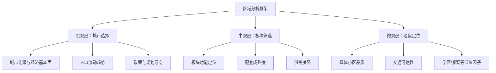
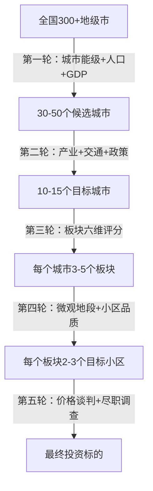

## 十、房产投资的区域分析方法

房产投资的本质是"买地段"，而地段的判断依赖系统化的区域分析。同一座城市内部，不同板块的房价涨幅可以相差数倍；同一板块内，不同小区的流动性也可能天壤之别。区域分析的目标，是在纷繁复杂的城市空间中找到**价值被低估、基本面持续改善、流动性充裕**的片区，从而实现投资回报的最大化。

本章构建一套"宏观—中观—微观"三层递进的区域分析框架，配合可量化的指标体系和实操工具，帮助投资者建立科学的选区逻辑。

---

### 一、为什么区域分析是房产投资的第一步

#### 1.1 区域决定80%的投资结果

房地产有一句行话："选对城市选对板块，闭着眼睛都不会亏。"这并非夸张。以2015—2020年的中国楼市为例：

| 城市 | 期间涨幅 | 核心驱动 |
|------|----------|----------|
| 深圳 | 约150% | 科技产业聚集+人口净流入+土地稀缺 |
| 合肥 | 约120% | 长三角产业转移+高铁枢纽+科教资源 |
| 长春 | 约15% | 人口净流出+产业结构单一 |
| 天津 | 约10% | 滨海新区预期落空+人口增速放缓 |

同一时期，城市之间的涨幅差距超过10倍。而在深圳内部，南山科技园片区涨幅约200%，而坪山片区仅约60%。**区域选择的优先级远高于户型、楼层、装修等微观因素。**

#### 1.2 区域分析的三大层次



三层分析的逻辑是**自上而下筛选**：先锁定值得投资的城市，再在城市内部圈定潜力板块，最后在板块中挑选具体标的。跳过宏观和中观直接看房源，是最常见的投资失误。

---

### 二、宏观区域分析：如何选择城市

#### 2.1 城市能级分类

中国城市按房地产投资价值可分为四个能级：

| 能级 | 代表城市 | 特征 | 投资逻辑 |
|------|----------|------|----------|
| 一线 | 北上广深 | 经济体量大、人口超千万、资源高度集中 | 核心资产保值，长期看涨 |
| 强二线 | 杭州、成都、南京、苏州、武汉 | 产业升级快、人口持续流入 | 成长性最强，涨幅弹性大 |
| 弱二线 | 昆明、贵阳、南宁、石家庄 | 经济增速中等、人口流入有限 | 需精选核心区，外围风险高 |
| 三四线 | 多数地级市 | 人口净流出、库存高企 | 自住为主，投资需极度谨慎 |

**核心判断标准：**

- **GDP增速**：连续3年高于全国平均的城市优先考虑
- **人均可支配收入**：反映本地购买力，直接影响房价天花板
- **第三产业占比**：超过55%的城市通常有更好的服务业基础和人口吸附力
- **上市公司数量**：反映民营经济活力，是产业质量的硬指标

#### 2.2 人口流动：最核心的先行指标

人口是房价的终极支撑。分析人口流动需要关注三个维度：

**（1）常住人口净增量**

优先选择连续3年常住人口净增长的城市。数据来源：各市统计局年度公报、国家统计局人口普查数据。

**（2）人口结构**

- 15—59岁劳动年龄人口占比越高，购房需求越旺盛
- 大学学历人口占比反映城市对高素质人才的吸引力
- 户籍人口与常住人口的差值，衡量"半城镇化"潜力

**（3）小学生在校人数**

这是一个被低估但极其有效的指标。小学生数量增长意味着年轻家庭在流入，间接反映真实的常住人口增长（因为孩子上学需要实际居住）。相比常住人口统计，小学生数据更难造假。

**实操建议：**

```text
数据查询路径：
1. 各市统计局官网 → 统计公报 → 人口章节
2. 国家统计局官网 → 年度数据 → 各市分项
3. 教育部/省教育厅 → 教育事业发展统计公报
4. 第三方平台：城市进化论、国民经略等整理的排名数据
```

#### 2.3 经济基本面深度分析

**（1）产业结构分析**

不同产业对房价的支撑力度差异显著：

| 产业类型 | 收入水平 | 人口吸附力 | 房价支撑强度 |
|----------|----------|------------|--------------|
| 金融 | 极高 | 强 | ★★★★★ |
| 科技/互联网 | 高 | 强 | ★★★★★ |
| 制造业（高端） | 中高 | 中 | ★★★★ |
| 制造业（低端） | 低 | 弱 | ★★ |
| 资源型 | 波动大 | 弱 | ★★ |
| 体制经济 | 中 | 弱 | ★★★ |

**优先选择**：金融+科技双轮驱动的城市（如深圳、杭州）；**警惕**：单一资源型城市（如鄂尔多斯、大庆）。

**（2）财政健康度**

- 一般公共预算收入增速：反映政府财力
- 土地财政依赖度：超过60%的城市需警惕，说明经济对卖地收入过度依赖
- 政府债务率：超过100%的区域，基建投入可能受限，影响区域发展前景

**（3）交通基础设施**

高铁枢纽、国际机场、地铁网络的建设，是改变城市格局的关键变量。重点关注：

- 新开通的高铁线路沿线城市（如京沪高铁对济南、徐州的拉升）
- 地铁建设规划：已批复但尚未建成的线路，沿线房价通常处于价值洼地
- 城市群一体化进程：如长三角、大湾区核心城市的溢出效应

---

### 三、中观区域分析：如何筛选板块

在确定目标城市后，下一步是在城市内部选择具体的板块（片区/组团）。一个中等城市通常有20—50个可辨识的板块，其中值得投资的通常不超过5—8个。

#### 3.1 板块分类与投资逻辑

| 板块类型 | 典型特征 | 投资逻辑 | 风险点 |
|----------|----------|----------|--------|
| 核心CBD | 写字楼密集、商业发达 | 租金回报稳定、流动性好 | 价格已充分反映预期 |
| 成熟居住区 | 配套齐全、学区优质 | 保值性强、抗跌 | 增长空间有限 |
| 新城/新区 | 规划宏大、在建中 | 成长性最强、涨幅弹性大 | 兑现周期长、有烂尾风险 |
| 产业园区 | 高薪人群聚集 | 人口质量高、购买力强 | 产业政策变动风险 |
| 远郊/卫星城 | 价格低、通勤远 | 门槛低 | 流动性差、去化难 |

**核心原则：买在"确定性"和"成长性"的交汇点。** 纯确定性的板块（如城市核心老城区）价格已经很高；纯成长性的板块（如远期规划新城）风险太大。最优选择是**基本面已改善但价格尚未完全反映**的板块。

#### 3.2 板块评估的六维模型

对每个候选板块，从六个维度进行打分（每项1—10分）：

**维度一：产业与就业**

- 板块内是否有产业园区、写字楼集群、大型企业总部？
- 周边3公里内的就业密度如何？
- 未来3年是否有新增产业项目落地？

**维度二：交通可达性**

- 距最近地铁站的步行距离（800米以内为优）
- 到城市核心区的通勤时间（30分钟以内为优）
- 是否有规划中的新地铁线路？

**维度三：教育配套**

- 对口小学/初中的排名（全市前30%为优）
- 是否有优质幼儿园
- 学区政策的稳定性（多校划片等政策风险）

**维度四：商业与生活配套**

- 3公里内大型商场/超市数量
- 三甲医院距离
- 公园、文体设施等休闲配套

**维度五：供需关系**

- 板块内新房库存去化周期（6个月以内为健康）
- 二手房挂牌量与成交量的比值（低于15:1为优）
- 未来土地供应计划（供应过大则抑制涨幅）

**维度六：价格合理性**

- 板块均价与城市均价的比值（判断是否被低估）
- 租售比（年租金/房价，国际标准为3%—5%）
- 板块内不同小区的价差幅度（价差过大说明有捡漏空间）

**评分表模板：**

```text
板块名称：__________________
评估日期：__________________

| 维度           | 评分(1-10) | 权重 | 加权分 | 备注 |
|----------------|------------|------|--------|------|
| 产业与就业     |            | 25%  |        |      |
| 交通可达性     |            | 20%  |        |      |
| 教育配套       |            | 15%  |        |      |
| 商业与生活配套 |            | 10%  |        |      |
| 供需关系       |            | 15%  |        |      |
| 价格合理性     |            | 15%  |        |      |
| **合计**       |            |100%  |        |      |

总分7分以上：强烈推荐  5-7分：可考虑  5分以下：不建议
```

#### 3.3 板块轮动规律

房地产市场存在明显的板块轮动现象，理解这一规律有助于把握买入时机：


**轮动逻辑：**

1. **第一阶段**：市场回暖时，资金首先流入核心区和成熟板块，因为这些板块流动性最好、确定性最高
2. **第二阶段**：核心区涨幅达到一定幅度后，性价比下降，资金开始向次核心区和成长型板块转移
3. **第三阶段**：市场情绪高涨时，新城、远郊也开始上涨，但往往是行情尾声的信号
4. **调整阶段**：远郊最先回调，核心区最抗跌

**投资策略：**

- 在市场低迷期（第一阶段之前），提前布局核心区或确定性高的次核心区
- 在市场启动初期（第一阶段），买入核心区优质标的
- 当远郊开始暴涨时（第三阶段），是获利了结的信号

---

### 四、微观区域分析：如何定位具体地段

在板块内部，不同小区、不同楼栋之间的差异依然显著。微观分析的精度决定了最终投资的成败。

#### 4.1 "五分钟生活圈"评估法

以目标小区为圆心，步行5分钟（约400米）为半径，评估以下要素：

| 要素 | 优质标准 | 减分项 |
|------|----------|--------|
| 地铁口 | 步行5分钟内可达 | 步行15分钟以上 |
| 公交站 | 3条以上线路 | 仅1-2条线路 |
| 菜市场/超市 | 步行3分钟内 | 需开车购物 |
| 学校 | 对口优质学区 | 学区一般或不确定 |
| 医疗 | 社区卫生中心可达 | 周边无医疗资源 |
| 公园/绿地 | 步行5分钟内有公园 | 周边全是硬质铺装 |
| 噪音源 | 远离主干道/高架/铁路 | 紧邻噪音源 |
| 嫌恶设施 | 周边无变电站、垃圾站、殡仪馆 | 紧邻嫌恶设施 |

#### 4.2 小区品质评估清单

**硬件指标：**

- 容积率：低于2.5为舒适，超过4.0则拥挤
- 绿化率：35%以上为优
- 车位比：1:1以上为基本保障，1:1.5以上为舒适
- 梯户比：两梯四户以下为合理，三梯八户以上体验差
- 物业费与物业服务水平：物业费的高低不重要，关键是实际管理质量

**软件指标：**

- 业主群体画像：通过物业费缴纳率、业主群活跃度判断
- 小区历史成交频率：流动性好的小区更容易变现
- 业主委员会是否成立并有效运作

**隐性风险排查：**

- 是否有产权纠纷（通过不动产登记中心查询）
- 是否在拆迁/旧改范围内（机会与风险并存）
- 是否有抵押查封（通过房管局查询）
- 开发商是否暴雷（影响后续办证和物业）

#### 4.3 楼栋与楼层选择

**楼栋位置优先级：**

1. 小区中心花园旁（景观好、噪音小）
2. 不临主干道的中间位置
3. 靠近小区入口但不紧邻（出入方便又不吵）
4. 避免：临街楼栋、靠近垃圾站/变电站的楼栋、西晒严重的楼栋

**楼层选择原则：**

- 总层高18层以下：中间偏上楼层（如6—8层中的6、7层，18层中的10—15层）
- 总层高30层以上：中高楼层（避开顶层和底层，选择总层数的1/3—2/3区间）
- 特殊楼层注意：腰线层（外立面凸出可能影响采光）、设备层（噪音和震动）、避难层（人流复杂）

---

### 五、关键数据指标体系

#### 5.1 房价指标

| 指标名称 | 计算方法 | 参考区间 | 数据来源 |
|----------|----------|----------|----------|
| 均价 | 板块内成交总价之和÷总面积 | 因城而异 | 贝壳、链家、安居客 |
| 中位数房价 | 所有成交价排序后取中间值 | 比均价更反映真实水平 | 贝壳研究院 |
| 房价收入比 | 房价÷家庭年收入 | 国际合理值3—6 | 易居研究院 |
| 租售比 | 年租金÷房价 | 国际合理值3%—5% | 各租赁平台 |
| 房价M2比 | 房价增速÷M2增速 | 大于1说明跑赢货币 | 央行+统计局 |

#### 5.2 供需指标

| 指标名称 | 计算方法 | 健康区间 | 含义 |
|----------|----------|----------|------|
| 去化周期 | 可售库存÷月均销量 | <6个月偏热，6—12月平衡，>12月偏冷 | 市场热度 |
| 挂牌量变化率 | 本月挂牌量÷上月挂牌量-1 | 持续上升说明抛压增大 | 市场预期 |
| 成交周期 | 挂牌到成交的平均天数 | <60天流动性好，>120天需警惕 | 流动性 |
| 新房二手房比 | 新房均价÷二手房均价 | >1.2说明新房溢价过高 | 市场结构 |
| 土地溢价率 | （成交价-起拍价）÷起拍价 | >50%说明开发商预期乐观 | 先行指标 |

#### 5.3 人口与经济指标

| 指标名称 | 参考区间 | 意义 |
|----------|----------|------|
| 常住人口年净增量 | >5万为强流入 | 需求端支撑 |
| 小学生人数增速 | >3%为积极信号 | 年轻家庭流入 |
| 人均GDP | >10万元为高购买力 | 购买力上限 |
| 居民存款增速 | 高于GDP增速为佳 | 财富积累能力 |
| 社会消费品零售总额增速 | 高于GDP增速为佳 | 经济活力 |

---

### 六、实操工具与数据源

#### 6.1 官方数据源

```text
1. 国家统计局（stats.gov.cn）
   - 70城房价指数（月度发布）
   - 各市GDP、人口、收入等年度数据

2. 各市统计局官网
   - 统计公报（年度）
   - 国民经济和社会发展统计公报

3. 自然资源部/各市规划局
   - 土地出让公告和成交信息
   - 城市总体规划和控制性详细规划

4. 中国人民银行（pbc.gov.cn）
   - 货币供应量（M2）
   - 金融机构贷款利率

5. 住房和城乡建设部
   - 房地产开发投资数据
   - 商品房销售数据
```

#### 6.2 商业数据平台

```text
1. 贝壳找房（ke.com）
   - 二手房成交价、挂牌价、成交周期
   - 小区详情、户型图、VR看房
   - 市场月报、板块分析

2. 中指研究院（fang.com）
   - 百城房价指数
   - 土地市场数据
   - 房企销售排行榜

3. 克而瑞（ricdc.com）
   - 房地产行业深度报告
   - 城市投资决策系统
   - 板块热力图

4. 中国房价行情（creprice.cn）
   - 各城市/板块/小区历史房价
   - 租金收益率计算
   - 房价排名和趋势图
```

#### 6.3 实地调研清单

数据只能提供方向，实地调研才能验证判断。每次考察一个板块，建议完成以下清单：

```text
【实地调研清单】

一、交通验证（半天）
□ 从板块到市中心实际通勤时间（早晚高峰各测一次）
□ 步行到最近地铁站的时间
□ 周边道路拥堵情况（观察工作日早晚高峰）

二、配套验证（半天）
□ 步行5分钟范围内的商业配套（拍照记录）
□ 周边学校质量（询问当地居民或中介）
□ 医院、公园等公共设施的实际距离

三、项目考察（每个目标小区30分钟）
□ 小区门禁管理是否严格
□ 绿化维护情况
□ 停车秩序
□ 公共区域清洁度
□ 周边是否有嫌恶设施（变电站、垃圾站、殡仪馆等）
□ 同户型不同楼层的价格差异

四、市场调研（2小时）
□ 走访3家以上中介门店，了解板块成交热度
□ 询问近期成交价（非挂牌价）
□ 了解业主降价幅度和成交周期
□ 询问租客群体画像和租金水平

五、规划核实（网上完成即可）
□ 查阅板块最新控制性详细规划
□ 确认地铁/学校等重大利好是否已批复
□ 查看未来3年土地供应计划
```

---

### 七、区域分析实战模型

#### 7.1 "漏斗筛选法"

将区域分析过程设计为一个逐级过滤的漏斗，每一步都淘汰不达标的选项：



#### 7.2 区域对比矩阵

当在2—3个板块之间犹豫时，使用对比矩阵进行决策：

```text
评估维度（权重）      | 板块A(XX新城) | 板块B(老城区) | 板块C(产业园区)
---------------------|---------------|---------------|----------------
产业就业(25%)        | 8分           | 6分           | 9分
交通(20%)            | 7分           | 9分           | 6分
教育(15%)            | 6分           | 9分           | 5分
商业配套(10%)        | 5分           | 9分           | 4分
供需关系(15%)        | 9分           | 5分           | 8分
价格合理性(15%)      | 9分           | 4分           | 8分
加权总分             | 7.55          | 6.85          | 7.05
结论                 | ★ 最优选择    | 配套成熟但偏贵 | 成长性好但配套弱
```

#### 7.3 时间窗口判断

区域分析不仅要回答"买哪里"，还要回答"什么时候买"。以下信号值得关注：

**买入信号：**

- 板块内成交量连续3个月环比回升
- 挂牌量开始下降（业主惜售）
- 新盘开盘去化率超过70%
- 土地市场出现高溢价成交
- 银行贷款利率下调或放款速度加快
- 重大利好政策出台（如放松限购、降低首付比例）

**观望信号：**

- 挂牌量持续攀升但成交量低迷
- 新盘开盘去化率低于30%
- 土地频繁流拍
- 中介门店大量关闭
- 业主降价幅度超过10%

**卖出/止盈信号：**

- 远郊楼盘开始抢购（市场过热）
- 短期涨幅超过30%且无基本面支撑
- 收紧政策密集出台（加息、限购加码）
- 挂牌价与成交价差距缩小到5%以内（价格见顶）

---

### 八、典型案例分析

#### 8.1 案例一：深圳前海板块的崛起

**背景：** 2010年前海被定位为深港现代服务业合作区，当时周边以工业厂房和城中村为主，均价约1.5万/㎡。

**区域分析关键节点：**

- **宏观层**：深圳GDP增速持续高于全国，科技产业聚集，人口持续净流入
- **中观层**：前海规划利好明确（自贸区+深港合作区），地铁1号线、11号线覆盖，但当时配套极不成熟，价格处于洼地
- **微观层**：具体标的选择需关注靠近地铁口、开发商品质可靠的项目

**结果：** 2020年前海核心区二手房均价突破10万/㎡，涨幅约570%。

**教训：** 前海的成功依赖于政策强力推动+深圳本身的经济基本面。类似规划在其他城市未必能兑现。**政策规划必须与城市基本面结合分析，不能单独作为投资依据。**

#### 8.2 案例二：天津滨海新区的教训

**背景：** 2006年滨海新区被定位为"中国经济增长第三极"，大量投资涌入。

**区域分析失误：**

- 宏观层忽略了天津整体经济增速放缓的趋势
- 过度依赖政策预期，忽略了产业落地的不确定性
- 新区人口导入速度远低于预期

**结果：** 2016年高点买入的投资者，至2024年仍未回本。

**教训：** 新区投资必须关注"规划兑现率"——已经落地了多少承诺的产业和配套？如果只有规划图而没有实质性产业进驻，风险极高。

#### 8.3 案例三：成都高新南区的价值发现

**背景：** 成都高新南区（天府大道沿线）在2015年前后尚属"偏远新区"，均价约8000元/㎡。

**区域分析逻辑：**

- **宏观**：成都GDP西部第一，人口净流入全国前列，新一线城市领头羊
- **中观**：高新区定位科技产业，已引入大量IT/互联网企业，就业密度持续提升
- **微观**：地铁1号线贯通，天府大道沿线聚集大量写字楼和高端住宅

**结果：** 2021年高新南区核心地段均价突破3万/㎡，涨幅约275%。

**成功要素：** 城市基本面强劲 + 产业实际落地 + 交通配套先行（地铁先于房产开发）。

---

### 九、常见误区与纠正

#### 误区一：只看规划不看兑现

**错误表现：** 看到政府规划图就兴奋，认为"规划=现实"。

**纠正方法：** 规划的兑现率需要跟踪验证。关注以下指标：
- 规划中的地铁是否已获国家发改委批复
- 产业园区的招商率和实际进驻企业数量
- 学校、医院等公共设施的建设进度

**经验法则：** 已批复在建的利好 > 已签约未动工的利好 > 纸面规划的利好。

#### 误区二：用均价代替具体分析

**错误表现：** 看到某板块均价涨幅大，就认为板块内所有小区都涨了。

**纠正方法：** 板块内不同小区的涨幅可能相差巨大。品质好、学区优的小区涨幅可能是板块均价涨幅的1.5—2倍，而品质差、无学区的老破小可能跑输板块均价。

#### 误区三：忽视流动性

**错误表现：** 只关注房价涨幅，不关注能否顺利卖出。

**纠正方法：** 投资前必须评估流动性指标：
- 该小区过去12个月的成交套数（月均成交低于1套需警惕）
- 二手房的平均成交周期（超过6个月说明流动性差）
- 挂牌量占总户数的比例（超过10%说明抛压大）

#### 误区四：过度迷信"价值洼地"

**错误表现：** 认为价格低就是价值洼地，买入等待补涨。

**纠正方法：** 价格低通常有其原因——可能是产业空心化、人口净流出、配套极差。真正的价值洼地是指**基本面在改善但价格尚未反映**的区域，而不是单纯的低价区。

**鉴别方法：** 问自己三个问题——这个板块最近3年人口是流入还是流出？是否有新增产业落地？未来3年的交通/教育配套是否有实质性改善？如果三个答案都是"否"，那就是便宜没好货。

#### 误区五：忽略政策风险

**错误表现：** 只做经济分析，不考虑政策变化的冲击。

**纠正方法：** 房地产是政策敏感型行业。需持续关注：
- 限购、限贷、限售政策的变化
- 房产税试点的推进节奏
- 学区划片政策的调整（多校划片等）
- 土地供应政策的变化

#### 误区六：跟风炒作概念板块

**错误表现：** 听说某板块有"利好"就盲目跟进，不做独立判断。

**纠正方法：** 区分"真利好"和"伪利好"：
- 真利好：地铁已批复在建、大型企业已签约进驻、学校已确定划片
- 伪利好：传闻中的规划、未经证实的学区调整、概念炒作（如"XX新区升级为国家级"）

---

### 十、进阶内容：高级区域分析技术

#### 10.1 GIS热力图分析

利用GIS工具（如QGIS、百度地图开放平台）绘制空间热力图，可以直观地识别价值洼地：

```text
常用热力图类型：
1. 房价热力图：颜色越深价格越高，识别价格梯度和断裂带
2. 成交量热力图：颜色越深流动性越好，识别活跃板块
3. 人口密度热力图：与房价图叠加，判断人口支撑是否匹配
4. 交通可达性热力图：以市中心为原点计算等时圈，识别被低估的交通便利区
```

#### 10.2 多因子回归模型

对于有一定数据分析能力的投资者，可以用回归模型量化各因素对房价的影响：

```text
因变量：小区均价
自变量（示例）：
- 距最近地铁站距离（米）
- 对口小学排名（位次）
- 小区容积率
- 物业费水平（元/㎡/月）
- 周边3公里内商业面积（万㎡）
- 建成年限（年）

通过回归分析，可以得到每个因子的权重系数，
从而构建一个量化的"理论合理价格"模型，
与实际价格对比后识别被低估或高估的小区。
```

**工具建议：** Python + pandas + statsmodels，数据可从贝壳、安居客等平台爬取。

#### 10.3 卫星遥感与夜间灯光数据

卫星数据可以辅助判断城市的实际发展状况：

- **夜间灯光强度**：与GDP高度相关，可交叉验证官方经济数据的真实性
- **建筑密度变化**：通过多期卫星影像对比，观察新区的实际建设进度
- **数据来源**：NASA的VIIRS夜间灯光数据、Google Earth Engine

#### 10.4 跨城市板块对标法

将不同城市的相似板块进行对标分析，可以发现定价差异：

```text
对标维度：
1. 同为城市副中心（如上海张江 vs 深圳南山科技园）
2. 同为交通枢纽板块（如郑州东站 vs 合肥南站）
3. 同为新城/新区（如成都天府新区 vs 武汉光谷东）

如果对标的两个板块在产业、人口、交通等维度相似，
但房价差距超过30%，则存在套利空间（前提是差距有合理解释或确实被低估）。
```

---

### 十一、总结：区域分析的执行框架

将本章内容浓缩为一套可直接执行的分析框架：

```text
第一步：城市初筛（1小时）
  → 列出GDP前50城，按人口净流入、产业结构、交通能级排序
  → 筛选出5-10个目标城市

第二步：城市深度分析（每个城市2小时）
  → 分析近3年经济/人口/政策变化
  → 对比房价收入比、租售比等指标
  → 确定2-3个目标城市

第三步：板块筛选（每个城市1-2天）
  → 使用六维模型对主要板块打分
  → 实地考察2-3个高分板块
  → 确定1-2个目标板块

第四步：微观定位（每个板块1-2天）
  → 走访中介，了解成交数据
  → 实地考察目标小区
  → 完成五分钟生活圈评估

第五步：决策与执行（1周）
  → 建立对比矩阵，确定最终标的
  → 谈判价格，完成尽职调查
  → 签约、贷款、过户
```

区域分析不是一次性的工作，而是需要持续跟踪和更新的过程。市场在变，政策在变，板块的相对价值也在变。建议每季度对已投资和关注中的板块进行一次系统性复盘，及时调整投资策略。
