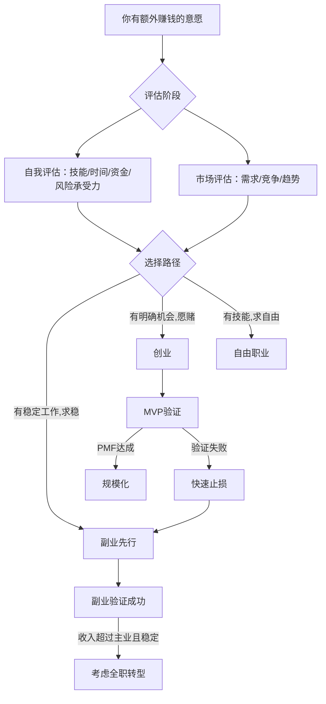
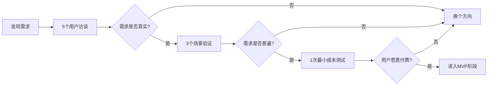
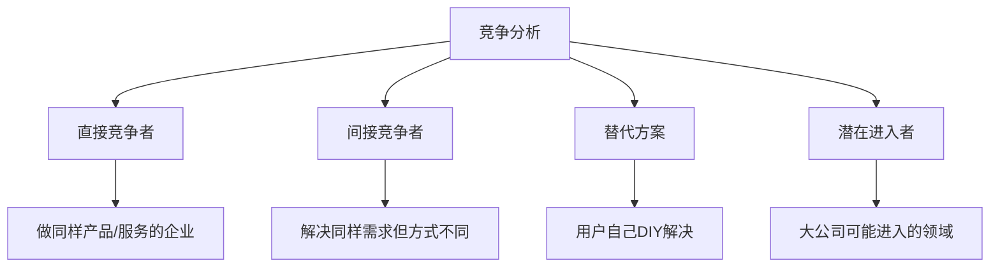
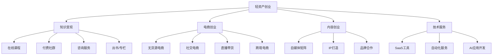
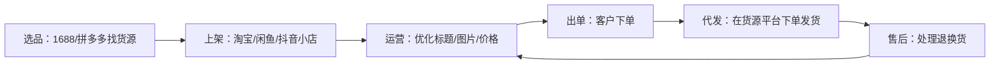
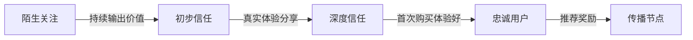
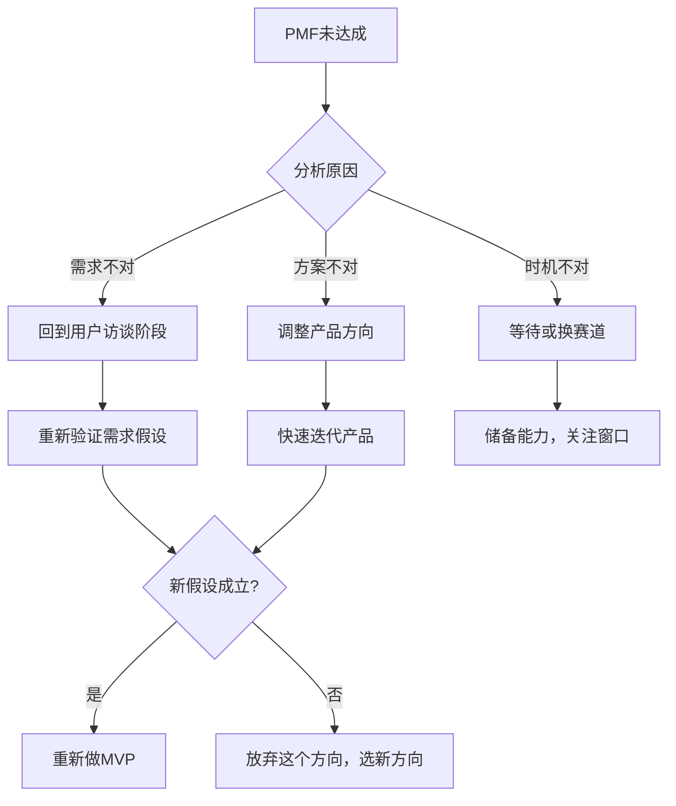
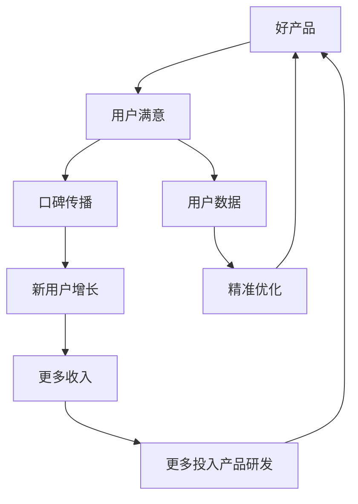

# 第八章：创业与副业

> "创业不是为了当老板，而是为了创造价值。" —— 彼得·蒂尔

创业与副业是普通人实现财富跃迁的两条核心路径。但它们不是万能药——盲目创业是最快的破产方式，盲目副业则可能消耗你仅有的精力却一无所获。本章的目标不是给你打鸡血，而是帮你建立一套完整的决策框架、方法论和实操体系，让你在行动之前就知道自己在做什么、为什么做、怎么做。



---

## 8.1 创业前的决策框架

大多数创业失败不是因为执行力差，而是在错误的时间、以错误的准备、做了错误的决定。这一节帮你回答一个根本问题：**我现在应该创业吗？**

### 8.1.1 创业的本质：价值创造而非机会套利

创业的核心逻辑是：**发现一个真实存在的需求，用比现有方案更好的方式满足它，并从中获取可持续的回报**。

很多人把创业理解为"发现一个赚钱的机会"，这会导致两个致命问题：
1. **追逐短期套利**：什么火做什么，没有积累，风口过了就死
2. **忽视价值创造**：只关注怎么收钱，不关注怎么交付价值

真正可持续的创业，是围绕"我能为谁解决什么问题"来构建的。

**商业模式画布（Business Model Canvas）**——在做任何重大决策之前，用这9个要素检验你的创业想法：

| 要素 | 核心问题 | 检验方法 |
|------|---------|---------|
| **客户细分** | 你为谁服务？ | 能否用3句话描述一个典型用户？ |
| **价值主张** | 你帮客户解决什么问题？ | 客户愿意为此付费吗？付费多少？ |
| **渠道通路** | 你怎么触达客户？ | 获客成本是多少？渠道可复制吗？ |
| **客户关系** | 你和客户是什么关系？ | 一次性交易还是持续订阅？ |
| **收入来源** | 你怎么赚钱？ | 单一收入还是多元收入？ |
| **核心资源** | 你需要什么？ | 技术？资金？人脉？牌照？ |
| **关键业务** | 你必须做好什么？ | 哪件事做不好整个模式就崩？ |
| **重要合作** | 你需要谁？ | 供应商、分销商、战略伙伴？ |
| **成本结构** | 你花多少钱？ | 固定成本和变动成本各占多少？ |

**自检方法**：如果9个要素中有3个以上你答不清楚，说明创业准备还不够充分。

**需求发现的四个层次**：

| 层次 | 方法 | 举例 | 难度 | 成功率 |
|------|------|------|------|--------|
| **自身痛点** | 你自己遇到了什么问题？ | 滴滴创始人程维打不到车 | ★☆☆ | 中 |
| **身边人痛点** | 朋友/同事/家人在抱怨什么？ | 很多中小企业不会做抖音 | ★★☆ | 中高 |
| **行业痛点** | 你在工作中发现了什么低效环节？ | 传统行业的数字化改造 | ★★★ | 高 |
| **趋势洞察** | 新技术/政策创造了什么新需求？ | ChatGPT催生AI应用创业 | ★★★★ | 中低 |

**需求验证的"5-3-1法则"**：
- **5**：找到5个目标用户，和他们深度交谈（不是问"你会用吗"，而是"你上次遇到这个问题是怎么解决的"）
- **3**：在3个不同场景验证需求（线上论坛、线下交流、付费测试）
- **1**：用1个最小成本的方式测试（落地页、微信群、手动服务）



**案例对比：成功与失败的需求判断**

| 维度 | 成功案例（字节跳动） | 失败案例（共享单车过度扩张） |
|------|---------------------|---------------------------|
| 需求本质 | 人们需要更高效的信息获取方式 | 短途出行有需求但付费意愿弱 |
| 验证方式 | 今日头条先用算法推荐验证 | 未经充分验证就大规模投放 |
| 商业闭环 | 广告模式清晰，边际成本低 | 单车成本高，维护成本不可控 |
| 时机判断 | 移动互联网红利期 | 市场已过度竞争 |

### 8.1.2 你适合创业还是做副业？

不是每个人都适合创业，也不是每种情况都适合做副业。先做一个诚实的自我评估：

**创业/副业适配度评估表**：

| 评估维度 | 创业要求 | 副业要求 | 你的评分(1-10) |
|----------|----------|----------|----------------|
| **风险承受力** | 能承受6-12个月零收入 | 能承受副业初期零收入但不影响生活 |  |
| **时间投入** | 全职投入，每天8-12小时 | 每天2-4小时，周末更多 |  |
| **资金储备** | 12-18个月生活费+启动资金 | 5000-20000元试错成本 |  |
| **专业能力** | 在某个领域有深度积累或独特资源 | 有一项可变现的技能 |  |
| **心理韧性** | 能承受孤独、质疑、反复失败 | 能平衡主业和副业的精力分配 |  |
| **家庭支持** | 家人理解并支持 | 不影响家庭责任 |  |
| **执行能力** | 能独立推动从0到1 | 能坚持3-6个月无明显回报 |  |

**决策建议**：
- **总分56分以上**：可以考虑全职创业
- **总分42-55分**：先做副业验证，再决定是否转型
- **总分28-41分**：从最小副业开始，积累经验和资源
- **总分28分以下**：先提升核心能力，暂缓创业/副业计划

**创始人-市场契合度（Founder-Market Fit）**：

比"市场机会"更重要的是"你和这个市场的关系"。创始人-市场契合度指的是：**你的个人经历、专业积累、兴趣热情是否与你选择的创业方向高度匹配**。

| 契合度等级 | 特征 | 表现 |
|-----------|------|------|
| **高契合** | 你在行业里工作多年，了解痛点、有人脉、有信用 | 能快速验证需求，获客成本低 |
| **中契合** | 你是行业用户或相关领域从业者 | 能理解需求但需要补充行业资源 |
| **低契合** | 你只是看好这个赛道，没有行业背景 | 需要大量时间学习，容易踩坑 |

**实操建议**：如果你的创业方向和你过去5年的工作/生活经验没有明显关联，请停下来重新思考。不是说跨界不可能，但你需要更高倍数的努力来弥补信息差和信任差。

### 8.1.3 竞争分析：知己知彼

很多创业者犯一个致命错误：要么认为"我没有竞争对手"，要么看到竞争对手就放弃。两者都不对。**没有竞争对手通常意味着没有市场**，而有竞争对手恰恰说明需求是真实的。

**竞争分析的四层框架**：



**竞争分析的"6个维度"清单**：

| 分析维度 | 具体内容 | 信息来源 |
|----------|---------|---------|
| **产品功能** | 核心功能、差异化功能、用户评价 | 亲自体验竞品、看用户评论 |
| **定价策略** | 价格区间、付费模式、折扣策略 | 官网、第三方价格追踪 |
| **获客渠道** | 主要流量来源、投放渠道、SEO关键词 | SimilarWeb、5118、App Annie |
| **用户画像** | 目标用户是谁？什么场景使用？ | 用户评价、社区讨论、问卷 |
| **商业模式** | 怎么赚钱？毛利水平？ | 行业报告、招股书、招聘信息 |
| **竞争壁垒** | 技术壁垒、品牌壁垒、网络效应、规模效应 | 综合判断 |

**如何找到竞争优势？** 不要试图在所有维度上都超过对手，而是在一个关键维度上做到10倍好：

| 竞争策略 | 思路 | 案例 |
|----------|------|------|
| **体验10倍好** | 同样功能但用户体验远超对手 | 苹果 vs 安卓早期 |
| **价格10倍低** | 用成本优势颠覆高端市场 | 小米手机 vs 传统品牌 |
| **速度10倍快** | 用效率优势满足急迫需求 | 美团外卖30分钟送达 |
| **便利10倍高** | 降低使用门槛，覆盖新人群 | 拼多多 vs 淘宝 |
| **质量10倍好** | 在核心指标上碾压式领先 | 戴森吸尘器 |

### 8.1.4 创业时机的选择逻辑

时机选择的核心不是"现在市场好不好"，而是"我和市场是否在正确的时间点交汇"。

**好时机的三个信号**：

1. **技术拐点**：新技术刚成熟，应用层尚未饱和
   - 2023-2024年的AI大模型应用（ChatGPT/LLM催生了大量AI工具创业）
   - 2018年的短视频（抖音刚爆发，内容供给不足）
   - 2015年的移动支付（微信支付普及，O2O创业潮）

2. **政策窗口**：政策放开或大力扶持的领域
   - 新能源（碳中和政策驱动）
   - 芯片半导体（国产替代政策）
   - 跨境电商（RCEP等贸易协定）

3. **需求涌现**：用户需求突然爆发但供给跟不上
   - 疫情期间的在线办公/在线教育
   - 老龄化催生的银发经济
   - Z世代催生的新消费品牌

**坏时机的四个特征**：
- 赛道已经跑出巨头且格局稳定（如搜索引擎、即时通讯）
- 你自己对行业没有认知积累
- 家庭经济状况不允许任何风险
- 你只是看到别人赚钱而冲动进入

**市场进入时机判断矩阵**：

| | 市场需求已验证 | 市场需求未验证 |
|--|---------------|---------------|
| **你有独特优势** | ✅ 最佳时机——立刻行动 | ⚠️ 谨慎——先做需求验证 |
| **你没有独特优势** | ⚠️ 可以——但需要找到差异化切入点 | ❌ 不建议——换方向 |

### 8.1.5 创业资金的准备与规划

**启动资金的四个来源及其风险对比**：

| 来源 | 金额范围 | 成本 | 风险 | 适合阶段 |
|------|----------|------|------|----------|
| 自有存款 | 灵活 | 机会成本 | 低（最安全） | 验证期/MVP |
| 亲友借款 | 5-50万 | 人情成本 | 中（可能影响关系） | 早期运营 |
| 银行经营贷 | 10-300万 | 年化4%-8% | 中高（需抵押/担保） | 有收入后扩张 |
| 天使投资 | 10-500万 | 出让10%-30%股权 | 低财务风险，高控制权风险 | 产品验证后 |
| 政府创业补贴 | 0.5-30万 | 几乎为零 | 低 | 各阶段均可申请 |

**资金使用的"金字塔原则"**：

```text
        ┌─────────┐
        │ 战略投入 │  ← 产品/核心竞争力（30-40%）
        │ (长期)   │
        ├─────────┤
        │ 运营开支 │  ← 人力/场地/日常运营（30-35%）
        │ (中期)   │
        ├─────────┤
        │ 市场验证 │  ← 获客/推广/测试（15-20%）
        │ (短期)   │
        ├─────────┤
        │ 安全垫   │  ← 至少3个月运营成本（10-15%）
        │ (底线)   │
        └─────────┘
```

**资金规划示例**（以在线教育平台创业为例，启动资金50万）：

| 项目 | 金额(万元) | 占比 | 用途明细 |
|------|-----------|------|----------|
| 产品开发 | 15 | 30% | 课程录制设备(2万)、平台搭建(8万)、内容制作(5万) |
| 市场推广 | 10 | 20% | 短视频投放(4万)、社群运营(3万)、试听体验(3万) |
| 人员成本 | 15 | 30% | 核心团队3人×5个月薪资 |
| 运营成本 | 5 | 10% | 办公场地(2万)、工具订阅(1万)、差旅(2万) |
| 应急储备 | 5 | 10% | 至少保障1个月的全额运营 |

**关键原则**：在没有验证商业模式之前，不要一次性把钱花完。建议分阶段投入——先用10万验证需求，再用20万打磨产品，最后用20万规模化。

### 8.1.6 创业团队的组建与股权设计

**核心团队的角色需求**：

早期创业团队不需要齐全的C-level高管，但需要覆盖三个核心能力：

| 能力维度 | 对应角色 | 核心职责 | 关键素质 |
|----------|---------|---------|---------|
| **产品/技术** | 产品负责人/CTO | 产品研发、技术架构 | 技术深度、产品直觉 |
| **市场/销售** | 市场负责人 | 获客、转化、品牌 | 沟通力、数据思维 |
| **运营/管理** | CEO（通常创始人兼任） | 战略、融资、团队 | 领导力、决策力 |

**股权分配的核心原则**：

1. **必须有一个大股东**：CEO持股不低于40%，避免股权分散导致决策僵局
2. **设置4年成熟期（Vesting）**：合伙人分4年逐步获得股权，离职则未成熟部分收回
3. **预留期权池**：10%-20%用于未来核心员工激励
4. **用协议而非口头约定**：所有股权安排必须签书面协议

**股权分配示例**（两人合伙）：

| 角色 | 股权比例 | 成熟条件 |
|------|---------|---------|
| CEO（出资金+运营） | 60% | 4年Vesting，1年Cliff |
| CTO（出技术+产品） | 30% | 4年Vesting，1年Cliff |
| 期权池 | 10% | 由CEO代持，用于员工激励 |

**找合伙人的优先级**：
1. 前同事（共事过，了解彼此能力和性格）—— 最可靠
2. 同学/校友（有共同背景和信任基础）
3. 行业社群结识（有共同话题，但需要时间建立信任）
4. 创业活动/孵化器（有筛选机制，但了解不深）

**警告**：不要因为"缺人"而随便找合伙人。一个错误的合伙人比没有合伙人更具破坏力。宁可一个人先跑，也不要和不合适的人绑在一起。

**合伙人合作协议的核心条款**：

| 条款 | 内容 | 为什么重要 |
|------|------|-----------|
| **分工与职责** | 明确每个人的权责边界 | 避免职责重叠导致的推诿和内耗 |
| **决策机制** | 重大事项需X%股权同意 | 防止独断或僵局 |
| **退出机制** | 离职时股权如何处理（回购价格、回购期限） | 避免"僵尸股东" |
| **竞业限制** | 离职后X年内不得从事竞争业务 | 保护商业机密 |
| **分红规则** | 利润分配比例和频率 | 明确利益预期 |
| **纠纷解决** | 协商→调解→仲裁/诉讼 | 有章可循，避免撕破脸 |
| **知识产权归属** | 创业期间产生的IP归公司所有 | 防止合伙人带走核心资产 |
| **僵局处理** | 双方各50%时的决策机制 | 避免公司停摆 |

---

## 8.2 轻资产创业模式详解

轻资产创业是普通人最现实的创业路径——不需要大额资金、不需要团队、不需要厂房设备，核心资产是你的知识、技能和时间。



### 8.2.1 知识付费：把经验变成产品

知识付费的本质是**将你的隐性知识（经验、判断力、方法论）转化为显性产品（课程、社群、咨询）**。

**在线课程开发全流程**：

**第一步：选题定位（决定80%的成败）**

好的课程选题需要同时满足三个条件：

| 条件 | 判断标准 | 验证方法 |
|------|---------|---------|
| 你擅长 | 你在这个领域有3年以上经验，或做出了可展示的成果 | 列出你的技能清单，标注深度(1-5) |
| 有人需要 | 目标用户愿意付费学习 | 在知乎/小红书搜索相关问题的热度 |
| 竞争可进入 | 现有课程有明显不足（太贵/太浅/太旧） | 购买1-2个竞品课程，找差异化空间 |

**课程选题的"3圈定位法"**：

```text
    ┌──────────┐
    │ 你擅长的  │
    │          │
    │   ┌──┐   │      ← 三个圈的交集就是最佳选题
    │   │★│   │
    │   └──┘   │
    │ 市场需要的│─ 你能做到比别人好的
    └──────────┘
```

**第二步：课程结构设计**

一个完整的课程应该包含：

| 模块 | 占比 | 内容 | 目的 |
|------|------|------|------|
| 认知篇 | 15% | 为什么学、学什么、学习路径 | 建立学习动机和框架 |
| 基础篇 | 25% | 核心概念、基本原理 | 打好基础，降低门槛 |
| 实操篇 | 40% | 具体步骤、案例演示、练习 | 掌握实际操作能力 |
| 进阶篇 | 15% | 高级技巧、深度案例 | 差异化，体现专业度 |
| 总结篇 | 5% | 知识图谱、行动清单、资源包 | 帮助记忆和行动 |

**第三步：录制与制作**

**设备清单（入门级 vs 专业级）**：

| 设备 | 入门方案 | 专业方案 | 说明 |
|------|---------|---------|------|
| 麦克风 | 罗德NT-USB Mini(600元) | 舒尔SM7B+声卡(3000元) | 音质比画质更重要 |
| 摄像头 | 罗技C920(400元) | 索尼A6400+采集卡(6000元) | 课程可以先只录屏幕 |
| 灯光 | 环形灯(200元) | 三点布光套装(1500元) | 自然光+台灯也能用 |
| 录屏软件 | OBS(免费) | Camtasia(1500元) | OBS功能完全够用 |
| 剪辑软件 | 剪映(免费) | Premiere(订阅制) | 剪映对新手更友好 |
| 总投入 | **约1200元** | **约12000元** | 先用入门方案验证市场 |

**第四步：平台选择与上架**

| 平台 | 抽佣比例 | 流量来源 | 适合课程类型 | 推荐度 |
|------|---------|---------|------------|--------|
| 小鹅通 | 0%（SaaS年费） | 自己引流 | 高客单价系统课 | ★★★★★ |
| 知识星球 | 5% | 平台+自己 | 社群+课程组合 | ★★★★ |
| 网易云课堂 | 10%-30% | 平台推荐 | 入门级/大众课程 | ★★★ |
| 腾讯课堂 | 10%-30% | 平台推荐 | IT/职业技能 | ★★★ |
| Udemy | 平台分成 | 全球流量 | 英文/国际化课程 | ★★★★ |
| 得到/喜马拉雅 | 平台分成 | 平台推荐 | 音频/知识专栏 | ★★★ |

**课程定价策略**：

| 课程类型 | 时长 | 定价区间 | 目标用户 | 交付方式 |
|----------|------|---------|---------|---------|
| 体验课/入门课 | 1-3小时 | 9.9-49元 | 潜在用户，建立信任 | 录播 |
| 技能课 | 5-15小时 | 199-499元 | 有明确学习目标的人 | 录播+作业 |
| 系统课 | 20-50小时 | 999-2999元 | 想系统学习的人 | 录播+直播答疑 |
| 训练营 | 14-30天 | 1999-9999元 | 需要督促和反馈的人 | 直播+社群+1v1 |
| 私教/顾问 | 按月/按项目 | 5000-50000元 | 企业/高净值个人 | 定制化服务 |

**知识付费的常见误区**：

| 误区 | 真相 | 正确做法 |
|------|------|---------|
| 课程越长越好 | 学完率才是核心指标，长课程完课率通常<10% | 拆成小模块，每节10-15分钟 |
| 内容越多越好 | 信息过载导致学员什么都记不住 | 围绕"学完能做什么"来设计 |
| 免费引流再转化 | 免费用户和付费用户的画像差异巨大 | 用低价体验课筛选付费意愿 |
| 先做课再找人 | 应该先有用户再做课程 | 先做需求验证，再投入制作 |
| 一次做完不更新 | 知识过时会导致口碑崩塌 | 每季度更新一次，保持时效性 |

**付费社群运营**：

付费社群比课程更难做，因为课程是"一次性产品"，社群是"持续性服务"。你需要持续提供价值，否则续费率会很低。

**社群运营的"5个一"框架**：
- **一个清晰的定位**：不是"学习社群"，而是"3年以内产品经理的成长社群"
- **一套内容节奏**：每日精华、每周直播、每月复盘、每季活动
- **一个互动机制**：新人破冰、话题讨论、经验分享、互助答疑
- **一个淘汰机制**：不活跃的成员清退，保持社群质量
- **一个裂变路径**：老带新激励、公开内容引流、口碑传播

**社群定价参考**：

| 定位 | 年费 | 人数上限 | 年收入潜力 | 运营强度 |
|------|------|---------|-----------|---------|
| 入门级（学习打卡） | 99-299元 | 500-2000人 | 5-60万 | 低 |
| 进阶级（行业交流） | 399-999元 | 200-500人 | 8-50万 | 中 |
| 高端级（资源对接） | 1999-9999元 | 50-200人 | 10-200万 | 高 |
| 顶级（私董会/圈层） | 10000元+ | 20-50人 | 20-50万 | 极高 |

**提高社群续费率的关键动作**：
1. **价值可视化**：每月发布社群价值报告（分享了多少资源、解决了多少问题、促成了多少合作）
2. **社交连接**：促进成员之间的横向连接，而非只有你和成员的纵向连接
3. **稀缺资源**：定期提供社群外无法获得的独家资源（行业数据、人脉引荐、闭门分享）
4. **退出成本**：通过积分体系、等级制度、连续加入折扣提高退出的心理成本

**咨询服务**：

咨询服务的定价不是按时间收费，而是**按价值收费**——你能帮客户解决多大的问题，就收多少钱。

| 咨询级别 | 定价 | 交付物 | 适合人群 |
|----------|------|--------|---------|
| 初级（1v1问答） | 300-800元/次 | 30-60分钟语音+文字总结 | 有1-3年经验的从业者 |
| 中级（方案咨询） | 2000-5000元/次 | 深度诊断+书面方案 | 有3-5年经验+成功案例 |
| 高级（战略顾问） | 5000-20000元/月 | 月度咨询+随时沟通 | 有行业影响力+成功背书 |
| 顶级（企业顾问） | 50000元+/年 | 年度顾问+资源对接 | 行业专家/成功创业者 |

### 8.2.2 电商创业的三种路径

**路径一：无货源电商（最适合新手）**

无货源电商的核心逻辑是**信息差+流量运营**——你不需要生产产品，只需要找到有需求的用户，把合适的产品推到他们面前。

**操作流程**：



**选品的"3高1低"标准**：
- **高复购率**：消耗品（美妆、零食、家居日用）比耐用品好
- **高利润率**：毛利率至少50%以上，否则扣除推广费不赚钱
- **高需求量**：月搜索量>10000的关键词
- **低竞争度**：头部卖家月销<5000的品类

**无货源电商的风险与应对**：

| 风险 | 具体表现 | 应对策略 |
|------|---------|---------|
| 利润率下降 | 越来越多人做，价格战 | 建立自有品牌，提高溢价 |
| 平台规则变化 | 淘宝打击无货源店铺 | 多平台分散风险，合规经营 |
| 供应链不稳定 | 供应商断货/质量下降 | 维护2-3个备选供应商 |
| 售后问题 | 退换货纠纷 | 选择售后体系完善的供应商 |

**路径二：社交电商（有私域流量的人）**

社交电商的核心是**信任变现**——你在社交关系中积累的信任，可以转化为购买行为。

**社交电商的启动步骤**：

1. **选定品类**：选你真正了解且愿意推荐的产品（你的信任是最宝贵的资产，不要消耗在劣质产品上）
2. **试用体验**：自己先用，拍真实体验内容（不是复制产品详情页）
3. **内容种草**：在朋友圈/小红书/抖音分享使用体验
4. **社群运营**：建立核心用户群，提供售后+复购激励
5. **裂变增长**：老用户推荐新用户，给推荐奖励

**社交电商的信任阶梯**：



**路径三：直播带货（有表现力/专业度的人）**

直播带货不是"对着镜头卖东西"那么简单。成功的直播带货需要：

**直播间的"人货场"三要素**：

| 要素 | 核心要求 | 新手建议 |
|------|---------|---------|
| **人**（主播） | 专业度+亲和力+表现力 | 从你最擅长的品类开始，不要什么都卖 |
| **货**（产品） | 高性价比+有卖点+供应链稳定 | 先做3-5个爆品，不要铺太多SKU |
| **场**（场景） | 灯光+布景+氛围 | 初期不用太讲究，真实感比精致感重要 |

**直播话术的"5步法"**：
1. **开场钩子**（前30秒留人）：抛出利益点，"今天这个价格，只有直播间有"
2. **产品展示**（3-5分钟/品）：实物演示、对比测试、痛点描述
3. **价格锚定**：先报原价→再报活动价→最后报直播间专属价
4. **限时限量**："只有200单""倒计时3分钟"
5. **逼单促成**：回答犹豫的观众问题，消除最后的购买顾虑

**直播带货的数据复盘模板**：

| 指标 | 定义 | 健康值 | 优化方向 |
|------|------|--------|---------|
| 场观 | 进入直播间总人数 | 取决于流量投入 | 优化封面、标题、开播时间 |
| 平均在线 | 同时观看人数 | >50人 | 提升内容吸引力、互动节奏 |
| 互动率 | 评论/点赞/分享÷场观 | >5% | 优化话术、增加互动环节 |
| 转化率 | 下单人数÷场观 | >2% | 优化选品、话术、价格策略 |
| 客单价 | 平均每单金额 | 取决于品类 | 优化组合套装、满减策略 |
| 退货率 | 退货÷下单 | <15% | 如实描述、优化选品 |

### 8.2.3 内容创业与IP打造

**自媒体矩阵的"1+N"策略**：

不要试图同时运营所有平台。选择**1个主平台深耕**，然后**将内容适配分发到N个辅助平台**。

| 主平台 | 适合人群 | 内容形式 | 辅助平台 |
|--------|---------|---------|---------|
| 微信公众号 | 深度写作者 | 长文 | 知乎、头条、简书 |
| 抖音 | 有表现力的人 | 短视频 | 快手、视频号、B站 |
| 小红书 | 有审美/种草能力 | 图文+短视频 | 抖音、微博 |
| B站 | 有深度/有趣味的人 | 中长视频 | YouTube、抖音 |
| 知乎 | 有专业知识的人 | 问答+专栏 | 公众号、头条 |

**IP打造的"5步递进法"**：


1. **定位**：你是谁？为谁提供什么价值？和别人有什么不同？
   - 公式：`[身份/专长] + [服务对象] + [核心价值]`
   - 例："10年产品经理，帮0-3年职场人建立产品思维"

2. **内容**：持续输出对目标受众有价值的内容
   - 选题来源：用户评论区的高频问题、行业热点、个人经验总结
   - 更新频率：宁可每周1篇高质量，不要每天1篇低质量

3. **人设**：建立鲜明且真实的个人形象
   - 人设不是"演"出来的，而是"放大"你真实性格的某个侧面
   - 例：犀利直白型、温暖治愈型、专业严谨型、幽默风趣型

4. **传播**：让更多人看到你的内容
   - SEO思维：标题含关键词、内容结构清晰
   - 社交传播：引发共鸣→引发讨论→引发转发
   - 平台算法：理解每个平台的推荐逻辑并适配

5. **变现**：将影响力转化为收入

| 变现方式 | 粉丝门槛 | 收入天花板 | 难度 |
|----------|---------|-----------|------|
| 广告合作 | 1万+ | 中 | 低 |
| 知识付费 | 5000+ | 高 | 中 |
| 电商带货 | 1万+ | 极高 | 中 |
| 品牌代言 | 50万+ | 极高 | 高 |
| 出书/专栏 | 10万+ | 中 | 中 |
| 企业顾问 | 行业影响力 | 高 | 高 |

**品牌合作报价参考（2024-2025年行情）**：

| 粉丝规模 | 公众号单篇 | 抖音单条 | 小红书单篇 | B站单条 |
|----------|-----------|---------|-----------|---------|
| 1万粉 | 500-2000元 | 1000-3000元 | 500-2000元 | 800-2500元 |
| 10万粉 | 3000-10000元 | 5000-20000元 | 3000-10000元 | 5000-15000元 |
| 50万粉 | 15000-50000元 | 20000-80000元 | 15000-50000元 | 20000-60000元 |
| 100万粉 | 30000-100000元 | 50000-200000元 | 30000-100000元 | 50000-150000元 |

*注：报价受领域、互动率、粉丝质量影响很大。垂直领域（如金融、医疗）报价通常是泛娱乐的2-3倍。*

### 8.2.4 平台经济：SaaS与工具型创业

SaaS（Software as a Service，软件即服务）是目前全球最主流的创业模式之一，也是技术背景创业者最适合的方向。

**SaaS的核心商业逻辑**：
- 用户按月/年付费订阅，而非一次性购买
- 收入具有**可预测性**（MRR/ARR = 月/年度经常性收入）
- 边际成本极低（新增一个用户的服务器成本几乎可忽略）
- 客户终身价值（LTV）远高于获客成本（CAC）

**SaaS创业的"3个关键指标"**：

| 指标 | 健康值 | 计算方式 | 说明 |
|------|--------|---------|------|
| LTV/CAC比值 | >3 | 客户终身价值÷获客成本 | 低于3说明获客效率不够 |
| 月流失率 | <5% | 每月流失客户数÷总客户数 | 高流失意味着产品价值不足 |
| NDR（净收入留存率） | >100% | （期初收入+增购-流失）÷期初收入 | 超过100%说明老客户在增长 |

**个人开发者可做的SaaS方向**：

| 方向 | 典型产品 | 技术栈 | 启动成本 | 月收入潜力 |
|------|---------|--------|---------|-----------|
| 数据分析工具 | 可视化报表、BI工具 | Python/JS + 数据库 | 500-2000元/月 | 5000-50000元 |
| 自动化工作流 | 类似Zapier的连接器 | Node.js/Python | 1000-3000元/月 | 10000-100000元 |
| AI API封装 | 将AI能力包装成简单API | Python + FastAPI | 500-1500元/月 | 5000-30000元 |
| 内容管理工具 | 建站、SEO、内容调度 | Next.js/Python | 500-2000元/月 | 5000-30000元 |
| 垂直行业工具 | 餐饮/教育/医疗特定需求 | 全栈 | 2000-5000元/月 | 10000-100000元 |

**SaaS定价的三层结构**：

```text
┌─────────────────────────────────────┐
│         企业版 (Enterprise)         │ ← 定制价格，按需协商
│         月费 999元+                 │    功能：全功能+优先支持+定制
├─────────────────────────────────────┤
│         专业版 (Pro)                │ ← 月费 199元
│         适合成长型团队              │    功能：核心功能+高级特性
├─────────────────────────────────────┤
│         免费版 (Free)               │ ← 永久免费
│         适合个人/试用               │    功能：基础功能，有使用限制
└─────────────────────────────────────┘
```

**开源策略**：将核心功能开源（吸引开发者社区），用高级功能/托管服务收费。这个模式在开发者工具领域非常有效——Vercel、Supabase、PostHog 都是这个路径。

### 8.2.5 AI时代的创业新机会（2024-2026）

AI大模型的普及催生了全新的创业赛道，这些机会的窗口期可能只有2-3年。

**AI创业的四个层次**：

| 层次 | 描述 | 门槛 | 举例 |
|------|------|------|------|
| **AI应用层** | 用现有AI API构建产品 | 低（会调API即可） | AI写作助手、AI客服机器人 |
| **AI工具层** | 为特定行业构建AI工具 | 中（需行业理解） | 法律AI、医疗AI、教育AI |
| **AI中间层** | 为AI应用提供基础设施 | 高（需技术深度） | 向量数据库、Agent框架 |
| **AI模型层** | 训练自己的大模型 | 极高（需资金+人才） | 大模型公司（不适合个人） |

**最适合个人/小团队的AI创业方向**：

1. **AI+内容生产**：用AI辅助写作、视频制作、设计
   - 产品形态：SaaS工具、API服务
   - 变现方式：订阅制、按量付费
   - 案例：Jasper（AI写作工具，估值15亿美元）

2. **AI+教育培训**：个性化学习助手、AI模拟考试
   - 产品形态：App、小程序
   - 变现方式：课程+工具订阅

3. **AI+企业服务**：智能客服、自动化文档处理、数据分析
   - 产品形态：SaaS
   - 变现方式：企业订阅（B2B）

4. **AI+电商**：AI选品、AI客服、AI详情页生成
   - 产品形态：工具/插件
   - 变现方式：按店铺收费

5. **AI Agent（智能体）**：能自主完成复杂任务的AI系统
   - 产品形态：SaaS、API、嵌入式方案
   - 变现方式：按任务量计费或订阅
   - 2025年最热的AI创业方向之一

**AI副业的快速起步方式**：

| 副业类型 | 启动成本 | 月收入潜力 | 技能要求 |
|----------|---------|-----------|---------|
| AI写作代工 | 0（用免费额度） | 3000-10000元 | 提示词工程+写作能力 |
| AI绘画/设计 | 0-200元/月 | 2000-8000元 | 审美+工具操作 |
| AI课程培训 | 0-500元 | 5000-30000元 | AI工具熟练+教学能力 |
| AI Agent开发 | 0-1000元 | 5000-50000元 | 编程+AI理解 |
| AI数据分析 | 0 | 3000-15000元 | 数据分析+AI工具 |

---

## 8.3 副业项目精选与实操

### 8.3.1 副业选择的决策矩阵

不是所有副业都适合你。选择副业时，用这个矩阵来评估：

| 你的条件 | 推荐副业类型 | 原因 |
|----------|------------|------|
| 有专业技能（编程/设计/翻译） | 技能型副业（接单/外包） | 变现路径短，收入确定性高 |
| 有时间但没特殊技能 | 平台型副业（跑腿/问卷/标注） | 门槛低，立刻开始赚钱 |
| 有社交资源（社群/人脉） | 社交型副业（分销/团购/咨询） | 信任变现，复购率高 |
| 有创作能力（写作/拍摄/剪辑） | 内容型副业（自媒体/投稿） | 有积累效应，长期回报高 |
| 有资金但时间少 | 投资型副业（理财/合伙） | 钱生钱，但风险需要控制 |

**副业选择的"3个不要"**：
1. **不要做和主业完全无关的副业**——浪费你的核心竞争力，且学习成本高
2. **不要做纯粹出卖时间的副业**（如跑腿、问卷调查）——没有积累效应，时薪天花板很低
3. **不要做需要大额前期投入的副业**——副业的优势就是低风险，别把它变成赌博

**副业的"积累效应"评估**：选择副业时，最核心的判断标准是——这件事做一年后，你积累了什么？

| 副业类型 | 一年后积累 | 积累可复用？ | 长期价值 |
|----------|-----------|------------|---------|
| 自媒体写作 | 写作能力+粉丝+作品集 | ✅ 可迁移 | 高 |
| 编程接单 | 项目经验+客户资源+代码库 | ✅ 可迁移 | 高 |
| 闲鱼卖货 | 选品眼光+运营经验+供应链 | ✅ 可迁移 | 中高 |
| 直播带货 | 表现力+粉丝+供应链 | ✅ 可迁移 | 中高 |
| 跑腿/外卖 | 零 | ❌ 不可迁移 | 低 |
| 问卷调查 | 零 | ❌ 不可迁移 | 低 |

### 8.3.2 零成本副业深度指南

**写作投稿**

写作投稿是门槛最低、但上限不低的副业。关键是找到合适的变现路径。

**投稿变现的四条路径**：

| 路径 | 收入模式 | 单篇收入 | 月产出 | 月收入 | 难度 |
|------|---------|---------|--------|--------|------|
| 公众号投稿 | 稿费 | 200-2000元 | 4-8篇 | 800-16000元 | ★★ |
| 知识付费专栏 | 订阅分成 | 按订阅数 | 持续更新 | 不确定 | ★★★ |
| 自媒体广告分成 | 流量收益 | 按阅读量 | 日更/周更 | 500-5000元 | ★★ |
| 代写/文案服务 | 按项目 | 500-5000元 | 4-10个 | 2000-50000元 | ★★★ |

**投稿前的准备工作**：
1. 研究目标平台最近30天的热门文章，总结选题规律
2. 选3-5个你有深度的选题，写1000字的提纲
3. 先给编辑发提纲沟通，确认方向后再动笔
4. 按平台的格式要求排版（字数、配图、参考文献）
5. 第一篇不要期望高稿费，先建立合作关系

**翻译服务**

| 翻译方向 | 单价(元/千字) | 月产能 | 月收入 | 平台 |
|----------|-------------|--------|--------|------|
| 中英笔译 | 100-300 | 10-30万字 | 10000-90000元 | Gengo/Translated |
| 中日笔译 | 150-400 | 8-20万字 | 12000-80000元 | 有道/人工翻译平台 |
| 字幕翻译 | 50-150/分钟 | 200-500分钟 | 10000-75000元 | 字幕组/Freelancer |
| 口译(同传) | 2000-8000/天 | 10-15天 | 20000-120000元 | 翻译公司派遣 |
| 本地化 | 200-500/千字 | 按项目 | 按项目计 | Lionbridge/Keywords |

**AI对翻译行业的冲击与应对**：
- AI翻译已经能处理80%的日常翻译需求
- 但**文学翻译、法律翻译、医学翻译**仍需人工把关
- 应对策略：从"翻译者"转型为"AI翻译审校者"，用AI提效，人工保证质量

### 8.3.3 低成本副业实操

**闲鱼运营（月入3000-10000元）**

闲鱼是最低成本的电商入门平台——零开店费、零保证金、流量免费。

**闲鱼赚钱的四种模式**：

| 模式 | 启动资金 | 操作难度 | 月利润 | 核心技巧 |
|------|---------|---------|--------|---------|
| 闲置出售 | 0 | ★ | 500-2000元 | 拍好照片，如实描述 |
| 信息差套利 | 1000-5000元 | ★★ | 3000-8000元 | 选品眼光+上架效率 |
| 技能服务 | 0 | ★★ | 2000-10000元 | 服务标准化+好评积累 |
| 虚拟商品 | 0-500元 | ★★ | 2000-8000元 | 独特资源+合规经营 |

**闲鱼运营的"7天起量法"**：
- **第1-2天**：注册完善资料，完成实名认证，浏览并收藏同类商品
- **第3天**：发布5-10个商品，标题包含核心关键词+长尾词
- **第4-5天**：每天新上架5-10个商品，同时优化之前的标题和图片
- **第6-7天**：回复所有咨询，成交第一单，获取好评
- **之后**：保持每天上新3-5个，淘汰没流量的，复制爆款

**标题优化公式**：`[品牌/品类] + [核心卖点] + [使用场景] + [价格优势]`
- 差："出售一台电脑"
- 好："联想ThinkPad X1 Carbon 14寸 轻薄商务本 i7 16G 办公出差首选 95新"

**摄影/视频服务（月入5000-30000元）**

| 服务类型 | 单次收费 | 客户来源 | 设备投入 | 技能门槛 |
|----------|---------|---------|---------|---------|
| 证件照 | 50-200元 | 小红书/大众点评 | 手机+简易灯光 | ★ |
| 产品拍摄 | 100-500元/组 | 闲鱼/淘宝商家群 | 相机+灯光+背景 | ★★ |
| 活动跟拍 | 500-3000元/场 | 本地社群/朋友圈 | 相机+稳定器 | ★★★ |
| 短视频制作 | 500-5000元/条 | 小红书/抖音展示作品 | 手机/相机+剪辑 | ★★★ |
| 婚礼跟拍 | 2000-15000元/场 | 婚庆公司/转介绍 | 专业设备 | ★★★★ |

### 8.3.4 技能型副业深度指南

**编程开发（月入10000-50000元）**

| 项目类型 | 报价范围 | 交付周期 | 客户来源 | 技能要求 |
|----------|---------|---------|---------|---------|
| 企业官网 | 3000-15000元 | 1-2周 | 猪八戒/本地企业 | HTML/CSS/WordPress |
| 微信小程序 | 5000-50000元 | 2-6周 | 程序员客栈/朋友介绍 | 微信开发框架 |
| App开发 | 30000-200000元 | 1-6个月 | 外包平台/企业直接 | 移动开发框架 |
| 数据分析 | 200-800元/小时 | 按需 | Upwork/Fiverr | Python/SQL/Excel |
| 自动化脚本 | 500-5000元/个 | 1-3天 | 闲鱼/技术社群 | Python/Shell |

**编程接单的注意事项**：
1. **签合同**：明确交付物、工期、付款节点（建议3-3-4分期：开工30%、中期30%、验收40%）
2. **管理预期**：需求文档化，客户确认后再动手
3. **代码归属**：合同中明确代码版权归属
4. **售后约定**：免费维护期（通常1-3个月）+ 付费维护

**设计服务（月入5000-30000元）**

| 设计类型 | 单次收费 | 交付物 | 接单平台 |
|----------|---------|--------|---------|
| Logo设计 | 500-8000元 | 源文件+多格式导出 | 猪八戒/99designs |
| 海报/Banner | 200-1500元 | 源文件+印刷稿 | 闲鱼/设计社群 |
| UI/UX设计 | 5000-50000元 | 原型+高保真+切图标注 | 程序员客栈/Upwork |
| 视频剪辑 | 100-800元/分钟 | 成片+工程文件 | 小红书/抖音接单 |
| PPT设计 | 500-3000元/份 | 源文件+PDF | 闲鱼/猪八戒 |

### 8.3.5 副业获客：从0到第一批客户

很多副业者卡在"我有技能但没客户"的阶段。这里给出从0获客的完整路径：

**冷启动获客的5个渠道**：

| 渠道 | 成本 | 见效速度 | 持续性 | 适合场景 |
|------|------|---------|--------|---------|
| **熟人推荐** | 0 | 快（1-2周） | 依赖人脉广度 | 刚开始时的第一批客户 |
| **免费平台** | 0 | 中（2-4周） | 取决于内容质量 | 闲鱼、小红书、知乎回答 |
| **垂直社群** | 0 | 中（1-2月） | 需要持续活跃 | 行业微信群、QQ群、论坛 |
| **内容营销** | 0 | 慢（1-3月） | 长期复利效应 | 公众号、B站、知乎专栏 |
| **付费投放** | 500-5000元/月 | 快（1-7天） | 停投即停 | 抖音/小红书/微信广告 |

**获客话术模板**（以编程接单为例）：
- **错误方式**："我会Python，有需要可以找我" ——太笼统，没有说服力
- **正确方式**："专注小程序开发3年，已交付20+项目，涵盖电商/教育/餐饮行业。最近帮XX餐饮做了预约点餐小程序，上线3个月复购率提升40%。有需要可以看案例。" ——有数据、有案例、有结果

**副业定价的"锚定策略"**：

很多副业新手不敢定价，或者定价太低。记住：**你的定价不是由你的时间决定的，而是由你解决的问题决定的**。

| 定价方法 | 操作 | 适用场景 |
|----------|------|---------|
| **竞品锚定** | 找到同类型服务的价格区间，定位中间偏上 | 标准化服务（设计、剪辑） |
| **价值锚定** | 计算你的服务为客户带来的价值，收取10%-20% | 高价值服务（咨询、开发） |
| **阶梯报价** | 基础版/标准版/高级版三档 | 服务类产品 |
| **首次优惠** | 首单打7折，后续恢复原价 | 获客期 |

### 8.3.6 副业到全职的转型决策

当副业收入持续超过主业时，你可能开始考虑全职转型。但不要冲动——**副业收入超过主业只是必要条件，不是充分条件**。

**转型前的"6个月验证"**：

| 验证项 | 达标标准 | 未达标怎么办 |
|--------|---------|------------|
| 收入稳定性 | 副业收入连续6个月≥主业收入 | 继续积累，不要冒险 |
| 增长趋势 | 副业收入有明确的增长路径 | 分析瓶颈，找到增长点 |
| 客户积累 | 有稳定的客户来源，不依赖单一大客户 | 分散客户，降低风险 |
| 现金储备 | 有12个月生活费的存款 | 继续存钱 |
| 家庭共识 | 家人理解并支持 | 充分沟通，达成共识 |
| 退出方案 | 如果失败，能回到主业或找到新工作 | 保持行业人脉和技能更新 |

**转型的时间安排建议**：
1. 不要裸辞，先在副业上投入更多时间（减少主业的额外投入，如加班、出差）
2. 尝试请一个长假（2-4周），全职投入副业，测试真实的产出和收入
3. 如果长假期间副业表现良好，可以正式和公司谈离职
4. 离职后给自己3个月的"创业缓冲期"，如果达不到预期就重新找工作

**转型期的风险对冲**：

| 风险 | 对冲措施 |
|------|---------|
| 副业收入突然下降 | 保持12个月生活费储备；维护行业人脉随时可复职 |
| 社保断缴 | 提前了解灵活就业社保或挂靠方案 |
| 心理落差 | 从"公司人"到"个体户"的身份转变需要适应期 |
| 孤独感 | 加入创业社群，找到同行者 |
| 家庭压力 | 和家人约定"试错期限"（如6个月），到期评估 |

---

## 8.4 创业的从0到1：MVP到PMF

### 8.4.1 MVP验证：用最小成本试错

MVP（Minimum Viable Product，最小可行产品）的核心思想是：**在投入大量资源之前，先用最小的成本验证你的商业假设是否成立**。

**MVP的五种形式**：

| 形式 | 成本 | 验证速度 | 适合场景 |
|------|------|---------|---------|
| 落地页测试 | 0-500元 | 1-3天 | 验证需求是否真实 |
| 微信群/社群 | 0元 | 1-7天 | 验证用户是否愿意付费 |
| 手动服务 | 0元 | 1-4周 | 验证服务模式是否可行 |
| 简单原型 | 1000-5000元 | 2-4周 | 验证产品体验 |
| 演示视频 | 0-2000元 | 3-7天 | 验证概念和市场反应 |

**MVP验证的"4个假设"**：

在做MVP之前，先明确你要验证哪些假设：

1. **需求假设**：目标用户真的有这个痛点吗？
   - 验证方法：用户访谈（至少10人）
   - 判断标准：80%以上的人表示有这个痛点

2. **方案假设**：你的解决方案能解决这个问题吗？
   - 验证方法：用MVP提供服务/产品
   - 判断标准：用户使用后表示问题得到了改善

3. **付费假设**：用户愿意为此付费吗？
   - 验证方法：真实收费（不是免费试用）
   - 判断标准：有10个以上付费用户

4. **增长假设**：如何持续获取新用户？
   - 验证方法：测试不同获客渠道
   - 判断标准：至少1个渠道的获客成本低于用户终身价值的1/3

**经典MVP案例**：

| 公司 | MVP形式 | 投入成本 | 验证结果 | 后续发展 |
|------|---------|---------|---------|---------|
| Dropbox | 演示视频 | 几乎为0 | 一天75000人注册 | 估值百亿美元 |
| Airbnb | 在自己家放气垫床 | 几百美元 | 3个付费客人 | 估值千亿美元 |
| Zappos | 去鞋店拍照上传网站 | 0 | 有订单后才去采购 | 被亚马逊收购 |
| 微信 | 简单的通讯工具 | 开发成本 | 快速获取百万用户 | 超级App |

**MVP的"2周冲刺法"**：给自己的MVP设定一个2周的截止日期。2周后不管做到什么程度，都必须拿出去面对用户。

| 时间 | 任务 | 产出 |
|------|------|------|
| 第1天 | 明确要验证的核心假设 | 假设清单 |
| 第2-3天 | 找5-10个目标用户深度访谈 | 需求验证报告 |
| 第4-5天 | 设计最简方案（落地页/群/原型） | MVP方案 |
| 第6-10天 | 快速搭建MVP | 可测试的产品/服务 |
| 第11-12天 | 邀请用户测试，收集反馈 | 用户反馈文档 |
| 第13-14天 | 分析数据，决定继续还是调整 | Go/No-Go决策 |

### 8.4.2 从MVP到PMF：找到产品-市场契合点

PMF（Product-Market Fit，产品-市场契合）是指：**你的产品满足了市场的强烈需求，用户主动传播、主动付费、离不开你**。

**判断是否达到PMF的4个信号**：

| 信号 | 指标 | 说明 |
|------|------|------|
| **用户主动推荐** | NPS评分>40 | 用户愿意自发推荐给朋友 |
| **高留存率** | 月留存>40% | 用户持续使用而非一试即走 |
| **自然增长** | >30%新用户来自口碑 | 不完全依赖付费推广 |
| **用户付费意愿** | 付费转化率>5% | 用户愿意为价值买单 |

**PMF失败的典型症状**：
- 用户试用后不回来（留存率低）
- 需要大量补贴才能维持用户（伪需求）
- 用户说"不错"但从不推荐（价值不够突出）
- 获客成本远高于用户价值（商业模式不通）

**PMF失败后的应对策略**：



### 8.4.3 产品定价：被低估的关键能力

定价是创业中最被低估的能力。很多创业者按"成本+利润率"定价，这完全错误。**定价应该基于用户感知的价值，而非你的成本**。

**定价的三种策略**：

| 策略 | 逻辑 | 适用场景 | 风险 |
|------|------|---------|------|
| **价值定价** | 用户获得多少价值，就收多少钱 | 高价值产品/服务 | 需要准确理解用户价值 |
| **竞品定价** | 参考竞品价格，略有差异化 | 竞争充分的市场 | 容易陷入价格战 |
| **分层定价** | 不同价位覆盖不同用户群 | SaaS/服务类产品 | 设计复杂度高 |

**定价心理技巧**：
1. **锚定效应**：先展示高价方案，再推荐中间方案——中间方案显得"性价比高"
2. **尾数定价**：199比200感觉便宜很多（虽然只差1元）
3. **按年付费折扣**：年付打8折，既锁定客户又降低流失率
4. **免费试用+付费转化**：让用户先体验价值，再决定是否付费
5. **限量/限时**：创造稀缺感，推动用户尽快决策

**单位经济模型（Unit Economics）**：创业初期就必须算清楚的账。

```text
单位经济模型 = 每个客户能赚多少钱

LTV（客户终身价值）= ARPU（月均收入）× 客户生命周期（月）
例：月均付费200元 × 平均留存12个月 = LTV 2400元

CAC（获客成本）= 营销总费用 ÷ 新增客户数
例：月营销费用2万 ÷ 100个新客 = CAC 200元

LTV / CAC = 2400 / 200 = 12（健康值应>3）

Payback Period（回本周期）= CAC ÷ 月均毛利
例：200 ÷ 120（毛利率60%）= 1.67个月（优秀）
```

**如果单位经济模型不健康怎么办？**

| 问题 | 症状 | 解法 |
|------|------|------|
| CAC太高 | 获客成本>客户价值的1/3 | 优化获客渠道、提高转化率、做口碑传播 |
| LTV太低 | 客户流失快、付费低 | 提高产品价值、增加留存机制、提升客单价 |
| 回本周期太长 | 6个月以上才回本 | 推年付、增加增值服务、优化成本结构 |

---

## 8.5 创业风险管理

### 8.5.1 现金流管理

**现金流是企业的命脉**——很多企业不是死于没有利润，而是死于现金流断裂。

**现金流管理的"3-6-9法则"**：
- **3个月**：任何时候，账上现金不低于3个月运营成本
- **6个月**：创业初期，至少准备6个月的启动资金
- **9个月**：如果连续9个月现金流为负，必须认真考虑止损

**现金流预测模板**：

| 月份 | 收入 | 固定支出 | 变动支出 | 净现金流 | 累计现金 | 预警状态 |
|------|------|---------|---------|---------|---------|---------|
| 1月 | 0 | 3万 | 2万 | -5万 | -5万 | ⚠️ |
| 2月 | 1万 | 3万 | 2万 | -4万 | -9万 | ⚠️ |
| 3月 | 3万 | 3万 | 2万 | -2万 | -11万 | ⚠️ |
| 4月 | 5万 | 3万 | 2.5万 | -0.5万 | -11.5万 | ⚠️ |
| 5月 | 8万 | 3万 | 3万 | +2万 | -9.5万 | ✅ |
| 6月 | 12万 | 3万 | 4万 | +5万 | -4.5万 | ✅ |

**现金流危机的五个预警信号**：
1. 应收账款账期超过60天
2. 库存周转天数持续上升
3. 开始用新贷款还旧贷款
4. 延迟发放员工工资
5. 供应商开始要求预付款

**改善现金流的具体方法**：

| 方法 | 操作 | 效果 |
|------|------|------|
| **缩短账期** | 给提前付款的客户5%-10%折扣 | 加速现金回流 |
| **延长应付** | 和供应商谈30-60天账期 | 减少现金压力 |
| **砍固定成本** | 用共享办公替代独立办公室 | 立即降低月度支出 |
| **提高单价** | 提价10%-20%，观察客户反应 | 往往流失<5%的客户但收入增加 |
| **预收款模式** | 年付/季度付优于月付 | 提前锁定收入 |

### 8.5.2 合规经营与税务

**创业必须办的合规事项**：

| 事项 | 时间要求 | 办理方式 | 不做的后果 |
|------|---------|---------|-----------|
| 工商注册（营业执照） | 开始经营前 | 当地市场监管局/网上办理 | 无照经营，罚款+关停 |
| 税务登记 | 营业执照后30天内 | 税务局/电子税务局 | 罚款+影响征信 |
| 银行开户 | 税务登记后 | 银行对公业务 | 无法正常收付款 |
| 社保开户 | 雇佣员工后30天内 | 社保局 | 劳动纠纷+罚款 |
| 行业许可证 | 视行业而定 | 相关主管部门 | 违法经营 |

**常见公司类型对比**：

| 类型 | 注册门槛 | 税负 | 责任范围 | 适合场景 |
|------|---------|------|---------|---------|
| 个体工商户 | 最低（无注册资金要求） | 核定征收，税负低 | 无限责任 | 小规模经营/副业 |
| 个人独资企业 | 低 | 可核定征收 | 无限责任 | 单人创业 |
| 有限责任公司 | 注册资金认缴 | 查账征收，25%企业所得税 | 有限责任 | 正式创业/团队 |
| 合伙企业 | 合伙人协议 | 穿透征税 | 普通合伙人无限责任 | 专业服务/投资 |

**副业的税务处理**：
- 如果副业收入偶尔且金额小（月均<1万），通常不需要特别处理
- 如果副业收入稳定且金额较大，建议注册个体工商户，享受小规模纳税人优惠
- 年收入超过12万需要个人所得税汇算清缴
- 开具发票的需求决定了你是否需要注册公司

**小规模纳税人 vs 一般纳税人**：

| 维度 | 小规模纳税人 | 一般纳税人 |
|------|------------|-----------|
| 年销售额 | ≤500万 | >500万或主动申请 |
| 增值税 | 3%（2024年有减免政策） | 6%/9%/13%（可抵扣进项） |
| 记账要求 | 简化记账 | 严格记账，需要专职会计 |
| 适合对象 | 刚起步的小生意 | 有一定规模的企业 |

**创业者的税务筹划要点**：
1. **合理利用小规模纳税人免征额度**：月销售额10万以下免征增值税
2. **费用合规入账**：办公租金、设备采购、差旅费用都可以作为成本抵扣
3. **工资与分红的平衡**：工资可以税前扣除但有社保成本，分红税负20%但无社保成本
4. **利用税收洼地**：部分园区有税收返还政策，但要确保业务真实性
5. **关联交易合规**：个人和公司之间的资金往来要合规，避免被认定为偷税

### 8.5.3 知识产权保护

很多创业者忽视知识产权保护，等到被抄袭或被起诉时才追悔莫及。

**需要保护的知识产权类型**：

| 类型 | 保护对象 | 注册方式 | 费用 | 周期 |
|------|---------|---------|------|------|
| **商标** | 品牌名称、Logo | 国家知识产权局 | 300元/类 | 6-12个月 |
| **专利** | 发明、实用新型、外观 | 国家知识产权局 | 500-5000元 | 6-18个月 |
| **著作权** | 代码、设计、文案 | 自动取得（建议做版权登记） | 登记约300元 | 1-3个月 |
| **域名** | 网站域名 | 域名注册商 | 50-100元/年 | 即时 |

**必须做的3件事**：
1. **注册商标**：在你创业的第一天就去申请商标注册。商标被抢注的案例太多了——名字用了一年被别人注册，要么改名要么花钱买回来
2. **保密协议**：和员工、合作伙伴、供应商签NDA（保密协议），特别是涉及核心技术或商业模式
3. **代码/设计的版权**：确保所有外包开发的代码、设计的版权归属于你的公司（在合同中明确）

**NDA（保密协议）的核心条款**：

| 条款 | 内容 | 注意事项 |
|------|------|---------|
| 保密信息定义 | 明确哪些信息属于保密范围 | 不要写得太宽泛，否则可能被法院认定无效 |
| 保密义务 | 不得向第三方披露 | 明确例外情况（法律要求、已公开信息） |
| 保密期限 | 通常2-5年 | 超过5年可能被认为不合理 |
| 违约责任 | 赔偿金额或计算方式 | 要有威慑力但不能过高 |
| 争议解决 | 仲裁或诉讼 | 建议选择仲裁（更快、更保密） |

### 8.5.4 退出策略

创业不是只有一条路走到黑——**知道何时止损，和知道如何前进同样重要**。

**退出决策的"3个信号"**：

| 信号 | 具体表现 | 建议动作 |
|------|---------|---------|
| 市场信号 | 目标市场持续萎缩、用户需求消失、行业被颠覆 | 3个月内退出或转型 |
| 财务信号 | 连续6个月现金流为负且无改善趋势 | 1个月内决定是否追加投入或退出 |
| 个人信号 | 创始人身心俱疲、团队核心成员离开、失去创业热情 | 认真考虑退出或引入新负责人 |

**退出方式对比**：

| 退出方式 | 适用场景 | 回报 | 耗时 | 难度 |
|----------|---------|------|------|------|
| 自然关闭 | 小项目，没有转让价值 | 低（清算残值） | 1-3个月 | ★ |
| 业务转让 | 有稳定客户/收入的业务 | 中（年利润2-5倍） | 1-6个月 | ★★ |
| 公司出售 | 有技术/用户/品牌的公司 | 中高（估值谈判） | 3-12个月 | ★★★ |
| 被收购 | 有战略价值的公司 | 高（溢价收购） | 6-24个月 | ★★★★ |
| IPO上市 | 规模大、盈利能力强 | 极高 | 年级别 | ★★★★★ |

**优雅退出的checklist**：
1. 通知所有客户和合作伙伴，给出合理的过渡期
2. 处理完所有未交付的订单和未结清的款项
3. 妥善安置团队成员（推荐到其他公司、提供推荐信）
4. 注销工商登记和税务登记
5. 保留核心文件和数据备份（未来可能复盘或作为经验背书）
6. 写一份复盘总结——失败的教训比成功的经验更有价值

---

## 8.6 创业增长与规模化

### 8.6.1 获客渠道：从手动到系统化

创业初期的获客靠创始人自己一个个谈，但规模化需要建立**可复制的获客系统**。

**获客渠道的分类与选择**：

| 渠道类型 | 具体渠道 | 成本 | 速度 | 可规模化 | 适合阶段 |
|----------|---------|------|------|---------|---------|
| **免费渠道** | SEO、内容营销、社区运营 | 时间成本 | 慢（3-6月见效） | 高 | 早期+长期 |
| **付费渠道** | 信息流广告、SEM、KOL投放 | 资金成本 | 快（即时见效） | 高 | 验证后+规模化 |
| **合作渠道** | 分销、联运、API对接 | 分成成本 | 中 | 中 | 产品成熟后 |
| **口碑渠道** | 转介绍、用户评价、案例传播 | 几乎为零 | 慢但持久 | 中 | 产品成熟后 |

**获客成本（CAC）的计算方法**：

```text
CAC = (营销总费用 + 销售总费用) ÷ 新增付费客户数

例：某月营销费用2万、销售费用3万，新增100个付费客户
CAC = (2万+3万) ÷ 100 = 500元/客户
```

**健康的CAC/LTV比值**：
- LTV/CAC > 3：健康的商业模式
- LTV/CAC 1-3：勉强可行，需要优化
- LTV/CAC < 1：亏损模式，必须立刻调整

**增长飞轮模型**：



### 8.6.2 用户留存：比获客更重要的事

很多创业者把90%的精力放在获客上，却忽视了留存。**获取一个新用户的成本是留住一个老用户的5-7倍**。

**留存的"4个关键时刻"**：

| 时刻 | 用户心理 | 你的动作 |
|------|---------|---------|
| **首次使用** | "这个产品到底好不好用？" | 3分钟内让用户感受到核心价值（Aha Moment） |
| **第3天** | "我要不要继续用？" | 推送使用引导、展示使用数据 |
| **第7天** | "这个产品值不值得付费？" | 提供限时优惠、展示其他用户案例 |
| **第30天** | "我为什么要续费？" | 展示使用成果、提供增值功能 |

**提高留存的7个实操策略**：

| 策略 | 操作 | 案例 |
|------|------|------|
| **Onboarding优化** | 简化注册流程，3步内开始使用 | Notion的模板引导 |
| **习惯养成** | 设计每日/每周使用场景 | Duolingo的连续打卡 |
| **数据锁定** | 用户在平台积累的数据越多，越难离开 | 印象笔记的笔记积累 |
| **社交绑定** | 让用户在平台上建立社交关系 | 微信读书的好友排行 |
| **个性化推荐** | 根据用户行为推荐内容 | 今日头条的算法推荐 |
| **成就体系** | 勋章、等级、排行榜 | Keep的运动徽章 |
| **定期反馈** | 周报/月报，展示使用成果 | Spotify年度回顾 |

### 8.6.3 规模化的关键转折点

从"小而美"到"规模化"需要跨越几个关键门槛：

| 转折点 | 挑战 | 解决方案 |
|--------|------|---------|
| **从个人到团队** | 创始人无法做所有事 | 招聘第一个员工（通常是最难的决定） |
| **从手动到系统** | 每个客户都需要创始人亲自服务 | 建立SOP，培训团队，开发工具 |
| **从单点到多点** | 依赖单一获客渠道或产品线 | 拓展新渠道、开发新产品 |
| **从本地到全国** | 服务能力受限于地域 | 线上化、代理模式、加盟模式 |

**SOP（标准操作流程）模板**：

```text
SOP名称：[具体流程名称]
版本：v1.0
适用范围：[谁用、什么时候用]
更新日期：YYYY-MM-DD

步骤：
1. [动作描述]
   - 输入：[需要什么材料/信息]
   - 工具：[用什么工具/系统]
   - 输出：[产出什么]
   - 注意：[常见错误/注意事项]

2. [动作描述]
   ...

质量检查点：
- [ ] [检查项1]
- [ ] [检查项2]

异常处理：
- 如果[异常情况]，则[处理方式]
```

**规模化中的常见陷阱**：

| 陷阱 | 表现 | 正确做法 |
|------|------|---------|
| 过早规模化 | 还没验证PMF就大量招人、投放 | 确保核心指标健康后再投入 |
| 过度追求增长 | 用补贴换增长，用户来了留不住 | 关注留存率和单位经济模型 |
| 管理跟不上 | 团队从3人变成30人，管理混乱 | 及时引入管理流程和中层管理者 |
| 忽视文化建设 | 只关注业务指标，忽略团队凝聚力 | 从10人开始就有明确的价值观 |

---

## 8.7 创业资源与杠杆

### 8.7.1 政策资源

**创业补贴（各地标准不同，以下为常见项目）**：

| 补贴项目 | 金额 | 申请条件 | 申请渠道 |
|----------|------|---------|---------|
| 一次性创业补贴 | 5000-10000元 | 首次创业，正常经营6个月以上 | 人社局 |
| 创业带动就业补贴 | 1000-3000元/人 | 每新增一个就业岗位 | 人社局 |
| 社保补贴 | 按比例减免 | 符合条件的创业企业 | 社保局 |
| 场地租金补贴 | 500-2000元/月 | 入驻创业孵化基地 | 创业服务中心 |
| 创业担保贷款 | 最高30万元 | 符合条件的创业者 | 银行+人社局 |

**申请技巧**：
- 关注当地人社局官网和公众号，及时获取政策信息
- 参加当地创业培训（很多是免费的），培训后申请补贴更容易
- 保留好所有经营凭证（合同、发票、银行流水），申请时需要

### 8.7.2 创业孵化器与加速器

**孵化器 vs 加速器的区别**：

| 维度 | 孵化器 | 加速器 |
|------|--------|--------|
| 阶段 | 创业早期/idea阶段 | 已有产品/收入 |
| 服务 | 办公场地+基础服务 | 资金+导师+资源 |
| 周期 | 1-3年 | 3-6个月 |
| 费用 | 低租金或免费 | 出让5%-10%股权 |
| 适合 | 刚起步，需要低成本办公 | 需要快速成长 |

**国内知名孵化器/加速器**：

| 名称 | 特点 | 适合阶段 |
|------|------|---------|
| 创新工场 | AI/技术方向，李开复创办 | 技术型创业 |
| 真格基金 | 投资+孵化，徐小平创办 | 早期创业 |
| Y Combinator | 全球最知名，提供资金+网络 | 各阶段 |
| 腾讯开放平台 | 腾讯生态资源 | 游戏/社交/内容 |
| 阿里创新中心 | 阿里生态资源 | 电商/物流 |

### 8.7.3 融资知识

**融资的阶段与逻辑**：


| 阶段 | 融资金额 | 出让股权 | 核心指标 | 投资人类型 |
|------|---------|---------|---------|-----------|
| 种子期 | 10-100万 | 5%-15% | 团队+想法 | 天使投资人/FF&F |
| 天使轮 | 100-500万 | 10%-20% | MVP+早期用户 | 天使基金 |
| Pre-A轮 | 500-2000万 | 10%-15% | 产品上线+数据增长 | 早期VC |
| A轮 | 2000万-1亿 | 15%-25% | 商业模式验证+收入 | VC |
| B轮 | 1-5亿 | 10%-20% | 规模化增长+盈利路径 | 大型VC |
| C轮+ | 5亿+ | 10%-15% | 行业头部+上市准备 | PE/战略投资 |

**商业计划书（BP）的核心结构**：

1. **执行摘要**（1页）：一句话说清楚你做什么、为什么做、怎么赚钱
2. **问题与机会**（1-2页）：市场痛点是什么？市场规模多大？
3. **解决方案**（2-3页）：你的产品/服务如何解决这个问题？
4. **商业模式**（1-2页）：怎么赚钱？定价策略？收入结构？
5. **竞争分析**（1-2页）：竞争对手有哪些？你的差异化是什么？
6. **团队介绍**（1页）：核心团队的背景和能力
7. **财务预测**（2-3页）：未来3年的收入、成本、利润预测
8. **融资需求**（1页）：融多少？怎么用？出让多少？

**BP的常见错误**：
- 市场规模用TAM（总市场）吹大，应该用SAM（可服务市场）和SOM（可获得市场）
- 竞争分析说"我们没有竞争对手"——这只能说明你对市场不了解
- 财务预测过于乐观——投资人看过太多"第一年就盈利"的BP了

**关于融资的忠告**：
- 不是所有创业都需要融资。大多数成功的中小企业是靠自有资金和银行贷款发展起来的
- 融资是手段不是目的。拿了投资人的钱就要对投资人负责，增长压力会非常大
- 如果你的业务能自我造血（收入>支出），不融资可能是更好的选择

### 8.7.4 创业学习资源

**必读书单**：

| 书名 | 作者 | 核心价值 | 适合阶段 |
|------|------|---------|---------|
| 《从0到1》 | 彼得·蒂尔 | 创新思维，垄断理论 | 创业前 |
| 《精益创业》 | 埃里克·莱斯 | MVP方法论，快速迭代 | 早期验证 |
| 《创业维艰》 | 本·霍洛维茨 | 创业实操，困难决策 | 创业中 |
| 《重新定义公司》 | 埃里克·施密特 | 管理体系，文化建设 | 团队管理 |
| 《增长黑客》 | 肖恩·埃利斯 | 增长方法论，数据驱动 | 规模化阶段 |

**在线课程**：
- Y Combinator Startup School（免费，英文，硅谷顶级创业课）
- Coursera Entrepreneurship Specialization（密歇根大学，系统全面）
- 得到App相关课程（中文，适合国内创业场景）

**创业社群与资讯**：
- 36氪（36kr.com）：科技创业资讯，行业分析
- 创业邦（cyzone.cn）：创业服务平台，投融资信息
- 生财有术：赚钱方法论社群，实战案例分享
- Product Hunt：全球新产品发布平台，灵感来源

---

## 8.8 创业心理建设

这一节很少有人讲，但它可能决定了你能否走到最后。

### 8.8.1 创业者的心理挑战

创业是一场心理马拉松。你将面对：

| 心理挑战 | 具体表现 | 应对策略 |
|----------|---------|---------|
| **孤独感** | 没有人理解你的压力和决策 | 加入创业者社群，找到同行者 |
| **不确定性焦虑** | 不知道下个月能否发出工资 | 建立现金流预警系统，用数据替代焦虑 |
| **自我怀疑** | 开始质疑自己的判断和能力 | 记录每一个小胜利，建立"成就日志" |
| **决策疲劳** | 每天要做几十个决定 | 建立决策框架，小事授权，大事慎重 |
| **工作生活失衡** | 7×24小时工作，忽略健康和家庭 | 制定不可侵犯的休息时间 |

**面对失败的心理框架**：

创业失败的概率非常高——据CB Insights统计，约90%的创业公司最终会失败。但失败不是终点，而是学习的过程。

**健康的失败认知**：
- 失败是数据点，不是标签：不是"我是失败者"，而是"这个方向在当前条件下行不通"
- 失败是筛选器：很多成功创业者都经历过多次失败（马云、乔布斯、雷军都有过重大失败）
- 失败要复盘：每次失败后写一份详细的复盘报告，分析哪些判断是对的、哪些是错的

**创业者需要警惕的心理陷阱**：

| 陷阱 | 表现 | 纠正方式 |
|------|------|---------|
| **沉没成本谬误** | "我已经投入这么多，不能放弃" | 只看未来收益，不看过去投入 |
| **确认偏误** | 只看支持自己观点的数据 | 主动寻找反面证据 |
| **幸存者偏差** | "XX就是这样成功的" | 了解那些用了同样方法但失败的人 |
| **过度自信** | "我的产品一定会成功" | 用数据验证，而非直觉 |
| **完美主义** | "再改改就发布" | 70分就发布，用市场反馈迭代 |

### 8.8.2 副业者的精力管理

做副业最大的挑战不是时间，而是**精力**——在完成一天的主业工作后，你还有多少精力投入副业？

**精力管理的"4个账户"**：

| 账户 | 充电方式 | 消耗行为 | 管理建议 |
|------|---------|---------|---------|
| 体能账户 | 运动、睡眠、饮食 | 久坐、不运动 | 每周3次运动，保证7小时睡眠 |
| 情绪账户 | 与家人相处、兴趣爱好 | 人际冲突、自我否定 | 每天留30分钟做让自己开心的事 |
| 注意力账户 | 冥想、专注工作 | 多任务切换、刷手机 | 副业时间关闭社交App通知 |
| 意义账户 | 看到进展、获得认可 | 做无意义的事 | 设定阶段性里程碑，庆祝每一个小成就 |

**副业时间的分配建议**：

| 时间段 | 推荐活动 | 原因 |
|--------|---------|------|
| 工作日早晨(6:00-7:30) | 内容创作/深度思考 | 早晨精力最充沛，适合创造性工作 |
| 工作日午休(12:30-13:00) | 回复消息/简单任务 | 碎片时间处理低认知任务 |
| 工作日晚上(20:00-22:00) | 学习/规划/执行 | 完成休息后投入副业 |
| 周末上午(8:00-12:00) | 核心工作/大块任务 | 最大块的连续时间 |
| 周末下午 | 休息/家庭/运动 | 保证恢复，防止倦怠 |

**防止倦怠的"红线规则"**：
1. **每周至少1天完全不碰副业**——大脑需要离线时间来恢复创造力
2. **连续工作不超过90分钟**——每90分钟休息15分钟，走动、喝水、远眺
3. **不牺牲睡眠**——长期睡眠不足会严重损害判断力和创造力
4. **设定明确的"够了"标准**——今天完成了什么就可以停下来，不要无限制地卷

---

## 本章小结

创业和副业是实现财富增长的重要路径，但它们不是捷径——它们需要你投入真实的技能、时间和努力。

**核心原则**：

| 层次 | 内容 | 关键行动 |
|------|------|---------|
| **道** | 创业的本质是创造价值，副业的本质是能力变现 | 先问"我能解决什么问题"，再问"我能赚多少钱" |
| **法** | 用最小成本验证，快速迭代，控制风险 | MVP验证→小规模运营→逐步放大 |
| **术** | 掌握具体的技能、工具和方法 | 选品、运营、获客、定价、谈判 |
| **器** | 善用工具提高效率 | AI工具、自动化脚本、项目管理工具 |

**行动清单**：
- [ ] 完成创业/副业适配度评估，明确自己的定位
- [ ] 用商业模式画布检验你的创业想法（9个要素是否清晰）
- [ ] 做竞争分析：列出你的方向的前5个竞品，分析他们的优缺点
- [ ] 选择1-2个方向进行深度调研（竞品、需求、可行性）
- [ ] 用MVP方法验证核心假设（2周内完成）
- [ ] 制定3个月的行动计划，设定阶段性里程碑
- [ ] 建立财务记录习惯，追踪收入和支出
- [ ] 加入1-2个相关社群，获取信息和人脉
- [ ] 每月复盘一次，调整方向和策略

> "创业不是一蹴而就的，而是持续迭代的过程。先行动，再优化。但行动之前，确保你理解自己在做什么。"
