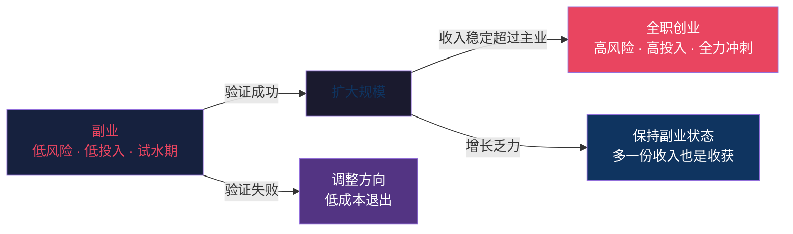
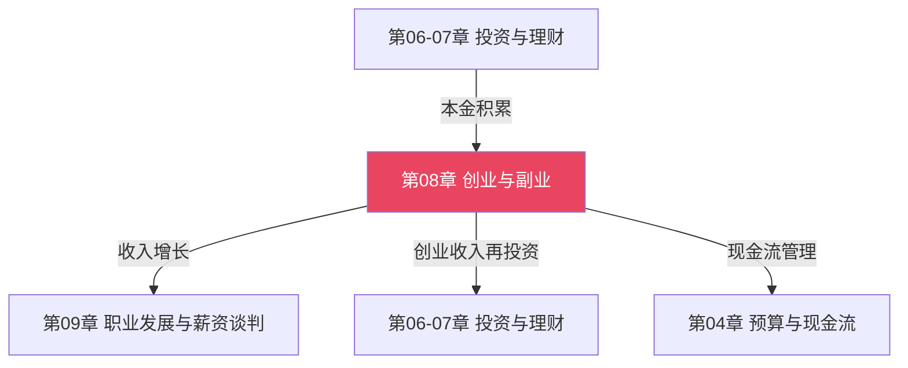
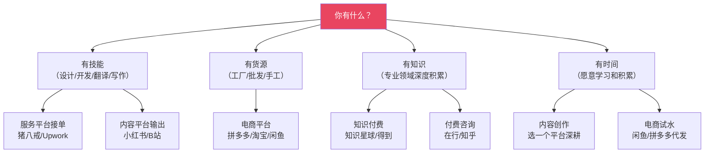
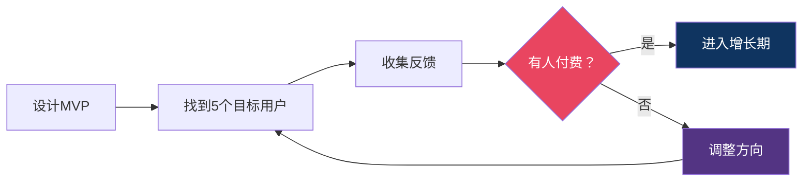

# 第08章 创业与副业

## 一、本章定位：从"被雇佣"到"自雇佣"的认知跃迁

先讲一个残酷的事实：

> 你每天只有24小时。哪怕你把每小时卖出100元（这已经超过了大多数城市的中位工资），一天工作12小时，月收入上限也只有36000元——而这还是税前、不扣社保、没有任何休息日的理想状态。

这就是**时间换钱**模型的天花板。在前面的章节中，我们讨论了如何通过投资让钱生钱，但投资需要本金，而本金的积累速度取决于你的收入结构。本章要解决的核心矛盾是：

> **你的时间是有限的，但你对收入的渴望是无限的。如何突破"用时间换钱"的天花板？**

答案不是"更努力地工作"——而是改变收入的结构。本章讨论两条路径——**创业**和**副业**——它们不是二选一的关系，而是同一个光谱的不同位置：



本章不给你画饼，不讲"人人都能当老板"的鸡汤。我们的目标很实际：**帮你找到适合自己的增收路径，用最低的成本验证想法，用最小的代价避开陷阱。**

### 1.1 本章与其他章节的关系



- **上游依赖**：前面章节帮你建立了财务基础认知——记账、预算、投资。这些能力在创业中直接用于现金流管理。如果你还不了解基本的收支管理，建议先完成第03-04章。
- **下游衔接**：本章创造的收入增长，会反馈到投资章节中形成更大的本金复利。副业收入一旦稳定，你的投资策略可以从"保守积累"转向"主动增值"。
- **并行关系**：职业发展（第09章）和创业/副业可以同步进行。副业本身就是一种职业发展策略——它不仅带来额外收入，还帮你积累商业经验、拓展人脉、提升市场价值。
- **底座关系**：第02章的思维认知是创业的心理基础。很多人创业失败不是因为能力不足，而是因为对风险、概率和期望值的认知偏差。

### 1.2 这一章适合谁？不适合谁？

在开始之前，诚实地评估一下你的情况：

**适合阅读本章的读者：**

| 类型 | 你的状态 | 本章能帮你的核心问题 |
|------|---------|---------------------|
| 想增收但不知从何下手 | 有时间、有意愿，但没有方向 | 找到适合自己的副业方向 |
| 脑中有想法但没行动 | 有模糊的商业想法，一直犹豫 | 用MVP低成本验证想法 |
| 已有副业但收入不理想 | 在做但赚不多，不知道怎么突破 | 优化获客、定价和增长策略 |
| 考虑辞职创业 | 副业有起色，在犹豫是否全职 | 理性评估风险，制定过渡计划 |
| 想了解商业逻辑 | 对"怎么赚钱"这件事好奇 | 建立系统的商业认知框架 |

**本章不适合的情况：**

| 你的状态 | 建议 |
|---------|------|
| 连基本的收支记账都没做到 | 先完成第03-04章，建立财务纪律后再看本章 |
| 负债累累、急需还钱 | 先解决债务问题（参考第05章），创业需要试错成本 |
| 想找"零投入、高回报、躺赚"的项目 | 本章不提供这种内容，这种内容大概率是骗局 |
| 已有成熟企业且年利润>100万 | 本章面向入门到中阶，你的需求更适合专业商业书籍 |

---

## 二、全章知识地图

```mermaid
graph TD
    A["第08章 创业与副业"] --> B["理论基础"]
    A --> C["核心技巧"]
    A --> D["实战案例"]
    A --> E["常见误区"]
    A --> F["练习方法"]
    A --> G["深度拓展"]

    B --> B1["财富创造的本质"]
    B --> B2["创业的关键要素"]
    B --> B3["副业的经济学"]
    B --> B4["创业的心理准备"]
    B --> B5["商业模式设计"]

    C --> C1["发现商业机会<br/>含MVP验证"]
    C --> C2["获客与增长"]
    C --> C3["定价与变现"]
    C --> C4["副业选择框架"]
    C --> C5["创业者财务知识"]
    C --> C6["创业失败防范"]
    C --> C7["副业→创业过渡"]
    C --> C8["创业者时间管理"]

    D --> D1["案例一：自媒体副业"]
    D --> D2["案例二：电商副业"]
    D --> D3["案例三：知识付费"]
    D --> D4["案例四：技术服务"]
    D --> D5["案例五：社群运营"]
    D --> D6["案例六：产品化副业"]
    D --> D7["案例七：AI工具副业"]
    D --> D8["案例八：失败教训"]
    D --> D9["案例总结与教训提炼"]

    E --> E1["思维误区"]
    E --> E2["执行误区"]
    E --> E3["财务误区"]
    E --> E4["心态误区"]

    F --> F1["机会发现练习"]
    F --> F2["需求验证练习"]
    F --> F3["MVP搭建练习"]
    F --> F4["用户获取练习"]
    F --> F5["财务测算练习"]

    G --> G1["精益创业方法论"]
    G --> G2["增长黑客"]
    G --> G3["融资策略"]
    G --> G4["规模化运营"]

    style A fill:#1a1a2e,color:#e94560
    style B fill:#16213e,color:#0f3460
    style C fill:#16213e,color:#0f3460
    style D fill:#16213e,color:#0f3460
    style E fill:#16213e,color:#0f3460
    style F fill:#16213e,color:#0f3460
    style G fill:#16213e,color:#0f3460
```



**知识体系全景**：本章由6大模块、30+个知识节点组成，从认知层（为什么）→方法层（怎么做）→实战层（看案例）→纠偏层（避坑）→训练层（练能力）→进阶层（继续深），形成完整的学习闭环。

---

## 三、2024-2026 创业与副业的宏观环境

在进入具体内容之前，有必要了解当前的商业环境——因为环境决定了什么机会是真实的，什么方向值得投入。

### 3.1 AI重塑创业格局

2023年以来，大语言模型（LLM）和生成式AI的爆发式发展正在深刻改变创业和副业的游戏规则：

| 变化维度 | 过去 | 现在 | 对创业者的影响 |
|---------|------|------|---------------|
| 产品开发成本 | 需要技术团队，开发周期数月 | 一人+AI工具可完成原型，周期缩短到数天 | 个人创业的技术门槛大幅降低 |
| 内容创作成本 | 需要专业团队或大量个人时间 | AI辅助创作效率提升5-10倍 | 内容型副业的启动速度加快 |
| 客服与运营 | 需要专职人员 | AI客服+自动化工具可覆盖80%常规需求 | 一人公司可服务更多客户 |
| 竞争壁垒 | 信息差、技术差 | AI拉平了信息和技术差距 | 纯技术/信息差的护城河在消失，个性化服务和深度认知的壁垒在加强 |
| 设计能力 | 需要专业设计师 | Midjourney/DALL-E可生成商用级图片 | 个人品牌视觉门槛归零 |
| 数据分析 | 需要数据分析师 | AI可完成80%的数据清洗、可视化和初步分析 | 小团队也能做数据驱动决策 |

**关键判断**：AI不是取代创业者，而是放大了个人能力的杠杆。一个懂得善用AI工具的个体，可以做到过去需要一个小团队才能完成的工作。但同时，AI也让"做得更好"的标准提高了——因为你的竞争对手也在用AI。

**AI创业的具体机会窗口（2024-2026）：**

| 机会方向 | 具体形态 | 门槛 | 收入预期 | 持续性 |
|----------|---------|------|---------|--------|
| AI效率工具定制 | 帮中小企业搭建AI客服、AI文案、AI数据分析流程 | 需了解主流AI API | 5000-30000元/项目 | ★★★★ 需求持续增长 |
| AI内容工厂 | 用AI批量生产SEO文章、短视频脚本、产品描述 | 低，需掌握prompt工程 | 月入5000-20000元 | ★★★ 内容同质化风险 |
| AI培训与咨询 | 教传统行业从业者使用AI工具 | 需有教学能力和行业经验 | 月入10000-50000元 | ★★★★ 知识差仍在 |
| AI+垂直行业 | 将AI嵌入特定行业流程（法律、医疗、教育） | 需有行业背景 | 收入上限高，启动周期长 | ★★★★★ 深度壁垒 |

### 3.2 平台经济与个体崛起

当前中国创业环境的一个显著特征是**平台赋能个体**：

| 平台类型 | 代表平台 | 个体可以做什么 | 收入模式 | 冷启动难度 |
|---------|---------|--------------|---------|-----------|
| 内容平台 | 抖音、B站、小红书、微信公众号 | 创作内容、积累粉丝、广告/带货变现 | 广告分成、带货佣金、品牌合作 | ★★★ 需要持续产出 |
| 电商平台 | 拼多多、淘宝、1688、闲鱼 | 选品销售、一件代发、二手交易 | 进销差价、代发佣金 | ★★ 资金门槛低 |
| 知识平台 | 得到、知乎、知识星球、飞书文档 | 课程销售、付费咨询、社群运营 | 课程收入、会员费、咨询费 | ★★★ 需要专业积累 |
| 服务平台 | 猪八戒、Upwork、Fiverr | 接单提供设计/开发/翻译等服务 | 项目服务费 | ★★ 技能即可变现 |
| 本地生活 | 美团、大众点评、抖音本地生活 | 本地服务、门店引流 | 服务收入、团购佣金 | ★★★★ 需要本地资源 |
| 小程序/私域 | 微信小程序、企业微信 | 构建自有用户池，直接触达 | 会员费、复购、裂变 | ★★★★ 运营要求高 |

平台经济的核心逻辑是：**平台提供流量和基础设施，你提供价值**。对创业者来说，选择合适的平台作为起步阵地，可以大幅降低冷启动难度。

**平台选择的决策逻辑：**



### 3.3 经济周期与创业时机

2024-2026年，中国经济处于结构调整期。这对创业和副业有双重影响：

**不利因素：**
- 消费降级趋势下，高客单价业务承压
- 部分行业（地产、教培、互联网）裁员潮导致竞争加剧
- 融资环境偏紧，纯烧钱模式不可持续
- 就业市场竞争激烈，"副业刚需"人群增加导致各赛道拥挤度上升

**有利因素：**
- 降本增效成为企业刚需，To B服务（帮企业省钱/提效）需求旺盛
- 灵活就业和零工经济被政策鼓励
- AI工具降低了创业门槛，个人能力杠杆放大
- 消费者更理性，真正解决问题的产品反而更容易获得信任
- 国内消费市场依然庞大，细分需求和长尾市场有大量空白

**核心结论**：在经济下行期创业，关键词是**低成本、快验证、现金流优先**。不要做大投入、长周期的项目，而要做轻启动、快速见到收入的事情。本章的核心技巧篇正是围绕这个原则设计的。

### 3.4 不同城市的创业机会差异

| 城市类型 | 优势领域 | 适合的副业/创业方向 | 需要注意的 |
|----------|---------|-------------------|-----------|
| 一线城市（北上广深） | 信息前沿、人才密集、资本集中 | AI工具、跨境、知识付费、高端服务 | 竞争激烈，生活成本高，副业时间被通勤挤压 |
| 新一线/二线（杭州/成都/武汉等） | 互联网氛围好、成本较低、人才回流 | 电商、内容创作、本地生活服务 | 市场规模有限，需要向全国拓展 |
| 三四线城市 | 生活成本低、竞争较小、本地需求未被满足 | 本地服务、社区团购、下沉市场电商 | 消费能力有限，线上获客需全国视野 |
| 县城/乡镇 | 房租极低、熟人社会信任成本低 | 农产品电商、本地生活、技能培训 | 市场天花板低，需要突破地理限制 |

**关键启示**：不要用一线城市的视角看全国市场。很多在一线城市已经红海的服务，在三四线城市还是蓝海。反过来，很多在小城市做不了的事（比如高端咨询），在线上可以面向全国做。

---

## 四、全章知识地图（详细导读）

### 4.1 理论基础篇（5节）

这是整章的认知地基。如果你跳过理论直接看"怎么做"，大概率会踩坑——因为你不知道**为什么要这么做**。

| 小节 | 核心问题 | 关键概念 | 预计阅读 |
|------|----------|----------|----------|
| 财富创造的本质 | 为什么创业的收入上限远高于打工？ | 四种收入来源（时间→技能→产品→资本）、指数增长vs线性增长、收入天花板理论 | 20分钟 |
| 创业的关键要素 | 一个商业系统由哪些零件组成？ | 产品-市场-客户-商业模式-团队-资金六要素模型、TAM/SAM/SOM市场评估 | 25分钟 |
| 副业的经济学 | 副业和创业到底有什么区别？我该选哪个？ | 副业三种类型（技能变现/内容创作/产品服务）、时间投资回报率、副业选择决策树 | 20分钟 |
| 创业的心理准备 | 我真的准备好了吗？ | 创业者核心特质、四大代价（时间/财务/心理/关系）、自评框架、配偶/家庭影响评估 | 25分钟 |
| 商业模式设计 | 怎么把一个好点子变成一个赚钱的系统？ | 商业模式画布9要素、六种常见模式、可盈利性检验、护城河构建 | 30分钟 |

**阅读建议：** 即使你已经在做副业或创业，也建议通读理论基础。很多人创业失败不是因为"不会做"，而是因为对商业的基本逻辑理解有偏差。以下是最常见的认知偏差：

| 认知偏差 | 错误逻辑 | 正确认知 | 典型后果 |
|----------|----------|----------|---------|
| "有人需要"="有人付钱" | 我觉得这个需求很大 | 需求≠付费意愿，必须验证付费行为 | 做了没人买的产品，浪费3-6个月 |
| "做出来了"="有人会买" | 产品功能很完善 | 产品≠商品，没有渠道和信任就没有成交 | 技术上成功但商业上失败 |
| "市场很大"="我能做大" | 几千亿的市场分一小块 | TAM和SOM之间可能差1000倍 | 融资时画大饼，运营时发现市场不存在 |
| "别人赚到钱了"="我也能赚" | 看到同行很赚钱 | 幸存者偏差，你看不到失败的90% | 盲目跟风，复制了一个已经红海的赛道 |
| "先做再说"="敏捷创业" | 不想那么多直接干 | 没有验证的投入是赌博，不是创业 | 花光积蓄后才发现方向错了 |
| "好产品会自己说话" | 只要产品好自然有客户 | 酒香也怕巷子深，营销是独立能力 | 产品做得不错但没人知道 |
| "我不需要懂财务" | 会赚钱就行 | 不懂财务等于蒙眼开车 | 利润率看着不错，现金流却断裂了 |

### 4.2 核心技巧篇（8节）

这是从"知道"到"做到"的桥梁。每一节都对应创业/副业过程中的一个关键决策点。

| 小节 | 你将学会 | 实操产出 |
|------|----------|----------|
| 发现商业机会 | 用四个视角系统性地寻找机会，而不是靠灵感；MVP验证方法 | 机会评估清单（6维度评分表）、5种MVP类型选择指南 |
| 获客与增长 | 免费和付费获客渠道的完整图谱 | 获客成本计算公式、渠道选择矩阵 |
| 定价与变现 | 定价心理学和六种定价策略 | 定价计算模板、利润测算表 |
| 副业选择框架 | 根据你的时间、技能、资源选择最匹配的副业 | 副业匹配评分卡 |
| 创业者必知的财务知识 | 看懂三张表、管好现金流 | 简化版财务报表模板 |
| 创业失败的常见原因及防范 | 前人踩过的坑，你可以绕过去 | 风险检查清单 |
| 从副业到创业的过渡策略 | 什么时候可以辞职？怎么平稳过渡？ | 过渡决策框架（收入/时机/资源三维度） |
| 创业者的时间管理 | 在有限的时间里做最重要的事 | 每周时间分配模板 |

**阅读建议：** 这8节不是线性关系，而是网状关系。你可以根据自己的阶段选择阅读：

| 你的阶段 | 推荐阅读顺序 | 原因 |
|----------|-------------|------|
| 还在观望 | 发现商业机会 → 副业选择框架 → 定价与变现 | 先建立方向感，知道做什么、怎么赚钱 |
| 已有想法 | 发现商业机会（MVP部分）→ 定价与变现 → 获客与增长 | 重点是验证和找到第一批客户 |
| 已在执行 | 获客与增长 → 创业者财务知识 → 定价与变现 | 重点是扩大收入和管好钱 |
| 考虑全职 | 副业到创业的过渡 → 创业失败防范 → 创业者时间管理 | 重点是决策质量和风险控制 |

### 4.3 实战案例篇（9+2节）

案例是本章最有价值的部分——因为**商业知识最好的学习方式是看别人怎么做成的（和怎么失败的）**。

我们收录了8个真实案例，覆盖当前最主流的创业和副业路径：

| 案例 | 路径类型 | 核心亮点 | 适合人群 | 难度 |
|------|----------|----------|----------|------|
| 自媒体副业：从公众号到年入百万 | 内容创作型 | 长期主义、内容复利、流量变现闭环 | 有写作/表达能力的人 | ★★★ |
| 电商副业：从1688到月入5万 | 产品销售型 | 供应链管理、选品逻辑、平台运营 | 有商业嗅觉的人 | ★★★★ |
| 知识付费：从专业技能到课程收入 | 知识变现型 | 课程设计、信任建设、复购机制 | 有专业技能的人 | ★★★ |
| 技术服务副业：程序员的外包之路 | 技能变现型 | 客户管理、定价策略、规模化接单 | 有技术能力的人 | ★★ |
| 社群运营：从微信群到付费社区 | 社群变现型 | 社群运营、会员制设计、内容沉淀 | 有社交资源的人 | ★★★ |
| 产品化副业：从手工到品牌 | 产品品牌型 | 从副业到品牌的跃迁、品牌溢价 | 有手工艺/创作能力的人 | ★★★★ |
| AI工具副业：从ChatGPT到月入3万 | 工具驱动型 | AI红利、效率杠杆、快速变现 | 愿意学习新工具的人 | ★★ |
| 失败案例：小马的咖啡店 | 反面教材 | 情怀创业的典型失败、成本失控 | 所有人 | —— |

此外还有两个综合分析：
- **案例总结**：横向对比所有成功案例的共性规律——你会发现成功路径虽不同，但底层逻辑惊人地一致
- **从失败案例中学到的教训**：提炼可操作的风险规避策略

**阅读建议：** 不要只看你感兴趣的案例。失败案例往往比成功案例更有价值——成功的原因千千万，失败的原因来来去去就那几个。建议按以下顺序阅读：

1. 先读失败案例（案例八）→ 建立风险意识
2. 读与你最匹配的2个成功案例 → 看到可能性
3. 读案例总结 → 提炼共性规律
4. 读其余案例 → 拓宽视野

### 4.4 常见误区篇

创业和副业中有大量"听起来很对但实际害死人"的观念。本节逐个拆解，每个误区都包含：

- **误区描述**：为什么很多人相信这个（往往是因为它"部分正确"）
- **真实情况**：数据和逻辑怎么说
- **正确做法**：你应该怎么做
- **纠正方法**：如果你已经踩坑了，怎么爬出来

本节覆盖四大类误区：

| 误区类别 | 典型误区举例 | 后果 | 高频程度 |
|----------|-------------|------|---------|
| 思维误区 | "好产品自己会说话" | 有产品没流量，酒香也怕巷子深 | ★★★★★ |
| 执行误区 | "先做完美再发布" | 永远在准备，永远没开始 | ★★★★ |
| 财务误区 | "前期亏钱很正常" | 现金流断裂，项目死在黎明前 | ★★★★ |
| 心态误区 | "创业就要all in" | 赌上全部身家，一次失败万劫不复 | ★★★ |

### 4.5 练习方法篇

光看不练等于没看。本节提供一套渐进式练习，每个练习都有明确的输入、输出和验收标准：

| 练习 | 目标 | 时间 | 验收标准 | 成本 |
|------|------|------|----------|------|
| 机会发现练习 | 用四个视角在一周内找到10个商业机会 | 7天 | 产出10个机会，每个都有需求描述和目标用户 | 0元 |
| 需求验证练习 | 选一个机会，用72小时验证它是否真实 | 3天 | 至少与5个潜在用户对话，获得付费意愿反馈 | 0-100元 |
| MVP搭建练习 | 用最低成本做出一个可测试的产品原型 | 7天 | 产出一个可展示的MVP，成本<500元 | 0-500元 |
| 用户获取练习 | 找到前10个付费用户 | 14天 | 至少3人实际付费（无论金额大小） | 0-1000元 |
| 财务测算练习 | 算清楚你的商业模式能不能赚钱 | 1天 | 产出一份包含成本、收入、利润的简易财务模型 | 0元 |

**关键原则**：这5个练习的总投入不超过1600元。如果一个商业想法连1600元的验证成本都不值得投入，那它大概率不值得做。反过来，如果你花了几万元还没有验证出结果，说明你的验证方法有问题。

### 4.6 深度拓展篇

为已完成基础学习的读者准备的进阶内容：

| 主题 | 核心内容 | 前置要求 |
|------|----------|----------|
| 精益创业方法论 | Build-Measure-Learn循环、假设验证、转型决策 | 完成MVP搭建练习 |
| 增长黑客 | 增长飞轮、病毒系数、北极星指标、A/B测试 | 已有10+付费用户 |
| 融资策略 | 天使轮/种子轮/Pre-A的准备、BP撰写、估值谈判 | 月收入>5万或用户>1000 |
| 规模化运营 | 团队搭建、流程标准化、组织架构设计 | 年收入>50万或团队>3人 |

---

## 五、核心问题框架

本章围绕以下问题层层展开。你可以在阅读过程中随时对照，检查自己是否找到了答案：

### 第一层：自我评估（我该不该做？）

| 问题 | 判断维度 | 找到答案的位置 |
|------|----------|----------------|
| 我适合创业吗？ | 特质、财务、心理、家庭 | 理论基础 > 创业的心理准备 |
| 我应该先做副业还是直接创业？ | 风险承受、财务缓冲、想法成熟度 | 理论基础 > 副业的经济学 |
| 我的性格适合做哪类副业？ | 技能、时间、资源、偏好 | 核心技巧 > 副业选择框架 |

### 第二层：方向选择（做什么？）

| 问题 | 判断维度 | 找到答案的位置 |
|------|----------|----------------|
| 商业机会从哪里找？ | 痛点、技能、趋势、市场 | 核心技巧 > 发现商业机会 |
| 怎么判断一个机会值不值得做？ | 需求真实性、市场规模、竞争 | 核心技巧 > 发现商业机会（机会评估清单） |
| 怎么区分真需求和伪需求？ | 付费意愿、现有替代方案 | 核心技巧 > 发现商业机会（MVP验证） |

### 第三层：执行落地（怎么做？）

| 问题 | 判断维度 | 找到答案的位置 |
|------|----------|----------------|
| 怎么用最少的钱验证想法？ | MVP类型选择、验证指标 | 核心技巧 > 发现商业机会（MVP部分） |
| 怎么定价？ | 成本、价值、竞争、心理 | 核心技巧 > 定价与变现 |
| 怎么找到第一批客户？ | 渠道、内容、社群、口碑 | 核心技巧 > 获客与增长 |
| 怎么管好钱？ | 现金流、成本控制、财务报表 | 核心技巧 > 创业者财务知识 |

### 第四层：规模化与转型（怎么做得更大？）

| 问题 | 判断维度 | 找到答案的位置 |
|------|----------|----------------|
| 什么时候可以从副业转全职？ | 收入稳定性、增长趋势、资源 | 核心技巧 > 副业到创业的过渡 |
| 怎么避免常见的失败原因？ | 现金流、市场验证、团队 | 核心技巧 > 创业失败防范 |
| 怎么管理创业中的时间？ | 优先级、精力分配、效率 | 核心技巧 > 创业者时间管理 |
| 怎么处理创业中的心理压力？ | 孤独感、不确定性、失败恐惧 | 理论基础 > 创业的心理准备 |

---

## 六、学习路径推荐

不同背景的读者适合不同的阅读顺序：

### 路径A：零基础探索者（没有创业/副业经验）

```text
理论基础（全部） → 副业选择框架 → 发现商业机会 → 练习方法
→ 实战案例（选择2-3个与自己匹配的） → 常见误区 → 深度拓展
```

预计用时：2周（每天1-2小时）

**里程碑检查：** 完成路径A后，你应该能回答以下问题：
- 我适合做哪类副业？（给出具体方向）
- 我的第一个副业机会是什么？（给出机会描述）
- 我的验证计划是什么？（给出72小时行动计划）

### 路径B：有想法但未行动者（脑子里有方向但没开始）

```text
发现商业机会（重点MVP部分） → 定价与变现 → 获客与增长
→ 实战案例（同类型案例） → 副业选择框架 → 练习方法
```

预计用时：1.5周

**里程碑检查：** 完成路径B后，你应该能回答以下问题：
- 我的MVP是什么形态？（服务型/内容型/Landing Page型等）
- 我的定价是多少？（有计算依据）
- 我的第一批客户从哪里来？（列出3个具体渠道）

### 路径C：已在执行的副业者（有收入但不理想）

```text
获客与增长 → 定价与变现 → 创业者财务知识 → 副业到创业的过渡
→ 案例总结 → 失败案例教训 → 创业失败防范
```

预计用时：1周

**里程碑检查：** 完成路径C后，你应该能回答以下问题：
- 我的获客瓶颈在哪里？（找到卡点）
- 我的定价是否合理？（做一次定价审计）
- 我的财务状况健康吗？（算清利润率和现金流）

### 路径D：考虑全职创业者（想辞职创业）

```text
创业的心理准备 → 副业到创业的过渡 → 创业失败防范 → 创业者财务知识
→ 创业者时间管理 → 失败案例教训 → 深度拓展
```

预计用时：1周

**里程碑检查：** 完成路径D后，你应该能回答以下问题：
- 我辞职创业的风险有多大？（用过渡决策框架评估）
- 我准备好了哪些条件？还缺哪些？（逐项检查）
- 我的失败退出方案是什么？（最坏情况预案）

---

## 七、关键数据与现实检验

在开始学习之前，请先建立以下基本认知——这些数据来自国家统计局、工商总局和第三方研究机构：

### 7.1 创业成功率数据

| 指标 | 数据 | 来源 | 启示 |
|------|------|------|------|
| 中国企业5年存活率 | 不到7% | 国家工商总局 | 100家创业公司，5年后只剩7家——这不是吓你，是提醒你做好准备 |
| 个体工商户年注销率 | 约15-20% | 国家统计局 | 小生意的风险也不低，选对方向比盲目开始更重要 |
| 创业者平均首次成功年龄 | 35-45岁 | 哈佛商业评论 | 年轻不是优势，经验和资源才是——不必急于一时 |
| 副业转全职的平均过渡期 | 12-18个月 | 独立调研 | 至少给自己一年的缓冲期，不要冲动辞职 |
| 副业月收入超过主业所需时间 | 6-24个月（因行业差异大） | 综合估算 | 这是一个马拉松，不是百米冲刺 |

### 7.2 创业失败原因分析

| 排名 | 失败原因 | 占比 | 来源 | 本章对应解决方案 |
|------|----------|------|------|------------------|
| 1 | 产品没有市场需求 | 42% | CB Insights | 核心技巧 > 发现商业机会（需求验证） |
| 2 | 现金流断裂 | 29% | CB Insights | 核心技巧 > 创业者财务知识 |
| 3 | 团队问题 | 23% | CB Insights | 理论基础 > 创业的关键要素（团队部分） |
| 4 | 被竞争对手击败 | 19% | CB Insights | 核心技巧 > 发现商业机会（竞争分析） |
| 5 | 定价/成本问题 | 18% | CB Insights | 核心技巧 > 定价与变现 |
| 6 | 产品不够好 | 17% | CB Insights | 核心技巧 > 发现商业机会（MVP迭代） |
| 7 | 缺乏商业模式 | 17% | CB Insights | 理论基础 > 商业模式设计 |
| 8 | 营销不佳 | 14% | CB Insights | 核心技巧 > 获客与增长 |
| 9 | 忽视客户 | 14% | CB Insights | 实战案例 > 所有成功案例的共性 |
| 10 | 时机不对 | 13% | CB Insights | 核心技巧 > 发现商业机会（趋势判断） |

**这些数据不是为了吓你，而是为了让你做出理性决策。** 创业和副业都是可行的财富增长路径，但前提是你带着清醒的认知上路，而不是带着幻想。

### 7.3 副业收益的合理预期

| 副业类型 | 第1个月 | 第6个月 | 第12个月 | 第24个月 | 关键成功因素 |
|----------|---------|---------|----------|----------|-------------|
| 技能变现型（接单） | 500-3000元 | 3000-10000元 | 5000-20000元 | 10000-50000元 | 获客渠道稳定、口碑积累 |
| 内容创作型（自媒体） | 0-100元 | 200-2000元 | 1000-10000元 | 5000-50000元 | 持续输出、找到差异化定位 |
| 产品销售型（电商） | 1000-5000元 | 5000-20000元 | 10000-50000元 | 20000-100000元 | 选品能力、供应链管理 |
| 知识付费型（课程） | 0-500元 | 1000-5000元 | 3000-20000元 | 10000-80000元 | 专业深度、信任建设 |
| AI工具型 | 500-3000元 | 3000-15000元 | 8000-30000元 | 15000-60000元 | 工具掌握速度、场景落地能力 |

> **说明：** 以上数据为行业中位数估算，个体差异极大。影响收益的关键因素：执行力、选对方向、持续投入时间、学习迭代速度。收入波动是正常的——不要因为某个月收入下降就否定整个方向。

**收益预期的校准方法：**

很多新手容易被"月入十万"的案例吸引，但那些是极端值，不是中位数。校准你预期的三个方法：

1. **找到10个同类型从业者的真实收入数据**（不是晒出来的，是私下交流的）。如果中位数是月入5000元，就按5000元做规划，不要按最高的那个做预期。
2. **计算你的"生存线"**：副业收入至少要覆盖你投入的时间成本（按你的时薪计算）。如果投入100小时只赚了500元，相当于时薪5元——这不值得继续。
3. **设定"及格线"和"优秀线"**：及格线是"覆盖成本+合理报酬"，优秀线是"超过主业收入50%"。达到及格线就继续，达不到就调整方向。

---

## 八、创业的代价与心理准备

很多创业指南只讲"怎么赚钱"，不讲"赚钱的代价"。这是不负责任的。在开始之前，你必须了解创业和副业的真实代价：

### 8.1 四大代价

| 代价类型 | 具体表现 | 副业场景 | 全职创业场景 |
|---------|---------|---------|-------------|
| 时间代价 | 几乎所有业余时间被占用 | 每天1-3小时，周末更多 | 每天10-16小时，无明确下班时间 |
| 财务代价 | 前期投入+收入不稳定 | 投入数百到数千元 | 可能数月无收入，需6-12个月财务缓冲 |
| 心理代价 | 焦虑、自我怀疑、孤独感 | 偶尔焦虑，主业保底 | 持续高压，决策疲劳，自我否定周期 |
| 关系代价 | 陪伴家人时间减少 | 影响较小 | 可能引发家庭矛盾，配偶不理解 |

**每个代价的真实面貌：**

**时间代价**不只是"少了一些娱乐时间"。它意味着你下班后不再有真正的休息——你的大脑会持续在"副业模式"运转。三个月后你可能发现自己很久没有完整地看完一部电影、很久没有和朋友无目的地闲聊。这种持续的"在线状态"如果不加管理，会导致慢性疲劳和效率下降。

**财务代价**不只是"投入一些启动资金"。更隐蔽的代价是**机会成本**——你投入副业的时间，本可以用来加班赚取确定的收入、学习提升主业技能、或者陪伴家人。如果副业半年没有起色，你损失的不只是投入的钱，还有这些被挤占的机会。

**心理代价**中最难熬的不是焦虑本身，而是**不确定性**。打工时你知道这个月15号会发工资；创业时你不知道下个月有没有收入。人类大脑对不确定性的恐惧远大于对确定性损失的恐惧——这是进化遗留的本能，你需要有意识地对抗它。

**关系代价**往往被低估。当你周末在电脑前忙副业、而伴侣在独自带孩子时，矛盾的种子就种下了。很多创业者的婚姻出问题，不是因为赚不到钱，而是因为忽略了沟通和陪伴。

### 8.2 创业者的心理韧性清单

在开始之前，诚实地回答以下问题：

- [ ] 你能接受连续3个月没有收入吗？（心理上和财务上）
- [ ] 你能接受身边的人不理解你在做什么吗？
- [ ] 你能接受花了半年做出来的东西没人要吗？
- [ ] 你在压力下是更容易崩溃还是更专注？
- [ ] 你有没有至少一个可以倾诉的人（不是合伙人）？
- [ ] 你能接受"被拒绝"吗？被客户拒绝、被平台拒绝、被投资人拒绝？
- [ ] 你能在没有外部监督的情况下保持自律吗？

如果前三个问题中有两个回答"不能"，建议从副业开始，而不是直接创业。副业的好处是：**主业给你兜底，副业给你试错空间**。

**心理韧性的培养方法：**

心理韧性不是天生的，可以训练。以下是三种经过验证的方法：

1. **预演最坏情况**：花30分钟，认真写下"如果副业完全失败，最坏会怎样？"。你会发现大多数最坏情况其实没有想象中那么可怕——你还有主业、还有存款、还有家人。当你把最坏情况具体化，恐惧感会显著降低。

2. **建立"情绪缓冲区"**：找一个与创业无关的爱好（运动、读书、音乐），每周固定投入3-4小时。这不是浪费时间，而是防止你的全部情绪都被创业的起伏绑架。很多创业者崩溃不是因为生意失败，而是因为他们把所有鸡蛋放在了"创业"这一个篮子里——包括情绪。

3. **找到"同行者社群"**：加入创业者社群（免费的有很多），每周和至少一个同行交流。你会发现你的焦虑和困惑不是你独有的，别人的应对方法也可以借鉴。孤独是创业者最大的敌人之一。

### 8.3 家庭沟通框架

创业不是一个人的事。如果你有伴侣或家庭责任，以下沟通框架可以帮助你获得支持：

**沟通三步法：**

1. **展示安全性**：先说明你不是要辞职，而是在主业之外做一件事，风险可控
2. **给出时间线**：比如"我给自己6个月时间，如果月收入达不到X元，我就调整方向"
3. **设定止损点**：明确最大投入金额和时间，让家人知道最坏情况也不过如此

**沟通模板：**

> "我想在工作之余做一件XX方面的事，大概每天花1-2小时。前3个月的投入不超过XX元。如果3个月后没有起色，我会重新评估。你觉得呢？"

**沟通中的常见错误：**

| 错误做法 | 为什么错 | 正确做法 |
|----------|---------|---------|
| 先斩后奏，做了再说 | 破坏信任，后续沟通更难 | 先沟通再行动，让家人参与决策 |
| 过度乐观地描述前景 | "月入十万很快就能实现"——做不到时信任崩塌 | 给出保守预期，超预期时家人更支持 |
| 忽视家人的顾虑 | 家人担心的往往不是钱，而是你的状态和陪伴 | 认真倾听顾虑，给出具体应对方案 |
| 不设止损点 | 家人不知道"什么时候是个头" | 明确说"最多投入X元/X月" |
| 在家人面前抱怨压力 | 会让家人更加反对 | 找同行社群倾诉，在家里展现积极面 |

**如果家人反对怎么办？**

首先理解：家人的反对通常出于关心，而不是不支持你。他们的核心顾虑是：
- 你会不会把家里的钱都投进去？
- 你还有时间陪我和孩子吗？
- 如果失败了怎么办？

针对这些顾虑，用具体方案回应：
- "我只投入X元，不动用家庭储蓄"
- "我每天只在孩子睡后工作1-2小时，周末至少留一天给家人"
- "如果6个月没有达到X收入，我就停止"

用行动建立信任比用言语说服更有效。前3个月的小成果（哪怕只是"找到了3个潜在客户"）比任何承诺都有说服力。

---

## 九、法规与合规提醒

创业和副业涉及法律和税务问题，以下是必须了解的基本红线。注意：本节提供的是常识性框架，具体问题请咨询专业人士。

### 9.1 注册与资质

| 经营形态 | 注册要求 | 适用场景 | 注意事项 | 年度维护成本 |
|----------|----------|----------|----------|-------------|
| 个人（不注册） | 无需注册 | 偶尔接单、小额收入 | 年收入超过一定额度需申报个税 | 0元 |
| 个体工商户 | 工商登记 | 持续经营的小生意 | 需要办理营业执照，可选择核定征收 | 500-2000元 |
| 个人独资企业 | 工商登记 | 有一定规模的个人经营 | 需要建账，查账征收 | 3000-8000元 |
| 有限公司 | 工商登记+注册资本 | 需要融资、合伙经营 | 需要记账报税，注册资本认缴制 | 5000-15000元 |

**什么时候需要注册？** 一般来说，当你的副业月收入稳定超过5000元，或者需要开发票、签合同时，就该考虑注册个体工商户了。注册个体工商户的门槛很低（很多城市可以网上办理），但能解决发票和合规问题。

**注册个体工商户的具体流程：**

1. **核名**：在当地市场监管局网站查询名称是否可用（30分钟）
2. **提交材料**：身份证、经营场所证明（自有房产证或租赁合同）、经营范围说明（部分城市支持线上全流程）
3. **领取执照**：审核通过后1-3个工作日领取（部分城市当天出证）
4. **刻章**：公章、财务章、法人章（约200-500元）
5. **银行开户**：开对公账户（部分银行免费，部分收取年费200-500元）
6. **税务登记**：在税务局完成登记，选择征收方式（核定征收或查账征收）

总耗时：顺利的话3-5个工作日。总费用：500-1500元（含刻章和开户）。

### 9.2 税务红线

| 项目 | 说明 | 实操要点 |
|------|------|---------|
| 个人所得税 | 所有收入都需要申报，劳务报酬税率20%-40% | 平台代扣的是预缴，年度汇算可能退税或补税 |
| 增值税 | 小规模纳税人月销售额10万以下免征（2024年政策） | 免征≠不申报，仍需按时做零申报 |
| 个体工商户 | 可选择核定征收，税负较低 | 核定征收政策因地区而异，需咨询当地税务局 |
| 发票问题 | 收入达到一定规模必须开具发票 | 不要用个人账户收款避税，银行大数据监管越来越严 |

> **重要提醒：** 本章不提供税务筹划建议，具体税务问题请咨询专业会计师。但有一条底线：**合法纳税是经营的基本前提**，偷税漏税的后果远比多交的税严重。2023年金税四期上线后，个人账户的大额交易会被自动监控。

**副业者最容易踩的税务坑：**

| 坑 | 具体表现 | 正确做法 |
|----|---------|---------|
| 不知道要申报 | 觉得"小钱不用报" | 所有收入都需要申报，平台代扣的只是预缴 |
| 混淆个人和经营账户 | 用个人微信/支付宝收经营款项 | 注册后使用对公账户，个人和经营分开 |
| 忽略年度汇算 | 平台代扣后就不管了 | 每年3-6月做个人所得税年度汇算，可能退税 |
| 用个人账户避税 | 让客户打到个人卡上不开发票 | 金税四期下风险极高，得不偿失 |

### 9.3 合同与法律风险

| 场景 | 风险点 | 建议措施 |
|------|--------|---------|
| 接单服务 | 客户赖账、需求无限膨胀 | 签书面合同/协议，明确交付物、修改次数、付款节点 |
| 合伙经营 | 利益分配、退出机制不明确 | 合伙协议必须写清楚出资比例、分工、分红、退出条件 |
| 用工关系 | 兼职人员受伤、劳务纠纷 | 了解劳动法和劳务关系的区别，必要时购买雇主责任险 |
| 代理/分销 | 产品质量问题被追责 | 确认供应商资质，保留进货凭证，了解产品质量法 |
| 内容创作 | 侵权、名誉权纠纷 | 使用正版素材，不造谣不传谣，了解平台规则 |

**接单服务合同的关键条款清单：**

很多副业者第一次接单时不知道合同该写什么。以下是必须包含的条款：

1. **项目范围**：明确列出你要做什么（"做一个网站"太模糊，应该是"包含5个页面、后台管理系统、移动端适配"）
2. **交付标准**：怎样算"完成"？需要客户确认验收吗？
3. **修改次数**：明确"包含X次修改，超出部分按Y元/次收费"。不写这条，需求会无限膨胀
4. **付款方式**：建议50%预付+50%验收后付。绝不要"做完再付"
5. **时间节点**：明确开始日期、交付日期、各阶段里程碑
6. **知识产权**：交付后源码/素材的归属（通常归客户，但可以保留作品展示权）
7. **违约责任**：双方违约的处理方式

**推荐工具**：合同模板可以在"法大大"、"e签宝"等平台获取基础版本，根据业务特点修改。

### 9.4 知识产权保护

| 场景 | 建议措施 | 成本 |
|------|----------|------|
| 你创作的内容（文章、视频、课程） | 保留创作记录和时间戳，必要时做版权登记 | 版权登记约300元/件 |
| 你的品牌名称和logo | 及时注册商标，避免做大后被抢注 | 商标注册约300元/类 |
| 你的技术方案或产品设计 | 核心技术申请专利或保密协议保护 | 专利申请数千到上万元 |
| 使用他人的素材 | 确保有合法授权，避免侵权纠纷 | 使用正版素材库或CC0协议素材 |
| 你的客户数据和商业秘密 | 与员工/合伙人签订保密协议（NDA） | 律师起草约500-2000元 |

**关于商标注册的实用建议：**

商标是副业者最容易忽视、但后悔最多的法律事项。很多案例是：做到月入几万了，发现品牌名被人注册了商标，不得不改名重来。

- **何时注册**：当你确定要长期经营某个品牌时，就该注册。不用等做大了再说
- **注册范围**：至少覆盖你直接相关的2-3个类别。比如做线上课程，至少注册第41类（教育）和第9类（软件）
- **流程**：商标局官网提交→形式审查→实质审查→公告→拿证，全程约9-12个月
- **费用**：官费270元/类（网上申请），代理费另计
- **注意事项**：先查重再申请。商标局官网有免费查询工具，确保你的品牌名没有在先注册

### 9.5 平台规则与账号安全

如果你的创业/副业依赖某个平台（抖音、淘宝、微信公众号等），务必了解：

- **平台规则是"法律"**：平台封号=业务归零，这比法律纠纷更常见、更致命
- **不要把所有鸡蛋放在一个篮子里**：依赖单一平台风险极高，尽量建立私域流量
- **规则会变**：今天可以做的推广方式，明天可能被封杀，保持对规则变化的敏感度
- **备份一切**：客户数据、内容素材、账号信息，不要只存在平台内

**平台封号的常见原因和预防：**

| 封号原因 | 具体行为 | 预防措施 |
|----------|---------|---------|
| 引流到私域 | 在平台内发微信号、二维码 | 用平台允许的方式（如抖音的企业号私信功能） |
| 虚假宣传 | 夸大产品效果、虚假好评 | 如实描述，用真实案例和数据说话 |
| 侵权内容 | 未授权使用他人图片、音乐、文字 | 使用原创素材或正版授权素材 |
| 刷量作弊 | 买粉、刷赞、互赞群 | 踏实做内容，刷量的账号迟早被清理 |
| 违规营销 | 在不允许推广的场景做推广 | 仔细阅读平台营销规范，按规则来 |
| 频繁违规 | 多次小违规累积 | 每次违规都要重视，不要抱侥幸心理 |

---

## 十、启动路线图

如果你读完本章概览后决定行动，以下是一个分阶段的启动路线图。每个阶段都有明确的时间、投入和产出预期：

### 阶段零：准备期（第1-2周）


**时间投入：** 每天1-2小时，共计10-15小时
**资金投入：** 0元
**产出：**

- [ ] 通读理论基础5节
- [ ] 完成创业者心理准备自评
- [ ] 用副业选择框架确定方向
- [ ] 调研3-5个同类型案例，记录它们的起步方式、收入规模和关键转折点

### 阶段一：验证期（第3-4周）



**时间投入：** 每天1-3小时，共计15-25小时
**资金投入：** 0-500元
**产出：**

- [ ] 完成MVP搭建练习
- [ ] 与至少5个目标用户对话（不是问朋友，是问真正的目标用户）
- [ ] 获得第一个付费用户（哪怕只收1元——1元钱的验证价值远大于100次"我觉得不错"）
- [ ] 记录所有反馈，形成改进清单

**关键判断点：** 如果5个目标用户中没有1个表示付费意愿，不要硬推。回去重新审视你的方向选择。

### 阶段二：增长期（第2-3个月）


**时间投入：** 每天1-3小时，持续投入
**资金投入：** 500-3000元（主要用于获客测试）
**产出：**

- [ ] 读完核心技巧篇（重点：获客与增长、定价与变现）
- [ ] 测试3个以上获客渠道，记录每个渠道的获客成本和转化率
- [ ] 确定定价策略，做至少一次价格测试
- [ ] 月收入突破3000元

### 阶段三：稳定期（第4-6个月）

**时间投入：** 每天1-3小时
**资金投入：** 根据业务需要，可能需要注册个体工商户等
**产出：**

- [ ] 建立稳定的获客流程（至少1个渠道的获客成本可控）
- [ ] 月收入突破10000元或等值稳定收入
- [ ] 开始考虑是否需要注册个体工商户
- [ ] 读完创业者财务知识，建立简易记账系统
- [ ] 形成可复制的运营SOP（标准操作流程）

### 阶段四：决策期（第6-12个月）

**产出：**

- [ ] 使用过渡决策框架评估是否全职创业
- [ ] 如决定全职：制定过渡计划，预留12个月财务缓冲，与家人充分沟通
- [ ] 如决定保持副业：优化时间管理，提高副业效率，考虑是否可以外包/自动化
- [ ] 读完深度拓展篇，为下一阶段做准备

### 各阶段的核心风险与应对

| 阶段 | 最大风险 | 为什么会发生 | 应对方法 |
|------|---------|-------------|---------|
| 准备期 | 分析瘫痪，永远在"准备" | 完美主义、害怕失败 | 给自己设deadline，2周内必须选定方向 |
| 验证期 | 方向错误但不愿承认 | 沉没成本心理 | 用数据说话，5人无付费意愿就调整 |
| 增长期 | 收入波动导致焦虑 | 副业收入天然不稳定 | 看3个月趋势而非单月数据 |
| 稳定期 | 增长瓶颈不知道怎么突破 | 现有渠道见顶 | 读案例找启发，加入同行社群交流 |
| 决策期 | 冲动辞职或过度保守 | 情绪驱动决策 | 用过渡决策框架做理性评估 |

---

## 十一、本章使用的工具与框架汇总

为了方便你快速查找，以下是本章涉及的所有工具和框架：

| 工具/框架 | 用途 | 首次出现 | 难度 |
|-----------|------|----------|------|
| 四种收入来源模型 | 理解收入结构的本质差异 | 理论基础 > 财富创造的本质 | ★ |
| 六要素模型（产品/市场/客户/模式/团队/资金） | 全面评估一个商业构想 | 理论基础 > 创业的关键要素 | ★★ |
| TAM/SAM/SOM市场规模评估 | 量化目标市场 | 理论基础 > 创业的关键要素 | ★★ |
| 副业三维分类法 | 根据自身条件选择副业类型 | 理论基础 > 副业的经济学 | ★ |
| 商业模式画布 | 设计完整商业模式 | 理论基础 > 商业模式设计 | ★★★ |
| 四视角机会发现法 | 系统性寻找商业机会 | 核心技巧 > 发现商业机会 | ★★ |
| 六维机会评估清单 | 量化评估机会质量 | 核心技巧 > 发现商业机会 | ★★ |
| 五种MVP类型 | 低成本验证商业假设 | 核心技巧 > 发现商业机会 | ★★ |
| 定价六策略 | 科学定价 | 核心技巧 > 定价与变现 | ★★★ |
| 获客渠道矩阵 | 选择最优获客方式 | 核心技巧 > 获客与增长 | ★★ |
| 副业匹配评分卡 | 量化匹配度 | 核心技巧 > 副业选择框架 | ★ |
| 财务三表简化版 | 基本财务能力 | 核心技巧 > 创业者财务知识 | ★★★ |
| 过渡决策三维框架 | 决定是否全职创业 | 核心技巧 > 副业到创业的过渡 | ★★ |
| 风险检查清单 | 规避常见失败原因 | 核心技巧 > 创业失败防范 | ★★ |
| 家庭沟通三步法 | 获得家人支持 | 本章概览 > 创业的代价 | ★ |
| 平台合规检查表 | 避免封号和法律风险 | 本章概览 > 法规与合规 | ★★ |

---

## 十二、重要提醒

> **创业是一项高风险活动。** 中国初创企业5年存活率不到10%，个体工商户年注销率约15-20%。本章的核心主张是**用最低成本验证想法，用副业试水，用数据决策**——而不是鼓励你盲目辞职创业。

> **副业是大多数人更安全的增收路径。** 在主业收入不稳定、没有6个月以上财务缓冲的情况下，不建议贸然全职创业。但副业可以在不影响主业的前提下开始。

> **行动比完美更重要。** 很多人在"准备阶段"停留了几年，从未真正开始。本章的练习方法部分就是为了帮你**今天就开始**，哪怕只是第一步。

> **合法合规是底线。** 无论做多小的副业，都需要注意税务合规、知识产权保护和消费者权益。这些不是"做大了再说"的事情，而是从第一天就要考虑的。

> **AI是杠杆，不是万能药。** AI工具可以大幅提升效率，但它不能替代你对用户需求的理解、对商业模式的思考、对产品质量的把控。会用AI是加分项，但商业判断力才是核心竞争力。

---

## 十三、章节速查表（Cliff Notes）

如果你时间有限，以下表格浓缩了本章的核心要点——但强烈建议阅读全文后再做决策：

| 阶段 | 核心行动 | 关键指标 | 最常见的错误 |
|------|---------|---------|-------------|
| 选方向 | 用四视角法找机会，用评估清单筛选 | 机会评分>70分 | 凭感觉选方向，不做系统性评估 |
| 做验证 | 72小时需求验证，用MVP测试 | 至少1人付费 | 花几个月做完美产品再推向市场 |
| 获首批客户 | 测试3个渠道，找到转化率最高的1个 | 前10个付费用户 | 只在一个渠道等客户上门 |
| 定价 | 基于成本+价值+竞争定价，做价格测试 | 利润率>30% | 凭感觉定价，或者打价格战 |
| 稳定增长 | 建立获客SOP，优化转化漏斗 | 月收入稳定增长 | 收入一波动就换方向 |
| 决策过渡 | 用三维框架评估，预留财务缓冲 | 副业收入>主业6个月以上 | 冲动辞职，没有退路方案 |

**记住一个原则**：验证→小规模→优化→规模化。跳过验证直接投入大量资源，是创业失败的第一大原因。

---

**最后一条建议：** 不要试图在读完本章后就成为创业专家。创业是一门实践学科，最好的老师是**你自己的第一次尝试**——无论成功还是失败。读完本章概览，翻到理论基础的第一节，开始吧。
