# 第08章 创业与副业——常见误区

> "最危险的错误不是做了错误的事，而是基于错误的信念做了看似正确的事。"

创业和副业领域充斥着大量"听起来很有道理"的认知偏差。这些误区之所以危险，是因为它们往往包含部分真相，但在关键环节上存在逻辑断裂。更致命的是，这些误区并非孤立存在——它们会形成**连锁反应**：因为相信"人人都能创业"（误区一），你跳过了自我评估；因为相信"好想法就能成功"（误区二），你没有做市场验证；因为"追求完美才上线"（误区七），你在闭门造车中耗尽资金——直到"忽视现金流"（误区八）让你突然死亡。

本章逐一拆解十个最常见的误区，揭示背后的认知机制，给出可操作的纠正方案，并在最后提供一个统合性的"防坑决策框架"，帮助你在创业和副业的每一步做出理性判断。

**阅读指南**：这十个误区按创业决策的时间线排列——从"是否该创业"（误区1-3）到"如何启动"（误区4-7）到"如何持续运营"（误区8-10）。建议按顺序阅读，但如果你已经进入某个阶段，可以直接跳到对应误区。每个误区都包含：认知机制剖析→真实案例→正确做法→进阶内容，由浅入深，可按需取用。

### 快速自测：你正在踩哪些坑？

在阅读全文之前，花2分钟做这个快速自测。勾选你认同的陈述，看看你已经在哪些误区中：

- [ ] "我身边有人创业成功了，我也可以" → 你可能在**误区1**
- [ ] "我的想法独一无二，只要做出来就能火" → 你可能在**误区2**
- [ ] "在职做副业太慢了，辞职才能全力以赴" → 你可能在**误区3**
- [ ] "先写好BP，拿到投资再开始" → 你可能在**误区4**
- [ ] "产品做好了，用户自然会来" → 你可能在**误区5**
- [ ] "副业就是接点私单赚点零花钱" → 你可能在**误区6**
- [ ] "再完善一下就可以发布了" → 你可能在**误区7**
- [ ] "账面有利润，公司就是健康的" → 你可能在**误区8**
- [ ] "找合伙人太麻烦，不如自己干" → 你可能在**误区9**
- [ ] "什么赚钱就做什么" → 你可能在**误区10**

勾选越多，说明你需要越认真地阅读本章。即使你一个都没勾选，也建议阅读全文——了解这些误区的机制，能帮你在未来避免它们。

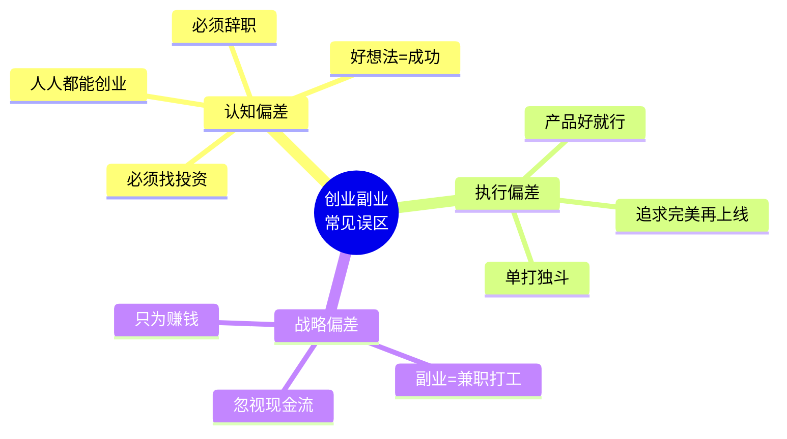

---

## 误区一：所有人都适合创业

### 误区描述

成功学产业每年创造数千亿产值，其核心叙事之一就是"人人都是天生的创业者"。社交媒体上充斥着"辞职创业逆袭"的故事，让人产生一种错觉：只要敢想敢干，任何人都能成功。培训机构更是推波助澜——"你不成功是因为你不够努力"，把系统性的能力缺陷包装成态度问题。

### 误区剖析

#### 底层认知机制

这个误区的危险之处在于**幸存者偏差**——你看到的成功案例是从数百万失败者中筛出来的极少数。你没有看到的是那些默默失败、负债累累、甚至因此抑郁的人。

幸存者偏差之所以难以察觉，是因为它利用了人类大脑的两个弱点：

1. **可得性启发**（Availability Heuristic）：大脑倾向于用"容易想到的例子"来评估概率。媒体密集报道的创业成功案例让你高估了成功率。
2. **叙事谬误**（Narrative Fallacy）：大脑喜欢把随机事件编成有因果关系的故事。"他辞职创业成功了"被解读为"辞职→成功"，而实际上可能是"他有独特资源+运气好→成功"。

#### 创业对个人素质的硬性要求

创业不是一种"选择"，而是一种**能力组合的检验**。就像不是所有人都适合当外科医生一样，创业需要特定的素质组合：

| 素质维度 | 具体要求 | 缺失后果 | 如何评估 |
|----------|----------|----------|----------|
| 抗压能力 | 面对3-6个月零收入仍能理性决策 | 因焦虑做出错误判断，过早放弃 | 回忆你上次面临重大压力时的表现 |
| 执行力 | 能将模糊的想法拆解为可执行的任务清单 | 想法永远停留在脑子里 | 看你过去一年完成了多少个自己发起的项目 |
| 学习速度 | 2周内掌握一个新领域的基础知识框架 | 在快速变化的市场中被淘汰 | 尝试学习一个全新领域，记录时间 |
| 社交能力 | 能在30秒内让陌生人理解你的价值 | 无法获取资源、客户和合作伙伴 | 想想你是否能自然地向陌生人介绍自己 |
| 风险承受 | 能承受投入全部积蓄后仍然亏损的可能 | 在关键时刻因恐惧而做出保守决策 | 算出你能承受的最大亏损金额 |
| 延迟满足 | 愿意在没有回报的阶段坚持6-12个月 | 在黎明前放弃 | 回忆你坚持最长的一个无回报项目 |
| 自我驱动 | 没有老板监督也能保持高效产出 | 自由变成散漫，时间全部浪费 | 记录你连续一周自由时间的产出 |
| 决策能力 | 在信息不完整时做出合理决策并承担后果 | 决策瘫痪或盲目决策 | 回忆你在模糊情境中的决策质量 |

#### 创业能力的自测工具

除了上表的定性评估，以下三个量化测试可以帮助你更客观地认识自己：

**测试一：执行力压力测试**

给自己一个48小时挑战：从零开始完成一个小项目（比如写一篇3000字的文章、做一个简单的网页、策划一场小型活动）。评估标准：
- 你是否在24小时内就启动了？（拖延倾向）
- 遇到障碍时你是绕路还是放弃？（问题解决能力）
- 最终交付物的质量如何？（执行标准）

**测试二：销售能力测试**

找一个你熟悉的产品（可以是别人的），尝试在一周内卖给5个陌生人。评估标准：
- 你是否开口了？（社交勇气）
- 成交了几单？（销售能力）
- 被拒绝后你的情绪状态？（抗挫能力）

**测试三：财务压力模拟**

用一个月时间，将生活开支压缩到原来的50%。评估标准：
- 你是否能坚持一个月？（财务纪律）
- 压缩开支的过程是否让你极度焦虑？（风险承受）
- 你是否在这个过程中发现了不必要的消费？（成本意识）

#### 中国创业存活率数据

**工商注册企业口径统计：**

| 存活年限 | 存活率 | 累计淘汰率 | 淘汰原因分布 |
|----------|--------|------------|--------------|
| 第1年 | 80% | 20% | 资金不足(45%)、方向错误(30%)、团队问题(25%) |
| 第2年 | 56% | 44% | 现金流断裂(40%)、市场验证失败(35%)、竞争淘汰(25%) |
| 第3年 | 40% | 60% | 扩张失控(35%)、创始人倦怠(30%)、行业变化(35%) |
| 第5年 | < 10% | > 90% | 综合因素叠加 |
| 第10年 | < 3% | > 97% | 能穿越周期的企业是极少数 |

*数据来源：国家市场监管总局企业生命周期研究报告*

这意味着：如果你创业，有超过90%的概率在5年内失败。不是因为你不努力，而是因为创业本身就是一件概率极低的事。

#### 创业者的心理画像差异

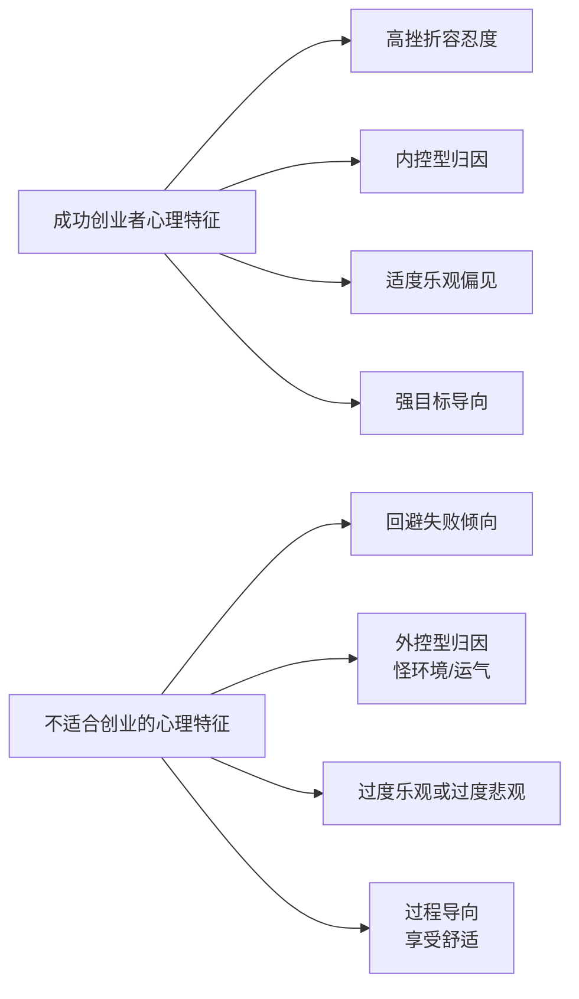

**关键区分**：成功创业者不是"不怕失败"，而是**能够从失败中快速恢复并提取教训**。心理学称之为"挫折复原力"（Resilience）。这种能力部分是天生的，部分可以通过刻意训练提升。

训练挫折复原力的方法：
- **认知重评**：把失败重新定义为"数据收集"而非"人生判决"
- **情绪标签化**：焦虑时对自己说"我现在感到焦虑"，这种元认知能降低情绪强度
- **小失败训练**：主动做一些有风险的小事（公开演讲、投稿被拒），逐步提高耐受阈值
- **建立支持系统**：有2-3个可以倾诉的朋友或导师，避免独自承受压力

#### 真实案例：餐饮创业的残酷真相

小李在互联网公司做产品经理，月薪2万。看到大学同学开奶茶店月入5万后，辞职投入40万加盟了一个网红茶饮品牌。但他忽略了几个关键事实：

- 同学的店铺位于大学城核心位置，日均客流量3000+，这个位置找了6个月
- 同学的家人有10年餐饮经验，供应链成本比新手低30%
- 同学前期亏损了8个月才开始盈利，靠积蓄撑过来的
- 加盟品牌抽成15%，实际利润远低于自营

小李的店铺选在写字楼附近，周末客流断崖下跌。他不懂排班优化，高峰期人手不足、低谷期人力浪费。6个月后累计亏损30万，含泪关店。这不是"运气不好"，而是**准备不足**。

**另一个视角**：小张是一名销售经理，也想创业。但他先做了自评——行业经验3年（够用）、可承受亏损15万（有限）、家庭支持中等（妻子有条件支持）。他没有辞职，而是用周末时间代理了一款企业软件。6个月后月入8000，验证了模式可行，才逐步扩大。这种"先验证再投入"的方式，成功率远高于"看别人赚钱就跟风"。

### 正确做法

**第一步：自我评估（用1-2周完成）**

用以下评估矩阵给自己打分（1-5分），总分低于25分的，建议先积累再创业：

| 评估项 | 你的评分 | 证据/说明 | 评分标准 |
|--------|----------|-----------|----------|
| 相关行业经验年限 | _/5 | | 1=无经验, 3=2-3年, 5=5年+深度经验 |
| 可承受的亏损金额 | _/5 | | 1=1万以内, 3=5-15万, 5=30万+不影响生活 |
| 无收入坚持月数 | _/5 | | 1=1个月, 3=3-6个月, 5=12个月+ |
| 核心技能不可替代性 | _/5 | | 1=人人都会, 3=少数人掌握, 5=极度稀缺 |
| 人脉资源质量 | _/5 | | 1=几乎没有, 3=有行业人脉, 5=能触达关键决策者 |
| 家庭支持程度 | _/5 | | 1=强烈反对, 3=中立, 5=全力支持 |
| 心理韧性自评 | _/5 | | 1=容易放弃, 3=能坚持, 5=越挫越勇 |
| **总分** | **_/35** | | **<25分：先积累；25-30分：副业起步；>30分：可以尝试** |

**第二步：梯度过渡方案**

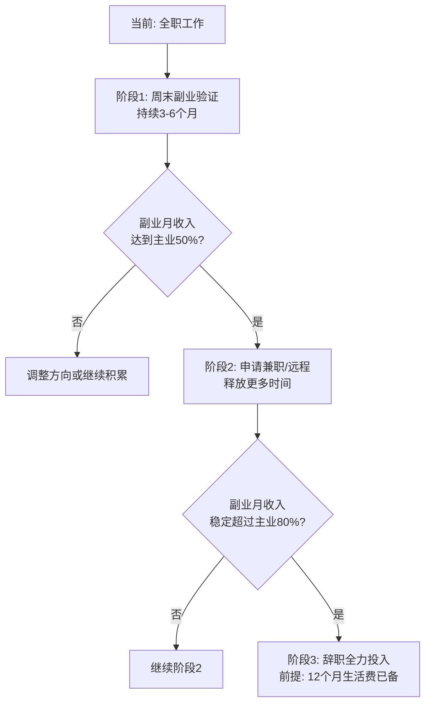

**第三步：找到你的"不公平优势"**

创业成功者往往不是"全能选手"，而是在某个维度拥有极端优势的人。《The Unfair Advantage》一书中提出的MILES框架：

- **Money（资金优势）**：有足够的启动资金，不需要融资就能撑过早期
- **Intelligence & Insight（认知优势）**：对行业有深刻的理解，能看到别人看不到的机会
- **Location & Luck（位置与运气优势）**：在特定地理或平台位置有先发优势，恰好在行业拐点进入
- **Education & Expertise（专业优势）**：在某个细分领域有5年以上深度经验
- **Status（身份优势）**：有强大的个人品牌、社会地位或人脉网络

找到你最突出的1-2个优势，围绕它们设计你的创业/副业策略。不要试图弥补所有短板——**集中资源放大长板**。

**第四步：设置止损线**

在开始之前就明确：
- **时间止损**：最长投入多长时间？（建议：副业6个月，全职创业12个月）
- **资金止损**：最多投入多少钱？（建议：不超过积蓄的30%）
- **精力止损**：每天/每周最多投入多少时间？（建议：不影响主业和健康）

止损线的意义不是"准备放弃"，而是**让你在理性状态下做决策，而不是在情绪崩溃时做决策**。

### 进阶内容：创业失败后的"东山再起"路径

创业失败不是终点，而是下一次创业的起点。数据显示，连续创业者的成功率远高于首次创业者——第二次创业成功率约20%，第三次约30%。关键在于你能否从失败中提取有价值的"认知资产"。

**失败后的四步恢复法：**

| 阶段 | 时间 | 行动 | 目标 |
|------|------|------|------|
| 情绪恢复期 | 1-4周 | 允许自己悲伤，但设定截止日期 | 接受现实，停止自责 |
| 复盘分析期 | 1-2周 | 写一份详细的"失败复盘报告" | 提取3-5条核心教训 |
| 能力补短期 | 1-3个月 | 针对失败暴露的短板做专项提升 | 弥补关键能力缺口 |
| 重新出发期 | 3-6个月 | 用更低的风险方式重新验证 | 带着教训重新开始 |

**失败复盘报告模板：**

```markdown
## 创业失败复盘报告

### 一、基本事实
- 项目名称：___
- 运营时间：___个月
- 总投入：___元
- 总收入：___元
- 净亏损：___元

### 二、失败的直接原因（列出3-5个）
1. ___
2. ___

### 三、失败的根本原因（通常只有1-2个）
1. ___

### 四、如果重来，我会怎么做不同？
1. ___
2. ___

### 五、这次创业我获得了什么？
- 行业认知：___
- 人脉资源：___
- 技能提升：___
- 关于自己的发现：___

### 六、下一步计划
- 短期（1个月内）：___
- 中期（3个月内）：___
```

**关键心态**：硅谷文化中，创业失败被视为"荣誉勋章"而非"人生污点"。YC（Y Combinator）甚至明确表示更偏好有失败经验的创始人。在中国，虽然文化上对失败的包容度较低，但越来越多的投资人开始认可"连续创业者"的价值。重要的是你能从失败中学到什么，而不是失败本身。

### 不同人生阶段的创业策略

创业不是只有"辞职开公司"一种形态。不同人生阶段有不同的最优策略：

| 人生阶段 | 年龄段 | 推荐策略 | 风险承受 | 关键考量 |
|----------|--------|----------|----------|----------|
| 大学期间 | 18-22岁 | 校园项目、低成本试错 | 高（无家庭负担） | 积累经验比赚钱重要 |
| 职业初期 | 22-28岁 | 在职副业、技能变现 | 中高（单身/新婚） | 建立核心技能和行业认知 |
| 职业中期 | 28-35岁 | 副业验证后择机全职 | 中（有家庭压力） | 有行业积累，是创业黄金期 |
| 职业成熟期 | 35-45岁 | 资源整合型创业 | 中低（家庭责任重） | 用经验和人脉而非体力 |
| 职业后期 | 45岁+ | 投资/顾问/轻创业 | 低（需要稳定） | 知识传承、资源整合 |

---

## 误区二：好的想法就能成功

### 误区描述

"我有一个改变世界的想法，就差一个程序员了。"这句话在创业圈已经成为笑话，但依然有无数人深信不疑。他们花大量时间"保护"自己的想法，签保密协议、申请专利，却从不考虑如何执行。更有甚者，因为怕想法被"偷"而拒绝与任何人讨论，结果想法永远停留在脑子里。

### 误区剖析

#### 底层认知机制

这个误区源于两种认知偏差：

1. **禀赋效应**（Endowment Effect）：人们对"自己拥有的东西"赋予过高价值。因为是"你的"想法，你觉得它比实际上更有价值。
2. **邓宁-克鲁格效应**（Dunning-Kruger Effect）：在某个领域缺乏经验的人，往往高估自己的判断力。没有创业经验的人，会觉得"这个想法肯定行"。

**想法的价值被严重高估了。** 原因有三：

1. **想法的独创性极低**：全球80亿人口，你想到的点子大概率已经有1000人想到了
2. **想法无法变现**：没有执行的想法，价值为零
3. **想法需要验证**：90%的"好想法"在市场验证阶段就被证伪

#### 创业成功的要素权重

**YC创业学校的统计数据：**

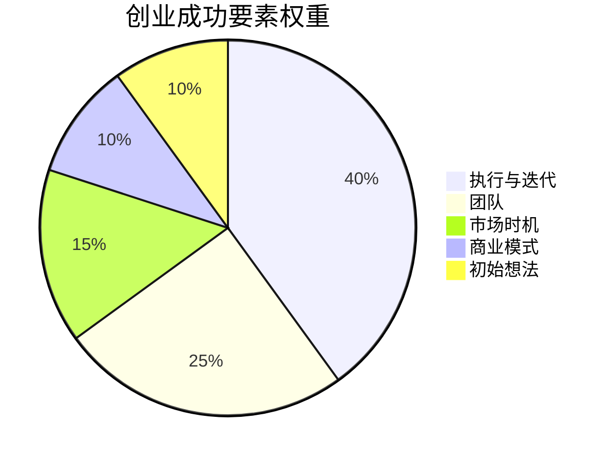

| 要素 | 权重 | 说明 | 典型错误 |
|------|------|------|----------|
| 执行与迭代 | 40% | 把想法变成产品、把产品变成收入的能力 | "再想想再做"，永远不开始 |
| 团队 | 25% | 互补的技能组合、共同的价值观 | 一个人扛所有事 |
| 市场时机 | 15% | 太早教育市场，太晚错过窗口 | 追已经过气的风口 |
| 商业模式 | 10% | 可持续的盈利方式 | 只有用户没有收入 |
| 初始想法 | 10% | 起点，但在迭代中会被大幅修改 | 花90%时间在想法上 |

#### 为什么"好想法"不值钱？


每一层筛选淘汰的不是想法不行的人，而是执行不到位的人。**想法是0，执行力是1。没有1，多少个0都没有意义。**

#### 真实案例：共享单车的生死分野

2016-2017年，共享单车赛道涌入超过70家企业，融资总额超过200亿。想法完全相同——"解决最后一公里出行"。但结果天差地别：

| 企业 | 融资额 | 结局 | 关键差异 |
|------|--------|------|----------|
| ofo | 150亿+ | 破产清算 | 管理混乱、资金挪用、拒绝合并、盲目扩张 |
| 摩拜 | 100亿+ | 被美团收购 | 持续亏损，创始人套现离场 |
| 哈啰 | 50亿+ | 持续运营盈利 | 下沉市场策略、精细化运营、成本控制 |
| 小蓝/酷骑/悟空等 | 数亿 | 全部倒闭 | 资金链断裂、运营粗放、无差异化 |

同一个想法，70种执行，最终只有2-3家存活。**想法是入场券，执行才是决赛。**

哈啰出行的胜出尤其值得关注：它没有进入一线城市与摩拜、ofo正面竞争，而是选择下沉市场。在二三线城市，共享单车的需求同样存在，但竞争少得多，运营成本也低得多。这个"执行策略"的差异，比"想法"本身重要100倍。

#### 另一个案例：AI创业赛道的同质化竞争

2023-2024年AI大模型热潮中，数千家创业公司涌入"AI+X"赛道。想法高度同质化——"用AI提升XX行业的效率"。但结果：

- **成功的**：找到具体痛点、有数据壁垒、执行速度快的团队（如专注法律文书的幂律智能、专注医疗影像的推想医疗）
- **失败的**：想法宏大但没有差异化、技术不落地、商业模式不清晰的团队（占90%以上）

### 正确做法

**1. 停止"保护"想法，开始验证想法**

想法验证的最小成本路径：

| 验证方法 | 成本 | 时间 | 适用场景 | 具体操作 |
|----------|------|------|----------|----------|
| 用户访谈 | 0元 | 1周 | 了解需求真伪 | 找20个目标用户，每人聊30分钟 |
| Landing Page | 500元 | 3天 | 测试付费意愿 | 做一个产品介绍页，投放小额广告看转化 |
| 微信群预售 | 0元 | 1周 | 验证付费意愿 | 在目标用户群发布预售，看有没有人付款 |
| 最小可行产品 | 5000-2万 | 1个月 | 验证产品可行性 | 做一个只有核心功能的产品，看用户留存 |
| 代运营/人工服务 | 0元 | 2周 | 验证服务模式 | 不写程序，人工提供服务，验证需求真伪 |
| 竞品分析 | 0元 | 3天 | 了解市场格局 | 深入研究3-5个竞品的优缺点和用户评价 |

**2. 用"假设-验证"循环替代"计划-执行"模式**

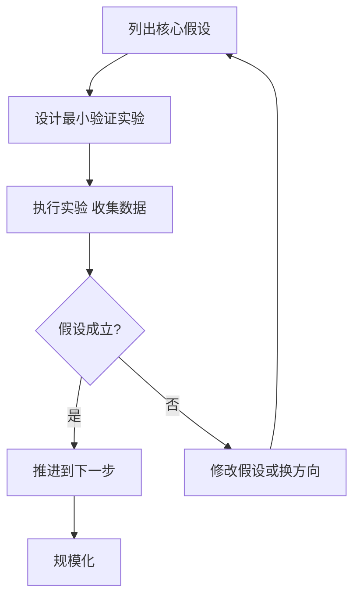

**核心假设清单（必须在动手前回答）：**

1. 目标用户是谁？他们真的有这个痛点吗？
2. 他们现在怎么解决这个问题？（如果没有解决方案，可能痛点不够痛）
3. 他们愿意为解决方案付多少钱？
4. 我能以什么成本提供这个解决方案？
5. 这个市场有多大？值得做吗？

**3. 关注"问题"而非"解决方案"**

好的创业者问的是"用户的痛点是什么"，而不是"我的产品有多酷"。解决方案可以变，但真实的问题不会变。

**实操方法：问题访谈模板**

在访谈目标用户时，不要问"你觉得这个产品怎么样"（这会引导对方说好话），而要问：
- "你上次遇到XX问题是什么时候？"（确认问题真实存在）
- "你当时是怎么解决的？"（了解现有方案）
- "那个方案哪里不好？"（找到改进空间）
- "如果有一个方案能解决这个问题，你愿意付多少钱？"（验证付费意愿）

**4. 想法验证的"烟雾测试"工具箱**

除了用户访谈和Landing Page，还有几种低成本的验证方法：

| 方法 | 操作 | 成本 | 验证周期 | 判断标准 |
|------|------|------|----------|----------|
| 众筹验证 | 在摩点/京东众筹发起众筹 | 0元 | 1个月 | 达标率>100%说明需求真实 |
| 微信群"假销售" | 在目标用户群发产品介绍，问"如果XX元你买不买" | 0元 | 1天 | 10%以上表示要买 |
| 竞品评论分析 | 深挖竞品的1-3星差评 | 0元 | 2天 | 找到高频抱怨点=你的机会 |
| Google Trends/百度指数 | 搜索关键词趋势 | 0元 | 10分钟 | 上升趋势说明需求在增长 |
| 行业报告 | 艾瑞/易观/36氪研报 | 0-200元 | 1天 | 市场规模和增长率数据 |

**5. 想法评估的"五维打分法"**

在投入时间和金钱之前，用这个框架快速评估想法：

| 维度 | 问题 | 评分标准 |
|------|------|----------|
| 需求强度 | 用户是否"必须"解决这个问题？ | 1=nice to have, 3=should have, 5=must have |
| 市场规模 | 目标市场有多大？ | 1=<1亿, 3=1-100亿, 5=>100亿 |
| 竞争壁垒 | 你能建立什么护城河？ | 1=无壁垒, 3=有一定壁垒, 5=强壁垒 |
| 执行难度 | 你能在3个月内做出MVP吗？ | 1=需要1年+, 3=3-6个月, 5=<3个月 |
| 变现路径 | 你能清晰描述怎么赚钱吗？ | 1=模糊, 3=基本清晰, 5=已验证 |

总分<15分的想法，建议放弃或重新定义。

### 进阶内容：想法的"反向验证"法

除了正向验证（证明想法可行），更聪明的做法是**反向验证**——尝试证明想法不可行：

1. **搜索失败案例**：在知乎、脉脉、Twitter上搜索"XX行业 失败"、"XX赛道 创业 死亡"
2. **找到最强竞品**：如果市场上已经有做得很好的产品，你的差异化在哪里？
3. **计算最坏情况**：如果获客成本是预期的3倍、转化率是预期的1/3，你还能活多久？
4. **咨询行业"老炮"**：找在这个行业做了5年以上的人聊聊，他们的"冷水"比任何数据都真实

如果经过反向验证，你仍然认为这个想法值得做——恭喜，你可能真的找到了一个好方向。

---

## 误区三：辞职才能全心创业

### 误区描述

"你连辞职的勇气都没有，怎么可能成功？"——这是创业圈最有毒的鸡汤之一。它把理性的风险管理污蔑为"怯懦"，诱导无数人在没有准备好的情况下裸辞。很多培训机构甚至把"敢于辞职"包装成一种"决心测试"，仿佛不辞职就不配创业。

### 误区剖析

#### 底层认知机制

这个误区利用了两种心理偏差：

1. **即时满足偏差**：辞职带来一种"终于自由了"的强烈快感，这种即时满足感掩盖了长期风险。
2. **承诺一致性**：一旦辞职，为了证明自己的决定是对的，你会更加固执地坚持错误方向，而不是及时调整。

#### 辞职创业的隐性成本被严重低估

| 成本类型 | 估算金额（一线城市） | 说明 | 常被忽视的原因 |
|----------|----------------------|------|----------------|
| 工资收入损失 | 2-5万/月 | 直接的现金流损失 | "反正会赚回来" |
| 社保公积金断缴 | 3000-8000/月 | 医疗、养老、购房资格受影响 | "以后再补" |
| 心理压力成本 | 难以量化 | 焦虑导致决策质量下降 | "我能扛住" |
| 社交资本损耗 | 难以量化 | 脱离职场人脉圈 | "不需要了" |
| 机会成本 | 难以量化 | 错过的职业晋升和期权 | "那些不重要" |
| 家庭关系压力 | 难以量化 | 配偶/父母的焦虑和不满 | "他们会理解的" |

把这些成本加起来，辞职创业的"隐性启动成本"可能高达**每月5-10万元**。很多创业者在计算启动资金时，只算了产品开发和营销成本，完全忽略了这些"看不见的开支"。

#### 社保断缴的具体影响

社保断缴不是"以后再补"那么简单，它会带来连锁影响：

| 险种 | 断缴后果 | 影响程度 |
|------|----------|----------|
| 医疗保险 | 断缴次月起无法报销，续缴后有等待期（通常6个月） | ★★★★★ |
| 养老保险 | 累计缴费年限减少，退休金降低 | ★★★ |
| 生育保险 | 断缴期间生育无法报销（部分地区要求连续缴满12个月） | ★★★★ |
| 购房/落户资格 | 一线城市要求连续缴纳社保，断缴清零重新计算 | ★★★★★ |
| 公积金 | 断缴影响贷款额度和资格 | ★★★★ |

**解决方案**：辞职前确认社保续缴方案——挂靠朋友公司、找社保代缴机构、或以灵活就业身份自行缴纳。

#### 不同路径的风险收益对比

| 路径 | 启动资金需求 | 心理压力 | 试错空间 | 成功率 | 适合人群 |
|------|-------------|----------|----------|--------|----------|
| 直接辞职创业 | 高（12个月+生活费） | 极大 | 极小（资金烧完就结束） | 5-8% | 已验证商业模式、资金充裕 |
| 在职副业起步 | 低（几千元） | 适中 | 大（主业兜底） | 15-20% | 大多数人 |
| 副业验证后辞职 | 中（6个月生活费） | 较小 | 中 | 25-35% | 副业已稳定盈利者 |
| 内部创业/合伙人 | 低 | 适中 | 中 | 20-30% | 有行业资源者 |

成功率数据说明：**副业验证后辞职的成功率是直接辞职的4-7倍**。不是因为副业路径更"聪明"，而是因为它给了你更多试错机会。

#### 真实案例：两种路径的对比

**路径A：程序员老周的稳健之路**
- 2021年：利用业余时间开发了一个小众SaaS工具（项目管理+工时统计）
- 前3个月：每天下班后写代码2-3小时，周末全天
- 第4个月：上线，定价99元/月，通过技术社区推广
- 第6个月：付费用户50人，月收入4950元
- 第9个月：月收入1.2万，开始优化自动化流程
- 第12个月：月收入2.3万，超过主业工资的60%
- 第15个月：月收入3.5万，提交辞职信
- 辞职时：已有12个月生活费储备 + 稳定增长的收入 + 经过验证的商业模式

**路径B：小刘的冲动之路**
- 有一个类似的SaaS想法
- 觉得"在职做太慢"，直接辞职
- 辞职后发现：开发比预期慢3个月、获客成本比预期高5倍
- 第3个月：积蓄消耗过半，开始焦虑
- 第4个月：为了快速变现，做了很多妥协，产品质量下降
- 第5个月：资金见底，不得不重新找工作
- 损失：6个月工资收入 + 10万积蓄 + 心理创伤

**路径C：设计师小陈的中间路线**
- 在广告公司做设计总监，月薪2.5万
- 业余时间接私单，月均收入5000-8000
- 积累了20个稳定客户后，申请转为远程/兼职
- 每周只去公司2天，其余时间做自己的设计工作室
- 8个月后工作室月收入稳定在3万+
- 辞职时：收入已超过主业，客户稳定，不需要重新获客

路径C的核心优势：**她没有经历"从0到1"的阶段**——客户、口碑、流程都是在职期间积累的。

### 正确做法

**辞职的"三个达标"原则：**

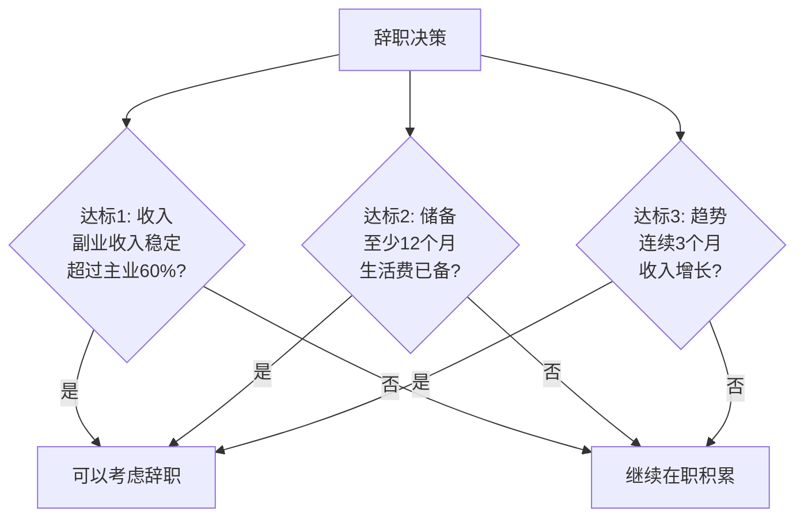

**关键：三个条件必须同时满足。** 只满足收入但没有储备？万一客户流失，你没有缓冲。有储备但收入不增长？可能方向有问题，辞职后更难调整。

**辞职前的清单（逐项确认）：**

- [ ] 副业连续3个月收入稳定且增长
- [ ] 银行账户有12个月以上的生活费
- [ ] 家人理解并支持（至少不反对）
- [ ] 社保/公积金续缴方案已确定
- [ ] 已建立副业的自动化流程（不完全依赖个人时间）
- [ ] 最坏情况的退路（回职场的可行性已确认）
- [ ] 心理准备：接受6个月内可能没有额外收入
- [ ] 法律准备：竞业限制协议是否影响创业方向
- [ ] 税务准备：个体户/公司注册方案已确定

**渐进式过渡策略：**

| 阶段 | 时间 | 行动 | 目标 | 关键指标 |
|------|------|------|------|----------|
| 探索期 | 1-3个月 | 下班后和周末做副业 | 验证需求、做出MVP | 有10个以上愿意付费的用户 |
| 增长期 | 3-6个月 | 优化效率，减少主业投入 | 副业收入达主业30% | 月收入稳定且环比增长 |
| 稳定期 | 6-12个月 | 系统化副业流程 | 副业收入达主业60%+ | 有可重复的获客渠道 |
| 切换期 | 12个月+ | 提交辞职信 | 全力投入 | 三个达标全部满足 |

**"软着陆"技巧：**
- 与公司协商转为兼职/远程/顾问（很多公司愿意留住核心人才）
- 利用年假集中测试——请2周假，全力做副业，看效果
- 在辞职前建立"副业操作系统"——客户管理、交付流程、营销计划全部标准化

### 进阶内容：竞业限制与法律风险

辞职创业前，必须检查以下法律风险：

| 风险类型 | 检查要点 | 应对方法 |
|----------|----------|----------|
| 竞业限制协议 | 是否签过？限制范围多大？期限多长？ | 咨询律师评估有效性，部分竞业条款因补偿不足而无效 |
| 知识产权归属 | 在职期间的发明/作品是否归公司？ | 创业项目必须与在职工作完全隔离，不使用公司资源 |
| 客户资源 | 是否使用在职期间积累的客户？ | 客户信息属于商业秘密，直接使用可能构成侵权 |
| 技术秘密 | 是否使用在职期间掌握的技术？ | 通用技能可以使用，专有技术/代码不能带走 |

**建议**：辞职前花2000-5000元咨询一位劳动法律师，这笔钱可能帮你避免数十万的法律纠纷。

---

## 误区四：创业必须找投资

### 误区描述

创业圈有一种畸形的认知：拿到融资=创业成功。很多人把"融资额"当作"成就"来炫耀，把找投资当作创业的第一步。BP（商业计划书）写了十几版，产品一行代码没写。

### 误区剖析

#### 底层认知机制

这个误区的根源是**权威效应**——投资人被视为"聪明人"，他们投了钱就等于"验证了你的想法"。但实际上，投资人的判断也会出错。数据显示，VC投资的项目中，70-80%最终是亏损的。

另一个根源是**媒体选择性报道**：媒体喜欢报道融资新闻（因为有具体数字可以写），很少报道"自力更生做到年入千万"的故事。这造成了一个错觉——成功企业都需要融资。

#### 融资的本质

融资不是"赚到了钱"，而是**借了别人的钱来赌一个未来**。投资人要的是10倍、100倍的回报。如果你做不到，融资就是枷锁。

**理解投资人的逻辑：**
- 天使投资人投10个项目，期望1-2个成功，回报覆盖所有亏损
- VC基金投20-30个项目，期望1-3个带来10倍以上回报
- 对你来说是"全部身家"，对投资人来说只是"投资组合中的一项"

#### Bootstrapping（自力更生）vs 融资创业

| 维度 | 自力更生 | 融资创业 |
|------|----------|----------|
| 控制权 | 100%保持 | 逐步稀释（天使轮后通常剩70-80%，C轮后可能低于30%） |
| 决策自由度 | 完全自主 | 需对投资人负责，可能被迫做违背初心的决策 |
| 压力来源 | 生存压力 | 增长压力（投资人要求高速增长） |
| 退出方式 | 自己决定 | 投资人需要退出（IPO或被收购） |
| 发展速度 | 较慢但稳健 | 快速但可能"虚胖" |
| 失败后果 | 损失自有资金 | 可能背负对赌债务 |
| 适合场景 | 小而美的生意 | 需要快速抢占市场的赛道 |
| 税务影响 | 简单 | 股权激励、期权池等复杂税务问题 |

#### 中国中小企业融资现实

- 获得天使轮融资的企业：不到注册企业的1%
- 获得A轮融资的企业：不到天使轮的10%
- 能走到B轮的：不到A轮的20%
- 最终IPO的：不到B轮的5%

也就是说，10000家创业公司，最终能IPO的不到1家。**融资是独木桥，不是高速公路。**

#### 融资的隐性代价

1. **股权稀释**：天使轮出让10-20%，A轮再出让15-25%，到C轮你可能只持有不到20%的公司
2. **对赌条款**：很多投资附带对赌，达不到业绩目标创始人要回购股份或赔偿。2023年中国创业圈的"对赌纠纷"案例增长了40%
3. **战略扭曲**：投资人要求快速增长，可能迫使你做出非理性决策——烧钱获客、盲目扩张、忽视盈利
4. **退出压力**：投资人有基金周期（通常5-7年），到时候不管你愿不愿意都要退出
5. **信息披露义务**：财务数据、客户数据、战略规划都要向投资人汇报

#### 融资过程中的常见陷阱

| 陷阱 | 表现 | 后果 | 防范 |
|------|------|------|------|
| FA（财务顾问）骗局 | 承诺"保证拿到融资"，收取高额服务费 | 花了钱没拿到投资 | 正规FA按融资额抽成（3-5%），不收前期费用 |
| 估值虚高 | 被高估值冲昏头脑，忽略对赌条款 | 达不到对赌目标，创始人倾家荡产 | 估值要合理，宁可低一点也不要对赌 |
| 投资人拖延 | 口头承诺投资，但一直不打款 | 账上没钱，错过最佳发展时机 | 设定打款deadline，超时就放弃 |
| 稀释过快 | 每轮都出让太多股份 | 创始人失去控制权 | 控制每轮稀释比例，天使轮不超过20% |
| 战略投资人陷阱 | 竞争对手以投资名义获取商业机密 | 核心信息泄露 | 对战略投资人做背景调查，签保密协议 |

#### 真实案例

| 企业 | 融资情况 | 发展路径 | 现状 | 教训 |
|------|----------|----------|------|------|
| 老干妈 | 零融资 | 小作坊→区域品牌→全国品牌→年收入50亿 | 持续盈利，现金流健康 | 好生意不需要融资 |
| 元气森林 | 多轮融资 | 快速铺渠道→产品迭代→全球化 | 已盈利 | 融资用对了：抢时间窗口 |
| ofo共享单车 | 150亿+ | 烧钱扩张→资金链断裂→破产 | 投资人血本无归 | 融资≠成功，烧钱≠增长 |
| 瑞幸咖啡（早期） | 60亿+ | 疯狂开店→财务造假→退市 | 重组后回归正轨 | 对赌压力导致造假 |

**关键洞察**：元气森林的融资是"正确的融资"——它用资金快速抢占了气泡水市场的时间窗口，这个窗口稍纵即逝。但大多数创业者融到钱后，做的事情跟不融资没区别，只是烧得更慢而已。

### 正确做法

**1. 先问自己三个问题：**

- 我的生意是否真的需要大量资金才能启动？（很多生意不需要——知识付费、咨询、SaaS、内容创作都可以零成本启动）
- 我能否接受失去部分控制权？（有些创始人宁可发展慢也不愿放弃控制权，这也是合理的）
- 我的商业模式是否支持高速增长？（投资人只投高增长——年增长低于50%的项目很难拿到VC投资）

**2. 自力更生的路径：**


**3. 自力更生的具体策略：**

| 策略 | 操作方式 | 适用场景 |
|------|----------|----------|
| 预售模式 | 先收钱再做产品 | 课程、电子书、定制服务 |
| 以销定采 | 收到订单再采购 | 电商、代购、中介服务 |
| 兼职启动 | 保持主业收入，用业余时间创业 | 大多数创业场景 |
| 政府补贴 | 申请创业补贴、税收优惠 | 科技类、创新类项目 |
| 客户预付 | 收取年费/会员费 | SaaS、会员制服务 |

**4. 如果确实需要融资，做好准备：**

| 准备事项 | 具体内容 | 常见错误 |
|----------|----------|----------|
| 财务数据 | 至少6个月的运营数据，包括收入、成本、增长率 | 没有数据就去融资 |
| 商业计划 | 清晰的商业模式、市场规模、竞争分析 | 写了一堆PPT但没有验证 |
| 团队介绍 | 核心团队的背景和互补性 | 一个人去融资 |
| 资金用途 | 精确到每个用途的金额和预期效果 | "用来发展业务" |
| 估值依据 | 用可比公司法或DCF法给出合理估值 | 瞎估值，吓跑投资人 |

**5. 识别"该融资"的信号：**

- 市场有明确的时间窗口，不快速抢占就会被竞品占位
- 需要大量前期投入（如硬件研发、供应链建设）
- 已经找到PMF（产品市场匹配），需要资金规模化
- 竞争对手已经拿到融资，正在快速扩张

### 进阶内容：中国创业融资渠道全景

| 渠道 | 金额范围 | 门槛 | 适合阶段 | 注意事项 |
|------|----------|------|----------|----------|
| 亲友借款 | 5-50万 | 低 | 种子期 | 写借条，约定还款计划，不要用股权换 |
| 天使投资人 | 50-500万 | 中 | 天使轮 | 找对行业有经验的天使，不只看钱 |
| 政府创业基金 | 10-200万 | 中 | 早期 | 申请周期长，但无股权稀释 |
| 众筹 | 1-100万 | 低 | 产品验证期 | 产品众筹可以验证需求+获取启动资金 |
| 银行贷款 | 10-500万 | 高 | 有抵押物/稳定收入 | 利率低但需要抵押或担保 |
| VC（风险投资） | 500万-数亿 | 高 | A轮及以后 | 需要高速增长的故事 |
| PE（私募股权） | 数千万-数十亿 | 很高 | 成熟期 | 需要稳定的盈利数据 |

---

## 误区五：产品做得好自然有人买

### 误区描述

"酒香不怕巷子深"——这句古话在信息时代已经成为最大的谎言之一。无数技术出身的创业者沉迷于打磨产品，却从不考虑如何让用户知道自己的产品存在。他们相信"只要产品足够好，用户自然会来"。

### 误区剖析

#### 底层认知机制

这个误区源于**质量归因谬误**——人们倾向于把成功归因于产品质量，而忽略了营销、渠道、时机等其他因素。实际上，在产品"足够好"的阈值之上，营销的边际收益远高于继续打磨产品。

另一个原因是**技术思维的局限**：技术人员习惯用"功能"来衡量产品价值，但用户购买的不是功能，而是**解决方案和体验**。一个功能少但营销好的产品，往往打败功能多但无人知晓的产品。

#### 在信息过载的时代，注意力是最稀缺的资源

一个普通人每天接触的广告信息超过5000条。你的产品再好，如果不在这5000条信息中脱颖而出，就等于不存在。

#### 产品与营销的关系

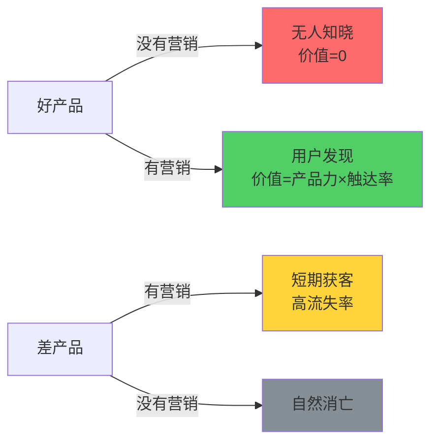

**核心公式：商业价值 = 产品力 × 营销力 × 时机**

三项中任何一项为零，结果都是零。

#### 不同阶段的资源分配

| 阶段 | 产品研发 | 营销推广 | 客户服务 | 说明 |
|------|----------|----------|----------|------|
| 冷启动期（0-100用户） | 50% | 35% | 15% | 产品要能用，但推广更重要 |
| 增长期（100-10000用户） | 35% | 45% | 20% | 规模化获客是核心 |
| 成熟期（10000+用户） | 30% | 35% | 35% | 留存和复购比拉新更重要 |
| 衰退期 | 40% | 30% | 30% | 产品创新是唯一出路 |

#### 营销投入的ROI对比

| 营销渠道 | 获客成本（CAC） | 见效速度 | 可持续性 | 适合阶段 |
|----------|----------------|----------|----------|----------|
| 口碑传播 | 近乎为零 | 慢 | 高 | 成熟期 |
| 内容营销（博客/视频） | 低 | 中（1-3个月） | 高 | 全阶段 |
| 社群运营 | 低 | 中 | 高 | 冷启动+增长期 |
| SEO | 低-中 | 慢（3-6个月） | 高 | 长期战略 |
| 信息流广告 | 高 | 快 | 低（停投即停） | 增长期 |
| KOL合作 | 中-高 | 快 | 中 | 冷启动+增长期 |

#### 真实案例：课程产品的营销分野

两个独立开发者，技术能力相当，各做了一门Python课程：

| 维度 | 开发者A | 开发者B |
|------|---------|---------|
| 课程质量 | 95分（精心打磨） | 80分（足够好就行） |
| 定价 | 199元 | 299元 |
| 营销投入 | 几乎为零 | 每周写3篇技术博客、做2个短视频 |
| 社群运营 | 无 | 建了500人学习群 |
| 上线3个月销量 | 50份 | 800份 |
| 收入 | 9,950元 | 239,200元 |

A的课程质量更高，但收入只有B的4%。**在产品"足够好"的阈值之上，营销的边际收益远高于继续打磨产品。**

**另一个案例：工具类产品的营销差异**

小王做了一个Excel模板合集，质量非常高，定价29元。他在闲鱼上架，一个月卖了20份。小李做了类似的模板，质量稍逊，但他做了这些事：
- 在小红书发了30篇"Excel技巧"笔记，每篇底部放购买链接
- 在知乎回答了50个Excel相关问题
- 做了一个免费的"Excel入门课"引流到付费产品
- 建了一个2000人的Excel学习群

结果：小李一个月卖了600份，收入17400元。

### 正确做法

**1. 建立营销的最小系统：**

| 渠道 | 适合类型 | 日均投入 | 见效周期 | 具体操作 |
|------|----------|----------|----------|----------|
| 小红书 | 消费品、生活服务、知识付费 | 1小时 | 2-4周 | 每天发1条笔记，300-500字+图片 |
| 抖音/视频号 | 视觉类产品、教程、娱乐 | 2小时 | 1-3个月 | 每周发3-5条短视频 |
| 公众号 | 深度内容、B2B、知识付费 | 1.5小时 | 1-2个月 | 每周发2-3篇深度文章 |
| 知乎 | 专业领域、B2B、技术产品 | 1小时 | 2-6个月 | 每天回答2-3个相关问题 |
| SEO/博客 | 长期流量、技术产品 | 1小时 | 3-6个月 | 每周发1篇长文，做关键词优化 |
| 微信群/社群 | 复购型产品、高客单价 | 0.5小时 | 持续 | 每天在群内分享价值内容 |

**关键原则：选1-2个渠道做到极致，而不是5个渠道都浅尝辄止。**

**2. 冷启动的"100个铁粉"策略：**

不需要10万粉丝，只需要100个真正认可你的用户。凯文·凯利的"1000个铁杆粉丝"理论指出：你只需要1000个愿意为你的一切产品付费的粉丝，就能维持一个体面的创作生活。

- 找到你的前100个用户：在目标用户聚集的社群、论坛、评论区主动提供价值
- 用超预期的服务赢得口碑：给前100个用户额外的关注和帮助
- 让他们成为你的传播者：设计分享激励机制（推荐返现、专属福利）

**3. 学会"讲故事"：**

产品是冰冷的，故事是有温度的。用户不会为功能买单，但会为故事买单。

一个好的产品故事包含：
- **主角**：你的目标用户（不是你的产品）
- **困境**：他们面临的问题和痛苦（越具体越好）
- **转折**：你的产品如何改变了局面（用数据说话）
- **结局**：使用后的美好生活（可感知的变化）

**故事模板：**
> "小张是一个忙碌的程序员，每天花2小时在重复性的代码整理上。用了XX工具后，这个时间缩短到了15分钟。他把省下来的时间用来学习新技术，半年后涨薪30%。"

### 进阶内容：内容营销的"飞轮效应"

内容营销的最大优势是**复利效应**——你今天写的文章，明年还能带来流量。建立内容飞轮的步骤：

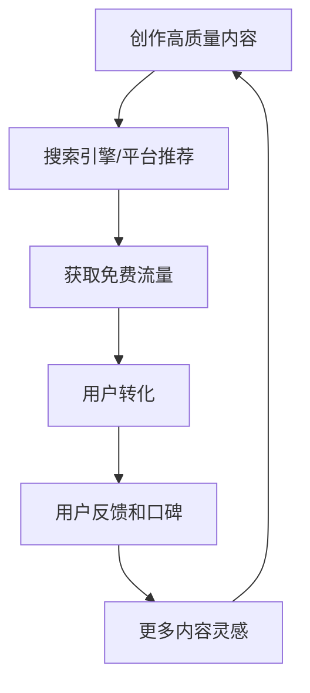

**内容复利的数据佐证**：
- 一篇优质SEO文章，发布6个月后流量通常是第1个月的3-5倍
- 一个10万字的博客，可以持续3-5年带来稳定流量
- 内容资产的边际成本趋近于零——写一次，收益多年

---

## 误区六：副业就是兼职打工

### 误区描述

提到副业，很多人的第一反应是：周末送外卖、晚上做家教、接一些零散的外包单。这些确实是副业，但只是最原始的形态。更糟糕的是，很多人把"做兼职"当成"搞副业"，忙碌了一年，收入没增长，技能没提升，时间全搭进去了。

### 误区剖析

#### 底层认知机制

这个误区的根源是**线性思维**——用"工作量×时薪"来计算收入。这种思维在职场中是合理的（你确实按小时拿工资），但在副业和创业中是致命的，因为它把你的收入锁死在了时间的硬性上限上。

#### 兼职打工的本质是"卖时间"，而时间有硬性上限

一个人每天最多工作16小时（已经严重影响健康），扣除主业8小时，副业最多8小时。假设时薪100元（已经很高了），月收入上限 = 100 × 8 × 30 = 24,000元。这是理论上限，实际上很难达到——你不可能每天都保持8小时高效副业工作。

更关键的是：**卖时间的副业没有复利效应**。你今天做2小时，明天还是做2小时，不会因为你昨天做了而今天变得更容易。

#### 副业的四个层次

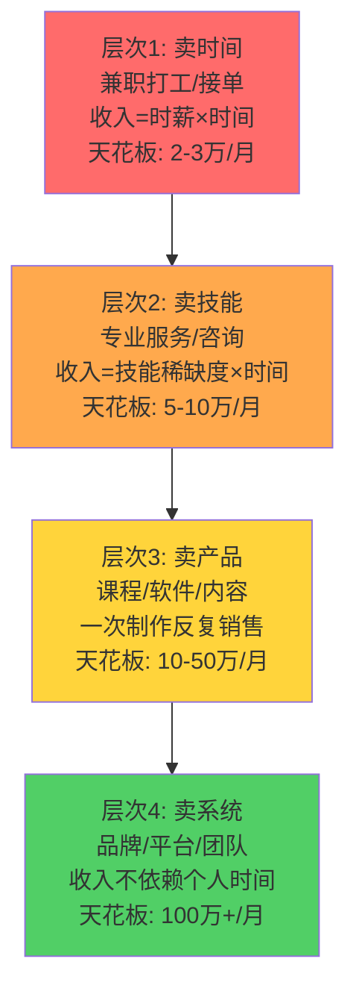

| 层次 | 收入模式 | 时间杠杆 | 边际成本 | 示例 | 进化路径 |
|------|----------|----------|----------|------|----------|
| 卖时间 | 时薪制 | 无 | 每次都有 | 送外卖、做家教、兼职翻译 | → 提升时薪 |
| 卖技能 | 项目制 | 低 | 每次都有但单价高 | 设计接单、技术咨询、培训 | → 标准化服务 |
| 卖产品 | 一次制作多次销售 | 高 | 趋近于零 | 网课、电子书、SaaS工具 | → 建立品牌 |
| 卖系统 | 平台/品牌抽成 | 极高 | 趋近于零 | 社群运营、加盟体系、内容IP | → 生态化 |

**关键洞察**：从"卖时间"到"卖产品"的转变，本质上是从"线性收入"到"指数收入"的转变。卖时间的收入是线性的（干1小时赚1小时的钱），卖产品的收入是指数的（产品做好后，每多卖一份的边际成本趋近于零）。

#### 真实案例：从卖时间到卖产品的进化

小张是一名高中数学老师，擅长用独特的方法教学生解题：

| 阶段 | 方式 | 月收入 | 时间投入 | 收入/时间比 |
|------|------|--------|----------|-------------|
| 阶段1 | 周末做家教，每小时200元 | 6,400元（8天×4小时×200） | 周末全部 | 200元/小时 |
| 阶段2 | 录制解题方法视频，B站+抖音 | 初期0→3个月后8,000元 | 每天1小时 | 267元/小时 |
| 阶段3 | 出系统网课，定价299元 | 1.5万-3万元 | 录制完成后几乎零投入 | 接近无穷大 |
| 阶段4 | 建立学习社群+直播答疑 | 5万-8万元 | 每周3小时 | 4,167元/小时 |

从"卖时间"到"卖产品"，收入增长了10倍，时间投入反而减少了。

**另一个案例：设计师的进化路径**

| 阶段 | 方式 | 月收入 | 时间投入 |
|------|------|--------|----------|
| 阶段1 | 在设计平台接单，一单500-2000 | 5000-1万 | 每天4-6小时 |
| 阶段2 | 做设计模板上架到素材网站 | 初期0→6个月后8000 | 前期投入，后期几乎零 |
| 阶段3 | 出UI设计课程，定价499 | 2-5万 | 录制完成后每期答疑2小时 |
| 阶段4 | 开设计工作室，带团队接大单 | 10万+ | 管理为主 |

### 正确做法

**1. 选择有"时间杠杆"的副业方向：**

| 方向 | 启动门槛 | 时间杠杆 | 适合人群 | 启动建议 |
|------|----------|----------|----------|----------|
| 知识付费（课程/电子书） | 中（需要专业积累） | 高 | 有专业技能的人 | 先在公众号/知乎积累内容和粉丝 |
| 内容创作（公众号/视频） | 低 | 中-高 | 有表达欲和内容能力的人 | 选定1个平台，坚持日更3个月 |
| 独立开发（SaaS/工具） | 高（需要技术能力） | 高 | 程序员 | 先做一个小工具，免费发布看反馈 |
| 电商（选品+供应链） | 中 | 中 | 有商业嗅觉的人 | 先在闲鱼/拼多多试水 |
| 自媒体/个人IP | 低 | 中 | 有特色观点的人 | 找到你的差异化定位 |

**2. 产品化的四步法：**

1. **标准化**：把你的技能/服务拆解成可重复的流程。例如：设计师把"做Logo"拆解为"需求沟通→品牌分析→草图→精修→交付"5个标准步骤
2. **文档化**：把流程写成文档、录成视频。例如：把5个步骤写成操作手册，每个步骤录一个5分钟的视频
3. **产品化**：包装成可销售的产品（课程、模板、工具）。例如：把操作手册+视频打包成"Logo设计实战课"
4. **自动化**：用工具替代人工（自动发货、自动答疑、社群自助）。例如：用知识星球做社群、用小鹅通做课程交付

**3. 副业选择的"三圈模型"：**

最好的副业方向是三个圈的交集：

```mermaid
graph TD
    subgraph 最佳副业方向
    A[擅长] ∩ B[喜欢] ∩ C[有市场]
    end
```

- **你擅长什么**：技能和经验的积累——别人愿意付钱请你做的事
- **你喜欢什么**：能长期坚持的动力——没有热情，副业很快就会放弃
- **市场需要什么**：有人愿意为此付费——光有热情没人买单也不行

**4. 从"层次1"进化到"层次3"的行动清单：**

- [ ] 列出你所有可以用"卖时间"方式变现的技能
- [ ] 从中选出市场价值最高的1-2个
- [ ] 思考如何把这些技能"产品化"（做成课程、模板、工具）
- [ ] 用1个月时间做出产品原型
- [ ] 在目标用户群中测试，收集反馈
- [ ] 迭代优化，正式上线

### 进阶内容：主流副业平台对比与选择

选择正确的平台能让你的副业事半功倍。以下是各类型副业的主流平台对比：

| 副业类型 | 平台 | 抽成/费用 | 流量特点 | 适合阶段 |
|----------|------|-----------|----------|----------|
| 知识付费 | 小鹅通 | 平台费4800-19800/年 | 自带流量少，需自己引流 | 有粉丝基础 |
| 知识付费 | 知识星球 | 平台抽成5% | 社群生态，复购率高 | 有垂直领域影响力 |
| 知识付费 | 得到/喜马拉雅 | 平台抽成30-50% | 大流量平台 | 内容质量极高 |
| 电商 | 拼多多 | 0.6%技术服务费 | 价格敏感型用户 | 有供应链优势 |
| 电商 | 抖音小店 | 平台抽成1-5% | 内容驱动，流量大 | 有内容创作能力 |
| 电商 | 闲鱼 | 免费 | 个人卖家友好 | 试水阶段 |
| 内容创作 | B站 | 创作者激励+广告 | 年轻用户，长视频 | 有视频创作能力 |
| 内容创作 | 小红书 | 品牌合作抽成 | 女性用户为主，种草 | 有审美/生活方式 |
| 自由职业 | 猪八戒 | 平台抽成20% | 竞争激烈，价格低 | 入门接单 |
| 自由职业 | 电鸭社区 | 免费 | 远程工作，质量较高 | 有成熟技能 |
| 技术外包 | GitHub/独立站 | 无 | 需要自己获客 | 有作品集和口碑 |

**平台选择原则**：
- 冷启动阶段：选有自然流量的平台（抖音、小红书、拼多多）
- 增长阶段：建自有渠道（公众号、微信群、独立站），减少平台依赖
- 成熟阶段：多平台分发，但核心用户沉淀到私域（微信生态）

### 副业的税务与合规

副业收入也需要合规纳税，很多人忽视这一点，埋下隐患：

| 副业类型 | 税务处理 | 注意事项 |
|----------|----------|----------|
| 兼职/劳务报酬 | 按"劳务报酬"缴纳个税，税率20-40% | 收入超过800元就需要缴税 |
| 自由职业/接单 | 可注册个体户，享受小规模纳税人优惠 | 月收入10万以下免增值税 |
| 知识付费/课程 | 平台代扣或自行申报 | 注意平台抽成后的实际收入 |
| 电商收入 | 需要营业执照，按规定纳税 | 平台会报送数据给税务局 |
| 股权/投资收益 | 按"财产转让所得"或"利息股息红利"缴税 | 税率20% |

**建议**：当年副业收入超过10万元时，注册一个个体工商户，可以合法节税30-50%。

**个体工商户注册实操流程：**

| 步骤 | 操作 | 时间 | 费用 | 注意事项 |
|------|------|------|------|----------|
| 1. 核名 | 在当地市场监管局网站查重并核准名称 | 当天 | 免费 | 准备3-5个备选名称 |
| 2. 准备材料 | 身份证、经营场所证明（租赁合同或房产证） | 1天 | 0 | 住宅可作为经营场所（需业主同意证明） |
| 3. 网上申请 | 登录"全国企业信用信息公示系统"或当地政务服务平台 | 1-3天 | 免费 | 部分地区支持全程网办 |
| 4. 领取执照 | 到窗口领取或邮寄 | 当天 | 免费 | 同步办理税务登记 |
| 5. 刻章 | 公章、财务章、发票章 | 1天 | 200-500元 | 部分城市首次免费 |
| 6. 银行开户 | 开设对公账户 | 1-3天 | 0-500元 | 选手续费低的银行 |
| 7. 税务登记 | 确认纳税人类型（小规模/一般纳税人） | 当天 | 免费 | 月收入10万以下选小规模 |

**关键税务知识：**
- 小规模纳税人月销售额10万元以下（季度30万以下）免征增值税
- 个体户可选择"核定征收"，综合税率低至1.5-3.5%
- 副业收入通过个体户开票，客户可抵扣进项税，更愿意合作
- 每年1-6月进行工商年报，逾期会列入经营异常名录

---

## 误区七：过度追求完美才上线

### 误区描述

"再改改就好了"、"这个功能做完就上线"、"还差一点点就完美了"——完美主义是创业最常见的拖延症。很多人把"精益求精"当作美德，却不知道在创业的语境下，它往往是死亡的前兆。

### 误区剖析

#### 底层认知机制

完美主义在创业中的本质是**恐惧的伪装**。你不是真的在追求完美，而是在害怕：
- 害怕产品上线后被用户批评
- 害怕市场不接受你的产品
- 害怕面对"可能失败"的现实

通过不断打磨产品，你给了自己一个"还没准备好"的借口，从而回避了面对市场的恐惧。这在心理学中被称为**回避行为**（Avoidance Behavior）。

完美主义与拖延症的神经机制相同——大脑的杏仁核将"上线"识别为威胁，触发"战或逃"反应。完美主义者选择了"战"的伪装形式——不断打磨，实质上是在逃避面对市场评价的焦虑。神经科学研究表明，这种回避行为会激活大脑的奖赏回路（完成一个功能带来的满足感），形成正反馈循环——你越打磨，越觉得"还没准备好"，越不敢上线。

#### 完美主义的自我检测

在你继续打磨产品之前，诚实回答以下问题：

| 自检问题 | 如果答案是"是" | 含义 |
|----------|---------------|------|
| 你是否在过去1个月内增加了新功能而没有上线？ | 危险信号 | 功能蔓延代替了市场验证 |
| 你是否在产品上线前要求"所有功能都做好"？ | 危险信号 | 把MVP当成了完整产品 |
| 你是否害怕让别人试用未完成的产品？ | 危险信号 | 恐惧在驱动你的行为 |
| 你是否在"研究竞品"上花的时间比"开发产品"多？ | 危险信号 | 分析瘫痪，用研究代替行动 |
| 你是否已经3个月以上没有收到外部用户反馈？ | 严重信号 | 你在闭门造车 |

如果有3个以上"是"，你很可能已经陷入完美主义陷阱。

#### 完美主义的三个致命后果

| 后果 | 机制 | 量化损失 |
|------|------|----------|
| 时机窗口关闭 | 市场不等人，竞品不会等你做完 | 晚3个月上线，获客成本可能翻倍 |
| 资源耗尽 | 在用户不关心的功能上烧光预算 | 80%的开发时间花在20%用户使用的功能上 |
| 信心崩塌 | 长期没有外部反馈，自我怀疑加剧 | 6个月没有反馈，放弃概率超过70% |

#### MVP（最小可行产品）的真正含义

MVP不是"做一个烂产品"，而是**用最小的成本验证最核心的假设**。

| 对MVP的误解 | 正确理解 | 具体操作 |
|-------------|----------|----------|
| 做一个简陋的产品 | 做一个功能少但体验不差的产品 | 核心功能做到80分，其他功能不做 |
| 先做出来再说 | 有明确的验证目标 | 在动手前写下"我要验证什么" |
| 反正要迭代，随便做 | 核心功能必须做到80分 | 用户的第一印象决定他们是否给你第二次机会 |
| MVP就是第一版 | MVP是一个验证工具，不是产品阶段 | 验证完成后可以推翻重来 |

#### MVP的不同形态

MVP不只是一个产品，它可以有多种形态：

| MVP形态 | 适用场景 | 成本 | 示例 |
|----------|----------|------|------|
| 演示视频 | 技术产品、创新产品 | 500-2000元 | Dropbox用视频验证需求 |
| Landing Page | 所有产品 | 0-500元 | 做一个页面看点击率 |
| 人工模拟 | 服务类产品 | 0元 | Zappos创始人亲自去鞋店买鞋寄给客户 |
| 预售页面 | 知识付费、实体产品 | 0元 | 先收钱再做产品 |
| 聊天机器人 | 需要AI/自动化的产品 | 低 | 后台其实是人工在回复 |
| 纸质原型 | 硬件产品、App | 0元 | 画在纸上让用户"体验" |

#### 真实案例

**案例1：健身App的完美主义陷阱**

| 方案 | 开发时间 | 核心功能 | 上线结果 |
|------|----------|----------|----------|
| 小王的做法（完美主义） | 12个月 | 训练计划+饮食管理+社交+商城+AI教练+... | 用户反馈：只要训练计划功能，其余没人用 |
| 正确做法（MVP思维） | 2个月 | 只做训练计划+打卡 | 快速获取1000用户，验证需求后再迭代 |

小王的12个月开发时间中，有10个月花在了用户不需要的功能上。这10个月的机会成本 = 10个月工资 + 10个月的市场窗口 + 10个月的用户积累。

**案例2：Dropbox的"假门测试"**

Dropbox在产品还没开发完的时候，创始人做了一个3分钟的演示视频放到YouTube上。视频展示了Dropbox的核心功能——文件同步。一夜之间，等待注册的用户从5000人暴增到75000人。

这个视频就是Dropbox的"MVP"——它没有写一行代码，就验证了市场需求。

**案例3：Zappos的"人工模拟MVP"**

Zappos（美国最大网上鞋店）的创始人Nick Swinmurn想验证"人们会不会在网上买鞋"。他没有建仓库、没有开发系统，而是去当地鞋店拍照片放到网上。有人下单后，他就去鞋店买下来寄出去。

这个"人工模拟"的方式，让他用零成本验证了核心假设——人们确实愿意在网上买鞋。

### 正确做法

**1. 用"假门测试"验证需求（前MVP阶段）**

在写一行代码之前，先验证需求是否存在：

| 验证方法 | 操作步骤 | 成本 | 适用场景 |
|----------|----------|------|----------|
| Landing Page | 做一个产品介绍页，放"立即购买"按钮，统计点击率 | 0-500元 | 所有产品 |
| 预售测试 | 在社群/朋友圈预售，看有没有人付款 | 0元 | 知识付费、实体产品 |
| 人工模拟 | 不写程序，人工提供服务，验证需求真伪 | 0元 | 服务类产品 |
| 问卷+访谈 | 访谈20个目标用户，问他们最痛的问题 | 0元 | 所有产品 |
| 演示视频 | 做一个产品演示视频，看有没有人想用 | 500元 | 技术产品 |

**2. MVP功能筛选法：**

对你要做的每一个功能，问三个问题：
1. 没有这个功能，产品还能用吗？（能→砍掉）
2. 这个功能是解决"必须解决"的问题还是"最好能解决"的问题？（后者→砍掉）
3. 这个功能能否推迟到V2版本？（能→推迟）

**通常，你的MVP只需要保留最初设想的20%功能。**

**3. "80分产品+快速迭代"策略：**

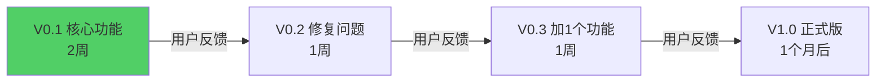

每个版本只做一件事，快速发布、快速收集反馈、快速调整。4个月后的V1.0，比你闭门造车12个月的"完美版"更贴合市场需求。

**4. 克服完美主义的心理技巧：**

- **设定"丑陋的第一版"目标**：给自己一个规则——第一版必须"足够丑"，这样你就不会忍不住继续打磨
- **公开承诺上线日期**：在社交媒体上宣布"X月X日上线"，用外部压力逼自己
- **找一个"早期用户"**：在产品还没完成时就给1-2个人试用，他们的反馈会让你知道该优先做什么
- **记住这句话**："Done is better than perfect"（完成比完美更重要）

### 进阶内容：MVP之后的迭代方法论

MVP上线只是起点，真正的挑战是**如何高效迭代**。以下是经过验证的迭代框架：

**RICE优先级排序法**：

| 维度 | 含义 | 评分标准 |
|------|------|----------|
| Reach（影响范围） | 这个功能影响多少用户？ | 1=极少, 3=部分, 5=大部分 |
| Impact（影响程度） | 对用户体验的影响有多大？ | 3=巨大, 2=高, 1=中, 0.5=低, 0.25=极低 |
| Confidence（信心度） | 你有多大把握这个功能有效？ | 100%=高, 80%=中, 50%=低 |
| Effort（工作量） | 需要多少人月？ | 越低越好 |

**RICE得分 = (Reach × Impact × Confidence) / Effort**

举例说明：假设你有一个SaaS产品，待做功能有三个：
- 功能A（暗黑模式）：影响200用户(R=3)、体验提升中(I=1)、确定要做(C=100%)、需2人周(E=2) → RICE=1.5
- 功能B（批量导入）：影响50用户(R=1)、体验提升高(I=2)、不确定是否有需求(C=50%)、需4人周(E=4) → RICE=0.25
- 功能C（修复登录Bug）：影响全部用户(R=5)、体验影响巨大(I=3)、确定(C=100%)、需1人周(E=1) → RICE=15

优先级：C >> A >> B。修复Bug的优先级是暗黑模式的10倍。

**MVP上线后的关键指标看板：**

| 指标类别 | 具体指标 | 健康标准 | 测量方法 |
|----------|----------|----------|----------|
| 获客 | 日新增用户 | >10人/天 | 后台统计 |
| 激活 | 注册→首次使用完成率 | >40% | 漏斗分析 |
| 留存 | 次日留存率 | >30% | 用户行为分析 |
| 留存 | 7日留存率 | >15% | 用户行为分析 |
| 变现 | 付费转化率 | >2% | 收入/活跃用户 |
| 推荐 | NPS净推荐值 | >30 | 用户调研 |

如果次日留存<20%，说明产品核心价值没有被用户感知——优先修复产品，不要加功能。

每两周用这个公式对所有待做功能排序，只做得分最高的1-2个。

---

## 误区八：忽视现金流管理

### 误区描述

很多创业者会看利润表，但不会看现金流量表。他们觉得"账面有利润就是赚钱"，直到有一天发现银行账户空了，发不出工资。现金流问题是创业公司猝死的第一大原因——不是没有生意，而是钱周转不过来。

### 误区剖析

#### 底层认知机制

这个误区源于**会计知识的匮乏**。大多数人只学过"收入-成本=利润"，但不知道利润和现金流是两回事。利润是"应计制"的（发生了就记），现金流是"收付实现制"的（收到钱才算）。两者之间可能有巨大的差距。

另一个原因是**乐观偏差**——创业者倾向于高估收入、低估支出，导致现金流预测失真。

#### 利润≠现金

**为什么"赚钱"的公司会倒闭？**

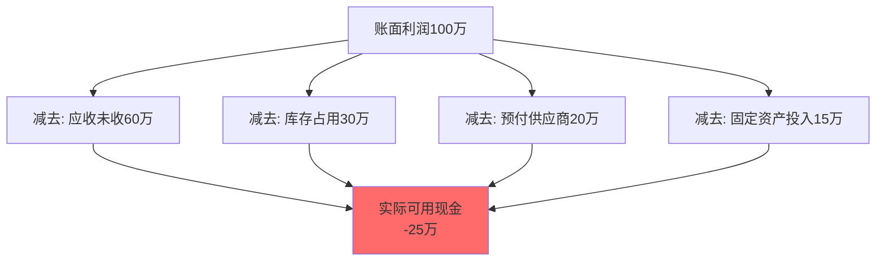

这个公司账面利润100万，但实际可用现金是-25万。如果此时大客户延迟付款3个月，公司就会因为发不出工资而倒闭。

#### 现金流断裂的六大陷阱

| 陷阱 | 机制 | 真实案例 | 预防方法 |
|------|------|----------|----------|
| 应收账款周期过长 | 客户30-90天才付款，但你需要现在就付工资和供应商 | 工程公司接了500万项目，垫资200万，客户拖了6个月才付 | 预收定金、分期付款、缩短账期 |
| 库存积压 | 大量现金变成仓库里的货物 | 电商创业者压了100万的货，结果卖不动 | 以销定采、控制库存周转天数 |
| 过度扩张 | 收入增长100%，成本增长150% | 开了10家新店，每家都在亏损 | 先验证单店模型再复制 |
| 预收款挪用 | 花了客户预付的钱，无法兑现服务 | 健身房收了年卡费，钱花光了倒闭跑路 | 预收款专户管理 |
| 季节性波动 | 旺季收入高但淡季成本不变 | 冰淇淋店夏天赚钱冬天亏 | 提前储备淡季资金 |
| 大客户依赖 | 一个客户占收入50%+，延迟付款就是灾难 | 软件公司只靠一个大客户，对方预算削减直接倒闭 | 客户多元化，单一客户不超过30% |

#### 现金流管理的三个核心指标

| 指标 | 计算方式 | 健康标准 | 危险信号 |
|------|----------|----------|----------|
| 现金流比率 | 经营现金流 / 流动负债 | >1 | <0.5 |
| 现金周转天数 | 应收天数+库存天数-应付天数 | <30天 | >90天 |
| 可维持周数 | 账户余额 / 每周固定支出 | >12周 | <4周 |

#### 真实案例：月销百万的电商公司倒闭之谜

某电商公司经营家居用品，月销售额100万，毛利率35%，看起来很赚钱。但现金流状况如下：

| 项目 | 金额 | 说明 |
|------|------|------|
| 月销售额 | 100万 | |
| 毛利 | 35万 | |
| 平台账期 | -60万 | 平台T+15天结算，钱在平台手里 |
| 库存占用 | -80万 | 平均库存周转45天 |
| 供应商预付 | -30万 | 需要预付定金锁定货源 |
| 人工+房租 | -20万 | 每月固定支出 |
| **实际现金流** | **-155万** | **每月缺口155万** |

这家公司需要额外155万的流动资金才能维持运营。一旦资金链断裂（银行贷款到期、投资人撤资），立刻倒闭。

**另一个案例：SaaS公司的现金流优势**

与电商不同，SaaS公司通常有健康的现金流：
- 客户预付年费（现金流前置）
- 几乎没有库存
- 边际成本极低
- 收入可预测（订阅模式）

这就是为什么投资人更喜欢SaaS模式——不是因为SaaS更"性感"，而是因为现金流更健康。

### 正确做法

**1. 每周做现金流量表（不是每月）**

```markdown
## 现金流周报模板

### 本周现金流入
- 已到账收入：_____元
- 应收确认本周到账：_____元
- 其他流入：_____元
- **流入小计：_____元**

### 本周现金流出
- 人工成本：_____元
- 供应商付款：_____元
- 房租水电：_____元
- 营销费用：_____元
- 其他支出：_____元
- **流出小计：_____元**

### 净现金流：_____元
### 账户余额：_____元
### 可维持周数：_____周（余额÷每周流出）
```

**2. 现金流管理的五条铁律：**

| 铁律 | 具体做法 | 常见违反场景 |
|------|----------|--------------|
| 缩短收款周期 | 预付/货到付款 > 月结30天 > 月结60天 | "客户要求60天账期，不好意思拒绝" |
| 延长付款周期 | 在不损害信誉的前提下，合理利用账期 | "供应商催款就立刻付" |
| 控制库存 | 采用"以销定采"模式，库存周转天数控制在30天以内 | "多进货能拿折扣" |
| 预留安全垫 | 银行账户始终保持3个月运营资金 | "钱放着不用太浪费" |
| 分散客户 | 任何单一客户收入占比不超过30% | "这个大客户能带来80%的收入" |

**3. 现金流预测工具：**

用一个简单的表格预测未来3个月的现金流：

| 周次 | 预计流入 | 预计流出 | 净现金流 | 累计余额 | 风险预警 |
|------|----------|----------|----------|----------|----------|
| 第1周 | | | | | |
| 第2周 | | | | | |
| ... | | | | | |
| 第12周 | | | | | |

当预测到某周余额可能为负时，提前2周开始行动（催收、减少支出、寻求融资）。

**4. 现金流危机的应急方案：**

当现金流出现危机时，按优先级执行：

1. **立即催收应收账款**（优先催收金额最大的）
2. **暂停所有非必要支出**（营销、装修、设备采购等）
3. **与供应商协商延长账期**（大多数供应商宁可延长账期也不愿失去客户）
4. **考虑短期融资**（银行贷款、供应链金融、股东借款）
5. **裁员/降薪**（最后手段，但必要时必须果断）

### 进阶内容：不同商业模式的现金流特征

理解你所在商业模式的现金流特征，才能做好针对性管理：

| 商业模式 | 现金流特征 | 管理重点 | 风险点 |
|----------|-----------|----------|--------|
| SaaS订阅 | 预收款+高毛利+可预测 | 关注MRR增长率和流失率 | 获客成本回收期 |
| 电商 | 货款周期+库存占用 | 库存周转+平台账期 | 库存积压、平台政策变化 |
| 服务型 | 项目制+回款周期 | 缩短账期+预收定金 | 大客户依赖、项目延期 |
| 内容付费 | 即时收款+高毛利 | 持续获客+内容更新 | 流量波动、平台抽成 |
| 实体零售 | 库存+租金+人工 | 库存管理+坪效优化 | 租金上涨、客流下降 |

---

## 误区九：单打独斗更好

### 误区描述

"我自己就能搞定，不需要合伙人。"很多创业者因为怕麻烦、怕纠纷，选择独自创业。独立自主没有错，但因此拒绝所有合作，就是误区了。一个人可以走得快，但一群人才能走得远。

### 误区剖析

#### 底层认知机制

这个误区的根源是两种心理：

1. **控制欲**：不想让别人影响自己的决策，觉得"我自己做效率更高"
2. **信任缺失**：曾经被合作伙伴伤害过，或者看到过太多合伙失败的案例

但问题在于：**一个人的天花板是明确的，而创业需要的能力组合远超一个人所能覆盖的范围。**

#### 一个人的天花板

| 维度 | 单人极限 | 团队优势 |
|------|----------|----------|
| 技能覆盖 | 1-2个领域精通 | 互补覆盖3-5个领域 |
| 每天有效工作 | 8-10小时 | 团队总和 |
| 决策盲区 | 严重的认知偏差 | 多元视角减少盲区 |
| 心理支撑 | 孤独感和焦虑感 | 互相鼓励和分担 |
| 资源网络 | 有限的人脉 | 人脉网络相乘 |
| 抗风险能力 | 一旦生病/受伤，业务停摆 | 有人可以顶上 |

#### 合伙人关系的常见死因

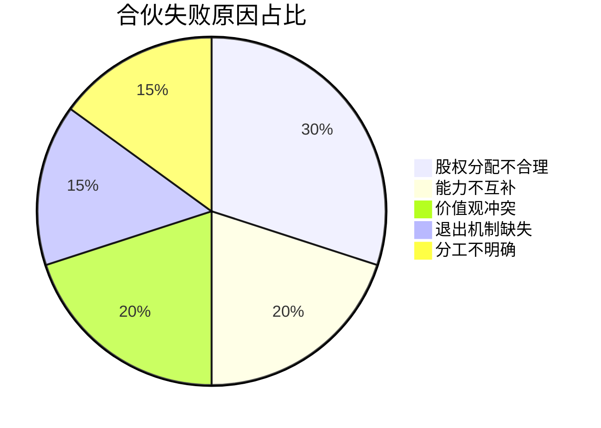

| 死因 | 典型表现 | 预防方法 |
|------|----------|----------|
| 股权平分 | 两个50%→谁说了算？决策僵局 | 有人必须持有51%以上 |
| 能力重叠 | 两个技术人员合伙，缺营销 | 选择能力互补的合伙人 |
| 投入不对等 | 一个人全职一个人兼职→心态失衡 | 明确约定投入时间和退出条件 |
| 退出无约定 | 合伙人中途要走→股权怎么算？ | 提前签订退出协议 |
| 朋友变仇人 | 钱没赚到，朋友也没了 | 先小项目试合作，再正式合伙 |

#### 真实案例

**案例1：腾讯创始团队的互补结构**

| 创始人 | 角色 | 核心贡献 |
|--------|------|----------|
| 马化腾 | 产品+战略 | 产品方向把控、商业决策 |
| 张志东 | 技术 | 架构设计、技术实现 |
| 曾李青 | 市场 | 市场推广、商务合作 |
| 许晨晔 | 运营 | 内部管理、行政运营 |
| 陈一丹 | 法务 | 法律事务、政府关系 |

五个人覆盖了产品、技术、市场、运营、法务五个核心维度。如果马化腾一个人做，腾讯不可能在1999-2004年的激烈竞争中存活下来。

**案例2：合伙失败的典型教训**

小王和小李是大学同学，合伙开了一家设计工作室。两人各占50%股份，各出5万。

- 第1个月：配合默契，业务顺利
- 第3个月：小王想接大客户（需要加班），小李想保持工作生活平衡
- 第6个月：小王觉得自己做了70%的工作，但只拿50%的钱
- 第9个月：小李觉得自己出了钱但没有话语权
- 第12个月：两人关系破裂，工作室倒闭

**失败原因分析**：
- 股权50/50，没有决策者
- 投入时间不对等，但分配一样
- 没有签订退出协议
- 朋友关系掩盖了商业分歧

### 正确做法

**1. 判断你是否需要合伙人：**

| 你的情况 | 建议 |
|----------|------|
| 技术+商业能力兼备，资金充裕 | 可以单干，但建议有顾问团 |
| 技术强但不懂营销 | 找营销型合伙人 |
| 有资源但不会执行 | 找执行型合伙人 |
| 资金有限但想法好 | 找有资金的合伙人或投资人 |

**2. 合伙人筛选的"四维评估"：**

- **能力维度**：TA的能力是否恰好是你最弱的？（互补是核心）
- **投入维度**：TA能投入多少时间和精力？（全职vs兼职要明确）
- **价值观维度**：对事业的目标和底线是否一致？（赚快钱还是做长期？）
- **品格维度**：在利益面前TA会如何选择？（看TA过去的行为，不是承诺）

**3. 合伙前必签的五份文件：**

| 文件 | 核心内容 | 重要性 |
|------|----------|--------|
| 股权分配协议 | 各自比例、投票权、分红权 | ★★★★★ |
| 竞业禁止协议 | 合伙期间和离职后一定时间内不得做同类业务 | ★★★★ |
| 退出机制协议 | 退出时股权如何处理、估值方法 | ★★★★★ |
| 分工职责说明 | 谁负责什么、KPI是什么 | ★★★★ |
| 决策机制说明 | 重大决策如何表决、日常决策谁负责 | ★★★★★ |

**4. "先合作再合伙"原则：**

不要一上来就签合伙协议。先一起做一个小项目（1-3个月），验证：
- 配合是否默契
- 工作节奏是否匹配
- 出现分歧时能否有效解决
- 对方是否言行一致

通过"试婚期"后再正式合伙，能避免80%的合伙纠纷。

**5. 股权分配的"721原则"：**

- **70%**：核心创始人（CEO/大股东），必须有绝对控制权
- **20%**：联合创始人，能力互补，但不能与核心创始人平起平坐
- **10%**：期权池，留给未来的员工和顾问

避免50/50的股权结构——这是最常见的合伙死因。

### 进阶内容：合伙协议的关键条款清单

一份完善的合伙协议应包含以下条款：

| 条款 | 内容要点 | 常见漏洞 |
|------|----------|----------|
| 股权比例 | 各方持股比例、投票权 | 只写了比例没写投票权 |
| 出资方式 | 现金/技术/资源/人脉的估值方式 | 技术出资没有明确估值 |
| 分红规则 | 分红时间、比例、留存比例 | 没有约定何时开始分红 |
| 决策机制 | 重大决策（融资/出售）需要多少比例同意 | 没有区分日常和重大决策 |
| 退出机制 | 主动退出/被动退出的股权处理方式 | 没有约定退出价格计算方法 |
| 竞业限制 | 合伙期间和离职后的竞业范围 | 范围过大或过小 |
| 知识产权 | 合伙期间产生的IP归属 | 没有约定，导致纠纷 |
| 争议解决 | 协商→调解→仲裁→诉讼的流程 | 没有约定，直接诉讼 |

**建议**：花5000-10000元请律师起草合伙协议，这笔钱能帮你避免数十万甚至数百万的纠纷。

**合伙协议核心条款速查模板（供参考，正式版请律师审定）：**

```markdown
## 合伙协议核心条款

### 第一条：基本信息
- 公司名称：___
- 注册资本：___元
- 经营范围：___

### 第二条：出资与股权
| 合伙人 | 出资方式 | 出资金额 | 持股比例 | 实缴时间 |
|--------|----------|----------|----------|----------|
| 甲方   | 现金     | ___元    | ___%     | ___      |
| 乙方   | 技术+现金 | ___元   | ___%     | ___      |

技术出资估值依据：___
股权成熟期（Vesting）：4年，每年成熟25%，满1年开始成熟

### 第三条：分工与职责
- 甲方负责：___（具体KPI：___）
- 乙方负责：___（具体KPI：___）

### 第四条：决策机制
- 日常决策（单笔<5万元）：分管负责人决定
- 重大决策（融资/出售/借贷>10万）：全体股东2/3以上同意
- 一票否决事项：___（如改变公司主营业务方向）

### 第五条：分红规则
- 分红时间：每年___月
- 分红比例：按持股比例
- 利润留存比例：不低于30%用于再投入

### 第六条：退出机制
- 主动退出：其他合伙人有权以___价格回购（估值方法：最近一轮融资估值/净利润×3/协商）
- 被动退出（严重违约）：按出资额的___%回购
- 竞业限制：退出后2年内不得从事同类业务
- 股权成熟部分归退出人所有，未成熟部分自动注销

### 第七条：争议解决
- 优先协商（7日内）
- 其次仲裁（___仲裁委员会）
- 最后诉讼（___法院管辖）
```

**合伙"试婚期"实操指南：**

正式合伙前，建议用1-3个月做一个"试婚项目"。以下是可以观察的关键维度：

| 观察维度 | 具体问题 | 判断标准 |
|----------|----------|----------|
| 工作节奏 | TA的作息和效率与你匹配吗？ | 差异过大会导致摩擦 |
| 沟通风格 | 出现分歧时，TA如何表达？ | 攻击型/回避型都是红旗 |
| 信用度 | TA承诺的事做到了多少？ | <80%不可合伙 |
| 抗压能力 | 遇到困难时，TA的第一反应是什么？ | 抱怨→不行，想办法→好 |
| 利益分配 | 小项目赚了钱，TA怎么分？ | 贪小便宜→大钱更危险 |
| 学习能力 | TA从错误中改进了吗？ | 同样的错犯两次→危险 |

---

## 误区十：创业就是为了赚钱

### 误区描述

"什么赚钱做什么"——这句话听起来很务实，但如果你的创业动机仅仅是赚钱，你大概率走不远。追风口、换赛道、什么热做什么——这种"机会主义"创业方式，看起来灵活，实际上是最大的陷阱。

### 误区剖析

#### 底层认知机制

这个误区的根源是**外在动机依赖**。心理学研究表明，外在动机（赚钱、名声、地位）虽然能提供短期的行动力，但在遇到困难时会迅速消退。而内在动机（热爱、使命感、好奇心）则能在逆境中提供持续的动力。

这就是心理学中的**自我决定理论**（Self-Determination Theory, SDT）：人类有三个基本心理需求——自主性（Autonomy）、胜任感（Competence）、归属感（Relatedness）。当这三个需求被满足时，人会表现出最高的内在动机和创造力。

#### 赚钱是结果，不是目的

把赚钱当目的的创业者，会在遇到第一个重大困难时放弃，因为"为了赚钱而受苦"是不划算的——打工也能赚钱，还不用承担风险。

#### 创业动机的三个层次

| 层次 | 动机 | 持久性 | 应对困难的能力 | 典型表现 |
|------|------|--------|---------------|----------|
| 初级 | 赚钱 | 低（6-12个月） | 遇到困难就换方向 | 频繁换项目、追风口 |
| 中级 | 解决问题 | 中（1-3年） | 有使命感支撑 | 能坚持度过困难期 |
| 高级 | 创造价值/使命 | 高（5年+） | 越挫越勇 | 改变行业、影响社会 |

#### 动机类型的对比

| 动机类型 | 心理机制 | 持久性 | 创造力 | 风险 |
|----------|----------|--------|--------|------|
| 外在动机（赚钱） | 依赖持续的正向反馈 | 一旦收入下降就失去动力 | 有限，倾向于走捷径 | 容易做出违背价值观的决策 |
| 内在动机（使命） | 源于内心的满足感 | 在逆境中仍然坚持 | 高，愿意探索和创新 | 可能忽视商业现实 |

#### 真实案例对比

| 维度 | 创业者A（赚钱导向） | 创业者B（使命导向） |
|------|---------------------|---------------------|
| 创业原因 | "这个赛道赚钱" | "我想解决XX问题" |
| 遇到困难时 | "算了，换个方向" | "再试试，也许能找到方法" |
| 第12个月状态 | 已经换了3个项目 | 坚持打磨一个方向 |
| 第36个月结果 | 仍在追风口，无积累 | 已经建立了行业口碑 |
| 第60个月结果 | 可能已放弃创业 | 可能已成为细分领域的头部 |

**更深层的对比**：

创业者A在5年内尝试了6个"风口"：社交电商、社区团购、直播带货、元宇宙、AI绘画、AI客服。每个都投入了3-6个月，每个都没有坚持到盈利。总投入超过30万，总收入不到5万。

创业者B做了一个"无聊"的领域——工业设备维修培训。没有风口、没有融资、没有媒体报道。但他在这个领域深耕5年，积累了2000+付费学员、50+企业客户，年收入稳定在200万以上。

### 正确做法

**1. 找到你的"创业使命感"：**

使命感不是玄学，可以通过结构化的方法找到。以下是三个经过验证的练习：

**练习一：愤怒清单法**

花30分钟，写下所有让你感到"这不对，应该改"的事情。不要过滤，不要判断，尽可能写多。然后从中选出3件你最想改变的。

示例：
- "中国中小企业的IT系统太落后了" → 企业数字化服务
- "家长花很多钱但孩子学不到东西" → 教育产品
- "很多好产品因为不会营销而死掉" → 营销服务

**练习二：10年信件法**

给10年后的自己写一封信，描述你希望10年后的生活状态。重点不是"赚了多少钱"，而是"做了什么事"、"帮助了什么人"、"创造了什么价值"。从这封信中提取你的长期愿景。

**练习三：遗产练习法**

假设你80岁回顾一生，你希望别人怎么评价你？"他赚了很多钱"还是"他改变了XX行业"或"他帮助了XX万人"？这个终局视角能帮你看清什么是真正重要的。

问自己三个问题：
- 什么事情让你看到就觉得"这不对，应该改"？（愤怒是强大的驱动力）
- 你愿意在没有收入的情况下坚持多久的事情是什么？（测试你的内在动机强度）
- 如果钱不是问题，你会做什么？（找到你真正关心的事）

**2. 在"解决问题"和"赚钱"之间找到交集：**

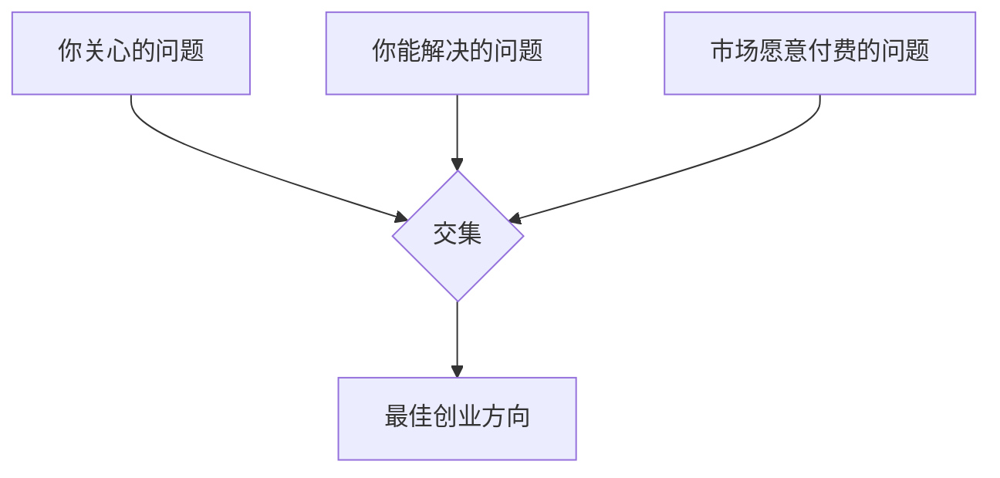

三个圈的交集就是你的最佳创业方向：
- **你关心的问题**：让你有持续的动力
- **你能解决的问题**：让你有竞争优势
- **市场愿意付费的问题**：让你能持续运营

**3. 建立"价值-收入"的正向循环：**

创业的本质是价值交换——你为用户创造价值，用户为价值付费。赚钱是你创造价值的副产品。当你把注意力放在"如何创造更多价值"而不是"如何赚更多钱"时，收入反而会增长得更快。

**具体做法**：
- 每个月问自己："我为用户创造了多少价值？"而不是"我赚了多少钱？"
- 建立用户反馈机制，持续了解用户的真实需求
- 把利润的一部分再投入到产品和服务的提升中
- 建立长期思维——宁可短期少赚，也要建立口碑和信任

### 进阶内容：如何判断你的创业方向是否有"护城河"

使命驱动不等于不考虑竞争。一个好的创业方向应该有以下一种或多种护城河：

| 护城河类型 | 含义 | 建立难度 | 持久性 | 示例 |
|-----------|------|----------|--------|------|
| 网络效应 | 用户越多，产品越有价值 | 高 | 高 | 微信、淘宝 |
| 规模效应 | 规模越大，成本越低 | 高 | 高 | 京东物流、宁德时代 |
| 品牌认知 | 用户心智中的第一选择 | 高 | 高 | 老干妈、茅台 |
| 转换成本 | 用户迁移成本高 | 中 | 中 | 企业ERP、银行系统 |
| 专利/技术 | 独有的技术壁垒 | 高 | 中（会被追赶） | 高通、华为 |
| 数据壁垒 | 独有的数据资产 | 中 | 高 | 百度地图、美团 |
| 特许经营 | 政府颁发的牌照/资质 | 极高 | 高 | 银行、电信 |

**建议**：在选择创业方向时，优先选择能建立至少一种护城河的领域。没有护城河的生意，最终都会陷入价格战。

---

## 误区全景图：认知偏差的根源与连锁反应

这十个误区并非随机出现，它们有共同的认知偏差根源，而且往往会形成**连锁反应**：

### 认知偏差根源

| 认知偏差 | 影响的误区 | 机制 | 应对方法 |
|----------|-----------|------|----------|
| 幸存者偏差 | 误区1、4 | 只看到成功案例，忽视大量失败 | 主动搜索失败案例，用数据而非故事做决策 |
| 确认偏差 | 误区2、5 | 只关注支持自己观点的信息 | 主动寻找反对意见，做"魔鬼代言人"练习 |
| 即时满足偏差 | 误区3、7 | 选择短期舒适而非长期收益 | 设置长期目标，用"未来的自己"视角做决策 |
| 沉没成本谬误 | 误区7、8 | 因为已经投入而继续错误的方向 | 定期"清零思维"——如果不考虑已投入的成本，我会怎么选？ |
| 达克效应 | 误区1、9 | 高估自己的能力，低估任务难度 | 找比你强的人做顾问，定期接受反馈 |
| 光环效应 | 误区2、10 | 因为某方面成功而以为全面都能成功 | 区分"我在X领域成功"和"我在所有领域都能成功" |

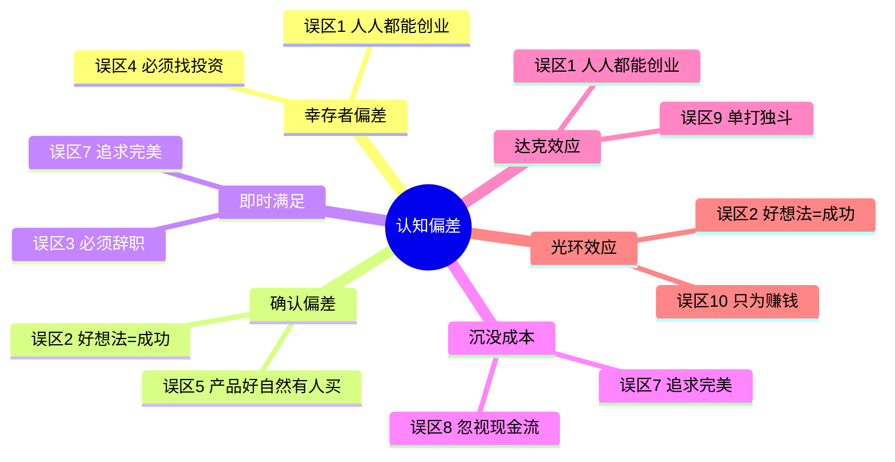

### 误区的连锁反应

更重要的是，这些误区往往会**互相触发**，形成恶性循环：

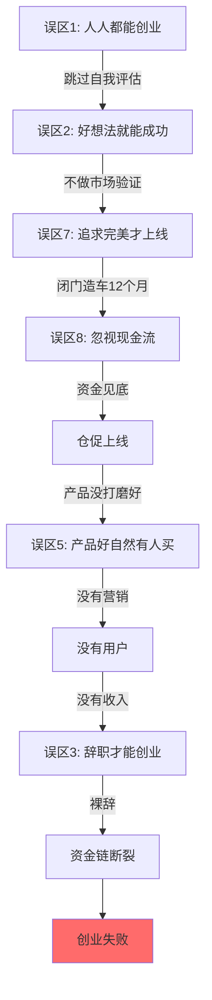

**打破连锁反应的关键**：在任何一个环节停下来，用正确的方法替代错误的信念，就能阻断恶性循环。

---

## 总结

### 十大误区速查表

| # | 误区 | 核心纠正 | 关键行动 | 认知偏差 |
|---|------|----------|----------|----------|
| 1 | 所有人都适合创业 | 创业需要特定素质组合 | 用评估矩阵自评，得分<25先积累 | 幸存者偏差 |
| 2 | 好想法就能成功 | 执行力远比想法重要 | 用假设-验证循环替代闭门造车 | 禀赋效应 |
| 3 | 必须辞职才能创业 | 先副业验证再考虑辞职 | 满足"三个达标"原则再辞职 | 即时满足偏差 |
| 4 | 创业必须找投资 | 大多数成功企业靠自有资金 | 先考虑自力更生，必要时再融资 | 权威效应 |
| 5 | 产品好自然有人买 | 产品和营销缺一不可 | 至少35%精力放在推广上 | 质量归因谬误 |
| 6 | 副业就是兼职打工 | 追求有时间杠杆的副业 | 从卖时间进化到卖产品 | 线性思维 |
| 7 | 过度追求完美 | 快速推出MVP，迭代优化 | MVP只保留20%核心功能 | 回避行为 |
| 8 | 忽视现金流 | 利润≠现金，现金流是生命线 | 每周做现金流表，保持3个月安全垫 | 乐观偏差 |
| 9 | 单打独斗更好 | 找互补的合伙人 | 先小项目试合作，再正式合伙 | 控制欲 |
| 10 | 创业就是为了赚钱 | 使命驱动才能持久 | 找到"解决问题"和"赚钱"的交集 | 外在动机依赖 |

### 防坑决策框架：C.A.R.E. 四问模型

在做任何创业/副业决策之前，用C.A.R.E.框架过滤：

- **C — Check（检查事实）**：我的决策基于数据还是情绪？
- **A — Assess（评估风险）**：最坏情况我能承受吗？
- **R — Reduce（降低成本）**：有没有更低成本的验证方式？
- **E — Evaluate（评估方向）**：这个决策符合长期目标吗？

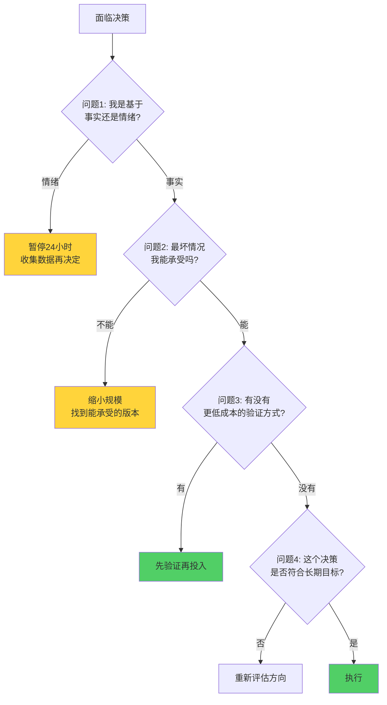

### 避免误区的终极清单

在做任何创业/副业决策之前，过一遍这个清单：

- [ ] 我是基于事实还是基于情绪在做决策？
- [ ] 我有没有受到幸存者偏差的影响？（主动搜索失败案例）
- [ ] 我有没有充分验证市场需求？（至少访谈20个目标用户）
- [ ] 我的现金流能支撑多久？（计算"可维持周数"）
- [ ] 我有没有能力互补的合作伙伴？（不是必须有，但要评估）
- [ ] 我的MVP足够"最小"了吗？（只保留20%核心功能）
- [ ] 我有没有花足够的时间在营销上？（至少35%的精力）
- [ ] 我的创业动机是解决问题还是只是赚钱？（两者都要有，但前者更重要）
- [ ] 我有没有设定清晰的止损线？（时间、资金、精力）
- [ ] 最坏的情况我能承受吗？（如果答案是"不确定"，就缩小规模）

> 创业不是赌博。赌博靠运气，创业靠认知。认知到位了，风险可控；认知不到位，再好的机会也是陷阱。避免误区的本质，不是记住十个"不要做什么"，而是建立一套**用事实和数据做决策的思维系统**。当你的决策基于验证过的事实而非未经检验的信念时，你就已经超越了90%的创业者。

### 核心概念速查

| 术语 | 定义 | 出现章节 |
|------|------|----------|
| 幸存者偏差（Survivorship Bias） | 只看到成功样本而忽视大量失败样本的认知偏差 | 误区1 |
| 禀赋效应（Endowment Effect） | 人们对自己拥有的东西赋予过高价值 | 误区2 |
| 邓宁-克鲁格效应（Dunning-Kruger Effect） | 能力不足者倾向于高估自己的能力水平 | 误区2 |
| MVP（Minimum Viable Product） | 最小可行产品，用最低成本验证核心假设的原型 | 误区7 |
| PMF（Product-Market Fit） | 产品与市场需求的匹配状态 | 误区2、5 |
| Bootstrapping | 自力更生创业，不依赖外部融资 | 误区4 |
| 现金流比率 | 经营现金流÷流动负债，衡量短期偿债能力 | 误区8 |
| RICE评分法 | Reach×Impact×Confidence÷Effort，功能优先级排序方法 | 误区7 |
| C.A.R.E.框架 | Check事实→Assess风险→Reduce成本→Evaluate方向的决策过滤模型 | 总结 |
| MILES框架 | Money/Intelligence/Location/Education/Status，不公平优势分析 | 误区1 |
| 对赌条款（VAM） | 投资协议中基于未来业绩的估值调整机制 | 误区4 |
| 股权成熟期（Vesting） | 创始人/员工股权按时间逐步获得完全所有权的机制 | 误区9 |

### 数据来源与参考

本文数据和案例来自以下渠道，读者可自行查证：

| 类别 | 来源 | 说明 |
|------|------|------|
| 企业存活率 | 国家市场监管总局《企业生命周期研究报告》 | 中国工商注册企业口径统计 |
| 创业成功率 | Y Combinator创业学校公开数据 | 仅统计YC投资组合，不代表整体市场 |
| 融资数据 | IT桔子、CVSource投中数据 | 中国一级市场投融资数据库 |
| 认知偏差理论 | Daniel Kahneman《思考，快与慢》 | 诺贝尔经济学奖得主经典著作 |
| MVP方法论 | Eric Ries《精益创业》 | 精益创业理论奠基之作 |
| 不公平优势 | Ash Ali & Hasan Kubba《The Unfair Advantage》 | MILES框架原始出处 |
| 心理学理论 | Deci & Ryan《自我决定理论》 | SDT理论原始论文 |
| 创业者心理画像 | Saras Sarasvathy《效果推理理论》 | 创业决策研究的经典框架 |
| 现金流管理 | 通用财务管理原理 | 基于GAAP/中国企业会计准则 |

**注**：文中部分案例经过脱敏处理（隐去真实姓名和企业名），数据为估算值，仅供理解趋势参考。具体创业决策应结合个人实际情况和最新市场数据。

### 从"知道"到"做到"：行动转化清单

知道误区只是第一步，关键是转化为行动。以下是按优先级排列的行动项，建议在30天内完成：

| 优先级 | 行动项 | 对应误区 | 预计时间 | 产出物 |
|--------|--------|----------|----------|--------|
| P0 | 完成创业素质自评矩阵 | 误区1 | 2小时 | 评分表+差距分析 |
| P0 | 计算可承受最大亏损金额 | 误区1、3 | 1小时 | 止损线设定 |
| P1 | 用五维打分法评估当前想法 | 误区2 | 1小时 | 想法评估报告 |
| P1 | 列出3个假设并设计验证实验 | 误区2 | 2小时 | 验证计划 |
| P1 | 制定现金流预测表（未来12周） | 误区8 | 1小时 | 现金流预测表 |
| P2 | 确定1-2个营销渠道并开始执行 | 误区5 | 4小时 | 内容发布计划 |
| P2 | 评估当前副业是否在"卖时间"层次 | 误区6 | 1小时 | 产品化路径图 |
| P3 | 如果有合伙人，检查协议完备性 | 误区9 | 2小时 | 协议检查清单 |
| P3 | 写下你的创业使命感宣言 | 误区10 | 1小时 | 200字使命宣言 |

**记住**：创业的认知升级不是一次性完成的，而是在实践中不断迭代的。每个月回来看一遍这十个误区，你会发现新的理解。因为随着你的经历增长，这些文字会在你眼中呈现完全不同的含义。
