# 第08章 创业与副业——练习方法

## 为什么需要系统化练习

创业和副业不是灵感一来就能成功的事。CB Insights对101家失败创业公司的尸检报告显示，未经验证就投入的项目失败率超过90%。系统化练习的核心价值在于：**在你投入真金白银之前，先用低成本的方式暴露问题、验证假设、积累能力。**

"练"和"干"的区别在于：练是有目的地重复某个能力模块，干是把所有模块拼在一起执行。运动员不会直接上场比赛，创业者也不应该直接拿真金白银去"试"。这十二个练习构成了一个完整的"从想法到行动"的闭环，覆盖了创业/副业的全生命周期。

**为什么大多数人创业失败？** 不是因为不够聪明或不够努力，而是因为跳过了关键步骤：

| 常见路径（高失败率） | 系统路径（低失败率） |
|---------------------|---------------------|
| 想到一个"好点子"→ 直接开发产品 → 找客户 → 没人买 → 放弃 | 想到一个点子 → 验证需求 → 找到目标用户 → 做最小产品测试 → 有人付费 → 再投入开发 |
| 凭感觉定价 → 太低亏本或太高没人买 | 成本核算+价值定价+竞品参考+阶梯测试 → 找到最优价格点 |
| 同时做3个方向 → 精力分散 → 哪个都做不好 | 三环分析选1个方向 → 全力冲刺90天 → 数据验证后再决定 |
| 遇到困难就放弃 or 明知不行还硬撑 | 系统复盘区分"操作性失败"和"结构性失败" → 理性决策坚持/转型/退出 |

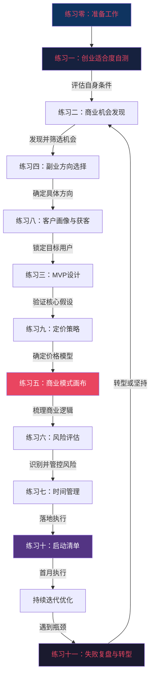

> **重要提醒**：这十二个练习不是一次性的作业，而是可以反复使用的工作流程。每次有新想法、新项目，都可以走一遍这个流程。它们是你的"创业工具箱"，遇到瓶颈时随时取用对应练习。不要试图一口气全部做完——按照下面的节奏建议，分阶段完成。

### AI时代的创业新范式

2024年以来，AI工具的爆发式普及正在深刻改变创业和副业的游戏规则。理解这些变化，能帮你避开正在消亡的方向，选择正在生长的机会：

**AI降低了什么门槛？**
- **开发门槛**：不会写代码的人可以用Cursor、Bolt、v0等AI工具搭建产品原型，原来需要2周的开发工作现在2天就能完成
- **内容创作门槛**：文案、图片、视频的创作效率提升3-10倍，一个人可以做到原来一个小团队的产出
- **运营门槛**：客服机器人、自动化营销、AI数据分析让一个人可以管理原来需要3-5人的运营工作

**AI提高了什么门槛？**
- **审美和判断力**：当AI能生成大量"及格线"内容时，真正稀缺的是能做出"80分以上"判断的人
- **深度行业知识**：AI是工具，不是替代品——你需要足够深的行业理解才能驾驭AI产出高质量结果
- **信任和人设**：在AI泛滥的时代，用户更倾向于信任"有真人背书"的品牌，个人IP的价值反而提升了

**创业者的AI工具箱（2025年版）：**

| 场景 | 推荐工具 | 成本 | 适合阶段 |
|------|----------|------|----------|
| 产品原型 | Cursor、Bolt、v0 | 免费-20美元/月 | MVP阶段 |
| 文案创作 | ChatGPT、Claude、Kimi | 免费-20美元/月 | 全阶段 |
| 图片设计 | Midjourney、即梦、可灵 | 10-30美元/月 | 内容创作 |
| 视频制作 | 剪映AI、HeyGen、D-ID | 免费-50美元/月 | 短视频获客 |
| 数据分析 | ChatGPT Code Interpreter、通义千问 | 免费 | 决策支持 |
| 客服自动化 | Coze、Dify、FastGPT | 免费-100美元/月 | 规模化阶段 |
| 网站搭建 | Notion、Framer、Webflow | 免费-15美元/月 | 品牌建设 |

**AI嵌入各练习的工作流示例：**

不要把AI当作独立工具，而是把它嵌入每个练习的执行流程中。以下是各练习阶段的AI最佳实践：

| 练习阶段 | AI应用场景 | 具体Prompt示例 | 预期效果 |
|----------|-----------|---------------|----------|
| 练习一：适合度自测 | 用AI做盲点评分的参照 | "我给自己执行力打8分，以下是我的证据：___。请客观评估这个分数是否合理，并指出我可能忽视的维度" | 避免自评过高 |
| 练习二：机会发现 | 批量分析电商差评 | "以下是100条[品类]差评，请归类痛点类型、按频率排序、评估商业价值" | 1小时完成原本1周的调研 |
| 练习三：MVP设计 | 快速搭建落地页原型 | "帮我写一个[产品名]的落地页文案，包含痛点共鸣、解决方案、社会证明和CTA" | 30分钟完成文案 |
| 练习五：商业模式 | 画布自洽性检查 | "以下是我的商业模式画布九要素，请检查逻辑是否自洽，找出最大的3个风险假设" | 发现自己忽略的盲点 |
| 练习八：客户画像 | 生成用户访谈提纲 | "我要访谈[目标用户]关于[痛点]，请设计10个非引导性问题，按漏斗顺序排列" | 5分钟获得专业访谈提纲 |
| 练习九：定价策略 | A/B测试方案设计 | "我的产品是[___]，目前定价[___]元，请设计一个定价A/B测试方案，包含变量、分流方式和成功标准" | 科学定价而非拍脑袋 |
| 练习十一：复盘 | 5个为什么的辅助分析 | "我的副业项目失败了，数据是：___。请用5个为什么方法帮我分析根本原因，提出3个可能的转型方向" | 避免自我安慰式复盘 |

**AI使用的三条红线：**

1. **不要用AI代替用户访谈**：AI可以帮你设计问题、分析数据，但不能代替你和真实用户对话。用户说的和做的是两回事，只有面对面（或电话）访谈才能捕捉到真实的犹豫、兴奋和顾虑
2. **不要用AI生成的内容直接发布**：AI生成的内容是"60分的初稿"，你需要加入自己的真实经历、独特视角和个人风格才能变成"80分以上的成品"。直接发布AI内容会被识别出来，损害信任
3. **不要用AI的分析代替自己的判断**：AI可以提供数据和视角，但最终的商业决策必须由你来做。你对行业的直觉、对用户的理解、对风险的承受能力，这些是AI无法替代的

### 快速导航：按需取用

不知道从哪里开始？根据你当前的状态直接跳转：

| 你的现状 | 直接跳转 | 预计耗时 |
|----------|----------|----------|
| 完全没想法，不知道做什么 | [练习零](#练习零开始之前的准备工作) → [练习一](#练习一创业适合度自测) → [练习二](#练习二商业机会发现训练) | 2-3周 |
| 有想法但不确定行不行 | [练习二](#练习二商业机会发现训练) → [练习八](#练习八客户画像与获客策略) → [练习三](#练习三最小可行产品mvp设计) | 2-4周 |
| 已验证想法，准备启动 | [练习三](#练习三最小可行产品mvp设计) → [练习九](#练习九定价策略设计) → [练习五](#练习五商业模式画布) → [练习十](#练习十启动清单与首月执行) | 1-2周 |
| 已经在做但不赚钱 | [练习九](#练习九定价策略设计) → [练习八](#练习八客户画像与获客策略) → [练习五](#练习五商业模式画布) | 1周 |
| 做了一段时间想放弃 | [练习十一](#练习十一失败复盘与转型决策) → [练习六](#练习六创业风险评估) | 2-3小时 |
| 已经赚钱想扩大规模 | [练习六](#练习六创业风险评估) → [练习七](#练习七副业时间管理) → [练习五](#练习五商业模式画布) | 1周 |

---

## 练习零：开始之前的准备工作

### 为什么需要准备

在正式开始这些练习之前，花30分钟做好准备工作，能让后续练习的效率提升50%以上。这就像做饭之前先把食材和工具准备好——没有人会一边切菜一边找刀。

准备工作包含三个层面：**工具准备**（硬件）、**心态准备**（软件）、**社交准备**（支持系统）。

### 工具准备清单

| 工具类别 | 推荐工具 | 用途 | 成本 |
|----------|----------|------|------|
| **笔记工具** | Notion / 飞书文档 / 印象笔记 | 记录所有练习的结果和思考 | 免费 |
| **电子表格** | 腾讯文档 / Google Sheets / WPS | 评分表、财务测算、数据分析 | 免费 |
| **思维导图** | XMind / ProcessOn / 幕布 | 梳理商业模式、SWOT分析 | 免费版够用 |
| **原型工具** | 墨刀 / Figma / 纸笔 | 快速画产品原型和用户流程 | 免费版够用 |
| **计时工具** | 滴答清单 / Forest / 系统闹钟 | 番茄钟、时间审计、提醒 | 免费-12元 |
| **录音工具** | 手机自带录音 / 飞书妙记 | 用户访谈记录 | 免费 |
| **数据收集** | 腾讯问卷 / 金数据 | 问卷调查、用户反馈收集 | 免费 |

**最低配置**：如果你什么工具都不想装，只需要一个笔记本（纸的或电子的）加一个电子表格就够了。工具不是瓶颈，行动才是。

### 知识储备：启动前的必修课

工具准备好了，还需要基本的商业认知。以下知识不需要精通，但需要了解基本概念，否则后续练习中的术语会让你卡壳：

**第一层：商业常识（花2小时快速了解）**

| 知识领域 | 核心概念 | 学习方式 | 推荐资源 |
|----------|----------|----------|----------|
| 基础财务 | 收入、成本、利润、现金流、盈亏平衡点 | 看一篇科普文章即可 | 搜索"创业财务基础入门" |
| 营销基础 | 4P理论（产品、价格、渠道、促销）、用户画像 | 看一个10分钟视频 | B站搜索"营销4P通俗解释" |
| 商业模式 | 什么是商业模式、常见的收费模式 | 读一篇案例分析 | 《商业模式新生代》第一章 |
| 法律常识 | 个体工商户注册、竞业限制、知识产权 | 浏览一篇指南 | 搜索"副业法律风险清单" |

**第二层：行业认知（花1周时间深入）**

在你感兴趣的行业里，搞清楚以下问题：
- 这个行业的上下游是谁？钱从哪里来，流向哪里？
- 行业内排名前5的公司是谁？他们的核心竞争力是什么？
- 这个行业最近1年有什么重大变化？（政策、技术、消费趋势）
- 行业内的人均收入和利润水平如何？

**信息来源**：行业研报（艾瑞咨询、36氪研究院）、行业公众号、招聘网站（看岗位需求变化）、电商平台（看品类销量趋势）。

**第三层：标杆研究（边做边学）**

找2-3个你想做的方向的成功案例，深入研究他们的路径：
- 他们是怎么从0做到1的？（起步阶段）
- 他们的第一个产品/服务是什么？（MVP形态）
- 他们是怎么获得第一批客户的？（获客渠道）
- 他们遇到过什么困难？怎么克服的？（踩坑经验）

**去哪里找标杆案例**：即刻App的"独立开发者"话题、IndieHackers网站、V2EX的"创业"节点、小红书搜索"副业第X个月"、知识星球的"生财有术"社区。

### 心态准备：创业思维的五个转变

在开始之前，你需要在认知层面完成五个转变：

| 从（打工思维） | 到（创业思维） | 为什么重要 |
|---------------|---------------|-----------|
| 等别人安排任务 | 主动发现问题和机会 | 创业者没有上级给你布置作业 |
| 追求完美再发布 | 快速迭代、边做边改 | 完美主义是创业的第一杀手 |
| 害怕失败 | 把失败当作数据点 | 每次失败都在缩小"不靠谱"的范围 |
| 一个人搞定所有 | 善于借力和合作 | 个人时间有限，杠杆才能放大产出 |
| 关注"做了什么" | 关注"产出了什么价值" | 结果导向是商业世界的基本规则 |

**五个转变的实操方法**：

仅仅知道"要转变"是不够的，你需要具体的行动来触发转变：

1. **从被动到主动**：每天花10分钟观察身边的不便，记录在手机备忘录里。坚持21天，你会发现自己开始自动扫描"机会信号"。
2. **从完美到迭代**：给自己设定一个"不完美发布"的硬性截止日期。比如"本周日之前必须发布第一条内容，不管觉得好不好"。发布后根据反馈改进，比闭门造车高效10倍。
3. **从怕失败到用失败**：每次遇到不顺利的事情，写下"这次我学到了什么"。把"失败日记"变成"学习日记"，心态会自然转变。
4. **从单打独斗到借力**：列出你认识的人中，谁可能在某件事上帮到你。主动提出"我请你喝咖啡，想请教一个XX问题"——大多数人愿意分享经验。
5. **从过程到结果**：每天结束时问自己"今天产出了什么有价值的东西？"如果答案是"没有"，明天就要调整时间分配。

### 找一个"练习搭档"

创业练习最大的敌人是"三天热度"。找一个搭档能显著提高完成率。研究显示，有问责机制的目标完成率比独自执行高出65%（来源：美国培训与发展协会ASTD研究）。

**理想搭档的特征**：
- 也在考虑创业或做副业（有共同目标）
- 愿意每周花30分钟互相汇报进度
- 能给出诚实的反馈而非只是鼓励
- 执行力不低于你（否则会被对方拖慢）

**如何找到搭档**：
1. **朋友圈**：发一条"最近在系统学习创业方法论，有人一起吗？"——愿意回应的人就是潜在搭档
2. **行业社群**：在你所在行业的微信群/社群中寻找同频的人
3. **线上社区**：知识星球、即刻、小红书创业话题下寻找
4. **同事**：如果公司没有竞业限制，有创业想法的同事是最佳搭档人选

**搭档互动模板（每周一次，30分钟）**：
```text
1. 本周完成了哪些练习？（5分钟）
2. 遇到了什么困难？（5分钟）
3. 有什么新发现或洞察？（5分钟）
4. 对方的进展反馈和建议（10分钟）
5. 下周计划完成什么？（5分钟）
```

**找不到搭档怎么办？**

如果实在找不到合适的搭档，也有替代方案：

1. **公开承诺法**：在朋友圈或社交媒体宣布"我要在X个月内启动副业"。公开承诺会产生社会压力，心理学研究表明其效果约为搭档问责的60%。
2. **付费社群法**：加入一个付费的创业/副业社群（如生财有术、即刻付费圈），付费本身就是筛选机制，社群里的活跃成员就是天然的"准搭档"。
3. **自我问责法**：每周日晚上固定30分钟做自我复盘，用本章的练习模板记录进展。设定"如果本周没完成计划，就给搭档/朋友发200元红包"的惩罚机制。
4. **AI辅助法**：用ChatGPT/Claude作为你的"练习顾问"——把每个练习的结果输入AI，让它给出反馈和建议。虽然不如真人搭档有情感连接，但在信息反馈层面足够有效。

### 选择你的起点

不是所有人都需要从练习一开始。根据你的情况选择起点：

| 你的现状 | 建议起点 | 原因 |
|----------|----------|------|
| 完全没想法，不知道做什么 | 练习一 → 练习二 | 先评估自己，再寻找机会 |
| 有想法但不确定行不行 | 练习二 → 练习八 | 直接验证机会和用户 |
| 想法已验证，准备启动 | 练习三 → 练习五 | 做MVP和商业模式 |
| 已经在做但不赚钱 | 练习九 → 练习五 | 重新审视定价和商业模式 |
| 做了一段时间想放弃 | 练习十一 | 先复盘，再决定坚持还是转型 |
| 已经赚钱想扩大规模 | 练习六 → 练习七 | 风险管控和时间优化 |

### 常见错误

| 错误 | 后果 | 纠正方法 |
|------|------|----------|
| 跳过准备工作直接开始练习 | 做到一半发现工具不齐、心态没调整好，反复中断 | 花30分钟做完准备清单，这是一次性投入，回报极高 |
| 不找练习搭档 | 遇到困难容易放弃，缺少外部视角 | 至少在朋友圈或社群中发一条邀约，响应的人就是潜在搭档 |
| 选择起点时高估自己 | 从高级练习开始，基础不牢导致后续全崩 | 诚实评估——宁可从低起点开始，也不要跳过基础 |
| 工具准备过度 | 花大量时间研究和配置工具，迟迟不开始行动 | 记住"最低配置"原则：一个笔记本+一个表格就够了 |
| 心态转变停留在认知层面 | 知道该转变但行为没跟上，遇到困难就退回打工思维 | 每周复盘时对照检查五条心态转变，记录本周哪条做到了、哪条没做到 |

### 进阶技巧：建立你的"创业操作系统"

完成准备工作后，不要急于进入练习一。花1小时建立你的个人"创业操作系统"——一套持续运转的底层框架：

**1. 建立信息输入管道**

创业需要持续的信息输入。建立一个每天自动运转的信息管道：

| 信息类型 | 来源 | 频率 | 工具 |
|----------|------|------|------|
| 行业趋势 | 36氪、虎嗅、亿欧 | 每天15分钟 | RSS阅读器或公众号 |
| 用户声音 | 目标用户所在的社群/论坛 | 每天10分钟 | 收藏夹或Notion数据库 |
| 竞品动态 | 竞品的社媒账号、产品更新 | 每周30分钟 | 竞品追踪表 |
| 技能提升 | 行业书籍、课程、播客 | 每周2小时 | 微信读书/播客App |

**2. 创建"想法捕获"系统**

好想法稍纵即逝。建立一个随时随地能记录想法的系统：

- **手机端**：微信"文件传输助手"或备忘录，看到任何痛点随手记
- **电脑端**：Notion或飞书的"想法库"数据库，定期整理
- **整理节奏**：每周日晚花15分钟，把本周的想法归类到练习二的痛点记录表中

**3. 设定"最小可行习惯"**

不要一开始就雄心勃勃地制定完美计划。先建立三个最小习惯：

| 习惯 | 最低标准 | 理想标准 | 触发条件 |
|------|----------|----------|----------|
| 每日记录 | 记1条痛点/想法 | 记3条+分析 | 晚饭后打开笔记本 |
| 每周复盘 | 回答1个问题（这周学到了什么） | 完整5问复盘 | 周日晚上 |
| 每月评估 | 重新打一次适合度评分 | 完整评估+调整计划 | 每月最后一天 |

---


## 练习一：创业适合度自测

### 为什么要做这个练习

大多数人对创业有浪漫化的想象——觉得自己有好点子就能成功。但现实是，创业本质上是一场综合能力的考验。麦肯锡的研究指出，创业者的核心素质决定了企业能否存活过前三年。这个练习不是要打击你的信心，而是帮你在投入之前看清自己的优势和短板，有针对性地提升。

创业适合度评估的核心理论来源于心理学家Scott Shane的创业特质研究，以及哈佛商学院Noam Wasserman的创始人困境框架。他们发现，成功的创业者并非在所有维度都优秀，而是在关键维度达到"及格线"以上，并在某个维度拥有突出优势。

### 创业者特质的科学基础

心理学研究将创业者特质分为三类：

| 特质类别 | 包含维度 | 可塑性 | 对成功的影响 |
|----------|----------|--------|-------------|
| **先天特质** | 风险偏好、成就动机、模糊容忍度 | 低 | 决定创业的"底层操作系统" |
| **后天能力** | 执行力、学习能力、商业敏感度 | 高 | 决定创业的"上层应用软件" |
| **外部条件** | 资金、人脉、行业经验 | 中 | 决定创业的"硬件配置" |

关键洞察：先天特质决定了你"适不适合"创业，后天能力决定了你"能不能"创业成功，外部条件决定了你"什么时候"可以启动。三者缺一不可，但后天能力的提升空间最大。

### 练习步骤

**Step 1：评估核心素质（每项1-10分）**

| 素质 | 自评分 | 评分标准 |
|------|--------|----------|
| 抗压能力 | ___ | 1分：遇到困难就焦虑失眠；5分：能保持基本冷静；10分：危机中依然能理性决策 |
| 执行力 | ___ | 1分：想法很多但从不行动；5分：能按计划推进；10分：想到就做，边做边调整 |
| 学习能力 | ___ | 1分：抗拒新事物；5分：愿意学习新知识；10分：快速掌握陌生领域的核心知识 |
| 社交能力 | ___ | 1分：不愿与陌生人交流；5分：能正常社交；10分：擅长建立深度信任关系 |
| 资源整合 | ___ | 1分：只用自己有的资源；5分：能借力他人资源；10分：善于将分散资源组合成价值 |
| 风险承受 | ___ | 1分：一点损失就难以承受；5分：能接受合理的失败；10分：把失败当作学习成本 |
| 领导力 | ___ | 1分：无法说服他人配合；5分：能带领小团队；10分：能激励团队在困境中坚持 |
| 商业敏感度 | ___ | 1分：从未关注商业信息；5分：能识别明显的市场机会；10分：能预见趋势并提前布局 |
| 自律能力 | ___ | 1分：需要外部监督才能工作；5分：能坚持日常计划；10分：无人监督也能高效产出 |
| 情绪管理 | ___ | 1分：情绪波动大影响决策；5分：基本能控制情绪；10分：压力下依然保持稳定状态 |

**Step 2：评估外部条件**

| 条件 | 现状 | 评分(1-10) | 评分说明 |
|------|------|------------|----------|
| 储备资金 | 可支撑___个月生活 | ___ | 6个月以上得8分，3-6个月得5分，不足3个月得2分 |
| 行业经验 | 从事___行业___年 | ___ | 5年以上得8分，2-5年得5分，2年以下得2分 |
| 人脉资源 | 核心人脉___人 | ___ | 50人以上得8分，10-50人得5分，10人以下得2分 |
| 技能水平 | 核心技能___ | ___ | 市场稀缺技能得8-10分，常见技能得4-6分，无明显技能得1-3分 |
| 家庭支持 | 家人___（支持/反对） | ___ | 全力支持得8-10分，中立得5分，反对得1-3分 |
| 时间余量 | 每天可投入___小时 | ___ | 4小时以上得8分，2-4小时得5分，不足2小时得2分 |

**Step 3：分析结果并制定提升计划**

| 素质部分总分 | 外部条件总分 | 综合判断 | 建议行动 |
|-------------|-------------|----------|----------|
| 60分以上 | 40分以上 | 条件成熟 | 可以启动副业，3-6个月后评估是否全职 |
| 60分以上 | 40分以下 | 软实力强，资源不足 | 先积累资金和人脉，同时用轻资产模式试水 |
| 40-60分 | 40分以上 | 资源充足，能力待提升 | 先补齐短板（执行力、商业敏感度），再启动 |
| 40-60分 | 40分以下 | 暂不建议创业 | 先在主业中积累能力、资金和人脉 |
| 40分以下 | 任意 | 需要较长时间准备 | 制定1-2年的能力提升计划 |

**Step 4：心理准备度评估**

除了硬性条件，心理准备同样关键。以下问题帮助你评估心理准备度：

| 心理维度 | 自评问题 | 是/否 |
|----------|----------|-------|
| 冒名顶替综合征 | 你是否经常觉得"我不够格做这个"？ | |
| 损失厌恶 | 失去已投入的时间/金钱，是否让你难以接受？ | |
| 完美主义 | 你是否倾向于"等一切准备好再开始"？ | |
| 外部认可依赖 | 你是否需要别人的认可才能坚持自己的决定？ | |
| 不确定性容忍 | 面对"不知道结果会怎样"的情况，你是否焦虑？ | |

> **重要提醒**：以上心理状态都是正常的，识别它们的目的不是自我否定，而是提前准备应对策略。比如"完美主义者"需要给自己设定"不完美发布"的硬性截止日期，"外部认可依赖者"需要建立内在的评估标准。

### 实战案例：小林的自测过程

小林，28岁程序员，想做技术类副业。他找了两个同事互评，取平均值后得到：

- **素质部分**：执行力8分、学习能力9分、社交能力4分、资源整合5分、商业敏感度3分 → 总分52分
- **外部条件**：资金可支撑8个月（8分）、3年开发经验（5分）、技术人脉20人（5分） → 总分38分

**分析**：小林技术能力强但商业敏感度低，社交能力是短板。他的优势在执行和学习，劣势在"把东西卖出去"。建议路径：

1. **第一步（1-3个月）**：通过技术博客建立影响力——用写作弥补社交短板，一篇好文章相当于100次无效社交
2. **第二步（同期）**：每周读1份行业分析报告，提升商业敏感度到5分及格线
3. **第三步（3个月后）**：重新评估，如果商业敏感度提升到5分以上，启动副业

小林实际执行了6个月，知乎技术专栏获得3000关注者，商业敏感度提升到5分，最终启动了"Go语言性能优化"的技术咨询服务，首月收入3200元。

### 常见错误

| 错误 | 后果 | 纠正方法 |
|------|------|----------|
| 自我评分过高 | 高估能力导致冒进 | 请信任的朋友或同事帮你评分，取平均值 |
| 忽略外部条件 | 能力够但资源不足就启动 | 外部条件和素质同等重要，不可偏废 |
| 一次评分就下结论 | 过于静态地看待自己 | 每3个月重新评估一次，跟踪变化趋势 |
| 只关注短板 | 陷入"我什么都不行"的消极思维 | 优势才是突破口，短板只需补齐到及格线 |
| 忽视心理准备 | 启动后被焦虑和自我怀疑击垮 | 先识别心理弱点，准备应对策略 |

### 进阶技巧：针对性能力提升方案

自测不是目的，提升才是。以下是针对每个低分维度的具体提升路径：

| 低分维度 | 提升方法 | 投入周期 | 预期效果 |
|----------|----------|----------|----------|
| 抗压能力 | 每周做一件让你不舒服的小事（主动社交、公开演讲等）；学习正念冥想（每天10分钟） | 2-3个月 | 从1→4分 |
| 执行力 | 使用"2分钟法则"——能2分钟内完成的事立刻做；每天设定3个Must Do任务 | 1-2个月 | 从1→5分 |
| 学习能力 | 用"费曼学习法"——学完一个概念后尝试教给别人；建立个人知识库 | 2-3个月 | 从1→5分 |
| 社交能力 | 每周主动认识1个新人；在行业社群中回答问题建立存在感 | 3-6个月 | 从1→4分 |
| 商业敏感度 | 每天读1篇36氪/虎嗅的行业分析；每周拆解1个商业案例 | 3-6个月 | 从1→5分 |
| 领导力 | 先在小范围内练习（带一个实习生、组织一次活动）；学习《一分钟经理人》 | 3-6个月 | 从1→4分 |
| 资源整合 | 建立"人脉地图"——画出你能触达的所有人脉资源；练习"先给予再索取" | 2-3个月 | 从1→4分 |

**"及格线"概念的运用**：你不需要每个维度都达到8分以上。正确的策略是——找到你最突出的1-2个优势（8分以上），把其他维度都提升到5分（及格线）。一个在某方面有突出优势、其他方面不拖后腿的人，比各方面都是6分的"平均人"更容易成功。

### 练习模板

```text
创业适合度评估
日期：____年____月____日

═══ 素质评分（满分100）═══
抗压能力：___/10  评分依据：____________________
执行力：___/10    评分依据：____________________
学习能力：___/10  评分依据：____________________
社交能力：___/10  评分依据：____________________
资源整合：___/10  评分依据：____________________
风险承受：___/10  评分依据：____________________
领导力：___/10    评分依据：____________________
商业敏感度：___/10 评分依据：____________________
自律能力：___/10  评分依据：____________________
情绪管理：___/10  评分依据：____________________
总分：___/100

═══ 外部条件评分（满分60）═══
储备资金：___/10  详情：____________________
行业经验：___/10  详情：____________________
人脉资源：___/10  详情：____________________
技能水平：___/10  详情：____________________
家庭支持：___/10  详情：____________________
时间余量：___/10  详情：____________________
总分：___/60

═══ 心理准备度 ═══
□ 冒名顶替综合征：应对策略____________________
□ 损失厌恶：应对策略____________________
□ 完美主义：应对策略____________________
□ 外部认可依赖：应对策略____________________
□ 不确定性容忍：应对策略____________________

═══ 分析与行动计划 ═══
我的核心优势（TOP3）：
1. ____________________
2. ____________________
3. ____________________

我的关键短板（TOP3）：
1. ____________________
   补齐计划：____________________
2. ____________________
   补齐计划：____________________
3. ____________________
   补齐计划：____________________

综合判断：____________________
下一步行动：____________________
```

---

## 练习二：商业机会发现训练

### 为什么要做这个练习

"想不到做什么"——这是想创业/做副业的人最常见的卡点。商业机会不是凭空想象出来的，而是通过对日常生活的敏锐观察发现的。Y Combinator的著名口号"Make something people want"的前提是：你得先知道人们想要什么。

这个练习基于精益创业（Lean Startup）的"问题-解决方案匹配"理论。Eric Ries在其著作中强调，创业者最常犯的错误是先做产品再找客户，而不是先验证问题是否存在。问题发现训练就是帮你建立"机会嗅觉"的习惯。

### 机会发现的底层逻辑

商业机会的本质是：**未被满足的需求 × 用户愿意付费 × 你能提供解决方案**。三个条件缺一不可：

- 需求存在但用户不愿付费 → 伪需求（比如"免费音乐下载"）
- 用户愿意付费但你无法提供 → 不是你的机会（比如芯片制造）
- 你能提供但需求不存在 → 自嗨产品（比如"给程序员看的时尚杂志"）

### 练习步骤

**Step 1：痛点收集（持续2周，不是1周）**

为什么是2周？因为第一周你还不习惯观察，收集的痛点质量较低；第二周你会开始自然地注意到周围的问题。这是认知心理学中的"选择性注意"效应——当你启动了一个关注点，大脑会自动过滤相关信息。

每天记录你遇到的、听到的、看到的不便和痛点：

| 日期 | 痛点描述 | 在哪里遇到的 | 影响范围 | 现有解决方案 | 现有方案的不足 | 潜在改进方向 |
|------|----------|-------------|----------|-------------|----------------|-------------|
| | | | | | | |

**痛点收集的六个来源：**

1. **自身痛点**：你自己的工作和生活中反复遇到的不便。这类痛点你最了解，解决方案也最可能靠谱。方法：每天花5分钟记录"今天什么事情让我觉得烦/低效/不爽"。
2. **职业痛点**：你在工作中发现的行业低效环节。这类痛点往往有付费意愿高的B端市场。方法：每周梳理一个"如果有个工具能自动完成XXX就好了"的时刻。
3. **社交圈痛点**：朋友、家人、同事抱怨的问题。扩大样本量能发现共性需求。方法：主动问身边人"最近有什么事情让你很头疼"。
4. **线上痛点**：社交媒体、论坛、问答平台上反复出现的求助帖。这是需求量化的金矿（下面详细展开）。
5. **AI时代新痛点**：AI工具的普及创造了全新的痛点——"工具太多不知道用哪个"、"AI生成的内容质量不稳定"、"不会写prompt"。这些痛点正在快速涌现，竞争格局尚未固化。
6. **跨行业痛点嫁接**：把A行业成熟的解决方案搬到B行业。比如把电商的"个性化推荐"逻辑搬到教育领域做"个性化学习路径"。

**线上痛点挖掘的具体方法：**
- **知乎**：搜索"有没有一种工具/方法可以..."、"每次XXX都很烦"等句式，关注高赞回答下的评论区
- **小红书**：搜索"求推荐"、"怎么办"、"有好用的XXX吗"，注意反复出现的需求
- **抖音评论区**：热门视频评论区的吐槽和求助，往往是最真实的需求
- **行业论坛/V2EX/SegmentFault**：技术人群的痛点表达更直接，付费意愿更高
- **电商差评**：淘宝/京东1-2星评价，每个差评都是一个未被满足的需求
- **AI工具社区**：Reddit的r/ChatGPT、GitHub Trending、ProductHunt，AI时代的痛点正在快速涌现

**Step 2：痛点验证与价值评估**

收集到15-20个痛点后，用以下框架进行筛选：

| 评估维度 | 问题 | 评分方式 |
|----------|------|----------|
| 受众规模 | 有多少人遇到这个问题？ | 小(1分)：小众群体；中(3分)：某个行业或年龄段；大(5分)：跨行业通用 |
| 痛感强度 | 用户为这个问题有多痛苦？ | 低(1分)：小烦恼；中(3分)：影响效率或心情；高(5分)：造成实际损失 |
| 付费意愿 | 用户愿意花多少钱解决？ | 无(0分)；低(1分)：几十元；中(3分)：几百元；高(5分)：几千元以上 |
| 替代方案 | 目前有没有好的解决方案？ | 有好方案(1分)；有但不好用(3分)；完全没有(5分) |
| 我的优势 | 我解决这个问题的能力如何？ | 无能力(0分)；可学习(2分)；已有能力(5分) |

**综合评分 = 各维度分数之和，满分25分**

**Step 3：深度调研TOP3机会**

对评分最高的3个机会，做进一步调研：

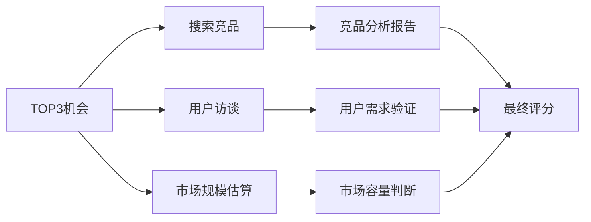

**竞品分析清单：**
- 在搜索引擎和应用商店搜索关键词，列出前5个竞品
- 分析竞品的定价、用户评价、功能特点
- 找到竞品的不足之处（看1-2星差评最有效）
- 注册试用竞品，亲身体验痛点
- 用SimilarWeb或七麦数据查看竞品的流量和排名趋势
- 在社交媒体搜索竞品品牌名，看用户的真实吐槽

**竞品分析模板：**

| 分析维度 | 竞品A | 竞品B | 竞品C | 我的方案 |
|----------|-------|-------|-------|----------|
| 核心功能 | | | | |
| 定价策略 | | | | |
| 目标用户 | | | | |
| 获客渠道 | | | | |
| 用户好评点 | | | | |
| 用户差评点 | | | | |
| 市场份额/流量 | | | | |
| 差异化优势 | | | | |

**用户访谈清单：**
- 找3-5个目标用户进行15分钟访谈
- 问题1：你遇到过[痛点]吗？多久遇到一次？
- 问题2：你目前怎么解决的？满意吗？
- 问题3：如果有一个工具/服务能解决，你愿意付多少钱？
- 问题4：你还遇到过哪些类似的问题？
- 问题5：如果现在就有这个产品，你会立刻购买吗？（测试真实付费意愿）

**访谈注意事项：**
- 不要引导性提问（"你觉得这个好不好？"→"你平时遇到这个问题会怎么办？"）
- 关注用户的行为而非观点（"你愿意付费吗"不如"你为类似产品付过费吗"）
- 记录用户的原话，不要用自己的理解转述
- 至少访谈5个人，3个人以下的样本量不可靠

**市场规模估算方法：**

```text
TAM（总可触达市场）= 目标人群总数 × 人均年消费
SAM（可服务市场）= TAM × 你能覆盖的地域/渠道比例
SOM（可获取市场）= SAM × 你预期的市场份额（通常取1%-5%）
```

示例：个性化童书推荐
- TAM = 1亿小学生家庭 × 500元/年童书消费 = 500亿元
- SAM = 500亿 × 线上渠道占比30% = 150亿元
- SOM = 150亿 × 0.001% = 150万元/年

只要SOM大于你的目标收入（比如年入30万），市场就足够大。

**Step 4：制定验证计划**

**快速验证法（1天版）——不想等6周？先做这个：**

如果你已经有一个具体想法，不想花2周收集痛点再验证，可以用这个"1天快速验证法"在24小时内初步判断方向是否可行：

| 时间 | 动作 | 目标 | 成功标准 |
|------|------|------|----------|
| 上午2小时 | 在目标平台搜索关键词，列出前5个竞品 | 确认市场存在 | 至少有2个活跃竞品（说明需求真实） |
| 下午2小时 | 找3个目标用户做15分钟电话/微信访谈 | 确认痛点真实 | 至少2人表示"确实有这个问题" |
| 晚上2小时 | 发一条朋友圈/社群消息，描述你的解决方案 | 测试付费意愿 | 至少1人主动问"怎么收费"或"什么时候能用" |

**1天验证结果判断：**
- 3项全通过 → 进入正式验证流程（下面的6周计划）
- 2项通过 → 需要调整方向的某个维度，再做1天验证
- 1项或0项通过 → 这个方向大概率不行，换一个想法

对最终筛选出的1个最优机会，制定详细的验证计划：

| 验证阶段 | 时间 | 目标 | 具体动作 | 成功标准 |
|----------|------|------|----------|----------|
| 需求验证 | 第1-2周 | 确认问题真实存在 | 发放问卷+用户访谈 | 至少10人确认问题存在 |
| 方案验证 | 第3-4周 | 确认方案可行 | 画原型+展示给用户 | 至少5人表示愿意使用 |
| 付费验证 | 第5-6周 | 确认用户愿意付费 | 预售或众筹 | 至少3人付费 |

### 机会验证检查清单

在投入大量时间之前，用这个清单确保你的机会经得起推敲：

| 检查项 | 通过标准 | 验证方法 | ✓/✗ |
|--------|----------|----------|-----|
| 需求真实存在 | ≥10个非亲友用户确认有此痛点 | 用户访谈+问卷 | |
| 用户愿意付费 | ≥3人实际付款（非口头承诺） | 预售或众筹 | |
| 市场规模足够 | SOM≥你的年收入目标 | TAM/SAM/SOM计算 | |
| 竞品有明显不足 | 至少找到竞品的2个可改进点 | 竞品差评分析 | |
| 你有能力解决 | 核心交付能力评分≥6/10 | 自评+搭档评估 | |
| 获客渠道可行 | 至少1个渠道的获客成本可控 | 小规模投放测试 | |
| 成本低于收入 | 预估利润率≥20% | 成本核算表 | |

> **关键原则**：7项中至少5项通过才值得继续推进。如果"需求真实存在"或"用户愿意付费"未通过，直接放弃该机会——其他项可以优化，这两项不行。

### 实战案例：从痛点到副业

小王是一名小学老师，她在痛点收集时记录了以下问题：
- 家长经常问"孩子适合读什么书"
- 自己也很难快速找到适合每个孩子阅读水平的书单
- 现有的推荐系统太笼统，不考虑孩子兴趣

她的评分：受众规模5分（所有家长）、痛感强度4分、付费意愿3分、替代方案2分（有但不好）、自身优势4分 → 总分18分。

验证过程：
1. **需求验证**：在3个家长群做问卷，收到127份回复，87%表示愿意为个性化书单付费
2. **方案验证**：先用手动方式为20个孩子定制书单，家长满意度4.6分（5分制）
3. **付费验证**：定价39元/份书单，朋友圈发布后3天收到18单

正式运营后：第一个月收入2100元，第三个月达到8000元，第六个月建立小程序自动化后月入1.5万。

### 进阶技巧：系统化的机会发现方法

掌握了基础的痛点收集方法后，以下进阶技巧能帮你更高效地发现高质量机会：

**1. "抱怨链"追踪法**

一个用户的抱怨往往是一条完整的需求链。例如：
- 抱怨"每次开会都要手动记笔记" → 需求1：自动会议记录 → 需求2：会议纪要生成 → 需求3：待办事项自动提取 → 需求4：会议数据统计分析
- 沿着抱怨链往下游追踪，你往往能找到竞品尚未覆盖的细分需求

**2. "迁移创新"法**

在一个领域成熟的产品/服务，迁移到另一个领域可能就是蓝海：
- 知乎（问答社区）→ 丁香医生（医疗问答）→ 法律问答 → 教育问答
- 滴滴（出行匹配）→ 货拉拉（货运匹配）→ 技能匹配 → 项目外包匹配

操作步骤：列出你熟悉的行业，找到其他行业已经验证成功的模式，思考如何适配到你的行业。

**3. "AI辅助机会发现"工作流**

利用AI工具加速机会发现过程：

```bash
# 步骤1：用AI分析电商差评数据
# 提取某品类1-2星评价 → 输入ChatGPT → 让AI归类痛点类型和频率

# 步骤2：用AI分析社交媒体趋势
# 搜索特定话题下的高频问题 → AI归纳共性需求

# 步骤3：用AI做竞品差距分析
# 输入竞品功能列表 → AI识别缺失功能和改进空间
```

示例Prompt：
```text
以下是100条[品类]的1-2星差评，请帮我：
1. 归类为5-8个主要痛点类型
2. 按出现频率排序
3. 分析每个痛点是否有现有解决方案
4. 评估每个痛点的商业价值（付费意愿）
```

**4. "未被满足的需求"信号清单**

以下信号表明某处存在未被满足的需求：

| 信号 | 含义 | 去哪里找 |
|------|------|----------|
| 人们用Excel/文档手动管理某件事 | 没有好用的专业工具 | 行业社群、论坛 |
| 某个搜索词的搜索量持续增长 | 需求在扩大但供给不足 | 百度指数、Google Trends |
| 某个品类的差评集中在同一问题 | 现有产品有明显缺陷 | 电商平台评论区 |
| 人们愿意付高价解决某个小问题 | 痛感极强 | 咨询/服务类平台 |
| 某个流程需要5个以上步骤 | 有简化的空间 | 自己的工作流观察 |
| 新政策/新技术创造了新需求 | 时间窗口机会 | 政策文件、科技新闻 |

### 常见错误

| 错误 | 后果 | 纠正方法 |
|------|------|----------|
| 只收集不分析 | 积累大量笔记但无法转化为行动 | 每周末花1小时回顾并评分 |
| 验证时找朋友而非目标用户 | 朋友出于礼貌说"挺好的" | 找完全不认识的潜在用户访谈 |
| 跳过付费验证直接开发产品 | 做出来没人买 | 在写第一行代码之前，先收到第一笔钱 |
| 一个痛点都没找到就放弃 | 可能是观察方法不对 | 换个角度：从行业、人群、场景分别观察 |
| 把"兴趣"当作"付费意愿" | 用户说"挺好"但不掏钱 | 只有实际付款才是真正的验证 |

### 练习模板

```text
商业机会发现训练
记录周期：____月____日 至 ____月____日

═══ 痛点记录（至少15个）═══
1. ____________（来源：自身/职业/社交/线上）
2. ____________（来源：自身/职业/社交/线上）
3. ____________（来源：自身/职业/社交/线上）
...（继续记录）

═══ TOP5痛点评分 ═══
|| 痛点 | 受众 | 痛感 | 付费 | 替代 | 能力 | 总分 ||
||------|------|------|------|------|------|------||
||      | /5   | /5   | /5   | /5   | /5   | /25  ||
||      |      |      |      |      |      |      ||
||      |      |      |      |      |      |      ||

═══ TOP3深度调研 ═══
机会1：____________________
- 竞品：____________________
- 竞品不足：____________________
- 用户访谈结论：____________________

机会2：____________________
- 竞品：____________________
- 竞品不足：____________________
- 用户访谈结论：____________________

机会3：____________________
- 竞品：____________________
- 竞品不足：____________________
- 用户访谈结论：____________________

═══ 最终选择 & 验证计划 ═══
选定机会：____________________
目标用户：____________________
验证方式：____________________
验证周期：____天
验证预算：____元
成功标准：____________________
```

---

## 练习三：最小可行产品（MVP）设计

### 为什么要做这个练习

MVP（Minimum Viable Product）是精益创业的核心概念。Eric Ries将其定义为"用最少的努力、最少的开发时间，收集最大量的经证实的认知"。MVP不是做一个半成品，而是做一个能验证核心假设的最简方案。

很多人对MVP有误解，以为一定要写代码、做App。实际上，MVP的形式多种多样，从一个微信群到一个落地页，从一次手工服务到一份PDF文档，都可以是MVP。关键不在于产品有多完整，而在于它能否验证你最核心的假设。

> **AI加速提示**：在设计MVP时，善用AI工具可以将开发周期从2周缩短到2天。用Cursor/Bolt/v0搭建产品原型，用ChatGPT/Claude撰写落地页文案和用户访谈提纲，用Coze/Dify搭建AI客服原型。但记住：AI帮你加速的是"构建"，验证仍然需要真实用户。

### MVP的七种形态

| MVP类型 | 适用场景 | 开发成本 | 验证周期 | 适合验证什么 |
|---------|----------|----------|----------|-------------|
| 人工模拟型 | 服务类业务 | 几乎为零 | 1-2周 | 用户是否需要这个服务 |
| 落地页型 | 产品类业务 | 100-500元 | 1-2周 | 用户是否愿意留下联系方式 |
| 预售型 | 实物/课程/服务 | 几乎为零 | 2-4周 | 用户是否愿意付费 |
| 社群型 | 内容/知识付费 | 几乎为零 | 2-4周 | 用户是否愿意持续参与 |
| 单功能型 | 工具/软件类 | 500-5000元 | 2-4周 | 核心功能是否解决问题 |
| 门面型（Wizard of Oz） | 自动化产品/平台 | 500-2000元 | 2-4周 | 用户是否愿意使用"看起来自动化"的服务 |
| 视频/演示型 | 复杂产品/硬件 | 200-1000元 | 1-2周 | 用户是否理解并感兴趣 |

**AI原生型MVP（2024-2026新增）：**

在AI时代，有一种新的MVP类型值得单独说明——用AI工具快速搭建"看起来像完整产品"的原型，然后用人工+AI的方式提供服务，验证需求后再投入开发真正的自动化版本。

| AI MVP形态 | 具体做法 | 成本 | 验证周期 | 适合验证什么 |
|-----------|----------|------|----------|-------------|
| AI+人工服务 | 用ChatGPT/Claude帮客户完成任务，收取服务费 | 0元 | 1-2周 | 用户是否愿意为AI辅助的服务付费 |
| AI生成产品 | 用AI生成电子书、模板、课程大纲等数字产品 | 0-50元 | 1周 | 市场对这类产品的需求强度 |
| AI搭建原型 | 用Cursor/Bolt/v0快速搭建功能原型 | 0-20美元 | 1-3天 | 用户是否理解并愿意使用这个产品 |
| AI Agent服务 | 用Coze/Dify搭建AI Agent，包装成服务产品 | 0元 | 1-2周 | 用户是否愿意为"定制AI助手"付费 |

**AI原生型MVP的实操流程：**

1. **定义服务边界**：明确AI能做什么、不能做什么，把"不能做"的部分用人工补齐
2. **包装成产品**：不要告诉用户"背后是AI在做"（除非是AI工具类产品），提供的是解决方案不是技术
3. **测试付费意愿**：先用免费体验获取10个用户反馈，再测试付费意愿
4. **记录人工成本**：记录每个订单的人工处理时间，计算是否值得开发自动化版本
5. **决定是否自动化**：如果月订单>30单且人工处理时间>2小时/单，值得投入开发自动化版本

**人工模拟型MVP详解：**

这是成本最低但验证效果最好的方式。核心思路是：先用人工方式提供服务，不写一行代码。

示例：
- 想做一个"智能排课系统"？先用Excel帮3个培训机构手工排课，记录痛点
- 想做"宠物寄养平台"？先在朋友圈接5单，用微信群管理，跑通全流程
- 想做"AI写作助手"？先自己用ChatGPT帮10个人写文案，测试付费意愿

**门面型MVP（Wizard of Oz）详解：**

用户看到的是一个"完整的产品界面"，但实际上背后是人工在操作。这种方式适合验证"用户是否愿意使用一个看似自动化的服务"。

经典案例：
- Zappos创始人：网站上展示鞋子照片，有人下单后自己去实体店买鞋发货
- 某AI简历优化工具：用户上传简历，系统显示"AI分析中"，实际是创始人手动用ChatGPT分析
- 某个性化营养方案：用户填写问卷后收到"AI生成的营养方案"，实际是营养师手动编写

**门面型MVP的搭建步骤：**
1. 用建站工具搭建一个看起来专业的产品页面
2. 设计用户输入表单（收集需求信息）
3. 用户提交后显示"处理中"的加载动画
4. 后台收到通知，人工处理并发送结果
5. 收集用户反馈，验证核心假设

### 练习步骤

**Step 1：定义核心假设**

每个商业想法都有几个关键假设，其中最关键的那个决定了整个想法是否成立。你的MVP只需要验证这一个假设。

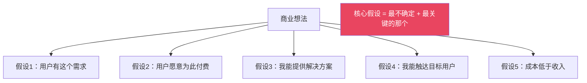

**判断核心假设的方法：** 问自己"如果这个假设不成立，整个项目是否就不值得做？"答案是"是"的那个，就是核心假设。

**不同阶段的核心假设不同：**

| 阶段 | 核心假设 | 验证方法 |
|------|----------|----------|
| 0→1（想法阶段） | 用户有这个需求吗？ | 用户访谈+问卷 |
| 1→10（产品阶段） | 用户愿意为这个方案付费吗？ | 预售/付费测试 |
| 10→100（增长阶段） | 这个获客渠道能规模化吗？ | 小规模投放测试 |

**Step 2：设计MVP方案**

| 你的核心假设 | MVP方案 | 验证指标 | 成功标准 |
|-------------|---------|----------|----------|
| 用户愿意为XX付费 | 朋友圈/社群预售 | 付费人数 | ≥5人付费 |
| 用户需要XX功能 | 手工模拟服务 | 用户满意度+复购率 | 满意度≥8分，复购≥30% |
| XX人群有XX需求 | 问卷+访谈 | 有效问卷回收量 | ≥50份有效问卷 |
| 用户会使用XX工具 | 落地页+报名 | 留资转化率 | ≥10%转化率 |

**Step 3：确定MVP功能清单**

用"必须有/应该有/可以有/不会有"（MoSCoW方法）来排序功能：

| 功能 | 必须有(Must) | 应该有(Should) | 可以有(Could) | 不会有(Won't) |
|------|-------------|---------------|--------------|---------------|
| 功能A | ✓ | | | |
| 功能B | | ✓ | | |
| 功能C | | | ✓ | |
| 功能D | | | | ✓ |

**原则**：MVP只包含"必须有"的功能。其他留到验证成功后再添加。每增加一个"必须有"功能，都要问：如果没有这个功能，用户还会用吗？如果答案是"还会"，把它降级为"应该有"。

**Step 4：设定验证指标和成功标准**

| 指标 | 测量方式 | 成功标准 | 失败后的行动 |
|------|----------|----------|-------------|
| 用户兴趣度 | 问卷/落地页访问 | 访问转化率≥5% | 调整价值主张或目标人群 |
| 付费意愿 | 预售/付费测试 | 至少5人付费 | 降低定价或改变产品形态 |
| 用户满意度 | 使用后评分 | NPS≥30 | 改进核心功能 |
| 复购率 | 二次购买 | 复购率≥20% | 深入分析流失原因 |

**Step 5：MVP迭代策略**

MVP不是一次性产品，而是"构建-测量-学习"循环的起点：

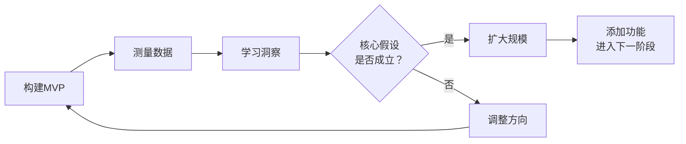

**迭代决策框架：**

| 数据表现 | 判断 | 下一步 |
|----------|------|--------|
| 转化率高+复购率高 | 需求强烈 | 快速扩大规模 |
| 转化率高+复购率低 | 需求存在但方案不够好 | 优化产品体验 |
| 转化率低+复购率高 | 产品好但获客有问题 | 调整营销策略 |
| 转化率低+复购率低 | 核心假设可能不成立 | 重新审视问题和用户 |

### 实战案例：三种MVP的实操

**案例1：人工模拟型——个人健身教练想做线上课程**

MVP方案：不开发课程平台，先在微信群里做"21天减脂打卡营"
- 定价：99元/人
- 内容：每天早上发训练视频（用手机拍），晚上打卡
- 工具：微信群 + 腾讯文档
- 结果：招到15人，满意度4.8分，3人续费第二期
- 结论：需求验证成功，下一期开发正式课程

**案例2：预售型——手工艺人想卖手工饰品**

MVP方案：不开店不囤货，先在小红书发10篇图文笔记
- 成本：材料费200元 + 拍照时间
- 测试：在笔记评论区收集"想要"的用户，私信沟通定制需求
- 结果：3天收到47条"想要"留言，12人加微信，5人下单
- 结论：需求强烈，开始筹备正式开店

**案例3：落地页型——想做一个效率工具**

MVP方案：不做App，做一个落地页展示功能描述
- 工具：用免费建站工具搭建
- 测试：投放200元朋友圈广告到落地页，看注册转化率
- 结果：200次访问，23人注册（转化率11.5%）
- 结论：转化率达标，开始开发MVP版本

**案例4：门面型——想做一个AI简历优化服务**

MVP方案：搭建一个简单的网页表单，用户上传简历后"AI分析"
- 实际流程：用户上传 → 收到邮件通知 → 用ChatGPT手动分析 → 发送结果
- 成本：域名50元 + 建站工具免费版
- 测试：在脉脉和LinkedIn推广，收集20份简历
- 结果：15人收到分析后回复"很有帮助"，8人愿意付费（99元/次）
- 结论：需求验证成功，开始开发真正的自动化版本

### MVP快速搭建工具箱

| 需求 | 推荐工具 | 成本 | 适用场景 |
|------|----------|------|----------|
| 落地页 | 腾讯云官网建站、上线了、Notion | 免费-200元/年 | 展示产品信息、收集线索 |
| 问卷调查 | 腾讯问卷、金数据、问卷星 | 免费 | 需求验证、用户调研 |
| 小程序 | 微信小程序云开发 | 免费额度 | 轻量工具、表单收集 |
| 社群管理 | 微信群+企业微信 | 免费 | 社群型MVP、用户反馈 |
| 支付收款 | 微信支付商户码、支付宝收款 | 0.6%手续费 | 预售、付费测试 |
| 内容发布 | 小红书、公众号、知乎 | 免费 | 内容型MVP、获客 |
| 原型设计 | 墨刀、Figma、Axure | 免费版可用 | 展示产品原型给用户 |
| AI辅助 | ChatGPT、Claude、通义千问 | 免费-20元/月 | 内容生成、数据分析、客服模拟 |

### 常见错误

| 错误 | 后果 | 纠正方法 |
|------|------|----------|
| MVP做太多功能 | 耗时太长，错过验证时机 | 问自己"如果只能有一个功能，选哪个？" |
| MVP太粗糙，影响用户体验 | 用户因为体验差而流失 | MVP可以简陋但不能有明显bug |
| 没有设定成功标准 | 不知道验证是否通过 | 在开始前就写下具体数字 |
| 只验证"有人感兴趣"，不验证"有人付费" | 兴趣≠付费意愿 | 在验证早期就测试付费意愿 |
| MVP验证失败就放弃整个方向 | 可能只是方案不对，问题依然存在 | 换一种MVP形态重新验证同一个问题 |

### 进阶技巧：从MVP到正式产品的过渡策略

MVP验证成功后，很多人不知道下一步该做什么。这个阶段的核心挑战是：**如何在保持验证精神的同时，逐步提升产品质量**。

**MVP→V1.0的过渡框架：**

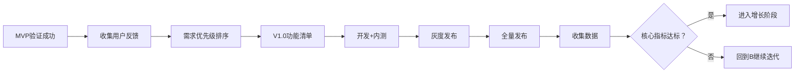

**MVP成功后的关键决策：**

| 决策点 | 选项A | 选项B | 判断标准 |
|--------|-------|-------|----------|
| 是否扩大功能？ | 只优化核心功能 | 添加用户呼声最高的功能 | 如果核心功能满意度<8分，先优化核心 |
| 是否提价？ | 保持验证期价格 | 逐步提价到目标价格 | 如果转化率>15%，可以考虑提价 |
| 是否投入更多资金？ | 用利润滚动发展 | 投入积蓄加速发展 | 如果ROI>3:1，值得投入 |
| 是否全职投入？ | 继续兼职做 | 辞职全力做 | 副业收入连续3个月≥主业80%再考虑 |

**MVP的"不要清单"（常见诱惑与抵制）：**

- 不要因为"用户说想要"就加功能——先看数据，用户用什么比说什么重要
- 不要因为"竞品有"就跟进——你和竞品的定位不同，不需要功能对齐
- 不要因为"看起来不专业"就花大量时间美化——功能优先于形式
- 不要因为"技术债"就停下来重构——先跑起来，等到真的影响效率再优化
- 不要因为一个大客户的需求就偏离方向——除非这个大客户代表了普遍需求

### 练习模板

```text
MVP设计工作坊
日期：____年____月____日

═══ 项目基本信息 ═══
产品/服务名称：____________________
一句话描述：____________________
解决的问题：____________________
目标用户画像：____________________

═══ 核心假设验证 ═══
假设1：____________________  （最关键？ 是/否）
假设2：____________________  （最关键？ 是/否）
假设3：____________________  （最关键？ 是/否）
核心假设（最关键的那一个）：____________________

═══ MVP方案设计 ═══
MVP类型：□人工模拟 □落地页 □预售 □社群 □单功能 □门面型 □演示型
MVP描述：____________________
所需工具：____________________
开发/搭建成本：____元
开发周期：____天

═══ 功能优先级（MoSCoW）═══
必须有：
1. ____________________
2. ____________________

应该有：
1. ____________________

可以有（V2版本）：
1. ____________________

不会有（明确排除）：
1. ____________________

═══ 验证计划 ═══
|| 指标 | 目标值 | 实际值 | 是否达标 ||
||------|--------|--------|----------||
|| 访问/曝光量 | | | ||
|| 转化率 | | | ||
|| 付费人数 | | | ||
|| 满意度 | | | ||

验证周期：____天
验证预算：____元

═══ 验证结果 ═══
实际数据：____________________
用户反馈：____________________
结论：□继续推进 □调整方向 □放弃
下一步：____________________
```

---

## 练习四：副业方向选择

### 为什么要做这个练习

"做什么副业"这个问题看似简单，实际上需要综合考虑三个维度：**你有什么**（资源盘点）、**市场要什么**（需求匹配）、**你能坚持多久**（可持续性）。很多人的副业失败不是因为方向不对，而是因为选了一个与自己资源不匹配、无法持续的方向。

这个练习基于"机会-能力-热情"三环交叉模型（类似Jim Collins的刺猬概念）。最好的副业方向，是在你擅长的、市场需要的、你有热情的三者交叉区域。

> **前置练习提醒**：如果你还没有完成[练习二：商业机会发现](#练习二商业机会发现训练)，建议先完成它再做本练习。练习二帮你发现了多个商业机会，本练习帮你在这些机会中选出最适合你的方向。如果跳过练习二直接选方向，容易陷入"拍脑袋"决策。

### 2024-2026年副业趋势分析

AI时代正在重塑副业格局。理解趋势不是为了追风口，而是为了**避开正在消亡的方向，选择正在生长的方向**。以下是基于行业数据和平台观察的趋势分析：

| 趋势 | 具体表现 | 对副业者的影响 | 机会窗口 |
|------|----------|---------------|----------|
| AI工具平民化 | ChatGPT、Midjourney、Claude等工具降低创作门槛 | 内容创作类副业竞争加剧，需要找到差异化；同时AI辅助效率可提升3-10倍 | 已全面打开 |
| 远程工作常态化 | 越来越多公司接受远程协作，数字游民群体增长 | 地域限制减弱，可以服务全国甚至全球客户；跨境副业成为可能 | 持续扩大 |
| 知识付费成熟化 | 用户对课程质量要求提高，低质内容被淘汰 | 低质量课程难以生存，深度专业内容+陪跑服务更有市场 | 需要差异化 |
| 短视频/直播电商 | 抖音、快手、视频号电商生态完善 | 新的变现渠道，但需要内容能力；图文种草仍有红利 | 6-12个月 |
| 独立开发者兴起 | 一人公司、独立SaaS成为趋势，AI降低开发门槛 | 技术人员有了更多变现路径；非技术人员也可用AI构建工具 | 持续扩大 |
| 跨境电商2.0 | Temu、SHEIN、TikTok Shop全球化 | 供应链优势+AI翻译+跨境物流成熟，个人也能做跨境 | 12-24个月 |
| 本地生活服务数字化 | 美团、抖音本地生活的渗透率仍在提升 | 本地服务（家政、维修、教育）的线上获客成本低 | 持续 |

**AI时代的副业机会矩阵：**

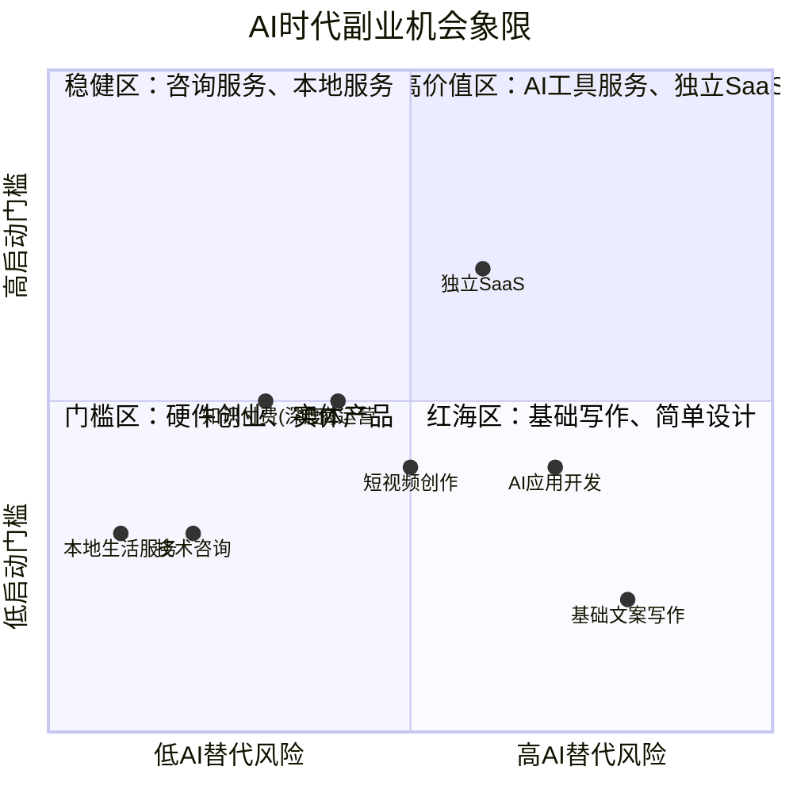

**特别提醒：被AI冲击最大的副业方向**（慎入或需要转型）：
- 基础翻译（AI翻译质量已接近人工）
- 模板化设计（Canva AI、美图AI已能完成80%）
- 基础文案写作（AI生成+人工润色的模式正在取代纯人工）
- 简单数据录入和整理（RPA+AI已高度自动化）

**被AI增强而非替代的方向**（值得投入）：
- 需要深度行业知识的咨询服务（AI提供工具，人提供判断）
- 需要情感连接的服务（教练、心理咨询、高端客户管理）
- 需要创意和审美的内容（AI生成素材，人把关品质和调性）
- AI工具本身的使用培训和定制服务（帮别人用好AI）

**常见副业陷阱——这些方向看起来赚钱，实际上大概率失败：**

| 陷阱方向 | 为什么危险 | 真实数据 | 如果你已经在做 |
|----------|-----------|----------|--------------|
| 无货源电商（一件代发） | 利润极薄（5%-15%），平台规则频繁变化，竞品抄袭零门槛 | 大多数卖家月利润<2000元，且需要持续投入广告费 | 转向有差异化选品或自建品牌 |
| 知识付费（纯搬运型） | 把别人的书/课程重新包装，缺乏独特价值，用户复购率极低 | 头部10%赚走90%的钱，长尾创作者月入<500元 | 加入自己的实践经验，从"搬运"升级为"实战分享" |
| 刷单/薅羊毛/灰色项目 | 法律风险极高，平台封号，收入不稳定 | 随时可能被追责，收入不可持续 | 立刻停止，转向合法方向 |
| 代理/加盟（需预付大额费用） | 大多数加盟本质是"你帮品牌方承担风险"，回本周期长 | 60%的加盟在1年内亏损 | 仔细核算回本周期，超过6个月的慎入 |
| 自媒体（纯流量变现） | 依赖平台算法，流量波动大，广告收入低 | 万粉账号月广告收入可能不到500元 | 流量只是入口，必须设计后端变现产品 |

### 练习步骤

**Step 1：全面资源盘点**

| 资源类型 | 详细内容 | 水平(1-10) | 变现可能性(1-10) |
|----------|----------|------------|-----------------|
| 专业技能 | 具体技能名+使用年限 | | |
| 兴趣爱好 | 具体爱好+投入时间 | | |
| 行业认知 | 了解的行业+深度 | | |
| 人脉资源 | 可调动的人脉类型和数量 | | |
| 设备工具 | 已有的设备、软件、账号 | | |
| 时间余量 | 每天/每周可投入小时数 | | |
| 资金余量 | 可投入的最大金额 | | |
| 内容积累 | 已有的文章、视频、粉丝 | | |

**Step 2：副业类型深度匹配**

| 副业类型 | 核心能力要求 | 启动成本 | 到月入5000时间 | 每日投入 | 天花板 | 适合度自评 |
|----------|-------------|----------|---------------|----------|--------|-----------|
| 自媒体写作 | 写作能力+选题能力 | 0元 | 6-12个月 | 1-2小时 | 月入5万+ | |
| 短视频创作 | 拍摄+剪辑+选题 | 1000-5000元 | 3-8个月 | 2-3小时 | 月入10万+ | |
| 电商（无货源）| 选品+运营 | 3000-10000元 | 2-4个月 | 2-3小时 | 月入3万+ | |
| 技能接单 | 专业技能 | 0元 | 1-2个月 | 灵活 | 月入2万+ | |
| 知识付费（课程）| 教学能力+专业知识 | 0-5000元 | 6-12个月 | 前期集中 | 月入10万+ | |
| 社群运营 | 组织能力+内容能力 | 0元 | 6-12个月 | 1-2小时 | 月入3万+ | |
| 代运营服务 | 平台运营能力 | 0元 | 2-4个月 | 2-3小时 | 月入5万+ | |
| AI工具服务 | AI工具使用+行业知识 | 0-1000元 | 1-3个月 | 1-2小时 | 月入3万+ | |
| 咨询服务 | 行业深度经验 | 0元 | 3-6个月 | 灵活 | 月入5万+ | |
| 手工/设计产品 | 手工艺/设计能力 | 2000-10000元 | 3-6个月 | 2-3小时 | 月入2万+ | |
| 独立SaaS开发 | 编程能力+产品思维 | 0-5000元 | 3-12个月 | 2-4小时 | 月入10万+ | |
| AI应用开发 | 编程+AI工具使用 | 0-2000元 | 2-6个月 | 2-3小时 | 月入5万+ | |

**Step 3：三环交叉分析**

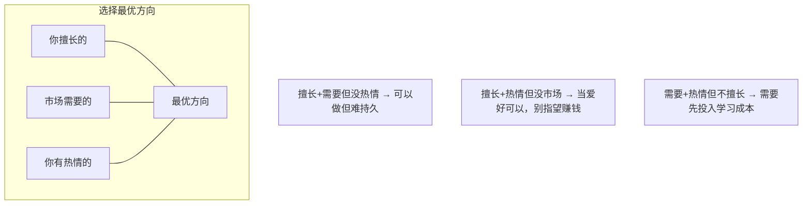

**评分方法**：对每个候选方向，在三个维度各打1-10分，总分最高的方向优先考虑。

| 候选方向 | 擅长度(/10) | 市场需求(/10) | 热情度(/10) | 总分(/30) |
|----------|------------|-------------|------------|----------|
| 方向1： | | | | |
| 方向2： | | | | |
| 方向3： | | | | |

**Step 4：副业可扩展性评估**

选择副业方向时，不仅要考虑"能不能赚钱"，还要考虑"能赚多久"和"能赚多少"：

| 评估维度 | 问题 | 评分(1-5) |
|----------|------|-----------|
| 时间杠杆 | 能否用同样的时间服务更多客户？ | |
| 资产积累 | 做的事情能否产生复利效应？ | |
| 可自动化 | 哪些环节可以被工具/系统替代？ | |
| 可外包 | 哪些环节可以交给别人做？ | |
| 护城河 | 别人模仿你的难度有多大？ | |

**可扩展性类型对比：**

| 类型 | 特征 | 例子 | 天花板 |
|------|------|------|--------|
| 计时型 | 按小时收费，收入=时间×单价 | 1对1辅导、咨询服务 | 低（时间有限） |
| 计件型 | 按项目收费，收入=项目数×单价 | 设计接单、文案撰写 | 中（需要持续接单） |
| 产品型 | 一次创建，反复销售 | 课程、模板、工具 | 高（边际成本趋近于零） |
| 平台型 | 连接供需双方，收取佣金 | 社群、撮合服务 | 最高（网络效应） |

**Step 5：制定90天行动计划**

不要做"3年规划"，做90天冲刺。原因：副业初期变化太快，长期规划大概率作废。90天足够验证方向是否可行，又不会浪费太多时间。

| 阶段 | 时间 | 核心目标 | 关键动作 | 验证指标 |
|------|------|----------|----------|----------|
| 启动期 | 第1-30天 | 跑通基础流程 | 搭建渠道、发布前10个内容/产品 | 获得第一批用户/关注者 |
| 增长期 | 第31-60天 | 找到增长引擎 | 分析数据、优化转化、扩大推广 | 收入达到1000-3000元 |
| 稳定期 | 第61-90天 | 建立可持续模式 | 标准化流程、建立复购 | 收入稳定在3000元以上 |

**90天行动计划细化（按周拆解）：**

**启动期（第1-30天）每周重点：**

| 周次 | 核心任务 | 具体动作 | 预期产出 | 遇到卡点怎么办 |
|------|----------|----------|----------|----------------|
| 第1周 | 基础搭建 | 注册账号、完善资料、确定品牌名和一句话介绍 | 账号就绪、品牌基础 | 名字想不出来？先随便取一个，后面可以改 |
| 第2周 | 内容测试 | 发布5篇不同类型的内容，观察哪种类型受欢迎 | 5篇内容+初步数据 | 0阅读量？正常，继续发，同时去相关话题下互动引流 |
| 第3周 | 互动引流 | 每天在目标平台互动30分钟，回复评论、参与讨论 | 50-100个关注者 | 互动没效果？检查是否在正确的社区/话题下互动 |
| 第4周 | 首次成交 | 设计引流钩子（免费资源/体验），引导到私域 | 10-30个私域用户 | 没人加微信？引流钩子价值不够高，或引导话术不清晰 |

**增长期（第31-60天）每周重点：**

| 周次 | 核心任务 | 具体动作 | 预期产出 | 关键数据 |
|------|----------|----------|----------|----------|
| 第5周 | 数据分析 | 分析前4周数据，找到最受欢迎的内容类型和转化路径 | 数据报告 | 哪篇内容带来最多关注？哪个渠道转化率最高？ |
| 第6周 | 内容优化 | 复制成功内容模式，提高发布频率到每天1篇 | 7篇优化内容 | 阅读量是否在增长？互动率是否提升？ |
| 第7周 | 转化优化 | 优化从公域到私域的转化路径，测试不同的引流钩子 | 转化率提升 | 公域→私域转化率是否达到5%以上？ |
| 第8周 | 首批付费 | 推出付费产品/服务，限时优惠获取首批客户 | 3-10个付费用户 | 付费转化率、客户反馈、续费/复购意愿 |

**稳定期（第61-90天）每周重点：**

| 周次 | 核心任务 | 具体动作 | 预期产出 | 关键数据 |
|------|----------|----------|----------|----------|
| 第9周 | 流程标准化 | 把获客→转化→交付的流程写成SOP | 标准化流程文档 | 能否用1小时完成原来需要3小时的工作？ |
| 第10周 | 复购设计 | 设计复购机制（会员、续费、升级包） | 复购方案 | 复购率是否达到20%以上？ |
| 第11周 | 扩大推广 | 在第2个渠道开始布局，或加大第1个渠道投入 | 新增关注者翻倍 | 获客成本是否可控？ |
| 第12周 | 90天复盘 | 全面复盘数据、收入、时间投入，决定下一步 | 复盘报告+下一步计划 | 有效时薪是否超过主业时薪的50%？ |

**90天后决策矩阵：**

| 情况 | 数据表现 | 决策 | 下一步 |
|------|----------|------|--------|
| 远超预期 | 月收入>5000元且增长中 | 加大投入 | 考虑是否转为全职，或招人扩大规模 |
| 符合预期 | 月收入1000-5000元 | 继续优化 | 优化转化率和客单价，目标3个月后翻倍 |
| 低于预期 | 月收入<1000元但有增长 | 调整策略 | 重新审视练习四的三环分析，可能方向需要微调 |
| 严重低于预期 | 月收入<500元且无增长 | 考虑转型 | 用练习十一做失败复盘，决定坚持还是换方向 |

### 实战案例：工程师老张的副业选择

老张，32岁，后端工程师，月薪2.5万。

**资源盘点**：Go/Python精通，有分布式系统经验，在技术圈有一定影响力（知乎5000关注者），每天可投入2小时。

**三环分析**：
- 技术接单：擅长10分、需求8分、热情3分 = 21分（太累，像加班）
- 技术博客+知识付费：擅长8分、需求7分、热情8分 = 23分 ✓
- AI应用开发：擅长6分、需求9分、热情9分 = 24分 ✓✓

**选择**：AI应用开发方向，因为市场需求最大且热情最高。

**90天计划**：
- 第1个月：用AI+Go开发一个"智能代码审查工具"的MVP，在GitHub开源
- 第2个月：写系列教程，在知乎/掘金推广，收集企业用户反馈
- 第3个月：推出付费版（月费99元），目标10个付费用户

**实际结果**：90天后获得8个付费用户，月收入792元。虽然不多，但验证了方向可行性，继续迭代到第6个月达到月入8000元。

### 常见错误

| 错误 | 后果 | 纠正方法 |
|------|------|----------|
| 选"看起来很赚钱"的方向 | 自己不擅长也坚持不下去 | 先从擅长的出发，赚钱是结果 |
| 同时做2-3个方向 | 精力分散，哪个都做不好 | 先全力做一个方向90天 |
| 没算时间成本 | 忙了一圈发现时薪还不如打工 | 计算"有效时薪"：月收入÷月投入小时数 |
| 忽略"可扩展性" | 副业永远是"计件制" | 选择能产生复利效应的方向 |
| 追风口而忽略自身基础 | 风口过了自己什么都没积累 | 风口要结合自身优势，不是盲目跟风 |

### 进阶技巧：副业方向的动态调整

副业方向不是选定就不变了。市场在变，你在变，方向也需要随之调整。关键是建立一套"信号-判断-行动"的调整机制。

**方向调整的五个信号：**

| 信号 | 含义 | 行动 |
|------|------|------|
| 连续3周数据零增长 | 增长引擎可能失效 | 换获客渠道或调整价值主张 |
| 时薪持续下降 | 效率在变差或定价过低 | 优化流程或提价 |
| 客户画像偏移 | 实际用户和预期不同 | 调整目标用户，可能需要重新定位 |
| 竞争加剧、利润下降 | 赛道变拥挤 | 差异化或向上下游延伸 |
| 你开始厌倦这个方向 | 热情消退，难以持续 | 评估是否转型，不要硬撑 |

**"副业组合"思维：**

当你的第一个副业稳定后，可以考虑构建"副业组合"——类似投资组合的分散风险逻辑：

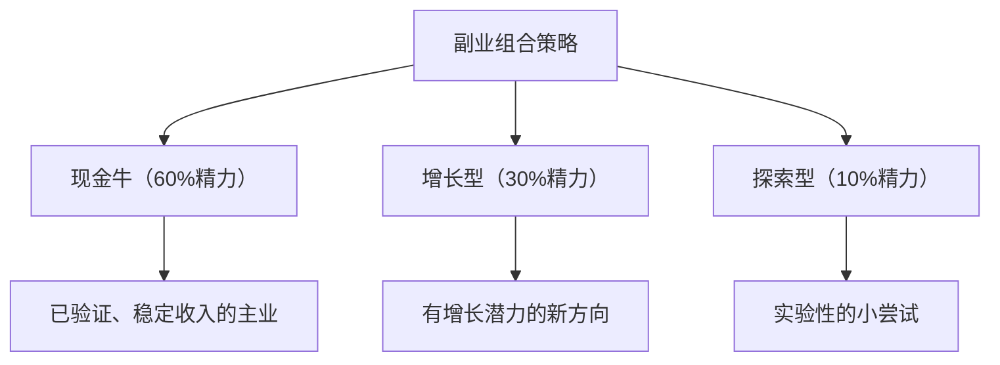

- **现金牛**：已经验证成功、收入稳定的副业，维持即可
- **增长型**：正在快速增长、有更大空间的方向，重点投入
- **探索型**：花少量时间尝试新想法，失败了不心疼，成功了升级为增长型

这个模型确保你始终有稳定收入，同时不失去探索新机会的能力。

### 练习模板

```text
副业方向选择
日期：____年____月____日

═══ 资源盘点 ═══
专业技能：____________________（水平：___/10）
行业经验：____________________（年限：___年）
兴趣爱好：____________________（投入度：___/10）
已有人脉：____________________（数量：___人）
已有内容/作品：____________________
每天可用时间：___小时
可投入资金：___元

═══ 三环分析 ═══
|| 候选方向 | 擅长度 | 市场需求 | 热情度 | 总分 ||
||----------|--------|----------|--------|------||
||          | /10    | /10      | /10    | /30  ||
||          |        |          |        |      ||
||          |        |          |        |      ||

首选方向：____________________
选择理由：____________________

═══ 可扩展性评估 ═══
时间杠杆：___/5  资产积累：___/5  可自动化：___/5
可外包：___/5    护城河：___/5    总分：___/25

═══ 90天行动计划 ═══
第1-30天（启动期）：
- 核心目标：____________________
- 关键动作：
  1. ____________________
  2. ____________________
  3. ____________________
- 验证指标：____________________

第31-60天（增长期）：
- 核心目标：____________________
- 关键动作：
  1. ____________________
  2. ____________________
  3. ____________________
- 验证指标：____________________

第61-90天（稳定期）：
- 核心目标：____________________
- 关键动作：
  1. ____________________
  2. ____________________
  3. ____________________
- 验证指标：____________________

═══ 90天后复盘（完成后填写）═══
实际收入：____元/月
有效时薪：____元/小时
是否继续：□继续 □调整 □放弃
下一步：____________________
```

---

## 练习五：商业模式画布

### 为什么要做这个练习

商业模式画布（Business Model Canvas）由Alexander Osterwalder在2010年提出，是全球使用最广泛的商业模式分析工具。它的价值在于：**用一张图看清整个生意的逻辑。**

> **关联练习**：画布中的"收入来源"要素需要结合[练习九：定价策略](#练习九定价策略设计)来设计；画布完成后，用[练习六：风险评估](#练习六创业风险评估)来检验各要素的风险敞口。

很多创业者（尤其是技术出身的创业者）会陷入"先把产品做出来再说"的思维，忽略了商业模式中其他关键要素。商业模式画布强迫你在动手之前想清楚：客户是谁、怎么赚钱、成本多少、需要什么资源。这不是"纸上谈兵"，而是在最小成本阶段暴露致命盲点。

### 练习步骤

**Step 1：理解九要素之间的关系**

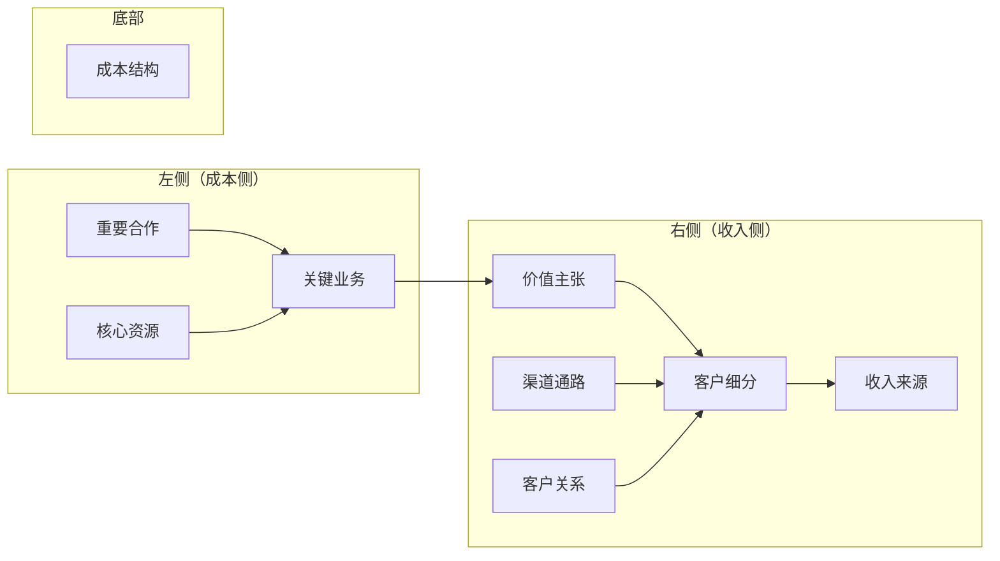

**九要素的核心逻辑**：左侧回答"你凭什么能做这个生意"（资源+业务+合作），右侧回答"你靠什么赚钱"（客户+价值+渠道+关系+收入），底部回答"你要花多少钱"（成本）。

**Step 2：逐一填写九要素**

每个要素不仅要填"是什么"，还要填"为什么"和"怎么验证"：

**客户细分（Customer Segments）**

| 维度 | 问题 | 你的回答 |
|------|------|----------|
| 目标人群 | 你为谁创造价值？ | |
| 人群特征 | 年龄、职业、收入、地域 | |
| 人群规模 | 你能触达的潜在客户有多少？ | |
| 核心需求 | 他们最迫切的需求是什么？ | |
| 现有替代 | 他们现在怎么解决这个问题？ | |

**价值主张（Value Propositions）**

| 维度 | 问题 | 你的回答 |
|------|------|----------|
| 解决什么问题 | 你帮客户消除什么痛点？ | |
| 提供什么利益 | 你能带来什么具体好处？ | |
| 与竞品的差异 | 你比现有方案好在哪里？ | |
| 一句话价值主张 | 用一句话说清楚"我帮XX解决XX问题" | |

**渠道通路（Channels）**

| 渠道类型 | 具体渠道 | 成本 | 预期效果 |
|----------|----------|------|----------|
| 获客渠道 | 如何让新客户知道你？ | | |
| 转化渠道 | 如何让客户决定购买？ | | |
| 交付渠道 | 如何把产品/服务送到客户手上？ | | |
| 售后渠道 | 如何处理客户问题和反馈？ | | |

**客户关系（Customer Relationships）**

| 关系类型 | 适用场景 | 你的选择 |
|----------|----------|----------|
| 自助服务 | 标准化产品，用户自行操作 | |
| 社区互动 | 需要用户参与和互动 | |
| 个人助理 | 高客单价，需要一对一服务 | |
| 自动化服务 | 用技术手段提供个性化服务 | |

**收入来源（Revenue Streams）**

| 收入模式 | 描述 | 单价 | 预期月量 |
|----------|------|------|----------|
| 产品销售 | 一次性购买 | | |
| 订阅制 | 月费/年费 | | |
| 服务费 | 按次/按项目收费 | | |
| 广告收入 | 展示广告/内容植入 | | |
| 佣金/分成 | 促成交易收取佣金 | | |
| 免费增值 | 基础免费+高级付费 | | |

**核心资源（Key Resources）**

| 资源类型 | 需要什么 | 已有/需要获取 |
|----------|----------|--------------|
| 人力资源 | | |
| 物质资源 | 设备、场地等 | |
| 知识资源 | 技术、专利、数据 | |
| 财务资源 | 启动资金、周转资金 | |

**关键业务（Key Activities）**

列出必须做好的3-5件事：
1. ____________________
2. ____________________
3. ____________________

**重要合作（Key Partnerships）**

| 合作方 | 提供什么 | 给予什么 | 合作方式 |
|--------|----------|----------|----------|
| | | | |

**成本结构（Cost Structure）**

| 成本项 | 固定/可变 | 月成本 | 占比 |
|--------|----------|--------|------|
| | | | |
| **合计** | | **____元** | **100%** |

**Step 3：绘制完整商业模式画布**

将以上内容汇总到一张画布上，检查逻辑是否自洽。

**自洽性检查清单：**
- [ ] 价值主张是否解决了客户细分的真实痛点？
- [ ] 渠道通路是否能触达目标客户？
- [ ] 收入来源是否与客户关系类型匹配？
- [ ] 核心资源是否足以支撑关键业务？
- [ ] 成本结构是否低于收入预期？
- [ ] 整体商业模式是否有至少2个收入来源（降低风险）？
- [ ] **护城河：你的竞争壁垒是什么？别人为什么不能轻易复制你？**

**Step 4：构建竞争壁垒**

这是很多创业者忽略的关键步骤。如果没有竞争壁垒，你的商业模式越成功，越会吸引大量模仿者，最终把利润压到零。

| 壁垒类型 | 描述 | 难度 | 适合的副业类型 |
|----------|------|------|---------------|
| **品牌信任** | 用户信任你这个人比信任竞品更难替代 | 建立慢，但一旦建成壁垒极高 | 咨询服务、知识付费、个人IP |
| **网络效应** | 用户越多，产品越好用 | 最难复制 | 社群、平台类、SaaS |
| **数据壁垒** | 积累的用户数据越多，算法越准 | 时间换壁垒 | AI工具、推荐系统 |
| **技术优势** | 技术领先竞品6-12个月 | 持续投入维护 | 工具类SaaS、AI应用 |
| **成本优势** | 比竞品成本低30%以上 | 需要规模 | 实体产品、供应链 |
| **关系壁垒** | 与客户或供应商的深度绑定 | 需要时间积累 | B2B服务、咨询 |
| **内容积累** | 内容资产（文章、视频）持续带来流量 | 时间换壁垒 | 内容创作、SEO |
| **运营效率** | 比竞品更高效地提供服务 | 持续优化 | 本地服务、代运营 |

**副业者最现实的壁垒策略：** 不要追求技术壁垒（需要资金）或网络效应（需要规模）。最现实的壁垒是**品牌信任+内容积累**——持续输出高质量内容，建立个人品牌，让客户因为信任你这个人而选择你，这是大公司用钱也买不到的。

**Step 5：验证关键假设**

商业模式中的每个判断都是假设，需要验证。找到"如果错了，整个生意就完了"的那个假设，优先验证。

| 关键假设 | 验证方式 | 验证成本 | 验证周期 | 结果 |
|----------|----------|----------|----------|------|
| | | | | |

### 实战案例：在线英语口语陪练的商业模式画布

| 要素 | 内容 |
|------|------|
| 客户细分 | 25-35岁职场人，需要英语口语提升，月收入1-3万 |
| 价值主张 | 真人外教1对1陪练，30分钟/次，价格仅为线下机构的1/5 |
| 渠道通路 | 小红书+知乎内容获客，微信私域转化 |
| 客户关系 | 微信群+课程顾问跟进 |
| 收入来源 | 课时包销售（10节课499元、30节课1299元） |
| 核心资源 | 10名兼职外教、课程体系、排课系统 |
| 关键业务 | 外教招募与培训、课程设计、获客与转化 |
| 重要合作 | 海外招聘平台、支付工具 |
| 成本结构 | 外教课时费60%、获客成本20%、平台运维10%、其他10% |

**关键假设验证**：最核心的假设是"用户愿意为线上口语陪练付费"。验证方式：在小红书发布3篇口语学习笔记，评论区引导"想体验的扣1"，然后私信提供免费体验课，最后转化付费。结果：3篇笔记获得200+评论，转化15人付费，验证成功。

**盈利测算**：
- 月均获客：小红书3篇/周 × 4周 = 12篇，平均500阅读/篇 = 6000曝光
- 转化率：关注5% → 300人，私域导入30% → 90人，付费15% → 约14人/月
- 客单价：平均800元/人（10节+30节加权）
- 月收入：14 × 800 = 11,200元
- 月成本：外教费6,720 + 获客2,240 + 运维1,120 = 10,080元
- 月利润：约1,120元（初期微利，规模化后利润率提升）

### 常见错误

| 错误 | 后果 | 纠正方法 |
|------|------|----------|
| 只填"是什么"不填"怎么验证" | 画布变成纸上谈兵 | 每个要素至少有一个验证方法 |
| 收入来源过于单一 | 一旦渠道变化就断粮 | 设计至少2个收入来源 |
| 忽略成本结构 | 收入看着不错但利润为负 | 先算成本再定价 |
| 客户细分太笼统 | "面向所有人"等于面向没有人 | 细分到具体的用户画像 |
| 忽视客户关系设计 | 获取了用户但留不住 | 设计从获客到复购的完整关系链路 |

### 进阶技巧：精益画布与商业模式迭代

**精益画布（Lean Canvas）——适合早期创业者**

标准商业模式画布适合成熟企业，但对于刚起步的副业/创业项目，精益画布更实用。它是Ash Maurya对标准画布的简化版本，聚焦于"问题-解决方案"的验证：

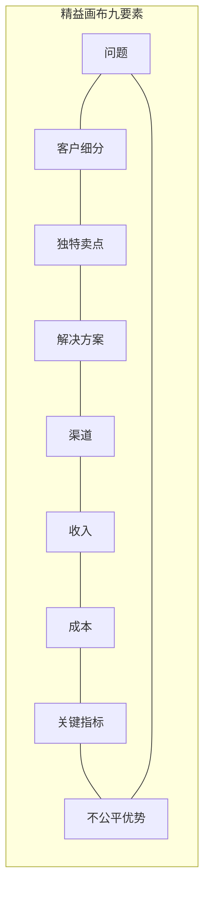

| 要素 | 精益画布 | 标准画布 | 为什么不同 |
|------|----------|----------|-----------|
| 核心问题 | 替代了"关键合作" | 有"重要合作" | 早期最重要的是找到问题，不是找合作方 |
| 独特卖点 | 替代了"价值主张" | 有"价值主张" | 更强调差异化——用户为什么要选你而不是别人 |
| 解决方案 | 从"关键业务"拆出 | 合并在"关键业务"中 | 早期需要聚焦解决方案而非泛泛的业务 |
| 不公平优势 | 新增 | 无对应 | 你的护城河是什么？别人为什么抄不走？ |
| 关键指标 | 新增 | 无对应 | 你用什么数字衡量成败？ |

**精益画布填写模板**：

```text
精益画布
日期：____年____月____日

═══ 问题（TOP3）═══
1. ____________________
   现有方案：____________________
2. ____________________
   现有方案：____________________
3. ____________________
   现有方案：____________________

═══ 客户细分 ═══
早期使用者画像：____________________
谁最痛苦？____________________

═══ 独特卖点 ═══
一句话（用"____，而非____"格式）：
示例："帮创业者验证想法的实操工具箱，而非理论课程"

═══ 解决方案 ═══
针对问题1：____________________
针对问题2：____________________
针对问题3：____________________

═══ 渠道 ═══
获客：____________________
转化：____________________

═══ 收入 ═══
收入模式：____________________
客单价：____元
LTV（用户终身价值）：____元

═══ 成本 ═══
CAC（获客成本）：____元
固定成本：____元/月

═══ 关键指标 ═══
AARRR指标：
- Acquisition（获取）：____________________
- Activation（激活）：____________________
- Retention（留存）：____________________
- Revenue（收入）：____________________
- Referral（推荐）：____________________

═══ 不公平优势 ═══
别人无法轻易复制的：____________________
```

**商业模式的持续迭代**：

商业模式不是一次画完就不改了。随着你对市场和用户的理解加深，画布应该持续更新：

| 阶段 | 画布版本 | 重点更新 |
|------|----------|----------|
| 想法阶段 | V0.1 | 全是假设，重点标注"待验证" |
| 验证后 | V0.5 | 替换已验证的假设，修正错误判断 |
| 首次收入后 | V1.0 | 基于真实数据填入收入和成本 |
| 稳定运营后 | V2.0 | 优化盈利模型，探索新增长点 |
| 转型/扩展后 | V3.0+ | 每次重大变化都更新画布 |

### 练习模板

```text
商业模式画布
日期：____年____月____日

项目名称：____________________
一句话价值主张：____________________

═══ 九要素 ═══
客户细分：____________________
价值主张：____________________
渠道通路：____________________
客户关系：____________________
收入来源：____________________
核心资源：____________________
关键业务：____________________
重要合作：____________________
成本结构：____________________

═══ 收入模型测算 ═══
|| 收入来源 | 单价 | 月销量 | 月收入 ||
||----------|------|--------|--------||
|| | | | ||
|| 合计 | | | ____元 ||

|| 成本项 | 月成本 ||
||--------|--------||
|| | ||
|| 合计 | ____元 ||

月利润 = ____元 - ____元 = ____元
盈亏平衡需要：____个客户/月

═══ 关键假设验证 ═══
假设1：____________________  验证方式：____________________
假设2：____________________  验证方式：____________________
假设3：____________________  验证方式：____________________

最优先验证：假设____
验证周期：____天
验证预算：____元
```

---

## 练习六：创业风险评估

### 为什么要做这个练习

创业不是赌博，但确实包含风险。风险评估的目的不是让你害怕，而是让你**提前看到可能的坑，并准备好应对方案**。据统计，创业失败的前三大原因分别是：资金耗尽（38%）、市场需求不足（35%）、团队问题（20%）。这些风险完全可以提前识别和管控。

风险评估的核心框架来自项目管理领域的风险矩阵（Risk Matrix），结合创业场景进行了适配。我们不仅评估"可能发生什么"，还要评估"如果发生了怎么办"以及"什么时候该止损"。

### 练习步骤

**Step 1：全面风险识别**

用六维度框架系统识别风险：

| 风险维度 | 典型风险 | 发生概率(1-10) | 影响程度(1-10) | 风险值 | 应对策略 |
|----------|----------|---------------|---------------|--------|----------|
| **市场风险** | | | | | |
| → 需求不存在 | 目标用户不需要你的产品 | | | | |
| → 需求变化 | 用户需求在你开发期间发生变化 | | | | |
| → 市场过小 | 目标市场容量不足以支撑业务 | | | | |
| **竞争风险** | | | | | |
| → 大公司入场 | 巨头做了类似产品 | | | | |
| → 价格战 | 竞品用低价抢占市场 | | | | |
| → 差异化不足 | 产品与竞品高度同质化 | | | | |
| **资金风险** | | | | | |
| → 现金流断裂 | 收入不及预期，成本超出预算 | | | | |
| → 回款周期长 | 客户拖延付款导致周转困难 | | | | |
| → 追加投入 | 前期投入不够需要追加 | | | | |
| **运营风险** | | | | | |
| → 供应链问题 | 供应商延迟或涨价 | | | | |
| → 质量问题 | 产品/服务质量不稳定 | | | | |
| → 交付困难 | 订单量超出处理能力 | | | | |
| **团队风险** | | | | | |
| → 核心成员离开 | 合伙人或关键员工退出 | | | | |
| → 意见分歧 | 团队在方向上产生分歧 | | | | |
| → 招聘困难 | 找不到合适的人 | | | | |
| **合规风险** | | | | | |
| → 资质问题 | 缺少必要的经营许可证 | | | | |
| → 税务问题 | 税务处理不当 | | | | |
| → 知识产权 | 侵权或被侵权 | | | | |

**风险值 = 概率 × 影响程度**

| 风险值范围 | 等级 | 处理方式 |
|-----------|------|----------|
| 80-100 | 极高 | 必须有应对方案，否则不要启动 |
| 60-79 | 高 | 制定详细的预防和应急方案 |
| 40-59 | 中 | 制定应急方案，定期监控 |
| 20-39 | 低 | 了解风险即可，不需要专门应对 |
| 1-19 | 极低 | 可以忽略 |

**Step 2：制定风险应对方案**

对每个中等及以上风险，制定三道防线：

| 风险 | 第一道防线：预防 | 第二道防线：应急预案 | 第三道防线：止损 |
|------|-----------------|-------------------|-----------------|
| | 如何降低发生概率？ | 发生后如何快速应对？ | 最坏情况的退出方案？ |

**Step 3：设定止损线**

止损线是风险管控中最重要的部分。它是一个事先约定好的"退出条件"，防止你在沉没成本的驱动下越陷越深。

| 止损维度 | 止损条件 | 我的止损线 |
|----------|----------|-----------|
| 资金止损 | 累计投入不超过X元 | ____元 |
| 时间止损 | 不超过X个月没有正向反馈 | ____个月 |
| 收入止损 | 月收入连续X个月低于X元 | 连续____个月低于____元 |
| 机会成本止损 | 副业时薪低于主业时薪的X% | 低于____% |
| 健康止损 | 连续X周睡眠不足X小时 | 连续____周不足____小时 |

**Step 4：法律合规与知识产权风险**

副业和创业涉及的法律风险容易被忽视，但一旦踩坑可能造成严重后果：

| 法律风险 | 具体场景 | 预防措施 |
|----------|----------|----------|
| 竞业限制 | 主业合同中有竞业条款 | 启动前仔细审查劳动合同，必要时咨询律师 |
| 知识产权归属 | 在职期间创作的内容/代码归属问题 | 使用个人设备、个人时间创作，避免使用公司资源 |
| 税务合规 | 副业收入未申报 | 了解个税政策，年收入超过12万需要汇算清缴 |
| 营业执照 | 经营活动需要工商登记 | 个体工商户注册（线上可办，成本低） |
| 消费者权益 | 产品/服务出现问题 | 购买商业保险、明确退款政策 |
| 隐私合规 | 收集用户个人信息 | 遵守《个人信息保护法》，明确告知用途 |

**副业者必知的法律底线：**
1. **不要用公司时间做副业**：这可能违反劳动合同，甚至构成职务侵占
2. **不要用公司资源做副业**：包括电脑、软件许可证、客户资源、商业秘密
3. **不要做与主业直接竞争的副业**：即使合同没有竞业条款，也可能引发纠纷
4. **副业收入要依法纳税**：个人所得税法规定，所有收入都需要申报

**Step 5：SWOT分析辅助决策**

将风险评估结果与SWOT分析结合，形成完整的决策依据：

| | 有利因素 | 不利因素 |
|---|---------|---------|
| **内部** | **优势(S)**：1.____ 2.____ 3.____ | **劣势(W)**：1.____ 2.____ 3.____ |
| **外部** | **机会(O)**：1.____ 2.____ 3.____ | **威胁(T)**：1.____ 2.____ 3.____ |

**SWOT策略矩阵：**

| 组合 | 策略 | 示例 |
|------|------|------|
| SO（优势+机会） | 进攻策略：用优势抓住机会 | 技术能力强+AI需求爆发→开发AI工具 |
| WO（劣势+机会） | 改进策略：弥补劣势以抓住机会 | 不会营销+市场需求大→先学营销再启动 |
| ST（优势+威胁） | 防御策略：用优势应对威胁 | 有技术壁垒+大公司入场→深耕细分市场 |
| WT（劣势+威胁） | 规避策略：避免在劣势领域面临威胁 | 无资金+竞争激烈→换一个竞争小的方向 |

### 实战案例：社区团购副业的风险评估

小李想做社区团购副业，风险评估如下：

| 风险 | 概率 | 影响 | 风险值 | 应对方案 |
|------|------|------|--------|----------|
| 生鲜损耗 | 8 | 7 | 56 | 先做预定制，不囤货 |
| 价格竞争 | 7 | 6 | 42 | 差异化选品，不做大众品类 |
| 供货不稳定 | 5 | 8 | 40 | 同时对接2-3个供应商 |
| 用户流失 | 6 | 5 | 30 | 建立会员体系，提高转换成本 |
| 政策风险 | 2 | 9 | 18 | 关注社区团购政策动态 |

**止损线**：投入不超过5000元，3个月内如果日均订单低于20单就调整方向。

**三道防线（以"生鲜损耗"为例）**：
- **预防**：只做预定制，客户先付款再采购，零库存运营
- **应急**：建立损耗预算（月收入的5%），超出则调整品类
- **止损**：连续2周损耗率超过15%，暂停生鲜品类转向标品

**实际结果**：第2个月日均订单达到35单，月利润4200元，损耗率控制在3%，风险可控。

### 常见错误

| 错误 | 后果 | 纠正方法 |
|------|------|----------|
| 不做风险评估就启动 | 遇到问题措手不及 | 在花钱之前先做完这个练习 |
| 止损线设得太宽 | 亏损到无法承受才止损 | 止损线应该是"亏得起"的金额 |
| 只看机会不看威胁 | 过于乐观导致冒进 | SWOT中的T（威胁）同样重要 |
| 止损线设了不执行 | 止损线形同虚设 | 找一个信任的人监督你执行 |
| 忽视法律风险 | 被起诉或罚款 | 启动前审查劳动合同，了解税务义务 |

### 进阶技巧：财务风险建模

很多创业者只关注"能不能赚钱"，忽略了"能撑多久"。现金流管理是创业生存的核心技能。

**Burn Rate（烧钱速度）计算：**

```text
月Burn Rate = 月固定成本 + 月可变成本 - 月收入
Runway（跑道）= 现金储备 ÷ 月Burn Rate
```

示例：
- 月固定成本：服务器200元 + 工具订阅100元 + 其他200元 = 500元
- 月可变成本：获客投放500元 + 外包300元 = 800元
- 月收入：2000元
- 月Burn Rate = 500 + 800 - 2000 = -700元（正向现金流！）
- 如果月收入只有800元：Burn Rate = 500 + 800 - 800 = 500元，Runway = 10000 ÷ 500 = 20个月

**财务健康的三个预警指标：**

| 指标 | 健康值 | 警戒值 | 危险值 | 应对措施 |
|------|--------|--------|--------|----------|
| 现金跑道 | >12个月 | 6-12个月 | <6个月 | 立即削减非必要支出 |
| 月Burn Rate | 收入>成本 | 成本>收入但差距小 | 成本远超收入 | 砍掉高成本低回报的环节 |
| 客户获取成本(CAC)回收期 | <3个月 | 3-6个月 | >6个月 | 优化获客渠道或降低CAC |

**副业者的"安全气囊"设置：**

1. **资金安全气囊**：永远保留3个月生活费的应急储备，不动用
2. **时间安全气囊**：主业绩效不能因为副业而下降——这是你的"保底收入"
3. **心理安全气囊**：提前和家人沟通最坏情况（"最多亏X元"），获得理解
4. **技能安全气囊**：确保副业中积累的技能在求职市场也有价值

### 练习模板

```text
创业风险评估
日期：____年____月____日

项目名称：____________________

═══ 风险识别 ═══
|| 风险 | 概率(/10) | 影响(/10) | 风险值 | 等级 ||
||------|-----------|-----------|--------|------||
||      |           |           |        |      ||
||      |           |           |        |      ||
||      |           |           |        |      ||

高风险项（风险值≥40）：____个

═══ 应对方案 ═══
|| 风险 | 预防措施 | 应急方案 | 止损方案 ||
||------|----------|----------|----------||
||      |          |          |          ||
||      |          |          |          ||

═══ 法律合规检查 ═══
□ 劳动合同竞业限制审查
□ 知识产权归属确认
□ 税务申报方案
□ 营业执照/资质需求
□ 隐私合规（如涉及用户数据）

═══ SWOT分析 ═══
优势：1.____ 2.____ 3.____
劣势：1.____ 2.____ 3.____
机会：1.____ 2.____ 3.____
威胁：1.____ 2.____ 3.____

═══ 止损线 ═══
最大资金投入：____元
最大时间投入：____个月
收入底线：连续____个月低于____元时调整
放弃条件：
1. ____________________
2. ____________________
3. ____________________

止损监督人：____________________
```

---

## 练习七：副业时间管理

### 为什么要做这个练习

副业最大的敌人不是资金、不是能力，而是**时间**。你白天要上班，晚上要休息，能挤出来的时间非常有限。如果不能高效利用这些时间，副业就会变成一个永远做不起来的"计划"。

时间管理的核心不是"挤出更多时间"，而是**在有限的时间内创造最大的价值**。这个练习基于"时间块管理法"和"能量管理理论"——把高价值任务放在高能量时段，把低价值任务放在低能量时段。

### 练习步骤

**Step 1：时间审计**

先搞清楚你的时间到底花在哪里了。连续3天，每小时记录一次你的活动：

| 时间段 | 周一 | 周二 | 周三 | 该时间段适合做什么 |
|--------|------|------|------|-------------------|
| 6:00-7:00 | | | | |
| 7:00-8:00 | | | | |
| 8:00-12:00 | | | | |
| 12:00-13:00 | | | | |
| 13:00-18:00 | | | | |
| 18:00-19:00 | | | | |
| 19:00-20:00 | | | | |
| 20:00-21:00 | | | | |
| 21:00-22:00 | | | | |
| 22:00-23:00 | | | | |

**Step 2：能量曲线分析**

识别你的高能量时段和低能量时段：

| 能量等级 | 时间段 | 适合的副业任务 |
|----------|--------|---------------|
| 高能量 | 上午/下午某时段 | 创作、开发、策略思考 |
| 中能量 | 其他时段 | 沟通、运营、学习 |
| 低能量 | 疲劳时段 | 机械性任务、整理、复盘 |

**如何判断自己的能量等级？** 用一个简单方法：在不同时间段做同一道需要思考的题（比如逻辑题或写作），记录完成时间和质量。连续测3天，你就能画出自己的能量曲线。

**Step 3：设计副业时间块**

根据能量曲线，设计每周的副业时间安排：

| 时间段 | 周一 | 周二 | 周三 | 周四 | 周五 | 周六 | 周日 |
|--------|------|------|------|------|------|------|------|
| 早起时段 | | | | | | | |
| 午休时段 | | | | | | | |
| 晚间时段 | | | | | | | |
| 周末时段 | | | | | | | |

**每周副业总投入**：____小时

**Step 4：制定边界规则**

边界规则是防止副业侵蚀主业和健康的安全阀：

| 边界类型 | 规则 | 违反后果 |
|----------|------|----------|
| 主业保护 | 工作时间内不做副业 | 主业绩效下降→暂停副业 |
| 健康保护 | 每天睡眠≥7小时 | 连续3天不足→强制休息 |
| 社交保护 | 每周至少1天完全休息 | 保持人际关系和心理健康 |
| 紧急开关 | 主业有紧急任务时暂停副业 | 保住主业收入是底线 |

**副业倦怠的五个预警信号与应对：**

副业倦怠不是"懒"，而是长期高压下大脑的保护机制。识别早期信号，在崩溃前调整：

| 预警信号 | 具体表现 | 严重程度 | 应对策略 |
|----------|---------|----------|----------|
| 启动拖延 | 坐下来要做副业时，先刷30分钟手机 | 轻度 | 用"5分钟启动法"——承诺只做5分钟 |
| 质量下降 | 发布的内容/交付的服务明显不如以前 | 中度 | 降低产出频率，宁可少发也不要发垃圾 |
| 情绪抵触 | 想到副业就烦，看到客户消息就焦虑 | 中度 | 强制休息3天，重新评估是否需要调整方向 |
| 身体信号 | 失眠、头痛、食欲变化、免疫力下降 | 重度 | 立即降低副业投入50%，优先恢复健康 |
| 关系恶化 | 家人/朋友抱怨你"总是在忙"、"心不在焉" | 重度 | 暂停副业1周，修复关系后再以更低强度恢复 |

**预防倦怠的"20-60-20"能量分配法则：**
- 每天只用**20%的精力**做副业中"不得不做"的机械性工作（回复消息、数据录入）
- 把**60%的精力**用在"高杠杆"工作上（内容创作、产品优化、用户沟通）
- 保留**20%的精力**作为缓冲——副业中总有突发情况，没有缓冲就会挤压健康和主业

**Step 5：执行与复盘**

| 周次 | 计划投入 | 实际投入 | 完成内容 | 遇到的问题 | 调整方案 |
|------|----------|----------|----------|------------|----------|
| 第1周 | | | | | |
| 第2周 | | | | | |
| 第3周 | | | | | |
| 第4周 | | | | | |

### 高效副业的七个时间策略

**策略一：碎片时间批处理**

把同类任务集中在碎片时间处理。比如：
- 通勤时间：听行业播客、回复消息
- 午休时间：发布社交媒体内容
- 等待时间：处理简单沟通和订单

**策略二：番茄工作法**

在副业时间段使用番茄钟：25分钟专注 + 5分钟休息。4个番茄钟后长休15分钟。这比"坐2小时但不断刷手机"高效3倍以上。

**策略三：模板化重复任务**

任何需要重复做的事情，都做成模板：
- 社交媒体帖子：做成内容模板库
- 客户沟通：做成话术模板
- 数据分析：做成Excel模板

**策略四：外包低价值任务**

当副业月收入超过3000元时，考虑外包低价值任务：
- 客服回复 → 用AI工具或兼职客服
- 数据录入 → 找兼职或用自动化工具
- 简单设计 → 用Canva模板

**策略五：建立"副业启动仪式"**

每天开始副业工作前，花2分钟做"启动仪式"：
1. 回顾今天的副业任务（30秒）
2. 关闭手机通知（30秒）
3. 打开工作文件（30秒）
4. 深呼吸3次开始（30秒）

这个仪式能帮你快速进入工作状态，减少"坐下来不知道干什么"的时间浪费。

**策略六：AI工具提效**

善用AI工具可以将某些任务的效率提升3-10倍：

| 任务 | 传统方式耗时 | AI辅助耗时 | 推荐工具 |
|------|-------------|-----------|----------|
| 写社交媒体文案 | 30分钟/篇 | 5分钟/篇 | ChatGPT、Claude |
| 做PPT/方案 | 2小时 | 30分钟 | Gamma、ChatPPT |
| 数据分析 | 1小时 | 15分钟 | ChatGPT Code Interpreter |
| 客服回复 | 持续占用时间 | 自动回复80% | 微信机器人、AI客服 |
| 视频字幕 | 1小时/10分钟视频 | 5分钟 | 剪映、飞书妙记 |
| 设计海报 | 1小时 | 10分钟 | Canva AI、美图秀秀 |

**策略七：批量创作日**

每周选一天（通常是周末）作为"批量创作日"，集中产出一周的内容：
- 周六上午：写5篇小红书/公众号草稿
- 周六下午：拍3-5条短视频素材
- 周日晚上：排期发布，设置自动发布

这比每天零散创作高效得多，因为你不需要每次都"进入状态"。

### 时间管理工具推荐

| 工具 | 用途 | 成本 | 推荐理由 |
|------|------|------|----------|
| 滴答清单/Things 3 | 任务管理 | 免费-98元/年 | 自然语言输入，适合碎片时间记录 |
| Forest专注森林 | 专注计时 | 12元 | 游戏化番茄钟，防止刷手机 |
| Toggl Track | 时间记录 | 免费 | 一键计时，自动生成时间报告 |
| 飞书日历/Google Calendar | 日程规划 | 免费 | 时间块可视化，一目了然 |
| Notion | 复盘记录 | 免费 | 模板丰富，适合做周/月复盘 |

### 实战案例：宝妈小周的时间管理

小周，30岁，全职会计，有一个2岁的孩子。

**时间审计结果**：
- 早上6:00-7:00：孩子未醒，可利用（高能量）
- 午休12:00-13:00：公司午休1小时（中能量）
- 晚上21:00-23:00：孩子睡后（高能量）
- 周六上午：家人帮忙带孩子（高能量）

**每周可用时间**：5(工作日早) + 5(午休) + 10(晚间) + 4(周六) = 24小时
**实际投入**：扣除偶发情况，稳定投入约15小时/周

**副业安排**：
- 早上6:00-7:00：写作（精力最好，写公众号文章）
- 午休12:30-13:00：发布和互动（发小红书、回复评论）
- 晚上21:00-22:30：课程制作（录制知识付费课程）
- 周六上午9:00-13:00：集中处理运营事务

**边界规则**：
- 孩子生病时暂停副业
- 每周日完全不碰副业
- 每天23:00前必须睡觉

### 常见错误

| 错误 | 后果 | 纠正方法 |
|------|------|----------|
| 把所有空闲时间都填满 | 3周后崩溃放弃 | 每周至少留1天完全休息 |
| 不区分高能量和低能量时段 | 在疲劳时段做创意工作，质量差 | 创意工作放高能量时段 |
| 没有明确的开始和结束时间 | 副业渗透到生活每个角落 | 设定固定的副业工作时间 |
| 从不复盘和调整 | 低效模式一直持续 | 每周日花15分钟复盘 |
| 不用AI工具 | 花大量时间在重复性工作上 | 把能自动化的任务交给AI |

### 进阶技巧：高效能副业者的系统化方法

**1. "艾森豪威尔矩阵"在副业中的应用**

将副业任务按重要性和紧急性分类，确保你的时间花在最重要的事情上：

| | 紧急 | 不紧急 |
|---|------|--------|
| **重要** | 立即做：客户投诉、到期的交付、紧急bug | 计划做：内容创作、产品优化、学习新技能 |
| **不重要** | 委托做：简单客服回复、常规数据录入 | 不做：无意义的社交、过度浏览竞品、纠结细节 |

**副业者的时间分配黄金比例**：
- 60%时间 → "重要不紧急"（内容创作、产品迭代、能力建设）
- 25%时间 → "重要紧急"（客户交付、问题处理）
- 10%时间 → "不重要紧急"（委托或批量处理）
- 5%时间 → 复盘和规划

**2. "主题日"时间管理法**

把一周的副业时间按主题分配，避免频繁切换任务：

| 日 | 主题 | 任务类型 |
|----|------|----------|
| 周一 | 内容日 | 写文章、拍视频、做选题 |
| 周二 | 运营日 | 回复评论、客户沟通、数据分析 |
| 周三 | 产品日 | 功能开发、产品优化、Bug修复 |
| 周四 | 内容日 | 写文章、拍视频、做选题 |
| 周五 | 学习日 | 行业研究、竞品分析、技能提升 |
| 周六 | 批量日 | 集中产出下周内容、处理积压任务 |
| 周日 | 休息+复盘 | 完全休息+15分钟周复盘 |

**3. "两分钟决策法"消除拖延**

每次坐下来做副业时，如果不确定该做什么：
1. 花30秒列出所有待办事项
2. 用两分钟判断：哪件事做了会让其他事变得更容易或不必要？
3. 立刻开始做那件事

这个方法的核心逻辑是：创业中总有"一件关键的事"（The One Thing），找到它并优先做。

### 练习模板

```text
副业时间管理
日期：____年____月____日

═══ 时间审计结果 ═══
工作日可用时间：____小时/天
周末可用时间：____小时/天
每周总可用时间：____小时

高能量时段：____________________
低能量时段：____________________

═══ 周计划 ═══
|| 时间段 | 周一 | 周二 | 周三 | 周四 | 周五 | 周六 | 周日 ||
||--------|------|------|------|------|------|------|------||
|| 早起   |      |      |      |      |      |      |      ||
|| 午休   |      |      |      |      |      |      |      ||
|| 晚间   |      |      |      |      |      |      |      ||

每周副业投入：____小时

═══ 边界规则 ═══
1. ____________________
2. ____________________
3. ____________________
4. ____________________

═══ AI工具提效计划 ═══
可自动化任务：____________________
推荐AI工具：____________________
预期节省时间：____小时/周

═══ 每周复盘 ═══
第1周：计划____h，实际____h，完成：____________________
第2周：计划____h，实际____h，完成：____________________
第3周：计划____h，实际____h，完成：____________________
第4周：计划____h，实际____h，完成：____________________

本月总结：
- 总投入：____小时
- 关键成果：____________________
- 需要调整：____________________
```

---

## 练习八：客户画像与获客策略

### 为什么要做这个练习

"知道客户是谁"是创业中最基础也最容易被忽视的问题。很多创业者说"我的客户是所有人"——这是最大的错误。客户画像是你所有后续决策（产品设计、定价、营销内容、渠道选择）的基础。没有清晰的客户画像，你的每一分钱营销预算都在浪费。

客户画像（User Persona）的概念最早由Alan Cooper在《About Face》中提出，后来被精益创业方法论广泛采用。核心思想是：与其面面俱到地服务所有人，不如精准地服务好一小群人。

> **数据来源**：客户画像不是凭空想象的。[练习二](#练习二商业机会发现训练)中的用户访谈数据和[练习四](#练习四副业方向选择)中的目标用户分析，是创建画像的最佳素材。如果你跳过了这两个练习，至少做3-5个用户访谈再来画画像。

### 练习步骤

**Step 1：创建3个典型客户画像**

| 画像维度 | 画像A：____________ | 画像B：____________ | 画像C：____________ |
|----------|--------------------|--------------------|--------------------|
| 姓名（虚构） | | | |
| 年龄 | | | |
| 性别 | | | |
| 职业 | | | |
| 月收入 | | | |
| 地域 | | | |
| 核心痛点 | | | |
| 现有解决方案 | | | |
| 对现有方案的不满 | | | |
| 信息获取渠道 | | | |
| 付费意愿 | | | |
| 决策触发点 | | | |

**创建客户画像的三种方法：**

1. **从已知用户中提炼**：如果你已经有用户（哪怕只是几个），分析他们的共性——年龄、职业、痛点、购买行为。这是最准确的方法。
2. **从竞品用户中推断**：去竞品的评论区、社群、评价中观察用户画像。他们是谁？在抱怨什么？什么让他们付费？
3. **从假设出发再验证**：先假设一个画像，然后通过访谈和问卷验证。如果假设错了，修正画像再验证。

**决策触发点是什么？** 就是用户从"知道"到"付费"之间的那临门一脚。比如：看到朋友推荐、看到限时优惠、痛点突然加剧（孩子要考试了）、看到真实案例。找到触发点，你就知道营销内容该怎么写了。

**Step 2：设计获客漏斗**

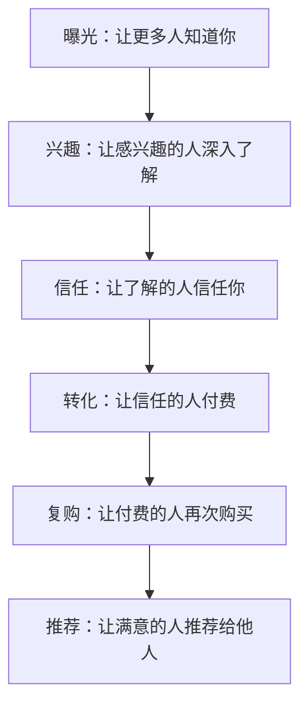

每个环节设计具体的策略和指标：

| 漏斗环节 | 策略 | 关键指标 | 目标值 |
|----------|------|----------|--------|
| 曝光 | 内容营销/社交媒体/广告 | 曝光量 | ____次/月 |
| 兴趣 | 有价值的内容/免费资源 | 点击率/关注率 | ____% |
| 信任 | 案例展示/用户评价/试用 | 咨询率 | ____% |
| 转化 | 限时优惠/一对一沟通 | 付费转化率 | ____% |
| 复购 | 会员体系/持续价值 | 复购率 | ____% |
| 推荐 | 推荐奖励/口碑传播 | 推荐率 | ____% |

**Step 3：选择获客渠道**

| 渠道 | 适合的客户画像 | 成本 | 见效周期 | 可持续性 |
|------|---------------|------|----------|----------|
| 小红书 | 女性用户、生活方式 | 低 | 1-3个月 | 高 |
| 抖音/快手 | 泛人群、娱乐消费 | 中 | 1-2个月 | 中 |
| 知乎 | 专业人群、深度决策 | 低 | 3-6个月 | 高 |
| 微信公众号 | 已有粉丝、私域运营 | 低 | 3-6个月 | 高 |
| 微信群/社群 | 精准用户、高信任 | 低 | 1-2个月 | 中 |
| SEM/信息流广告 | 精准获客、快速测试 | 高 | 即时 | 低 |
| 线下活动 | 本地用户、高信任 | 中 | 即时 | 低 |
| B站 | 年轻用户、深度内容 | 低 | 3-6个月 | 高 |
| 播客 | 高知人群、深度信任 | 低 | 6-12个月 | 高 |

**选渠道的原则**：不要同时做3个渠道。先选1个最匹配你客户画像的渠道，做到极致，再扩展第二个。贪多嚼不烂，尤其在时间有限的副业阶段。

**Step 4：内容营销策略**

内容是获客的核心驱动力。不同类型的内容适合不同的漏斗环节：

| 内容类型 | 漏斗环节 | 示例 | 制作难度 |
|----------|----------|------|----------|
| 干货教程 | 曝光+兴趣 | "3步学会XX"、"XX避坑指南" | 中 |
| 案例分享 | 信任 | "我如何用XX方法月入过万" | 低 |
| 对比测评 | 信任+转化 | "5款XX工具横评" | 中 |
| 用户见证 | 信任+转化 | 客户使用前后对比 | 低 |
| 免费资源 | 兴趣+转化 | 模板、电子书、工具包 | 中 |
| 限时活动 | 转化 | "前50名半价"、"免费体验" | 低 |

**内容创作的"3E原则"：**
- **Educate（教育）**：教用户解决具体问题
- **Entertain（娱乐）**：让用户觉得有趣、愿意分享
- **Engage（互动）**：引发用户评论、讨论、参与

**Step 5：设计首月获客行动方案**

| 周次 | 核心动作 | 目标 | 预算 |
|------|----------|------|------|
| 第1周 | 注册账号、完善资料、发布3篇内容 | 账号基础搭建 | 0元 |
| 第2周 | 每天发布1篇内容、互动评论 | 获得100个关注者 | 0元 |
| 第3周 | 发布引流内容（免费资源/干货） | 获得50个私域用户 | 100元 |
| 第4周 | 私域转化、首次成交 | 获得3-5个付费用户 | 200元 |

### 实战案例：健身教练的客户画像与获客

老陈，兼职健身教练，想做线上减脂指导。

**三个客户画像**：
- **画像A "小美"**：25岁，女，互联网公司运营，月入1.2万，核心痛点"久坐胖了10斤但没时间去健身房"，信息渠道小红书+抖音，付费意愿299-599元/月
- **画像B "老王"**：35岁，男，中层管理，月入2.5万，核心痛点"应酬多、体检指标异常"，信息渠道知乎+微信，付费意愿599-999元/月
- **画像C "学生小李"**：20岁，男，大学生，月生活费2000元，核心痛点"想增肌但不懂训练计划"，信息渠道B站+小红书，付费意愿49-99元/次

**选择**：先服务画像A，因为：①人群基数大 ②付费意愿适中 ③小红书是主战场（内容形式匹配）④减脂效果可视化（晒对比图就能获客）

**获客漏斗数据**：
- 小红书每天发1篇减脂干货，30天获得800关注者
- 评论区引导"免费减脂评估"，转化120人加微信
- 提供3天免费指导体验，转化28人付费（299元/月）
- 首月收入：28 × 299 = 8,372元

**关键洞察**：决策触发点是"看到别人的真实减脂对比图"。所以每篇内容都放真实案例对比图，转化率比纯文字内容高3倍。

### 常见错误

| 错误 | 后果 | 纠正方法 |
|------|------|----------|
| 客户画像太笼统（"25-45岁都市白领"） | 营销内容无法精准触达 | 细化到具体职业、具体痛点、具体一天的生活场景 |
| 同时做3个以上渠道 | 精力分散，哪个都做不好 | 先聚焦1个渠道做到日均10个精准用户再扩展 |
| 只关注曝光不关注转化 | 流量看着多但没收入 | 每100个曝光至少要有1个转化为私域 |
| 不追踪数据 | 不知道哪个环节有问题 | 每周统计漏斗各环节数据，找到瓶颈 |
| 内容没有一致性 | 用户记不住你是谁 | 确定1-2个核心主题，持续输出 |

### 进阶技巧：转化率优化（CRO）实战

当你的获客漏斗跑通后，下一步是提升每个环节的转化率。转化率每提升1个百分点，收入可能增长20%以上。

**转化率优化的核心公式：**

```text
收入 = 流量 × 点击率 × 咨询率 × 付费转化率 × 客单价 × 复购率
```

每个环节提升10%，总收入提升 `1.1^6 ≈ 1.77` 倍（77%增长）。这就是为什么优化漏斗比增加流量更高效。

**各环节的优化方法：**

| 漏斗环节 | 行业基准 | 优化方法 | 预期提升 |
|----------|----------|----------|----------|
| 内容阅读→关注 | 1%-3% | 优化个人简介、增加关注引导、内容末尾CTA | 3%-5% |
| 关注→私域 | 10%-20% | 设计高价值引流钩子、简化添加流程 | 20%-35% |
| 私域→咨询 | 20%-40% | 朋友圈价值展示、1对1主动触达 | 40%-60% |
| 咨询→付费 | 10%-30% | 限时优惠、免费体验、社会证明 | 30%-50% |
| 首购→复购 | 20%-40% | 超预期交付、会员体系、定期回访 | 40%-60% |

**社交证明的五种形式（转化率从低到高）：**

1. **数字证明**："已有1000+用户"——基础信任
2. **评价证明**：截图/视频客户好评——中等信任
3. **案例证明**：完整的客户成功故事（问题→方案→结果）——强信任
4. **KOL背书**：行业知名人士推荐——极强信任
5. **实时证明**：实时显示"XX刚刚购买了"——紧迫感+信任

**"钩子-故事-报价"内容框架**：

这是转化率最高的内容结构，适用于任何平台：

```text
钩子（前3秒/前1行）：用痛点、数据或悬念吸引注意
   ↓
故事（中间部分）：展示问题→尝试→结果的真实过程
   ↓
报价（结尾）：明确告诉用户下一步该做什么
```

示例：
- 钩子："月薪5000到月入2万，我只做了一件事"
- 故事："3个月前我还在加班到凌晨...偶然发现了XX方法...第一个月就..."
- 报价："我把这套方法整理成了XX，点击主页链接免费领取"

### 练习模板

```text
客户画像与获客策略
日期：____年____月____日

═══ 客户画像 ═══
画像A：____________________
- 年龄/职业/收入：____________________
- 核心痛点：____________________
- 获取信息渠道：____________________
- 付费意愿：____________________
- 决策触发点：____________________

画像B：____________________
- 年龄/职业/收入：____________________
- 核心痛点：____________________
- 获取信息渠道：____________________
- 付费意愿：____________________
- 决策触发点：____________________

画像C：____________________
- 年龄/职业/收入：____________________
- 核心痛点：____________________
- 获取信息渠道：____________________
- 付费意愿：____________________
- 决策触发点：____________________

═══ 获客漏斗 ═══
|| 环节 | 策略 | 指标 | 目标 ||
||------|------|------|------||
|| 曝光 | | | ||
|| 兴趣 | | | ||
|| 信任 | | | ||
|| 转化 | | | ||
|| 复购 | | | ||

═══ 首选获客渠道 ═══
渠道：____________________
理由：____________________
30天行动计划：____________________
预算：____元
预期效果：____________________

═══ 内容营销计划 ═══
核心主题：____________________
内容类型：____________________
发布频率：____篇/周
创作工具：____________________

═══ 首月数据追踪 ═══
第1周：曝光____，关注____，私域____，付费____
第2周：曝光____，关注____，私域____，付费____
第3周：曝光____，关注____，私域____，付费____
第4周：曝光____，关注____，私域____，付费____
本月转化率：____%  瓶颈环节：____________________
```

---

## 练习九：定价策略设计

### 为什么要做这个练习

定价是商业决策中影响最大的单一变量。价格提高10%，利润可能增加30%以上（因为固定成本不变）。但大多数创业者凭感觉定价，要么太低（亏本卖），要么太高（没人买）。

定价不是简单的"成本+利润"，而是一门融合了心理学、经济学和营销学的综合技艺。这个练习基于三种经典定价方法，帮你找到最优价格点。

> **AI辅助定价分析**：把你的产品描述、目标用户画像、竞品价格、成本结构输入ChatGPT/Claude，让它帮你：①计算不同定价方案的利润模型 ②分析竞品定价策略的优劣 ③设计A/B测试方案 ④撰写不同价格档位的价值描述文案。AI不能替你做最终决策，但能帮你看到自己忽略的角度。

### 四种定价方法

**方法一：成本加成定价法**

```text
售价 = 直接成本 × (1 + 目标利润率) + 间接成本分摊
```

适用场景：实体产品、有明确成本结构的服务
优点：简单明确，确保不亏本
缺点：忽略了用户感知价值

**方法二：价值定价法**

```text
售价 = 用户获得的价值 × 合理比例（通常为价值的10%-30%）
```

适用场景：知识付费、咨询服务、技能培训
优点：利润空间大
缺点：需要能清晰传达价值

**如何计算"用户获得的价值"？** 三个参照系：
1. **替代成本**：用户如果不买你的产品，自己解决需要花多少钱/时间？比如你卖的Excel模板帮用户节省了10小时，用户时薪100元，那价值就是1000元，定价100-300元合理
2. **结果价值**：你的产品帮用户多赚了多少钱？比如你的营销方案帮客户多赚了10万，收1万服务费不过分
3. **情感价值**：你的产品带来的情绪价值（安心、面子、愉悦）值多少钱？这需要通过用户调研确认

**方法三：竞品参考定价法**

```text
售价 = 竞品价格 × 差异化系数
```

差异化系数：你比竞品好多少就定高多少，差多少就定低多少。
适用场景：成熟市场、有明确竞品的领域

**方法四：免费增值定价法（Freemium）**

```text
免费基础版 → 付费高级版
```

适用场景：SaaS工具、App、在线服务
核心逻辑：用免费版获取大量用户，通过增值服务变现
关键指标：免费转付费率（通常2%-5%为健康水平）

**免费增值定价的设计要点：**
- 免费版要足够好用，让用户产生依赖
- 付费版要有明确的"解锁感"，让用户觉得值
- 免费版和付费版的界限要清晰，不能模糊
- 免费用户也是资产——他们提供口碑传播、数据反馈和潜在转化

**订阅制定价的深度设计：**

订阅制（Subscription）是当下最被推崇的收入模式，因为它提供可预测的经常性收入（MRR）。但订阅制不是"按月收费"那么简单：

| 设计维度 | 问题 | 设计要点 |
|----------|------|----------|
| 计费周期 | 月付还是年付？ | 提供两种选择，年付打8折（提高留存+预收现金） |
| 分级策略 | 几个档位？ | 3档最经典：入门/标准/高级，标准版是主力 |
| 免费试用 | 试用多久？ | 7天适合简单工具，14天适合中等复杂度，30天适合高客单价 |
| 退出机制 | 用户想取消怎么办？ | 提供"暂停"选项而非直接取消，挽回率可达15-30% |
| 升级路径 | 如何引导用户升级？ | 使用量接近上限时自动提醒，提供限时升级优惠 |

**订阅制的健康指标：**

| 指标 | 健康范围 | 计算方式 | 意义 |
|------|----------|----------|------|
| 月流失率（Churn） | <5% | 当月流失用户÷月初用户 | 超过5%说明产品价值不足 |
| LTV（用户终身价值） | >3倍CAC | 平均月收入×平均留存月数 | 低于3倍说明获客成本太高 |
| CAC（获客成本） | <LTV/3 | 总营销费用÷新增付费用户 | 需要在12个月内回本 |
| NPS（净推荐值） | >30 | 推荐者%-贬损者% | 低于0说明产品有严重问题 |
| 付费转化率 | 2%-5% | 免费转付费用户÷免费用户 | 高于5%可能定价太低 |

**定价心理学技巧：**

| 技巧 | 原理 | 应用方式 |
|------|------|----------|
| 锚定效应 | 先看到高价，后面的价格显得便宜 | 先展示高价套餐，再推荐中价套餐 |
| 价格尾数 | 99比100感觉便宜很多 | 定价用9结尾：99、199、499 |
| 三档定价 | 大多数人会选中间档 | 设置低/中/高三档，把想卖的放中间 |
| 损失厌恶 | 人们更怕失去而非渴望获得 | "不买会错过XXX"比"买了能得到XXX"更有效 |
| 免费试用 | 体验后更难割舍 | 先免费体验再付费转化 |
| 捆绑定价 | 组合购买感觉更划算 | 课程+模板+社群打包卖比单卖更有效 |

### 价格测试方法

| 测试方法 | 操作方式 | 适合阶段 |
|----------|----------|----------|
| A/B定价测试 | 不同渠道展示不同价格，看转化率差异 | 有一定流量后 |
| 问卷调查 | 直接问用户愿意付多少钱 | 初期验证 |
| 阶梯定价 | 设置3个价格档位，看用户选择分布 | 产品上线后 |
| 预售测试 | 用预售价格测试付费意愿 | MVP阶段 |
| 竞品锚定 | 参考竞品价格，测试接受度 | 任何阶段 |

**阶梯定价设计模板（以知识付费课程为例）：**

| 档位 | 内容 | 定价 | 目的 |
|------|------|------|------|
| 基础版 | 录播课程+社群 | 199元 | 降低门槛，获取大量用户 |
| 标准版 | 基础版+直播答疑+模板 | 499元 | **主力盈利产品**（大多数人选这个） |
| 高级版 | 标准版+1对1咨询3次 | 1999元 | 提升品牌形象，锚定价格 |

**阶梯定价的黄金比例**：低:中:高 ≈ 1:2.5:10。基础版定价199元，标准版499元（约2.5倍），高级版1999元（约10倍）。这个比例能让大多数人选择标准版，同时高级版起到价格锚定作用。

### 动态定价策略

价格不是一成不变的，需要根据市场反馈和业务阶段动态调整：

| 阶段 | 定价策略 | 原因 |
|------|----------|------|
| 验证期 | 低价+限量 | 快速获取第一批用户，验证需求 |
| 增长期 | 逐步提价 | 随着口碑积累，提高利润率 |
| 成熟期 | 稳定定价+促销 | 保持价格体系稳定，偶尔促销拉新 |
| 竞争期 | 差异化定价 | 不打价格战，通过增值服务拉开差距 |

**提价的最佳时机：**
- 积累了10个以上正面评价/案例
- 转化率持续高于行业平均水平
- 供不应求（预约排满、产能不足）
- 增加了新的功能或服务内容

### 实战案例：自由设计师的定价之路

小赵，UI设计师，想做兼职设计服务。

**第一次定价（错误）**：按竞品低价策略，Logo设计200元/个。结果：接了15单，每单耗时4-6小时，时薪不到40元，比接单平台还低。

**第二次定价（改进）**：用价值定价法。分析客户——创业公司，如果找设计公司做品牌VI要2-5万。小赵提供"创业者品牌入门套餐"（Logo+名片+社交媒体头图），定价2999元。虽然单价高了，但客户获得的是整套品牌视觉方案，价值远超价格。

**第三次定价（优化）**：三档定价
- 基础版：Logo设计 999元（1个方案+2次修改）
- 标准版：品牌入门套餐 2999元（Logo+名片+3个应用设计+3次修改）——主力产品
- 高级版：品牌全案 7999元（全套VI+品牌指南+1年售后）

**结果**：月均接8单（基础3+标准4+高级1），月收入约30,000元，时薪提升到约300元。

**关键发现**：定价200元时客户反而不信任（"这么便宜能做好吗？"），提价到999元后咨询量反而增加了。**低价不等于好卖，合理的价格本身就是信任信号。**

### 定价常见错误与纠正

| 错误 | 后果 | 纠正方法 |
|------|------|----------|
| 凭感觉定价，不计算成本 | 越卖越亏 | 先算清楚每个产品的真实成本（含时间成本） |
| 打价格战，以低价抢市场 | 利润微薄，不可持续 | 用差异化和价值定价，而非低价竞争 |
| 只有一个价格档位 | 错失高客单价客户 | 设计低中高三档，满足不同需求 |
| 定价后从不调整 | 错过最优价格点 | 每3个月根据数据和反馈调整一次定价 |
| 不敢定高价 | 低估自身价值 | 先测试高价，不行再降；比先低价再涨价容易得多 |
| 忽视免费增值模式 | 错失大量潜在用户 | 设计免费版引流，付费版变现 |

### 进阶技巧：定价策略的深度应用

**1. 价格歧视的合理运用**

价格歧视不是"宰客"，而是让不同支付能力的用户都能获得价值：

| 策略 | 做法 | 示例 | 注意事项 |
|------|------|------|----------|
| 时间歧视 | 不同时段不同价格 | 早鸟价、限时折扣 | 需要有合理的理由，否则伤害品牌 |
| 群体歧视 | 不同人群不同价格 | 学生价、企业价、老客户价 | 价格差异不要超过50%，否则引发不满 |
| 版本歧视 | 功能/服务差异化定价 | 基础版/专业版/企业版 | 低版本不能太差，否则影响口碑 |
| 渠道歧视 | 不同渠道不同价格 | 官网价 vs 平台价 vs 社群价 | 渠道间价差要有合理解释 |

**2. 定价锚点的高级应用**

锚定效应是定价心理学中最强大的工具。高级应用方法：

- **外部锚点**：引用行业标杆的价格。"某知名机构同类服务收费5万元，我们只要5000元。"
- **内部锚点**：先展示最贵的选项。菜单设计原则——最贵的菜放在右上角。
- **对比锚点**：把你的价格和用户熟悉的日常消费对比。"每天不到一杯咖啡的钱"。
- **历史锚点**：展示原价和现价的对比。"原价1999元，限时特惠999元"。

**3. 订阅制 vs 一次性购买的选择矩阵**

| 考虑因素 | 选订阅制 | 选一次性购买 |
|----------|----------|-------------|
| 产品形态 | 持续更新内容/服务 | 固定交付物 |
| 用户关系 | 需要长期互动 | 一次性交易 |
| 收入稳定性 | 现金流可预测 | 波动大但客单价高 |
| 运营成本 | 需要持续投入 | 交付后成本低 |
| 适合类型 | SaaS、社群、会员制 | 课程、模板、咨询服务 |

**4. 定价A/B测试的实操流程**

不要凭直觉定价格，用数据说话：

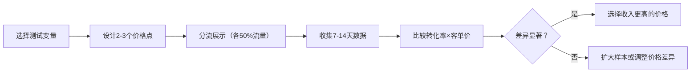

**关键公式**：`总收入 = 流量 × 转化率 × 客单价`。价格提高时转化率通常会下降，你需要找到"转化率×客单价"最大的那个点。例如：定价99元转化率10%（收入9.9元/访客）vs 定价199元转化率6%（收入11.94元/访客）→ 199元更优。

**5. 应对砍价的标准话术**

当客户说"太贵了"时，不要立刻降价：

| 客户说 | 你的回应 | 原理 |
|--------|----------|------|
| "太贵了" | "您觉得贵是因为和什么对比呢？" | 找到客户的锚点 |
| "别人更便宜" | "您说得对，便宜的确实有。我们的差异在于XXX" | 承认差异，强调价值 |
| "能不能打折" | "价格是固定的，但我可以多送您XXX" | 用赠品替代降价 |
| "我再考虑考虑" | "完全理解。对了，本月的XXX优惠月底截止" | 制造合理的紧迫感 |
| "我没预算" | "理解。我们有分期方案/入门版，您可以先体验" | 降低支付门槛 |

### 练习模板

```text
定价策略设计
日期：____年____月____日

═══ 成本核算 ═══
|| 成本项 | 金额 | 备注 ||
||--------|------|------||
|| 直接成本 | | ||
|| 间接成本 | | ||
|| 时间成本 | ____元/小时 × ____小时 | ||
|| 合计 | ____元/单 | ||

═══ 四种定价 ═══
成本加成定价：____元（利润率____%）
价值定价：____元（用户价值____元的____%）
竞品参考定价：____元（竞品价格____元 × ____）
免费增值定价：免费版包含____，付费版____元包含____

═══ 阶梯定价设计 ═══
基础版：____元（包含：____________________）
标准版：____元（包含：____________________）← 主力产品
高级版：____元（包含：____________________）

═══ 定价心理学应用 ═══
□ 使用锚定效应：高价套餐放在前面展示
□ 使用价格尾数：定价以9结尾
□ 使用三档定价：中间档是主力产品
□ 使用损失导向文案："错过XXX"而非"得到XXX"
□ 设计免费试用：____________________

═══ 价格测试计划 ═══
测试价格A：____元
测试价格B：____元
测试价格C：____元
测试方式：____________________
测试周期：____天

═══ 最终定价 ═══
选定价格：____元
定价理由：____________________
预期月收入：____元
预期时薪：____元/小时
下次调价时间：____月____日
```

---


## 练习十：启动清单与首月执行

### 为什么要做这个练习

完成前面的练习后，你已经有了一个完整的方案。但"方案"和"行动"之间隔着一道鸿沟——很多人永远停留在"准备好了就启动"的阶段，永远不会真正启动。

这个练习是一个**强制启动器**。它把创业/副业的第一步拆解成30天、4个阶段、每天的具体任务，让你没有借口拖延。

> **执行前提**：在开始30天执行计划前，请确保你已经完成了[练习七：副业时间管理](#练习七副业时间管理)——30天计划需要你明确每周可投入的时间段和边界规则。没有时间管理基础的执行计划注定会半途而废。CB Insights的数据显示，35%的创业者失败是因为"没有市场需求"，但更隐蔽的失败原因是"从未真正启动"。

### 启动前的心理准备

在按下"启动按钮"之前，你需要接受三个事实：

1. **你的第一版一定很粗糙**——这就是MVP的意义。Zappos的第一版网站是创始人自己去鞋店拍照上传的；微信的第一版只能发文字消息。完美是行动的敌人。
2. **前10个客户比后1000个客户更难获取**——冷启动是所有业务最难的阶段。一旦你有了前10个满意客户，口碑和案例会帮你带来后续增长。
3. **你不需要"准备好"才能开始**——你永远不会觉得"准备好了"。设定一个硬性截止日期，到日子就启动，边做边完善。

**"5秒法则"**：当你犹豫要不要启动时，倒数5-4-3-2-1，然后立刻做一个最小的启动动作（发一条朋友圈、注册一个账号、写第一行介绍）。行动会消除焦虑。

### 第一阶段：基础搭建（第1-7天）

**Day 1-2：法律与身份准备**

| 任务 | 具体动作 | 耗时 | 费用 | 注意事项 |
|------|----------|------|------|----------|
| 确认主业合同 | 仔细阅读劳动合同中的竞业限制和知识产权条款 | 30分钟 | 0元 | 如有疑虑，咨询劳动法律师（线上咨询50-200元） |
| 注册个体工商户 | 在当地市场监管局官网或小程序申请 | 1小时 | 0元 | 2023年起个体工商户线上注册免费，1-3个工作日出证 |
| 开通对公账户 | 去银行开立个体工商户对公账户 | 1小时 | 0-500元 | 推荐招行或网商银行（线上可办） |
| 税务登记 | 在电子税务局完成税务登记 | 30分钟 | 0元 | 小规模纳税人月收入10万以下免增值税（2024年政策） |

**Day 3-4：品牌基础建设**

| 任务 | 具体动作 | 耗时 | 费用 |
|------|----------|------|------|
| 确定品牌名称 | 结合业务方向取一个易记、可搜索的名字 | 1小时 | 0元 |
| 注册社媒账号 | 在目标渠道注册账号并完善资料 | 2小时 | 0元 |
| 设计基础视觉 | 用Canva制作Logo、头图、个人简介图 | 2小时 | 0元 |
| 写一句话介绍 | 用"我帮XX解决XX问题"的格式写品牌介绍 | 30分钟 | 0元 |

**一句话介绍的公式**：`我帮 [目标用户] 通过 [你的方法/产品] 解决 [具体痛点]，让他们获得 [具体结果]。`

示例：
- "我帮职场新人通过1对1模拟面试，解决面试紧张和回答不专业的问题，帮助他们在3次练习后拿到Offer。"
- "我帮中小卖家通过AI工具批量生成产品文案，解决每天花3小时写文案的痛苦，把文案创作时间缩短到10分钟。"

**Day 5-7：支付与交付通道**

| 任务 | 具体动作 | 耗时 | 费用 |
|------|----------|------|------|
| 开通支付通道 | 微信支付商户码 / 支付宝收款 / 小程序支付 | 1-2小时 | 0-300元 |
| 建立交付流程 | 确定产品/服务的交付方式和时间节点 | 2小时 | 0元 |
| 设置自动回复 | 微信/企微自动回复话术 | 1小时 | 0元 |
| 准备交付模板 | 合同模板、报价单、服务说明文档 | 2小时 | 0元 |

### 第二阶段：内容冷启动（第8-14天）

**核心目标**：发布第一批内容，测试市场反应。

**内容冷启动的"5-3-1"法则**：
- 发布**5**篇不同类型的内容（干货、故事、对比、问答、案例各1篇）
- 覆盖**3**个不同的话题角度
- 聚焦**1**个核心价值主张

**每天的具体任务**：

| 日期 | 任务 | 预期产出 | 关注指标 |
|------|------|----------|----------|
| Day 8 | 发布第1篇内容（干货型："3步学会XX"） | 完成发布 | 阅读量 |
| Day 9 | 发布第2篇内容（故事型："我如何解决了XX"） | 完成发布 | 互动率 |
| Day 10 | 回复所有评论+主动在相关话题下互动 | 建立连接 | 新增关注 |
| Day 11 | 发布第3篇内容（对比型："XX vs XX 横评"） | 完成发布 | 收藏量 |
| Day 12 | 分析前3篇数据，总结表现最好的类型 | 数据报告 | 什么类型受欢迎 |
| Day 13 | 发布第4-5篇内容（复制表现最好的类型） | 完成发布 | 阅读量+互动 |
| Day 14 | 整理关注者画像，验证是否匹配目标用户 | 用户画像 | 精准度 |

### 第三阶段：首次获客（第15-21天）

**核心目标**：将公域流量转化为私域，获得第一批付费用户。

**获客冲刺计划**：

| 日期 | 任务 | 具体动作 | 预期结果 |
|------|------|----------|----------|
| Day 15 | 设计引流钩子 | 制作免费资源（模板/清单/电子书）| 1份免费资源 |
| Day 16-17 | 发布引流内容 | 在内容中嵌入"免费领取XXX"引导 | 引导添加微信 |
| Day 18-19 | 私域转化 | 对添加微信的用户进行1对1沟通 | 了解需求+推荐服务 |
| Day 20 | 首次成交 | 提供限时优惠或免费体验 | 获得第一个付费用户 |
| Day 21 | 收集反馈 | 对首批用户进行使用体验访谈 | 改进方向 |

**引流钩子的设计原则**：
1. **即得性**：用户添加微信后立刻能获得，不需要等待
2. **高价值**：必须让用户觉得"这个免费的就值了"
3. **关联性**：免费资源要和你的付费产品自然关联
4. **稀缺感**："仅限前100名"、"本周限时免费"等

### 第四阶段：数据复盘与迭代（第22-30天）

**核心目标**：用数据驱动决策，确定下一步方向。

**首月数据复盘模板**：

```text
首月数据复盘
日期：____年____月____日

═══ 流量数据 ═══
内容发布数：____篇
总曝光量：____
总阅读量：____
新增关注者：____人
新增私域用户：____人

═══ 转化数据 ═══
咨询人数：____人
付费用户：____人
总收入：____元
转化率：____%（付费人数÷曝光量）

═══ 内容分析 ═══
表现最好的内容TOP3：
1. ____________（阅读量：____，原因：____________）
2. ____________（阅读量：____，原因：____________）
3. ____________（阅读量：____，原因：____________）

表现最差的内容：
1. ____________（阅读量：____，原因：____________）

═══ 用户反馈 ═══
用户最常提到的需求：____________________
用户最常提到的不满：____________________
用户建议的改进方向：____________________

═══ 下月计划 ═══
继续做：____________________
停止做：____________________
开始做：____________________
重点目标：____________________
```

### 首月常见问题与应对

| 问题 | 正常吗？ | 应对方案 |
|------|----------|----------|
| 发了7天内容，0关注 | 正常，冷启动需要时间 | 检查内容质量、标题吸引力、发布时间；主动互动引流 |
| 有人关注但没人付费 | 正常，信任需要时间 | 先提供免费价值建立信任，不要急着卖 |
| 第一个客户投诉 | 非常正常 | 真诚道歉+免费补偿+收集改进建议 |
| 感觉时间不够用 | 正常 | 回到练习七优化时间管理，砍掉低价值任务 |
| 主业突然忙起来 | 正常 | 降低副业产出频率但不要完全停止，保持最低活跃度 |
| 发现方向可能不对 | 可能正常 | 记录数据，30天后用练习十一做复盘决策 |

### 常见错误

| 错误 | 后果 | 纠正方法 |
|------|------|----------|
| 把30天计划排得太满 | 第2周就精疲力竭，完全放弃 | 只安排60%的时间，留40%给意外和休息 |
| Day 1就追求完美 | 第一篇内容改了5遍还没发 | 给自己一个硬性规则：每篇内容最多修改2遍就发布 |
| 跳过法律和身份准备 | 后续收款、开发票时遇到障碍 | Day 1-2必须完成，这是一次性工作 |
| 内容冷启动阶段不互动 | 只发不互动，没人看到你的内容 | 每天至少花30分钟在目标平台互动（评论、回复、参与讨论） |
| 第一个月就期望赚钱 | 0收入导致焦虑和放弃 | 首月目标不是赚钱，而是验证方向和获取首批用户反馈 |
| 收到第一个差评就崩溃 | 情绪崩溃影响后续执行 | 差评是正常的——把它当作免费的用户调研，提取有用信息 |
| 不做数据复盘 | 凭感觉判断好坏，错过优化机会 | 第22天开始必须做数据复盘，用数字说话 |

### 进阶技巧：冷启动加速策略

首月最难的是从0到1。以下策略能帮你缩短冷启动期：

**1. "借船出海"策略**

不要从零开始积累流量，借助已有的流量池：

| 策略 | 具体做法 | 预期效果 |
|------|----------|----------|
| 社群渗透 | 加入5-10个目标用户聚集的社群，先提供价值再引流 | 1-2周获得50-100精准用户 |
| 互推合作 | 找同量级的创作者互相推荐 | 每次互推带来20-50新关注者 |
| 问答引流 | 在知乎/百度知道回答目标用户的问题，文末引导 | 每个高质量回答持续带来长尾流量 |
| 热点借势 | 结合热点话题创作相关内容 | 1篇爆款可带来数百关注者 |

**2. "种子用户"培养法**

首批用户不仅是客户，更是你的产品顾问：

- 给首批10个用户建立专属微信群
- 每周主动收集一次反馈（不要等用户来找你）
- 把用户的建议快速迭代到产品中，并告知用户"您的建议已采纳"
- 首批用户给予终身优惠价或VIP待遇——他们会成为你最忠诚的推广者

**3. "最小可传播内容"（MVC）设计**

不是所有内容都能传播。设计内容时检查三个传播条件：

| 条件 | 问题 | 达标标准 |
|------|------|----------|
| 实用性 | 用户看完能立刻用？ | 至少有1个可执行的步骤 |
| 情感共鸣 | 用户会"对对对就是这样"？ | 引发至少10条评论互动 |
| 社交货币 | 用户转发能提升自己的形象？ | 收藏率>5%或转发率>2% |

同时满足2个以上条件的内容才值得投入时间创作。

---

## 练习十一：失败复盘与转型决策

### 为什么要做这个练习

创业和副业的失败率很高——统计数据显示，新创企业5年存活率不足50%，副业的放弃率更高。但"失败"本身不是问题，**不从失败中学习**才是问题。更糟糕的是，很多人在应该转型的时候死扛，在应该坚持的时候轻言放弃。

这个练习提供一套系统化的"失败分析与转型决策"框架，帮你区分"暂时的困难"和"根本性的方向错误"，做出理性的坚持或转型决策。

### 失败的三种类型

在讨论如何复盘失败之前，先介绍一个更强大的工具：**事前验尸（Pre-mortem）**。这是心理学家Gary Klein提出的决策方法——在项目启动之前，假设它已经失败了，然后反推"是什么原因导致了失败"。

**事前验尸练习（项目启动前花30分钟做）：**

> 假设现在是6个月后，你的副业项目已经失败了。请写下：
> 1. 它是怎么失败的？（具体场景）
> 2. 失败的根本原因是什么？
> 3. 如果当初做了什么，结果会不同？
> 4. 现在可以做什么来预防这些原因？

这个练习的价值在于：人在项目开始前比开始后更容易客观地识别风险。一旦投入了时间、金钱和感情，人会不自觉地忽视负面信号（确认偏误）。

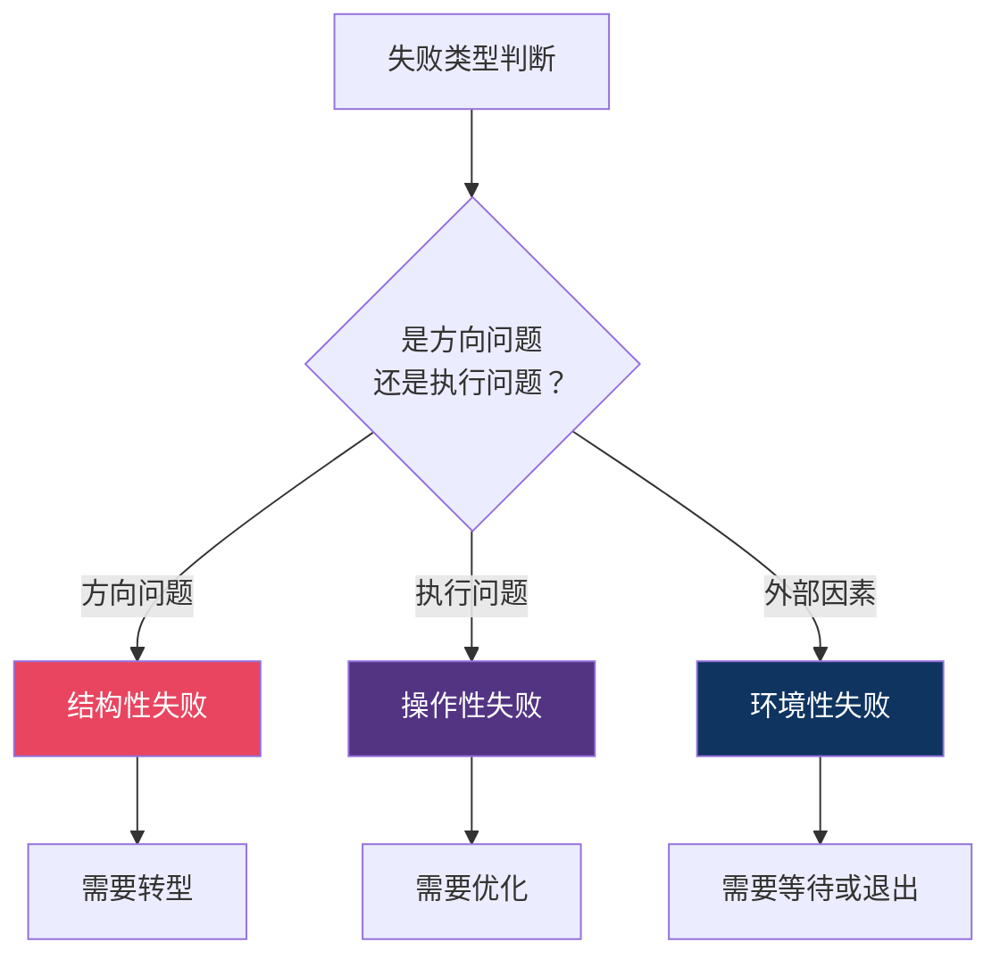

| 失败类型 | 特征 | 举例 | 正确应对 |
|----------|------|------|----------|
| **结构性失败** | 市场需求不存在或太小 | 做了一个没人需要的产品 | 立即转型，换方向 |
| **操作性失败** | 方向对但执行有问题 | 产品不错但获客渠道选错了 | 优化执行，坚持方向 |
| **环境性失败** | 外部环境变化导致 | 政策变化、经济下行、黑天鹅事件 | 降低投入等待时机，或退出止损 |

**判断方法**：问自己三个问题——
1. "如果我换一个获客渠道/定价/产品形态，这个问题能解决吗？"→ 能解决 = 操作性失败
2. "如果市场上有100个目标用户，会有多少人愿意付费？"→ 超过10个 = 不是结构性失败
3. "这个问题是因为外部不可控因素导致的吗？"→ 是 = 环境性失败

### 转型决策框架

Eric Ries在《精益创业》中提出了"转型（Pivot）"的概念：转型不是放弃，而是**在保留已有学习成果的基础上，系统性地调整方向**。

**十种经典转型类型**：

| 转型类型 | 定义 | 适用场景 | 经典案例 |
|----------|------|----------|----------|
| **客户转型** | 换一个目标用户群 | 发现真正付费的是另一群人 | Slack从游戏转向企业通讯 |
| **问题转型** | 换一个要解决的问题 | 发现用户最痛的不是你以为的那个 | 从"帮用户省钱"转向"帮用户赚钱" |
| **解决方案转型** | 换一种解决方式 | 产品形态不对但需求真实存在 | 从App转向微信小程序 |
| **收入模式转型** | 换一种赚钱方式 | 用户用了但不愿按原来方式付费 | 从一次性购买转向订阅制 |
| **渠道转型** | 换一个获客/交付渠道 | 当前渠道成本太高或效率太低 | 从线下转向线上 |
| **技术转型** | 换一种技术实现 | 技术路线不可行或成本太高 | 从自研转向AI工具辅助 |
| **价值主张转型** | 重新定义核心价值 | 发现用户在意的不是你以为的 | 从"功能"转向"效果保证" |
| **细分市场转型** | 聚焦到更小的市场 | 大市场打不过，小市场有机会 | 从"所有中小企业"转向"餐饮行业中小企业" |
| **放大转型** | 把一个功能放大成产品 | 发现用户最喜欢你的某个"附属功能" | 把课程中的模板工具单独拿出来卖 |
| **缩小转型** | 把产品缩减到一个核心功能 | 产品太复杂，用户只用其中一个功能 | 从"全套营销工具"缩减为"AI文案生成器" |

**转型决策的"两周测试法"**：

1. **第1天**：明确当前最大的问题是什么（用数据说话，不是感觉）
2. **第2-3天**：列出3种可能的转型方向
3. **第4-7天**：对每个方向做快速验证（问卷、访谈、落地页测试）
4. **第8-10天**：选择验证结果最好的方向
5. **第11-14天**：用最低成本测试新方向（新MVP或新渠道）

### 失败复盘工作坊

当项目进展不顺时，花2小时做一次完整的失败复盘：

**Step 1：事实还原（30分钟）**

```text
项目时间线：
启动日期：____年____月____日
投入时间：总计____小时
投入资金：总计____元
关键里程碑：
1. ____________（日期：____）
2. ____________（日期：____）
3. ____________（日期：____）

数据汇总：
- 总曝光/触达人数：____
- 总咨询人数：____
- 总付费用户数：____
- 总收入：____元
- 总成本：____元
- 净利润：____元
```

**Step 2：原因分析（30分钟）**

使用"5个为什么"方法深入分析根本原因：

```text
问题：项目收入低于预期
为什么？ → 付费用户太少
为什么？ → 转化率太低（只有2%）
为什么？ → 用户觉得价格高但不了解价值
为什么？ → 营销内容只讲功能不讲结果
为什么？ → 没有收集和展示用户成功案例

根本原因：缺少社会证明（案例和见证）
```

**Step 3：经验提炼（30分钟）**

| 类别 | 具体内容 |
|------|----------|
| 做对了什么（继续保持） | 1.____ 2.____ 3.____ |
| 做错了什么（避免重复） | 1.____ 2.____ 3.____ |
| 学到了什么（核心认知） | 1.____ 2.____ 3.____ |
| 如果重来会怎么做 | 1.____ 2.____ 3.____ |

**Step 4：决策（30分钟）**

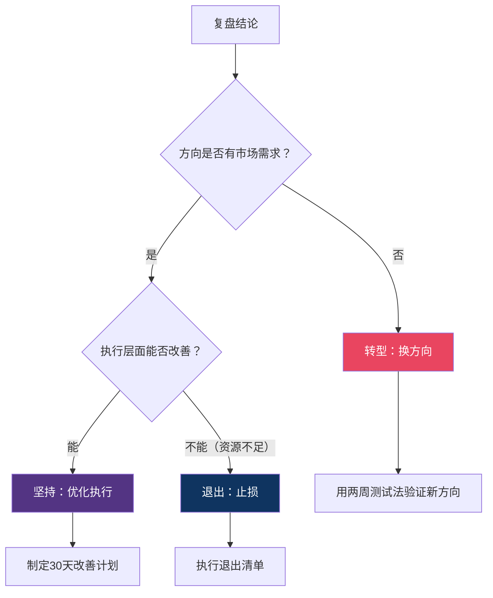

### 优雅退出清单

如果决定终止项目，按以下步骤有序退出，保护自己的信誉：

| 步骤 | 任务 | 具体动作 | 时间要求 |
|------|------|----------|----------|
| 1 | 通知现有客户 | 说明情况，提供替代方案或退款 | 决定退出后48小时内 |
| 2 | 处理未完成订单 | 完成已收款的交付或协商退款 | 1周内 |
| 3 | 关闭付费通道 | 停止接受新订单和新付款 | 决定退出当天 |
| 4 | 数据备份 | 备份所有客户数据、内容、财务记录 | 1周内 |
| 5 | 财务清算 | 统计最终盈亏，完成税务申报 | 1个月内 |
| 6 | 注销手续 | 如有营业执照，办理注销 | 1个月内 |
| 7 | 复盘总结 | 完成本练习的复盘工作坊 | 退出后1周内 |
| 8 | 感谢帮助过你的人 | 给合伙人、客户、支持者发感谢消息 | 退出后1周内 |

**退出不是失败**。Peter Thiel在《从0到1》中说："如果你不能创造垄断性的价值，及时止损是一种智慧。"每一次退出都是在为下一次更好的启动积累经验。

### 实战案例：从失败到转型成功

**案例：阿杰的在线健身课转型之路**

阿杰是健身教练，第一次尝试做线上减脂课程。

**第一次尝试（失败）**：
- 产品：199元的录播减脂课程（20节视频）
- 获客：抖音发健身视频引流
- 结果：3个月获得2000关注者，但只有3人购买课程
- 复盘分析：用户想看免费健身视频，但不愿为录播课程付费（结构性问题）

**转型决策**：
- 5个为什么：为什么没人买？→ 免费视频太多 → 用户觉得"看免费的就够了" → 录播课没有差异化 → 缺少互动和个性化
- 转型类型：解决方案转型（从录播课转为直播+1对1指导）

**第二次尝试（成功）**：
- 产品：399元/月的"21天减脂训练营"（直播+微信群打卡+每周1次1对1语音）
- 获客：同样的抖音账号
- 结果：首月招到12人，续费率75%，月收入4,788元
- 关键洞察：用户买的不是"知识"，而是"陪伴和监督"

**复盘总结**：
- 做对了：选择了正确的平台（抖音+健身人群匹配），积累了内容资产
- 做错了：产品形态与用户需求不匹配（录播 vs 陪伴）
- 学到了：知识付费的核心价值不是信息本身，而是"有人帮你执行"

### 常见错误

| 错误 | 后果 | 纠正方法 |
|------|------|----------|
| 遇到困难就放弃 | 永远在起步阶段 | 先区分是操作性失败还是结构性失败 |
| 明知方向不对还硬撑 | 越陷越深，损失扩大 | 设定止损线，到线必须执行 |
| 不复盘直接开始下一个 | 重复犯同样的错误 | 每次项目结束（无论成功失败）都要复盘 |
| 失败后自责消沉 | 打击信心，不敢再尝试 | 把失败看作数据，不是对人格的否定 |
| 退出时不处理善后 | 损害个人信誉和人脉 | 按退出清单有序收尾 |
| 只分析"为什么失败"，不分析"为什么差点成功" | 丢失有价值的正向信号 | 同样要分析做对了什么、哪些部分效果好 |

### 进阶技巧：构建"失败免疫系统"

真正厉害的创业者不是不失败，而是建立了对失败的"免疫系统"——每次失败都能快速恢复并从中提取价值。

**1. "失败简历"法**

维护一份"失败简历"，记录你每次失败的项目：

| 项目 | 时间 | 投入 | 核心失败原因 | 学到的关键认知 | 可复用的资产 |
|------|------|------|-------------|---------------|-------------|
| | | | | | |

**可复用资产**是指即使项目失败了，你仍然拥有的东西——积累的技能、建立的人脉、创作的内容、获得的行业认知。每次失败都不是从零开始，而是从"已积累资产"开始。

**2. "概率思维"替代"成败思维"**

不要把每次尝试看作"成功或失败"的二元结果，而是看作概率游戏：

- 每次尝试的成功概率假设为20%（这已经很高了）
- 连续尝试5次，至少成功1次的概率 = 1-(0.8)^5 = 67%
- 连续尝试10次，至少成功1次的概率 = 1-(0.8)^10 = 89%

关键不是让每次尝试都成功，而是**降低每次尝试的成本**，让你能尝试更多次。这就是为什么我们强调MVP和低成本验证。

**3. "认知复利"记录法**

每次失败后，记录三个层次的认知收获：

| 层次 | 问题 | 示例 |
|------|------|------|
| 表层认知 | 这次失败的直接原因是什么？ | "获客渠道选错了" |
| 中层认知 | 这类失败的通用规律是什么？ | "冷启动阶段应该先验证渠道再投入内容" |
| 深层认知 | 这对我的创业思维有什么改变？ | "任何投入前都要先用最小成本验证，包括渠道选择" |

表层认知只对当前项目有用，中层认知对同类项目有用，深层认知对所有项目有用。越深层的认知，复利效应越大。

**4. "凤凰涅槃"复盘仪式**

在项目结束后，花1小时做一个有仪式感的复盘：

1. **写一封信给"6个月前的自己"**：告诉ta你知道了什么、如果重来会怎么做（15分钟）
2. **列出这个项目的"遗产清单"**：技能、人脉、内容、认知、工具——所有可以带走的东西（15分钟）
3. **写下一个项目的"预防清单"**：基于这次失败，下次启动前必须检查的事项（15分钟）
4. **庆祝**：不是庆祝失败，而是庆祝你又获得了一次宝贵的学习经历。吃顿好的，然后开始下一段旅程（15分钟）

### 练习模板

```text
失败复盘与转型决策
日期：____年____月____日

═══ 项目概况 ═══
项目名称：____________________
运营时间：____年____月____日 至 ____年____月____日
总投入时间：____小时
总投入资金：____元
总收入：____元
净利润：____元

═══ 失败类型判断 ═══
□ 结构性失败（方向问题）→ 需要转型
□ 操作性失败（执行问题）→ 需要优化
□ 环境性失败（外部因素）→ 需要等待或退出

判断依据：____________________

═══ 根本原因分析（5个为什么）═══
表面问题：____________________
为什么？→ ____________
为什么？→ ____________
为什么？→ ____________
为什么？→ ____________
为什么？→ ____________
根本原因：____________________

═══ 经验提炼 ═══
做对了（继续保持）：
1. ____________________
2. ____________________
3. ____________________

做错了（避免重复）：
1. ____________________
2. ____________________
3. ____________________

核心认知（最大的收获）：
____________________

═══ 决策 ═══
□ 坚持方向，优化执行
  30天改善计划：____________________
  
□ 转型，新方向：____________________
  转型类型：____________________
  两周测试计划：____________________
  
□ 退出
  退出时间表：____________________
  善后安排：____________________

═══ 下一步行动 ═══
本周要做的3件事：
1. ____________________
2. ____________________
3. ____________________
```

---

## 创业者的十二个认知盲区

在完成所有练习的过程中，你可能会不自觉地陷入一些认知陷阱。这些盲区比任何具体技能不足都更危险——它们会让你在错误的方向上越走越远，而且越努力越失败。

### 执行层面的盲区

**盲区一：把"忙碌"当作"进展"**

症状：每天花3小时做副业，但月收入始终为零。发了50篇内容，但没有一篇带来付费用户。

本质：忙碌感会欺骗大脑——你在做"看起来像创业"的事情（注册账号、设计Logo、读文章），但从未触及核心动作（找用户、收钱、交付）。

纠正方法：每天问自己一个问题——"今天我做的哪件事直接推进了用户付费？"如果答案是"没有"，明天就只做那一件事。

**盲区二：过度优化而忽视增长**

症状：花2周把落地页的按钮颜色改了8次，但从未投放过1块钱的广告。

本质：0.1%的转化率优化在100个流量面前毫无意义。你需要先有流量，再优化转化。

纠正方法：先做到日均100个精准曝光，再去优化转化率。在流量为零的阶段，100%的时间都应该花在获客上。

**盲区三：等产品完美再发布**

症状：MVP做了3个月还没上线，因为"功能还不够完善"、"UI还不够好看"。

本质：这是完美主义伪装成"负责任"。实际上，你在用"打磨产品"逃避"面对用户"的恐惧。

纠正方法：给自己设定一个不可协商的发布日期。到了那天，不管产品长什么样，必须让至少1个陌生人看到它。

### 策略层面的盲区

**盲区四：用"用户说的"代替"用户做的"**

症状：10个访谈用户都说"我会买"，但真正上线后没人付费。

本质：用户在访谈中的表态和实际购买行为之间存在巨大鸿沟。人们会出于礼貌说"不错"，但掏钱是另一回事。

纠正方法：只信任行为数据，不信任口头表态。"你愿意付多少钱？"不如"我现在就收款，你扫码吗？"——后者才是真正的验证。

**盲区五：把竞品当作敌人而非教材**

症状：看到竞品就焦虑，总想"差异化"，结果做出一个四不像的产品。

本质：有竞品说明需求真实存在。竞品的差评就是你的机会，竞品的好评就是你的基准线。

纠正方法：注册3个竞品，认真使用1周，记录每个让你不满的细节。这些不满就是你的差异化方向。

**盲区六：用"收入"代替"利润"来衡量成功**

症状：月入1万，但扣除工具费、外包费、投放费后只剩2000元，时薪不到20元。

本质：收入是虚荣指标，利润和时薪才是真实指标。一个时薪30元的副业，不如把时间花在提升主业上。

纠正方法：从第一天起就记录所有成本（包括时间成本）。如果副业有效时薪低于主业时薪的50%，停下来分析原因。

### 心态层面的盲区

**盲区七：把第一次失败等同于"我不适合创业"**

症状：第一个副业方向失败了，从此认定自己不是创业的料。

本质：第一次尝试失败是统计学上的常态，不是对你能力的判决。Airbnb的创始人卖过麦片，Slack最初是个游戏——大多数成功企业都不是第一次尝试。

纠正方法：把第一次尝试定义为"学习项目"而非"创业项目"。目标不是赚钱，而是搞清楚"什么行不通"。

**盲区八：在社交媒体上看到别人的成功就焦虑**

症状：刷到"00后副业月入5万"的帖子后开始怀疑自己。

本质：社交媒体只展示幸存者和夸大者。你看到的是别人精心包装的高光时刻，看不到背后的99次失败和大量运气成分。

纠正方法：取关所有让你焦虑的账号。只关注能教你具体方法的内容创作者。和昨天的自己比，而不是和别人包装后的人生比。

**盲区九：拒绝付费学习**

症状：花3个月自学摸索，结果还不如别人1小时的指导有效。

本质：时间是最贵的资源。花500元买一个行业前辈1小时的咨询，可能帮你省下50小时的试错时间。

纠正方法：当你在某个问题上卡了超过1周，就花钱找有经验的人请教。这不是浪费钱，是用金钱换时间。

**盲区十：忽视身体健康**

症状：连续熬夜做副业，白天上班没精神，周末补觉一整天。

本质：身体是一切的基础。健康出问题后，主业和副业都会崩塌。这不是"以后再说"的事情，而是每天都要维护的基础设施。

纠正方法：设定铁律——每天睡满7小时，每周运动3次。如果副业导致你连续2周无法遵守这个铁律，降低副业投入强度。

**盲区十一：孤军奋战不求助**

症状：遇到问题自己硬啃，不好意思问别人，觉得"问了就显得自己不行"。

本质：创业不是考试，没有"作弊"一说。所有成功的创业者都在大量借助他人的经验和资源。

纠正方法：每周至少向1个人请教或求助。可以是行业前辈、创业搭档、社群里的同行。大多数人都乐意分享经验——你只需要开口问。

**盲区十二：忽视"退出"的艺术**

症状：明知方向不对，但因为"已经投入了这么多"而不愿止损。

本质：沉没成本谬误——已投入的时间和金钱收不回来了，继续投入只会增加损失。及时止损不是失败，是智慧。

纠正方法：在项目启动前就设定止损线（资金、时间、收入），并找一个信任的人监督你执行。到了线就必须执行，不允许"再给一个月试试"。

---

## 练习总结与执行指南

### 练习间依赖关系图

下图展示了各练习之间的数据流和依赖关系——箭头表示"上游练习的输出是下游练习的输入"：

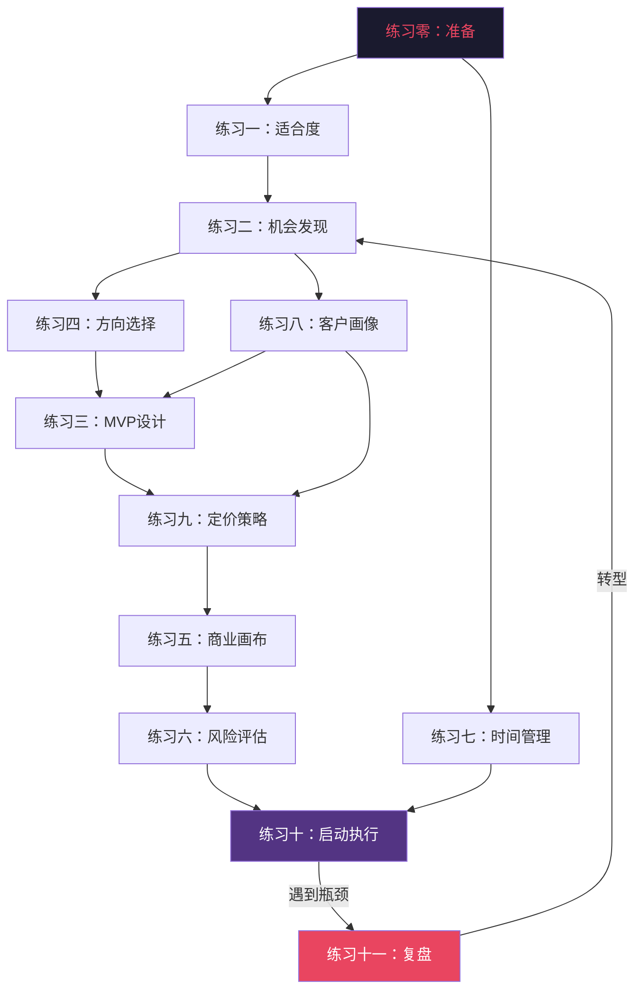

**关键依赖说明**：
- 练习二的**痛点数据**是练习四、练习八的输入
- 练习八的**客户画像**是练习三（MVP设计）和练习九（定价）的输入
- 练习九的**定价方案**是练习五（商业画布）中"收入来源"要素的输入
- 练习七的**时间安排**是练习十（30天执行计划）的基础
- 练习十一可以**回流**到练习二，形成闭环

### 核心工具速查表

所有练习中提到的工具，按用途分类汇总：

| 用途 | 推荐工具 | 成本 | 用于哪些练习 |
|------|----------|------|-------------|
| **笔记与记录** | Notion / 飞书文档 / 印象笔记 | 免费 | 全部 |
| **电子表格** | 腾讯文档 / Google Sheets / WPS | 免费 | 练习一(评分)、练习二(痛点评分)、练习九(定价测算) |
| **思维导图** | XMind / ProcessOn / 幕布 | 免费版够用 | 练习四(三环分析)、练习五(商业画布) |
| **原型设计** | 墨刀 / Figma / 纸笔 | 免费版够用 | 练习三(MVP原型) |
| **问卷调查** | 腾讯问卷 / 金数据 / 问卷星 | 免费 | 练习二(需求验证)、练习八(用户调研) |
| **落地页搭建** | 上线了 / Notion / Framer | 免费-200元/年 | 练习三(落地页MVP) |
| **支付收款** | 微信支付商户码 / 支付宝收款 | 0.6%手续费 | 练习三(预售)、练习十(正式收款) |
| **AI文案** | ChatGPT / Claude / Kimi | 免费-20美元/月 | 练习三(落地页文案)、练习八(访谈提纲)、练习九(定价分析) |
| **AI原型** | Cursor / Bolt / v0 | 免费-20美元/月 | 练习三(快速搭建MVP) |
| **AI客服** | Coze / Dify / FastGPT | 免费-100美元/月 | 练习十(自动化客服) |
| **时间管理** | 滴答清单 / Forest / Toggl | 免费-98元/年 | 练习七(时间审计与执行) |
| **内容发布** | 小红书 / 公众号 / 知乎 / B站 | 免费 | 练习八(获客)、练习十(冷启动) |
| **数据分析** | 各平台后台 / Google Analytics | 免费 | 练习八(漏斗分析)、练习十(数据复盘) |

### 各练习核心验证标准速查表

这张表帮你快速判断每个练习是否"达标"——不用翻回去重读全文：

| 练习 | 核心验证标准 | 达标线 | 未达标怎么办 |
|------|-------------|--------|-------------|
| 练习零：准备 | 工具就绪+心态转变+找到搭档 | 3项全完成 | 缺任何一项都先补齐 |
| 练习一：适合度 | 素质+外部条件+心理三维评分 | 素质≥50或外部≥35 | 制定3-6个月提升计划再启动 |
| 练习二：机会发现 | 痛点评分+竞品分析+用户访谈+付费验证 | TOP1机会评分≥15/25且3人付费 | 换角度重新收集痛点 |
| 练习三：MVP | 核心假设验证+用户实际使用 | ≥5人付费或满意度≥8分 | 换MVP形态重新验证同一假设 |
| 练习四：方向选择 | 三环分析+90天行动计划 | 三环总分≥20/30 | 降低热情分要求，从擅长+需求出发 |
| 练习五：商业画布 | 九要素自洽+关键假设验证 | 无逻辑矛盾且核心假设已验证 | 重新审视价值主张与客户细分的匹配 |
| 练习六：风险评估 | 风险识别+应对方案+止损线 | 无极高风险项(≥80)且止损线已设定 | 降低投入规模直到风险可控 |
| 练习七：时间管理 | 时间审计+边界规则+周复盘 | 每周副业投入≥10小时且不伤主业 | 砍掉低价值任务，聚焦核心动作 |
| 练习八：客户画像 | 3个画像+获客漏斗+首月行动 | 至少1个渠道日均≥5个精准用户 | 换渠道或调整价值主张 |
| 练习九：定价策略 | 成本核算+阶梯定价+价格测试 | 有效时薪≥主业时薪50% | 优化交付效率或调整定价策略 |
| 练习十：启动执行 | 30天四阶段完整执行 | 月底有≥1个付费用户 | 回到练习二/八重新验证 |
| 练习十一：失败复盘 | 失败类型判断+根因分析+决策 | 做出明确的坚持/转型/退出决策 | 不要搁置，必须做出选择 |

### 练习清单

| 序号 | 练习 | 预计时间 | 难度 | 完成状态 |
|------|------|----------|------|----------|
| 0 | 开始之前的准备工作 | 30分钟 | ★☆☆ | □ |
| 1 | 创业适合度自测 | 30分钟 | ★★☆ | □ |
| 2 | 商业机会发现 | 2周 | ★★★ | □ |
| 3 | MVP设计 | 1-2小时 | ★★★ | □ |
| 4 | 副业方向选择 | 1小时 | ★★☆ | □ |
| 5 | 商业模式画布 | 1-2小时 | ★★★★ | □ |
| 6 | 风险评估 | 1小时 | ★★★ | □ |
| 7 | 时间管理 | 30分钟 | ★★☆ | □ |
| 8 | 客户画像与获客 | 1小时 | ★★★ | □ |
| 9 | 定价策略设计 | 30分钟 | ★★★ | □ |
| 10 | 启动清单与首月执行 | 30天持续 | ★★★ | □ |
| 11 | 失败复盘与转型决策 | 2小时 | ★★★★ | □ |

### 推荐执行顺序

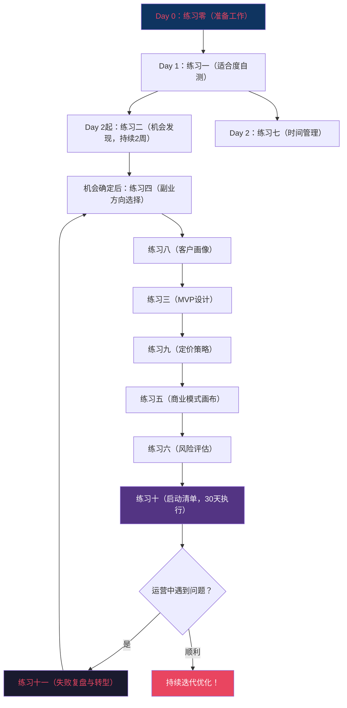

**执行节奏建议**：不要一口气做完所有练习。建议按以下节奏：

| 阶段 | 时间 | 练习内容 | 说明 |
|------|------|----------|------|
| 准备期 | Day 0 | 练习零（准备工作） | 30分钟搞定工具和搭档 |
| 自评期 | Day 1 | 练习一（适合度自测） | 得分太低就先提升能力再启动 |
| 发现阶段 | Day 1-14 | 练习二（机会发现）+ 练习七（时间管理） | 同步进行，利用2周时间收集痛点 |
| 策划期 | Day 15-21 | 练习四→八→三→九 | 方向→客户→MVP→定价，快速迭代 |
| 验证期 | Day 22-28 | 练习五（商业模式）+ 练习六（风险评估） | 把商业逻辑和风险想清楚 |
| 执行期 | Day 29-58 | 练习十（启动清单，30天执行） | 真正动手，按日历推进 |
| 迭代期 | 持续 | 练习十一（按需） | 遇到瓶颈时使用，不必等到失败 |

### 从练习到执行的过渡

完成这些练习后，你已经有了一个清晰的方案。但从"方案"到"执行"之间，还有一个容易被忽视的环节：**心理过渡**。

**常见的"启动恐惧"及应对：**

| 恐惧 | 具体表现 | 应对策略 |
|------|----------|----------|
| "还没准备好" | 永远在完善方案，不愿开始 | 设定硬性截止日期："X月X日必须发布第一版" |
| "怕失败" | 担心投入后没有回报 | 想想最坏结果是什么？你能承受吗？ |
| "怕被人笑" | 担心朋友/同事知道后嘲笑 | 大多数人根本不在意你的事；在意的人不重要 |
| "完美主义" | 觉得产品还不够好 | MVP的定义就是"不完美但能验证" |
| "选择困难" | 方向太多不知选哪个 | 用三环分析的结果，选得分最高的那个，先做90天 |

**"5分钟启动法"**：如果你一直拖延启动，用这个方法——承诺只花5分钟做一件与副业相关的小事（比如注册一个账号、写一段介绍文案、发一条朋友圈）。5分钟后，你往往会继续做下去。启动的摩擦力是最大的，一旦动起来就容易了。

### 从副业到全职的决策框架

很多副业者会面临一个关键决策点：什么时候可以辞掉主业，全职做副业？这是一个高风险决策，需要系统化评估而非冲动行事。

**全职切换的"6个条件"——全部满足才能考虑：**

| 条件 | 具体标准 | 为什么重要 |
|------|----------|-----------|
| 收入稳定 | 副业月收入连续3个月≥主业月收入的80% | 不是偶尔一个月高收入，而是可持续的 |
| 增长趋势 | 收入仍在增长中（不是已经到顶） | 如果已经到顶，全职后也突破不了 |
| 现金储备 | 银行里有≥12个月生活费的现金储备 | 全职后收入波动更大，需要更厚的安全垫 |
| 家庭支持 | 家人理解并支持你的决定 | 家庭压力是副业转全职失败的第二大原因 |
| 退路可逆 | 主业关系保持良好，必要时可以回去 | 不要烧桥，留好退路 |
| 心理准备 | 你能承受3个月零收入的心理压力 | 全职创业的心理压力远大于副业 |

**全职切换的风险对冲策略：**

1. **先请假再辞职**：用年假/事假全职做副业1-2周，体验全职节奏后再做决定
2. **协商降薪留职**：和公司协商从全职改为兼职/远程，保留基本收入
3. **设置"回头线"**：如果全职后3个月内收入下降50%以上，立刻重新找工作
4. **不要在情绪高点做决定**：副业月入2万时觉得自己无所不能——等冷静一周再决定

### 持续优化框架

启动后的优化遵循"OODA循环"：

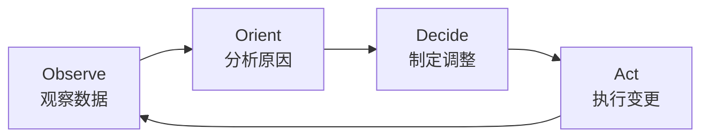

**每周复盘的5个核心问题：**
1. 本周最有价值的发现是什么？
2. 什么方法有效？什么方法无效？
3. 用户反馈中最常出现的是什么？
4. 下周最重要的3件事是什么？
5. 需要调整方向吗？（如果连续3周无进展，考虑调整）

### 进阶建议

完成这十二个练习后，你已经有了一个清晰的副业/创业行动方案。接下来需要从"方案制定者"转变为"执行者"。以下是分层次的进阶建议：

**第一层：立即行动（本周内）**

| 行动 | 具体做法 | 为什么重要 |
|------|----------|-----------|
| 设定"启动日" | 在日历上圈出一个具体日期，告诉搭档和朋友 | 有截止日期的计划完成率提高3倍 |
| 发布第一版 | 不管准备得如何，先发布一个最小化的版本 | 完美主义是创业最大的敌人 |
| 记录Day 1 | 拍照/截图/写日记，记录启动的第一天 | 未来回看时这是最珍贵的记忆 |

**第二层：习惯养成（前30天）**

| 习惯 | 频率 | 具体做法 |
|------|------|----------|
| 每日记录 | 每天5分钟 | 记录投入时间、完成内容、关键数据、今日学到的 |
| 每周复盘 | 每周日15分钟 | 回答5个核心问题（见"持续优化框架"） |
| 每月深度分析 | 每月最后一天1小时 | 分析收入、成本、转化率趋势，调整下月计划 |
| 持续学习 | 每周2-3小时 | 读一本相关书籍/文章、看一个行业案例、学一个新工具 |

**第三层：能力建设（前90天）**

| 能力 | 学习路径 | 推荐资源 |
|------|----------|----------|
| 内容营销 | 学习选题→标题→结构→发布→数据分析 | 《爆款文案》、生财有术社区 |
| 数据分析 | 学会看后台数据→建立指标体系→A/B测试思维 | Google Analytics免费课程 |
| 用户运营 | 学会建群→互动→转化→复购→裂变 | 《超级用户》、见实科技 |
| AI工具应用 | 掌握3-5个核心AI工具，提升工作效率 | 本章练习七的AI工具提效表 |

**第四层：规模化（6个月后）**

当副业月收入稳定在5000元以上时，开始思考规模化：

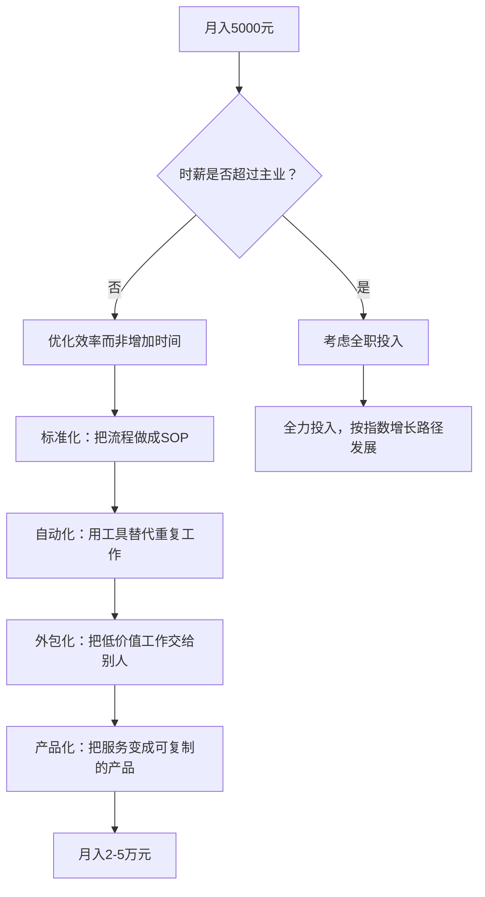

**推荐阅读书单**（按优先级排序）：

| 书名 | 作者 | 核心价值 | 适合阶段 |
|------|------|----------|----------|
| 《精益创业》 | Eric Ries | MVP、验证学习、转型方法论 | 练习二-三阶段 |
| 《从0到1》 | Peter Thiel | 垄断思维、创新本质 | 思维升级 |
| 《创业维艰》 | Ben Horowitz | 创业的真实困难和应对 | 心态准备 |
| 《商业模式新生代》 | Alexander Osterwalder | 商业模式画布详细指南 | 练习五阶段 |
| 《定位》 | Al Ries & Jack Trout | 品牌定位和心智占领 | 练习八阶段 |
| 《影响力》 | Robert Cialdini | 说服心理学、营销基础 | 练习九阶段 |
| 《纳瓦尔宝典》 | Eric Jorgenson | 杠杆思维、财富创造的底层逻辑 | 全局思维升级 |
| 《一人企业》 | Paul Jarvis | 一人公司运营方法论 | 副业/独立开发者 |
| 《增长黑客》 | 范冰 | 数据驱动增长方法论 | 规模化阶段 |
| 《俞军产品方法论》 | 俞军 | 用户价值和产品决策 | 产品优化阶段 |

**推荐工具和社区**：

| 资源 | 类型 | 用途 | 链接方式 |
|------|------|------|----------|
| ProductHunt | 产品发现 | 了解全球新产品趋势 | producthunt.com |
| 即刻App | 社区 | 国内创业/独立开发者社区 | 搜索"创业"、"副业"话题 |
| V2EX | 论坛 | 技术人创业讨论 | v2ex.com |
| IndieHackers | 社区 | 海外独立开发者收入公开案例 | indiehackers.com |
| 少数派 | 内容 | 工具推荐和效率方法论 | sspai.com |
| 生财有术 | 社区 | 国内副业/创业实战社区（付费） | shengcaiyoushu.com |
| 36氪 | 媒体 | 行业趋势和商业模式分析 | 36kr.com |

### 常见问题FAQ

**Q1：我应该辞职全职创业还是先做副业？**
A：永远先做副业。用副业验证方向可行性，等到副业收入连续3个月达到主业收入的80%以上，再考虑辞职。辞职创业的心理压力会严重影响决策质量。

**Q2：副业和主业冲突怎么办？**
A：遵守三条底线——不用公司时间、不用公司资源、不做直接竞争业务。在时间管理上（练习七），优先保护主业的精力和时间。

**Q3：做了3个月还没有收入，正常吗？**
A：完全正常。大多数副业的冷启动期是3-6个月。关键是看趋势而非绝对值——关注者是否在增长？内容质量是否在提升？用户反馈是否在变好？如果3个月后指标没有任何正向变化，回到练习十一做复盘。

**Q4：我有好几个想法，应该做哪个？**
A：用练习四的三环分析（擅长度×市场需求×热情度）打分，选得分最高的那个，先做90天。90天后如果验证失败，再切换到第二名。同时做多个方向是大忌。

**Q5：怎么判断应该坚持还是放弃？**
A：看三个信号：①核心假设已被证伪（需求不存在）→ 放弃；②方向正确但执行有问题 → 调整执行方式；③外部环境发生重大变化 → 降低投入等待时机。详细判断框架见练习十一。

**Q6：副业需要注册公司吗？**
A：初期不需要。月收入在10万以下可以不注册（小规模纳税人免增值税政策）。当收入稳定且需要开发票时，注册个体工商户（线上免费办理）。公司制（有限公司）等到需要融资、雇人或签合同时再考虑。

**Q7：如何保护自己的副业不被抄袭？**
A：速度就是最好的护城河。先跑起来，建立用户基础和口碑，后来者即使抄你的模式也需要时间追赶。同时注意：核心方法论不要完全公开，保留关键环节的know-how。

**Q8：副业做到什么程度可以考虑全职？**
A：满足以下条件中的至少3个：①副业收入连续3个月≥主业收入80%；②有6个月以上的生活储备金；③已有稳定客户/用户群；④增长趋势明确且可预测；⑤家人理解和支持。

### 创业后的心态管理

启动后的前3个月是心态最容易崩溃的时期。以下是创业者最常见的心理挑战和应对策略：

| 心理挑战 | 具体表现 | 发生频率 | 应对策略 |
|----------|----------|----------|----------|
| **冒名顶替综合征** | "我不够格做这个"、"别人比我专业多了" | 几乎所有新手 | 记住：你不需要是世界最好的，只需要比你的客户多走一步 |
| **比较焦虑** | "XX比我晚开始但做得更好" | 高频 | 拉黑比较对象（字面意义上的），只和昨天的自己比 |
| **数据焦虑** | 每小时刷一次后台数据 | 高频 | 设定固定看数据的时间（每天1次、每周1次深度分析） |
| **第一差评的打击** | 收到第一个负面评价后想放弃 | 必然发生 | 把差评当作免费的用户调研，提取有用信息，忽略情绪攻击 |
| **收入波动焦虑** | 这个月赚了5000，下个月只有1000 | 常见 | 副业初期收入波动是正常的，看3个月的移动平均而非单月 |
| **精力耗竭** | 主业+副业双重压力导致疲惫 | 中后期 | 回到练习七，检查是否违反了边界规则，必要时降低副业投入强度 |
| **孤独感** | 没有人理解你在做什么 | 常见 | 找到创业社群或搭档（练习零已教你如何找） |
| **成功恐惧** | 业务增长太快，担心自己handle不住 | 较少见 | 这是好问题——开始考虑外包和团队建设 |

**每周心态检查清单**（花5分钟回答）：
1. 这周我最大的成就是什么？（哪怕很小）
2. 这周我学到的最重要的一件事是什么？
3. 我的身体状态如何？（睡眠、运动、饮食）
4. 我有没有违反自己设定的边界规则？
5. 下周我最期待的是什么？

### 副业财务管理基础

大多数副业者忽视财务管理，直到税务申报时才发现问题。以下是必须掌握的基础知识：

**收支记录模板**：

```text
月度收支记录
月份：____年____月

═══ 收入 ═══
| 日期 | 来源 | 金额 | 备注 |
|------|------|------|------|
| | | | |
| **合计** | | **____元** | |

═══ 支出 ═══
| 日期 | 项目 | 金额 | 类型 | 发票？ |
|------|------|------|------|--------|
| | | | 固定/可变 | 有/无 |
| **合计** | | **____元** | | |

═══ 月度总结 ═══
总收入：____元
总支出：____元
净利润：____元
利润率：____%
有效时薪：____元（净利润÷投入小时数）
```

**副业者必须知道的税务知识**：

| 收入类型 | 税务处理 | 税率 | 注意事项 |
|----------|----------|------|----------|
| 个人劳务报酬 | 按次预扣预缴，年度汇算清缴 | 20%-40%预扣，综合所得3%-45% | 单次800元以下免税 |
| 个体工商户经营所得 | 按季预缴，年度汇算清缴 | 5%-35%超额累进 | 年收入120万以下实际税负很低 |
| 稿酬所得 | 按次预扣预缴 | 享70%优惠税率 | 写作、内容创作类 |
| 平台佣金/推广收入 | 平台代扣代缴 | 视具体平台政策 | 淘宝客、抖音带货等 |

**关键提醒**：
- 年综合收入超过12万元必须进行年度汇算清缴（次年3-6月）
- 保留所有收入凭证和支出发票，至少保存5年
- 个体工商户可以开具发票，客户更信任
- 副业亏损可以抵扣其他收入的应纳税额（仅限经营所得）
- 如果不确定怎么处理，花200-500元咨询一次专业会计师，这是最值得的投资

**副业财务健康自检清单（每月1次，5分钟）：**

每月月底花5分钟回答以下问题，能帮你提前发现财务问题：

| 检查项 | 健康标准 | 你的数据 | 是否达标 |
|--------|----------|---------|----------|
| 本月利润率 | ≥30%（服务类）/ ≥15%（电商类） | ____% | □ |
| 有效时薪 | ≥主业时薪的50% | ____元/小时 | □ |
| 现金储备 | ≥3个月生活费 | ____元 | □ |
| 获客成本回收期 | ≤3个月 | ____个月 | □ |
| 收入来源多样性 | ≥2个独立收入来源 | ____个 | □ |
| 应收账款 | 无超过30天的未收款 | ____元 | □ |

**如果连续2个月有3项以上不达标**：暂停扩张，回到练习五（商业模式画布）和练习六（风险评估）重新审视商业逻辑。问题可能不在执行层面，而在商业模式本身。

### 副业收入增长预期

很多人对副业收入的期望值和现实严重脱节——要么以为一个月就能赚到钱，要么以为永远赚不到钱。以下是基于数百个副业案例（含即刻、V2EX、IndieHackers公开数据）总结的收入增长预期。注意：这是"执行得不错"情况下的中位数水平，不是最差也不是最好。

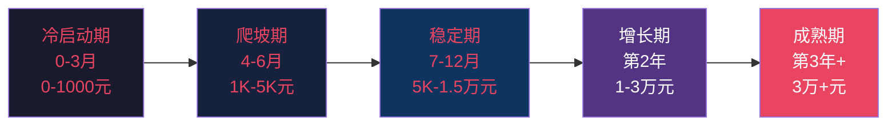

| 阶段 | 时间 | 典型月收入 | 有效时薪 | 核心任务 |
|------|------|-----------|----------|----------|
| 冷启动期 | 第1-3个月 | 0-1000元 | 0-20元 | 验证方向、积累内容、获取首批用户 |
| 爬坡期 | 第4-6个月 | 1000-5000元 | 30-80元 | 优化转化、建立复购、找到增长引擎 |
| 稳定期 | 第7-12个月 | 5000-15000元 | 80-200元 | 标准化流程、部分外包、扩大规模 |
| 增长期 | 第2年 | 10000-30000元 | 200-500元 | 产品矩阵、团队化、品牌化 |
| 成熟期 | 第3年+ | 30000元以上 | 500元以上 | 资产化运营、被动收入占比提升 |

**关键认知**：
- 前3个月大概率不赚钱，这很正常，不要因此放弃
- 月入5000元是第一个重要门槛，突破后信心会大幅提升
- 有效时薪（月收入÷月投入时间）比月收入更重要——如果时薪低于主业，说明效率有问题
- 收入增长不是线性的，通常是阶梯式跳涨（积累期→爆发期→再积累→再爆发）

> **最后提醒**：这些练习不是一次性作业。每次有新想法、遇到瓶颈、或者需要调整方向时，都可以重新走一遍相关练习。把它们当作你的"创业工具箱"，随时取用。创业是一场马拉松，不是百米冲刺。系统化的练习让你跑得更稳、更远。现在，翻回练习零，开始吧。
